# GoMAvatar: Efficient Animatable Human Modeling from Monocular Video Using Gaussians-on-Mesh

Jing Wen Xiaoming Zhao Zhongzheng Ren Alexander G. Schwing Shenlong Wang University of Illinois Urbana-Champaign

jw116, xz23, zr5, aschwing, shenlong @illinois.edu

https://wenj.github.io/GoMAvatar/

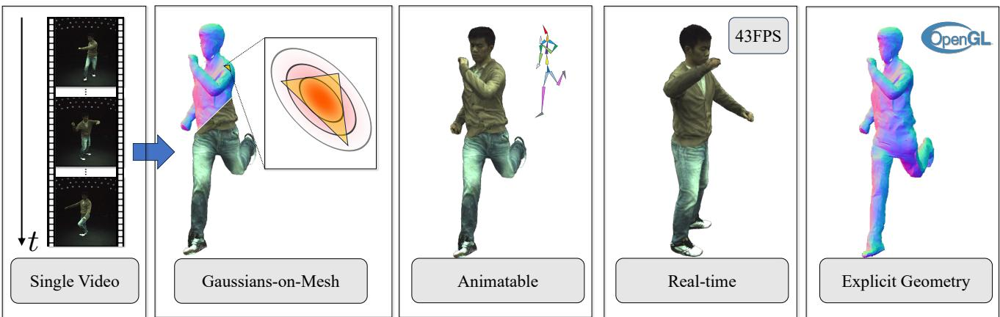  
Figure 1. GoMAvatar takes a monocular RGB video (left) as input to establish an explicit and accurate 4D representation of a dynamic human. It can render efficiently at novel views and poses with state-of-the-art quality. Additionally, it is extremely compact (3.63 MB pe subject), efficient (43 FPS), and seamlessly compatible with the graphics pipeline such as OpenGL.

## Abstract

We introduce GoMAvatar, a novel approach for realtime, memory-efficient, high-quality animatable human modeling. GoMAvatar takes as input a single monocular video to create a digital avatar capable of re-articulation in new poses and real-time rendering from novel viewpoints, while seamlessly integrating with rasterizationbased graphics pipelines. Central to our method is the Gaussians-on-Mesh (GoM) representation, a hybrid 3D model combining rendering quality and speed of Gaussian splatting with geometry modeling and compatibility of deformable meshes. We assess GoMAvatar on ZJU-MoCap, PeopleSnapshot, and various YouTube videos. GoMAvatar matches or surpasses current monocular human modeling algorithms in rendering quality and significantly outperforms them in computational efficiency (43 FPS) while being memory-efficient (3.63 MB per subject).

## 1. Introduction

High-fidelity, animatable digital avatar modeling is crucial for various applications such as movie making, healthcare,

AR/VR, and simulation. Conventional approaches carried out in Motion Capture (MoCap) studios are slow, expensive, and cumbersome, due to costly wearable devices [42, 52] and intricate multi-view camera systems [28, 74]. Hence, to enable widespread personal use, affordable methods which only rely on monocular RGB videos for creating digital avatars are much desired.

Reconstruction of digital humans from monocular videos has been studied intensively recently [16, 25, 64, 70, 81]. The key lies in choosing a suitable 3D representation, flexible for articulation, efficient for rendering and storage, and capable of modeling high-quality geometry and appearance all while being easily integrated into graphics pipelines. Despite various proposals, no animated 3D representation has met all these needs. Neural fields based avatars [16, 27, 70, 81] offer photorealism, but they are challenging to articulate and lack explicit geometry, making them less compatible with game engines. Mesh-based methods [58] excel in articulation and rendering but fall short in modeling topological changes and high-quality appearance. Point-based methods [88] are limited by incomplete topology and surface geometry. Recent successes of Gaussian splatting in neural rendering motivate extensions to free-form dynamic scenes [73], but a knowledge gap exists in how to leverage Gaussiansfor articulatable humans. Besides, the lack of explicit surface modeling of Gaussian splats hinders their broader use in digital avatar modeling.

To address these challenges, we present GoMAvatar, a novel digital avatar modeling framework. GoMAvatar operates on a single monocular video and yields an articulated character that encodes high-fidelity appearance and geometry. It is both articulable and memory-efficient, rendering in real-time (see Fig. 1). Central to the framework is a novel articulated human representation, which we refer to as Gaussians-on-Mesh (GoM) (Sec. 3.1). GoM combines rendering quality and speed of Gaussian splatting with geometry modeling and compatibility of deformable meshes. Specifically, GoM employs Gaussian splats for rendering, offering flexibility in modeling rich appearances and enabling real-time performance (Sec. 3.2). GoM utilizes a skeleton-driven deformable mesh, enabling the creation of compact, topologically complete digital avatars, while easing mesh articulation through forward kinematics (Sec. 3.3). Crucially, to integrate both representations, we attach a Gaussian to each mesh face. This method differs from traditional mesh techniques that rely on texturing or vertex coloring to enhance rendering. It also differs from standard freeform Gaussian splats, thereby better regularizing Gaussians for novel poses. Furthermore, to tackle view dependency, we factorize the final RGB color into a pseudo albedo map rendering and a pseudo shading map prediction. This entire representation can be inferred from a single input video without additional training data (Sec. 3.5). We find this dual representation to balance performance and efficiency effectively. Importantly, the entire animation and rendering of GoM are fully compatible with graphics engines, such as OpenGL.

We conducted extensive experiments on the ZJU-MoCap data [54], PeopleSnapshot [1] and YouTube videos. Go-MAvatar matches or surpasses the rendering quality of the best monocular human modeling algorithms (GoMAvatar reaches 30.37 dB PSNR in novel view synthesis and 30.31 dB PSNR in novel pose synthesis). Meanwhile, it is faster than competing algorithms, reaching a rendering speed of 43 FPS on an NVIDIA A100 GPU and remains compact in memory, only costing 3.63 MB per subject (Fig. 2). To summarize, our main contributions are:

• We introduce the Gaussians-on-Mesh representation for efficient, high-fidelity articulated human reconstruction from a single video, combining Gaussian splats with deformable meshes for real-time, free-viewpoint rendering.

• We design a unique differentiable shading module for view dependency, splitting color into a pseudo albedo map from Gaussian splatting and a pseudo shading map derived from the normal map.

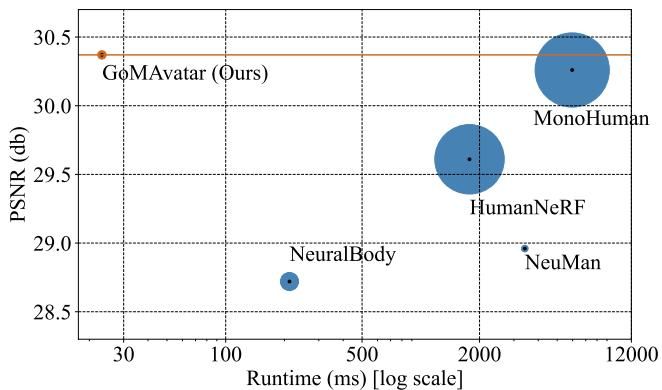  
Figure 2. Our approach is simultaneously faster (represented by x coordinates of circle centers , smaller is better), memoryefficient (represented by circle size, smaller is better), and renders at a higher quality (represented by y coordinates of circle centers, higher is better). The horizontal brown line denotes our PSNR.

## 2. Related Work

Representations for novel view synthesis. Several representations have been proposed for the task of novel view synthesis, such as light fields [3, 17, 36], layered representations [61, 62, 71, 90], voxels [41, 63], and meshes [18, 23]. Recently, several works also demonstrated the effectiveness of an implicit representation, i.e., a neural network, for a scene [12, 47, 51]. Further, neural radiance fields (NeRFs) [49] utilize a volume rendering equation [29] to optimize the implicit representation, yielding high-quality view synthesis. Follow-up works further improve and demonstrate compelling rendering results [4–6, 46, 57, 67, 82]. Meanwhile, other works use volume rendering equations to optimize more explicit representations [7, 50, 80], largely accelerating the optimization procedure. Pointbased rendering (e.g., Gaussian splatting [30, 45, 72]) has recently been adopted for fast rendering. It models the scenes as a set of 3D Gaussians, each equipped with rotation, scale, and appearance-related features, and rasterizes by projecting the 3D Gaussians to the 2D image plane. To model dynamic scenes, [45, 72] further extend the 3D Gaussians, adding a time dependency. To regularize the 3D Gaussians through time, [45] adds physically-based priors during training, and [72] uses a neural network to predict the deformation of Gaussians. Our approach is inspired by the recent progress of point-based rendering to facilitate fast rendering. More concretely, we also use Gaussian splatting for rendering. However, different from previous approaches, we propose the Gaussians-on-Mesh representation that combines 3D Gaussians with a mesh representation. By doing so, we obtain fast rendering speed as well as regularized deformation of 3D Gaussians.

Human modeling. Early works to model humans rely on templates, e.g., SCAPE [2] and SMPL [43]. Later, [56, 59, 60, 86] utilize (pixel-aligned) image features to reconstruct human geometry and appearance from a single image. However, such human modeling is not animatable. ARCH [19, 76] and S3 [77] incorporate reanimation capabilities but they fall short in delivering high-quality rendering. Recently, efforts on human geometry modeling exploit implicit representations [10, 11, 24, 48, 66]. Their use of 3D scans also limits their application. To address this limitation, human modeling from videos has received a lot of attention from the community: many prior efforts utilize implicit representations and differentiable renderers for either non-animatable [54] or animatable [16, 22, 25, 37, 39, 53, 55, 64, 69, 70, 75, 81, 83, 89] scene-specific human modeling while other efforts focus on scene-agnostic modeling [9, 14, 21, 31, 34, 35, 56, 85, 87]. In this study, our approach focuses on scene-specific modeling following prior works. Different from the common pure implicit representations, we utilize an explicit representation termed Gaussians-on-Mesh. The explicit canonical geometry enables us to apply well-defined forward kinematics, such as linear blend skinning, to transform from the canonical space to the observation space. In contrast, methods using implicit representations can only perform mapping in a backward manner, i.e., from the observation space to the canonical space, which is inherently ill-posed and ambiguous.

Real-time rendering of animatable human modeling. The key to real-time rendering in our approach is the codesign of an explicit geometry representation and rasterization: Gaussian splatting and mesh rasterization are faster than volume rendering in general. This principle has been explored by prior efforts to accelerate the rendering of general-purpose NeRFs. Representative approaches propose to either bake [20, 78, 79] or cache [15] the trained implicit representation. Another line of work exploits meshbased rasterization to boost the inference speed [13, 38, 78]. Inspired by the success, concurrent works explore efficient NeRF rendering for humans [16, 58]. Note, [58] firstly trains a NeRF representation and then bakes it into a mesh for real-time rendering. However, the second baking stage is shown to harm the rendering quality. In contrast, the proposed Gaussians-on-Mesh representation is trained end-toend, achieving a superior quality-speed trade-off.

## 3. Gaussians-on-Mesh (GoM)

In the following, we present the Gaussians-on-Mesh (GoM) representation, how to render it, and its articulation. The goal of the proposed representation is to combine the benefits of both Gaussian splatting and meshes while alleviating some of their individual shortcomings. Concretely, by using Gaussian splatting, we attain a high-quality real-time rendering capability, achieving 43 FPS. By utilizing a mesh, we conduct effective articulation in a forward manner while also regularizing the underlying geometry.

Overview. Given a monocular video capturing a human subject of interest, we aim to learn a canonical Gaussianson-Mesh representation GoMc such that we can render that human in real-time given any camera intrinsics $K \in \mathbb { R } ^ { 3 \times 3 }$ extrinsics $E \in S E ( 3 )$ , and a human pose P. Note, here and below, parameters ✓ indicate that the corresponding function or variable is learnable and superscript c indicates the canonical pose space. To render, we first articulate GoMc to the observation space to obtain

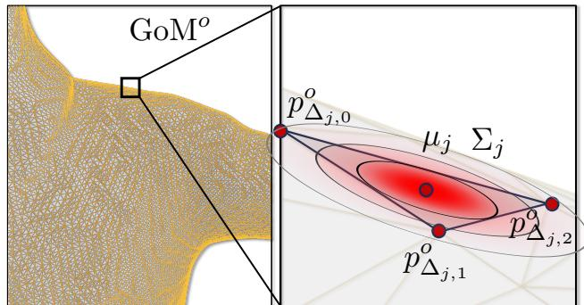  
Figure 3. Gaussians-on-Mesh (GoM). We learn Gaussians in the local coordinates of each triangle and transform them to the world coordinate based on the triangle’s shape. We initialize the rotation $r _ { \theta , j } \in s o ( 3 )$ to zeros and scale $s _ { \theta , j } \in \mathbb { R } ^ { 3 }$ to ones so that we start with a Gaussian that’s thin along the normal axis of the triangle. Meanwhile, the projection of the ellipsoid $\{ x : ( x - \mu _ { j } ) ^ { T } \Sigma _ { j } ^ { - 1 } ( x -$ $\mu _ { j } ) = 1 \}$ on the triangle recovers the Steiner ellipse. See Sec. 3.1 and the appendix for details.

$$
\operatorname { G o M } ^ { o } = \operatorname { \mathbb { A } } \operatorname { r t i c u l a t o r } _ { \theta } \left( \operatorname { G o M } _ { \theta } ^ { c } , P \right) ,\tag{1}
$$

where GoMo denotes the Gaussians-on-Mesh representation in the observation space. To obtain a rendering with resolution $H \times W$ , we formulate a neural renderer to yield the human appearance $I \in \mathbb { R } ^ { H \times W \times 3 }$ and the alpha mask $M \in \mathbb { R } ^ { H \times W \times 1 }$ . Formally,

$$
\left( I , M \right) = \mathrm { R e n d e r e r } _ { \theta } \left( K , E , { \bf G o M } ^ { o } \right) .\tag{2}
$$

The final rendering is obtained from a classical alphacomposition based on I and M. We will first discuss the details of the Gaussians-on-Mesh human representation in Sec. 3.1 and the rendering pipeline in Sec. 3.2. Then we introduce how to articulate the Gaussians-on-Mesh representation in Sec. 3.3.

## 3.1. Gaussians-on-Mesh Representation

The core of our approach is the Gaussians-on-Mesh (GoM) representation in the canonical space. The design of the representation is motivated by the following two key considerations: 1) GoM can be rendered efficiently through Gaussian splatting [30] which eliminates the need of dense samples along rays used in volume rendering; 2) By attaching Gaussians to a mesh, we effectively adapt the shapes of Gaussians to different human poses and enable regularization.

Formally, our canonical Gaussians-on-Mesh representation is specified via a collection of points and faces with associated attributes:

$$
\mathbf { G o M } _ { \boldsymbol { \theta } } ^ { c } \triangleq \{ \{ v _ { \boldsymbol { \theta } , i } ^ { c } \} _ { i = 1 } ^ { V } , \{ f _ { \boldsymbol { \theta } , j } \} _ { j = 1 } ^ { F } \} .\tag{3}
$$

Here, $\{ v _ { \theta , i } ^ { c } \} _ { i = 1 } ^ { V }$ and $\{ f _ { \theta , j } \} _ { j = 1 } ^ { F }$ represent V vertices and $F$ triangle faces along with their related attributes respectively. We further define a vertex as

$$
\begin{array} { r } { v _ { \theta , i } ^ { c } = ( p _ { \theta , i } ^ { c } , w _ { i } ) , } \end{array}\tag{4}
$$

where $p _ { \theta , i } ^ { c } \in \mathbb { R } ^ { 3 }$ is the vertex coordinate and $w _ { i } \in \mathbb { R } ^ { J }$ refers to the linear blend skinning weights with respect to J joints. We define the face as

$$
f _ { \theta , j } = ( r _ { \theta , j } , s _ { \theta , j } , c _ { \theta , j } , \{ \Delta _ { j , k } \} _ { k = 1 } ^ { 3 } ) .\tag{5}
$$

$r _ { \theta , j } ~ \in ~ s o ( 3 )$ and $s _ { \theta , j } \in \mathbb { R } ^ { 3 }$ define the rotation and scale of the local Gaussian associated with a face. Further, $c _ { \theta , j } ~ \in ~ \mathbb { R } ^ { 3 }$ is the color vector. $\{ \Delta _ { j , k } \} _ { k = 1 } ^ { 3 }$ are the indices of the three vertices belonging to the j-th face, where $\Delta _ { j , k } \in \{ 1 , \ldots , V \}$ . Note that we associate Gaussian parameters with faces. We will delve into the derivation of the Gaussian distributions in the world coordinates for rendering in the following section.

## 3.2. Rendering

In contrast to directly computing the final color as done by prior monocular human rendering works [70, 81], rendering of the Gaussians-on-Mesh representation decomposes the RGB image I into the pseudo albedo map $I _ { \mathrm { G S } }$ and the pseudo shading map S, i.e., the final image I is given by

$$
I = I _ { \mathrm { G S } } \cdot S .\tag{6}
$$

Here, $I _ { \mathrm { G S } }$ is rendered by Gaussian splatting and S is predicted from the normal map obtained from mesh rasterization. We find this combination of Gaussian splatting and mesh rasterization to better capture view-dependent shading effects than each individual approach while retaining efficiency. We use ‘pseudo’ because the decomposition is not perfect. Even though, we will show that the pseudo shading map encodes lighting effects to some extent.

We emphasize that rendering operates on the GoM representation in the observation space (see Eq. (2)), i.e., on

$$
\mathrm { G o M } ^ { o } \triangleq \{ \{ ( p _ { i } ^ { o } , w _ { i } ) \} _ { i = 1 } ^ { V } , \{ ( r _ { \theta , j } , s _ { \theta , j } , c _ { \theta , j } ) \} _ { j = 1 } ^ { F } \} .\tag{7}
$$

Note, the only difference between GoMo and $\operatorname { G o M } _ { \boldsymbol { \theta } } ^ { c }$ defined in Eq. (3) is the use of observation space vertex coordinates $p _ { i } ^ { o }$ . Sec. 3.3 will provide more details about how to compute $p _ { i } ^ { o }$ from the vertex coordinates in canonical space $p _ { \theta , i } ^ { c }$

In greater detail, Gaussian splatting is used to render the pseudo albedo map $I _ { \mathrm { G S } }$ , specified in Eq. (6), and the subject mask M, specified in Eq. (2). To obtain the pseudo shading map S, specified in Eq. (6), we use the normal map $N _ { \mathrm { m e s h } }$ obtained via standard mesh rasterization. During training, we also use the subject mask $M _ { \mathrm { m e s h } }$ which is obtained through the SoftRasterizer [40]. We now discuss the computation of $I _ { \mathrm { G S } }$ and S.

Pseudo albedo map $I _ { \mathbf G \mathbf S }$ rendering. We render $I _ { \mathrm { G S } }$ and M with Gaussian splatting given $F$ Gaussians in the world coordinate system $\mathsf { \bar { \{ G _ { j } } }  \triangleq \mathsf { N } ( \mu _ { j } , \Sigma _ { j } ) \} _ { j = 1 } ^ { F }$ and the corresponding colors $\{ c _ { \theta , j } \} _ { j = 1 } ^ { F }$ which are defined in $\operatorname { E q . } \left( 5 \right)$ . F indicates the number of faces.

Importantly, different from the original 3D Gaussian splatting that directly learns Gaussian parameters within the world coordinate system, we acquire these parameters within the local coordinate frame of each triangle face. Subsequently, we transform these local Gaussians into the world coordinate system, taking into account the deformations of the individual faces. This distinctive formulation allows our Gaussian representation to dynamically adapt to the varying shapes of triangles, which can change across different human poses due to articulation. Concretely, given a face and its local parameters $f _ { \theta , j } ~ =$ $( r _ { \theta , j } , s _ { \theta , j } , c _ { \theta , j } , \{ \Delta _ { j , k } \} _ { k = 1 } ^ { 3 } )$ , the mean $\mu _ { j }$ of a Gaussian in world coordinates is the centroid of the face, i.e.,

$$
\mu _ { j } = \frac { 1 } { 3 } \sum _ { k = 1 } ^ { 3 } p _ { \Delta _ { j , k } } ^ { o } .\tag{8}
$$

$p _ { \Delta _ { j , k } } ^ { o }$ is the coordinate of the triangle’s vertex. The Gaussian’s covariance is

$$
\Sigma _ { j } = A _ { j } ( R _ { j } S _ { j } S _ { j } ^ { T } R _ { j } ^ { T } ) A _ { j } ^ { T } .\tag{9}
$$

$R _ { j }$ and $S _ { j }$ are the matrices encoding rotation ${ r _ { \theta , j } }$ and scale $s _ { \theta , j } . \ A _ { j }$ is the transformation matrix from local coordinates to world coordinates which is a function of the face vertices, i.e., $A _ { j } = T ( \{ p _ { \Delta _ { i . k } } ^ { o } \} _ { k = 1 } ^ { 3 } )$ . We provide a detailed derivation of $A _ { j }$ in the supplementary material. Through Eq. (8) and (9), Gaussians are dynamically adapted to the shapes of triangles of different human poses.

Pseudo shading map S prediction. For view-dependent shading effects, we predict the pseudo shading map from the mesh rasterized normal map $N _ { \mathrm { m e s h } }$ via

$$
\mathbb { R } ^ { H \times W \times 1 } \ni S = \mathtt { S h a d i n g } _ { \theta } \left( \gamma ( N _ { \mathrm { m e s h } } ) \right) .\tag{10}
$$

Here $\gamma ( \cdot )$ denotes the positional encoding [49]. Shading is a $1 \times 1$ convolutional network that maps each pixel to a scaling factor.

## 3.3. Articulation

Different from NeRF-based approaches [16, 70, 81] that require the ill-posed backward mapping from observation space to canonical space, our articulation follows the mesh’s forward articulation, i.e., from canonical space to observation space, taking advantage of our Gaussians-on-Mesh representation.

The goal of the articulator defined in Eq. (1) is to obtain the Gaussians-on-Mesh representation in observation space, i.e., GoMo (see Eq. (7)), given the canonical representation $\operatorname { G o M } _ { \boldsymbol { \theta } } ^ { c }$ and a human pose P. Note, we only transform $p _ { \theta , i } ^ { c }$ to $p _ { i } ^ { o }$ as all the other attributes are shared.

To transform, linear blend skinning (LBS) is applied to warp the vertices to the observation space. For posedependent non-rigid motion, we utilize a non-rigid motion module to deform the canonical vertices before applying LBS. We refer to the space after non-rigid deformation as ‘the non-rigidly transformed canonical space’.

Linear blend skinning. We adhere to the standard linear blend skinning for the transformation of vertices from the non-rigidly transformed canonical space into the observation space as $\mathbb { R } ^ { 3 } \ni p _ { i } ^ { 0 } =$

$$
\mathrm { L B S } \left( p _ { i } ^ { \mathrm { n r } } , w _ { i } , P \right) = \frac { \sum _ { j = 1 } ^ { J } w _ { i } ^ { j } ( R _ { j } ^ { p } p _ { i } ^ { \mathrm { n r } } + t _ { j } ^ { p } ) } { \sum _ { k = 1 } ^ { J } w _ { i } ^ { k } } .\tag{11}
$$

In this equation, the human pose $P = \{ ( R _ { j } ^ { p } , t _ { j } ^ { p } ) \} _ { j = 1 } ^ { J }$ is represented by the rotations and translations of J joints. Each vertex is associated with LBS weights denoted as $w _ { i }$ . And $p _ { i } ^ { \mathrm { n r } }$ represents the coordinates in the non-rigidly transformed canonical space, which we will elaborate on next.

Non-rigid deformation. To transform to the non-rigidly transformed canonical space, we model a pose-dependent non-rigid deformation before LBS. Specifically, we predict an offset and add it to the i-th canonical vertex, i.e.,

$$
p _ { i } ^ { \mathrm { n r } } = p _ { \theta , i } ^ { c } + \tt N R D e f o r m e r _ { \theta } \left( \gamma ( { p _ { \theta , i } ^ { c } } ) , P \right) .\tag{12}
$$

NRDeformer refers to an MLP network. $\gamma ( \cdot )$ denotes the sinusoidal positional encoding [49].

## 3.4. Pose Refinement

Human poses are typically estimated from the image and hence often inaccurate. Therefore, we follow Human-NeRF [70] to add a pose refinement module that learns to correct the estimated poses. Specifically, given a human pose $\hat { P } = \{ ( \hat { R } _ { j } ^ { p } , t _ { j } ^ { p } ) \} _ { j = 1 } ^ { j }$ estimated from a video frame, we predict a correction to the joint rotations via

$$
\{ \xi _ { j } \} _ { j = 1 } ^ { J } = \mathtt { P o s e R e f i n e r } _ { \theta } \left( \{ \hat { R } _ { j } ^ { p } \} _ { j = 1 } ^ { J } \right) .\tag{13}
$$

where $\xi _ { j } ~ \in ~ S O ( 3 )$ . We obtain the updated pose $P =$ $\begin{array} { r c l } { \{ ( R _ { j } ^ { p } , t _ { j } ^ { p } ) \} _ { j = 1 } ^ { J } } & { = } & { \{ ( \hat { R } _ { j } ^ { p } \ \cdot \ \xi _ { j } , t _ { j } ^ { p } ) \} _ { j = 1 } ^ { J } } \end{array}$ , which is used in Eq. (11) and (12).

It’s important to note that pose refinement occurs only during novel view synthesis and the training stage to compensate for the inaccuracies in pose estimation from the videos. It is not needed for animation.

## 3.5. Training

We supervise the predicted RGB image I and subject mask M with ground-truth $I _ { \mathrm { { g t } } }$ and $M _ { \mathrm { g t } }$ . Our overall loss is

$$
L = L _ { I } + \alpha _ { \mathrm { l p i p s } } L _ { \mathrm { l p i p s } } + \alpha _ { M } L _ { M } + \alpha _ { \mathrm { r e g } } L _ { \mathrm { r e g } } .\tag{14}
$$

Here, ↵ are weights for losses. $L _ { I }$ and $L _ { M }$ are the L1 loss on the RGB images and subject masks respectively. $L _ { \mathrm { l p i p s } }$ is the LPIPS loss [84] between predicted RGB image I and ground-truth $I _ { \mathrm { g t } } .$ . We add additional regularization on the underlying mesh via $L _ { \mathrm { r e g } } =$

$$
{ \cal L } _ { \mathrm { m a s k } } + \alpha _ { \mathrm { l a p } } { \cal L } _ { \mathrm { l a p } } + \alpha _ { \mathrm { n o r m a l } } { \cal L } _ { \mathrm { n o r m a l } } + \alpha _ { \mathrm { c o l o r } } { \cal L } _ { \mathrm { c o l o r } } .\tag{15}
$$

$L _ { \mathrm { m a s k } } = \lVert M _ { \mathrm { m e s h } } - M _ { \mathrm { g t } } \rVert$ is the regularization on the mesh silhouette. $\begin{array} { r } { L _ { \mathrm { l a p } } = \frac { 1 } { N } \sum _ { i = 1 } ^ { N } \| \delta _ { i } \| ^ { 2 } } \end{array}$ is the Laplacian smoothing loss, where $\delta _ { i }$ is the Laplacian coordinate of the i-th vertex. $L _ { \mathrm { n o r m a l } }$ is the normal consistency loss that maximizes the cosine similarity of adjacent face normals. Similar to the normal consistency, we apply a color smoothness loss denoted as $L _ { \mathrm { c o l o r } } .$ , which penalizes the differences in colors between two adjacent faces.

We initialize the vertices and faces with SMPL [43]. We initialize the ${ r _ { \theta , j } }$ and $s _ { \boldsymbol { \theta } , j }$ in Eq. (5) to zeros and ones respectively so that we start with a thin Gaussian whose variance in the face normal axis is small. Meanwhile, the projection of the ellipsoid $\{ x : ( x - \mu _ { j } ) ^ { T } \Sigma _ { i } ^ { - 1 } ( x - \mu _ { j } ) \stackrel { - } { = } 1 \}$ on the triangle recovers the Steiner ellipse (see Fig. 3). To enhance the details, we upsample the canonical GoMc using GoM subdivision during training. We first subdivide the underlying mesh by introducing new vertices at the center of each edge, followed by replacing each face with four smaller faces. The properties of each face, as described in Eq. (5), are duplicated across the newly generated faces.

## 4. Experiments

We evaluate GoMAvatar on the ZJU-MoCap dataset [54], the PeopleSnapshot dataset [1] and on YouTube videos, comparing with state-of-the-art human avatar modeling methods from monocular videos. We showcase our method’s rendering quality under novel views and poses, as well as its speed and geometry.

## 4.1. Experimental setup

Datasets. We validate our proposed approach on ZJU-MoCap [54] data, PeopleSnapshot [1] data and Youtube videos. ZJU-MoCap: The ZJU-MoCap dataset provides a comprehensive multi-camera, multi-subject benchmark for human rendering evaluation. It has 9 dynamic human videos captured by 21 synchronized cameras. In our paper, to ensure a fair comparison, we adhere to the training/test split in MonoHuman [81] and follow their monocular video human rendering setting. We validate our approach on six subjects (377, 386, 387, 392, 393, and 394) in the dataset. For each subject, the first 4/5 frames from Camera 0 are used for training. We use the corresponding frames in the remaining cameras to evaluate novel view synthesis, and the last 1/5 frames from all views to evaluate novel pose synthesis. PeopleSnapshot: The PeopleSnapshot dataset provides monocular videos where humans rotate in front of the cameras. We follow the evaluation protocol in InstantAvatar [26] to validate our approach. We report results averaged on four subjects (f3c, f4c, m3c, and m4c) and refine the test poses. Youtube videos: We qualitatively validate our approach on Youtube dancing videos used in HumanNeRF [70]. We generate the subject masks with MediaPipe [44], and the SMPL poses with PARE [33].

<table><tr><td rowspan="2"></td><td colspan="3">Novel view synthesis</td><td colspan="3">Novel pose synthesis</td><td rowspan="2">Inference time (ms) ↓</td><td rowspan="2">Memory (MB) ↓</td></tr><tr><td>PSNR ↑</td><td>SSIM↑</td><td>LPIPS*↓</td><td>PSNR ↑</td><td>SSIM↑</td><td>LPIPS*↓</td></tr><tr><td>Neural Body [54]</td><td>28.72</td><td>0.9611</td><td>52.25</td><td>28.54</td><td>0.9604</td><td>53.91</td><td>212.3</td><td>16.76</td></tr><tr><td>HumanNeRF [70]</td><td>29.61</td><td>0.9625</td><td>38.45</td><td>29.74</td><td>0.9655</td><td>34.79</td><td>1776.7</td><td>245.73</td></tr><tr><td>NeuMan [27]</td><td>28.96</td><td>0.9479</td><td>60.74</td><td>28.75</td><td>0.9406</td><td>62.35</td><td>3412.5</td><td>2.27</td></tr><tr><td>MonoHuman [81]</td><td>30.26</td><td>0.9692</td><td>30.92</td><td>30.05</td><td>0.9684</td><td>31.51</td><td>5970.0</td><td>280.67</td></tr><tr><td>Ours</td><td>30.37</td><td>0.9689</td><td>32.53</td><td>30.34</td><td>0.9688</td><td>32.39</td><td>23.2</td><td>3.63</td></tr></table>

Table 1. Quantitative results on ZJU-MoCap dataset. Our results generally provide the best (or second best) quality across both novel view and novel pose rendering while being the fastest and having the second smallest parameter size. ( best, second best)
<table><tr><td rowspan=1 colspan=1></td><td rowspan=1 colspan=1>CD↓</td><td rowspan=1 colspan=1>NC↑</td></tr><tr><td rowspan=2 colspan=1>Neural Body [54]HumanNeRF [70]</td><td rowspan=1 colspan=1>5.1473</td><td rowspan=1 colspan=1>0.4985</td></tr><tr><td rowspan=1 colspan=1>2.8029</td><td rowspan=1 colspan=1>0.5039</td></tr><tr><td rowspan=1 colspan=1>MonoHuman [81]</td><td rowspan=1 colspan=1>2.6303</td><td rowspan=1 colspan=1>0.5205</td></tr><tr><td rowspan=1 colspan=1>Ours</td><td rowspan=1 colspan=1>2.8364</td><td rowspan=1 colspan=1>0.6201</td></tr></table>

Table 2. Geometry quality evaluation. Our approach provides the best normal consistency across all methods, and MonoHuman achieves best quality in surface geometry. ( best, second best)
<table><tr><td rowspan=1 colspan=2></td><td rowspan=1 colspan=3>Novel view synthesisPSNR ↑ SSIM↑ LPIPS ↓</td><td rowspan=1 colspan=1>Inferencetime (ms) ↓</td></tr><tr><td rowspan=1 colspan=2>Anim-NeRF [8]</td><td rowspan=1 colspan=1>28.89</td><td rowspan=1 colspan=1>0.9682</td><td rowspan=1 colspan=1>0.0206</td><td rowspan=1 colspan=1>217.00</td></tr><tr><td rowspan=2 colspan=2>InstantAvatar [26]Ours</td><td rowspan=1 colspan=1>ntAvatar [26]</td><td rowspan=1 colspan=1>28.61</td><td rowspan=1 colspan=1>0.9698</td><td rowspan=1 colspan=1>0.0242</td></tr><tr><td rowspan=1 colspan=1>30.68</td><td rowspan=1 colspan=1>0.9767</td><td rowspan=1 colspan=1>0.0213</td><td rowspan=1 colspan=1>25.82</td></tr></table>

Table 3. Quantitative results on PeopleSnapshot dataset. Our approach provides the best results regarding PSNR and SSIM while being the fastest in inference. ( best, second best)

Baselines. We compare with state-of-the-art approaches for single-video articulated human capturing algorithms, including NeuralBody [54], HumanNeRF [70], NeuMan [27], MonoHuman [81], Anim-NeRF [8] and InstantAvatar [26]. Similar to our method, these methods take as input a single video and 3D skeleton and output an articulated neural human representation, that can facilitate both novel view and novel pose synthesis.

Evaluation metrics. We report PSNR, SSIM and LPIPS or LPIPS\* (= LPIPS 1000) for novel view synthesis and novel pose synthesis. To compare the geometry, we report Chamfer Distance (CD) and the Normal Consistency (NC) following the protocol in ARAH [69]. For normal consistency, we compute 1  L2 distance between normals for 1) each vertex in the ground-truth mesh; and 2) its closest vertex in the predicted mesh. We also benchmark the inference speed in milliseconds (ms) / frame on an NVIDIA A100 GPU and the memory cost (the size of parameters used in inference).

## 4.2. Quantitative results

Tab. 1 presents our results on ZJU-MoCap data following MonoHuman’s split. In terms of perceptual performance, our approach achieves PSNR/SSIM/LPIPS\* of 30.37/0.9689/32.53 on novel view synthesis and 30.34/0.9688/32.39 on novel pose synthesis, which is on par with the top-performing competitive methods MonoHuman. Notably, in terms of inference time, our approach achieves a rendering speed of 23.2ms/frame (43 FPS), which is 257 faster than MonoHuman, 76 faster than HumanNeRF, and more than 9 faster than any competing algorithm. These results indicate that our proposed method enables real-time articulated neural human rendering from a single video. Meanwhile, our approach is memory-efficient (3.63 MB parameters), which is smaller than all competitive methods except NeuMan [27].

We also evaluate the Chamfer distance and the normal consistency between predicted geometry and pseudo ground-truth geometry in Tab. 2. Note that the pseudo ground-truths are generated from NeuS [68] on all viewpoints and are then filtered, following ARAH [69]. Our approach significantly outperforms NeRF-based approaches in terms of normal consistency, which indicates that our approach can learn meaningful geometry. Note that our Chamfer distance is slightly worse than HumanNeRF and MonoHuman. It is possibly due to the use of 3D Gaussians, which have thickness in the surface normal direction. The rendered mask is larger than the actual mesh’s silhouette. Hence, our meshes are a bit smaller than the ‘real’ meshes.

Following InstantAvatar’s split, we evaluate our approach on four subjects in PeopleSnapshot dataset in Tab. 3. Our approach achieves the PSNR/SSIM/LPIPS/inference time of 30.68/0.9767/0.0213/25.82ms, significantly outperforming InstantAvatar’s 28.61/0.9698/0.0242/71.26ms. Compared to Anim-NeRF’s PSNR/SSIM/LPIPS of 28.89/0.9682/0.0206, our PSNR and SSIM are significantly (a) Target pose (b) HumanNeRF (c) MonoHuman

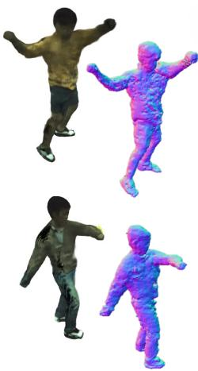

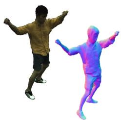

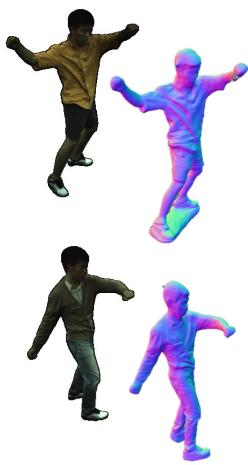  
(a) Ground truth  
(b) Neural Body

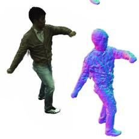  
(c) HumanNeRF

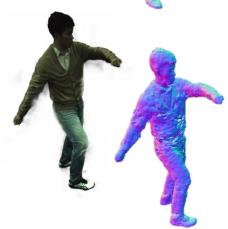  
(d) MonoHuman

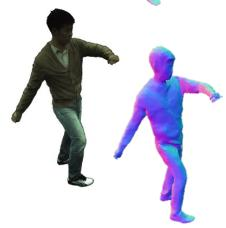  
(e) GoMAvatar (ours)

Figure 4. Qualitative comparison to state-of-the-arts. In each pair, we render the RGB image and normal map. The normal map is rendered from the extracted mesh. We show that our approach can produce realistic details in both rendered images and geometry, while other approaches struggle to generate a smooth mesh.

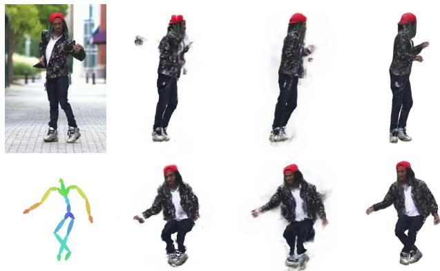  
(a) Reference (b) HumanNeRF (c) MonoHuman (d) Ours

Figure 5. Qualitative results on YouTube videos. The first image is the reference image. We compare novel view synthesis in the first row and novel pose synthesis in the second row.

better, while LPIPS is on par. Also, Anim-NeRF renders at a speed of 217ms/frame on an Nvidia A100, while ours achieves 25.82ms/frame, being 8.4 faster.

## 4.3. Qualitative results

Novel view synthesis. We provide a qualitative comparison with NeuralBody, HumanNeRF and MonoHuman on rendered images and normal maps in Fig. 4. The normal maps are rendered from the extracted meshes. As can be seen from the figure, our approach captures fine details, such as facial features and wrinkles, and avoids the “ghost effect” and “floaters” observed in HumanNeRF’s and MonoHuman’s output (see the armpit of the second subject in HumanNeRF’s rendering and floaters around Mono-Human’s rendering). The ghost effect typically occurs when two body parts come too close, an artifact due to Human-NeRF’s and MonoHuman’s voxel-based inverse blend skin-

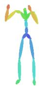

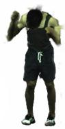

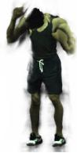

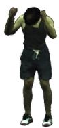  
(d) Ours

Figure 6. Novel pose synthesis. Poses are from using poses generated from MDM [65].

ning. Specifically, limited by the resolution of the LBS weights, the free space is affected by two unrelated body parts and thus obtains a large foreground score. The floaters are typical volume rendering artifacts as in other NeRF representations. In contrast, our approach uses explicit geometry and thus does not suffer from both issues. We additionally test our approach on YouTube dancing videos in the first row of Fig. 5. Note that the human poses and masks are predicted and thus inaccurate. However, our method still renders novel views well, while HumanNeRF and Mono-Human suffer from imperfect masks and produce floaters.

Novel pose synthesis. We render novel poses generated from MDM [65], as depicted in Fig. 6. Remarkably, our approach performs effectively even in extremely challenging poses characterized by self-penetration, such as sitting. In contrast, both HumanNeRF and MonoHuman lack the capability to handle such self-penetration, due to the voxel-based inverse blend skinning (see the incomplete left hands). We validate our approach on novel view synthesis using an inthe-wild YouTube video, as illustrated in the second row of Fig. 5. Specifically, when rendering the avatar in a legcrossing pose, both HumanNeRF and MonoHuman fail to produce accurate results, whereas our approach successfully renders the pose with fidelity.

<table><tr><td>Gaussians</td><td>Mesh</td><td>PSNR ↑</td><td>SSIM ↑</td><td>LPIPS*↓</td></tr><tr><td>√</td><td>X</td><td>30.06</td><td>0.9673</td><td>34.13</td></tr><tr><td>X</td><td>√</td><td>28.93</td><td>0.9615</td><td>38.11</td></tr><tr><td>√</td><td>√</td><td>30.36</td><td>0.9690</td><td>33.28</td></tr></table>

Table 4. Ablations on scene representation for novel view synthesis. Gaussians-on-Mesh achieves the best results.

## 4.4. Ablation studies

Canonical representation. We conduct ablation studies on the Gaussians-on-Mesh (GoM) representation and 3D Gaussians or meshes alone, as summarized in Tab. 4. In the 3D Gaussians experiment, we only use Gaussian splatting for rendering, and supervise the rendered image and subject mask during training. We initialize the Gaussians’ centroids as the vertices of the canonical T-pose SMPL mesh and directly learn their centroids, rotations and scales in the world coordinates, which differs from the triangle’s local coordinates used in our approach. We also compare with just using a mesh: We initialize using the canonical SMPL mesh and attach the pseudo-albedo colors to the vertices. We render the RGB image and subject mask with mesh rasterization [40]. We supervise the rendered image and subject mask and apply all regularizations in Eq. (15). We also utilize the color decomposition in Eq. (6).

We find 3D Gaussians alone suffer from overfitting: without geometry regularization, Gaussians are too flexible and achieve similar rendering quality on training images, while the outputs are undesirable during inference. When using only the mesh, optimization is a known challenge. In contrast, GoM alleviates these issues and combines the strengths of both representations. GoM produces the highest rendering quality among the three representations.

Local Gaussians vs. world Gaussians. We compare three choices of attaching Gaussians to the mesh: 1) World Gaussians: We associate the Gaussian’s centroid with the face’s centroid (Eq. (8)). However, we directly learn the ${ r _ { \theta , j } }$ and $s _ { \boldsymbol { \theta } , j }$ in the world coordinates, i.e., $\Sigma _ { j } = \mathbf { \bar { \it { R } } } _ { j } S _ { j } S _ { j } ^ { T } , \bar { R _ { j } ^ { T } }$ where $R _ { j }$ and $S _ { j }$ are the matrix encodings of ${ r _ { \theta , j } }$ and $s _ { \boldsymbol { \theta } , j } ;$ 2) Local fixed Gaussians: We follow Eqs. (8) and (9) to compute a Gaussian’s mean and covariance in the world coordinates. However, ${ r _ { \theta , j } }$ and $s _ { \boldsymbol { \theta } , j }$ are fixed so that the variance in the normal axis is small. Meanwhile, the projection of the ellipsoid $\{ x : ( x - \mu _ { j } ) ^ { T } \Sigma _ { j } ^ { - 1 } ( x - \mu _ { j } ) = 1 \}$ on the triangle recovers the Steiner ellipse. 3) Local Gaussians: We use Eqs. (8) and (9) to transform the Gaussians and ${ r _ { \theta , j } }$ and $s _ { \boldsymbol { \theta } , j }$ are free variables.

We show the comparison in the top section of Tab. 5. In terms of rendering quality, world Gaussians and local Gaussians achieve similar performance. But world Gaussians tend to enlarge the scales instead of stretching the faces, so the geometry is worse. Local fixed Gaussians can produce equally good geometry, but lose rendering flexibility.

Shading Module. As shown in the middle section of Tab. 5, without the shading module in Eq. (6)—that is, by directly using $I _ { \mathrm { G S } }$ as the RGB prediction—our model achieves a PSNR of 30.13. However, with the shading module included, the PSNR increases to 30.36. We also visualize the pseudo shading map, demonstrating that our shading module learns lighting effects, as illustrated in Fig. 7.

<table><tr><td rowspan=1 colspan=1></td><td rowspan=1 colspan=1>PSNR ↑SSIM ↑ LPIPS* ↓|</td><td rowspan=1 colspan=1>CD↓ NC↑</td></tr><tr><td rowspan=2 colspan=1>World GaussiansLocal Fixed GaussiansLocal Flex. Gaussians</td><td rowspan=1 colspan=1>30.340.9689 33.99</td><td rowspan=1 colspan=1>4.39410.6223</td></tr><tr><td rowspan=1 colspan=1>30.270.9685 34.1130.360.9690 33.28</td><td rowspan=1 colspan=1>3.08980.62473.07280.6366</td></tr><tr><td rowspan=1 colspan=1>w/o Shadingw/ Shading</td><td rowspan=1 colspan=1>30.130.9684 32.0730.360.9690 33.28</td><td rowspan=1 colspan=1>|3.01770.63603.0728 0.6366</td></tr><tr><td rowspan=2 colspan=1>w/o Subdivisionw/ Subdivision</td><td rowspan=1 colspan=1>30.360.9690 33.28</td><td rowspan=1 colspan=1>|3.07280.6366</td></tr><tr><td rowspan=1 colspan=1>30.370.9689 32.53</td><td rowspan=1 colspan=1>2.83640.6201</td></tr></table>

Table 5. Ablation Studies. Top section: locally deformed Gaussians help improve both geometry and rendering quality. Middle section: our proposed shading module enhances rendering quality. Bottom section: subdivision significantly improves geometry.

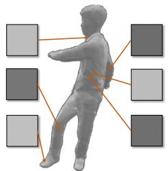

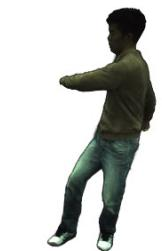  
(a) Pseudo shading map  
(b) Rendered image  
Figure 7. Pseudo shading map. We visualize the pseudo shading map and the rendered image for reference. Our approach learns view-dependent shading effects as seen in the highlighted regions. The pseudo shading map is normalized for better visualization.

GoM subdivision. We show in the bottom section of Tab. 5 that GoM subdivision enhances the LPIPS\* from 33.28 to 32.53 and reduces the Chamfer distance from 3.0728 to 2.8364. Importantly, the geometry significantly improves with a more fine-grained mesh. Note, this increases inference time to 23.2ms per frame from 17.5ms.

## 5. Conclusion

We introduce GoMAvatar, a framework designed for rendering high-fidelity, free-viewpoint images of a human performer, using a single input video. At the core of our method is the Gaussians-on-Mesh representation. Paired with forward articulation and neural rendering, our method renders quickly while being memory efficient. Notably, the method handles in-the-wild videos well.

## Acknowledgement

Project supported by Intel AI SRS gift, IBM IIDAI Grant, Insper-Illinois Innovation Grant, NCSA Faculty Fellowship, NSF Awards #2008387, #2045586, #2106825, #2331878, #2340254, #2312102, and NIFA award 2020- 67021-32799. We thank NCSA for providing computing resources. We thank Yiming Zuo for helpful discussions.

## References

[1] Thiemo Alldieck, Marcus A. Magnor, Weipeng Xu, Christian Theobalt, and Gerard Pons-Moll. Video based reconstruction of 3D people models. In CVPR, 2018. 2, 5

[2] Dragomir Anguelov, Praveen Srinivasan, Daphne Koller, Sebastian Thrun, Jim Rodgers, and James Davis. SCAPE: shape completion and animation of people. ACM TOG, 2005. 2

[3] Benjamin Attal, Jia-Bin Huang, Michael Zollhoefer, Johannes Kopf, and Changil Kim. Learning Neural Light Fields with Ray-Space Embedding. In CVPR, 2021. 2

[4] Jonathan T. Barron, Ben Mildenhall, Matthew Tancik, Peter Hedman, Ricardo Martin-Brualla, and Pratul P. Srinivasan. Mip-NeRF: A Multiscale Representation for Anti-Aliasing Neural Radiance Fields. In ICCV, 2021. 2

[5] Jonathan T. Barron, Ben Mildenhall, Dor Verbin, Pratul P. Srinivasan, and Peter Hedman. Mip-NeRF 360: Unbounded Anti-Aliased Neural Radiance Fields. In CVPR, 2022.

[6] Jonathan T. Barron, Ben Mildenhall, Dor Verbin, Pratul P. Srinivasan, and Peter Hedman. Zip-NeRF: Anti-Aliased Grid-Based Neural Radiance Fields. In ICCV, 2023. 2

[7] Anpei Chen, Zexiang Xu, Andreas Geiger, Jingyi Yu, and Hao Su. TensoRF: Tensorial Radiance Fields. In ECCV, 2022. 2

[8] Jianchuan Chen, Ying Zhang, Di Kang, Xuefei Zhe, Linchao Bao, and Huchuan Lu. Animatable Neural Radiance Fields from Monocular RGB Video. arXiv, 2021. 6

[9] Jianchuan Chen, Wen Yi, Liqian Ma, Xu Jia, and Huchuan Lu. GM-NeRF: Learning Generalizable Model-based Neural Radiance Fields from Multi-view Images. In CVPR, 2023. 3

[10] Xu Chen, Yufeng Zheng, Michael J Black, Otmar Hilliges, and Andreas Geiger. SNARF: Differentiable Forward Skinning for Animating Non-Rigid Neural Implicit Shapes. In ICCV, 2021. 3

[11] Xu Chen, Tianjian Jiang, Jie Song, Max Rietmann, Andreas Geiger, Michael J. Black, and Otmar Hilliges. Fast-SNARF: A Fast Deformer for Articulated Neural Fields. TPAMI, 2022. 3

[12] Zhiqin Chen and Hao Zhang. Learning Implicit Fields for Generative Shape Modeling. In CVPR, 2019. 2

[13] Zhiqin Chen, Thomas A. Funkhouser, Peter Hedman, and Andrea Tagliasacchi. MobileNeRF: Exploiting the Polygon Rasterization Pipeline for Efficient Neural Field Rendering on Mobile Architectures. In CVPR, 2023. 3

[14] Xiangjun Gao, Jiaolong Yang, Jongyoo Kim, Sida Peng, Zicheng Liu, and Xin Tong. MPS-NeRF: Generalizable 3D Human Rendering from Multiview Images. TPAMI, 2022. 3

[15] Stephan J. Garbin, Marek Kowalski, Matthew Johnson, Jamie Shotton, and Julien P. C. Valentin. FastNeRF: High-Fidelity Neural Rendering at 200FPS. In ICCV, 2021. 3

[16] Chen Geng, Sida Peng, Zhenqi Xu, Hujun Bao, and Xiaowei Zhou. Learning Neural Volumetric Representations of Dynamic Humans in Minutes. In CVPR, 2023. 1, 3, 4

[17] Steven J. Gortler, Radek Grzeszczuk, Richard Szeliski, and Michael F. Cohen. The lumigraph. In SIGGRAPH, 1996. 2

[18] Jon Hasselgren, Nikolai Hofmann, and Jacob Munkberg. Shape, Light & Material Decomposition from Images using Monte Carlo Rendering and Denoising. In NeurIPS, 2022. 2

[19] Tong He, Yuanlu Xu, Shunsuke Saito, Stefano Soatto, and Tony Tung. Arch++: Animation-ready clothed human reconstruction revisited. In ICCV, 2021. 3

[20] Peter Hedman, Pratul P. Srinivasan, Ben Mildenhall, Jonathan T. Barron, and Paul E. Debevec. Baking Neural Radiance Fields for Real-Time View Synthesis. In ICCV, 2021. 3

[21] Shou-Yong Hu, Fangzhou Hong, Liang Pan, Haiyi Mei, Lei Yang, and Ziwei Liu. SHERF: Generalizable Human NeRF from a Single Image. In ICCV, 2023. 3

[22] T. Hu, Tao Yu, Zerong Zheng, He Zhang, Yebin Liu, and Matthias Zwicker. HVTR: Hybrid Volumetric-Textural Rendering for Human Avatars. 3DV, 2021. 3

[23] Satoshi Iizuka, Edgar Simo-Serra, and Hiroshi Ishikawa. Let there be color! ACM TOG, 2016. 2

[24] Timothy Jeruzalski, Boyang Deng, Mohammad Norouzi, J. P. Lewis, Geo rey E. Hinton, and Andrea Tagliasacchi. NASA: Neural Articulated Shape Approximation. In ECCV, 2020. 3

[25] Boyi Jiang, Yang Hong, Hujun Bao, and Juyong Zhang. SelfRecon: Self Reconstruction Your Digital Avatar from Monocular Video. In CVPR, 2022. 1, 3

[26] Tianjian Jiang, Xu Chen, Jie Song, and Otmar Hilliges. Instantavatar: Learning avatars from monocular video in 60 seconds. In CVPR, 2023. 6, 2

[27] Wei Jiang, Kwang Moo Yi, Golnoosh Samei, Oncel Tuzel, and Anurag Ranjan. Neuman: Neural human radiance field from a single video. In ECCV, 2022. 1, 6

[28] Hanbyul Joo, Tomas Simon, Xulong Li, Hao Liu, Lei Tan, Lin Gui, Sean Banerjee, Timothy Scott Godisart, Bart Nabbe, Iain Matthews, Takeo Kanade, Shohei Nobuhara, and Yaser Sheikh. Panoptic Studio: A Massively Multiview System for Social Interaction Capture. TPAMI, 2017. 1

[29] James T. Kajiya and Brian Von Herzen. Ray Tracing Volume Densities. In SIGGRAPH, 1984. 2

[30] Bernhard Kerbl, Georgios Kopanas, Thomas Leimkuhler,¨ and George Drettakis. 3D Gaussian Splatting for Real-Time Radiance Field Rendering. ACM TOG, 2023. 2, 3

[31] Jaehyeok Kim, Dongyoon Wee, and Dan Xu. You Only Train Once: Multi-Identity Free-Viewpoint Neural Human Rendering from Monocular Videos. arXiv, 2023. 3

[32] Diederik P. Kingma and Jimmy Ba. Adam: A Method for Stochastic Optimization. arXiv, 2014. 2

[33] Muhammed Kocabas, Chun-Hao P Huang, Otmar Hilliges, and Michael J Black. PARE: Part attention regressor for 3D human body estimation. In ICCV, 2021. 6, 3

[34] Youngjoon Kwon, Dahun Kim, Duygu Ceylan, and Henry Fuchs. Neural Human Performer: Learning Generalizable Radiance Fields for Human Performance Rendering. In NeurIPS, 2021. 3

[35] Young Chan Kwon, Dahun Kim, Duygu Ceylan, and Henry Fuchs. Neural Image-based Avatars: Generalizable Radiance Fields for Human Avatar Modeling. In ICLR, 2023. 3

[36] Marc Levoy and Pat Hanrahan. Light Field Rendering. In SIGGRAPH, 1996. 2

[37] Ruilong Li, Julian Tanke, Minh Vo, Michael Zollhofer, Jurgen Gall, Angjoo Kanazawa, and Christoph Lassner. TAVA: Template-free Animatable Volumetric Actors. In ECCV, 2022. 3

[38] Zhi-Hao Lin, Wei-Chiu Ma, Hao-Yu Hsu, Yu-Chiang Frank Wang, and Shenlong Wang. Neurmips: Neural Mixture of Planar Experts for View Synthesis. In CVPR, 2022. 3

[39] Lingjie Liu, Marc Habermann, Viktor Rudnev, Kripasindhu Sarkar, Jiatao Gu, and Christian Theobalt. Neural actor: Neural free-view synthesis of human actors with pose control. ACM TOG, 2021. 3

[40] Shichen Liu, Tianye Li, Weikai Chen, and Hao Li. Soft rasterizer: A differentiable renderer for image-based 3d reasoning. In ICCV, 2019. 4, 8

[41] Stephen Lombardi, Tomas Simon, Jason M. Saragih, Gabriel Schwartz, Andreas M. Lehrmann, and Yaser Sheikh. Neural Volumes: Learning Dynamic Renderable Volumes from Images. ACM TOG, 2019. 2

[42] Matthew Loper, Naureen Mahmood, and Michael J Black. Mosh: Motion and shape capture from sparse markers. ACM TOG, 2014. 1

[43] Matthew Loper, Naureen Mahmood, Javier Romero, Gerard Pons-Moll, and Michael J. Black. SMPL: A skinned multiperson linear model. ACM TOG, 2015. 2, 5, 1

[44] Camillo Lugaresi, Jiuqiang Tang, Hadon Nash, Chris Mc-Clanahan, Esha Uboweja, Michael Hays, Fan Zhang, Chuo-Ling Chang, Ming Guang Yong, Juhyun Lee, et al. Mediapipe: A framework for building perception pipelines. arXiv, 2019. 6

[45] Jonathon Luiten, Georgios Kopanas, Bastian Leibe, and Deva Ramanan. Dynamic 3d gaussians: Tracking by persistent dynamic view synthesis. In 3DV, 2024. 2

[46] Ricardo Martin-Brualla, Noha Radwan, Mehdi S. M. Sajjadi, Jonathan T. Barron, Alexey Dosovitskiy, and Daniel Duckworth. NeRF in the Wild: Neural Radiance Fields for Unconstrained Photo Collections. In CVPR, 2021. 2

[47] Lars M. Mescheder, Michael Oechsle, Michael Niemeyer, Sebastian Nowozin, and Andreas Geiger. Occupancy networks: Learning 3D reconstruction in function space. In CVPR, 2019. 2

[48] Marko Mihajlovic, Shunsuke Saito, Aayush Bansal, Michael ´ Zollhoefer, and Siyu Tang. COAP: Compositional Articulated Occupancy of People. In CVPR, 2022. 3

[49] Ben Mildenhall, Pratul P. Srinivasan, Matthew Tancik, Jonathan T. Barron, Ravi Ramamoorthi, and Ren Ng. NeRF: Representing Scenes as Neural Radiance Fields for View Synthesis. In ECCV, 2020. 2, 4, 5

[50] Thomas Muller, Alex Evans, Christoph Schied, and Alexan-¨ der Keller. Instant neural graphics primitives with a multiresolution hash encoding. ACM TOG, 2022. 2

[51] Jeong Joon Park, Peter Florence, Julian Straub, Richard A. Newcombe, and Steven Lovegrove. DeepSDF: Learning continuous signed distance functions for shape representation. In CVPR, 2019. 2

[52] Sang Il Park and Jessica K Hodgins. Capturing and animating skin deformation in human motion. ACM TOG, 2006. 1

[53] Sida Peng, Junting Dong, Qianqian Wang, Shang-Wei Zhang, Qing Shuai, Xiaowei Zhou, and Hujun Bao. Animatable Neural Radiance Fields for Modeling Dynamic Human Bodies. In ICCV, 2021. 3

[54] Sida Peng, Yuanqing Zhang, Yinghao Xu, Qianqian Wang, Qing Shuai, Hujun Bao, and Xiaowei Zhou. Neural body: Implicit neural representations with structured latent codes for novel view synthesis of dynamic humans. In CVPR, 2021. 2, 3, 5, 6

[55] Edoardo Remelli, Timur M. Bagautdinov, Shunsuke Saito, Chenglei Wu, Tomas Simon, Shih-En Wei, Kaiwen Guo, Zhe Cao, Fabian Prada, Jason M. Saragih, and Yaser Sheikh.´ Drivable Volumetric Avatars using Texel-Aligned Features. In SIGGRAPH, 2022. 3

[56] Zhongzheng Ren, Xiaoming Zhao, and Alexander G. Schwing. Class-agnostic Reconstruction of Dynamic Objects from Videos. In NeurIPS, 2021. 2, 3

[57] Zhongzheng Ren, Aseem Agarwala, Bryan Russell, Alexander G. Schwing, and Oliver Wang. Neural volumetric object selection. In CVPR, 2022. 2

[58] Ignacio Rocco, Iurii Makarov, Filippos Kokkinos, David Novotny, Benjamin Graham, Natalia Neverova, and Andrea´ Vedaldi. Real-time Volumetric Rendering of Dynamic Humans. arXiv, 2023. 1, 3

[59] Shunsuke Saito, Zeng Huang, Ryota Natsume, Shigeo Morishima, Angjoo Kanazawa, and Hao Li. PIFu: Pixel-aligned implicit function for high-resolution clothed human digitization. In ICCV, 2019. 2

[60] Shunsuke Saito, Tomas Simon, Jason Saragih, and Hanbyul Joo. PIFuHD: Multi-level pixel-aligned implicit function for high-resolution 3d human digitization. In CVPR, 2020. 2

[61] Jonathan Shade, Steven J. Gortler, Li wei He, and Richard Szeliski. Layered depth images. In SIGGRAPH, 1998. 2

[62] Meng-Li Shih, Shih-Yang Su, Johannes Kopf, and Jia-Bin Huang. 3D Photography Using Context-Aware Layered Depth Inpainting. In CVPR, 2020. 2

[63] Vincent Sitzmann, Justus Thies, Felix Heide, Matthias Nießner, Gordon Wetzstein, and Michael Zollhofer. Deep- ¨ Voxels: Learning Persistent 3D Feature Embeddings. In CVPR, 2019. 2

[64] Shih-Yang Su, Frank Yu, Michael Zollhoefer, and Helge Rhodin. A-NeRF: Articulated Neural Radiance Fields for Learning Human Shape, Appearance, and Pose. In NeurIPS, 2021. 1, 3

[65] Guy Tevet, Sigal Raab, Brian Gordon, Yonatan Shafir, Daniel Cohen-Or, and Amit H Bermano. Human motion diffusion model. In ICLR, 2023. 7

[66] Garvita Tiwari, Nikolaos Sarafianos, Tony Tung, and Gerard Pons-Moll. Neural-GIF: Neural Generalized Implicit Functions for Animating People in Clothing. In ICCV, 2021. 3

[67] Dor Verbin, Peter Hedman, Ben Mildenhall, Todd E. Zickler, Jonathan T. Barron, and Pratul P. Srinivasan. Ref-NeRF: Structured View-Dependent Appearance for Neural Radiance Fields. In CVPR, 2022. 2

[68] Peng Wang, Lingjie Liu, Yuan Liu, Christian Theobalt, Taku Komura, and Wenping Wang. Neus: Learning neural implicit surfaces by volume rendering for multi-view reconstruction. In NeurIPS, 2021. 6

[69] Shaofei Wang, Katja Schwarz, Andreas Geiger, and Siyu Tang. ARAH: Animatable Volume Rendering of Articulated Human SDFs. In ECCV, 2022. 3, 6

[70] Chung-Yi Weng, Brian Curless, Pratul P. Srinivasan, Jonathan T. Barron, and Ira Kemelmacher-Shlizerman. HumanNeRF: Free-viewpoint Rendering of Moving People from Monocular Video. In CVPR, 2022. 1, 3, 4, 5, 6, 2

[71] Suttisak Wizadwongsa, Pakkapon Phongthawee, Jiraphon Yenphraphai, and Supasorn Suwajanakorn. NeX: Real-time View Synthesis with Neural Basis Expansion. In CVPR, 2021. 2

[72] Guanjun Wu, Taoran Yi, Jiemin Fang, Lingxi Xie, Xiaopeng Zhang, Wei Wei, Wenyu Liu, Qi Tian, and Xinggang Wang. 4d gaussian splatting for real-time dynamic scene rendering. arXiv, 2023. 2

[73] Guanjun Wu, Taoran Yi, Jiemin Fang, Lingxi Xie, Xiaopeng Zhang, Wei Wei, Wenyu Liu, Qi Tian, and Wang Xinggang. 4D Gaussian Splatting for Real-Time Dynamic Scene Rendering. arXiv, 2023. 2

[74] Cheng-hsin Wuu, Ningyuan Zheng, Scott Ardisson, Rohan Bali, Danielle Belko, Eric Brockmeyer, Lucas Evans, Timothy Godisart, Hyowon Ha, Alexander Hypes, Taylor Koska, Steven Krenn, Stephen Lombardi, Xiaomin Luo, Kevyn McPhail, Laura Millerschoen, Michal Perdoch, Mark Pitts, Alexander Richard, Jason Saragih, Junko Saragih, Takaak Shiratori, Tomas Simon, Matt Stewart, Autumn Trimble, Xinshuo Weng, David Whitewolf, Chenglei Wu, Shoou-I Yu, and Yaser Sheikh. Multiface: A Dataset for Neural Face Rendering, 2022. 1

[75] Hongyi Xu, Thiemo Alldieck, and Cristian Sminchisescu. H-NeRF: Neural Radiance Fields for Rendering and Temporal Reconstruction of Humans in Motion. In NeurIPS, 2021. 3

[76] Yuanlu Xu, Bingpeng Ma, and Rui Huang Liang Lin. Person search in a scene by jointly modeling people commonness and person uniqueness. In ACM MM, 2014. 3

[77] Ze Yang, Shenlong Wang, Sivabalan Manivasagam, Zeng Huang, Wei-Chiu Ma, Xinchen Yan, Ersin Yumer, and Raquel Urtasun. S3: Neural shape, skeleton, and skinning fields for 3d human modeling. In CVPR, 2021. 3

[78] Lior Yariv, Peter Hedman, Christian Reiser, Dor Verbin, Pratul P Srinivasan, Richard Szeliski, Jonathan T Barron, and Ben Mildenhall. Bakedsdf: Meshing neural sdfs for realtime view synthesis. In SIGGRAPH, 2023. 3

[79] Alex Yu, Ruilong Li, Matthew Tancik, Hao Li, Ren Ng, and Angjoo Kanazawa. PlenOctrees for Real-time Rendering of Neural Radiance Fields. In ICCV, 2021. 3

[80] Alex Yu, Sara Fridovich-Keil, Matthew Tancik, Qinhong Chen, Benjamin Recht, and Angjoo Kanazawa. Plenoxels: Radiance Fields without Neural Networks. In CVPR, 2022. 2

[81] Zhengming Yu, Wei Cheng, Xian Liu, Wayne Wu, and Kwan-Yee Lin. Monohuman: Animatable human neural field from monocular video. In CVPR, 2023. 1, 3, 4, 5, 6

[82] Kai Zhang, Gernot Riegler, Noah Snavely, and Vladlen Koltun. NeRF++: Analyzing and Improving Neural Radiance Fields. arXiv, 2020. 2

[83] Rui Zhang and Jie Chen. NDF: Neural Deformable Fields for Dynamic Human Modelling. In ECCV, 2022. 3

[84] Richard Zhang, Phillip Isola, Alexei A Efros, Eli Shechtman, and Oliver Wang. The unreasonable effectiveness of deep features as a perceptual metric. In CVPR, 2018. 5

[85] Fuqiang Zhao, Wei Yang, Jiakai Zhang, Pei-Ying Lin, Yingliang Zhang, Jingyi Yu, and Lan Xu. HumanNeRF: Efficiently Generated Human Radiance Field from Sparse Inputs. In CVPR, 2022. 3

[86] Xiaoming Zhao, Yuan-Ting Hu, Zhongzheng Ren, and Alexander G. Schwing. Occupancy Planes for Single-view RGB-D Human Reconstruction. In AAAI, 2023. 2

[87] Xiaoming Zhao, Alex Colburn, Fangchang Ma, Miguel Angel Bautista, Joshua M. Susskind, and Alexander G. ´ Schwing. Pseudo-Generalized Dynamic View Synthesis from a Video. In ICLR, 2024. 3

[88] Yufeng Zheng, Yifan Wang, Gordon Wetzstein, Michael J. Black, and Otmar Hilliges. PointAvatar: Deformable Pointbased Head Avatars from Videos. In CVPR, 2023. 1

[89] Zerong Zheng, Han Huang, Tao Yu, Hongwen Zhang, Yandong Guo, and Yebin Liu. Structured Local Radiance Fields for Human Avatar Modeling. In CVPR, 2022. 3

[90] Tinghui Zhou, Richard Tucker, John Flynn, Graham Fyffe, and Noah Snavely. Stereo Magnification: Learning View Synthesis using Multiplane Images. ACM TOG, 2018. 2