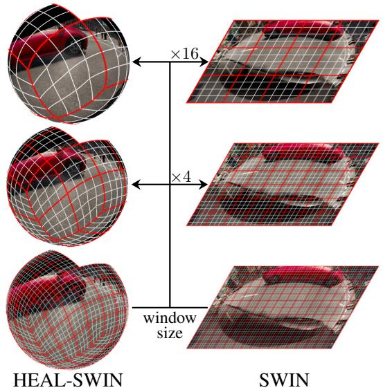
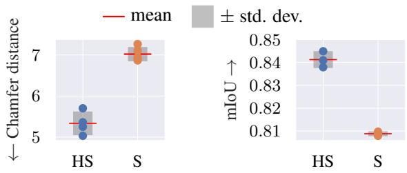
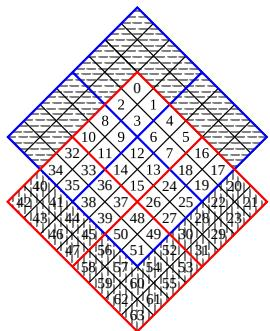
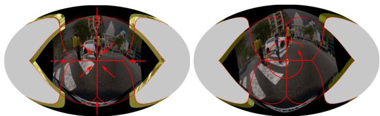
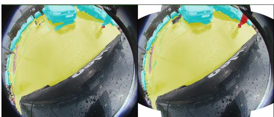
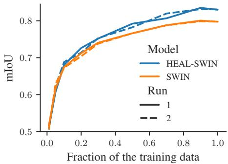
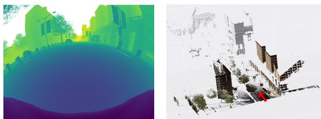

# HEAL-SWIN: A Vision Transformer On The Sphere

Oscar Carlsson∗ab Jan E. Gerken∗a Hampus Linander a Heiner Spieß c Fredrik Ohlsson d

Christoffer Peterssone a Daniel Perssona

## Abstract

High-resolution wide-angle fisheye images are becoming more and more important for robotics applications such as autonomous driving. However, using ordinary convolutional neural networks or vision transformers on this data is problematic due to projection and distortion losses introduced when projecting to a rectangular grid on the plane. We introduce the HEAL-SWIN transformer, which combines the highly uniform Hierarchical Equal Area iso-Latitude Pixelation (HEALPix) grid used in astrophysics and cosmology with the Hierarchical Shifted-Window (SWIN) transformer to yield an efficient and flexible model capable of training on high-resolution, distortion-free spherical data. In HEAL-SWIN, the nested structure ofthe HEALPix grid is used to perform the patching and windowing operations ofthe SWIN transformer, enabling the network to process spherical representations with minimal computational overhead. We demonstrate the superior performance ofour model on both synthetic and real automotive datasets, as well as a selection of other image datasets, for semantic segmentation, depth regression and classification tasks. Our code is publicly available1.

## 1. Introduction

High-resolution fisheye cameras are among the most common and important sensors in modern intelligent vehicles [42]. Due to their non-rectilinear mapping functions and large field of view, fisheye images are highly distorted. Moreover, the most commonly used large-scale computer vision and autonomous driving datasets do not contain fisheye images. For these reasons, fisheye images have received much less attention than rectilinear images in the literature.

  
Figure 1. Our HEAL-SWIN model uses the nested structure of the HEALPix grid to lift the windowed self-attention of the SWIN model onto the sphere.

Despite the distortions introduced by the mapping function, the traditional approach for dealing with this kind of data is to use standard (flat) convolutional neural networks which are adjusted to the distortions and either preprocess the data [16, 17, 26, 36, 46, 50] or deform the convolution kernels [47]. However, these approaches struggle to capture the inherent spherical geometry of the images since they operate on a flat approximation of the sphere. Errors and artifacts arising from handling the strong and spatially inhomogeneous distortions are particularly problematic in safety-critical applications such as autonomous driving.

Utilizing spherical representations is an approach taken by some models [8, 10, 19] which lift convolutions to the sphere. These models rely on a rectangular grid in spherical coordinates, namely the Driscoll–Healy grid [15], to perform efficient Fourier transforms. However, this approach has several disadvantages for high-resolution data: First, the sampling in this grid is not uniform but much denser at the poles, necessitating very high bandwidths to resolve fine details around the equator. Second, the Fourier transforms in the aforementioned models require tensors in the Fourier domain of the rotation group SO(3) which scale with the third power of the bandwidth, limiting the resolution. Third, the Fourier transform is very tightly coupled to the input domain: If the input data lies only on a half-sphere, as is often the case for fisheye images, the definition of the convolutional layers needs to be changed to use this data efficiently.

As a novel way to address all these problems at the same time, we propose to combine an adapted vision transformer with the Hierarchical Equal Area iso-Latitude Pixelisation (HEALPix) grid [23]. The HEALPix grid was developed for capturing the high-resolution measurements of the cosmic microwave background performed by the MAP and PLANCK satellites featuring a uniform distribution of grid points on the sphere that associates the same area to each pixel. This is in contrast to most other grids used in the literature like the Driscoll–Healy grid or the icosahedral grid.

In our model, which we call HEAL-SWIN, we use a modified version of the Hierarchical Shifted-Window (SWIN) transformer [37] to learn directly on the HEALPix grid with minimal computational overhead. The SWIN transformer performs attention over blocks of pixels called windows which aligns well with the nested structure of the HEALPix grid (Figure 1). To distribute information globally, the SWIN transformer shifts the windows in every other layer, creating overlapping regions. In HEAL-SWIN, we employ the same principles but tailor them to fit the structure of the HEALPix grid. In particular, we propose two different strategies for shifting windows on the sphere: Either aligned with the hierarchical structure of the HEALPix grid or in a spiral from one pole to the other.

Besides excellent performance, an additional benefit of using HEAL-SWIN is that the attention layers do not require a Fourier transform and can therefore easily deal with high-resolution data and with data which covers only part of the sphere, resulting in significant efficiency gains. This is of central importance to dealing with high-resolution fisheye images which cover about half of the sphere, leaving half of the input unused in spherical models which rely on operating on the entire sphere.

In order to verify the efficacy of our proposed model, we train HEAL-SWIN on a number of different computer vision tasks: classification, depth estimation and semantic segmentation of fisheye images from a diverse range of datasets. In these experiments, we put particular emphasis on tasks from the autonomous driving domain for which high-resolution input images and very precise outputs in terms of 3D information are critical, necessitating geometry-aware representations. To the best of our knowledge, we are the first to treat fisheye images in automotive applications as spherical signals.

  
Figure 2. Chamfer distance (lower is better) and mIoU (higher is better) for HEAL-SWIN (HS) and SWIN (S). Details are provided in Section 4.3 and in Section 4.1.2.

In particular, we perform fisheye-image-based depth estimation and compare the resulting predicted 3D point clouds to the corresponding ground truth point clouds. In this way, we can assess the quality of the learned representations for downstream tasks that rely on accurate 3D information, such as general obstacle detection and collision avoidance, allowing us to isolate the effect of using spherical representations on the HEALPix grid. We show that our model outperforms the flat SWIN transformer in this setting on the SynWoodScape dataset [45] of computergenerated fisheye images of street scenes, see Figure 2 (left), establishing the benefit of using HEALPix representations. For the semantic segmentation task, we confirm the superior performance of our model on both the real-world WoodScape dataset [49] and on the SynWoodScape dataset, see Figure 2 (right). For both depth estimation and semantic segmentation we optimize the loss directly on the sphere.

Having shown that the addition of spherical representations is beneficial for high-resolution image datasets, we verify that our model is competitive with the state of the art in spherical image classification and semantic segmentation of indoor scenes.

Although we focus in this work on fisheye images, our model is not specific to this kind of problem but can be trained on any high-resolution spherical data, as provided for instance by satellites mapping the sky or the earth. In particular, deep spherical models (and in particular transformers) were recently shown to outperform physical models for weather prediction tasks [3, 32, 35, 40], opening another important application domain for our model.

Our main contributions are as follows:

• We construct the HEAL-SWIN transformer which operates on high-resolution spherical representations by combining the spherical HEALPix grid with an adapted SWIN transformer. By exploiting the similar hierarchical structures in HEALPix and SWIN, we construct windowing and shifting mechanisms for the HEALPix grid which efficiently deal with data that only covers part of the sphere.

• We treat fisheye images in automotive applications for the first time as distortion-free spherical signals. We demonstrate the superiority of this approach for depth estimation and semantic segmentation on both synthetic and real automotive datasets.

• To compare HEAL-SWIN to other models operating on spherical representations, we benchmark on the Stanford 2D-3D-S indoor fisheye dataset [1] and find that our model outperforms comparable spherical models.

## 2. Related work

The transformer architecture was introduced in [48], extended to the Vision Transformer (ViT) in [14], and further refined in [37] to the Shifted-Window (SWIN) transformer based on attention in local windows combined with window shifting to account for global structure. A first step towards spherical transformer models has been proposed in [7] where various spherical grids are used to extract patches on which the ViT is applied, and in [4] where icosahedral grid sampling is combined with the Adaptive Fourier Neural Operator (AFNO, see [24]) architecture for spatial token mixing to account for the geometry of the sphere. Compared to previous spherical transformer designs, such as [7], our model constitutes a significant improvement by incorporating local attention and window shifting to accommodate high-resolution images in the spherical geometry, without requiring the careful construction of accurate graph representations of the spherical geometry.

The SWIN paradigm has been incorporated into transformers operating on 3D point clouds (e.g. LiDAR depth data) by combining voxel based models (see [39]) with sparse [20] and stratified [33] local attention mechanisms. In [34], spherical geometry is used to account for long range interactions in the point cloud to create a transformer based on local self-attention in radial windows. Closer in spirit to our approach is [25], where the point cloud is projected to the sphere, and partitioned into neighborhoods. Local self-attention and patch merging is then applied to the corresponding subsets of the point cloud, and shifting of subsets is achieved by rotations of the underlying sphere. Our HEAL-SWIN model inherits windowing and shifting from the SWIN architecture, but in contrast to the point cloud based approaches we handle data native to the sphere and use the HEALPix grid to construct a hierarchical sampling scheme which minimizes distortions, allows for the handling of high-resolution data, and, in addition, incorporates new shifting strategies specifically adapted to the HEALPix grid.

Several Convolutional Neural Network (CNN) based models have been proposed to accommodate spherical data.

As mentioned above, [8, 10, 19] use an equirectangular grid and implement convolutions in Fourier space, while [31] applies CNNs directly to the HEALPix partitions of the sphere. DeepSphere is a graph-based CNN which is rotationally equivariant for radial filters [11]. The underlying graph allows for a non-uniform sampling which can be beneficial for certain applications. DeepSphere has been specialized to the HEALPix grid [41] but cannot exploit the nested grid in the same way as HEAL-SWIN which employs windowed self-attention.

Other works that consider spherical CNNs combined with the HEALPix grid include [16, 29]. Compared to previous works combining CNNs and the HEALPix grid, the windowed self-attention equips our model with the ability to efficiently encode long-range interactions. Moreover, transformers are known to be able to benefit from large datasets where CNNs reach their capacity limits.

Due to the general shortage of computer vision datasets involving fisheye images, it is common to evaluate proposed methods by creating spherical versions of MNIST [12] and SYNTHIA [44]. In 2021, the first set of computer vision tasks for real-world automotive fisheye images was released for the WoodScape dataset [49]. In 2022, the SynWoodScape [45] dataset was released, consisting of synthetic fisheye images generated using the driving simulator CARLA [13].

Outside of the automotive domain, a common benchmark for fishey image data is the Stanford 2D-3D dataset [1] of indoor scenes. Previous works that, like our proposed HEAL-SWIN model, perform evaluation in the spherical domain for this dataset include; [50] based on an icosahedral grid sampling, [27] which constructs structured graph convolutions to incorporate the spherical geometry, [29] where convolutional kernels are parameterised using differential operators on the sphere, and [19] which uses spinweighted spherical harmonics to perform spherical convolutions in the Fourier domain.

## 3. HEAL-SWIN

We propose to combine the SWIN-transformer [37, 38] with the HEALPix grid [23] resulting in the HEAL-SWINtransformer which is capable of training on high-resolution images on the sphere. In this section, we describe the structure of the HEAL-SWIN model in detail.

## 3.1. The SWIN transformer

The SWIN-transformer is a computationally efficient vision transformer which attends to windows that are shifted from layer to layer, enabling a global distribution of information while mitigating the quadratic scaling of attention in the number of pixels.

In the first layer of the SWIN-transformer, squares of pixels are joined into tokens called patches to reduce the initial resolution of the input images. Each following SWINlayer consists of two transformer blocks which perform attention over squares of patches called windows. The windows are shifted along the patch-grid axes by half a window size, before the attention for the second transformer block is computed. In this way, information is distributed across window boundaries. To down-scale the spatial resolution, two-by-two blocks of patches are periodically merged.

  
Figure 3. Grid shifting scheme for window size 16: The windows before the shift are framed in red and the patches are numbered in the nested scheme. After a shift by half a window size, the patches are divided into the windows framed in blue, so that e.g. patch 0 becomes patch 12 after the shift. The hashed regions are masked in the attention layer. The patches hashed horizontally correspond to the pixels marked in yellow in Figure 4 (left). They are filled with patches hashed vertically which correspond to the pixels lost in the center of Figure 4 (left).

An important detail in this setup is that at the boundary of the image, shifting creates partially-filled windows. Here, the SWIN-transformer fills up the windows with patches from other partially-filled windows and then performs a masked version of self-attention which does not attend to pixel pairs which originated from different regions of the original.

For the depth-estimation and segmentation tasks we consider in this work, we use a UNet-like variant of the SWINtransformer [3, 5] which extends the encoding layers of the original SWIN-transformer by corresponding decoding layers connected via skip connections. The decoding layers are identical to the encoding layers, only the patch merging layers are replaced by patch expansion layers which expand one patch into a two-by-two block of patches such that the output of the entire model has the same resolution as the input.

## 3.2. The HEALPix grid

In the HEAL-SWIN-transformer, the patches are not associated to an underlying rectangular pixel grid as in the original SWIN-transformer, but to the HEALPix grid on the sphere. The HEALPix grid is constructed from twelve equal-area, four-sided polygons (quadrilaterals) of different shapes which tessellate the sphere (drawn in red in the topleft sphere of Figure 1). These are subdivided along their edges $n _ { \mathrm { s i d e } }$ times to yield a high-resolution partition of the sphere into $n _ { \mathrm { p i x } } = 1 2 \cdot n _ { \mathrm { s i d e } } ^ { 2 }$ equal-area, iso-latitude quadrilaterals (the $n _ { \mathrm { s i d e } } = 2$ grid is drawn in white in the top-left sphere of Figure 1). To allow for a nested (hierarchical) grid structure, $n _ { \mathrm { s i d e } }$ needs to be a power of two. The pixels of the grid are then placed at the centers of the quadrilaterals. The resulting positions are sorted in a list either in the nested ordering descending from the iterated subdivisions of the base-resolution quadrilaterals, as illustrated in Figure 3, or in a ring ordering which follows rings of equal latitude from one pole to the other. Given this data structure, we use a one-dimensional version of the SWIN transformer which operates on these lists. For retrieving the positions of the HEALPix pixels at a certain resolution, translating between the nested- and ring indexing and interpolating in the HEALPix grid, we use the Python package healpy [51].

Since for our experiments, we consider images taken by fisheye cameras which cover only half of the sphere, we use a modification of the HEALPix grid, where we only use the pixels in eight out of the twelve base-resolution quadrilaterals which we will call base pixels. These cover approximately half of the sphere and allow for an efficient handling of the input data, in contrast to many methods used in the literature which require a grid covering the entire sphere. The restriction to the first eight base pixels is performed by selecting the first 8/12 entries in the HEALPix grid list in nested ordering.

## 3.3. HEAL-SWIN

In HEAL-SWIN we adapt the patching-, windowing- and shifting mechanisms of the SWIN transformer to the HEALPix grid, enabling the transformer to operate on an inherently spherical representation of the data.

## 3.3.1 Patches and windows

The nested structure of the HEALPix grid aligns very well with the patching, windowing, patch-merging and patchexpansion operations of the SWIN transformer. Correspondingly, the modifications to the SWIN transformer result in a minimal computational overhead.

The input data is provided as a list in the nested ordering described in Section 3.2 above. Therefore, we start from a one-dimensional version of the model (in contrast to the usual two-dimensional version used for images). Then, the patching of the input pixels amounts to joining $n _ { \mathrm { p a t c h } }$ consecutive pixels into a patch, where $n _ { \mathrm { p a t c h } }$ is a power of four. Due to the nested ordering and the homogeneity of the HEALPix grid, the resulting patches cover quadrilateral areas of the same size on the sphere. Similarly, to partition patches into windows over which attention is performed, $n _ { \mathrm { w i n } }$ consecutive patches are joined together, where $n _ { \mathrm { w i n } }$ is again a power of four. E.g. in Figure 3, a window size of $n _ { \mathrm { w i n } } = 1 6$ is illustrated with patches 0 15 in the first window, patches 16 31 in the second window etc. For patch merging, we can similarly merge $n = 4 ^ { k }$ consecutive patches in the HEALPix list for downscaling and expand $n = 4 ^ { k }$ patches for upscaling.

  
Figure 4. Grid (left) and spiral (right) shifting strategies for the HEAL-SWIN transformer, projected onto the plane for visualization. The grid lines outline the eight base pixels used for this dataset, arrows indicate the directions in which pixels move. Highlighted regions are masked in the attention layers. Note that in grid shifting, pixels at boundaries of colliding base pixels are moved to the outer edge. In ring shifting, distortions are introduced towards the pole (center). For better visibility, the amount of shifting in these images is exaggerated.

## 3.3.2 Shifting

As mentioned above, to distribute information globally in the image, the SWIN transformer shifts the windows by half a window size along both image axes in every second attention layer. We have experimented with two different ways of performing this shifting in the HEALPix grid.

The most direct generalization of the shifting in the pixel grid of the original SWIN-transformer is a shifting in the HEALPix grid along the axes of the quadrilaterals of the base-resolution pixels, cf. Figure 3 and Figure 4 (left). We call this grid shifting and shift by half a window in both directions. Similarly to the original SWIN shifting scheme, there are boundary effects at the edge of the half sphere covered by the grid. Additionally, due to the alignment of the base pixels relative to each other, the shifting necessarily clashes at some base-pixel boundaries in the interior of the image. As in the original SWIN transformer, both of these effects are handled by reshuffling the problematic pixels to fill up all windows and subsequently masking the attention mechanism to not attend to pixel pairs which originate from different regions of the sphere. The corresponding pixels are highlighted in yellow in Figure 4.

In the spiral shifting scheme, we first convert the nested ordering into a ring ordering and then perform a roll operation by $n _ { \mathrm { s h i f t } }$ on that list. Finally, we convert back to the nested ordering. In this way, windows are shifted along the azimuthal angle by $n _ { \mathrm { s h i f t } }$ pixels, with slight distortions which grow larger towards the poles due to the decreased length of circles of constant latitude, cf. Figure 4 (right).

A shift by half a window is achieved with a shift size of $n _ { \mathrm { s h i f t } } = \sqrt { n _ { \mathrm { w i n } } } / 2 . ^ { 2 }$

As in the grid shifting scheme, we encounter boundary effects. In the spiral shifting, they occur at the pole and at the boundary of the half sphere covered by the grid. These effects are again handled by reshuffling the pixels and masking the attention mechanism appropriately. In this scheme, there are no boundary effects in the interior of the image.

Both shifting strategies can be implemented as precomputed indexing operations on the list holding the HEALPix features and are therefore efficient. In ablation studies we found that the spiral shifting outperforms the grid shifting slightly (see section 4.2).

## 3.3.3 Relative position bias

In the SWIN-transformer, an important component that adds spatial information is the relative position bias B which is added to the query-key product in the attention layers: $\mathrm { A t t } ( Q , K , V ) = \mathrm { S o f t M a x } ( Q K ^ { \top } / \sqrt { d } + B ) V$ . This bias is a learned value which depends only on the difference vector between the pixels in a pixel pair, i.e. all pixel pairs with the same relative position receive the same bias contribution.

In the HEALPix grid, the pixels inside each base quadrilateral are arranged in an approximately rectangular grid which we use to compute the relative positions of pixel pairs for obtaining the relative position bias mapping. Consequently, in HEAL-SWIN, $B \in$ $\mathbb { R } ^ { n _ { \mathrm { w i n } } \times n _ { \mathrm { w i n } } }$ with values taken from a learnable matrix $\hat { B } \in$ $\mathbb { R } ^ { ( 2 \sqrt { n _ { \mathrm { w i n } } } - 1 ) \times ( 2 \sqrt { n _ { \mathrm { w i n } } } - 1 ) }$ according to

$$
B _ { i j } = \hat { B } _ { x ( i ) - x ( j ) + \sqrt { n _ { \mathrm { w i n } } } , ~ y ( i ) - y ( j ) + \sqrt { n _ { \mathrm { w i n } } } } ~ ,\tag{1}
$$

where $( x ( i ) , y ( i ) )$ are the Cartesian coordinates of the pixel i in the window, e.g. in Figure 3, pixel 11 would have coordinates $x ( 1 1 ) = 1 , y ( 1 1 ) = 0$ . We share the same relative position bias table across all windows, so in particular also across base quadrilaterals. We also experimented with an absolute position embedding after the patch embedding layer but observed no benefit for performance.

## 4. Experiments

To verify the performance of our model, we trained the HEAL-SWIN and the SWIN transformer on challenging realistic datasets of fisheye camera images of both streetand indoor scenes. We perform semantic segmentation and monocular depth estimation and furthermore test our model on the standard classification problem of spherical MNIST digits.

We show that HEAL-SWIN reaches better predictions than the non-spherical version of the model in all direct comparisons and is competitive on standard benchmarks for spherical models.

Table 1. Mean intersection over union on the sphere for semantic segmentation of fisheye street scenes with HEAL-SWIN and SWIN, averaged over three runs.
<table><tr><td>Model</td><td>Dataset</td><td>mIoU</td></tr><tr><td>HEAL-SWIN SWIN</td><td>Large SynWoodScape Large SynWoodScape</td><td>0.947 0.918</td></tr><tr><td>HEAL-SWIN SWIN</td><td>Large+AD SynWoodScape Large+AD SynWoodScape</td><td>0.841 0.809</td></tr><tr><td>HEAL-SWIN</td><td>WoodScape</td><td>0.628</td></tr><tr><td>SWIN</td><td>WoodScape</td><td>0.617</td></tr></table>

Due to space limitations, the details of the experiments on spherical MNIST are relegated to Appendix B.

## 4.1. Semantic segmentation of fisheye street scenes

We compare the performance of HEAL-SWIN on HEALPix-projected fisheye images to that of the SWIN transformer on the original, i.e. flat and distorted images. The architecture and training hyperparameters were fixed by ablation studies for semantic segmentation on the WoodScape dataset unless stated otherwise.

As a baseline, we use the SWIN transformer in a 12-layer configuration similar to the “tiny” configuration SWIN-T from the original paper [37] with a patch size of 2  2 and a window size of 8 8, adapted to the size of our input images. Since both tasks require predictions of the same spatial dimensions as the input, we mirror the SWIN encoder in a SWIN decoder and add skip connections in a SWIN-UNet architecture, resulting in a model of around 41M parameters. We found the improved layer-norm placement and cosine attention introduced in [38] to be very effective and use them in all our models.

For the HEAL-SWIN models, we use the same configurations as for the SWIN model with a patch size of $n _ { \mathrm { p a t c h } } = 4 ,$ , mirroring the $2 \times 2$ on the flat side and a window size of $n _ { \mathrm { w i n } } ~ = ~ 6 4$ , mirroring the $8 \times 8$ on the flat side. For shifting, we use the spiral shifting introduced in Section 3.3.2 with a shift size of 4, corresponding roughly to half windows. Again, we mirror the encoder and add skip connections to obtain a UNet-like architecture. A table with the spatial feature dimensions throughout the network can be found in Appendix C. The shared model configuration gives our HEAL-SWIN model the same total parameter count as the SWIN model.

  
Figure 5. Example of segmentation using SWIN (left) and HEAL-SWIN (right) on the Woodscape dataset of real automotive images. Overlays correspond to predicted segmentation masks. The pedestrian (overlayed in red) is only recognized by HEAL-SWIN.

## 4.1.1 Real-world images

We evaluate our models using the real-world WoodScape dataset3 [49] consisting of 8234 fisheye images of street scenes recorded in various locations in the US, Europe and China. The images are presented as flat pixel grids together with calibration data which we use to project the input data and ground truth segmentation masks onto the sphere.

Although using only eight out of the twelve base pixel of the HEALPix grid allows for an efficient representation of the fisheye images, some image pixels are projected to regions outside of the coverage of our subset of the HEALPix grid; see the hatched regions of Figure 8 in Appendix A. However, the affected pixels lie at the corners of the image, making the tradeoff well worth it for the autonomous driving tasks considered here. We restrict evaluation to the eight base pixels.

For WoodScape, we exclude the void class from the mean but keep it in the loss, different from the 2021 CVPR competition [43] as explained in Appendix A. As shown in Table 1, the HEALPix version of the SWIN transformer outperforms the baseline with otherwise identical training scheme and model architecture supporting the claimed benefit of spherical representations. See Figure 5 for an example of the qualitative improvement of HEAL-SWIN over SWIN for the task of pedestrian segmentation.

We investigated whether HEAL-SWIN outperforms the baseline in certain regions of the image and concluded that HEAL-SWIN outperforms SWIN everywhere and not just in a particular (e.g. very distorted) region of the image. This is likely the case since HEAL-SWIN can benefit from distorted and undistorted training regions equally, leading to a better overall performance.

## 4.1.2 Synthetic images

In order to remove the effects of the labeling inaccuracies, we perform the analogous experiments with the same HEAL-SWIN model and SWIN baseline on the SynWoodScape [45] dataset of 2000 fisheye images from synthetic street scenes generated using the driving simulator CARLA [13]. We use two different subsets out of the 25 classes provided in the dataset. All excluded classes are mapped to void. In the first subset, which we call Large SynWoodScape, we train on 8 classes which cover large areas of the image, like building, ego-vehicle, road etc. obtaining a dataset which lacks a lot of fine details and hence minimizes projection effects between the flat projection and HEALPix. For the second subset, Large+AD SynWoodScape, we include further classes relevant to autonomous driving, like pedestrian, traffic light and traffic sign to create a more realistic dataset with 12 classes and featuring finer details; see Figure 8 in Appendix A for a sample. More details about the datasets are in Appendix A.

Table 2. Inference times for semantic segmentation models on a single A40 GPU. Measurements are taken from first to last model operation in a forward pass with an input tensor of batch size one available on the GPU. Mean and standard deviation over 200 iterations with 10 iteration warm-up.
<table><tr><td></td><td>Resolution</td><td>1 Pixels</td><td>time / pixel</td></tr><tr><td>HEAL-SWIN</td><td> $8 \times 2 5 6 . 0 ^ { 2 }$ </td><td> $5 . 2 \cdot 1 0 ^ { 5 }$ </td><td> $2 9 7 \pm 2 6 \mathrm { n s }$ </td></tr><tr><td>SWIN</td><td> $6 4 0 \times 7 6 8$ </td><td> $4 . 9 \cdot 1 0 ^ { 5 }$ </td><td> $2 9 6 \pm 3 9 \mathrm { n s }$ </td></tr></table>

The performance results on the different datasets are summarized in Table 1 and show that HEAL-SWIN outperforms the baseline in all cases. Figure 2 (right) shows the results on Large+AD SynWoodScape.

Inference time Due to the efficient handling of the spherical data in HEAL-SWIN, the inference time is the same as the baseline model for the target resolution, cf. Table 2. See Appendix Table 11 for an ablation over resolutions. At lower resolutions, the memory layout in the HEALPix grid enables faster inference times for HEAL-SWIN compared to SWIN. For a comparison of the computational benefits of the SWIN architecture compared to CNNs we refer to [37].

Dataset size ablation We also study the effects of the size of the dataset by training on different subsets of the training data. We train on the Large+AD SynWoodScape class subset. Within a run, we use exactly the same subset for both models, HEAL-SWIN and SWIN, while strictly increasing the subset when moving to a larger training set. All models are trained entirely from scratch until convergence and evaluated using the entire validation set. We find that the HEAL-SWIN model can make better use of larger training sets than the SWIN model, as the difference in performance becomes larger the more training data is used as shown in Figure 6.

  
Figure 6. Semantic Segmentation for varying training set sizes. Performance is measured as the mean intersection over union (higher is better) computed on the HEALPix grid (spherical mIoU).

Table 3. Performance of spherical models on the Stanford 2D-3D segmentation task of indoor fisheye images evaluated using the official three-fold cross-validation.
<table><tr><td>Model</td><td>mIoU</td><td>mAcc</td></tr><tr><td>Gauge CNN [9]</td><td>39.4</td><td>55.9</td></tr><tr><td>UGSCNN [29]</td><td>38.8</td><td>54.7</td></tr><tr><td>HexRUNet [50]</td><td>43.3</td><td>58.6</td></tr><tr><td>SphCNN [18, 19]</td><td>40.2</td><td>52.8</td></tr><tr><td>Spin-SphCNN [19]</td><td>41.9</td><td>55.6</td></tr><tr><td>HEAL-SWIN (Ours)</td><td>44.3</td><td>61.9</td></tr></table>

## 4.2. Semantic segmentation of indoor fisheye images

To enable a comparison between our model and other models operating on spherical representations, we trained a version of HEAL-SWIN with about 1.5M parameters on the semantic masks of the Stanford 2D-3D-S dataset [1] of 1413 RGB-D fisheye images of indoor scenes. We project the data to a HEALPix grid of resolution $n _ { \mathrm { s i d e } } = 6 4$ , corresponding to 49k pixels. For this task, we use all twelve base pixels of the grid. For details on the data, model architecture and training scheme, see Appendix A and C.

In Table 3, we compare the performance of HEAL-SWIN to the performance of similarly-sized spherical models on the same dataset trained in a similar fashion (e.g. without data augmentation). HEAL-SWIN outperforms comparable models in this class. We use the same data preprocessing and weighted loss as [50].

Ablations To investigate how the model performance depends on the HEALPix-specific hyper parameters, we perform ablations over patch size, window size, shift size and shift strategy, as summarized in Appendix Table 9. The best model was obtained for window size $n _ { \mathrm { w i n } } = 1 6 .$ , patch size $n _ { \mathrm { p a t c h } } = 4$ , and a shift size of $n _ { \mathrm { s h i f t } } = 2$ with spiral shifting.

  
Figure 7. Depth-map ground truth for the image in Appendix Figure 8 (left) and corresponding point cloud (right). The red arrow indicates the orientation of the camera.

## 4.3. Depth estimation

Estimating distances to obstacles and other road users is an important task for 3D scene understanding and route planning in autonomous driving. In monocular depth estimation, pixel-wise distance maps are predicted from camera images. For the SynWoodScape dataset, pixel-perfect depth maps are available on which we train our models. We use the same architectures and training procedures as in Section 4.1 and set the number of output channels to one.

The model is trained using an $L _ { 2 }$ loss and the depth data is standardized to have zero mean and unit variance; in addition, the sky is masked out during training and evaluation. In order to preserve the common high-contrast edges all resampling is done using nearest neighbor interpolation.

In order to capture the quality of 3D scene predictions of the different models, we evaluate the depth estimations in terms of point clouds. More specifically, we generate a point cloud from the ground truth depth values by computing azimuthal and polar angles for each pixel from the calibration information of the camera and scaling the corresponding vectors on the unit sphere with the depth values, cf. Figure 7 (right). Similarly, the SWIN predictions are transformed into a point cloud, as are the HEAL-SWIN predictions, for which we use the pixel positions in HEALPix for the spherical angles. Comparing the predicted point clouds to the full-resolution ground truth point cloud leads to an evaluation scheme which is sensitive to the 3D information in the predicted depth values. These in turn are essential for downstream tasks.

To compare the predicted point cloud $P _ { \mathrm { p r e d } }$ to the ground truth point cloud $P _ { \mathrm { g t } } ,$ we use the Chamfer distance [2].

From the results depicted in Figure 2 (left),4 it is evident that the point clouds predicted by HEAL-SWIN match the ground truth point cloud better than the point clouds predicted by the SWIN transformer, indicating that the HEAL-SWIN model has indeed learned a better 3D representation

of the spherical images.

## 5. Conclusion

We constructed the efficient spherical vision tranformer HEAL-SWIN, combining the HEALPix spherical grid with the SWIN transformer. We showed superior performance of our model on the sphere, in comparison to a baseline SWIN model, for depth estimation and semantic segmentation on automotive and indoor fisheye images.

Although showing high performance already in its present form, HEAL-SWIN still has ample room for improvement. Firstly, in the presented setup, the grid is cut along base pixels to cover half of the sphere, leaving parts of the image uncovered while parts of the grid are unused. This could be improved by descending with the boundary into the nested structure of the grid and adapting the shifting strategy accordingly. Secondly, the relative position bias currently does not take into account the different base pixels around the poles and around the equator. This could be solved by a suitable correction deduced from the grid structure. Thirdly, the UNet-like architecture we base our setup on, is not state-of-the-art in tasks like semantic segmentation. Adapting a modern vision transformer decoder head to HEALPix could boost performance even further.

Finally, our setup is not yet equivariant with respect to rotations of the sphere. For equivariant tasks like semantic segmentation or depth estimation, a considerable performance boost can be expected from making the model equivariant [21]. In this context it would also be very interesting to investigate equivariance with respect to local transformations. This has been thoroughly analyzed for CNNs in [6, 9, 22] and a gauge equivariant transformer has been proposed in [28].

## Acknowledgments and Disclosure of Funding

We are very grateful to Jimmy Aronsson and Joakim Johnander for discussions, feedback on the manuscript and for collaborations in the initial stages of this project.

The work of O.C., J.G. and D.P. is supported by the Wallenberg AI, Autonomous Systems and Software Program (WASP) funded by the Knut and Alice Wallenberg Foundation. J.G. was supported by the Berlin Institute for the Foundations of Learning and Data (BIFOLD). H.S. work has been funded by the Deutsche Forschungsgemeinschaft (DFG, German Research Foundation) under Germany’s Excellence Strategy – EXC 2002/1 “Science of Intelligence” – project number 390523135. The computations were enabled by resources provided by the National Academic Infrastructure for Supercomputing in Sweden (NAISS) and the Swedish National Infrastructure for Computing (SNIC) at C3SE partially funded by the Swedish Research Council through grant agreements 2022-06725 and 2018-05973.

## References

[1] I. Armeni, A. Sax, A. R. Zamir, and S. Savarese. Joint 2D-3D-Semantic Data for Indoor Scene Understanding. Arxiv e-prints arXiv:1702.01105, 2017. 3, 7, 1

[2] H.G. Barrow and J.M. Tenenbaum. Parametric correspondence and chamfer matching: Two new techniques for image matching. In Proceedings of the International Joint Conferences on Artificial Intelligence (IJCAI), pages 659–670. MIT, 1977. 8

[3] Kaifeng Bi, Lingxi Xie, Hengheng Zhang, Xin Chen, Xiaotao Gu, and Qi Tian. Accurate medium-range global weather forecasting with 3D neural networks. Nature, 619(7970): 533–538, 2023. 2, 4

[4] Salva Ruhling Cachay, Peetak Mitra, Haruki Hirasawa,¨ Sookyung Kim, Subhashis Hazarika, Dipti Hingmire, Phil Rasch, Hansi Singh, and Kalai Ramea. Climformer – a spherical transformer model for long-term climate projections. In Proceedings ofthe Machine Learning and the Physical Sciences Workshop, NeurIPS 2022, 2022. 3

[5] Hu Cao, Yueyue Wang, Joy Chen, Dongsheng Jiang, Xiaopeng Zhang, Qi Tian, and Manning Wang. Swin-Unet: Unet-like pure transformer for medical image segmentation. In Computer Vision – ECCV 2022 Workshops. ECCV 2022, pages 205–218. Springer International Publishing, 2022. 4

[6] Miranda CN Cheng, Vassilis Anagiannis, Maurice Weiler, Pim de Haan, Taco S Cohen, and Max Welling. Covariance in physics and convolutional neural networks. 2019. 8

[7] Sungmin Cho, Raehyuk Jung, and Junseok Kwon. Spherical transformer. Arxiv e-prints arXiv:2202.04942, 2022. 3, 6

[8] Oliver Cobb, Christopher G. R. Wallis, Augustine N. Mavor-Parker, Augustin Marignier, Matthew A. Price, Mayeul d’Avezac, and Jason McEwen. Efficient generalized spherical CNNs. In Proceedings of the International Conference on Learning Representations (ICLR), 2021. 1, 3

[9] Taco Cohen, Maurice Weiler, Berkay Kicanaoglu, and Max Welling. Gauge equivariant convolutional networks and the Icosahedral CNN. In Proceedings of the International Conference on Machine learning (ICML), pages 1321–1330. PMLR, 2019. 7, 8, 3, 6

[10] Taco S. Cohen, Mario Geiger, Jonas Kohler, and Max¨ Welling. Spherical CNNs. In Proceedings of the International Conference on Learning Representations (ICLR), 2018. 1, 3, 6

[11] Michael Defferrard, Martino Milani, Fr¨ ed´ erick Gusset, and´ Nathanael Perraudin. DeepSphere: A graph-based spherical¨ CNN. In Proceedings of the International Conference on Learning Representations (ICLR), 2020. 3

[12] Li Deng. The mnist database of handwritten digit images for machine learning research [best of the web]. IEEE Signal Processing Magazine, 29(6):141–142, 2012. 3

[13] Alexey Dosovitskiy, German Ros, Felipe Codevilla, Antonio Lopez, and Vladlen Koltun. CARLA: An open urban driving simulator. In Proceedings of the 1st Annual Conference on Robot Learning, pages 1–16, 2017. 3, 7

[14] Alexey Dosovitskiy, Lucas Beyer, Alexander Kolesnikov, Dirk Weissenborn, Xiaohua Zhai, Thomas Unterthiner,

Mostafa Dehghani, Matthias Minderer, Georg Heigold, Sylvain Gelly, Jakob Uszkoreit, and Neil Houlsby. An image is woth 16x16 words: Transformers for image recognition at scale. In Proceedings of the International Conference on Learning Representations (ICLR), 2021. 3

[15] J. R. Driscoll and D. M. Healy. Computing Fourier transforms and convolutions on the 2-sphere. Advances in Applied Mathematics, 15:202–250, 1994. 2

[16] Haikuan Du, Hui Cao, Shen Cai, Junchi Yan, and Siyu Zhang. Spherical Transformer: Adapting spherical signal to CNNs. Arxiv e-prints arXiv:2101.03848, 2021. 1, 3

[17] Marc Eder and Jan-Michael Frahm. Convolutions on spherical images. In Proceedings of the IEEE/CVF Conference on Computer Vision and Pattern Recognition (CVPR) Workshops, pages 1–5. IEEE, 2019. 1

[18] Carlos Esteves, Christine Allen-Blanchette, Ameesh Makadia, and Kostas Daniilidis. Learning SO(3) Equivariant Representations with Spherical CNNs. In Proceedings of the European Conference on Computer Vision (ECCV), pages 52– 68, 2018. 7, 3, 6

[19] Carlos Esteves, Ameesh Makadia, and Kostas Daniilidis. Spin-weighted spherical CNNs. In Advances in Neural Information Processing Systems, pages 8614–8625. Curran Associates Inc., 2020. 1, 3, 7, 6

[20] Lue Fan, Ziqi Pang, Tianyuan Zhang, Yu-Xiong Wang, Hang Zhao, Feng Wang, Naiyan Wang, and Zhaoxiang Zhang. Embracing single stride 3d object detector with sparse transformer. In Proceedings of the IEEE/CVF Conference on Computer Vision and Pattern Recognition (CVPR), pages 8448–8458. IEEE, 2022. 3

[21] Jan E. Gerken, Oscar Carlsson, Hampus Linander, Fredrik Ohlsson, Christoffer Petersson, and Daniel Persson. Equivariance versus augmentation for spherical images. In Proceedings ofthe International Conference on Machine Learning (ICML), pages 7404–7421. PMLR, 2022. 8

[22] Jan E Gerken, Jimmy Aronsson, Oscar Carlsson, Hampus Linander, Fredrik Ohlsson, Christoffer Petersson, and Daniel Persson. Geometric deep learning and equivariant neural networks. Artificial Intelligence Review, 56:14605–14662, 2023. 8

[23] K. M. Gorski, E. Hivon, and B. D. Wandelt. Analysis issues for large CMB data sets. Arxiv eprints arXiv:astroph/9812350, 1998. 2, 3

[24] John Guibas, Morteza Mardani, Zongyi Li, Andrew Tao, Anima Aanandkumar, and Bryan Catanzaro. Adaptive Fourier neural operators: Efficient token mixers for transformers. In Proceedings of the International Conference on Learning Representations (ICLR), 2022. 3

[25] Xindong Guo, Yu Sun, Rong Zhao, Liqun Kuang, and Xie Han. SWPT: Spherical window-based point cloud transformer. In Computer Vision – ACCV 2022. ACCV 2022, pages 396–412. Springer International Publishing, 2023. 3

[26] Niv Haim, Nimrod Segol, Heli Ben-Hamu, Haggai Maron, and Yaron Lipman. Surface Networks via general covers. In Proceedings of the IEEE/CVF International Conference on Computer Vision (ICCV), pages 632–641. IEEE, 2019. 1

[27] D. Hart, M. Whitney, and B. Morse. Interpolated selectionconv for spherical images and surfaces. In 2023

IEEE/CVF Winter Conference on Applications of Computer Vision (WACV), pages 321–330. IEEE Computer Society, 2023. 3

[28] Lingshen He, Yiming Dong, Yisen Wang, Dacheng Tao, and Zhouchen Lin. Gauge equivariant transformer. In Neural Information Processing Systems, pages 27331–27343. Curran Associates, Inc., 2021. 8

[29] Chiyu Jiang, Jingwei Huang, Karthik Kashinath, Prabhat, Philip Marcus, and Matthias Nießner. Spherical CNNs on unstructured grids. In Proceedings of the International Conference of Learning Representations (ICLR), 2019. 3, 7, 1, 2, 6

[30] Risi Kondor, Zhen Lin, and Shubhendu Trivedi. Clebsch– Gordan Nets: A Fully Fourier Space Spherical Convolutional Neural Network. In Advances in Neural Information Processing Systems. Curran Associates, Inc., 2018. 6

[31] Krachmalnicoff, N. and Tomasi, M. Convolutional neural networks on the HEALPix sphere: A pixel-based algorithm and its application to CMB data analysis. A&A, 628:A129, 2019. 3

[32] Thorsten Kurth, Shashank Subramanian, Peter Harrington, Jaideep Pathak, Morteza Mardani, David Hall, Andrea Miele, Karthik Kashinath, and Anima Anandkumar. FourCastNet: Accelerating Global High-Resolution Weather Forecasting Using Adaptive Fourier Neural Operators. In Proceedings of the Platform for Advanced Scientific Computing Conference, pages 1–11, Davos Switzerland, 2023. ACM. 2

[33] Xin Lai, Jianhui Liu, Li Jiang, Liwei Wang, Hengshuang Zhao, Shu Liu, Xiaojuan Qi, and Jiaya Jia. Stratified transformer for 3d point cloud segmentation. In 2022 IEEE/CVF Conference on Computer Vision and Pattern Recognition (CVPR), pages 8490–8499. IEEE, 2022. 3

[34] Xin Lai, Yukang Chen, Fanbin Lu, Jianhui Liu, and Jiaya Jia. Spherical transformer for LiDAR-based 3d recognition. Arxiv e-prints arXiv:2303.12766, 2023. 3

[35] Remi Lam, Alvaro Sanchez-Gonzalez, Matthew Willson, Peter Wirnsberger, Meire Fortunato, Ferran Alet, Suman Ravuri, Timo Ewalds, Zach Eaton-Rosen, Weihua Hu, Alexander Merose, Stephan Hoyer, George Holland, Oriol Vinyals, Jacklynn Stott, Alexander Pritzel, Shakir Mohamed, and Peter Battaglia. GraphCast: Learning skillful mediumrange global weather forecasting, 2022. 2

[36] Yeonkun Lee, Jaeseok Jeong, Jongseob Yun, Wonjune Cho, and Kuk-Jin Yoon. SpherePHD: Applying CNNs on a spherical PolyHeDron representation of 360 degree images. Arxiv e-prints arXiv:1811.08196, 2019. 1

[37] Ze Liu, Yutong Lin, Yue Cao, Han Hu, Yixuan Wei, Zheng Zhang, Stephen Lin, and Baining Guo. Swin transformer: Hierarchical vision transformer using shifted windows. In Proceedings of the IEEE/CVF International Conference on Computer Vision (ICCV), pages 9992–10002. IEEE, 2021. 2, 3, 6, 7

[38] Ze Liu, Han Hu, Yutong Lin, Zhuliang Yao, Zhenda Xie, Yixuan Wei, Jia Ning, Yue Cao, Zheng Zhang, Li Dong, Furu Wei, and Baining Guo. Swin transformer v2: Scaling up capacity and resolution. In Proceedings of the IEEE/CVF

International Conference on Computer Vision and Pattern Recognition (CVPR), pages 11999–12009. IEEE, 2022. 3, 6

[39] Jiageng Mao, Yujing Xue, Minzhe Niu, Haoyue Bai, Jiashi Feng, Xiaodan Liang, Hang Xu, and Chunjing Xu. Voxel transformer for 3d object detection. In Proceedings of the IEEE/CVF International Conference on Computer Vision (ICCV), pages 3144–3153. IEEE, 2021. 3

[40] Tung Nguyen, Johannes Brandstetter, Ashish Kapoor, Jayesh K. Gupta, and Aditya Grover. ClimaX: A foundation model for weather and climate. In Proceedings of the 40th International Conference on Machine Learning, pages 25904–25938. PMLR, 2023. 2

[41] Nathanael Perraudin, Micha ¨ el Defferrard, Tomasz Kacprzak,¨ and Raphael Sgier. DeepSphere: Efficient spherical convolutional neural network with HEALPix sampling for cosmological applications. Astronomy and Computing, 27:130– 146, 2019. 3

[42] Yeqiang Qian, Ming Yang, and John M. Dolan. Survey on fish-eye cameras and their applications in intelligent vehicles. IEEE Transactions on Intelligent Transportation Systems, 23:22755–22771, 2022. 1

[43] Saravanabalagi Ramachandran, Ganesh Sistu, John McDonald, and Senthil Yogamani. Woodscape Fisheye Semantic Segmentation for Autonomous Driving – CVPR 2021 OmniCV Workshop Challenge. 2021. 6, 1

[44] German Ros, Laura Sellart, Joanna Materzynska, David Vazquez, and Antonio M. Lopez. The synthia dataset: A large collection of synthetic images for semantic segmentation of urban scenes. In 2016 IEEE Conference on Computer Vision and Pattern Recognition (CVPR), pages 3234–3243, 2016. 3

[45] Ahmed Rida Sekkat, Yohan Dupuis, Varun Ravi Kumar, Hazem Rashed, Senthil Yogamani, Pascal Vasseur, and Paul Honeine. SynWoodScape: Synthetic surround-view fisheye camera dataset for autonomous driving. IEEE Robotics and Automation Letters, 7:8502–8509, 2022. 2, 3, 7, 1

[46] Mehran Shakerinava and Siamak Ravanbakhsh. Equivariant networks for pixelized spheres. In Proceedings of the 38th International Conference on Machine Learning (ICML), pages 9477–9488. PMLR, 2021. 1

[47] Keisuke Tateno, Nassir Navab, and Federico Tombari. Distortion-aware convolutional filters for dense prediction in panoramic images. In Computer Vision – ECCV 2018, pages 732–750. Springer International Publishing, 2018. 1

[48] Ashish Vaswani, Noam Shazeer, Niki Parmar, Jakob Uszkoreit, Llion Jones, Aidan N. Gomez, and Łukasz Kaiser. Attention is all you need. In Advances in Neural Information Processing Systems. Curran Associates, Inc., 2017. 3

[49] S. Yogamani, C. Hughes, J. Horgan, G. Sistu, S. Chennupati, M. Uricar, S. Milz, M. Simon, K. Amende, C. Witt, H. Rashed, S. Nayak, S. Mansoor, P. Varley, X. Perrotton, D. Odea, and P. Perez. Woodscape: A multi-task, multi-camera fisheye dataset for autonomous driving. In Proceedings of the IEEE/CVF International Conference on Computer Vision (ICCV), pages 9307–9317. IEEE, 2019. 2, 3, 6, 1

[50] Chao Zhang, Stephan Liwicki, William Smith, and Roberto Cipolla. Orientation-Aware Semantic Segmentation on

Icosahedron Spheres. In Proceedings ofthe IEEE/CVF International Conference on Computer Vision, pages 3533–3541, 2019. 1, 3, 7, 2, 6

[51] Andrea Zonca, Leo Singer, Daniel Lenz, Martin Reinecke, Cyrille Rosset, Eric Hivon, and Krzysztof Gorski. healpy: equal area pixelization and spherical harmonics transforms for data on the sphere in Python. Journal of Open Source Software, 4:1298, 2019. 4