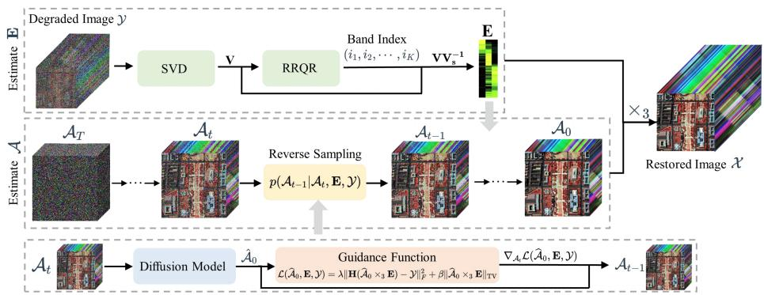
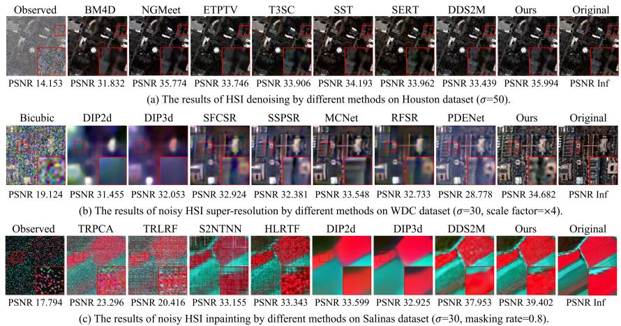
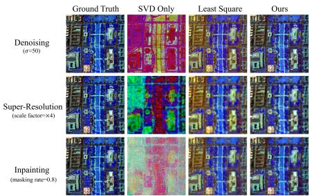

# HIR-Diff: Unsupervised Hyperspectral Image Restoration Via Improved Diffusion Models

Li Pang1,3,\*, Xiangyu Rui2,3,\*, Long Cui1,Hongzhong Wang1, Deyu Meng2,3,4, Xiangyong Cao1,3,† 1 School of Computer Science and Technology, Xi’an Jiaotong University, Xi’an, China 2 School of Mathematics and Statistics, Xi’an Jiaotong University, Xi’an, China 3 MOEKLINNS Laboratory, Xi’an Jiaotong University, Xi’an, China

4 Macao Institute of Systems Engineering, Macau University of Science and Technology, Taipa, Macao

## Abstract

Hyperspectral image (HSI) restoration aims at recovering clean images from degraded observations and plays a vital role in downstream tasks. Existing model-based methods have limitations in accurately modeling the complex image characteristics with handcraft priors, and deep learning-based methods suffer from poor generalization ability. To alleviate these issues, this paper proposes an unsupervised HSI restoration framework with pre-trained diffusion model (HIR-Diff), which restores the clean HSIs from the product of two low-rank components, i.e., the reduced image and the coefficient matrix. Specifically, the reduced image, which has a low spectral dimension, lies in the imagefield and can be inferredfrom our improved diffusion model where a new guidancefunction with total variation (TV) prior is designed to ensure that the reduced image can be well sampled. The coefficient matrix can be effectively pre-estimated based on singular value decomposition (SVD) and rank-revealing QR (RRQR) factorization. Furthermore, a novel exponential noise schedule is proposed to accelerate the restoration process (about 5× acceleration for denoising) with little performance decrease. Extensive experimental results validate the superiority of our method in both performance and speed on a variety ofHSI restoration tasks, including HSI denoising, noisy HSI superresolution, and noisy HSI inpainting. The code is available at https://github.com/LiPang/HIRDiff.

## 1. Introduction

Hyperspectral imaging is an advanced imaging technique that captures and processes a large number of narrow, contiguous spectral bands across the electromagnetic spectrum. Thus Hyperspectral images (HSIs) can provide more abundant spatial and spectral information than natural images and have extensive applications in various fields, e.g., agriculture [7, 19], mineral exploration [26, 41] and environmental monitoring [22]. However, due to sensor limitations and atmospheric interference, HSIs suffer various degeneration during the acquisition process, significantly impairing the performance of downstream tasks. Therefore, HSI restoration is very important for HSI applications and numerous methods have emerged in the past decades.

Existing HSI restoration methods can be mainly categorized into two classes, i.e. model-based approaches [50, 52, 53] and deep learning (DL)-based approaches [2, 11, 34, 37]. Model-based methods reformulate the image inverse problem as an optimization problem which contains data fidelity term and regularization term. The data fidelity term ensures that the restored image is close to the observed image and the regularization term constrains the solving space by exploiting the prior knowledge of the clean images, e.g. low-rank and total variation property. This type of method obtains good generalization ability but the handcraft priors are always subjective and thus cannot fully reveal image characteristics, leaving a large room for improvement. Additionally, the optimization problem could be very complex, resulting in high time costs and suboptimal solutions.

In the past decade, extensive DL-based approaches have been proposed for HSI restoration and these methods can learn the image structure and details from a substantial amount of clean and degraded image pairs. Despite the promising performance, the DL-based methods suffer from a poor generalization problem. Besides, training deep neural networks (DNNs) requires a lot of image pairs, but HSIs are very precious and only limited data are available in most cases. Recently, extensive diffusion-based models have emerged for image restoration tasks such as denoising [18], super-resolution [5, 18, 40, 49] and inpainting [18, 28, 39, 45, 49]. Among these methods, DDRM [18] solves linear inverse problems by performing singular value decomposition (SVD) of the linear degradation matrix and performing diffusion in the spectral space with a pre-trained diffusion model. However, the method cannot be applied directly for HSI restoration since HSIs have more bands than natural images, and the number of bands varies in different datasets due to different sensors. After that, DDS2M [32] presents a self-supervised diffusion model for HSI restoration, which restores HSI only using the degraded HSI and can be adaptive to different HSI datasets. Although demonstrating desirable HSI restoration performance and superior generalization ability, DDS2M fails to utilize prior knowledge of available datasets and takes a lot of time to complete the self-supervised training process for each dataset.

To alleviate these issues, inspired by [38] which employs pre-trained diffusion models for pansharpening, we propose an unsupervised HSI restoration framework with pre-trained diffusion model (HIR-Diff). We start from the point that HSIs can be restored from the product of two low-rank components, i.e. the reduced image and the coefficient matrix, which can be estimated separately. Concretely, the reduced image which has a low spectral dimension is defined as several linearly independent bands from the HSI and can be restored using our improved diffusion model, where we propose a new guidance function and a novel exponential noise schedule. The guidance function consisting of a data fidelity term and a total variation (TV) regularization ensures that the reduced image can be better estimated during the diffusion sampling process. The exponential noise schedule can accelerate the diffusion process, that is, it can enable the reduced image to be restored within 20 sampling steps (5× acceleration for denoising) with little performance decrease. The coefficient matrix, which is needed for the restoration of the reduced image, can be preestimated from the degraded image and a predefined band index of the reduced image without any additional information. In this work, we resort to singular value decomposition (SVD) to estimate the coefficient matrix since SVD is noise-robust. Besides, the predefined band index of the reduced image needs to be carefully designed so that each band in the reduced image contains different contents and the estimated coefficient matrix is robust to perturbations. To this end, the ranking-revealing QR (RRQR) factorization [12] which can identify the numerical rank of a matrix, is adopted to determine the band selection index.

In summary, our contributions are as follows.

• We propose an unsupervised HSI restoration framework with an improved diffusion model (HIR-Diff), which recovers the clean HSIs from the product of the reduced image and the coefficient matrix. Additionally, a new guidance function with TV prior is designed in the reverse sampling process of the diffusion model to ensure the reduced image can be well sampled.

• We propose an efficient and noise-robust method to estimate the coefficient matrix utilizing SVD and RRQR factorization. Specifically, the RRQR is adopted to predefine the band index of the reduced image so that the estimated coefficient matrix is robust to perturbations.

• We propose a novel exponential noise schedule, which can significantly accelerate the diffusion process compared with existing noise schedules (e.g., 5× acceleration for denoising) with little performance decrease.

## 2. Preliminaries

## 2.1. Diffusion Models

Diffusion models are probabilistic generative models that capture the underlying dynamics of data evolution over time [14, 44]. Owing to the powerful generation ability, diffusion models have gained considerable attention in various tasks, e.g., audio and text generation [16, 20]. A typical diffusion process contains a T-step forward process and a Tstep reverse process. The forward process starts with a clean image and progressively adds noise over T steps, while the reverse process operates in the opposite direction. Given a noise scheduler $\{ \bar { \alpha } _ { t } \} _ { t = 1 } ^ { T }$ and a clean data $x _ { 0 } ,$ , adding Gaussian noise to $x _ { 0 }$ iteratively over t iterations yields

$$
\mathbf { x } _ { t } = \sqrt { \bar { \alpha } _ { t } } \mathbf { x } _ { 0 } + ( \sqrt { 1 - \bar { \alpha } _ { t } } ) \boldsymbol { \epsilon } , \boldsymbol { \epsilon } \sim \mathcal { N } ( 0 , \mathbf { I } ) .\tag{1}
$$

A diffusion model $\epsilon _ { \theta }$ is trained to predict the noise as

$$
\epsilon _ { \theta } ( \mathbf { x } _ { t } , t ) \approx \epsilon = \frac { \mathbf { x } _ { t } - \sqrt { \bar { \alpha } _ { t } } \mathbf { x } _ { 0 } } { \sqrt { 1 - \bar { \alpha } _ { t } } } .\tag{2}
$$

The reverse process starts with random noise and progressively refines the sample over $T$ steps. Recently numerous approaches are proposed to accelerate the sampling process of diffusion models. A typical method is the denoising diffusion implicit model (DDIM) [43], where the forward process is modeled as non-Markovian. The model predicts the starting point as

$$
\hat { \mathbf { x } } _ { 0 } = \frac { \mathbf { x } _ { t } - ( \sqrt { 1 - \bar { \alpha } _ { t } } ) \epsilon _ { \theta } ( \mathbf { x } _ { t } , t ) } { \sqrt { \bar { \alpha } _ { t } } } ,\tag{3}
$$

and then $\mathbf { x } _ { t - 1 }$ is sampled as

$$
\mathbf { x } _ { t - 1 } = \sqrt { \bar { \alpha } _ { t - 1 } } \hat { \mathbf { x } } _ { 0 } + ( \sqrt { 1 - \bar { \alpha } _ { t - 1 } } ) \epsilon _ { \theta } .\tag{4}
$$

We adopt DDIM as the sampling method in this work since this model can accelerate sampling without significant performance degradation.

## 2.2. Hyperspectral Image Restoration

HSI restoration task aims to recover clean images from degraded observations and its degradation process is

$$
\mathcal { V } = \mathbf { H } ( \mathcal { X } ) + \mathcal { Z } ,\tag{5}
$$

  
Figure 1. The overall framework of the proposed HIR-Diff. First, the coefficient matrix E is estimated from the degraded image using SVD and RRQR. Then, taking the degraded image and the estimated matrix E as conditions, the reduced image A is reconstructed with an improved pre-trained diffusion model that contains a newly designed guidance function. Finally, the clean image is restored from the product of the estimated E and A.

where Y is the degraded image, X is the clean HSI, H is a known degradation operation, and Z denotes an additive Gaussian noise. For the denoising task, H is an identity operation. For the super-resolution task, H contains a blur operation and a down-sampling operation. For the inpainting task, H denotes a random mask.

## 3. Proposed Model

## 3.1. Notations

The scalar, vector, matrix and tensor are defined as $x , \mathbf { x } , \mathbf { X }$ and X , respectively. Given a third-order tensor $\qquad \mathcal { X } \quad \in$ $\mathbb { R } ^ { H \times W \times K }$ and a matrix $\mathbf { E } \in \mathbb { R } ^ { B \times K }$ , mode-3 multiplication can be defined as $\mathcal { y } = \mathcal { X } \times _ { 3 } \mathbf { E }$ , resulting in a new tensor $\mathcal { V } \in \mathbb { R } ^ { H \times W \times B }$ $\mathbf { X } _ { ( 3 ) } \in \mathbb { R } ^ { B \times H W }$ denotes the mode-3 unfolding of X and is obtained by flattening the first two dimensions of X. And $\mathbf { f o l d } _ { 3 } ( \mathbf { X } _ { ( 3 ) } )$ means reshaping $\mathbf { X } _ { ( 3 ) }$ back to X.

## 3.2. Overall Framework

Due to strong spectral correlation, HSIs thus exhibit lowrank property, which has been widely used for HSI restoration [3, 13, 21]. Following this research line, we assume that the clean HSI $\boldsymbol { \mathcal { X } } \in \mathbb { R } ^ { \tilde { H } \times W \times B }$ can be recovered as

$$
\mathcal { X } = \mathcal { A } \times _ { 3 } \mathbf { E } ,\tag{6}
$$

where $\mathcal { A } \in \mathbb { R } ^ { H \times W \times K }$ denotes the reduced image, E ∈ $\mathbb { R } ^ { B \times K }$ denotes the coefficient matrix and $K \ll B$ . Therefore, to restore the clean HSI, we first need to estimate the reduced image A and the coefficient matrix E. In this work, we propose a method to separately estimate A and E. The overall framework is illustrated in Fig. 1.

Overall, given a degraded HSI Y, we first estimate the coefficient matrix E, which is a necessary condition for the restoration of the reduced image A. Then, we estimate the reduced image A using our improved diffusion model. A is supposed to be a sequence of bands selected from the HSI so that the distribution is consistent with the diffusion priors. In other words, defining $( i _ { 1 } , i _ { 2 } , . . . , i _ { K } )$ as the band index, A satisfies $\mathbf { A } _ { ( 3 ) } = \left[ \mathbf { x } _ { i _ { 1 } } ^ { \mathrm { { T } } } , \mathbf { x } _ { i _ { 2 } } ^ { \mathrm { { T } } } , \cdot \cdot \cdot , \mathbf { x } _ { i _ { K } } ^ { \mathrm { { T } } } \right] ^ { \mathrm { { T } } }$ , where $\mathbf { x } _ { i _ { n } }$ denotes the $i _ { n }$ th row of $\mathbf { X } _ { ( 3 ) }$ . Given a predefined band index $( i _ { 1 } , i _ { 2 } , . . . , i _ { K } )$ of the reduced image and a degraded image Y, the coefficient matrix E can be estimated by singular value decomposition (SVD) without any additional information. Once E is well estimated, A could be inferred by applying our improved diffusion model with our newly designed guidance function. Moreover, an exponential noise schedule is also proposed to accelerate the sampling.

Although a restored image can be obtained for each possible predefined band selection index, the band index needs to be carefully designed to ensure that each band in A can encode different contents, which helps to generate a more robust estimation of E and thus obtain better restoration results. To this end, we resort to a classical rank revealing QR (RRQR) decomposition [12] to determine the band index. Next, we provide a more detailed description for estimating the coefficient matrix E and the reduced image A.

## 3.3. Coefficient Matrix Estimation

## 3.3.1 Coefficient Matrix Estimation Using SVD

As discussed before, the coefficient matrix E needs to be pre-estimated from an observed degraded image Y and a predefined band index $( i _ { 1 } , i _ { 2 } , . . . , i _ { K } )$ without any additional information about the reduced image A and the clean image X. To this end, inspired by [13], we resort to SVD to estimate the coefficient matrix E. First, the matrix version of the HSI Y is decomposed using the rank-K SVD as

$$
\begin{array} { r } { { \bf Y } _ { ( 3 ) } ^ { \mathrm { T } } = ( { \bf U S } ) { \bf V } ^ { \mathrm { T } } , } \end{array}\tag{7}
$$

where $\mathbf { U } \in \mathbb { R } ^ { H W \times K } , \mathbf { S } \in \mathbb { R } ^ { K \times K }$ and $\mathbf { V } \in \mathbb { R } ^ { B \times K }$ . We define $\mathbf V _ { s } = \left[ \mathbf v _ { i _ { 1 } } ^ { \mathrm T } , \mathbf v _ { i _ { 2 } } ^ { \mathrm T } , \cdot \cdot \cdot , \mathbf v _ { i _ { K } } ^ { \mathrm T } \right] ^ { \mathrm T }$ , where $\mathbf { v } _ { i _ { n } }$ denotes the $i _ { n }$ th row of V. Then we can obtain

$$
\mathbf { A _ { Y ( 3 ) } ^ { \mathrm { T } } } = ( \mathbf { U S } ) \mathbf { V _ { s } } ^ { \mathrm { T } } ,\tag{8}
$$

Combining Eq. (7) and Eq. (8), we have

$$
\mathbf { Y } _ { ( 3 ) } ^ { \mathrm { T } } = \mathbf { A } _ { \mathbf { Y } ( 3 ) } ^ { \mathrm { T } } ( \mathbf { V _ { s } ^ { \mathrm { ~ T } } } ) ^ { - 1 } \mathbf { V } ^ { \mathrm { T } } ,\tag{9}
$$

which is equivalent to

$$
\mathcal { Y } = \mathcal { A } _ { \mathbf { Y } } \times _ { 3 } ( \mathbf { V } \mathbf { V } _ { s } ^ { - 1 } ) .\tag{10}
$$

Then we have the following remark

Remark 3.1 Let $\mathbf { Y } _ { ( 3 ) } ^ { \mathrm { T } } = ( \mathbf { U S } ) \mathbf { V } ^ { \mathrm { T } }$ be the rank-K SVD of the observed HSI Y, and define $\mathbf { V } _ { s }$ as the $( i _ { 1 } , i _ { 2 } , . . . , i _ { K } ) t h$ rows ofV . Then $\mathbf { V } \mathbf { V } _ { s } ^ { - 1 }$ is equivalent to the expected E in Eq. (6) when rank K is small.

Here we provide a rough proof for this remark. Defining $\bar { \mathcal { V } } = \mathbf { H } ( \mathcal { X } )$ , the degraded image Y could be regarded as $\bar { \mathcal { D } }$ with i.i.d. Gaussian noise. $\bar { \mathcal { D } }$ can be decomposed similarly to Eq. (10), namely

$$
\bar { \mathcal { V } } = \bar { \mathcal { A } } _ { \mathbf { Y } } \times _ { 3 } ( \bar { \mathbf { V } } \bar { \mathbf { V } } _ { s } ^ { - 1 } ) ,\tag{11}
$$

where $\bar { A } _ { \mathbf { Y } }$ is the $( i _ { 1 } , i _ { 2 } , . . . , i _ { K } ) \mathbf { t h }$ bands of $\bar { \mathcal { V } } , \bar { \mathbf { V } }$ is the right singular vectors obtained from the SVD of Y¯ and $\bar { \mathbf { V } } _ { s }$ is the $( i _ { 1 } , i _ { 2 } , . . . , i _ { K } ) \mathbf { t h }$ rows of V¯ . Due to the favourable mathematical property of the SVD, V is an orthonormal matrix, i.e. $\mathbf { V } ^ { \mathrm { T } } \mathbf { \bar { V } } = \mathbf { \bar { I } }$ . The orthogonal property encourages the representations of $\mathbf { V }$ to be more distinguishable from each other, helping to keep the noise of V [13]. Additionally, when K is small, there is no significant difference between V and V¯ as the columns of V indicate the directions that capture the most significant variations in the data. Therefore, the decomposition of $\bar { \mathcal { V } }$ can be rewritten as

$$
\bar { \mathcal { V } } = \bar { \mathcal { A } } _ { \mathbf { Y } } \times _ { 3 } ( \mathbf { V } \mathbf { V } _ { s } ^ { - 1 } ) ,\tag{12}
$$

As the degradation operation H is linear and is performed in the spatial dimension, then we have

$$
{ \bar { \mathcal { D } } } = \mathbf { H } ( { \mathcal { X } } ) = \mathbf { H } ( { \mathcal { A } } \times _ { 3 } \mathbf { E } ) = \mathbf { H } ( { \mathcal { A } } ) \times _ { 3 } \mathbf { E } = { \bar { \mathcal { A } } } _ { \mathbf { Y } } \times _ { 3 } \mathbf { E } .\tag{13}
$$

By comparing Eq. (12) and Eq. (13), it can be easily seen that the coefficient matrix can be defined as

$$
\mathbf { E } = \mathbf { V } \mathbf { V } _ { s } ^ { - 1 } .\tag{14}
$$

## 3.3.2 Band Index Selection Using RRQR

While the coefficient matrix could be estimated from Eq. (14), the predefined index $( i _ { 1 } , i _ { 2 } , . . . , i _ { K } )$ of the reduced image needs to be carefully selected so that $| \operatorname* { d e t } ( \mathbf { V } _ { s } ) | > 0$ and $\mathbf { V } _ { s } ^ { - 1 }$ exists. Actually, $| \operatorname* { d e t } ( \mathbf { V } _ { s } ) |$ is expected to be large owing to the following two reasons: A larger $| \operatorname* { d e t } ( \mathbf { V } _ { s } ) |$ indicates that each band in the reduced image A encodes different image information, improving the HSI restoration performance. In addition, if | det $\left( \mathbf { V } _ { s } \right) |$ is small, the value in the coefficient matrix E could be very large, which could lead to numerical instability during the estimation process of the reduced image A. To this end, a rank-revealing QR (RRQR) algorithm proposed in [12] is employed to determine the band selection index. Using the RRQR factorization on the matrix $\mathbf { V } ^ { \mathrm { T } }$ can be decomposed as

$$
\mathbf { V } ^ { \mathrm { T } } \mathbf { I I } = \mathbf { Q R } \equiv \left[ \mathbf { Q R } _ { 1 } \mathbf { \Lambda } \mathbf { Q R } _ { 2 } \right] ,\tag{15}
$$

where $\mathbf { I } \in \mathbb { R } ^ { B \times B }$ is a permutation matrix, $\mathbf { Q } \in \mathbb { R } ^ { K \times K }$ is an orthogonal matrix and $\mathbf { R } \in \mathbb { R } ^ { K \times B }$ is an upper triangular matrix. The RRQR factorization algorithm works by interchanging any pair of columns that increases sufficiently $\mathrm { | d e t ( \mathbf { R _ { 1 } } ) | }$ . We define $\mathbf { V } _ { s } ^ { \mathrm { T } }$ as $\mathbf { Q } \mathbf { R } _ { 1 }$ and then we could obtain | det $( \mathbf { V } _ { s } ) | \mathbf { \tau } = \mathbf { \tau } | \operatorname* { d e t } ( \mathbf { R } _ { 1 } ) |$ Therefore, when the algorithm terminates, | det $\left( \mathbf { V } _ { s } \right) \rvert$ is maximized and the indices corresponding to the first K columns of the permuted matrix $\mathbf { V } ^ { \mathrm { T } } \mathbf { I I }$ can be defined as the band selection index. The choice of selection index could not cause | det $\left( \mathbf { V } _ { s } \right) |$ to be too large, which could also result in numerical instability. Concretely, from Hadamard’s inequality [9], we have

$$
\vert \operatorname* { d e t } ( \mathbf { V } _ { s } ) \vert \leq \prod _ { i = 1 } ^ { K } \vert \vert \mathbf { v s } _ { i } \vert \vert _ { 2 } ,\tag{16}
$$

where $\mathbf { v } \mathbf { s } _ { i }$ is the ith column of $\mathbf { V } _ { s }$ . Since each column v in matrix V satisfies $\| \mathbf { v } \| _ { 2 } = 1$ , we have $\| \mathbf { v } \mathbf { s } _ { i } \| _ { 2 } \leq \| \mathbf { v } _ { i } \| _ { 2 } = 1$ and $| \operatorname* { d e t } ( \mathbf { V } _ { s } ) | \leq \dot { 1 }$

## 3.4. Conditional Denoising Diffusion Model

With the pre-estimated coefficient matrix E and a predefined band index, we employ a pre-trained diffusion model to estimate the reduced image A. Recently, emerging approaches [1, 6, 8] are proposed for image generation with various conditions utilizing a pre-trained diffusion model. In general, given a condition or a guidance $\mathbf { y } ,$ these approaches model $p _ { \theta } ( \mathbf { x } _ { t - 1 } | \mathbf { x } _ { t } , \mathbf { y } )$ during the reverse sampling process by introducing gradient on $\epsilon _ { \theta }$ as

$$
\begin{array} { r } { \hat { \epsilon } _ { \theta } ( \mathbf x _ { t } , t ) = \epsilon _ { \theta } ( \mathbf x _ { t } , t ) + s ( t ) \cdot \nabla _ { \mathbf x _ { t } } \mathcal L ( \hat { \mathbf x } _ { 0 } , \mathbf y ) , } \end{array}\tag{17}
$$

where $s ( t )$ denotes the guidance strength in the tth step and $\mathcal { L }$ denotes a loss function which measures the distance between the current predicted $\hat { \mathbf { x } } _ { 0 }$ and the expected image. In our case, taking the degraded image Y and the pre-estimated coefficient matrix E as conditions, we employ diffusion models to estimate the reduced image A as shown in Fig. 1. Specifically, Eq. (17) can be rewritten as

Algorithm 1: HIR-Diff Method   
Input: $\boldsymbol { A } _ { T }$ sampled from $\mathcal { N } ( 0 , I )$ , diffusion model   
$\epsilon _ { \theta } ,$ , noise scales $\{ \bar { \alpha } _ { t } \} _ { t = 1 } ^ { T } ,$ guidance strength   
$s ( t )$ , loss function L, degraded HSI Y,   
estimated coefficient E   
Output: Clean HSI $\mathcal { X } _ { 0 }$   
for $t = T , T - 1 , \cdots 1$ do   
step 1: estimate $\hat { \mathcal { A } } _ { 0 }$ by Eq. (19)   
step 2: calculate $\mathcal { L } ( \hat { \mathcal { A } } _ { 0 } , \mathbf { E } , \mathcal { Y } )$ by Eq. (21)   
step 3: estimate $\hat { \epsilon } _ { \theta } ( A _ { t } , t )$ by Eq. (18)   
step 4: sample $\mathcal { A } _ { t - 1 }$ by Eq. (20)   
end   
$\mathcal { X } _ { 0 } = \mathcal { A } _ { 0 } \times _ { 3 }$ E   
return $\mathcal { X } _ { 0 }$

$$
\hat { \epsilon } _ { \theta } ( \mathcal { A } _ { t } , t ) = \epsilon _ { \theta } ( \mathcal { A } _ { t } , t ) + s ( t ) \cdot \nabla _ { \mathcal { A } _ { t } } \mathcal { L } ( \hat { \mathcal { A } } _ { 0 } , \mathbf { E } , \mathcal { V } ) ,\tag{18}
$$

where $\hat { A } _ { 0 }$ is estimated by Eq.(3) as

$$
\hat { \mathcal { A } } _ { 0 } = \frac { \mathcal { A } _ { t } - ( \sqrt { 1 - \bar { \alpha } _ { t } } ) \epsilon _ { \theta } ( \mathcal { A } _ { t } , t ) } { \sqrt { \bar { \alpha } _ { t } } } .\tag{19}
$$

Then $\mathcal { A } _ { t - 1 }$ is sampled from Eq. (1) as

$$
A _ { t - 1 } = \sqrt { \bar { \alpha } _ { t - 1 } } \hat { A } _ { 0 } + ( \sqrt { 1 - \bar { \alpha } _ { t - 1 } } ) \hat { \epsilon } _ { \theta } ( A _ { t } , t ) .\tag{20}
$$

The loss function $\mathcal { L } ( \hat { \mathcal { A } } _ { 0 } , \mathbf { E } , \mathcal { Y } )$ proposed in our work contains a data fidelity term and a TV regularization. The data fidelity term ensures that the predicted image closely matches the observed data. The TV term that has been widely adopted in HSI restoration [35, 36, 48] contributes to denoising and edge preservation. Specifically, the guidance function $\mathcal { L } ( \hat { \mathcal { A } } _ { 0 } , \mathbf { E } , \mathcal { Y } )$ is defined as

$$
\mathcal { L } ( \hat { A } _ { 0 } , \boldsymbol { \mathbf { E } } , \mathcal { V } ) = \lambda \| \mathbf { H } ( \hat { A } _ { 0 } \times _ { 3 } \boldsymbol { \mathbf { E } } ) - \mathcal { V } \| _ { F } ^ { 2 } + \beta \| \hat { A } _ { 0 } \times _ { 3 } \boldsymbol { \mathbf { E } } \| _ { \mathrm { T V } } ,\tag{21}
$$

where λ and $\beta$ are hyperparameters. The proposed method is summarized in Algorithm 1. When diffusion sampling finishes, the restored HSI $\mathcal { X } _ { 0 }$ is represented as $\mathcal { A } _ { 0 } \times _ { 3 } \mathbf { E }$

## 3.5. Exponential Noise Schedule

We found that when the widely used linear noise schedule [14] and the cosine noise schedule [33] are used, the Peak Signal-to-Noise Ratio (PSNR) value of the restored image fluctuates drastically at the beginning and does not converge at the end of the sampling process, as shown in Fig. 2. Increasing the sampling steps or improving the strength of the guide does not alleviate the problem. One

Figure 2. (a) The $\bar { \alpha } _ { t }$ in the linear schedule, cosine schedule and our proposed exponential schedule. (b) The PSNR values throughout the diffusion process with different noise schedules. Linear schedule (\*) and cosine schedule (\*) denote the results when the guidance strength is enhanced.

possible reason is that with the guidance information as illustrated in Eq. (17), the noise rapidly decays at the beginning of the sampling process since the diffusion process starts with random noise while the conditional image contains abundant image details. It can be observed from Eq. (1) that the noise schedule $\bar { \alpha } _ { t }$ reflects how much information is contained in the current sample. Therefore, the $\bar { \alpha } _ { t }$ is supposed to increase rapidly at the beginning, which is inconsistent with the linear schedule and cosine schedule. Besides, the PSNR value increases rapidly at the end of the sampling process, indicating that a larger $\bar { \alpha } _ { t }$ helps to refine the image details and achieve the local optimum at the end. During this stage, the diffusion prior progressively works to generate a desirable image. Therefore, we design a different noise schedule in terms of $\bar { \alpha } _ { t }$ as

$$
\bar { \alpha } _ { t } = e ^ { - k t / T } , \quad t = 1 , 2 , \cdot \cdot \cdot , T ,\tag{22}
$$

$$
\bar { \alpha } _ { t } = \frac { \bar { \alpha } _ { t } - \operatorname* { m i n } \{ \bar { \alpha } _ { t } \} _ { t = 1 } ^ { T } } { \operatorname* { m a x } \{ \bar { \alpha } _ { t } \} _ { t = 1 } ^ { T } - \operatorname* { m i n } \{ \bar { \alpha } _ { t } \} _ { t = 1 } ^ { T } } \times ( 1 - \epsilon ) + \epsilon ,\tag{23}
$$

$$
t = 1 , 2 , \cdots , T .\tag{24}
$$

where k is a hyperparamter and ϵ is a small value to prevent $\hat { \alpha } _ { 0 }$ from being zero. Our exponential noise schedule increases rapidly at the beginning and changes slowly at the end so that the random noise can converge to the observed image rapidly and the image details can be well refined.

Remark: It should be noted that our improved diffusion model modifies DDIM in two aspects, i.e. the proposed exponential noise schedule and the designed guidance function introduced in Sec. 3.4, and thus providing better sample quality and faster sampling speed. The effectiveness of the two modifications will be discussed in Sec. 4.5.

## 4. Experiment

## 4.1. Datasets and Evaluation Metrics

We evaluate the HSI restoration performance on three publicly available datasets, namely Washington DC (WDC)

Mall1 whose size is $1 2 0 8 \times 3 0 7 \times 1 9 1$ , Houston2 whose size is $3 4 9 \times 1 9 0 5 \times 1 4 4$ , and Salinas3 whose size is $5 1 2 \times 2 1 7 \times 2 2 4$ . For each dataset, we crop the center area and remove some noisy bands, deriving three HSIs with size 256 × 256 × 191, 256 × 256 × 124 and $1 2 8 \times 1 2 8 \times 1 9 0 .$ respectively. Two commonly used evaluation metrics, i.e. peak signal-to-noise ratio (PSNR) and structure similarity (SSIM), are adopted to evaluate the performance.

## 4.2. Competing Methods

HSI Denoising: The HSI denoising aims at recovering the clean HSI from its noisy observation. We mainly consider Gaussian noise, and the standard deviation of Gaussian noise σ in the range of [0, 255] is set as 30, 50, and 70, respectively. Three model based methods including BM4D [31], NGMeet [13], ETPTV [4], four deep learning based methods including T3SC [2], MACNet [51], SST [23], SERT [24] and an unsupervised deep learning based methods (i.e. DDS2M [32]) are adopted for comparison. For the DL-based methods, we use available models4 trained on ICVL5 with Gaussian noise for comparison.

Noisy HSI Super-Resolution: The noisy HSI superresolution aims at recovering the clean HSI from a noisy low-resolution observation. Specifically, the low-resolution image is obtained by first spatially blurring the clean image using a Gaussian-shape filter, then downsampling the blurred image and finally adding the image with Gaussian noise with $\sigma \ = \ 3 0 .$ Seven methods, including two unsupervised deep learning based methods, i.e. DIP2d [42] and DIP3d [42], and five supervised deep learning based methods, i.e. SFCSR [46], SSPSR [17], MCNet [25], RFSR [47], PDENet [15] are adopted for comparison. Since the pre-trained model is not available, we train all the supervised models on CAVE6 with the setting proposed in [46].

Noisy HSI Inpainting: The noisy HSI inpainting aims at recovering the clean HSI from noisy and incomplete data. Concretely, we randomly mask a portion of pixels and add the Gaussian noise (σ = 30) to the observed area. The mask rate is set as 0.7, 0.8 and 0.9, respectively. Four model-based methods (i.e. TRPCA [27], TRLRF [52], S2NTNN [30] and HLRTF [29]) and three unsupervised DL-based methods (i.e. DIP2d [42], DIP3d [42] and DDS2M [32]) are adopted for comparison.

## 4.3. Implementation Details

A pre-trained diffusion model7 trained on a large amount of 3-channel (i.e. RGB) remote sensing images [10] is used to generate the reduced image A. The diffusion sampling step T is set as 20 for all the HSI restoration tasks. All DL-based models are trained on an NVIDIA Geforce RTX 3090 GPU.

Table 1. The average quantitative results for HSI denoising. The best and second-best values are highlighted.
<table><tr><td colspan="2">standard deviation</td><td colspan="2">30</td><td colspan="2">50</td><td colspan="2">70</td><td rowspan="2">Time (s)</td></tr><tr><td>Dataset</td><td>Method</td><td>PSNR</td><td>SSIM</td><td>PSNR</td><td>SSIM</td><td>PSNR</td><td>SSIM</td></tr><tr><td rowspan="9">WDC mall</td><td>BM4D</td><td>37.09</td><td>0.90</td><td>34.48</td><td>0.83</td><td>32.81</td><td>0.77</td><td>286</td></tr><tr><td>NGMeet</td><td>43.77</td><td>0.98</td><td>41.07</td><td>0.96</td><td>39.82</td><td>0.94</td><td>65</td></tr><tr><td>ETPTV</td><td>41.08</td><td>0.95</td><td>37.12</td><td>0.91</td><td>35.15</td><td>0.87</td><td>629</td></tr><tr><td>T3SC</td><td>38.70</td><td>0.92</td><td>37.04</td><td>0.88</td><td>35.94</td><td>0.86</td><td>3</td></tr><tr><td>SST</td><td>39.09</td><td>0.93</td><td>37.24</td><td>0.90</td><td>36.19</td><td>0.87</td><td>5</td></tr><tr><td>SERT</td><td>38.98</td><td>0.93</td><td>37.08</td><td>0.89</td><td>35.90</td><td>0.86</td><td>5</td></tr><tr><td>DDS2M</td><td>41.58</td><td>0.95</td><td>39.13</td><td>0.93</td><td>38.83</td><td>0.92</td><td>3132</td></tr><tr><td>Ours</td><td>42.85</td><td>0.97</td><td>40.77</td><td>0.94</td><td>39.33</td><td>0.92</td><td>17</td></tr><tr><td>BM4D</td><td>33.89</td><td>0.84</td><td>31.83</td><td>0.77</td><td>30.57</td><td>0.72</td><td>184</td></tr><tr><td rowspan="7">Houston</td><td>NGMeet</td><td>38.50</td><td>0.94</td><td>35.77</td><td>0.89</td><td>34.36</td><td>0.85</td><td>62</td></tr><tr><td>ETPTV</td><td>35.78</td><td>0.90</td><td>33.75</td><td>0.84</td><td>32.47</td><td>0.80</td><td>322</td></tr><tr><td>T3SC</td><td>35.74</td><td>0.90</td><td>33.91</td><td>0.85</td><td>32.75</td><td>0.81</td><td>3</td></tr><tr><td>SST</td><td>36.26</td><td>0.92</td><td>34.19</td><td>0.87</td><td>32.87</td><td>0.83</td><td>6</td></tr><tr><td>SERT</td><td>36.11</td><td>0.91</td><td>33.96</td><td>0.86</td><td>32.58</td><td>0.82</td><td>4</td></tr><tr><td>DDS2M</td><td>35.64</td><td>0.91</td><td>33.44</td><td>0.85</td><td>31.96</td><td>0.79</td><td>1813</td></tr><tr><td>Ours</td><td>38.13</td><td>0.94</td><td>36.01</td><td>0.90</td><td>34.56</td><td>0.86</td><td>25</td></tr><tr><td rowspan="7">Salinas</td><td>BM4D</td><td>38.62</td><td>0.91</td><td>35.96</td><td>0.86</td><td>34.23</td><td>0.82</td><td>68</td></tr><tr><td>NGMeet</td><td>44.76</td><td>0.98</td><td>42.23</td><td>0.96</td><td>40.96</td><td>0.95</td><td>16</td></tr><tr><td>ETPTV</td><td>42.52</td><td>0.95</td><td>40.44</td><td>0.93</td><td>38.03</td><td>0.91</td><td>91</td></tr><tr><td>T3SC</td><td>41.06</td><td>0.95</td><td>39.47</td><td>0.94</td><td>38.36</td><td>0.92</td><td>3</td></tr><tr><td>SST</td><td>38.93</td><td>0.94</td><td>37.51</td><td>0.92</td><td>36.39</td><td>0.91</td><td>4</td></tr><tr><td>SERT</td><td>38.80</td><td>0.94</td><td>37.26</td><td>0.92</td><td>36.07</td><td>0.90</td><td>3</td></tr><tr><td>DDS2M</td><td>43.29</td><td>0.96</td><td>40.05</td><td>0.93</td><td>38.10</td><td>0.90</td><td>846</td></tr><tr><td></td><td>Ours</td><td>43.79</td><td>0.96</td><td>41.95</td><td>0.95</td><td>39.48</td><td>0.93</td><td>13</td></tr></table>

## 4.4. Results for HSI Restoration

The results of different methods on HSI denoising, noisy HSI super-resolution and noisy HSI inpainting are demonstrated in Table 1, Table 2 and Table 3, respectively. It can be seen that our proposed method demonstrates superior HSI restoration performance compared to other competitive models. Compared with model-based approaches (e.g., BM4D and ETPTV) which highly rely on handcraft priors, the pre-trained diffusion model employed in our method is able to capture complex intrinsic characteristics and image details from abundant data. The supervised DL-based methods suffer limited generalization ability and struggle with the restoration task of unseen data. In contrast, our model demonstrates desirable generalization ability as the employed diffusion model learns the image structure and details in a self-supervised manner, which enables the model to be competitive for various tasks and datasets. In addition, prior knowledge including low rank and total variation is introduced in our model, which helps to regularize the restoration process and thus obtain better restoration results. Moreover, other unsupervised DL-based methods, e.g., DIP2d, DIP3d and DDS2M, take lots of time to exploit the image inherent structure with an untrained neural network for each individual dataset, while our method benefitting from self-supervised training is considerably more efficient and fast. Some visual results for different tasks are shown in Fig. 3, from which it can be observed that our method can restore more accurate and reliable visual results.

Table 2. The average quantitative results for noisy HSI superresolution. The best and second-best values are highlighted.
<table><tr><td colspan="2">Scale</td><td colspan="2"> $\times 2$ </td><td colspan="2"> $\times 4$ </td><td colspan="2"> $\times 8$ </td><td rowspan="2">Time (s)</td></tr><tr><td>Dataset</td><td>Method</td><td>PSNR</td><td>SSIM</td><td>PSNR</td><td>SSIM</td><td>PSNR</td><td>SSIM</td></tr><tr><td rowspan="9">WDC mall</td><td>DIP2d</td><td>32.18</td><td>0.58</td><td>31.62</td><td>0.57</td><td>29.92</td><td>0.53</td><td>206</td></tr><tr><td>DIP3d</td><td>31.81</td><td>0.57</td><td>32.05</td><td>0.58</td><td>30.10</td><td>0.51</td><td>16644</td></tr><tr><td>SFCSR</td><td>33.74</td><td>0.71</td><td>32.92</td><td>0.66</td><td>31.85</td><td>0.58</td><td>6</td></tr><tr><td>SSPSR</td><td>33.32</td><td>0.71</td><td>32.38</td><td>0.66</td><td>30.63</td><td>0.55</td><td>6</td></tr><tr><td>MCNet</td><td>34.55</td><td>0.74</td><td>33.55</td><td>0.69</td><td>31.76</td><td>0.59</td><td>22</td></tr><tr><td>RFSR</td><td>33.70</td><td>0.72</td><td>32.73</td><td>0.66</td><td>31.06</td><td>0.56</td><td>15</td></tr><tr><td>PDENet</td><td>29.79</td><td>0.64</td><td>28.78</td><td>0.57</td><td>29.28</td><td>0.55</td><td>16</td></tr><tr><td>Ours</td><td>36.67</td><td>0.81</td><td>34.68</td><td>0.74</td><td>32.20</td><td>0.60</td><td>22</td></tr><tr><td>DIP2d</td><td>27.67</td><td>0.61</td><td>27.61</td><td>0.61</td><td>27.15</td><td>0.60</td><td>178</td></tr><tr><td rowspan="7">Houston</td><td>DIP3d</td><td>27.72</td><td>0.61</td><td>27.67</td><td>0.61</td><td>27.29</td><td>0.60</td><td>4841</td></tr><tr><td>SFCSR</td><td>29.90</td><td>0.69</td><td>29.00</td><td>0.65</td><td>27.35</td><td>0.60</td><td>5</td></tr><tr><td>SSPSR</td><td>29.99</td><td>0.72</td><td>29.12</td><td>0.67</td><td>27.49</td><td>0.61</td><td>5</td></tr><tr><td>MCNet</td><td>30.52</td><td>0.72</td><td>29.60</td><td>0.68</td><td>28.03</td><td>0.62</td><td>16</td></tr><tr><td>RFSR</td><td>30.27</td><td>0.71</td><td>29.22</td><td>0.66</td><td>27.64</td><td>0.62</td><td>10</td></tr><tr><td>PDENet</td><td>28.83</td><td>0.60</td><td>28.06</td><td>0.56</td><td>27.71</td><td>0.58</td><td>11</td></tr><tr><td>Ours</td><td>31.83</td><td>0.78</td><td>30.68</td><td>0.72</td><td>29.10</td><td>0.65</td><td>28</td></tr><tr><td rowspan="7">Salinas</td><td>DIP2d</td><td>36.29</td><td>0.88</td><td>34.35</td><td>0.84</td><td>30.72</td><td>0.75</td><td>85</td></tr><tr><td>DIP3d</td><td>35.24</td><td>0.86</td><td>34.60</td><td>0.85</td><td>32.34</td><td>0.82</td><td>1866</td></tr><tr><td>SFCSR</td><td>35.63</td><td>0.87</td><td>34.42</td><td>0.86</td><td>32.15</td><td>0.82</td><td>4</td></tr><tr><td>SSPSR</td><td>33.71</td><td>0.86</td><td>32.40</td><td>0.84</td><td>30.08</td><td>0.79</td><td>5</td></tr><tr><td>MCNet</td><td>36.01</td><td>0.89</td><td>35.13</td><td>0.87</td><td>32.47</td><td>0.82</td><td>10</td></tr><tr><td>RFSR</td><td>35.26</td><td>0.87</td><td>34.02</td><td>0.85</td><td>31.59</td><td>0.81</td><td>12</td></tr><tr><td>PDENet</td><td>31.45</td><td>0.70</td><td>30.52</td><td>0.67</td><td>31.14</td><td>0.75</td><td>8</td></tr><tr><td>Ours</td><td></td><td>39.44</td><td>0.91</td><td>37.53</td><td>0.88</td><td>34.48</td><td>0.82</td><td>14</td></tr></table>

## 4.5. Ablation Study

Reduced Image Estimation In our work, an HSI is restored from a reduced image A which is supposed to be several bands, and a corresponding coefficient matrix E. Nevertheless, there exists other alternative tensor decomposition methods to restore an HSI. One of them is directly defining the V matrix obtained from SVD as the coefficient matrix E, and employing the diffusion model to restore the ”pseudo” image $\mathcal { A } = \mathrm { f o l d } _ { 3 } ( \mathrm { \mathbf { U } } \mathbf { S } )$ . Another solution [38] is that the coefficient matrix E is estimated by solving a least square problem with several observed noisy bands, and then A is estimated from the diffusion model. The definition of these decomposition strategies is inconsistent with the diffusion prior or is susceptible to noise, leading to poor restoration results. The HSI restoration results of different decomposition strategies on WDC dataset are illustrated in Table 4 and Fig. 4. Our method demonstrates superior HSI restoration performance as the SVD operation effectively suppresses noise and the definition of the tensor A lies in the image field, which is consistent with the diffusion prior.

Table 3. The average quantitative results for noisy HSI inpainting. The best and second-best values are highlighted.
<table><tr><td colspan="2">Masking Rate</td><td colspan="2"> $\overline { { 0 . 7 } }$ </td><td colspan="2"> $\overline { { 0 . 8 } }$ </td><td colspan="2">0.9</td><td rowspan="2">Time (s)</td></tr><tr><td>Dataset</td><td>Method</td><td>PSNR</td><td>SSIM</td><td>PSNR</td><td>SSIM</td><td>PSNR</td><td>SSIM</td></tr><tr><td rowspan="8">WDC mall</td><td>TRPCA</td><td>22.29</td><td>0.23</td><td>22.72</td><td>0.22</td><td>23.30</td><td>0.22</td><td>346</td></tr><tr><td>TRLRF</td><td>22.03</td><td>0.27</td><td>20.61</td><td>0.19</td><td>11.79</td><td>0.03</td><td>1000</td></tr><tr><td>S2NTNN</td><td>35.64</td><td>0.80</td><td>33.70</td><td>0.73</td><td>31.03</td><td>0.62</td><td>32</td></tr><tr><td>HLRTF</td><td>37.03</td><td>0.85</td><td>36.07</td><td>0.82</td><td>34.08</td><td>0.72</td><td>160</td></tr><tr><td>DIP2d</td><td>31.55</td><td>0.57</td><td>31.54</td><td>0.57</td><td>30.71</td><td>0.56</td><td>50</td></tr><tr><td>DIP3d</td><td>31.47</td><td>0.57</td><td>31.90</td><td>0.57</td><td>31.69</td><td>0.57</td><td>12876</td></tr><tr><td>DDS2M</td><td>38.32</td><td>0.91</td><td>36.18</td><td>0.85</td><td>32.35</td><td>0.71</td><td>4920</td></tr><tr><td>Ours</td><td>37.90</td><td>0.87</td><td>36.82</td><td>0.83</td><td>35.08</td><td>0.76</td><td>17</td></tr><tr><td rowspan="8">Houston</td><td>TRPCA</td><td>22.13</td><td>0.21</td><td>22.46</td><td>0.21</td><td>22.84</td><td>0.22</td><td>175</td></tr><tr><td>TRLRF</td><td>21.16</td><td>0.20</td><td>19.11</td><td>0.13</td><td>13.32</td><td>0.04</td><td>768</td></tr><tr><td>S2NTNN</td><td>31.01</td><td>0.76</td><td>28.08</td><td>0.67</td><td>24.48</td><td>0.46</td><td>16</td></tr><tr><td>HLRTF</td><td>30.82</td><td>0.77</td><td>29.92</td><td>0.72</td><td>28.53</td><td>0.65</td><td>57</td></tr><tr><td>DIP2d</td><td>26.45</td><td>0.59</td><td>26.35</td><td>0.58</td><td>26.19</td><td>0.58</td><td>48</td></tr><tr><td>DIP3d</td><td>26.51</td><td>0.59</td><td>26.28</td><td>0.58</td><td>26.12</td><td>0.58</td><td>3037</td></tr><tr><td>DDS2M</td><td>31.91</td><td>0.81</td><td>30.05</td><td>0.73</td><td>29.13</td><td>0.67</td><td>2638</td></tr><tr><td>Ours</td><td>32.42</td><td>0.82</td><td>31.19</td><td>0.78</td><td>29.67</td><td>0.72</td><td>20</td></tr><tr><td rowspan="8">Salinas</td><td>TRPCA</td><td>22.67</td><td>0.18</td><td>23.30</td><td>0.20</td><td>23.96</td><td>0.23</td><td>79</td></tr><tr><td>TRLRF</td><td>22.75</td><td>0.19</td><td>20.42</td><td>0.13</td><td>13.09</td><td>0.03</td><td>324</td></tr><tr><td>S2NTNN</td><td>37.74</td><td>0.88</td><td>34.14</td><td>0.75</td><td>26.79</td><td>0.61</td><td>11</td></tr><tr><td>HLRTF</td><td>33.97</td><td>0.79</td><td>33.40</td><td>0.78</td><td>32.56</td><td>0.77</td><td>31</td></tr><tr><td>DIP2d</td><td>34.71</td><td>0.86</td><td>33.65</td><td>0.84</td><td>32.15</td><td>0.82</td><td>41</td></tr><tr><td>DIP3d</td><td>33.76</td><td>0.85</td><td>33.04</td><td>0.83</td><td>31.77</td><td>0.81</td><td>1274</td></tr><tr><td>DDS2M</td><td>40.49</td><td>0.94</td><td>38.23</td><td>0.91</td><td>36.80</td><td>0.89</td><td>1354</td></tr><tr><td>Ours</td><td>40.70</td><td>0.94</td><td>39.40</td><td>0.92</td><td>37.61</td><td>0.90</td><td>16</td></tr></table>

Table 4. The HSI restoration results of different tensor decomposition methods. ”SVD Only” denotes that the tensor A is defined as the pseudo image of SVD and ”Least Square” denotes that the matrix E is estimated by solving the least square problem.
<table><tr><td>Task</td><td colspan="2">Denoising</td><td colspan="2">Super-Resolution</td><td colspan="2">Inpainting</td></tr><tr><td>Methods</td><td>PSNR</td><td>SSIM</td><td>PSNR</td><td>SSIM</td><td>PSNR</td><td>SSIM</td></tr><tr><td>SVD Only</td><td>28.88</td><td>0.55</td><td>27.86</td><td>0.43</td><td>28.16</td><td>0.44</td></tr><tr><td>Least Square</td><td>37.53</td><td>0.89</td><td>34.37</td><td>0.73</td><td>35.55</td><td>0.79</td></tr><tr><td>Ours</td><td>40.73</td><td>0.94</td><td>34.79</td><td>0.74</td><td>37.02</td><td>0.85</td></tr></table>

Table 5. The HSI restoration results of different band selection indexes. $( \cdot , \cdot , \cdot ) ^ { * }$ denotes the bands selected using our method.
<table><tr><td>Task</td><td>Bands</td><td> $| \operatorname* { d e t } ( \mathbf { V } _ { s } ) |$ </td><td>The Maximum Value in E</td><td>PSNR</td></tr><tr><td rowspan="4">Denoising</td><td>(1, 48,96)</td><td>0.000681</td><td>7.91</td><td>27.85</td></tr><tr><td>(37, 84, 132)</td><td>0.001427</td><td>5.86</td><td>28.00</td></tr><tr><td>(73, 120, 168)</td><td>0.000068</td><td>11.57</td><td>18.40</td></tr><tr><td>(21, 31, 60)*</td><td>0.011500</td><td>1.01</td><td>44.27</td></tr><tr><td rowspan="4">Super-Resolution</td><td>(1, 48,96)</td><td>0.000195</td><td>24.86</td><td>11.02</td></tr><tr><td>(37, 84, 132)</td><td>0.000566</td><td>10.28</td><td>20.41</td></tr><tr><td>(73, 120, 168)</td><td>0.000193</td><td>12.58</td><td>9.96</td></tr><tr><td>(22, 33, 58)*</td><td>0.012835</td><td>1.00</td><td>39.68</td></tr><tr><td rowspan="4">Inpainting</td><td>(1,48,96)</td><td>0.001308</td><td>3.11</td><td>34.54</td></tr><tr><td>(37, 84, 132)</td><td>0.000617</td><td>16.07</td><td>9.93</td></tr><tr><td>(73, 120, 168)</td><td>0.000007</td><td>47.34</td><td>6.51</td></tr><tr><td>(21, 34, 58)</td><td>0.014779</td><td>1.00</td><td>41.02</td></tr></table>

Coefficient Matrix Estimation As introduced in Sec. 3.3, we employ RRQR to determine the band selection index $( i _ { 1 } , i _ { 2 } , . . . , i _ { K } )$ . The HSI restoration results on Salinas dataset of several indexes selected at equal intervals are provided in Table 5 to prove the necessity of RRQR. As can be observed, due to the low-rank property of HSIs, the determinant of $\mathbf { V } _ { s }$ could be extremely small, indicating a high similarity between the selected bands and thus resulting in large values in E and numerical instability. In contrast, the bands selected using our method encode more abundant information and provide desirable results.

  
Figure 3. The visual result comparison of all the competing methods on the HSI restoration task.

  
Figure 4. The reduced image A estimated by different methods. Ground Truth denotes the bands selected from the clean HSI.

Table 6. Ablation study of the proposed guidance function.
<table><tr><td rowspan="2">Data Fidelity Term</td><td rowspan="2">TV Regularization Term</td><td colspan="2">Denoising</td><td colspan="2">Super-Resolution</td><td colspan="2">Inpainting</td></tr><tr><td>PSNR</td><td>SSIM</td><td>PSNR</td><td>SSIM</td><td>PSNR</td><td>SSIM</td></tr><tr><td>x</td><td>x</td><td>10.12</td><td>0.07</td><td>11.49</td><td>0.16</td><td>11.13</td><td>0.08</td></tr><tr><td>√</td><td>x</td><td>34.99</td><td>0.87</td><td>27.10</td><td>0.45</td><td>29.90</td><td>0.67</td></tr><tr><td>√</td><td>V</td><td>36.14</td><td>0.90</td><td>30.70</td><td>0.72</td><td>31.71</td><td>0.80</td></tr></table>

Guidance Function The results of different guidance functions are provided in Table 6. As can be seen, the absence of any condition leads to the worst performance since the model becomes a pure generative model. In addition, the TV regularization adopted in our work contributes to the improvement of restoration performance, verifying the effectiveness of our proposed guidance function.

Noise Schedule The results of different noise schedules are shown in Table 7. The restoration performance is improved with our exponential schedule and declines much slower when the number of sampling step decreases since there are more effective steps as introduced in Sec. 3.5.

Table 7. The HSI restoration results of different noise schedules.
<table><tr><td rowspan="2">Task</td><td rowspan="2">Step ×T Schedule</td><td colspan="2">20</td><td colspan="2">50</td><td colspan="2">100</td></tr><tr><td>PSNR</td><td>SSIM</td><td>PSNR</td><td>SSIM</td><td>PSNR</td><td>SSIM</td></tr><tr><td rowspan="3">Denoising</td><td>Linear</td><td>34.34</td><td>0.86</td><td>35.18</td><td>0.88</td><td>35.70</td><td>0.89</td></tr><tr><td>Cosine</td><td>34.61</td><td>0.86</td><td>35.46</td><td>0.88</td><td>35.86</td><td>0.89</td></tr><tr><td>Exponential</td><td>36.01</td><td>0.90</td><td>36.10</td><td>0.90</td><td>36.14</td><td>0.90</td></tr><tr><td rowspan="3">Super-Resolution</td><td>Linear</td><td>29.47</td><td>0.66</td><td>30.01</td><td>0.68</td><td>30.39</td><td>0.70</td></tr><tr><td>Cosine</td><td>30.25</td><td>0.70</td><td>30.45</td><td>0.70</td><td>30.56</td><td>0.71</td></tr><tr><td>Exponential</td><td>30.68</td><td>0.72</td><td>30.69</td><td>0.72</td><td>30.70</td><td>0.72</td></tr><tr><td rowspan="3">Inpainting</td><td>Linear</td><td>29.96</td><td>0.70</td><td>30.86</td><td>0.74</td><td>31.44</td><td>0.77</td></tr><tr><td>Cosine</td><td>30.17</td><td>0.71</td><td>31.07</td><td>0.76</td><td>31.46</td><td>0.77</td></tr><tr><td>Exponential</td><td>31.19</td><td>0.78</td><td>31.65</td><td>0.79</td><td>31.71</td><td>0.80</td></tr></table>

## 5. Conclusion

In this paper, we propose an unsupervised HSI restoration approach. Using the low-rank property of HSIs, the clean HSI can be restored by the product of a reduced image and a coefficient matrix. Specifically, the coefficient matrix can be pre-estimated from the observed image using SVD and Rank-Revealing QR (RRQR), and the reduced image can be estimated from the pre-trained diffusion model with a newly designed guidance function. Additionally, the proposed exponential noise schedule has been proven to be more reasonable for our conditional diffusion model and can significantly accelerate the sampling process. Our proposed method is a universal HSI restoration framework and can perform better than other state-of-the-art methods on various HSI restoration tasks.

Acknowledgement This research was supported by National Key R&D Program of China (2021ZD0112902) and China NSFC Projects (62272375, 12226004).

## References

[1] Arpit Bansal, Hong-Min Chu, Avi Schwarzschild, Soumyadip Sengupta, Micah Goldblum, Jonas Geiping, and Tom Goldstein. Universal guidance for diffusion models. In Proceedings of the IEEE/CVF Conference on Computer Vision and Pattern Recognition, pages 843–852, 2023. 4

[2] Theo Bodrito, Alexandre Zouaoui, Jocelyn Chanussot, and´ Julien Mairal. A trainable spectral-spatial sparse coding model for hyperspectral image restoration. Advances in Neural Information Processing Systems, 34:5430–5442, 2021. 1, 6

[3] Xiangyong Cao, Qian Zhao, Deyu Meng, Yang Chen, and Zongben Xu. Robust low-rank matrix factorization under general mixture noise distributions. IEEE Transactions on Image Processing, 25(10):4677–4690, 2016. 3

[4] Yang Chen, Wenfei Cao, Li Pang, Jiangjun Peng, and Xiangyong Cao. Hyperspectral image denoising via texturepreserved total variation regularizer. IEEE Transactions on Geoscience and Remote Sensing, 2023. 6

[5] Jooyoung Choi, Sungwon Kim, Yonghyun Jeong, Youngjune Gwon, and Sungroh Yoon. Ilvr: Conditioning method for denoising diffusion probabilistic models. arXiv preprint arXiv:2108.02938, 2021. 1

[6] Hyungjin Chung, Jeongsol Kim, Michael T Mccann, Marc L Klasky, and Jong Chul Ye. Diffusion posterior sampling for general noisy inverse problems. arXiv preprint arXiv:2209.14687, 2022. 4

[7] Laura M Dale, Andre Thewis, Christelle Boudry, Ioan Ro-´ tar, Pierre Dardenne, Vincent Baeten, and Juan A Fernandez´ Pierna. Hyperspectral imaging applications in agriculture and agro-food product quality and safety control: A review. Applied Spectroscopy Reviews, 48(2):142–159, 2013. 1

[8] Ben Fei, Zhaoyang Lyu, Liang Pan, Junzhe Zhang, Weidong Yang, Tianyue Luo, Bo Zhang, and Bo Dai. Generative diffusion prior for unified image restoration and enhancement. In Proceedings of the IEEE/CVF Conference on Computer Vision and Pattern Recognition, pages 9935–9946, 2023. 4

[9] David JH Garling. Inequalities: a journey into linear analysis. Cambridge University Press, 2007. 4

[10] Wele Gedara Chaminda Bandara, Nithin Gopalakrishnan Nair, and Vishal M Patel. Remote sensing change detection (segmentation) using denoising diffusion probabilistic models. arXiv e-prints, pages arXiv–2206, 2022. 6

[11] Zhaori Gong, Nannan Wang, De Cheng, Xinrui Jiang, Jingwei Xin, Xi Yang, and Xinbo Gao. Learning deep resonant prior for hyperspectral image super-resolution. IEEE Transactions on Geoscience and Remote Sensing, 60:1–14, 2022. 1

[12] Ming Gu and Stanley C Eisenstat. Efficient algorithms for computing a strong rank-revealing qr factorization. SIAM Journal on Scientific Computing, 17(4):848–869, 1996. 2, 3, 4

[13] Wei He, Quanming Yao, Chao Li, Naoto Yokoya, and Qibin Zhao. Non-local meets global: An integrated paradigm for hyperspectral denoising. In Proceedings of the IEEE/CVF

Conference on Computer Vision and Pattern Recognition, pages 6868–6877, 2019. 3, 4, 6

[14] Jonathan Ho, Ajay Jain, and Pieter Abbeel. Denoising diffusion probabilistic models. Advances in Neural Information Processing Systems, 33:6840–6851, 2020. 2, 5

[15] Jinhui Hou, Zhiyu Zhu, Junhui Hou, Huanqiang Zeng, Jinjian Wu, and Jiantao Zhou. Deep posterior distribution-based embedding for hyperspectral image super-resolution. IEEE Transactions on Image Processing, 31:5720–5732, 2022. 6

[16] Rongjie Huang, Max WY Lam, Jun Wang, Dan Su, Dong Yu, Yi Ren, and Zhou Zhao. Fastdiff: A fast conditional diffusion model for high-quality speech synthesis. arXiv preprint arXiv:2204.09934, 2022. 2

[17] Junjun Jiang, He Sun, Xianming Liu, and Jiayi Ma. Learning spatial-spectral prior for super-resolution of hyperspectral imagery. IEEE Transactions on Computational Imaging, 6:1082–1096, 2020. 6

[18] Bahjat Kawar, Michael Elad, Stefano Ermon, and Jiaming Song. Denoising diffusion restoration models. Advances in Neural Information Processing Systems, 35:23593–23606, 2022. 1

[19] Sami Khanal, Kushal Kc, John P Fulton, Scott Shearer, and Erdal Ozkan. Remote sensing in agriculture—accomplishments, limitations, and opportunities. Remote Sensing, 12(22):3783, 2020. 1

[20] Zhifeng Kong, Wei Ping, Jiaji Huang, Kexin Zhao, and Bryan Catanzaro. Diffwave: A versatile diffusion model for audio synthesis. arXiv preprint arXiv:2009.09761, 2020. 2

[21] Damien Letexier and Salah Bourennane. Noise removal from hyperspectral images by multidimensional filtering. IEEE Transactions on Geoscience and Remote Sensing, 46(7): 2061–2069, 2008. 3

[22] Jun Li, Yanqiu Pei, Shaohua Zhao, Rulin Xiao, Xiao Sang, and Chengye Zhang. A review of remote sensing for environmental monitoring in china. Remote Sensing, 12(7):1130, 2020. 1

[23] Miaoyu Li, Ying Fu, and Yulun Zhang. Spatial-spectral transformer for hyperspectral image denoising. In Proceedings of the AAAI Conference on Artificial Intelligence, pages 1368–1376, 2023. 6

[24] Miaoyu Li, Ji Liu, Ying Fu, Yulun Zhang, and Dejing Dou. Spectral enhanced rectangle transformer for hyperspectral image denoising. In Proceedings of the IEEE/CVF Conference on Computer Vision and Pattern Recognition, pages 5805–5814, 2023. 6

[25] Qiang Li, Qi Wang, and Xuelong Li. Mixed 2d/3d convolutional network for hyperspectral image super-resolution. Remote Sensing, 12(10):1660, 2020. 6

[26] Lei Liu, Jun Zhou, Dong Jiang, Dafang Zhuang, Lamin R Mansaray, and Bing Zhang. Targeting mineral resources with remote sensing and field data in the xiemisitai area, west junggar, xinjiang, china. Remote Sensing, 5(7):3156–3171, 2013. 1

[27] Canyi Lu, Jiashi Feng, Yudong Chen, Wei Liu, Zhouchen Lin, and Shuicheng Yan. Tensor robust principal component analysis with a new tensor nuclear norm. IEEE Transactions on Pattern Analysis and Machine Intelligence, 42(4):925– 938, 2019. 6

[28] Andreas Lugmayr, Martin Danelljan, Andres Romero, Fisher Yu, Radu Timofte, and Luc Van Gool. Repaint: Inpainting using denoising diffusion probabilistic models. In Proceedings of the IEEE/CVF Conference on Computer Vision and Pattern Recognition, pages 11461–11471, 2022. 1

[29] Yisi Luo, Xi-Le Zhao, Deyu Meng, and Tai-Xiang Jiang. Hlrtf: Hierarchical low-rank tensor factorization for inverse problems in multi-dimensional imaging. In Proceedings of the IEEE/CVF Conference on Computer Vision and Pattern Recognition, pages 19303–19312, 2022. 6

[30] Yi-Si Luo, Xi-Le Zhao, Tai-Xiang Jiang, Yi Chang, Michael K Ng, and Chao Li. Self-supervised nonlinear transform-based tensor nuclear norm for multi-dimensional image recovery. IEEE Transactions on Image Processing, 31:3793–3808, 2022. 6

[31] Matteo Maggioni, Vladimir Katkovnik, Karen Egiazarian, and Alessandro Foi. Nonlocal transform-domain filter for volumetric data denoising and reconstruction. IEEE Transactions on Image Processing, 22(1):119–133, 2012. 6

[32] Yuchun Miao, Lefei Zhang, Liangpei Zhang, and Dacheng Tao. Dds2m: Self-supervised denoising diffusion spatiospectral model for hyperspectral image restoration. In Proceedings of the IEEE/CVF International Conference on Computer Vision, pages 12086–12096, 2023. 2, 6

[33] Alexander Quinn Nichol and Prafulla Dhariwal. Improved denoising diffusion probabilistic models. In International Conference on Machine Learning, pages 8162–8171. PMLR, 2021. 5

[34] Li Pang, Weizhen Gu, and Xiangyong Cao. Trq3dnet: A 3d quasi-recurrent and transformer based network for hyperspectral image denoising. Remote Sensing, 14(18):4598, 2022. 1

[35] Jiangjun Peng, Qi Xie, Qian Zhao, Yao Wang, Leung Yee, and Deyu Meng. Enhanced 3dtv regularization and its applications on hsi denoising and compressed sensing. IEEE Transactions on Image Processing, 29:7889–7903, 2020. 5

[36] Jiangjun Peng, Hailin Wang, Xiangyong Cao, Xinling Liu, Xiangyu Rui, and Deyu Meng. Fast noise removal in hyperspectral images via representative coefficient total variation. IEEE Transactions on Geoscience and Remote Sensing, 60: 1–17, 2022. 5

[37] Xiangyu Rui, Xiangyong Cao, Qi Xie, Zongsheng Yue, Qian Zhao, and Deyu Meng. Learning an explicit weighting scheme for adapting complex hsi noise. In Proceedings of the IEEE/CVF Conference on Computer Vision and Pattern Recognition, pages 6739–6748, 2021. 1

[38] Xiangyu Rui, Xiangyong Cao, Zeyu Zhu, Zongsheng Yue, and Deyu Meng. Unsupervised pansharpening via low-rank diffusion model. arXiv preprint arXiv:2305.10925, 2023. 2, 7

[39] Chitwan Saharia, William Chan, Huiwen Chang, Chris Lee, Jonathan Ho, Tim Salimans, David Fleet, and Mohammad Norouzi. Palette: Image-to-image diffusion models. In ACM SIGGRAPH 2022 Conference Proceedings, pages 1– 10, 2022. 1

[40] Chitwan Saharia, Jonathan Ho, William Chan, Tim Salimans, David J Fleet, and Mohammad Norouzi. Image

super-resolution via iterative refinement. IEEE Transactions on Pattern Analysis and Machine Intelligence, 45(4):4713– 4726, 2022. 1

[41] Hojat Shirmard, Ehsan Farahbakhsh, R Dietmar Muller, and¨ Rohitash Chandra. A review of machine learning in processing remote sensing data for mineral exploration. Remote Sensing ofEnvironment, 268:112750, 2022. 1

[42] Oleksii Sidorov and Jon Yngve Hardeberg. Deep hyperspectral prior: Single-image denoising, inpainting, superresolution. In Proceedings of the IEEE/CVF International Conference on Computer Vision Workshops, pages 0–0, 2019. 6

[43] Jiaming Song, Chenlin Meng, and Stefano Ermon. Denoising diffusion implicit models. arXiv preprint arXiv:2010.02502, 2020. 2

[44] Yang Song and Stefano Ermon. Generative modeling by estimating gradients of the data distribution. Advances in Neural Information Processing Systems, 32, 2019. 2

[45] Yang Song, Jascha Sohl-Dickstein, Diederik P Kingma, Abhishek Kumar, Stefano Ermon, and Ben Poole. Score-based generative modeling through stochastic differential equations. arXiv preprint arXiv:2011.13456, 2020. 1

[46] Qi Wang, Qiang Li, and Xuelong Li. Hyperspectral image superresolution using spectrum and feature context. IEEE Transactions on Industrial Electronics, 68(11):11276– 11285, 2020. 6

[47] Xinya Wang, Jiayi Ma, and Junjun Jiang. Hyperspectral image super-resolution via recurrent feedback embedding and spatial–spectral consistency regularization. IEEE Transactions on Geoscience and Remote Sensing, 60:1–13, 2021. 6

[48] Yao Wang, Jiangjun Peng, Qian Zhao, Yee Leung, Xi-Le Zhao, and Deyu Meng. Hyperspectral image restoration via total variation regularized low-rank tensor decomposition. IEEE Journal of Selected Topics in Applied Earth Observations and Remote Sensing, 11(4):1227–1243, 2017. 5

[49] Yinhuai Wang, Jiwen Yu, and Jian Zhang. Zero-shot image restoration using denoising diffusion null-space model. arXiv preprint arXiv:2212.00490, 2022. 1

[50] Fengchao Xiong, Jun Zhou, and Yuntao Qian. Hyperspectral restoration via l 0 gradient regularized low-rank tensor factorization. IEEE Transactions on Geoscience and Remote Sensing, 57(12):10410–10425, 2019. 1

[51] Fengchao Xiong, Jun Zhou, Qinling Zhao, Jianfeng Lu, and Yuntao Qian. Mac-net: Model-aided nonlocal neural network for hyperspectral image denoising. IEEE Transactions on Geoscience and Remote Sensing, 60:1–14, 2021. 6

[52] Longhao Yuan, Chao Li, Danilo Mandic, Jianting Cao, and Qibin Zhao. Tensor ring decomposition with rank minimization on latent space: An efficient approach for tensor completion. In Proceedings of the AAAI Conference on Artificial Intelligence, pages 9151–9158, 2019. 1, 6

[53] Hongyan Zhang, Wei He, Liangpei Zhang, Huanfeng Shen, and Qiangqiang Yuan. Hyperspectral image restoration using low-rank matrix recovery. IEEE Transactions on Geoscience and Remote Sensing, 52(8):4729–4743, 2013. 1