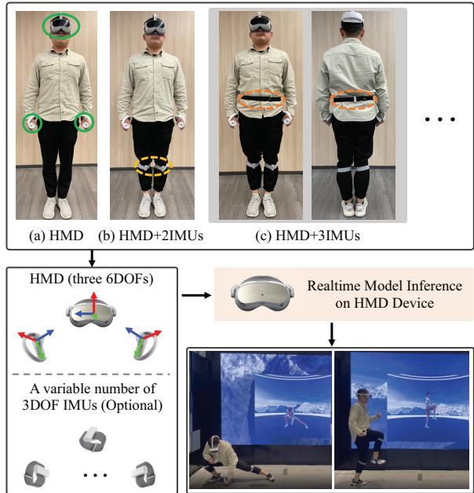
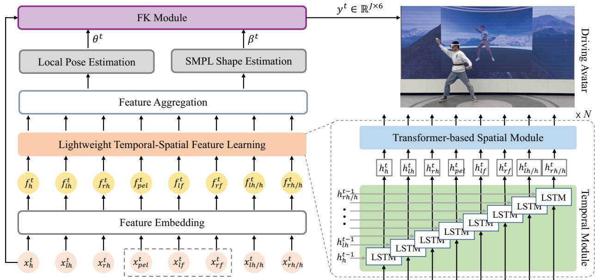
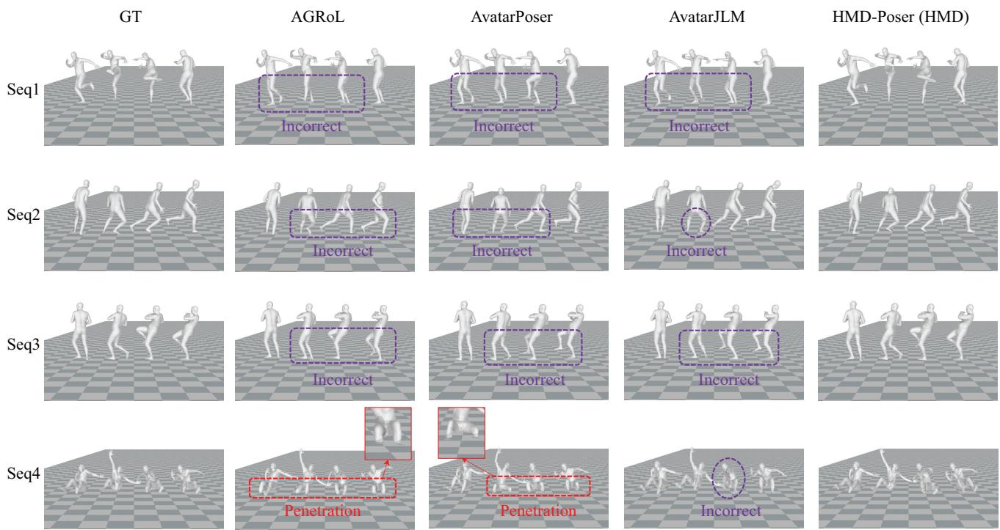
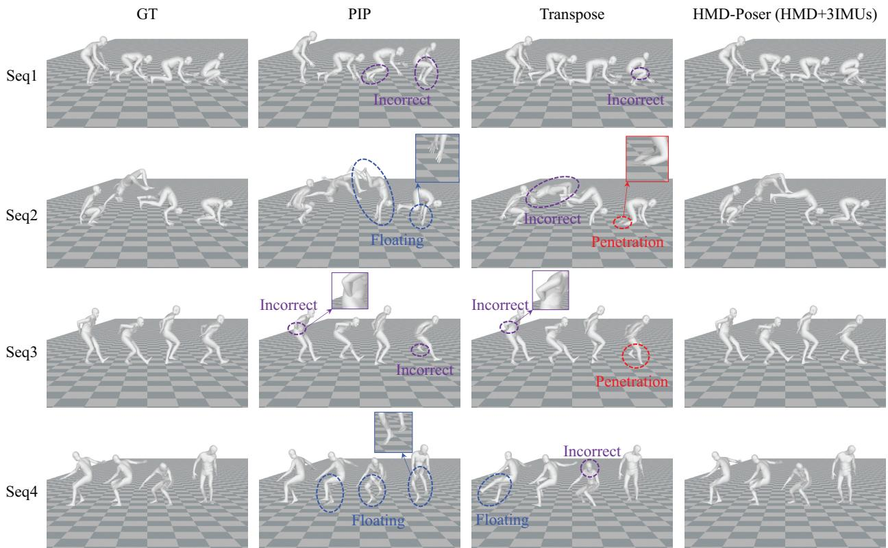
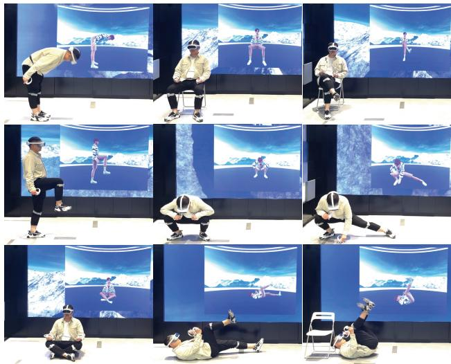

# HMD-Poser: On-Device Real-time Human Motion Tracking from Scalable Sparse Observations

Peng Dai, Yang Zhang, Tao Liu, Zhen Fan, Tianyuan Du, Zhuo Su, Xiaozheng Zheng, Zeming Li, PICO, ByteDance

{daipeng.2022, zhangyang.0621, liutao.96, fanzhen.0315, dutianyuan, suzhuo, zhengxiaozheng, lizeming.001}@bytedance.com

## Abstract

It is especially challenging to achieve real-time human motion tracking on a standalone VR Head-Mounted Display (HMD) such as Meta Quest and PICO. In this paper, we propose HMD-Poser, the first unified approach to recover full-body motions using scalable sparse observations from HMD and body-worn IMUs. In particular, it can support a variety of input scenarios, such as HMD, HMD+2IMUs, HMD+3IMUs, etc. The scalability of inputs may accommodate users’ choices for both high tracking accuracy and easy-to-wear. A lightweight temporalspatialfeature learning network is proposed in HMD-Poser to guarantee that the model runs in real-time on HMDs. Furthermore, HMD-Poser presents online body shape estimation to improve the position accuracy of body joints. Extensive experimental results on the challenging AMASS dataset show that HMD-Poser achieves new state-of-theart results in both accuracy and real-time performance. We also build a new free-dancing motion dataset to evaluate HMD-Poser’s on-device performance and investigate the performance gap between synthetic data and real-captured sensor data. Finally, we demonstrate our HMD-Poser with a real-time Avatar-driving application on a commercial HMD. Our code andfree-dancing motion dataset are available here.

## 1. Introduction

Human motion tracking (HMT), which aims at estimating the orientations and positions of body joints in 3D space, is highly demanded in various VR applications, such as gaming and social interaction. However, it is quite challenging to achieve both accurate and real-time HMT on HMDs. There are two main reasons. First, since only the user’s head and hands are tracked by HMD (including hand controllers) in the typical VR setting, estimating the user’s full-

."0"(01 +2345 .12"678-  
  
."0"(01 3"6-1 ;(-16="5782-  
'67=72B "2\$C="5"6 82\$%&' 72 >1"0D57?1

Figure 1. HMD-Poser can handle scalable input scenarios, including (a) HMD, (b) HMD+2IMUs wherein two IMUs are worn on the lower legs, (c) HMD+3IMUs wherein a third IMU is added to the pelvis, etc. HMD-Poser runs on HMD and outputs full-body motion data to drive an Avatar in real-time.

body motions, especially lower-body motions, is inherently an under-constrained problem with such sparse tracking signals. Second, computing resources are usually highly restricted in portable HMDs, which makes deploying a realtime HMT model on HMDs even harder.

Prior works have focused on improving the accuracy of full-body tracking. One category of methods utilizes three 6DOFs (degrees of freedom) from HMD to estimate fullbody motions, and they could be roughly classified into the physics-simulator-driven methods [24, 48] and the datadriven methods [3, 4, 8, 9, 16, 59]. These methods usually have difficulties in some uncorrelated upper-lower body motions where different lower-body movements are represented by similar upper-body observations. As a result, it’s hard for them to accurately drive an Avatar with unlimited movements in VR applications. The other category of methods [15, 36, 50–52] uses six 3DOF IMUs (inertial measurement units) worn on the user’s head, forearms, pelvis, and lower legs respectively for HMT. While these methods could improve lower-body tracking accuracy by adding legs’ IMU data, it’s theoretically difficult for them to provide accurate body joint positions due to the inherent drifting problem of IMU sensors. Recently, SparsePoser [38] combined HMD with three 6DOF trackers on the pelvis and feet to improve accuracy. However, 6DOF trackers usually need extra base stations which make them user-unfriendly and they are much more expensive than 3DOF IMUs.

Different from existing methods, we propose HMD-Poser to combine HMD with scalable 3DOF IMUs. Considering users’ preferences between easy-to-wear and high accuracy, HMD-Poser designs a unified framework to be compatible with scalable observations, as shown in Fig. 1. Scalability means it can handle multiple input scenarios, including a) HMD, b) HMD+2IMUs, c) HMD+3IMUs, etc. Furthermore, unlike existing works that use the same default shape parameters for joint position calculation, our HMD-Poser involves hand representations relative to the head coordinate frame to estimate the user’s body shape parameters online. It can improve the joint position accuracy when the users’ body shapes vary in real applications.

Real-time on-device execution is another key factor that affects users’ VR experience. Nevertheless, it has been overlooked in most existing methods. Recent methods [9, 16, 59] usually adopt the clip setting, i.e., processing all input data within a clip during each model inference, which may increase computational cost and time delay. Motivated by HMD-NeMo [4], our HMD-Poser introduces a lightweight temporal-spatial feature learning (TSFL) network that combines long short-term memory (LSTM) [13] networks for temporal feature capturing with Transformer [44] encoders for spatial correlation learning. With the help of the hidden state in LSTM, the input length and computational cost of the Transformer are significantly reduced, making the model real-time runnable on HMDs.

Our contributions are concluded as follows: (1) To the best of our knowledge, HMD-Poser is the first HMT solution that designs a unified framework to handle scalable sparse observations from HMD and wearable IMUs. Hence, it could recover accurate full-body poses with fewer positional drifts. (2) HMD-Poser builds a simple yet effective network by combining a set of standard components, such as LSTM [13], Transformer [44], etc. It achieves state-ofthe-art results on the AMASS dataset and runs in real-time on consumer-grade HMDs. (3) A free-dancing motion capture dataset is built for on-device evaluation. It is the first dataset that contains synchronized ground-truth 3D human motions and real-captured HMD and IMU sensor data.

## 2. Related Work

HMT has attracted much interest in recent years. Existing works generate tracking results from optical markers [11, 29, 54], depth sensors [5, 40, 41, 49, 53], monocular images [6, 14, 18–20, 22, 23, 25, 37, 42], ego-centric views [2, 26, 46, 47], single-view videos [7, 10, 27, 55, 56, 58], and multi-view videos [28, 33, 57]. Recently, methods using sparse signals from HMD or wearable IMU sensors, have received more attention [3, 9, 16, 50, 51].

## 2.1. HMT in HMD Setting

In a typical VR HMD setting, the upper body is tracked by signals from HMD with hand controllers, while the lower body’s tracking signals are absent. One advantage of this setting is that HMD could provide reliable global positions of the user’s head and hands with SLAM, rather than only 3DOF data from IMUs. Existing methods fall into two categories. First is the physics-simulator-based methods [24, 48]. QuestSim [48] and QuestEnvSim [24] utilized Nvidia’s IsaacGym [32] for physics simulation and reinforcement learning for model training. However, physics simulators are typically non-differential black boxes, making these methods incompatible with existing machine learning frameworks and difficult to deploy to HMDs. Second is the data-driven methods [3, 4, 8, 9, 16, 59]. HMD-NeMo [4], Avatarposer [16], and AvatarJLM [59] relied on regression models to establish a direct mapping from sparse tracking data to target 3D human motions. Other works tried to improve performance by generative models, such as normalizing flows [3], Variational Autoencoders (VAE) [8] and diffusion models [9]. Although these methods have shown promising results on public datasets such as AMASS [31], they still have many failure cases, e.g., when the upper body remains stationary but the lower legs move.

## 2.2. HMT from Wearable IMUs

Recent studies [15, 17, 45, 50, 51] have explored the use of six IMUs, which track the signals of the user’s head, forearms, lower-legs, and pelvis respectively, for full-body motion estimation. The pioneering work is the optimizationbased approach SIP [45], which demonstrated the feasibility of reconstructing accurate 3D full-body motion by only six IMUs, albeit with limited speed. Subsequently, a few deep learning-based approaches [15, 35] used recurrent neural networks (RNN) to improve real-time performance but were unable to estimate the global translation. TransPose [50] tried to estimate the global translation by fusing a supporting-foot-based method with an RNN-based root translation regression model. Moreover, PIP [51] introduced a physics-aware motion optimizer and TIP [17] proposed a stationary-body-points predictor to further improve the translation accuracy and physical plausibility. However, these methods are prone to positional drift due to the inevitable accumulation errors of IMU sensors, making it difficult to provide accurate joint positions.

  
Figure 2. Overview of HMD-Poser. At each time step t, each component in the input data $\boldsymbol { x } ^ { t }$ (see Eq. 1) is firstly mapped to a higherdimensional embedding feature $f ^ { t }$ via the feature embedding module. Then, a lightweight temporal-spatial feature learning network is adopted to generate representations with rich temporal and spatial correlation information. Next, two regression heads regress the local pose parameters $\theta ^ { t }$ and the shape parameters $\beta ^ { t }$ of SMPL, respectively. Finally, a forward-kinematics (FK) module is adopted to calculate the global poses and positions of all joints which are used to drive an Avatar in real-time.

HMD-Poser combines the HMD setting with scalable IMUs. IMUs worn on the pelvis and lower legs improve the lower body pose estimation, and full-body joint positions are derived from the reliable head position from HMD.

## 3. Method

## 3.1. Overview

Task. Our task is to estimate both the orientations and positions of all body joints in real-time using HMD and a variable number of IMUs. Specifically, we consider three input scenarios as shown in Fig. 1. Intuitively, the HMD scenario is the most convenient for users among the three scenarios, but with the worst tracking accuracy. While the HMD+3IMUs scenario is exactly the opposite. The HMD+2IMUs scenario balances user-friendliness and tracking accuracy, making it suitable for most applications. It’s worth noting that our method can also be applied to other HMD/IMU configurations.

Framework. As illustrated in Fig. 2, HMD-Poser’s pipeline consists of four components. (1) A feature embedding module maps the input data $x ^ { t }$ to a higher-dimensional embedding space which serves as the input to subsequent networks. (2) A lightweight TSFL network learns how each input component is related to each other and evolves over time, generating representations with rich temporal and spatial correlation. (3) With the feature aggregated from TSFL, Two MLP-based (multi-layer perceptron) heads regress the local pose parameters $\theta ^ { t }$ and the shape parameters $\beta ^ { t }$ of SMPL, respectively. (4) Given $\theta ^ { t }$ $\beta ^ { t }$ and the head position provided by HMD, a forward-kinematics (FK) module calculates all joint positions and concatenates them with $\theta ^ { t }$ to generate the final output $y ^ { t } \in \mathbb { R } ^ { ( J \times 6 ) }$ . Following previous works [16, 50], we adopt the first 22 joints of the SMPL [30] model, i.e., J = 22.

## 3.2. Scalable Input Processing

Input representation. The input signal $x ^ { t }$ contains HMD’s head and hand 6DOF data and optionally the rotation and acceleration measurements from IMUs. We follow Avatar-Poser [16] to use a concatenated vector of position, linear velocity, rotation, and angular velocity to obtain the representation for the head $\ v x _ { h } ^ { t }$ , the left hand $x _ { l h } ^ { t }$ , and the right hand $x _ { r h } ^ { t } .$ As for IMU data, we adopt a concatenated vector of rotation, angular velocity, and acceleration to obtain the representation for the pelvis $x _ { p e l } ^ { t } ,$ the left leg $x _ { l f } ^ { t }$ , and the right leg $\boldsymbol { x } _ { r f } ^ { t }$ . We represent rotation and angular velocity with a 6D vector due to its simplicity and continuity [60], resulting in $\boldsymbol { x } _ { h } ^ { t } , \boldsymbol { x } _ { l h } ^ { t } , \boldsymbol { x } _ { r h } ^ { t } \in \mathbb { R } ^ { 1 \times \bar { 1 } 8 }$ and $x _ { p e l } ^ { t } , x _ { l f } ^ { t } , x _ { r f } ^ { t } \in \mathbb { R } ^ { 1 \times 1 5 }$ . All IMU rotation and acceleration data are calibrated to a common body-centric frame before feeding to the model. To better estimate the shape parameters and improve the joint position accuracy (see Sec. 4 for more experimental results), we additionally calculate the hand representations relative to the head coordinate frame, $\boldsymbol { x } _ { l h / h } ^ { t } \in \mathbb { R } ^ { 1 \times 1 8 }$ and $\boldsymbol { x } _ { r h / h } ^ { t } \in \mathbb { R } ^ { 1 \times 1 8 }$ . Overall, the input data, $\boldsymbol { x } ^ { t } \in \mathbb { R } ^ { 1 \times 1 3 5 }$ , can be written as

$$
\boldsymbol { x ^ { t } } = [ x _ { h } ^ { t } , x _ { l h } ^ { t } , x _ { r h } ^ { t } , x _ { p e l } ^ { t } , x _ { l f } ^ { t } , x _ { r f } ^ { t } , x _ { l h / h } ^ { t } , x _ { r h / h } ^ { t } ]\tag{1}
$$

As described in Sec. 3.1, our model needs to be compatible with scalable inputs. It means that the IMU data of the pelvis $x _ { p e l } ^ { t }$ is missing in the second scenario, and all the IMU data $( x _ { p e l } ^ { t } , x _ { l f } ^ { t }$ and $x _ { r f } ^ { t } )$ is missing in the first scenario. To make our model compatible with all scenarios in a unified framework, the feature dimension of the input data remains the same for all scenarios, and the missing observations are filled with zero-padding.

Feature embedding. A set of fully connected (FC) layers is adopted to project raw input data to a higher-dimensional embedding space. Note that eight components within the input stream, as shown in Eq. 1, are processed independently, then generating the embedding representations $\widetilde { [ f _ { h } ^ { t } , f _ { l h } ^ { t } , f _ { r h } ^ { t } , f _ { p e l } ^ { t } , f _ { l f } ^ { t } , f _ { r f } ^ { t } , f _ { l h / h } ^ { t } , f _ { r h / h } ^ { t } ] } .$ . For each component, since the range of values corresponding to the orientations is different from those of the positions, we follow [4] to decouple such information and embed them via separate FC layers and concatenate the results back together.

## 3.3. Lightweight TSFL Network

After the embedding layer, components in the input are still temporally isolated and spatially independent of each other. In other words, it lacks temporal and spatial correlation information, which is the key to tracking accurate human motions. To solve this problem, two representative models, i.e., Transformer and RNN, are adopted for temporal and spatial feature learning in existing methods. Although Transformer-based methods [16, 59] have achieved state-ofthe-art results in HMT, their computational costs are much higher than RNN-based methods [50, 51] as Transformer does not preserve the hidden state and needs to recompute the entire history in the video clip at each time step. Therefore, the current Transformer-based methods are not suitable for HMD deployment.

For a sequence of length M, the time complexity of a standard Transformer block is $\mathcal { O } ( M ^ { 2 } d + M d ^ { 2 } )$ where d is the dimension of the hidden state. It means that the Transformer has a quadratic time complexity with respect to the sequence length in attention layers. To achieve both accurate and real-time human motion tracking, HMD-Poser introduces a lightweight TSFL network that combines the RNN model with the Transformer. As shown in Fig. 2, the lightweight TSFL network is composed of a stack of $N = 2$ identical blocks. And each block has two sub-blocks. The first is a set of long short-term memory (LSTM) modules to independently learn the temporal representation of each component in the input, and the second is a Transformer encoder to learn the spatial correlation among different components. The time complexity of the LSTM model is $\mathcal { O } ( d ^ { 2 } )$ which is negligible compared to that of the Transformer model. With the help of the hidden state in LSTM, the Transformer could focus on spatial feature learning within each frame. It means that the sequential length M in our Transformer is reduced to the number of input components, i.e., $M = 8 ,$ , which is much smaller than that in previous methods (e.g., M = 40 in [16] and M = 45 in [59]). As a result, our method is more than 5 times faster than previous Transformer-based methods [16, 59] in terms of a single Transformer layer. Meanwhile, by introducing LSTM to retain complete historical information, our TSFL network can result in accuracy improvements for long-period motions.

## 3.4. Position Estimation with Shape Head

Pose and shape estimation. Most previous methods [4, 9, 16, 59] only considered the pose parameters and ignored the shape parameters. In other words, they used the same default shape parameters to calculate joint positions. We argue that these methods are not optimal in practical applications, because the shape parameters usually vary by different users. This would lead to problems such as penetration, skating, and joint position errors, especially when the difference between the user’s shape parameters and the default is significant. To solve this problem, HMD-Poser adopts two regression heads named pose head and shape head. As shown in Fig. 2, the pose head aims at regressing the local pose parameters $\theta ^ { t }$ of SMPL and the shape head is responsible for shape parameters $\beta ^ { t }$ of SMPL. Both regression heads are designed as a 2-layer MLP.

Forward-Kinematics. The FK module calculates all joint positions given $\theta ^ { t } , \ \beta ^ { t }$ , and the head position in $\ v x _ { h } ^ { t }$ . We use the differentiable SMPL model [30], $\mathcal { M } ( \theta , \beta , t r a n s ) \in$ R(6890×3), as the FK module. Using the estimated joint positions and their corresponding ground-truth values can (1) train the shape head and (2) assist in reducing the accumulating error of pose estimation along the kinematic chain.

## 3.5. Training HMD-Poser

We define the overall loss function $\mathcal { L }$ as a combination of root orientation loss $\mathcal { L } _ { o r i }$ , local pose loss $\mathcal { L } _ { l r o t }$ , global pose loss $\mathcal { L } _ { g r o t } .$ , joint position loss $\mathcal { L } _ { j o i n t }$ and smooth loss $\mathcal { L } _ { s m o o t h } \colon$

$$
\begin{array} { r } { \mathcal { L } = \alpha _ { o r i } \mathcal { L } _ { o r i } + \alpha _ { l r o t } \mathcal { L } _ { l r o t } + \alpha _ { g r o t } \mathcal { L } _ { g r o t } } \\ { + \alpha _ { j o i n t } \mathcal { L } _ { j o i n t } + \alpha _ { s m o o t h } \mathcal { L } _ { s m o o t h } } \end{array}\tag{2}
$$

<table><tr><td>Method</td><td>MPJRE↓</td><td>MPJPE↓</td><td>MPJVE↓</td><td>Jitter↓</td><td>H-PE↓</td><td>U-PE↓</td><td>L-PE↓</td><td>R-PE↓</td></tr><tr><td>AvatarPoser [16]</td><td>2.94</td><td>5.84</td><td>26.60</td><td>13.97</td><td>4.58</td><td>3.24</td><td>9.59</td><td>5.05</td></tr><tr><td>AGRoL [9]</td><td>2.70</td><td>5.73</td><td>19.08</td><td>7.65</td><td>4.29</td><td>3.16</td><td>9.44</td><td>5.15</td></tr><tr><td>AvatarJLM [59]</td><td>2.81</td><td>5.03</td><td>20.91</td><td>6.94</td><td>2.01</td><td>3.00</td><td>7.96</td><td>4.58</td></tr><tr><td>Transpose [50]</td><td>3.05</td><td>4.57</td><td>22.41</td><td>7.98</td><td>3.83</td><td>3.05</td><td>6.76</td><td>4.62</td></tr><tr><td>PIP [51]</td><td>2.45</td><td>4.54</td><td>19.02</td><td>8.13</td><td>4.54</td><td>3.15</td><td>6.53</td><td>4.54</td></tr><tr><td>HMD-Poser: HMD</td><td>2.28</td><td>3.19</td><td>17.47</td><td>6.07</td><td>1.65</td><td>1.67</td><td>5.40</td><td>3.02</td></tr><tr><td>HMD-Poser: HMD+2IMUs</td><td>1.83</td><td>2.27</td><td>13.28</td><td>5.96</td><td>1.39</td><td>1.51</td><td>3.35</td><td>2.74</td></tr><tr><td>HMD-Poser: HMD+3IMUs</td><td>1.73</td><td>1.89</td><td>11.03</td><td>5.35</td><td>1.27</td><td>1.46</td><td>2.46</td><td>2.37</td></tr></table>

Table 1. Comparison with state-of-the-art HMD-based and 6IMUs-based methods on protocol1. We retrain existing approaches with their public source code and training data on this protocol. Note that we also provide head and hand positions to Transpose and PIP for a fair comparison. The best results are in bold.
<table><tr><td>Method</td><td>MPJRE↓</td><td>MPJPE↓</td><td>MPJVE↓</td><td>Jitter↓</td><td>H-PE↓</td><td>U-PE↓</td><td>L-PE↓</td><td>R-PE↓</td></tr><tr><td>AvatarPoser [16]</td><td>4.68</td><td>6.62</td><td>33.16</td><td>10.79</td><td>3.93</td><td>2.97</td><td>11.89</td><td>5.30</td></tr><tr><td>AGRoL [9]</td><td>4.38</td><td>6.74</td><td>24.14</td><td>6.33</td><td>3.53</td><td>3.02</td><td>12.11</td><td>5.86</td></tr><tr><td>AvatarJLM [59]</td><td>4.45</td><td>5.96</td><td>27.50</td><td>6.91</td><td>2.30</td><td>2.97</td><td>10.28</td><td>5.22</td></tr><tr><td>Transpose [50]</td><td>4.31</td><td>5.29</td><td>28.18</td><td>5.16</td><td>7.38</td><td>3.86</td><td>7.36</td><td>4.80</td></tr><tr><td>PIP [51]</td><td>3.61</td><td>4.16</td><td>22.22</td><td>6.89</td><td>4.28</td><td>2.97</td><td>5.89</td><td>4.30</td></tr><tr><td>HMD-Poser: HMD</td><td>4.27</td><td>5.44</td><td>30.15</td><td>5.62</td><td>2.56</td><td>2.44</td><td>9.77</td><td>4.83</td></tr><tr><td>HMD-Poser: HMD+2IMUs</td><td>3.66</td><td>3.68</td><td>20.29</td><td>6.22</td><td>1.65</td><td>2.14</td><td>5.92</td><td>4.51</td></tr><tr><td>HMD-Poser: HMD+3IMUs</td><td>3.49</td><td>3.13</td><td>16.17</td><td>4.93</td><td>1.81</td><td>2.17</td><td>4.51</td><td>3.88</td></tr></table>

Table 2. Comparison to baselines on protocol2. Similarly, we retrain existing approaches with their public source code on this protocol.

where $\alpha _ { o r i } , \ \alpha _ { l r o t } , \ \alpha _ { g r o t } , \ \alpha _ { j o i n t } ,$ and $\alpha _ { s m o o t h }$ are the weights for the respective loss terms. The root orientation loss $\mathcal { L } _ { o r i }$ , local pose loss $\mathcal { L } _ { l r o t }$ , global pose loss $\mathcal { L } _ { g r o t } .$ , and joint position loss $\mathcal { L } _ { j o i n t }$ are calculated as the mean of absolute errors (L1 norm) between the predicted values and the ground-truth values. To further enhance the temporal smoothness, we define a smooth loss as follows.

$$
\mathcal { L } _ { s m o o t h } = \frac { 1 } { \left( T - 2 \right) \times \left( 3 J \right) } \sum _ { t = 1 } ^ { T - 1 } \sum _ { i = 0 } ^ { 3 J } \left| a _ { i } ^ { t } - \hat { a } _ { i } ^ { t } \right| _ { 1 }\tag{3}
$$

where $a ^ { t }$ and $\hat { a } ^ { t }$ are the computed and the ground-truth acceleration at time t, respectively, and T is the sequential length in the training and J is the number of joints.

## 4. Experiments

In this section, we first compare our method with state-ofthe-art methods and conduct ablation studies on the public AMASS [31] dataset. Then, we present detailed quantitative and qualitative results on real-captured data using PICO 4 and PICO Motion Trackers. Note that our model can be also deployed to other commercial VR systems that provide the required orientation and position information, such as Meta’s Quest2 HMD.

Implementation details. We set $\alpha _ { o r i } , \alpha _ { l r o t } , \alpha _ { g r o t } , \alpha _ { j o i n t } ,$ and $\alpha _ { s m o o t h }$ in Eq. 2 to 1.0, 5.0, 1.0, 1.0, and 0.5, respectively. The number of blocks in the TSFL network is set to 2. Further details about the model are presented in the supplementary materials. The training data is clipped into short sequences in 40-frame lengths for more effective learning. To train HMD-Poser, we use Adam solver [21] with a batch size of 256. The learning rate starts from $1 \times 1 0 ^ { - 3 }$ and decays by a factor of 0.1 after 300 epochs. The total number of epochs for training is set to 400.

Metrics. Following [9], we use a total of 9 metrics which can be divided into three categories. The first category measures the tracking accuracy and includes the MPJRE (Mean Per-Joint Rotation Error [degrees]), MPJPE (Mean Per-Joint Position Error [cm]), H-PE (Hand), U-PE (Upper), L-PE (Lower), and R-PE (Root). The second category reflects the smoothness of the generated motions and includes the MPJVE (Mean Per-Joint Velocity Error [cm/s]) and Jitter $( 1 0 ^ { 2 } m / s ^ { 3 } )$ . The third category measures the inference speed with the FPS (Frames Per Second [Hz]).

## 4.1. Experiments on AMASS Dataset

We follow the recent common practice [3, 9, 16, 59] of using AMASS [31] dataset with two different protocols.

  
Figure 3. Qualitative comparisons between our method and state-of-the-art methods in HMD setting. When comparing with methods in this category, HMD-Poser uses the HMD input scenario for a fair comparison.

The first protocol uses three subsets CMU [12], BMLr [43] and HDM05 [34] in AMASS, and randomly splits the three datasets into 90% training data and 10% testing data. The second protocol includes more subsets in AMASS, using twelve subsets as training data and HumanEva [39] and Transition [31] as testing data. Instead of using the same default shape for all motion sequences, which is widely used in previous work [4, 9, 16, 59], we utilize the ground-truth body shape parameters to calculate the joint positions.

## 4.1.1 Comparison

As described in Sec. 2, there are two mainstream HMT methods, which use 6DOFs from HMD with hand controllers or use 3DOFs from IMUs respectively. We compare our HMD-Poser with state-of-the-art methods in both categories. Tab. 1 and Tab. 2 show the detailed quantitative results in the first and second protocols respectively. It can be concluded from these two tables that: (1) HMD-Poser surpasses all existing methods in both tracking accuracy (lower MPJRE and MPJPE) and motion smoothness (lower MPJVE and Jitter), introducing a new state-of-the-art on the AMASS dataset. (2) By adding IMU sensors to the lower legs and pelvis, all metrics especially the L-PE are significantly improved, proving the effectiveness of combining HMD with IMUs. (3) HMD-Poser in the HMD scenario, surpasses all HMD-based methods, i.e., AvatarPoser [16],

AGRoL [9] and AvatarJLM [59]. It shows that our model can obtain the best results using the same data. We attribute this performance increase to our TSFL network generating rich temporal-spatial correlation information via combining LSTM with Transformer. We provide more comparison results in each scenario in the supplementary materials.

In Fig. 3, we show the comparison results between our HMD-Poser in the HMD scenario and previous HMD-based approaches. In Fig. 4, we also provide the comparison results between our HMD-Poser in the HMD+3IMUs scenario and previous works using six IMUs. Obviously, our model could achieve better tracking accuracy and reduce abnormal issues such as floating and penetration.

## 4.1.2 Ablation Studies

We ablate our method in various settings to validate the effect of the main components in HMD-Poser. All ablation studies are conducted on protocol1 with the HMD scenario. Effect of input representation. As discussed in Sec. 3.1, HMD-Poser additionally introduces the hand representations relative to the head coordinate frame to improve joint tracking accuracy. Tab. 3 presents the results with and without these representations. As shown, adding these input features could improve both the accuracy and smoothness of the generated motion. In particular, it reduces the H-PE by a large margin, which proves its effectiveness in estimating

  
Figure 4. Qualitative comparisons between our method and 6IMUs-based methods. For a fair comparison, we provide head and hand positions to the baselines and compare them with our method under the HMD+3IMUs input scenario.

bone lengths on the chain from head to hands.
<table><tr><td>Method</td><td>MPJRE</td><td>MPJPE</td><td>H-PE</td><td>Jitter</td></tr><tr><td>w/o  $\{ x _ { l h / h } ^ { t } , x _ { r h / h } ^ { t } \}$ </td><td>2.45</td><td>3.43</td><td>2.36</td><td>6.25</td></tr><tr><td>with  $\{ \boldsymbol { x } _ { l h / h } ^ { t } , \boldsymbol { x } _ { r h / h } ^ { t } \}$ </td><td>2.28</td><td>3.19</td><td>1.65</td><td>6.07</td></tr></table>

Table 3. Evaluating the effect of adding hand representations relative to the head coordinate frame to input representation.

<table><tr><td>Method</td><td>MPJRE</td><td>MPJPE</td><td>H-PE</td><td>Jitter</td></tr><tr><td>w/o ShapeHead</td><td>2.32</td><td>5.08</td><td>4.25</td><td>6.11</td></tr><tr><td>with ShapeHead</td><td>2.28</td><td>3.19</td><td>1.65</td><td>6.07</td></tr></table>

Table 4. Evaluating the effect of the shape regression head. The default shape is used when there is no shape regression head.

Effect of the shape head. Here, we compare the results with and without a shape regression head in Tab. 4. It can be concluded that the shape regression head has a significant contribution to reducing position errors (lower MPJPE and H-PE). This also indicates that joint position estimation is sensitive to differences in shape parameters among users, and it is unreasonable for previous methods to use the same default body shape for joint position calculation.

For more experiments on the effect of the model size and each loss term, please refer to our supplementary materials.

## 4.2. Experiments on VR Devices

Existing human motion capture datasets, such as AMASS, are built on optical markers and do not contain HMD and IMU sensor data. So all existing methods used synthetic input signals from ground-truth data. And they did not cover some common issues in real VR applications, such as sensor measurement errors, calibration errors, etc. To investigate the model’s performance gap between synthetic and real data and evaluate our HMD-Poser’s performance running on HMDs, we built an additional dataset of real-captured data with HMD+2IMUs. It contains 74 free-dancing motions from 8 subjects (3 male and 5 female) wearing PICO 4 and 2 PICO motion trackers on the lower legs. Each motion sequence contains both the input HMD and IMU sensor data and the ground-truth SMPL parameters obtained via OptiTrack [1] and Mosh++ [29]. Meanwhile, a pre-trained model using AMASS data is deployed to PICO 4 HMD, and the model output is stored for evaluation. Please refer to supplementary materials for further details.

<table><tr><td>Method</td><td>MPJRE↓</td><td>MPJPE↓</td><td>MPJVE↓</td><td>Jitter↓</td><td>H-PE↓</td><td>U-PE↓</td><td>L-PE↓</td><td>R-PE↓</td></tr><tr><td>HMD-Poser (Online)</td><td>6.48</td><td>6.55</td><td>30.60</td><td>16.96</td><td>8.10</td><td>5.25</td><td>8.52</td><td>7.13</td></tr><tr><td>HMD-Poser (Offline)</td><td>6.45</td><td>6.53</td><td>30.56</td><td>16.95</td><td>8.01</td><td>5.20</td><td>8.46</td><td>6.98</td></tr><tr><td>HMD-Poser (Offline*)</td><td>4.77</td><td>4.75</td><td>22.30</td><td>15.25</td><td>2.09</td><td>3.35</td><td>6.77</td><td>6.06</td></tr></table>

Table 5. Comparisons between our HMD-Poser method running offline and running on PICO 4 HMD. We choose the HMD+2IMUs input scenario for evaluation as it is suitable for most VR applications. \* indicates results using synthetic input from ground-truth data.

  
Figure 5. Results of real-time Avatar-driving on PICO 4 HMD.

## 4.2.1 Quantitative Results

First, we make a quantitative comparison between our HMD-Poser method running offline and running on PICO 4 HMD. In this experiment, we all use real sensor data from HMD and IMUs. As shown in Tab. 5, the performance gap between offline and online is small and it demonstrates that our HMD-Poser could run in real-time on portable HMDs with limited computing resources and achieve similar tracking performance as offline. Second, we compare the experimental results using synthetic and real data. The results using synthetic data are much better than those using real data, especially for the H-PE metric. The results are in line with expectations, as the connection between the user’s hand and the hand controllers is not rigid all the time. When there are relative motions between them, the transformation matrix from the hand controller to the hand would deviate from the calibration results, resulting in large H-PE.

## 4.2.2 Qualitative Results

We qualitatively demonstrate our HMD-Poser’s on-device performance with a real-time Avatar-driving application on PICO 4. As shown in Fig. 5, the Avatar’s motions are almost identical to those of the human. It demonstrates that our method could accurately reconstruct full-body motions in real-time in most sequences. Please refer to the videos in

<table><tr><td>Method</td><td>FPS (GPU)↑</td><td>FPS (HMD)↑</td></tr><tr><td>AvatarPoser [16]</td><td>114.1</td><td></td></tr><tr><td>AGRoL [9]</td><td>60.8</td><td></td></tr><tr><td>AvatarJLM [59]</td><td>1.9</td><td></td></tr><tr><td>Transpose [50]</td><td>123.0</td><td></td></tr><tr><td>PIP [51]</td><td>62.5</td><td></td></tr><tr><td>HMD-Poser (Ours)</td><td>205.7</td><td>90.0</td></tr></table>

Table 6. Comparison with baselines in terms of inference speed.  
the supplementary materials for more qualitative results.

## 4.3. Inference Speed

For a fair comparison, we calculate the FPS of all methods running on the same NVIDIA GeForce RTX 3080 device, and present the results in Tab. 6. Owing to our lightweight TSFL network, HMD-Poser achieves an inference frequency of 205.7Hz on GPU and outperforms all existing methods by a large margin. Meanwhile, our HMD-Poser can reach a frequency of 90.0Hz on PICO 4 HMD, which has not been demonstrated in previous methods.

## 5. Conclusion

In this paper, we present HMD-Poser, the first unified approach to recovering full-body motions with scalable sparse observations from HMD and wearable IMUs. Meanwhile, HMD-Poser proposes a lightweight TSFL network, making it deployable to consumer-level HMD devices and runnable in real-time. We experimentally demonstrate that our method achieves superior results with respect to stateof-the-art methods on the public AMASS dataset.In addition, we build an additional dataset of real-captured HMD and IMU data to validate that HMD-Poser could run online in portable HMDs and while maintaining similar tracking accuracy. We believe that our method paves a new way for human motion tracking on VR platforms.

Limitation and future works. As a data-driven method, our approach is also highly dependent on large-scale training data, and more real-captured training data can also contribute greatly to the task. Besides, due to the limitation of IMU itself, our method may struggle to disambiguate lowerbody poses with similar measurements, such as slowly and uniformly lifting one foot vertically.

## References

[1] Optitrack motion systems. https://optitrack.com/. 7

[2] Hiroyasu Akada, Jian Wang, Soshi Shimada, Masaki Takahashi, Christian Theobalt, and Vladislav Golyanik. Unrealego: A new dataset for robust egocentric 3d human motion capture. In Proceedings of the European Conference on Computer Vision, pages 1–17. Springer, 2022. 2

[3] Sadegh Aliakbarian, Pashmina Cameron, Federica Bogo, Andrew Fitzgibbon, and Thomas J Cashman. Flag: Flowbased 3d avatar generation from sparse observations. In Proceedings of the IEEE/CVF Conference on Computer Vision and Pattern Recognition, pages 13253–13262, 2022. 2, 5

[4] Sadegh Aliakbarian, Fatemeh Saleh, David Collier, Pashmina Cameron, and Darren Cosker. Hmd-nemo: Online 3d avatar motion generation from sparse observations. In Proceedings of the IEEE/CVF International Conference on Computer Vision, pages 9622–9631, 2023. 2, 4, 6

[5] Renat Bashirov, Anastasia Ianina, Karim Iskakov, Yevgeniy Kononenko, Valeriya Strizhkova, Victor Lempitsky, and Alexander Vakhitov. Real-time rgbd-based extended body pose estimation. In Proceedings of the IEEE/CVF Winter Conference on Applications of Computer Vision, pages 2807–2816, 2021. 2

[6] Federica Bogo, Angjoo Kanazawa, Christoph Lassner, Peter Gehler, Javier Romero, and Michael J Black. Keep it smpl: Automatic estimation of 3d human pose and shape from a single image. In Proceedings of the European Conference on Computer Vision, pages 561–578. Springer, 2016. 2

[7] Xin Chen, Zhuo Su, Lingbo Yang, Pei Cheng, Lan Xu, Bin Fu, and Gang Yu. Learning variational motion prior for video-based motion capture. arXiv preprint arXiv:2210.15134, 2022. 2

[8] Andrea Dittadi, Sebastian Dziadzio, Darren Cosker, Ben Lundell, Thomas J Cashman, and Jamie Shotton. Fullbody motion from a single head-mounted device: Generating smpl poses from partial observations. In Proceedings ofthe IEEE/CVF International Conference on Computer Vision, pages 11687–11697, 2021. 2

[9] Yuming Du, Robin Kips, Albert Pumarola, Sebastian Starke, Ali Thabet, and Artsiom Sanakoyeu. Avatars grow legs: Generating smooth human motion from sparse tracking inputs with diffusion model. In Proceedings of the IEEE/CVF Conference on Computer Vision and Pattern Recognition, pages 481–490, 2023. 2, 4, 5, 6, 8

[10] Erik Gartner, Mykhaylo Andriluka, Hongyi Xu, and Cristian¨ Sminchisescu. Trajectory optimization for physics-based reconstruction of 3d human pose from monocular video. In Proceedings of the IEEE/CVF Conference on Computer Vision and Pattern Recognition, pages 13106–13115, 2022. 2

[11] Nima Ghorbani and Michael J Black. Soma: Solving optical marker-based mocap automatically. In Proceedings of the IEEE/CVF International Conference on Computer Vision, pages 11117–11126, 2021. 2

[12] CMU graphics lab. Cmu graphics lab motion capture database. http://mocap.cs.cmu.edu/, 2000. 6

[13] Sepp Hochreiter and Jurgen Schmidhuber. Long short-term¨ memory. Neural computation, 9(8):1735–1780, 1997. 2

[14] Buzhen Huang, Liang Pan, Yuan Yang, Jingyi Ju, and Yangang Wang. Neural mocon: Neural motion control for physically plausible human motion capture. In Proceedings of the IEEE/CVF Conference on Computer Vision and Pattern Recognition, pages 6417–6426, 2022. 2

[15] Yinghao Huang, Manuel Kaufmann, Emre Aksan, Michael J Black, Otmar Hilliges, and Gerard Pons-Moll. Deep inertial poser: Learning to reconstruct human pose from sparse inertial measurements in real time. ACM Transactions on Graphics, 37(6):1–15, 2018. 2

[16] Jiaxi Jiang, Paul Streli, Huajian Qiu, Andreas Fender, Larissa Laich, Patrick Snape, and Christian Holz. Avatarposer: Articulated full-body pose tracking from sparse motion sensing. In Proceedings of the European Conference on Computer Vision, pages 443–460, 2022. 2, 3, 4, 5, 6, 8

[17] Yifeng Jiang, Yuting Ye, Deepak Gopinath, Jungdam Won, Alexander W Winkler, and C Karen Liu. Transformer inertial poser: Attention-based real-time human motion reconstruction from sparse imus. arXiv preprint arXiv:2203.15720, 2022. 2, 3

[18] Hanbyul Joo, Natalia Neverova, and Andrea Vedaldi. Exemplar fine-tuning for 3d human pose fitting towards in-the-wild 3d human pose estimation. arXiv preprint arXiv:2004.03686, 2020. 2

[19] Angjoo Kanazawa, Michael J Black, David W Jacobs, and Jitendra Malik. End-to-end recovery of human shape and pose. In Proceedings of the IEEE/CVF Conference on Computer Vision and Pattern Recognition, pages 7122–7131, 2018.

[20] Angjoo Kanazawa, Jason Y. Zhang, Panna Felsen, and Jitendra Malik. Learning 3d human dynamics from video. In Proceedings of the IEEE/CVF Conference on Computer Vision and Pattern Recognition, 2019. 2

[21] Diederik P Kingma and Jimmy Ba. Adam: A method for stochastic optimization. arXiv preprint arXiv:1412.6980, 2014. 5

[22] Muhammed Kocabas, Nikos Athanasiou, and Michael J. Black. Vibe: Video inference for human body pose and shape estimation. In Proceedings of the IEEE/CVF Conference on Computer Vision and Pattern Recognition, 2020. 2

[23] Muhammed Kocabas, Chun-Hao P. Huang, Otmar Hilliges, and Michael J. Black. Pare: Part attention regressor for 3d human body estimation. In Proceedings of the IEEE/CVF International Conference on Computer Vision, pages 11127– 11137, 2021. 2

[24] Sunmin Lee, Sebastian Starke, Yuting Ye, Jungdam Won, and Alexander Winkler. Questenvsim: Environment-aware simulated motion tracking from sparse sensors. arXiv preprint arXiv:2306.05666, 2023. 2

[25] Jiefeng Li, Siyuan Bian, Qi Liu, Jiasheng Tang, Fan Wang, and Cewu Lu. Niki: Neural inverse kinematics with invertible neural networks for 3d human pose and shape estimation. In Proceedings of the IEEE/CVF Conference on Computer Vision and Pattern Recognition, pages 12933–12942, 2023. 2

[26] Jiaman Li, Karen Liu, and Jiajun Wu. Ego-body pose estimation via ego-head pose estimation. In Proceedings of

the IEEE/CVF Conference on Computer Vision and Pattern Recognition, pages 17142–17151, 2023. 2

[27] Wenhao Li, Hong Liu, Hao Tang, Pichao Wang, and Luc Van Gool. Mhformer: Multi-hypothesis transformer for 3d human pose estimation. In Proceedings of the IEEE/CVF Conference on Computer Vision and Pattern Recognition, pages 13147–13156, 2022. 2

[28] Zhongguo Li, Magnus Oskarsson, and Anders Heyden. 3d human pose and shape estimation through collaborative learning and multi-view model-fitting. In Proceedings of the IEEE/CVF Winter Conference on Applications of Computer Vision, pages 1888–1897, 2021. 2

[29] Matthew Loper, Naureen Mahmood, and Michael J Black. Mosh: motion and shape capture from sparse markers. ACM Transactions on Graphics., 33(6):220–1, 2014. 2, 7

[30] Matthew Loper, Naureen Mahmood, Javier Romero, Gerard Pons-Moll, and Michael J Black. Smpl: A skinned multiperson linear model. ACM Transactions on Graphics, 34(6): 1–16, 2015. 3, 4

[31] Naureen Mahmood, Nima Ghorbani, Nikolaus F Troje, Gerard Pons-Moll, and Michael J Black. Amass: Archive of motion capture as surface shapes. In Proceedings of the IEEE/CVF International Conference on Computer Vision, pages 5442–5451, 2019. 2, 5, 6

[32] Viktor Makoviychuk, Lukasz Wawrzyniak, Yunrong Guo, Michelle Lu, Kier Storey, Miles Macklin, David Hoeller, Nikita Rudin, Arthur Allshire, Ankur Handa, et al. Isaac gym: High performance gpu-based physics simulation for robot learning. arXiv preprint arXiv:2108.10470, 2021. 2

[33] Rahul Mitra, Nitesh B Gundavarapu, Abhishek Sharma, and Arjun Jain. Multiview-consistent semi-supervised learning for 3d human pose estimation. In Proceedings of the IEEE/CVF Conference on Computer Vision and Pattern Recognition, pages 6907–6916, 2020. 2

[34] Meinard Muller, Tido R¨ oder, Michael Clausen, Bernhard¨ Eberhardt, Bjorn Kr¨ uger, and Andreas Weber. Mocap¨ database hdm05. Institutfur Informatik II, Universit¨ at Bonn¨ , 2(7), 2007. 6

[35] Deepak Nagaraj, Erik Schake, Patrick Leiner, and Dirk Werth. An rnn-ensemble approach for real time human pose estimation from sparse imus. In Proceedings ofthe 3rd International Conference on Applications of Intelligent Systems, pages 1–6, 2020. 2

[36] Shaohua Pan, Qi Ma, Xinyu Yi, Weifeng Hu, Xiong Wang, Xingkang Zhou, Jijunnan Li, and Feng Xu. Fusing monocular images and sparse imu signals for real-time human motion capture. arXiv preprint arXiv:2309.00310, 2023. 2

[37] Georgios Pavlakos, Vasileios Choutas, Nima Ghorbani, Timo Bolkart, Ahmed A. A. Osman, Dimitrios Tzionas, and Michael J. Black. Expressive body capture: 3d hands, face, and body from a single image. In Proceedings IEEE/CVF Conference on Computer Vision and Pattern Recognition, pages 10975–10985, 2019. 2

[38] Jose Luis Ponton, Haoran Yun, Andreas Aristidou, Carlos Andujar, and Nuria Pelechano. Sparseposer: Real-time fullbody motion reconstruction from sparse data. ACM Transactions on Graphics, 43(1):1–14, 2023. 2

[39] Leonid Sigal, Alexandru O Balan, and Michael J Black. Humaneva: Synchronized video and motion capture dataset and baseline algorithm for evaluation of articulated human motion. International Journal of Computer Vision, 87(1-2):4, 2010. 6

[40] Zhuo Su, Lan Xu, Zerong Zheng, Tao Yu, Yebin Liu, and Lu Fang. Robustfusion: Human volumetric capture with datadriven visual cues using a rgbd camera. In Proceedings ofthe European Conference on Computer Vision, pages 246–264. Springer, 2020. 2

[41] Zhuo Su, Lan Xu, Dawei Zhong, Zhong Li, Fan Deng, Shuxue Quan, and Lu Fang. Robustfusion: Robust volumetric performance reconstruction under human-object interactions from monocular rgbd stream. IEEE Transactions on Pattern Analysis and Machine Intelligence, 45(5):6196– 6213, 2022. 2

[42] Shashank Tripathi, Lea Muller, Chun-Hao P Huang, Omid¨ Taheri, Michael J Black, and Dimitrios Tzionas. 3d human pose estimation via intuitive physics. In Proceedings of the IEEE/CVF Conference on Computer Vision and Pattern Recognition, pages 4713–4725, 2023. 2

[43] Nikolaus F Troje. Decomposing biological motion: A framework for analysis and synthesis of human gait patterns. Journal ofVision, 2(5):2–2, 2002. 6

[44] Ashish Vaswani, Noam Shazeer, Niki Parmar, Jakob Uszkoreit, Llion Jones, Aidan N Gomez, Łukasz Kaiser, and Illia Polosukhin. Attention is all you need. Advances in neural information processing systems, 30, 2017. 2

[45] Timo Von Marcard, Bodo Rosenhahn, Michael J Black, and Gerard Pons-Moll. Sparse inertial poser: Automatic 3d human pose estimation from sparse imus. In Computer Graphics Forum, pages 349–360. Wiley Online Library, 2017. 2

[46] Jian Wang, Lingjie Liu, Weipeng Xu, Kripasindhu Sarkar, and Christian Theobalt. Estimating egocentric 3d human pose in global space. In Proceedings of the IEEE/CVF International Conference on Computer Vision, pages 11500– 11509, 2021. 2

[47] Jian Wang, Diogo Luvizon, Weipeng Xu, Lingjie Liu, Kripasindhu Sarkar, and Christian Theobalt. Scene-aware egocentric 3d human pose estimation. In Proceedings of the IEEE/CVF Conference on Computer Vision and Pattern Recognition, pages 13031–13040, 2023. 2

[48] Alexander Winkler, Jungdam Won, and Yuting Ye. Questsim: Human motion tracking from sparse sensors with simulated avatars. In SIGGRAPH Asia, pages 1–8, 2022. 2

[49] L. Xu, Z. Su, L. Han, T. Yu, Y. Liu, and L. FANG. Unstructuredfusion: Realtime 4d geometry and texture reconstruction using commercialrgbd cameras. IEEE Transactions on Pattern Analysis and Machine Intelligence, pages 1–1, 2019. 2

[50] Xinyu Yi, Yuxiao Zhou, and Feng Xu. Transpose: Real-time 3d human translation and pose estimation with six inertial sensors. ACM Transactions on Graphics, 40(4):1–13, 2021. 2, 3, 4, 5, 8

[51] Xinyu Yi, Yuxiao Zhou, Marc Habermann, Soshi Shimada, Vladislav Golyanik, Christian Theobalt, and Feng Xu. Physical inertial poser (pip): Physics-aware real-time human motion tracking from sparse inertial sensors. In Proceedings of

the IEEE/CVF Conference on Computer Vision and Pattern Recognition, pages 13167–13178, 2022. 2, 3, 4, 5, 8

[52] Xinyu Yi, Yuxiao Zhou, Marc Habermann, Vladislav Golyanik, Shaohua Pan, Christian Theobalt, and Feng Xu. Egolocate: Real-time motion capture, localization, and mapping with sparse body-mounted sensors. arXiv preprint arXiv:2305.01599, 2023. 2

[53] Tao Yu, Zerong Zheng, Kaiwen Guo, Jianhui Zhao, Qionghai Dai, Hao Li, Gerard Pons-Moll, and Yebin Liu. Doublefusion: Real-time capture of human performances with inner body shapes from a single depth sensor. In Proceedings of the IEEE Conference on Computer Vision and Pattern Recognition, pages 7287–7296, 2018. 2

[54] Mihai Zanfir, Andrei Zanfir, Eduard Gabriel Bazavan, William T Freeman, Rahul Sukthankar, and Cristian Sminchisescu. Thundr: Transformer-based 3d human reconstruction with markers. In Proceedings of the IEEE/CVF International Conference on Computer Vision, pages 12971–12980, 2021. 2

[55] Yu Zhan, Fenghai Li, Renliang Weng, and Wongun Choi. Ray3d: ray-based 3d human pose estimation for monocular absolute 3d localization. In Proceedings of the IEEE/CVF Conference on Computer Vision and Pattern Recognition, pages 13116–13125, 2022. 2

[56] Jinlu Zhang, Zhigang Tu, Jianyu Yang, Yujin Chen, and Junsong Yuan. Mixste: Seq2seq mixed spatio-temporal encoder for 3d human pose estimation in video. In Proceedings of the IEEE/CVF Conference on Computer Vision and Pattern Recognition, pages 13232–13242, 2022. 2

[57] Yifu Zhang, Chunyu Wang, Xinggang Wang, Wenyu Liu, and Wenjun Zeng. Voxeltrack: Multi-person 3d human pose estimation and tracking in the wild. IEEE Transactions on Pattern Analysis and Machine Intelligence, 45(2):2613– 2626, 2022. 2

[58] Ce Zheng, Sijie Zhu, Matias Mendieta, Taojiannan Yang, Chen Chen, and Zhengming Ding. 3d human pose estimation with spatial and temporal transformers. In Proceedings of the IEEE/CVF International Conference on Computer Vision, pages 11656–11665, 2021. 2

[59] Xiaozheng Zheng, Zhuo Su, Chao Wen, Zhou Xue, and Xiaojie Jin. Realistic full-body tracking from sparse observations via joint-level modeling. In Proceedings of the IEEE/CVF International Conference on Computer Vision, pages 14678–14688, 2023. 2, 4, 5, 6, 8

[60] Yi Zhou, Connelly Barnes, Jingwan Lu, Jimei Yang, and Hao Li. On the continuity of rotation representations in neural networks. In Proceedings of the IEEE/CVF Conference on Computer Vision and Pattern Recognition, pages 5745– 5753, 2019. 4