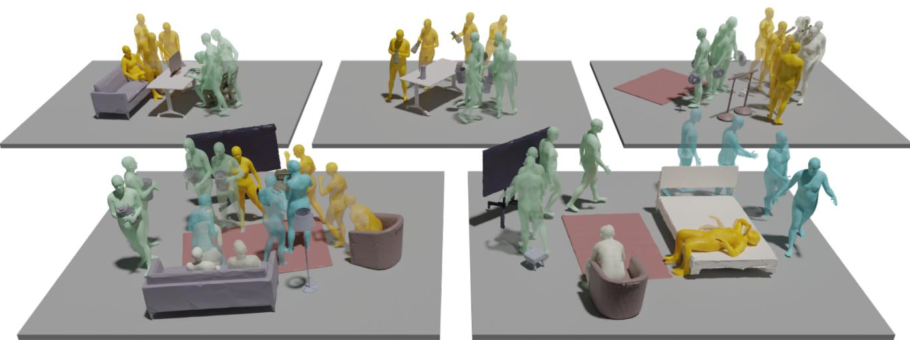
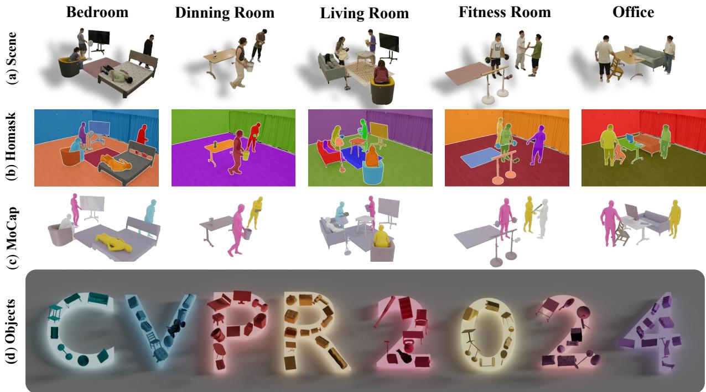
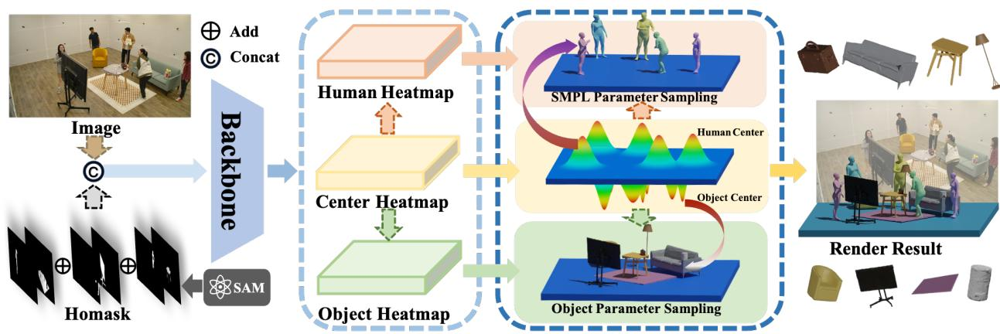
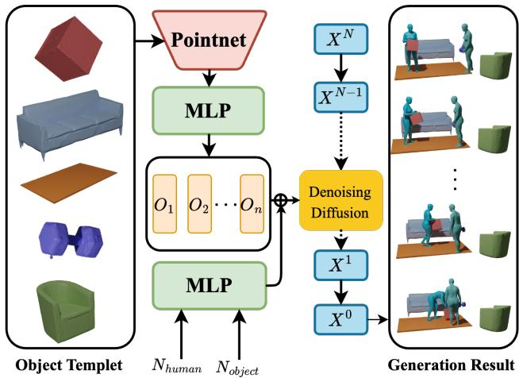
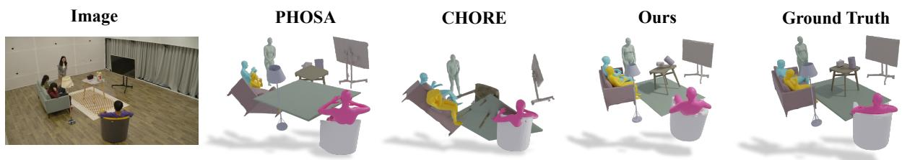
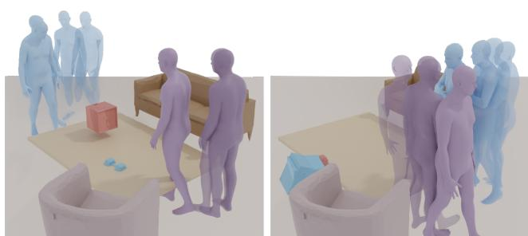

# HOI-M3: Capture Multiple Humans and Objects Interaction within Contextual Environment

Juze Zhang 1,2,\*, Jingyan Zhang 1,\*, Zining Song 1, Zhanhe Shi 1, Chengfeng Zhao 1, Ye Shi 1, Jingyi Yu 1, Lan Xu 1, Jingya Wang 1,†

1 ShanghaiTech University 2 University of Chinese Academy of Sciences

{zhangjz,zhangjy7,songzn,shizhh,zhaochf2022,shiye,yujingyi,xulan1,wangjingya}@shanghaitech.edu.cn

  
Figure 1. We meticulously collect a dataset capturing interactions involving multiple humans and multiple objects, named HOI-M3. This extensive dataset comprises 181 million video frames recorded from 42 diverse viewpoints, covering a wide range of daily scenarios. It is intended to facilitate various tasks related to human-object interaction perception and generation.

## Abstract

Humans naturally interact with both others and the surrounding multiple objects, engaging in various social activities. However, recent advances in modeling human-object interactions mostlyfocus on perceiving isolated individuals and objects, due to fundamental data scarcity. In this paper, we introduce HOI-M3, a novel large-scale datasetfor modeling the interactions of Multiple huMans and Multiple objects. Notably, it provides accurate 3D trackingfor both humans and objects from dense RGB and object-mounted IMU inputs, covering 199 sequences and 181M frames of diverse humans and objects under rich activities. With the unique HOI-M3 dataset, we introduce two novel data-driven tasks with companion strong baselines: monocular capture and unstructured generation ofmultiple human-object inter-

actions. Extensive experiments demonstrate that our dataset is challenging and worthy offurther research about multiple human-object interactions and behavior analysis. Our HOI-M3 dataset, corresponding codes, and pre-trained models will be disseminated to the community forfuture research, which can befound at https://juzezhang.github. io/HOIM3\_ProjectPage/

## 1. Introduction

Modeling human behaviors with surrounding objects within contextual environments is a fundamental task in the vision community, enabling numerous applications for gaming, embodied AI, robotics, and VR/AR. Capturing such humanobject interactions recently received substantive attention.

With the aid of a wide range of available datasets [20, 34], these years have witnessed the huge progress of data-driven human motion modeling, from motion capture (MoCap) [27–

29, 41, 64, 69] to recently emerging motion generation (Mo-Gen) [3, 7, 9, 11, 12, 21, 23, 24, 30, 37, 38, 46, 49, 59, 66, 68, 70, 71]. Yet, the further 3D modeling of human-object interactions (HOI) significantly falls behind, mainly due to the scarcity of data. Specifically, recent available MoCap datasets [4, 18, 63] for HOI mostly focus on interactions between a single human and individual objects. Hence the data-driven MoCap advances [19, 52, 54, 65] for HOI are restricted to the single-person scenarios. They fall short of modeling the interactions between multiple humans and objects, which is crucial for a comprehensive understanding of how we humans and objects interact in social settings.

However, accurately capturing the motions of multiple humans and objects remains challenging due to the severe occlusion, especially for daily interactions within contextual environments. First, it usually requires dome-like dense cameras [6, 63] and even object-mounted Inertial Measurement Units (IMUs) [55] to provide sufficient motion observations. Second, even based on such dense and multi-modal input, an accurate capture method remains far-reaching. It requires a series of tedious and time-consuming stages, ranging from pre-processing, i.e., human-object segmentation and sensor alignment, to a robust joint optimization process, or even manual correction for those extremely occluded cases. These challenges hinder existing HOI methods to explore the multihuman and multi-object scenarios, and hence solving this data scarcity is a long-standing and urgent issue.

To tackle these challenges, in this paper, we present HOI-M3 – a novel and timely dataset for modeling the interactions of Multiple huMans and Multiple objects, as illustrated in Figure 1. We adopt a dense and hybrid capture setting with a robust human-object capture pipeline to accurately track the 3D motions of various humans and objects, providing more than 199 human-object inter-acting sequences covering 90 diverse 3D objects and 31 human subjects (20 males and 11 females) across various environment. Noteworthy features of our HOI-M3 dataset include 1) Multiple Humans and Objects: Each sequence involves a minimum number of 2 persons and 5 objects, which, to the best of our knowledge, is the first real-world 3D multiple humanobject datasets with accurate 3D MoCap. 2) High Quality: Sequences are recorded within daily-style rooms with 42 synchronized camera views, and inertial measurement units (IMUs) are embedded in each pre-scanned object to ensure accurate human-object tracking labels. 3) Large Size and Rich Modality: Our dataset records over 20 hours of interactions with both RGB and inertial sensors, providing segmentation annotations, pre-scanned object geometry, and accurate HOI tracking labels.

Note that our HOI-M3 dataset is the first of its kind to open up the research direction for data-driven multiple human-object motion capture or even synthesis. The rich annotations and multi-modality of our dataset also bring huge potential for future direction for HOI modeling and behavior analysis. To this end, based on our novel HOI-M3 dataset, we provide two strong baseline methods for two novel downstream tasks: 1) monocular capture of multiple HOI; 2) unstructured generation of multiple HOI. For the former, we introduce a novel single-shot learning-based method to estimate multi-person and multi-object 3D poses. For the latter, we tailor the diffusion models [16, 31] into the realm of generating intricate social interactions. We conduct detailed evaluations of our dataset and companion baseline methods and provide preliminary results to indicate that capturing or generating vivid motions of multiple human-object interactions remains be challenging a direction. Our HOI-M3 dataset consistently serves as a data foundation and reliable benchmark to facilitate future exploration. To summarize, our main contributions include:

• We contribute a comprehensive motion dataset for multiperson and multi-object interactions (HOI-M3), featuring high quality, large size, and rich modality.

• We adopt a robust joint optimization to accurately track the 3D motions of both the humans and objects in our dataset, from dense RGB and object-mounted IMU inputs.

• We introduce two novel tasks with companion baselines: monocular multiple HOI capturing and generation, showcasing their potential for further exploration.

• We will release our dataset, our code and pre-trained models to stimulate the research of human-object interactions.

## 2. Related Works

Single Human and Object Interaction. Several recent studies[4, 18, 44, 45, 52, 54, 63, 65, 72] have tackled the vital challenge of integrated modeling for interactions involving the entire human body. Recently, a plethora of works have delved into the examination of this relationship, employing a range of interaction constraints such as spatial arrangements[65], contact maps[4, 14, 45? ], occlusion[52, 53], and adherence to physical plausibility[58]. The most relevant works[51] aim to jointly estimate human pose and scene geometry from a single RGB image. However, this approach only considers the spatial layout between a single person and multiple objects, without taking into account movable objects. Nevertheless, the interactions we engage in daily are intricate and diverse. Current methods attempt to model these interactions by focusing on single interaction, resulting in a biased representation. Comparably, we propose a novel paradigm modeling the interactions between multiple human and object interactions.

Human Interaction with Static Scene. Another kind of work considers the holistic scene for interactions. Unlike studies focusing on body-object interactions, these works typically represent the entire environment as a static CAD model, concentrating solely on interactions involving a singular human. Pioneer works such as PiGraphs[43], captured with RGB-D sensors, suffer from inaccurately reconstructed scenes. Succeed work, PROX[14], reconstruct human motions within scene from monocular RGB-D but still exhibit noticeable inferiority. GTA-IM [5] exploits the game engine to collect a synthetic dataset with restricted HSIs and scene diversities. Recent work HUMANISE [50] synthesizes extensive HSIs by aligning high-quality motions with realworld 3D scenes in ScanNet [10]. In conclusion, these methods consider human activities within static surroundings, overlooking broader engagements with dynamic objects.

  
Figure 2. Overview of HOI-M3. (a) HOI-M3 across five daily scenarios(Bedroom, Dinning Room, Living Room, Fitness Room, Office), (b) annotated masks corresponding to each subject(human, object), (c) tracking of multiple humans and multiple objects, (d) significant number of pre-scanned object meshes.

Interaction Datasets. Numerous datasets are available for the isolated study of humans [20, 35, 48] but few address the contextual environment in which humans operate. A limited number of recent works [3–5, 8, 14, 15, 17, 18, 22, 32, 43, 45, 50, 56, 63, 67] have focused on capturing humans with surrounding objects and scenes. Recent datasets capture HOI using various methods such as optical markers [32, 45, 63], sparse RGB sensors [4, 18], IMUs [22, 67], and even 76 RGB sensors [63], yet still fall short in addressing the complexities of real-world scenarios. Datasets focusing on HSI capture interactions within static scenes [15, 50] using RGBD [14] or synthesizing with a Meta Quest 2 headset [3] to construct scene constraints for interactions. Consequently, the existing literature on interactions involving multiple humans and objects is notably scarce. To bridge this gap, we propose HOI-M3 for capturing multiple human and object interactions within a contextual environment, facilitating various perception or generative HOI tasks.

## 3. HOI-M3 Dataset

## 3.1. Overview

We present the HOI-M3 dataset, designed to capture multiple human-object interactions within a contextual environment. As depicted in Table 1, the HOI-M3 dataset encompasses interactions with large size and rich modality involving multiple humans and objects as shown in Figure 2. It includes 181 million frames featuring 46 subjects engaged in interactions with 90 objects. The dataset provides dense-view coverage at a resolution of 4K and a frame rate of 60 Fps. We highlight the dataset’s advantages in terms of recording times, sequence frames, object count, and interaction types, addressing gaps in previous interaction datasets.

## 3.2. Data Capture System

To assemble the HOI-M3 dataset, we deployed 42 Z CAM cinema cameras. Additionally, inertial measurement units (IMUs) were strategically embedded into each pre-scanned object to ensure precision in human-object tracking tasks. Subsequently, publicly accessible tools [1] were employed for the estimation of intrinsic camera parameters and extrinsic camera parameters.

<table><tr><td colspan="2">Datasets</td><td colspan="6">multi-person multi-object dynamic object # Recording # Frame(M) Resolution</td></tr><tr><td rowspan="10"></td><td>PiGr [43]</td><td>x</td><td>L</td><td>X 2h</td><td>0.1</td><td>960×540</td><td>15</td><td>NA</td><td>X</td></tr><tr><td>GRAB [45]</td><td>X</td><td>X</td><td>3.75 h</td><td>1.62</td><td>NA</td><td>120</td><td>51</td><td>X</td></tr><tr><td>BEHAVE [4]</td><td>X</td><td>X</td><td>2h</td><td>0.15</td><td>2048×153630</td><td></td><td>20</td><td>X</td></tr><tr><td>InterCap [18]</td><td>X</td><td>X</td><td>6 h</td><td>0.07</td><td>1920 × 1080</td><td>30</td><td>10</td><td>X</td></tr><tr><td>GraviCap [8] HOI</td><td>X</td><td>V</td><td></td><td>NA</td><td>0.005</td><td>1200× 877 24</td><td>4</td><td>X</td></tr><tr><td>D3D-HOI [56]</td><td>X</td><td>X</td><td>0.58</td><td>0.006</td><td>1280×720</td><td>3</td><td>8</td><td>X</td></tr><tr><td>COUCH [67]</td><td>X</td><td>X X</td><td>3h</td><td>0.324</td><td>2048×1536 30</td><td></td><td>4</td><td>X</td></tr><tr><td>NeuralDome [63]</td><td>X</td><td>X</td><td>4.3 h</td><td>71</td><td>3840×216060</td><td></td><td>23</td><td>X</td></tr><tr><td>CHAIRS [22]</td><td>X</td><td>X</td><td>17.3h</td><td>1.86</td><td>960× 540</td><td>30</td><td>81</td><td>X</td></tr><tr><td>OMOMO [32]</td><td>X</td><td>X</td><td>10h</td><td>NA</td><td>NA</td><td>NA</td><td>15</td><td>X</td></tr><tr><td rowspan="6">HSI</td><td>PROX [14]</td><td>X</td><td>L</td><td>X</td><td>NA</td><td>0.1</td><td>1920 ×1080 30</td><td>NA</td><td>X</td></tr><tr><td>SAMP [15]</td><td>X</td><td>V X</td><td>100min</td><td>0.185</td><td>NA</td><td>30</td><td>7</td><td>X</td></tr><tr><td>RICH [17]</td><td>X</td><td>X X</td><td>NA</td><td>0.577</td><td>4096 × 216030</td><td></td><td>NA</td><td>X</td></tr><tr><td>GTA-IM [5]</td><td></td><td>X X</td><td>NA</td><td>1</td><td>1920 × 1080 NA</td><td></td><td>NA</td><td>X</td></tr><tr><td>HUMANISE [50]</td><td>X</td><td>X X</td><td>11.11h</td><td>1.2</td><td>512×512</td><td>NA</td><td>NA</td><td>X</td></tr><tr><td>CIRCLE [3]</td><td>X</td><td>X</td><td>10h</td><td>4.31</td><td>NA</td><td>120</td><td>NA</td><td>X</td></tr><tr><td></td><td>Ours</td><td>V</td><td>V</td><td>V</td><td>20 h</td><td>180.5</td><td>3840× 2160 60</td><td>90</td><td>√</td></tr></table>

Table 1. Dataset Comparisons. We compare our proposed HOI- $- \mathbf { M } ^ { 3 }$ dataset with existing publicly available HOI/HSI datasets. $\mathrm { H O I - M ^ { 3 } }$ exhibits the largest scale of interactions in terms of the number of frames (#Frame) and recording time. It is the first dataset featuring multi-person and multi-object tracking. ”Obj. Num.” represents the number of objects.

## 3.3. Dataset Process Pipeline

Data Annotation. To collect an extensive and diverse dataset, we conducted pre-scans of 90 commonly used everyday objects spanning various categories. Polycam [39] was employed as our scanning tool for this purpose. We applied segmentation to both humans and objects within the scenes, utilizing the recent Segment Anything Model (SAM) [26]. Leveraging SAM’s capabilities, we collaborated with professional human annotators to annotate the initial frame of each camera view, ensuring thorough segmentation and broadcasting the entire sequence. Our dataset will be accessible for research purposes.

Synchronization and Calibration. To achieve synchronization between RGB frames and the IMU signal, we instruct the subject to perform a controlled jump at the start of each capture sequence. Subsequently, we manually identify the peaks in both the IMU signal and RGB frames, ensuring temporal alignment between the visual and inertial information. To calibrate the rigid offset between the IMU and RGB systems, we follow these steps: Initially, an IMU is embedded within a typical pre-scanned object, and a human annotator marks three corresponding points in each camera view to determine the object’s pose using a triangulation algorithm. This process provides an estimate of the IMUto-RGB rigid rotation offset, facilitating the extraction of per-frame rotations from IMU signals.

## 3.4. Human Motion Capture

Detection and Matching. With synchronized and calibrated multi-view videos, we utilize the off-the-shelf 2D pose de tection model ViTPose [57] to identify 2D human keypoints. Subsequently, we perform a matching process to establish cross-view correspondences for humans observed from different views. Specifically, we formulate a cross-view affinity matrix and address the multi-view matching problem using an established algorithm [13]. Following the matching process, the 3D keypoint trajectories for each entity can be reconstructed through triangulation.

SMPL Fitting. We employed SMPL [33] as the underlying body model, offering a differentiable function M(·) to ma nipulate a mesh created by artists, consisting of $N = 6 0 9 0$ vertices and K = 24 joints. Note that we utilized the off-theshelf toolbox Easymocap [2] for fitting a parametric model to 3D keypoint.

## 3.5. Inertial-aid Multi-object Tracking

With the aim of developing a cost-effective scheme that facilitates accurate tracking, we propose an inertial-aided multi-object tracking method. In the context of 3D space, each object is uniquely characterized by its 3D translation $\mathbf { T _ { \lambda } } \in { \mathbb { R } } ^ { 3 }$ and 3D rotation $\mathbf { R } \in { \mathcal { S O } } ( 3 )$ . For a rigid object mounted with an IMU, we can easily obtain each frame of rotation. However, the drift error of IMUs tends to reduce confidence as the duration of use extends. Additionally, calibration errors further exacerbate the decline in precision during object tracking. To achieve precise object tracking, we employ an optimization scheme that effectively estimates the object’s rotation and translation. We assume the IMU provides plausible rotation $R _ { t } ^ { \mathrm { I M U } }$ , thus we only need to optimize the translation $T _ { t }$ and rotation offset $R _ { t } ^ { \mathrm { o f f } }$ . The 3D location of the object mesh on a per-frame basis is represented as,

  
Figure 3. Monocular One-Stage Multiple HOI Capturing Pipeline. Given an input image, the pipeline predicts multiple maps: 1) the human-object center heatmap predicts the probability of the human’s root position or object’s center position, 2) the human mesh map contains the SMPL parameters and root depth, 3) the object mesh map contains the object 6D pose parameters and center depth. Through the sampling process, multiple humans and objects can be captured within a single forward process.

$$
V _ { t } ^ { j } ( R _ { t } ^ { \mathrm { I M U } } , R _ { t } ^ { \mathrm { o f f } } , T _ { t } ) = R _ { t } ^ { \mathrm { o f f } } R _ { t } ^ { \mathrm { I M U } } \mathcal { O } ( c _ { j } ) + T _ { t } ,\tag{1}
$$

where $\mathcal { O } ( c _ { j } )$ represents the category $c _ { j }$ mesh template. $T _ { t }$ and $R _ { t }$ are the rigid translation and rotation with respect to its pre-scanned template on each frame t. $R _ { t } ^ { \mathrm { o f f } }$ is used to eliminate the calibration offset. We use the following four constraints: the object’s mask constraint $E _ { \mathrm { m a s k } }$ and offscreen loss $E _ { \mathrm { o f f s c r e e n } } { \mathrm { : } }$

$$
\begin{array} { r } { R _ { t } ^ { \mathrm { o f f } } , T _ { t } = \underset { R , T } { \arg \operatorname* { m i n } } ( \lambda _ { \mathrm { m a s k } } E _ { \mathrm { m a s k } } + \lambda _ { \mathrm { o f f s c r e e n } } E _ { \mathrm { o f f s c r e e n } } } \\ { + \lambda _ { \mathrm { c o l l i s i o n } } E _ { \mathrm { c o l l i s i o n } } + \lambda _ { \mathrm { s m t } } E _ { \mathrm { s m t } } ) , } \end{array}\tag{2}
$$

where $\lambda _ { \mathrm { m a s k } }$ , λoffscreen, λcollision and $\lambda _ { \mathrm { s m t } }$ are coefficients of energy terms.

Human object mask. Due to the lack of powerful object keypoint detection tools, human and object masks are the strongest evidence for object tracking. Thus, we impose the mask loss as follows:

$$
E _ { \mathrm { h o m a s k } } = \| \sum _ { v = 1 } ^ { 4 2 } ( I _ { v } ^ { \mathrm { h o m a s k } } - D R ( \mathcal { O } ( c _ { j } ) , R _ { t } ^ { \mathrm { I M U } } , T _ { t } ) \| _ { 2 } ^ { 2 } ,\tag{3}
$$

where DR denotes differentiable rendering [25], $I _ { j } ^ { \mathrm { h m a s k } }$ and $I _ { v } ^ { \mathrm { o m a s k } }$ denote human and object masks of v-th view computed from the SAM model.

Offscreen loss. To prevent the degenerate solution of moving the object offscreen, we regularize object within the field

of all camera views as:

$$
\begin{array} { r l } & { E _ { \mathrm { o f f s c r e e n } } = \displaystyle \sum _ { v = 1 } ^ { 4 2 } \sum _ { [ x _ { v } , y _ { v } , z ] } } \\ & { \qquad \quad \big [ \operatorname* { m a x } ( x _ { v } - 1 , 0 ) + \operatorname* { m a x } ( - 1 - x _ { v } , 0 ) } \\ & { \qquad + \operatorname* { m a x } ( y _ { v } - 1 , 0 ) + \operatorname* { m a x } ( - 1 - y _ { v } , 0 ) } \\ & { \qquad + \operatorname* { m a x } ( - z _ { v } , 0 ) + \operatorname* { m a x } ( z _ { v } - Z _ { f a r } , 0 ) \big ] , } \end{array}\tag{4}
$$

where $x _ { v } , y _ { v }$ represents the projected object mesh $D R ( V _ { t } )$ in the v-th view image coordinate normalized to $[ - 1 , 1 ]$ $z$ is the estimated depth of object and $Z _ { f a r } ~ = ~ 2 0 0$ is a hyperparameter of the far plane.

Collision constraint. Encouraging close proximity between individuals and objects can exacerbate the issue of instances occupying the same 3D space. To tackle this challenge, we introduce a penalty for poses that result in human and/or object interpenetration, employing the collision loss, as introduced in [47, 60].

Smooth constraint. Per-frame fitting will damage the smoothness of IMU signal. To encourage the motion estimated rotation to be as smooth as the original IMU signal, we introduce a smooth constraint, which can be written as follows:

$$
\begin{array} { r l } & { E _ { \mathrm { { s m t } } } = \operatorname* { m a x } ( 0 , \| ( R _ { t } ^ { \mathrm { o f f } } R _ { t } ^ { \mathrm { I M U } } ) ^ { - 1 } R _ { t + 1 } ^ { \mathrm { o f f } } R _ { t + 1 } ^ { \mathrm { I M U } } \| _ { 2 } } \\ & { \qquad - \ \| ( R _ { t } ^ { \mathrm { I M U } } ) ^ { - 1 } R _ { t + 1 } ^ { \mathrm { I M U } } \| _ { 2 } ) . } \end{array}\tag{5}
$$

## 4. Downstream Tasks

Leveraging our dataset, we meticulously devised two robust baseline methods for two novel downstream tasks: monocular capture of multiple HOI (Section 4.1) and unstructured generation of multiple HOI(Section 4.2).

## 4.1. Monocular Multiple HOI Capture

Monocular perception stands as one of the foundational tasks in visual understanding. In this section, we elucidate how $\mathrm { H O I - M ^ { 3 } }$ enhances the robustness analysis for scenarios involving multiple humans and multiple objects. To this end, we propose a one-stage method designed to estimate multiperson and multi-object 3D poses in general scenes from monocular inputs, as illustrated in Figure 3. Given an image I, our pipeline reconstructs the body meshes of all individual persons and the 6D poses of all objects within I. We depict each person or object instance as a singular point in image coordinates. With this representation, the pipeline predicts multiple maps.

Human object center heatmap. We used a heatmap representing the 2D human body center and object center in the image. Here we denote the root joint as body center points and object center of mask as the center points. Each center is represented as a Gaussian distribution in the human object center heatmap.

Human mesh map. Following prior works [61], we utilize the body mesh map to reconstruct the body mesh. Specifically, upon detecting a positive response in the root heatmap, we perform regression on the body mesh representation using features from the corresponding feature position, as illustrated in Figure 3. For human depth, we employ perspective camera models to project the absolute camera-centric depth of each person [62]. Consequently, we regress the root depth similar to the body parameters. Adopting a method from a previous study [73], we normalize the root depth by the size of the field of view (FoV) as follows:

$$
\hat { Z } = Z \frac { w } { f } ,\tag{6}
$$

where $\hat { Z }$ is the normalized depth, Z is the original depth, $f$ is the focal length, and w is the image width in pixels.

Object mesh map. Different from previous multi-stage methodologies, we incorporate object information into a feature map that utilizes the object mesh map for the reconstruction of the object’s 6D pose, represented by $R \in \mathbb { R } ^ { 3 \times 3 }$ and $T \in \mathbb { R } ^ { 3 }$ . To enhance training stability, we employ a 6D rotation representation for the rotation parameters. Analogous to the human branch, we also devise an object depth map to predict absolute depths for all objects in the image, as illustrated in Figure 3.

Loss Functions. To supervise the network, we employ individual loss functions for different maps. The network is ultimately supervised by the weighted sum of several loss functions, formulated as follows:

$$
\begin{array} { r } { L _ { \mathrm { s u m } } = \lambda _ { \mathrm { t h e t a } } L _ { \mathrm { t h e t a } } + \lambda _ { \mathrm { b e t a } } L _ { \mathrm { b e t a } } + \lambda _ { \mathrm { o b j e c t } } L _ { \mathrm { o b j e c t } } + } \\ { \lambda _ { \mathrm { 3 D } } L _ { \mathrm { 3 D } } + \lambda _ { \mathrm { 2 D } } L _ { \mathrm { 2 D } } + \lambda _ { \mathrm { h m } } L _ { \mathrm { h m } } + \lambda _ { \mathrm { d e p t h } } L _ { \mathrm { d e p t h } } , } \end{array}\tag{7}
$$

where $L _ { \mathrm { t h e t a } } , L _ { \mathrm { b e t a } } , L _ { \mathrm { o b j e c t } }$ represent the $\ell _ { 1 }$ norm between the predicted and ground truth SMPL parameters as well as the object, respectively. $\boldsymbol { L } _ { 2 \mathrm { D } }$ is the 2D keypoints loss that minimizes the distance between the 2D projection from 3D keypoints and ground truth 2D keypoints. $L _ { \mathrm { h m } }$ is the mean squared error (MSE) of the predicted and ground truth 2D center keypoint computed from the projected 2D keypoints. Lastly, $\lambda ( \cdot )$ denotes the corresponding loss weights. Due to page limitation, we have to defer more details of the loss terms in the Appendix.

## 4.2. Multiple Interaction Generation

HOI-M3 offers a wealth of diverse interaction sequences with synchronized ground truth capture. Motivated by the recent remarkable progress in MoGen tasks, we illustrate how our dataset contributes to this field. Currently, generative models have mainly been employed to generate singleperson motion diffusion or motion for single objects, with no existing model for the generation of motions involving multiple people and objects. We have meticulously designed a diffusion model for the generation of motions involving multiple people and objects to address this gap.

Multiple HOI representation. The parameters for individuals and objects are denoted as ${ \boldsymbol x } = [ x _ { 1 } , x _ { 2 } , . . . , x _ { N } ]$ , where $x _ { i } \in \mathbb { R } ^ { 8 8 }$ encompasses human pose ${ \theta } _ { i } \in \mathbb { R } ^ { 2 4 \times 3 }$ , human shape $\beta _ { i } \in \mathbb { R } ^ { 1 0 }$ , human global translation $T _ { i } ^ { h } \in { \mathbb { R } } ^ { 3 }$ , human global orientation $R _ { i } ^ { h } \in \mathbb { R } ^ { 3 }$ by axis-angle representation, object translation $T _ { i } ^ { o } \in \mathbb { R } ^ { 3 }$ , and object pose $R _ { i } ^ { o } \in \mathbb { R } ^ { 3 }$ . Given that the maximum number of individuals in the HOI dataset does not exceed 5, and the number of objects does not exceed 10, the dimension of our diffusion model is $\mathbb { R } ^ { 5 0 0 }$ , with the first 440 parameters representing 5 people and the last 60 parameters representing 10 objects.

Conditional Diffusion model. Referring to the typical implementations of denoising diffusion probabilistic models (DDPM) [16] and Ego-Ego [31], the structure of the multiple interaction diffusion model is illustrated in Figure 4. The high-level idea of the diffusion model is to design a forward diffusion process that adds Gaussian noises to the original data with a known variance schedule and learns a denoising model to gradually denoise N steps given a sampled $x _ { N }$ from a normal distribution to generate $x _ { 0 }$ . Specifically, diffusion models comprise a forward diffusion process and a reverse diffusion process. The forward diffusion process gradually adds Gaussian noise to the original data $x _ { 0 } .$ . It is formulated using a Markov chain of $N$ steps:

$$
q ( x _ { 1 : N } | x _ { 0 } ) : = \prod _ { n = 1 } ^ { N } q ( x _ { n } | x _ { n - 1 } ) .\tag{8}
$$

Each step is decided by a variance schedule using $\beta _ { n }$ and is defined as

$$
q ( x _ { n } | x _ { n - 1 } ) : = \mathcal { N } ( x _ { n } ; \sqrt { 1 - \beta _ { n } } x _ { n - 1 } , \beta _ { n } \mathbf { I } ) ,\tag{9}
$$

Learning the mean can be reparameterized as learning to predict the original data $x _ { 0 }$ . The training loss is defined as a

  
Figure 4. Multiple Interaction Generation Pipeline. Given multiple object geometry, we employ Pointnet to extract the geometry features and feed them forward with the features of the preset number of humans and objects using an MLP. The resulting features are then fed into a conditional diffusion model to generate multiple human-object interactions.

reconstruction loss of $x _ { 0 }$

$$
\mathcal { L } = \mathbb { E } _ { x _ { 0 } , n } | | \hat { x } _ { \theta } ( x _ { n } , n ) - x _ { 0 } | | _ { 1 } .\tag{10}
$$

Here, we use the object geometry, the number of people and objects as conditions to generate the entire interaction. Thus, the number of people and objects is fed through an MLP as embedding to the network. The object geometry is extracted by Pointnet [40] to obtain the global feature. Due to page limitations, we defer more details of the network structure to the Appendix.

## 5. Experiments

## 5.1. Evaluation of the Multiple HOI Capturing

We evaluate the proposed monocular multiple HOI capturing method on the HOI-M3 dataset, and compare the evaluation result with two SOTA single HOI capturing methods [52, 65]. We use the same input image size of 512×512 for all the methods to ensure a fair comparison.

Datasets and Evaluation Metrics. We train the Multiple HOI Capturing model using BEHAVE [4], InterCap [18], and $\mathrm { H O I - M ^ { 3 } }$ , and perform evaluations on $\mathrm { H O I - M ^ { 3 } }$ . In this task, our goal is to estimate the pose of every human and object in camera-centric coordinates. To assess the accuracy of human poses, we employ the Percentage of Correct 3D Keypoints (PCK), which calculates the percentage of correct joints within 15cm of the ground truth joint location. For a more comprehensive evaluation of instant localization ability, we additionally employ $3 \mathrm { D P C K } _ { \mathrm { a b s } } ,$ , which represents the 3DPCK without root alignment, assessing performance in absolute camera-centered coordinates [36]. Regarding objects, we use chamfer distance and mean vertex to vertex(v2v) to assess the accuracy of the object’s results. It’s important to note that by ’match,’ we specifically mean that we consider accuracy only for matched ground truths.

Monocular Multiple HOI Capturing Benchmark We compare our evaluation results with two state-of-the-art single HOI capturing methods [52, 65]. While these methods are designed for single HOI cases, we compute the Intersection over Union (IOU) for each bounding box. Then we select the human-object pair with the best IOU to obtain their results. From Tab. 2, our proposed multiple HOI capturing significantly surpasses existing methods. We observe that the weak-projection camera model used in current single HOI methods leads to inaccuracies in root depth. Consequently, we are unable to calculate the PCKabs for these two methods. Nevertheless, our method also demonstrates superiority in PCKrel, highlighting its local pose estimation capabilities. Regarding objects, our method exhibits lower chamfer distance compared to PHOSA and CHORE. It is noteworthy that the aforementioned methods require the presetting of the number of objects, resulting in identical performance for both match and all predictions. We also show the qualitative comparison in Figure 5, where it is clear that, despite our method showing superior human and object quantitative results, capturing vivid motions of multiple human-object interactions remains a challenging direction.

## 5.2. Evaluation of the Multiple HOI Generation

Evaluation Metrics. We introduce two metrics, FID and Pene, to evaluate this novel task. 1) FID is a metric used to assess the quality of the generated image by comparing the differences in the distribution of feature vectors extracted from the generated and real images using Inception v3 models. The results demonstrate the remarkable performance of our generation output. 2) Pene measures the average percentage of object vertices with non-negative human signed distance function values.

Multiple HOI Generation Benchmark We evaluate our model based on 20 sampling. The result shows in Tab. 3. For a more intuitive comparison, we provide the visual results of the generated motion in Figure 6, where we can clearly see that the model trained on HOI- ${ \bf \cdot M ^ { 3 } }$ can synthesize semantically corresponding motions given object inputs and specify the number of people and object. These results prove the significant advantages of our dataset in generating such diverse social interaction.

## 5.3. Limitations

While HOI-M3 is the first to provide possibilities for exploring varied relationships between interacting subjects, equipped with capturing label of multiple persons and multiple objects within an environment, we also want to highlight some potential limitations of this direction. Firstly, due to hardware cost constraints, HOI-M3 is currently limited to indoor settings, and extending the current setup to outdoor environments, particularly in the wild, poses non-trivial challenges. Secondly, building such a dataset involves significant human resources; thus, HOI-M3 only covers 5 common scenes. Moreover, our dataset was collected under fixed illumination conditions with few background variations, limiting its generalization ability to other environments.

  
Figure 5. Qualitative comparisons of monocular multiple interaction capture on $\mathrm { H O I - M ^ { 3 } }$ dataset with two state-of-the-art monocular HOI capturing methods PHOSA [65] and CHORE [52].

<table><tr><td></td><td colspan="4">All</td><td colspan="4">Matched</td></tr><tr><td></td><td colspan="2">Human</td><td colspan="2">Object</td><td colspan="2">Human</td><td colspan="2">Object</td></tr><tr><td>Method</td><td> $\mathrm { P C K } _ { r e l } \uparrow$ </td><td> $\mathrm { P C K } _ { a b s } \uparrow$ </td><td> ${ \mathrm { C h a m f e r } } _ { o } \downarrow$ </td><td>V2V↓</td><td> $\mathrm { P C K } _ { r e l } \uparrow$ </td><td> $\mathrm { P C K } _ { a b s } \ \mathrm { \uparrow }$ </td><td> ${ \mathrm { C h a m f e r } } _ { o } \downarrow$ </td><td>V2V↓</td></tr><tr><td>PHOSA [65]</td><td>43.9</td><td></td><td>1454.3</td><td>691.4</td><td>48.8</td><td>1</td><td>1454.3</td><td>691.4</td></tr><tr><td>CHORE [52]</td><td>10.4</td><td></td><td>465.8</td><td>340.2</td><td>20.8</td><td></td><td>465.8</td><td>340.2</td></tr><tr><td>Ours</td><td>68.5</td><td>5.9</td><td>235.0</td><td>297.8</td><td>66.0</td><td>3.3</td><td>235.0</td><td>297.8</td></tr></table>

Table 2. Multiple HOI capture benchmark. ”Fit to input” represents the vanilla method that fits the object template to image and capture human with Frankmocap [42]. The best results are in bold.

  
Figure 6. Qualitative results of multiple interaction generation: We present the outcomes of two distinct sequences within a living room environment, each defined by specific object geometries and a predefined configuration of 2 persons and 5 objects.

<table><tr><td rowspan="2"></td><td colspan="2">Separated evaluation</td><td rowspan="2">Joint evaluation</td></tr><tr><td>people</td><td>objects</td></tr><tr><td>Method FID</td><td> $1 6 . 5 0 2 \pm 0 . 0 4 4$ </td><td> $1 0 . 6 0 9 \pm 0 . 0 5 6$ </td><td>Joint  $3 6 . 9 0 6 \pm 0 . 0 8 7$ </td></tr><tr><td>Pene</td><td>1.452%</td><td>3.887%</td><td>9.265%</td></tr></table>

Table 3. Benchmark of multiple HOI generation on $\mathbf { H O I - M ^ { 3 } } . \pm$ indicates the 95% confidence interval.

## 6. Conclusion

We have introduced $\mathrm { H O I - M ^ { 3 } } .$ , a pioneering dataset designed for capturing interactions involving multiple humans and objects within a contextual environment. Key features of our $\mathrm { H O I - M ^ { 3 } }$ dataset include: 1) Multiple Humans and Objects, 2) high quality, and 3) large size with rich modalities. Leveraging our dataset, we meticulously devised two robust baseline methods for downstream tasks: monocular capture of multiple HOI and generation of multiple HOI. We conduct comprehensive evaluations of our dataset and companion baseline methods, presenting preliminary results to indicate that capturing or generating vivid motions of multiple human-object interactions remains a challenging research direction. We expect that this research will boost the advancement in the context of multiple HOI.

Acknowledgement This work was supported by the Shanghai Local College Capacity Building Program (23010503100,22010502800), Shanghai Sailing Program (21YF1429400, 22YF1428800), NSFC programs (61976138, 61977047), the National Key Research and Development Program (2018YFB2100500), STCSM (2015F0203-000-06), SHMEC (2019-01-07-00-01-E00003), Shanghai Advanced Research Institute, Chinese Academy of Sciences, Shanghai Engineering Research Center of Intelligent Vision and Imaging and Shanghai Frontiers Science Center of Humancentered Artificial Intelligence (ShangHAI).

## References

[1] Reality capture. https://www.capturingreality.com/realitycap ture. 3

[2] Easymocap - make human motion capture easier. Github, 2021. 4

[3] Joao Pedro Araujo, Jiaman Li, Karthik Vetrivel, Rishi Agar-´ wal, Jiajun Wu, Deepak Gopinath, Alexander William Clegg, and Karen Liu. Circle: Capture in rich contextual environ ments. In CVPR, pages 21211–21221, 2023. 2, 3, 4

[4] Bharat Lal Bhatnagar, Xianghui Xie, Ilya A Petrov, Cristian Sminchisescu, Christian Theobalt, and Gerard Pons-Moll. Behave: Dataset and method for tracking human object interactions. In CVPR, pages 15935–15946, 2022. 2, 3, 4, 7

[5] Zhe Cao, Hang Gao, Karttikeya Mangalam, Qi-Zhi Cai, Minh Vo, and Jitendra Malik. Long-term human motion prediction with scene context. In ECCV, pages 387–404. Springer, 2020. 3, 4

[6] Alvaro Collet, Ming Chuang, Pat Sweeney, Don Gillett, Dennis Evseev, David Calabrese, Hugues Hoppe, Adam Kirk, and Steve Sullivan. High-quality streamable free-viewpoint video. ACM Transactions on Graphics (TOG), 34(4):69, 2015. 2

[7] Jieming Cui, Tengyu Liu, Nian Liu, Yaodong Yang, Yixin Zhu, and Siyuan Huang. Anyskill: Learning openvocabulary physical skill for interactive agents. arXiv preprint arXiv:2403.12835, 2024. 2

[8] Rishabh Dabral, Soshi Shimada, Arjun Jain, Christian Theobalt, and Vladislav Golyanik. Gravity-aware monocular 3d human-object reconstruction. In Proceedings of the IEEE/CVF International Conference on Computer Vision (ICCV), pages 12365–12374, 2021. 3, 4

[9] Rishabh Dabral, Muhammad Hamza Mughal, Vladislav Golyanik, and Christian Theobalt. Mofusion: A framework for denoising-diffusion-based motion synthesis. In Computer Vision and Pattern Recognition (CVPR), 2023. 2

[10] Angela Dai, Angel X Chang, Manolis Savva, Maciej Halber, Thomas Funkhouser, and Matthias Nießner. Scannet: Richlyannotated 3d reconstructions of indoor scenes. In CVPR, pages 5828–5839, 2017. 3

[11] Sisi Dai, Wenhao Li, Haowen Sun, Haibin Huang, Chongyang Ma, Hui Huang, Kai Xu, and Ruizhen Hu. Interfusion: Textdriven generation of 3d human-object interaction. arXiv preprint arXiv:2403.15612, 2024. 2

[12] Christian Diller and Angela Dai. Cg-hoi: Contact-guided 3d human-object interaction generation. arXiv preprint arXiv:2311.16097, 2023. 2

[13] Junting Dong, Qi Fang, Wen Jiang, Yurou Yang, Qixing Huang, Hujun Bao, and Xiaowei Zhou. Fast and robust multi-person 3d pose estimation and tracking from multiple views. IEEE TPAMI, 44(10):6981–6992, 2021. 4

[14] Mohamed Hassan, Vasileios Choutas, Dimitrios Tzionas, and Michael J Black. Resolving 3d human pose ambiguities with 3d scene constraints. In ICCV, pages 2282–2292, 2019. 2, 3, 4

[15] Mohamed Hassan, Duygu Ceylan, Ruben Villegas, Jun Saito, Jimei Yang, Yi Zhou, and Michael J Black. Stochastic scene-

aware motion prediction. In ICCV, pages 11374–11384, 2021. 3, 4

[16] Jonathan Ho, Ajay Jain, and Pieter Abbeel. Denoising diffusion probabilistic models. NeurIPS, 33:6840–6851, 2020. 2, 6

[17] Chun-Hao P. Huang, Hongwei Yi, Markus Hoschle, Matvey¨ Safroshkin, Tsvetelina Alexiadis, Senya Polikovsky, Daniel Scharstein, and Michael J. Black. Capturing and inferring dense full-body human-scene contact. In CVPR, pages 13274– 13285, 2022. 3, 4

[18] Yinghao Huang, Omid Taheri, Michael J Black, and Dimitrios Tzionas. Intercap: Joint markerless 3d tracking of humans and objects in interaction. In DAGM German Conference on Pattern Recognition, pages 281–299. Springer, 2022. 2, 3, 4, 7

[19] Chaofan Huo, Ye Shi, Yuexin Ma, Lan Xu, Jingyi Yu, and Jingya Wang. Stackflow: Monocular human-object reconstruction by stacked normalizing flow with offset. In Proceedings ofthe Thirty-Second International Joint Conference on Artificial Intelligence, IJCAI-23, pages 902–910. International Joint Conferences on Artificial Intelligence Organization, 2023. Main Track. 2

[20] Catalin Ionescu, Dragos Papava, Vlad Olaru, and Cristian Sminchisescu. Human3. 6m: Large scale datasets and predictive methods for 3d human sensing in natural environments. IEEE transactions on pattern analysis and machine intelligence, 36(7):1325–1339, 2013. 1, 3

[21] Hanwen Jiang, Shaowei Liu, Jiashun Wang, and Xiaolong Wang. Hand-object contact consistency reasoning for human grasps generation. In Proceedings ofthe IEEE/CVF international conference on computer vision, pages 11107–11116, 2021. 2

[22] Nan Jiang, Tengyu Liu, Zhexuan Cao, Jieming Cui, Zhiyuan zhang, Yixin Chen, He Wang, Yixin Zhu, and Siyuan Huang. Full-body articulated human-object interaction, 2023. 3, 4

[23] Nan Jiang, Zhiyuan Zhang, Hongjie Li, Xiaoxuan Ma, Zan Wang, Yixin Chen, Tengyu Liu, Yixin Zhu, and Siyuan Huang. Scaling up dynamic human-scene interaction modeling. arXiv preprint arXiv:2403.08629, 2024. 2

[24] Korrawe Karunratanakul, Konpat Preechakul, Supasorn Suwajanakorn, and Siyu Tang. Gmd: Controllable human motion synthesis via guided diffusion models. arXiv preprint arXiv:2305.12577, 2023. 2

[25] Hiroharu Kato, Yoshitaka Ushiku, and Tatsuya Harada. Neural 3d mesh renderer. In CVPR, pages 3907–3916, 2018. 5

[26] Alexander Kirillov, Eric Mintun, Nikhila Ravi, Hanzi Mao, Chloe Rolland, Laura Gustafson, Tete Xiao, Spencer Whitehead, Alexander C Berg, Wan-Yen Lo, et al. Segment anything. arXiv preprint arXiv:2304.02643, 2023. 4

[27] Muhammed Kocabas, Nikos Athanasiou, and Michael J. Black. Vibe: Video inference for human body pose and shape estimation. In Proceedings ofthe IEEE/CVF Conference on Computer Vision and Pattern Recognition (CVPR), 2020. 1

[28] Nikos Kolotouros, Georgios Pavlakos, Michael J Black, and Kostas Daniilidis. Learning to reconstruct 3d human pose and shape via model-fitting in the loop. In ICCV, 2019.

[29] Jiefeng Li, Chao Xu, Zhicun Chen, Siyuan Bian, Lixin Yang, and Cewu Lu. Hybrik: A hybrid analytical-neural inverse kinematics solution for 3d human pose and shape estimation. In CVPR, pages 3383–3393, 2021. 2

[30] Jiaman Li, Alexander Clegg, Roozbeh Mottaghi, Jiajun Wu, Xavier Puig, and C Karen Liu. Controllable human-object interaction synthesis. arXiv preprint arXiv:2312.03913, 2023. 2

[31] Jiaman Li, Karen Liu, and Jiajun Wu. Ego-body pose estimation via ego-head pose estimation. In CVPR, pages 17142– 17151, 2023. 2, 6

[32] Jiaman Li, Jiajun Wu, and C Karen Liu. Object motion guided human motion synthesis. arXiv preprint arXiv:2309.16237, 2023. 3, 4

[33] Matthew Loper, Naureen Mahmood, Javier Romero, Gerard Pons-Moll, and Michael J. Black. SMPL: A skinned multi-person linear model. ACM Trans. Graphics (Proc. SIG-GRAPH Asia), 34(6):248:1–248:16, 2015. 4

[34] Naureen Mahmood, Nima Ghorbani, Nikolaus F Troje, Gerard Pons-Moll, and Michael J Black. Amass: Archive of motion capture as surface shapes. In Proceedings of the IEEE/CVF international conference on computer vision, pages 5442–5451, 2019. 1

[35] Dushyant Mehta. Single-shot multi-person 3d pose estimation from monocular rgb. In 3DV, pages 120–130. IEEE, 2018. 3

[36] Gyeongsik Moon, Ju Yong Chang, and Kyoung Mu Lee. Camera distance-aware top-down approach for 3d multi-person pose estimation from a single rgb image. In ICCV, pages 10133–10142, 2019. 7

[37] Xiaogang Peng, Yiming Xie, Zizhao Wu, Varun Jampani, Deqing Sun, and Huaizu Jiang. Hoi-diff: Text-driven synthesis of 3d human-object interactions using diffusion models. arXiv preprint arXiv:2312.06553, 2023. 2

[38] Huaijin Pi, Sida Peng, Minghui Yang, Xiaowei Zhou, and Hujun Bao. Hierarchical generation of human-object interactions with diffusion probabilistic models. In Proceedings of the IEEE/CVF International Conference on Computer Vision, pages 15061–15073, 2023. 2

[39] Polycam. 3D CAPTURE, FOR EVERYONE. https:// poly.cam/, 2023. 4

[40] Charles R Qi, Hao Su, Kaichun Mo, and Leonidas J Guibas. Pointnet: Deep learning on point sets for 3d classification and segmentation. In CVPR, pages 652–660, 2017. 7

[41] Yiming Ren, Chengfeng Zhao, Yannan He, Peishan Cong, Han Liang, Jingyi Yu, Lan Xu, and Yuexin Ma. Lidar-aid inertial poser: Large-scale human motion capture by sparse inertial and lidar sensors. IEEE Transactions on Visualization and Computer Graphics, 29(5):2337–2347, 2023. 2

[42] Yu Rong, Takaaki Shiratori, and Hanbyul Joo. Frankmocap: A monocular 3d whole-body pose estimation system via regression and integration. In ICCV, pages 1749–1759, 2021. 8

[43] Manolis Savva, Angel X Chang, Pat Hanrahan, Matthew Fisher, and Matthias Nießner. Pigraphs: learning interaction snapshots from observations. ACM Transactions on Graphics (TOG), 35(4):1–12, 2016. 2, 3, 4

[44] Guoxing Sun, Xin Chen, Yizhang Chen, Anqi Pang, Pei Lin, Yuheng Jiang, Lan Xu, Jingyi Yu, and Jingya Wang. Neural free-viewpoint performance rendering under complex humanobject interactions. In ACMMMM, pages 4651–4660, 2021. 2

[45] Omid Taheri, Nima Ghorbani, Michael J Black, and Dimitrios Tzionas. Grab: A dataset of whole-body human grasping of objects. In European conference on computer vision, pages 581–600. Springer, 2020. 2, 3, 4

[46] Guy Tevet, Sigal Raab, Brian Gordon, Yonatan Shafir, Daniel Cohen-Or, and Amit H Bermano. Human motion diffusion model. arXiv preprint arXiv:2209.14916, 2022. 2

[47] Dimitrios Tzionas, Luca Ballan, Abhilash Srikantha, Pablo Aponte, Marc Pollefeys, and Juergen Gall. Capturing hands in action using discriminative salient points and physics simulation. International Journal ofComputer Vision, 118:172–193, 2016. 5

[48] Timo von Marcard, Roberto Henschel, Michael Black, Bodo Rosenhahn, and Gerard Pons-Moll. Recovering accurate 3d human pose in the wild using imus and a moving camera. In ECCV, 2018. 3

[49] Yinhuai Wang, Jing Lin, Ailing Zeng, Zhengyi Luo, Jian Zhang, and Lei Zhang. Physhoi: Physics-based imitation of dynamic human-object interaction. arXiv preprint arXiv:2312.04393, 2023. 2

[50] Zan Wang, Yixin Chen, Tengyu Liu, Yixin Zhu, Wei Liang, and Siyuan Huang. Humanise: Language-conditioned human motion generation in 3d scenes. In Advances in Neural Information Processing Systems (NeurIPS), 2022. 3, 4

[51] Zhenzhen Weng and Serena Yeung. Holistic 3d human and scene mesh estimation from single view images. In Proceedings of the IEEE/CVF Conference on Computer Vision and Pattern Recognition, pages 334–343, 2021. 2

[52] Xianghui Xie, Bharat Lal Bhatnagar, and Gerard Pons-Moll. Chore: Contact, human and object reconstruction from a single rgb image. In ECCV, pages 125–145. Springer, 2022. 2, 7, 8

[53] Xianghui Xie, Bharat Lal Bhatnagar, and Gerard Pons-Moll. Visibility aware human-object interaction tracking from single rgb camera. In Proceedings ofthe IEEE/CVF Conference on Computer Vision and Pattern Recognition (CVPR), pages 4757–4768, 2023. 2

[54] Xianghui Xie, Bharat Lal Bhatnagar, and Gerard Pons-Moll. Visibility aware human-object interaction tracking from single rgb camera. In Proceedings of the IEEE/CVF Conference on Computer Vision and Pattern Recognition, pages 4757–4768, 2023. 2

[55] XSENS. Xsens Technologies B.V. https://www.xsens. com/, 2011. 2

[56] Xiang Xu, Hanbyul Joo, Greg Mori, and Manolis Savva. D3d-hoi: Dynamic 3d human-object interactions from videos, 2021. 3, 4

[57] Yufei Xu, Jing Zhang, Qiming Zhang, and Dacheng Tao. Vitpose: Simple vision transformer baselines for human pose estimation. NeurIPS, 35:38571–38584, 2022. 4

[58] Hongwei Yi, Chun-Hao P. Huang, Dimitrios Tzionas, Muhammed Kocabas, Mohamed Hassan, Siyu Tang, Justus

Thies, and Michael J. Black. Human-aware object placement for visual environment reconstruction. In Proceedings of the IEEE/CVF Conference on Computer Vision and Pattern Recognition (CVPR), pages 3959–3970, 2022. 2

[59] Hongwei Yi, Chun-Hao P Huang, Shashank Tripathi, Lea Hering, Justus Thies, and Michael J Black. Mime: Humanaware 3d scene generation. In Proceedings of the IEEE/CVF Conference on Computer Vision and Pattern Recognition, pages 12965–12976, 2023. 2

[60] Gloria Zen, Elisa Ricci, and Nicu Sebe. Exploiting sparse representations for robust analysis of noisy complex video scenes. In ECCV, pages 199–213. Springer, 2012. 5

[61] Jianfeng Zhang, Dongdong Yu, Jun Hao Liew, Xuecheng Nie, and Jiashi Feng. Body meshes as points. In CVPR, pages 546–556, 2021. 6

[62] Juze Zhang, Jingya Wang, Ye Shi, Fei Gao, Lan Xu, and Jingyi Yu. Mutual adaptive reasoning for monocular 3d multiperson pose estimation. In ACM MM, pages 1788–1796, 2022. 6

[63] Juze Zhang, Haimin Luo, Hongdi Yang, Xinru Xu, Qianyang Wu, Ye Shi, Jingyi Yu, Lan Xu, and Jingya Wang. Neuraldome: A neural modeling pipeline on multi-view humanobject interactions. In CVPR, pages 8834–8845, 2023. 2, 3, 4

[64] Juze Zhang, Ye Shi, Yuexin Ma, Lan Xu, Jingyi Yu, and Jingya Wang. Ikol: Inverse kinematics optimization layer for 3d human pose and shape estimation via gauss-newton differentiation. In Proceedings of the AAAI Conference on Artificial Intelligence (AAAI), 2023. 2

[65] Jason Y. Zhang, Sam Pepose, Hanbyul Joo, Deva Ramanan, Jitendra Malik, and Angjoo Kanazawa. Perceiving 3d humanobject spatial arrangements from a single image in the wild. In European Conference on Computer Vision (ECCV), 2020. 2, 7, 8

[66] Siwei Zhang, Yan Zhang, Qianli Ma, Michael J Black, and Siyu Tang. Place: Proximity learning of articulation and contact in 3d environments. In 2020 International Conference on 3D Vision (3DV), pages 642–651. IEEE, 2020. 2

[67] Xiaohan Zhang, Bharat Lal Bhatnagar, Vladimir Guzov, Sebastian Starke, and Gerard Pons-Moll. Couch: Towards controllable human-chair interactions, 2022. 3, 4

[68] Xiaohan Zhang, Bharat Lal Bhatnagar, Sebastian Starke, Ilya Petrov, Vladimir Guzov, Helisa Dhamo, Eduardo Perez-´ Pellitero, and Gerard Pons-Moll. Force: Dataset and method for intuitive physics guided human-object interaction. arXiv preprint arXiv:2403.11237, 2024. 2

[69] Yuxiang Zhang, Liang An, Tao Yu, Xiu Li, Kun Li, and Yebin Liu. 4d association graph for realtime multi-person motion capture using multiple video cameras. In Proceedings of the IEEE/CVF Conference on Computer Vision and Pattern Recognition (CVPR), pages 1324–1333, 2020. 2

[70] Yan Zhang, Mohamed Hassan, Heiko Neumann, Michael J Black, and Siyu Tang. Generating 3d people in scenes without people. In CVPR, pages 6194–6204, 2020. 2

[71] Yan Zhang, Michael J Black, and Siyu Tang. We are more than our joints: Predicting how 3d bodies move. In CVPR, pages 3372–3382, 2021. 2

[72] Chengfeng Zhao, Juze Zhang, Jiashen Du, Ziwei Shan, Junye Wang, Jingyi Yu, Jingya Wang, and Lan Xu. I’m hoi: Inertiaaware monocular capture of 3d human-object interactions. arXiv preprint arXiv:2312.08869, 2023. 2

[73] Jianan Zhen, Qi Fang, Jiaming Sun, Wentao Liu, Wei Jiang, Hujun Bao, and Xiaowei Zhou. Smap: Single-shot multiperson absolute 3d pose estimation. In ECCV, pages 550–566. Springer, 2020. 6