# Hierarchical Spatio-temporal Decoupling for Text-to-Video Generation

Zhiwu Qing1 Shiwei Zhang2∗ Jiayu Wang2 Xiang Wang1 Yujie Wei3 Yingya Zhang2 Changxin Gao1∗ Nong Sang1 1Key Laboratory of Image Processing and Intelligent Control School of Artificial Intelligence and Automation, Huazhong University of Science and Technology 2Alibaba Group 3Fudan University {qzw, wxiang, cgao, nsang}@hust.edu.cn {zhangjin.zsw, wangjiayu.wjy, yingya.zyy}@alibaba-inc.com yjwei22@m.fudan.edu.cn

## Abstract

Despite diffusion models having shown powerful abilities to generate photorealistic images, generating videos that are realistic and diverse still remains in its infancy. One of the key reasons is that current methods intertwine spatial content and temporal dynamics together, leading to a notably increased complexity of text-to-video generation (T2V). In this work, we propose HiGen, a diffusion modelbased method that improves performance by decoupling the spatial and temporal factors of videos from two perspectives, i.e., structure level and content level. At the structure level, we decompose the T2V task into two steps, including spatial reasoning and temporal reasoning, using a unified denoiser. Specifically, we generate spatially coherent priors using text during spatial reasoning and then generate temporally coherent motions from these priors during temporal reasoning. At the content level, we extract two subtle cues from the content of the input video that can express motion and appearance changes, respectively. These two cues then guide the model’s training for generating videos, enabling flexible content variations and enhancing temporal stability. Through the decoupled paradigm, HiGen can effectively reduce the complexity of this task and generate realistic videos with semantics accuracy and motion stability. Extensive experiments demonstrate the superior performance ofHiGen over the state-of-the-art T2V methods. We have released our source code and models.

## 1. Introduction

The purpose of text-to-video generation (T2V) is to generate corresponding photorealistic videos based on input text prompts. These generated videos possess tremendous potential in revolutionizing video content creation, particularly in movies, games, entertainment short videos, and beyond, where their application possibilities are vast. Existing methods primarily tackle the T2V task by leveraging powerful diffusion models, leading to substantial advancements in this domain.

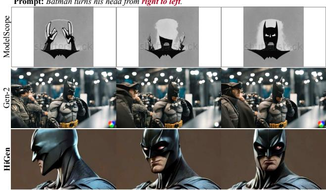

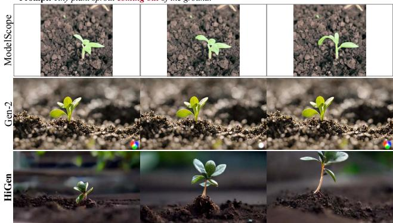  
Figure 1. Visual comparison with ModelScopeT2V [53] and Gen-2 [10]. The videos generated by ModelScopeT2V exhibit noticeable motion but suffer from lower spatial quality. However, while Gen-2 produces realistic frames, they are mostly static with minimal motion. In contrast, the results of our HiGen demonstrate both realistic frames and rich temporal variations.

Typically, mainstream approaches [5, 8, 17, 53, 55] attempt to generate videos by extending text-to-image (T2I) models by designing suitable 3D-UNet architectures. However, due to the complex distribution of high-dimensional video data, directly generating videos with both realistic spatial contents and diverse temporal dynamics jointly is in fact exceedingly challenging, which often leads to unsatisfactory results produced by the model. For example, as shown in Fig. 1, videos generated by ModelScopeT2V [53] exhibit dynamics but suffer from lower spatial quality. Conversely, videos from Gen-2 [10] showcase superior spatial quality but with minimal motions. On the other hand, VideoFusion [32] considers spatial redundancy and temporal correlation from the noise perspective by decomposing input noise into base noise and residual noise. However, it remains challenging to directly denoise videos with spatiotemporal fidelity from the noise space.

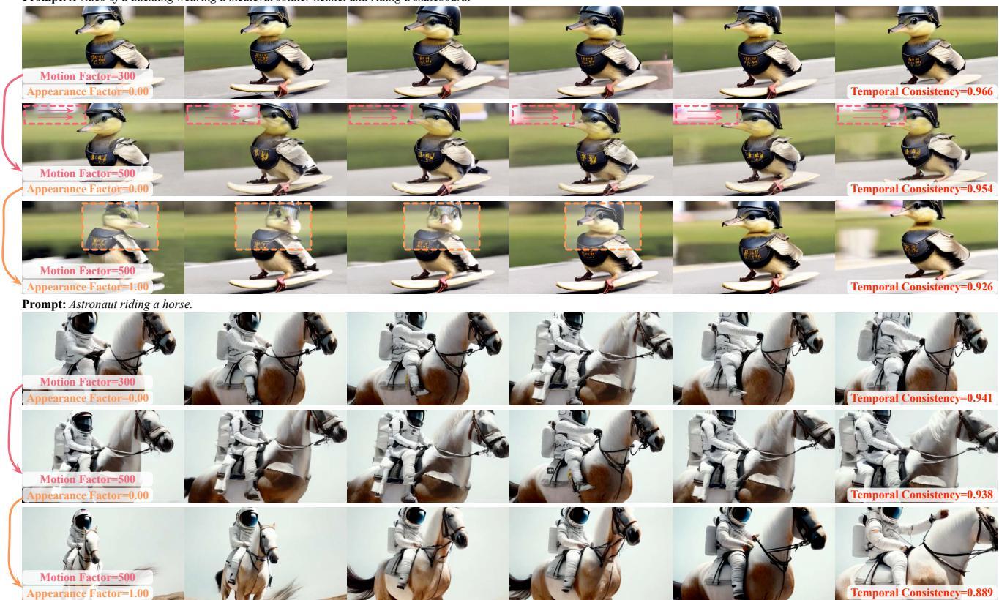  
Figure 2. The impact of motion factors and appearance factors. Larger motion factors introduce dynamic motions to the videos instead of static scenes, while larger appearance factors contribute to richer temporal semantic variations in the generated videos.

Based on the above observations, we propose a new diffusion model-based HiGen approach that decouples videos into spatial and temporal factors from two perspectives, namely structure level and content level. For the structure level, in light of the separability of space and time [11, 54] in video data, we decompose the T2V task into distinct spatial reasoning and temporal reasoning processes, all predicated on a unified model. During spatial reasoning, we utilize text prompts to generate spatial priors that are semantically coherent. These priors are then used in temporal reasoning to generate temporally coherent motions. For the content level, we extract two cues that respectively represent the motion and appearance variations in videos and utilize them as conditions for training the model. By this means, we can enhance the stability and diversity of generated videos by flexibly controlling the spatial and temporal variations through manipulating the two conditions, as shown in Fig. 2. Thanks to this hierarchically decoupled paradigm, HiGen ensures simultaneous high spatial quality and motion diversity in the generated videos.

To validate HiGen, we extensively conduct qualitative and quantitative analyses, comparing it with state-of-the-art methods on the public dataset, i.e., MSR-VTT [61]. The experimental results demonstrate the effectiveness of HiGen and its superior performance compared to current methods.

## 2. Related Works

Diffusion-based Text-to-Image Generation. Recently, diffusion models have greatly advanced the progress of text-driven photorealistic image synthesis. Initially, due to the substantial computational burden associated with performing iterative denoising on high-resolution images, early works [16, 48] predominantly concentrated on the generation of low-resolution images. To generate high-resolution images, a series of methods [3, 18, 34, 40, 43] have employed super-resolution techniques on low-resolution images, while others [13, 37, 41] have utilized decoders to de-

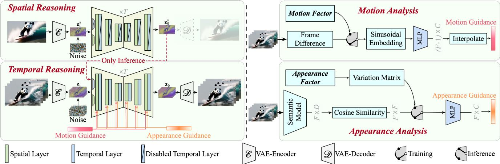  
Figure 3. The overall framework of HiGen. Left: The structure-level spatio-temporal decoupling. Firstly, spatial reasoning is performed to obtain latent embeddings of spatial priors. Then, these spatial priors are used for temporal reasoning to generate videos. Right: The content-level motion-appearance decoupling. Motion analysis and appearance analysis refer to the calculations of motion and appearance guidance, respectively.

## 3. Approach

code features from the latent space. Besides, exploring how to achieve flexible and controllable image generation is also an important research direction, such as ControlNet [64], Composer [24], DreamBooth [42], etc. Building upon stateof-the-art image generation methods, numerous advanced video generation [14, 63] or editing [4, 7, 33, 38, 59, 67] approaches have been developed by fine-tuning with additional temporal transformer layers or controlling the inference process. In this work, we fine-tune a high-quality text-to-video model by leveraging the powerful and efficient text-to-image model, i.e., Stable Diffusion [41].

Diffusion-based Text-to-Video Generation. Video synthesis methods strive to explore the generation of temporally coherent videos. Early works primarily relied on Generative Adversarial Networks (GANs) [2, 21, 45, 47, 49, 52, 62, 66]. Recently, breakthroughs have been achieved through diffusion-based methods, which can be broadly categorized into two paradigms: (i) introducing additional temporal layers [5, 12, 14, 15, 30, 32, 53, 55, 59, 60, 69] or operations [1] for fine-tuning. To reduce the complexity of video generation, some works [5, 17, 28, 46, 57, 63, 69] employ a series of big diffusion models for generating and upsampling videos given the input text. Besides, another line [12, 32] alleviates the training difficulty by increasing temporal correlations between frame-wise noise, but this may limit the temporal diversity of the generated videos. (ii) Controlling the inference process through training-free designs [9, 20, 23, 25, 29]. This paradigm does not require training but typically yields lower temporal continuity compared to fine-tuning-based methods.

Unlike existing approaches, in this work, we explore a hierarchical spatio-temporal decoupling paradigm based on the more promising fine-tuning strategy to train T2V models that exhibits both rich temporal variations and highquality spatial content.

## 3.1. Preliminaries

In this work, we use $\mathbf { x } _ { 0 } = [ \mathbf { x } _ { 0 } ^ { 1 } , \ldots , \mathbf { x } _ { 0 } ^ { F } ]$ to denote a video with F frames. Following Stable Diffusion [41], we map the video frames into the latent space by a Variational Auto-Encoder (VAE) [26] as $\mathbf { z } _ { 0 } ~ = ~ [ \mathcal { E } ( \mathbf { x } _ { 0 } ^ { 1 } ) , \dots , \mathcal { E } ( \mathbf { x } _ { 0 } ^ { F } ) ]$ , where $\mathcal { E }$ denotes the encoder, and $\mathbf { z } _ { 0 }$ can be decoded by the decoder D to reconstruct RGB pixels. With the video latent embedding $\mathbf { z } _ { 0 }$ , the diffusion process involves gradually add random noises into $\mathbf { z } _ { 0 }$ using a T-Step Markov chain [27]:

$$
q ( \mathbf { z } _ { t } | \mathbf { z } _ { t - 1 } ) = \mathcal { N } ( \mathbf { z } _ { t } ; \sqrt { 1 - \beta _ { t - 1 } } \mathbf { z } _ { t - 1 } , \beta _ { t } I ) ,\tag{1}
$$

where $\beta _ { t }$ refers to the noise schedule, and $\mathcal { N } ( \cdot ; \cdot )$ indicates the Gaussian noise. After being corrupted by noise, the obtained $\mathbf { z } _ { t }$ is fed into a 3D-UNet for noise estimation, enabling progressive denoising process to restore a clean video latent embedding.

In both the training and inference phase of the 3D-UNet, we adopt the same approach as in Stable Diffusion to inject the text condition and diffusion time t separately into the spatial Transformer layer and residual block. For brevity, we omit the details of these two components in Fig. 3.

## 3.2. Structure-level Decoupling

From a model structure perspective, we divide the T2V generation into two steps: spatial reasoning and temporal reasoning. Spatial reasoning aims to maximize the utilization of the knowledge in T2I models, thereby providing highquality spatial priors for temporal reasoning. Specifically, as shown in the Spatial Reasoning card in Fig. 3, we only leverage the spatial layers in 3D-UNet while disregarding its temporal components for spatial generation. After T steps of denoising, the spatial prior is represented as $\mathbf { z } _ { 0 } ^ { \mathrm { s } }$ . It is worth noting that $\mathbf { z } _ { 0 } ^ { \mathrm { s } }$ does not need to be decoded by D to reconstruct its pixel values. This allows for an efficient input of $\mathbf { z } _ { 0 } ^ { \mathrm { s } }$ into the subsequent temporal reasoning.

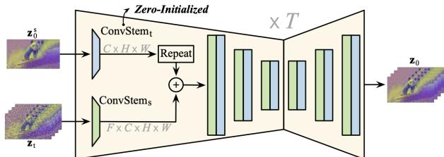  
Figure 4. The spatial prior for temporal reasoning.

The core idea of temporal reasoning is to synthesis diverse temporal dynamics for video generation on top of the spatial prior $\mathbf { z } _ { 0 } ^ { \mathrm { s } }$ . Specifically, as shown in shown in Fig. 4, we initialize a convolutional layer with all zeros (i.e., ConvStemt(·)) for $\mathbf { z } _ { 0 } ^ { \mathrm { s } }$ separately. The structure of $\mathrm { { C o n v S t e m } _ { \mathrm { { t } } } ( \cdot ) }$ is identical to the image pre-trained convolutional stem in the UNet (i.e., $\mathrm { C o n v S t e m _ { s } ( \cdot ) ) }$ . After passing through $\mathrm { { C o n v S t e m } _ { \mathrm { { t } } } ( \cdot ) }$ , we repeat the spatial prior $F$ times and add it to the noisy video embeddings $\mathbf { z } _ { t }$ for UNet.

Besides, we further clarify some details of the proposed structure-level decoupling from the following three aspects: (i) Merging the spatial prior after the first convolutional stem enables effective guidance for all the spatial and temporal layers in the 3D-UNet, which maximizes the utilization of the rich semantic priors present in the spatial prior. (ii) Our temporal reasoning and spatial reasoning share the same spatial layers. This allows the temporal reasoning phase to leverage the pre-trained knowledge in the spatial layers, facilitating more accurate temporal synthesizing. (iii) The temporal layers consist of a series of temporal convolutions and temporal self-attention layers following [53]. Despite similar structures, our temporal layers can be freed from intricate spatial contents and can solely focus on generating fine-grained temporal motions between consecutive frames, as demonstrated in Fig. 7.

## 3.3. Content-level Decoupling

Based on the structure-level decoupling, our paradigm is already capable of generating spatially realistic frames. However, in the temporal case, it still faces two challenges: nearly static video frames (e.g., Gen-2 [10]) and unstable temporal variations (e.g., the 2nd row in Fig. 5). Hence, we further propose motion and appearance decoupling for video content level to enhance the vividness and stability of synthesized videos.

Motion Analysis. For motion decoupling, we present motion analysis to quantify the magnitude of motion between frames, providing motion guidance for 3D-UNet. FPS (frames per second), which reflects the playback speed of the video, may seem like an intuitive choice [69]. However, FPS alone does not accurately reflect the motion in a video (e.g., static videos may also have a high FPS). Inspired by video understanding tasks [54, 68], frame differencing with negligible computational cost is an effective method for measuring video motion. Therefore, for a sequence of $F$ frames, we define the motion factor as $\gamma _ { f } ^ { \mathrm { m } } = | | \mathbf { z } _ { 0 } ^ { f } - \mathbf { z } _ { 0 } ^ { f + 1 } | |$ , which indicates the magnitude of the pixel differences between adjacent frames. By computing $\gamma _ { f } ^ { \mathrm { m } }$ for F frames, we can obtain $F - 1$ motion factors: $\tilde { \mathbf { r } } ^ { \mathrm { m } } = [ \gamma _ { 1 } ^ { \mathrm { m } } , \ldots , \gamma _ { F - 1 } ^ { \mathrm { m } } ] \in \mathbb { R } ^ { F - 1 }$

To incorporate $\tilde { \mathbf { r } } ^ { \mathrm { m } }$ into the 3D-UNet, we first round $\gamma _ { f } ^ { \mathrm { m } }$ and then utilize sinusoidal positional encoding [51] and a zero-initialized MLP (Multi-Layer Perceptron) to map it into a $C \mathrm { \mathrm { - } }$ -dimensional space:

$$
\mathbf { r } ^ { \mathrm { m } } = \mathrm { I n t e r p o l a t e } \big ( \mathrm { M L P } \big ( \mathrm { S i n } ( \mathrm { R o u n d } ( \tilde { \mathbf { r } } ^ { \mathrm { m } } ) \big ) \big ) \big ) \in \mathbb { R } ^ { F \times C } ,\tag{2}
$$

where Interpolate(·) is a linear interpolation function that aligns the $F - 1$ motion factors with the actual number of frames $( i . e . , F )$ . Next, the motion guidance $\mathbf { r } ^ { \mathrm { m } }$ is added to the time-step embedding vector of the diffusion sampling step t [16]. Therefore, $\mathbf { r } ^ { \mathrm { m } }$ is integrated with features in each residual block.

Appearance Analysis. The motion factor describes pixellevel variations between adjacent frames while it cannot measure the appearance changes. To address this, we leverage existing visual semantic models such as, DINO [6, 35], CLIP [39], for appearance analysis between frames:

$$
\mathbf { g } = \mathrm { N o r m } ( \Omega ( \mathbf { x } _ { 0 } ) ) , \tilde { \mathbf { r } } ^ { \mathrm { a } } = \mathbf { g } \otimes \mathcal { T } ( \mathbf { g } ) \in \mathbb { R } ^ { F \times F } ,\tag{3}
$$

where $\Omega ( \cdot )$ and Norm(·) refer to the semantic model and normalization operation, respectively. $\otimes$ is matrix multiplication, and $\tau ( \cdot )$ means the transpose operation. Therefore, $\tilde { \mathbf { r } } ^ { \mathrm { a } }$ represents the cosine similarities between all frames, which is then transformed using a zero-initialized MLP to obtain the appearance guidance: ${ \bf r } ^ { \mathrm { a } } = \mathrm { M L P } ( \tilde { \bf r } ^ { \mathrm { a } } ) \in \mathbb { R } ^ { F \times C }$ Afterwards, ra is inputted into the 3D-UNet in the same way as the motion guidance $\mathbf { r } ^ { \mathrm { m } }$

In general, a video clip with large appearance variations will have a lower cosine similarity value between the first and last frames, $i . e . , \tilde { \bf r } _ { 0 , F - 1 } ^ { \mathrm { a } }$ . To align with intuition, we further define the appearance factor as $\gamma ^ { \mathrm { a } } = 1 - \tilde { \bf r } _ { 0 , F - 1 } ^ { \mathrm { a } } .$ In this case, a larger appearance factor $\gamma ^ { \mathrm { a } }$ corresponds to significant appearance variations in the generated videos. In training, we calculate the appearance guidance from real videos using Eq. 3. In inference, we manually construct the variation matrix $( \tilde { \mathbf { r } } ^ { \mathrm { a } } )$ based on the appearance factor $\gamma ^ { \mathrm { a } } ,$ which will be discussed in the next section.

## 3.4. Training and Inference

Training. We train our 3D-UNet through image-video joint training [19, 56]. Specifically, we allocate one-fourth of the GPUs for image fine-tuning (i.e., spatial reasoning), while the remaining GPUs are utilized for video fine-tuning $( i . e .$ temporal reasoning). For image GPUs, we only optimize the spatial parameters that were pre-trained by Stable Diffusion [41] to preserve its spatial generative capability. On the other hand, for video fine-tuning, we optimize all parameters based on strong spatial priors. To ensure efficiency, we utilize the middle frame of the input videos as the spatial prior during training.

Prompt: A man is riding a horse in sunset.  
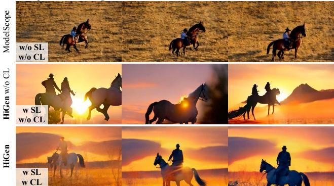  
Figure 5. Visualization for the effect of Structure-Level (SL) decoupling and Content-Level (CL) decoupling.

Inference. Our inference process starts by performing a standard T2I process [41] using only the textual conditions, resulting in the high-quality spatial prior. Then, this spatial prior, along with the motion and appearance guidances, will be inputted into the 3D-UNet for temporal reasoning. Next, let’s explain how to construct the guidance features that correspond to the specified motion and appearance factors. Firstly, for a given motion factor $\gamma ^ { \mathrm { m } }$ , we set all elements in the vector $\widetilde { \mathbf { r } } ^ { \mathrm { m } } \ \mathrm { t o } \ \gamma ^ { \mathrm { m } }$ , and construct the motion guidance $\mathbf { r } ^ { \mathrm { m } }$ by Eq. 2. For a stable video, the recommended range for $\gamma ^ { \mathrm { m } }$ is [300, 600]. Secondly, for appearance guidance, we can manually construct the variation matrix $\tilde { \mathbf { r } } ^ { \mathrm { a } }$ based on the given appearance factor $\gamma ^ { \mathrm { a } }$

$$
\tilde { \mathbf { r } } ^ { \mathrm { a } } = \left\{ \begin{array} { c c c c c } { 0 k + 1 , } & { 1 k + 1 , } & { \hdots } & { ( F - 1 ) k + 1 , } \\ { 1 k + 1 , } & { 0 k + 1 , } & { \hdots } & { ( F - 2 ) k + 1 , } \\ { \vdots } & { \vdots } & { \ddots } & { \vdots } \\ { ( F - 2 ) k + 1 , } & { ( F - 3 ) k + 1 , } & { \hdots } & { 1 k + 1 , } \\ { ( F - 1 ) k + 1 , } & { ( F - 2 ) k + 1 , } & { \hdots } & { 0 k + 1 , } \end{array} \right\} \mathrm { , }\tag{4}
$$

where $\begin{array} { r } { k = \frac { - \gamma ^ { \mathrm { a } } } { F - 1 } } \end{array}$ . The variation matrix $\tilde { \mathbf { r } } ^ { \mathrm { a } }$ is obtained by linear interpolation, resulting in smooth appearance changes between consecutive frames.

## 4. Experiments

## 4.1. Implementation Details

Optimization. In this work, all modules are trained using the AdamW [31] optimizer with a learning rate of 5e-5. The weight decay is set to 0, and our default training iteration is 25,000. The spatial resolution of the videos is 448×256. During the image-video joint training, the batch size for images is 512 (distributed across 2 GPUs), the number of video frames F is 32, and the batch size for videos is 72 (distributed across 6 GPUs). Therefore, we use 8×A100 GPUs to fine-tune the denoiser. Besides, for the pre-trained parameters from Stable Diffusion $( i . e .$ , the spatial layers), we apply a decay of 0.2 to their gradients.

<table><tr><td></td><td>SL CL</td><td></td><td> $\scriptstyle { \mathrm { ~ T e m p o r a l ~ } } _ { \mathrm { C o n s i s t e n c y } } \uparrow$ </td><td>CLIPSIM↑</td></tr><tr><td>ModelScope [53]</td><td>X</td><td>X</td><td>0.931</td><td>0.292</td></tr><tr><td>↓</td><td>√</td><td>X</td><td>0.889</td><td>0.313</td></tr><tr><td>HiGen</td><td>J</td><td>√</td><td>0.944</td><td>0.318</td></tr></table>

Table 1. Ablation studies for Structure-Level (SL) decoupling and Content-Level (CL) decoupling.

Datasets. The dataset used in our study consists of two types: video-text pairs and image-text pairs. For the video dataset, following previous works [17, 46, 69], we also select a subset of watermark-free video from our internal data, amounting to a total of 17 million video-text pairs. The image dataset primarily consists of LAION-400M [44] and similar private image-text pairs, comprising around 60 million images. In the ablation experiments, for efficiency, we gathered 69 commonly used imaginative prompts from recent works for testing, which will be included in our Appendix. For the comparison of Frechet Inception Distance´ (FID) [36], Frechet Video Distance (FVD) [´ 50] and CLIP Similarity (CLIPSIM) [58] metrics with state-of-the-art in Tab. 3, we evaluated the same MSR-VTT dataset [61] as previous works. Besides, Temporal Consistency [10] refers to the average CLIP cosine similarity between consecutive frames.

## 4.2. Ablation Studies

In this section, we will analyze our hierarchical spatiotemporal decoupling mechanism. Our baseline is ModelScopeT2V [53]. Here, all comparisons with the baseline method were conducted using the same dataset and training for the same number of steps. Unless otherwise specified, we default to setting the motion factor $\gamma ^ { \mathrm { m } }$ to 500 and the appearance factor $\gamma ^ { \mathrm { a } }$ to 1.0.

The effect of hierarchical decoupling. Comparing the first two rows of Tab. 1, the structure-level decoupling significantly improves the spatial quality (i.e., CLIPSIM), but it severely compromises temporal consistency. The first two rows of Fig. 5 also provide a more intuitive demonstration of this effect. Content-level decoupling, as shown in the third row of Tab. 1 and Fig. 5, ensures superior spatial quality and improved temporal stability of the video frames.

Temporal reasoning analysis. In Fig. 7, we visualize videos generated without spatial priors, showing a decoupling between temporal and spatial synthesis. The absence of additional spatial priors results in videos that primarily exhibit motion correlated with the text. Combining temporal reasoning with spatial priors reduces the complexity of video synthesis and enables high-quality results. Additionally, in Fig. 6, we synthesize videos using the same spatial prior but different textual prompts, observing that the temporal reasoning stage effectively utilizes the motion knowledge provided by the text prompts.

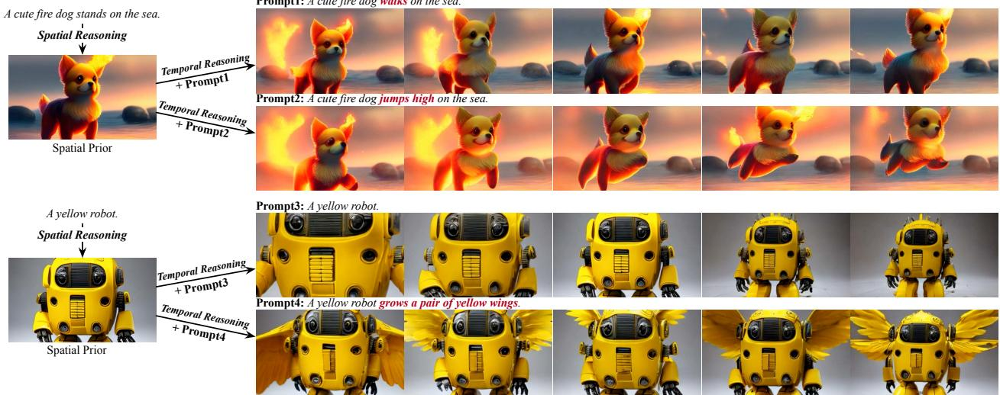  
Figure 6. Combining the same spatial prior with different textual prompts allows dynamic control over the generated videos during the temporal reasoning stage.

Prompt: A fire is buring on a candle.  
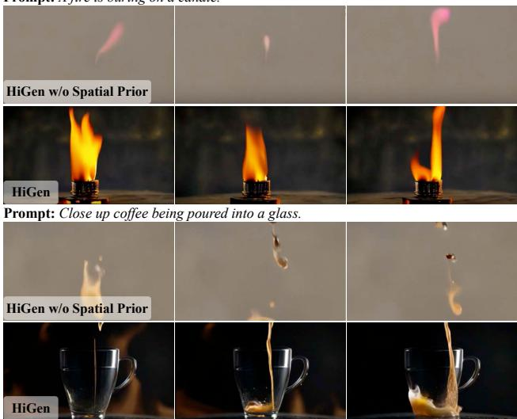  
Figure 7. Visualization for structure-level decoupling. “HiGen w/o Spatial Prior” refers to our temporal reasoning without inputting any spatial priors.

Content-level decoupling analysis. In Fig. 8, the curves demonstrate the impact of motion and appearance factors on the generated videos. Higher values of the motion factor (300 to 600) and appearance factor (0 to 1.0) decrease temporal consistency, while the spatial semantic remains stable according to the CLIPSIM metric. The dashed line represents using FPS as an alternative to our content-level decoupling strategy. Notably, changing the FPS has minimal influence on the temporal dynamics of the videos, validating the superiority of our decoupling strategy as a more effective design choice.

In addition, Fig. 2 visually illustrates the impacts of these two factors. The motion factor governs scene movement, while the appearance factor enables diverse semantic variations in the generated videos. Interestingly, lower temporal consistency scores lead to livelier and more dynamic videos. This suggests that overly prioritizing temporal consistency may hinder the potentialfor vibrant and engaging videos.

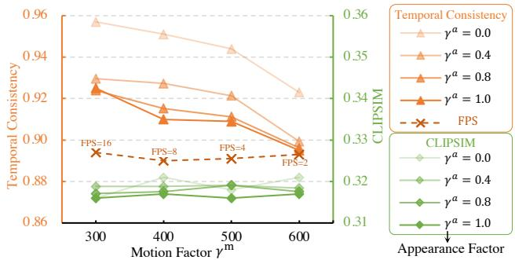  
Figure 8. Parameter sensitivity analysis of the motion factor $\gamma ^ { \mathrm { m } }$ and appearance factor $\gamma ^ { \mathrm { a } }$

Semantic model analysis. To achieve content-level decoupling, we aim to ensure high independence between the motion and appearance factors. To accomplish this, we explore self-supervised models such as DINO [6, 35] and the multimodal model CLIP [39] as semantic models. We evaluate the Pearson Correlation Coefficients (PCC) between these two factors. In Fig. 10, we observe that although the PCC between the DINO-based appearance factor and motion factor is only slightly lower (0.03) than that of CLIP, the distribution of DINO is more uniform. This indicates that selfsupervised models, specifically DINO, are more sensitive to appearance variations. Based on this finding, we default to using DINO as our semantic model.

Training efficiency. The structure-level decoupling of spatial and temporal aspects mitigates the difficulties in joint spatio-temporal denoising. Fig. 11 compares the generated videos at different iterations with the baseline method. It is clear that HiGen consistently outperforms the baseline

Prompt: A robot girl.

Prompt: An iron man surfing in the sea  
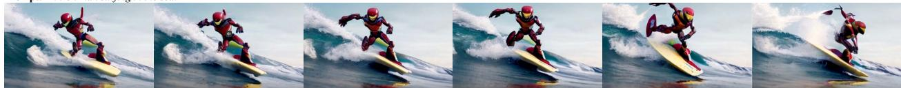  
Prompt: Wooden figurine surfing on a surfboard in space.

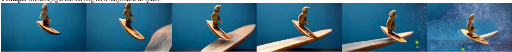  
Prompt: A stylized octopus swimming in an underwater cave system

  
Prompt: A female mandalorian in forest green mandalorian armour with helmet

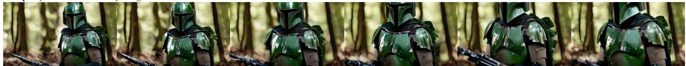  
Prompt: A teddy bear wearing sunglasses playing guitar next to a cactus

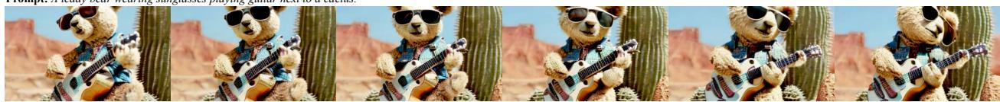  
Prompt: A yellow tiger with lightning around it.

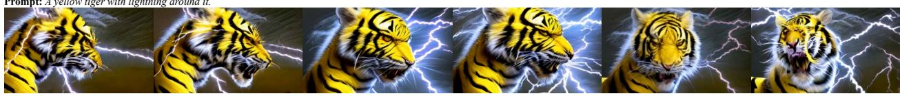

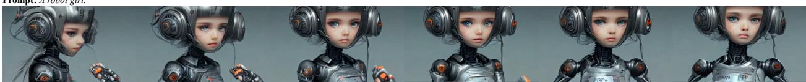  
Figure 9. Sample visualization of generated videos.

Training Iterations  
DINO as Semantic Model  
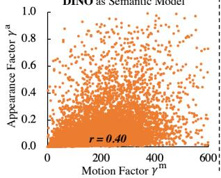  
(a)

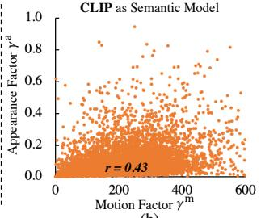  
(b)

Figure 10. Correlation analysis between the motion factor and appearance factor with DINO [6, 35] and CLIP [39] as semantic models. Here, we measure these factors based on the first and last frames of 8000 random videos.
<table><tr><td>Method</td><td>Visual Quality</td><td>Temporal Quality</td><td>Text Alignment</td></tr><tr><td>ModelScopeT2V [53]</td><td>32.4%</td><td>43.2%</td><td>54.8%</td></tr><tr><td>Text2Video-Zero [25]</td><td>63.6%</td><td>26.0%</td><td>53.8%</td></tr><tr><td>VideoCrafter [8]</td><td>81.2%</td><td>55.2%</td><td>76.8%</td></tr><tr><td>HiGen</td><td>84.4%</td><td>74.0%</td><td>81.2%</td></tr></table>

Table 2. Human evaluations with open-sourced methods.  
Prompt: A 3D model of an elephant origami. Studio lighting.

regarding visual quality throughout various training stages. More visualizations. Fig. 9 demonstrates the generation of

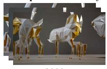

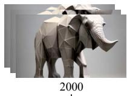

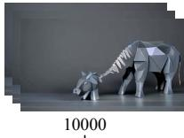

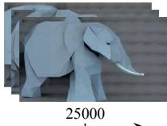

(a) Baseline  
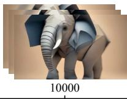  
(b) HiGen

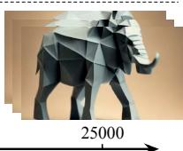  
Figure 11. Comparison with baseline at various training stages.

8 different styles of videos, such as humans, animals, and marine settings. The generated videos using HiGen showcase consistent, high-quality frames comparable to Stable Diffusion-generated images. When played in sequence, these frames exhibit both smooth temporal content and diverse semantic variations, enhancing the richness and vividness of the videos.

Prompt: A girl with long curly blonde hair and sunglasses, camera pan from left to right

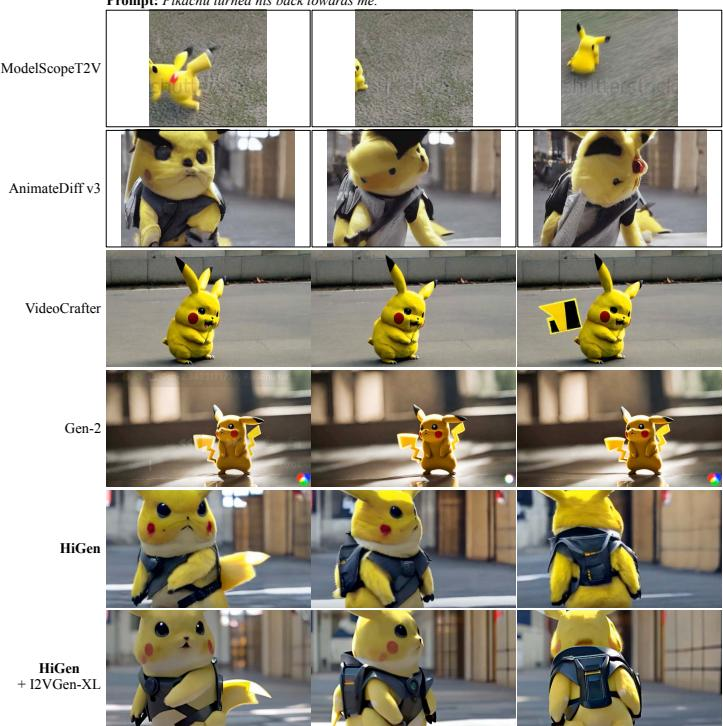

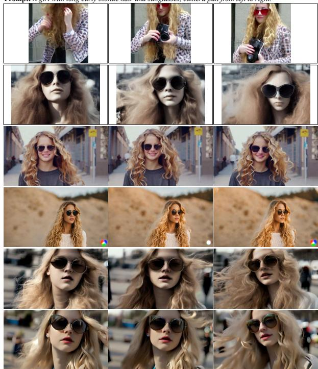  
Figure 12. Qualitative comparison with ModelScopeT2V [53], Text-2-Video Zero [25], VideoCrafter [8] and Gen-2 [10]. In the last row, we utilize the Video-to-Video model from the open-sourced I2VGen-XL [65] to enhance the spatial resolution of our videos, resulting in further improvement in spatial quality.

Human evaluations. In Tab. 2, we conducted a human evaluation of three recent open-source methods, considering spatial, temporal, and textual aspects. Notably, HiGen exhibits the most substantial improvement in temporal performance, surpassing VideoCrafter [8] by 18.8% (increasing from 55.2% to 74.0%). These findings further reinforce the superiority of our approach.

## 4.3. Comparison with State-of-the-art

Tab. 3 compares HiGen with existing approaches using FID, FVD, and CLIPSIM metrics on MSR-VTT [61]. Our method shows significant improvements in FID and FVD metrics. However, as noted in previous works [37], these metrics may not accurately represent the generated quality. To further evaluate, we visually compare our results with recent state-of-the-art methods in Fig. 12. It is evident that our HiGen achieves a better balance between spatial quality and temporal motion in the generated videos.

## 5. Discussions

This work presents HiGen, a diffusion model-based approach for video generation that decouples spatial and temporal factors at both the structure-level and content-level. With a unified denoiser, HiGen generates spatially photorealistic priors and temporally coherent motions, while extracting subtle cues from the video content to express appearance and motion changes for denoising guidance. Through this design, HiGen successfully reduces the complexity of T2V task, synthesizes realistic videos with semantic accuracy and motion stability, and outperforms state-of-the-art T2V methods in extensive experiments.

<table><tr><td>Method</td><td>FID↓</td><td>FVD↓</td><td>CLIPSIM↑</td></tr><tr><td>CogVideo (English) [22]</td><td>23.59</td><td>1294</td><td>0.2631</td></tr><tr><td>Latent-Shift [1]</td><td>15.23</td><td></td><td>0.2773</td></tr><tr><td>Make-A-Video [46]</td><td>13.17</td><td></td><td>0.3049</td></tr><tr><td>Video LDM [5]</td><td></td><td></td><td>0.2929</td></tr><tr><td>MagicVideo [69]</td><td></td><td>998</td><td></td></tr><tr><td>VideoComposer [56]</td><td>10.77</td><td>580</td><td>0.2932</td></tr><tr><td>ModelScopeT2V [53]</td><td>11.09</td><td>550</td><td>0.2930</td></tr><tr><td>PYoCo [12]</td><td>9.73</td><td>-</td><td></td></tr><tr><td>HiGen</td><td>8.60</td><td>406</td><td>0.2947</td></tr></table>

Table 3. T2V generation performance on MSR-VTT [61].

Limitations. Due to limitations in computational resources and data quality, our HiGen’s ability to generate object details lags behind that of current image synthesis models. Additionally, accurately modeling human and animal actions that adhere to common sense proves challenging, particularly in cases of substantial motion. To address these challenges, our future research will delve into improving model design and data selection.

Acknowledgement. This work is supported by the National Natural Science Foundation of China under grant U22B2053 and 62176097, and by Alibaba DAMO Academy through Alibaba Research Intern Program.

## References

[1] Jie An, Songyang Zhang, Harry Yang, Sonal Gupta, Jia-Bin Huang, Jiebo Luo, and Xi Yin. Latent-shift: Latent diffusion with temporal shift for efficient text-to-video generation. arXiv preprint arXiv:2304.08477, 2023. 3, 8

[2] Yogesh Balaji, Martin Renqiang Min, Bing Bai, Rama Chellappa, and Hans Peter Graf. Conditional gan with discriminative filter generation for text-to-video synthesis. In IJCAI, page 2, 2019. 3

[3] Yogesh Balaji, Seungjun Nah, Xun Huang, Arash Vahdat, Jiaming Song, Karsten Kreis, Miika Aittala, Timo Aila, Samuli Laine, Bryan Catanzaro, et al. ediff-i: Text-to-image diffusion models with an ensemble of expert denoisers. corr, vol. abs/2211.01324 (2022), 2022. 2

[4] Omer Bar-Tal, Dolev Ofri-Amar, Rafail Fridman, Yoni Kasten, and Tali Dekel. Text2live: Text-driven layered image and video editing. In ECCV, pages 707–723. Springer, 2022. 3

[5] Andreas Blattmann, Robin Rombach, Huan Ling, Tim Dockhorn, Seung Wook Kim, Sanja Fidler, and Karsten Kreis. Align your latents: High-resolution video synthesis with latent diffusion models. In CVPR, pages 22563–22575, 2023. 1, 3, 8

[6] Mathilde Caron, Hugo Touvron, Ishan Misra, Herve J´ egou,´ Julien Mairal, Piotr Bojanowski, and Armand Joulin. Emerging properties in self-supervised vision transformers. In ICCV, pages 9650–9660, 2021. 4, 6, 7

[7] Duygu Ceylan, Chun-Hao P Huang, and Niloy J Mitra. Pix2video: Video editing using image diffusion. In ICCV, pages 23206–23217, 2023. 3

[8] Haoxin Chen, Menghan Xia, Yingqing He, Yong Zhang, Xiaodong Cun, Shaoshu Yang, Jinbo Xing, Yaofang Liu, Qifeng Chen, Xintao Wang, Chao Weng, and Ying Shan. Videocrafter1: Open diffusion models for high-quality video generation, 2023. 1, 7, 8

[9] Zhongjie Duan, Lizhou You, Chengyu Wang, Cen Chen, Ziheng Wu, Weining Qian, Jun Huang, Fei Chao, and Rongrong Ji. Diffsynth: Latent in-iteration deflickering for realistic video synthesis. arXiv preprint arXiv:2308.03463, 2023. 3

[10] Patrick Esser, Johnathan Chiu, Parmida Atighehchian, Jonathan Granskog, and Anastasis Germanidis. Structure and content-guided video synthesis with diffusion models. In ICCV, pages 7346–7356, 2023. 1, 2, 4, 5, 8

[11] Christoph Feichtenhofer, Axel Pinz, and Andrew Zisserman. Convolutional two-stream network fusion for video action recognition. In CVPR, pages 1933–1941, 2016. 2

[12] Songwei Ge, Seungjun Nah, Guilin Liu, Tyler Poon, Andrew Tao, Bryan Catanzaro, David Jacobs, Jia-Bin Huang, Ming-Yu Liu, and Yogesh Balaji. Preserve your own correlation: A noise prior for video diffusion models. In ICCV, pages 22930–22941, 2023. 3, 8

[13] Shuyang Gu, Dong Chen, Jianmin Bao, Fang Wen, Bo Zhang, Dongdong Chen, Lu Yuan, and Baining Guo. Vec-

tor quantized diffusion model for text-to-image synthesis. In CVPR, pages 10696–10706, 2022. 2

[14] Yuwei Guo, Ceyuan Yang, Anyi Rao, Yaohui Wang, Yu Qiao, Dahua Lin, and Bo Dai. Animatediff: Animate your personalized text-to-image diffusion models without specific tuning. arXiv preprint arXiv:2307.04725, 2023. 3

[15] Yingqing He, Tianyu Yang, Yong Zhang, Ying Shan, and Qifeng Chen. Latent video diffusion models for high-fidelity video generation with arbitrary lengths. arXiv preprint arXiv:2211.13221, 2022. 3

[16] Jonathan Ho, Ajay Jain, and Pieter Abbeel. Denoising diffusion probabilistic models. NeurIPS, 33:6840–6851, 2020. 2, 4

[17] Jonathan Ho, William Chan, Chitwan Saharia, Jay Whang, Ruiqi Gao, Alexey Gritsenko, Diederik P Kingma, Ben Poole, Mohammad Norouzi, David J Fleet, et al. Imagen video: High definition video generation with diffusion models. arXiv preprint arXiv:2210.02303, 2022. 1, 3, 5

[18] Jonathan Ho, Chitwan Saharia, William Chan, David J Fleet, Mohammad Norouzi, and Tim Salimans. Cascaded diffusion models for high fidelity image generation. JMLR, 23 (1):2249–2281, 2022. 2

[19] Jonathan Ho, Tim Salimans, Alexey Gritsenko, William Chan, Mohammad Norouzi, and David J Fleet. Video diffusion models. arxiv e-prints, page. arXiv preprint arXiv:2204.03458, 3, 2022. 4

[20] Susung Hong, Junyoung Seo, Sunghwan Hong, Heeseong Shin, and Seungryong Kim. Large language models are frame-level directors for zero-shot text-to-video generation. arXiv preprint arXiv:2305.14330, 2023. 3

[21] Wenyi Hong, Ming Ding, Wendi Zheng, Xinghan Liu, and Jie Tang. Cogvideo: Large-scale pretraining for text-to-video generation via transformers. arXiv preprint arXiv:2205.15868, 2022. 3

[22] Wenyi Hong, Ming Ding, Wendi Zheng, Xinghan Liu, and Jie Tang. Cogvideo: Large-scale pretraining for text-to-video generation via transformers. In ICLR, 2023. 8

[23] Hanzhuo Huang, Yufan Feng, Cheng Shi, Lan Xu, Jingyi Yu, and Sibei Yang. Free-bloom: Zero-shot text-to-video generator with llm director and ldm animator. arXiv preprint arXiv:2309.14494, 2023. 3

[24] Lianghua Huang, Di Chen, Yu Liu, Yujun Shen, Deli Zhao, and Jingren Zhou. Composer: Creative and controllable image synthesis with composable conditions. arXiv preprint arXiv:2302.09778, 2023. 3

[25] Levon Khachatryan, Andranik Movsisyan, Vahram Tadevosyan, Roberto Henschel, Zhangyang Wang, Shant Navasardyan, and Humphrey Shi. Text2video-zero: Text-toimage diffusion models are zero-shot video generators. arXiv preprint arXiv:2303.13439, 2023. 3, 7, 8

[26] Diederik P Kingma and Max Welling. Auto-encoding variational bayes. arXiv preprint arXiv:1312.6114, 2013. 3

[27] Zhifeng Kong and Wei Ping. On fast sampling of diffusion probabilistic models. arXiv preprint arXiv:2106.00132, 2021. 3

[28] Xin Li, Wenqing Chu, Ye Wu, Weihang Yuan, Fanglong Liu, Qi Zhang, Fu Li, Haocheng Feng, Errui Ding, and Jingdong

Wang. Videogen: A reference-guided latent diffusion approach for high definition text-to-video generation. arXiv preprint arXiv:2309.00398, 2023. 3

[29] Long Lian, Baifeng Shi, Adam Yala, Trevor Darrell, and Boyi Li. Llm-grounded video diffusion models. arXiv preprint arXiv:2309.17444, 2023. 3

[30] Binhui Liu, Xin Liu, Anbo Dai, Zhiyong Zeng, Zhen Cui, and Jian Yang. Dual-stream diffusion net for text-to-video generation. arXiv preprint arXiv:2308.08316, 2023. 3

[31] Ilya Loshchilov and Frank Hutter. Decoupled weight decay regularization. arXiv preprint arXiv:1711.05101, 2017. 5

[32] Zhengxiong Luo, Dayou Chen, Yingya Zhang, Yan Huang, Liang Wang, Yujun Shen, Deli Zhao, Jingren Zhou, and Tieniu Tan. Videofusion: Decomposed diffusion models for high-quality video generation. In CVPR, pages 10209– 10218, 2023. 2, 3

[33] Eyal Molad, Eliahu Horwitz, Dani Valevski, Alex Rav Acha, Yossi Matias, Yael Pritch, Yaniv Leviathan, and Yedid Hoshen. Dreamix: Video diffusion models are general video editors. arXiv preprint arXiv:2302.01329, 2023. 3

[34] Alex Nichol, Prafulla Dhariwal, Aditya Ramesh, Pranav Shyam, Pamela Mishkin, Bob McGrew, Ilya Sutskever, and Mark Chen. Glide: Towards photorealistic image generation and editing with text-guided diffusion models. arXiv preprint arXiv:2112.10741, 2021. 2

[35] Maxime Oquab, Timothee Darcet, Th´ eo Moutakanni, Huy´ Vo, Marc Szafraniec, Vasil Khalidov, Pierre Fernandez, Daniel Haziza, Francisco Massa, Alaaeldin El-Nouby, et al. Dinov2: Learning robust visual features without supervision. arXiv preprint arXiv:2304.07193, 2023. 4, 6, 7

[36] Gaurav Parmar, Richard Zhang, and Jun-Yan Zhu. On aliased resizing and surprising subtleties in gan evaluation. In CVPR, pages 11410–11420, 2022. 5

[37] Dustin Podell, Zion English, Kyle Lacey, Andreas Blattmann, Tim Dockhorn, Jonas Muller, Joe Penna, and¨ Robin Rombach. Sdxl: improving latent diffusion models for high-resolution image synthesis. arXiv preprint arXiv:2307.01952, 2023. 2, 8

[38] Chenyang Qi, Xiaodong Cun, Yong Zhang, Chenyang Lei, Xintao Wang, Ying Shan, and Qifeng Chen. Fatezero: Fusing attentions for zero-shot text-based video editing. arXiv preprint arXiv:2303.09535, 2023. 3

[39] Alec Radford, Jong Wook Kim, Chris Hallacy, Aditya Ramesh, Gabriel Goh, Sandhini Agarwal, Girish Sastry, Amanda Askell, Pamela Mishkin, Jack Clark, et al. Learning transferable visual models from natural language supervision. In ICML, pages 8748–8763. PMLR, 2021. 4, 6, 7

[40] Aditya Ramesh, Prafulla Dhariwal, Alex Nichol, Casey Chu, and Mark Chen. Hierarchical text-conditional image generation with clip latents. arXiv preprint arXiv:2204.06125, 1 (2):3, 2022. 2

[41] Robin Rombach, Andreas Blattmann, Dominik Lorenz, Patrick Esser, and Bjorn Ommer. High-resolution image syn-¨ thesis with latent diffusion models. In CVPR, pages 10684– 10695, 2022. 2, 3, 4, 5

[42] Nataniel Ruiz, Yuanzhen Li, Varun Jampani, Yael Pritch, Michael Rubinstein, and Kfir Aberman. Dreambooth: Fine

tuning text-to-image diffusion models for subject-driven generation. In CVPR, pages 22500–22510, 2023. 3

[43] Chitwan Saharia, William Chan, Saurabh Saxena, Lala Li, Jay Whang, Emily L Denton, Kamyar Ghasemipour, Raphael Gontijo Lopes, Burcu Karagol Ayan, Tim Salimans, et al. Photorealistic text-to-image diffusion models with deep language understanding. NeurIPS, 35:36479–36494, 2022. 2

[44] Christoph Schuhmann, Richard Vencu, Romain Beaumont, Robert Kaczmarczyk, Clayton Mullis, Aarush Katta, Theo Coombes, Jenia Jitsev, and Aran Komatsuzaki. Laion-400m: Open dataset of clip-filtered 400 million image-text pairs. arXiv preprint arXiv:2111.02114, 2021. 5

[45] Xiaoqian Shen, Xiang Li, and Mohamed Elhoseiny. Mostgan-v: Video generation with temporal motion styles. In CVPR, pages 5652–5661, 2023. 3

[46] Uriel Singer, Adam Polyak, Thomas Hayes, Xi Yin, Jie An, Songyang Zhang, Qiyuan Hu, Harry Yang, Oron Ashual, Oran Gafni, et al. Make-a-video: Text-to-video generation without text-video data. arXiv preprint arXiv:2209.14792, 2022. 3, 5, 8

[47] Ivan Skorokhodov, Sergey Tulyakov, and Mohamed Elhoseiny. Stylegan-v: A continuous video generator with the price, image quality and perks of stylegan2. In CVPR, pages 3626–3636, 2022. 3

[48] Jiaming Song, Chenlin Meng, and Stefano Ermon. Denoising diffusion implicit models. arXiv preprint arXiv:2010.02502, 2020. 2

[49] Yu Tian, Jian Ren, Menglei Chai, Kyle Olszewski, Xi Peng, Dimitris N Metaxas, and Sergey Tulyakov. A good image generator is what you need for high-resolution video synthesis. arXiv preprint arXiv:2104.15069, 2021. 3

[50] Thomas Unterthiner, Sjoerd Van Steenkiste, Karol Kurach, Raphael Marinier, Marcin Michalski, and Sylvain Gelly. Towards accurate generative models of video: A new metric & challenges. arXiv preprint arXiv:1812.01717, 2018. 5

[51] Ashish Vaswani, Noam Shazeer, Niki Parmar, Jakob Uszkoreit, Llion Jones, Aidan N Gomez, Łukasz Kaiser, and Illia Polosukhin. Attention is all you need. NeurIPS, 30, 2017. 4

[52] Carl Vondrick, Hamed Pirsiavash, and Antonio Torralba. Generating videos with scene dynamics. NeurIPS, 29, 2016. 3

[53] Jiuniu Wang, Hangjie Yuan, Dayou Chen, Yingya Zhang, Xiang Wang, and Shiwei Zhang. Modelscope text-to-video technical report. arXiv preprint arXiv:2308.06571, 2023. 1, 2, 3, 4, 5, 7, 8

[54] Limin Wang, Yuanjun Xiong, Zhe Wang, Yu Qiao, Dahua Lin, Xiaoou Tang, and Luc Van Gool. Temporal segment networks: Towards good practices for deep action recognition. In ECCV, pages 20–36. Springer, 2016. 2, 4

[55] Wenjing Wang, Huan Yang, Zixi Tuo, Huiguo He, Junchen Zhu, Jianlong Fu, and Jiaying Liu. Videofactory: Swap attention in spatiotemporal diffusions for text-to-video generation. arXiv preprint arXiv:2305.10874, 2023. 1, 3

[56] Xiang Wang, Hangjie Yuan, Shiwei Zhang, Dayou Chen, Jiuniu Wang, Yingya Zhang, Yujun Shen, Deli Zhao, and Jingren Zhou. Videocomposer: Compositional video synthesis with motion controllability. arXiv preprint arXiv:2306.02018, 2023. 4, 8

[57] Yaohui Wang, Xinyuan Chen, Xin Ma, Shangchen Zhou, Ziqi Huang, Yi Wang, Ceyuan Yang, Yinan He, Jiashuo Yu, Peiqing Yang, et al. Lavie: High-quality video generation with cascaded latent diffusion models. arXiv preprint arXiv:2309.15103, 2023. 3

[58] Chenfei Wu, Lun Huang, Qianxi Zhang, Binyang Li, Lei Ji, Fan Yang, Guillermo Sapiro, and Nan Duan. Godiva: Generating open-domain videos from natural descriptions. arXiv preprint arXiv:2104.14806, 2021. 5

[59] Jay Zhangjie Wu, Yixiao Ge, Xintao Wang, Stan Weixian Lei, Yuchao Gu, Yufei Shi, Wynne Hsu, Ying Shan, Xiaohu Qie, and Mike Zheng Shou. Tune-a-video: One-shot tuning of image diffusion models for text-to-video generation. In ICCV, pages 7623–7633, 2023. 3

[60] Zhen Xing, Qi Dai, Han Hu, Zuxuan Wu, and Yu-Gang Jiang. Simda: Simple diffusion adapter for efficient video generation. arXiv preprint arXiv:2308.09710, 2023. 3

[61] Jun Xu, Tao Mei, Ting Yao, and Yong Rui. Msr-vtt: A large video description dataset for bridging video and language. In CVPR, pages 5288–5296, 2016. 2, 5, 8

[62] Sihyun Yu, Jihoon Tack, Sangwoo Mo, Hyunsu Kim, Junho Kim, Jung-Woo Ha, and Jinwoo Shin. Generating videos with dynamics-aware implicit generative adversarial networks. arXiv preprint arXiv:2202.10571, 2022. 3

[63] David Junhao Zhang, Jay Zhangjie Wu, Jia-Wei Liu, Rui Zhao, Lingmin Ran, Yuchao Gu, Difei Gao, and Mike Zheng Shou. Show-1: Marrying pixel and latent diffusion models for text-to-video generation. arXiv preprint arXiv:2309.15818, 2023. 3

[64] Lvmin Zhang, Anyi Rao, and Maneesh Agrawala. Adding conditional control to text-to-image diffusion models. In ICCV, pages 3836–3847, 2023. 3

[65] Shiwei Zhang, Jiayu Wang, Yingya Zhang, Kang Zhao, Hangjie Yuan, Zhiwu Qin, Xiang Wang, Deli Zhao, and Jingren Zhou. I2vgen-xl: High-quality image-to-video synthesis via cascaded diffusion models. arXiv preprint arXiv:2311.04145, 2023. 8

[66] Long Zhao, Xi Peng, Yu Tian, Mubbasir Kapadia, and Dimitris Metaxas. Learning to forecast and refine residual motion for image-to-video generation. In ECCV, pages 387–403, 2018. 3

[67] Rui Zhao, Yuchao Gu, Jay Zhangjie Wu, David Junhao Zhang, Jiawei Liu, Weijia Wu, Jussi Keppo, and Mike Zheng Shou. Motiondirector: Motion customization of text-tovideo diffusion models. arXiv preprint arXiv:2310.08465, 2023. 3

[68] Yuan Zhi, Zhan Tong, Limin Wang, and Gangshan Wu. Mgsampler: An explainable sampling strategy for video action recognition. In ICCV, pages 1513–1522, 2021. 4

[69] Daquan Zhou, Weimin Wang, Hanshu Yan, Weiwei Lv, Yizhe Zhu, and Jiashi Feng. Magicvideo: Efficient video generation with latent diffusion models. arXiv preprint arXiv:2211.11018, 2022. 3, 4, 5, 8