# Hyper-MD: Mesh Denoising with Customized Parameters Aware of Noise Intensity and Geometric Characteristics

Xingtao Wang, Hongliang Wei, Xiaopeng Fan\*, Debin Zhao Harbin Institute of Technology Harbin, China

## Abstract

Mesh denoising (MD) is a critical task in geometry processing, as meshes from scanning or AIGC techniques are susceptible to noise contamination. The challenge of MD lies in the diverse nature of mesh facets in terms of geometric characteristics and noise distributions. Despite recent advancements in deep learning-based MD methods, existing MD networks typically neglect the consideration ofgeometric characteristics and noise distributions. In this paper, we propose Hyper-MD, a hyper-network-based approach that addresses this limitation by dynamically customizing denoising parameters for each facet based on its noise intensity and geometric characteristics. Specifically, Hyper-MD is composed of a hyper-network and an MD network. For each noisyfacet, the hyper-network takes two angles as input to customize parameters for the MD network. These two angles are specially defined to reveal the noise intensity and geometric characteristics of the current facet, respectively. The MD network receives a facet patch as input, and outputs the denoised normal using the customized parameters. Experimental results on synthetic and real-scanned meshes demonstrate that Hyper-MD outperforms state-ofthe-art mesh denoising methods.

## 1. Introduction

The development of 3D scanning equipment and AIGC algorithms [24, 28, 30] has made the acquisition of meshes from real-world pretty simple and convenient, but the acquired meshes are inevitably contaminated by noise even with advanced techniques. Therefore, mesh denoising (MD) has always been one of the most fundamental research topics in geometry processing [7, 21, 26, 27, 38]. The objective of MD is to remove noise from noisy meshes while preserving their underlying geometric characteristics. Early works [6, 14, 34, 39, 42] in this field typically rely on some assumptions about the geometric characteristics and noise patterns. However, these assumptions often fail to generalize across various meshes and noise [29], limiting the performance of conventional methods.

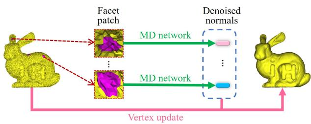  
(a) Workflow of existing MD networks.

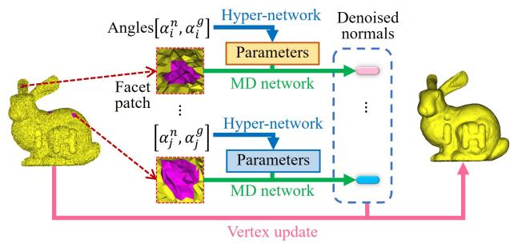  
(b) Workflow of Hyper-MD.  
Figure 1. Workflows of existing MD networks and Hyper-MD. αn and αg are two angles.

Recently, some deep-learning-based works [8, 15, 16, 23, 31, 35, 41] have been developed to predict noise-free facet normals for mesh denoising. As shown in Figure 1 (a), these works typically feed a facet patch into a neural network to predict the denoised normal, which is then used to update vertex positions. For example, Zhao et al. [41] represent the patch using voxels and employ 3D convolutions to regress noise-free normals. Li et al. [15] estimate the denoised normal from a facet patch through a network similar to PointNet++ [20]. Shen et al. [23] propose to infer denoised normals by graph convolutions which accept a graph representation of mesh faces as input. Deep-learningbased methods do not rely on any specific assumptions and have shown significant improvement over conventional approaches. However, none of the existing MD networks take into account geometric characteristics and noise distributions, which actually play crucial roles in achieving effective denoising performance.

In this paper, we propose a hyper-network-based MD method called Hyper-MD, which effectively denoises meshes by utilizing customized parameters that are aware of noise intensity and geometric characteristics of each facet. As illustrated in Figure 1 (b), Hyper-MD consists of an MD network and a hyper-network. For each noisy facet, the hyper-network customizes denoising parameters first, and then the MD network employs the customized parameters to infer the denoised normal. The input of the hyper-network is two specially designed angles $( \alpha ^ { n }$ and $\alpha ^ { g } )$ which represent the noise intensity and geometric characteristics, respectively. On the one hand, the angle $\alpha ^ { n }$ , reflecting the noise intensity, is calculated as the angular gap between paired noisy-filtered normals. The filtered normals are obtained from a filtered mesh, which acts as an agent for the clean mesh. On the other hand, the angle $\alpha ^ { g }$ reveals the geometric characteristics and is computed on the filtered mesh since the geometric characteristics on the noisy mesh are distorted by noise. Besides, we construct the customized parameters using a combination of a coarse-grained base and fine-grained offsets to improve the efficiency and stability of parameter customization. The coarse-grained base is selected from a pool of candidates. The candidates are several models that are trained using facets with varying noise intensities and geometric characteristics, thus carrying expertise for different types of data. The fine-grained offsets are predicted by a simple multi-branch fully connected network, serving to refine the parameters based on the coarsegrained base. Extensive experiments show that Hyper-MD achieves consistently superior performance to existing state-of-the-art methods on various types of meshes.

In summary, the main contributions of this paper are summarized as follows:

• We develop a mesh denoising method called Hyper-MD, which leverages a hyper-network to effectively address the challenges posed by various geometric characteristics and noise distributions.

• Using a filtered mesh as the agent of the clean mesh, we produce two angles $( \alpha ^ { n }$ and $\alpha ^ { g } )$ to capture the noise intensity and geometric characteristics of each facet. These angles are then passed into the hyper-network for parameter customization.

• We construct the customized parameters using a combination of a coarse-grained base and fine-grained offsets. The coarse-grained base carries expertise for different types of data, while the fine-grained offsets are dynamically predicted by a multi-branch fully connected network to refine the parameters.

## 2. Related Works

In this section, we review the related works of mesh denoising and hyper-network, respectively.

## 2.1. Mesh Denoising

Existing mesh denoising methods can be broadly categorized into conventional methods and deep-learningbased methods. Conventional methods mainly include optimization-based methods and filter-based methods. Optimization-based methods formulate the denoising task as an optimization problem based on some assumptions about the geometric characteristics and noise patterns, and then solve the optimization problems via techniques like Bayesian [4], $L _ { 0 }$ minimization [9], compressed sensing [32], or low-rank recovery [14, 34] to estimate denoised meshes. Filter-based methods conduct mesh denoising using well-designed coefficients. Pioneering filter-based methods [1, 2, 5, 6, 11, 22] directly act on vertices, until Lee et al. [12] report that facet normals are more effective in revealing local geometry than vertices. As a result, a series of methods [13, 39, 40, 42] that denoise normals first and then update vertex positions are developed and achieve improved denoising performance. Conventional methods heavily rely on assumptions about geometric characteristics and noise patterns. They perform well when these assumptions hold true for the given meshes. However, the assumptions often fail to generalize across different meshes and noise, thus limiting the performance of optimization-based and filterbased denoising methods.

Recently, deep-learning-based approaches have been introduced for predicting noise-free facet normals in mesh denoising. Unlike 2D images, 3D meshes are irregular and general convolutional neural networks not directly applicable [15, 16, 23]. Therefore, the focus of deep-learningbased MD works has been on developing suitable networks for meshes. Early works represent meshes in regular forms, such as hand-crafted features or voxels, which are adapted to convolutional operations. For example, Wang et al. [31] introduce a filtered face normal descriptor and use simple multi-layer perceptrons for noise-free normal regression. Li et al. [16] learn low-rank non-local patch-group normal matrices (NPNMs) and then adopt a 2D convolutional network to predict noise-free normals. Zhao et al. [41] develop a voxel-based representation for local mesh patches and apply 3D convolutions to regress noise-free normals. Regrettably, these methods with hand-crafted features or voxel representations inevitably suffer from insufficient or redundant information. Subsequent methods start directly acting on the facet normals. For example, Li et al. [15] apply a network like PointNet++ [20] to estimate the denoised normal from a patch of face normals. To the best of our knowledge, this is the first end-to-end network for mesh denoising. Shen et al. [23] represent mesh patches in a graph form and utilize a graph convolution network to infer denoised normals. As graphs are capable of naturally capturing the geometric features, this method is not only end-to-end, but also preserves complete geometric information. Existing deeplearning-based methods have demonstrated superior performance compared to conventional methods. However, none of existing mesh denoising (MD) networks consider the diverse geometric characteristics and noise distributions exhibited by mesh facets, which are crucial factors for achieving effective denoising results. In contrast, the proposed Hyper-MD leverages a hyper-network to effectively address the challenges posed by various geometric characteristics and noise distributions.

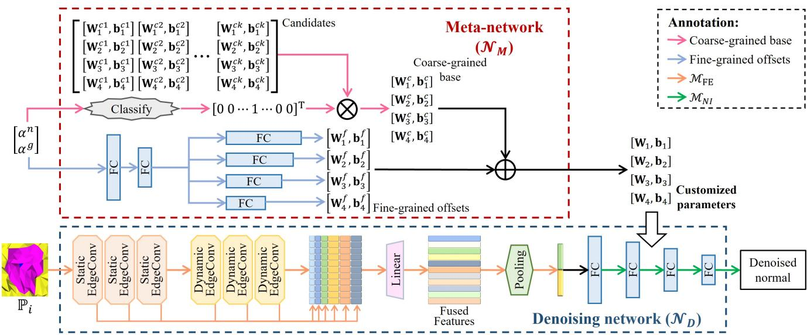  
Figure 2. The architecture of Hyper-MD.

## 2.2. Hyper-network

In hyper-network approaches, the parameters of a network are dynamically customized by another network, known as the hyper-network or meta-network, instead of being trained using the training data. For example, Cai et al. [3] propose a memory matching network for the one-shot image recognition task. They utilize the memory of support sets to predict the parameters of a classifier, enabling it to be directly adapted to new categories without the need for back propagation. Yang et al. [36] propose MetaAnchor, a flexible anchor mechanism that dynamically generates anchor functions using arbitrary customized prior boxes. MetaAnchor is more robust to anchor settings and bounding box distributions compared to predefined anchor mechanisms. Liu et al. [17] present PruningNet, a hyper-network that automatically prunes channels for very deep neural networks. PruningNet is trained to generate parameters for any pruned structure, allowing for the search of various pruned networks under different constraints with little human involvement. Hu et al. [10] leverage a hyper-network to solve super-resolution tasks of arbitrary scale factors (including non-integer scale factors) using a single model. They propose a meta upscale module that dynamically predicts the weights of upscale filters based on the scale factor, enabling the generation of high-resolution images of arbitrary sizes. Ye et al. [37] introduce Meta-PU, a method for point cloud upsampling with arbitrary scale factors using a single model. Meta-PU utilizes a meta-subnetwork to adjust the weights of the upsampling blocks and incorporates a farthest sampling block to sample different numbers of points. Meta-PU even outperforms previous methods trained for specific scale factors, as training on multiple scales simultaneously benefits each other.

While the hyper-network technique has received extensive study in a variety of works, this is the first work to extend it to mesh denoising. For successful extension, we calculate two angles based on the agent of clean meshes to reveal the geometric characteristics and noise intensity. Moreover, existing methods typically use a hyper-network to directly output customized parameters. In this paper, we elaborately construct the customized parameters with a coarse-grained base and fine-grained offsets. In this way, only fine-grained offsets need to be predicted while customizing parameters, improving the efficiency and stability of parameter customization.

## 3. Methodology

This section provides detailed explanations of the proposed Hyper-MD. Like previous works [15, 16, 23, 31, 35, 41], Hyper-MD predicts the denoised normal. The vertex updating is performed using the commonly adopted approach in [23, 41, 42]. This section starts with an introduction of the denoising network (denoted as $\mathcal { N } _ { D } )$ , and then elaborates on the hyper-network $( \mathcal { N } _ { M } )$ . Afterwards, we outline the training strategy and finally describe the process of vertex updating.

## 3.1. Denoising Network

Input & Output. We express a mesh as $\{ \mathbb { V } , \mathbb { F } \}$ , where $\mathbb { V } = \{ \mathbf { v } _ { i } \} _ { 1 } ^ { N _ { v } }$ is the set of vertices while $\mathbb { F } = \{ f _ { i } \} _ { 1 } ^ { N _ { f } }$ is the set of facets. For each facet $f _ { i } \in \mathbb { F }$ , its normal is denoted as ${ \bf n } _ { i } .$ . The denoising network takes the r-ring patch of $f _ { i }$ as input and outputs the denoised normal:

$$
\begin{array} { r } { \mathbf { n } _ { i } ^ { \prime } = \mathcal { N } _ { D } ( \mathbb { P } _ { i } ^ { r } ) . } \end{array}\tag{1}
$$

Here, $\mathbb { P } _ { i } ^ { r }$ is the r-ring patch of $f _ { i }$ . It is initialized to $\{ f _ { i } \}$ and obtained by iteratively adding facets that share at least one vertex with the facets in $\mathbb { P } _ { i } ^ { r }$ for r times. To remove unnecessary degrees of freedom, all input patches are translated to the origin, scaled into a unit bounding box, and rotated to the direction where the mean normal of $\mathbb { P } _ { i } ^ { r }$ is [0, 0, 1]. $\mathbf { n } _ { i } ^ { \prime }$ is the predicted denoised normal, which needs to undergo rotation opposite to $\mathbb { P } _ { i } ^ { r }$

Architecture. The applied denoising network in this paper is greatly inspired by GCN-Denoiser [23]. As shown in Figure 2, $\mathcal { N } _ { D }$ contains a feature extraction module $( \mathcal { M } _ { F E } )$ and a normal inference module $( \mathcal { M } _ { N I } )$ $\mathcal { M } _ { F E }$ is composed of three static EdgeConv layers [25, 33], three dynamic EdgeConv layers [25, 33], a linear layer [19], and a pooling layer. The static EdgeConv layers capture local shallow features. The dynamic EdgeConv layers enriches the receptive field of a graph node. Graph nodes are connected with neighbors that are dynamically calculated by the $K \mathfrak { - }$ nearest neighbor algorithm $( K = 8$ in our implementation) based on the Euclidean distance of node features. Then, the extracted features of EdgeConv layers are concatenated together and fused through a linear layer. The fused features simultaneously flow into an average pooling layer and a max pooling layer to select features for denoised normal inference. $\mathcal { M } _ { N I }$ follows a simple structure of four fully connected (FC for short) layers. It regresses the extracted features into a 3D vector, which is exactly the predicted normal.

Loss. Following GCN-Denoiser [23], we use MSE between the network output and the ground truth normal as the loss function. The MSE loss leads to more stable training than cosine similarity as it imposes hard constraints on the values to be within the range of (0, 1). Normalized normals are mapped from (−1, 1) into (0, 1).

## 3.2. Hyper-network

Input. The input to the hyper-network is two angles, namely $\alpha ^ { n }$ and $\alpha ^ { g }$ , which describe the noise intensity and geometric characteristics, respectively.

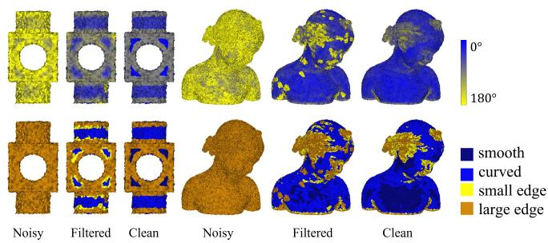  
Figure 3. Meshes in the first row are color-coded according to $\alpha ^ { g }$ as shown in the color bar. Meshes in the second row are colorcoded according to facet categories.

For each facet $f _ { i } ,$ the noise intensity is related to the angle between its normal and the ground truth normal. However, ground truth meshes are not available during denoising, so we develop an agent using a simple mean filter. In particular, a filtered mesh is generated through iterative normal filtering and vertex updating. For each facet $f _ { i }$ , the normal filtering is conducted as:

$$
\mathbf { n } _ { i } ^ { k + 1 } = \frac { 1 } { | \mathbb { P } _ { i } ^ { f } | } \sum _ { f _ { j } \in \mathbb { P } _ { i } ^ { f } } \mathbf { n } _ { j } ^ { k } .\tag{2}
$$

Here, $\mathbb { P } _ { i } ^ { f }$ is the set of facets that share an edge with $f _ { i } .$ . k denotes the k-th iteration. Subsequently, vertex positions are updated according to the obtained normals. Taking the filtered mesh as the agent of the ground truth mesh, the noise intensity of $f _ { i }$ is reflected by the angle between its normal (ni) and the corresponding filtered normal $( \mathbf { n } _ { i } ^ { M } )$ ):

$$
\alpha _ { i } ^ { n } = \operatorname { a c o s } ( \mathbf { n } _ { \mathrm { i } } \cdot \mathbf { n } _ { \mathrm { i } } ^ { \mathrm { M } } ) .\tag{3}
$$

According to geometric characteristics, facets can be divided into four categories [23, 41]: smooth facets, curved facets, small edge facets, and large edge facets. For each facet, the corresponding category is determined by the maximum angle $( \alpha ^ { g } )$ difference in the 2-ring patch of the facet. Inspired by this, we take advantage of $\alpha ^ { g }$ to characterize the geometric features of facets. However, calculating $\alpha ^ { g }$ on noisy meshes is very unstable as geometric characteristics are heavily eroded by noise, and noiseless meshes are not available during denoising. As a result, we calculate $\alpha ^ { g }$ on filtered meshes mentioned in previous paragraph:

$$
\alpha _ { i } ^ { g } = \operatorname* { m a x } _ { f _ { j } \in \mathbb { P } _ { i } ^ { 2 } } \operatorname* { m a x } _ { f _ { l } \in \mathbb { P } _ { i } ^ { 2 } } \operatorname { a c o s } ( \mathbf { n } _ { j } ^ { M } \cdot \mathbf { n } _ { l } ^ { M } ) .\tag{4}
$$

Some meshes are color-coded according to $\alpha ^ { g }$ as shown in Figure 3. We can see that the $\alpha ^ { g }$ based on filtered meshes is capable of reflecting the geometric characteristics of facets like that based on clean meshes.

Output. As shown in Figure $^ { 2 , }$ the output of $\mathcal { N } _ { M }$ is parameters that are customized for $\mathcal { M } _ { N I }$ in $\mathcal { N } _ { D }$ . We construct the customized parameters using a coarse-grained base and fine-grained offsets.

Table 1. The classification of facets based on $\alpha ^ { n }$ and $\alpha ^ { g } .$ . All facets are divided into 3 categories based on $\alpha ^ { n }$ and 4 categories based on $\alpha ^ { g }$ , so there are a total of twelve categories.
<table><tr><td rowspan=1 colspan=1></td><td rowspan=1 colspan=1>weaklynoisy $\alpha ^ { n } \leq 1 5 ^ { \circ }$ </td><td rowspan=1 colspan=1>moderatelynoisy $1 5 ^ { \circ } < \alpha ^ { n } \leq 3 0 ^ { \circ }$ </td><td rowspan=1 colspan=1>stronglynoisy $3 0 ^ { \circ } < \alpha ^ { n }$ </td></tr><tr><td rowspan=1 colspan=1>smooth region $\alpha ^ { g } \leq 2 0 ^ { \circ }$ </td><td rowspan=1 colspan=1>category 1</td><td rowspan=1 colspan=1>category 5</td><td rowspan=1 colspan=1>category 9</td></tr><tr><td rowspan=1 colspan=1>curved region $2 0 ^ { \circ } < \alpha ^ { g } \leq 5 0 ^ { \circ }$ </td><td rowspan=1 colspan=1>category 2</td><td rowspan=1 colspan=1>category 6</td><td rowspan=1 colspan=1>category 10</td></tr><tr><td rowspan=1 colspan=1>small edge region $5 0 ^ { \circ } < \alpha ^ { g } \le 8 0 ^ { \circ }$ </td><td rowspan=1 colspan=1>category 3</td><td rowspan=1 colspan=1>category 7</td><td rowspan=1 colspan=1>category 11</td></tr><tr><td rowspan=1 colspan=1>large edge region $8 0 ^ { \circ } < \alpha ^ { g }$ </td><td rowspan=1 colspan=1>category 4</td><td rowspan=1 colspan=1>category 8</td><td rowspan=1 colspan=1>category 12</td></tr></table>

The coarse-grained base is selected from some candidates, which are trained on different facets. We divide facets into several categories according to their $\alpha ^ { n }$ and $\alpha ^ { g }$ , and train an model for each category. In our implementation, facets are divided into 3 categories based on $\alpha ^ { n }$ and 4 categories based on $\alpha ^ { g } .$ . As a result, there are a total of twelve categories as shown in Tabel 1. More experiments and analyses on the number of categories are provided in the Supplementary Material. Subsequently, we separately train the denoising network using each category facets, thus obtaining twelve models. It should be mentioned that the $\mathcal { M } _ { F E }$ in these models share the same parameters that are pre-trained using complete training data. Finally, the parameters of the $\mathcal { M } _ { N I }$ in these models make up the coarse-grained candidates. During denoising, each facet is classified based on its $\alpha ^ { n }$ and $\alpha ^ { g }$ , and the corresponding candidate is selected as the coarse-grained base.

The fine-grained offsets are predicted dynamically using a straightforward multi-branch fully connected network. Once $\alpha ^ { n }$ and $\alpha ^ { g }$ are inputted into $\mathcal { N } _ { M }$ , the network employs two fully connected layers to extract features. Following this, four branches are utilized to predict the offsets of the four fully connected layers in $\mathcal { M } _ { N I }$ . Ultimately, the predicted offsets are added to the selected coarse-grained base to obtain the complete customized parameters.

## 3.3. Training Strategy

The proposed Hyper-MD method is trained in three steps as illustrated in Figure 4. In the first step, we train the denoising network using all the training data, resulting in a pre-trained model denoted as $\mathcal { N } _ { D } ( \mathbb { P } _ { i } ^ { r } ; { \bf M } _ { F E } ^ { 0 } , { \bf M } _ { N I } ^ { 0 } )$ . Here, $\mathbf { M } _ { F E } ^ { 0 }$ represents the parameters of MF $\mathcal { M } _ { F E }$ , while $\mathbf { M } _ { N I } ^ { 0 }$ represents the parameters of $\mathcal { M } _ { N I }$ . In the second step, all the training data are divided into several categories through the approach introduced in Subsection 3.2. Initializing $\mathcal { N } _ { D }$ with $( { \bf M } _ { F E } ^ { 0 } , { \bf M } _ { N I } ^ { 0 } )$ and freezing $\mathcal { M } _ { F E }$ , we fine-tune $\mathcal { M } _ { N I }$ on each category separately to generate candidate models. The parameters of $\mathcal { M } _ { N I }$ in these models form the coarsegrained candidates: $[ \mathbf { M } _ { N I } ^ { 1 } , \mathbf { M } _ { N I } ^ { 2 } , . . . , \mathbf { M } _ { N I } ^ { 1 2 } ]$ . In the third step, initializing $\mathcal { M } _ { F E }$ with ${ \bf M } _ { F E } ^ { 0 } ,$ , based on the coarsegrained candidates, we freeze $\mathcal { N } _ { D }$ and train $\mathcal { N } _ { M }$ using all training data.

First step:  
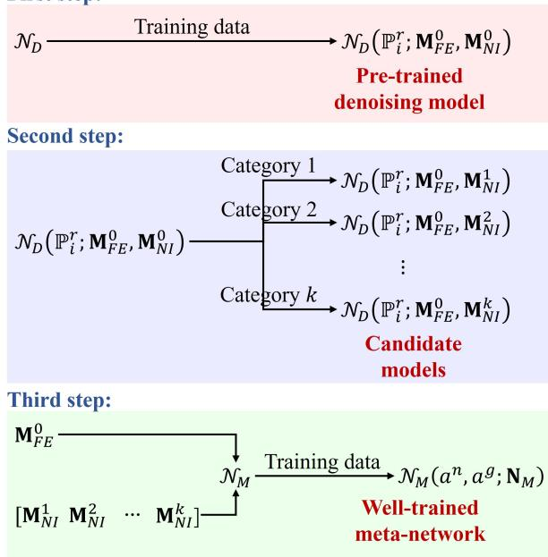  
Figure 4. The schematic diagram of training steps.

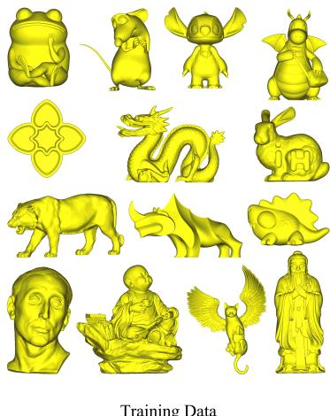

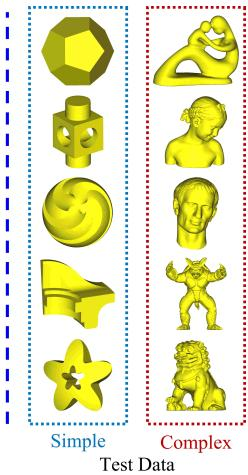  
Figure 5. The meshes that are contained in SynData.

## 3.4. Vertex Updating

The applied vertex updating scheme in our method is the same as [23, 42]. For a facet $f _ { i } ,$ its normal is denoted as $\mathbf { n } _ { i } .$ and its centroid is denoted as $\mathbf { c } _ { i } .$ . The denoised normal is $\mathbf { n } _ { i } ^ { \prime } .$

For each vertex $\mathbf { v } _ { i }$ , the updated position $\mathbf { v } _ { i } ^ { \prime }$ is calculated as:

$$
\mathbf { v } _ { i } ^ { \prime } = \mathbf { v } _ { i } + \frac { 1 } { | \mathbb { P } _ { \mathbf { v } _ { i } } ^ { f } | } \sum _ { f _ { j } \in \mathbb { P } _ { \mathbf { v } _ { i } } ^ { f } } \mathbf { n } _ { j } ^ { \prime } ( \mathbf { n } _ { j } ^ { \prime } \cdot ( \mathbf { c } _ { j } - \mathbf { v } _ { i } ) ) .\tag{5}
$$

Here, $\mathbb { P } _ { \mathbf { v } _ { i } } ^ { f }$ is the set of facets that contain $\mathbf { v } _ { i }$ as a vertex.

## 4. Experiments

This section introduces the datasets and metrics, experimental results, ablation studies, as well as studies on method efficiency in the following. Besides, additional analyzes on implementation details, hyperparameter selection, and method rationality can be found in the Supplementary Material.

## 4.1. Datasets and Metrics

Dataset. The applied synthetic dataset (denoted as Syn-Data) contains 24 3D triangle meshes from [23], [18], and an online 3D model repository (3dmag.org). As shown in Figure 5, 14 meshes are used for training, and the rest are test meshes. The test data are divided into simple geometric meshes and complex object meshes, allowing us to observe the performance of methods on different types of data. We produce noisy meshes for training by adding Gaussian noise and and impulsive noise to clean meshes. The standard deviations of Gaussian noise are 0.1, 0.2, and 0.3 of the mesh average edge length, while the numbers of impulsive vertices are 10%, 20%, and 30% of the mesh vertex numbers. The test set only covers Gaussian noise like previous works [15, 16, 23, 41].

The real-scanned datasets include Kinect series datasets [31] and models collected from Internet. The Kinect series datasets are generated by scanning six objects (big girl, cone, girl, boy, David, and pyramid) using Microsoft Kinect v1 and v2. There are a total of three datasets denoted as Kv1Data, Kv2Data, and K-FData, respectively. The models collected from Internet include angel, gargoyle 1, gargoyle 2, rabbit, Lucy, and eagle.

Metrics. Two commonly adopted metrics are used in our experiments. $E _ { a }$ measures the average normal angular difference between a denoised mesh and the ground truth noise-free mesh:

$$
E _ { a } = \frac { 1 } { N _ { f } } \sum _ { f _ { i } \in \mathbb { F } } \operatorname { a c o s } ( \mathbf { n } _ { i } ^ { \prime } \cdot \hat { \mathbf { n } } _ { i } ) .\tag{6}
$$

Here, F is the set of faces, while $N _ { f }$ is the number of faces in F. $\mathbf { n } _ { i } ^ { \prime }$ and $\hat { \mathbf { n } } _ { i }$ are the denoised normal and ground truth normal of $f _ { i } , \ E _ { v }$ is the normalized average Hausdorff distance from the denoised mesh to the corresponding groundtruth mesh [31]:

$$
E _ { v } = \frac { 1 } { N _ { v } } \sum _ { \mathbf { v } _ { i } ^ { \prime } \in \mathbb { V } ^ { \prime } } \operatorname* { m i n } _ { \hat { \mathbf { v } } _ { i } \in \mathbb { V } } | | \mathbf { v } _ { i } ^ { \prime } - \hat { \mathbf { v } } _ { i } | | .\tag{7}
$$

Here, $\mathbb { V } ^ { \prime }$ and $\hat { \mathbb { V } }$ are the sets of denoised vertices and ground truth vertices. The smaller the $E _ { a }$ and $E _ { v }$ , the better the performance.

## 4.2. Comparison Study

We compare Hyper-MD with state-of-the-art MD methods including bilateral mesh filtering (BMF) [6], bilateral normal filtering (BNF) [42], guided normal filtering (GNF) [39], mesh total generalized variation (TGV) [18], and GCN-Denoiser (GCN) [23]. The results of BMF, BNF, GNF, and TGV are obtained with fine-tuned parameters on each mesh, while the results of GCN are generated with models that are trained by ourselves using the same training data as Hyper-MD. Here we provide some key comparisons, additional results are presented in the Supplementary Material.

Synthetic dataset. The experimental results on SynData are collected in Table 2. In order to make the $E _ { v }$ of different 3D meshes comparable, all meshes in SynData are scale-normalized to make their diagonals of shape bounding boxes be equal to 1. From Table 2, Hyper-MD achieves the best performance on complex meshes, and is competitive with TGV on simple meshes. In specific, the average $E _ { a }$ and $E _ { v }$ of Hyper-MD on complex meshes are smallest. As for simple meshes, $E _ { a }$ of TGV is the best, while our method performs better in $E _ { v } .$ . The detailed results at different noise levels (0.1, 0.2, and 0.3) show the consistent results.

Two representative denoised meshes of SynData are shown in Figure 6. The performance of BMF and BNF is slightly inferior, which can be seen from the zoomed results. Besides, GNF and TGV are better at restoring sharp features such as right angles in the second row. However, GNF and TGV perform worse than GCN and Hyper-MD on regions with rich textures (like the braid region in the forth row). Both GCN and Hyper-MD exhibit robustness in both simple and complex models, but Hyper-MD’s overall performance is slightly better.

Real-scanned dataset. The quantitative comparisons on Kinect series datasets are shown in Figure 7. We can see that Hyper-MD consistently achieves the minimum metrics except for $E _ { v }$ on K-FData. Hyper-MD is second only to GCN in $E _ { \imath }$ on K-FData. Representative results on Kv2Data and K-FData are shown in Figure 8, from which we can see that Hyper-MD restores the boy’s nose better. Both TGV and Hyper-MD successfully restore smooth regions, but the edge of Hyper-MD is more sharp and clean.

We further provide the comparison results for models with different scanners. As illustrated in Figure 9, Hyper-MD produces better feature recovery results than the compared methods on both two models that contain complex structures, which further verifies the capability of Hyper-MD.

Table 2. The experimental results on SynData. The average values on each subset is marked in blue for ease of observation. The meaning of ↓ is that the smaller the value, the better the performance.
<table><tr><td rowspan="3">Methods</td><td colspan="8">Simple meshes</td><td colspan="8">Complex meshes</td></tr><tr><td colspan="4"> $E _ { a \mathrm { ~ \downarrow ~ } }$ </td><td colspan="4"> $E _ { v } \downarrow ( \times 1 0 ^ { - 3 } )$ </td><td colspan="4"> $E _ { a \mathrm { ~ \downarrow ~ } }$ </td><td colspan="4"> $E _ { v } \downarrow ( \times 1 0 ^ { - 4 } )$ </td></tr><tr><td>0.1</td><td>0.2</td><td>0.3</td><td>ave</td><td>0.1</td><td>0.2</td><td>0.3</td><td>ave</td><td>0.1</td><td>0.2</td><td>0.3</td><td>ave</td><td>0.1</td><td>0.2</td><td>0.3</td><td>ave</td></tr><tr><td>Noisy</td><td>10.32</td><td>24.05</td><td>39.15</td><td>24.51</td><td>1.50</td><td>3.54</td><td>5.84</td><td>3.62</td><td>10.25</td><td>24.40</td><td>39.58</td><td>24.74</td><td>5.27</td><td>12.46</td><td>20.57</td><td>12.77</td></tr><tr><td>BMF</td><td>3.04</td><td>6.09</td><td>12.32</td><td>7.15</td><td>1.52</td><td>2.92</td><td>4.30</td><td>2.91</td><td>2.82</td><td>6.08</td><td>12.80</td><td>7.23</td><td>5.34</td><td>9.86</td><td>14.66</td><td>9.95</td></tr><tr><td>BNF</td><td>1.17</td><td>3.37</td><td>10.28</td><td>4.94</td><td>0.99</td><td>2.28</td><td>3.70</td><td>2.32</td><td>2.08</td><td>5.36</td><td>13.44</td><td>6.96</td><td>3.86</td><td>8.61</td><td>13.61</td><td>8.69</td></tr><tr><td>GNF</td><td>1.89</td><td>3.98</td><td>8.42</td><td>4.76</td><td>1.05</td><td>2.32</td><td>3.65</td><td>2.34</td><td>3.28</td><td>6.39</td><td>10.88</td><td>6.85</td><td>4.28</td><td>9.10</td><td>14.03</td><td>9.14</td></tr><tr><td>TGV</td><td>1.19</td><td>2.80</td><td>7.52</td><td>3.84</td><td>1.47</td><td>3.02</td><td>4.54</td><td>3.01</td><td>2.13</td><td>4.68</td><td>9.48</td><td>5.43</td><td>5.97</td><td>10.91</td><td>15.97</td><td>10.95</td></tr><tr><td>GCN</td><td>1.60</td><td>3.92</td><td>9.07</td><td>4.86</td><td>1.13</td><td>2.37</td><td>3.72</td><td>2.41</td><td>2.22</td><td>4.67</td><td>8.86</td><td>5.25</td><td>3.77</td><td>8.36</td><td>12.53</td><td>8.21</td></tr><tr><td>Hyper-MD</td><td>1.27</td><td>3.23</td><td>8.45</td><td>4.32</td><td>0.99</td><td>2.20</td><td>3.41</td><td>2.20</td><td>1.63</td><td>3.87</td><td>8.00</td><td>4.50</td><td>3.62</td><td>7.92</td><td>12.02</td><td>7.85</td></tr></table>

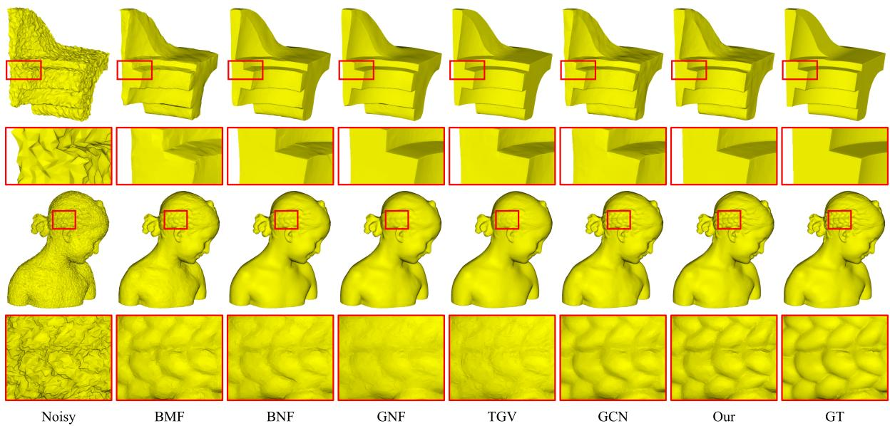  
Figure 6. Representative denoised meshes on SynData.

## 4.3. Ablation Studies

A total of five ablation experiments are conducted on the SynData dataset to demonstrate the impact of each component in Hyper-MD. Each experiment contains a variant that lacks one specific component. The first variant (w/o $\mathcal { N } _ { M } )$ is conducted to carried out to confirm the superiority of the hyper-network. In this variant, the denoising network’s parameters are learned solely from the training data, without utilizing the customized parameters from the hyper-network $\mathcal { N } _ { M }$ The second variant (w/o Coarse-grained) and the third variant (w/o Fine-grained) investigate the roles of the coarse-grained base and fine-grained offsets, respectively. The fourth variant $( \alpha ^ { n } )$ omits $\alpha ^ { n }$ in the input of $\mathcal { N } _ { M }$ , while the fifth variant $( \alpha ^ { g } )$ omits $\alpha ^ { g }$

All experimental results are provided in Table 3. We can see that all these variants without specific components perform worse compared to Hyper-MD. Notably, the absence of $\mathcal { N } _ { M }$ and the coarse-grained base demonstrate the most significant decline in performance. These findings strongly indicate that each component in Hyper-MD plays a positive and crucial role in achieving better performance.

Table 3. The results of ablation experiments.
<table><tr><td>Variants</td><td>Simple meshes  $E _ { a }$   $E _ { v } ( \times 1 0 ^ { - 3 } )$ </td><td>Complex meshes  $E _ { a }$   $E _ { v } ( \times 1 0 ^ { - 4 } )$ </td></tr><tr><td>w/o  $\mathcal { N } _ { M }$ </td><td>4.91 2.44</td><td>5.28</td></tr><tr><td>w/o Coarse-grained 4.84</td><td>2.43</td><td>8.24 4.83 8.11</td></tr><tr><td>w/o Fine-grained</td><td>4.46 2.31</td><td>4.61 7.93</td></tr><tr><td>w/o  $\alpha ^ { n }$ </td><td>4.38 2.25</td><td>4.55 7.88</td></tr><tr><td>w/o  $\alpha ^ { g }$ </td><td>4.37 2.23</td><td>4.57 7.89</td></tr><tr><td>Ours</td><td>4.32 2.20</td><td>4.50 7.85</td></tr></table>

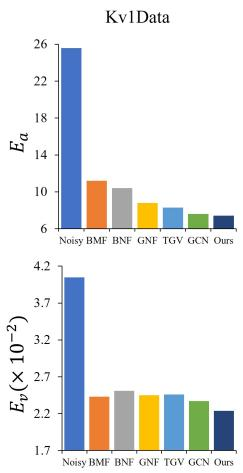

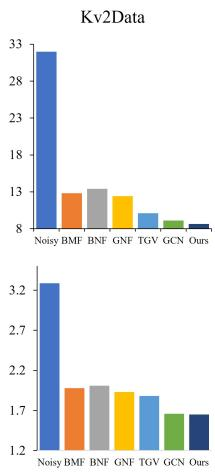  
Figure 7. Results on Kv1Data, Kv2Data, and K-FData.

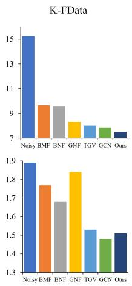

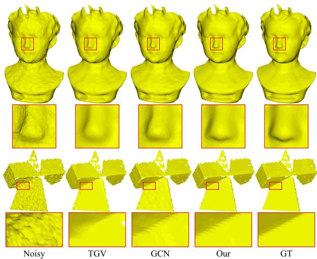  
Figure 8. The representative results of compared methods on realscanned datasets.

## 4.4. Studies on Method Efficiency

This subsection analyzes method efficiency in terms of the training time and denoising time. On a computer equipped with an AMD Ryzen 9 5900HX CPU and a NVIDIA GeForce RTX 3080 Laptop GPU, the total training time on the SynData dataset is approximately 80 hours. The first step accounts for 45 hours, the second step takes around 32 hours, and the third step requires approximately 3 hours. It is evident that training multiple candidate models can be time-consuming. However, it is worth noting that each candidate model only needs to update the four fully connected layers. This selective update approach helps mitigate the overall time consumption during training.

The average denoising time of various methods on Syn-Data is collected in Table 4. As observed, BNF and TGV are significantly faster, which are non-deep-learning-based methods. As for deep-learning-based methods, Hyper-MD is slower than GCN. This is because Hyper-MD needs more iterations than GCN. In fact, the time for one iteration of GCN and Hyper-MD is similar, with an average of 26s and 32s respectively. GCN only needs 15 iterations on average, while Hyper-MD takes 20 iterations.

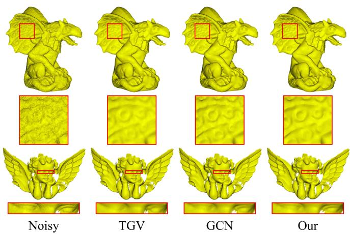  
Figure 9. The denoising results of gargoyle 1 and angel.

Table 4. The average denoising time on SynData.
<table><tr><td>Method</td><td>BNF</td><td>TGV</td><td>GCN</td><td>Hyper-MD</td></tr><tr><td>Time</td><td>35s</td><td>49s</td><td>384s</td><td>920s</td></tr></table>

## 5. Conclusion

In this paper, we propose a hyper-network-based MD method called Hyper-MD, which effectively denoises meshes by utilizing customized parameters that are aware of noise intensity and geometric characteristics of each facet. We produce two angles to capture the noise intensity and geometric characteristics of each facet, and construct the customized parameters using a combination of a coarse-grained base and fine-grained offsets. Experiments demonstrate that Hyper-MD achieves consistently superior performance to existing state-of-the-art methods on various meshes. However, Hyper-MD has several limitations. Firstly, the specialized designs results in a multitude of hyperparameters that need to be thoroughly studied and optimized. Secondly, the training process can be laborious and time-consuming due to the complexity of the models. Thirdly, the facet-wise and iterative paradigm employed in the denoising process can lead to significant time overhead, making the overall denoising process time-consuming.

Acknowledgements: This work was supported by the National Key R&D Program of China (2021YFF0900500), and the National Natural Science Foundation of China (NSFC) under grants U22B2035, 62272128.

## References

[1] Andrew Adams, Natasha Gelfand, Jennifer Dolson, and Marc Levoy. Gaussian kd-trees for fast high-dimensional filtering. ACM Transactions on Graphics (TOG), 28(3):1–12, 2009. 2

[2] Chandrajit L Bajaj and Guoliang Xu. Anisotropic diffusion of surfaces and functions on surfaces. ACM Transactions on Graphics (TOG), 22(1):4–32, 2003. 2

[3] Qi Cai, Yingwei Pan, Ting Yao, Chenggang Yan, and Tao Mei. Memory matching networks for one-shot image recognition. In Proceedings of the IEEE Conference on Computer Vision and Pattern Recognition, pages 4080–4088, 2018. 3

[4] James R Diebel, Sebastian Thrun, and Michael Brunig. A¨ bayesian method for probable surface reconstruction and decimation. ACM Transactions on Graphics (TOG), 25(1): 39–59, 2006. 2

[5] Hanqi Fan, Yizhou Yu, and Qunsheng Peng. Robust featurepreserving mesh denoising based on consistent subneighborhoods. IEEE Transactions on Visualization and Computer Graphics, 16(2):312–324, 2009. 2

[6] Shachar Fleishman, Iddo Drori, and Daniel Cohen-Or. Bilateral mesh denoising. In ACM SIGGRAPH 2003 Papers, pages 950–953. 2003. 1, 2, 6

[7] Rana Hanocka, Amir Hertz, Noa Fish, Raja Giryes, Shachar Fleishman, and Daniel Cohen-Or. MeshCNN: a network with an edge. ACM Transactions on Graphics (TOG), 38 (4):1–12, 2019. 1

[8] Shota Hattori, Tatsuya Yatagawa, Yutaka Ohtake, and Hiromasa Suzuki. Learning self-prior for mesh denoising using dual graph convolutional networks. In European Conference on Computer Vision, pages 363–379. Springer, 2022. 1

[9] Lei He and Scott Schaefer. Mesh denoising via l0 minimization. ACM Transactions on Graphics (TOG), 32(4):1–8, 2013. 2

[10] Xuecai Hu, Haoyuan Mu, Xiangyu Zhang, Zilei Wang, Tieniu Tan, and Jian Sun. Meta-SR: A magnificationarbitrary network for super-resolution. In Proceedings of the IEEE/CVF Conference on Computer Vision and Pattern Recognition, pages 1575–1584, 2019. 3

[11] Thouis R Jones, Fredo Durand, and Mathieu Desbrun. Non-´ iterative, feature-preserving mesh smoothing. In ACM SIG-GRAPH 2003 Papers, pages 943–949. 2003. 2

[12] Kai-Wah Lee and Wen-Ping Wang. Feature-preserving mesh denoising via bilateral normal filtering. In Ninth International Conference on Computer Aided Design and Computer Graphics (CAD-CG’05), pages 275–280. IEEE, 2005. 2

[13] Tao Li, Jun Wang, Hao Liu, and Li-gang Liu. Efficient mesh denoising via robust normal filtering and alternate vertex updating. Frontiers of Information Technology & Electronic Engineering, 18(11):1828–1842, 2017. 2

[14] Xianzhi Li, Lei Zhu, Chi-Wing Fu, and Pheng-Ann Heng. Non-local low-rank normal filtering for mesh denoising. In Computer Graphics Forum, pages 155–166. Wiley Online Library, 2018. 1, 2

[15] Xianzhi Li, Ruihui Li, Lei Zhu, Chi-Wing Fu, and Pheng-Ann Heng. DNF-Net: A deep normal filtering network for

mesh denoising. IEEE Transactions on Visualization and Computer Graphics, 27(10):4060–4072, 2020. 1, 2, 3, 6

[16] Zhiqi Li, Yingkui Zhang, Yidan Feng, Xingyu Xie, Qiong Wang, Mingqiang Wei, and Pheng-Ann Heng. NormalF-Net: Normal filtering neural network for feature-preserving mesh denoising. Computer-Aided Design, 127, 2020. 1, 2, 3, 6

[17] Zechun Liu, Haoyuan Mu, Xiangyu Zhang, Zichao Guo, Xin Yang, Kwang-Ting Cheng, and Jian Sun. MetaPruning: Meta learning for automatic neural network channel pruning. In Proceedings of the IEEE/CVF International Conference on Computer Vision, pages 3296–3305, 2019. 3

[18] Zheng Liu, Yanlei Li, Weina Wang, Ligang Liu, and Renjie Chen. Mesh total generalized variation for denoising. IEEE Transactions on Visualization and Computer Graphics, 2021. 6

[19] Charles R Qi, Hao Su, Kaichun Mo, and Leonidas J Guibas. PointNet: Deep learning on point sets for 3D classification and segmentation. In Proceedings of the IEEE Conference on Computer Vision and Pattern Recognition, pages 652–660, 2017. 4

[20] Charles R Qi, Li Yi, Hao Su, and Leonidas J Guibas. Point-Net++: deep hierarchical feature learning on point sets in a metric space. In Proceedings of the 31st International Conference on Neural Information Processing Systems, pages 5105–5114, 2017. 1, 2

[21] Jonas Schult, Francis Engelmann, Theodora Kontogianni, and Bastian Leibe. DualConvMesh-Net: Joint geodesic and euclidean convolutions on 3D meshes. In Proceedings of the IEEE/CVF Conference on Computer Vision and Pattern Recognition, pages 8612–8622, 2020. 1

[22] Yuzhong Shen and Kenneth E Barner. Fuzzy vector medianbased surface smoothing. IEEE Transactions on Visualiza tion and Computer Graphics, 10(3):252–265, 2004. 2

[23] Yuefan Shen, Hongbo Fu, Zhongshuo Du, Xiang Chen, Evgeny Burnaev, Denis Zorin, Kun Zhou, and Youyi Zheng. GCN-Denoiser: Mesh denoising with graph convolutional networks. ACM Transactions on Graphics (TOG), 41(1):1– 14, 2022. 1, 2, 3, 4, 5, 6

[24] Hongkuan Shi, Zhiwei Wang, Jinxin Lv, Yilang Wang, Peng Zhang, Fei Zhu, and Qiang Li. Semi-supervised learning via improved teacher-student network for robust 3D reconstruction of stereo endoscopic image. In Proceedings of the 29th ACM International Conference on Multimedia, pages 4661– 4669, 2021. 1

[25] Martin Simonovsky and Nikos Komodakis. Dynamic edgeconditioned filters in convolutional neural networks on graphs. In Proceedings of the IEEE Conference on Computer vision and Pattern Recognition, pages 3693–3702, 2017. 4

[26] Vinit Veerendraveer Singh, Shivanand Venkanna Sheshappanavar, and Chandra Kambhamettu. Meshnet++: A network with a face. In ACM Multimedia, pages 4883–4891, 2021. 1

[27] Jiaming Sun, Xi Chen, Qianqian Wang, Zhengqi Li, Hadar Averbuch-Elor, Xiaowei Zhou, and Noah Snavely. Neural 3D reconstruction in the wild. In ACM SIGGRAPH 2022 Conference Proceedings, pages 1–9, 2022. 1

[28] Dan Wang, Xinrui Cui, Xun Chen, Zhengxia Zou, Tianyang Shi, Septimiu Salcudean, Z Jane Wang, and Rabab Ward.

Multi-view 3D reconstruction with transformers. In Proceedings of the IEEE/CVF International Conference on Computer Vision, pages 5722–5731, 2021. 1

[29] Jun Wang, Xi Zhang, and Zeyun Yu. A cascaded approach for feature-preserving surface mesh denoising. Computer-Aided Design, 44(7):597–610, 2012. 1

[30] Lingjing Wang, Cheng Qian, Jifei Wang, and Yi Fang. Unsupervised learning of 3D model reconstruction from handdrawn sketches. In Proceedings of the 26th ACM International Conference on Multimedia, pages 1820–1828, 2018. 1

[31] Peng-Shuai Wang, Yang Liu, and Xin Tong. Mesh denoising via cascaded normal regression. ACM Transactions on Graphics (TOG), 35(6):232:1–232:12, 2016. 1, 2, 3, 6

[32] Ruimin Wang, Zhouwang Yang, Ligang Liu, Jiansong Deng, and Falai Chen. Decoupling noise and features via weighted l1-analysis compressed sensing. ACM Transactions on Graphics (TOG), 33(2):1–12, 2014. 2

[33] Yue Wang, Yongbin Sun, Ziwei Liu, Sanjay E Sarma, Michael M Bronstein, and Justin M Solomon. Dynamic graph cnn for learning on point clouds. Acm Transactions On Graphics (TOG), 38(5):1–12, 2019. 4

[34] Mingqiang Wei, Jin Huang, Xingyu Xie, Ligang Liu, Jun Wang, and Jing Qin. Mesh denoising guided by patch normal co-filtering via kernel low-rank recovery. IEEE Transactions on Visualization and Computer Graphics, 25(10): 2910–2926, 2018. 1, 2

[35] Mingqiang Wei, Xianglin Guo, Jin Huang, Haoran Xie, Hua Zong, Reggie Kwan, Fu Lee Wang, and Jing Qin. Mesh defiltering via cascaded geometry recovery. In Computer Graphics Forum, pages 591–605. Wiley Online Library, 2019. 1, 3

[36] Tong Yang, Xiangyu Zhang, Zeming Li, Wenqiang Zhang, and Jian Sun. MetaAnchor: learning to detect objects with customized anchors. In Proceedings of the 32nd International Conference on Neural Information Processing Systems, pages 318–328, 2018. 3

[37] Shuquan Ye, Dongdong Chen, Songfang Han, Ziyu Wan, and Jing Liao. Meta-PU: An arbitrary-scale upsampling network for point cloud. IEEE Transactions on Visualization and Computer Graphics, 2021. 3

[38] Yufei Ye, Abhinav Gupta, and Shubham Tulsiani. What’s in your hands? 3D reconstruction of generic objects in hands. In Proceedings of the IEEE/CVF Conference on Computer Vision and Pattern Recognition, pages 3895–3905, 2022. 1

[39] Wangyu Zhang, Bailin Deng, Juyong Zhang, Sofien Bouaziz, and Ligang Liu. Guided mesh normal filtering. In Computer Graphics Forum, pages 23–34. Wiley Online Library, 2015. 1, 2, 6

[40] Wenbo Zhao, Xianming Liu, Shiqi Wang, Xiaopeng Fan, and Debin Zhao. Graph-based feature-preserving mesh normal filtering. IEEE Transactions on Visualization and Computer Graphics, 27(3):1937–1952, 2019. 2

[41] Wenbo Zhao, Xianming Liu, Yongsen Zhao, Xiaopeng Fan, and Debin Zhao. NormalNet: Learning-based mesh normal denoising via local partition normalization. IEEE Transactions on Circuits and Systems for Video Technology, 31(12): 4697–4710, 2021. 1, 2, 3, 4, 6

[42] Youyi Zheng, Hongbo Fu, Oscar Kin-Chung Au, and Chiew-Lan Tai. Bilateral normal filtering for mesh denoising. IEEE Transactions on Visualization and Computer Graphics, 17 (10):1521–1530, 2010. 1, 2, 4, 5, 6