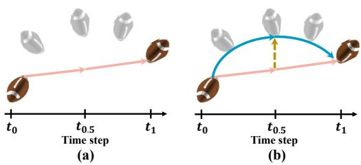
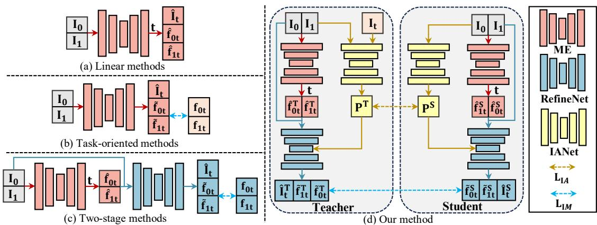
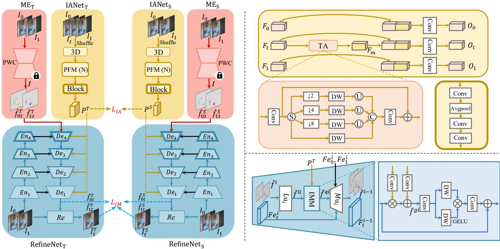
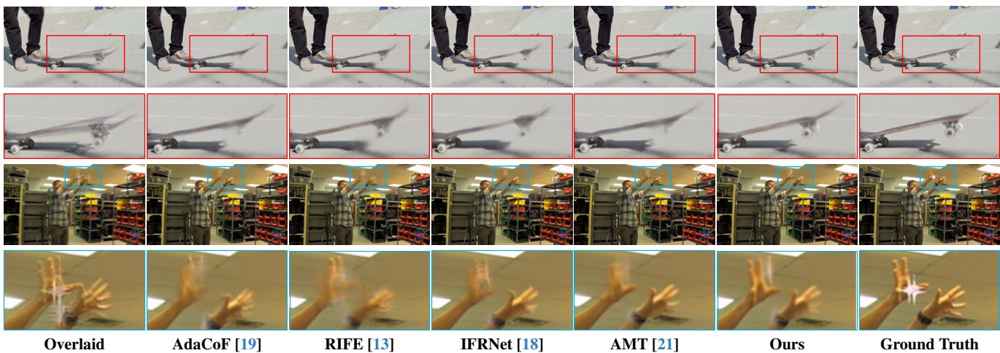
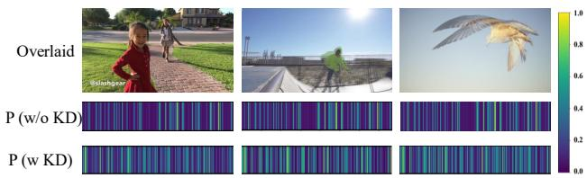
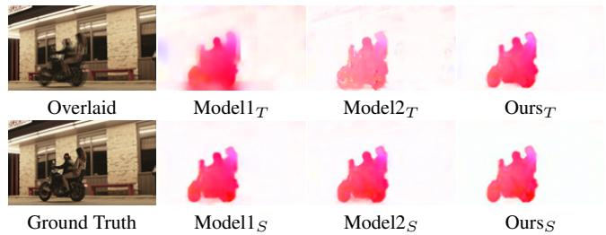

# IQ-VFI: Implicit Quadratic Motion Estimation for Video Frame Interpolation

Mengshun Hu1,2 Kui Jiang3 Zhihang Zhong4 Zheng Wang1,2† Yinqiang Zheng5

1National Engineering Research Center for Multimedia Software, Institute of Artificial Intelligence, School of Computer Science, Wuhan University 2Hubei Key Laboratory of Multimedia and Network Communication Engineering 3Harbin Institute of Technology 4Shanghai Artificial Intelligence Laboratory 5The University of Tokyo

## Abstract

Advanced video frame interpolation (VFI) algorithms approximate intermediate motions between two input frames to synthesize intermediate frame. However, they struggle to handle complex scenarios with curvilinear motions since they overlook the latent acceleration information between the input frames. Moreover, the supervision ofpredicted motions is tricky because ground-truth motions are not available. To this end, we propose a novel framework for implicit quadratic video frame interpolation (IQ-VFI), which explores latent acceleration information and accurate intermediate motions via knowledge distillation. Specifically, the proposed IQ-VFI consists of an implicit acceleration estimation network (IANet) and a VFI backbone, the former fully leverages spatio-temporal information to explore latent acceleration priors between two input frames, which is then used to progressively modulate linear motions from the latter into quadratic motions in coarseto-fine manner. Furthermore, to encourage both components to distill more acceleration and motion cues oriented towards VFI, we propose a knowledge distillation strategy in which implicit acceleration distillation loss and implicit motion distillation loss are employed to adaptively guide latent acceleration priors and intermediate motions learning, respectively. Extensive experiments show that our proposed IQ-VFI can achieve state-of-the-art performances on various benchmark datasets.

## 1. Introduction

Video frame interpolation (VFI) aims to generate intermediate frames between the input frames [4, 13, 19, 21, 24, 33], The key to this task is to find correspondences between two consecutive frames to synthesize intermediate frame via warping operator [28]. Naturally, motion estimation (e.g., optical flow) is the most critical step in the well-established paradigms of VFI networks [1, 8, 9, 12, 18, 29, 39].

  
Figure 1. (a) linear methods: synthesizing the intermediate frame by fitting the linearly approximate intermediate flow (see orange trajectory). (b) our method: exploring latent acceleration prior (see yellow dotted line) to promote (a), which can model the complex scenario, like curvilinear motion (see dark green trajectory).

To predict accurate optical flows, a sort of pioneering approach is linear methods (see Figure 2(a)) [12, 23, 24]. This scheme typically utilizes an off-the-shelf motion estimator (ME) [14, 35, 36] to predict bidirectional flows $\hat { f } _ { 0 1 }$ and $\hat { f } _ { 1 0 }$ between input frames $I _ { 0 }$ and $I _ { 1 }$ , and then approximates intermediate flows $\hat { f } _ { 0 t }$ and $\hat { f } _ { 1 t }$ using linear multiplication. The aforementioned procedures can be depicted as:

$$
\begin{array} { r l } & { \hat { f } _ { 0 1 } , \ \hat { f } _ { 1 0 } = M E ( I _ { 0 } , I _ { 1 } ) , \ M E ( I _ { 1 } , I _ { 0 } ) , } \\ & { \hat { f } _ { 0 t } , \ \hat { f } _ { 1 t } = t \cdot \hat { f } _ { 0 1 } , \ ( 1 - t ) \cdot \hat { f } _ { 1 0 } . } \end{array}\tag{1}
$$

However, these methods rely on specific assumptions $( e . g . ,$ linear motion assumption) and thus are less effective on complex scenarios (e.g., curvilinear trajectory) when the assumption does not hold (see Figure 1(a)).

Unlike linear methods, task-oriented methods (see Figure 2(b)) [18, 21] attempt to train ME to directly predict bidirectional task-oriented flows $\widetilde { f } _ { 0 t }$ and $\widetilde { f } _ { 1 t }$ for fitting complex motions. This process is described as:

$$
\widetilde { f } _ { 0 t } , \ \widetilde { f } _ { 1 t } = M E ( I _ { 0 } , I _ { 1 } ) .\tag{2}
$$

Contemporaneously, two-stage methods (see Figure 2(c)) [13] introduce an additional RefineNet to further refine linear flows $\hat { f } _ { 0 t }$ and $\hat { f } _ { 1 t }$ from linear methods to obtain task-oriented flows $\ddot { f } _ { 0 t }$ and $\widetilde { f } _ { 1 t }$ , depicted as:

$$
\widetilde { f } _ { 0 t } , ~ \widetilde { f } _ { 1 t } = R e f i n e N e t ( \hat { f } _ { 0 t } , \hat { f } _ { 1 t } , I _ { 0 } , I _ { 1 } ) .\tag{3}
$$

  
Figure 2. Different schemes for VFI. (a) Linear methods: they introduce an off-the-shelf motion estimator (ME) to predict bidirectional intermediate flows $\hat { f } _ { 0 t }$ and $\hat { f } _ { 1 t }$ via linear multiplication t to synthesize the intermediate frame $\hat { I } _ { t } .$ . (b) Task-oriented methods: they directly predict bidirectional intermediate flows $\widetilde { f } _ { 0 t }$ and $\widetilde { f } _ { 1 t }$ to synthesize the intermediate frame $\hat { I } _ { t } .$ . (c) Two-stage methods: based on (a), they refine linear flows $\hat { f } _ { 0 t }$ and $\hat { f } _ { 1 t }$ to obtain more accurate flows $\widetilde { f } _ { 0 t }$ and $\widetilde { f } _ { 1 t }$ via additional RefineNet (Note that methods (b) and (c) input ground-truth information $I _ { t }$ into an off-the-shelf ME to produce pseudo labels $f _ { 0 t }$ and $f _ { 1 t }$ for supervision). (d) Our method: based on (c), we further introduce implicit acceleration network (IANet) to explore latent acceleration prior (P) and implicit quadratic optical flows $\widetilde { f } _ { 0 t }$ and $\widetilde { f } _ { 1 i }$ t via task-oriented implicit acceleration distillation loss $L _ { I A }$ and implicit motion distillation loss $L _ { I M }$

Unfortunately, the above methods remain challenging in fitting quadratic motions due to the neglect of latent acceleration prior. Moreover, they introduce ground-truth intermediate frame $I _ { t }$ to obtain pseudo labels $f _ { 0 t }$ and $f _ { 1 t }$ for supervision. However, because of the gap between tasks, there exists undesired knowledge in pseudo labels, which is sub-optimal for specific VFI task [13, 18, 39].

In this paper, we propose a novel framework for implicit quadratic video frame interpolation (IQ-VFI) (see Figure 2(d)), which explores latent acceleration prior and accurate intermediate motions to handle complex scenarios. Theoretically, the motion state of each pixel can be parametrically defined via the quadratic motion model with specific parameters, like velocity and acceleration, depicted as:

$$
\begin{array} { l } { { f _ { 0 t } = \displaystyle \int _ { 0 } ^ { t } [ v _ { 0 } + \int _ { 0 } ^ { k } a _ { \tau } d \tau ] d k = t \cdot f _ { 0 1 } + \frac { a _ { \tau } } { 2 } \cdot ( t ^ { 2 } - t ) , } } \\ { { f _ { 1 t } = \displaystyle \int _ { 1 } ^ { t } [ v _ { 1 } + \int _ { 1 } ^ { k } a _ { \tau } d \tau ] d k } } \\ { { \displaystyle \quad = ( 1 - t ) \cdot f _ { 1 0 } + \frac { a _ { \tau } } { 2 } \cdot ( ( 1 - t ) ^ { 2 } - ( 1 - t ) ) , } } \end{array}\tag{4}
$$

where $f _ { 0 t } , f _ { 1 t } , f _ { 0 1 }$ and $f _ { 1 0 }$ denote the displacement of pixel (e.g., opticalflow). $v _ { 0 }$ and $v _ { 1 }$ are the velocity, and $a _ { \tau }$ represents the acceleration (Note that we assume the acceleration $a _ { \tau }$ ofeach pixel is constant within a small time interval).

Since $f _ { 0 1 }$ and $f _ { 1 0 }$ are known via $\operatorname { E q . } ( 1 )$ , technically, to achieve Eq.(4), only acceleration $a _ { \tau }$ is required to be solved. We review VFI task, and regard the acceleration prediction as the complete representation of conventional linear motion fields. To this end, we advise an implicit quadratic video frame interpolation (IQ-VFI) framework, involving an implicit acceleration estimation network (IANet) and a VFI backbone (e.g., Two-stage methods). IANet adopts multiple progressive fusion modules (PFMs) to implicitly explore spatio-temporal information for latent acceleration prediction $a _ { \tau }$ (Note that explicitly solving for accurate acceleration $a _ { \tau }$ via two input frames is challenging). And then the predicted linear motions from VFI backbone are modulated into quadratic motions via an implicit motion modulate module (IMM) with the guidance of $a _ { \tau }$ . To facilitate the simulation of acceleration and motion oriented towards VFI, we propose a knowledge distillation strategy in which implicit acceleration distillation loss $( L _ { I A } )$ and implicit motion distillation loss $( L _ { I M } )$ are proposed to guide latent acceleration prior and intermediate motions learning, respectively. Specifically, given three consecutive frames $( e . g .$ , input frames $I _ { 0 } , \ I _ { 1 }$ and groundtruth frame $I _ { t } )$ , IANet can easily predict latent acceleration prior to guide VFI backbone for IQ-VFI, which can be served as teacher knowledge. Meanwhile, based on the same procedure but getting rid of the ground-truth frame $I _ { t }$ as inputs, we introduce the distillation losses to guide the student to imitate knowledge learning from the teacher. Our main contributions can be summarized as follows:

• We advise a novel quadratic motion-based framework for IQ-VFI, which explore latent acceleration prior and intermediate motions to tackle complex motion scenarios.

• We introduce a novel knowledge distillation strategy in which implicit acceleration distillation loss $( L _ { I A } )$ and implicit motion distillation loss $( L _ { I M } )$ are jointly optimized to encourage IQ-VFI to distill more acceleration and motion cues oriented towards VFI.

• Extensive experiments show that our method performs well against the state-of-the-art (SOTA) methods on various benchmark datasets.

## 2. Related Work

Video Frame Interpolation. Advanced VFI methods are mainly categorized into motion-free and motion-based, depending on whether or not cues like optical flow are involved [12]. Motion-free: Motion-free methods rely on implicit spatio-temporal modeling [5, 6, 10, 11, 17] to generate the intermediate frame. For example, CAIN [5] transfers spatial information into channels and then utilizes channel attention to extract motion information for VFI. FLAVR [17] explores spatio-temporal information via 3D convolution to learn motion properties. However, this sort of method lacks explicit constraints for motion modeling, arising undesired artifacts in interpolated results. Motionbased: Motion-based methods aim to predict bidirectional intermediate flows, which then are used to interpolate intermediate frame via the warping operation [12, 13, 16, 26, 28, 29, 33]. Previous methods either linearly approximate or directly predict bidirectional task-oriented flows to produce intermediate frames. To predict accurate intermediate optical flows, additional auxiliary priors $( e . g .$ , context [27], depth [1], occlusion [28]) or RefineNet [2, 13, 15, 41] are introduced to compromise intermediate flow errors. Unfortunately, they struggle to handle complex scenarios with quadratic motions since they overlook the latent acceleration information between input frames. Some efforts have been developed to depicted VFI tasks as the quadratic motion with acceleration information [22, 38]. However, more input frames are required as auxiliary information (e.g.,four frames). In this paper, we propose a novel framework for IQ-VFI, which explores latent acceleration information between only two input frames to progressively modulate linear motions into quadratic motions via knowledge distillation.

Knowledge Distillation in VFI. Advanced methods [13, 18, 21] have achieve impressive performance via optical flow distillation. For example, Huang et.al. [13] design a priviledge distillation scheme that employs a teacher model with access to the intermediate frame to guide the optical flow learning of the student model. However, teacher model overuses privileged knowledge (e.g., overfitting) due to lack of regularization, making it challenging for students to distill flow knowledge [20]. Kong et.al. [18] propose a flow distillation loss that selectively distills useful off-theshelf flow knowledge for VFI. However, considering offthe-shelf optical flow is often a sub-optimal representation for VFI [5, 39], this scheme fails to explore abundant flow knowledge. Unlike them, our proposed method prevents teacher model from overusing privileged knowledge to alleviate overfitting. Moreover, rather than using an off-theshelf optical flow model, an implicit motion distillation loss is designed to focus on task-oriented optical flow knowledge from our trained task-oriented teacher.

## 3. Methodology

## 3.1. Overview

Given two consecutive frames $( I _ { 0 }$ and $I _ { 1 } )$ , video frame interpolation (VFI) aims to synthesize an intermediate frame $I _ { t } ( 0 { < } \mathfrak { t } { < } 1 )$ As illustrated in Eq.(1) and $\operatorname { E q . } ( 3 )$ , existing two-stage methods typically utilize an off-the-shelf motion estimator (ME) [35] to predict intermediate flows $( \hat { f } _ { 0 t }$ and $\hat { f } _ { 1 t } )$ by linear multiplication, which then are compromised to obtain refined flows $( \widetilde { f } _ { 0 t }$ and $\widetilde { f } _ { 1 t } )$ via RefineNet. To convert linear motions to match quadratic motions, as shown in Figure 3, based on the two-stage framework for VFI, we further propose an implicit acceleration estimation network (IANet) to explore latent acceleration prior $P$ for IQ-VFI. Specifically, we cleverly design a teacher network $( I A N e t _ { T } )$ , which takes as inputs of triplet frames $I _ { 0 } , I _ { t }$ and $I _ { 1 }$ to extract latent acceleration prior $P ^ { T }$ for VFI backbone $( V F I _ { T } )$ optimization. This process is expressed as:

$$
\begin{array} { r } { P ^ { T } = I A N e t _ { T } ( I _ { 0 } , I _ { t } , I _ { 1 } ) , \quad } \\ { \widetilde { f } _ { 0 t } ^ { T } , \widetilde { f } _ { 1 t } ^ { T } , \widehat { I } _ { t } ^ { T } = V F I _ { T } ( I _ { 0 } , I _ { 1 } , P ^ { T } ) , \quad } \end{array}\tag{5}
$$

where $\widetilde { f } _ { 0 t } ^ { T }$ and $\widetilde { f } _ { 1 t } ^ { T }$ denote task-oriented intermediate flows, and $\hat { I } _ { t } ^ { T }$ is predicted intermediate frame. To target to $P ^ { T }$ of the $V F I _ { T }$ , we then advise a student network $( I A N e t _ { S } )$ which takes the frames $I _ { 0 }$ and $I _ { 1 }$ as inputs to learn the acceleration prior $P ^ { S }$ , approaching to $P ^ { \dot { T } }$ , for VFI backbone $( V F I _ { S } )$ optimization. This process is expressed as

$$
\begin{array} { r } { P ^ { S } = I A N e t _ { S } ( I _ { 0 } , I _ { 1 } ) , \phantom { x x x x x x x x x x x x x x x x x x x x x x x x x x x x x x x x x x x x x x x x x } } \\ { \widetilde { f } _ { 0 t } ^ { S } , \widetilde { f } _ { 1 t } ^ { S } , \widehat { I } _ { t } ^ { S } = V F I _ { S } ( I _ { 0 } , I _ { 1 } , P ^ { S } ) . } \end{array}\tag{6}
$$

To encourage student network to distill more acceleration and motion cues oriented towards VFI, we propose an implicit acceleration distillation loss $( L _ { I A } )$ and an implicit motion distillation loss $( L _ { I M } )$ to adaptively guide acceleration prior and intermediate motions learning, respectively. The entire distillation loss $L _ { D L }$ is defined as

$$
\boldsymbol { L _ { D L } } = \boldsymbol { L _ { I A } } ( P ^ { S } , P ^ { T } ) + \boldsymbol { L _ { I M } } ( \widetilde { f } _ { 0 t } ^ { S } , \widetilde { f } _ { 1 t } ^ { S } , \widetilde { f } _ { 0 t } ^ { T } , \widetilde { f } _ { 1 t } ^ { T } ) .\tag{7}
$$

## 3.2. Implicit Acceleration Estimation Network

Inspired by the notion that thoroughly exploring spatiotemporal information can assist in modeling motion characteristics from videos [5, 17], we devise an implicit acceleration estimation network (IANet) to explore spatio-temporal information for latent acceleration prediction. Taking the teacher model as an example in Figure 3, we first apply shuffle operation [32] to generate down-shuffled images $( \widetilde { I } _ { 0 } , \widetilde { I } _ { t }$ and $\widetilde { I } _ { 1 } \in \mathbb { R } ^ { H / 4 \times W / 4 \times 4 8 } )$ from the corresponding input images $( I _ { 0 } , I _ { t }$ and $I _ { 1 } \in \mathbb { R } ^ { \tilde { H } \times W \times 3 } )$ , which can capture contextual information from a broader area to perceive scenario motions [5]. And then the commonly used 3D convolution is employed to extract spatio-temporal features $( F _ { 0 } ,$ $F _ { t }$ and $F _ { 1 } )$ followed by N lightweight progressive fusion modules (PFM) to fully explore spatio-temporal relations. Finally, these features derives latent acceleration prior $P ^ { T }$ via a Block, which contains three convolution layers and Avgpool operator (Note that avgpool operator is to prevent teacher modelfrom overusing ground-truth information).

  
Figure 3. The overall architecture of IQ-VFI. The proposed IQ-VFI consists of an implicit acceleration estimation network (IANet) and a VFI backbone (ME and RefineNet). To optimize IQ-VFI, we first train a teacher network: It takes two input frames and ground-truth intermediate frame to learn latent acceleration prior and accurate intermediate motions for IQ-VFI. Then we train a student network: It only takes two input frames to learn the same prior and motions for IQ-VFI via the proposed distillation loss.

Progressive Fusion Module. As shown in Figure 3, the spatio-temporal features $( F _ { 0 } , F _ { t }$ and $F _ { 1 } )$ extracted from 3D convolution are fully aggregated to derive the mixed temporal information $F _ { m }$ via a temporal aggregation block (TA) (Note that the inputsfrom the student model are twofeatures $F _ { 0 }$ and $F _ { 1 } )$ , depicted as:

$$
F _ { m } = T A ( [ F _ { 0 } , F _ { t } , F _ { 1 } ] ) .\tag{8}
$$

Then we combine self-independent spatial information $( F _ { 0 }$ $F _ { t }$ and $F _ { 1 } )$ and mixed temporal information $( F _ { m } )$ to extract spatio-temporal information $O ^ { i }$ via a $3 \times 3$ convolution layer $C ^ { 1 }$ , respectively. this process can be described as:

$$
O _ { i } = C _ { i } ^ { 1 } ( [ F _ { i } , F _ { m } ] ) , \forall i \in \{ 0 , t , 1 \} .\tag{9}
$$

More specifically, the temporal aggregation block (TA) is advised to exploit long-range dependencies from temporal information, which facilitates the latent acceleration prediction. Technically, the spatial features from sequential frames are fused to generate the coarse mixed temporal features $F _ { c m }$ via a $3 \times 3$ convolution layer $C ^ { 2 }$ , depicted as:

$$
F _ { c m } = C ^ { 2 } ( [ F _ { 0 } , F _ { 1 } , F _ { t } ] ) .\tag{10}
$$

To adaptively handle various motions, $F _ { c m }$ is decomposed into four-part components via a channel split operation (S), which then are packed into multi-scale structure to obtain different receptive fields via pooling, $3 \times 3$ depth-wise convolution layers (DW) and upsampling operation. By concatenating these outputs of individual components, we produce the residues for refinement via a convolution layer $C ^ { 3 }$ The aforementioned procedures are described as:

$$
\begin{array} { r l r } & { } & { [ F _ { c m ( 0 ) } , F _ { c m ( 1 ) } , F _ { c m ( 2 ) } , F _ { c m ( 3 ) } ] = S ( F _ { c m } ) , } \\ & { } & { \hat { F } _ { c m ( i ) } = U _ { 2 ^ { i } } ( D W ( D _ { \frac { 1 } { 2 ^ { i } } } ( F _ { c m ( i ) } ) ) ) , \forall i \in \{ 0 , 1 , 2 , 3 \} , } \\ & { } & { F _ { m } = F _ { c m } + C ^ { 3 } ( [ \hat { F } _ { c m ( 0 ) } , \hat { F } _ { c m ( 1 ) } , \hat { F } _ { c m ( 2 ) } , \hat { F } _ { c m ( 3 ) } ] ) , } \end{array}\tag{11}
$$

where $D _ { \frac { 1 } { 2 ^ { i } } } ( \cdot )$ denotes the pooling operation to sample the input features to the size of ${ \frac { 1 } { 2 ^ { i } } } . \ U _ { 2 ^ { i } } ( \cdot )$ refers to the nearest upsampling features to the original resolution.

## 3.3. Video Frame Interpolation Backbone

As shown in Figure 3, we utilize two-stage framework as our VFI backbone, which consists of motion estimator (ME) and RefineNet. To convert linear motions into quadratic motions, the RefineNet is equiped with multiple implicit motion modulation modules (IMM) for progressive refinement in coarse-to-fine manner.

Motion Estimator. Similar to the SOTA methods [12, 28], we first utilize an off-the-shelf network PWC [35] to predict optical flows $\hat { f } _ { 0 1 }$ and $\hat { f } _ { 1 0 }$ , and then approximates intermediate flows $\hat { f } _ { 0 t }$ and $\hat { f } _ { 1 t }$ using linear multiplication.

RefineNet. We improve the U-Net [31] framework, and advise an more effective RefineNet to progressively upgrade linear motions into quadratic motions for IQ-VFI. The key components of RefineNet involve an encoder and a decoder. Encoder: The role of the encoder is to extract the contextual information from input frames for compromising intermediate motions in decoder [13, 18, 21, 41]. Specifically, we extract multi-scale pyramid features $( F e _ { 0 } ^ { i }$ and $F e _ { 1 } ^ { i } )$ via pyramid encoder $E n _ { i }$ (i=1,2,3,4), which consists of two 3×3 convolutions with strides 2 and 1, respectively. Decoder: The role of the decoder $D e _ { i }$ is to progressively refine linear motions for IQ-VFI via predicted acceleration prior, contextual information and generated intermediate features. Specifically, taking one layer of the decoder as an example, we first utilize all-pairs correlations in [21] to update $( L u _ { i } )$ linear motions. It involves the bidirectional correlation volumes building, correlation scale lookup and retrieved correlation update. And then an elaborate implicit motion modulation module (IMM) is introduced to further modulate linear motions into quadratic motions via predicted acceleration prior. At the final, a mutual update module $( M u _ { i } )$ in [18, 21] is used to jointly refine intermediate flows together with the reconstructed intermediate feature, benefiting each other until desired output is achieved.

Implicit Motion Modulation Module. Advanced methods directly utilize RefineNet to improve linear flows for VFI [12, 13, 41]. However, they struggle to handle complex motion scenarios. Since the state of motion of each object is diverse and complex, a more reasonable solution with quadratic motions is required. To this end, we propose implicit motion modulation module (IMM) to modulate linear motions via latent acceleration prior. Specifically, as shown in Figure 3, we transform latent acceleration prior into dynamic modulation parameters via two 1×1 convolution layers $C ^ { 4 }$ and $C ^ { 5 }$ for global linear motions $\widetilde { f } ^ { l i }$ refinement:

$$
\widetilde { f } ^ { g i } = C ^ { 4 } ( P ) \cdot \widetilde { f } ^ { l i } + C ^ { 5 } ( P ) ,\tag{12}
$$

where $\widetilde { f } ^ { g i }$ refers to the global refined motions. To further explore the neighboring relation for local refinement, inspired by [40], a two-path fusion scheme is introduced. Specifically, we first utilize $3 \times 3$ convolution layer $C ^ { 6 }$ to extract motion feature, which is fed into two separate pathways. One pathway aggregates neighboring pixels through 3×3 depth-wise convolution layer $\bar { C } ^ { 7 }$ , while the other pathway adopts the gating mechanism to enhance useful local information through $3 \times 3$ depth-wise convolution layer $C ^ { 8 }$ and GELU [40]. Finally, we utilize a $3 \times 3$ convolution layer $C ^ { 9 }$ to predict the residues to generate quadratic flows ${ \widetilde { f } } ^ { q i }$ The aforementioned procedures are described as:

$$
\widetilde { f } ^ { q i } = C ^ { 9 } ( C ^ { 8 } ( C ^ { 6 } ( \widetilde { f } ^ { g i } ) ) \cdot C ^ { 7 } ( C ^ { 6 } ( \widetilde { f } ^ { g i } ) ) ) + \widetilde { f } ^ { l i } .\tag{13}
$$

## 3.4. Model Objectives

Reconstruction Loss. We adopt Laplacian loss function [27] as our reconstruction loss $L _ { R } ,$ , which calculates the distance between the predicted result and the ground truth among multiple pyramid levels (5 in this study), defined as:

$$
L _ { R } = \sum _ { i = 1 } ^ { 5 } 2 ^ { s - 1 } | | L ^ { i } ( \hat { I } _ { t } ^ { S } ) - L ^ { i } ( I _ { t } ) | | _ { 1 } ,\tag{14}
$$

where $L ^ { i } ( \cdot )$ means the $_ { i - t h }$ level image.

Implicit Acceleration Distillation Loss. Since explicitly predicting high-accuracy acceleration via two input frames is challenging, we propose to implicitly learn latent acceleration prior via knowledge distillation. Specifically, we first train the teacher to learn latent acceleration prior $P ^ { T }$ via three consecutive frames, which serves as targets to guide the optimization of the student network via implicit acceleration distillation loss $L _ { I A }$ , depicted as:

$$
\begin{array} { r } { L _ { I A } = | | \boldsymbol { P } ^ { S } - \boldsymbol { P } ^ { T } | | _ { 1 } . } \end{array}\tag{15}
$$

Implicit Motion Distillation Loss. Existing approaches introduce ground-truth intermediate frame to obtain pseudo label via an off-the-shelf ME for distillation [18, 21, 26]. However, the off-the-shelf optical flow is often a suboptimal representation for VFI [39]. Though some efforts are developed to fine-tune or retrain motion estimator oriented towards for VFI distillation [13, 42], they are prone to overuse ground-truth intermediate frame rather than modeling the latent motions. Consequently, the student network struggles to borrow any valuable information for modeling intermediate motion. Unlike them, our optical flow from the teacher is oriented towards VFI and is prevented from overusing ground-truth intermediate frame, which is more conductive to guiding the student learning via our implicit motion distillation loss $L _ { I M } \mathbf { : }$

$$
\begin{array} { r } { M = \left\{ \begin{array} { r l } { 1 , } & { | | \widehat { I } _ { t } ^ { S } - I _ { t } | | _ { 1 } > | | \widehat { I } _ { t } ^ { T } - I _ { t } | | _ { 1 } } \\ { 0 , } & { | | \widehat { I } _ { t } ^ { S } - I _ { t } | | _ { 1 } \leq | | \widehat { I } _ { t } ^ { T } - I _ { t } | | _ { 1 } } \end{array} \right. } \\ { L _ { I M } = M \cdot | | \widetilde { f } _ { 0 t } ^ { S } - \widetilde { f } _ { 0 t } ^ { T } | | _ { 1 } + M \cdot | | \widetilde { f } _ { 1 t } ^ { S } - \widetilde { f } _ { 1 t } ^ { T } | | _ { 1 } , } \end{array}\tag{16}
$$

where M is the binary mask indicating the interpolation error regions caused by inaccurate optical flows.

With the balanced parameters of $\lambda _ { 1 } , \lambda _ { 2 }$ and $\lambda _ { 3 } ,$ , the overall model objective is formulated as

$$
L _ { t o t a l } = \lambda _ { 1 } L _ { R } + \lambda _ { 2 } L _ { I A } + \lambda _ { 3 } L _ { I M } .\tag{17}
$$

<table><tr><td rowspan="2">Methods</td><td rowspan="2">Venue</td><td rowspan="2">Vimeo90K [39]</td><td rowspan="2">UCF101 [34]</td><td colspan="4">SNU-FILM [5]</td><td colspan="2">Xiph [28]</td></tr><tr><td>Easy</td><td>Medium</td><td>Hard</td><td>Extreme</td><td>2K</td><td>4K</td></tr><tr><td>ToFlow [39]</td><td>IJCV&#x27;19</td><td>33.73/0.968</td><td>34.58/0.967</td><td>39.08/0.989</td><td>34.39/0.974</td><td>28.44/0.918</td><td>23.39/0.831</td><td>33.93/0.922</td><td>30.74/0.856</td></tr><tr><td>DAIN [1]</td><td>CVPR&#x27;19</td><td>34.71/0.976</td><td>34.99/0.968</td><td>39.73/0.990</td><td>35.46/0.978</td><td>30.17/0.934</td><td>25.09/0.858</td><td>35.95/0.940</td><td>33.49/0.895</td></tr><tr><td>CAIN [5]</td><td>AAAI&#x27;20</td><td>34.78/0.974</td><td>35.00/0.969</td><td>39.95/0.990</td><td>35.66/0.978</td><td>29.93/0.930</td><td>24.80/0.851</td><td>35.21/0.937</td><td>32.56/0.901</td></tr><tr><td>BMBC [29]</td><td>ECCV&#x27;20</td><td>35.01/0.976</td><td>35.15/0.969</td><td>39.90/0.990</td><td>35.31/0.977</td><td>29.33/0.927</td><td>23.92/0.843</td><td>32.82/0.928</td><td>31.19/0.880</td></tr><tr><td>AdaCoF [19]</td><td>CVPR&#x27;20</td><td>34.38/0.972</td><td>35.20/0.970</td><td>39.85/0.991</td><td>35.08/0.976</td><td>29.47/0.925</td><td>24.31/0.844</td><td>34.86/0.928</td><td>31.68/0.870</td></tr><tr><td>ABME [29]</td><td>ICCV&#x27;21</td><td>36.22/0.981</td><td>35.41/0.970</td><td>39.59/0.990</td><td>35.77/0.979</td><td>30.58/0.937</td><td>25.42/0.864</td><td>36.53/0.944</td><td>33.73/0.901</td></tr><tr><td>RIFE [13]</td><td>ECCV&#x27;22</td><td>35.65/0.978</td><td>35.28/0.969</td><td>40.06/0.991</td><td>35.75/0.979</td><td>30.10/0.933</td><td>24.84/0.853</td><td>36.19/0.938</td><td>33.76/0.894</td></tr><tr><td>M2M-VFI [12]</td><td>CVPR&#x27;22</td><td>35.49/0.978</td><td>35.32/0.970</td><td>39.66/0.991</td><td>35.74/0.980</td><td>30.32/0.936</td><td>25.07/0.860</td><td>36.44/0.943</td><td>33.92/0.899</td></tr><tr><td>VFIFormer [26]</td><td>CVPR&#x27;22</td><td>36.50/0.982</td><td>35.43/0.970</td><td>40.13/0.991</td><td>36.09/0.980</td><td>30.67/0.938</td><td>25.43/0.864</td><td>OOM</td><td>OOM</td></tr><tr><td>IFRNet [18]</td><td>CVPR&#x27;22</td><td>36.20/0.981</td><td>35.42/0.970</td><td>40.10/0.991</td><td>36.12/0.980</td><td>30.63/0.937</td><td>25.27/0.861</td><td>36.21/0.937</td><td>34.25/0.895</td></tr><tr><td>EMA-VFI [41]</td><td>CVPR&#x27;23</td><td>36.50/0.980</td><td>35.42/0.970</td><td>39.58/0.989</td><td>35.86/0.979</td><td>30.80/0.938</td><td>25.59/0.864</td><td>36.74/0.944</td><td>34.55/0.906</td></tr><tr><td>AMT [21]</td><td>CVPR&#x27;23</td><td>36.53/0.982</td><td>35.45/0.970</td><td>39.88/0.991</td><td>36.12/0.981</td><td>30.78/0.939</td><td>25.43 /0.865</td><td>36.38/0.941</td><td>34.63/0.904</td></tr><tr><td>IQ-VFI (Ours)</td><td></td><td>36.60/0.982</td><td>35.48/0.970</td><td>40.24/0.991</td><td>36.24/0.980</td><td>30.83/0.938</td><td>25.45/0.863</td><td>36.68/0.942</td><td>34.72/0.905</td></tr></table>

Table 1. Quantitative comparisons (PSNR/SSIM) of SOTA methods with our proposed IQ-VFI on UCF101 [34], Vimeo90K [39], SNU FILM [5] and Xiph [28] datasets. The numbers in bold represents the best score.

  
Figure 4. Visual comparisons of different VFI methods on Vimeo90K dataset.

## 4. Experiment Results

## 4.1. Benchmarks

We evaluate our model IQ-VFI on various benchmarks with diverse motion scenes for a comprehensive comparison, and use Peak Signal-to-Noise Ratio (PSNR) and Structural Similarity Index (SSIM) [37] for evaluation metrics. The statistics of benchmarks are presented as follows.

Vimeo90K [39]. This dataset consists of more than 60,000 triplets with the image resolution of 448×256, where 51,312 triplets are cropped into small patches with a fixed size of 256×256 pixels for training, and 3,782 triplets are used for testing.

UCF101 [34]. This dataset consists of 101 videos with human actions, where 379 triplets with the resolution of 256×256 are chosen for testing [23].

SNU-FILM [5]. This testset contains 1,240 triplets of videos of resolution up to 1280×720, which is very challenging for large motions and occlusions scenarios. It is partitioned into four exclusive parts, namely Easy, Medium, Hard, and Extreme.

Xiph [28]. This dataset consists of eight video with a 4K resolution. Following [28], we downsample and center-crop the original image to 2K resolution to get “Xiph-2K” and “Xiph-4K”.

## 4.2. Training Details

We train our model in two stages. (1) We first train the teacher model via Eq.(14), where it inputs three frames including ground-truth frame into IQ-VFI (2) We then train the student model via Eq.(17), where it only inputs two frames into IQ-VFI. Specifically, the number of IAM (N) is 6. We implement two-stage training using Pytorch 1.7 with AdamW optimizer [25] through RTX 3090 GPU. we use Vimeo90K trainset [39] to train our model for 300 epochs with batch size 24 and patch size 224×224. The learning rate is initially set to $2 \times 1 0 ^ { - 4 }$ , and gradually decays to 2 × $1 0 ^ { - 5 }$ following a cosine attenuation schedule.

## 4.3. Comparisons with the SOTAs

We compare our proposed IQ-VFI with twelve SOTA methods, including motion-free methods CAIN [5] and Ada-CoF [19], motion-based methods ToFlow [39], DAIN [1], BMBC [29], ABME [30], RIFE [13], M2M-VFI [12], VFI-Former [26], IFRNet [18], EMA-VFI [41] and AMT [21]. Quantitative Comparison. Quantitative results are shown in Table 1. It is evident that motion-based methods outperform motion-free methods in terms of PSNR and SSIM comparisons across datasets. In particular, the SOTA motion-free method CAIN [5] is 1.75 dB lower than the SOTA motion-based method AMT [21] on Vimeo90K dataset. We have conducted a thorough comparison of motion-based methods and have found that the SOTA taskoriented scheme AMT [21] and the two-stage scheme VFI-Former [26] produce similar results. Furthermore, compared to the SOTA motion-based methods, our proposed IQ-VFI outperforms AMT [21] and VFIFormer [26] by 0.07dB and 0.1dB on the Vimeo90K dataset. All these results validate the effectiveness of our proposed method for VFI task. Qualitative Comparison. The qualitative results are shown in Figure 4. As expected, Motion-free method AdaCoF [19] is prone to produce blurry results (see red and blue boxes) since it lacks explicit constraint for complex motion modeling. Compared to motion-free methods, motion-based methods have the advantage of producing sharp results. However, these methods overlook the latent acceleration information between input frames, which can result in the generated motion being in the wrong position (see the curved motion ofthe skateboard). On the contrary, our proposed IQ-VFI explores the latent acceleration prior between input frames, which contribute to modeling higher-order motion trajectory and generating more accurate results.

<table><tr><td rowspan="2">Methods</td><td colspan="2">VFI backone</td><td rowspan="2">IANet</td><td rowspan="2">KD</td><td rowspan="2">Vimeo90K [39]</td></tr><tr><td>ME</td><td>RefineNet</td></tr><tr><td>IQ-VFIT (Ours)</td><td>V</td><td>V</td><td>V</td><td>x</td><td>36.00</td></tr><tr><td>IQ-VFIS1 (Linear)</td><td>V</td><td>x</td><td>x</td><td>x</td><td>32.59</td></tr><tr><td>IQ-VFIs2 (Task-oriented)</td><td>x</td><td>V</td><td>x</td><td>x</td><td>34.98</td></tr><tr><td>IQ-VFIS3 (Two-stage)</td><td>V</td><td>V</td><td>x</td><td>x</td><td>35.35</td></tr><tr><td>IQ-VFIS4 (w/o KD)</td><td>J</td><td>V</td><td>V</td><td>x</td><td>35.33</td></tr><tr><td>IQ-VFIS5 (Ours)</td><td>V</td><td></td><td>V</td><td>V</td><td>35.52</td></tr></table>

Table 2. Effects of Individual components (PSNR).
<table><tr><td>Method</td><td>LR</td><td> $\mathrm { L } _ { I A }$ </td><td> $\overline { { \mathbf { L } _ { I M } } }$ </td><td>Vimeo90K [39]</td></tr><tr><td>LF1</td><td>V</td><td>x</td><td>x</td><td>35.33</td></tr><tr><td> $\mathrm { L F _ { 2 } }$ </td><td>V</td><td>V</td><td>x</td><td>35.44</td></tr><tr><td> $\mathrm { L F _ { 3 } }$ </td><td></td><td>x</td><td>V</td><td>35.43</td></tr><tr><td> $\mathrm { L F _ { 4 } ( O u r s ) }$ </td><td></td><td></td><td>V</td><td>35.52</td></tr></table>

Table 3. Effects of loss function (PSNR).

## 4.4. Ablation Study

This section details the ablation studies to investigate the individual effects of each component. To save computational resources and achieve efficient validation, we design a small model by reducing the channel number, and train it with image patches of size 224×224 on the Vimeo90K dataset [39] to $2 . 5 \times 1 0 ^ { 5 }$ iterations.

Individual Components. An ablation study is conducted to investigate the impact of various schemes for VFI by progressively incorporating the motion estimator (ME), RefineNet, IANet, and a knowledge distillation strategy.

<table><tr><td>Method</td><td>Pre_trained</td><td>Finetune</td><td>LF4</td><td>Vimeo90K [39]</td></tr><tr><td>Baseline</td><td>x</td><td>x</td><td>x</td><td>35.33</td></tr><tr><td>Model1T</td><td>V</td><td>x</td><td>x</td><td>34.07</td></tr><tr><td>Model1s</td><td>V</td><td>x</td><td>x</td><td>35.24</td></tr><tr><td>Model2T</td><td>x</td><td>V</td><td>x</td><td>38.38</td></tr><tr><td>Model2s</td><td>x</td><td>V</td><td>x</td><td>35.45</td></tr><tr><td>Model3T (Ours)</td><td>x</td><td>x</td><td>V</td><td>36.00</td></tr><tr><td>Model3s (Ours)</td><td>x</td><td>x</td><td>V</td><td>35.52</td></tr></table>

Table 4. Effects of intermediate motion distillation (PSNR).

Quantitative results are tabulated in Table 2. (a) IQ-VFIS1 implements a linear scheme by modeling the motion with off-the-shelf ME, and generates suboptimal results. This proves that linear-based methods are less effective for VFI when the linear motion assumption does not hold. (b) IQ-$\mathrm { \nabla { V F I } } _ { S 2 }$ denotes the task-oriented scheme, which directly utilizes RefineNet to learn intermediate motions, and outperforms $\mathrm { I Q - V F I } _ { S 1 }$ by 2.39dB. (c) $\mathrm { I Q - V F I } _ { S 3 }$ harmonizes the merits of off-the-shelf ME and RefineNet to achieve twostage scheme and further obtains 0.37dB gains. (d) Compared to $\mathrm { I Q \mathrm { - } V F I } _ { S 3 } , \mathrm { I Q \mathrm { - } V F I } _ { S 4 }$ further introduces IANet to explore the latent acceleration prior to achieve quadratic motion estimation, but does not bring gains. We speculate that directly approaching to acceleration from two input frames is non-trivial without any supervision priors. (e) we first train teacher network $\mathrm { I Q - V F I } _ { T }$ with ground-truth information to learn acceleration and motion knowledge, which is used to guide student $\mathrm { I Q - V F I } _ { S 5 }$ to narrow the knowledge gap. Compared to $\mathrm { I Q - V F I } _ { S 4 }$ , this knowledge distillation strategy achieve a 0.19dB boosts.

Loss Function. We have conducted additional experiments to validate the efficacy of our proposed distillation loss across various variations. Quantitative results are shown in Table 3. (a) $\mathrm { L F _ { 1 } }$ only utilize reconstruction loss to constrain the intermediate frame generation. (b) Based on $\mathrm { L F _ { 1 } }$ $\mathrm { L F _ { 2 } }$ and $\mathrm { L F _ { 3 } }$ continue to incrementally add implicit acceleration distillation loss $L _ { I A }$ and implicit motion distillation loss $L _ { I M }$ . This leads to 0.11dB and 0.10dB improvements, respectively. It is obvious that our distillation loss can effectively guide student model to learn acceleration prior and intermediate flow from the teacher. (d) $\mathrm { L F _ { 4 } }$ adopts all loss functions for IQ-VFI and achieves better performances. These comparisons validate the effectiveness of the proposed $L _ { I A }$ and $L _ { I M }$ for the final interpolation performance. Intermediate Motion Distillation. To verify the importance of our intermediate motion distillation, we thus conduct an ablation study on different motion distillation strategies. As shown in Table 4, we take $\mathrm { I Q - V F I } _ { S 4 }$ from Table 2 as baseline, which only utilizes reconstruction loss for supervision. Compared to the baseline, we introduce groundtruth intermediate frame $I _ { t }$ to obtain pseudo labels via an off-the-shelf motion estimator for supervision. However, It suffers from a significant performance decline by 0.09dB on Vimeo90K dataset. This is because the off-the-shelf optical flow is often not an optimal representation for VFI.

  
Figure 5. Visualization of latent acceleration prior.

This can be observed through the evaluation metrics such as PSNR when comparing it to the teacher model. Hence, the pseudo labels generated by this approach may contain undesired information that can negatively impact the distillation process for the student model. Compared to Model1, we utilize intermediate frame reconstruction loss to fine-tune the off-the-shelf motion estimator, which ensures that the generated pseudo labels are oriented towards VFI task. Unfortunately, this distillation strategy (Model2) still struggles to achieve significant improvements on Vimeo90K dataset. We speculate that the teacher model overuses ground-truth knowledge rather than characterizing the motion patterns due to lack of regularization (see PSNR/SSIM from teacher model), making it challenging for student to distill flow knowledge when the ground-truth knowledge is missing. On the contrary, our method (Model3) encourage teacher model to focus on the task-oriented flow patterns with implicit motion distillation loss, achieving 0.19 dB gains.

## 4.5. Visualization Analysis

The Visualization of latent Acceleration prior. To further validate the effectiveness of our proposed latent acceleration prior, we visualize predicted latent acceleration priors P through knowledge distillation (w KD ) and without knowledge distillation (w/o KD). As shown in Figure 5, we find that when KD is not used, the predicted latent acceleration prior remains essentially the same regardless of the motion scenario. This indicates that solving for accurate acceleration via two input frames is challenging. On the contrary, With $L _ { I A }$ , student model adaptively learn latent acceleration prior of various scenarios through teacher model. Moreover, Compared to simple motions, more weights are activated for complex motions (see wing). This is consistent with the results in Table 1 that complex scenarios (see 4K dataset), benefit a lot from latent acceleration prior.

The Visualization of Intermediate Motion. To further validate the effectiveness of our proposed knowledge distillation strategy, we visualize the intermediate optical flows from different teacher models and student models, respectively. One the one hand, though the off-the-shelf motion estimator LiteFlowNet [14] has achieved excellent performance for optical flow estimation task on synthetic datasets [3, 7], they cannot model the real challenges observed in natural scenes, like Vimeo90K dataset. As shown in Figure $^ { 6 , }$ the teacher model Model $1 _ { T }$ clearly provides wrong knowledge in pseudo label (see the boundaries of people and motorcycle), which is sub-optimal for Model1S optimization (see the boundaries of motorcycle). On the other hand, though we fine-tune the off-the-shelf Lite-FlowNet to obtain pesudo labels oriented towards VFI, we find that Model2T overuses ground-truth information rather than characterizing the motion patterns (see optical flow representation), making it challenging for Model2S to distill more useful flows knowledge (see the boundaries ofmotorcycle). On the contrary, through these visualizations, our teacher model OursT focuses more on the motion model and better guides the student model Ours to learn specificmotion knowledge via our implicit motion distillation loss.

  
Figure 6. Visualization of intermediate optical flow from different teacher models and student models.

## 5. Conclusion

This paper proposes a novel framework for implicit quadratic video frame interpolation (IQ-VFI), which explores latent acceleration information and intermediate motion information to tackle complex motion scenarios via knowledge distillation. Specifically, we devise an implicit acceleration estimation network (IANet) to fully mine spatio-temporal information for latent acceleration prior, which then are used modulate the predicted linear motion from VFI backbone into quadratic motions in coarse-to-fine manner. Furthermore, we propose a knowledge distillation strategy in which implicit acceleration distillation loss and implicit motion distillation loss are proposed to guide latent acceleration prior and intermediate motion learning towards VFI. Extensive experiments show that our method outperforms SOTA methods on various benchmark datasets. Though our model explores latent acceleration prior for VFI and yields desired results, it remains an open question how to implicitly and effectively explore video motion properties for VFI.

Acknowledgements. This work was supported by Hubei Key R&D Project (2022BAA033) and National Natural Science Foundation of China (62171325). The numerical calculations in this paper have been done on the supercomputing system in the Supercomputing Center of Wuhan University.

## References

[1] Wenbo Bao, Wei-Sheng Lai, Chao Ma, Xiaoyun Zhang, Zhiyong Gao, and Ming-Hsuan Yang. Depth-aware video frame interpolation. In CVPR, pages 3703–3712, 2019. 1, 3, 6

[2] Wenbo Bao, Wei-Sheng Lai, Xiaoyun Zhang, Zhiyong Gao, and Ming-Hsuan Yang. Memc-net: Motion estimation and motion compensation driven neural network for video interpolation and enhancement. TPAMI, 2019. 3

[3] Daniel J Butler, Jonas Wulff, Garrett B Stanley, and Michael J Black. A naturalistic open source movie for optical flow evaluation. In ECCV, pages 611–625. Springer, 2012. 8

[4] Xianhang Cheng and Zhenzhong Chen. Video frame interpolation via deformable separable convolution. In AAAI, pages 10607–10614, 2020. 1

[5] Myungsub Choi, Heewon Kim, Bohyung Han, Ning Xu, and Kyoung Mu Lee. Channel attention is all you need for video frame interpolation. In AAAI, pages 10663–10671, 2020. 3, 4, 6, 7

[6] Myungsub Choi, Suyoung Lee, Heewon Kim, and Kyoung Mu Lee. Motion-aware dynamic architecture for efficient frame interpolation. In CVPR, pages 13839–13848, 2021. 3

[7] Andreas Geiger, Philip Lenz, Christoph Stiller, and Raquel Urtasun. Vision meets robotics: The kitti dataset. The International Journal of Robotics Research, 32(11):1231–1237, 2013. 8

[8] Mengshun Hu, Jing Xiao, Liang Liao, Zheng Wang, Chia-Wen Lin, Mi Wang, and Shin’ichi Satoh. Capturing small, fast-moving objects: Frame interpolation via recurrent motion enhancement. TCSVT, 32(6):3390–3406, 2021. 1

[9] Mengshun Hu, Kui Jiang, Liang Liao, Zhixiang Nie, Jing Xiao, and Zheng Wang. Progressive spatial-temporal collaborative network for video frame interpolation. In ACM MM, pages 2145–2153, 2022. 1

[10] Mengshun Hu, Kui Jiang, Liang Liao, Jing Xiao, Junjun Jiang, and Zheng Wang. Spatial-temporal space hand-inhand: Spatial-temporal video super-resolution via cycleprojected mutual learning. In CVPR, pages 3574–3583, 2022. 3

[11] Mengshun Hu, Kui Jiang, Zheng Wang, Xiang Bai, and Ruimin Hu. Cycmunet+: Cycle-projected mutual learning for spatial-temporal video super-resolution. TPAMI, 2023. 3

[12] Ping Hu, Simon Niklaus, Stan Sclaroff, and Kate Saenko. Many-to-many splatting for efficient video frame interpolation. In CVPR, pages 3553–3562, 2022. 1, 3, 5, 6

[13] Zhewei Huang, Tianyuan Zhang, Wen Heng, Boxin Shi, and Shuchang Zhou. Real-time intermediate flow estimation for video frame interpolation. In ECCV, pages 624–642. Springer, 2022. 1, 2, 3, 5, 6

[14] Tak-Wai Hui, Xiaoou Tang, and Chen Change Loy. Liteflownet: A lightweight convolutional neural network for optical flow estimation. In CVPR, pages 8981–8989, 2018. 1, 8

[15] Huaizu Jiang, Deqing Sun, Varun Jampani, Ming-Hsuan Yang, Erik Learned-Miller, and Jan Kautz. Super slomo:

High quality estimation of multiple intermediate frames for video interpolation. In CVPR, pages 9000–9008, 2018. 3

[16] Xin Jin, Longhai Wu, Jie Chen, Youxin Chen, Jayoon Koo, and Cheul-hee Hahm. A unified pyramid recurrent network for video frame interpolation. In CVPR, pages 1578–1587, 2023. 3

[17] Tarun Kalluri, Deepak Pathak, Manmohan Chandraker, and Du Tran. Flavr: Flow-agnostic video representations for fast frame interpolation. In WACV, pages 2071–2082, 2023. 3

[18] Lingtong Kong, Boyuan Jiang, Donghao Luo, Wenqing Chu, Xiaoming Huang, Ying Tai, Chengjie Wang, and Jie Yang. Ifrnet: Intermediate feature refine network for efficient frame interpolation. In CVPR, pages 1969–1978, 2022. 1, 2, 3, 5, 6

[19] Hyeongmin Lee, Taeoh Kim, Tae-young Chung, Daehyun Pak, Yuseok Ban, and Sangyoun Lee. Adacof: Adaptive collaboration of flows for video frame interpolation. In CVPR, pages 5316–5325, 2020. 1, 6, 7

[20] Fei Li, Linfeng Zhang, Zikun Liu, Juan Lei, and Zhenbo Li. Multi-frequency representation enhancement with privilege information for video super-resolution. In ICCV, pages 12814–12825, 2023. 3

[21] Zhen Li, Zuo-Liang Zhu, Ling-Hao Han, Qibin Hou, Chun-Le Guo, and Ming-Ming Cheng. Amt: All-pairs multi-field transforms for efficient frame interpolation. In CVPR, pages 9801–9810, 2023. 1, 3, 5, 6, 7

[22] Yihao Liu, Liangbin Xie, Li Siyao, Wenxiu Sun, Yu Qiao, and Chao Dong. Enhanced quadratic video interpolation. In ECCV, pages 41–56. Springer, 2020. 3

[23] Yu-Lun Liu, Yi-Tung Liao, Yen-Yu Lin, and Yung-Yu Chuang. Deep video frame interpolation using cyclic frame generation. In AAAI, pages 8794–8802, 2019. 1, 6

[24] Ziwei Liu, Raymond A Yeh, Xiaoou Tang, Yiming Liu, and Aseem Agarwala. Video frame synthesis using deep voxel flow. In ICCV, pages 4463–4471, 2017. 1

[25] Ilya Loshchilov and Frank Hutter. Decoupled weight decay regularization. ICLR, 2017. 6

[26] Liying Lu, Ruizheng Wu, Huaijia Lin, Jiangbo Lu, and Jiaya Jia. Video frame interpolation with transformer. In CVPR, pages 3532–3542, 2022. 3, 5, 6, 7

[27] Simon Niklaus and Feng Liu. Context-aware synthesis for video frame interpolation. In CVPR, pages 1701–1710, 2018. 3, 5

[28] Simon Niklaus and Feng Liu. Softmax splatting for video frame interpolation. In CVPR, pages 5437–5446, 2020. 1, 3, 5, 6

[29] Junheum Park, Keunsoo Ko, Chul Lee, and Chang-Su Kim. Bmbc: Bilateral motion estimation with bilateral cost volume for video interpolation. ECCV, 2020. 1, 3, 6

[30] Junheum Park, Chul Lee, and Chang-Su Kim. Asymmetric bilateral motion estimation for video frame interpolation. ICCV, 2021. 6

[31] Olaf Ronneberger, Philipp Fischer, and Thomas Brox. U-net: Convolutional networks for biomedical image segmentation. In MICCAI, pages 234–241. Springer, 2015. 5

[32] Wenzhe Shi, Jose Caballero, Ferenc Huszar, Johannes Totz,´ Andrew P Aitken, Rob Bishop, Daniel Rueckert, and Zehan

Wang. Real-time single image and video super-resolution using an efficient sub-pixel convolutional neural network. In CVPR, pages 1874–1883, 2016. 3

[33] Hyeonjun Sim, Jihyong Oh, and Munchurl Kim. Xvfi: Extreme video frame interpolation. In ICCV, pages 14489– 14498, 2021. 1, 3

[34] Khurram Soomro, Amir Roshan Zamir, and Mubarak Shah. Ucf101: A dataset of 101 human actions classes from videos in the wild. arXiv preprint arXiv:1212.0402, 2012. 6

[35] Deqing Sun, Xiaodong Yang, Ming-Yu Liu, and Jan Kautz. Pwc-net: Cnns for optical flow using pyramid, warping, and cost volume. In CVPR, pages 8934–8943, 2018. 1, 3, 5

[36] Zachary Teed and Jia Deng. Raft: Recurrent all-pairs field transforms for optical flow. In ECCV, pages 402–419. Springer, 2020. 1

[37] Zhou Wang, Alan C Bovik, Hamid R Sheikh, and Eero P Simoncelli. Image quality assessment: from error visibility to structural similarity. TIP, 13(4):600–612, 2004. 6

[38] Xiangyu Xu, Li Siyao, Wenxiu Sun, Qian Yin, and Ming-Hsuan Yang. Quadratic video interpolation. NeurIPS, 32, 2019. 3

[39] Tianfan Xue, Baian Chen, Jiajun Wu, Donglai Wei, and William T Freeman. Video enhancement with task-oriented flow. IJCV, 127(8):1106–1125, 2019. 1, 2, 3, 5, 6, 7

[40] Syed Waqas Zamir, Aditya Arora, Salman Khan, Munawar Hayat, Fahad Shahbaz Khan, and Ming-Hsuan Yang. Restormer: Efficient transformer for high-resolution image restoration. In CVPR, pages 5728–5739, 2022. 5

[41] Guozhen Zhang, Yuhan Zhu, Haonan Wang, Youxin Chen, Gangshan Wu, and Limin Wang. Extracting motion and appearance via inter-frame attention for efficient video frame interpolation. In CVPR, pages 5682–5692, 2023. 3, 5, 6

[42] Shili Zhou, Weimin Tan, and Bo Yan. A motion distillation framework for video frame interpolation. TMM, 2023. 5