# Identifying Important Group of Pixels using Interactions

Kosuke Sumiyasu1 Kazuhiko Kawamoto2 Hiroshi Kera3\*

Chiba University, Japan

1kosuke.sumiyasu@gmail.com, 2kawa@faculty.chiba-u.jp, 3kera@chiba-u.jp,

## Abstract

To better understand the behavior of image classifiers, it is useful to visualize the contribution of individual pixels to the model prediction. In this study, we propose a method, MoXI (Model eXplanation by Interactions), that efficiently and accurately identifies a group of pixels with high prediction confidence. The proposed method employs game-theoretic concepts, Shapley values and interactions, taking into account the effects of individual pixels and the cooperative influence of pixels on model confidence. Theoretical analysis and experiments demonstrate that our method better identifies the pixels that are highly contributing to the model outputs than widely-used by Grad-CAM, Attention rollout, and Shapley value. While prior studies have suffered from the exponential computational cost in the computation of Shapley value and interactions, we show that this can be reduced to quadratic cost for our task. The code is available at https://github.com/ KosukeSumiyasu/MoXI.

## 1. Introduction

Visualization of important image pixels has been widely used to understand machine learning models in computer vision tasks such as image classification [1, 3, 18, 20, 23, 31]. To this end, visualization methods compute the contribution of each pixel to model decisions. For example, Grad-CAM [23] measures the contribution using a weighted sum of the feature maps of convolutional layers, where weights are determined by the gradient of confidence score for any target class with respect to the feature map entries. Attention rollout [1] measures it based on the attention weight of encoders of a Vision Transformer.

Several recent studies revealed that a game-theoretic concept, Shapley values [24], is a powerful indicator of pixel contribution [8, 16, 18]. In multi-player games, Shapley values measures the contribution of each player from the average change in the total game reward with his/her presence versus absence. When applied to an image classifier, the pixels of an image are the players, which work cooperatively for the model output (e.g., confidence score). Unlike Grad-CAM and Attention rollout, Shapley values compute the contribution of pixels to the model output more directly. The former methods use feature maps or attention weights, the magnitude of whose entries are not necessarily well-aligned with their contributions to the model output, whereas the latter uses logits or confidence scores. Indeed, Fig. 1 shows that the pixels with high Shapely values have a significantly larger impact on confidence scores than those determined by Grad-CAM or Attention rollout in both (a) insertion case and (b) deletion case.

A crucial caveat of the aforementioned methods is that they identify a group of important pixels by the individual contribution of each pixel and overlook the collective contribution of multiple pixels. For example, Fig. 1(a) shows that the three methods only highlight the class object (i.e., duck) and do not indicate the background (i.e., sea) as an informative factor. However, the set of pixels with the highest contributions (e.g., highest Shapley values) does not imply the most informative pixel set as a whole because the information overlap among pixels is not considered. Indeed, the bottom row of Fig. 1(a) shows that the class object and background greatly impact in synergy the confidence score.

In this paper, we propose an efficient game-theoretic visualization method of image pixels with a high impact on the prediction of an image classifier. Besides Shapley values, we exploit interactions, a game-theoretical concept that reflects the average effect of the cooperation of pixels. Namely, unlike prior methods, including Grad-CAM, Attention rollout, and Shapley values, the proposed method takes into account the cooperative contribution of pixels and identifies the image pixels as a whole. In Fig. 1(a), the pro posed method identifies a pixel set on which the classifier puts high classification confidence. Similarly, in Fig. 1(b), it identifies a minimal pixel set without which the classification fails. Notably, we define self-context variants of Shapley values and interactions, and reduce the number of forward passes from exponential to quadratic times, which resolves the fundamental challenge of game-theoretic approaches to be handy tools for model explanation.

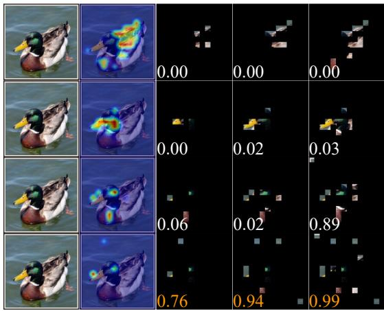  
(a) Insertion

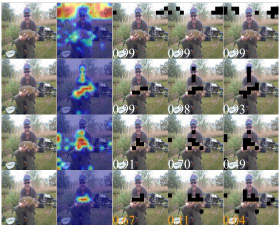  
(b) Deletion  
Figure 1. Examples of image patches with high contributions to the output of ViT-T. (a) Starting from an empty image, image patches are inserted according to their contribution measured by each method. (b) Starting from an original image, image patches are removed according to their contribution measured by each method. The heatmaps highlight the image patches inserted (deleted) to obtain the correct (incorrect) classification. The selected patches are colored according to the timing of insertion/deletion. For insertion, only the proposed method selects patches from the background. For deletion, the proposed method highlights the class object only. For both cases, the proposed method highlights the least number of patches while achieving the highest/lowest confidence score.

In the experiments, we consider the insertion curve and deletion curve on a subset of ImageNet images that are correctly classified by a pretrained classifier. Starting from fully masked images, an insertion curve plots the increase of classification accuracy as unmasking image patches from highly contributing ones determined by each method. Similarly, a deletion curve plots the accuracy decrease from the clean images to fully masked ones. The results show that the proposed method gives sharp insertion/deletion curves. For example, the classification accuracy reached 90% with images with 4% unmasked patches if selected by the proposed method, significantly outperforming the results of Grad-CAM (accuracy of 2%), Attention rollout (accuracy of 4%), and Shapley values (accuracy of 25%). Similar results are observed for the deletion curves and also when we use common corruptions [15] instead of masking. Qualitatively, the heatmaps using the patches selected in the early stage of the insertion curve show that our method highlights both a class object and background, while the other methods mostly highlight the class object only. Meanwhile, in the heatmaps from the deletion curves, our method particularly highlights the class-discriminative region of the object, while the others do not.

Our contributions are summarized as follows:

• We propose an efficient game-theoretic visualization method, named MoXI (Model eXplanation by Interactions), for a group of pixels that significantly influences the classification.

• Our analysis supports a simple greedy strategy from a game-theoretic perspective, leading us to use self-context variants of Shapley values and interactions, which can be computed exponentially faster than computing the original ones.

• Extensive experiments show that our method more accurately identifies the pixels that are highly contributing to the model outputs than standard visualization methods.

## 2. Related Work

Visual explanation of model decision. Various methods have been proposed to understand deep learning models for vision tasks by quantifying and visualizing the contribution of image pixels to the model output [1, 3, 5, 6, 18, 20, 23, 27, 31]. The contribution of pixels has been typically measured using feature maps in models. For example, Grad-CAM [23] determines the contribution by applying weights to the feature maps of the convolutional layers of a CNN using gradients. Attention rollout [1], commonly used for Vision Transformers, calculates the contributions using attention maps. Several methods instead calculate the contribution of each pixel by analyzing the sensitivity of the confidence score with respect to each pixel [8, 16, 18, 20]. For example, RISE (Randomized Input Sampling for Explanation; [20]) calculates the contributions empirically by probing the model with randomly masked images of the input image and obtaining the corresponding confidence scores. SHAP (SHapley Additive exPlanations; [18]) distributes confidence scores fairly to contributions by leveraging Shapley values from game theory. Importantly, the aforementioned methods all measure the contribution of each pixel independently; the collection of important pixels consists of the pixels with high contributions. In contrast, this study identifies the important pixels by further taking into account the collective contributions of pixels.

Game-theoretic approach of model explanation. Several recent studies have utilized a game-theoretic concept, interactions, to analyze various phenomena of deep learning models and quantify an effect of pixel cooperation on the model inference [7, 9, 21, 25, 28, 29]. Wang et al. [28] showed that the transferability of adversarial images has a negative correlation to the interactions. Zhang et al. [29] showed the similarity between the computation of interactions and dropout regularization. Deng et al. [9] discussed the difference in information obtained between humans and machine learning models using interactions. Sumiyasu et al. [25] investigated misclassification by models using interactions and discovered that the distribution of interactions varies with the type of misclassified images. Thus, interactions are helpful for understanding the model from the perspective of cooperative relationships between pixels. A critical issue of interaction-based analysis is its computational cost; the computation of interaction requires an exponential number of forward passes with respect to the number of pixels. In this paper, we propose an efficient approach to explain a model using variants of interactions (and also Shapley values), achieving the identification of important pixels with only a quadratic number of forward passes.

## 3. Preliminaries

Shapley values. Shapley values was proposed in game theory to measure the contribution of each player to the total reward that is obtained from multiple players working cooperatively [24]. Let $N = \{ 1 , \ldots , n \}$ be the index set of players, and let $2 ^ { N } \stackrel { \mathrm { d e f } } { = } \{ S | S \subseteq N \}$ be its power set. Given a reward function $f : 2 ^ { N } \to \mathbb { R }$ , the Shapley value $\phi ( i \mid N )$ of player i with a context N is defined as follows.

$$
\phi ( i | N ) \stackrel { \mathrm { d e f } } { = } \sum _ { S \subseteq N \setminus \{ i \} } P ( S | N \setminus \{ i \} ) [ f ( S \cup \{ i \} ) - f ( S ) ] ,\tag{1}
$$

where $\begin{array} { r } { P \left( A \mid B \right) = \frac { ( \mid B \mid - \mid A \mid ) ! \mid A \mid ! } { ( \mid B \mid + 1 ) ! } } \end{array}$ . Here, | · | denotes the cardinality of set. Namely, the Shapley value $\phi ( i \mid N )$ averages over all $S \subseteq N \backslash \{ i \}$ the reward increase on the participation of player i to player set S.

Interactions. Interactions measure the contribution of the cooperation between the two players to the total reward [13]. Interactions $I ( i , j )$ by players i and j are defined as follows.

$$
I ( i , j \mid N ) \stackrel { \mathrm { d e f } } { = } \phi ( S _ { i j } \mid N ^ { \prime } ) - \phi ( i \mid N \setminus \{ j \} ) - \phi ( j \mid N \setminus \{ i \} ) ,\tag{2}
$$

where two players $i , j \in N$ are regarded as a single player $S _ { i j } = \{ i , j \}$ and $N ^ { \prime } = N \backslash \{ i , j \} \cup \{ S _ { i j } \} ( { \mathrm { i . e . , } | N ^ { \prime } | = n { \mathrm { - } } 1 } )$ In $\operatorname { E q . } \left( 2 \right)$ , the first term corresponds to the joint contribution from players $( i , j )$ , and the second and the third terms correspond to the individual contribution of players i and j, respectively. Namely, interactions quantify the average cooperation on the reward of two players joining simultaneously. Importantly, we have $I ( i , i \mid N ) = - \phi ( i \mid N )$ .

Application to image classifiers. In the application of Shapley values and interactions to image classifiers, an image x with n pixels is regarded as the index set $N =$ $\{ 1 , \ldots , m \}$ of players. Typically, the reward function $f$ is defined by $\begin{array} { r } { f ( x ) = \log \frac { P ( y \mid x ) } { 1 - P ( y \mid x ) } } \end{array}$ [9], where y represents the class of x, and $P ( y \mid x )$ denotes the classifier’s confidence score on class y with input x. The reward $f ( S )$ of a subset of pixels $S \subset 2 ^ { N }$ of image x is similarly computed by feeding a partially masked x to the classifier (i.e., the pixels in $N \backslash S$ are masked).

If the classifier is a convolutional neural network (CNN), the masked region is conventionally filled with some base value, such as 0 or the average pixel value [2, 30]. Such a replacement may drop the original information of an image but also inject a new feature. Thus, the choice of base value affects the Shapley values and interactions. In contrast, when a Vision Transformer is used, one can realize masking in a rigid manner by applying a mask to the attention. To our knowledge, most prior studies exploited Shapley values and interactions on CNNs with the base value replacement, which might not unleash the full potential of these quantities. To our knowledge, the only exception is [8], which demonstrated that Shapley values can be calculated more accurately using attention masking. We follow this strategy in the computation of Shapley values and interactions for Vision Transformers.

## 4. Method

We address the problem of identifying in a given image a set of pixels that significantly influence the confidence score of a classifier. While prior studies solve this by explicitly or implicitly measuring the independent contribution of each pixel to the confidence score, the proposed method takes into account the collective contribution of pixels using interactions. We refer to the proposed method as MoXI (Model eXplanation by Interactions).

We consider two approaches to measuring the contribution of pixels to the confidence score: (i) pixel insertion and (ii) pixel deletion. The former measures the contribution of a pixel by the confidence gain when it is unmasked as in Eqs. (1) and (2), while the latter measures it by the confidence drop when it is masked.

## 4.1. Pixel Insertion

Problem 1 Let N be the index set of all pixels of image x. Let $f : 2 ^ { N } \to [ 0 , 1 ]$ be a function that gives the confidence score on the class ofindex set, with the convention that pixels not included in the index set are masked. Find a subset $S _ { k } \subset N$ such that

$$
S _ { k } = \operatorname { a r g m a x } _ { S \subseteq N , | S | = k } ~ f ( S ) ,\tag{3}
$$

$$
f o r k = 1 , 2 , \ldots , | N | .
$$

By its formulation, this problem is an NP-hard problem in general. Particularly, $f$ is here a CNN or Vision Transformer,1 a highly nonlinear function. Thus, we resort to a greedy strategy to solve it approximately.

For $k = 1$ , the index $b _ { 1 } \in N$ of the pixel with the highest Shapley value of $\phi ( b _ { 1 } | \{ b _ { 1 } \} )$ gives the optimal set $S _ { 1 } =$ $\{ b _ { 1 } \}$ by the its definition. For $k = 2 .$ , we select the next pixel $b _ { 2 }$ with the one maximizing $f ( \{ b _ { 1 } , b _ { 2 } \} )$ . Importantly, this is equivalent to maximizing the sum of the Shapley value and interaction, not the Shapley value alone.

$$
\begin{array} { r l } & { b _ { 2 } = \underset { b \in N \setminus \{ b _ { 1 } \} } { \mathrm { a r g ~ m a x ~ } } f ( \{ b _ { 1 } , b \} ) - f ( \emptyset ) } \\ & { \quad = \underset { b \in N \setminus \{ b _ { 1 } \} } { \mathrm { a r g ~ m a x ~ } } \phi ( \{ b _ { 1 } , b \} \vert \{ \{ b _ { 1 } , b \} \} ) } \\ & { \quad = \underset { b \in N \setminus \{ b _ { 1 } \} } { \mathrm { a r g ~ m a x ~ } } \phi ( b \vert \{ b \} ) + I ( b _ { 1 } , b \vert \{ b _ { 1 } , b \} ) } \\ & { \quad = \underset { b \in N \setminus \{ b _ { 1 } \} } { \mathrm { a r g ~ m a x ~ } } \phi ( 0 ) ( b ) + I ^ { ( 0 ) } ( b _ { 1 } , b ) , } \end{array}\tag{4}
$$

where

$$
\phi ^ { ( 0 ) } ( a ) \stackrel { \mathrm { d e f } } { = } \phi ( a | \{ a \} ) = f ( a ) - f ( \emptyset )\tag{5}
$$

$$
{ \begin{array} { r l } & { I ^ { ( 0 ) } ( a _ { 1 } , a _ { 2 } ) \mathrel { \stackrel { \mathrm { d e f } } { = } } I ( a _ { 1 } , a _ { 2 } | \{ a _ { 1 } , a _ { 2 } \} ) } \\ & { \qquad = f ( a _ { 1 } \cup a _ { 2 } ) - f ( a _ { 1 } ) - f ( a _ { 2 } ) + f ( \emptyset ) . } \end{array} }\tag{6}
$$

We refer to such a particular form of Shapley values and interactions to be self-context in the pixel insertion approach, and they play an essential role in our framework. For $k \geq 3 ,$ we can similarly show that maximizing $f ( S _ { k - 1 } \cup \{ b _ { k } \} )$ with respect to $b _ { k }$ is equivalent to

$$
b _ { k } = \operatorname * { a r g m a x } _ { b \in N \setminus S _ { k - 1 } } \phi ^ { ( 0 ) } ( b ) + I ^ { ( 0 ) } ( S _ { k - 1 } , b ) .\tag{7}
$$

Algorithm 1 Identification of a group of pixels in the pixel   
insertion approach   
Input: reward function $f ,$ index set N of image pixels.   
Output: Sequence of subsets $S _ { 1 } , \ldots , S _ { | N | } \subset N$   
1: $S _ { k } \gets \{ \}$ for all $k = 0 , \ldots , | N |$   
2: for $k = 1 , \ldots , | N |$ do   
3: $b _ { k } \gets$ argmax $\operatorname { \dot { f } } ( S _ { k - 1 } \cup \{ b \} )$   
$b \in \check { N } \backslash S _ { k - 1 }$   
4: $S _ { k } \gets S _ { k - 1 } \cup \{ b _ { k } \}$   
5: end for   
6: return $\cal S _ { 1 } , \dots , \cal S _ { | N | }$

Equation (7) shows that for identifying of index $b _ { k }$ for $S _ { k }$ , it is crucial to consider the interaction between $S _ { k - 1 }$ and $b _ { k }$ Even when a pixel indexed b has a large Shapley value (the first term), it may have a large negative interaction (the second term) if its pixel information overlaps with that of $S _ { k - 1 }$ Namely, collecting pixels with large Shapley values does not necessarily give the most informative pixel set.

To summarize, our analysis justifies a very simple greedy algorithm Algorithm 1 from a game-theoretic perspective. The algorithm seems trivial in hindsight, but prior studies visualize highly contributing pixels only using Shapley values [8, 16, 18].

Computational cost. The identification of important pixels (or patches, in practice) using Shapley values requires $\mathcal { O } ( | N | 2 ^ { | N | } )$ times of forward passes because of the average over all $S \in N \setminus \{ i \}$ for all $i \in N$ (cf. Eq. (1)). In contrast, our approach only requires $\mathcal { O } ( | N | ^ { 2 } )$ times of forward passes in the worst case (see Appendix C for details of the algorithm complexity and runtime).

SET-SUM task. We now give an intuitive example for showing the necessity of interactions using SET-SUM task. SET-SUM task is a variant of Problem 1 with a collection of integers $N \subset \mathbb { Z }$ and reward function $f ( S ) = s$ for $S \subseteq N$ where s denotes the sum of all types of integers in S. For example, $s = 3$ for $S = \{ 2 , 2 , 1 \}$ . Note that for any $i \in N ,$ we have $f ( S _ { k - 1 } \cup \{ i \} ) = f ( \dot { S } _ { k - 1 } ) + i \mathrm { ~ i f ~ } i \notin S _ { k - 1 }$ and otherwise $f ( S _ { k - 1 } \cup \{ i \} ) = f ( S _ { k - 1 } )$ . In this way, when the features already possessed are equal to the newly added features, the model does not gain new information. This shows the role of interaction in considering information redundancy.

Visual SET-SUM task. We empirically confirm the advantage of using interactions in the visual SET-SUM task on the synthetic MNIST dataset. This task is to accurately predict the sum of all types of numbers in an image using a model. We constructed composite images, each of which consists of four randomly selected MNIST images arranged in a 2x2 grid (cf. Fig. 2(a)). The label of a composite image is the sum of all types of numbers in the image as in the SET-SUM problem. The evaluation metric utilizes the insertion curve, as detailed in Sec. 5. For the model and dataset details, refer to Appendix A. The insertion curves in Fig. 2(b) show that the MoXI achieves higher accuracy than the methods using MoXI(-), which uses self-context Shapley values, and the Shapley value methods when 50% and 75% of the image area are unmasked, i.e., the second and the third number is appended. This demonstrates that MoXI acquires non-redundant information more effectively.

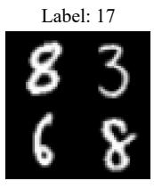

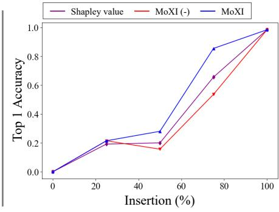  
(a) Example  
(b) Insertion  
Figure 2. (a) Example of a synthetic MNIST image in the visual SET-SUM task, labeled 17 by the sum of all types of numbers in the image. (b) Insertion curves. The curves illustrate the change of accuracy when adding image patches gradually with high contributions identified by different methods at various unmasked image rates, ranging from 0 to 100%. These curves use a masking method that fills in zeros for game-theoretic calculations and model input during classification accuracy measurement. MoXI(- ) only employs self-context Shapley values, whereas MoXI additionally uses interactions across highly contributing patches.

## 4.2. Pixel Deletion

To address Problem 1, we considered the problem of identifying groups of pixels with high confidence scores through pixel insertion. Here, we aim at decreasing the confidence scores via pixel deletion.

Problem 2 With the same conditions as outlined in Problem 1,find a subset $S _ { k } \subset N$ such that

$$
S _ { k } = \mathop { \mathrm { a r g } \operatorname* { m i n } } _ { S \subseteq N , | S | = k } ~ f ( N \setminus S ) ,\tag{8}
$$

for $k = 1 , 2 , \ldots , | N | .$

We again resort to a greedy approach. The key difference is that now we define and utilize a variant of Shapley value

that measures the contribution of a player by its absence.

$$
\phi _ { \mathrm { d } } ( i | N ) \stackrel { \mathrm { d e f } } { = } \sum _ { S \subseteq N , i \in S } P _ { \mathrm { d } } ( S \setminus \{ i \} | N ) [ f ( S ) - f ( S \setminus \{ i \} ) ] ,\tag{9}
$$

where $\begin{array} { r } { P _ { \mathrm { d } } ( A \vert B ) = \frac { ( \vert B \vert - \vert A \vert - 1 ) ! \vert A \vert ! } { \vert B \vert ! } } \end{array}$ This Shapley value quantifies the average impact attributable to the removal of player i. In Problem 1, we addressed the issue by defining self-context Shapley values and interactions, as it involves the case of incrementally adding pixels from the entire image. In contrast, Problem 2 involves the sequential deletion of pixels from an image, necessitating the formulation of full-context Shapley values and interactions as follows:

$$
\begin{array} { r l r } {  { \phi _ { \mathrm { d } } ^ { ( | N | ) } ( a ) \overset { \mathrm { d e f } } { = } P _ { \mathrm { d } } ( S \setminus \{ a \} \mid N ) [ f ( N ) - f ( N \setminus \{ a \} ) ] } } \\ & { } & { = \frac { 1 } { | N | } [ f ( N ) - f ( N \setminus \{ a \} ) ] } \\ & { } & { I _ { \mathrm { d } } ^ { ( | N | - 1 ) } ( a _ { 1 } , a _ { 2 } ) } \\ & { } & { \overset { \mathrm { d e f } } { = } \phi _ { \mathrm { d } } ^ { ( | N | - 1 ) } ( \{ a _ { 1 } , a _ { 2 } \} \mid N \setminus \{ a _ { 1 } , a _ { 2 } \} \cup \{ \{ a _ { 1 } , a _ { 2 } \} \} ) } \\ & { } & { \qquad - \phi _ { \mathrm { d } } ^ { ( | N | - 1 ) } ( a _ { 1 } \mid N \setminus \{ a _ { 2 } \} ) - \phi _ { \mathrm { d } } ^ { ( | N | - 1 ) } ( a _ { 2 } \mid N \setminus \{ a _ { 1 } \} ) } \\ & { } & { = \frac { 1 } { | N | - 1 } [ f ( N ) - f ( N \setminus \{ a _ { 1 } \} ) } \\ & { } & { \qquad - f ( N \setminus \{ a _ { 2 } \} ) + f ( N \setminus \{ a _ { 1 } , a _ { 2 } \} ) ] . } \end{array}
$$

With these quantities, the greedy algorithm for pixel deletion is as follows. For $k \ = \ 1$ , the index $b _ { 1 } ~ \in ~ N$ of the pixel with the highest (deletion-based) Shapley value $\begin{array} { r } { \phi _ { \mathrm { d } } ^ { ( | \bar { N } | ) } ( b _ { 1 } ) = - \frac { 1 } { | N | } \left[ \bar { f } ( N \backslash \{ a \} ) - f ( N ) \right] } \end{array}$ gives the optimal set $S _ { 1 } = \{ b _ { 1 } \}$ by its definition. For $k = 2$ , we select the next pixel $b _ { 2 }$ that minimizes $f ( N \setminus \{ b _ { 1 } , b _ { 2 } \} )$ . This choice is again explained as a sum of Shapley value and interaction,

$$
\begin{array} { r l } & { b _ { 2 } = \underset { b \in N \backslash \{ b _ { 1 } \} } { \arg \operatorname* { m i n } } f ( N \setminus \{ b _ { 1 } , b \} ) - f ( N ) } \\ & { \quad = \underset { b \in N \backslash \{ b _ { 1 } \} } { \arg \operatorname* { m a x } } \phi _ { \mathrm { d } } ^ { ( | N | - 1 ) } ( \{ b _ { 1 } , b \} | N \setminus \{ b _ { 1 } , b \} \cup \{ \{ b _ { 1 } , b \} \} ) } \\ & { \quad = \underset { b \in N \backslash \{ b _ { 1 } \} } { \arg \operatorname* { m a x } } \phi _ { \mathrm { d } } ^ { ( | N | ) } ( b ) + ( | N | - 1 ) I _ { \mathrm { d } } ^ { ( | N | - 1 ) } ( b _ { 1 } , b ) . } \end{array}\tag{12}
$$

For $k \geq 3 ,$ we can similarly show that minimizing $f ( N \backslash$ $S _ { k - 1 } \cup \{ b \} )$ with respect to $b _ { k }$ is equivalent to

$$
\begin{array} { r l } & { b _ { k } = \underset { b \in N \setminus S _ { k - 1 } } { \mathrm { a r g m a x ~ } } [ \phi _ { \mathrm { d } } ^ { ( | N | ) } ( b ) } \\ & { \qquad + \left( | N | - | S _ { k - 1 } | \right) I _ { \mathrm { d } } ^ { ( | N | - | S _ { k - 1 } | ) } ( S _ { k - 1 } , b ) ] . } \end{array}\tag{13}
$$

Again, the greedy algorithm is described from a gametheoretic viewpoint. The only difference from the insertion case is that the interaction term is now weighted. Algorithm 2 summarises the procedure. The computational cost of the pixel deletion approach is the same as the pixel insertion approach, which only requires $\mathcal { O } ( | N | ^ { 2 } )$ times of forward passes in the worst case.

Algorithm 2 Identification of a group of pixels in the pixel   
deletion approach   
Input: reward function $f ,$ index set of all images N.   
Output: Sequence of subsets $S _ { 1 } , \ldots , S _ { | N | } \subset N$   
1: $S _ { k } \gets \{ \}$ for all $k = 0 , \ldots , | N |$   
2: for $k = 1 , \ldots , | N |$ do   
3: $b _ { k } \gets$ argmin ${ \dot { f } } ( N \setminus ( S _ { k - 1 } \cup \{ b \} ) )$   
$b \in N \backslash S _ { k - }$ −1   
4: $S _ { k } \gets S _ { k - 1 } \cup \{ b _ { k } \}$   
5: end for   
6: return $S _ { 1 } , \dots , S _ { | N | }$

## 5. Experiments

In this section, we evaluate the characteristics of identified patches through comparative experiments with existing methods and demonstrate the effectiveness of our method.

Setup. Our experiments utilize the ImageNet dataset [10] and focus on analyzing Vision Transformer [11] pre-trained for the classification task. For baseline methods, we use Grad-CAM [23]2, Grad-CAM++ [5], Attention rollout [1], Shapley values, and MoXI(-), which do not utilize the interactions present in MoXI. For insertion curve experiments, we use the Pixel Insertion approach, while for deletion curves, we utilize the Pixel Deletion approach. Following the previous studies [21, 29], we consider image patches instead of pixels to reduce computational costs. All methods calculate the contributions for 14 × 14 patches with a patch size of $1 6 \times 1 6 .$ , which is equal to the patch size and the number of tokens in standard ViT models. We used a pretrained ViT-T3 [11], DeiT-T4 [26] and ResNet-185 [14]. We selected 1000 images, one corresponding to each label, all of which were successfully classified in the test set. To reduce the computational burden, we computed Shapley values approximately by random sampling of S in Eq. (1) as in other studies [4, 22, 25, 29]. The sampling size is set to

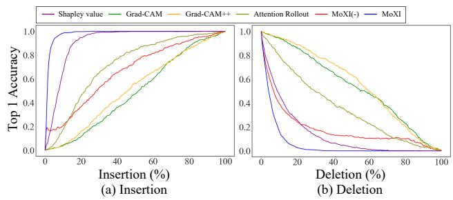  
Figure 3. (a) Insertion curves. (b) Deletion curves. The curves illustrate the change of accuracy when appending (removing) image patches gradually with high contributions identified by different methods at various unmasked (masked) image rates, ranging from 0 to 100%.

200. Moreover, we have adopted feature patch deletion as the masking method for Shapley values and interactions. In the following, we focus on ViT-T. See Appendix B for more results.

## 5.1. Evaluating the importance of identified patches

We evaluate the importance of the image patches as determined by the above methods, using insertion/deletion curve metrics. The insertion curve identifies informationrich patches, while the deletion curve helps identify patches important for the model’s decision-making process. In our insertion/deletion curve experiments, we utilized the masking method for patch deletion. For Grad-CAM, Attention rollout, and Shapley value, image patches are inserted and deleted in the same order.

The insertion curves in Fig. 3(a) show that MoXI exhibits a sharper increase in classification accuracy compared to the other methods. In particular, even with images where only 4% is visible, MoXI achieves an accuracy of 90%, whereas Grad-CAM, Attention rollout, and Shapley value achieve 2%, 4%, and 25%, respectively. This result indicates that MoXI can efficiently identify important patches for classification. Then, both the self-context and original Shapley values, which are based on confidence scores, achieve a sharper increase in classification accuracy. However, these two methods calculate the importance of individual patches and often select patches with similar information. Consequently, MoXI can identify features contributing to a higher classification accuracy than these methods.

The deletion curves in Fig. 3(b) show that MoXI exhibits a sharp decrease in classification accuracy compared to the other methods. When concealing just 10% of an image, MoXI significantly decreases the model’s accuracy to 16%. In contrast, Grad-CAM and Attention rollout only decrease the accuracy to approximately 79% under the same conditions. This result indicates that MoXI, which accounts for interactions between patches, effectively identifies the image patches important for classification. We observed analogous results for DeiT-T [26] and ResNet-18 [14] models, as detailed in Appendix B. Additionally, we discuss the application of masks using our method in Appendix D.

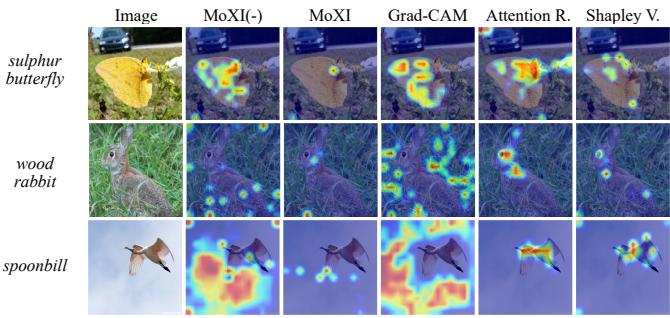  
(a) Insertion

Image  
MoXI(-)  

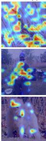

MoXI  
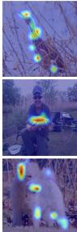

Grad-CAM  
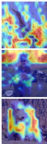

Attention R.  
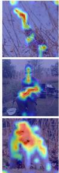  
(b) Deletion

Shapley V.  
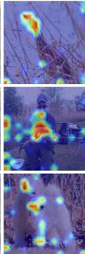  
Figure 4. Visualization of important image patches by each method. The highlighted image patches are selected based on their contributions calculated by each method. (a) Highlighting the patches incrementally added to an entire image until classification success. (b) Highlighting the patches sequentially removed from a full image until classification failure.

## 5.2. Confidence score-based visualization

We introduce two heatmap-based visualization methods tailored for analyzing insertion and deletion patches. The first method visualizes insertion patches, highlighting those important for accurate classification. The second focuses on deletion patches, specifically identifying those whose deletion significantly impacts the classification. The heatmap shows higher values, indicated by shades closer to red, for patches that were inserted or deleted earlier. The insertion or deletion stops when the model reaches a successful classification or misclassification.

Heatmap visualization. Figure 4(a) displays a heatmap for patch insertion. Compared to the existing methods, MoXI’s heatmap highlights fewer regions and identifies the class object. Interestingly, MoXI selects the patches on the background as well as the class object. This visualization explains the object and background is required for classification and demonstrates the usefulness of the interaction.

Figure 4(b) displays a heatmap for patch deletion. The heatmaps generated by MoXI(-) and Grad-CAM display extensive highlights across the image, while MoXI, Attention rollout, and Shapley value show more concentrated highlights on the class object. This finding indicates that these latter methods accurately capture important information from the object. Notably, MoXI places less emphasis on the background than Attention rollout and Shapley value. This result suggests that MoXI effectively narrows down information by selectively deleting the class object, which could be advantageous for precise object localization.

  
(a) original

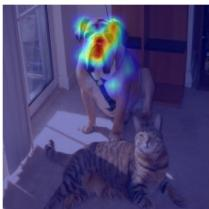  
(b) bull mastiff

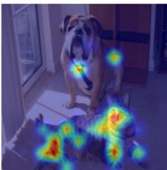  
(c) tiger cat  
Figure 5. Visualization of important region for a targeted class using the proposed method. (a) Original image. (b) Targeting the bull mastiff class, which is predicted by the model. The highlighted patches are those sequentially removed from a full image until predict the bull mastiff class. (c) Targeting tiger cat class. We first removed the patches that has a positive contribution to bull mastiff class and also negative contribution to tiger cat. Once the tiger cat becomes the predicted class of the model, the patches highly contributing to tiger cat is removed sequentially until the prediction change, which are the highlighted patches.

Class-dicriminative localization. To enhance understanding of the model’s prediction process, localization for specific classes improve interpretability. We have extended MoXI to analyze a target class that differs from the model’s prediction. For the detailed visualization, see Appendix F. Figures 5(b) and 5(c) visualizes important regions for two classes: the bull mastiff, as predicted by the model, and the tiger cat, the target class. The heatmaps reveal that MoXI highlights the bull mastiff’s facial area and the tiger cat’s face and body. These observations demonstrate that MoXI can identify important groups of image patches relevant to the predicted class and class-specific features important for decision-making.

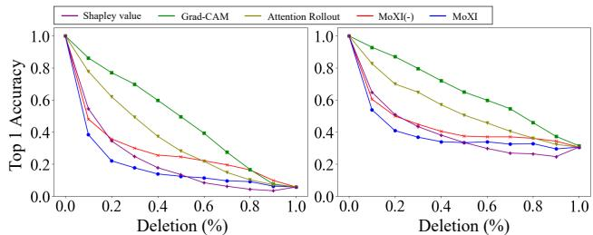  
(a) gaussian noise  
(b) fog  
Figure 6. Deletion curves by image corruptions instead of masking: (a) Gaussian noise and (b) fog. The curves illustrate the change in accuracy along with the increase in the number of corrupted image patches. The patches are corrupted from the highly contributing ones determined by each method.

## 5.3. Common corruption effect on patch deletion

We investigate the risk of model misclassification when image patches important for model accuracy are disrupted by adding noise. In the deletion curve experiment of Sec. 5.1, we used patch masking to simulate feature absence. Instead of patch masking, we consider common corruption [15]: fog and Gaussian noise at level 5 (for the other corruptions such as brightness and motion blur, see Appendix G.1). We apply these corruptions to image patches in the order selected for patch deletion in Sec. 5.1.

Figure 6(a) shows the effect of Gaussian noise on the deletion curve results. MoXI exhibits a significant decrease in accuracy compared to the others, indicating MoXI is vulnerable to Gaussian noise. This result implies that MoXI efficiently identifies important patches. Figure 6(b) shows the fog corruption results, which are similar to those observed for Gaussian noise. Furthermore, as detailed in Appendix G.1, MoXI similarly affects accuracy with the other common corruptions. Additionally, we evaluate the effect of adversarial perturbations. Interestingly, adversarial perturbations yield distinct results due to their deceptive effect on the model’s internal features (see Appendix G.2).

## 5.4. Consistant explainability

We examine the consistent explainability of visualization methods, regardless of the internal feature representation, which is a key aspect of explainable artificial intelligence. Specifically, we examine whether the models, trained with varying numbers of classification classes, consistently select important image patches. We evaluate the consistency using insertion and deletion curves for the models trained with datasets containing 10, 20, 100, and 1000 classes. For training the 10-class model, we select images from ImageNet that share labels with CIFAR10. For the models with 20, 100, and 1000 classes, we extend the 10-class dataset by adding images with randomly selected classes from ImageNet. We draw the insertion and deletion curves using the 10-class test images that are correctly classified.

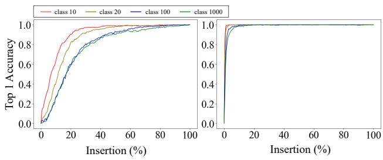  
(a) Attention rollout  
(b) MoXI  
Figure 7. Insertion curves. (a) Attention rollout, (b) MoXI. The curves illustrate the change in accuracy along with the increase in the number of unmasked image patches. Each curve represents the results from the pretrained models with 10, 20, 100, and 1000 classes, respectively. As the number of classes the model learns increases, the accuracy of Attention rollout significantly decreases, whereas MoXI experiences only a minor decrease in accuracy.

Figures 7(a) and 7(b) show the insertion curve results for Attention rollout and MoXI, respectively. Attention rollout decreases accuracy as the number of classes increases. In contrast, MoXI does not decrease in accuracy. Therefore, MoXI consistently selects important image patches for accurate classification. In addition, the results from other methods and deletion experiments are shown in the Appendix H. We confirmed that MoXI provides consistent explainability in the deletion curve experiments.

## 6. Conclusion

This study addressed the problem of identifying a group of pixels that largely and collectively impact confidence scores in image classification models. We justify simple greedy algorithms from a game-theoretic view using Shapley values and interactions. This analysis naturally suggests the use of self-context and full-context variants of Shapley values and interactions. Their computation only requires a quadratic number of forward passes, whereas prior studies compute Shapley values and/or interactions with an exponential number of forward passes or heavy samplingbased approximation. The experimental results show that our method is more accurate in identifying the important image patches for models than popular methods.

## Acknowledgments

This work was supported by JSPS KAKENHI Grant Number JP22H03658 and JP22K17962.

## References

[1] Samira Abnar and Willem Zuidema. Quantifying attention flow in transformers. In Proceedings of the 58th Annual Meeting of the Association for Computational Linguistics, pages 4190–4197, Online, 2020. Association for Computational Linguistics. 1, 2, 6

[2] Marco Ancona, Cengiz Oztireli, and Markus Gross. Explaining deep neural networks with a polynomial time algorithm for shapley value approximation. In Proceedings of the 36th International Conference on Machine Learning, pages 272– 281, Long Beach, California, USA, 2019. PMLR. 3

[3] Alexander Binder, Gregoire Montavon, Sebastian La-´ puschkin, Klaus-Robert Muller, and Wojciech Samek.¨ Layer-Wise Relevance Propagation for Neural Networks with Local Renormalization Layers, pages 63–71. Springer International Publishing, Cham, 2016. 1, 2

[4] Javier Castro, Daniel Gomez, and Juan Tejada. Polynomial´ calculation of the shapley value based on sampling. Computers & Operations Research, 36(5):1726–1730, 2009. Selected papers presented at the Tenth International Symposium on Locational Decisions (ISOLDE X). 6

[5] Aditya Chattopadhay, Anirban Sarkar, Prantik Howlader, and Vineeth N Balasubramanian. Grad-CAM++: Generalized gradient-based visual explanations for deep convolutional networks. In Proceedings of the IEEE Winter Conference on Applications of Computer Vision. IEEE, 2018. 2, 6

[6] Hila Chefer, Shir Gur, and Lior Wolf. Transformer interpretability beyond attention visualization. In Proceedings of the IEEE Conference on Computer Vision and Pattern Recognition, pages 782–791, 2021. 2

[7] Xu Cheng, Chuntung Chu, Yi Zheng, Jie Ren, and Quanshi Zhang. A game-theoretic taxonomy of visual concepts in DNNs. arXiv preprint arXiv:2106.10938, 2021. 3

[8] Ian Connick Covert, Chanwoo Kim, and Su-In Lee. Learning to estimate shapley values with vision transformers. In The Eleventh International Conference on Learning Representations, 2023. 1, 2, 3, 4

[9] Huiqi Deng, Qihan Ren, Hao Zhang, and Quanshi Zhang. Discovering and explaining the representation bottleneck of DNNs. In Proceedings of the International Conference on Learning Representations, 2022. 3

[10] Jia Deng, Wei Dong, Richard Socher, Li-Jia Li, Kai Li, and Li Fei-Fei. ImageNet: A large-scale hierarchical image database. In Proceedings of the IEEE Conference on Computer Vision and Pattern Recognition, pages 248–255, 2009. 6

[11] Alexey Dosovitskiy, Lucas Beyer, Alexander Kolesnikov, Dirk Weissenborn, Xiaohua Zhai, Thomas Unterthiner, Mostafa Dehghani, Matthias Minderer, Georg Heigold, Sylvain Gelly, Jakob Uszkoreit, and Neil Houlsby. An image is worth 16x16 words: Transformers for image recognition at scale. In Proceedings of the International Conference on Learning Representations, 2021. 6, 1

[12] Ian Goodfellow, Jonathon Shlens, and Christian Szegedy. Explaining and harnessing adversarial examples. In Proceed-

ings of the International Conference on Learning Representations, 2015. 4

[13] Michel Grabisch and Marc Roubens. An axiomatic approach to the concept of interaction among players in cooperative games. International Journal of Game Theory, 28:547–565, 1999. 3

[14] Kaiming He, Xiangyu Zhang, Shaoqing Ren, and Jian Sun. Deep residual learning for image recognition. In Proceedings ofthe IEEE Conference on Computer Vision and Pattern Recognition, pages 770–778, 2016. 6, 7, 1

[15] Dan Hendrycks and Thomas Dietterich. Benchmarking neural network robustness to common corruptions and perturbations. In Proceedings of the International Conference on Learning Representations, 2019. 2, 8

[16] Neil Jethani, Mukund Sudarshan, Ian Connick Covert, Su-In Lee, and Rajesh Ranganath. FastSHAP: Real-time Shapley value estimation. In Proceedings of the International Conference on Learning Representations, 2022. 1, 2, 4

[17] Alexey Kurakin, Ian Goodfellow, and Samy Bengio. Adversarial examples in the physical world. Proceedings of the International Conference on Learning Representations Workshop, 2017. 4

[18] Scott M. Lundberg and Su-In Lee. A unified approach to interpreting model predictions. In Proceedings of the 31st International Conference on Neural Information Processing Systems, page 4768–4777, Red Hook, NY, USA, 2017. Curran Associates Inc. 1, 2, 4

[19] Aleksander Madry, Aleksandar Makelov, Ludwig Schmidt, Dimitris Tsipras, and Adrian Vladu. Towards deep learning models resistant to adversarial attacks. In Proceedings of the International Conference on Learning Representations, 2018. 4

[20] Vitali Petsiuk, Abir Das, and Kate Saenko. Rise: Randomized input sampling for explanation of black-box models. In Proceedings ofthe British Machine Vision Conference, 2018. 1, 2

[21] Jie Ren, Die Zhang, Yisen Wang, Lu Chen, Zhanpeng Zhou, Yiting Chen, Xu Cheng, Xin Wang, Meng Zhou, Jie Shi, and Quanshi Zhang. Towards a unified game-theoretic view of adversarial perturbations and robustness. In Proceedings of the Advances in Neural Information Processing Systems, pages 3797–3810, 2021. 3, 6

[22] Jie Ren, Zhanpeng Zhou, Qirui Chen, and Quanshi Zhang. Towards a game-theoretic view of baseline values in the shapley value, 2022. 6

[23] Ramprasaath R. Selvaraju, Michael Cogswell, Abhishek Das, Ramakrishna Vedantam, Devi Parikh, and Dhruv Batra. Grad-CAM: Visual explanations from deep networks via gradient-based localization. In Proceedings ofIEEE/CVF International Conference on Computer Vision, pages 618–626, 2017. 1, 2, 6

[24] Lloyd S. Shapley. A value for n-person games. In Contributions to the Theory of Games, pages 307–317, 1953. 1, 3

[25] Kosuke Sumiyasu, Kazuhiko Kawamoto, and Hiroshi Kera. Game-theoretic understanding of misclassification, 2022. 3, 6

[26] Hugo Touvron, Matthieu Cord, Matthijs Douze, Francisco Massa, Alexandre Sablayrolles, and Herve Jegou. Training data-efficient image transformers & distillation through attention. In Proceedings ofthe 38th International Conference on Machine Learning, pages 10347–10357, 2021. 6, 7, 1

[27] Haofan Wang, Zifan Wang, Mengnan Du, Fan Yang, Zijian Zhang, Sirui Ding, Piotr Mardziel, and Xia Hu. Score-cam: Score-weighted visual explanations for convolutional neural networks, 2020. 2

[28] Xin Wang, Jie Ren, Shuyun Lin, Xiangming Zhu, Yisen Wang, and Quanshi Zhang. A unified approach to interpreting and boosting adversarial transferability. In Proceedings of the International Conference on Learning Representations, 2021. 3

[29] Hao Zhang, Sen Li, YinChao Ma, Mingjie Li, Yichen Xie, and Quanshi Zhang. Interpreting and boosting dropout from a game-theoretic view. In Proceedings of the International Conference on Learning Representations, 2021. 3, 6

[30] Hao Zhang, Yichen Xie, Longjie Zheng, Die Zhang, and Quanshi Zhang. Interpreting multivariate shapley interactions in dnns. In The AAAI Conference on Artificial Intelligence, 2021. 3

[31] Bolei Zhou, Aditya Khosla, Agata Lapedriza, Aude Oliva, and Antonio Torralba. Learning deep features for discriminative localization. In Proceedings of the IEEE Conference on Computer Vision and Pattern Recognition, pages 2921– 2929, 2016. 1, 2