# Image Sculpting: Precise Object Editing with 3D Geometry Control

Jiraphon Yenphraphai1 Xichen Pan1 Sainan Liu2 Daniele Panozzo1 Saining Xie1

1New York University 2Intel Labs

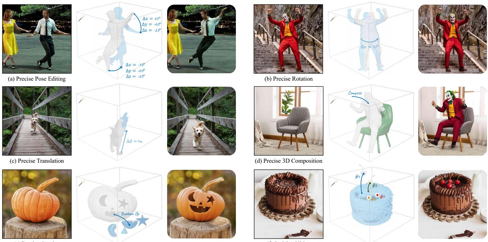  
(e) Precise Carving  
(f) Serial Addition

Figure 1. Achieving precise control in image editing tasks can be challenging with standard 2D generative pipelines. Our Image Sculpting framework offers the ability to interact with 3D geometry starting with a single image. This enables users to perform detailed, quantifiable, and physically-plausible edits, including precise pose editing, rotation, translation, 3D composition, carving, and serial addition.

## Abstract

We present Image Sculpting, a new framework for editing 2D images by incorporating tools from 3D geometry and graphics. This approach differs markedly from existing methods, which are confined to 2D spaces and typically rely on textual instructions, leading to ambiguity and limited control. Image Sculpting converts 2D objects into 3D, enabling direct interaction with their 3D geometry. Postediting, these objects are re-rendered into 2D, merging into the original image to produce high-fidelity results through a coarse-to-fine enhancement process. Theframework supports precise, quantifiable, and physically-plausible editing options such as pose editing, rotation, translation, 3D composition, carving, and serial addition. It marks an initial step towards combining the creative freedom of generative models with the precision ofgraphics pipelines.

## 1. Introduction

Recent developments in the field of image generative modeling [63, 66, 68, 89] have unlocked new potentials in creative content creation, offering unprecedented opportunities for the generation of diverse visual content by materializing ideas and concepts articulated through language prompts. However, the integration of these models into real-world content creation workflows still poses significant challenges. Among the most critical is the need for users to have detailed control over various aspects of generated objects, including their pose, shape, location, layout, and spatial compositions. The precision extends to quantifiable manipulations, such as rotating an object by a specific angle or making physically-realistic modifications, such as positioning a character in a way that conforms to basic anatomical and physical principles. Interestingly, such a quest for precision and controllability aligns closely with the core principles of computer graphics, which strive to generate photorealistic images with artistic control.

In virtual effects (VFX) and rendering pipelines, experts meticulously craft and edit every detail within a fully controllable 3D environment, striving for utmost realism. For decades, methods for accurately manipulating and rendering objects have been explored, leading to the development of numerous advanced techniques in 3D model acquisition, rigging, posing, lighting, texturing, and scene rendering. These methods form the bedrock of the modern computer graphics pipeline. However, it often requires custom hardware and software for (1) acquiring production-quality 3D models or designing them from scratch, (2) making these models possible to animate (rigging), (3) creating visually plausible animations (animation), (4) rendering back in the 2D world after applying material and setting up the lighting, and (5) compositing the resulting image with a background or other objects. This process often employs teams of artists and engineers for each one of these steps, as it requires substantial manual input using specialized tools (e.g. After Effects [2], Substance [4], and 3ds Max [29]).

In contrast, AI-based image generation avoids all this manual work, requiring only a text prompt. Leveraging the power of human language and large datasets of curated content, transforming a text description into a visually striking image is more accessible than ever. Yet, when it comes to precise object manipulation, the current 2D-based generative approach faces inherent limitations due to the lack of a third dimension, leading to incomplete information, limited user interaction on a flat plane, and possible ambiguities. The gap in controllability with respect to image generation using computer graphics techniques is striking, and closing it is a major goal of our work.

Most interfaces for image editing frameworks rely on text-based instructions. For example, techniques such as Prompt-to-Prompt [26], Plug-and-Play [79], Instruct-Pix2Pix [10], Imagic [36] and Object 3DIT [50] offer adaptable language control. However, achieving precise manipulation through these models remains a challenge. Straightforward manipulations such as “changing a style to mimic Van Gogh” are manageable. However, more specific instructions such as “lift the object by 5 cm and rotate it by 42 degrees.” are less likely to be successful, as current generative models cannot fulfill such detailed requests through textual prompts alone. 2D-based interactive methods such as DragGAN [57], FreeDrag [42], and DragDiffusion [73] demonstrate the ability to alter part of an object through transitions in the latent space. Despite this, they have their limitations: 1) they can accomplish basic deformations, but the outcomes are not entirely predictable, often leading to results that do not align with the user’s intentions; 2) these latent transformations operate within the 2D feature space, which inherently limits their ability to represent 3D transformations and handle occlusions accurately; 3) they lack physics-awareness, which complicates incorporating external constraints, such as skeletal structures.

Our work draws inspiration from the computer graphics pipeline and ventures into a novel approach for 2D image-based object manipulation tasks. Our proposed Image Sculpting framework, which metaphorically suggests the flexible and precise sculpting of a 2D image in a 3D space, integrates three key components: (1) single-view 3D reconstruction, (2) manipulation of objects in 3D, and (3) a coarse-to-fine generative enhancement process. More specifically, 2D objects are converted into 3D models, granting users the ability to interact with and manipulate the 3D geometry directly, which allows for precision in editing. The manipulated objects are then seamlessly reincorporated into their original 2D contexts, maintaining visual coherence and fidelity. A critical hurdle in this process is the single-view 3D reconstruction method, a task that, despite rapid progress [27, 41, 43–46, 62, 71], often results in relatively low-fidelity, coarse geometric and texture representations. Unlike manually crafted 3D assets used for graphics, their rendered version is far from photo-realistic. Nonetheless, the extracted geometries are sufficient for interactive and precise control. To achieve high-quality final images, a separate enhancement procedure is necessary. In summary, our Image Sculpting pipeline has three key phases:

Phase 1. For the 3D reconstruction phase, we employ a zero-shot single image reconstruction model (Zero-1-to-3 [44]), which has been trained on extensive datasets [17] of 3D objects.

Phase 2. The deformation process utilizes established geometric processing tools, such as As-Rigid-As-Possible (ARAP) [78] and linear-based skinning [48], enabling interactive and precise manipulation of the 3D models.

Phase 3. For the generative enhancement process, we develop a coarse-to-fine enhancement pipeline, using an feature injection approach [79]. Our method strikes a balance between maintaining the original texture of the object and the modified geometry, utilizing a pre-trained text-toimage diffusion model with additional controls.

Our Image Sculpting framework showcases an array of precise and quantifiable image editing capabilities. These include precise pose editing, rotation, translation, multiobject 3D composition, carving, and serial addition. This suite of functionalities demonstrates the versatility of our approach and its superiority in precision and control compared to existing image editing methods. Our method also outperforms various baselines in image quality, as confirmed by both qualitative and quantitative evaluations on the new SculptingBench benchmark. We believe that our method can foster new opportunities in merging the flexibility of generative models with the precise controllability inherent in traditional graphics pipelines.

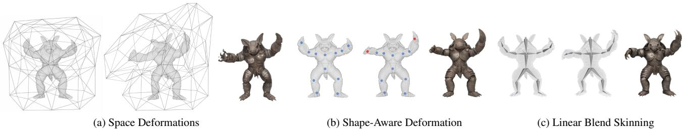  
Figure 2. Illustration of three mesh deformation methods applied to a 3D model. In cage-based space deformation (a), the model is placed in a cage and deformed when the user moves the cage vertices [33]. As-Rigid-As-Possible (ARAP) [78] deformation (b) deforms the model when user-selected blue handle points are moved towards designated red target points. Linear blend skinning (c) maps the deformation of a skeleton to the model [32]. Following deformation, a diffusion rendering process can be added for controllable generation. Each mesh deformation technique offers a different balance of control, speed, and precision. Our framework can use any of these techniques.

## 2. Related Work

Generative Image Editing In computer graphics, extensive research on interactive raster image editing exists, and we defer its detailed review to the next section. In computer vision, the advent of image generative models such as GANs [22, 34, 35] has expanded the scope of image editing to include style transfer [21], image-to-image translation [30, 91], latent manipulation [70, 84], and text-based manipulation [1, 58, 85]. Recently, capabilities in image editing have advanced significantly with the rise of diffusion models [18, 59, 66]. The leading systems [51, 56, 63, 68] allow users to generate image variations or use inpainting masks [54] to generate specific parts of scenes based on a text prompt. Other work explores enhancing pretrained diffusion models with text-guided editing capabilities [10, 26, 52, 79]. Yet, text-based editing has limitations in precisely controlling object shapes and positions. ControlNet [90] incorporates additional conditional inputs such as depth [64], poses [11], and edges [86] for controllable generation. For more intuitive interactions, Drag-GAN [57] enables users to drag control points on objects with GANs, and similar techniques have been adapted for diffusion models [42, 73]. However, these methods are mostly confined to 2D and face challenges in tasks requiring more complex, out-of-plane transformations. 3D-aware generative models such as EG3D [13] and StyleNeRF [23] have explored this direction. OBJect-3DIT [50], a baseline in our paper, studied 3D-aware editing using language instructions. However, its effectiveness is somewhat constrained due to its training on a synthetic dataset.

Single-View Reconstruction Single-view 3D reconstruction is a long-standing problem in computer vision [25]. While algorithmic advancements are important, the significance of training data has been increasingly recognized. Earlier efforts were geared towards training models [55, 76, 83, 88] using smaller, simplistic 3D datasets [14, 65]. Recent approaches [61, 80] have started to utilize density distillation from pre-trained 2D diffusion models trained on large-scale text-image datasets, lessening the reliance on 3D data. Nonetheless, for improved view-consistency, the demand for high-quality 3D data is indispensable. The emergence of large-scale 3D datasets, such as Objaverse [16, 17], has spurred methods such as Zero-1-to-3 [44] to combine 2D score distillation with 3D data training. This has led to a surge in new models in this domain, noticeably enhancing reconstruction quality [43, 62, 72, 82]. Our work is also closely related to 3-Sweep [15] and 3D Object Manipulation [37]. These pioneering studies in graphics involve constructing a 3D model using edge information or retrieving an online repository for image editing. We now employ generative models to further enhance shape editing capabilities and user experience.

## 3. Overview of 3D Shape Deformation

The deformation of 3D shapes has been extensively studied in the last four decades, with both traditional and datadriven methods being proposed and successfully used in robotics, graphics, and engineering. We review the main approaches and their usability within our framework.

Space Deformations The older and still widely used approach is applying a volumetric warp function f : R3 R3 to all points of a 3D domain [69]. This approach can be applied to explicit (triangular or polygonal meshes) or implicit representations. The map can be parametrized using splines on lattices [69], vertices on a cage [33], or neural fields [19]. A limitation of these approaches is that they are unaware of the object shape, making them more challenging to use on complex articulated objects [9].

Shape-Aware Deformation Shape-aware deformations provide a set of controls linked to the objects’ surface. In Computer-Aided-Design (CAD), a small set of control points define a smooth surface using spline patches [20]. Despite its flexibility and quality, extracting spline patches from 3D models or NeRFs is a challenging and open problem [7]. Partial differential equation (PDE)-based methods simulate the deformation of an object, representing it as a volumetric deformable solid [75] or as a thin rubber shell [78]. The forces guiding the deformation are applied by moving handles selected on a surface [8], making them intuitive to use and requiring minimal user interaction.

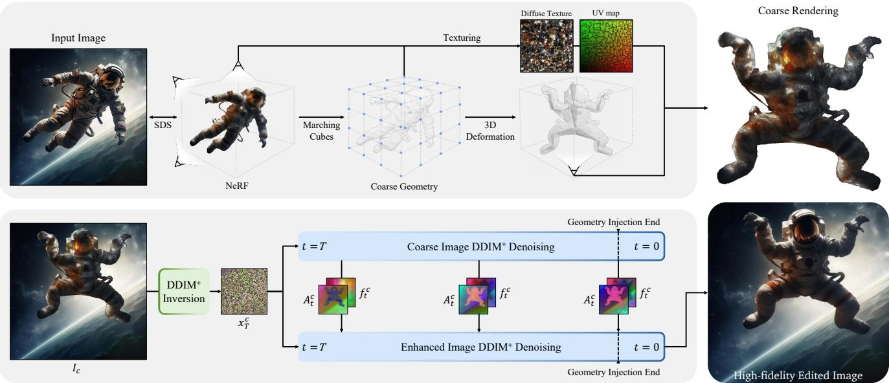  
Figure 3. Overview of our Image Sculpting pipeline, DDIM+ represents DDIM with the DreamBooth fine-tuned and depth controlled model. The process begins by converting the input image into a textured 3D model through a de-rendering process. This model is then prepared for interactive deformation by creating a skeleton and calculating skinning weights. The user can modify the skeleton to deform the model, resulting in an initial coarse image. To refine this edited image, we invert the coarse rendering $I _ { c }$ into the noise ${ \pmb x } _ { T } ^ { c }$ . We then inject self-attention maps ${ \bf A } _ { t } ^ { c }$ and feature maps $\pmb { f } _ { t } ^ { c }$ from the initial image’s denoising process into the enhanced image denoising steps. This technique helps in preserving the geometry of the modified object while restoring the visual quality of the edited image.

Linear Blend Skinning The most popular deformation approach is linear blend skinning [32], which defines a space deformation function as a blended average of a set of affine transformations weighted by shape-aware scalar functions, often computed with methods based on solutions of PDEs on surfaces [31] or manually edited. This approach offers complete control and flexibility, as the affine transformation can be attached to points, vertexes of a cage, or segments in a skeleton [6].

Our approach We can use any of these algorithms to precisely control the shape deformation and, thus, the rendered image. We show an example of one representative method for each class in Fig. 2, and we leave as future work additional automation of this step.

## 4. Methods

Given a single 2D image, our objective is to enable precise manipulation of the objects and their orientations in 3D space, before converting this back into a high-quality edited 2D image. To achieve this, we have developed a novel editing pipeline tailored for image sculpting (see Fig. 3) composed of three steps: (1) We initially convert the input image into a 3D model, (2) the 3D model is edited by deforming it in 3D space, and (3) we use a coarse-to-fine generative enhancement pipeline to turn the coarse rendering of the 3D model into a high-fidelity image.

## 4.1. De-Rendering and Deformation

Given an image of an object, our goal is to perform 3D reconstruction to obtain its 3D model.

Image to NeRF With advancements in text-to-image foundation models [66] and the viewpoint-conditioned image translation model [44], our initial step involves segmenting the selected object from the input image using SAM [38]. Building upon this, we then train a NeRF using Score Distillation Sampling (SDS) [61].

NeRF to 3D Model We use the implementation in threestudio [24] to convert a NeRF volume into a mesh. This algorithm transforms the volume density into a signed distance function, extracts an isosurface [47], and parameterizes it [87] for texture mapping [74]. The texture is extracted by differentiable rendering [39].

3D Model Deformation After obtaining the 3D model, a user can manually construct a skeleton and interactively manipulate it by rotating the bones to achieve the target pose. The mesh deformation affects the vertex positions of the object but not the UV coordinates used for texture mapping; this procedure thus deforms the texture mapped on the object following its deformation.

However, the resulting image quality depends on the 3D reconstruction’s accuracy, which, in our case, is coarse and insufficient for the intended visual outcome (Fig. 3). Therefore, we rely on an image enhancement pipeline to convert the coarse rendering into a high-quality output.

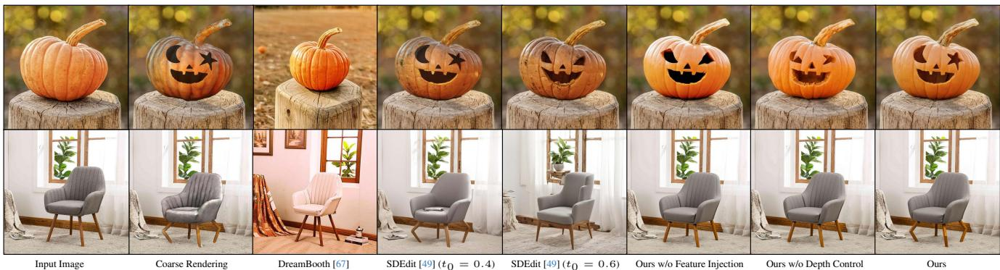  
Figure 4. Comparison of our final method with various baseline methods and ablations. Our approach effectively maintains the geometric information while ensuring the texture quality. In contrast, other methods typically preserve either the texture or the geometry, but not both.

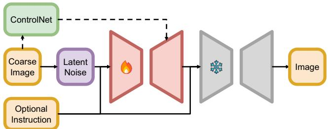  
Figure 5. Overview of the coarse-to-fine generative enhancement model architecture. The red module denotes the one-shot Dream-Booth [67], which requires tuning; the grey module is the SDXL Refiner [5], which is frozen in our experiments.

## 4.2. Coarse-to-Fine Generative Enhancement

This section focuses on blending a coarsely rendered image back to its original background. The aim is to restore textural details while keeping the edited geometry intact. Image restoration and enhancement are commonly approached as image-to-image translation tasks [81], leveraging the strong correlation between the source and target images. Our challenge, however, presents a unique scenario: despite overall similarities in appearance and texture between the input and desired output, the input object’s geometry changes, sometimes significantly, after user editing.

In exploring possible solutions, one approach is to use subject-driven personalization techniques like Dream-Booth [67]. They aim to preserve key details from the input, but might compromise the edited geometry. Alternatively, image-to-image translation methods like SDEdit [49] can be used to preserve the edited geometry, but this might disturb the textural consistency with the original image. This dichotomy was clear in our preliminary study, as shown in Fig. 4. SDEdit can maintain the geometry, but it was unable to accurately replicate the textures. On the other hand, DreamBooth produced high-fidelity outputs, but struggled to preserve both the texture and geometry effectively.

To address the balance between preserving texture and geometry, our approach begins by “personalizing” a pretrained text-to-image diffusion model. To capture the object’s key features, we fine-tune the diffusion model with

DreamBooth on one input reference image. To maintain the geometry, we adapt a feature and attention injection technique [79], originally designed for semantic layout control. Furthermore, we incorporate depth data from the 3D model through ControlNet [90]. We find this integration crucial in minimizing uncertainties during the enhancement process.

One-shot Dreambooth DreamBooth [67] fine-tunes a pre-trained diffusion model with a few images for subjectdriven generation. The original DreamBooth paper [67] has shown its ability to leverage the semantic class priors to generate novel views of an object, given only a few frontal images of the subject. This aspect is particularly useful in our setting, since the coarse rendering we work with lacks explicit viewpoint information. In our application, we train DreamBooth using just a single example, which is the input image. Notably, this one-shot approach with DreamBooth also effectively captures the detailed texture, thereby filling in the textural gaps present in the coarse rendering.

Depth Control We use depth ControlNet [90] to preserve the geometric information of user editing. The depth map is rendered directly from the deformed 3D model, bypassing the need for any monocular depth estimation. For the background region, we don’t use the depth map. This depth map serves as a spatial control signal, guiding the geometry generation in the final edited images. However, relying solely on depth control is not sufficient – although it can preserve the geometry to some extent, it still struggles in local, more nuanced editing, such as capturing the specific shapes of a pumpkin’s eyes or the bent legs of a chair (Fig. 4).

Feature Injection To better preserve the geometry, we use feature injection. As demonstrated in Fig. 3, this step begins with DDIM inversion [77] (with the DreamBooth finetuned, depth controlled diffusion model) of the coarse rendering image to obtain the inverted latents. At each denoising step, we denoise the inverted latent of the coarse rendering along with the latent of the refined image, extracting their respective feature maps (from the residual blocks) and self-attention maps (from the transformer blocks). It has been shown in [79] that the feature maps carry semantic information, while the self-attention maps contain the geometry and layout of the generated images. By overriding the feature and self-attention maps during the enhanced image denoising steps with those from the coarser version, we ensure the geometry of the enhanced image can reflect those of the coarse rendering. The pseudo code for our generative enhancement is detailed in Appendix A. Note that our method differs from the original Plug-and-Play use cases: we use feature injection to preserve the geometry during the coarse-to-fine process rather than translating the image according to a new text prompt. We present the injection layer selection and the replacement schedule in Section 5.

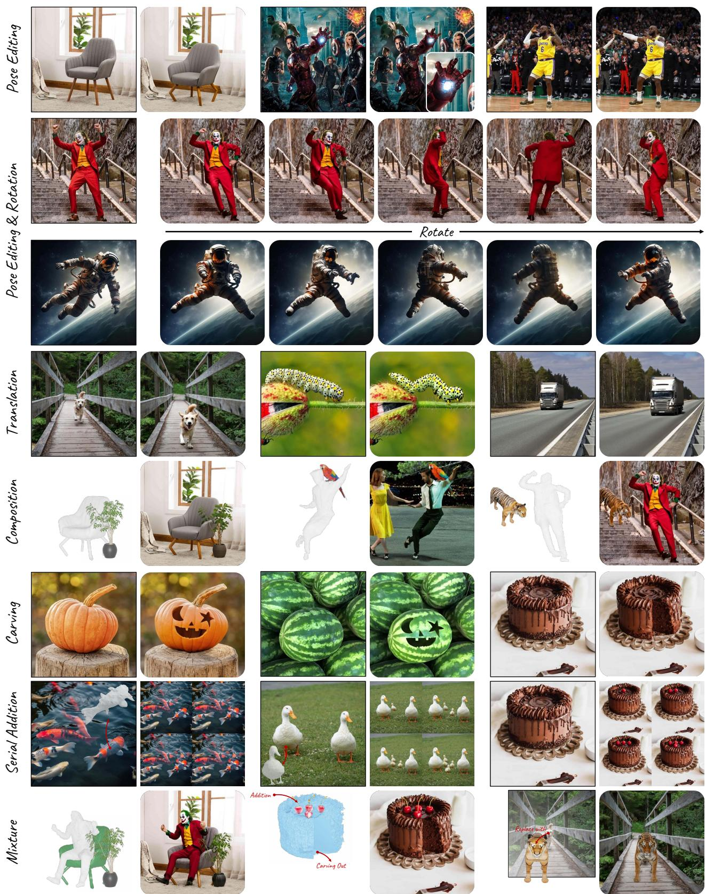  
Figure 6. A compilation of qualitative results from six image editing tasks. Additionally, we include additional examples (termed as ‘Mixture’ in the final row) to illustrate the versatile combination of these capabilities.

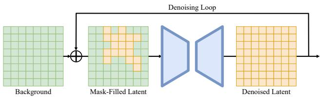

Figure 7. Our blend-in process. At every denoising step, we mask the background areas and blend them with the unmasked regions from the denoised latent. This process helps maintain visual coherence and preserve the background.  
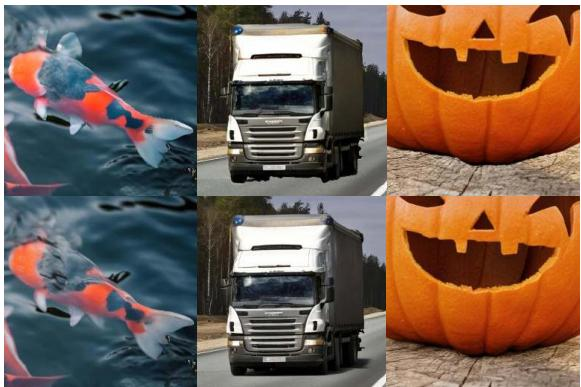  
Figure 8. Our blend-in process yields visually harmonious results. Top: Results from direct copy-pasting. Bottom: Our results.

Background Blend-In To maintain the consistency of the background between the input and edited images, we first inpaint the area initially occupied by the object in the input image, thus obtaining an unobstructed background. However, another challenge arises in merging the edited object into this background smoothly. Merely copy-pasting it onto the background leads to an unrealistic visual effect, such as the improper water reflections over the fish and the absence of shadow casting from the truck (Fig. 8). To overcome this, as demonstrated in Fig. 7, our approach involves masking the background areas during the denoising steps to preserve their original background. This means we retain the unedited background by blending the unmasked (edited) regions from the denoising step with the masked (original) background. We use SDXL [60] as our pre-trained textto-image model, which includes a refiner module by default. We keep this module in our pipeline, as empirically it slightly enhances the results by reducing artifacts.

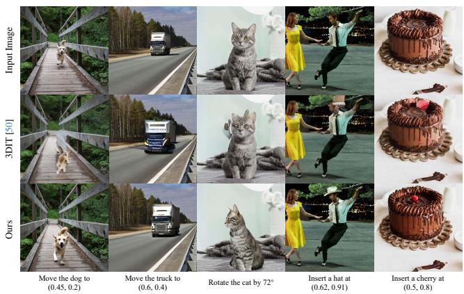

Figure 9. Comparisons with OBJect-3DIT [50] on object translation, rotation, and composition tasks.  
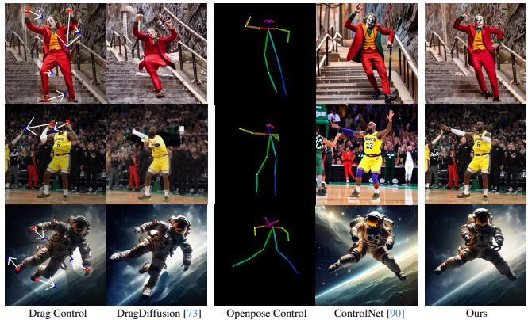

Figure 10. Comparisons with DragDiffusion [73] and Control-Net [90] on pose editing. These techniques face difficulties in handling complex pose modifications.  
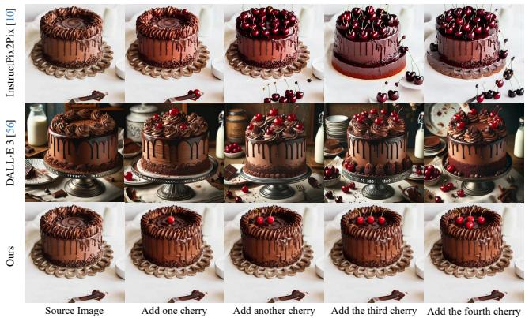  
Figure 11. Comparisons with InstructPix2Pix [10] and DALL·E 3 [56] on serial addition. These text-based editing methods fail to follow precise and quantifiable instructions.

## 5. Experiments

Experimental Setup We follow [24] to obtain the initial NeRF representation and to extract the textured 3D model. We use Instant-NGP [53] and a grid size of 256 for the 3D model extraction from NeRF. During the coarse-to-fine generative enhancement process, for one-shot DreamBooth, we fine-tune the SDXL-1.0 [60] model using LoRA [28] for 800 steps with a learning rate of 1e-5. For feature injection stage, we utilize all the self-attention layers of the SDXL decoder and the first block of the SDXL’s upsampling decoder. The SDXL refiner is applied after $t = 0 . 1 T$ . For background inpainting, we use Adobe generative fill [3].

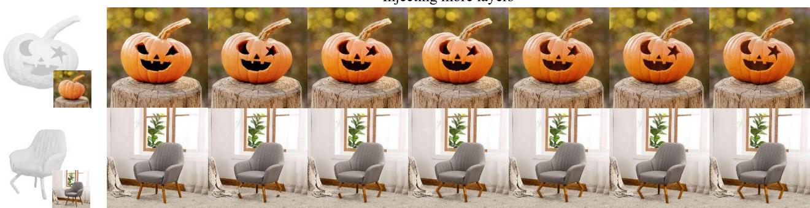  
Figure 12. Ablation studies on feature injection layers. From left to right, progressively injecting more self-attention layers can result in increasingly improved alignment with user edits.

<table><tr><td>Methods</td><td>DINO↑</td><td>D-RMSE↓</td></tr><tr><td>Original Coarse Rendering</td><td>0.758</td><td>0.00</td></tr><tr><td>SDEdit [49]  $( t _ { 0 } = 0 . 4 )$ </td><td>0.788</td><td>1.71</td></tr><tr><td>SDEdit [49]  $( t _ { 0 } = 0 . 6 )$ </td><td>0.800</td><td>2.12</td></tr><tr><td>Ours w/o Feature Injection</td><td>0.848</td><td>2.33</td></tr><tr><td>Ours w/o Depth Control</td><td>0.851</td><td>2.15</td></tr><tr><td>Ours</td><td>0.853</td><td>1.99</td></tr></table>

Table 1. Ablation studies of the enhancement methods on SculptingBench. DINO score measures the textural details, and D-RMSE measures the geometric fidelity. Depth control and feature injection enhance texture quality while maintaining geometric fidelity.

Qualitative Results We showcase qualitative results in Fig. 6, covering six precise image editing tasks. Detailed descriptions of these tasks are presented in Appendix B. Qualitatively, our method combines the creative freedom of generative models with the precision of graphics pipelines to achieve precise, quantifiable, and physically plausible outcomes for object editing across a variety of scenarios.

Our approach introduces new editing features through precise 3D geometry control, a capability not present in existing methods. We compare our method with the state-ofthe-art object editing techniques for a comprehensive analysis. In Fig. 9, we show that 3DIT [50], designed for 3Daware editing via language instructions, faces limitations when applied to real, complex images, largely because its training is based on a synthetic dataset. In Fig. 10, we compare the pose editing ability with DragDiffusion [73] and ControlNet [90]. This comparison reveals that these methods encounter difficulties with complex pose manipulations because they are constrained to the 2D domain. Furthermore, in Fig. 11, we show how text-based editing methods like InstructPix2Pix [10] and DALL·E 3 [56] struggle with precise and quantifiable instructions.

Ablation Studies We create a new dataset SculptingBench to evaluate our new image editing capabilities. This dataset contains 28 images covering six categories: pose editing, rotation, translation, composition, carving, and serial addition (see Appendix C). We perform quantitative studies using different coarse-to-fine enhancement methods. To measure the visual similarity between the edited images and the original ones, particularly in terms of maintaining textural details through the editing process, we employ DINO score [67] as our metrics. This choice is motivated by the self-supervised training objective of DINO [12], which encourages distinction of unique features of a image. To evaluate the geometric fidelity of user edits after enhancement, we introduce a novel metric, D-RMSE. This metric is specifically created to evaluate how well geometric information is retained after the enhancement procedure. D-RMSE measures the discrepancies between the depth maps of the coarse renderings and their enhanced counterparts:

$$
\mathrm { D - R M S E } = \sqrt { \mathbb { E } \left[ ( \mathrm { d e p t h } _ { \mathrm { c o a r s e } } - \mathrm { d e p t h } _ { \mathrm { e n h a n c e d } } ) ^ { 2 } \right] }
$$

where $\mathrm { d e p t h } _ { \mathrm { c o a r s e } } , \mathrm { d e p t h } _ { \mathrm { e n h a n c e d } }$ denote the depth maps Mi-DaS [64] estimates, for the coarse rendering and the enhanced output image, respectively. In Table 1, we show that without any enhancement, the textural quality metrics (DINO score) are quite low. SDEdit effectively preserves the edited geometry with a low D-RMSE, yet the visual quality significantly deteriorates compared to the original image (see Fig. 4). Our method offers a more advantageous balance, significantly enhancing texture quality as demonstrated by higher DINO score, while preserving geometric consistency, evidenced by a low D-RMSE score. We observe that both feature injection and depth control contribute to enhanced geometric consistency and can lead to further improvement when used together. Additionally, we conduct an empirical study to explore the number of self-attention layers for injection. Fig. 12 shows that more layers improve alignment with user edits. We use all layers for injection.

## References

[1] Rameen Abdal, Peihao Zhu, John Femiani, Niloy Mitra, and Peter Wonka. CLIP2StyleGAN: Unsupervised extraction of StyleGAN edit directions. In SIGGRAPH, 2022. 3

[2] Adobe. Adobe After Effects. https://www.adobe. com/products/aftereffects.html, 2023. 2

[3] Adobe. Adobe Firefly. https://www.adobe.com/ sensei/generative-ai/firefly.html, 2023. 8

[4] Adobe. Adobe Substance 3D. https://www.adobe. com/creativecloud/3d-ar.html, 2023. 2

[5] Stability AI. Stable Diffusion XL Refiner 1.0. https: / / huggingface . co / stabilityai / stable - diffusion-xl-refiner-1.0, 2023. 5

[6] Ilya Baran and Jovan Popovic. Automatic rigging and ani- ´ mation of 3D characters. TOG, 2007. 4, 12

[7] D. Bommes, B. Levy, N. Pietroni, E. Puppo, C. Silva, M. ´ Tarini, and D. Zorin. State of the art in quad meshing. In STARs, 2012. 3

[8] Mario Botsch and Olga Sorkine. On linear variational surface deformation methods. TVCG, 2008. 3

[9] Mario Botsch, Leif Kobbelt, Mark Pauly, Pierre Alliez, and Bruno Levy.´ Polygon Mesh Processing. AK Peters, 2010. 3

[10] Tim Brooks, Aleksander Holynski, and Alexei A Efros. InstructPix2Pix: Learning to follow image editing instructions. In CVPR, 2023. 2, 3, 7, 8

[11] Z. Cao, G. Hidalgo Martinez, T. Simon, S. Wei, and Y. A. Sheikh. Openpose: Realtime multi-person 2d pose estimation using part affinity fields. 2019. 3

[12] Mathilde Caron, Hugo Touvron, Ishan Misra, Herve J ´ egou, ´ Julien Mairal, Piotr Bojanowski, and Armand Joulin. Emerging properties in self-supervised vision transformers. In ICCV, 2021. 8

[13] Eric R. Chan, Connor Z. Lin, Matthew A. Chan, Koki Nagano, Boxiao Pan, Shalini De Mello, Orazio Gallo, Leonidas Guibas, Jonathan Tremblay, Sameh Khamis, Tero Karras, and Gordon Wetzstein. Efficient geometry-aware 3D generative adversarial networks. In CVPR, 2022. 3

[14] Angel X Chang, Thomas Funkhouser, Leonidas Guibas, Pat Hanrahan, Qixing Huang, Zimo Li, Silvio Savarese, Manolis Savva, Shuran Song, Hao Su, et al. ShapeNet: An information-rich 3D model repository. arXiv:1512.03012, 2015. 3

[15] Tao Chen, Zhe Zhu, Ariel Shamir, Shi-Min Hu, and Daniel Cohen-Or. 3-sweep: Extracting editable objects from a single photo. ACM Transactions on graphics (TOG), 32(6):1– 10, 2013. 3

[16] Matt Deitke, Ruoshi Liu, Matthew Wallingford, Huong Ngo, Oscar Michel, Aditya Kusupati, Alan Fan, Christian Laforte, Vikram Voleti, Samir Yitzhak Gadre, et al. Objaverse-XL: A universe of 10M+ 3D objects. In NeurIPS, 2023. 3

[17] Matt Deitke, Dustin Schwenk, Jordi Salvador, Luca Weihs, Oscar Michel, Eli VanderBilt, Ludwig Schmidt, Kiana Ehsani, Aniruddha Kembhavi, and Ali Farhadi. Objaverse: A universe of annotated 3D objects. In CVPR, 2023. 2, 3

[18] Prafulla Dhariwal and Alexander Nichol. Diffusion models beat gans on image synthesis. In NeurIPS, 2021. 3

[19] Ana Dodik, Oded Stein, Vincent Sitzmann, and Justin Solomon. Variational barycentric coordinates. TOG, 2023. 3

[20] Gerald Farin. Curves and Surfaces for CAGD: A Practical Guide. Morgan Kaufmann Publishers Inc., 5th edition, 2001. 3

[21] Leon A Gatys, Alexander S Ecker, and Matthias Bethge. A neural algorithm of artistic style. arXiv preprint arXiv:1508.06576, 2015. 3

[22] Ian Goodfellow, Jean Pouget-Abadie, Mehdi Mirza, Bing Xu, David Warde-Farley, Sherjil Ozair, Aaron Courville, and Yoshua Bengio. Generative adversarial networks. In NeurIPS, 2014. 3

[23] Jiatao Gu, Lingjie Liu, Peng Wang, and Christian Theobalt. StyleNeRF: A style-based 3D-aware generator for highresolution image synthesis. In ICLR, 2022. 3

[24] Yuan-Chen Guo, Ying-Tian Liu, Ruizhi Shao, Christian Laforte, Vikram Voleti, Guan Luo, Chia-Hao Chen, Zi-Xin Zou, Chen Wang, Yan-Pei Cao, and Song-Hai Zhang. threestudio: A unified framework for 3D content generation. https://github.com/threestudio-project/ threestudio, 2023. 4, 7

[25] Richard Hartley and Andrew Zisserman. Multiple view geometry in computer vision. Cambridge university press, 2003. 3

[26] Amir Hertz, Ron Mokady, Jay Tenenbaum, Kfir Aberman, Yael Pritch, and Daniel Cohen-Or. Prompt-to-prompt image editing with cross attention control. In ICLR, 2023. 2, 3

[27] Yicong Hong, Kai Zhang, Jiuxiang Gu, Sai Bi, Yang Zhou, Difan Liu, Feng Liu, Kalyan Sunkavalli, Trung Bui, and Hao Tan. LRM: Large reconstruction model for single image to 3D. arXiv:2311.04400, 2023. 2

[28] Edward J Hu, Yelong Shen, Phillip Wallis, Zeyuan Allen-Zhu, Yuanzhi Li, Shean Wang, Lu Wang, and Weizhu Chen. LoRA: Low-rank adaptation of large language models. In ICLR, 2021. 8

[29] Autodesk Inc. AutoDesk 3ds Max 2023. https://www. autodesk.com/products/3ds- max/overview, 2023. 2

[30] Phillip Isola, Jun-Yan Zhu, Tinghui Zhou, and Alexei A Efros. Image-to-image translation with conditional adversarial networks. In CVPR, 2017. 3

[31] Alec Jacobson, Ilya Baran, Jovan Popovic, and Olga Sorkine.´ Bounded biharmonic weights for real-time deformation. TOG, 2011. 4

[32] Alec Jacobson, Zhigang Deng, Ladislav Kavan, and JP Lewis. Skinning: Real-time shape deformation. TOG, 2014. 3, 4

[33] Tao Ju, Scott Schaefer, and Joe Warren. Mean value coordinates for closed triangular meshes. TOG, 2005. 3

[34] Tero Karras, Samuli Laine, and Timo Aila. A style-based generator architecture for generative adversarial networks. In CVPR, 2019. 3

[35] Tero Karras, Samuli Laine, Miika Aittala, Janne Hellsten, Jaakko Lehtinen, and Timo Aila. Analyzing and improving the image quality of stylegan. In CVPR, 2020. 3

[36] Bahjat Kawar, Shiran Zada, Oran Lang, Omer Tov, Huiwen Chang, Tali Dekel, Inbar Mosseri, and Michal Irani. Imagic: Text-based real image editing with diffusion models. In CVPR, 2023. 2

[37] Natasha Kholgade, Tomas Simon, Alexei Efros, and Yaser Sheikh. 3d object manipulation in a single photograph using stock 3d models. ACM Transactions on graphics (TOG), 33 (4):1–12, 2014. 3

[38] Alexander Kirillov, Eric Mintun, Nikhila Ravi, Hanzi Mao, Chloe Rolland, Laura Gustafson, Tete Xiao, Spencer Whitehead, Alexander C Berg, Wan-Yen Lo, et al. Segment anything. arXiv:2304.02643, 2023. 4

[39] Samuli Laine, Janne Hellsten, Tero Karras, Yeongho Seol, Jaakko Lehtinen, and Timo Aila. Modular primitives for high-performance differentiable rendering. TOG, 2020. 4

[40] Peizhuo Li, Kfir Aberman, Rana Hanocka, Libin Liu, Olga Sorkine-Hornung, and Baoquan Chen. Learning skeletal articulations with neural blend shapes. TOG, 2021. 13

[41] Yukang Lin, Haonan Han, Chaoqun Gong, Zunnan Xu, Yachao Zhang, and Xiu Li. Consistent123: One image to highly consistent 3D asset using case-aware diffusion priors. arXiv:2309.17261, 2023. 2

[42] Pengyang Ling, Lin Chen, Pan Zhang, Huaian Chen, and Yi Jin. FreeDrag: Point tracking is not you need for interactive point-based image editing. arXiv:2307.04684, 2023. 2, 3

[43] Minghua Liu, Chao Xu, Haian Jin, Linghao Chen, Zexiang Xu, Hao Su, et al. One-2-3-45: Any single image to 3D mesh in 45 seconds without per-shape optimization. arXiv:2306.16928, 2023. 2, 3

[44] Ruoshi Liu, Rundi Wu, Basile Van Hoorick, Pavel Tokmakov, Sergey Zakharov, and Carl Vondrick. Zero-1-to-3: Zero-shot one image to 3D object. In ICCV, 2023. 2, 3, 4

[45] Yuan Liu, Cheng Lin, Zijiao Zeng, Xiaoxiao Long, Lingjie Liu, Taku Komura, and Wenping Wang. SyncDreamer: Generating multiview-consistent images from a single-view image. arXiv:2309.03453, 2023.

[46] Xiaoxiao Long, Yuan-Chen Guo, Cheng Lin, Yuan Liu, Zhiyang Dou, Lingjie Liu, Yuexin Ma, Song-Hai Zhang, Marc Habermann, Christian Theobalt, et al. Wonder3D: Single image to 3D using cross-domain diffusion. arXiv:2310.15008, 2023. 2

[47] William E Lorensen and Harvey E Cline. Marching cubes: A high resolution 3D surface construction algorithm. In Seminal graphics: pioneering efforts that shaped the field. ACM, 1998. 4

[48] Nadia. Magnenat-Thalmann, Richard Laperriere, and Daniel\` Thalmann. Joint-dependent local deformations for hand animation and object grasping. In GI. CIPS, 1989. 2

[49] Chenlin Meng, Yutong He, Yang Song, Jiaming Song, Jiajun Wu, Jun-Yan Zhu, and Stefano Ermon. SDEdit: Guided image synthesis and editing with stochastic differential equations. In ICLR, 2022. 5, 8

[50] Oscar Michel, Anand Bhattad, Eli VanderBilt, Ranjay Krishna, Aniruddha Kembhavi, and Tanmay Gupta. OB-JECT 3DIT: Language-guided 3D-aware image editing. arXiv:2307.11073, 2023. 2, 3, 7, 8

[51] MidJourney. MidJourney. www.midjourney.com. 3

[52] Ron Mokady, Amir Hertz, Kfir Aberman, Yael Pritch, and Daniel Cohen-Or. Null-text inversion for editing real images using guided diffusion models. In CVPR, 2023. 3

[53] Thomas Muller, Alex Evans, Christoph Schied, and Alexan- ¨ der Keller. Instant neural graphics primitives with a multiresolution hash encoding. TOG, 2022. 7

[54] Alexander Quinn Nichol, Prafulla Dhariwal, Aditya Ramesh, Pranav Shyam, Pamela Mishkin, Bob Mcgrew, Ilya Sutskever, and Mark Chen. Glide: Towards photorealistic image generation and editing with text-guided diffusion models. 2022. 3

[55] Michael Niemeyer, Lars Mescheder, Michael Oechsle, and Andreas Geiger. Differentiable volumetric rendering: Learning implicit 3d representations without 3d supervision. In CVPR, 2020. 3

[56] OpenAI. DALL·E 3 System Card. https://openai. com/research/dall-e-3-system-card, 2023. 3, 7, 8

[57] Xingang Pan, Ayush Tewari, Thomas Leimkuhler, Lingjie¨ Liu, Abhimitra Meka, and Christian Theobalt. Drag Your GAN: Interactive point-based manipulation on the generative image manifold. In TOG, 2023. 2, 3

[58] Or Patashnik, Zongze Wu, Eli Shechtman, Daniel Cohen-Or, and Dani Lischinski. StyleCLIP: Text-Driven Manipulation of StyleGAN Imagery. In ICCV, 2021. 3

[59] William Peebles and Saining Xie. Scalable diffusion models with transformers. In CVPR, 2023. 3

[60] Dustin Podell, Zion English, Kyle Lacey, Andreas Blattmann, Tim Dockhorn, Jonas Muller, Joe Penna, and¨ Robin Rombach. SDXL: Improving latent diffusion models for high-resolution image synthesis. arXiv:2307.01952, 2023. 7, 8, 12

[61] Ben Poole, Ajay Jain, Jonathan T Barron, and Ben Mildenhall. DreamFusion: Text-to-3D using 2D diffusion. ICLR, 2023. 3, 4

[62] Guocheng Qian, Jinjie Mai, Abdullah Hamdi, Jian Ren, Aliaksandr Siarohin, Bing Li, Hsin-Ying Lee, Ivan Skorokhodov, Peter Wonka, Sergey Tulyakov, et al. Magic123: One image to high-quality 3D object generation using both 2D and 3D diffusion priors. arXiv:2306.17843, 2023. 2, 3

[63] Aditya Ramesh, Prafulla Dhariwal, Alex Nichol, Casey Chu, and Mark Chen. Hierarchical text-conditional image generation with clip latents. arXiv:2204.06125, 2022. 1, 3

[64] Rene Ranftl, Katrin Lasinger, David Hafner, Konrad´ Schindler, and Vladlen Koltun. Towards robust monocular depth estimation: Mixing datasets for zero-shot cross-dataset transfer. TPAMI, 2020. 3, 8

[65] Jeremy Reizenstein, Roman Shapovalov, Philipp Henzler, Luca Sbordone, Patrick Labatut, and David Novotny. Common objects in 3D: Large-scale learning and evaluation of real-life 3D category reconstruction. In ICCV, 2021. 3

[66] Robin Rombach, Andreas Blattmann, Dominik Lorenz, Patrick Esser, and Bjorn Ommer. High-resolution image syn-¨ thesis with latent diffusion models. In CVPR, 2022. 1, 3, 4

[67] Nataniel Ruiz, Yuanzhen Li, Varun Jampani, Yael Pritch, Michael Rubinstein, and Kfir Aberman. DreamBooth: Fine tuning text-to-image diffusion models for subject-driven generation. In CVPR, 2023. 5, 8, 12

[68] Chitwan Saharia, William Chan, Saurabh Saxena, Lala Li, Jay Whang, Emily L Denton, Kamyar Ghasemipour, Raphael Gontijo Lopes, Burcu Karagol Ayan, Tim Salimans, et al. Photorealistic text-to-image diffusion models with deep language understanding. In NeurIPS, 2022. 1, 3

[69] Thomas W. Sederberg and Scott R. Parry. Free-form deformation of solid geometric models. In Computer Graphics. ACM, 1986. 3

[70] Yujun Shen, Jinjin Gu, Xiaoou Tang, and Bolei Zhou. Interpreting the latent space of gans for semantic face editing. In CVPR, 2020. 3

[71] Ruoxi Shi, Hansheng Chen, Zhuoyang Zhang, Minghua Liu, Chao Xu, Xinyue Wei, Linghao Chen, Chong Zeng, and Hao Su. Zero123++: a single image to consistent multi-view diffusion base model. arXiv:2310.15110, 2023. 2

[72] Yichun Shi, Peng Wang, Jianglong Ye, Long Mai, Kejie Li, and Xiao Yang. Mvdream: Multi-view diffusion for 3d generation. arXiv:2308.16512, 2023. 3

[73] Yujun Shi, Chuhui Xue, Jiachun Pan, Wenqing Zhang, Vincent YF Tan, and Song Bai. DragDiffusion: Harnessing diffusion models for interactive point-based image editing. arXiv:2306.14435, 2023. 2, 3, 7, 8

[74] Peter Shirley and Steve Marschner. Fundamentals of Computer Graphics. AK Peters, 2009. 4

[75] Eftychios Sifakis and Jernej Barbic. Fem simulation of 3d deformable solids: A practitioner’s guide to theory, discretization and model reduction. TOG, 2012. 3

[76] Vincent Sitzmann, Michael Zollhofer, and Gordon Wet-¨ zstein. Scene representation networks: Continuous 3Dstructure-aware neural scene representations. In NeurIPS, 2019. 3

[77] Jiaming Song, Chenlin Meng, and Stefano Ermon. Denoising diffusion implicit models. In ICLR, 2021. 5, 12

[78] Olga Sorkine and Marc Alexa. As-rigid-as-possible surface modeling. In SGP, 2007. 2, 3

[79] Narek Tumanyan, Michal Geyer, Shai Bagon, and Tali Dekel. Plug-and-play diffusion features for text-driven image-to-image translation. In CVPR, 2023. 2, 3, 5, 12

[80] Haochen Wang, Xiaodan Du, Jiahao Li, Raymond A Yeh, and Greg Shakhnarovich. Score jacobian chaining: Lifting pretrained 2D diffusion models for 3D generation. In CVPR, 2023. 3

[81] Zhihao Wang, Jian Chen, and Steven CH Hoi. Deep learning for image super-resolution: A survey. TPAMI, 43(10):3365– 3387, 2020. 5

[82] Zhengyi Wang, Cheng Lu, Yikai Wang, Fan Bao, Chongxuan Li, Hang Su, and Jun Zhu. Prolificdreamer: High-fidelity and diverse text-to-3d generation with variational score distillation. In NeurIPS, 2023. 3

[83] Chao-Yuan Wu, Justin Johnson, Jitendra Malik, Christoph Feichtenhofer, and Georgia Gkioxari. Multiview compressive coding for 3d reconstruction. In CVPR, 2023. 3

[84] Zongze Wu, Dani Lischinski, and Eli Shechtman. Stylespace analysis: Disentangled controls for stylegan image generation. In CVPR, 2021. 3

[85] Weihao Xia, Yujiu Yang, Jing-Hao Xue, and Baoyuan Wu. Tedigan: Text-guided diverse face image generation and manipulation. In CVPR, 2021. 3

[86] Saining Xie and Zhuowen Tu. Holistically-nested edge detection. In ICCV, 2015. 3

[87] Jonathan Young. xatlas. https://github.com/jpcy/ xatlas, 2023. 4

[88] Alex Yu, Vickie Ye, Matthew Tancik, and Angjoo Kanazawa. PixelNeRF: Neural radiance fields from one or few images. In CVPR, 2021. 3

[89] Jiahui Yu, Yuanzhong Xu, Jing Yu Koh, Thang Luong, Gunjan Baid, Zirui Wang, Vijay Vasudevan, Alexander Ku, Yinfei Yang, Burcu Karagol Ayan, et al. Scaling autoregressive models for content-rich text-to-image generation. TMLR, 2023. 1

[90] Lvmin Zhang, Anyi Rao, and Maneesh Agrawala. Adding conditional control to text-to-image diffusion models. In ICCV, 2023. 3, 5, 7, 8

[91] Jun-Yan Zhu, Taesung Park, Phillip Isola, and Alexei A Efros. Unpaired image-to-image translation using cycleconsistent adversarial networks. In ICCV, 2017. 3