# Improving Subject-Driven Image Synthesis with Subject-Agnostic Guidance

Kelvin C.K. Chan Yang Zhao Xuhui Jia Ming-Hsuan Yang Huisheng Wang

Google

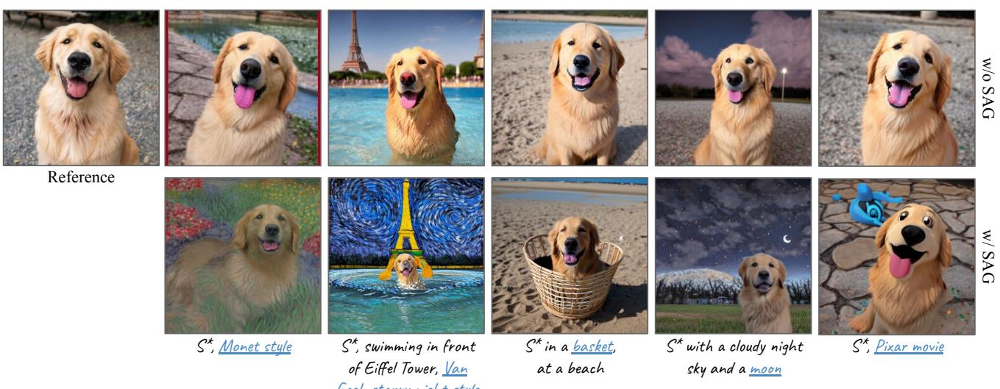  
Figure 1. Addressing Content Ignorance. Given user-provided subject images, a part of the content specified in the text prompt (highlighted in blue) are overlooked. Our Subject-Agnostic Guidance (SAG) aligns the output more closely with both the target subject and tex prompt. Here S denotes a pseudo-word, with its text embedding replaced by a learnable subject embedding.

## Abstract

In subject-driven text-to-image synthesis, the synthesis process tends to be heavily influenced by the reference images provided by users, often overlooking crucial attributes detailed in the text prompt. In this work, we propose Subject-Agnostic Guidance (SAG), a simple yet effective solution to remedy the problem. We show that through constructing a subject-agnostic condition and applying our proposed dual classifier-free guidance, one could obtain outputs consistent with both the given subject and input text prompts. We validate the efficacy of our approach through both optimization-based and encoder-based methods. Additionally, we demonstrate its applicability in second-order customization methods, where an encoder-based model is fine-tuned with DreamBooth. Our approach is conceptually simple and requires only minimal code modifications, but leads to substantial quality improvements, as evidenced by our evaluations and user studies.

## 1. Introduction

Subject-driven text-to-image synthesis focuses on generating diverse image samples, conditioned on user-given text descriptions and subject images. This domain has witnessed a surge of interest and significant advancements in recent years. Optimization-based methods [16, 37, 41] tackle the problem by overfitting pre-trained text-to-image synthesis models [36, 38] and text tokens to the given subject. Recently, encoder-based approaches [10, 24, 49] propose to train auxiliary encoders to generate subject embeddings, bypassing the necessity of per-subject optimization.

In the aforementioned approaches, both the embeddings and networks are intentionally tailored to closely fit the target subject. As a consequence, these learnable conditions tend to dominate the synthesis process, often obscuring the attributes specified in the text prompt. For instance, as shown in Fig. 1, when employing S∗1 alongside the style description Monet style, the desired style is not appropriately synthesized. Such observations underscore that the network struggles to prioritize key content in the existence of learnable components. To address the content ignorance issue, existing solutions modify the training process through additional regularization [37, 49], leading to improved performance.

In this work, we present Subject-Agnostic Guidance (SAG), an approach that diverges from traditional methodologies. Our strategy emphasizes attending to subjectagnostic attributes by diminishing the influence of subjectspecific attributes, accomplished using classifier-free guidance. Differing from standard classifier-free guidance [19], our method incorporates a subject-agnostic condition2. Subsequently, our proposed Dual Classifier-Free Guidance (DCFG) is employed to enhance attention directed towards subject-agnostic attributes. Crucially, motivated by the observation that structures are constructed during early iterations [12, 22], we temporarily replace the subject-aware condition with a subject-agnostic condition at the beginning of the iteration process. Following the construction of coarse image structures, the original subject-aware condition is reintroduced to refine customized details.

Our SAG is elegant in both design and implementation, seamlessly blending with existing methods. We showcase the efficacy of SAG using both optimization-based and encoder-based approaches. Furthermore, we delve into its applicability in second-order customization, with an encoder-based model fine-tuned via DreamBooth [37]. Qualitative and quantitative evaluations as well as user feedback verify our robustness, succinctness, and versatility.

In the evolving realm of subject-driven text-to-image synthesis, challenges have emerged due to over-tailored embeddings and networks. These often inherit crucial attributes. While existing solutions modify training to address these issues, our novel Subject-Agnostic Guidance (SAG) provides a distinct approach. Seamlessly integrating with prevalent methods, SAG emphasizes a more balanced synthesis process. Its effectiveness is demonstrated through various methodologies and supported by user feedback.

## 2. Related Work

Diffusion Model for Text-To-Image Synthesis. Typically, given natural language descriptions, a text encoder such as CLIP [33] or T5 [34] is employed to derive the text embedding. This embedding is then fed into the diffusion model for the generation phase. Earlier approaches [35] operated directly within the high-resolution image space for generation. While these methods yielded promising outcomes, the direct iteration in high-resolution space poses significant computational challenges. In light of these constraints, considerable efforts have been devoted to enhancing generation efficiency. For instance, Imagen [38] employs a multistage diffusion model. It starts by synthesizing a 64 × 64 resolution image based on the input text prompt and subsequently employs a series of super-resolution modules to increase the resolution to 1024 × 1024. Benefiting from optimized architectures in the super-resolution stages, this cascaded approach considerably reduces computational overhead compared to direct high-resolution image synthesis. Latent Diffusion [36] transitions the generation process to a low-resolution feature space to improve efficiency. Initially, a VAE [26] or VQGAN [15, 45] is pre-trained. During training, images are encoded into low-resolution features using the pre-trained encoder, and the diffusion model aims to reconstruct these encoded features. In the inference stage, the trained diffusion model produces a feature which is subsequently decoded using the pre-trained module to render the final output image.

Subject-Driven Image Synthesis. Subject-driven text-toimage synthesis [1, 8, 9, 18, 21, 27–29, 31, 40, 43, 47] is a sub-branch of text-to-image synthesis [3, 6, 14, 25, 36, 38, 50] with an additional requirement that the primary attributes in the output aligns with the subjects provided by the user. Existing research [16, 17, 37, 44] has demonstrated that subject information can be encoded as a subjectaware embedding through test-time optimization, given several reference images. For instance, Textual Inversion [16] leverages pre-trained synthesis networks and optimizes a special token while keeping the network static. Dream-Booth [37] shares a similar premise but also fine-tunes the network to enhance subject consistency. To bypass testtime optimization, which restricts instant feedback, recent studies [10, 24] advocate the use of an encoder to encapsulate subject information. However, despite advancements in both quality and speed, the encoded subject information often dominates the synthesis process, resulting in inadequately capture of subject information . In this study, we introduce Subject-Agnostic Guidance (SAG) to rectify this challenge. Our SAG focuses on enhancing subject-agnostic attributes, diminishing the influence of subject-specific elements through our dual classifier-free guidance. We illustrate that SAG not only enhances consistency to the input captions but also maintains fidelity to the subject.

## 3. Methodology

In this work, we introduce an intuitive and effective method to enhance content alignment. We first provide the background for our approach, followed by the discussion of our method – Subject-Agnostic Guidance.

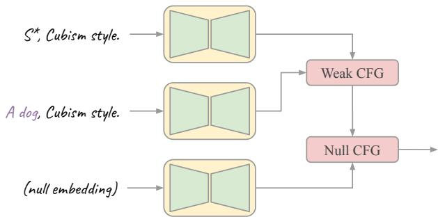  
Figure 2. Overview of SAG. Given a subject-aware embedding, we first construct a subject-agnostic embedding. These embeddings are subsequently used in our dual classifier-free guidance (DCFG), which consists of weak classifier-free guidance and null-classifier-free guidance. Null CFG adopts a constant weight (Eqn. 2) and Weak CFG adopts a variable weight (Eqn. 3).

## 3.1. Preliminaries

## 3.1.1 Diffusion Model

The diffusion process transforms a data distribution to a Gaussian noise distribution by iteratively adding noise. Diffusion model is a class of generative models that invert the diffusion process through iterative denoising. Extended from the original unconditional model [20], recent works demonstrate huge success by conditioning diffusion models on various modalities, including text [7, 23, 39], segmentation [2, 22, 32], and many more [30, 42, 48].

Let $\mathbf { x } _ { \mathrm { 0 } }$ be the input image, and c be the condition. During training, a noisy image $\mathbf { x } _ { t }$ is obtained by adding Gaussian noise $\epsilon _ { t }$ to $\mathbf { x } _ { \mathrm { 0 } }$ . The network is trained to predict the added noise, given the noisy image and condition as input. It is generally optimized with a single denoising objective:

$$
\mathcal { L } _ { d } = | | \epsilon ( \mathbf { x } _ { t } , \mathbf { c } ) - \epsilon _ { t } | | _ { 2 } ^ { 2 } ,\tag{1}
$$

where $\epsilon _ { t }$ the noise added to the input image, and $\boldsymbol { \epsilon } ( \mathbf { x } _ { t } , \mathbf { c } )$ corresponds to the noise estimated by the network. Here $\mathbf { x } _ { t }$ and c refer to the noisy image and condition, respectively. During inference, the process starts with a pure Gaussian noise $\mathbf { x } _ { T _ { 0 } }$ , and the trained network is iteratively applied to obtain a series of intermediate outputs $\left\{ { \bf x } _ { T _ { 0 } - 1 } , { \bf x } _ { T _ { 0 } - 2 } , \cdot \cdot \cdot , { \bf x } _ { 0 } \right\}$ , where $\mathbf { x } _ { \mathrm { 0 } }$ is the final output.

## 3.1.2 Classifier-Free Guidance

Similar to classifier guidance [13], classifier-free guidance is designed to trade between image quality and diversity, but without the need of a classifier. It is widely adopted in existing works [46, 51].

During training, an unconditional diffusion model is jointly trained by randomly replacing the input condition c by a null condition $\phi .$ Once trained, during each iteration t, a weighted sum of the conditional output and the unconditional output is computed:

$$
\tilde { \epsilon } _ { t } = ( 1 + w ) \cdot \epsilon ( \mathbf { x } _ { t } , \mathbf { c } ) - w \cdot \epsilon ( \mathbf { x } _ { t } , \phi ) .\tag{2}
$$

In general, a larger w produces better quality, whereas a smaller w yields greater diversity.

## 3.2. Subject-Agnostic Guidance

In this section, we introduce the concept of Subject-Agnostic Guidance (SAG). The essence of SAG is anchored in formulating a subject-agnostic embedding based on the inputs provided by users. The embedding is then used in our dual classifier-free guidance (DCFG) in generating outputs that align with both the subject and text prompt. We delve into the details of constructing subject-agnostic embeddings in Sec. 3.2.1, and discuss our dual classifier-free guidance in Sec. 3.2.2.

## 3.2.1 Subject-Agnostic Embeddings

The construction of subject-agnostic embeddings depends on the choice of methods. Existing approaches generally fall into two categories: Learnable Text Token and Separate Subject Embedding. In this section, we discuss the construction of subject-agnostic embeddings in these two approaches.

Learnable Text Token. Given images of a reference subject, the learnable text token approach derives a token embedding that captures the identity of the subject, either through fine-tuning [16, 47] or by using an encoder [1, 49]. The resultant token embedding, combined with the token embedding of the text description, is processed by text encoders such as CLIP [33] and T5 [34] to produce a subjectaware embedding.

To construct a subject-agnostic embedding, we replace the derived token embedding with one from a general description of the subject. This strategy ensures that the synthesis process is not dominated by any adaptable components, thereby allowing the model to focus attention on the attributes specified in the text prompt.

Let c be the text condition containing the learnable token $\mathrm { S } ^ { \ast }$ . We define a subject-agnostic condition $\mathbf { c } _ { 0 }$ by replacing the token $\mathrm { S } ^ { \ast }$ by a generic descriptor. For example, assuming the target subject is a dog and

$$
\mathbf { c } = \mathbb { A } \ \mathtt { p e n c i l } \ \mathrm { ~ s k e t c h ~ } \ \mathrm { o f } \ \mathrm { ~ \mathsf { S } ^ { * } ~ }
$$

we construct $\mathbf { c } _ { 0 }$ as

$$
\mathbf { c } _ { 0 } = \texttt { A } \mathtt { p e n c i l } \ s \mathrm { k e t c h } \ \mathrm { ~ o f ~ \ p a ~ \ d o g ~ }
$$

The generic descriptor is chosen as a noun describing the subject.

Separate Subject Embedding. Instead of encoding the subject identity to a learnable text token, the separate subject embedding approach [10, 24] adopts an independent embedding. This embedding is then integrated into the network via auxiliary operations. For instance, Jia et al. [24] employ the CLIP image encoder to encapsulate the subject information into an embedding, which is then injected to Imagen [38] using cross attention.

To construct the subject-agnostic embedding, we opt for a direct method – setting both the subject embedding and its corresponding attention mask to zero. This disables attention to the subject, directing focus towards subject-agnostic information.

## 3.2.2 Dual Classifier-Free Guidance

In this section, we introduce the Dual Classifier-Free Guidance (DCFG), designed primarily to address the issue of content ignorance by attenuating the subject-aware condition. Our DCFG requires no modifications of the training process. It simply requires the application of an additional classifier-free guidance using the subject-aware condition c and the subject-agnostic condition $\mathbf { c } _ { 0 }$ . The derived feature is subsequently merged with the null condition $\phi$ within a conventional classifier-free guidance.

Weak Classifier-Free Guidance. Given the subject-aware condition c and the subject-agnostic condition $\mathbf { c } _ { 0 } .$ , we first perform classifier-free guidance using c and $\mathbf { c } _ { 0 }$ . Incorporating $\mathbf { c } _ { 0 }$ into the synthesis process directs the generation towards subject-agnostic content, representing a weaker version of the desired generation. When subject information is absent, the model more effectively creates the correct outline and structure, generating outputs that align with both the subject and text description.

Differing from the conventional classifier-free guidance, where the guidance weight w often remains constant during the denoising process, we implement a time-varying scheme to enhance performance. Building on the observation that earlier iterations emphasize structure construction [12, 22], we highlight the subject-agnostic condition during the initial phases. Specifically, we adopt a timevarying weighting strategy, suppressing subject information in the early stages:

$$
\bar { \epsilon } _ { t } = ( 1 + w _ { t } ) \cdot \epsilon ( { \bf x } _ { t } , { \bf c } ) - w _ { t } \cdot \epsilon ( { \bf x } _ { t } , { \bf c _ { 0 } } ) ,\tag{3}
$$

where $w _ { t }$ denotes the guidance weight, similar to w in Eqn. 2. Since a larger $w _ { t }$ corresponds to a larger contribution from c, $w _ { t }$ is devised as a non-increasing function with respect to the iteration t. In this work, we find that a simple piecewise constant scheme suffices to produce promising results:

$$
w _ { t } = \left\{ { \begin{array} { l l } { r } & { \mathrm { i f ~ } 0 \leq t \leq T , } \\ { - 1 } & { \mathrm { i f ~ } T < t \leq 1 . } \end{array} } \right.\tag{4}
$$

Here $0 \leq T \leq 1$ and $r \geq - 1$ are pre-determined constants, which will be ablated in Sec. 5. Essentially, in the early stages (i.e., when $t \approx 1 )$ , we use solely the subject-agnostic condition to establish the structure and outline of the output. The subject information is integrated in the subsequent stages.

Null Classifier-Free Guidance. The null classifier-free guidance is identical to the conventional classifier-free guidance, leveraging the null condition to encourage diversity. We adopt a constant guidance weight throughout iterations. Specifically, the output $\overline { { \epsilon } } _ { t }$ of the weak-classifier-free guidance is used in place of $\boldsymbol { \epsilon } ( \mathbf { x } _ { t } , \mathbf { c } )$ in the conventional classifier-free guidance (Eqn. 2):

$$
\tilde { \epsilon } _ { t } = ( 1 + w ) \cdot \bar { \epsilon } _ { t } - w \cdot \epsilon ( \mathbf { x } _ { t } , \phi ) .\tag{5}
$$

## 4. Experiments

To validate the efficacy of SAG, we conduct experiments across multiple approaches, namely Textual Inversion [16] (optimization-based), ELITE [49] (encoderbased), SuTI [10] (encoder-based), and DreamSuTI [10] (second-order).

## 4.1. ELITE

First, we examine the performance improvement when applying SAG to ELITE [49]. In this study, we simplify its architecture by using only the global mapping branch. The settings are as follows:

Training. To promote the learning of subject information, we create a domain-specific (e.g., animals) text-image dataset where the text caption incorporates the specialized token. Specifically, we gather images from a pre-defined category and employ straightforward templates such as $\bar { \mathsf { A } } \mathsf { p h o t o } \mathsf { o f } \mathsf { \Lambda } \mathsf { S } ^ { * }$ for the corresponding captions. During training, the token corresponding to $\mathrm { S ^ { * } }$ is substituted with the output of the encoder. The condition is subsequently fed into the text encoder.

As discussed in concurrent work [24], text prompts generated using templates and captioning models [11] have inherent limits to their diversity. Moreover, training within narrow domains may harm generation diversity. To counteract this, we employ a general-domain dataset containing detailed text descriptions for regularization. Training on a broad array of text captions ensures the model retains its text-understanding abilities.

During the training phase, the domain-specific and general-domain datasets are sampled with probabilities $p \leq 1$ and (1 − p), respectively. Given that the generaldomain dataset serves primarily for regularization, we allocate a higher value to $p ,$ greater than 0.5, emphasizing subject encoding.

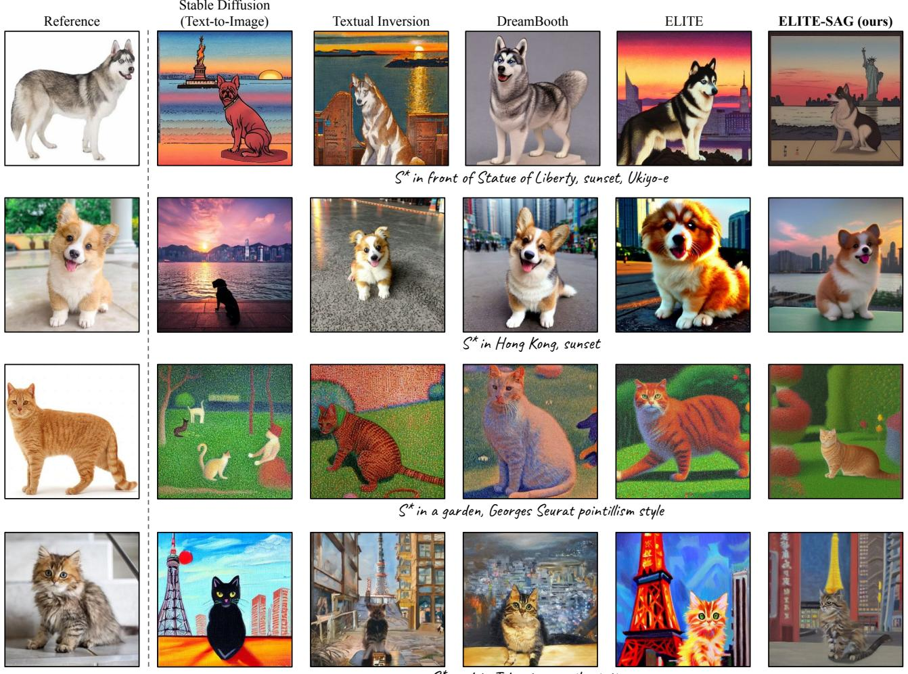  
S\* next to Tokyo tower, oil painting

Figure 3. SAG on ELITE [49]. Our ELITE-SAG produces outputs that are more faithful to text prompts while still preserving subject identity. For Stable Diffusion, we generate pure text-to-image results by substituting “S∗” with “A dog” or “A cat”.

Since the subject-agnostic condition $\mathbf { c } _ { 0 }$ is also natural language, no modification to the original denoising objective (Eqn. 1) is needed. Additionally, we adopt a regularization to the learnable token [49] by constraining its $\ell _ { 2 } \cdot$ -norm. The effective training loss is:

$$
\begin{array} { r } { \mathcal { L } = \mathcal { L } _ { d } + | | s | | ^ { 2 } , } \end{array}\tag{6}
$$

where s denotes the output of the subject encoder. The remaining part of the training is identical to the training of conventional text-to-image networks.

Inference. For each input image, we use the encoder to map the target subject into a text token. This learnable token is then combined with the text description to form the input condition c. The subject-agnostic condition is $\mathbf { c } _ { 0 }$ is then constructed following the process discussed in Sec. 3.2.1. Starting from random Gaussian noise $\mathbf { x } _ { T } ,$ , the fine-tuned network iteratively denoises the intermediate outputs. Instead of applying the conventional classifier-free guidance, our SAG is employed.

Implementation. We adopt the pre-trained Stable Diffusion [36] as the synthesis network, which uses CLIP [33] as the text encoder. For the subject encoder, we use the CLIP image encoder and a three-layer MLP to obtain the learnable token. During training, only the cross-attention layers in Stable Diffusion and the MLP are trained, all other weights are being fixed.

We use an internal text-image dataset for training. To construct the domain-specific dataset, we extract images containing dogs and cats from the meta-dataset. The remaining part is used as our general-domain dataset. The dataset mixing ratio is 0.1. The proposed method is implemented in JAX [4]. The detailed experimental settings will be discussed in the supplementary material.

Comparison. We compare our modified model, ELITE-

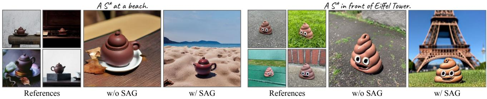  
Figure 4. SAG on Textual Inversion [16]. Our SAG improves text alignment without sacrificing the identity of the subject.

Table 1. Quantitative Comparison. Our ELITE-SAG yields improved performance in both text and subject alignment.
<table><tr><td>Methods</td><td>CLIP-T↑</td><td>CLIP-I↑</td><td>DINO ↑</td></tr><tr><td>DreamBooth [37]</td><td>0.315</td><td>0.785</td><td>0.651</td></tr><tr><td>Textual Inversion [16]</td><td>0.339</td><td>0.751</td><td>0.571</td></tr><tr><td>ELITE [49]</td><td>0.342</td><td>0.751</td><td>0.586</td></tr><tr><td>ELITE-SAG (ours)</td><td>0.344</td><td>0.790</td><td>0.671</td></tr></table>

Table 2. User Study. Across all three compared methods, the majority of raters favor the results produced by our approach.
<table><tr><td>% Prefer Ours</td><td>Subject Align.</td><td>Text Align.</td><td>Quality</td></tr><tr><td>DreamBooth [37]</td><td>52%</td><td>68%</td><td>60%</td></tr><tr><td>Textual Inversion [16]</td><td>64%</td><td>76%</td><td>84%</td></tr><tr><td>ELITE [49]</td><td>56%</td><td>80%</td><td>76%</td></tr></table>

SAG, with three existing works: DreamBooth [37], Textual Inversion [16], and ELITE [49]. In this section, we assume the existence of only one reference image. As illustrated in Fig. 3, while Stable Diffusion exhibits high text alignment, the compared methods often fall short in generating results faithful to text prompts in the presence of additional subject images. In contrast, with our SAG, outputs adhering to both text captions and reference subjects are consistently generated.

We also conduct a quantitative comparison as presented in Table 1, utilizing CLIP [33] and DINO [5] scores. Specifically, the image feature similarities of CLIP [33] and DINO underscore that SAG enhances subject fidelity, while the text feature similarity indicates that SAG improves text alignment. Furthermore, our user study depicted in Table 2 reveals that more than half of the raters prefer our method when compared to the aforementioned methods, thereby corroborating the effectiveness of SAG.

## 4.2. Textual Inversion

Textual Inversion [16] is an optimization-based method for customization. For each given subject, Textual Inversion learns a text token to represent the subject. As discussed in Sec. 3.2.1, the subject-agnostic embedding is generated by replacing the learned special token by a generic description.

Then, the conventional CFG is replaced by our SAG. The remaining generation pipeline remains unchanged.

As illustrated in Fig. 4, the absence of SAG leads to generation dominated by the optimized text token, resulting in suboptimal text alignment. Conversely, the incorporation of SAG enables the model to produce outputs that align more closely with the text description, while preserving the identity of the subject.

## 4.3. SuTI

Unlike ELITE, which encodes subject information into a text token, SuTI [10] employs an encoder-based approach that leverages a distinct subject embedding. This embedding is then fed to the generation network through independent cross-attention layers. As discussed in Sec. 3.2.1, the subject-agnostic condition, denoted as $\mathbf { c } _ { 0 } ,$ is simply constructed by setting the subject embedding to zero.

As illustrated in Fig. 5, without SAG, the model successfully preserves the identity of the individual provided in the reference images, yet the text alignment is inadequate. Specifically, the styles are unsatisfactory across all outputs. In contrast, employing SAG and suppressing the subject information during initial iterations significantly enhances text alignment. Consequently, the outputs exhibit both high identity preservation and improved text alignment.

## 4.4. DreamSuTI

DreamSuTI [10] is a second-order method that fine-tunes SuTI using DreamBooth [37] for compositional customization. In this section, we fine-tune SuTI with a provided style image to achieve simultaneous customization of style and subject. The subject-agnostic embedding is generated using the same method as in SuTI.

As depicted in Fig. 6, in the presence of subject images, the outputs are dominated by the subject, resulting in a lack of style fidelity. In contrast, when applying SAG, the subject is suppressed during the early stages of generation, effectively leading to enhanced style generation.

A bronze face, looks like bronze statue or bronze figure, fine details.

w/o SAG  
References  
Prompt  
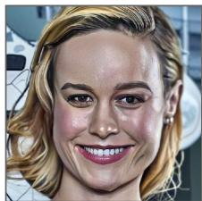  
w/o SAG

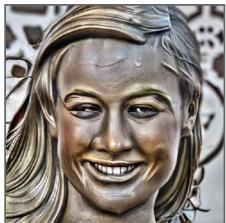  
w/ SAG

Beautiful steampunk face wearing mask,   
d & d, fantasy, intricate, elegant, digital painting, matte, sharp focus,   
illustration, hearthstone, gradient background, hdr 8k.

Prompt  
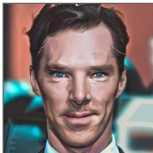  
w/o SAG

  
w/ SAG

Pixel art of face figures, attractive faces, edgy, cool, extreme detail, tiny pixels, very coherent, vibrant colors

Prompt  
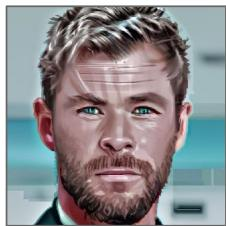  
w/o SAG

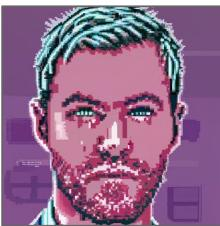  
w/ SAG  
Prompt

Portrait photography of a face, city, 35mm, night time, blue green, pink and gold, heavy bokeh.

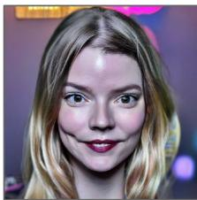  
w/o SAG

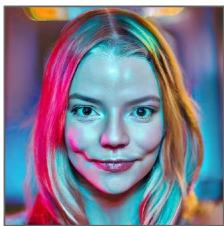  
w/ SAG  
Figure 5. SAG on SuTI [10]. When applying SAG on SuTI, the subject is discarded during initial iterations, yielding outputs with markedly improved text alignment. Reference images are not provided to protect privacy.

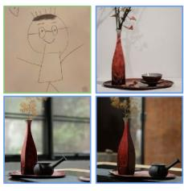

## A vase in kid line drawing style

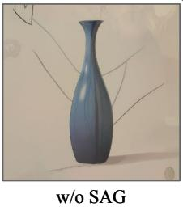

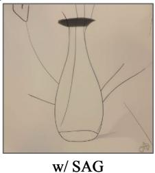  
A beer can in watercolor painting style

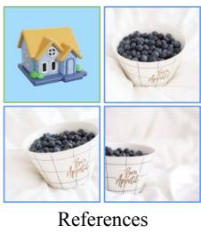

A berry bowl in 3D rendering style  
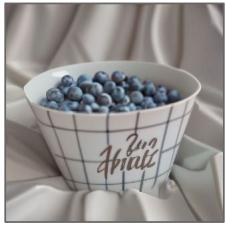

  
w/ SAG

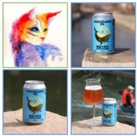  
References

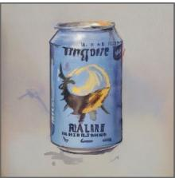  
w/o SAG

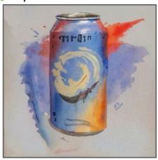  
w/ SAG

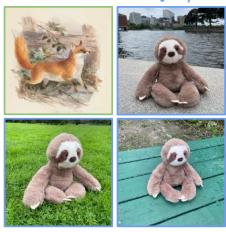  
A grey sloth plushie in watercolor painting style  
References

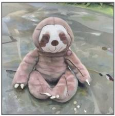  
w/o SAG

  
w/ SAG  
Figure 6. SAG on DreamSuTI [10]. Even after fine-tuning with DreamBooth to adapt to the specified style, the generated results tend to be dominated by the subjects, leading to an inadequate style-alignment. Our SAG addresses this issue by diminishing the influence of subjects, thereby ensuring outputs that are well-aligned with both the text, subject, and style.

## 5. Ablations

Guidance Timing. The hyper-parameter T plays an important role in controlling the contribution of the subject embedding. An illustration employing DreamSuTI is provided in Fig. 7. With r = 0, adopting a smaller T results in a stronger suppression of the subject embedding, thereby promoting a better text-alignment (i.e., style-alignment in this example). A gradual increment in T facilitates a transition from style alignment to subject alignment.

Guidance Weight. While a default value of r = 0 (i.e., employing only the subject-aware condition in later iterations) performs well generally, decreasing r facilitates the utilization of the subject-agnostic condition in subsequent iterations, thereby further enhancing content faithfulness. As depicted in Fig. 8, the inclusion of subject-agnostic conditions significantly improves the style alignment of Dream-SuTI. Since no re-training is required, the values of T and r can be dynamically adjusted based on user preference.

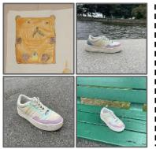

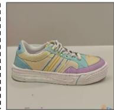

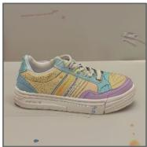  
References

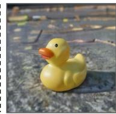  
T = 1.0  
Subject Alignment

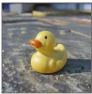  
T = 0.99

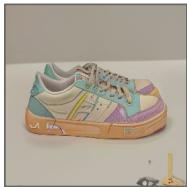

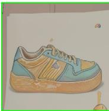

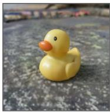  
T = 0.95

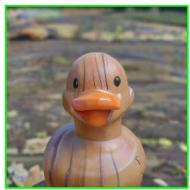  
T = 0.9

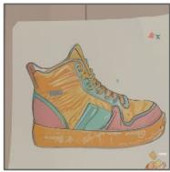

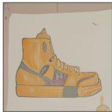

  
T = 0.85

  
T = 0.0  
Style Alignment

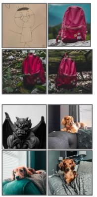  
References

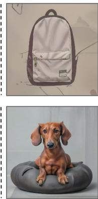  
r = 0.0  
Subject  
Alignment

Figure 7. Guidance Timing. As an example, when fine-tuning SuTI [10] to a given style using DreamBooth [37], our SAG facilitates a transition from subject-centric alignment to style-centric alignment. Here r = 0 is used.  
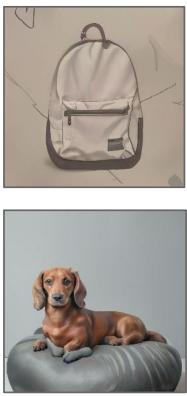  
r = -0.2

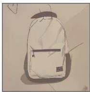

  
r = -0.4

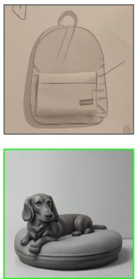  
r = -0.6

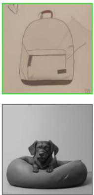  
r = -0.8

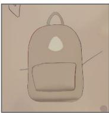

  
r = -1.0  
Style Alignment

Figure 8. Guidance Weight. The guidance weight r can be leveraged to enhance content faithfulness further. For instance, lowering r results in improved style alignment in DreamSuTI. Here T = 0.9 is used.

## 6. Limitation and Societal Impact

Limitation. While our SAG significantly enhances content alignment compared to existing methods, the quality of outputs is inherently constrained by the underlying generation model. Hence, it may still exhibit suboptimal performance for uncommon content that challenges the generation model. However, this limitation can be mitigated by incorporating a more robust synthesis network, a direction we aim to explore in our future work.

Societal Impact. This project targets at improving content alignment in customized synthesis, which holds the potential for misuse by malicious entities aiming to mislead the public. Future investigations in this domain should duly consider these ethical implications. Moreover, ensuing efforts to develop mechanisms for detecting images generated by such models emerge as a critical avenue to foster the safe advancement of generative models.

## 7. Conclusion

Subject-driven text-to-image synthesis has witnessed notable progress in recent years. However, overcoming the problem of content ignorance remains a significant challenge. As shown in this work, this problem significantly limits the diversity of the generation. Rather than introducing complex modules, we propose a straightforward yet effective method to address this issue. Our Subject-Agnostic Guidance demonstrates how a balance between content consistency and subject fidelity can be achieved using a subjectagnostic condition. The proposed method enables users to generate customized and diverse scenes without modifying the training process, making it adaptable across various existing approaches.

## References

[1] Moab Arar, Rinon Gal, Yuval Atzmon, Gal Chechik, Daniel Cohen-Or, Ariel Shamir, and Amit H Bermano. Domainagnostic tuning-encoder for fast personalization of text-toimage models. arXiv preprint arXiv:2307.06925, 2023. 2, 3

[2] Omer Bar-Tal, Lior Yariv, Yaron Lipman, and Tali Dekel. MultiDiffusion: Fusing diffusion paths for controlled image generation. In ICML, 2023. 3

[3] James Betker, Gabriel Goh, Li Jing, Brooks Tim, Jianfeng Wan, Linjie Li, Long Ouyang, Juntang Zhuang, Joyce Lee, Yufei Guo, Wesam Manassra, Prafulla Dhariwal, Casey Chu, and Yunxin Jiao. Improving image generation with better captions. Technical Report, 2023. 2

[4] James Bradbury, Roy Frostig, Peter Hawkins, Matthew James Johnson, Chris Leary, Dougal Maclaurin, George Necula, Adam Paszke, Jake VanderPlas, Skye Wanderman-Milne, and Qiao Zhang. JAX: composable transformations of Python+NumPy programs, 2018. 5

[5] Mathilde Caron, Hugo Touvron, Ishan Misra, Herve J ´ egou,´ Julien Mairal, Piotr Bojanowski, and Armand Joulin. Emerging properties in self-supervised vision transformers. In ICCV, 2021. 6

[6] Huiwen Chang, Han Zhang, Jarred Barber, AJ Maschinot, Jose Lezama, Lu Jiang, Ming-Hsuan Yang, Kevin Murphy, William T Freeman, Michael Rubinstein, et al. Muse: Text-to-image generation via masked generative transformers. arXiv preprint arXiv:2301.00704, 2023. 2

[7] Hila Chefer, Yuval Alaluf, Yael Vinker, Lior Wolf, and Daniel Cohen-Or. Attend-and-Excite: Attention-based semantic guidance for text-to-image diffusion models. In SIG-GRAPH, 2023. 3

[8] Hong Chen, Yipeng Zhang, Xin Wang, Xuguang Duan, Yuwei Zhou, and Wenwu Zhu. DisenBooth: Identitypreserving disentangled tuning for subject-driven text-toimage generation. arXiv preprint arXiv:2305.03374, 2023. 2

[9] Li Chen, Mengyi Zhao, Yiheng Liu, Mingxu Ding, Yangyang Song, Shizun Wang, Xu Wang, Hao Yang, Jing Liu, Kang Du, et al. PhotoVerse: Tuning-free image customization with text-to-image diffusion models. arXiv preprint arXiv:2309.05793, 2023. 2

[10] Wenhu Chen, Hexiang Hu, Yandong Li, Nataniel Rui, Xuhui Jia, Ming-Wei Chang, and William W Cohen. Subjectdriven text-to-image generation via apprenticeship learning. In NeurIPS, 2023. 1, 2, 4, 6, 7, 8

[11] Xi Chen, Xiao Wang, Soravit Changpinyo, AJ Piergiovanni, Piotr Padlewski, Daniel Salz, Sebastian Goodman, Adam Grycner, Basil Mustafa, Lucas Beyer, et al. PaLI: A jointlyscaled multilingual language-image model. In ICLR, 2023. 4

[12] Jooyoung Choi, Jungbeom Lee, Chaehun Shin, Sungwon Kim, Hyunwoo Kim, and Sungroh Yoon. Perception prioritized training of diffusion models. In CVPR, 2022. 2, 4

[13] Prafulla Dhariwal and Alexander Nichol. Diffusion models beat GANs on image synthesis. In NeurIPS, 2021. 3

[14] Ming Ding, Wendi Zheng, Wenyi Hong, and Jie Tang. CogView2: Faster and better text-to-image generation via hierarchical transformers. In NeurIPS, 2022. 2

[15] Patrick Esser, Robin Rombach, and Bjorn Ommer. Taming transformers for high-resolution image synthesis. In CVPR, 2021. 2

[16] Rinon Gal, Yuval Alaluf, Yuval Atzmon, Or Patashnik, Chechik Gal Bermano, Amit H., and Daniel Cohen-Or. An image is worth one word: Personalizing text-to-image generation using textual inversion. In ICLR, 2023. 1, 2, 3, 4, 6

[17] Inhwa Han, Serin Yang, Taesung Kwon, and Jong Chul Ye. Highly personalized text embedding for image manipulation by stable diffusion. arXiv preprint arXiv:2303.08767, 2023. 2

[18] Ligong Han, Yinxiao Li, Han Zhang, Peyman Milanfar, Dimitris Metaxas, and Feng Yang. SVDiff: Compact parameter space for diffusion fine-tuning. In ICCV, 2023. 2

[19] Jonathan Ho and Tim Salimans. Classifier-free diffusion guidance. arXiv preprint arXiv:2207.12598, 2022. 2

[20] Jonathan Ho, Ajay Jain, and Pieter Abbeel. Denoising diffusion probabilistic models. In NeurIPS, 2020. 3

[21] Hexiang Hu, Kelvin C.K. Chan, Yu-Chuan Su, Wenhu Chen, Yandong Li, Kihyuk Sohn, Yang Zhao, Xue Ben, Boqing Gong, William Cohen, Chang Ming-Wei, and Xuhui Jia. Instruct-Imagen: Image generation with multi-modal instruction. In CVPR, 2024. 2

[22] Ziqi Huang, Kelvin C.K. Chan, Yuming Jiang, and Ziwei Liu. Collaborative diffusion for multi-modal face generation and editing. In CVPR, 2023. 2, 3, 4

[23] Ziqi Huang, Tianxiang Wu, Yuming Jiang, Kelvin C.K. Chan, and Ziwei Liu. ReVersion: Diffusion-based relation inversion from images. arXiv preprint arXiv:2303.13495, 2023. 3

[24] Xuhui Jia, Yang Zhao, Kelvin C.K. Chan, Yandong Li, Han Zhang, Boqing Gong, Tingbo Hou, Huisheng Wang, and Yu-Chuan Su. Taming encoder for zero fine-tuning image customization with text-to-image diffusion models. arXiv preprint arXiv:2304.02642, 2023. 1, 2, 4

[25] Minguk Kang, Jun-Yan Zhu, Richard Zhang, Jaesik Park, Eli Shechtman, Sylvain Paris, and Taesung Park. Scaling up GANs for text-to-image synthesis. In CVPR, 2023. 2

[26] Diederik P Kingma and Max Welling. Auto-encoding variational bayes. In ICLR, 2014. 2

[27] Nupur Kumari, Bingliang Zhang, Richard Zhang, Eli Shechtman, and Jun-Yan Zhu. Multi-concept customization of text-to-image diffusion. In CVPR, 2023. 2

[28] Dongxu Li, Junnan Li, and Steven CH Hoi. BLIP-Diffusion: Pre-trained subject representation for controllable text-to-image generation and editing. arXiv preprint arXiv:2305.14720, 2023.

[29] Xiaoming Li, Xinyu Hou, and Chen Change Loy. When StyleGAN meets stable diffusion: A W+ adapter for personalized image generation. In CVPR, 2024. 2

[30] Yuheng Li, Haotian Liu, Qingyang Wu, Fangzhou Mu, Jianwei Yang, Jianfeng Gao, Chunyuan Li, and Yong Jae Lee. GLIGEN: Open-set grounded text-to-image generation. In CVPR, 2023. 3

[31] Zhiheng Liu, Yifei Zhang, Yujun Shen, Kecheng Zheng, Kai Zhu, Ruili Feng, Yu Liu, Deli Zhao, Jingren Zhou, and Yang Cao. Cones 2: Customizable image synthesis with multiple subjects. arXiv preprint arXiv:2305.19327, 2023. 2

[32] Chong Mou, Xintao Wang, Liangbin Xie, Jian Zhang, Zhongang Qi, Ying Shan, and Xiaohu Qie. T2I-Adapter: Learning adapters to dig out more controllable ability for text-to-image diffusion models. arXiv preprint arXiv:2302.08453, 2023. 3

[33] Alec Radford, Jong Wook Kim, Chris Hallacy, Aditya Ramesh, Gabriel Goh, Sandhini Agarwal, Girish Sastry, Amanda Askell, Pamela Mishkin, Jack Clark, Gretchen Krueger, and Ilya Sutskever. Learning transferable visual models from natural language supervision. In ICML, 2021. 2, 3, 5, 6

[34] Colin Raffel, Noam Shazeer, Adam Roberts, Katherine Lee, Sharan Narang, Michael Matena, Yanqi Zhou, Wei Li, and Peter J Liu. Exploring the limits of transfer learning with a unified text-to-text transformer. JMLR, 2020. 2, 3

[35] Aditya Ramesh, Prafulla Dhariwal, Alex Nichol, Casey Chu, and Mark Chen. Hierarchical text-conditional image generation with CLIP latents. arXiv preprint arXiv:2204.06125, 2022. 2

[36] Robin Rombach, Andreas Blattmann, Dominik Lorenz, Patrick Esser, and Bjorn Ommer. High-resolution image syn-¨ thesis with latent diffusion models. In CVPR, 2022. 1, 2, 5

[37] Nataniel Ruiz, Yuanzhen Li, Varun Jampani, Yael Pritch, Michael Rubinstein, and Kfir Aberman. DreamBooth: Fine tuning text-to-image diffusion models for subject-driven generation. In CVPR, 2023. 1, 2, 6, 8

[38] Chitwan Saharia, William Chan, Saurabh Saxena, Lala Li, Jay Whang, Emily Denton, Seyed Kamyar Seyed Ghasemipour, Burcu Karagol Ayan, S. Sara Mahdavi, Rapha Gontijo Lopes, Tim Salimans, Jonathan Ho, David J Fleet, and Mohammad Norouzi. Photorealistic text-to-image diffusion models with deep language understanding. In NeruIPS, 2022. 1, 2, 4

[39] Shelly Sheynin, Oron Ashual, Adam Polyak, Uriel Singer, Oran Gafni, Eliya Nachmani, and Yaniv Taigman. KNN-Diffusion: Image generation via large-scale retrieval. In ICLR, 2023. 3

[40] Jing Shi, Wei Xiong, Zhe Lin, and Hyun Joon Jung. Instant-Booth: Personalized text-to-image generation without testtime finetuning. arXiv preprint arXiv:2304.03411, 2023. 2

[41] Kihyuk Sohn, Nataniel Ruiz, Kimin Lee, Daniel Castro Chin, Irina Blok, Huiwen Chang, Jarred Barber, Lu Jiang, Glenn Entis, Yuanzhen Li, et al. StyleDrop: Text-to-image generation in any style. arXiv preprint arXiv:2306.00983, 2023. 1

[42] Yu-Chuan Su, Kelvin C.K. Chan, Yandong Li, Yang Zhao, Han Zhang, Boqing Gong, Huisheng Wang, and Xuhui Jia. Identity encoder for personalized diffusion. arXiv preprint arXiv:2304.07429, 2023. 3

[43] Yoad Tewel, Rinon Gal, Gal Chechik, and Yuval Atzmon. Key-locked rank one editing for text-to-image personalization. In SIGGRAPH, 2023. 2

[44] Dani Valevski, Danny Wasserman, Yossi Matias, and Yaniv Leviathan. Face0: Instantaneously conditioning a text-to-

image model on a face. arXiv preprint arXiv:2306.06638, 2023. 2

[45] Aaron Van Den Oord, Oriol Vinyals, et al. Neural discrete representation learning. In NeurIPS, 2017. 2

[46] Ruben Villegas, Mohammad Babaeizadeh, Pieter-Jan Kindermans, Hernan Moraldo, Han Zhang, Mohammad Taghi Saffar, Santiago Castro, Julius Kunze, and Dumitru Erhan. Phenaki: Variable length video generation from open domain textual description. In ICLR, 2023. 3

[47] Andrey Voynov, Qinghao Chu, Daniel Cohen-Or, and Kfir Aberman. P+: Extended textual conditioning in text-toimage generation. arXiv preprint arXiv:2303.09522, 2023. 2, 3

[48] Jianyi Wang, Zongsheng Yue, Shangchen Zhou, Kelvin C.K. Chan, and Chen Change Loy. Exploiting diffusion prior for real-world image super-resolution. arXiv preprint arXiv:2305.07015, 2023. 3

[49] Yuxiang Wei, Yabo Zhang, Zhilong Ji, Jinfeng Bai, Lei Zhang, and Wangmeng Zuo. ELITE: Encoding visual concepts into textual embeddings for customized text-to-image generation. In ICCV, 2023. 1, 2, 3, 4, 5, 6

[50] Jiahui Yu, Yuanzhong Xu, Jing Yu Koh, Thang Luong, Gunjan Baid, Zirui Wang, Vijay Vasudevan, Alexander Ku, Yinfei Yang, Burcu Karagol Ayan, et al. Scaling autoregressive models for content-rich text-to-image generation. TMLR, 2022. 2

[51] Lvmin Zhang and Maneesh Agrawala. Adding conditional control to text-to-image diffusion models. In ICCV, 2023. 3