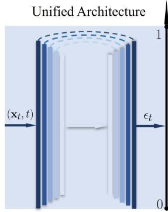
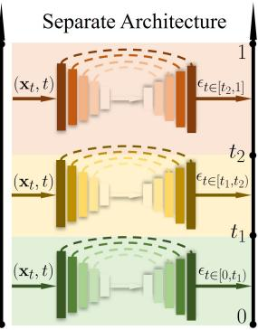
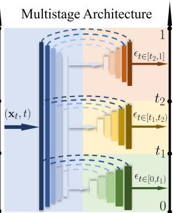
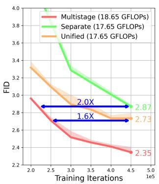
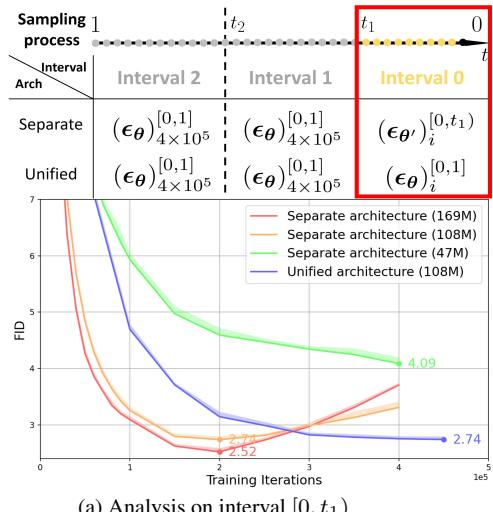
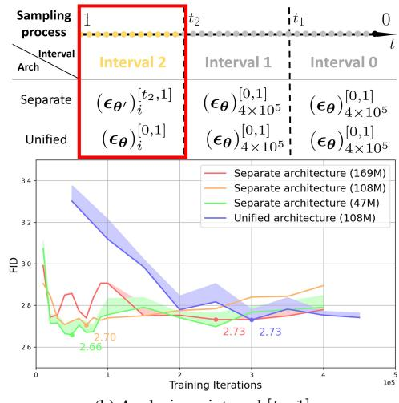

# Improving Training Efficiency of Diffusion Models via Multi-Stage Framework and Tailored Multi-Decoder Architecture

Huijie Zhang1 ∗ Yifu Lu1 ∗ Ismail Alkhouri1,2 Saiprasad Ravishankar2,3 Dogyoon Song1 Qing Qu1

1Department of Electrical Engineering & Computer Science, University of Michigan 2Department of Computational Mathematics, Science & Engineering, Michigan State University 3Department of Biomedical Engineering, Michigan State University

{huijiezh, yifulu, ismailal, dogyoons, qingqu}@umich.edu ravisha3@msu.edu

  
(a)

  
(b)

  
(c)

  
(d)  
Figure 1. Overview of three diffusion model architectures: (a) unified, (b) separate, and (c) our proposed multistage architecture. Compared with (a) and (b), our approach improves sampling quality, and significantly enhances training efficiency, as indicated by the FID scores and their corresponding training iterations (d).

## Abstract

Diffusion models, emerging as powerful deep generative tools, excel in various applications. They operate through a two-steps process: introducing noise into training samples and then employing a model to convert random noise into new samples (e.g., images). However, their remarkable generative performance is hindered by slow training and sampling. This is due to the necessity oftracking extensive forward and reverse diffusion trajectories, and employing a large model with numerous parameters across multiple timesteps (i.e., noise levels). To tackle these challenges, we present a multi-stage framework inspired by our empirical findings. These observations indicate the advantages of employing distinct parameters tailored to each timestep while retaining universal parameters shared across all time steps. Our approach involves segmenting the time interval into multiple stages where we employ custom multi-decoder U-net architecture that blends time-dependent models with a universally shared encoder. Our framework enables the

efficient distribution of computational resources and mitigates inter-stage interference, which substantially improves training efficiency. Extensive numerical experiments affirm the effectiveness of our framework, showcasing significant training and sampling efficiency enhancements on three state-of-the-art diffusion models, including large-scale latent diffusion models. Furthermore, our ablation studies illustrate the impact of two important components in our framework: (i) a novel timestep clustering algorithm for stage division, and (ii) an innovative multi-decoder Unet architecture, seamlessly integrating universal and customized hyperparameters.

## 1. Introduction

Recently, diffusion models have made remarkable progress as powerful deep generative modeling tools, showcasing remarkable performance in various applications, ranging from unconditional image generation [1, 2], conditional image generation [3, 4], image-to-image translation [5–7], text-toimage generation [8–10], inverse problem solving [11–14], video generation [15, 16], and so on. These models employ a training process involving continuous injection of noise into training samples (“diffusion”), which are then utilized to generate new samples, such as images, by transforming random noise instances through a reverse diffusion process guided by the “score function ” of the data distribution learned by the model. Moreover, recent work demonstrates that those diffusion models enjoy optimization stability and model reproducibility compared with other types of generative models [17]. However, diffusion models suffer from slow training and sampling despite their remarkable generative capabilities, which hinders their use in applications where real-time generation is desired [1, 2]. These drawbacks primarily arise from the necessity of tracking extensive forward and reverse diffusion trajectories, as well as managing a large model with numerous parameters across multiple timesteps (i.e., diffusion noise levels).

In this paper, we address these challenges based on two key observations: (i) there exists substantial parameter redundancy in current diffusion models, and (ii) they are trained inefficiently due to dissimilar gradients across different noise levels. Specifically, we find that training diffusion models require fewer parameters to accurately learn the score function at high noise levels, while larger parameters are needed at low noise levels. Furthermore, we also observe that when learning the score function, distinct shapes of distributions at different noise levels result in dissimilar gradients, which appear to slow down the training process driven by gradient descent.

Building on these insights, we propose a multi-stage framework with two key components: (i) a multi-decoder U-net architecture, and (ii) a new partitioning algorithm to cluster timesteps (noise levels) into distinct stages. In terms of our new architecture, we design a multi-decoder U-Net that incorporates one universal encoder shared across all intervals and individual decoders tailored to each time stage; see Figure 1 (c) for an illustration. This approach combines the advantages of both universal and stage-specific architectures, which is much more efficient than the unified architecture for the entire training process [1, 2, 18] (Figure 1 (a)). Moreover, compared to previous approaches that completely separate architectures for each sub-interval [19–22] (Figure 1 (b)), our approach can effectively mitigate overfitting, leading to improved training efficiency. On the other hand, when it comes to partitioning the training stages of our network, we designed an algorithm aimed at grouping the timesteps. This is achieved by minimizing the functional distance within each cluster in the training objective and making use of the optimal denoiser formulation [18]. By integrating these two key components, our framework enables efficient allocation of computational resources (e.g., U-net parameters) and stage-tailored parameterization. Throughout our extensive numerical experiments (Section 5), we show that out framework effectively improves both training and sampling efficiency. These experiments are performed on diverse benchmark datasets, demonstrating significant acceleration by using our framework when compared to three state-of-the-art (SOTA) diffusion model architectures. As a summary, the major contributions of this work can be highlighted as follows:

• Identifying two key sources of inefficiency. We identified two key sources that cause inefficiencies in training diffusion models across various time step: (i) a significant variation in the requirement of model capacity, and (ii) the gradient dissimilarity. As such, using a unified network cannot meet with the changing requirement at different time steps.

• A new multi-stage framework. We introduced a new multi-stage architecture, illustrated in Fig. 1 (c). We tackle these two sources of inefficiency by segmenting the time interval into multiple stages, where we employ customized multi-decoder U-net architectures that blends time-dependent models with a universally shared encoder.

• Improved training and sampling efficiency. With comparable computational resources for unconditional image generation, we demonstrate that our multi-stage approach improves the Frechet Inception Distance (FID) score for´ all SOTA methods. For example, on CIFAR-10 dataset [23], our method improves the FID for DPM-Solver [24] from 2.84 to 2.37, and it improves the FID for EDM [18] from 2.05 (our training result) to 1.96. Moreover, on the CelebA dataset [25], while maintaining a similar generation quality, our approach significantly reduces the required training FLOPS of EDM by 82% and the Latent Diffusion Model (LDM) [8] by 30%.

Organization. In Sec. 2, we provide preliminaries and an overview of related literatures. In Sec. 3, we present our observations and analysis that motivated the proposed multistage framework, justifying its development. In Sec. 4, we describe our proposed multistage framework for diffusion models, outlining the two core components. Finally, in Sec. 5, we provide the results from our numerical experiments that validate the effectiveness of the proposed multistage approach.

## 2. Preliminaries & Related Work

In this section, we start by reviewing the basic fundamentals of diffusion models [1, 2, 18]. Subsequently, we delve into prior approaches aimed at improving the training and efficiency of diffusion models through the partitioning of the timestep interval. Lastly, we survey prior studies that significantly decrease the number of required sampling iterations.

Background on diffusion models. Let $\pmb { x } _ { 0 } \in \mathbb { R } ^ { n }$ denote a sample from the data distribution $p _ { \mathrm { d a t a } } ( \pmb { x } )$ . Diffusion models operate within forward and reverse processes. The forward process progressively perturbs data $\scriptstyle { \mathbf { { \mathit { x } } } } _ { 0 }$ to a noisy version $\boldsymbol { x } _ { t \in [ 0 , 1 ] }$ via corrupting with the Gaussian kernel. This process can be formulated as a stochastic differential equation (SDE) [2] of the form dx ${ \bf \mu } = { \bf \mu } _ { { \bf x } _ { t } } f ( t ) \mathrm { d } t + { \bf \mu }$ $g ( t ) \mathrm { d } w _ { t }$ , where $f ( t )$ and $g ( t )$ are the drift and diffusion coefficients, respectively, that correspond to a pre-defined noise schedule. $\pmb { w } _ { t } \in \mathbb { R } ^ { n }$ is the standard Wiener process. Under the forward SDE, the perturbation kernel is given by the conditional distribution defined as $p _ { t } ( \pmb { x } _ { t } | \pmb { x } _ { 0 } ) =$ $\mathcal { N } ( \pmb { x } _ { t } ; s _ { t } \pmb { x } _ { 0 } , s _ { t } ^ { 2 } \sigma _ { t } ^ { 2 } \mathbf { I } )$ , where

$$
s _ { t } = \exp ( \int _ { 0 } ^ { t } f ( \xi ) \mathrm { d } \xi ) , \mathrm { a n d } \sigma _ { t } = \sqrt { \int _ { 0 } ^ { t } \frac { g ^ { 2 } ( \xi ) } { s _ { \xi } ^ { 2 } } \mathrm { d } \xi } .\tag{1}
$$

The parameters $s _ { t }$ and $\sigma _ { t }$ are designed such that: (i) the data distribution is approximately estimated when $t =$ 0, and (ii) a nearly standard Gaussian distribution is obtained when $\textit { t } = \ 1$ The objective of diffusion models is to learn the corresponding reverse SDE, defined as dx $= \left[ f ( t ) \pmb { x } _ { t } - g ^ { 2 } ( t ) \nabla _ { \pmb { x } _ { t } } \log p _ { t } ( \pmb { x } _ { t } ) \right] \mathbf { d } t + g ( t ) \mathbf { d } \bar { \pmb { w } }$ , where $\bar { \pmb w } \in \mathbb { R } ^ { n }$ is the standard Wiener process running backward in time, and $\nabla _ { \pmb { x } _ { t } } \log p _ { t } ( \pmb { x } _ { t } )$ is the (Stein) score function. In practice, the score function is approximated using a neural network $\epsilon _ { \pmb { \theta } } : \mathbb { R } ^ { n } \times [ 0 , 1 ]  \mathbb { R } ^ { n }$ parameterized by θ, which can be trained by the denoising score matching technique [26] as

$$
\operatorname* { m i n } _ { \theta } \mathbb { E } \left[ \omega ( t ) \lVert \epsilon _ { \theta } ( x _ { t } , t ) + s _ { t } \sigma _ { t } \nabla _ { x _ { t } } \log p _ { t } ( x _ { t } | { x } _ { 0 } ) \rVert _ { 2 } ^ { 2 } \right] ,\tag{2}
$$

which can also be written as min $\mathbb { E } [ \omega ( t ) | | \epsilon _ { \theta } ( \pmb { x } _ { t } , t ) \ -$ $\epsilon | | ^ { 2 } ] + C$ , where the expectation is taken over $t \sim [ 0 , 1 ] ,$ $\mathbf { \boldsymbol { x } } _ { t } \sim p _ { t } ( \mathbf { \boldsymbol { x } } _ { t } | \mathbf { \boldsymbol { x } } _ { 0 } ) , \mathbf { \boldsymbol { x } } _ { 0 } \sim p _ { \mathrm { d a t a } } ( \mathbf { \boldsymbol { x } } )$ , and $\epsilon \sim \mathcal { N } ( \mathbf { 0 } , \mathbf { I } )$ . Here, C is a constant independent of θ, and $\omega ( t )$ is a scalar representing the weight of the loss as a function of t. In DDPM [1], it is simplified to $\omega ( t ) = 1$ . Once the parameterized score function $\epsilon _ { \theta }$ is trained, it can be utilized to approximate the reverse-time SDE using numerical solvers such as Euler-Maruyama.

Timestep clustering methods. Diffusion models have demonstrated exceptional performance but face efficiency challenges in training and sampling. In response, several studies proposed to cluster the timestep range $t \in [ 0 , 1 ]$ into multiple intervals $( { \mathrm { e . g . , ~ } } [ 0 , t _ { 1 } ) , [ t _ { 1 } , t _ { 2 } ) , \ldots , [ t _ { n } , 1 ] )$ Notably, Choi et al. [19] reconfigured the loss weights for different intervals to enhance performance. Deja et al. [27] divide the entire process into a denoiesr and a generator based on their functionalities. Balaji et al. [28] introduced “expert denoisers”, which proposed using distinct architectures for different time intervals in text-to-image diffusion models. Go et al. [22] further improved the efficiency of these expert denoisers through parameter-efficient fine-tuning and datafree knowledge transfer. Lee et al. [21] designed separate architectures for each interval based on frequency characteristics. Moreover, Go et al. [20] treated different intervals as distinct tasks and employed multi-task learning strategies for diffusion model training, along with various timestep clustering methods.

Our approach distinguishes itself from the aforementioned methods in two key aspects. The first key component is our tailored U-net architecture using a unified encoder coupled with different decoders for different intervals. Previous models have either adopted a unified architecture, as seen in [19, 20], or employed separate architectures (referred to as expert denoisers) for each interval [21, 22, 28]. In comparison, our multistage architecture surpasses these methodologies, as demonstrated in Sec. 5.3. Second, we developed a new timestep clustering method leveraging a general optimal denoiser (Prop. 1) that showcases superior performance (see Sec. 5.4). In contrast, prior works rely on (i) a simple timestep-based clustering cost function [20–22, 28], (ii) Signal-to-Noise Ratio (SNR) based clustering [20], or (iii) gradients-based partitioning that uses task affinity scores [20].

Reducing the sampling iterations methods. Efforts to improve sampling efficiency of diffusion models have led to many recent advancements in SDE and Ordinary Differential Equation (ODE) samplers [2]. For instance, the Denoising Diffusion Implicit Model (DDIM) [29] formulates the forward diffusion as a non-Markovian process with a deterministic generative path, significantly reducing the number of function evaluations (NFE) required for sampling (from thousands to hundreds). Generalized DDIM (gDDIM) [30] further optimized DDIM by modifying the parameterization of the scoring network. Furthermore, the works in [24] and [31], termed the Diffusion Probabilistic Model solver (DPM-solver) and the Diffusion Exponential Integrator Sampler (DEIS), respectively, introduced fast higher-order solvers, employing exponential integrators that require 10s NFE for comparable generation quality. Moreover, the consistency model [32] introduced a novel training loss and parameterization, achieving high-quality generation with merely 1-2 NFE.

We remark that while the aforementioned methods are indirectly related to our work, our experiments in Sec. 5.1 and Sec. 5.2 show that our approach can be easily integrated into these techniques, further improving diffusion models overall training and sampling efficiency.

## 3. Identification of Key Sources of Inefficiency

Conventional diffusion model architectures, as exemplified by [1, 2, 18], treat the training of the diffusion model as a unified process across all timesteps. Recent researches, such as [19–22], have highlighted the benefits of recognizing distinctions between different timesteps and the potential efficiency gains from treating them as separate tasks during the training process. However, our experimental results demonstrate that both unified and separate architectures suffer inefficiency for training diffusion models, where the inefficiency comes from (i) overparameterization, (ii) gradient dissimilarity, and (iii) overfitting.

## 3.1. Empirical Observations on the Key Sources of Inefficiency

To illustrate the inefficiency in each interval, we isolate the interval by using a separate architecture from the rest.

Experiment setup. In our experiments, we consider three-stage training and divide the time steps into three intervals: $[ 0 , t _ { 1 } ) , [ t _ { 1 } , t _ { 2 } ) , [ t _ { 2 } , 1 ] ^ { 1 }$ 1. Let $( \epsilon _ { \pmb { \theta } } ) _ { i } ^ { [ a , b ] } , 0 \leq a < b \leq$ 1 denote a U-Net architecture with parameter θ trained with i iterations and fed with data pairs $\textstyle ( \pmb { x } _ { t } , t )$ , where $t \in [ a , b ]$ We then train models using two different strategies: a unified architecture with 108M network parameters for all intervals, i.e., $( \epsilon _ { \pmb { \theta } } ) _ { i } ^ { [ 0 , 1 ] }$ , and separate architectures with varying network parameters (e.g., 47M, 108M, 169M) for each interval; $\mathrm { e . g . , } \ ( \epsilon _ { \theta } ) _ { i } ^ { [ 0 , t _ { 1 } ) }$ for the interval $[ 0 , t _ { 1 } )$ , etc. It is worth noting that, apart from the differences in network parameters, we utilize the same network architecture (e.g., U-Net) for both the unified and the separate approaches. We assessed the training progress of each model by evaluating image generation quality at different training iterations. Notably, because some of the models are only trained on one interval, we need to provide a ground truth score for the other intervals. In Fig. 2, the sampling process is shown top and the experimental results are shown bottom.

Inefficiency in unified architectures. From Fig. 2, we observe the following:

• Overparameterization and underfitting emerge simultaneously for unified architectures. In Fig. 2a, we observe that increasing the number of parameters in Interval 0 can improve the image generation quality (as indicated by a lower FID score). In contrast, Fig. 2b reveals that increasing the number of parameters in Interval 2 has minimal impact on the quality of image generation. This implies that using a unified architecture will result in underfitting in Interval 0 and overparameterization in Interval 2. The current unified architecture’s parameter redundancy leaves significant room for improving its efficiency. To optimize the computational usage, we should allocate more parameters to Interval 0 while allocating fewer parameters to Interval 2.

• Gradient dissimilarity hinders training for unified architecture. Quantitative results from [20] demonstrate dissimilarity in gradients caused by differences within each interval. This can also be observed from our results based upon both Fig. 2a and Fig. 2b. For the unified and separate architectures using the same number of parameters (108M), separate architecture achieves a significantly lower FID with the same training iterations, implying that dissimilar gradients among intervals may hinder training when using a unified architecture. Here, the only difference between training separate and unified architectures is that the batch gradient for unified architecture is calculated based on all timesteps while the batch gradien2 for separate architecture is calculated only from a specific interval.

Inefficiency in existing separate architectures. Although separated architecture [19, 21, 22] better allocates computational resources for each interval, it suffers from overfitting. This can be illustrated based upon training separate architectures (169M) and (108M) in Interval 0 shown in Fig. 2a, where increasing the number of parameters will lead to overfitting. This also happens in Interval 2, when we compare all separate architectures in Fig. 2b. In comparison, the unified networks with 108M parameters are less prone to overfitting for both Interval 0 and Interval 2. This suggests that we can reduce overfitting by training shared weights across different intervals together.

## 3.2. Tackling the Inefficiency via Multistage U-Net Architectures

In a unified architecture applied across all timesteps, there is often a dual challenge: requirements for more parameters (169M) in the interval $[ 0 , t _ { 1 } )$ but fewer parameters (47M) in the interval $[ t _ { 2 } , 1 ]$ . This issue is compounded by the gradient dissimilarity across different timesteps, which can impede effective training. Alternatively, employing separate architectures for different intervals might lead to overfitting and a lack of robust early stopping mechanisms. To address these challenges, our proposed multistage architecture in Sec. 4 combines shared parameters to reduce overfitting with interval-specific parameters to mitigate the impact of gradient dissimilarity. This tailored approach for each interval ensures improved adaptability. Furthermore, we conduct an in-depth ablation study in Sec. 5.3 to showcase the effectiveness of our multi-stage architecture over the existing models.

## 4. Proposed Multistage Framework

In this section, we introduce our new multistage framework (as illustrated in Fig. 1 (c)). Specifically, we first introduce the multi-stage U-Net architecture design in Sec. 4.1, following a new clustering method for choosing the optimal interval to partition the entire timestep [0, 1] into intervals in Sec. 4.2. , and discuss the rationale of the proposed architecture in Sec. 4.3.

(b) Analysis on interval [t2, 1]
<table><tr><td>Sampling process  $\arcsin ^ { \mathrm { i n t e r v a l } }$ </td><td>t2</td><td>1t1</td><td>0 t</td></tr><tr><td></td><td>Interval 2</td><td>Interval 1</td><td>Interval 0</td></tr><tr><td>Separate</td><td> $\left( \epsilon _ { \theta ^ { \prime } } \right) _ { i } ^ { \left[ t _ { 2 } , 1 \right] }$ </td><td> $( \epsilon _ { \pmb { \theta } } ) _ { 4 \times 1 0 ^ { 5 } } ^ { [ 0 , 1 ] }$ </td><td> $( \epsilon _ { \pmb { \theta } } ) _ { 4 \times 1 0 ^ { 5 } } ^ { [ 0 , 1 ] }$ </td></tr><tr><td>Unified</td><td> $( \epsilon _ { \pmb { \theta } } ) _ { i } ^ { [ 0 , 1 ] }$ </td><td> $( \epsilon _ { \theta } ) _ { 4 \times 1 0 ^ { 5 } } ^ { [ 0 , 1 ] } \}$ </td><td> $( \epsilon _ { \pmb { \theta } } ) _ { 4 \times 1 0 ^ { 5 } } ^ { [ 0 , 1 ] }$ </td></tr></table>

  
(a) Analysis on interval [0, t1)  
Figure 2. Comparison between separate architecture and unified architecture w.r.t. the image generation quality in different intervals: (a) analysis on interval $[ 0 , t _ { 1 } ) ;$ and (b) analysis on interval $[ t _ { 2 } , 1 ]$ . As illustrated on top of each figure, we only train separate architectures within specific intervals for the sampling process in both (a) and (b). For the remaining period of sampling, we use a well-trained diffusion model $( \epsilon _ { \pmb { \theta } } ) _ { 4 \times 1 0 ^ { 5 } } ^ { [ 0 , 1 ] }$ to approximate the ground truth score function. As shown in the above figure of $( \mathrm { a } ) , \mathrm { e . g . }$ . for the separate architecture on interval 1, sampling utilizes trained model $( \epsilon _ { \pmb { \theta } ^ { \prime } } ) _ { i } ^ { [ 0 , t _ { 1 } ) }$ for interval 0 and well-trained model $( \epsilon _ { \pmb { \theta } } ) _ { 4 \times 1 0 ^ { 5 } } ^ { [ 0 , 1 ] }$ for interval 1 and 2. Notably, for both $( \epsilon _ { \pmb { \theta } } ) _ { i } ^ { [ 0 , 1 ] }$ and $( \epsilon _ { \pmb { \theta } } ) _ { 4 \times 1 0 ^ { 5 } } ^ { [ 0 , 1 ] }$ , we are using the model with 108M parameters. For separate architecture, the number in the parentheses represents the number of parameters of the model $( \epsilon _ { \pmb { \theta } ^ { \prime } } ) _ { i } ^ { [ a , b ] }$ . For example, for separate architecture (169M) in (a), the model $\mathbf { \epsilon } _ { ( \epsilon _ { \theta ^ { \prime } } ) _ { i } ^ { [ 0 , t _ { 1 } ) } }$ has 169M parameters for $\pmb { \theta } ^ { \prime }$ . The bottom figures in (a-b) illustrate the FID of the generation from each architecture under different training iterations.

## 4.1. Proposed Multi-stage U-Net Architectures

As discussed in Sec. 3, most existing diffusion models either employ a unified architecture across all intervals [1, 2, 18] to share features for all timesteps, or use completely separate architectures for different timestep intervals [21, 22, 28] where the goal is to take advantage of the benign properties within different intervals.

To harness the advantages of both unified and separate architectures employed in prior studies, we introduce a multistage U-Net architecture, as illustrated in Figure 1(c). Specifically, we partition the entire timestep [0, 1] into several intervals, e.g., three intervals $[ 0 , t _ { 1 } ) , [ t _ { 1 } , t _ { 2 } ) , [ t _ { 2 } , 1 ]$ in Fig. 1. For the architecture, we introduce:

• One shared encoder across all time intervals. For each timestep interval, we implement a shared encoder architecture (plotted in blue in Fig. 1 (c)), which is similar to the architecture employed in the original U-Net framework [33]. Unlike separate architecture, the shared encoder provide shared information across all timesteps, preventing models from overfitting (see Sec. 5.3 for a discussion).

• Separate decoders for different time intervals. Motivated by the multi-head structure introduced in the Mask Region-based Convolutional Neural Networks (Mask-RCNN) method [34], we propose to use multiple distinct decoders (plotted in colors for different intervals in Fig. 1(c)), where each decoder is tailored to a specific timestep interval. The architecture of each decoder closely resembles the one utilized in [2], with deliberate adjustments made to the embedding dimensions to optimize performance.

As we observe, the primary difference in the architecture resides within the decoder structure. Intuitively, we use a decoder with fewer number of parameters for intervals closer to the noise, because the learning task is easier. We use a decoder with a larger number of parameters for intervals closer to the image.

## 4.2. Optimal Denoiser-based Timestep Clustering

Next, we discuss how we principally choose the interval partition time points in practice. For simplicity, we focus on the case where we partition the time [0, 1] into three intervals $[ 0 , t _ { 1 } ) , [ t _ { 1 } , t _ { 2 } ) , [ t _ { 2 } , 1 ]$ , and we develop a timestep clustering method to choose the optimal $t _ { 1 }$ and $t _ { 2 }$ . Of course, our method can be generalized to multi-stage networks with arbitrary interval numbers. However, in practice, we find that the choice of three intervals strikes a good balance between effectiveness and complexity; see our ablation study in Appendix B.6.

To partition the time interval, we employ the optimal denoiser established in Proposition 1.

Proposition 1. Suppose we train a diffusion model denoiser function $\boldsymbol { \epsilon } _ { \boldsymbol { \theta } } ( \boldsymbol { x } , t )$ with parameters θ using dataset

Algorithm 1 Optimal Denoiser based Timestep Clustering   
1: Input: Total samples K, optimal denoiser function $\boldsymbol { \epsilon } _ { \boldsymbol { \theta } } ^ { * } ( \boldsymbol { x } , t )$   
thresholds $\alpha , \eta ,$ dataset $p _ { \mathrm { d a t a } , } S _ { 0 } = S _ { 1 } = \emptyset$   
2: Output: Timesteps $t _ { 1 } , t _ { 2 }$   
3: for $k \in \{ 1 , \ldots , K \}$ do   
4: $\pmb { y } _ { k } \sim p _ { \mathrm { d a t a } } , \mathbf { \epsilon } _ { k } \sim \mathcal { N } ( 0 , \mathbf { I } ) , t _ { k } \sim [ 0 , 1 ]$   
5: $\mathcal { S } _ { 0 } ^ { k } \gets \mathcal { D } ( \epsilon _ { t _ { k } } ^ { * } , \epsilon _ { 0 } ^ { * } , y _ { k } , \epsilon _ { k } ) , \mathcal { S } _ { 1 } ^ { k } \gets \mathcal { D } ( \bar { \epsilon } _ { t _ { k } } ^ { * } , \epsilon _ { 1 } ^ { * } , y _ { k } , \epsilon _ { k } )$   
6: $\mathcal { S } _ { 0 } \gets \mathcal { S } _ { 0 } \cup \{ \big ( t _ { k } , \boldsymbol { S } _ { 0 } ^ { k } \big ) \} , \mathcal { S } _ { 1 } \gets \mathcal { S } _ { 1 } \cup \{ \big ( t _ { k } , \boldsymbol { S } _ { 1 } ^ { k } \big ) \}$   
7: end for   
$\begin{array} { r } { \mathrm { ~ \tt ~ 3 } ; \mathrm { ~ \tt ~ 4 } _ { 1 } = \arg \operatorname* { m a x } \left\{ \tau \Big | \frac { \sum _ { ( t _ { k } , S _ { 0 } ^ { k } ) \in S _ { 0 } } \left[ S _ { 0 } ^ { k } \cdot \mathbb { 1 } ( t _ { k } \leq \tau ) \right] } { \sum _ { ( t _ { k } , S _ { 0 } ^ { k } ) \in S _ { 0 } } \left[ \mathbb { 1 } ( t _ { k } \leq \tau ) \right] } \geq \alpha \right\} } \end{array}$   
9 $\colon t _ { 2 } = \underset { \tau } { \arg \operatorname* { m i n } } \left\{ \tau \Big | \frac { \Sigma _ { ( t _ { k } , S _ { 1 } ^ { k } ) \in S _ { 0 } } \big [ S _ { 1 } ^ { k } \cdot \mathbf { 1 } ( t _ { k } \geq \tau ) \big ] } { \Sigma _ { ( t _ { k } , S _ { 1 } ^ { k } ) \in S _ { 0 } } [ \mathbb { 1 } ( t _ { k } \geq \tau ) ] } \geq \alpha \right\}$

$$
\begin{array} { r l } & { \{ \pmb { y } _ { i } \in \mathbb { R } ^ { n } \} _ { i = 1 } ^ { N } b y } \\ & { \quad \quad \quad \underset { \pmb { \theta } } { \operatorname* { m i n } } \mathcal { L } ( \epsilon _ { \pmb { \theta } } ; t ) = \mathbb { E } _ { \pmb { x } _ { 0 } , \pmb { x } _ { t } , \epsilon } [ | \vert \ \epsilon - \ \epsilon _ { \pmb { \theta } } ( \pmb { x } _ { t } , t ) | | ^ { 2 } ] , } \end{array}\tag{3}
$$

where $\begin{array} { r } { \pmb { x } _ { 0 } \sim p _ { d a t a } ( \pmb { x } ) = \frac { 1 } { N } \sum _ { i = 1 } ^ { N } \delta ( \pmb { x } - \pmb { y } _ { i } ) , \epsilon \sim \mathcal { N } ( 0 , \pmb { I } ) , } \end{array}$ and $\mathbf { \boldsymbol { x } } _ { t } \sim p _ { t } ( \mathbf { \boldsymbol { x } } _ { t } | \mathbf { \boldsymbol { x } } _ { 0 } ) = \mathcal { N } ( \mathbf { \boldsymbol { x } } _ { t } ; s _ { t } \mathbf { \boldsymbol { x } } _ { 0 } , s _ { t } ^ { 2 } \sigma _ { t } ^ { 2 } I )$ with perturbation parameters $s _ { t }$ and $\sigma _ { t }$ defined in $E q . ( 1 )$ . Then, the optimal denoiser at $t ,$ defined as $\begin{array} { r } { \epsilon _ { \theta } ^ { * } ( x ; t ) = \arg \operatorname* { m i n } _ { \epsilon _ { \theta } } \mathcal { L } ( \epsilon _ { \theta } ; t ) } \end{array}$ is given by

$$
\epsilon _ { \theta } ^ { * } ( x ; t ) = \frac { 1 } { s _ { t } \sigma _ { t } } \left[ x - s _ { t } \frac { \sum _ { i = 1 } ^ { N } \mathcal { N } ( x ; s _ { t } y _ { i } , s _ { t } ^ { 2 } \sigma _ { t } ^ { 2 } I ) y _ { i } } { \sum _ { i = 1 } ^ { N } \mathcal { N } ( x ; s _ { t } y _ { i } , s _ { t } ^ { 2 } \sigma _ { t } ^ { 2 } I ) } \right]\tag{4}
$$

The proof is provided in Appendix $\mathrm { A } ,$ , and the result can be generalized from recent work of Karras et al. [18], extending from a specific kernel $p _ { t } ( \pmb { x } _ { t } | \pmb { x } _ { 0 } ) = \mathcal { N } ( \pmb { x } _ { t } ; \pmb { x } _ { 0 } , \sigma _ { t } ^ { 2 } \mathbf { I } )$ to encompassing a broader scope of noise perturbation kernels, given by $p _ { t } ( \pmb { x } _ { t } | \pmb { x } _ { 0 } ) = \mathcal { N } ( \pmb { x } _ { t } ; s _ { t } \pmb { x } _ { 0 } , s _ { t } ^ { 2 } \sigma _ { t } ^ { 2 } \mathbf { I } )$ For brevity, we simplify the notation of the optimal denoiser $\epsilon _ { \theta } ^ { * } ( x , t )$ in Proposition 1 as $\epsilon _ { t } ^ { * } ( x )$

To obtain the optimal interval, our rationale is to homogenize the regression task as much as possible within each individual time interval. To achieve this goal, given sampled $x _ { 0 } , \epsilon .$ , we define the function distance of the optimal denoiser at any given timestep $t _ { a } , t _ { b }$ as:

$$
\mathcal { D } ( \epsilon _ { t _ { a } } ^ { * } , \epsilon _ { t _ { b } } ^ { * } , x _ { 0 } , \epsilon ) = \frac { 1 } { n } \sum _ { i = 1 } ^ { n } \mathbb { 1 } ( | \epsilon _ { t _ { a } } ^ { * } ( x _ { t _ { a } } ) - \epsilon _ { t _ { b } } ^ { * } ( x _ { t _ { b } } ) | _ { i } \leq \eta ) ,
$$

where 1(·) is the indicator function, η is a pre-specified threshold, ${ \pmb x } _ { t _ { a } } = s _ { t _ { a } } { \pmb x } _ { 0 } + s _ { t _ { a } } \sigma _ { t _ { a } } { \pmb \epsilon } ,$ , and ${ \pmb x } _ { t _ { b } } = s _ { t _ { b } } { \pmb x } _ { 0 } +$ $s _ { t _ { b } } \sigma _ { t _ { b } } \epsilon$ . Consequently, we define the functional similarity of the optimal denoiser at timesteps $t _ { a }$ and $t _ { b }$ as:

$$
S ( \epsilon _ { t _ { a } } ^ { * } , \epsilon _ { t _ { b } } ^ { * } ) = \mathbb { E } _ { { \pmb x } _ { 0 } \sim p _ { \mathrm { d a t a } } } \mathbb { E } _ { \epsilon \sim \mathcal { N } ( 0 , \mathbf { I } ) } [ \mathcal { D } ( \epsilon _ { t _ { a } } ^ { * } , \epsilon _ { t _ { b } } ^ { * } , \pmb x _ { 0 } , \epsilon ) ]\tag{5}
$$

Based upon the definition, we design the following optimization problem to find the largest $t _ { 1 }$ and smallest $t _ { 2 }$ as:

$$
t _ { 1 } \gets \arg \operatorname* { m a x } _ { \tau } \left\{ \tau \Big | \mathbb { E } _ { t \sim [ 0 , \tau ) } [ S ( \epsilon _ { t } ^ { * } , \epsilon _ { 0 } ^ { * } ) ] \geq \alpha \right\} ,\tag{6}
$$

$$
t _ { 2 } \gets \underset { \tau } { \arg \operatorname* { m i n } } \left\{ \tau \Big | \mathbb { E } _ { t \sim [ \tau , 1 ] } [ S ( \epsilon _ { t } ^ { * } , \epsilon _ { 1 } ^ { * } ) ] \geq \alpha \right\} ,\tag{7}
$$

such that the average functional similarity of $\epsilon _ { t } ^ { * }$ (resp. $\boldsymbol { \epsilon } _ { t } ^ { * } )$ to $\epsilon _ { 0 } ^ { * }$ (resp. $\epsilon _ { 1 } ^ { * } )$ in $[ 0 , t _ { 1 } )$ (resp. $[ t _ { 2 } , 1 ] )$ is larger than or equal to a pre-defined threshold α. As the above optimization problems are intractable, we propose the procedure outlined in Algorithm 1 to obtain an approximate solution. In particular, the algorithm samples K pairs $( { \pmb y } _ { k } , { \pmb \epsilon } _ { k } , t _ { k } ) , k \in$ $\{ 1 , \ldots , K \}$ to calculate the distances $\mathcal { D } ( \epsilon _ { t _ { k } } ^ { * } , \epsilon _ { 0 } ^ { * } , y _ { k } , \epsilon _ { k } )$ and $\mathcal { D } ( \epsilon _ { t _ { k } } ^ { * } , \epsilon _ { 1 } ^ { * } , y _ { k } , \epsilon _ { k } )$ (step 6). Based on those distances, we solve the optimization problems defined in the lines 8 and 9 of Algorithm 1 to obtain $t _ { 1 }$ and $t _ { 2 }$

## 4.3. Rationales for the proposed architecture

Finally, we summarize the rationales of our proposed architecture based on the empirical observations in Sec. 3 and previous works.

Rationales for the shared encoder. (i) Prevent overfitting: If we treat training separate stages of diffusion models as multi-task learning, [35] suggests that shared parameters across tasks in multi-task learning can mitigate overfitting. (ii) Maintain consistency in h-space. The output of the encoder for UNet is named as h-space [36], which has properties for semantic manipulation such as homogeneity, linearity, robustness, and consistency across timesteps. Therefore, sharing the encoder can maintain better consistency of the h-space among all timesteps compared to separate encoders.

Rationales for network parameter design. First, we provide some intuitions as to why the learning task at $t = 0$ is harder than that at $t ~ = ~ 1$ Suppose diffusion models could converge to the optimal denoiser $\epsilon _ { \theta } ^ { * } ( x _ { t } , t )$ given in Eq. (4). Based on this, we observe: (i) when $t  0$ , we have $\begin{array} { r } { { \pmb x } _ { t  0 } = { \pmb x } _ { 0 } , { \pmb \epsilon } _ { \pmb \theta } ^ { \ast } | _ { t  0 } = { \pmb \epsilon } , } \end{array}$ so that $\epsilon _ { \theta } ^ { * }$ is a complicated mapping from training data distribution $p _ { \mathrm { d a t a } } ( \pmb { x } )$ to the gaussian distribution; (ii) when $t \  \ 1$ , we have $x _ { t  1 } = \epsilon ,$ $\epsilon _ { \theta } ^ { * } | _ { t  1 } = \epsilon , \mathrm { s o } \epsilon _ { \theta } ^ { * }$ is an identity mapping. The two extreme cases reveal that the identity mapping for $t  1$ (close to noise) is easier to learn than that for $t  0 .$ . Second, our choice of network parameters across different stages share similar spirits with the recent work [37], which employs a high dimensional subspace as $t  0$ and gradually decreases the dimensionality of each subspace until $t = 1$

## 5. Experiments

In this section, we start by providing the experimental setups. Next, we present results in terms of generation quality (Sec. 5.1). Subsequently, results for training and sampling efficiency are presented. Finally, in Sec. 5.3 and

Sec. 5.4, comprehensive ablation studies on timestep clustering methods and multistage architectures are given.

Multistage architectures. Our multistage architecture, inspired by the U-Net model [33] used in DDPM++ [1, 2, 18], is modified for interval-specific channel dimensions. The proposed architecture is adopted to three diffusion models: DPM-Solver [24], EDM [18], and LDM [8]. In particular, for the cases of DPM-Solver and EDM, the encoder’s channel dimensions are standardized at 128, while the decoders are configured with 192, 128, and 16 channels for intervals $[ 0 , t _ { 1 } ) , [ t _ { 1 } , t _ { 2 } )$ , and $[ t _ { 2 } , 1 ]$ , respectively. In the LDM case, we use 224 channels across the encoder for all intervals whereas the decoders are configured with 256, 192, and 128 channels for the respective intervals. To decide the specific number of parameters for each decoder, we apply ablation studies in Appendix B.5. Training details are in Appendix D.

Datasets, evaluation metrics, & baselines. We use CIFAR-10 (32 × 32), CelebA (32 × 32), and CelebA (256 × 256) datasets for our experiments. To evaluate the performance of our multistage diffusion model in terms of the generation quality, we use the standard Frechet Inception´ Distance (FID) metric [38]. We assess the sampling efficiency using the NFE, and giga-floating point operations (GFLOPs) per function evaluation. For both separate architecture and our multistage architecture, equivalent GFLOPs are computed as a weighted summation of GFLOPs for each interval. Training efficiency is evaluated using total training iterations multiplied by the GFLOPs per function evaluation,2 measured by peta-floating point operations (PFLOPs). For baselines, we consider DDPM [1], Score SDE [2], Poisson Flow Generative Models (PFGM) [39], DDIM [29], gDDIM [30], DEIS [31], DPM-solver [24], and EDM [18].

## 5.1. Image Generation Quality Results

In this subsection, we demonstrate the effectiveness of our approach by comparing the image generation quality (measured by FID) with comparable training and sampling computations (measured by NFE). Specifically, Tab. 1 presents FID scores to measure the sampling quality, and NFE to measure the number of sampling iterations required using the CIFAR-10 dataset. Our method is compared to 8 baselines. As observed, our multistage DPM-Solver outperforms DPM-Solver in terms of the reported FID values while requiring similar training iterations (both are $4 . 5 \times 1 0 ^ { 5 } )$ and model GFLOPs (18.65 for multistage DPM-Solver versus 17.65 for DPM-Solver). A similar observation holds when we compare our multistage EDM and the vanilla EDM, where we reduce FID from 2.05 to 1.96 by using the multi-stage architecture. Remarkably, utilizing only 20 NFE, our Multistage DPM-Solver returns the same FID score as the one reported for the PFGM method, which requires 147 NFEs. These results also highlight the adaptability of our framework to higher-order ODE solvers; see the 8th and last row of Tab. 1.

Table 1. Sampling quality on CIFAR-10 Dataset.
<table><tr><td>METHOD</td><td>NFE(↓)</td><td>FID(↓)</td></tr><tr><td>DDPM</td><td>1000</td><td>3.17</td></tr><tr><td>Score SDE</td><td>2000</td><td>2.20</td></tr><tr><td>PFGM</td><td>147</td><td>2.35</td></tr><tr><td>DDIM</td><td>100</td><td>4.16</td></tr><tr><td>gDDIM</td><td>20</td><td>2.97</td></tr><tr><td>DEIS</td><td>20</td><td>2.86</td></tr><tr><td>DPM-solver</td><td>20</td><td>2.73</td></tr><tr><td>Multistage DPM-solver (Ours)</td><td>20</td><td>2.35</td></tr><tr><td>EDM</td><td>35</td><td>2.05</td></tr><tr><td>Multistage EDM (Ours)</td><td>35</td><td>1.96</td></tr></table>

## 5.2. Training & Sampling Efficiency Results

In this subsection, we further demonstrate the superiority of our method by comparing the training and sampling efficiency under comparable image generation quality. Specif ically, in Tab. 2, we present the number of training iterations, GFLOPs, and total training PFLOPs of our approach, DPM-solver, EDM, and LDM using CIFAR-10 and CelebA datasets. Using the CIFAR-10 dataset, our multistage DPMsolver achieves similar FID scores (2.71 vs 2.73) while requiring nearly half the training iterations when compared to the vanilla DPM-solver. For the case of EDM (resp. LDM), our approach returns an FID score of 1.44 (resp. 8.29), requiring $1 . 4 \times 1 0 ^ { 5 } ( 3 . 2 \times 1 0 ^ { 5 } )$ less iterations when compared to vanilla DPM-solver (resp. LDM). For the cases of DPMsolver and EDM, we can achieve a substantial reduction of training iterations, which is demonstrated by a marginal increase in the number of GFLOPs. For the LDM case, we also achieve a significant reduction of both training iterations and GFLOPs. These promising results highlight the significantly improved computational efficiency achieved by using the proposed multistage framework.

## 5.3. Comparison of Different Architectures

In Sec. 3, we highlighted the limitations of both unified and separate diffusion model architectures in terms of training efficiency (see Fig. 2). In this part, we further illustrate these limitations through extensive experiments as shown in Tab. 3. Here, we use the U-Net architecture, trained on the CIFAR-10 dataset, and utilize the DPM-Solver for sampling. For the unified case, we use a single U-Net model with 128 channels. For the separate case, three distinct U-Nets with 128 channels are used. For improved performance of the separate architecture, we implement two techniques: early stopping (ES) and tailored parameters (TP) to tackle the overfitting and parameter inefficiency discussed in Sec. 3. Under ES, the criteria is to stop training prior to overfitting. For TP, the three U-Nets are configured with 192, 128, and 16 channels decoders for Intervals 0, 1, and 2, respectively.

Table 2. Training and Sampling Efficiency on More Datasets.
<table><tr><td>Dataset</td><td>Method</td><td>Training Iterations(↓)</td><td>GFLOPs(↓)</td><td>Total Training PFLOPs(↓)</td><td>FID(↓)</td></tr><tr><td>CIFAR-10</td><td>DPM-Solver [18]</td><td> $\overline { { 4 . 5 \times 1 0 ^ { 5 } } }$ </td><td>17.65</td><td>7.94</td><td>2.73</td></tr><tr><td>32 × 32</td><td>Multistage DPM-Solver (Ours)</td><td>2.5×10⁵(56%)</td><td>18.65 (106%)</td><td>4.66 (59%)</td><td>2.71</td></tr><tr><td>CelebA</td><td>EDM [18]</td><td> $5 . 7 \times 1 0 ^ { 5 }$ </td><td>17.65</td><td>10.06</td><td>1.55</td></tr><tr><td>32 × 32</td><td>Multistage EDM (Ours)</td><td> $4 . 3 \times 1 0 ^ { 5 } ( 7 5 \% )$ </td><td>19.25 (109%)</td><td>8.28 (82%)</td><td>1.44</td></tr><tr><td>CelebA</td><td>LDM [8]</td><td> $\overline { { 4 . 9 \times 1 0 ^ { 5 } } }$ </td><td>88.39</td><td>43.31</td><td>8.29</td></tr><tr><td> $2 5 6 \times 2 5 6$ </td><td>Multistage LDM (Ours)</td><td> $\mathbf { 1 . 7 \times 1 0 ^ { 5 } } ( \mathbf { 3 5 \% } )$ </td><td>76.19 (86%)</td><td>12.95 (30.0%)</td><td>8.38</td></tr></table>

Our comparison and analysis in Tab. 3 reveal notable insights of our network design. Comparisons between the 2nd and 3rd rows (and between the 4th and 5th rows) on the separate architectures indicate that early stopping effectively mitigates overfitting and enhances generation quality. When comparing the 2nd and 4th rows (as well as the 3rd and 5th rows) on the separate architectures, we observe that optimizing parameter usage can achieve a significant decrease in FID under comparable GFLOPs. Most importantly, our multistage architecture, as shown in the 6th row, benefits from both unified and separate architectures, achieving the best FID (2.35, compared to 2.73 and 2.52). Comparing the 2nd row and the 4th row, the shared encoder not only prevents overfitting but also improves the convergence of the diffusion model as reported by the FID scores.

Table 3. Ablation study on different diffusion model architectures.
<table><tr><td>Method</td><td>GFLOPs</td><td>FID(↓)</td></tr><tr><td>Unified</td><td>17.65</td><td>2.73</td></tr><tr><td>Separate</td><td>17.65</td><td>2.87</td></tr><tr><td>Separate (+ ES)</td><td>17.65</td><td>2.80</td></tr><tr><td>Separate (+ TP)</td><td>18.65</td><td>2.68</td></tr><tr><td>Separate (+ ES, TP)</td><td>18.65</td><td>2.52</td></tr><tr><td>Multistage (Ours)</td><td>18.65</td><td>2.35</td></tr></table>

## 5.4. Comparison of Timestep Clustering Methods

As previously stated in Sec. 2, various timestep clustering methods are proposed including timestep-based, SNRbased, and gradient-based clustering approaches [20, 21]. In this subsection, we conduct an experiment to demonstrate the superiority of our clustering method compared to previous arts. Specifically, we apply the clustering methods in [20, 21] to partition the interval along with our proposed multistage UNet architecture. The computed intervals are shown in the Tab. 4. We use the multistage DPM-Solver with these different intervals trained on the CIFAR 10 dataset. As observed, our optimal denoiser-based clustering method achieves the highest FID score, consistently outperforming all other clustering methods.

Table 4. Ablation study on different clustering methods.
<table><tr><td>Clustering Method</td><td> $t _ { 1 }$ </td><td> $t _ { 2 }$ </td><td>FID(↓)</td></tr><tr><td>Timestep [20, 21]</td><td>0.330</td><td>0.670</td><td>3.12</td></tr><tr><td>SNR [20]</td><td>0.348</td><td>0.709</td><td>2.72</td></tr><tr><td>Gradient [20]</td><td>0.360</td><td>0.660</td><td>2.75</td></tr><tr><td>Optimal Denoiser</td><td>0.442</td><td>0.631</td><td>2.35</td></tr></table>

## 6. Conclusion & Future Work

In this paper, we introduced a novel multi-stage framework for diffusion models (DM) to improve the training and sampling efficiency. We proposed an algorithm that divides the timestep into several stages. Based on these stages, we designed a stage-specific multi-decoder U-net architecture and a shared encoder across all stages. We conducted thorough numerical experiments with several SOTA diffusion model frameworks and confirmed the effectiveness of our strategy using small scale and large scale datasets.

In future research, it would be interesting to expand our multi-stage approach beyond unconditional diffusion models by considering conditional DMs and DM-based inverse problems solvers. Our experiment in Sec. 5.2 demonstrate that training latent diffusion models within our multi-stage framework requires only 30% of the computational effort needed for training standard latent diffusion models on the CelebA dataset. Thus, employing a multi-stage strategy could significantly reduce the computational demands for training large-scale stable diffusion models, such as those described in [8], which typically requires significant computations.

## References

[1] Jonathan Ho, Ajay Jain, and Pieter Abbeel. Denoising diffusion probabilistic models. Advances in neural information processing systems, 33:6840–6851, 2020. 1, 2, 3, 5, 7

[2] Yang Song, Jascha Sohl-Dickstein, Diederik P Kingma, Abhishek Kumar, Stefano Ermon, and Ben Poole. Score-based generative modeling through stochastic differential equations. arXiv preprint arXiv:2011.13456, 2020. 1, 2, 3, 5, 7

[3] Prafulla Dhariwal and Alexander Nichol. Diffusion models beat gans on image synthesis. Advances in neural information processing systems, 34:8780–8794, 2021. 1

[4] Jonathan Ho and Tim Salimans. Classifier-free diffusion guidance. arXiv preprint arXiv:2207.12598, 2022. 1

[5] Xuan Su, Jiaming Song, Chenlin Meng, and Stefano Ermon. Dual diffusion implicit bridges for image-to-image translation. arXiv preprint arXiv:2203.08382, 2022. 1

[6] Chitwan Saharia, William Chan, Huiwen Chang, Chris Lee, Jonathan Ho, Tim Salimans, David Fleet, and Mohammad Norouzi. Palette: Image-to-image diffusion models. In ACM SIGGRAPH 2022 Conference Proceedings, pages 1– 10, 2022.

[7] Min Zhao, Fan Bao, Chongxuan Li, and Jun Zhu. Egsde: Unpaired image-to-image translation via energy-guided stochastic differential equations. Advances in Neural Information Processing Systems, 35:3609–3623, 2022. 1

[8] Robin Rombach, Andreas Blattmann, Dominik Lorenz, Patrick Esser, and Bjorn Ommer. High-resolution image¨ synthesis with latent diffusion models. In Proceedings of the IEEE/CVF conference on computer vision and pattern recognition, pages 10684–10695, 2022. 1, 2, 7, 8

[9] Aditya Ramesh, Mikhail Pavlov, Gabriel Goh, Scott Gray, Chelsea Voss, Alec Radford, Mark Chen, and Ilya Sutskever. Zero-shot text-to-image generation. In International Conference on Machine Learning, pages 8821–8831. PMLR, 2021.

[10] Alex Nichol, Prafulla Dhariwal, Aditya Ramesh, Pranav Shyam, Pamela Mishkin, Bob McGrew, Ilya Sutskever, and Mark Chen. Glide: Towards photorealistic image generation and editing with text-guided diffusion models. arXiv preprint arXiv:2112.10741, 2021. 1

[11] Bowen Song, Soo Min Kwon, Zecheng Zhang, Xinyu Hu, Qing Qu, and Liyue Shen. Solving inverse problems with latent diffusion models via hard data consistency. arXiv preprint arXiv:2307.08123, 2023. 1

[12] Hyungjin Chung, Jeongsol Kim, Michael T Mccann, Marc L Klasky, and Jong Chul Ye. Diffusion posterior sampling for general noisy inverse problems. arXiv preprint arXiv:2209.14687, 2022.

[13] Yang Song, Liyue Shen, Lei Xing, and Stefano Ermon. Solving inverse problems in medical imaging with score-based generative models. arXiv preprint arXiv:2111.08005, 2021.

[14] Ismail Alkhouri, Shijun Liang, Rongrong Wang, Qing Qu, and Saiprasad Ravishankar. Diffusion-based adversarial purification for robust deep mri reconstruction. arXiv preprint arXiv:2309.05794, 2023. 1

[15] Jonathan Ho, William Chan, Chitwan Saharia, Jay Whang, Ruiqi Gao, Alexey Gritsenko, Diederik P Kingma, Ben

Poole, Mohammad Norouzi, David J Fleet, et al. Imagen video: High definition video generation with diffusion models. arXiv preprint arXiv:2210.02303, 2022. 2

[16] William Harvey, Saeid Naderiparizi, Vaden Masrani, Christian Weilbach, and Frank Wood. Flexible diffusion modeling of long videos. Advances in Neural Information Processing Systems, 35:27953–27965, 2022. 2

[17] Huijie Zhang, Jinfan Zhou, Yifu Lu, Minzhe Guo, Liyue Shen, and Qing Qu. The emergence of reproducibility and consistency in diffusion models. arXiv preprint arXiv:2310.05264, 2023. 2

[18] Tero Karras, Miika Aittala, Timo Aila, and Samuli Laine. Elucidating the design space of diffusion-based generative models. arXiv preprint arXiv:2206.00364, 2022. 2, 3, 5, 6, 7, 8, 1

[19] Jooyoung Choi, Jungbeom Lee, Chaehun Shin, Sungwon Kim, Hyunwoo Kim, and Sungroh Yoon. Perception prioritized training of diffusion models. In Proceedings of the IEEE/CVF Conference on Computer Vision and Pattern Recognition, pages 11472–11481, 2022. 2, 3, 4

[20] Hyojun Go, JinYoung Kim, Yunsung Lee, Seunghyun Lee, Shinhyeok Oh, Hyeongdon Moon, and Seungtaek Choi. Addressing negative transfer in diffusion models. arXiv preprint arXiv:2306.00354, 2023. 3, 4, 8, 2

[21] Yunsung Lee, Jin-Young Kim, Hyojun Go, Myeongho Jeong, Shinhyeok Oh, and Seungtaek Choi. Multiarchitecture multi-expert diffusion models. arXiv preprint arXiv:2306.04990, 2023. 3, 4, 5, 8, 2

[22] Hyojun Go, Yunsung Lee, Jin-Young Kim, Seunghyun Lee, Myeongho Jeong, Hyun Seung Lee, and Seungtaek Choi. Towards practical plug-and-play diffusion models. In Proceedings of the IEEE/CVF Conference on Computer Vision and Pattern Recognition, pages 1962–1971, 2023. 2, 3, 4, 5

[23] Alex Krizhevsky, Geoffrey Hinton, et al. Learning multiple layers of features from tiny images. 2009. 2, 1

[24] Cheng Lu, Yuhao Zhou, Fan Bao, Jianfei Chen, Chongxuan Li, and Jun Zhu. Dpm-solver: A fast ode solver for diffusion probabilistic model sampling in around 10 steps. arXiv preprint arXiv:2206.00927, 2022. 2, 3, 7

[25] Ziwei Liu, Ping Luo, Xiaogang Wang, and Xiaoou Tang. Deep learning face attributes in the wild. In Proceedings of International Conference on Computer Vision (ICCV), December 2015. 2, 1

[26] Pascal Vincent. A connection between score matching and denoising autoencoders. Neural computation, 23(7):1661– 1674, 2011. 3

[27] Kamil Deja, Anna Kuzina, Tomasz Trzcinski, and Jakub Tomczak. On analyzing generative and denoising capabilities of diffusion-based deep generative models. Advances in Neural Information Processing Systems, 35:26218–26229, 2022. 3

[28] Yogesh Balaji, Seungjun Nah, Xun Huang, Arash Vahdat, Jiaming Song, Karsten Kreis, Miika Aittala, Timo Aila, Samuli Laine, Bryan Catanzaro, et al. ediffi: Text-to-image diffusion models with an ensemble of expert denoisers. arXiv preprint arXiv:2211.01324, 2022. 3, 5

[29] Jiaming Song, Chenlin Meng, and Stefano Ermon. Denoising diffusion implicit models. arXiv preprint arXiv:2010.02502, 2020. 3, 7, 2

[30] Qinsheng Zhang, Molei Tao, and Yongxin Chen. gddim: Generalized denoising diffusion implicit models. arXiv preprint arXiv:2206.05564, 2022. 3, 7

[31] Qinsheng Zhang and Yongxin Chen. Fast sampling of diffusion models with exponential integrator. arXiv preprint arXiv:2204.13902, 2022. 3, 7

[32] Yang Song, Prafulla Dhariwal, Mark Chen, and Ilya Sutskever. Consistency models. 2023. 3

[33] Olaf Ronneberger, Philipp Fischer, and Thomas Brox. Unet: Convolutional networks for biomedical image segmentation. In Medical Image Computing and Computer-Assisted Intervention–MICCAI 2015: 18th International Conference, Munich, Germany, October 5-9, 2015, Proceedings, Part III 18, pages 234–241. Springer, 2015. 5, 7

[34] Kaiming He, Georgia Gkioxari, Piotr Dollar, and Ross Gir-´ shick. Mask r-cnn. In Proceedings ofthe IEEE international conference on computer vision, pages 2961–2969, 2017. 5

[35] Sebastian Ruder. An overview of multi-task learning in deep neural networks. arXiv preprint arXiv:1706.05098, 2017. 6

[36] Mingi Kwon, Jaeseok Jeong, and Youngjung Uh. Diffusion models already have a semantic latent space. arXiv preprint arXiv:2210.10960, 2022. 6

[37] Bowen Jing, Gabriele Corso, Renato Berlinghieri, and Tommi Jaakkola. Subspace diffusion generative models. In European Conference on Computer Vision, pages 274–289. Springer, 2022. 6

[38] Martin Heusel, Hubert Ramsauer, Thomas Unterthiner, Bernhard Nessler, and Sepp Hochreiter. Gans trained by a two time-scale update rule converge to a local nash equilibrium. Advances in neural information processing systems, 30, 2017. 7

[39] Yilun Xu, Ziming Liu, Max Tegmark, and Tommi Jaakkola. Poisson flow generative models. Advances in Neural Information Processing Systems, 35:16782–16795, 2022. 7

[40] George Cybenko. Approximation by superpositions of a sigmoidal function. Mathematics of control, signals and systems, 2(4):303–314, 1989. 1

[41] Tuomas Kynka¨anniemi, Tero Karras, Samuli Laine, Jaakko¨ Lehtinen, and Timo Aila. Improved precision and recall metric for assessing generative models. Advances in neural information processing systems, 32, 2019. 2

[42] Anton Obukhov, Maximilian Seitzer, Po-Wei Wu, Semen Zhydenko, Jonathan Kyl, and Elvis Yu-Jing Lin. Highfidelity performance metrics for generative models in pytorch, 2020. URL https://github.com/toshas/ torch-fidelity. Version: 0.2.0, DOI: 10.5281/zenodo.3786540. 2