# In-Context Matting

He Guo

Zixuan Ye

Zhiguo Cao

Hao Lu \*

School of Artificial Intelligence and Automation, Huazhong University of Science and Technology, China {hguo01,hlu}@hust.edu.cn

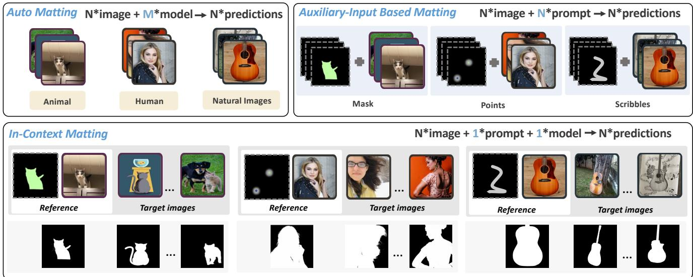  
Figure 1. In-Context Matting. This novel task setting for image matting enables automatic natural image matting of target images of a certain object category conditioned on a reference image of the same category, with user-provided priors such as masks and scribbles on the reference image only. Notice that, our approach exhibits remarkable cross-domain matting quality.

## Abstract

We introduce in-context matting, a novel task setting of image matting. Given a reference image of a certain foreground and guided priors such as points, scribbles, and masks, in-context matting enables automatic alpha estimation on a batch oftarget images ofthe sameforeground category, without additional auxiliary input. This setting marries goodperformance in auxiliary input-based matting and ease ofuse in automatic matting, whichfinds a good tradeoffbetween customization and automation. To overcome the key challenge of accurate foreground matching, we introduce IconMatting, an in-context matting model built upon a pre-trained text-to-image diffusion model. Conditioned on inter- and intra-similarity matching, IconMatting can

make full use of reference context to generate accurate target alpha mattes. To benchmark the task, we also introduce a novel testing dataset ICM-57, covering 57 groups of real-world images. Quantitative and qualitative results on the ICM-57 testing set show that IconMatting rivals the accuracy of trimap-based matting while retaining the automation level akin to automatic matting. Code is available at https://github.com/tiny-smart/incontext-matting.

## 1. Introduction

Image matting has been a long-standing problem in vision and graphics [3]. It typically requires estimating an accurate alpha matte by solving a so-called matting equation

$$
I = \alpha F + ( 1 - \alpha ) B ,\tag{1}
$$

where I is the 3-channel RGB image, F, B, and α are the 3-channel foreground, the 3-channel background, and the 1-channel alpha matte. The matting equation, however, is highly ill-posed, due to the need to infer 7 unknowns from 3 observations.

Prior art has come up with different ways to reduce uncertainties in matting such as using trimaps [7, 16, 18– 20, 32, 38], scribbles [39], or a even known background [17, 29]. These approaches are given the name auxiliary inputbased matting [14] in modern matting literature. Indeed, these matting models, particularly trimap-based ones, have achieved remarkable accuracy. They are in some way userunfriendly as an auxiliary input should be provided with each image in practice, which significantly harms matting efficiency and user experience. Recently another stream of work attempts to abandon any auxiliary input completely and forms a new paradigm called automatic matting [4, 9, 11, 12, 21, 31, 43]. Despite their inherent advantages, these automatic matting models are narrowed to specific object categories, such as humans [4, 9, 21, 31], animals [12], and salient objects [11, 43]. This can render poor generalization in natural scenes, infeasibility to tackle general object categories, and unawareness of foreground of interest.

Hence, there seems an obvious gap between accuracy and efficiency and between customization and automation. An interesting question is that: Can the auxiliary inputbased matting be optimized to enhance the efficiency, while also maintaining guidance for matting targets with sufficient automation, thereby harmonizing the two existing matting paradigms?

In this paper, we introduce in-context matting, a novel task setting of image matting, where a reference input can provide guidance for a batch of target images with similar foregrounds. The alpha mattes of the target batch are predicted by leveraging the contextual information from the reference input. Fig. 1 provides an example, where a cat marked in the reference image enables the extraction of cats from all target images, regardless of the background or domain. This novel task setting relieves users from providing auxiliary input for each image. Instead, by specifying the matting target only in a single reference image, the alpha mattes of the entire batch images could be predicted. Given the reference guidance, in-context matting can also gather sufficient contextual information, leading to higher accuracy and adaptability than fully automatic matting. This setting therefore combines the most notable features of automatic and auxiliary input-based matting, finding a good trade-off between them.

Technically, we confront a primary challenge inherent to in-context matting, i.e., how to leverage the reference input to accurately identify the corresponding target foreground. While SegGPT [35] has explored image segmentation with contextual information, its in-context coloring framework is not suitable for image matting. In this work, we approach this challenge as a problem of region-to-region matching. In particular, recent advances [22, 26, 30] in generative diffusion models have demonstrated emergent capabilities in discriminative tasks like segmentation [37] and correspondence [33]. Given that our region-to-region matching is an inherent aspect of correspondence, and noting the parallels between image segmentation and image matting, we explore the applicability of pretrained diffusion models for in-context matting.

We therefore introduce IconMatting, a model based on the pre-trained Stable Diffusion model [26], specialized for in-context matting. Given a reference image along with its corresponding foreground of interest as context, the target alpha matte could be inferred by exploiting the feature correspondence from Stable Diffusion such that the target foreground is matched conditioned on the correspondence. However, the matching is often sparse and insufficient to represent the entire target area. To address this, the intraimage similarity, based on the self-attention maps of Stable Diffusion, is additionally used to supplement the missing parts. By leveraging both inter- and intra-image similarities, informative guidance of the matting target would be acquired. Finally, any off-the-shelf matting heads can be used to predict the alpha matte.

Since the task setting is different from existing matting benchmarks, we introduce a new testing dataset named ICM-57 to offer a broad and thorough validation of incontext matting. This dataset encompasses 57 contextuallyaligned image groups; each comprising images in the real world and has either the same category or the same instance of different views, thereby encompassing a rich variety of in-context scenarios, which ensures a comprehensive test of a model to tackle various context.

Through extensive experiments on the ICM-57 and AIM-500 [10] datasets, we showcase the potential of incontext matting and IconMatting. The results indicate that IconMatting, while retaining the automation level akin to automatic matting, rivals the accuracy of trimap-based matting, underscoring the value of in-context matting as a promising direction for image matting.

Our contributions include:

• We introduce in-context matting, a novel task setting of image matting that takes advantages of both automatic and auxiliary input-based matting;

• IconMatting: an effective in-context matting model based on Stable Diffusion.

• ICM-57: a novel dataset and the evaluation framework for in-context matting.

## 2. Related Work

We review work related to image matting and in-context learning in vision.

Image Matting. Image matting approaches can be coarsely categorized into auxiliary input-based matting and automatic matting. Auxiliary input-based matting requires user input. The user input can be in the form of a trimap [7, 16, 18, 19, 32, 38], scribbles [39], a background image [17, 29], a coarse mask [23, 42], or even a text description [15]. Despite their effectiveness, they require significant manual effort to provide the auxiliary inputs. Automatic matting [4, 10, 12, 24, 43] predicts the alpha matte without any user intervention. They typically assume salient or certain foregrounds that are implicitly defined by the training dataset. The network structures used in automatic matting can be divided into two groups: one-stage network with global guidance [24] and parallel multi-task network [10, 31]. Some recent work has also introduced transformer structures into automatic matting [21]. While both auxiliary input-based and automatic matting have been studied comprehensively, a paradigm that combines the efficiency of automatic matting and the precision of auxiliary input-based matting has not yet been explored. We fill this gap with in-context matting.

In-Context Learning in Vision. In-context learning, initially a concept in natural language processing [5], is now made popular in computer vision. It allows models to fast adapt to a variety of tasks with minimal examples.

Bar et al. [2] first proposes an in-context learning framework using inpainting with discrete tokens on figures and infographics from vision articles, demonstrating applications in foreground segmentation, single object detection, and colorization. Painter [34] adopts masked image modeling to perform in-context learning with supervised datasets, achieving highly competitive results on seven diverse tasks. More recently, SegGPT [35], which segments everything in context by unifying different segmentation tasks into an incontext coloring framework. Prompt Diffusion [6] presents a diffusion-based generative framework to enable in-context learning across various tasks. Additionally, Flamingo [1], a family of visual language models, shows rapid adaptation to a variety of image and video tasks with few-shot learning capabilities. These models showcase the potential of in-context learning in addressing diverse vision tasks.

The concept of in-context learning, while being transformative in other areas, has not yet impacted the field of image matting. Although SegGPT achieves in-context image segmentation but is limited to coarse levels, lacking in semitransparency handling. Our IconMatting first introduces incontext learning into image matting, enhancing both the efficiency of auxiliary input-based matting and the precision of automatic matting.

<table><tr><td>Task setting</td><td>auto</td><td>auto with ref-input</td><td>real-world generalization</td><td>#ref-input</td></tr><tr><td>Aux</td><td>X</td><td>x</td><td>good</td><td>#images</td></tr><tr><td>Auto</td><td>√</td><td>=</td><td>poor</td><td>zero</td></tr><tr><td>In-context</td><td>x</td><td>√</td><td>good</td><td>one</td></tr></table>

Table 1. Comparison between in-context matting and two existing image matting paradigms. “Aux” and “Auto” are abbreviations for auxiliary input-based matting and automatic matting, respectively. In-context matting requires only a single reference input to achieve the automation of automatic matting and the generalizability of auxiliary input-based matting.

Our work is also related to image co-segmentation [27]. This task aims to segment common objects within a pair of contextual images. However, unlike in-context matting, where users can specify the matting target, co-segmentation operates without user input, predicting rough binary masks delineating common objects across image pairs.

## 3. In-Context Matting with Diffusion Models

We begin with the problem setup, then present our proposed in-context matting model, i.e., IconMatting.

## 3.1. Problem Setup

The objective of in-context matting is to extract the alpha mattes $\langle \alpha _ { i } \rangle ^ { N }$ of a specified foreground category from a collection of input images $\{ I _ { i } \} ^ { N }$ Through user interaction, the matting target is indicated by a reference image $I _ { r }$ and a corresponding binary region of interest (RoI) map $M _ { \tt R o I }$ . The RoI map can take the form of a mask, scribbles, or points as exemplified in Fig. 1. Notably, the reference image can either be a part of the input collection or an entirely separate image. When the input image collection has only a single image, users can treat that image as the reference image. In this case, in-context matting degenerates into image matting guided by user interaction.

Given $\{ I _ { i } \} ^ { N }$ and $( I _ { r } , M _ { \tt R o I } )$ , in-context matting is formulated as predicting the alpha matte $\{ \alpha _ { i } \} ^ { N }$ in $\{ \bar { I } _ { i } \} ^ { N }$ of the matting targets informed by $( I _ { r } , M _ { \tt R o I } )$ . In the context of in-context matting, when provided with a reference input, it becomes an automatic matting system targeted towards a specific foreground. The comparison between in-context matting and existing task settings for image matting is detailed in Table 1.

## 3.2. Overall Architecture

Here we first present the overall framework of IconMatting. As shown in Fig. 2, IconMatting is comprised of three components: a feature extractor, an in-context similarity module, and a matting head.

The feature extractor is responsible for obtaining the RoI features from the reference image, the features and selfattention maps from the target image. They are then fed into the in-context similarity module, the core of the framework. The module further consists of inter- and intra-similarity sub-modules: the former leverages the reference RoI features as an in-context query to derive a guidance map from the target features; the latter integrates the guidance map with multi-scale self-attention maps to obtain guidance for the matting head. Finally, the matting head uses this synthesized guiding information and the target features to generate the alpha matte of the target image.

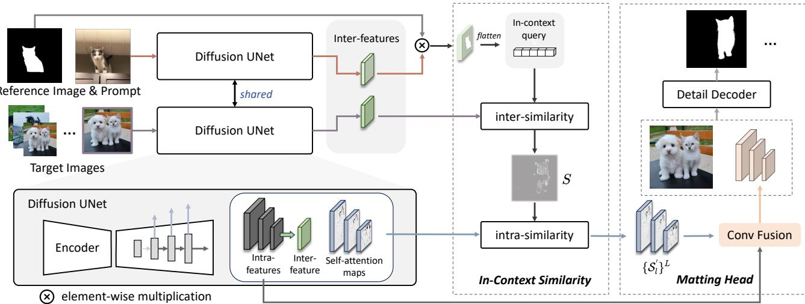  
Figure 2. IconMatting integrates a Stable Diffusion-derived feature extractor, an in-context similarity module, and a matting head. It processes a target image $I _ { t } ,$ a reference image $I _ { r } ,$ , and an RoI map $M _ { R o I }$ . Both reference and target image features and target self-attention maps are extracted and used. In-context similarity uses the in-context query from the reference image to create a guidance map, which, combined with self-attention maps, assists in locating the target object. The matting head finally generates the target alpha matte.

## 3.3. In-Context Feature Extractor

Backbone Selection. As outlined in Section 1, we conceptualize the core challenge of in-context matting – leveraging the reference context to accurately identify the target foreground – as a region-to-region matching problem. Therefore, if the features derived from a backbone naturally possess correspondence capabilities, referred to as incontext features, they would facilitate the implementation of in-context matting. Tang et al. [33] have found that the textto-image generative model, Stable Diffusion [26], trained on large-scale text-image paired datasets, exhibit emergenent capabilities for both geometric and semantic correspondence. It can perform point-to-point correspondence between images across instances, classes, and even domains with simple cosine similarity. Inspired by this observation, we leverage Stable Diffusion as a feature extractor to implement in-context matting.

Preliminary on Stable Diffusion. Recent advances in diffusion models, $e . g .$ , Stable Diffusion [26], have shown impressive results in both generative and discriminative tasks. Being a feature extractor, Stable Diffusion encodes an image $x _ { 0 }$ into a latent space, denoted by $z _ { \mathrm { 0 } } ,$ , which, through a noise process defined by $\left\{ \alpha _ { t } \right\} ^ { T }$ , transforms into $z _ { t } = \sqrt { \alpha _ { t } } z _ { 0 } + ( \sqrt { 1 - \alpha _ { t } } ) \varepsilon$ , where $\varepsilon \sim \mathcal { N } ( 0 , \mathbf { I } )$ is the randomly-sampled noise. The latent representation $z _ { t }$ undergoes forward propagation in a U-Net $f _ { \theta } ,$ generating multi-scale features $\{ \mathcal { F } _ { l } \} ^ { L }$ and self-attention maps $\{ \mathcal { A } _ { l } \} ^ { L }$ which can later be exploited for downstream tasks. Icon-Matting uses the capabilities of Stable Diffusion and both reference and target images to extract multi-scale features and self-attention maps to enhance feature representation.

## 3.4. In-Context Similarity

In-context similarity plays a key role in our model, because the quality of inferred alpha mattes highly depends on the output of this module. In particular, the in-context similarity module is designed to identify the potential target foreground taking the reference RoI into account, thereby guiding the prediction of the target alpha matte. According to our observations, both the reference-target similarity and target-target similarity matter for locating the potential target foreground. These correspond to the proposed intersimilarity and intra-similarity sub-modules.

Observation. The core challenge in in-context matting is a semantic correspondence problem. Given Stable Diffusion being the feature extractor, one can associate points of the foreground areas between the reference and target images using the emergent feature correspondence. However, due to the inherent reference-target foreground difference, a rigorous one-to-one mapping of all points between the two areas is unfeasible. There would always be some unmatched outliers, resulting in holes in the matting target area of the target image, as illustrated in Fig. 3.

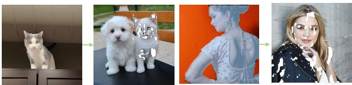  
(a) Outliers in point to point correspondence

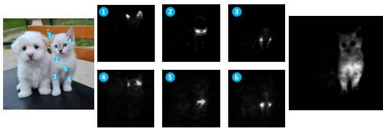  
(b) Self-attention of random points  
Figure 3. Observations on the inter- and intra similarities.

Since only a subset of points are matched, the goal is changed to how to expand these matched points to cover the entire target foreground area. To address this, we look for other points sharing similar semantic meaning with this subset of points. Intra-image similarity is therefore considered. Intuitively, the self-attention maps from Stable Diffusion reflect the similarities between different image patches. As shown in Fig. 3, by randomly sampling a small number of points from the target area and simply summing over the corresponding self-attention maps, the whole target foreground can be revealed. Based on this observation, we use the self-attention maps as intra-image information to supplement the inter-image matching results.

Inter-Similarity. Formally, given features $\{ \mathcal { F } _ { l } ^ { r } \} ^ { L }$ and $\{ \mathcal { F } _ { l } ^ { t } \} ^ { L }$ extracted from the reference image $I _ { r }$ and the target image $I _ { t } ,$ , respectively, the layer with the best correspondence capability is selected following DIFT [33], denoted by $\mathcal { F } _ { \mathrm { i n t e r } } ^ { r }$ for the reference and $\mathcal { F } _ { \mathrm { i n t e r } } ^ { t }$ for the target. Then, features corresponding to the RoI $M _ { \mathrm { R o I } }$ in $\mathcal { F } _ { \mathrm { i n t e r } } ^ { r }$ are extracted and formulated as the in-context query $\left\{ Q _ { k } \right\} ^ { K }$ where K is the length of the query. $Q _ { k }$ takes the form

$$
Q _ { k } = R \left( k \right) ,\tag{2}
$$

$$
R = \mathcal { F } _ { \mathrm { i n t e r } } ^ { r } \odot M _ { \mathtt { R o I } } ,\tag{3}
$$

where $\odot$ is the element-wise product and $R \left( k \right)$ denotes the k-th non-zero element of R. Further, $\left\{ Q _ { k } \right\} ^ { K }$ is used to compute similarity with $\mathcal { F } _ { \mathrm { i n t e r } } ^ { t } ,$ , identifying regions on $I _ { t }$ that correspond to the RoI of $I _ { r }$ , formulated as

$$
\mathcal { S } _ { k } = \mathsf { s o f t m a x } \big ( \frac { \boldsymbol { Q } _ { k } \cdot \boldsymbol { F } _ { \mathrm { i n t e r } } ^ { t } } { \sqrt { d } } \big ) .\tag{4}
$$

The similarity map is denoted by $\{ S _ { k } \} ^ { K }$ , and the mean of all such similarity maps yields $S$ , which measures the degree of similarity between different locations on $I _ { t }$ and the RoI in $I _ { r }$ , serving as the first intermediate output of incontext similarity.

Intra-Similarity. As noted in our observations (Fig. 3), S is typically sparse. Although the target matting region on $I _ { t }$ is partially covered by $S ,$ , it is insufficient to guide alpha prediction. Here we further design the intra-similarity sub-module to leverage the internal similarity within $I _ { t }$ to propagate $S$ into a more precise representation of the RoI on $I _ { t }$ . During feature extraction of $I _ { t } ,$ self-attention maps $\{ \mathcal { A } _ { l } \} ^ { L }$ representing its internal similarity are also retained, serving as the input for intra-similarity. This sub-module uses $S$ as a weight to the self-attention maps, thereby generating guiding information that accurately represents the matting target on $I _ { t } ,$ denoted by $\{ S _ { l } ^ { ' } \} ^ { L }$ . Mathematically, the intra-similarity matching is expressed by

$$
\mathcal { S } _ { l } ^ { ' } = \mathcal { A } _ { l } \odot \mathcal { S } .\tag{5}
$$

## 3.5. Matting Head

The success of ViTMatte [40] implies that the information of original image is important during decoding. Following this practice, in our matting head, the original image is concatenated and decoded with outputs from previous modules.

The guidance map from the in-context similarity module and the intra-features from the backbone are merged and refined using a convolutional feature fusion block, including a series of convolution, normalization, and activation layers. The output multi-scale in-context features are progressively merged using a series of fusion layers which comprise upsampling, concatenation, convolution, normalization, and activation layers. Then, following ViTMatte [40], details from the original image are extracted and combined with the merged feature in a detail decoder, enhancing the details of alpha matte. This matting head effectively melds contextual information with original image details, yielding the generation of a highly precise and refined alpha matte.

## 3.6. Reference-Prompt Extension

In addition to the mask prompts, points and scribbles can also be transformed into RoI masks. However, these prompts yield less comprehensive in-context queries compared with mask prompts. To enhance them, we propose an extension of reference prompt to enrich the in-context queries derived from point and scribble prompts.

Since the self-attention maps from the backbone reflect the similarities across regions, we leverage the attention maps of the reference images to expand the RoI mask. This is achieved by including regions in the attention maps that are similar to the prompt locations. Specifically, for each prompt point, the top m points with the highest responses in their corresponding attention maps are integrated into the RoI mask additionally, thus enriching the in-context query.

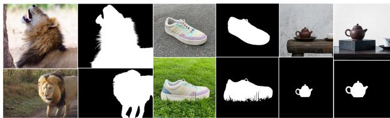  
Figure 4. ICM-57 examples. The dataset encompasses foreground subjects including human, animals, plants, and various common objects. It contains both instances from the same category and the same entity.

## 4. Results and Discussion

## 4.1. Datasets

To facilitate in-context matting, we establish a hybrid training set, along with a test set, ICM-57. The existing AIM-500 dataset was also reorganized to meet the testing requirements of in-context matting. In particular, in-context matting requires to organize images into groups where the annotated foregrounds share categories or instances. Such organization allows for random selection of reference and target images within groups during training. In the test set, one or more images in each group are designated as reference images.

Mixing In-Context Training Sets. We selected the RM-1K dataset [36]. However, such a dataset was insufficient for training. Therefore, a subset of the Open Images dataset [8], focusing on image segmentation, was also employed. The two formed a mixed training set tailored to in-context matting. Both datasets were reorganized.

For the RM-1K dataset, we divided it into 222 groups. A subset of 14, 000 images from the Open Images dataset were chosen as well. In the original dataset, each image came with one or more annotations for image segmentation; each corresponds to an object instance. We aggregated these annotations by category, ensuring that the annotations include all instances of the corresponding category. They subsequently formed context groups that met the requirements of in-context matting. As a result, a mixed training set of 15, 000 images and 450 groups was created.

ICM-57 Testing Set. To assess the performance of our model, we constructed the first testing dataset for incontext matting, named ICM-57, which comprises 57 image groups that form various real-world contexts. This dataset was created by using the instance-segmented dreambooth dataset [28], to which we supplemented high-precision alpha matte annotations. Additionally, we reviewed the existing AIM-500 dataset, selected a subset, and categorized these into groups according to their classes to supplement the in-category groups. Examples of the testing set are shown in Fig 4.

AIM-500. We also report performance on the AIM-500 dataset [10]. This enables us to compare our matting model with other public matting results on this dataset.

## 4.2. Implementation Details

Architecture. We employ the U-Net architecture from Stable Diffusion v2-1-v [26]. For feature extraction, the time step of the diffusion process is set to $t = 0$ by default, with an empty string used for conditional input. U-Net has 11 decoder blocks; we extract feature maps from the 5-th, 8-th, and 11-th blocks as the intra-features and ones from the 5-th block as the inter-features.

Training Details. We employ distinct loss functions for matting and segmentation, respectively. For matting, we use a combination of $\ell _ { 1 }$ loss, Laplacian loss, and Gradient loss. For segmentation, we only use the $\ell _ { 1 }$ loss. To leverage the segmentation dataset while reducing the impact of imprecise edge annotations, we adopt the approach from HIM [31] that only backpropagates the loss from the confident areas.

During training, the learning rate is set to 0.0004 and the batch size is 8. The input images are randomly cropped to a size of 768 × 768 pixels. To prevent deviation from the pretrained model space in modeling real images, no additional data augmentation is used. We train IconMatting for 20, 000 iterations using the AdamW optimizer.

Evaluation. We employ the four widely used matting metrics: SAD, MSE, Grad and Conn [25]. Lower values imply higher-quality mattes. In particular, MSE is scaled by a factor of $1 \times 1 0 ^ { - 3 }$

To reduce randomness, each method is tested for three rounds, where the metrics were averaged. For each group of images, the reference inputs were fixed and consistently used. This minimizes the variations in reference inputs, allowing for a more scientific and reliable assessment.

## 4.3. Main Results

Comparison with In-Context Segmentation Models. To explore the effectiveness and superiority of our model, we selected SegGPT [35] and SEEM [45], which also operates under in-context learning, as baselines in the image segmentation domain. From Table 2, on the ICM-57 and AIM-500 datasets, under the same experimental setup (one mask per group of images), our model significantly outperforms the baselines across all metrics.

It is important to note that due to their distinct task setting (i.e., segmentation rather than matting), the lack of high-quality annotations (e.g., alpha mattes) and the methods (i.e., mask classification rather than alpha matte regression), most of these models have overlooked pixel-level text-semantic alignment and are unable to produce finegrained masks, as illustrated in Fig. 5.

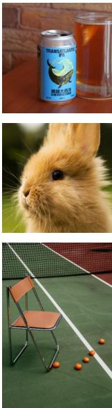  
Image

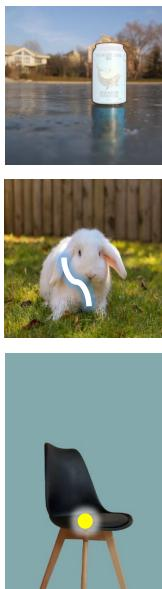  
Ref-input

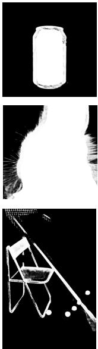  
AIM

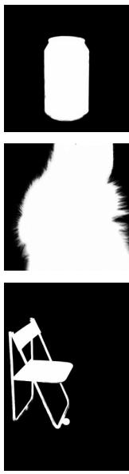  
MatAny

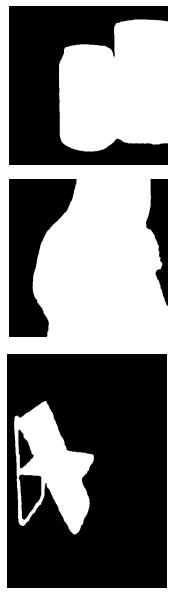  
SegGPT

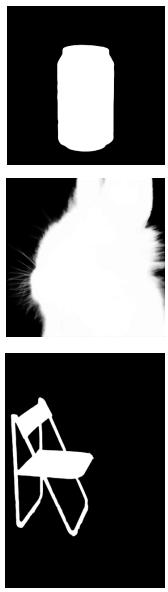  
ICMP

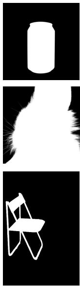  
Ours  
GT

Figure 5. Qualitative results of different image matting methods. Our method can predict the alpha matte of the matting target specified by the reference input, offering notable prediction accuracy while avoiding interference from unrelated foreground elements.
<table><tr><td rowspan="2">Method</td><td colspan="4">ICM-57</td><td colspan="3">AIM</td></tr><tr><td>MSE</td><td>SAD</td><td>GRAD</td><td>CONN</td><td>MSE SAD</td><td>GRAD</td><td></td><td>CONN</td></tr><tr><td>SegGPT</td><td>|0.0198</td><td>38.81</td><td>28.61</td><td>18.61</td><td>|0.0391</td><td>42.65</td><td>41.95</td><td>26.69</td></tr><tr><td>SEEM</td><td>0.0292</td><td>64.28</td><td>37.54</td><td>23.64</td><td>0.0425</td><td>114.23</td><td>74.51</td><td>74.32</td></tr><tr><td>Ours</td><td>0.0081</td><td>19.12</td><td>18.65</td><td>11.21</td><td>0.0062</td><td>18.65</td><td>15.51</td><td>10.98</td></tr></table>

Table 2. Comparison with in-context segmentation models.

Comparison with Automatic and Auxiliary Input-Based Matting Models. We further compare the performance of our IconMatting with both automatic and auxiliary input-based matting models on the ICM-57 and AIM-500 datasets. Automatic matting methods such as LF [44] and AIM [10] lack specific auxiliary information about the matting target, often produce poor alpha mattes, showing a significant performance gap compared with our model. MGM [42] and MGMiW [23] use a mask for each image as auxiliary input to specify the matting target. Although our method simplifies this by requiring only one mask per group of images, it still outperforms MGM in various metrics. Vit-Matte [40], a trimap-based image matting method, necessitates manually annotating a trimap for the foreground of each image, making it the performance upper bound for our in-context matting. Nevertheless, the performance of Icon-Matting is on par with VitMatte, underscoring its efficacy and competitiveness in image matting.

Comparison with Interactive Matting Models. Recently, with the advent of SAM, some researchers have designed interactive matting models, such as MatAny [41] and MAM [13], based on this generic image segmentation model. Inspired by this, we also designed an In-

Context Matting Pipeline (ICMP) with three stages: correspondence, segmentation, and matting, serving as one of the baselines. ICMP is a combination of existing models, with details available in supplementary materials.

For MatAny and MAM, we compare them under three types of interactions: points, scribbles, and masks. On the ICM-57 testing dataset, both baselines receive interaction information for each image within a group, whereas IconMatting only receive interaction information from one image in the group to indicate the matting target. Despite reducing the amount of human interaction, IconMatting achieves slightly better performance over the baselines.

Limited by the interaction modalities in ICMP, our model is only compared with it under the point interaction setting. Our end-to-end model outperforms the combined ICMP. In ICMP, the cues for the matting target degrade to points during the correspondence phase of the pipeline, often resulting in sparse information, making our end-to-end approach more effective.

## 4.4. Ablation Study

Different Modules. To validate different modules, we conducted ablation studies in Table 5. Among the four components, the presence or absence of inter- and intrasimilarity plays a crucial role in performance. Without intra-similarity, the performance of the model significantly worsens across all four metrics. If both inter- and intrasimilarity are absent, the model degenerates to directly predicting the alpha matte from the image, losing the information source for the specified matting target, and thus the performance markedly deteriorates.

<table><tr><td rowspan="2">Method</td><td rowspan="2">Guidance</td><td colspan="4">ICM-57</td><td colspan="4">AIM</td></tr><tr><td>MSE</td><td>SAD</td><td>GRAD</td><td>CONN</td><td>MSE</td><td>SAD</td><td>GRAD</td><td>CONN</td></tr><tr><td>MGM</td><td>1 mask per image</td><td>0.0341</td><td>84.25</td><td>61.84</td><td>30.21</td><td>0.0268</td><td>71.91</td><td>23.37</td><td>21.97</td></tr><tr><td>VitMatte</td><td>1 trimap per image</td><td>0.0030</td><td>16.16</td><td>14.28</td><td>11.14</td><td>0.0038</td><td>18.79</td><td>14.22</td><td>12.47</td></tr><tr><td>MGMiW</td><td>1 mask per image</td><td>一</td><td>一</td><td></td><td>一</td><td>0.0030</td><td>16.72</td><td>14.68</td><td>12.02</td></tr><tr><td>LF</td><td>auto</td><td>0.0811</td><td>205.68</td><td>69.53</td><td>195.63</td><td>0.0667</td><td>191.74</td><td>64.51</td><td>181.26</td></tr><tr><td>AIM</td><td>auto</td><td>0.0265</td><td>65.07</td><td>55.56</td><td>25.74</td><td>0.0183</td><td>48.09</td><td>47.58</td><td>21.74</td></tr><tr><td>Ours</td><td>1 mask per group of images</td><td>0.0081</td><td>19.12</td><td>18.65</td><td>11.21</td><td>0.0062</td><td>18.65</td><td>15.51</td><td>10.98</td></tr></table>

Table 3. Comparison with automatic and auxiliary input-based matting models.

<table><tr><td rowspan="2">Method</td><td rowspan="2">In-context</td><td colspan="2">Point</td><td colspan="2">Scribble</td><td colspan="2">Mask</td></tr><tr><td>MSE</td><td>SAD</td><td>MSE</td><td>SAD</td><td>MSE</td><td>SAD</td></tr><tr><td>MatAny</td><td>x</td><td>0.0651</td><td>129.67</td><td>0.0512</td><td>115.21</td><td>0.0412</td><td>95.26</td></tr><tr><td>MAM</td><td>x</td><td>0.0149</td><td>41.23</td><td>0.0141</td><td>40.23</td><td>0.0109</td><td>29.65</td></tr><tr><td>ICMP</td><td>√</td><td>0.0112</td><td>39.65</td><td></td><td></td><td></td><td></td></tr><tr><td>Ours*</td><td>x</td><td>0.0061</td><td>15.28</td><td>0.0059</td><td>15.97</td><td>0.0029</td><td>15.28</td></tr><tr><td>Ours</td><td>√</td><td>0.0124</td><td>23.21</td><td>0.0105</td><td>24.56</td><td>0.0081</td><td>19.12</td></tr></table>

Table 4. Comparison with interactive matting models. In the penultimate row, our method is provided with guidance information for every image, reducing to an auxiliary input-based method. Our method outperforms automatic methods and some of the auxiliary input-based methods, and its performance is comparable to that of the trimap-based method, VitMatte.

<table><tr><td>INTER</td><td>INTRA</td><td>MF</td><td>SD</td><td>MSE</td><td>SAD</td><td>GRAD</td><td>CONN</td></tr><tr><td>√</td><td>√</td><td>√</td><td>√</td><td>0.0081</td><td>19.12</td><td>18.65</td><td>11.21</td></tr><tr><td>√</td><td>x</td><td>√</td><td>√</td><td>0.0099</td><td>24.15</td><td>20.36</td><td>12.11</td></tr><tr><td>x</td><td>x</td><td>√</td><td>√</td><td>0.0315</td><td>40.32</td><td>31.56</td><td>19.53</td></tr><tr><td>√</td><td>√</td><td>x</td><td>√</td><td>0.0054</td><td>23.69</td><td>21.96</td><td>14.52</td></tr><tr><td>√</td><td>√</td><td>√</td><td>x</td><td>0.0071</td><td>18.56</td><td>19.54</td><td>12.61</td></tr></table>

Table 5. Ablation study on different modules. INTER, INTRA, MF, and SD respectively stand for inter-similarity, intra-similarity, multi-scale features, and segmentation dataset.

Number of Reference Inputs. Intuitively, the more reference inputs there are, the more likely the model is to identify the corresponding matting target. We explored the impact of the number of reference inputs on the performance of our model, as shown in Table. 6. On ICM-57 test set, the performance improves as the number of reference inputs increases; however, the improvement almost ceases when the number of reference inputs increases from 3 to 4. Therefore, we can conclude that appropriately increasing the number of reference inputs can enhance model performance, which is consistent with intuition.

## 4.5. Extension to Video Object Matting

The technique of in-context matting is easily extendable to video object matting. The key is to use a frame of the video as a reference. For example, an object is marked in the first frame of a video, which serves as a reference input and all frames of the video are treated as target images. With this setup, the model for in-context matting can predict the alpha matte for each frame of the video, visualized in Fig. 6.

<table><tr><td>#Reference</td><td>MSE</td><td>SAD</td><td>GRAD</td><td>CONN</td></tr><tr><td>1</td><td>0.0085</td><td>19.58</td><td>19.14</td><td>12.61</td></tr><tr><td>2</td><td>0.0075</td><td>16.57</td><td>18.52</td><td>11.15</td></tr><tr><td>3</td><td>0.0070</td><td>15.48</td><td>17.56</td><td>10.56</td></tr><tr><td>4</td><td>0.0068</td><td>15.23</td><td>17.02</td><td>10.28</td></tr></table>

Table 6. Ablation study on the number of reference inputs.

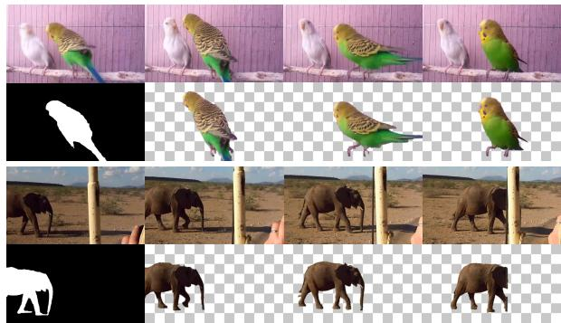  
Figure 6. Extension to video object matting.

## 5. Conclusion

In this work, we introduce ‘in-context matting’, which enables automatic matting of foreground of interest on target images given a reference image and its prompt. We introduce IconMatting as a preliminary solution. Extensive experiments have shown its efficacy and robustness across categories and scenes. Being the first work introducing this task, we believe it opens new possibilities for efficient and accurate image matting while reducing user effort, also enhancing the versatility of image matting techniques.

Acknowledgement. This work is supported by the National Natural Science Foundation of China under Grant No. 62106080.

## References

[1] Jean-Baptiste Alayrac, Jeff Donahue, Pauline Luc, Antoine Miech, Iain Barr, Yana Hasson, Karel Lenc, Arthur Mensch, Katherine Millican, Malcolm Reynolds, et al. Flamingo: a visual language model for few-shot learning. Advances in Neural Information Processing Systems, 35:23716–23736, 2022. 3

[2] Amir Bar, Yossi Gandelsman, Trevor Darrell, Amir Globerson, and Alexei Efros. Visual prompting via image inpainting. Advances in Neural Information Processing Systems, 35:25005–25017, 2022. 3

[3] Jagruti Boda and Dhatri Pandya. A survey on image matting techniques. In 2018 International Conference on Communication and Signal Processing (ICCSP), pages 0765–0770. IEEE, 2018. 1

[4] Quan Chen, Tiezheng Ge, Yanyu Xu, Zhiqiang Zhang, Xinxin Yang, and Kun Gai. Semantic human matting. In ACM MM, pages 618–626, 2018. 2, 3

[5] Qingxiu Dong, Lei Li, Damai Dai, Ce Zheng, Zhiyong Wu, Baobao Chang, Xu Sun, Jingjing Xu, and Zhifang Sui. A survey for in-context learning. arXiv preprint arXiv:2301.00234, 2022. 3

[6] Rui Gong, Martin Danelljan, Han Sun, Julio Delgado Mangas, and Luc Van Gool. Prompting diffusion representations for cross-domain semantic segmentation. arXiv preprint arXiv:2307.02138, 2023. 3

[7] Qiqi Hou and Feng Liu. Context-aware image matting for simultaneous foreground and alpha estimation. In ICCV, pages 4130–4139, 2019. 2, 3

[8] Alina Kuznetsova, Hassan Rom, Neil Alldrin, Jasper Uijlings, Ivan Krasin, Jordi Pont-Tuset, Shahab Kamali, Stefan Popov, Matteo Malloci, Alexander Kolesnikov, et al. The open images dataset v4: Unified image classification, object detection, and visual relationship detection at scale. International Journal ofComputer Vision, 128(7):1956–1981, 2020. 6

[9] Jizhizi Li, Sihan Ma, Jing Zhang, and Dacheng Tao. Privacypreserving portrait matting. In ACM MM, pages 3501–3509, 2021. 2

[10] Jizhizi Li, Jing Zhang, and Dacheng Tao. Deep Automatic Natural Image Matting. In IJCAI, pages 800–806, 2021. 2, 3, 6, 7

[11] Jizhizi Li, Jing Zhang, and Dacheng Tao. Deep automatic natural image matting. arXiv preprint arXiv:2107.07235, 2021. 2

[12] Jizhizi Li, Jing Zhang, Stephen J Maybank, and Dacheng Tao. Bridging composite and real: towards end-to-end deep image matting. IJCV, 130(2):246–266, 2022. 2, 3

[13] Jiachen Li, Jitesh Jain, and Humphrey Shi. Matting anything. arXiv preprint arXiv:2306.05399, 2023. 7

[14] Jizhizi Li, Jing Zhang, and Dacheng Tao. Deep image matting: A comprehensive survey. arXiv preprint arXiv:2304.04672, 2023. 2

[15] Jizhizi Li, Jing Zhang, and Dacheng Tao. Referring image matting. In CVPR, pages 22448–22457, 2023. 3

[16] Yaoyi Li and Hongtao Lu. Natural image matting via guided contextual attention. In AAAI, pages 11450–11457, 2020. 2, 3

[17] Shanchuan Lin, Andrey Ryabtsev, Soumyadip Sengupta, Brian L Curless, Steven M Seitz, and Ira Kemelmacher-Shlizerman. Real-time high-resolution background matting. In CVPR, pages 8762–8771, 2021. 2, 3

[18] Qinglin Liu, Haozhe Xie, Shengping Zhang, Bineng Zhong, and Rongrong Ji. Long-range feature propagating for natural image matting. In ACM MM, pages 526–534, 2021. 2, 3

[19] Yuhao Liu, Jiake Xie, Xiao Shi, Yu Qiao, Yujie Huang, Yong Tang, and Xin Yang. Tripartite information mining and integration for image matting. In ICCV, pages 7555–7564, 2021. 3

[20] Hao Lu, Yutong Dai, Chunhua Shen, and Songcen Xu. Indices matter: Learning to index for deep image matting. In ICCV, pages 3265–3274, 2019. 2

[21] Sihan Ma, Jizhizi Li, Jing Zhang, He Zhang, and Dacheng Tao. Rethinking portrait matting with privacy preserving. International journal of computer vision, pages 1–26, 2023. 2, 3

[22] Alex Nichol, Prafulla Dhariwal, Aditya Ramesh, Pranav Shyam, Pamela Mishkin, Bob McGrew, Ilya Sutskever, and Mark Chen. Glide: Towards photorealistic image generation and editing with text-guided diffusion models. arXiv preprint arXiv:2112.10741, 2021. 2

[23] Kwanyong Park, Sanghyun Woo, Seoung Wug Oh, In So Kweon, and Joon-Young Lee. Mask-guided matting in the wild. In CVPR, pages 1992–2001, 2023. 3, 7

[24] Yu Qiao, Yuhao Liu, Xin Yang, Dongsheng Zhou, Mingliang Xu, Qiang Zhang, and Xiaopeng Wei. Attention-guided hierarchical structure aggregation for image matting. In CVPR, pages 13676–13685, 2020. 3

[25] Christoph Rhemann, Carsten Rother, Jue Wang, Margrit Gelautz, Pushmeet Kohli, and Pamela Rott. A perceptually motivated online benchmark for image matting. In CVPR, pages 1826–1833, 2009. 6

[26] Robin Rombach, Andreas Blattmann, Dominik Lorenz, Patrick Esser, and Bjorn Ommer. High-resolution image¨ synthesis with latent diffusion models. In Proceedings of the IEEE/CVF Conference on Computer Vision and Pattern Recognition, pages 10684–10695, 2022. 2, 4, 6

[27] Carsten Rother, Tom Minka, Andrew Blake, and Vladimir Kolmogorov. Cosegmentation of image pairs by histogram matching-incorporating a global constraint into mrfs. In 2006 IEEE Computer Society Conference on Computer Vision and Pattern Recognition (CVPR’06), pages 993–1000. IEEE, 2006. 3

[28] Nataniel Ruiz, Yuanzhen Li, Varun Jampani, Yael Pritch, Michael Rubinstein, and Kfir Aberman. Dreambooth: Fine tuning text-to-image diffusion models for subject-driven generation. arXiv preprint arXiv:2208.12242, 2022. 6

[29] Soumyadip Sengupta, Vivek Jayaram, Brian Curless, Steven M Seitz, and Ira Kemelmacher-Shlizerman. Background matting: The world is your green screen. In CVPR, pages 2291–2300, 2020. 2, 3

[30] Yang Song and Stefano Ermon. Generative modeling by estimating gradients of the data distribution. Advances in Neural Information Processing Systems, 32, 2019. 2

[31] Yanan Sun, Chi-Keung Tang, and Yu-Wing Tai. Human instance matting via mutual guidance and multi-instance refinement. In Proceedings of the IEEE/CVF Conference on Computer Vision and Pattern Recognition, pages 2647– 2656, 2022. 2, 3, 6

[32] Jingwei Tang, Yagiz Aksoy, Cengiz Oztireli, Markus Gross, and Tunc Ozan Aydin. Learning-Based Sampling for Natural Image Matting. In CVPR, pages 3050–3058, 2019. 2, 3

[33] Luming Tang, Menglin Jia, Qianqian Wang, Cheng Perng Phoo, and Bharath Hariharan. Emergent correspondence from image diffusion. arXiv preprint arXiv:2306.03881, 2023. 2, 4, 5

[34] Xinlong Wang, Wen Wang, Yue Cao, Chunhua Shen, and Tiejun Huang. Images speak in images: A generalist painter for in-context visual learning. In Proceedings of the IEEE/CVF Conference on Computer Vision and Pattern Recognition, pages 6830–6839, 2023. 3

[35] Xinlong Wang, Xiaosong Zhang, Yue Cao, Wen Wang, Chunhua Shen, and Tiejun Huang. Seggpt: Towards segmenting everything in context. In Proceedings of the IEEE/CVF International Conference on Computer Vision, pages 1130–1140, 2023. 2, 3, 6

[36] Yanfeng Wang, Lv Tang, Yijie Zhong, and Bo Li. From composited to real-world: Transformer-based natural image matting. IEEE Transactions on Circuits and Systems for Video Technology, pages 1–1, 2023. 6

[37] Jiarui Xu, Sifei Liu, Arash Vahdat, Wonmin Byeon, Xiaolong Wang, and Shalini De Mello. Open-vocabulary panoptic segmentation with text-to-image diffusion models. In Proceedings of the IEEE/CVF Conference on Computer Vision and Pattern Recognition, pages 2955–2966, 2023. 2

[38] Ning Xu, Brian Price, Scott Cohen, and Thomas Huang. Deep Image Matting. In CVPR, pages 311–320, 2017. 2, 3

[39] Stephen DH Yang, Bin Wang, Weijia Li, YiQi Lin, and Conghui He. Unified interactive image matting. arXiv preprint arXiv:2205.08324, 2022. 2, 3

[40] Jingfeng Yao, Xinggang Wang, Shusheng Yang, and Baoyuan Wang. Vitmatte: Boosting image matting with pretrained plain vision transformers. Information Fusion, page 102091, 2023. 5, 7

[41] Jingfeng Yao, Xinggang Wang, Lang Ye, and Wenyu Liu. Matte anything: Interactive natural image matting with segment anything models. arXiv preprint arXiv:2306.04121, 2023. 7

[42] Qihang Yu, Jianming Zhang, He Zhang, Yilin Wang, Zhe Lin, Ning Xu, Yutong Bai, and Alan Yuille. Mask guided matting via progressive refinement network. In CVPR, pages 1154–1163, 2021. 3, 7

[43] Yunke Zhang, Lixue Gong, Lubin Fan, Peiran Ren, Qixing Huang, Hujun Bao, and Weiwei Xu. A late fusion cnn for digital matting. In CVPR, pages 7469–7478, 2019. 2, 3

[44] Yunke Zhang, Lixue Gong, Lubin Fan, Peiran Ren, Qixing Huang, Hujun Bao, and Weiwei Xu. A late fusion cnn for

digital matting. In Proceedings ofthe IEEE/CVF conference on computer vision and pattern recognition, pages 7469– 7478, 2019. 7

[45] Xueyan Zou, Jianwei Yang, Hao Zhang, Feng Li, Linjie Li, Jianfeng Gao, and Yong Jae Lee. Segment everything everywhere all at once. arXiv preprint arXiv:2304.06718, 2023. 6