SingleImageInput

# In-N-Out: Faithful 3D GAN Inversion with Volumetric Decomposition for Face Editing

Yiran Xu 1

Zhixin Shu2

Cameron Smith2

Seoung Wug Oh2

Jia-Bin Huang1

1University of Maryland, College Park, 2Adobe Research

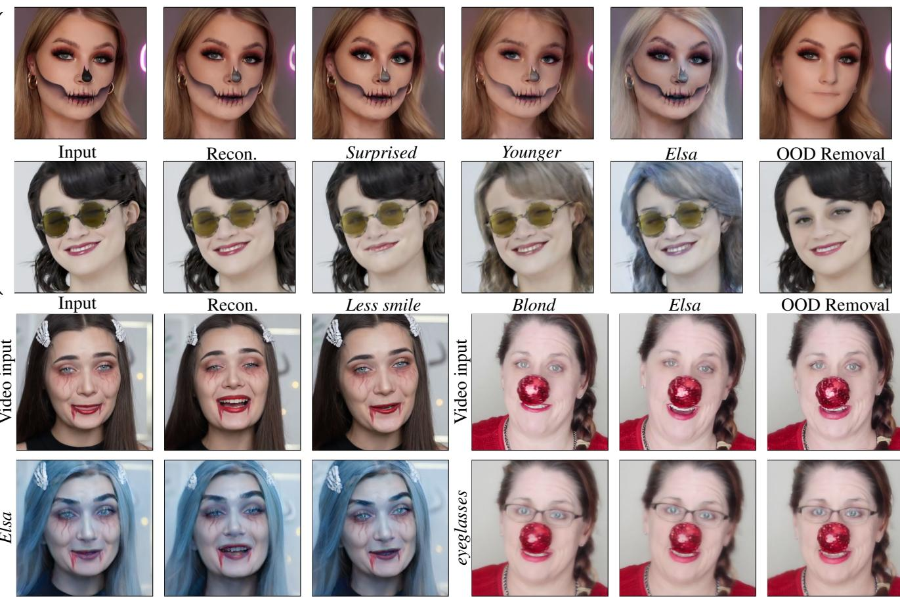

Figure 1. Semantic editing for out-of-distribution data. We present a method for reconstructing and editing an out-of-distribution (OOD) image or video using a pre-trained 3D-aware generative model (EG3D [10]). Our method explicitly models and reconstructs the occluders in 3D, allowing faithful reconstruction of the input while preserving the semantic editing capability. Here we showcase the reconstruction and editing results “Less smile”, “Younger”, “Blond” [47], “Elsa”, “Surprised” [41]. Our method can also remove the OOD part. Data are from the Internet (Creative Commons).

## Abstract

3D-aware GANs offer new capabilities for view synthesis while preserving the editing functionalities of their 2D counterparts. GAN inversion is a crucial step that seeks the latent code to reconstruct input images or videos, subsequently enabling diverse editing tasks through manipulation of this latent code. However, a model pre-trained on a particular dataset (e.g., FFHQ) often has difficulty reconstructing images with out-of-distribution (OOD) objects such asfaces with heavy make-up or occluding objects. We address this issue by explicitly modeling OOD objectsfrom the input in 3D-aware GANs. Our core idea is to represent the image using two individual neural radiance fields: onefor the in-distribution content and the otherfor the outof-distribution object. The final reconstruction is achieved by optimizing the composition of these two radiance fields with carefully designed regularization. We demonstrate that our explicit decomposition alleviates the inherent trade-off between reconstruction fidelity and editability. We evaluate reconstruction accuracy and editability of our method on challenging real face images and videos and showcase favorable results against other baselines. More results can found at https://in-n-out-3d.github.io/.

## 1. Introduction

GAN inversion [3, 44, 55, 61, 70] is a set of techniques that project an input image onto the latent space of a pretrained GAN to obtain a latent code so that the image generator can reconstruct the input. This is particularly useful as one could perform various creative semantic editing tasks [18, 24, 41, 47] for images. Similar techniques have also been applied in the video domain, with which recent methods also achieved temporally consistent editing [57, 63]. However, the majority of these methods are effective primarily with 2D GANs, and they fall short in offering explicit 3D controllability, such as view synthesis capabilities. With the rapid recent advancements in 3D reconstruction, especially in neural radiance fields (NeRFs) [6, 11, 36, 37], high-quality 3D-aware GANs [10, 22, 40, 49] have emerged as a powerful tool for learning 3D generation from 2D images. 3D-aware GANs, equipped with a 3D representations like NeRFs [10, 22] or SDF [40], offer explicit control over camera views and ensure 3D geometric consistency in generation. Additionally, they retain the generative capacity and editability of 2D GANs [26–29]. This enables applications such as novel view synthesis, semantic image editing [31, 48, 51, 62, 66, 67] and video editing [17, 56].

Core challenges. While state-of-the-art 3D GAN inversion methods achieve remarkable advances in both image and video editing for human faces, they face challenges when dealing with images including out-of-distribution (OOD) objects (e.g., heavy make-ups or occlusions). This limitation arises primarily because these models are pre-trained only on natural faces without complex textures or substantial occlusions. As a result, the editability performance deteriorates when a pre-trained GAN is forced to model OOD objects in the GAN inversion process. This is commonly known as the reconstruction-editability trade-off [55]. Existing GAN inversion methods assume that a single latent code corresponding to the input image can be found in the latent space [50, 61] through optimization once the model is trained. Therefore, they aim to reconstruct the indistribution (InD) content (e.g., natural face) and the OOD objects together. However, OOD components often cannot be well modeled in a pre-trained GAN, and consequently cannot be well represented with it using a single latent code, existing methods either cannot reconstruct them faithfully [51] or can reconstruct them (e.g., through fine-tuning the generator) but alters the latent space properties and deteriorates the editability [45] (Figure 2).

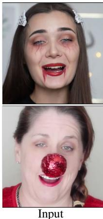

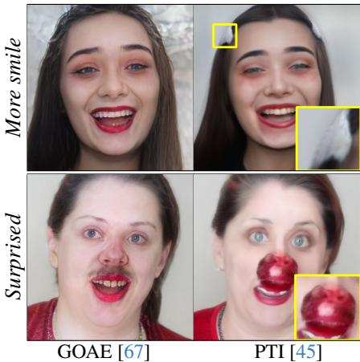  
Figure 2. Limitations of the previous methods. Existing GAN inversion techniques cannot deal with frames with OOD elements, resulting in a poor reconstruction-editing balance. GOAE [67] can produce faithful editing, but fails to preserve the identity of the input face. PTI [45] provides higher reconstruction fieldity, but the edibility suffers.

Our work. We propose a new approach to address this issue by drawing inspiration from recent composite volume rendering works that compose multiple radiance fields during rendering [19, 34, 59, 64]. Our core idea is to decompose the 3D representation of an image with OOD components into an in-distribution (InD) part and an out-ofdistribution part, and compose them together to reconstruct the image in a composite volumetric rendering manner. We use EG3D [10] as our 3D-aware GAN backbone and leverage its tri-plane representation to model this composed rendering pipeline. For the InD component (i.e. natural face), we project pixel values onto EG3D’s W+ space for an InD component reconstruction. We further introduce an additional tri-plane to represent the OOD content. After that, we combine these two radiance fields in a composite volumetric rendering to reconstruct the input frames. During the editing stage, we perform the latent code based editing solely on the InD part and leave the OOD component unaltered. This framework would allow the applications of any StyleGAN-based editing approache [41, 47] on the InD component such as changing facial expression, which is often desirable for user experiences. The advantages of our work are three-fold: a) we achieve a higher-fidelity reconstruction by composition of InD and OOD components; b) we retain the editability of pre-trained GANs by editing only the InD content; and c) by leveraging 3D-aware GANs, we can render the face from novel viewpoints.

We evaluate our method on challenging in-the-wild face images and videos (Creative Commons), demonstrating improvement over previous state-of-the-art GAN inversion work on both reconstruction and editing quality. In addition, we demonstrate the usefulness of our method with

3D-aware editing applications, including semantic editing, novel view synthesis, and OOD object removal.

We will release the code and data used in the paper.

Our contributions. In summary, our contributions are:

• We propose a 3D-aware GAN inversion approach to manipulate single images or monocular videos with out-ofdistribution objects (e.g., accessories and heavy makeup). See results in Figure 1.

• We incorporate composite volume rendering into 3Daware GAN inversion.

• Our method reconstructs 3D shapes of faces with OOD objects faithfully and demonstrates novel 3D-aware applications.

## 2. Related Work

3D-aware GANs. StyleGANs [26–29] have achieved high-quality photorealistic 2D image generation and have been successfully applied to various image editing applications [18, 24, 41, 47]. Significant progresses have also been made to lift 2D image generation to 3D space, using various 3D representations, for both higher quality generation and to enable 3D-aware applications such as view synthesis [9, 10, 16, 20, 22, 38, 40, 46, 49, 51]. These methods usually take a two-stage pipeline that renders a raw image (usually also with feature maps) in low resolution and then upsamples the rendered image to high resolution. We leverage EG3D [10] as our generator architecture in this work.

GAN inversion and editing. GAN inversion has been widely studied for 2D GANs. These techniques can largely be categorized as (a) encoder-based methods [4, 8, 33, 39, 44, 44, 54, 55, 55, 58] in which a neural network encoder is trained to project an input image to the latent space of the generator; (b) optimization-based methods [1, 2, 12, 13, 21, 25, 42, 53] where the latent code is recovered via optimizing loss functions between the generator output and a target image; and (c) hybrid methods [5, 7, 45, 71] which combine both approaches. Some recent works have also investigated 3D-aware GAN inversion from a single image [31, 32, 51, 56, 62, 66, 67] or a video [17, 68]. As our experiments demonstrate, previous approaches have difficulty handling these challenging cases. We propose a new mechanism to allow high-quality 3D-aware GAN inversion of out-of-distribution faces even under significant occlusion. With our GAN inversion, we can modify the latent code to perform high-quality semantic image editing [18, 24, 41, 47] or video editing [57, 63, 65].

GAN inversion for out-of-distribution (OOD) data. There have been attempts to invert out-of-distribution data to the GAN’s latent space. Early work [1] proposes to project an image onto extended ${ \dot { \mathcal { W } } } ^ { + }$ space to achieve more accurate reconstruction. PTI [45] finetunes generator with regularization for a lower distortion error. StyleSpace [60] proposes to invert an image using StyleGAN’s internal feature maps and tRGB blocks, which shows better reconstruction and disentanglement. Recently, ChunkyGAN [50] proposes to compose multiple generated images from multiple latent codes, with a set of segmentation masks to reconstruct an input image. With a similar goal in mind, we propose to leverage the radiance field of EG3D [10] and decompose the volumetric representation into an in-distribution part and an out-of-distribution part. In contrast to ChunkyGAN [50] that models an image as a collection of 2D segments, we model the OOD and face directly in volumetric 3D representation and merge them with composite rendering.

Composite neural radiance fields. Neural Radiance Fields (NeRFs) [36] have shown impressive view synthesis results. Recently, it has been shown that 3D scenes can be decomposed into different NeRFs. When multiple radiance fields are built, one can compose them together using a composite rendering manner [19, 34, 59, 64]. EG3D [10] uses the tri-plane representation to generate 3D objects from the latent code. We adopt the idea of composite volume rendering to address the out-of-distribution 3D GAN inversion problem. Specifically, we split the in-distribution and outof-distribution parts in the tri-plane 3D representation and compose them during volume rendering.

## 3. 3D-aware GAN: EG3D

We choose EG3D [10], which consists of a tri-plane representation and a super-resolution (SR) module, as our 3Daware GAN.

Neural rendering at low resolution. Given a latent code $z ~ \in ~ \mathbb { R } ^ { 5 1 2 }$ (or $w ~ \in ~ \mathbb { R } ^ { 1 4 \times 5 1 2 } )$ and camera parameters $p ,$ EG3D first generates a corresponding tri-plane $\mathbf { T \in }$ $\mathbb { R } ^ { 2 5 \hat { 6 } \times 2 5 6 \times 3 2 \times 3 }$ . For each pixel, a ray r is cast, and points are sampled along the ray. Unlike the positional encoding [34, 52] for each point in NeRFs [34], EG3D projects each point onto tri-plane T and retrieves features from three planes via bilinear interpolation. These features are then aggregated by summation, and fed into the decoder D (i.e. an MLP) to predict the color and density. Volume rendering [35] is then performed to compute the final color for each pixel. To this end, a raw RGB image with a 32-channel feature in a low resolution (e.g. 128 × 128) is generated.

Super-Resolution (SR). To gain high-resolution outputs, EG3D later uses an SR module that inputs the raw image and the 32-channel feature as the input and yields a highresolution RGB image (e.g. 512 × 512). We build our approach upon EG3D due to its rendering efficiency compared to other alternatives [22, 40].

## 4. Method

Given an aligned face input image I, or a monocular face video $\mathbf { V } = [ \mathbf { I } _ { 1 } , \cdot \cdot \cdot , \mathbf { I } _ { t } , \cdot \cdot \cdot , \mathbf { I } _ { N } ]$ with N frames, we aim to reconstruct the input with EG3D inversion and perform face editing. For simplicity, we use $\mathbf { I } _ { t }$ to represent a frame, either from a single input image or a sampled frame from a video. If only one frame exists, then $N = 1$

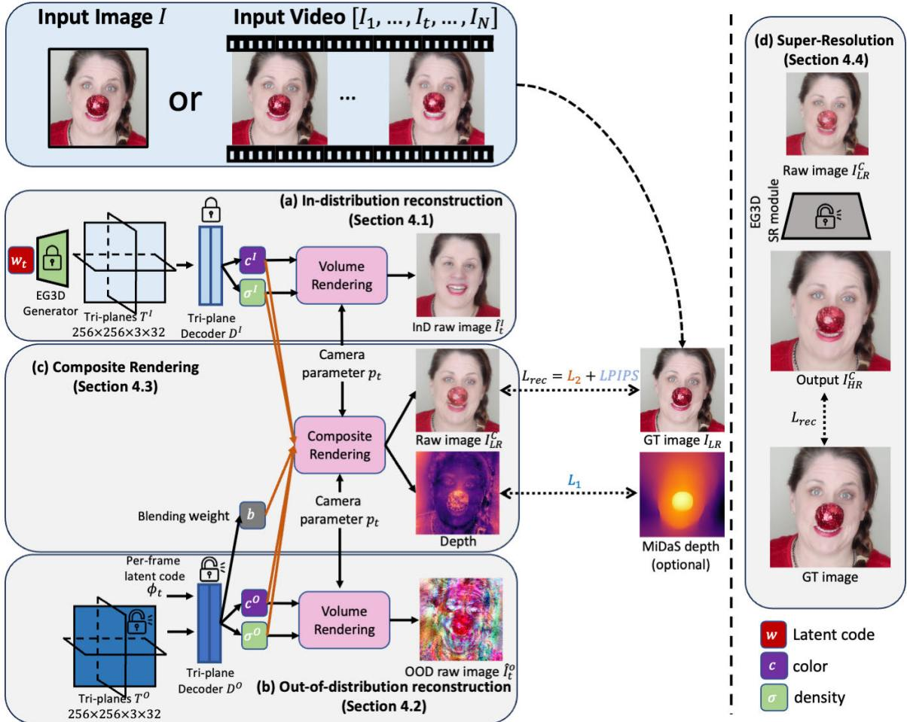  
Figure 3. Overview of our method. Given a potrait image or a monocular portrait video, we use two radiance fields to represent (a) in-distribution (InD) face, and (b) out-of-distribution (OOD) item. (a) InD reconstruction is the GAN inversion for the in-distribution natural face. We apply GAN inversion by using pre-trained EG3D model G to the frame, where the pre-trained tri-plane generator and tri-plane decoder $D ^ { I }$ are kept frozen. (b) For OOD item, we propose to model them with a separate radiance field represented by an additional tri-plane $\mathbf { T } ^ { O }$ . During the training process, we optimize the tri-plane $\mathbf { T } ^ { O }$ , a per-frame latent code $\phi _ { t }$ , and a new decoder $D ^ { O }$ The decoder takes as input tri-plane features $\mathbf { \hat { T } } ^ { O }$ and $\phi _ { t }$ and outputs color $\mathbf { c } ^ { O }$ , density $\sigma ^ { O }$ , and blending weight b. (c) Composite Rendering compose the InD and OOD radiance fields together by using a composite rendering scheme (Section 4.3). (d) Finally, we finetune the Super-Resolution module in $G$ to achieve a better output in the high resolution. After training, we can perform various semantic edits and free-view rendering, while preserving the face identity and the OOD components.

We present the high-level overview in Figure 3. We build two neural radiance fields (NeRFs) [36], one for indistribution (InD) face (Section 4.1), and the other one for out-of-distribution (OOD) object (Section 4.2), using triplane representations [10]. The OOD object, for example, can be a non-face object with a rigid shape or heavy makeup with a complicated texture. Next, we combine two radiance fields (Section 4.3) to reconstruct the low-resolution frame. Finally, we finetune the super-resolution module of EG3D to get the high-resolution output (Section 4.5). After training the radiance fields, we can edit the face image or video

(Section 4.6).

## 4.1. In-distribution GAN inversion

Formulation. Since a pretrained EG3D already has prior knowledge of faces, we directly leverage its latent space and perform a regular 3D GAN inversion [32, 61] for the indistribution part. For a single frame case, we optimize a latent code $w _ { t }$ such that it can reconstruct the input frame $\mathbf { I } _ { t }$ . For a video, we invert all the frames at the same time. Please refer to the supplementary material for more details. For camera parameters $\boldsymbol { p } _ { t } \in \mathbb { R } ^ { 2 5 }$ , we obtain them by using an off-the-shelf pose detector [15], following [10, 32].

Optimization. To represent the InD faces with $\mathbf { T } ^ { I }$ , our insight is to keep the latent code $w _ { t }$ in distribution as much as possible. To this end, we use a regularization term to keep $w _ { t }$ within its pre-trained distribution through GAN training.

$$
\mathcal { L } _ { w } ( w _ { t } ) = | | w _ { t } - \bar { w } | | _ { 2 } ^ { 2 } ,\tag{1}
$$

where w¯ is the mean latent code computed over 10,000 sampled latent codes.

We also use a another regularization term adopted from [55] to constrain the variation among style vectors in w: $\begin{array} { r } { \mathcal { L } _ { \Delta } ( w _ { t } ) = \sum _ { i = 1 } ^ { 1 3 } | | \Delta _ { i } | | _ { 2 } ^ { 2 } } \end{array}$ , given a latent code $w =$ $( w _ { 0 } , w _ { 0 } + \Delta _ { 1 } , . . . , \overline { { w _ { 0 } } } + \Delta _ { 1 3 } ) \in \mathbb { R } ^ { 1 4 \times 5 1 2 }$ . This regularization term preserves the editability of the optimized latent code [55].

## 4.2. Modeling out-of-distribution contents

For an OOD object, a pre-trained EG3D usually cannot model it well with its prior distribution. We therefore use an additional tri-plane $\bar { \mathbf { T } ^ { O } }$ to represent the out-of-distribution content. One additional challenge is that, while dealing with video, the OOD object may not be static across different frames, therefore could not be well reconstructed with a static radiance field. Therefore, in addition to $\mathbf { T } ^ { O }$ , we use a per-frame latent code $\phi _ { t } ~ \in \mathbb { R } ^ { 3 2 }$ for each frame to represent the out-of-distribution object across the temporal domain. Both $\mathbf { T } ^ { O }$ and $\phi _ { t }$ are randomly initialized from a normal distribution.

Formulation. The out-of-distribution decoder $D ^ { O }$ takes a tuple $( \mathbf { T } ^ { O } ( t _ { k } ) , \phi _ { t } ) \in \mathbb { R } ^ { 6 4 }$ as the input, and outputs color $\mathbf { c } ^ { O } \in \mathbb { R } ^ { 3 }$ , density $\sigma ^ { O } \in \mathbb { R }$ , and blending weight $b \in [ 0 , 1 ]$

$$
( \mathbf { c } ^ { O } , \sigma ^ { O } , b ) = D ^ { O } ( \mathbf { T } ^ { O } ( t _ { k } ) , \phi _ { t } ; \theta _ { D ^ { O } } ) ,\tag{2}
$$

where $\mathbf { T } ^ { O } ( t _ { k } ) \in \mathbb { R } ^ { 3 2 }$ is the aggregated features obtained by projecting 3D coordinate $t _ { k }$ onto each of the three feature planes via bilinear interpolation, then aggregated via summation [10]. The decoder $D ^ { O }$ is an MLP with weights of $\theta _ { D } o$ . To compute the color of a pixel at time t, we use the volume rendering integral along the ray r:

$$
\mathbf { C } ^ { O } ( \mathbf { r } ) = \sum _ { k = 1 } ^ { K } T ( t _ { k } ) \alpha ^ { O } ( \sigma ^ { O } ( t _ { k } ) \delta _ { k } ) \mathbf { c } ^ { O } ( t _ { k } ) ,\tag{3}
$$

where $\begin{array} { r } { T ( t _ { k } ) = \exp ( - \sum _ { k ^ { \prime } = 1 } ^ { k - 1 } \sigma ( t _ { k ^ { \prime } } ) \delta _ { k ^ { \prime } } ) , \alpha = 1 - } \end{array}$ $\exp ( - x )$ , and $\delta _ { k } = t _ { k + 1 } - t _ { k }$ is the distance between two 3D points.

## 4.3. Composite volume rendering

Now, with both InD and OOD radiance fields, we can combine them using the blending weight b from Eqn. 2.

Formulation. We compose two radiance fields together by

$$
\begin{array} { l } { { \displaystyle { \bf C } ^ { C } ( { \bf r } ) = \sum _ { k = 1 } ^ { K } T ^ { C } ( t _ { k } ) \Big ( b \alpha ^ { O } ( \sigma ^ { O } ( t _ { k } ) \delta _ { k } ) { \bf c } ^ { O } ( t _ { k } ) } } \\ { { \displaystyle ~ + ( 1 - b ) \alpha ^ { I } ( \sigma ^ { I } ( t _ { k } ) \delta _ { k } ) { \bf c } ^ { I } ( t _ { k } ) \Big ) , } } \end{array}\tag{4}
$$

where $\begin{array} { r } { T ^ { C } ( t _ { k } ) = \exp ( - \sum _ { k ^ { \prime } = 1 } ^ { k - 1 } ( \sigma ^ { O } + \sigma ^ { I } ) \delta _ { k ^ { \prime } } ) } \end{array}$

Optimization. The goal is

$$
\begin{array} { r l } { { w _ { t } ^ { * } , { \bf T } ^ { O * } } , \boldsymbol { \theta } _ { D } ^ { * } \boldsymbol { o } , \boldsymbol { \phi } _ { t } ^ { * } = \underset { w _ { t } , { \bf T } ^ { O } , \boldsymbol { \theta } _ { D } \boldsymbol { O } , \boldsymbol { \phi } _ { t } } { \mathrm { a r g m i n } } } & { \mathcal { L } _ { t } ^ { C } } \\ { = \underset { w _ { t } , { \bf T } ^ { O } , \boldsymbol { \theta } _ { D } \boldsymbol { O } , \boldsymbol { \phi } _ { t } } { \mathrm { a r g m i n } } \underset { i j } { \sum } \vert \vert \boldsymbol { C } ^ { C } ( { \bf r } _ { i j } ) - \boldsymbol { C } ^ { G T } ( { \bf r } _ { i j } ) \vert \vert _ { 2 } ^ { 2 } } & { } \\ { + \lambda _ { b } \mathcal { L } _ { b } ( { \bf r } _ { i j } ) + \mathcal { L } _ { L P I P S } ( \mathbf { I } _ { L R } ^ { C } , { \bf I } _ { L R } ) , } & { } \end{array}\tag{5}
$$

where $\mathcal { L } _ { L P I P S }$ is the LPIPS loss [69], $\mathbf { I } _ { L R } ^ { C }$ is the composite rendered image at low resolution $( 1 2 8 \times 1 2 8 ) , \mathbf { I } _ { L R }$ is the ground truth image also at $1 2 8 \times 1 2 8$ . The weight regularizer $\mathcal { L } _ { b }$ is adopted from [59], used to penalize the blending weight b if it is not closer to 0 or 1:

$$
\mathcal { L } _ { b } ( { \bf r } ) = \sum _ { k = 1 } ^ { K } H _ { b } ( b ( t _ { k } ) ) ,\tag{6}
$$

where $H _ { b } ( x ) = - ( x \log ( x ) + ( 1 - x ) \log ( x ) )$ is binary entropy. The reason behind Eqn. 6 is that objects cannot co-occupy the same spatial location. The entropy loss facilitates a cleaner decomposition: encouraging an object to be either in-distribution $( i . e . \ b  0 )$ or out-of-distribution $( i . e . \ b  1 )$

However, it is ill-posed to build its 3D geometry accurately, given only a single-frame input, even with a pretrained 3D-aware generator. Therefore, for a single image only, we also introduce a depth regularization term:

$$
\mathcal { L } _ { \mathcal { D } } = | | \mathcal { D } ^ { C } - \mathcal { D } ^ { R e g } | | _ { 1 }\tag{7}
$$

where $\mathcal { D } ^ { C }$ is the rendering depth map from composite rendering, and $\mathcal { D } ^ { R e g }$ is a rescaled depth map from MiDaS [43].

## 4.4. Low-resolution reconstruction

In practice, we jointly optimize for $w _ { t }$ (yielding $\mathbf { T } ^ { I } ) , \mathbf { T } ^ { O }$ $\theta _ { D } o , \phi _ { t }$ , following Section 4.1 to Section 4.3. Our total loss function is

$$
\mathcal { L } ^ { L R } = \sum _ { t = 1 } ^ { N } \mathcal { L } _ { t } ^ { C } + \lambda _ { \Delta } \mathcal { L } _ { \Delta } + \lambda _ { w } \mathcal { L } _ { w } + \left( \lambda _ { \mathcal { D } } \mathcal { L } _ { \mathcal { D } } \right) ,\tag{8}
$$

where $\mathcal { L } _ { t } ^ { C }$ is from Eqn. 4, latent variation regularizer $\mathcal { L } _ { \Delta }$ from [55], and ${ \mathcal { L } } _ { w }$ from Eqn. 1, respectively, $\lambda _ { \Delta }$ is the weight for $\mathcal { L } _ { \Delta } , \lambda _ { w }$ is the weight for $\mathcal { L } _ { w } .$ , and $\lambda _ { \mathcal { D } }$ is the weight for $\mathcal { L } _ { \mathcal { D } }$ . We only use $\mathcal { L } _ { D }$ for single image input.

## 4.5. Super-Resolution

After training in Section 4.1, 4.2, 4.3 and 4.4, we can get reconstruction $\mathbf { I } _ { L R } ^ { C }$ in low resolution $( 1 2 8 \times 1 2 8 )$ . We observe that using the pretrained super-resolution (SR) module cannot generate a satisfying high-resolution output, as shown in Figure 4, due to the new OOD tri-plane $\bar { \mathbf { T } ^ { O } }$ . Therefore, we finetune only the SR module in G for higher resolution

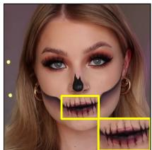  
Recon. Target

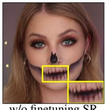  
w/o finetuning SR module

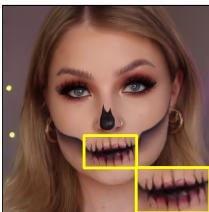  
w/ finetuning SR module

Figure 4. The effect of finetuning SR module. Without finetuning the SR module, the high-resolution output is blurry.

at $5 1 2 \times 5 1 2 .$

Optimization. The loss function is that

$$
\mathcal { L } ^ { S R } ( \mathbf { x } , \hat { \mathbf { x } } ) = | | \mathbf { x } - \hat { \mathbf { x } } | | _ { 2 } ^ { 2 } + \mathcal { L } _ { L P I P S } ( \mathbf { x } , \hat { \mathbf { x } } ) ,\tag{9}
$$

where $\mathbf { x } = \mathbf { I } _ { t }$ and $\hat { \mathbf { x } } = S R ( \mathbf { I } _ { L R } ^ { C } )$

## 4.6. Editing

After the reconstruction, we can modify the latent code wt to perform various semantic editing tasks. With explicit decomposition, the OOD contents do not interfere with the semantic editing capability of in-distribution components. Here, any existing GAN-based editing approaches can be used. We use InterfaceGAN [47] and StyleCLIP [41].

## 5. Experimental Results

## 5.1. Experimental Setup

Dataset. To evaluate how our approach works on data with out-of-distribution components, we collected a dataset of 20 online videos with challenging and diverse appearances. The OOD content contains heavy make-up and occluding objects (e.g. facial masks and large glasses). For the single-image inversion method, we use the first frame of each video. For video inversion, we use all the frames. For the face alignment, we use 3DDFA-v2 [23] to obtain the 68- point landmarks and smooth them across the frames using a sliding window for stabler cropping. After that, we convert the landmarks to EG3D’s 5-point landmarks and crop the face out of the input frame.

Hyperparameters. We use the Adam optimizer [30] for all our experiments. For in-distribution inversion (Secion 4.1), we optimize for 200 epochs with a learning rate of $1 \times 1 0 ^ { - 3 } , \lambda _ { \Delta } = 1 \times 1 0 ^ { - 3 }$ . For the out-of-distribution and composite rendering (Secion 4.2, 4.3), we run the optimization for 10,000 iterations with a learning rate of $5 \times 1 0 ^ { - 3 }$ $\lambda _ { b } = 1 , \lambda _ { w } = 1$ , and $\lambda _ { \mathscr D } = 0 . 1$ if applicable. For the SR module (Section 4.5), we finetune the module for 100 epochs with a learning rate of $1 \times 1 0 ^ { - 3 }$

Metrics. We evaluate our approach from 1) reconstruction accuracy and 2) editability to validate the reconstructioneditability trade-off. For the reconstruction accuracy, we report LPIPS [69], PSNR, SSIM and ID similarity [14]. For editability, we follow [45, 50] and evaluate identity preservation after applying the editing direction. More specifically, we use ArcFace [14] to compute the similarity between the inverted and edited results.

Baselines for evaluation. We compare our method extensively with several previous arts. For optimization-based methods, we compare with HFGI3D [62], PTI [45], W+, and W optimization. For videos only, we also include VIVE3D [17]. We compare the encoder-based method with GOAE [67] and IDE-3D [51] encoder. We treat W+ optimization as an ablated version of our method without OOD triplane. The recent work in [56] showcases encoder-based 3D GAN inversion, focusing on real-time inference. However, their method relies on a frozen EG3D and does not explicitly model the OOD components. We do not compare with it as the code is not publicly available.

## 5.2. Quantitative results

Reconstruction. We compare the reconstruction accuracy of our approach with all baselines and report the results in Table 1. For PTI, we first perform a W+ inversion with a learning rate of $1 \times 1 0 ^ { - 3 }$ and 200 epochs, and then finetune the generator for 200 epochs with a learning rate of $3 \times$ $1 0 ^ { - 5 }$ . For W+ and W optimization, we use a learning rate of $1 \times 1 0 ^ { - 3 }$ and optimize for 200 epochs. For GOAE and IDE-3D, we use their encoder directly for the inversion.

Our approach outperforms other methods on all the evaluation metrics. This indicates that our method produces a more accurate reconstruction with the OOD components.

Editability. We acquire editing directions from Interface-GAN [47] (“younger”, “smile”) and StyleCLIP mapper [41] (“eyeglasses”, “surprised”, “Elsa”). Following previous work [45, 50], we measure the ID similarity between the inverted image and the edited image, as the editing should not change a person’s identity. We report our results in Table 2. Our method outperforms other baselines in terms of identity preservation in most cases.

## 5.3. Qualitative results

Inversion. We visually compare the video reconstruction in Figure 5. Our method provides higher-fidelity reconstruction results than other baselines, particularly for OOD regions (e.g., heavy make-up or earrings). Our method shows better reconstruction than the encoder-based method GOAE [67] and IDE-3D [51]. Compared to optimizationbased methods, HFGI3D [62], VIVE3D [17], PTI [45], W, and W+, our method shows higher-fidelity reconstruction for OOD objects (Refer to our supplementary material for more results).

Editing. We show a qualitative comparison regarding the editing in Figure 6. Our method shows faithful editing results. For more qualitative results, please refer to our supplementary material.

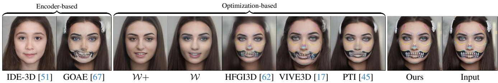

Figure 5. Qualitative comparison of the video reconstruction. We compare our approach with W+ and W optimization, IDE-3D [51], GOAE [67], HFGI3D [62], VIVE3D [17], and PTI [45]. Our method shows a better reconstruction accuracy on the OOD videos.
<table><tr><td></td><td colspan="4">Images</td><td colspan="5">Videos</td></tr><tr><td></td><td>LPIPS↓</td><td>SSIM↑</td><td>PSNR↑</td><td>ID Similarity↑</td><td>Time↓</td><td>LPIPS↓</td><td>SSIM↑</td><td>PSNR↑</td><td>ID Similarity↑</td></tr><tr><td>Ours</td><td>0.1106</td><td>0.8175</td><td>19.86</td><td>0.9685</td><td>2.68h</td><td>0.2237</td><td>0.7052</td><td>16.03</td><td>0.9758</td></tr><tr><td>HFGI3D [62]</td><td>0.3912</td><td>0.5521</td><td>11.37</td><td>0.9463</td><td>7.51h</td><td>0.3954</td><td>0.5587</td><td>11.55</td><td>0.9388</td></tr><tr><td>GOAE [67]</td><td>0.3619</td><td>0.6424</td><td>14.73</td><td>0.9685</td><td>56s</td><td>0.3642</td><td>0.6470</td><td>14.97</td><td>0.3642</td></tr><tr><td>E3DGE [31]</td><td>0.1709</td><td>0.7738</td><td>15.28</td><td>0.8632</td><td></td><td></td><td></td><td></td><td></td></tr><tr><td>VIVE3D [17]</td><td></td><td></td><td></td><td></td><td>0.59h</td><td>0.4172</td><td>0.5417</td><td>10.66</td><td>0.9245</td></tr><tr><td>PTI [45]</td><td>0.3192</td><td>0.6172</td><td>12.93</td><td>0.9676</td><td>1.45h</td><td>0.3144</td><td>0.6320</td><td>13.45</td><td>0.9658</td></tr><tr><td>IDE-3D [51]</td><td>0.5044</td><td>0.4395</td><td>9.18</td><td>0.8456</td><td>77s</td><td>0.4999</td><td>0.4512</td><td>9.59</td><td>0.8251</td></tr><tr><td>W+</td><td>0.3433</td><td>0.6387</td><td>14.39</td><td>0.9199</td><td>0.49h</td><td>0.3380</td><td>0.6557</td><td>14.75</td><td>0.9154</td></tr><tr><td>W</td><td>0.4097</td><td>0.5615</td><td>12.08</td><td>0.8757</td><td>0.47h</td><td>0.4030</td><td>0.5787</td><td>12.48</td><td>0.8652</td></tr></table>

Table 1. Reconstruction quality evaluation. For each column, deeper color the better.
<table><tr><td></td><td colspan="5">Images</td><td colspan="2"></td><td colspan="5">Videos</td></tr><tr><td></td><td>eyeglasses</td><td>surprised</td><td>younger</td><td>smile</td><td>Elsa</td><td>average</td><td>eyeglasses</td><td>surprised</td><td>younger</td><td>smile</td><td>Elsa</td><td>average</td></tr><tr><td>Ours</td><td>.9532</td><td>.9888</td><td>.9495</td><td>.9525</td><td>.9116</td><td>.9511</td><td>.9158</td><td>.9360</td><td>.9347</td><td>.9094</td><td>.8927</td><td>.9177</td></tr><tr><td>HFGI3D [62]</td><td>.9484</td><td>.9795</td><td>.9453</td><td>.9223</td><td>.8641</td><td>.9319</td><td>.9112</td><td>.9109</td><td>.9290</td><td>.9155</td><td>.8622</td><td>.9058</td></tr><tr><td>GOAE [67]</td><td>.9179</td><td>.9306</td><td>.9327</td><td>.9332</td><td>.8851</td><td>.9199</td><td>.9120</td><td>.9224</td><td>.9235</td><td>.9221</td><td>.8641</td><td>.9088</td></tr><tr><td>E3DGE [31]</td><td></td><td></td><td>.8853</td><td>.9487</td><td></td><td>0.9170</td><td></td><td></td><td></td><td></td><td></td><td></td></tr><tr><td>VIVE3D [17]</td><td></td><td></td><td></td><td></td><td></td><td></td><td>.9078</td><td>.9475</td><td>.9183</td><td>.9369</td><td>.8728</td><td>.9167</td></tr><tr><td>PTI [45]</td><td>.9114</td><td>.9562</td><td>.9380</td><td>.9410</td><td>.7927</td><td>.9079</td><td>.9049</td><td>.9357</td><td>.9319</td><td>.9336</td><td>.7945</td><td>.9001</td></tr><tr><td>IDE-3D [51]</td><td>.8811</td><td>.9538</td><td>.8723</td><td>.8055</td><td>.8780</td><td>.8781</td><td>.8767</td><td>.9481</td><td>.8551</td><td>.8662</td><td>.7871</td><td>.8666</td></tr><tr><td>W+</td><td>.9012</td><td>.9567</td><td>.9248</td><td>.9356</td><td>.7892</td><td>.9015</td><td>.8971</td><td>.9249</td><td>.9290</td><td>.9170</td><td>.7968</td><td>.8930</td></tr><tr><td>W</td><td>.8808</td><td>.9567</td><td>.9177</td><td>.9290</td><td>.8008</td><td>.8970</td><td>.8793</td><td>.9537</td><td>.9068</td><td>.9208</td><td>.8113</td><td>.8944</td></tr></table>

Table 2. Identity preservation evaluation. Higher numbers indicate better identity preservation. W+ is equivalent to our method without OOD tri-plane.

## 5.4. Other Applications

View synthesis. The use of 3D GANs supports rendering novel views after inversion. We show novel view synthesis results in Figure 7.

Object removal. By setting the blending weights of the OOD objects to 0, we can remove OOD objects. We show results in Figure 1.
<table><tr><td rowspan=1 colspan=3>1    Inversion</td><td rowspan=1 colspan=1>Editing</td></tr><tr><td rowspan=1 colspan=1>1</td><td rowspan=1 colspan=2> $\mathcal { L } _ { 2 } \downarrow$    LPIPS↓</td><td rowspan=1 colspan=1>ID similarity↑</td></tr><tr><td rowspan=3 colspan=1>w/o $\mathcal { L } _ { b }$ w/o $\mathcal { L } _ { w }$ Full method</td><td rowspan=1 colspan=1>0.0322</td><td rowspan=1 colspan=1>0.2191</td><td rowspan=1 colspan=1>0.9070</td></tr><tr><td rowspan=1 colspan=1>0.0336</td><td rowspan=1 colspan=1>0.2238</td><td rowspan=1 colspan=1>0.9024</td></tr><tr><td rowspan=1 colspan=1>0.0339</td><td rowspan=1 colspan=1>0.2237</td><td rowspan=1 colspan=1>0.9177</td></tr></table>

Table 3. Ablation study. We study the effect of different loss functions on 20 videos. For inversion, we compute the metrics between reconstructed frames and input frames. For editing, we compute the ID similarity between before and after editing.

## 5.5. Ablation Study

We introduce two new loss functions, Eqn. 1 and Eqn. 6, to preserve the editability from the impact of the OOD radiance field in Section 4.3. To validate the loss functions effects, we conduct an ablation study in Table 3. Without the weight regularization, $\mathcal { L } _ { b } ,$ and latent code regularizer $\mathcal { L } _ { w } .$ , the reconstruction accuracy is improved while the editability is reduced. One of the reasons is that GAN-based editing usually also brings unwanted changes to other attributes [47]. In Figure 8, the editing direction “eyeglasses” also moves the position of the eyes. At this time, if the blending weight b is closer to 1 for pixels outside the OOD object, i.e. the OOD part has more contributions, the editing tends to keep the pixel values in the reconstruction stage. While the eyes will be moved due to the editing direction, it results in the duplicate eyes in Figure 8(a). In contrast, with regularization (Eqn. 1 and Eqn. 6) on the blending weights, pixels in the in-distribution part contribute more to the output, which better supports the editing since we can only edit the in-distribution part. Similar cases happen to ${ \mathcal { L } } _ { w }$ . With-

Image

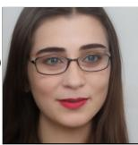

W+  
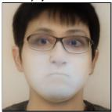

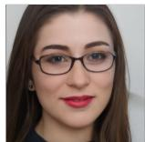  
W

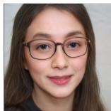

W+  
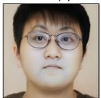  
W  
IDE-3D [51]

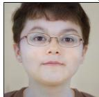

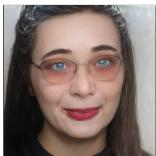  
IDE-3D [51]  
GOAE [67]

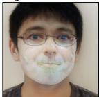  
GOAE [67]

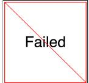  
HFGI3D [62]

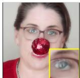

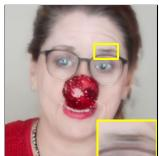  
(b) w/o $\mathcal { L } _ { w }$  
Figure 7. Novel view synthesis. We can synthesize novel views for a fixed frame in a video, which is challenging for 2D GANs. Each column shows different view for the same frame.

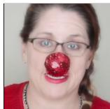  
(a) w/o $\mathcal { L } _ { b }$  
(c) Full model

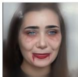  
HFGI3D [62]

Figure 8. Ablation study on editing. (a) Without $\mathcal { L } _ { b } ,$ the out-of-distribution component dominates (b → 1) and weakens the editing. It has “duplicate eyes” artifact because the editing direction “eyeglasses” is not disentangled well with other attributes, and changes the positions of the eyes, while the blending weights are the same as the reconstruction, it results in duplicated eyes. (b) Without $\mathcal { L } _ { w }$ , the eyebrow becomes unnatural.  
Figure 6. Qualitative comparison of the editing. We compare our editing results from a single image and a video with other baselines, with different editing latent directions “Eyeglasses”. Our approach can preserve the original appearance details better, and shows improved editability over other baselines.  
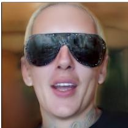

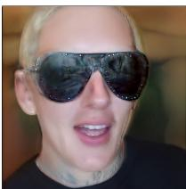

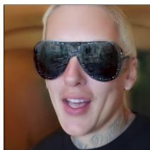

out ${ \mathcal { L } } _ { w }$ , the eyebrow becomes unnatural in Figure 8 (b).

## 5.6. Speed

We include a comparison of different baselines in Table 1. We compare the speed on 200 frames using a single NVIDIA RTX A6000 GPU. Our method takes more time for optimization but significantly improves the reconstruction-editability trade-off.

## 6. Limitations

Our method still has several limitations. We visualize (a)- (c) in Figure 9.

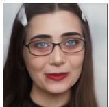  
PTI [45]

(a) Editing on OOD part. When editing on the OOD region, e.g. adding eyeglasses to the heavy makeup region, because the blending weights are closer to 1, the eyeglasses

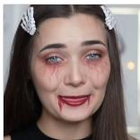

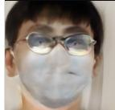  
VIVE3D [17]

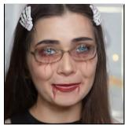  
Input

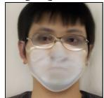

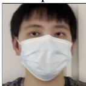  
Input

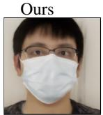  
Ours  
PTI [45]

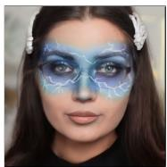  
(a) OOD dominates

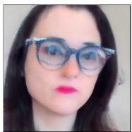  
(b) Double glasses

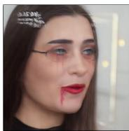  
(c) Extreme pose

Figure 9. Limitations. Our approach has some limitations. (a) Editing on where OOD blending weights dominate is challenging, (b) Adding another eyeglasses to OOD eyeglasses will result in duplicated objects, and (c) extreme poses.

in the in-distribution radiance field are hard to be added.

(b) Duplicate objects. Since our OOD radiance field has no knowledge about the GAN and faces prior, when the OOD object itself is glasses, adding eyeglasses introduces duplicate objects.

(c) Extreme poses. Our method fails at editing when the subject undergoes extreme poses (e.g., side view).

(d) Objects with limited movement. The radiance field reconstruction suffers when the OOD object has slight movement. This may introduce unwanted artifacts like “floater” in the novel views.

(e) Temporal inconsistency. Our results on video editing may suffer from temporal inconsistency. Temporal constraints and finetuning used in [57, 63] could further improve this aspect.

## 7. Conclusions

We have presented a novel method for face image, and its potential for video inversion and editing. Our method handles OOD objects by isolating them from the InD part. Our method achieves accurate reconstruction by building two radiance fields and then composing them together during the rendering. By modifying the latent code in the InD part, we can obtain faithful editing results. We show that our method achieves a better balance in the reconstruction-editability trade-off than other baselines. Malicious use of our technique may lead to misinformation.

## References

[1] Rameen Abdal, Yipeng Qin, and Peter Wonka. Image2stylegan: How to embed images into the stylegan latent space? In ICCV, 2019. 3

[2] Rameen Abdal, Yipeng Qin, and Peter Wonka. Image2stylegan++: How to edit the embedded images? In CVPR, 2020. 3

[3] Rameen Abdal, Peihao Zhu, Niloy J Mitra, and Peter Wonka. Styleflow: Attribute-conditioned exploration of stylegangenerated images using conditional continuous normalizing flows. ACM Transactions on Graphics (ToG), 40(3):1–21, 2021. 2

[4] Yuval Alaluf, Or Patashnik, and Daniel Cohen-Or. Restyle: A residual-based stylegan encoder via iterative refinement. In ICCV, 2021. 3

[5] Yuval Alaluf, Omer Tov, Ron Mokady, Rinon Gal, and Amit Bermano. Hyperstyle: Stylegan inversion with hypernetworks for real image editing. In CVPR, 2022. 3

[6] Jonathan T Barron, Ben Mildenhall, Matthew Tancik, Peter Hedman, Ricardo Martin-Brualla, and Pratul P Srinivasan. Mip-nerf: A multiscale representation for anti-aliasing neural radiance fields. In ICCV, 2021. 2

[7] David Bau, Hendrik Strobelt, William Peebles, Bolei Zhou, Jun-Yan Zhu, Antonio Torralba, et al. Semantic photo manipulation with a generative image prior. ACM Transactions on Graphics (ToG), 38(4):1–11, 2020. 3

[8] Lucy Chai, Jonas Wulff, and Phillip Isola. Using latent space regression to analyze and leverage compositionality in gans. In ICLR, 2021. 3

[9] Eric R Chan, Marco Monteiro, Petr Kellnhofer, Jiajun Wu, and Gordon Wetzstein. pi-gan: Periodic implicit generative adversarial networks for 3d-aware image synthesis. In CVPR, 2021. 3

[10] Eric R Chan, Connor Z Lin, Matthew A Chan, Koki Nagano, Boxiao Pan, Shalini De Mello, Orazio Gallo, Leonidas J Guibas, Jonathan Tremblay, Sameh Khamis, et al. Efficient geometry-aware 3d generative adversarial networks. In CVPR, 2022. 1, 2, 3, 4, 5

[11] Anpei Chen, Zexiang Xu, Andreas Geiger, Jingyi Yu, and Hao Su. Tensorf: Tensorial radiance fields. In ECCV, 2022. 2

[12] Edo Collins, Raja Bala, Bob Price, and Sabine Susstrunk. Editing in style: Uncovering the local semantics of gans. In CVPR, 2020. 3

[13] Giannis Daras, Augustus Odena, Han Zhang, and Alexandros G Dimakis. Your local gan: Designing two dimensional local attention mechanisms for generative models. In CVPR, 2020. 3

[14] Jiankang Deng, Jia Guo, Niannan Xue, and Stefanos Zafeiriou. Arcface: Additive angular margin loss for deep face recognition. In CVPR, 2019. 6

[15] Yu Deng, Jiaolong Yang, Sicheng Xu, Dong Chen, Yunde Jia, and Xin Tong. Accurate 3d face reconstruction with weakly-supervised learning: From single image to image set. In CVPR Workshops, 2019. 4

[16] Yu Deng, Jiaolong Yang, Jianfeng Xiang, and Xin Tong. Gram: Generative radiance manifolds for 3d-aware image generation. In CVPR, 2022. 3

[17] Anna Fruhst¨ uck, Nikolaos Sarafianos, Yuanlu Xu, Peter¨ Wonka, and Tony Tung. Vive3d: Viewpoint-independent video editing using 3d-aware gans. In CVPR, 2023. 2, 3, 6, 7, 8

[18] Rinon Gal, Or Patashnik, Haggai Maron, Amit H Bermano, Gal Chechik, and Daniel Cohen-Or. Stylegan-nada: Clipguided domain adaptation of image generators. ACM Transactions on Graphics (TOG), 41(4):1–13, 2022. 2, 3

[19] Chen Gao, Ayush Saraf, Johannes Kopf, and Jia-Bin Huang. Dynamic view synthesis from dynamic monocular video. In ICCV, 2021. 2, 3

[20] Jun Gao, Tianchang Shen, Zian Wang, Wenzheng Chen, Kangxue Yin, Daiqing Li, Or Litany, Zan Gojcic, and Sanja Fidler. Get3d: A generative model of high quality 3d textured shapes learned from images. arXiv preprint arXiv:2209.11163, 2022. 3

[21] Jinjin Gu, Yujun Shen, and Bolei Zhou. Image processing using multi-code gan prior. In CVPR, 2020. 3

[22] Jiatao Gu, Lingjie Liu, Peng Wang, and Christian Theobalt. StyleneRF: A style-based 3d aware generator for highresolution image synthesis. In ICLR, 2022. 2, 3

[23] Jianzhu Guo, Xiangyu Zhu, Yang Yang, Fan Yang, Zhen Lei, and Stan Z Li. Towards fast, accurate and stable 3d dense face alignment. In ECCV, 2020. 6

[24] Erik Hark¨ onen, Aaron Hertzmann, Jaakko Lehtinen, and¨ Sylvain Paris. Ganspace: Discovering interpretable gan controls. In NeurIPS, 2020. 2, 3

[25] Minyoung Huh, Richard Zhang, Jun-Yan Zhu, Sylvain Paris, and Aaron Hertzmann. Transforming and projecting images to class-conditional generative networks. In ECCV, 2020. 3

[26] Tero Karras, Samuli Laine, and Timo Aila. A style-based generator architecture for generative adversarial networks. In CVPR, 2019. 2, 3

[27] Tero Karras, Miika Aittala, Janne Hellsten, Samuli Laine, Jaakko Lehtinen, and Timo Aila. Training generative adversarial networks with limited data. In NeurIPS, 2020.

[28] Tero Karras, Samuli Laine, Miika Aittala, Janne Hellsten, Jaakko Lehtinen, and Timo Aila. Analyzing and improving the image quality of stylegan. In CVPR, 2020.

[29] Tero Karras, Miika Aittala, Samuli Laine, Erik Hark¨ onen,¨ Janne Hellsten, Jaakko Lehtinen, and Timo Aila. Alias-free generative adversarial networks. In NeurIPS, 2021. 2, 3

[30] Diederik P Kingma and Jimmy Ba. Adam: A method for stochastic optimization. arXiv preprint arXiv:1412.6980, 2014. 6

[31] Yushi Lan, Xuyi Meng, Shuai Yang, Chen Change Loy, and Bo Dai. Self-supervised geometry-aware encoder for stylebased 3d gan inversion. In CVPR, 2023. 2, 3, 7

[32] C.Z. Lin, D.B. Lindell, E.R. Chan, and G. Wetzstein. 3d gan inversion for controllable portrait image animation. In ECCVW, 2022. 3, 4

[33] Junyu Luo, Yong Xu, Chenwei Tang, and Jiancheng Lv. Learning inverse mapping by autoencoder based generative adversarial nets. In NeurIPS, 2017. 3

[34] Ricardo Martin-Brualla, Noha Radwan, Mehdi SM Sajjadi, Jonathan T Barron, Alexey Dosovitskiy, and Daniel Duckworth. Nerf in the wild: Neural radiance fields for unconstrained photo collections. In CVPR, 2021. 2, 3

[35] Nelson Max. Optical models for direct volume rendering. IEEE Transactions on Visualization and Computer Graphics, 1(2):99–108, 1995. 3

[36] Ben Mildenhall, Pratul P. Srinivasan, Matthew Tancik, Jonathan T. Barron, Ravi Ramamoorthi, and Ren Ng. Nerf: Representing scenes as neural radiance fields for view synthesis. In ECCV, 2020. 2, 3, 4

[37] Thomas Muller, Alex Evans, Christoph Schied, and Alexan-¨ der Keller. Instant neural graphics primitives with a multiresolution hash encoding. ACM Trans. Graph., 41(4):102:1– 102:15, 2022. 2

[38] Thu Nguyen-Phuoc, Chuan Li, Lucas Theis, Christian Richardt, and Yong-Liang Yang. Hologan: Unsupervised learning of 3d representations from natural images. In ICCV, 2019. 3

[39] Yotam Nitzan, A. Bermano, Yangyan Li, and D. Cohen-Or. Face identity disentanglement via latent space mapping. ACM Transactions on Graphics (TOG), 39:1 – 14, 2020. 3

[40] Roy Or-El, Xuan Luo, Mengyi Shan, Eli Shechtman, Jeong Joon Park, and Ira Kemelmacher-Shlizerman. StyleSDF: High-Resolution 3D-Consistent Image and Geometry Generation. In CVPR, 2022. 2, 3

[41] Or Patashnik, Zongze Wu, Eli Shechtman, Daniel Cohen-Or, and Dani Lischinski. Styleclip: Text-driven manipulation of stylegan imagery. In ICCV, 2021. 1, 2, 3, 6

[42] Ankit Raj, Yuqi Li, and Yoram Bresler. Gan-based projector for faster recovery with convergence guarantees in linear inverse problems. In ICCV, 2019. 3

[43] Rene Ranftl, Katrin Lasinger, David Hafner, Konrad´ Schindler, and Vladlen Koltun. Towards robust monocular depth estimation: Mixing datasets for zero-shot cross-dataset transfer. TPAMI, 44(3), 2022. 5

[44] Elad Richardson, Yuval Alaluf, Or Patashnik, Yotam Nitzan, Yaniv Azar, Stav Shapiro, and Daniel Cohen-Or. Encoding in style: a stylegan encoder for image-to-image translation. In CVPR, 2021. 2, 3

[45] Daniel Roich, Ron Mokady, Amit H Bermano, and Daniel Cohen-Or. Pivotal tuning for latent-based editing of real images. ACM Transactions on Graphics (TOG), 42(1):1–13, 2022. 2, 3, 6, 7, 8

[46] Katja Schwarz, Yiyi Liao, Michael Niemeyer, and Andreas Geiger. Graf: Generative radiance fields for 3d-aware image synthesis. In NeurIPS, 2020. 3

[47] Yujun Shen, Jinjin Gu, Xiaoou Tang, and Bolei Zhou. Interpreting the latent space of gans for semantic face editing. In CVPR, 2020. 1, 2, 3, 6, 7

[48] Enis Simsar, Alessio Tonioni, Evin Pinar Ornek, and Federico Tombari. Latentswap3d: Semantic edits on 3d image gans. In ICCVW, 2023. 2

[49] Ivan Skorokhodov, Sergey Tulyakov, Yiqun Wang, and Peter Wonka. Epigraf: Rethinking training of 3d gans. arXiv preprint arXiv:2206.10535, 2022. 2, 3

[50] Adela´ Subrtovˇ a, David Futschik, Jan´ Cech, Michal Lukˇ a´c,ˇ Eli Shechtman, and Daniel Sykora. Chunkygan: Real image\` inversion via segments. In European Conference on Computer Vision, 2022. 2, 3, 6

[51] Jingxiang Sun, Xuan Wang, Yichun Shi, Lizhen Wang, Jue Wang, and Yebin Liu. Ide-3d: Interactive disentangled editing for high-resolution 3d-aware portrait synthesis. ACM Transactions on Graphics (ToG), 41(6):1–10, 2022. 2, 3, 6, 7, 8

[52] Matthew Tancik, Pratul Srinivasan, Ben Mildenhall, Sara Fridovich-Keil, Nithin Raghavan, Utkarsh Singhal, Ravi Ramamoorthi, Jonathan Barron, and Ren Ng. Fourier features let networks learn high frequency functions in low dimensional domains. In NeurIPS, 2020. 3

[53] Ayush Tewari, Mohamed Elgharib, Florian Bernard, Hans-Peter Seidel, Patrick Perez, Michael Zollh´ ofer, Christian¨ Theobalt, et al. Pie: Portrait image embedding for semantic control. arXiv preprint arXiv:2009.09485, 2020. 3

[54] Ayush Tewari, Mohamed Elgharib, Gaurav Bharaj, Florian Bernard, Hans-Peter Seidel, Patrick Perez, Michael Zoll-´ hofer, and Christian Theobalt. Stylerig: Rigging stylegan for 3d control over portrait images. In CVPR, 2020. 3

[55] Omer Tov, Yuval Alaluf, Yotam Nitzan, Or Patashnik, and Daniel Cohen-Or. Designing an encoder for stylegan image manipulation. ACM Transactions on Graphics (TOG), 40(4): 1–14, 2021. 2, 3, 5

[56] Alex Trevithick, Matthew Chan, Michael Stengel, Eric Chan, Chao Liu, Zhiding Yu, Sameh Khamis, Manmohan Chandraker, Ravi Ramamoorthi, and Koki Nagano. Real-time radiance fields for single-image portrait view synthesis. ACM Transactions on Graphics (TOG), 42(4):1–15, 2023. 2, 3, 6

[57] Rotem Tzaban, Ron Mokady, Rinon Gal, Amit H Bermano, and Daniel Cohen-Or. Stitch it in time: Gan-based facial editing of real videos. SIGGRAPH Asia 2022 Conference Papers, 2022. 2, 3, 8

[58] Yuri Viazovetskyi, Vladimir Ivashkin, and Evgeny Kashin. Stylegan2 distillation for feed-forward image manipulation. In ECCV, 2020. 3

[59] Tianhao Wu, Fangcheng Zhong, Andrea Tagliasacchi, Forrester Cole, and Cengiz Oztireli. D2nerf: Self-supervised decoupling of dynamic and static objects from a monocular video. arXiv preprint arXiv:2205.15838, 2022. 2, 3, 5

[60] Zongze Wu, Dani Lischinski, and Eli Shechtman. Stylespace analysis: Disentangled controls for stylegan image generation. In CVPR, 2021. 3

[61] Weihao Xia, Yulun Zhang, Yujiu Yang, Jing-Hao Xue, Bolei Zhou, and Ming-Hsuan Yang. Gan inversion: A survey. IEEE Transactions on Pattern Analysis and Machine Intelligence, 2022. 2, 4

[62] Jiaxin Xie, Hao Ouyang, Jingtan Piao, Chenyang Lei, and Qifeng Chen. High-fidelity 3d gan inversion by pseudomulti-view optimization. In CVPR, 2023. 2, 3, 6, 7, 8

[63] Yiran Xu, Badour AlBahar, and Jia-Bin Huang. Temporally consistent semantic video editing. In ECCV, 2022. 2, 3, 8

[64] Bangbang Yang, Yinda Zhang, Yinghao Xu, Yijin Li, Han Zhou, Hujun Bao, Guofeng Zhang, and Zhaopeng Cui. Learning object-compositional neural radiance field for editable scene rendering. In ICCV, 2021. 2, 3

[65] Xu Yao, Alasdair Newson, Yann Gousseau, and Pierre Hellier. A latent transformer for disentangled face editing in images and videos. In ICCV, 2021. 3

[66] Fei Yin, Yong Zhang, Xuan Wang, Tengfei Wang, Xiaoyu Li, Yuan Gong, Yanbo Fan, Xiaodong Cun, Ying Shan, Cengiz Oztireli, et al. 3d gan inversion with facial symmetry prior. In CVPR, 2023. 2, 3

[67] Ziyang Yuan, Yiming Zhu, Yu Li, Hongyu Liu, and Chun Yuan. Make encoder great again in 3d gan inversion through geometry and occlusion-aware encoding. In ICCV, 2023. 2, 3, 6, 7, 8

[68] Jichao Zhang, Aliaksandr Siarohin, Yahui Liu, Hao Tang, Nicu Sebe, and Wei Wang. Training and tuning generative neural radiance fields for attribute-conditional 3d-aware face generation. arXiv preprint arXiv:2208.12550, 2022. 3

[69] Richard Zhang, Phillip Isola, Alexei A Efros, Eli Shechtman, and Oliver Wang. The unreasonable effectiveness of deep features as a perceptual metric. In CVPR, 2018. 5, 6

[70] Jiapeng Zhu, Yujun Shen, Deli Zhao, and Bolei Zhou. Indomain gan inversion for real image editing. In European conference on computer vision, 2020. 2

[71] Jiapeng Zhu, Yujun Shen, Deli Zhao, and Bolei Zhou. Indomain gan inversion for real image editing. In ECCV, 2020. 3