# InstantBooth: Personalized Text-to-Image Generation without Test-Time Finetuning

Jing Shi∗ Wei Xiong∗ Zhe Lin Hyun Joon Jung Adobe Inc. ∗ Equal Contribution {jingshi,wxiong,zlin,hjung}@adobe.com

Input 5 images of person

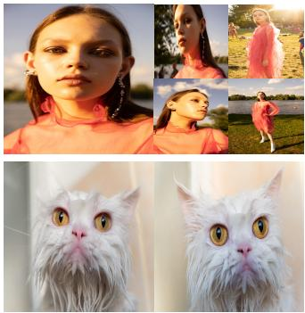  
Input 2 images of cat

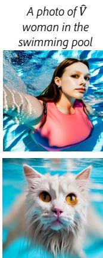  
A photo of "! cat swimming in the swimming pool

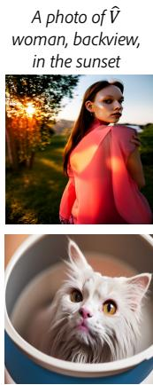  
A photo of "! cat in a bucket  
A photo of "! woman opening the arm besides the blue sea

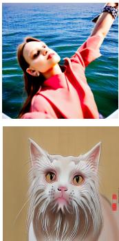  
A Ukiyo-e painting of "! cat

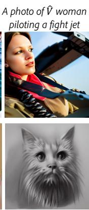  
A charcoal sketch of "! cat

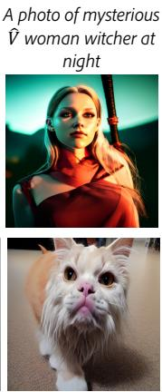  
A photo of "! cat as a bull dog

Figure 1. Personalized images generated by our model given different prompts. On both the “person” and “cat” categories, our model can generate text-aligned, identity-preserved, and high-fidelity images of the input concept. Vˆ is a placeholder word representing the input subject. We name our model InstantBooth as it does not require test-time modelfinetuning.

## Abstract

Recent advances in personalized image generation have enabled pre-trained text-to-image models to learn new concepts from specific image sets. However, these methods often necessitate extensive test-time finetuning for each new concept, leading to inefficiencies in both time and scalability. To address this challenge, we introduce Instant-Booth, an innovative approach leveraging existing textto-image models for instantaneous text-guided image personalization, eliminating the need for test-time finetuning. This efficiency is achieved through two primary innovations. Firstly, we utilize an image encoder that transforms input images into a global embedding to grasp the general concept. Secondly, we integrate new adapter layers into

the pre-trained model, enhancing its ability to capture intricate identity details while maintaining language coherence. Significantly, our model is trained exclusively on textimage pairs, without reliance on concept-specific paired images. When benchmarked against existingfinetuning-based personalization techniques like DreamBooth and Textual-Inversion, InstantBooth not only shows comparable proficiency in aligning language with image, maintaining image quality, and preserving the identity but also boasts a 100-fold increase in generation speed. Project Page: https://jshi31.github.io/InstantBooth/

## 1. Introduction

Recent advances in personalized image generation have enabled text-to-image models [2, 4, 7, 8, 10, 14, 16, 24, 27, 28, 34] to learn a new concept from a small set of images then create images of that concept in different poses, perspectives, styles, and scenes. Fig. 1 shows examples generated by our model based on a specific person or cat concept learned from the input images.

Current methods in personalized text-to-image generation face several critical challenges. First, many existing models [5, 9, 11–13, 17, 30, 31, 36, 37] require individual finetuning for each new concept. The image set is usually converted to a textual token through heavy online optimization. This process is both computationally intensive and storage-demanding, significantly hindering scalability. Second, these methods often struggle with identity preservation when trying to generate images that are aligned with the textual descriptions. It is challenging to create new images that vary in poses, viewpoints, and backgrounds, while simultaneously retaining the intricate details of the input concept.

To address these challenges, we propose InstantBooth, a personalized image generation model without test-time finetuning. To eliminate the need for test-time finetuning, we use a concept encoder to map the set of images into a global embedding in the textual embedding space. The global embedding is then integrated into the original prompt embeddings to enhance the corresponding word token, such as “person” in the input prompt. This enables the model to understand each new concept with only a single forward pass during inference, without any optimization process.

However, global embeddings alone often fail to capture complete identity details from input images. To enhance identity preservation, we employ a patch encoder for detailed local feature extraction. We also integrate new trainable adapter layers [1, 20] into our pre-trained model for additional local feature conditioning. While the identity needs to be preserved, we observe that the patch features can affect the language understanding so that the object pose change or background synthesis does not always follow the text description. To address this issue, we adopt a gating mechanism in the adapter layers to control the contribution of the image patch features and the features generated from the prompt. To further enhance the language alignment while keeping the identity, we propose a concept token normalization technique during the sampling process so that the importance of the global concept embedding and the other word embeddings in the sentence are re-weighted.

Notably, our model is trained exclusively on text-image pairs, without using any concept-specific paired images. With such a training strategy, our model is still able to generate new images with large poses, location variations, and diverse backgrounds, while preserving the identity and language-image alignment, as demonstrated in Fig. 1. We summarize our contributions below.

• We propose a novel approach for personalized text-toimage generation without test-time finetuning. Our model can generate comparable results as test-time finetuningbased methods like Dreambooth while being x100 faster.

• We introduce concept and patch encoders to learn global concept embedding and rich patch embeddings from the image set. With the proposed adapter layers and concept normalization techniques, our model can generate identity-preserved, diverse, and high-quality images while keeping the language alignment.

## 2. Related Work

Personalized Image Generation. Given one or more images of a concept as inputs, personalized image generation aims at generating image variations of the given concept or identity. Existing approaches [11, 17, 30] for this task can be mainly categorized into two types. The first is test-time finetuning-based methods [5, 9, 11–13, 17, 30, 31, 36, 37]. For each new concept, these methods need to learn a concept token through online optimization, which is computation and storage costly.

The second is encoder-based methods [6, 15, 19, 22, 38, 39, 41], which learn image embeddings from the input images as the representation of the concept. ELITE [38] finetunes the pretrained parameters in the attention layers and sometimes fails to generate images with diverse poses/viewpoints. SuTI [6] learns the concept from a massive amount of paired images generated by subject-driven expert models. Different from these methods, our method adopts the adapter structure to flexibly incorporate the visual signal into the model so that it can generate languagealigned images with identity preservation. Moreover, we do not use paired images to train our model.

Multimodal-Conditional Image Generation. Modern visual synthesis systems are usually powered by large textto-image foundation models [2, 4, 7, 8, 10, 16, 24, 27, 28]. Beyond text guidance, these models can also take additional inputs from other modalities, such as image, depth, layout, and so on. For example, Stable Diffusion V2 [29] can take a depth image or masked image as the condition to generate images or perform inpainting. eDiff-I [2] takes images as additional style guidance for stylized image synthesis. More recently, approaches built upon pre-trained textto-image models have been proposed for more controllable multi-modal image generation [20, 23, 42]. ControlNet [42] controls pre-trained diffusion models to take more input conditions by locking the original parameters and making a trainable copy to the newly added layers. GLIGEN [20] extends pre-trained models to take layouts, images, or other conditions by injecting new layers into the original model.

## 3. Method

## 3.1. Overall Framework

Fig. 2 outlines the inference pipeline of our method for generating images from image set $\mathcal { X } = \{ x ^ { i } \} _ { i = 1 } ^ { N }$ (N can be 1 or larger) and text prompt P. We encode X into a global concept embedding $c _ { g }$ via Concept Encoder $E _ { g }$ and obtain local patch embeddings $c _ { p }$ with Patch Encoder $E _ { p } .$ . The prompt $\mathcal { P }$ is converted into sentence embeddings c. We then merge $c _ { g }$ into c to create enhanced sentence embeddings $c _ { e } ,$ which, along with $c _ { p } ,$ are processed by the cross-attention and adapter layers of the diffusion model’s U-Net for image synthesis, respectively. We describe the details below.

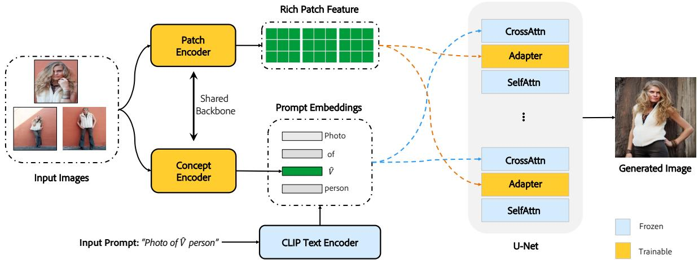  
Figure 2. The inference pipeline of our model. Given the input images and prompt, we encode the images into a global concept embedding using the Concept Encoder and obtain rich patch embeddings using the Patch Encoder to preserve more identity details. The prompt is encoded into sentence embeddings and merged with the concept embedding. The prompt embeddings and the patch embeddings are taken by the cross-attention layers and the adapter layers of the U-Net respectively to generate new images. During training, only the image encoders and the adapter layers are trainable, the other parts are frozen. (We omit the object masks of the input images for simplicity.)

## 3.2. Model Training

Training Data Creation. Our model uses Stable Diffusion [29] as its backbone and is trained on many single images with their descriptions. During training, since we don’t have concept-specific image pairs, we preprocess and augment each single image to create a condition image, using the original one as ground truth. To clarify, during training, we use $N = 1$ for X. To construct the condition image from the original image x, we first crop out the object region, then mask out the background of the cropped image to obtain the initial condition image $x ^ { \prime } = x \cdot m$ , where m is the object mask. Then we perform random augmentations A to the masked image to obtain the final condition image $x ^ { \prime } = \mathcal { A } ( x ^ { \prime } )$ to our model. A includes random rotation (45 degrees maximum), random horizontal flipping, and random crop. $x ^ { \prime }$ is further resized to 224 × 224 resolution before feeding to the image encoders.

Prompt Construction. We modify the original prompt to fit our model as follows. Given the prompt P with the format “... [class noun] $\cdots ^ { \dag } ,$ , we insert $\hat { V }$ right before [class noun] as a new word, where [class noun] is a coarse description noun of the input object category, Vˆ is used only as a placeholder word for the input concept to indicate the location of the [class noun] word in the sentence. For example, we modify the original prompt “A photo of a person playing guitar” to “A photo of a $\hat { V }$ woman playing guitar”, where “woman” is the [class noun] for the person category. The coarse description noun for the person category includes $" \mathrm { m a n } ^ { \prime \prime }$ , “woman”, “baby”, “girl”, “boy”, “lady”. For the cat category, we identify “cat”, and “kitten” as the coarse descriptions. We then encode the prompt into the prompt embedding $c \in \mathbb { R } ^ { 7 7 \times 7 6 8 }$ using a Frozen CLIP text encoder. Global Concept Embedding Learning. We extract the global semantics of the condition image $x ^ { \prime }$ using the Concept Encoder $E _ { c }$ . Specifically, $E _ { c }$ is composed of a pretrained CLIP image encoder that extracts the global image embedding from $x ^ { \prime }$ , and a learnable linear layer that projects the embedding to the textual embedding space to obtain the final global embedding $c _ { g } ~ \in \mathbb { R } ^ { 1 \times 7 6 8 }$ . Then we insert the global embedding into the prompt embedding c to obtain the concept-enhanced prompt embedding $c _ { e } \in \mathbb { R } ^ { 7 7 \times 7 6 8 }$ by replacing the embedding of the placeholder word $\hat { V }$ with $c _ { g } .$ The enhanced prompt embedding is the input to the crossattention layers of the U-Net in Stable Diffusion.

Rich Patch Embedding Learning with Adapters. Using the global concept embedding $c _ { g }$ alone is not sufficient to capture all identity details of the input subject. To better preserve the identity, we use a Patch Encoder $E _ { p }$ to encode the images into rich patch feature tokens. Specifically, $E _ { p }$ is composed of a pre-trained CLIP image encoder that extracts 257 local patch tokens from $x ^ { \prime * }$ , and a learnable linear layer that projects each token to a unified feature space to obtain the final patch embeddings $c _ { p } \in \mathbb { R } ^ { 2 5 7 \times 7 6 8 } . c _ { p }$ contains rich local details of the condition image.

Since the original Stable Diffusion only takes text as the condition, to enable the model to take images as a condition, inspired by [20], we introduce an additional adapter layer in-between the cross-attention layer and self-attention layer in each transformer block of the U-Net, as illustrated in Fig. 2. The adapter layer is indeed a gated self-attention layer formulated as:

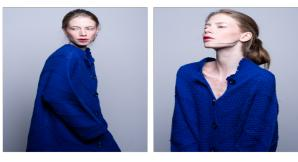

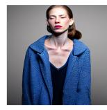  
Input Images

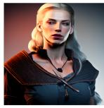  
Without Renormalization  
With Renormalization

Prompt: "photo of mysterious sks woman witcher at night.' (a)  
(a) Visual Comparison  
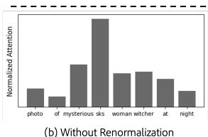

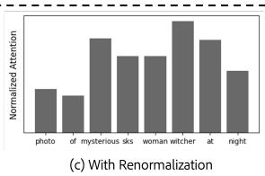  
Figure 3. (a): Visual comparison between our model with and without concept renormalization. (b) The average attention of each word without concept renormalization. (c) The average attention of each word with concept renormalization.

$$
\mathbf { y } : = \mathbf { y } + \beta \cdot \operatorname { t a n h } ( \gamma ) \cdot S ( [ \mathbf { y } , \mathbf { c } _ { p } ] ) ,\tag{1}
$$

where $S$ is the self-attention operator, y denotes the visual feature in the transformer layer, [·] means concatenating the features in the token space, $\gamma$ is a learnable scalar gate initialized as zero. Notably, $\beta$ is an important constant between 0 and 1 to control the contribution of the image features against the textual features. It is set to be 1 during training to encode as much identity information from the images as possible.

Training Objective. We use the original diffusion denoising loss as our objective for each image:

$$
\mathcal { L } = \mathbb { E } _ { z , t , c _ { e } , x ^ { \prime } , \eta \in \mathcal { N } ( 0 , 1 ) } \left[ \Vert \eta - \eta _ { \theta } ( z _ { t } , t , c _ { e } , x ^ { \prime } ) \Vert _ { 2 } ^ { 2 } \right] ,\tag{2}
$$

where $z _ { t }$ is the latent noisy image at time step t obtained from the ground-truth image x, η is the latent noise to predict, $c _ { e }$ is the concept-enhanced prompt embeddings, $x ^ { \prime }$ is the condition image, and $\eta _ { \theta }$ is the noise prediction model with parameters θ.

## 3.3. Model Inference

During inference, There are a few differences from the training phase. First, we can input multiple condition images of a concept to the model rather than only 1 image. To take N images as inputs, for the global concept embedding, we average the concept embedding of each condition image as the final concept embedding. For the patch embeddings, we obtain the 257 tokens from each image and then concatenate them in the token space, forming $2 5 7 \times N$ tokens as the final patch embeddings. Our adapter based on the self-attention mechanism allows for an arbitrary number of tokens as inputs. Second, we still mask out the background of each image but do not perform any augmentation on it.

Balanced Sampling. During inference, we observe that setting $\beta = 1$ in Eq. 1 results in a strong identity and pose reconstruction of the input images, while the language-image alignment is weakened. To preserve the identity while keeping the language understanding, we adjust the value of $\beta$ during inference so that the adapter layer takes both the information generated from the prompt and the conditioning images. We observe that adjusting $\beta$ indeed benefits the balance between identity preservation and language alignment. Concept Token Renormalization. We perform further analysis on the language understanding of our model. We observe that under certain circumstances, even if we have adjusted the value of $\beta$ for Balanced Sampling, the concept token $c _ { g }$ can still dominate the cross-attention against the other word tokens, leading to language forgetting. Fig. 3 (b) shows the cross-attention averaged over all batches, layers, and time-steps for each word when inputting the prompt ”photo of mysterious sks woman witcher at night”, where “sks” denotes the placeholder word $\hat { V }$ in our implementation and $\beta = 0 . 3$ The attention of $\mathrm { \ddot { s k s } } ^ { , , , }$ is significantly higher than the other words, while the core words such as “night” and “witcher” are assigned low attention weights, showing a sign of language forgetting. To address this issue, we renormalize the concept token $c _ { g }$ with a factor of $\alpha \in ( 0 , 1 ]$ as: $\mathbf { c } _ { g } = \alpha \cdot \mathbf { c } _ { g }$

Since there are only linear mappings from the prompt embeddings before calculating the cross-attention, such a renormalization strategy is essentially equivalent to rescaling the cross-attention between the concept token and the visual tokens in the Cross-Attention layers. Fig. 3 (c) shows the average attention for each word after our renormalization. It can be observed that the attention of the concept token does not dominate the cross-attention anymore. The visual comparison shown in Fig. 3 (a) provides more evidence for this observation. Without concept renormalization, the model fails to generate the “witcher” style or the “night” background. With renormalization, the attentions of the nouns are more balanced, and the model successfully generates the “witcher” style and the “night” background. All the analysis and evidence demonstrate that Concept Renormalization can help to achieve a better balance between textimage alignment and identity preservation.

## 4. Experiments

## 4.1. Dataset and Evaluation Metric

Datasets. We conduct experiments on two subject categories person and cat, and collect text-image pairs where the images contain these object categories and the prompts contain the related coarse category nouns as described in section 3.2.

Then we generate the entity segmentation masks for all the collected images using the entity segmentation model [26] trained on high-quality entity segmentation datasets [25]. Then we filter out images where the region ratio of the object belonging to our target category is less than 0.1 or larger than 0.7. We also filter out images with multiple objects to simplify the training.

Ours  
ELITE  
Textual Inversion  
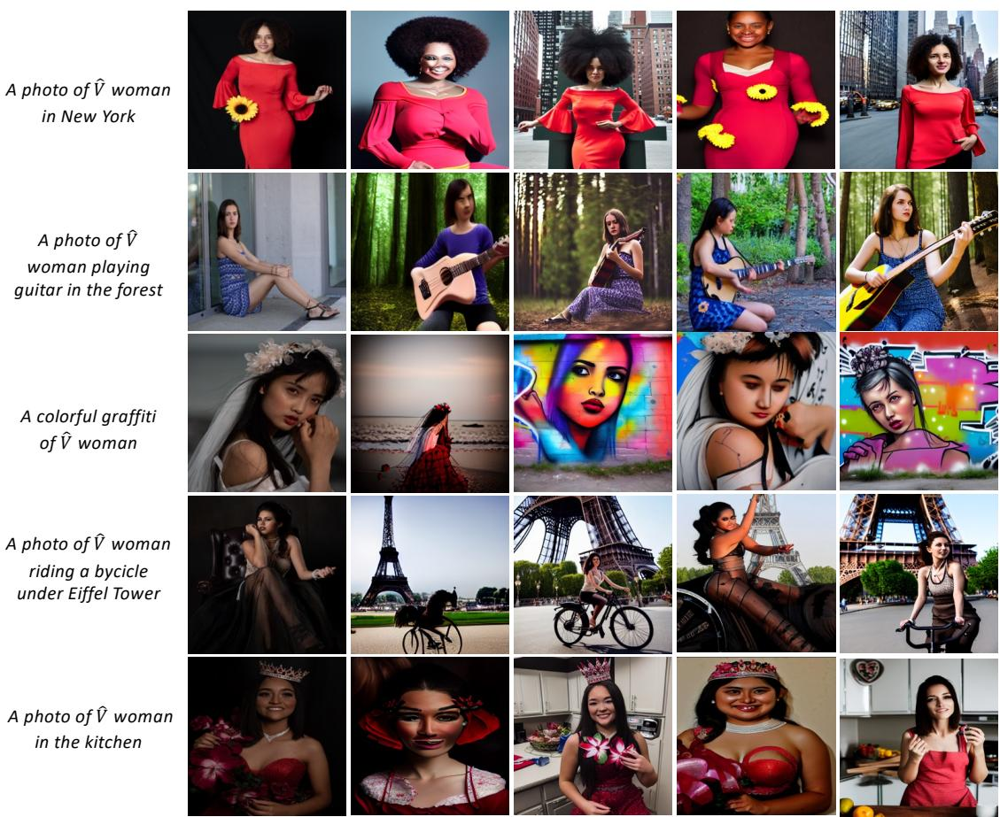  
Figure 4. The visual comparison with other methods. All methods take five images as input but we only show one image here for simplicity.

In total, we have 1.43 million text-image pairs for the person category and 0.37 million for the cat category. We use PPR10K [21] person dataset as our testing dataset for the person category. PPR10K includes high-quality human portrait photos of 1681 identities, each of which contains multiple images of the same person. We select 50 identities in the test split of PPR10k [21], where each selected identity is guaranteed to have more than 5 images, and we only keep the first 5 images in naming order as our test input.

Metrics. We quantify the identity preservation and language alignment of each model with the metrics below.

Reconstruction evaluates whether the identity can be fully preserved by the default prompt “A photo of Vˆ [class noun]”, where [class noun] can be a person or cat. It is measured by the similarity of CLIP visual features between the input image and the generated image.

Face similarity evaluates whether the identity can be fully preserved for the person category. Since the face is the primary indicator of a person’s identity, we use a strong face detector [33] to detect faces in both the generated and the input images of a subject. Then we extract an embedding from each detected face with an Inception-ResnetV1 [35] pre-trained on VGGFace2 [3]. Then we calculate the average cosine similarity between each pair of face embeddings as the perceptual face similarity. If a face is not detected, we penalize the similarity as 0.

Alignment measures the vision-language alignment between the input prompt and the output image, specifically, whether the generated image follows the prompt. We measure this using the CLIP similarity between image and text embeddings. We construct various prompts ranging from background modifications (“A photo of Vˆ [class noun] on the moon”) to style changes (“An oil painting of Vˆ [class noun]”), and a compositional prompt (“Vˆ [class noun] shaking hand with Biden”). The specific list of prompts is in the Supplement.

## 4.2. Implementation Details

We use the Stable Diffusion [29] V1-4 as the pre-trained text-to-image backbone. In all experiments with our model, we use the infrequent word “sks” as Vˆ as suggested in

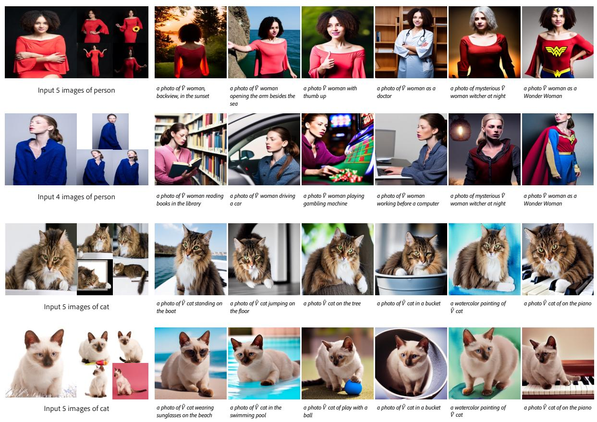  
Figure 5. Personalized images generated by our model on the “person” and “cat” categories.

DreamBooth [40]. Note that “sks” is a placeholder indicating the position ofthe concept token in the sentence, and will be replaced by the global image embedding. For both the Concept Encoder $E _ { c }$ and the Patch Encoder $E _ { p } ,$ , we use the pre-trained CLIP image encoder as the backbone followed by a randomly initialized linear layer. During training, only the linear layers of the image encoders and the adapter layers are updated, and we freeze all other parts of the model. The model trains for 320k iterations for the person class and 200k iterations for the cat class, using a learning rate of 1e-6 for adapter layers and 1e-4 for the linear layers in the visual encoders, with a batch size of 16 deployed on 4 A100 GPUs. In testing, we search different combinations of the adapter weight $\beta$ and concept renormalization factor $\alpha ,$ and choose β = 0.3, α = 0.4 as the best trade-off between vision-language alignment and identity preservation as detailed in Supplement.

## 4.3. Comparison to SOTA Methods

In this section, we compare our approach with Textual Inversion (TI) [11] and DreamBooth (DB) [30], both of which require heavy test-time finetuning, as well as with ELITE [38], a zero-shot personalization method. We use the official code base for Textual Inversion and ELITE, and a third-party replication [40] for DreamBooth, where the base text-to-image model is changed from Imagen [32] to

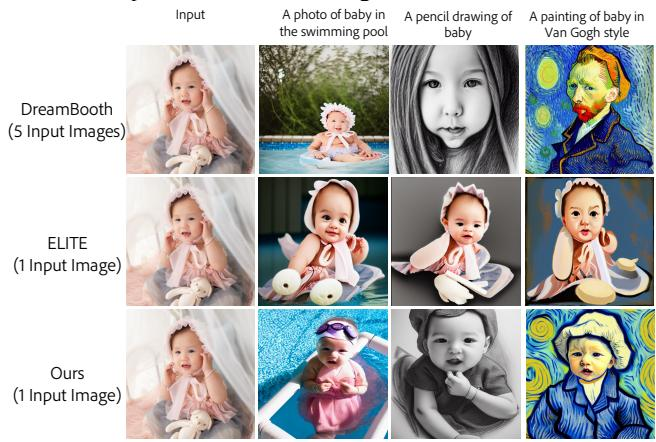  
Figure 6. The comparison of our method with single image input.

Stable Diffusion [29]. Note that, since ELITE can accept only a single image, we compare ELITE using a single image as input, whereas all other methods use multiple images as inputs.

Qualitative Results. The personalization results on both person and cat categories are displayed in Fig.1 and Fig.5, while the comparison with other methods is displayed in Fig. 4, where our method exhibits better perceptual quality, vision-language alignment, and identity preservation than the compared ones. Our method also supports large pose and structure variations, such as ”riding a bicycle” and ”open arms,” while maintaining the identity.

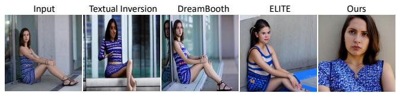  
Figure 7. The visual comparison of image reconstruction given prompt “A photo of Vˆ woman”.

For Textual Inversion, it uses the LDM text-to-image model, which has a weaker capacity than Stable Diffusion, often producing blurry images and failing to accurately follow the prompts. DreamBooth can generate high-quality images; however, when the input person subject occupies a small portion (e.g., row 2 and 4 of Fig.4), it tends to generated the person within a small portion of the image, thus limiting the identity preservation ability. Moreover, even when the input image contains a large portion of the person object (e.g., row 5 of Fig.4), DreamBooth often only preserves the person’s outfit but distorts the face identity. ELITE cannot maintain the identity, but note it is not a completely fair comparison since ELITE is trained on OpenImages [18] of general categories, while ours are trained on specific categories. In contrast, our method produces images with clearer faces and more details given a wide range of person-size portions in the image. We suspect the reason is our adapter layers have seen millions of different person identities, thereby garnering a stronger prior for maintaining identity than the compared test-time finetuning-based methods.

Fig. 5 shows more visual results from our model. On the ”person” and ”cat” categories, our model can generate diverse, identity-preserved, and language-aligned images.

Fig. 6 showcases our method’s performance with a single input image, indicating the superiority of our methods over ELITE in a single image input penalization setting.

Quantitative Results. The quantitative comparison with other methods is shown in Tab. 1. Our method achieves better vision-language alignment and face similarity than the compared methods, but the reconstruction is weaker. This can be explained by the visualization of the reconstruction in Fig. 7. All the comparison methods tend to replicate the pose of the foreground person, and Textual Inversion and DreamBooth also replicate the background. Our method, however, can reconstruct the same person in different foreground poses and backgrounds. This discrepancy leads to a lower reconstruction score for our method but does not necessarily mean it is inferior in identity preservation. Therefore, face similarity is a more robust metric, regardless of the foreground pose and background, for measuring identity preservation, indicating that our method possesses the best identity preservation capability.

To test our model in a full setting (i.e., the inputs are background-masked images during testing), we also calculate the alignment score and the perceptual face similarity for our model with masked images as input. The results in Tab. 1 (last row) demonstrate that both variants of our model achieve better vision-language alignment and identity preservation.

<table><tr><td>Methods</td><td>Align ↑</td><td>Face Sim ↑</td><td>Recon↑</td><td>Time (s) ↓</td></tr><tr><td>TI [11]</td><td>0.2556</td><td>0.1130</td><td>0.7832</td><td>~1500</td></tr><tr><td>DB [30]</td><td>0.3088</td><td>0.2408</td><td>0.8335</td><td>~600</td></tr><tr><td>ELITE [38]</td><td>0.2329</td><td>0.1873</td><td>0.7666</td><td>～6</td></tr><tr><td>Ours</td><td>0.3140</td><td>0.2456</td><td>0.7329</td><td>6</td></tr><tr><td>Ours + M</td><td>0.3135</td><td>0.2418</td><td></td><td>6</td></tr></table>

Table 1. Quantitative comparison in “person” category of TI (Textual Inversion), DB (DreamBooth), ELITE and our method. The metric “Align” is for alignment, “Face Sim” for face cosine similarity and “Recon” for reconstruction. “M” denotes to our model tested with masked images as input.
<table><tr><td>Methods</td><td>Quality ↑</td><td>Alignment↑</td><td>Identity ↑</td></tr><tr><td>TI [11]</td><td>2.89</td><td>3.04</td><td>2.97</td></tr><tr><td>DB [30]</td><td>3.50</td><td>3.50</td><td>3.55</td></tr><tr><td>ELITE [38]</td><td>3.14</td><td>3.08</td><td>3.08</td></tr><tr><td>Ours</td><td>3.53</td><td>3.58</td><td>3.55</td></tr></table>

Table 2. User study on the “person” category. “Quality” measures the image quality (e.g. artifact-free), “Alignment” measures the vision-language alignment, and “Identity” measures the identity preservation performance.

Moreover, since our method does not need test-time finetuning, our testing time in Tab. 1 (last column) is significantly lower than that of TI and DB methods (100x faster). User Study. We conduct a user study to compare our method with DreamBooth and Textual Inversion perceptually. For each evaluation, each user will see one input image, one prompt, and four images generated by each method. The user will rank each generated image from 1 (worst) to 5 (best) concerning its visual quality, visionlanguage alignment, and identity preservation. We select 50 identities of the “person” category where each identity is personalized by 10 prompts. 4 generated images per prompt are evaluated, resulting in 2000 unique evaluation samples. The user study is deployed via Amazon Mechanical Turk, where each sample will be evaluated by one user. After filtering out invalid user inputs, we obtained 1094 valid evaluated samples. The results shown in Tab. 2 indicate that our method outperforms the two comparison methods in all three important aspects.

## 4.4. Ablation Study

We conduct a thorough ablation study across various components and settings as follows.

W./o. train mask. To demonstrate the importance of the object mask, we remove the object mask used during training. W./o. patch feature. To verify the necessity of rich patch features as the condition of the model, we do not use the patch feature and only use the global [CLS] token from the CLIP image encoder as the input to the adapter layers.

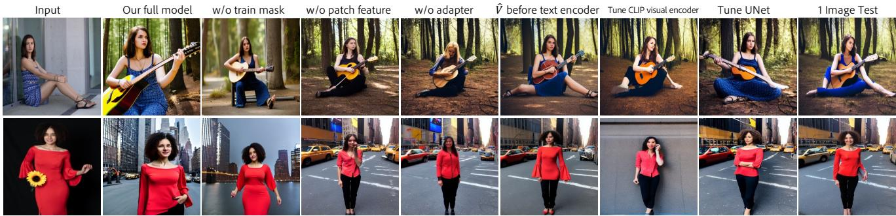

Figure 8. The visual comparison of different ablation settings. The random noise is the same for all variants of our model. The prompts and input images are taken from Fig. 4.
<table><tr><td>Methods</td><td>Align ↑</td><td>Reconstruct↑</td></tr><tr><td>InstantBooth</td><td>0.3140</td><td>0.7329</td></tr><tr><td>w/o train mask</td><td>0.3127</td><td>0.7485</td></tr><tr><td>w/o patch feature</td><td>0.3269</td><td>0.6494</td></tr><tr><td>w/o adapter</td><td>0.3242</td><td>0.5468</td></tr><tr><td> before CLIP</td><td>0.3127</td><td>0.7495</td></tr><tr><td>Tune CLIP Vis Enc</td><td>0.3266</td><td>0.6425</td></tr><tr><td>Tune U-Net</td><td>0.3142</td><td>0.7265</td></tr><tr><td>1 Image Input</td><td>0.3140</td><td>0.7261</td></tr></table>

Table 3. Ablation study for various settings of our model.

W./o. adapter. We also remove the adapter branch and study if purely $\hat { V }$ can bear sufficient identity information.

Vˆ before text encoder. Since our model inserts the $\hat { V }$ to the textual space after the CLIP text encoder, we also study the early integration of textual and visual information, i.e., we insert Vˆ into the text token space before CLIP text encoder. Tuning CLIP visual encoder. Our standard setting freezes both the backbone of CLIP visual encoder and only finetunes the linear heads. However, since the adapter is designed to extract more fine-grained content details, we also investigate whether finetuning the backbone of CLIP visual encoder can benefit the learning of object details.

Tuning U-Net. We also try to tune the U-Net parameters.

Single image as input. Since our model is flexible for the number of input images, we evaluate our model using a single image as the input image condition, i.e., N = 1.

The quantitative results are presented in Tab. 3, and the visual results are shown in Fig. 8. We observe that all the ablation settings result in weaker visual results than our full setting. Without the object mask during training, the model fails to capture accurate foreground information, and its language-understanding ability is jeopardized by the background noise. Therefore, the model tends to retain more background information, resulting in a higher reconstruction score but a lower alignment score.

Without the patch feature, text-image alignment becomes slightly better, but reconstruction degrades significantly, showing that the patch feature is crucial for identity preservation. A similar analysis applies to the entire adapter branch.

For Vˆ before CLIP, we observe a slight trade-off between alignment and reconstruction, but the visual results deteriorate. We conjecture that since the CLIP text encoder is frozen, the identity information from Vˆ is diffused by the CLIP text encoder, and thus the visual details are missing.

The results of tuning the CLIP visual encoder or U-Net indicate that tuning these modules can lead to worse identity preservation. We suspect the reason is that we keep $\beta =$ 0.3, α = 0.4 in all ablation settings. Training the additional visual encoder or U-Net makes the U-Net more dependent on the visual information, and thus such a choice of $\beta$ and α may not be optimal.

The single-image finetuning version of our model achieves the same alignment score but worse reconstruc-© 2tion, indicating that more input images can provide more details of the foreground to better preserve the identity. Nonetheless, from Fig. 6 and Fig. 8, it is impressive that our model can achieve promising identity preservation even with one input image.

## 5. Conclusion and Limitation

We present an approach that extends existing pre-trained text-to-image diffusion models for personalized image generation without test-time finetuning. The core idea is to convert input images into a global token for general concept learning and to introduce adapter layers to incorporate rich local image representation for generating fine identity details. Extensive results demonstrate that our model can generate language-aligned and identity-preserved images on unseen concepts with only a single forward pass. This remarkable efficiency improvement will enable a variety of practical personalization applications. While our model exhibits strong performance and fast speed, the current adapter structure can only take a single concept as input. Investigating this issue could be our future work.

Acknowledgement. We thank Qing Liu for dataset preparation and He Zhang for object mask computation.

## References

[1] Jean-Baptiste Alayrac, Jeff Donahue, Pauline Luc, Antoine Miech, Iain Barr, Yana Hasson, Karel Lenc, Arthur Mensch, Katie Millican, Malcolm Reynolds, et al. Flamingo: a visual language model for few-shot learning. arXiv preprint arXiv:2204.14198, 2022. 2

[2] Yogesh Balaji, Seungjun Nah, Xun Huang, Arash Vahdat, Jiaming Song, Karsten Kreis, Miika Aittala, Timo Aila, Samuli Laine, Bryan Catanzaro, et al. ediffi: Text-to-image diffusion models with an ensemble of expert denoisers. arXiv preprint arXiv:2211.01324, 2022. 1, 2

[3] Qiong Cao, Li Shen, Weidi Xie, Omkar M Parkhi, and Andrew Zisserman. Vggface2: A dataset for recognising faces across pose and age. In 2018 13th IEEE international conference on automaticface & gesture recognition (FG 2018), pages 67–74. IEEE, 2018. 5

[4] Huiwen Chang, Han Zhang, Jarred Barber, AJ Maschinot, Jose Lezama, Lu Jiang, Ming-Hsuan Yang, Kevin Murphy, William T Freeman, Michael Rubinstein, et al. Muse: Text-to-image generation via masked generative transformers. arXiv preprint arXiv:2301.00704, 2023. 1, 2

[5] Hong Chen, Yipeng Zhang, Xin Wang, Xuguang Duan, Yuwei Zhou, and Wenwu Zhu. Disenbooth: Identitypreserving disentangled tuning for subject-driven text-toimage generation. arXiv preprint arXiv:2305.03374, 2023. 2

[6] Wenhu Chen, Hexiang Hu, Yandong Li, Nataniel Rui, Xuhui Jia, Ming-Wei Chang, and William W Cohen. Subject-driven text-to-image generation via apprenticeship learning. arXiv preprint arXiv:2304.00186, 2023. 2

[7] Ming Ding, Zhuoyi Yang, Wenyi Hong, Wendi Zheng, Chang Zhou, Da Yin, Junyang Lin, Xu Zou, Zhou Shao, Hongxia Yang, et al. Cogview: Mastering text-to-image generation via transformers. Advances in Neural Information Processing Systems, 34:19822–19835, 2021. 1, 2

[8] Ming Ding, Wendi Zheng, Wenyi Hong, and Jie Tang. Cogview2: Faster and better text-to-image generation via hierarchical transformers. Advances in Neural Information Processing Systems, 35:16890–16902, 2022. 1, 2

[9] Ziyi Dong, Pengxu Wei, and Liang Lin. Dreamartist: Towards controllable one-shot text-to-image generation via contrastive prompt-tuning. arXiv preprint arXiv:2211.11337, 2022. 2

[10] Oran Gafni, Adam Polyak, Oron Ashual, Shelly Sheynin, Devi Parikh, and Yaniv Taigman. Make-a-scene: Scenebased text-to-image generation with human priors. In European Conference on Computer Vision, pages 89–106. Springer, 2022. 1, 2

[11] Rinon Gal, Yuval Alaluf, Yuval Atzmon, Or Patashnik, Amit H Bermano, Gal Chechik, and Daniel Cohen-Or. An image is worth one word: Personalizing text-toimage generation using textual inversion. arXiv preprint arXiv:2208.01618, 2022. 2, 6, 7

[12] Rinon Gal, Moab Arar, Yuval Atzmon, Amit H Bermano, Gal Chechik, and Daniel Cohen-Or. Designing an encoder for fast personalization of text-to-image models. arXiv preprint arXiv:2302.12228, 2023.

[13] Ligong Han, Yinxiao Li, Han Zhang, Peyman Milanfar, Dimitris Metaxas, and Feng Yang. Svdiff: Compact parameter space for diffusion fine-tuning. arXiv preprint arXiv:2303.11305, 2023. 2

[14] Jonathan Ho, Ajay Jain, and Pieter Abbeel. Denoising diffusion probabilistic models. Advances in Neural Information Processing Systems, 33:6840–6851, 2020. 1

[15] Xuhui Jia, Yang Zhao, Kelvin CK Chan, Yandong Li, Han Zhang, Boqing Gong, Tingbo Hou, Huisheng Wang, and Yu-Chuan Su. Taming encoder for zero fine-tuning image customization with text-to-image diffusion models. arXiv preprint arXiv:2304.02642, 2023. 2

[16] Minguk Kang, Jun-Yan Zhu, Richard Zhang, Jaesik Park, Eli Shechtman, Sylvain Paris, and Taesung Park. Scaling up gans for text-to-image synthesis. In Proceedings of the IEEE/CVF Conference on Computer Vision and Pattern Recognition, pages 10124–10134, 2023. 1, 2

[17] Nupur Kumari, Bingliang Zhang, Richard Zhang, Eli Shechtman, and Jun-Yan Zhu. Multi-concept customization of text-to-image diffusion. arXiv preprint arXiv:2212.04488, 2022. 2

[18] Alina Kuznetsova, Hassan Rom, Neil Alldrin, Jasper Uijlings, Ivan Krasin, Jordi Pont-Tuset, Shahab Kamali, Stefan Popov, Matteo Malloci, Alexander Kolesnikov, et al. The open images dataset v4: Unified image classification, object detection, and visual relationship detection at scale. International Journal ofComputer Vision, 128(7):1956–1981, 2020. 7

[19] Dongxu Li, Junnan Li, and Steven CH Hoi. Blipdiffusion: Pre-trained subject representation for controllable text-to-image generation and editing. arXiv preprint arXiv:2305.14720, 2023. 2

[20] Yuheng Li, Haotian Liu, Qingyang Wu, Fangzhou Mu, Jianwei Yang, Jianfeng Gao, Chunyuan Li, and Yong Jae Lee. Gligen: Open-set grounded text-to-image generation. arXiv preprint arXiv:2301.07093, 2023. 2, 3

[21] Jie Liang, Hui Zeng, Miaomiao Cui, Xuansong Xie, and Lei Zhang. Ppr10k: A large-scale portrait photo retouching dataset with human-region mask and group-level consistency. In Proceedings of the IEEE/CVF Conference on Computer Vision and Pattern Recognition, pages 653–661, 2021. 5

[22] Yiyang Ma, Huan Yang, Wenjing Wang, Jianlong Fu, and Jiaying Liu. Unified multi-modal latent diffusion for joint subject and text conditional image generation. arXiv preprint arXiv:2303.09319, 2023. 2

[23] Chong Mou, Xintao Wang, Liangbin Xie, Jian Zhang, Zhongang Qi, Ying Shan, and Xiaohu Qie. T2i-adapter: Learning adapters to dig out more controllable ability for text-to-image diffusion models. arXiv preprint arXiv:2302.08453, 2023. 2

[24] Alex Nichol, Prafulla Dhariwal, Aditya Ramesh, Pranav Shyam, Pamela Mishkin, Bob McGrew, Ilya Sutskever, and Mark Chen. Glide: Towards photorealistic image generation and editing with text-guided diffusion models. arXiv preprint arXiv:2112.10741, 2021. 1, 2

[25] Lu Qi, Jason Kuen, Weidong Guo, Tiancheng Shen, Jiuxiang Gu, Wenbo Li, Jiaya Jia, Zhe Lin, and Ming-Hsuan

Yang. Fine-grained entity segmentation. arXiv preprint arXiv:2211.05776, 2022. 5

[26] Lu Qi, Jason Kuen, Yi Wang, Jiuxiang Gu, Hengshuang Zhao, Philip Torr, Zhe Lin, and Jiaya Jia. Open world entity segmentation. IEEE Transactions on Pattern Analysis and Machine Intelligence, pages 1–14, 2022. 5

[27] Aditya Ramesh, Mikhail Pavlov, Gabriel Goh, Scott Gray, Chelsea Voss, Alec Radford, Mark Chen, and Ilya Sutskever. Zero-shot text-to-image generation. In International Conference on Machine Learning, pages 8821–8831. PMLR, 2021. 1, 2

[28] Aditya Ramesh, Prafulla Dhariwal, Alex Nichol, Casey Chu, and Mark Chen. Hierarchical text-conditional image generation with clip latents. arXiv preprint arXiv:2204.06125, 2022. 1, 2

[29] Robin Rombach, Andreas Blattmann, Dominik Lorenz, Patrick Esser, and Bjorn Ommer. High-resolution image¨ synthesis with latent diffusion models. In Proceedings of the IEEE/CVF Conference on Computer Vision and Pattern Recognition, pages 10684–10695, 2022. 2, 3, 5, 6

[30] Nataniel Ruiz, Yuanzhen Li, Varun Jampani, Yael Pritch, Michael Rubinstein, and Kfir Aberman. Dreambooth: Fine tuning text-to-image diffusion models for subject-driven generation. arXiv preprint arXiv:2208.12242, 2022. 2, 6, 7

[31] Nataniel Ruiz, Yuanzhen Li, Varun Jampani, Wei Wei, Tingbo Hou, Yael Pritch, Neal Wadhwa, Michael Rubinstein, and Kfir Aberman. Hyperdreambooth: Hypernetworks for fast personalization of text-to-image models. arXiv preprint arXiv:2307.06949, 2023. 2

[32] Chitwan Saharia, William Chan, Saurabh Saxena, Lala Li, Jay Whang, Emily Denton, Seyed Kamyar Seyed Ghasemipour, Burcu Karagol Ayan, S Sara Mahdavi, Rapha Gontijo Lopes, et al. Photorealistic text-to-image diffusion models with deep language understanding. arXiv preprint arXiv:2205.11487, 2022. 6

[33] Sefik Ilkin Serengil and Alper Ozpinar. Hyperextended lightface: A facial attribute analysis framework. In 2021 International Conference on Engineering and Emerging Technologies (ICEET), pages 1–4. IEEE, 2021. 5

[34] Jiaming Song, Chenlin Meng, and Stefano Ermon. Denoising diffusion implicit models. arXiv preprint arXiv:2010.02502, 2020. 1

[35] Christian Szegedy, Sergey Ioffe, Vincent Vanhoucke, and Alexander Alemi. Inception-v4, inception-resnet and the impact of residual connections on learning. In Proceedings of the AAAI conference on artificial intelligence, 2017. 5

[36] Yoad Tewel, Rinon Gal, Gal Chechik, and Yuval Atzmon. Key-locked rank one editing for text-to-image personalization. In ACM SIGGRAPH 2023 Conference Proceedings, pages 1–11, 2023. 2

[37] Andrey Voynov, Qinghao Chu, Daniel Cohen-Or, and Kfir Aberman. p+: Extended textual conditioning in text-toimage generation. arXiv preprint arXiv:2303.09522, 2023. 2

[38] Yuxiang Wei, Yabo Zhang, Zhilong Ji, Jinfeng Bai, Lei Zhang, and Wangmeng Zuo. Elite: Encoding visual con-

cepts into textual embeddings for customized text-to-image generation. arXiv preprint arXiv:2302.13848, 2023. 2, 6, 7

[39] Guangxuan Xiao, Tianwei Yin, William T Freeman, Fredo´ Durand, and Song Han. Fastcomposer: Tuning-free multisubject image generation with localized attention. arXiv preprint arXiv:2305.10431, 2023. 2

[40] Zhisheng Xiao. Dreambooth on stable diffusion. https:// github.com/XavierXiao/Dreambooth-Stable-Diffusion, 2022. 6

[41] Ziyang Yuan, Mingdeng Cao, Xintao Wang, Zhongang Qi, Chun Yuan, and Ying Shan. Customnet: Zero-shot object customization with variable-viewpoints in text-to-image diffusion models. arXiv preprint arXiv:2310.19784, 2023. 2

[42] Lvmin Zhang and Maneesh Agrawala. Adding conditional control to text-to-image diffusion models. arXiv preprint arXiv:2302.05543, 2023. 2