# JDEC: JPEG Decoding via Enhanced Continuous Cosine Coefficients

Woo Kyoung Han1,2

Sunghoon Im2

1Korea University

Jaedeok Kim3\* Kyong Hwan Jin1\*

2DGIST 3NVIDIA

{wookyoung0727, kyong jin}@korea.ac.kr, sunghoonim@dgist.ac.kr, jaedeokk@nvidia.com

## Abstract

We propose a practical approach to JPEG image decoding, utilizing a local implicit neural representation with continuous cosine formulation. The JPEG algorithm significantly quantizes discrete cosine transform (DCT) spectra to achieve a high compression rate, inevitably resulting in quality degradation while encoding an image. We have designed a continuous cosine spectrum estimator to address the quality degradation issue that restores the distorted spectrum. By leveraging local DCT formulations, our network has the privilege to exploit dequantization and upsampling simultaneously. Our proposed model enables decoding compressed images directly across different quality factors using a single pre-trained model without relying on a conventional JPEG decoder. As a result, our proposed network achieves state-of-the-art performance in flexible color image JPEG artifact removal tasks. Our source code is available at https://github.com/ WooKyoungHan/JDEC.

## 1. Introduction

Within the dynamic evolution of high-efficiency image compression, it is notable that JPEG [33] maintains a pivotal position. JPEG, renowned for its compatibility and standardization, is the most famous image coder-decoder (CODEC) among conventional lossy compression methods. Therefore, a high-quality JPEG decoder applies to all existing compressed JPEG files. JPEG reduces file size through downsampling color components and quantizing the discrete cosine transform (DCT) spectra, which leads to a complicated loss of image information and distortion. Consequently, the design of a high-quality JPEG decoder presents a dual challenge: 1) the restoration of complex losses from the JPEG encoder and 2) the modeling of a network that employs a spectrum as an input and its image as an output.

Many deep neural networks (DNNs) have been proposed as promising solutions for the JPEG artifact removal [11, 14, 18, 24, 35–37]. Most existing methods, such as [11, 24], are dedicated to specific quality factors, providing multiple models to cover JPEG compression. In recent studies [14, 18], the quality-dedicated problem has been addressed through the utilization of quantization maps [14] or the estimation of quality factors [18]. The existing artifact removal networks commonly take the decoded image as input, even though the encoded spectrum contains more information than the decoded image, according to the data processing inequality [10]. The property is explained in the supplement material.

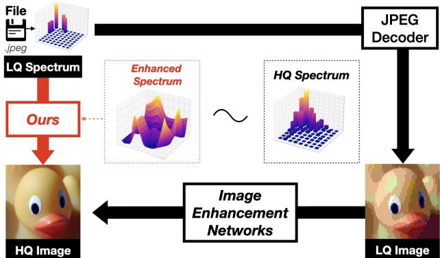  
Figure 1. Overall concept of proposed JPEG decoding Instead of using a conventional JPEG decoder to refine the high-quality (HQ) image from the low-quality (LQ) image, our JDEC directly decodes the LQ spectrum by learning a continuous spectrum.

Due to the characteristics of the JPEG algorithm, it is non-trivial to design a neural network that takes spectra as inputs [15, 34]. Park et al. [28] proposed a method of processing spectra to transformers. In the context of spectral processing, our approach extends beyond proposed classification networks [15, 28, 34] by leveraging the capabilities of the embedding strategy, paving the way for more effective decoding. The spectrum conversion aligns with recent advancements in implicit neural representation (INR), where methods adopting sinusoidal functions [5, 16, 20, 21, 27, 32] have demonstrated significant advancement across various tasks.

In this paper, we propose an advanced model, the JPEG Decoder with Enhanced Continuous cosine coefficients (JDEC), for retrieving high-quality images from compressed spectra. As an artifact removal network, our JDEC does not require a conventional JPEG decoder compared to existing methods shown in Fig. 1. JDEC captures the dominant frequency and its amplitude, thereby representing the high-quality spectrum through continuous cosine formulation (CCF). The CCF module estimates a continuous form of a given discrete cosine spectrum. The proposed model represents a considerable improvement in decoding JPEG bitstream. As shown in Fig. 2, our JDEC decodes high-quality images with fewer bit errors than the original JPEG decoder.

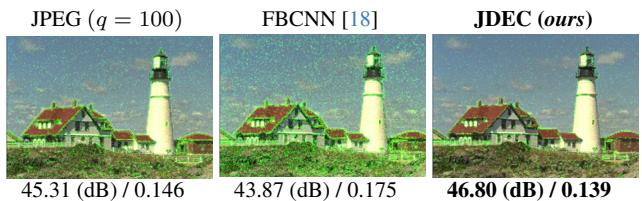  
Figure 2. Visual Demonstration at $q \ = \ 1 0 0$ (PSNR (dB) ↑ / Bit-Error-Rate (BER) ↓) of decoding compressed image: JPEG (quality factor = 100), image enhancement approach [18] predicted from JPEG image $( q = 1 0 0 )$ , and JDEC (ours) predicted directly from a JPEG bit-stream. We highlight the occurrence of bit errors overlaid with green dots.

In summary, our main contributions are as follows:

• We propose a local implicit neural representation that decodes JPEG files across various quality factors (QF) with continuous cosine spectra.

• We show that the suggested continuous cosine formulation module lets the network predict spectra highly correlated with the ground truth’s spectrum.

• We demonstrate that our proposed method operates as a practical decoder, delivering superior image quality, including the generally used quality factor.

## 2. Related Work

JPEG Background According to Shannon’s source coding theorem [30], a loss of image information is unavoidable to achieve high-efficiency compression. The JPEG initiates the encoding process by decomposing an input RGB image to luminance and chroma components [33]. The chroma components are downsampled using the nearest neighbor method by a factor of $\times 2$ . The JPEG subtracts the midpoint of the pixel value (=128) to images and divides it into $8 \times 8$ crops. Then, each crop is transformed into 2D-DCT [2] spectra. Following this, the encoder quantizes the spectrum of each block using a predefined quantization matrix depending on a quality factor q, and then the quantized spectrum is coded using Huffman coding. We illustrate the process of the JPEG encoder in Fig. 3.

Due to the nature of DCT, the energy of spectra is concentrated in low-frequency components. Since the quantization matrix treats high-frequency components more severely than low-frequency components, most distortions occur in the high-frequency components. In the JPEG decoder, the quantization matrix is directly applied to the quantized spectra, transforming them into images. Consequently, all incurred losses, especially those in highfrequency components, are directly conveyed to the resulting image.

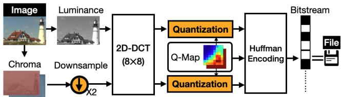  
Figure 3. Overall process of the JPEG encoder. Luminance and chroma components are separated from an RGB image. Both components are converted to DCT spectra and quantized with a pre-defined quantization matrix (Q-map). All losses occur in the orange area.

JPEG Artifact Removal To address the aforementioned problem, learning-based methods have enhanced the quality of a decoded image. Dong et al. [11] introduced a neural network that utilizes a super-resolution network [12] for JPEG artifact removal. Most of the proposed neural networks are dedicated to a specific quality factor [7, 8, 11, 23]. To tackle the quality-dedicated issue, Jiang et al. [18] proposed a method to estimate a quality factor, solving flexible JPEG artifact removal and handling a double JPEG artifact. However, the existing artifact removal methods take images as input, incorporating the conventional JPEG decoder before using their network. Recently, Bahat et al. [4] proposed a novel method for JPEG decoding, which takes spectra as input. However, the proposed method does not consider color components with trainable decoding and does not recover high-quality factors.

Learning in the Frequency domain In an image classification task, skipping a conventional JPEG decoding [15, 34] has been proposed, especially optimizing CNNs. Embedding techniques [15] tackle the size mismatch issue between luma and chroma components, such as upsampling chroma components before forwarding to a network and upsampling chroma features after forwarding to a shallow network. The proposed methods boost computation time without dropping the original performance. Recently, the approach adopting vision transformers [13] instead of CNNs has promising performance [28]. We adopt the proposed embedding method from [28] and modified [25] SwinV2 transformer suitable for image decoding.

## 3. Method

Problem Formulation Let $\mathbf { I } _ { \mathbf { G T } } \in \mathbb { R } ^ { H \times W \times 3 }$ be a groundtruth RGB image. The JPEG encoder separates $\mathbf { I } _ { \mathbf { G T } }$ to luminance component $( \mathbf { I } _ { \mathbf { Y } } \in \mathbb { R } ^ { H \times W \times 1 } )$ and chroma components $( \mathbf { I } _ { \mathbf { C } } \in \bar { \mathbb { R } } ^ { H \times W \times 2 } )$ and downsamples chroma components by a factor of 2, i.e. $( \mathbf { I } _ { \mathbf { C } } ^ { \downarrow } \in \mathbb { R } ^ { \frac { H ^ { \bot } } { 2 } \times \frac { W } { 2 } \times 2 } )$ . The superscript ↓ indicates $\mathbf { a } \times 2$ downsampling. Then, each component is divided into $8 \times 8$ blocks $( \mathbf { I } \in \mathbb { R } ^ { 8 \times 8 } \subset \mathbf { I } _ { \mathbf { Y } } , \mathbf { I } _ { \mathbf { C } } ^ { \downarrow } )$ 2D-DCT [2] into spectra $\mathbf { X } \in \mathbb { R } ^ { 8 \times 8 }$ is defined as below:

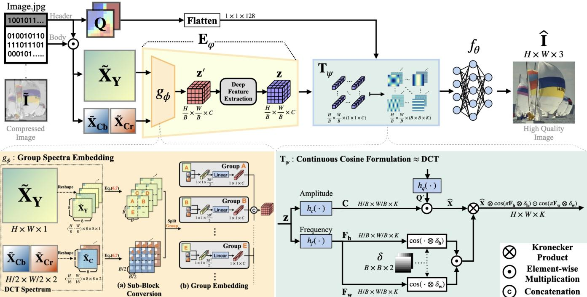  
Figure 4. Decoding a JPEG bitstream with the proposed JDEC. JDEC consists of an encoder $( E _ { \varphi } )$ with group spectra embedding $( g _ { \phi } ) ,$ a decoder $\left( f _ { \theta } \right)$ , and continuous cosine formulation $( T _ { \psi } )$ . Inputs of JDEC are as follows: compressed spectra $( \tilde { \bf X } { \bf Y } , \tilde { \bf X } { \bf c } )$ , quantization map $\mathbf { Q } .$ Note that our JDEC does not take ˜I as an input. JDEC formulates latent features into a trainable continuous cosine coefficient as a function of block grid δ and forward to INR $\left( f _ { \theta } \right)$ . Therefore, each $B \times B$ block shares the estimated continuous cosine spectrum.

$$
D C T ( \mathbf { I } ) : = \mathbf { X } = \mathbf { D } \mathbf { I } \mathbf { D } ^ { \top } .\tag{1}
$$

The orthonormal basis matrix $\mathbf { D } ( = \mathbf { D } _ { 8 } )$ is defined as:

$$
\begin{array} { l } { { \bf D } _ { N } : = [ \alpha ] \odot \cos ( [ \pi [ F _ { k | N } ] _ { k = 0 } ^ { N - 1 } \otimes [ k ] _ { k = 0 } ^ { N - 1 ^ { \top } } ] ) \qquad ( 2 ) } \\ { = \sqrt { \frac 2 N } \left[ \begin{array} { c c c c } { \frac 1 { \sqrt 2 } } & { \frac 1 { \sqrt 2 } } & { \cdots } & { \frac 1 { \sqrt 2 } } \\ { \cos \left( \frac { 1 \pi } { 2 N } \right) } & { \cos \left( \frac { 3 \pi } { 2 N } \right) } & { \cdots } & { \cos \left( \frac { ( 2 N - 1 ) \pi } { 2 N } \right) } \\ { \vdots } & { \ddots } & { \vdots } \\ { \cos \left( \frac { ( N - 1 ) \pi } { 2 N } \right) \cos \left( \frac { 3 ( N - 1 ) \pi } { 2 N } \right) } & { \cdots } & { \cos \left( \frac { ( 2 N - 1 ) ( N - 1 ) \pi } { 2 N } \right) } \end{array} \right] } \end{array}
$$

where $F _ { k | N } : = ( 2 k + 1 ) / 2 N$ is a fixed frequency of a coordinate k with a given size N and [α] is the scaling matrix for orthonormality. The operations ⊗ and ⊙ are a Kronecker product and element-wise multiplication, respectively.

Quantization is conducted with a predefined quantization matrix ${ \bf Q } = [ { \bf Q } _ { { \bf Y } } ; { \bf Q } _ { { \bf C } } ] \in \mathbb { N } ^ { 8 \times 8 \times 2 } \mathrm { ~ }$ s.t.

$$
\tilde { \mathbf { C } } : = \left\lfloor \mathbf { X } \odot \frac { 1 } { \mathbf { Q } } \right\rceil , \tilde { \mathbf { X } } = \tilde { \mathbf { C } } \odot \mathbf { Q } ,\tag{3}
$$

where ⌊·⌉ is a round operation that maps to the nearest integer. $1 / \mathbf { Q }$ denotes an element-wise division. The JPEG encoder compresses the header Q and the body of

a code $\tilde { \mathbf { C } }$ separately. In the decoder part, the JPEG restores the image from the compressed header and body by $\tilde { \mathbf { I } } = D C T ^ { - 1 } ( \tilde { \mathbf { C } } \odot \mathbf { Q } )$

To summarize this, the corrupted JPEG image ˜I is obtained by

$$
\begin{array} { r } { \left[ \tilde { \mathbf { I } } _ { \mathbf { Y } } \right] = \left[ { D C T ^ { - 1 } ( \lfloor { D C T ( \mathbf { I } _ { \mathbf { Y } } ) \odot \frac { 1 } { \mathbf { Q } _ { Y } } } \rceil \odot \mathbf { Q } _ { \mathbf { Y } } ) } \right] } \\ { \left[ \tilde { \mathbf { I } } _ { \mathbf { C } } \right] = \left[ { D C T ^ { - 1 } ( \lfloor { D C T ( \mathbf { I } _ { \mathbf { C } } ^ { \downarrow } ) \odot \frac { 1 } { \mathbf { Q } _ { C } } } \rceil \odot \mathbf { Q } _ { \mathbf { C } } ) ^ { \uparrow } } \right] , } \end{array}\tag{4}
$$

where the superscript ↑ indicates ×2 upsampling in the spatial domain. We here observe from Eq. (4) that most of the loss of image information is induced by the quantization step. The shape of the chroma component $\mathbf { \bar { X } _ { C } } \in$ $\mathbb { R } ^ { \frac { H } { 2 } \times \frac { W } { 2 } \times 2 }$ is different from the luminance component $\tilde { \mathbf { X } } _ { \mathbf { Y } } \in \mathbb { R } ^ { H \times W \times 1 }$ . We will consider observations in the design of our proposed network.

We propose a JPEG decoder network, JDEC JΘ, defined by

$$
\mathbf { J } _ { \Theta } \colon ( \tilde { \mathbf { X } } _ { \mathbf { Y } } , \tilde { \mathbf { X } } _ { \mathbf { C } } ; \mathbf { Q } ) \mapsto \widehat { \mathbf { I } } .\tag{5}
$$

The network directly accepts quantized spectrum $\tilde { \mathbf { X } } _ { \mathbf { Y } }$ and $\tilde { \mathbf { X } } _ { \mathbf { C } }$ with a quantization matrix as the network inputs, enabling to decode JPEG directly from encoded JPEG data. Our proposed JDEC comprises mainly three parts: encoder $\mathbf { E } _ { \varphi }$ with group embedding, continuous cosine formulation $\mathbf { T } _ { \psi } .$ , and decoder $f _ { \theta }$ with an implicit neural representation.

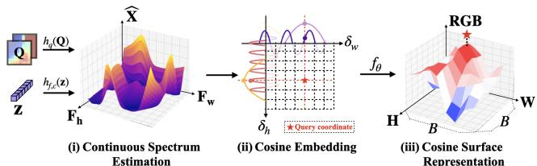  
Figure 5. Graphical summary of $f _ { \boldsymbol { \theta } } ( T _ { \boldsymbol { \psi } } ( \delta , { \bf z } ; { \bf Q } ) )$ ). Each $1 \times 1 -$ sized feature z maps into a $B \times B$ pixel area. $T _ { \psi }$ embeds the local coordinates of $B \times B$ area and forwards to $f _ { \theta }$

Encoder $( { \bf E } _ { \varphi } )$ The encoder is a function $\mathbf { E } _ { \varphi } \colon ( \tilde { \mathbf { X } } _ { \mathbf { Y } } , \tilde { \mathbf { X } } _ { \mathbf { C } } ) \ \mapsto \ \textbf { z } \in \ \mathbb { R } ^ { \frac { H } { B } \times \frac { W } { B } \times C }$ We model the encoder $\mathbf { E } _ { \varphi }$ by using SwinV2 [25]. To allow the different shape of spectrum $\tilde { \mathbf { X } } _ { \mathbf { Y } }$ and $\tilde { \mathbf { X } } _ { \mathbf { C } }$ , we apply the group spectra embedding layer $g _ { \phi }$ proposed by [28]. The embedding layer $( g _ { \phi } )$ transforms luminance and chroma spectra through two steps. We convert $8 \times 8$ spectra into $B \times B$ for luma and $B / 2 \times B / 2$ for chroma via sub-block conversion [17] in the (a) part of $g _ { \phi }$ in Fig. 4. We implement the block size $B = 4 ^ { 1 }$

$$
\mathbf { X } _ { \mathbf { Y } } ^ { \prime } = \mathbf { D } _ { B } ^ { * } ( \mathbf { D } ^ { \top } \mathbf { X } _ { \mathbf { Y } } \mathbf { D } ) \mathbf { D } _ { B } ^ { * \top } ,\tag{6}
$$

$$
\begin{array} { r } { \mathbf { X } _ { \mathbf { C } } ^ { \prime } = \mathbf { D } _ { B / 2 } ^ { * } ( \mathbf { D } ^ { \top } \mathbf { X } _ { \mathbf { C } } \mathbf { D } ) \mathbf { D } _ { B / 2 } ^ { * \top } , } \end{array}\tag{7}
$$

where $D _ { N } ^ { * }$ indicates a block diagonal matrix with size $8 \times 8$ In part (b) of Fig. 4, spectra are reshaped and concatenated to RHB × WB × 3B2   
2 which is the sum of converted size. Then initialized latent vector $\mathbf { z } ^ { \prime } \in \mathbb { R } ^ { \frac { H } { B } \times \frac { W } { B } \times C }$ are conducted in (b) part of $g _ { \phi }$ . Following the prior work, [22], we adopt the deep feature extractor, replacing the Swin attention module with the SwinV2 attention module.

Continuous Cosine Formulation $( \mathbf { T } _ { \psi } )$ Each JPEG block shares a distorted DCT spectrum. Modifying the entire spectrum is required to restore the distortion of a block. To address the spectrum distortion issue derived from the JPEG encoder, we introduce Continuous Cosine Formulation (CCF) module, which enhances the cosine spectrum. The CCF constructs a continuous spectrum corresponding to $B \times B$ embedded block by estimating dominant frequencies and amplitudes of a cosine transform. Illustrated in Figure 5, each block has identical amplitudes and frequencies within the embedded block coordinate $\boldsymbol \delta : = [ ( i , j ) ] _ { i , j = 0 } ^ { \boldsymbol B - 1 }$

Our CCF takes a latent vector z from encoder $\mathbf { E } _ { \varphi }$ and a quantization matrix Q. The CCF T consists of three elements: frequency estimator $h _ { f } \colon \mathbb { R } ^ { \dot { C } } \mapsto \mathbb { R } ^ { 2 K }$ , coefficient estimator $h _ { c } \colon \mathbb { R } ^ { C } \mapsto \mathbb { R } ^ { K }$ , and quantization matrix encoder $h _ { q } \colon { \mathbb { R } } ^ { 1 2 8 } \mapsto { \mathbb { R } } ^ { K }$ . Each frequency and coefficient estimator comprises sequential convolution and non-linear activation layers. As a method for quantization recovery, we implement an amplitude recovery method as described below, drawing inspiration from the existing dequantization

network [16],

$$
\widehat { \mathbf { X } } = \mathbf { C } \odot \mathbf { Q } ^ { \prime } \sim E q . ( 3 ) ,\tag{8}
$$

where ${ \bf Q } ^ { \prime } = h _ { q } ( { \bf Q } )$ and $\mathbf { C } = h _ { c } ( \mathbf { z } )$

We hypothesize that estimating the frequency components effectively mitigates aliasing (i.e., quantization and downsampling) derived from JPEG. It has been demonstrated that trainable frequencies and phasors effectively mitigate upsampling and dequantization [16, 21].

We thus formulate the CCF module approximates $B \times B$ spectral features from the fiber of z:

$$
\mathbf { T } _ { \psi } ( \mathbf { z } , \delta _ { \mathbf { h } , \mathbf { w } } ; \mathbf { Q } ) = \widehat { \mathbf { X } } \otimes ( \cos ( \pi \mathbf { F } _ { \mathbf { h } } \otimes \delta _ { \mathbf { h } } ) \odot \cos ( \pi \mathbf { F } _ { \mathbf { w } } \otimes \delta _ { \mathbf { w } } ) ) ,\tag{9}
$$

where $[ { \bf F _ { h } } ; { \bf F _ { w } } ] = h _ { f } ( { \bf z } ) . \delta _ { \bf h , w }$ denotes vertical and horizontal coordinates of δ. Note that $\widehat { \mathbf { X } } , \mathbf { F } _ { \mathbf { h } } , \mathbf { F _ { w } } \in \mathbb { R } ^ { K }$ are amplitude and frequencies for the spatial coordinate $\delta ,$ respectively. i.e. the CCF maps embedded features and block coordinates by $\mathbf { T } _ { \psi } : \big ( \mathbb { R } ^ { 1 \times 1 \times C } , \mathbb { R } ^ { B \times B \times 2 } \big ) \mapsto \mathbb { R } ^ { B \times B \times K }$ Decoder $\left( f _ { \theta } \right)$ Our decoder $f _ { \theta } \colon \mathbb { R } ^ { K } \mapsto \mathbb { R } ^ { 3 }$ is a local implicit neural representation function of $\{ \mathbf { z } , \mathbf { Q } \} , \delta . \mathrm { i . e . }$

$$
\hat { \bf I } = f _ { \theta } ( \widehat { \bf X } \otimes ( \cos ( \pi { \bf F _ { h } } \otimes \delta _ { \bf h } ) \odot \cos ( \pi { \bf F _ { w } } \otimes \delta _ { \bf w } ) ) ) .\tag{10}
$$

Therefore, in the $B \times B$ block of Eq. (10), the estimated basis of $\hat { \bf X }$ and its reconstruction follows:

$$
\mathbf { I } = \mathbf { D } ^ { \top } \mathbf { X } \mathbf { D } \simeq f _ { \theta } ^ { \prime } ( \mathbf { \Lambda } \mathbf { \Lambda } \mathbf { \hat { X } } ^ { \prime } \mathbf { \Lambda } \mathbf { \Lambda } \mathbf { \Lambda } \mathbf { \Lambda } ) ,\tag{11}
$$

where $\mathbf { \Lambda } _ { \mathbf { h } , \mathbf { w } } = \cos ( [ \pi \mathbf { F } _ { \mathbf { h } , \mathbf { w } } \otimes \delta _ { \mathbf { h } , \mathbf { w } } ] )$ and $f _ { \theta } ^ { \prime }$ satisfy $f _ { \theta } =$ $f _ { \theta } ^ { \prime } \circ W$ for a trainable fully-connected layer W. With a linear layer $W$ , the Eq. (10) complete the quadratic form $\Lambda _ { 1 } \widehat { { \bf X } } ^ { \prime } \Lambda _ { 2 } = W ( { \bf T } _ { \psi } ( { \bf z } , { \bf Q } ; \delta ) )$ by including summation of features. We optimize a set of trainable parameters $\Theta : =$ $\{ \varphi ; \psi ; \theta \}$ with the equation below:

$$
\widehat { \Theta } = \arg \operatorname* { m i n } _ { \Theta } \big \| \mathbf { I } _ { G T } - \widehat { \mathbf { I } } ( \widetilde { \mathbf { X } } _ { \mathbf { Y } } , \widetilde { \mathbf { X } } _ { \mathbf { C } } , \mathbf { Q } ; \Theta ) \big \| _ { 1 } .\tag{12}
$$

We will demonstrate the estimated frequencies $( \mathbf { F } _ { \mathbf { h } } , \mathbf { F } _ { \mathbf { w } } )$ and amplitudes $\widehat { \mathbf X }$ of networks follows $\bar { \bf X }$ in the following section.

## 4. Experiments

## 4.1. Network Details

Encoder $( { \bf E } _ { \varphi } )$ and Decoder (fθ) The linear layer in group spectra embedding module $g _ { \phi }$ has an embedding size C of 256. We modified the deep feature extract part of SwinIR [22]. The window attention module is replaced with SwinV2 [25], with a window size of 7. [22] and [28] reported that a window size of 8 significantly drops the performance of the network. Each residual Swin transformer block includes 6 Swin transformer layers. The decoder $f _ { \theta }$ is an MLP composed of 5 linear layers with 512 hidden channels K and ReLU activations.

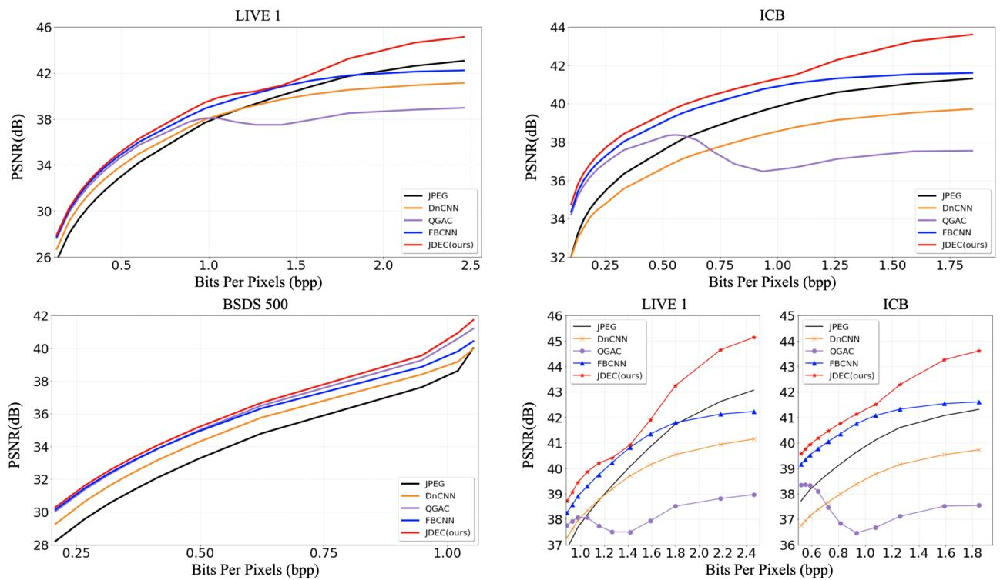  
Figure 6. RD curve results on LIVE-1 [31] (top left), ICB [29] (top right), BSDS500 [3] (bottom left). We highlight the high-quality factor parts q ∈ [90, 100] in the bottom right part. We show PSNR as a measure of distortion (higher is better). We observe that our JDEC decodes high-quality images better than other methods.

<table><tr><td>Test</td><td colspan="4">LIVE-1 [31]</td><td colspan="3">BSDS500 [3]</td><td colspan="4">ICB [29]</td></tr><tr><td>Method</td><td>q = 10</td><td>q = 20</td><td>q = 30 q = 40</td><td>q = 10</td><td>q = 20</td><td>q = 30</td><td>q = 40</td><td>q = 10 q =</td><td>20</td><td>q = 30</td><td>q = 40</td></tr><tr><td rowspan="2">JPEG</td><td rowspan="2">25.6924.20 0.759</td><td>28.06|26.49</td><td>29.37|27.84</td><td>30.2828.84</td><td>25.8424.13 28.21|26.37</td><td>29.57|27.72</td><td>30.52|28.69</td><td>29.44|28.53</td><td>32.01|31.11</td><td>33.20|32.35</td><td>33.95|33.14</td></tr><tr><td>0.841</td><td>0.875</td><td>0.894</td><td>0.759 0.844</td><td>0.880</td><td>0.900</td><td>0.753</td><td>0.807</td><td>0.833</td><td>0.844</td></tr><tr><td rowspan="2">DMCNN [36]</td><td></td><td>27.18|27.0329.45|29.08</td><td></td><td></td><td>27.16|26.9529.35|28.84</td><td></td><td></td><td>30.85|</td><td>32.77|</td><td></td><td></td></tr><tr><td>0.810</td><td>0.874</td><td></td><td>0.799</td><td>0.866</td><td></td><td></td><td>0.796</td><td>0.830</td><td></td><td></td></tr><tr><td rowspan="2">IDCN [37]</td><td></td><td>27.62|27.3230.01|29.49</td><td></td><td></td><td>27.61|27.2228.01|25.57</td><td></td><td></td><td>31.71|</td><td>33.99|</td><td></td><td></td></tr><tr><td>0.816</td><td>0.881</td><td></td><td>0.805</td><td>0.873</td><td></td><td></td><td>0.809</td><td>0.838</td><td></td><td></td></tr><tr><td rowspan="2">Swin2SR* [9]</td><td>27.98|</td><td></td><td></td><td>32.53</td><td></td><td></td><td></td><td>32.46|</td><td></td><td></td><td>36.25|</td></tr><tr><td></td><td></td><td></td><td></td><td></td><td></td><td></td><td></td><td></td><td></td><td></td></tr><tr><td rowspan="2">DnCNN [35]</td><td></td><td></td><td>26.68|26.47 29.12|28.77 30.43|30.04 31.34|30.94</td><td></td><td>26.82|26.53 29.26|28.7430.63|30.02 31.59|30.92</td><td></td><td></td><td>29.78|29.71 31.99|31.90 32.98|32.8933.52|33.42</td><td></td><td></td><td></td></tr><tr><td>0.794</td><td>0.866</td><td>0.895</td><td>0.911</td><td>0.793 0.867</td><td>0.898</td><td>0.915</td><td>0.726</td><td>0.765</td><td>0.786</td><td>0.978</td></tr><tr><td rowspan="2">QGAC [14]</td><td></td><td>27.65|27.4329.88|29.5631.17|30.77</td><td></td><td>32.08|31.64</td><td>27.75|27.4830.04|29.55</td><td>31.36|30.73 32.29|31.53</td><td></td><td></td><td>32.12|32.0934.22|34.1835.18|35.1335.71|35.65</td><td></td><td></td></tr><tr><td>0.819</td><td>0.882</td><td>0.908</td><td>0.922</td><td>0.819 0.884</td><td>0.911</td><td>0.926</td><td>0.814</td><td>0.844</td><td>0.859</td><td>0.865</td></tr><tr><td rowspan="2">FBCNN [18]</td><td>27.77|27.5130.11|29.7031.43|30.92</td><td></td><td></td><td>232.34|31.80</td><td>27.85|27.53 30.14|29.5831.45|30.74 32.36|31.54</td><td></td><td></td><td></td><td>32.18|32.15 34.38|34.3435.41|35.3536.02|35.95</td><td></td><td></td></tr><tr><td>0.816</td><td>0.881</td><td>0.908</td><td>0.923</td><td>0.814 0.881</td><td>0.909</td><td>0.924</td><td>0.813</td><td>0.844</td><td>0.859</td><td>0.869</td></tr><tr><td rowspan="2">JDEC (ours)</td><td>27.95|27.71</td><td>30.26|29.87</td><td>31.59|31.12</td><td>32.50|31.98</td><td>28.00|27.67 30.31|29.71</td><td>31.65|30.88</td><td>32.53|31.68</td><td>32.55|32.51</td><td>34.73|34.68</td><td>35.75|35.68 36.37|36.28</td><td></td></tr><tr><td>0.821</td><td>0.885</td><td>0.911</td><td>0.925</td><td>0.819 0.885</td><td>0.912</td><td>0.927</td><td>0.818</td><td>0.847</td><td>0.862</td><td>0.871</td></tr></table>

Table 1. Quantitative comparisons (PSNR (dB) | PSNR-B (dB) (top), SSIM (bottom)) with the color JPEG artifact removal networks. Red and blue colors indicate the best and the second-best performance, respectively. (-) indicates not reported. (\*) indicates using additional datasets. Note that only JPEG [33] and our JDEC get spectra as input.

CCF The CCF includes a frequency estimator $h _ { f } ,$ an amplitude estimator $h _ { c } ,$ and a quantization matrix encoder $h _ { q } .$ [16, 20, 21] show that learning frequency, phase, and amplitude components enhance the performance of the INR. The quantization matrix encoder $h _ { q }$ is a single fully connected layer, having $5 1 2 ( = K )$ channels. The amplitude and frequency estimator $( h _ { c } , h _ { f } )$ is designed with two 3×3 convolutional layers with a ReLU activation. The frequency estimator has $2 K ( = 1 0 2 4 )$ output channels for h and w axis, while the amplitude estimator has K(= 512) channels.

## 4.2. Training

Dataset Following the previous work [14, 18], we use DIV2K and Flickr2K [1]. Each dataset contains 800 and 2650 images, respectively. For generating synthetic JPEG compression, we use the OpenCV standard [6]. We compress images using randomly sampled quality factors with steps of 10 in the range [10,100]. We directly extract quantization maps Q and coefficients of spectra C˜ from JPEG files and construct spectra X˜ , following the Eq. (3). Since

BSDS500[3]

LIVE1[31]

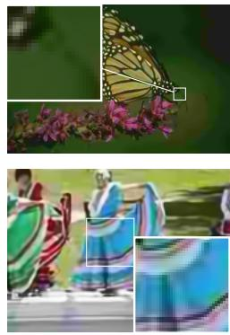  
DnCNN [35]

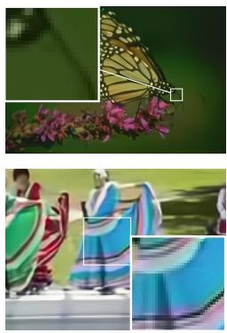  
QGAC [14]

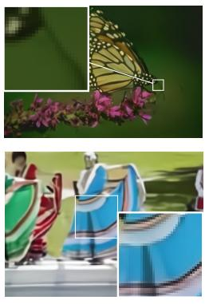  
FBCNN [18]  
Figure 7. Qualitative comparison in color JPEG artifact removal (q = 10).

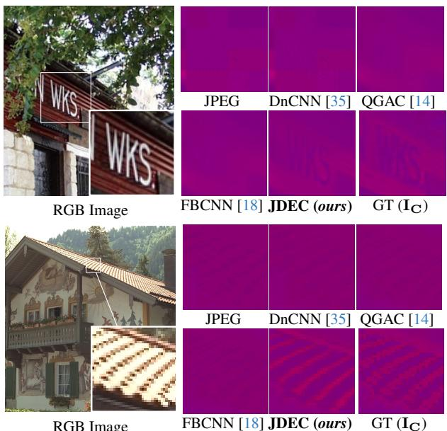  
RGB Image  
Figure 8. Qualitative comparison in chroma components $\mathbf { I _ { c } }$ of images (q = 10).

the dynamic range of spectra depends on frequency, we should normalize spectra in a range of [−1, 1]. The quantization maps are normalized with the same normalization function. The ground truth (GT) images are prepared with a range of [−0.5, 0.5] because the JPEG encoder subtracts the midpoint of the image range (=128).

Implementation Detail We use 112 × 112 patches as inputs to our network. This size is chosen because it is the least common multiple of the minimum unit size of color JPEG (16 × 16) and the window size of our Swin architecture [25] (7 × 7). The network is trained for 1000 epochs with batch size 16. We optimize our network by Adam [19]. The learning rate is initialized as 1e-4 and decayed by factor 0.5 at [200, 400, 600, 800].

## 4.3. Evaluation

Quantitative Result For evaluation, we use LIVE-1 [31], testset of BSDS500 [3] and ICB [29] dataset. In the aspect of the JPEG decoder, we present the rate-distortion curve to illustrate the trade-off between bits-per-pixel (bpp) and peak signal-to-noise ratio (PSNR) where quality factors in a range of [10, 100]. We observed that BSDS500 [3] is saved as JPEG with a quality factor of 95. Therefore, the reported BSDS500 data is within a quality factor of 90. We compare our JDEC against existing compression artifact removal models: DnCNN [35], QGAC [14], and FBCNN [18] in Fig. 6. The selected models cover a relatively wide range of quality factors with a single network. We evaluate DnCNN [35] following the suggested method in QGAC [14], with channels being processed independently. Despite QGAC [14] having a training range of [10, 100], it experiences a drop in performance in the range of (90, 100] across all datasets. FBCNN [18] also exhibits a performance drop in the range of [95, 100] when evaluated on the LIVE-1 [31] dataset. In comparison, JDEC outperforms all other methods, regardless of the quality factor or dataset.

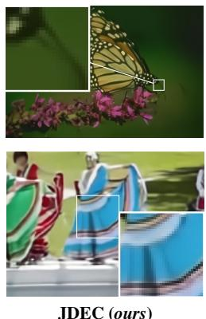

GT  
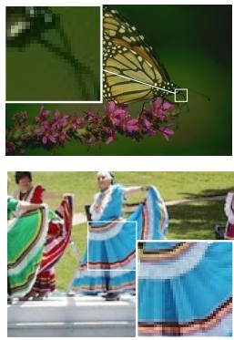

Luma(IY)|Chroma(IC)
<table><tr><td rowspan="2">Method</td><td colspan="5">Luma(1Y)Chroma(1C)</td></tr><tr><td>q = 10</td><td>q = 20</td><td>q = 30</td><td></td><td>q = 40</td></tr><tr><td>JPEG</td><td>34.39|35.77</td><td></td><td>37.32|38.90</td><td>39.85|40.72</td><td></td><td>39.82|39.59</td></tr><tr><td>DnCNN [35]</td><td>35.30|35.85</td><td></td><td>37.60|38.01</td><td>38.78|38.96</td><td></td><td>39.45|39.51</td></tr><tr><td>QGAC [14]</td><td>37.28|38.18</td><td></td><td>39.7539.94</td><td>41.00|40.69</td><td></td><td>41.73|41.09</td></tr><tr><td>FBCNN [18]</td><td>37.12|38.36</td><td></td><td>39.71|40.21</td><td>40.97|41.04</td><td></td><td>41.81|41.50</td></tr><tr><td>JDEC (ours)</td><td>37.32|38.90</td><td></td><td>39.85|40.72</td><td>41.11|41.52</td><td></td><td>41.92|41.96</td></tr></table>

Table 2. Quantitative comparisons of each components in ICB [29] datasets. (PSNR(dB))

Regarding JPEG artifact removal, we report PSNR, structural similarity index (SSIM), and PSNR-B for estimating de-blocking in Tab. 1. We include DMCNN [36], IDCN [37], and transformer-based Swin2SR [9] as additional comparative groups since they cover a range of quality factors. Note that the Swin2SR has trained on a limited range of quality factors in a range of [10, 40] with additional datasets, including the train and test dataset of BSDS500 [3] and Waterloo [26]. We partitioned the data presented in Tab. 1 to distinguish between networks operating within limited and expansive ranges. Our JDEC shows remarkable performance compared to other methods. The maximum PSNR interval is 0.37dB on ICB for q = 10.

We demonstrate Tab. 2 to observe the restoration effects of two components of different sizes $\mathbf { I } _ { \mathbf { Y } } \in \mathbb { R } ^ { H \times W \times 1 } , \mathbf { I _ { C } } \in$ $\mathbb { R } ^ { \frac { H } { 2 } \times \frac { W } { 2 } \times 2 }$ . According to Tab. 2, the performance difference in the chroma component I is greater than the difference of the luma component IY indicating an empirical upsampling effect.

<table><tr><td>Test</td><td colspan="4">LIVE-1 [31]</td></tr><tr><td>Method</td><td>q = 80</td><td>q = 90</td><td>q = 95*</td><td>q = 100</td></tr><tr><td>JPEG</td><td>34.23|33.45 0.948 35.01|34.69</td><td>36.86|36.45 0.967 37.29|36.97</td><td>39.33|38.90 0.979 39.20|38.79</td><td>43.0742.37 0.993 41.15|40.59</td></tr><tr><td>DNCNN [35]</td><td>0.954</td><td>0.970</td><td>0.980</td><td>0.987</td></tr><tr><td>QGAC [14]</td><td>35.75|35.19 0.960</td><td>37.75|37.20 0.973</td><td>37.50| 37.01 0.974</td><td>38.97|38.56 0.979</td></tr><tr><td>FBCNN [18]</td><td>36.02|35.41 0.961 36.31| 35.73</td><td>38.25|37.68 0.974 38.72|38.17</td><td>40.23|39.65 0.983 40.41|39.90</td><td>42.23|41.52 0.990 45.14|44.20</td></tr><tr><td>JDEC (ours)</td><td colspan="3">0.963 0.976 0.983</td><td>0.995</td></tr><tr><td>Test</td><td colspan="3">ICB [29]</td><td></td></tr><tr><td>Method</td><td>q = 80</td><td>q = 90</td><td>q = 95*</td><td>q = 100</td></tr><tr><td>JPEG</td><td>36.34|35.82 0.891 35.57|35.44</td><td>37.7237.40 0.912</td><td>39.17|39.01 0.934</td><td>41.31|41.28 0.955</td></tr><tr><td>DNCNN [35]</td><td>0.844 37.58|37.47</td><td>36.75|36.64 0.868 38.34|38.21</td><td>37.99|37.92 0.891</td><td>39.73| 39.69 0.915</td></tr><tr><td>QGAC [14]</td><td>0.902 38.03|37.91</td><td>0.919 39.17|39.03</td><td>36.84|36.68 0.912 40.36|40.22</td><td>37.55|37.48 0.926 41.61|41.52</td></tr><tr><td>FBCNN [18]</td><td>0.902</td><td>0.920</td><td>0.938</td><td>0.951</td></tr><tr><td>JDEC (ours)</td><td>38.43|38.29 0.906</td><td>39.58|39.41 0.924</td><td>40.77|40.63 0.943</td><td>43.61|43.52 0.968</td></tr></table>

Table 3. Quantitative comparisons of high-quality images in LIVE-1 [31] and ICB [29] datasets (PSNR|PSNR-B(dB)) (top), SSIM (bottom). \*: Quality factor 95 is a generally used default quality factor in the JPEG encoder.
<table><tr><td rowspan="2">ID</td><td colspan="2">Method</td><td colspan="4">Quality Factor q</td></tr><tr><td>gφ-(a)</td><td>Tψ</td><td>10</td><td>20</td><td>30</td><td>40</td></tr><tr><td>0*</td><td></td><td></td><td>27.95|27.71</td><td>30.26|29.87</td><td>31.59|31.12</td><td>32.50|31.98</td></tr><tr><td>1 2</td><td>x</td><td>x</td><td>27.76|27.51 27.69|27.43</td><td>30.04|29.62 29.95|29.53</td><td>31.35|30.843 31.25|30.71</td><td>32.25|31.68 32.14|31.54</td></tr><tr><td>3</td><td>x</td><td>x</td><td>26.90|26.61</td><td>28.37|28.06</td><td>28.73|28.36</td><td>28.96|28.57</td></tr><tr><td>4</td><td></td><td>Eq. (13)</td><td>27.88|27.64</td><td>30.21|29.83</td><td>31.54|31.07</td><td>32.45|31.93</td></tr><tr><td></td><td></td><td></td><td></td><td></td><td></td><td></td></tr></table>

Table 4. Quantitative ablation study of JDEC on LIVE-1 [31] (PSNR|PSNR-B (dB)). ∗: ID-0 is the proposed method JDEC. The definition of each ID number is shown in Sec. 4.4.

In Tab. 3, we show the comparison of the high-quality image decoding. The ∗ mark indicates the commonly used default quality factor of the JPEG, including OpenCV [6]. As a practical decoder for JPEG, only our JDEC decodes the best images among other baselines, including the conventional JPEG decoder.

Qualitative Result We show color JPEG artifact removal task in Fig. 7. There are two main distortions of JPEG compression: 1) lack of High-frequency components and 2) color differences. We demonstrate the effect of our JDEC in addressing the distortions in high frequencies in the first row of Fig. 7. While other methods suffer from aliasing, our JDEC successfully recovers the details of the butterfly’s antennae. In the second row of Fig. 7, our JDEC relieves color distortion derived from JPEG compression.

In Fig. 8, we sort out the chroma components from each image to demonstrate the effect of our JDEC in relieving color distortions. When observing the chroma components using other methods, it is noticeable that the chroma components remain significantly distorted. However, our JDEC restores them closer to the original. It demonstrates that JDEC robustly restores color components subjected to quantization and downsampling, effectively mitigating distortion.

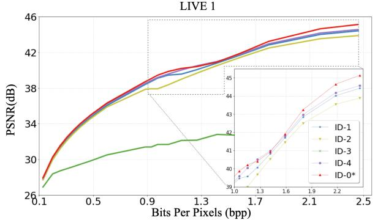  
Figure 9. Quantitative ablation study of JDEC on LIVE-1 [31] (RD-curve), against ablation models. Our proposed JDEC achieves higher PSNR than any other models in most of the q values.

## 4.4. Ablation Study

Network Components We conducted ablation studies for the main components of our proposed JDEC. The proposed method, CCF $\mathbf { T } _ { \psi }$ contains a frequency estimator which makes JDEC learn enhanced spectra. To support this, we train JDEC without a frequency estimator, directly forwarding concatenated coordinates (ID-1). We use additional 3×3 convolutional layers to have a comparable number of parameters. The sub-block conversion is the main element of encoder $\mathbf { E } _ { \varphi }$ . The spatial area gains a degree of freedom by using the sub-block conversion of the DCT matrix. We conduct the ablation study of sub-block conversion by embedding inputs directly (ID-2 of Tab. 4). The drop in performance is severe when both components are missing (ID-3 of Tab. 4). We also observed that ID-3, training without both the group embedding and CCF, leads to a significant performance drop as shown in Fig. 9.

Fourier Features Comparing to the existing sinusoidal representation, the formulation of [20] will be compatible for our CCF. The modified Fourier feature is as follows :

$$
\mathbf { C } \odot \left[ \begin{array} { l } { \cos ( \pi ( \mathbf { F } \cdot \delta + h _ { q } ( \mathbf { Q } ) ) } \\ { \sin ( \pi ( \mathbf { F } \cdot \delta + h _ { q } ( \mathbf { Q } ) ) } \end{array} \right] .\tag{13}
$$

We label the model using Eq. (13) instead of $\mathbf { T } _ { \psi }$ as ID-4. The rate-distortion curve of all ablation models is illustrated in Fig. 9. As shown in Fig. 9, the maximum gain of our CCF is 0.58dB against ID-4, where the quality factor is 100. Eq. (13) is considered as using additional terms than ID-0 (JDEC) by trigonometric sum. However, it has led to performance degradation as shown in Tab. 4.

## 4.5. Continuous Cosine Spectrum

In this section, we demonstrate that our CCF extracts dominant frequencies and amplitudes from highly compressed

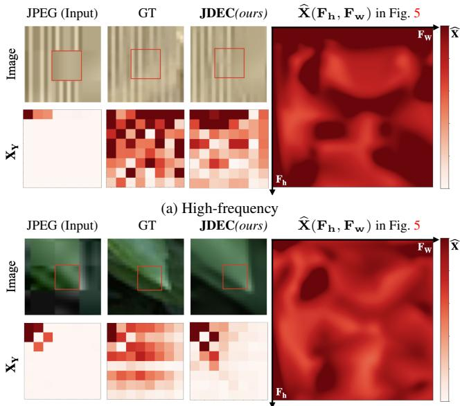  
(b) Low-frequency  
Figure 10. Comparison of the estimated spectra of the Continuous Cosine Formulation (CCF). The quality factor of input is 10. The estimated CCF spectrum follows the spectrum of groundtruth images despite severe distortion.

JPEG spectra. The ranges of input images (8×8) are highlighted with red boxes in each image. For visualization, we observe components of CCF, including estimated frequencies $\mathbf { F } _ { \mathbf { h } } , \mathbf { F } _ { \mathbf { w } }$ and amplitudes Xb . We scatter frequencies in 2D space and assign a color to each amplitude. We quantize the frequencies to [0, 50] with steps of 1 and interpolate to continuous values. In Fig. 10a, most of the high-frequency components have been removed. The estimated spectrum with CCF is centered on high-frequency components despite such circumstances. In the case of Fig. 10b, the dominant components of the spectrum are focused on relatively low-frequency. Even in this case, the extracted spectrum of CCF is concentrated in the low-frequency elements as in the ground truth.

## 5. Discussion

Implicit Neural Representation As discussed in Sec. 2 and Eq. (4), a JPEG encoder downsamples chroma components. Therefore, the JPEG decoder should map: $\mathbb { R } ^ { \frac { H } { 2 } \times \frac { \mathbf { \partial } _ { W } } { 2 } \times 2 } \mapsto$ RH×W×2 for chroma. Our JDEC addresses this issue through CCF $( T _ { \psi } )$ by embedding δ into 1×1-sized features, making the proposed JDEC a function of δ. Our model is able to decode high-resolution images when provided with dense coordinates that were not observed during training. We show the advanced additional upsampling results in the supplement material.

Extreme Reconstruction We primarily propose a decoding network to generate high-quality images due to its practical applicability. Consequently, we pursued the network without explicitly considering the scenario of high compression (q = 0). However, by incorporating all image quality factors within the range [0,100] with a step size of 10 during the learning process, we successfully developed a decoding method tailored for highly compressed images. We label the additional network as JDEC+. As shown in Fig. 11, our JDEC+ recovers the highly compressed images better than image restoration models.

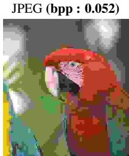  
22.62 (dB)

FBCNN[18]  
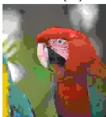  
23.96 (dB)

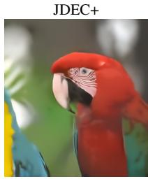  
26.70 (dB)

Figure 11. Reconstruction of the extremely compressed image (q = 0) in LIVE-1 [31] dataset.
<table><tr><td rowspan="2">Method</td><td rowspan="2">|#Params. (M)</td><td rowspan="2">Mem. (GB)</td><td rowspan="2">Time (ms)</td><td rowspan="2">FLOPs (G)</td><td colspan="3">PSNR|PSNR-B (dB)</td></tr><tr><td>q = 10</td><td></td><td>q = 40</td></tr><tr><td>FBCNN [18]</td><td>70.1</td><td>0.61</td><td>71.95</td><td>709.97</td><td>32.18|32.15</td><td></td><td>36.02|35.95</td></tr><tr><td>Swin2SR [9]</td><td>11.5≤</td><td>2.79</td><td>2203.59</td><td>3301.5</td><td>32.46|</td><td>36.25|</td><td></td></tr><tr><td>JDEC</td><td>38.9</td><td>1.76</td><td>224.79</td><td>1006.72</td><td>32.55|32.51</td><td></td><td>36.37|36.28</td></tr><tr><td>JDEC-CNN†</td><td>26.2</td><td>0.81</td><td>56.59</td><td>476.33</td><td>32.31|32.27</td><td></td><td>36.19|36.09</td></tr></table>

Table 5. Computational resources & performance comparison for a 560 × 560 pixels in ICB [29]. † :We replace the deep feature extractor of Fig. 4 with a CNN structure for comparison with the CNN-based model [18].

Computation Time and Memory In Tab. 5, we report computational resources including the number of parameters, memory consumption, floating-point operations (FLOPs), and computational time in GPU (NVIDIA RTX 3090 24GB). The input size is 560 × 560 for ours, while other methods have the size of 512 × 512.

## 6. Conclusion

We proposed a local implicit neural representation approach for decoding compressed color JPEG files. Our JPEG Decoder with Enhanced Continuous cosine coefficients (JDEC) contains a novel continuous cosine formulation (CCF) to extract a high-quality spectrum of images. JDEC takes a distorted spectrum as an input of the network and decodes it to a high-quality image regardless of the given quality factor. The suggested CCF extracts the dominant components of the ground truth spectrum, effectively. The results of benchmark datasets demonstrate that our network outperforms existing models as a practical JPEG decoder.

Acknowledgement This work was partly supported by Smart HealthCare Program (www.kipot.or.kr) funded by the Korean National Police Agency (KNPA) (No. 230222M01) and Institute of Information & communications Technology Planning & Evaluation (IITP) grant funded by the Korea government (MSIT) (No.2021-0-02068, Artificial Intelligence Innovation Hub).

## References

[1] Eirikur Agustsson and Radu Timofte. NTIRE 2017 Challenge on Single Image Super-Resolution: Dataset and Study. In Proceedings ofthe IEEE Conference on Computer Vision and Pattern Recognition (CVPR) Workshops, 2017. 5

[2] Nasir Ahmed, T. Natarajan, and Kamisetty R Rao. Discrete cosine transform. IEEE transactions on Computers, 100(1): 90–93, 1974. 2, 3

[3] Pablo Arbelaez, Michael Maire, Charless Fowlkes, and Jitendra Malik. Contour detection and hierarchical image segmentation. IEEE transactions on pattern analysis and machine intelligence, 33(5):898–916, 2010. 5, 6

[4] Yuval Bahat and Tomer Michaeli. What’s in the image? explorable decoding of compressed images. In Proceedings of the IEEE/CVF Conference on Computer Vision and Pattern Recognition, pages 2908–2917, 2021. 2

[5] Nuri Benbarka, Timon Hofer, Hamd ul-Moqeet Riaz, and¨ Andreas Zell. Seeing Implicit Neural Representations As Fourier Series. In Proceedings of the IEEE/CVF Winter Conference on Applications of Computer Vision (WACV), pages 2041–2050, 2022. 1

[6] G. Bradski. The OpenCV Library. Dr. Dobb’s Journal of Software Tools, 2000. 5, 7

[7] Lukas Cavigelli, Pascal Hager, and Luca Benini. Cas-cnn: A deep convolutional neural network for image compression artifact suppression. In 2017 International Joint Conference on Neural Networks (IJCNN), pages 752–759. IEEE, 2017. 2

[8] Yunjin Chen and Thomas Pock. Trainable nonlinear reaction diffusion: A flexible framework for fast and effective image restoration. IEEE Transactions on Pattern Analysis and Machine Intelligence, 39(6):1256–1272, 2017. 2

[9] Marcos V Conde, Ui-Jin Choi, Maxime Burchi, and Radu Timofte. Swin2sr: Swinv2 transformer for compressed image super-resolution and restoration. In European Conference on Computer Vision, pages 669–687. Springer, 2022. 5, 6, 8

[10] Thomas M Cover. Elements of information theory. John Wiley & Sons, 1999. 1

[11] Chao Dong, Yubin Deng, Chen Change Loy, and Xiaoou Tang. Compression artifacts reduction by a deep convolutional network. In Proceedings of the IEEE international conference on computer vision, pages 576–584, 2015. 1, 2

[12] Chao Dong, Chen Change Loy, Kaiming He, and Xiaoou Tang. Image super-resolution using deep convolutional networks. IEEE transactions on pattern analysis and machine intelligence, 38(2):295–307, 2015. 2

[13] Alexey Dosovitskiy, Lucas Beyer, Alexander Kolesnikov, Dirk Weissenborn, Xiaohua Zhai, Thomas Unterthiner, Mostafa Dehghani, Matthias Minderer, Georg Heigold, Sylvain Gelly, et al. An image is worth 16x16 words: Transformers for image recognition at scale. In International Conference on Learning Representations, 2020. 2

[14] Max Ehrlich, Larry Davis, Ser-Nam Lim, and Abhinav Shrivastava. Quantization guided jpeg artifact correction. In Computer Vision–ECCV 2020: 16th European Conference,

Glasgow, UK, August 23–28, 2020, Proceedings, Part VIII 16, pages 293–309. Springer, 2020. 1, 5, 6, 7

[15] Lionel Gueguen, Alex Sergeev, Ben Kadlec, Rosanne Liu, and Jason Yosinski. Faster neural networks straight from jpeg. Advances in Neural Information Processing Systems, 31, 2018. 1, 2

[16] W. Han, B. Lee, S. Park, and K. Jin. ABCD : Arbitrary bitwise coefficient for de-quantization. In 2023 IEEE/CVF Conference on Computer Vision and Pattern Recognition (CVPR), pages 5876–5885, 2023. 1, 4, 5

[17] Jianmin Jiang and Guocan Feng. The spatial relationship of dct coefficients between a block and its sub-blocks. IEEE Transactions on Signal Processing, 50(5):1160–1169, 2002. 4

[18] Jiaxi Jiang, Kai Zhang, and Radu Timofte. Towards flexible blind jpeg artifacts removal. In Proceedings of the IEEE/CVF International Conference on Computer Vision, pages 4997–5006, 2021. 1, 2, 5, 6, 7, 8

[19] Diederik P. Kingma and Jimmy Ba. Adam: A Method for Stochastic Optimization. In 3rd International Conference on Learning Representations, ICLR 2015, San Diego, CA, USA, May 7-9, 2015, Conference Track Proceedings, 2015. 6

[20] Jaewon Lee and Kyong Hwan Jin. Local texture estimator for implicit representation function. In Proceedings of the IEEE/CVF Conference on Computer Vision and Pattern Recognition (CVPR), pages 1929–1938, 2022. 1, 5, 7

[21] Jaewon Lee, Kwang Pyo Choi, and Kyong Hwan Jin. Learning local implicit fourier representation for image warping. In European Conference on Computer Vision (ECCV), pages 182–200. Springer, 2022. 1, 4, 5

[22] Jingyun Liang, Jiezhang Cao, Guolei Sun, Kai Zhang, Luc Van Gool, and Radu Timofte. SwinIR: Image Restoration Using Swin Transformer. In Proceedings of the IEEE/CVF International Conference on Computer Vision (ICCV) Workshops, pages 1833–1844, 2021. 4

[23] Pengju Liu, Hongzhi Zhang, Kai Zhang, Liang Lin, and Wangmeng Zuo. Multi-level wavelet-cnn for image restoration. In Proceedings of the IEEE conference on computer vision and pattern recognition workshops, pages 773–782, 2018. 2

[24] Pengju Liu, Hongzhi Zhang, Kai Zhang, Liang Lin, and Wangmeng Zuo. Multi-level wavelet-cnn for image restoration. In Proceedings of the IEEE conference on computer vision and pattern recognition workshops, pages 773–782, 2018. 1

[25] Ze Liu, Han Hu, Yutong Lin, Zhuliang Yao, Zhenda Xie, Yixuan Wei, Jia Ning, Yue Cao, Zheng Zhang, Li Dong, Furu Wei, and Baining Guo. Swin transformer v2: Scaling up capacity and resolution. In Proceedings of the IEEE/CVF Conference on Computer Vision and Pattern Recognition (CVPR), pages 12009–12019, 2022. 2, 4, 6

[26] Kede Ma, Zhengfang Duanmu, Qingbo Wu, Zhou Wang, Hongwei Yong, Hongliang Li, and Lei Zhang. Waterloo Exploration Database: New challenges for image quality assessment models. IEEE Transactions on Image Processing, 26(2):1004–1016, 2017. 6

[27] Ben Mildenhall, Pratul P. Srinivasan, Matthew Tancik, Jonathan T. Barron, Ravi Ramamoorthi, and Ren Ng. NeRF:

Representing Scenes as Neural Radiance Fields for View Synthesis. In Proceedings of the European Conference on Computer Vision (ECCV), 2020. 1

[28] Jeongsoo Park and Justin Johnson. Rgb no more: Minimallydecoded jpeg vision transformers. In Proceedings of the IEEE/CVF Conference on Computer Vision and Pattern Recognition, pages 22334–22346, 2023. 1, 2, 4

[29] Rawzor. Image compression benchmark. . url: http://imagecompression.info/. 5, 6, 7, 8

[30] C. E. Shannon. A mathematical theory of communication. The Bell System Technical Journal, 27(3):379–423, 1948. 2

[31] Hamid R Sheikh, Muhammad F Sabir, and Alan C Bovik. A statistical evaluation of recent full reference image quality assessment algorithms. IEEE Transactions on image processing, 15(11):3440–3451, 2006. 5, 6, 7, 8

[32] Vincent Sitzmann, Julien Martel, Alexander Bergman, David Lindell, and Gordon Wetzstein. Implicit Neural Representations with Periodic Activation Functions. In Advances in Neural Information Processing Systems, pages 7462–7473. Curran Associates, Inc., 2020. 1

[33] G.K. Wallace. The jpeg still picture compression standard. IEEE Transactions on Consumer Electronics, 38(1):xviii– xxxiv, 1992. 1, 2, 5

[34] Kai Xu, Minghai Qin, Fei Sun, Yuhao Wang, Yen-Kuang Chen, and Fengbo Ren. Learning in the frequency domain. In Proceedings of the IEEE/CVF conference on computer vision and pattern recognition, pages 1740–1749, 2020. 1, 2

[35] Kai Zhang, Wangmeng Zuo, Yunjin Chen, Deyu Meng, and Lei Zhang. Beyond a gaussian denoiser: Residual learning of deep cnn for image denoising. IEEE transactions on image processing, 26(7):3142–3155, 2017. 1, 5, 6, 7

[36] Xiaoshuai Zhang, Wenhan Yang, Yueyu Hu, and Jiaying Liu. Dmcnn: Dual-domain multi-scale convolutional neural network for compression artifacts removal. In 2018 25th IEEE international conference on image processing (icip), pages 390–394. IEEE, 2018. 5, 6

[37] Bolun Zheng, Yaowu Chen, Xiang Tian, Fan Zhou, and Xuesong Liu. Implicit dual-domain convolutional network for robust color image compression artifact reduction. IEEE Transactions on Circuits and Systems for Video Technology, 30(11):3982–3994, 2019. 1, 5, 6