# KeyPoint Relative Position Encoding for Face Recognition

Minchul Kim\* Yiyang Su\* Feng Liu\* Anil Jain\* Xiaoming Liu\*

{kimminc2; suyiyan1; liufeng6; jain; liuxm}@msu.edu

## Abstract

In this paper, we address the challenge of making ViT models more robust to unseen affine transformations. Such robustness becomes useful in various recognition tasks such asface recognition when image alignmentfailures occur. We propose a novel method called KP-RPE, which leverages key points (e.g.facial landmarks) to make ViT more resilient to scale, translation, and pose variations. We begin with the observation that Relative Position Encoding (RPE) is a good way to bring affine transform generalization to ViTs. RPE, however, can only inject the model with prior knowledge that nearby pixels are more important thanfar pixels. Keypoint RPE (KP-RPE) is an extension ofthis principle, where the significance of pixels is not solely dictated by their proximity but also by their relative positions to specific keypoints within the image. By anchoring the significance ofpixels around keypoints, the model can more effectively retain spatial relationships, even when those relationships are disrupted by affine transformations. We show the merit ofKP-RPE inface and gait recognition. The experimental results demonstrate the effectiveness in improvingface recognition performance from low-quality images, particularly where alignment is prone tofailure. Code and pre-trained models are available.

## 1. Introduction

Geometric alignment has shown to be highly effective for certain computer vision problems, such as face, body and gait recognition [11, 12, 25, 30, 33, 34, 37, 40, 43, 48–50, 59, 69, 72, 82, 83, 87, 88]. Alignment is the process of transforming input images, to a consistent and standardized form, often by scaling, rotating, and translating. This standardization helps recognition models learn the underlying patterns and features more effectively. As a result, many state-of-the-art (SoTA) face recognition models [11, 30, 49, 69] rely on well-aligned datasets [10, 11, 22, 91] to achieve high accuracy.

Fig. 1 shows a toy example with a training dataset MNIST [14] and test set AffNIST [57] which is in unseen affine transformation of MNIST. Using a shallow ViT [15] model, one can easily achieve 98.1% accuracy in the MNIST test set. However, in AffNIST, ViT with the original Absolute Position Embedding obtains only 77.27% accuracy. Such a sharp decrease in performance with unseen affine transform causes problems in applications that rely on accurate input alignments.

Toy Example for Measuring Affine Transformation Robustness  
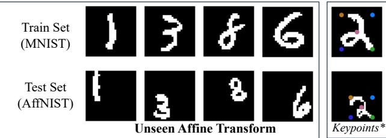

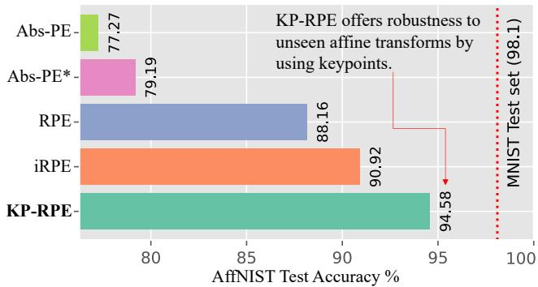  
Figure 1. Toy Example illustrating how different Position Embeddings impact the ViT’s robustness to unseen affine transforms. Abs-PE refers to the learnable Absolute Position Embedding. RPE and iRPE refers to Relative Position Embedding adopted to ViT [28, 74]. Keypoints in MNIST is arbitrarily defined to be the four corners of a box that covers a digit. Abs-PE\* is drawing the keypoints onto the input image. KP-RPE uses the keypoints to adjust the RPE.

In face recognition, alignment can be imperfect, especially in low-quality images where accurate landmark detection is difficult [10, 39]. Thus, images with low resolution or taken in poor lighting may result in misalignment during testing. Given the interplay between alignment and recognition, it becomes crucial to proactively handle potential alignment failures, which often result from, e.g., low-quality images. In other words, there is a need for a recognition model that is robust to scale, rotation, and translation variations.

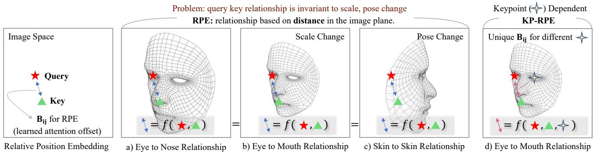  
Figure 2. Illustration of RPE [60] and proposed KP-RPE. The blue arrow represents the learned attention offset $\mathbf { B } _ { i j }$ between a query i and key j of attention in RPE. The query-key relationship at the same i and j should represent different relationships as the scale or pose change. But $\mathbf { B } _ { i j }$ does not change in RPE. KP-RPE addresses this issue by incorporating the distance to the keypoints when calculating the learned attention offset in RPE.

We revisit the Relative Position Encoding (RPE) concept used in ViT [15] and find that RPE can be useful for introducing affine transform robustness. RPE [60] enables the model to capture the relative spatial relationships among regions of an image, learning the positional dependencies without relying on absolute coordinates. As shown in Fig. 1, adding RPE to ViT increases the performance in AffNIST. With RPE [60], queries and keys of self-attention [68] at closer distances can be assigned different attention weights compared to those at a greater distance. While RPE allows the model to exploit relative positions, it has a limitation: even if an image changes in terms of scaling, shifting, or orientation, the significance of the key-query position in RPE stays the same. This static behavior is illustrated in Figs. 2 a)-c). Notably, the key-query relationship is the same regardless of the corresponding pixels’ semantic meaning changes.

We hypothesize that an RPE which dynamically adapts based on image keypoints, such as facial landmarks, could improve the model’s comprehension of spatial relationships in the image. By leveraging the spatial relationships with respect to these keypoints, the model can adapt to variations in scale, rotation, and translation, resulting in a more robust recognition system capable of handling both aligned and misaligned datasets. Fig. 2 d) highlights a keypoint-dependent query-key relationship.

To this end, we introduce KeyPoint RPE (KP-RPE), a method that dynamically adapts the spatial relationship in ViT based on the keypoints present in the image. Our experiments demonstrate that incorporating KP-RPE into ViT significantly enhances the model’s robustness to misaligned test datasets while maintaining or even improving performance on aligned test datasets. We show the usage of KP-RPE in face recognition and gait recognition as the inputs share the same topology (face or body) that allows the keypoints to be defined. Finally, KP-RPE is an order of magnitude faster than iRPE [74], a widely used RPE that depends on

the image content.

In summary, the contributions of this paper include:

• The insight that RPE (or its variants) can improve the robustness of ViT to unseen affine transformations.

• The development of Keypoint RPE (KP-RPE), a novel method that dynamically adapts the spatial relationship in Vision Transformers (ViT) based on the keypoints in the image, significantly enhancing the model’s robustness to misaligned test datasets while maintaining or improving performance on aligned test datasets.

• Comprehensive experimental validation demonstrating the effectiveness of our proposed KP-RPE, showcasing its potential for advancing the field of recognition by bringing model’s robustness to geometric transformation. We improve the recognition performance across unconstrained face datasets such as TinyFace [7] and IJB-S [29] and even non-face datasets such as Gait3D [18, 87].

## 2. Related Works

Relative Position Encoding in ViT Relative Position Encoding (RPE) is first introduced by Shaw et al. [60] as a technique for encoding spatial relationships between different elements in a sequence. By adding relative position encodings into the queries and keys, the model can effectively learn positional dependencies without relying on absolute coordinates. Subsequent works, such as those by Dai et al. [9] and Huang et al. [28], refine and expand upon the concept of RPE, demonstrating its effectiveness in natural language processing (NLP) tasks.

The adoption of RPE in Vision Transformers [15] has been explored by several researchers. For instance, Ramachandran et al. [53] propose a 2D RPE method that computes the x, y distance in an image plane separately to include directional information. A notable RPE method in ViT is iRPE [74], which considers directional relative distance modeling as well as the interactions between queries and relative position encodings in a self-attention mechanism.

Despite the success of these RPE methods in various vision tasks, they do not specifically address the challenges associated with scale, rotation, and translation variations in face recognition applications. This shortcoming high lights the need for RPE methods that can better handle these variations, which are common in real-world low-quality face recognition scenarios. To address this, we propose KP-RPE, which incorporates keypoint information during the network’s feature extraction, significantly enhancing the model’s ability to generalize across affine transformations.

Face Recognition with Low-Quality Images Recent FR models [11, 27, 43, 49, 69] have achieved high performance on datasets with discernable facial attributes, such as LFW [25], CFP-FP [59], CPLFW [88], AgeDB [50], CALFW [89], IJB-B [72], and IJB-C [48]. However, unconstrained scenarios like surveillance or low-quality videos present additional challenges. Datasets in this setting, such as TinyFace [7] and IJB-S [29], contain low-quality images, where detecting facial landmarks and achieving proper alignment becomes increasingly difficult. This adversely affects existing FR models that rely on well-aligned inputs.

Several studies [20, 21, 26, 30, 31, 36, 41, 54, 63, 80, 84, 85] tackle recognition with low-quality imagery. Particularly, AdaFace [30] introduces an image quality adaptive loss function that reduces the influence of low-quality or unidentifiable samples. A-SKD [63] employs teacherstudent distillation to focus on similar areas regardless of image resolution. But, these models, which are trained on aligned training sets, do not tackle the challenges associated with misaligned inputs in real-world situations. In contrast, KP-RPE adjusts spatial relationships within ViT based on image keypoints, allowing the model to better generalize even when alignment is unsuccessful in low-quality imagery.

Keypoints and Spatial Reasoning Keypoint detection, often associated with landmarks, has been fundamental in various vision tasks such as human pose estimation [5, 51], face landmark detection [4, 35, 65, 81], and object localization [52]. These keypoints serve as representative points that capture the essential structure or layout of an object, facilitating tasks like alignment, recognition, and even animation.

Face landmark detection is commonly carried out alongside face detection. MTCNN [81] is a widely-used method for combined face detection and facial landmark localization, utilizing cascaded CNNs (P-Net, R-Net, and O-Net) that collaborate to detect faces and landmarks in an image. RetinaFace [10], on the other hand, is a single-stage detector [38, 42] based landmark localization algorithm, demonstrating strong performance when trained on the annotated WiderFace [78] dataset. TinaFace [90] further enhances detection capabilities by incorporating SoTA generic object detection algorithms. MTCNN and RetinaFace are often used for aligning face datasets.

Recent advances in keypoint detection techniques, particularly using deep neural networks, have led to using keypoints to improve the performance of recognition tasks [64, 77]. For instance, [23] proposes a keypoint-based pooling mechanism and shows promising results in skeletonbased action recognition and spatio-temporal action localization tasks. Albeit its benefit, many models including ViTs do not have pooling mechanisms. KP-RPE is the first attempt at incorporating keypoints into the RPE which can be easily inserted into ViT models.

## 3. Proposed Method

## 3.1. Background

Self-Attention Self-attention is a crucial component of transformers [68], which is a popular choice for a wide range of NLP tasks. ViT [15] applies the same self-attention mechanism to images, treating images as sequences of nonoverlapping patches. The self-attention mechanism in Transformers calculates attention weights based on the compatibility between a query and a set of keys. Given a set of input vectors, the Transformer computes query (Q), key (K), and value (V) matrices through linear transformations:

$$
\mathbf { Q } _ { i } = \pmb { x } _ { i } \mathbf { W } _ { Q } , \quad \mathbf { K } _ { j } = \pmb { x } _ { j } \mathbf { W } _ { K } , \quad \mathbf { V } _ { j } = \pmb { x } _ { j } \mathbf { W } _ { V } ,\tag{1}
$$

where $\mathbf { \nabla } _ { \mathbf { x } _ { i } }$ is the i-th input vector, and $\mathbf { W } _ { Q } , \mathbf { W } _ { K }$ , and $\mathbf { W } _ { V }$ are learnable weight matrices.

The self-attention mechanism computes attention weights as the dot product between the query and key vectors, followed by a softmax normalization:

$$
e _ { i j } = \frac { { \bf Q } _ { i } { \bf K } _ { j } ^ { T } } { \sqrt { d _ { k } } } , \quad a _ { i j } = \frac { \exp ( e _ { i j } ) } { \sum _ { j = 1 } ^ { N } \exp ( e _ { i j } ) } ,\tag{2}
$$

where $d _ { k }$ is the dimension of the key vectors. Finally, the output matrix Y is computed as the product of the attention weight matrix and the value matrix: $\begin{array} { r } { { \bf \bar { Y } } _ { i } = \sum _ { j = 1 } ^ { N } a _ { i j } { \bf V } _ { j } } \end{array}$

Absolute Position Encoding Transformers are inherently order invariant, as their self-attention mechanism does not consider input token positions. To address this, absolute position encoding is introduced [19, 68], which adds fixed, learnable positional embeddings to input tokens:

$$
\begin{array} { r } { \pmb { x } _ { i } ^ { ' } = \pmb { x } _ { i } + \mathrm { P E } ( i ) , } \end{array}\tag{3}
$$

where $\pmb { x } _ { i } ^ { ' }$ is the updated input token with positional information, ${ \mathbf { } } x _ { i }$ is the original input token, and PE(i) is the positional encoding for the i-th position. These embeddings, generated using sinusoidal functions or learned directly, enable the model to capture the absolute positions of elements.

Relative Position Encoding (RPE) RPE, introduced by Shaw et al. [60] and refined by Dai et al. [9] and Huang et al. [28], encodes relative position information, essential for tasks focusing on input element relationships. Unlike absolute position encoding, RPE considers query-key interactions based on sequence-relative distances. The modified self-attention calculation for RPE is:

$$
e _ { i j } ^ { \prime } = \frac { ( { \bf Q } _ { i } + { \bf R } _ { i j } ^ { Q } ) ( { \bf K } _ { j } + { \bf R } _ { i j } ^ { K } ) ^ { T } } { \sqrt { d _ { k } } } , { \bf Y } _ { i } = \sum _ { j = 1 } ^ { n } a _ { i j } ( { \bf V } _ { j } + { \bf R } _ { i j } ^ { V } ) .\tag{4}
$$

Here, $\mathbf { R } _ { i j } ^ { Q } , \mathbf { R } _ { i j } ^ { K }$ , and ${ \bf R } _ { i j } ^ { V }$ are relative position encoding between the i-th query and j-th key with shape $\mathbb { R } ^ { d _ { z } }$ . Each R is a learnable matrix of $\mathbb { R } ^ { K \times d _ { z } }$ , where $\mathbf { R } _ { i , j }$ corresponds to the relative position encoding for distance $d ( i , j ) = k$ and K is the maximum possible value of $d ( i , j )$ . To obtain relative position encoding, we index the R matrix using the computed distance $\mathbf { R } [ d ( i , j ) ]$ ]. Common choices for d are quantized Euclidean distance, separate x, y cross distance [53]. [74] uses a quantized x, y product distance, which encodes direction information. Note, query location i is a 2D point $( i _ { x } , i _ { y } )$ . Fig. 3 a) and b) illustrate the distance between i and all possible j with different distance functions. For KP-RPE, we modify [74] and allow the RPE to be keypoint dependent.

## 3.2. Keypoint Relative Position Encoding

Building upon the general formulation of [74], we begin with the following RPE formulation:

$$
e _ { i j } ^ { \prime } = \frac { \mathbf { Q } i \mathbf { K } j ^ { T } + \mathbf { B } _ { i j } } { \sqrt { d _ { k } } } .\tag{5}
$$

Here, $\mathbf { B } _ { i j }$ is a scalar that adjusts the attention matrix based on the query and key indices $i , j .$ . Assuming a set of keypoints $\bar { \bf P } \in \mathbb { R } ^ { N _ { L } \times 2 }$ is available for each $^ { x , }$ our goal is to make $\mathbf { B } _ { i j }$ dependent on P. For face recognition, P is the five facial landmarks (two eyes, nose, mouth tips). For gait recognition, P is 17 points from the joint locations of skeleton predictions. For the MNIST toy example, P is five keypoints from the four corners and the center of the minimum cover box of a foreground image. As such P can be defined for objects with shared topology.

The novelty of KP-RPE lies in the design of $\mathbf { B } _ { i j }$ . Since

$$
\mathbf { B } _ { i j } = \mathbf { W } [ d ( i , j ) ] \in \mathbb { R } ^ { 1 } ,\tag{6}
$$

comprises of a learnable table W and a distance function $d ( i , j )$ , we can make W or $d ( i , j )$ depend on the keypoints. At a first glance, $d ( i , j , { \bf P } )$ , conditioning the distance on $\mathbf { P }$ seems plausible. However, we find that it leads to inefficiencies, as distance caching, which is precomputing $d ( i , j )$ for a given input size, is only feasible when $d ( i , j )$ is independent of the input. Therefore, we propose an alternative where the bias matrix itself, W, is a function of P:

$$
\begin{array} { r } { { \bf B } _ { i j } = f ( { \bf P } ) [ d ( i , j ) ] . } \end{array}\tag{7}
$$

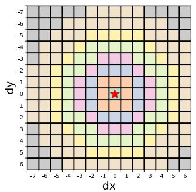  
a) iRPE: Euclidean Distance

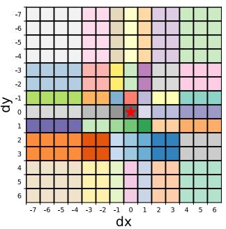  
b) iRPE: Product Distance

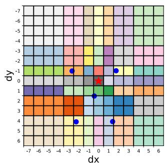

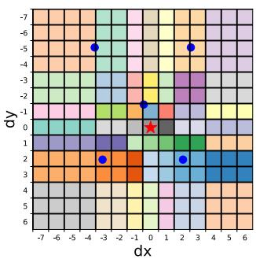  
c) KP-RPE: Product Distance (Two different keypoints)  
Figure 3. Depiction of key-query combinations in an image, given a query location $i = \left( 7 , 7 \right) \left( \star \right)$ . Distinct colors represent varying attention offset values in RPE based on the distance between i and j. We are showing $\mathbf { B } _ { i = ( 7 , 7 ) , j }$ for all $j \in ( 1 4 \times 1 4 )$ . a) The distance function is a quantized Euclidean distance. b) Product distance proposed in iRPE accounts for direction. c) We adopt b) and allow $\mathbf { B } _ { i , j }$ to vary based on keypoint locations ( ).

We propose three variants of $f ( \mathbf { P } )$ building up from the simplest solution.

Absolute $f ( \mathbf { P } )$ . Let $\mathbf { P } \in \mathbb { R } ^ { N _ { L } \times 2 }$ be the normalized keypoints between 0 and 1. First, the simplest way to model the indexing table is to linearly map P to the desired shape. $f ( \mathbf { P } ) = \mathbf { P } ^ { \prime } \mathbf { W } _ { L }$ where $\mathbf { P } ^ { \prime } \in \bar { \mathbb { R } } ^ { 1 \times ( 2 \bar { N } _ { L } ) }$ is reshaped keypoints P and $\mathbf { W } _ { L } \in \mathbb { R } ^ { ( 2 N _ { L } ) \times K }$ is a learnable matrix. K is the maximum distance value in $d ( i , j )$ . For each distance between i and $j ,$ we learn a keypoint adaptive offset value. However, this $f ( \mathbf { P } )$ only works with the absolute position information of P and the relative distance between i and $j .$ . It is missing the relative distance between P and $( i , j )$

Relative $f ( \mathbf { P } )$ . To improve, $f ( \mathbf { P } )$ can be adjusted to work with the position of keys and queries relative to the keypoints. In other words, so that the query-key relationship in $\mathbf { B } _ { i j }$ depends on the query-landmark relationship. To achieve this, we generate a mesh grid $\mathbf { M } \in \mathbb { R } ^ { N \times 2 }$ of patch locations con taining all possible combinations of $i _ { x }$ and $i _ { y } .$ . N represents the number of patches. We then compute the element-wise difference between the normalized grid and keypoints P to obtain a grid of $i , j$ relative to the keypoints:

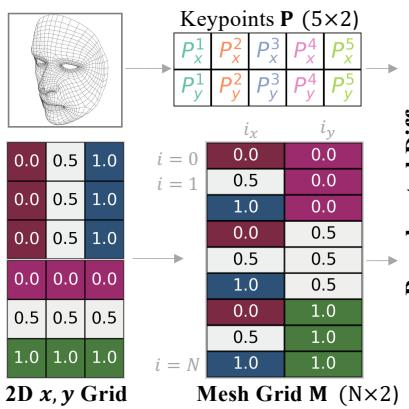

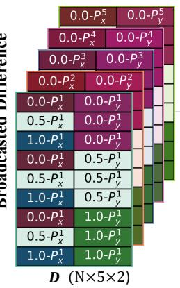

a) KP-RPE detailed diagram  
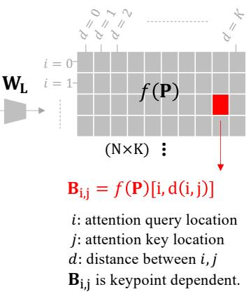

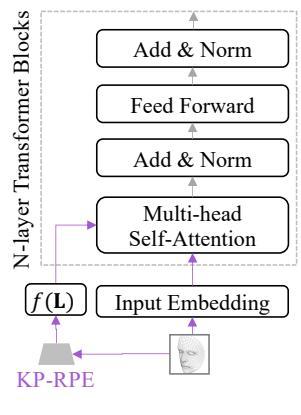  
b) Model Overview  
Figure 4. a) Illustration of KP-RPE. First a mesh grid M and an image-specific keypoints P are generated. Then the broadcasted difference D is calculated, and we linearly map D to f(P). Finally for a given i, j, we can find the $\mathbf { B } _ { i j } = f ( \mathbf { P } ) [ i , d ( i , j ) ] )$ , which is used to adjust the attention map in self-attention. b) Backbone contains multiple transformer blocks followed by an MLP for classification. KP-RPE is used where multi-head attention modules exist. KP-RPE is efficient as f(P) is computed once.

$$
{ \bf D } = \mathrm { E x p a n d } ( { \bf M } , \mathrm { d i m } { = } 1 ) - \mathrm { E x p a n d } ( { \bf P } , \mathrm { d i m } { = } 0 ) ,\tag{8}
$$

where D is the broadcasted tensor difference of shape $\mathbb { R } ^ { N \times N _ { L } \times 2 }$ . Finally, we reshape D and linearly project it with $\mathbf { W } _ { L }$ . Specifically,

$$
\mathbf { D } ^ { \prime } = \mathrm { R e s h a p e } ( \mathbf { D } ) \in \mathbb { R } ^ { N \times ( 2 N _ { L } ) }\tag{9}
$$

$$
f ( \mathbf { P } ) = \mathbf { D } ^ { \prime } \mathbf { W } _ { L } \in \mathbb { R } ^ { N \times K }\tag{10}
$$

$$
\mathbf { B } _ { i j } = f ( \mathbf { P } ) [ i , d ( i , j ) ] \in \mathbb { R } ^ { 1 } .\tag{11}
$$

In other words, the offset value $\mathbf { B } _ { i j }$ is determined with respect to the positions of the keypoints and is unique for each query location. This approach allows for more expressive control of the query-key relationships with the keypoint locations. An illustration of this is shown in Fig. 4.

Multihead Relative $f ( \mathbf { P } )$ . Lastly, we can further enhance our method by tailoring the query-keypoint relationship for each head in the attention mechanism. When there are H heads, we simply expand the dimension of $\mathbf { W } _ { L }$ to $\mathbf { W } _ { L } \in \mathbb { R } ^ { ( 2 N _ { L } ) \times H K }$ . By reshaping $f ( \mathbf { P } )$ , we obtain $f ( \mathbf { P } ) ^ { h }$ for each head. Furthermore, considering the multiple selfattentions in ViT which entails multiple RPEs, we can individualize $f ( \mathbf { P } )$ for each self-attention by additionally increasing the dimension of $\mathbf { W } _ { L }$ to $\mathbf { W } _ { L } \doteq \mathbb { R } ^ { ( 2 N _ { L } ) \times N _ { d } \cdot \hat { H } K }$ where $N _ { d }$ represents the transformer’s depth. Since $f ( \mathbf { P } )$ is computed only once per forward pass, this modification introduces negligible computational overhead compared to other operations. In Sec. 4.2, we evaluate and compare the various KP-RPE versions (basic, relative keypoint, multiple relative keypoint), demonstrating the superior performance of the multiple relative keypoint approaches.

## 4. Face Recognition Experiments

## 4.1. Datasets and Implementation Details

To validate the efficacy of KP-RPE, we train our model using aligned face training data and evaluate on three distinct types of datasets: 1) aligned face data, 2) intentionally unaligned face data, and 3) low-quality face data containing misaligned images. For the evaluation, aligned face datasets include CFPFP [59], AgeDB [50], and IJB-C [48]. For unaligned face data, we intentionally use the raw CFPFP [59] and IJB-C [48] datasets without aligning them. Raw images, as provided by their respective creators, are equivalent to images cropped based on face detection bounding boxes. Lastly, we assess the model’s robustness on low-quality face datasets, specifically TinyFace [7] and IJB-S [29], which are prone to alignment failures. This comprehensive setup enables us to examine the effectiveness of our proposed method across diverse data conditions.

The training datasets MS1MV2 [11] MS1MV3 [13] and WebFace4M [91] are released as aligned and resized to 112 112 by RetinaFace [10] whose backbone is ResNet50 model trained on WiderFace [78]. For keypoint detection in KP-RPE, we also use RetinaFace [10] but with lighter backbone MobileNetV2 for faster inference. Given the sensitivity of ViTs to hyperparameters, we report the exact settings for learning rate, weight decay, and other parameters in the supplementary material. For ablation dataset, we take the MS1MV2 subset dataset as used in [30].

Following the training conventions of [30, 67], we adopt RandAug [8], repeated augmentation [24], random resized crop, and blurring. We utilize the AdaFace [30] loss function to train all models. For ablation, we employ ViT-small, while for SoTA comparisons, we use ViT-base models. The AdamW [46] optimizer and Cosine Learning Rate scheduler [45, 73] are used. In WebFace4M trained models, we adopt PartialFC [1, 2] to reduce the classifier’s dimension.

Table 1. Ablation of RPE on ViT-small. Aligned is the standard protocol with raw face images (detector bounding box) aligned by RetinaFace [10] and resized to 112 112. Unaligend takes the raw face images and simply resizes it to 112 112. Aligned setting always shows better performances and Unaligned is for simulating alignment failure. Low Quality Aligned dataset may have alignment failures.
<table><tr><td rowspan="2">Method</td><td colspan="4">Low Quality Aligned Dataset</td><td colspan="2">High Quality Aligned Dataset</td><td colspan="2">High Quality Unaligned Dataset</td></tr><tr><td>TinyFace [7]</td><td></td><td>IJB-S [29]</td><td></td><td>CFPFP [59]</td><td>IJB-C [48]</td><td>CFPFP [59]</td><td>IJB-C [48]</td></tr><tr><td></td><td>Rank-1</td><td>Rank-5</td><td>Rank-1</td><td>Rank-5</td><td>Verification</td><td>TAR@0.01%</td><td>Verification</td><td>TAR@0.01%</td></tr><tr><td>ViT</td><td>68.24</td><td>72.96</td><td>59.60</td><td>68.31</td><td>96.11</td><td>92.22</td><td>72.81</td><td>21.62</td></tr><tr><td>ViT + iRPE</td><td>69.05</td><td>73.10</td><td>62.49</td><td>70.50</td><td>97.01</td><td>92.72</td><td>77.91</td><td>34.73</td></tr><tr><td>ViT+KP-RPE</td><td>69.88</td><td>74.25</td><td>63.44</td><td>72.04</td><td>96.60</td><td>94.20</td><td>93.56</td><td>91.85</td></tr></table>

Table 2. Ablation of KP-RPE with three different formulations of keypoint dependent RPE tables f(P). The sharp increase in Unaligned setting shows the robustness to unseen affine transform manifests with Relative f(P). Multihead f(P) further improves the performance.
<table><tr><td rowspan="2">Method</td><td colspan="4">Low Quality Aligned Dataset</td><td colspan="2">High Quality Aligned Dataset</td><td colspan="2">High Quality Unaligned Dataset</td></tr><tr><td>TinyFace [7]</td><td></td><td>IJB-S [29]</td><td></td><td>CFPFP [59]</td><td>IJB-C [48]</td><td>CFPFP [59]</td><td>IJB-C [48]</td></tr><tr><td></td><td>Rank-1</td><td>Rank-5</td><td>Rank-1</td><td>Rank-5</td><td>Verification</td><td>TAR@0.01%</td><td>Verification</td><td>TAR@0.01%</td></tr><tr><td>KP-RPE Absolute f(P)</td><td>68.11</td><td>72.42</td><td>9.97</td><td>69.13</td><td>96.51</td><td>90.96</td><td>68.09</td><td>14.91</td></tr><tr><td>KP-RPE Relative f(P)</td><td>69.42</td><td>73.71</td><td>62.51</td><td>70.77</td><td>96.74</td><td>94.28</td><td>89.70</td><td>85.22</td></tr><tr><td>KP-RPE MultiHead f(P)</td><td>69.88</td><td>74.25</td><td>63.44</td><td>72.04</td><td>96.60</td><td>94.20</td><td>93.56</td><td>91.85</td></tr></table>

## 4.2. Ablation Analysis

Row 1 in Tab. 1 shows results on the baseline ViT. Row 2 and 3 show results on the baseline ViT with iRPE and our proposed KP-RPE. KP-RPE demonstrates a substantial performance improvement on unaligned and low-quality datasets, without compromising performance on aligned datasets. Last row highlights the difference between ViT and ViT+KP-RPE. Also, Fig. 5 shows the sensitivity to the affine transformation, i.e., how the performance changes when one interpolates the affine transformation from the face detection images to the aligned images in CFPFP dataset.

Tab. 2 further investigates the effect of modifications to KP-RPE. By making KP-RPE dependent on the difference between the query and keypoints (row 2), we observe a significant improvement in unaligned dataset performance. Also, by allowing unique mapping for each head and module in ViT (row 3), we achieve a further improvement. In other words, more expressive KP-RPE is beneficial for learning complex RPE that depends on the keypoints of an image. Overall, the ablation study highlights the necessity of each component in KP-RPE and the effectiveness of KP-RPE in enhancing the robustness of face recognition models, particularly with unaligned and low-quality datasets.

## 4.3. Computation Analysis

In this section, we analyze the computational efficiency of our proposed KP-RPE in terms of FLOPs, throughput, and the number of parameters. Tab. 3 shows that KP-RPE is highly efficient, with only a small increase in the computational cost (FLOPs) compared to the backbone: 0.02 GFLOP increase for ViT Small and 0.07 GFLOP increase for ViT

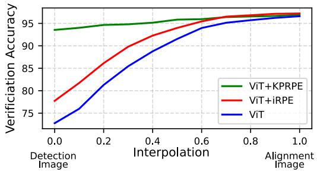  
Figure 5. Plot of Verification Accuracy in CFPFP [59]. On the X-axis, we interpolate the affine transformation from raw data (Detection Image) to canonical alignment (Alignment Image). Note KP-RPE is robust to affine transformations, while all models have been trained on the aligned image dataset.

Base (ViT vs ViT+KP-RPE). Notably, KP-RPE is considerably more efficient than iRPE, which incurs an increase of 0.71 GFLOP for ViT Small and 1.42 GFLOP for ViT Base.

Considering training throughput, which factors in computation time during training (with backpropagation), KP-RPE’s efficiency is more pronounced. It only reduces throughput by 9.15% for ViT Small and 16.44% for ViT Base, as opposed to iRPE’s larger decrease. Also, we show the GFLOP and throughput with the landmark detection time included. Landmark detection time is negligible compared to the total feature extraction time.

Also, our method introduces a negligible increase in the number of parameters: just 0.05M for ViT Small and 0.21M for ViT Base. Hence, incorporating KP-RPE into the model achieves enhanced performance without a substantial rise in computational cost or model complexity.

Table 3. Computation resource comparison. GFLOP refers to Giga Floating Operating per Second. We measure it as [55]. Throughput refers to the number of images processed per second during the train/eval iteration.
<table><tr><td></td><td>GFLOP</td><td>∆ in GFLOP</td><td>Eval Throughput</td><td>Train Throughput</td><td>%∆ in Train Throughput</td><td># Param</td></tr><tr><td>IResNet50</td><td>12.62</td><td></td><td>1432.72 img/s</td><td>337.93 img/s</td><td>=</td><td>43.59M</td></tr><tr><td>ViT Small</td><td>17.42</td><td> $\textcircled{1}$ </td><td>1303.15 imgs/s</td><td>333.17 img/s</td><td>①</td><td>95.95M</td></tr><tr><td>ViT Small + iRPE</td><td>18.13</td><td>①+0.71</td><td>832.12 imgs/s</td><td>186.55 img/s</td><td>①-44.01%</td><td>96.07M</td></tr><tr><td>ViT Small + KP-RPE</td><td>17.44</td><td> $\textcircled { 1 } { + } 0 . 0 2$ </td><td>1145.90 imgs/s</td><td>302.70 img/s</td><td>①-9.15%</td><td>96.00M</td></tr><tr><td>ViT Small + KP-RPE (+ Ldmk)</td><td>17.58</td><td>①+0.16</td><td>1085.22 imgs/s</td><td>302.70 img/s</td><td>①-9.15%</td><td>96.49M</td></tr><tr><td>IResNet101</td><td>24.19</td><td>-</td><td>773.12 imgs/s</td><td>189.74 img/s</td><td>=</td><td>65.15M</td></tr><tr><td>ViT Base</td><td>24.83</td><td>②</td><td>644.10 imgs/s</td><td>162.94 img/s</td><td>②</td><td>114.87M</td></tr><tr><td>ViT Base + iRPE</td><td>26.25</td><td>②+1.42</td><td>337.32 imgs/s</td><td>79.40 img/s</td><td>②-51.27%</td><td>114.98M</td></tr><tr><td>ViT Base + KP-RPE</td><td>24.90</td><td> $\textcircled { 2 } { + } 0 . 0 7$ </td><td>502.57 imgs/s</td><td>136.15 img/s</td><td>②-16.44%</td><td>115.08M</td></tr><tr><td> $\mathrm { V i T \ B a s e + K P \mathrm { - } R P E \left( + L d m k \right) }$ </td><td>25.04</td><td> $\textcircled { 2 } + 0 . 2 1$ </td><td>489.37 imgs/s</td><td>136.15 img/s</td><td>②-16.44%</td><td>115.56M</td></tr></table>

## 4.4. Comparison with SoTA Methods

In this section, we position ViT+KP-RPE, against SoTA face recognition methodologies with large-scale datasets and large models. We undertake a comprehensive evaluation, covering both high-quality and low-quality image datasets. The results, as shown in Tab. 4, underscore the strengths of KP-RPE. Notably, the inclusion of KP-RPE does not impair the performance on high-quality datasets, a testament to its applicability to both low and high-quality datasets.

This becomes particularly compelling when we observe the performance on low-quality datasets. Consistent with the findings of our ablation study, the introduction of KP-RPE leads to an appreciable improvement in these challenging scenarios. This supports our thesis that face recognition models with robust alignment capabilities can indeed enhance performance on low-quality datasets. In summary, our model with KP-RPE not only maintains competitive performance on high-quality datasets but also brings significant improvements on low-quality ones, marking it a valuable contribution to the field of face recognition.

## 4.5. Note on the Landmark Predictor

KP-RPE in all experiments uses our own MobileNet [58] based RetinaFace [10] to predict landmarks for KP-RPE. We train MobileNet version for computation efficiency. However, the original landmark predictor used for aligning the test datasets is ResNet50-RetinaFace [10]. We also report the KP-RPE performance with the officially released ResNet50- RetinaFace. We report this to compare KP-RPE on the same ground with other models by using the same landmark used to pre-align the testset. The face recognition performance of KP-RPE+Official is similar to KP-RPE+Ours (75.86 vs 75.80 in TinyFace Rank1). Our MobileNet-RetinaFace is improved to perform similarly to ResNet50 in landmark prediction by applying additional tricks while training. Therefore, the face recognition performances are also similar. Unlike vanilla RetinaFace on face alignment, ours is fully differentiable during inference and named Differentiable Face

Aligner. Details and analysis can be found in Supp.2 and 3.

## 4.6. Scalability on Larger Training Datasets

We train the ViT+KP-RPE model on a larger Web-Face12M [91] dataset to demonstrate the potential of KP-RPE in its scalability and applicability in real-world, datarich scenarios. Tab. 4’s last row shows that the performance continues to increase with WebFace12M dataset.

Discussion. Why are noisy keypoints more useful in KP-RPE than in simple alignment? The short answer is that not all predicted points are noisy in an image while alignment as a result of one or more noisy point impacts all pixels. For our attempt at a more detailed answer, please refer to Supp.2.4.

## 5. Gait Recognition Experiments

KP-RPE is a generic method that can generalize beyond face recognition to any task with keypoints. We apply KP-RPE to gait recognition using body joints as the keypoints.

Dataset. We train and evaluate on Gait3D [87], an in-thewild gait video dataset. In our experiments, we use silhou ettes and 2D keypoints preprocessed and released by the authors directly. Following SMPLGait [79, 87], we use rankn accuracy $( n = 1 , 5 , 1 0 )$ , mean Average Precision (mAP), and mean Inverse Negative Penalty (mINP) for evaluation.

Implementation Details. We implement SwinGait-2D [17] as the baseline in our experiments. SwinGait-2D is chosen over SwinGait-3D [17] because we focus on exploiting the geometric information in gait recognition. SwinTransformer [44] uses vanilla relative positional encoding for each windowed self-attention. To incorporate KP-RPE into the SwinTransformer, we modify the 2D grid M to be the size of the window as opposed to the image size. Following the default configuration of [87], we use an AdamW [46] optimizer with a learning rate $3 \times 1 0 ^ { - 4 }$ and weight decay $2 \times 1 0 ^ { - 2 }$ , accompanied by an SGDR [45] scheduler. We train our models for 60,000 iterations, sampling 32 subjects and 4 sequences per subject in a batch.

Table 4. SoTA comparison on low-quality and high-quality datasets. ViT models are ViT-Base sized.
<table><tr><td rowspan="2">Method</td><td rowspan="2">Backbone</td><td rowspan="2">Train Data</td><td colspan="4">Low Quality Dataset</td><td colspan="3">High Quality Dataset</td></tr><tr><td>TinyFace [7]</td><td></td><td>IJB-S [29]</td><td></td><td>AgeDB [50]</td><td>CFPFP [59]</td><td>IJB-C [48]</td></tr><tr><td></td><td></td><td></td><td>Rank-1</td><td>Rank-5</td><td>Rank-1</td><td>Rank-5</td><td>Verification Accuracy</td><td></td><td>TAR@FAR=0.01%</td></tr><tr><td>PFE [61]</td><td>CNN64</td><td>MS1MV2 [11] MS1MV2 [11]</td><td></td><td></td><td>50.16 57.35</td><td>58.33 64.42</td><td></td><td>98.27</td><td>96.03</td></tr><tr><td>ArcFace [11] URL [62]</td><td>ResNet101</td><td></td><td></td><td></td><td>59.79</td><td>65.78</td><td>98.28</td><td>98.64</td><td>96.60</td></tr><tr><td></td><td>ResNet101</td><td>MS1MV2 [11]</td><td>63.89</td><td>68.67</td><td>62.43</td><td></td><td>98.32</td><td></td><td></td></tr><tr><td>CurricularFace [27] AdaFace [11]</td><td>ResNet101 ResNet101</td><td>MS1MV2 [11] MS1MV2 [11]</td><td>63.68</td><td>67.65</td><td>65.26</td><td>68.68 70.53</td><td></td><td>98.37 98.49</td><td>96.10 96.89</td></tr><tr><td>AdaFace [11]</td><td>ResNet101</td><td>MS1MV3 [13]</td><td>68.21 67.81</td><td>71.54 70.98</td><td>67.12</td><td>72.67</td><td>98.05 98.17</td><td>99.03</td><td>97.09</td></tr><tr><td>AdaFace [30]</td><td>ViT</td><td>MS1MV3 [13]</td><td>72.05</td><td>74.84</td><td>65.95</td><td>71.64</td><td>97.87</td><td>99.06</td><td>97.10</td></tr><tr><td>AdaFace [30]</td><td>ViT+KP-RPE</td><td>MS1MV3 [13]</td><td>73.50</td><td>76.39</td><td>67.62</td><td>73.25</td><td>97.98</td><td>99.11</td><td>97.16</td></tr><tr><td>ArcFace [11]</td><td>ResNet101</td><td>WebFace4M [91]</td><td>71.11</td><td>74.38</td><td>69.26</td><td>74.31</td><td>97.93</td><td>99.06</td><td></td></tr><tr><td>AdaFace [30]</td><td>ResNet101</td><td>WebFace4M [91]</td><td>72.02</td><td>74.52</td><td>70.42</td><td>75.29</td><td>97.90</td><td>99.17</td><td>96.63 97.39</td></tr><tr><td>AdaFace [30]</td><td>ViT</td><td>WebFace4M [91]</td><td>74.81</td><td>77.58</td><td>71.90</td><td>77.09</td><td>97.48</td><td>98.94</td><td>97.14</td></tr><tr><td>AdaFace [30]</td><td>ViT+iRPE</td><td>WebFace4M [91]</td><td>74.92</td><td>77.98</td><td>71.93</td><td>77.14</td><td>97.15</td><td>99.01</td><td>97.01</td></tr><tr><td>AdaFace [30]</td><td>ViT+KP-RPE</td><td>WebFace4M [91]</td><td>75.80</td><td>78.49</td><td>72.78</td><td>78.20</td><td>97.67</td><td>99.01</td><td>97.13</td></tr><tr><td>AdaFace [30]</td><td>ResNet101</td><td>WebFace12M [91]</td><td>72.42</td><td>74.81</td><td>71.46</td><td>77.04</td><td>98.00</td><td>99.24</td><td>97.66</td></tr><tr><td>AdaFace [30]</td><td>ViT+KP-RPE</td><td>WebFace12M [91]</td><td>76.18</td><td>78.97</td><td>72.94</td><td>77.46</td><td>98.07</td><td>99.30</td><td>97.82</td></tr></table>

Table 5. KP-RPE performance on Gait3D [87] compared with the baseline. KP-RPE boosts all metrics by a large margin.
<table><tr><td>Model</td><td>Rank-1</td><td>Rank-5</td><td>mAP</td><td>mINP</td></tr><tr><td>GaitSet [6]</td><td>36.7</td><td>58.3</td><td>30.01</td><td>17.30</td></tr><tr><td>MTSGait [86]</td><td>48.7</td><td>67.1</td><td>37.63</td><td>21.92</td></tr><tr><td>DANet [47]</td><td>48.0</td><td>69.7</td><td></td><td></td></tr><tr><td>GaitGCI [16]</td><td>50.3</td><td>68.5</td><td>39.5</td><td>24.3</td></tr><tr><td>GaitBase [18]</td><td>64.6</td><td>81.5</td><td>55.31</td><td>31.63</td></tr><tr><td>HSTL [70]</td><td>61.3</td><td>76.3</td><td>55.48</td><td>34.77</td></tr><tr><td>DyGait [71]</td><td>66.3</td><td>80.8</td><td>56.40</td><td>37.30</td></tr><tr><td>SwinGait-2D [17]</td><td>67.1</td><td>83.7</td><td>58.76</td><td>34.36</td></tr><tr><td>+ KP-RPE</td><td>68.2</td><td>84.4</td><td>60.81</td><td>36.19</td></tr></table>

Results and Analyses. In Tab. 5, we compare to SoTA approaches, including SwinGait-2D [17], with and without KP-RPE. We can see that the KP-RPE shows a significant improvement over SwinGait-2D, with 1.1 % and 0.7 % improvement on rank-1 and -5 accuracies, respectively. mAP has improved by 2.05 % and mINP by 1.23 % of the baseline) compared to SwinGait-2D. We believe that a great portion of the improvement comes from KP-RPE exploiting the gait information contained in 2D skeletons. Gait skeletons contain identity-related information, such as body shape and walking posture. This demonstrates that KP-RPE is both effective and generalizable to gait recognition.

## 6. Conclusion

In this work, we introduce Keypoint-based Relative Posi tion Encoding (KP-RPE), a method designed to enhance the robustness of recognition models to alignment errors. Our method uniquely establishes key-query relationships in selfattention based on their distance to the keypoints, improving its performance across a variety of datasets, including those with low-quality or misaligned images. KP-RPE demonstrates superior efficiency in terms of computational cost, throughput and recognition performance, especially when affine transform robustness is beneficial. We believe that KP-RPE opens a new avenue in recognition research, paving the way for the development of more robust models.

Limitations. While KP-RPE shows impressive face recognition capabilities, it does require keypoint supervision, which may not always be readily available and can constrain its application, particularly when the dataset is not comprised of images with a consistent topology. Future work should consider the self-discovery of keypoints to lessen this dependence, thereby boosting the model’s flexibility.

Potential Societal Impacts Within the CV/ML community, we must strive to mitigate any negative societal impacts. This study uses the MS1MV\* dataset, derived from the discontinued MS-Celeb, to allow a fair comparison with SoTA methods. However, we encourage a shift towards newer datasets, showcasing results using the recent WebFace4M dataset. Data collection ethics are paramount, often requiring IRB approval for human data collection. Most face recognition datasets likely lack IRB approval due to their collection methods. We support the community in gathering large, consent-based datasets or fully synthetic datasets [3, 32], enabling research without societal backlash.

Acknowledgments. This research is based upon work supported by the Office of the Director of National Intelligence (ODNI), Intelligence Advanced Research Projects Activity (IARPA), via 2022-21102100004. The views and conclusions contained herein are those of the authors and should not be interpreted as necessarily representing the official policies, either expressed or implied, of ODNI, IARPA, or the U.S. Government. The U.S. Government is authorized to reproduce and distribute reprints for governmental purposes notwithstanding any copyright annotation therein.

## References

[1] Xiang An, Jiankang Deng, Jia Guo, Ziyong Feng, XuHan Zhu, Jing Yang, and Tongliang Liu. Killing two birds with one stone: Efficient and robust training of face recognition cnns by partial fc. In CVPR, pages 4042–4051, 2022. 6

[2] Xiang An, Xuhan Zhu, Yuan Gao, Yang Xiao, Yongle Zhao, Ziyong Feng, Lan Wu, Bin Qin, Ming Zhang, Debing Zhang, et al. Partial fc: Training 10 million identities on a single machine. In ICCV, pages 1445–1449, 2021. 6

[3] Gwangbin Bae, Martin de La Gorce, Tadas Baltrušaitis, Charlie Hewitt, Dong Chen, Julien Valentin, Roberto Cipolla, and Jingjing Shen. Digiface-1m: 1 million digital face images for face recognition. In WACV. IEEE, 2023. 8

[4] Adrian Bulat and Georgios Tzimiropoulos. How far are we from solving the 2D & 3D face alignment problem? (and a dataset of 230,000 3d facial landmarks). In ICCV, 2017. 3

[5] Zhe Cao, Tomas Simon, Shih-En Wei, and Yaser Sheikh. Realtime multi-person 2d pose estimation using part affinity fields. In CVPR, pages 7291–7299, 2017. 3

[6] Hanqing Chao, Yiwei He, Junping Zhang, and Jianfeng Feng. Gaitset: Regarding gait as a set for cross-view gait recognition. In Proceedings of the AAAI conference on artificial intelligence, volume 33, pages 8126–8133, 2019. 8

[7] Zhiyi Cheng, Xiatian Zhu, and Shaogang Gong. Lowresolution face recognition. In ACCV, 2018. 2, 3, 5, 6, 8

[8] Ekin D Cubuk, Barret Zoph, Jonathon Shlens, and Quoc V Le. Randaugment: Practical automated data augmentation with a reduced search space. In CVPR workshops, pages 702–703, 2020. 5, 1

[9] Zihang Dai, Zhilin Yang, Yiming Yang, Jaime G Carbonell, Quoc Le, and Ruslan Salakhutdinov. Transformer-xl: Attentive language models beyond a fixed-length context. In ACL, pages 2978–2988, 2019. 2, 4

[10] Jiankang Deng, Jia Guo, Evangelos Ververas, Irene Kotsia, and Stefanos Zafeiriou. Retinaface: Single-shot multi-level face localisation in the wild. In CVPR, pages 5203–5212, 2020. 1, 3, 5, 6, 7, 4

[11] Jiankang Deng, Jia Guo, Niannan Xue, and Stefanos Zafeiriou. ArcFace: Additive angular margin loss for deep face recognition. In CVPR, 2019. 1, 3, 5, 8, 2

[12] Jiankang Deng, Jia Guo, Jing Yang, Alexandros Lattas, and Stefanos Zafeiriou. Variational prototype learning for deep face recognition. In CVPR, 2021. 1

[13] Jiankang Deng, Jia Guo, Debing Zhang, Yafeng Deng, Xiangju Lu, and Song Shi. Lightweight face recognition challenge. In ICCVW, 2019. 5, 8

[14] Li Deng. The mnist database of handwritten digit images for machine learning research. IEEE Signal Processing Magazine, 29(6):141–142, 2012. 1

[15] Alexey Dosovitskiy, Lucas Beyer, Alexander Kolesnikov, Dirk Weissenborn, Xiaohua Zhai, Thomas Unterthiner, Mostafa Dehghani, Matthias Minderer, Georg Heigold, Sylvain Gelly, et al. An image is worth 16x16 words: Transformers for image recognition at scale. In ICLR, 2021. 1, 2,

[16] Huanzhang Dou, Pengyi Zhang, Wei Su, Yunlong Yu, Yining Lin, and Xi Li. Gaitgci: Generative counterfactual interven tion for gait recognition. In CVPR, 2023. 8

[17] Chao Fan, Saihui Hou, Yongzhen Huang, and Shiqi Yu. Exploring deep models for practical gait recognition. arXiv preprint arXiv:2303.03301, 2023. 7, 8

[18] Chao Fan, Junhao Liang, Chuanfu Shen, Saihui Hou, Yongzhen Huang, and Shiqi Yu. Opengait: Revisiting gait recognition toward better practicality. arXiv preprint arXiv:2211.06597, 2022. 2, 8

[19] Jonas Gehring, Michael Auli, David Grangier, Denis Yarats, and Yann N Dauphin. Convolutional sequence to sequence learning. In ICML, pages 1243–1252. PMLR, 2017. 3

[20] Klemen Grm, Berk Kemal Özata, Vitomir Štruc, and Hazım Kemal Ekenel. Meet-in-the-middle: Multi-scale upsampling and matching for cross-resolution face recognition. In Proceedings ofthe IEEE/CVF Winter Conference on Applications of Computer Vision, pages 120–129, 2023. 3

[21] Steven A Grosz and Anil K Jain. Latent fingerprint recognition: Fusion of local and global embeddings. arXiv preprint arXiv:2304.13800, 2023. 3

[22] Yandong Guo, Lei Zhang, Yuxiao Hu, Xiaodong He, and Jianfeng Gao. MS-Celeb-1M: A dataset and benchmark for large-scale face recognition. In ECCV, 2016. 1

[23] Ryo Hachiuma, Fumiaki Sato, and Taiki Sekii. Unified keypoint-based action recognition framework via structured keypoint pooling. In CVPR, pages 22962–22971, 2023. 3

[24] Elad Hoffer, Tal Ben-Nun, Itay Hubara, Niv Giladi, Torsten Hoefler, and Daniel Soudry. Augment your batch: Improving generalization through instance repetition. In CVPR, pages 8129–8138, 2020. 5

[25] Gary B Huang, Marwan Mattar, Tamara Berg, and Eric Learned-Miller. Labeled Faces in the Wild: A database forstudying face recognition in unconstrained environments. In Workshop on Faces in’Real-Life’Images: Detection, Alignment, and Recognition, 2008. 1, 3

[26] Yuge Huang, Pengcheng Shen, Ying Tai, Shaoxin Li, Xiaoming Liu, Jilin Li, Feiyue Huang, and Rongrong Ji. Improving face recognition from hard samples via distribution distillation loss. In ECCV, 2020. 3

[27] Yuge Huang, Yuhan Wang, Ying Tai, Xiaoming Liu, Pengcheng Shen, Shaoxin Li, Jilin Li, and Feiyue Huang. CurricularFace: adaptive curriculum learning loss for deep face recognition. In CVPR, 2020. 3, 8

[28] Zhiheng Huang, Davis Liang, Peng Xu, and Bing Xiang. Improve transformer models with better relative position embeddings. In EMNLP, pages 3327–3335, Online, November 2020. 1, 2, 4

[29] Nathan D Kalka, Brianna Maze, James A Duncan, Kevin O’Connor, Stephen Elliott, Kaleb Hebert, Julia Bryan, and Anil K Jain. IJB–S: IARPA Janus Surveillance Video Benchmark. In BTAS, 2018. 2, 3, 5, 6, 8

[30] Minchul Kim, Anil K Jain, and Xiaoming Liu. AdaFace: Quality adaptive margin for face recognition. In CVPR, 2022. 1, 3, 5, 8, 2, 6

[31] Minchul Kim, Feng Liu, Anil Jain, and Xiaoming Liu. Cluster and aggregate: Face recognition with large probe set. In NeurIPS, 2022. 3

[32] Minchul Kim, Feng Liu, Anil Jain, and Xiaoming Liu. DC-Face: Synthetic face generation with dual condition diffusion model. 2023. 8

[33] Yonghyun Kim, Wonpyo Park, and Jongju Shin. BroadFace: Looking at tens of thousands of people at once for face recognition. In ECCV, 2020. 1

[34] Brendan F Klare, Ben Klein, Emma Taborsky, Austin Blanton, Jordan Cheney, Kristen Allen, Patrick Grother, Alan Mah, and Anil K Jain. Pushing the frontiers of unconstrained face detection and recognition: IARPA Janus Benchmark-A. In CVPR, 2015. 1

[35] Abhinav Kumar, Tim K. Marks, Wenxuan Mou, Ye Wang, Michael Jones, Anoop Cherian, Toshiaki Koike-Akino, Xiaoming Liu, and Chen Feng. Luvli face alignment: Estimating landmarks’ location, uncertainty, and visibility likelihood. In CVPR, 2020. 3

[36] Chiawei Kuo, Yi-Ting Tsai, Hong-Han Shuai, Yi-ren Yeh, and Ching-Chun Huang. Towards understanding cross resolution feature matching for surveillance face recognition. In Proceedings of the 30th ACM International Conference on Multimedia, pages 6706–6716, 2022. 3

[37] Shen Li, Jianqing Xu, Xiaqing Xu, Pengcheng Shen, Shaoxin Li, and Bryan Hooi. Spherical confidence learning for face recognition. In CVPR, 2021. 1

[38] Tsung-Yi Lin, Piotr Dollár, Ross Girshick, Kaiming He, Bharath Hariharan, and Serge Belongie. Feature pyramid networks for object detection. In CVPR, pages 2117–2125, 2017. 3, 4

[39] Feng Liu, Ryan Ashbaugh, Nicholas Chimitt, Najmul Hassan, Ali Hassani, Ajay Jaiswal, Minchul Kim, Zhiyuan Mao, Christopher Perry, Zhiyuan Ren, Yiyang Su, Pegah Varghaei, Kai Wang, Xingguang Zhang, Stanley Chan, Arun Ross, Humphrey Shi, Zhangyang Wang, Anil Jain, and Xiaoming Liu. Farsight: A physics-driven whole-body biometric system at large distance and altitude. In WACV, 2024. 1

[40] Feng Liu, Minchul Kim, ZiAng Gu, Anil Jain, and Xiaoming Liu. Learning clothing and pose invariant 3d shape representation for long-term person re-identification. In ICCV, 2023. 1

[41] Feng Liu, Minchul Kim, Anil Jain, and Xiaoming Liu. Controllable and guided face synthesis for unconstrained face recognition. In Computer Vision–ECCV 2022: 17th European Conference, Tel Aviv, Israel, October 23–27, 2022, Proceedings, Part XII, pages 701–719. Springer, 2022. 3

[42] Wei Liu, Dragomir Anguelov, Dumitru Erhan, Christian Szegedy, Scott Reed, Cheng-Yang Fu, and Alexander C Berg. Ssd: Single shot multibox detector. In Computer Vision– ECCV 2016: 14th European Conference, Amsterdam, The Netherlands, October 11–14, 2016, Proceedings, Part I 14, pages 21–37. Springer, 2016. 3, 4

[43] Weiyang Liu, Yandong Wen, Zhiding Yu, Ming Li, Bhiksha Raj, and Le Song. SphereFace: Deep hypersphere embedding for face recognition. In CVPR, 2017. 1, 3

[44] Ze Liu, Yutong Lin, Yue Cao, Han Hu, Yixuan Wei, Zheng Zhang, Stephen Lin, and Baining Guo. Swin transformer: Hierarchical vision transformer using shifted windows. In ICCV, 2021. 7

[45] Ilya Loshchilov and Frank Hutter. Sgdr: Stochastic gradient descent with warm restarts. arXiv preprint arXiv:1608.03983, 2016. 6, 7

[46] Ilya Loshchilov and Frank Hutter. Decoupled weight decay regularization. arXiv preprint arXiv:1711.05101, 2017. 5, 7

[47] Kang Ma, Ying Fu, Dezhi Zheng, Chunshui Cao, Xuecai Hu, and Yongzhen Huang. Dynamic aggregated network for gait recognition. In CVPR, 2023. 8

[48] Brianna Maze, Jocelyn Adams, James A Duncan, Nathan Kalka, Tim Miller, Charles Otto, Anil K Jain, W Tyler Niggel, Janet Anderson, Jordan Cheney, and Patrick Grother. IARPA Janus Benchmark-C: Face dataset and protocol. In ICB, 2018. 1, 3, 5, 6, 8

[49] Qiang Meng, Shichao Zhao, Zhida Huang, and Feng Zhou. MagFace: A universal representation for face recognition and quality assessment. In CVPR, 2021. 1, 3

[50] Stylianos Moschoglou, Athanasios Papaioannou, Christos Sagonas, Jiankang Deng, Irene Kotsia, and Stefanos Zafeiriou. AGEDB: the first manually collected, in-the-wild age database. In CVPRW, 2017. 1, 3, 5, 8

[51] Alejandro Newell, Kaiyu Yang, and Jia Deng. Stacked hourglass networks for human pose estimation. In Computer Vision–ECCV 2016: 14th European Conference, Amsterdam, The Netherlands, October 11-14, 2016, Proceedings, Part VIII 14, pages 483–499. Springer, 2016. 3

[52] George Papandreou, Tyler Zhu, Nori Kanazawa, Alexander Toshev, Jonathan Tompson, Chris Bregler, and Kevin Murphy. Towards accurate multi-person pose estimation in the wild. In CVPR, pages 4903–4911, 2017. 3

[53] Prajit Ramachandran, Niki Parmar, Ashish Vaswani, Irwan Bello, Anselm Levskaya, and Jon Shlens. Stand-alone selfattention in vision models. NeurIPS, 32, 2019. 2, 4

[54] Rajeev Ranjan, Ankan Bansal, Hongyu Xu, Swami Sankaranarayanan, Jun-Cheng Chen, Carlos D Castillo, and Rama Chellappa. Crystal loss and quality pooling for unconstrained face verification and recognition. arXiv preprint arXiv:1804.01159, 2018. 3

[55] Jeff Rasley, Samyam Rajbhandari, Olatunji Ruwase, and Yuxiong He. Deepspeed: System optimizations enable training deep learning models with over 100 billion parameters. In Pro ceedings of the 26th ACM SIGKDD International Conference on Knowledge Discovery & Data Mining, pages 3505–3506, 2020. 7

[56] Shaoqing Ren, Kaiming He, Ross Girshick, and Jian Sun. Faster r-cnn: Towards real-time object detection with region proposal networks. Advances in neural information processing systems, 28, 2015. 4

[57] Sara Sabour, Nicholas Frosst, and Geoffrey E Hinton. Dynamic routing between capsules. Advances in neural information processing systems, 30, 2017. 1

[58] Mark Sandler, Andrew Howard, Menglong Zhu, Andrey Zhmoginov, and Liang-Chieh Chen. Mobilenetv2: Inverted residuals and linear bottlenecks. In CVPR, pages 4510–4520, 2018. 7

[59] Soumyadip Sengupta, Jun-Cheng Chen, Carlos Castillo, Vishal M Patel, Rama Chellappa, and David W Jacobs. Frontal to profile face verification in the wild. In WACV, 2016. 1, 3, 5, 6, 8

[60] Peter Shaw, Jakob Uszkoreit, and Ashish Vaswani. Selfattention with relative position representations. arXiv preprint arXiv:1803.02155, 2018. 2, 4

[61] Yichun Shi and Anil K Jain. Probabilistic face embeddings. In ICCV, 2019. 8

[62] Yichun Shi, Xiang Yu, Kihyuk Sohn, Manmohan Chandraker, and Anil K Jain. Towards universal representation learning for deep face recognition. In CVPR, 2020. 8

[63] Sungho Shin, Joosoon Lee, Junseok Lee, Yeonguk Yu, and Kyoobin Lee. Teaching where to look: Attention similarity knowledge distillation for low resolution face recognition. In Computer Vision–ECCV 2022: 17th European Conference, Tel Aviv, Israel, October 23–27, 2022, Proceedings, Part XII, pages 631–647. Springer, 2022. 3

[64] Yukun Su, Guosheng Lin, Jinhui Zhu, and Qingyao Wu. Hu man interaction learning on 3d skeleton point clouds for video violence recognition. In Computer Vision–ECCV 2020: 16th European Conference, Glasgow, UK, August 23–28, 2020, Proceedings, Part IV 16, pages 74–90. Springer, 2020. 3

[65] Ying Tai, Yicong Liang, Xiaoming Liu, Lei Duan, Jilin Li, Chengjie Wang, Feiyue Huang, and Yu Chen. Towards highly accurate and stable face alignment for high-resolution videos. In AAAI, 2019. 3

[66] Ilya O Tolstikhin, Neil Houlsby, Alexander Kolesnikov, Lucas Beyer, Xiaohua Zhai, Thomas Unterthiner, Jessica Yung, Andreas Steiner, Daniel Keysers, Jakob Uszkoreit, et al. Mlpmixer: An all-mlp architecture for vision. In NeurIPS, 2021. 4

[67] Hugo Touvron, Matthieu Cord, Matthijs Douze, Francisco Massa, Alexandre Sablayrolles, and Hervé Jégou. Training data-efficient image transformers & distillation through attention. In ICML, 2021. 5

[68] Ashish Vaswani, Noam Shazeer, Niki Parmar, Jakob Uszkoreit, Llion Jones, Aidan N Gomez, Łukasz Kaiser, and Illia Polosukhin. Attention is all you need. In NeurIPS, 2017. 2, 3

[69] Hao Wang, Yitong Wang, Zheng Zhou, Xing Ji, Dihong Gong, Jingchao Zhou, Zhifeng Li, and Wei Liu. CosFace: Large margin cosine loss for deep face recognition. In CVPR, 2018. 1, 3, 2

[70] Lei Wang, Bo Liu, Fangfang Liang, and Bincheng Wang. Hierarchical spatio-temporal representation learning for gait recognition. In ICCV, 2023. 8

[71] Ming Wang, Xianda Guo, Beibei Lin, Tian Yang, Zheng Zhu, Lincheng Li, Shunli Zhang, and Xin Yu. Dygait: Exploiting dynamic representations for high-performance gait recognition. In ICCV, 2023. 8

[72] Cameron Whitelam, Emma Taborsky, Austin Blanton, Brianna Maze, Jocelyn Adams, Tim Miller, Nathan Kalka, Anil K Jain, James A Duncan, Kristen Allen, et al. IARPA Janus Benchmark-B face dataset. In CVPRW, 2017. 1, 3, 2

[73] Ross Wightman. Pytorch image models. https : / / github . com / rwightman / pytorch - image - models, 2019. 6

[74] Kan Wu, Houwen Peng, Minghao Chen, Jianlong Fu, and Hongyang Chao. Rethinking and improving relative position encoding for vision transformer. In ICCV, pages 10033– 10041, 2021. 1, 2, 4

[75] Wayne Wu, Chen Qian, Shuo Yang, Quan Wang, Yici Cai, and Qiang Zhou. Look at boundary: A boundary-aware face alignment algorithm. In CVPR, pages 2129–2138, 2018. 6

[76] Jiahao Xia, Weiwei Qu, Wenjian Huang, Jianguo Zhang, Xi Wang, and Min Xu. Sparse local patch transformer for robust face alignment and landmarks inherent relation learning. In CVPR, pages 4052–4061, 2022. 6

[77] Sijie Yan, Yuanjun Xiong, and Dahua Lin. Spatial temporal graph convolutional networks for skeleton-based action recognition. In Proceedings of the AAAI conference on artificial intelligence, volume 32, 2018. 3

[78] Shuo Yang, Ping Luo, Chen-Change Loy, and Xiaoou Tang. Wider face: A face detection benchmark. In CVPR, pages 5525–5533, 2016. 3, 5, 4, 6

[79] Mang Ye, Jianbing Shen, Gaojie Lin, Tao Xiang, Ling Shao, and Steven CH Hoi. Deep learning for person re-identification: A survey and outlook. IEEE transactions on pattern analysis and machine intelligence, 44(6):2872–2893, 2021. 7

[80] Xi Yin, Ying Tai, Yuge Huang, and Xiaoming Liu. Fan: Feature adaptation network for surveillance face recognition and normalization. In ACCV, 2020. 3

[81] Kaipeng Zhang, Zhanpeng Zhang, Zhifeng Li, and Yu Qiao. Joint face detection and alignment using multitask cascaded convolutional networks. Signal Processing Letters, 2016. 3

[82] Ziyuan Zhang, Luan Tran, Feng Liu, and Xiaoming Liu. On learning disentangled representations for gait recognition. IEEE T-PAMI, 44(1):345–360, 2020. 1

[83] Weisong Zhao, Xiangyu Zhu, Kaiwen Guo, Xiao-Yu Zhang, and Zhen Lei. Grouped knowledge distillation for deep face recognition. AAAI, 2023. 1

[84] Jingxiao Zheng, Rajeev Ranjan, Ching-Hui Chen, Jun-Cheng Chen, Carlos D Castillo, and Rama Chellappa. An automatic system for unconstrained video-based face recognition. IEEE Transactions on Biometrics, Behavior, and Identity Science, 2(3):194–209, 2020. 3

[85] Jingxiao Zheng, Ruichi Yu, Jun-Cheng Chen, Boyu Lu, Carlos D Castillo, and Rama Chellappa. Uncertainty modeling of contextual-connections between tracklets for unconstrained video-based face recognition. In ICCV, pages 703–712, 2019. 3

[86] Jinkai Zheng, Xinchen Liu, Xiaoyan Gu, Yaoqi Sun, Chuang Gan, Jiyong Zhang, Wu Liu, and Chenggang Yan. Gait recognition in the wild with multi-hop temporal switch. In Proceedings ofthe 30th ACM International Conference on Multimedia, 2022. 8

[87] Jinkai Zheng, Xinchen Liu, Wu Liu, Lingxiao He, Chenggang Yan, and Tao Mei. Gait recognition in the wild with dense 3d representations and a benchmark. In CVPR, pages 20228– 20237, 2022. 1, 2, 7, 8

[88] Tianyue Zheng and Weihong Deng. Cross-Pose LFW: A database for studying cross-pose face recognition in unconstrained environments. Beijing University of Posts and Telecommunications, Tech. Rep, 5:7, 2018. 1, 3

[89] Tianyue Zheng, Weihong Deng, and Jiani Hu. Cross-Age LFW: A database for studying cross-age face recognition in unconstrained environments. CoRR, abs/1708.08197, 2017. 3

[90] Yanjia Zhu, Hongxiang Cai, Shuhan Zhang, Chenhao Wang, and Yichao Xiong. Tinaface: Strong but simple baseline for face detection. arXiv preprint arXiv:2011.13183, 2020. 3

[91] Zheng Zhu, Guan Huang, Jiankang Deng, Yun Ye, Junjie Huang, Xinze Chen, Jiagang Zhu, Tian Yang, Jiwen Lu, Dalong Du, et al. WebFace260M: A benchmark unveiling the power of million-scale deep face recognition. In CVPR, 2021. 1, 5, 7, 8, 2