# Learning Degradation-unaware Representation with Prior-based Latent Transformations for Blind Face Restoration

Lianxin Xie1, Csbingbing Zheng1, Wen Xue1, Le Jiang1, Cheng Liu4, Si Wu1,2,3\*, Hau San Wong5\* 1School of Computer Science and Engineering, South China University of Technology 2Peng Cheng Laboratory 3PAZHOU LAB 4Departent of Computer Science, Shantou University 5Department of Computer Science, City University of Hong Kong {cslianxin.xie, 202321044369, csxuewen, 202220143385}@mail.scut.edu.cn cliu@stu.edu.cn, cswusi@scut.edu.cn, cshswong@cityu.edu.hk

## Abstract

Blind face restoration focuses on restoring high-fidelity details from images subjected to complex and unknown degradations, while preserving identity information. In this paper, we present a Prior-based Latent Transformation approach (PLTrans), which is specifically designed to learn a degradation-unaware representation, thereby allowing the restoration network to effectively generalize to real-world degradation. Toward this end, PLTrans learns a degradation-unaware query via a latent diffusion-based regularization module. Furthermore, conditioned on the features of a degraded face image, a latent dictionary that captures the priors of HQ face images is leveraged to refine the features by mapping the top-d nearest elements. The refined version will be used to build key and value for the cross-attention computation, which is tailored to each degraded image and exhibits reduced sensitivity to different degradation factors. Conditioned on the resulting representation, we train a decoding network that synthesizes face images with authentic details and identity preservation. Through extensive experiments, we verify the effectiveness of the design elements and demonstrate the generalization ability of our proposed approach for both synthetic and unknown degradations. We finally demonstrate the applicability of PLTrans in other vision tasks.

## 1. Introduction

Blind Face Restoration (BFR) aims to restore facial details while preserving the identity in degraded images that have been subjected to varying and unidentified degradations. Many CNN-based and Transformer-based BFR frameworks have been previously designed to enhance restoration performance, leading to significant advancements in the field. However, it is impractical to gather sufficient pairs of degraded-clean training data in real-world situations. In the pursuit of synthesizing clear and realistic face images from degraded ones, recent BFR meth ods have incorporated various face priors, including highquality(HQ) exemplars with the same identity or geometric information. These methods often rely on capturing the correlation between degraded and clean images, making them susceptible to significant performance drops when handling unseen degradations. Additionally, there have been attempts to apply generative priors to BFR. Generative Adversarial Networks (GAN) [12] that are well-trained on face images represent strong priors due to their ability to generate high-fidelity samples, while GAN-based models are typically trained on specific datasets, thus limiting their generalization performance.

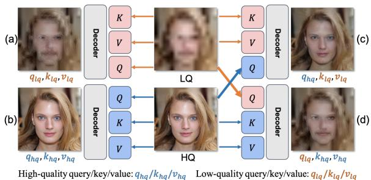  
Figure 1. An example to illustrate that a better query empowers a generic model to generate HQ images, and vice versa. Enhancing the quality of key and value yields relatively slight effect. The restored image quality can be sorted as: (b)>(c)>(d)>(a)

The generic transformer-based model takes a high/lowquality (HQ/LQ) image as input and generates a set of corresponding HQ/LQ query, key and value in each block. The result shown in Figure 1 suggests that improving query and key-value leads to varying improvements for face restoration. Inspired by this observation, we propose a Prior-based Latent Transformation approach for BFR, which we refer to as PLTrans. The core idea behind PLTrans is to transform the preliminary features of degraded images to become degradation-unaware query, while at the same time to refine the preliminary feature to build key and value which are used in cross-attention computation. To achieve this, we incorporate a latent diffusion module to remove degradation from the features, in which various types of degradations become indistinguishable as Gaussian noise is added. In order to maintain the semantic similarity of the restored image to the degraded one, the features at each transition step is also combined with the input’s low-frequency information obtained through a 2D discrete wavelet transform [49] during the reverse diffusion process. The resulting features are subsequently decoded into a query. Additionally, by incorporating a latent dictionary encoding rich details from the features of HQ face images via vector quantization [36], We learns a global mapping over the retrieved priors based on the top-d elements that are nearest neighbors of the input features to build key and value. The cross-attention computation is performed over the obtained query, key and value for restoring the features of clean face. Extensive experiments are performed to demonstrate the effectiveness of the design elements and the improvement in generalization performance on real-world images with unknown degradation. We summarize the main contributions of this work as follows:

• We address BFR from a new perspective of performing prior-based transformations on query, key and value for the attention computation in a latent transformer.

• By incorporating the wavelet-based low-frequency components of the degraded features as supplementary information into the intermediate stages, we can effectively guide the reverse diffusion process to synthesize the degradation-unaware features, while preserving essential semantics from the input.

• To restore the features of clean face, we further leverage a latent dictionary to refine the features of the degraded image, based on which we learn key and value to perform cross-attention computation with the degradation-unaware features as query.

## 2. Related Work

## 2.1. Blind Face Restoration

Significant progress has been achieved in face image restoration recent years [8, 18, 20, 26]. A typical strategy is to regard the restoration as a domain translation task [10, 34, 45]. Considering facial structures, there have been many attempts to incorporate a variety of priors in the generation process. In [4, 16, 29], landmark estimation were used to recover clear face images from low-resolution ones based on facial geometry priors in the form of facial parsing maps. Given a HQ reference image of the same identity, a warping network was learnt to correct pose and expression for better recovery of fine details [7, 24, 25]. However, the reference-guided methods were only applicable in limited scenes. To effectively obtain the priors associated with the degraded images, a dictionary of semantic facial components was learnt in the feature space of a pretrained VGG [22], which was designed for face recognition. In addition, 3D morphable models explicitly modeled face attributes and can thus be applied to regularize the facial structures and identity information [15, 51].

Another research line is to exploit the priors encapsulated in the pre-trained generative models. The generative prior-based methods typically projected the degraded image back to the latent space of StyleGAN [19], and the resulting latent codes are transformed and decoded into a HQ face image [30]. To improve the efficiency of GAN inversion, a dedicated encoder was trained for latent code prediction, conditioned on the input image [31]. However, the restoration performance was limited by low dimensionality and poor spatial expression capability of the latent space. To address this issue, facial structural information was utilized by injecting the external features extracted from the degraded image into the generator of GFP-GAN [41], GPEN [48] and GLEAN [2]. Another effective approach is to perform progressive latent space extension across multiple intermediate layers of StyleGAN [32]. Based on a pre-trained Denoising Diffusion Probabilistic Model (DDPM) [14], different attempts were made to control the generation process. Choi et al. [5] proposed an Iterative Latent Variable Refinement (ILVR) method to condition the generative process on a given reference image. Further, Wang et al. [44] applied ILVR to BFR, and the proposed model is referred to as DR2, in which a degraded image was corrupted by Gaussian noise, and the corresponding HQ image could be recovered from its noisy version via an iterative denoising process.

There are fundamental differences between the proposed PLTrans and the above methods. DDPM was designed for generic image synthesis, which differs from our restoration task. DR2 [44] utilized a pre-trained DDPM to perform sampling in the data space, while we learn a task-specific latent diffusion module to generate a degradation-unaware representation. Although RestoreFormer [43] captures clear face priors in the form of a latent dictionary, our model uses a dictionary to quantize the features of degraded images. We further learn a global mapping over the top-d nearest elements to enhance the expressiveness of the resulting fea-

tures.

## 2.2. Vision Transformer

Transformers have emerged as powerful deep learning architectures for natural language processing [6,38]. Due to their excellent capability in capturing long-range dependencies between elements, the transformer-based models have been applied in a variety of vision tasks, including image classification [9], semantic segmentation [40], object detection [1, 52], and so on. Vision Transformers (ViTs) typically learnt to represent an image as a sequence of patches and estimate their underlying relationships [9, 35]. To deal with high-resolution images and visual objects with large variations in scale, SwinTransformer [27] adopted a shifted window strategy to enhance the modeling power of ViT and yield a hierarchical representation. By performing vector quantization in the latent space, a transformer was applied to high-resolution image generation by predicting the sequence of codebook indices [11]. In [50], a computationally efficient transformer was designed to perform multi-scale local-global representation learning for image restoration. On the other hand, a large-scale pre-trained transformer was also applied for multiple image processing tasks [3]. In this work, we apply a transformer architecture to BFR by modifying the intermediate feature as the query through a denoising diffusion process and learning the prior-based key and value for cross attention computation.

## 3. Proposed Method

## 3.1. Overview

Our proposed PLTrans is built on an encodertransformer-decoder architecture. As depicted in Figure 2, an encoder $E$ processes a degraded face image x to extract preliminary features $q = E ( x )$ . A Latent Diffusion-based Feature Regularization Module takes q as input and returns the degradation-irrelevant feature $\hat { q }$ which is encouraged to be as consistent as possible with the corresponding ground truth. To recover rich face details, we utilize a pre-trained latent dictionary V, learned from HQ face images, to quantize $z .$ The resulting features q are further refined and used to build the key and value vectors. A cross-attention-based transformer block takes the obtained query, key and value as input and returns the features to be decoded into a clear face image, which is encouraged to be as consistent as possible with the corresponding ground truth.

## 3.2. Latent Diffusion-based Feature Regularization

The structural information of an image with heavy degradation is typically disordered, and thus the preliminary features extracted by a generic encoder are potentially inadequate for capturing accurate semantics. Naively decoding the preliminary features may result in artifacts within the synthesized image or undesired divergence from the original content. To address this issue, we propose to regularize the preliminary features via a latent diffusion module. Specifically, a mapping network $E _ { Q }$ is adopted to take the feature $q$ as input and produces a latent variable $u ^ { l q }$ or $u ^ { h q }$ . Our objective is to construct a Markov Chain that incrementally approximates the HQ data distribution starting from a Gaussian prior. The regularization process attempts to restore the features from its noisy version while simultaneously preserving the low-frequency content inherent in the preliminary features. To attain this objective, we perform n-step perturbations to obtain probability $p _ { \pi } ( u _ { n } ^ { l q } | u ^ { l q } )$ , subsequently compute the transition probability $p _ { \theta } ( u _ { t - 1 } ^ { h q } | u _ { t } ^ { h q } )$ , and finally obtain $p _ { \theta } ( u _ { s } ^ { h q } | u _ { n } ^ { l q } )$ , where $u _ { n } ^ { l q } \approx u _ { n } ^ { h q }$ and $s < t \leq n$ . Finally, we can get $\hat { u } _ { 0 } ^ { h q }$ by computing probability $p _ { \theta } ( \hat { u } _ { 0 } ^ { h q } | u _ { s } ^ { h q } )$ directly. On the other hand, auxiliary information in the form of the low-frequency signals from $u _ { t } ^ { l q }$ are injected at multiple intermediate stages of the reverse diffusion process. We combine the multi-scale high-frequency signals from $u _ { t } ^ { h q }$ and the low-frequency signals from $u _ { t } ^ { l q }$ using Discrete Wavelet Transform (DWT) as follows:

$$
u _ { t } ^ { h q }  \phi ^ { ' } ( \phi ^ { l f } ( u _ { t } ^ { l q } ) , \phi ^ { h f } ( u _ { t } ^ { h q } ) ) ,\tag{1}
$$

where $\phi ^ { l f / h f } ( \cdot )$ represents the DWT function that extracts the low/high-frequency information, and $\phi ^ { ' } ( \cdot )$ denotes the Inverse Discrete Wavelet Transform (IDWT). As will be demonstrated in the experiments, $\hat { u } _ { 0 } ^ { h q }$ is less sensitive to degradation and can retain the primary semantics from $u ^ { l q }$ Conditioned on the regularized variable, a mapping network $D _ { Q }$ is responsible for yielding degradation-irrelevant features $\hat { q }$ in the same space of $q .$ Considering that a latent space with excessively high variance could affect the training stability and the quality of sample generation in both the diffusion and reverse processes, we impose a Kullback-Leibler (KL) divergence-based penalty on the latent variable u to promote adherence to a standard normal distribution as follows:

$$
\begin{array} { r } { \mathcal { L } _ { K L } = K L ( p _ { u } | | p _ { g } ) , } \end{array}\tag{2}
$$

where $p _ { u }$ and $p _ { g }$ denote a u’s distribution and a Gaussian distribution. Conditioned on u, $D _ { Q }$ is trained to recover q as accurately as possible for reconstruction, and the consistency loss is defined as follows:

$$
\mathcal { L } _ { c o n s } ^ { q } = \mathbf { E } _ { q } \big [ | \hat { q } - q | _ { 1 } \big ] ,\tag{3}
$$

where $\hat { q } = D _ { Q } ( u )$ denotes the prediction. Given the training data in the form of HQ face image features $u ^ { h q }$ , our latent diffusion module is optimized by a standard meansquared error loss as follows:

$$
\mathcal { L } _ { d i f } = \mathbf { E } _ { \epsilon } \big [ | \epsilon - \epsilon _ { \theta } ( \sqrt { \bar { a } _ { t } } u _ { t } ^ { h q } + \sqrt { 1 - \bar { a } _ { t } } \epsilon , t ) | _ { 2 } ^ { 2 } \big ] ,\tag{4}
$$

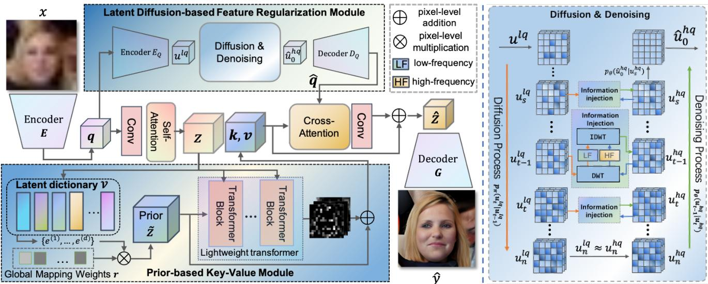  
Figure 2. Overview of the proposed PLTrans framework. An encoder E extracts the preliminary feature q from a degraded face image x. A latent diffusion-based regularization module is applied to q to obtain its degradation-irrelevant version qˆ as query. On the other hand, a prior-based key-value module quantizes and transforms q to learn key k and value v. We perform cross-attention computation over qˆ, k and v in each transformer block, and feed the resulting feature into a generator G to synthesize a HQ face image.

where $\epsilon _ { \theta } ( u _ { t } ^ { h q } , t )$ is a U-net model used to predict the noise from $u _ { t } ^ { h q }$ at step $t , \epsilon \sim \mathcal { N } ( \mathbf { 0 } , \mathbf { I } )$ and $\begin{array} { r } { \bar { \alpha } _ { t } = \prod _ { m = 1 } ^ { t } ( 1 - \beta _ { m } ) } \end{array}$ in which $\{ \beta _ { 1 } , \beta _ { 2 } , . . . , \beta _ { t } \}$ is the variance schedule used to control the degree of noise addition.

## 3.3. Prior-based Key-Value

In addition to regularizing the preliminary features as query, we also learn key and value within our transformation by integrating HQ face priors via a latent dictionary V. The elements in V are expected to offer a wealth of clear face details. Initially, we utilize the preliminary feature q to compute z through convolution and self-attention operations. Then, z is quantized by retrieving the d nearest elements from V, which serve as the respective priors, as follows:

$$
\{ e ^ { ( 1 ) } , \ldots , e ^ { ( d ) } \} _ { ( i , j ) } = \arg \operatorname* { m i n } _ { e \in \mathcal { V } } \| e - z _ { ( i , j ) } \| _ { 2 } ^ { 2 } ,\tag{5}
$$

where $z _ { ( i , j ) }$ denotes the feature vector at the spatial location $( i , j )$ . Rather than replacing z with the most similar element, the retrieved top-d priors contain more richer information. Note that V may not generalize well to the reconstruction of degraded data. A global mapping over the top-d priors is performed as follows:

$$
\widetilde { z } _ { ( i , j ) } = \sum _ { l = 1 } ^ { d } r _ { l } e ^ { ( l ) } ,\tag{6}
$$

where $\mathbf { r } = [ r _ { 1 } , \ldots , r _ { d } ]$ denotes a learnable combination coefficient vector $e ^ { ( l ) } \in \{ e ^ { ( 1 ) } , \dots , e ^ { ( d ) } \} _ { ( i , j ) }$ . Different from generic dictionary-based representation for data reconstruction, the global mapping is optimized for our restoration task and thus its expressiveness of the retreived elements can be enhanced. Building upon the priors ze, we learn $k , v$ by utilizing a lightweight transformer module which can be formulated as:

$$
\{ k , v \} = \Phi ( \widetilde { z } , z ) + \widetilde { z } ,\tag{7}
$$

where $\Phi ( \cdot )$ denotes the standard transformer operations. We compute the estimated features of the corresponding clear face image by performing cross-attention between qˆ and k, v to promote adherence as follows:

$$
\widehat { z } = \mathsf { C o n v } \Bigg ( \mathsf { s o f t m a x } \Big ( \frac { Q K ^ { T } } { \sqrt { N } } \Big ) V \Bigg ) + k ,\tag{8}
$$

where Conv represents the convolutional operation, N de notes the number of feature channels, and

$$
\begin{array} { l } { { Q = \hat { q } W _ { Q } + b _ { Q } , } } \\ { { \displaystyle K = k W _ { K } + b _ { K } , } } \\ { { V = v W _ { V } + b _ { V } , } } \end{array}\tag{9}
$$

and $W _ { Q / K / V }$ and $b _ { Q / K / V }$ are learnable parameters. We then restore the clear face image $\widehat { y }$ by feeding zb into a decoder G.

## 3.4. Model Training

Let yb denote the restored clear face image from a degraded input x. We first adopt the widely used pixel-level loss to assess the consistency to the ground truth, and the corresponding function is defined as follows:

$$
\mathcal { L } _ { c o n s } = \mathbf { E } _ { ( x , y ) } \big [ | \widehat { y } - y | _ { 1 } + \| \varphi ( \widehat { y } ) - \varphi ( y ) \| _ { 2 } ^ { 2 } \big ] ,\tag{10}
$$

where y denotes the ground-truth clear image with respect to x, and $\varphi ( \cdot )$ represents the feature maps extracted by a pre-trained VGG [33]. We also adopt an adversarial training strategy to improve the visual quality of restored images, and the loss function is defined as follows:

$$
\begin{array} { r l } & { \mathcal { L } _ { a d v } ^ { r e a l } = \mathbf { E } _ { y } \big [ \log D ( y ) \big ] , } \\ & { \mathcal { L } _ { a d v } ^ { s y n c } = \mathbf { E } _ { x } \big [ \log ( 1 - D ( \widehat { y } ) ) \big ] , } \end{array}\tag{11}
$$

where $D ( \cdot )$ denotes the predicted probability of an input face image being real. By integrating the above training losses, we formulate the optimization problem of our restoration model as follows:

$$
\begin{array} { r l } & { \underset { R } { \operatorname* { m i n } } \ \mathcal { L } _ { c o n s } ^ { q } + \lambda \mathcal { L } _ { K L } + \mathcal { L } _ { d i f } , } \\ & { \underset { E , P , G } { \operatorname* { m i n } } \ \mathcal { L } _ { c o n s } + \mathcal { L } _ { a d v } ^ { s y n c } , } \\ & { \underset { D } { \operatorname* { m a x } } \ \mathcal { L } _ { a d v } ^ { r e a l } + \mathcal { L } _ { a d v } ^ { s y n c } , } \end{array}\tag{12}
$$

where λ denotes a weighting factor that controls the relative importance of the KL Divergence-based regularization term. Note that the latent dictionary V is learnt by performing vector quantization [36] in a clear face image reconstruction process.

## 4. Experiments

In this section, extensive experiments are performed to evaluate the proposed PLTrans on a variety of face restoration tasks. We first introduce the experimental settings including the training and test datasets, implementation details and evaluation protocol. Next, we show how the latent transformations benefit face restoration, followed by quantitative and qualitative comparison with state-of-the-art methods. Finally, we demonstrate the applicability of PLTrans to multiple vision tasks.

## 4.1. Experimental Settings

## 4.1.1 Training Data

PLTrans was trained on FFHQ [19], which contains 70,000 HQ face images. To construct LQ training images, we follow [48] to degrade the FFHQ images as follows:

$$
{ \cal I } _ { L Q } = ( ( I _ { H Q } \otimes { \cal K } _ { \rho } ) _ { \downarrow _ { b } } + n _ { \sigma } ) _ { J P E G _ { w } } .\tag{13}
$$

Each HQ image is first convoluted with the Gaussian blur kernel which has a standard deviation $\rho \in \{ 0 : 0 . 1 : 5 \}$ Afterwards, it is downsampled $b \in \{ 0 . 8 : 3 2 \}$ times, and is corrupted by Gaussian noise with intensity parameter $\sigma \in$ $\{ 0 : 1 0 \}$ . Furthermore, the JPEG compression with quality factor $w \in \{ 5 0 : 1 0 0 \}$ is then applied to the resulting image.

## 4.1.2 Test Data

We assess the restoration performance of the proposed PLTrans and the competing methods on a well-known benchmark dataset: CelebA-HQ [28], and multiple in-thewild datasets: WIDER FACE [47], LFW-Test [17] and WebPhoto-Test [41]. Specifically, we randomly sample 2,000 CelebA-HQ images and apply the degeneration operation defined in Eq.(13) to construct degraded images, and the resulting test dataset is referred to as CelebA-Test. WIDER-Hard/Medium are derived from the WIDER FACE dataset, and there are 13,890/3407 face images with heavy/medium degradations. In addition, LFW-Test and WebPhoto-Test contain 1,711 and 407 mildly degraded face images, respectively.

## 4.1.3 Implementation Details

We adopt an encoder-transformer-decoder architecture together with a generic discriminator for the proposed PLTrans. We implement PLTrans using PyTorch with two NVIDIA GeForce RTX 3090s. For the optimizer, we adopt Adam [21] with a learning rate of $5 \times 1 0 ^ { - 5 }$ . There are a total of 30 training epochs with a batch size of 4. For the hyperparameters, we set the number of fetched elements d and the weighting factor λ in Eq.(12) are set to 8 and $5 \times 1 0 ^ { - 5 }$ respectively.

## 4.1.4 Evaluation Protocol

We implement all the competing methods based on the open source codes, and both training and test images are resized to 512×512 for a fair comparison. The widely used metrics: Peak Signal-to-Noise Ratio (PSNR) and the Learned Perceptual Image Patch Similarity (LPIPS) are used to quantitatively evaluate the consistency between the restored face images and the corresponding ground truth. Considering that identity preservation is critical for BFR, we further report the IDentity Similarity (IDS) to the ground truth after restoration in the feature space of a well-trained face recognition model: CosFace [39]. In addition, we assess the diversity and the degree of realism of the synthesized data in terms of Frechet Inception Distances (FID) [´ 13].

## 4.2. Degradation-unaware Representation

We begin by verifying the effectiveness of our latent diffusion module in producing degradation-irrelevant features. There are 500 HQ images and the corresponding 500 LQ images randomly sampled from CelebA-Test. For each HQ image and its degraded counterpart, we extract and denote their encoder features as $q _ { h q }$ and $q _ { l q } .$ We apply the latent diffusion-based regularization on $q _ { l q } ,$ and denote the regularized version as $\hat { q } _ { l q } .$ . In Figure $^ { 3 , }$ we visualize the feature distributions by using t-SNE [37], and can observe that the clusters of $q _ { h q }$ and $q _ { l q }$ are separable, while the data points of $\hat { q } _ { l q }$ mix with those of $q _ { h q } .$ . This indicates that our regularization module is useful for mitigating degradations to a certain extent.

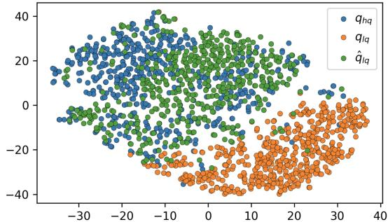  
Figure 3. Distributions of HQ image features $q _ { h q } ,$ LQ image features $q _ { l q } ,$ and the regularized LQ image features $\hat { q } _ { l q }$

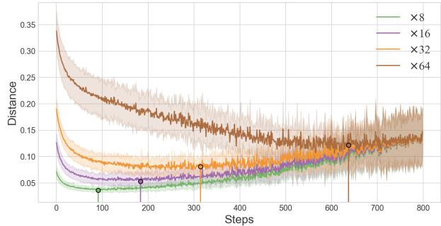  
Figure 4. The average distances between the regularized LQ image features and the HQ counterparts in the training process.

## 4.3. Impact of the Number of Diffusion Steps

To obtain the degradation-unaware features, we regularize the preliminary features by performing n-step perturbations followed by a reverse diffusion process. It is nontrivial to determine the optimal number of diffusion steps for BFR. For a given image with heavy degradation, it typically takes more perturbation and denoising steps to restore it, and vice versa. To illustrate this point, we perform an experiment on the face images with four levels of degradations (×8/16/32/64 downsampling). In Figure 4, we plot the average distances between the regularized features of LQ CelebA-Test images and the preliminary features of the HQ counterparts in the training process, and the shaded regions around these lines illustrate their variance. One can observe that the average distance to the HQ data quickly achieves the minimum value for the cases where the degree of degradation is low. This confirms that more diffusion steps are needed to restore the clean face image from a heavily degraded one. After the minima are attained, increasing the steps leads to a performance drop, since the relationship between the preliminary features and the corrupted features fades. In Figure 5, we visualize the restored face images at ×32 downsampling scale, showcasing the effects of using varying numbers of diffusion steps.

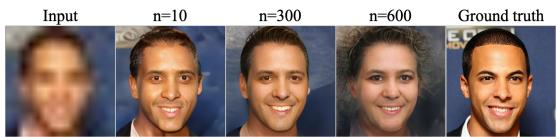  
Figure 5. The restoration results of PLTrans with different numbers of diffusion steps.

Table 1. Results of PLTrans and ablative models on CelebA-Test.
<table><tr><td>Methods</td><td>FID↓</td><td>LPIPS↓</td><td>PSNR↑</td><td>IDS↑</td></tr><tr><td>PLTrans w/o V</td><td>90.12</td><td>0.4808</td><td>18.81</td><td>0.2866</td></tr><tr><td>PLTrans w/o  $D I F F$ </td><td>44.96</td><td>0.4304</td><td>18.89</td><td>0.4820</td></tr><tr><td>PLTrans w/o LT</td><td>42.12</td><td>0.4301</td><td>19.11</td><td>0.5201</td></tr><tr><td>PLTrans w/o DWT</td><td>41.57</td><td>0.4487</td><td>17.99</td><td>0.4672</td></tr><tr><td>PLTrans</td><td>39.58</td><td>0.4260</td><td>19.36</td><td>0.5264</td></tr></table>

## 4.4. Ablation Study

We consider that the superior restoration performance of our PLTrans is mainly due to the latent diffusion-based regularization, HQ face prior, DWT-based low-frequency information injection and the prior-based key-value. To highlight the effectiveness of the four factors in BFR, we perform a number of ablative experiments. Specifically, we build four variants by disabling the diffusion module (DIFF), DWT, dictionary and Lightweight Transformer (LT) in the Prior-based Key-Value Module, and the resulting models are referred to as ‘ PLTrans w/o DIFF’, ‘ PLTrans w/o DWT’, ‘ PLTrans w/o V’ and ‘ PLTrans w/o LT’ respectively. The experiments are performed on CelebA-Test, and we summarize the results of the models in terms of FID, PSNR, LPIPS and IDS in Table 1. We can make the follow ing observations: PLTrans outperforms its variants, yielding superior quantitative results across all the metrics. With out the latent diffusion-based regularization, it is difficult to restore the disordered structural information of degraded images, and the restoration performance reduces 5.38 in terms of FID. A number of artifacts in the resulting synthesized images are also observed as shown in Figure 6. When compared with ‘PLTrans w/o V’, the inclusion of the latent dictionary leads to 0.0548 improved performance in terms of LPIPS. This demonstrates that the HQ face prior is useful for synthesizing texture details. When disabling the lightweight transformer module, ‘ PLTrans w/o LT’ learns the key and value vectors directly from the dictionary features, and we can observe a performance drop of 0.25 in terms of PSNR. We conclude that this module can infer a reasonable transformation to leverage the prior knowledge, which is useful for plausible synthesis. What’s more, when disabling the DWT-based information injection module, ‘ PLTrans w/o DWT’ leads to a significant performance drop of 0.0592 in terms of IDS. This suggests the information injection module is beneficial for preserving the semantics of the input image.

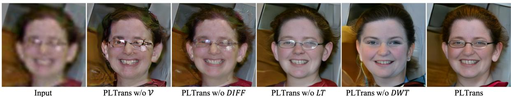  
Figure 6. Visual comparison between PLTrans and ablative models on an in-the-wild image.

## 4.5. Comparison to State-of-the-arts

To demonstrate the superiority of the proposed PLTrans, we perform quantitative and qualitative comparisons with state-of-the-arts, including generic image enhancement methods: Restormer [50] and DIL [23], BFR methods: GFP-GAN [41], GPEN [48], RestoreFormer [43] and Panini [42], and two diffusion-based methods: ILVR [5] and DR2 [44].

## 4.5.1 Results on CelebA-Test

We adopt the same setting as [43] to perform the experiments, where PLTrans and the competing methods are used to restore the degraded face images across a spectrum of downsampling ratios (×16, ×32, ×64). The results of the methods are summarized in Table 2. GPEN, DR2 and RestoreFormer achieve lower FID/LPIPS and higher IDS scores than the other competing methods, which indicates that they perform better in terms of the precision and realism of the restored face images. On the other hand, PLTrans surpasses the competing methods in terms of all the metrics. In particular, for the most difficult case of downsampling ×64, PLTrans is able to achieve the FID and PSNR scores of 39.58 and 19.36, which are lower and higher than the second best methods (GPEN: FID 45.12; DIL: PSNR 19.25) by 5.54 and 0.11, respectively.

Both ILVR and DR2 are diffusion-based methods, and DR2 outperforms ILVR in the above comparison. Different from DR2 which relies on a pre-trained DDPM model, PLTrans learns a latent diffusion module to regularize the preliminary features of degraded images. We perform an additional experiment to further highlight the advantage of PLTrans over DR2. We apply the methods to handle four types of degradation: Gaussian Noise, Blur, Downsample, and JPEG. Figure 7 shows the PLTrans is able to significantly outperform DR2. This suggests that the proposed latent diffusion strategy is more effective for our task.

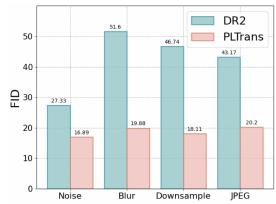

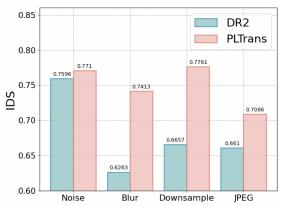  
Figure 7. Comparison between PLTrans and DR2 over different types of degradations.

## 4.5.2 User Study on In-the-wild Data

We further evaluate PLTrans and the competing methods on WIDER-Hard/Medium, LFW-Test and WebPhoto-Test. Please note that all the models are trained on FFHQ only. In Figure 8, we also present a number of representative restoration results to demonstrate the advantages of PLTrans in reducing artifacts, restoring realistic details, and preserving identity. A user study is performed to assess the restoration quality. We randomly sample 50 degraded face images from the four datasets, and there are 80 workers who are required to score the restoration results of the methods, ranging from 0 to 10. The maximum attainable score is 10 points. The high-score results should represent delightful content with realistic details, while at the same time properly preserving the basic information of the degraded ones. To ensure an unbiased evaluation, the results of the models are presented in a random order. Figure 9 shows the average scores of the models. Our PLTrans achieves the best performance in terms of the highest average scores with a small variance.

## 4.6. Extended Applications

Due to the inclusion of the latent diffusion module, the proposed PLTrans is capable of performing various image synthesis and editing tasks. We impose Gaussian regularization on the latent variable u in Eq.(2), and is thus able to synthesize diverse face images by sampling u from the prior distribution. In addition, we apply linear interpolation to construct a path between two latent variables: $u _ { 1 }$ and $u _ { 2 } .$ and decode the interpolated vectors. We find that PLTrans can produce continuously changing images along the path. By feeding out-of-domain images, such as cartoon, incomplete image, human scribble and segmentation map, the synthesized face images are realistic while at the same time preserving semantic consistency with the input to a certain extent. We can also edit face components by replacing the u’s subvector associated with the customized region with the counterparts of the reference. As shown in Figure 10, PLTrans produces realistic face images in different tasks. This demonstrates the greater capability of PLTrans in face image enhancement.

## 5. Conclusion

This paper presents a prior-based latent transformation approach for blind face restoration. We facilitate this task

Facial Edition  
Inpainting  
Table 2. Quantitative Comparison between PLTrans and competing methods on CelebA-Test.
<table><tr><td rowspan="2">Methods</td><td colspan="4">× 16</td><td colspan="4">× 32</td><td colspan="4">× 64</td></tr><tr><td>FID↓</td><td>LPIPS↓</td><td>PSNR↑</td><td>IDS↑</td><td>FID↓</td><td>LPIPS↓</td><td>PSNR↑</td><td>IDS↑</td><td>FID↓</td><td>LPIPS↓</td><td>PSNR↑</td><td>IDS↑</td></tr><tr><td>GFPGAN [46]</td><td>40.83</td><td>0.3583</td><td>21.00</td><td>0.6446</td><td>107.65</td><td>0.4334</td><td>18.91</td><td>0.2523</td><td>159.24</td><td>0.4590</td><td>18.41</td><td>0.1679</td></tr><tr><td>GPEN [48]</td><td>25.82</td><td>0.3781</td><td>20.28</td><td>0.7126</td><td>36.22</td><td>0.4339</td><td>18.62</td><td>0.5698</td><td>45.12</td><td>0.4512</td><td>18.20</td><td>0.5011</td></tr><tr><td>ILVR [5]</td><td>103.08</td><td>0.5708</td><td>21.08</td><td>0.5768</td><td>97.96</td><td>0.5446</td><td>19.76</td><td>0.5173</td><td>107.83</td><td>0.5734</td><td>19.21</td><td>0.4627</td></tr><tr><td>Panini [42]</td><td>47.14</td><td>0.3935</td><td>21.90</td><td>0.6754</td><td>44.23</td><td>0.4838</td><td>19.01</td><td>0.4857</td><td>52.37</td><td>0.4864</td><td>19.06</td><td>0.4272</td></tr><tr><td>Restormer [50]</td><td>148.56</td><td>0.5981</td><td>22.12</td><td>0.3346</td><td>185.25</td><td>0.6302</td><td>19.79</td><td>0.1771</td><td>197.32</td><td>0.6459</td><td>19.24</td><td>0.1332</td></tr><tr><td>RestoreFormer [43]</td><td>24.32</td><td>0.3592</td><td>21.99</td><td>0.7378</td><td>39.39</td><td>0.4397</td><td>19.41</td><td>0.5379</td><td>46.28</td><td>0.4597</td><td>19.11</td><td>0.4778</td></tr><tr><td>DIL [23]</td><td>207.88</td><td>0.6375</td><td>21.91</td><td>0.3626</td><td>406.17</td><td>0.6835</td><td>19.81</td><td>0.1697</td><td>463.76</td><td>0.6918</td><td>19.25</td><td>0.1230</td></tr><tr><td>DR2 [44]</td><td>35.18</td><td>0.4115</td><td>21.09</td><td>0.5965</td><td>43.41</td><td>0.4276</td><td>19.62</td><td>0.5273</td><td>49.64</td><td>0.4560</td><td>19.14</td><td>0.4721</td></tr><tr><td>PLTrans</td><td>19.64</td><td>0.3207</td><td>22.13</td><td>0.7412</td><td>32.36</td><td>0.3978</td><td>19.91</td><td>0.5963</td><td>39.58</td><td>0.4270</td><td>19.36</td><td>0.5264</td></tr></table>

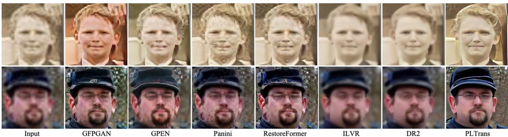  
Figure 8. Visual comparison between PLTrans and competing methods on representative in-the-wild images.

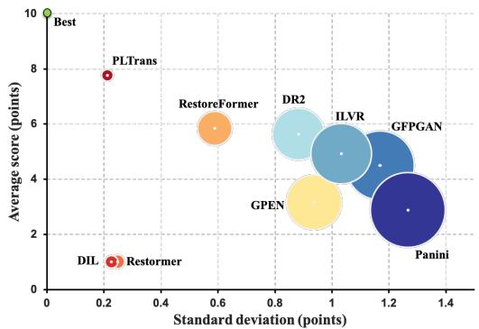

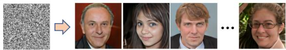  
Figure 9. The scoring result of user study on in-the-wild data.  
Image Synthesis

## 6. Acknowledgments

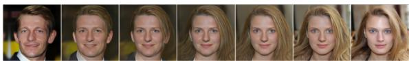

by improving the attention computation in a restoration transformer, which represents an effective attempt to transform query, key and value vectors to synthesize the clear face images from degraded ones. Toward this end, we incorporate a latent diffusion module to regularize the preliminary features, such that the regularized version becomes less sensitive to degradations. This is essential for enhancing the generalization performance over unknown degradations. We further incorporate a HQ face prior in the form of a latent dictionary to learn key and value, followed by cross-attention computation with the regularized features as query. Extensive experiments validate the effectiveness of our proposed framework PLTrans in restoring faithful details and preserving identity information.

This work was supported in part by the National Natural Science Foundation of China (Project No. 62072189, 62106136), in part by the Research Grants Council of the Hong Kong Special Administration Region (Project No. CityU 11206622), in part by the Guang-Dong Basic and Applied Basic Research Foundation (Project No. 2020A1515010484, 2022A1515011160, 2022A1515010434), and in part by TCL Science and Technology Innovation Fund (Project No. 20231752).

Interpolation  
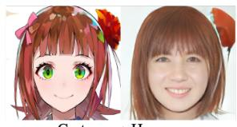  
Cartoon → Human

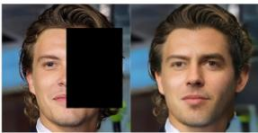

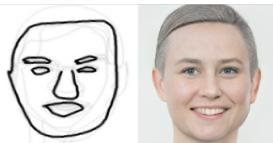  
Scribble → Human

  
Segmentation Map → Human

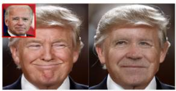  
Face Swap  
Figure 10. Representative results of PLTrans on different vision tasks.

## References

[1] Nicolas Carion, Francisco Massa, Gabriel Synnaeve, Nicolas Usunier, Alexander Kirillov, and Sergey Zagoruyko. End-toend object detection with transformers. In Proc. European Conference on Computer Vision, 2020. 3

[2] Kelvin C.K. Chan, Xintao Wang, Xiangyu Xu, Jinwei Gu, and Chen Change Loy. GLEAN: generative latent bank for large-factor image super-resolution. In Proc. IEEE Conference on Computer Vision and Pattern Recognition, 2021. 2

[3] Hanting Chen, Yunhe Wang, Tianyu Guo, Chang Xu, Yiping Deng, Zhenhua Liu, Siwei Ma, Chunjing Xu, Chao Xu, and Wen Gao. Pre-trained image processing transformer. In Proc. IEEE Conference on Computer Vision and Pattern Recognition, 2021. 3

[4] Yu Chen, Ying Tai, Xiaoming Liu, Chunhu Shen, and Jian Yang. FSRNet: end-to-end learning face super-resolution with face priors. In Proc. IEEE Conference on Computer Vision and Pattern Recognition, 2017. 2

[5] Jooyoung Choi, Sungwon Kim, Yonghyun Jeong, Youngjune Gwon, and Sungroh Yoon. Ilvr: Conditioning method for denoising diffusion probabilistic models. In 2021 IEEE/CVF International Conference on Computer Vision (ICCV), pages 14347–14356, 2021. 2, 7, 8

[6] Jocob Devlin, Ming-Wei Chang, Kenton Lee, and Kristina Toutanova. BERT: pre-training of deep bidirectional transformers for language understanding. In arXiv:1801.04805, 2018. 3

[7] Berk Dogan, Shuhang Gu, and Radu Timofte. Exemplar guided face image super-resolution without facial landmarks. In Proc. IEEE Conference on Computer Vision and Pattern Recognition Workshop, 2019. 2

[8] Chao Dong, Chen Change Loy, Kaiming He, and Xiaoou Tang. Image super-resolution using deep convolutional networks. IEEE Transactions on Pattern Analysis and Machine Intelligence (Early Access), 38(2):295–307, 2015. 2

[9] Alexy Dosovitskiy, Lucas Beyer, Alexander Kolesnikov, Dirk Weissenborn, Xiaohua Zhai, Thomas Unterthiner, Mostafa Dehghani, Matthias Minderer, Georg Heigold, Sylvain Gelly, Jakob Uszkoreit, and Neil Houlsby. An image is worth 16x16 words: transformers for image recognition at scale. In International Conference on Learning Representations, 2021. 3

[10] Wenchao Du, Hu Chen, and Hongyu Yang. Learning invariant representation for unsupervised image restoration. In Proc. IEEE Conference on Computer Vision and Pattern Recognition, 2020. 2

[11] Patrick Esser, Robin Rombach, and Bjorn Ommer. Taming transformers for high-resolution image synthesis. In Proc. IEEE Conference on Computer Vision and Pattern Recognition, 2021. 3

[12] Ian J. Goodfellow, Jean Pouget-Abadie, Mehdi Mirza, Bing Xu, David Warde-Farley, Sherjil Ozair, Aaron Courville, and Yoshua Bengio. Generative adversarial nets. In Proc. Neural Information Processing Systems, 2014. 1

[13] Martin Heusel, Hubert Ramsauer, Thomas Unterthiner, and Bernhard Nessler. GANs trained by a two time-scale update

rule converge to a local Nash equilibrium. In Proc. Neural Information Processing Systems, 2017. 5

[14] Jonathan Ho, Ajay Jain, and Pieter Abbeel. Denoising diffusion probabilistic models. In Proceedings of the 34th International Conference on Neural Information Processing Systems, NIPS’20, Red Hook, NY, USA, 2020. Curran Associates Inc. 2

[15] Xiaobin Hu, Wenqi Ren, John Lamaster, Xiaochun Cao, Xiaoming Li, Zechao Li, Bjoern Menze, and Wei Liu. Face super-resolution guided by 3D facial priors. In Proc. European Conference on Computer Vision, 2020. 2

[16] Xiaobin Hu, Wenqi Ren, Jiaolong Yang, Xiaochun Cao, David Wipf, Bjoern Menze, Xin Tong, and Hongbin Zha. Face restoration via plug-and-play 3d facial priors. IEEE Transactions on Pattern Analysis and Machine Intelligence, 44(12):8910–8926, 2022. 2

[17] Gary Huang, Marwan Mattar, Tamara Berg, and Eric Learned-Miller. Labeled faces in the wild: A database forstudying face recognition in unconstrained environments. Tech. rep., 10 2008. 5

[18] Huaibo Huang, Ran He, Zhenan Sun, and Tieniu Tan. Wavelet-srnet: A wavelet-based cnn for multi-scale face super resolution. In 2017 IEEE International Conference on Computer Vision (ICCV), pages 1698–1706, 2017. 2

[19] Tero Karras, Samuli Laine, and Timo Aila. A style-based generator architecture for generative adversarial networks. IEEE Transactions on Pattern Analysis and Machine Intelligence, 43(12):4217–4228, 2021. 2, 5

[20] Jiwon Kim, Jung Kwon Lee, and Kyoung Mu Lee. Accurate image super-resolution using very deep convolutional networks. In Proc. IEEE Conference on Computer Vision and Pattern Recognition, 2016. 2

[21] Diederik Kingma and Jimmy Ba. Adam: A method for stochastic optimization. International Conference on Learning Representations, 12 2014. 5

[22] Xiaoming Li, Chaofeng Chen, Shangchen Zhou, Xianhui Lin, Wangmeng Zuo, and Lei Zhang. Blind face restoration via deep multi-scale component dictionaries. In Proc. European Conference on Computer Vision, 2020. 2

[23] Xin Li, Bingchen Li, Xin Jin, Cuiling Lan, and Zhibo Chen. Learning distortion invariant representation for image restoration from a causality perspective. In 2023 IEEE/CVF Conference on Computer Vision and Pattern Recognition (CVPR), pages 1714–1724, 2023. 7, 8

[24] Xiaoming Li, Wenyu Li, Dongwei Ren, Hongzhi Zhang, Meng Wang, and Wangmeng Zuo. Enhanced blind face restoration with multi-exemplar images and adaptive spatial feature fusion. In Proc. IEEE Conference on Computer Vision and Pattern Recognition, 2020. 2

[25] Xiaoming Li, Ming Liu, Yuting Ye, Wangmeng Zuo, Liang Lin, and Ruigang Yang. Learning warped guidance for bline face restoration. In Proc. European Conference on Computer Vision, 2018. 2

[26] Songnan Lin, Jiawei Zhang, Jinshan Pan, Yicun Liu, Yongtian Wang, Jing S.J. Chen, and Jimmy S. Ren. Learning to deblur face images via sketch synthesis. In Proc. AAAI Conference on Artificial Intelligence, 2020. 2

[27] Ze Liu, Yutong Lin, Yue Cao, Han Hu, Yixuan Wei, Zheng Zhang, Stephen Lin, and Baining Guo. Swin transformer: hierarchical vision transformer using shifted windows. In Proc. International Conference on Computer Vision, 2021. 3

[28] Ziwei Liu, Ping Luo, Xiaogang Wang, and Xiaoou Tang. Deep learning face attributes in the wild. In 2015 IEEE International Conference on Computer Vision (ICCV), pages 3730–3738, 2015. 5

[29] Cheng Ma, Zhenyu Jiang, Yongming Rao, Jiwen Lu, and Jie Zhou. Deep face super-resolution with iterative collaboration between atentive recovery and landmark estimation. In Proc. IEEE Conference on Computer Vision and Pattern Recognition, 2020. 2

[30] Sachit Menon, Alexandru Damian, Shijia Hu, Nikhil Ravi, and Cynthia Rudin. PULSE: self-supervised photo unsampling via latent space exploration of generative models. In Proc. IEEE Conference on Computer Vision and Pattern Recognition, 2020. 2

[31] Elad Richardson, Yuval Alaluf, Or Patashnik, Yotam Nitzan, Yaniv Azar, Stav Shapiro, and Daniel Cohen-Or. Encoding in style: a StyleGan encoder for image-to-image translation. In Proc. IEEE Conference on Computer Vision and Pattern Recognition, pages 2287–2296, 2021. 2

[32] Yohan Roirier-Ginter and Jean-Francois Lalonde. Robust unsupervised StleGAN image restoration. In Proc. IEEE Conference on Computer Vision and Pattern Recognition, 2023. 2

[33] Karen Simonyan and Andrew Zisserman. Very deep convolutional networks for large-scale image recognition. In arXiv:1409.1556, 2014. 5

[34] Wei Sun, Dong Gong, Qinfeng Shi, Anton van den Hengel, and Yanning Zhang. Learning to zoom-in via learning to zoom-out: real-world super-resolution by generating and adaptating degradation. IEEE Transactions on Image Processing, 30:2947–2962, 2021. 2

[35] Hugo Touvron, Matthieu Cord, Matthijs Douze, Francisco Massa, Alexandre Sablayrolls, and Herve Jegou. Training data-efficient image transformers & distillation through attention. In Proc. International Conference on Machine Learning, 2021. 3

[36] Aaron van den Oord, Oriol Vinyals, and Koray Kavukcuoglu. Neural discrete representation learning. In arXiv:1711.00937, 2017. 2, 5

[37] Laurens van der Maaten and Geoffrey Hinton. Visualizing data using t-sne. Journal of Machine Learning Research, 9(86):2579–2605, 2008. 5

[38] Ashish Vaswani, Noam Shazeer, Niki Parmar, Jakob Uszkoreit, Llion Jones, Aidan N Gomez, Lukasz Kaiser, and Illia Polosukhin. Attention is all you need. In Proc. Neural Information Processing Systems, 2017. 3

[39] Hao Wang, Yitong Wang, Zheng Zhou, Xing Ji, Dihong Gong, Jingchao Zhou, Zhifeng Li, and Wei Liu. Cosface: Large margin cosine loss for deep face recognition. In 2018 IEEE/CVF Conference on Computer Vision and Pattern Recognition, pages 5265–5274, 2018. 5

[40] Huiyu Wang, Yukun Zhu, Hartwig Adam, Alan Yuille, and Liang-Chieh Chen. MaX-DeepLab: end-to-end panoptic

segmetation with mask transformers. In Proc. IEEE Conference on Computer Vision and Pattern Recognition, 2021. 3

[41] Xintao Wang, Yu Li, Honglun Zhang, and Ying Shan. Towards real-world blind face restoration with generative facial prior. In Proc. IEEE Conference on Computer Vision and Pattern Recognition, 2021. 2, 5, 7

[42] Yinhuai Wang, Yujie Hu, and Jian Zhang. Panini-net: Gan prior based degradation-aware feature interpolation for face restoration. Proceedings of the AAAI Conference on Artificial Intelligence, 36(3):2576–2584, Jun. 2022. 7, 8

[43] Zhouxia Wang, Jiawei Zhang, Runjian Chen, Wenping Wang, and Ping Luo. RestoreFormer: high-quality blind face restoration from undegraded key-value pairs. In Proc. IEEE Conference on Computer Vision and Pattern Recognition, 2022. 2, 7, 8

[44] Zhixin Wang, Ziying Zhang, Xiaoyun Zhang, Huangjie Zheng, Mingyuan Zhou, Ya Zhang, and Yanfeng Wang. DR2: diffusion-based robust degradation remover for blind face restoration. In Proc. IEEE Conference on Computer Vision and Pattern Recognition, 2023. 2, 7, 8

[45] Yunxuan Wei, Shuhang Gu, Yawei Li, Radu Timofte, Longcun Jin, and Hengjie Song. Unsupervised real-world image super-resolution via domain-distance aware training. In Proc. IEEE Conference on Computer Vision and Pattern Recognition, 2021. 2

[46] Yanze Wu, Xintao Wang, Yu Li, Honglun Zhang, Xun Zhao, and Ying Shan. Towards vivid and diverse image colorization with generative color prior. In Proc. IEEE International Conference on Computer Vision, 2021. 8

[47] Shuo Yang, Ping Luo, Chen Change Loy, and Xiaoou Tang. Wider face: A face detection benchmark. In 2016 IEEE Conference on Computer Vision and Pattern Recognition (CVPR), pages 5525–5533, 2016. 5

[48] Tao Yang, Peiran Ren, Xuansong Xie, and Lei Zhang. GAN prior embedded network for blind face restoration in the wild. In Proc. IEEE Conference on Computer Vision and Pattern Recognition, 2021. 5, 7, 8

[49] Yingchen Yu, Fangneng Zhan, Shijian Lu, Jianxiong Pan, Feiying Ma, Xuansong Xie, and Chunyan Miao. WaveFill: a wavelet-based generation network for image inpainting. In Proc. International Conference on Computer Vision, 2021. 2

[50] Syed Waqas Zamir, Aditya Arora, Salman Khan, Munawar Hayat, Fahad Shahbaz Khan, and Ming-Hsuan Yang. Restormer: efficient transformer for high-resolution image restoration. In Proc. IEEE Conference on Computer Vision and Pattern Recognition, 2022. 3, 7, 8

[51] Feida Zhu, Junwei Zhu, Wenqing Chu, Xinyi Zhang, Xiaozhong Ji, Chengjie Wang, and Ying Tai. Blind face restoration via integrating face shape and generative priors. In Proc. IEEE Conference on Computer Vision and Pattern Recognition, 2022. 2

[52] Xizhou Zhu, Weijie Su, Lewei Lu, Bin Li, Xiaogang Wang, and Jifeng Dai. Deformable DETR: deformable transformers for end-to-end object detection. In International Conference on Learning Representations, 2021. 3