# MACE: Mass Concept Erasure in Diffusion Models

Shilin Lu1 Zilan Wang1 Leyang Li1 Yanzhu Liu2 Adams Wai-Kin Kong1 1School of Computer Science and Engineering, Nanyang Technological University, Singapore   
2Institute for Infocomm Research (I2R) & Centre for Frontier AI Research (CFAR), A\*STAR, Singapore   
{shilin002, wang1982, lile0005}@e.ntu.edu.sg, liu\_yanzhu@i2r.a-star.edu.sg, adamskong@ntu.edu.sg

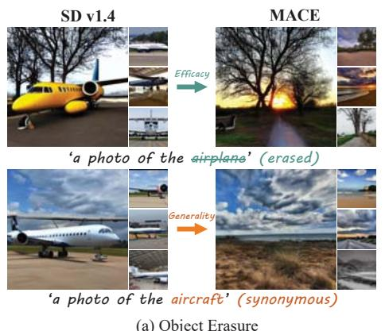

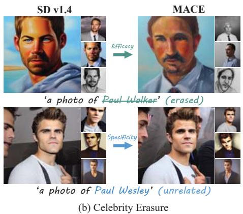

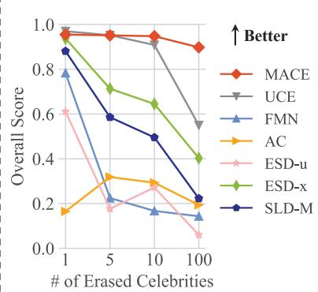  
(c) Scaling Erasure up to 100 Concepts  
Figure 1. Our proposed method, MACE, can erase a large number of concepts from text-to-image diffusion models. This can safeguard celebrity portrait rights, respect copyrights on artworks, and prevent explicit content creation. (a) MACE demonstrates good efficacy and generality by preventing the generation of images reflecting the target concept and its synonyms. (b) MACE maintains excellent specificity, ensuring that the unintended concepts remain intact, even when they share common terms with the target concept. (c) MACE exhibits a significantly enhanced ability to erase 100 concepts, outperforming previous methods. The overall score indicates the comprehensive erasing capability, as detailed in Section 4.3

## Abstract

The rapid expansion of large-scale text-to-image diffusion models has raised growing concerns regarding their potential misuse in creating harmful or misleading content. In this paper, we introduce MACE, a finetuning framework for the task of MAss Concept Erasure. This task aims to prevent models from generating images that embody unwanted concepts when prompted. Existing concept erasure methods are typically restricted to handling fewer than fve concepts simultaneously and struggle to find a balance between erasing concept synonyms (generality) and maintaining unrelated concepts (specificity). In contrast, MACE differs by successfully scaling the erasure scope up to 100 concepts and by achieving an effective balance between generality and specificity. This is achieved by leveraging closed-form cross-attention refinement along with LoRA finetuning, collectively eliminating the information of undesirable concepts. Furthermore, MACE integrates multiple LoRAs without mutual interference. We conduct extensive evaluations of MACE against prior methods across four different tasks: object erasure, celebrity erasure, explicit content erasure and artistic style erasure. Our results reveal that MACE surpasses prior methods in all evaluated tasks. Code is available at https://github.com/Shilin-LU/MACE.

## 1. Introduction

In large-scale text-to-image (T2I) models [9, 14, 34, 40, 49, 54, 57, 73, 74, 76, 77], the task of concept erasure aims to remove concepts that may be harmful, copyrighted, or offensive. This ensures that when a model is prompted with any phrase related to deleted concepts, it will not generate images reflecting those concepts.

The drive behind concept erasure is rooted in the significant risks posed by T2I models. These models can generate inappropriate content, such as copyrighted artworks [23, 24, 55, 61], explicit content [22, 59, 72], and deepfakes [38, 70]. These issues are largely caused by the unfiltered, web-scraped training data [60]. While researchers have put efforts to mitigate these risks through refining datasets and retraining models, these methods are not only costly but also can lead to unforeseen outcomes [7, 44]. For example despite being trained on a sanitized dataset, Stable Diffusion (SD) v2.0 [52] still produces explicit content. Moreover, it exhibits a diminished generative quality for regular content when compared to its earlier versions [44]. Alternative methods, such as post-generation filtering [41, 50] and inference guiding [3, 59], are effective when models are accessed only via APIs. Yet, these safeguards can be easily (b) Replacing the text embedding of 'puppy' with that of the final [EOS] token.

bypassed if users have access to the source code [63].

To mitigate the vulnerability of these safeguards, several finetuning-based methods have been proposed [16, 17, 19, 25, 30, 71]. Nonetheless, the challenge of concept erasure lies in balancing the dual requirements of generality and specificity. Generality requires that a concept should be consistently removed, regardless of its expression and the context in which it appears. On the other hand, specificity requires that unrelated concepts remain intact. Our analysis reveals that there is substantial room for enhancing these methods with respect to both generality and specificity.

We pinpoint three primary issues that hinder the effectiveness of prior works. Firstly, the information of a phrase is concealed within other words in the prompt through the attention mechanism [69]. This is sufficient to evoke the concept from T2I models (see Figure 2), leading to restricted generality and incomplete elimination when removing concepts. Secondly, finetuning the diffusion model's prediction on early denoising steps (t > t0) can result in degraded specificity of concept erasure. Typically, diffusion models generate a general context in the early stage [12, 31, 51]. For instance, when generating a portrait of Paul Walker or Paul Wesley, the initial sampling trajectory gravitates towards the face manifold. It begins by forming a vague outline that could resemble any person. After a turning point, a.k.a. spontaneous symmetry breaking (SSB) [51], the identity becomes clear with the details progressively filled in. If our goal is to only prevent the model from generating images of Paul Walker, it should not impact other celebrities named Paul' (See Figure 1). However, if we alter the predictions made in the early stages, other Pauls' can inadvertently be affected. Lastly, when fineturning methods are applied to erase a large number of concept (e.g., 100), a noticeable decline in performance is observed. This decline is due to either sequential or parallel finetuning of the models. The former is prone to catastrophic forgetting and the latter results in interference among different concepts being finetuned.

In light of these challenges, we propose a framework, dubbed MAss Concept Erasure (MACE), to erase a large number of concepts from T2I diffusion models. MACE not only achieves a superior balance between generality and specificity, but also adeptly handles the erasure of 100 concepts. It requires neither concept synonyms nor the original training data to perform concept erasure. To remove multiple concepts, MACE starts by refining the cross-attention layers of the pretrained model using a closed-form solution. This design encourages the model to refrain from embedding residual information of the target phrase into other words, thereby erasing traces of the concept in the prompt. Secondly, it employs a unique LoRA module [21] for each individual concept to remove its intrinsic information. To maintain specificity, MACE exploits concept-focal importance sampling during LoRA training, mitigating the impact on unintended concepts. Finally, we develop a loss function for MACE to harmoniously integrate multiple LoRA modules without interfering with one another, while preventing catastrophic forgetting. This integration loss can also be swiftly solved using a closed-form solution. We conduct extensive evaluations on four distinct tasks, including object erasure, celebrity erasure, explicit content erasure, and artistic style erasure. MACE demonstrates superior performance on mass concept erasure and strikes an effective balance between specificity and generality, compared with state-ofthe-art (SOTA) methods. This achievement paves the way for safer and more regulated T2I applications.

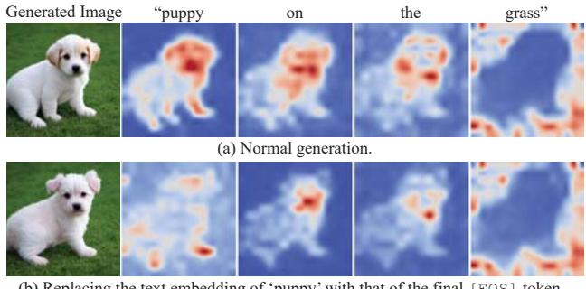  
Figure 2. A concept can be generated solely via residual information: (a) Average cross-attention map for each word presents that a concept's information is embedded within other words. (b) A puppy can be generated solely using residual information by replacing the text embedding of puppy' with that of the final [EOS ] token. Additional examples are available in Appendix G.

## 2. Related Work

Concept erasure. Existing research on preventing unwanted outputs from T2I models can be broadly grouped into four categories: post-image filtering [41, 50], inference guidance [3, 59], retraining with the curated dataset [40, 52], and model finetuning [16, 17, 19, 25, 30, 39, 71]. The first two methods are post-hoc solutions and do not address the inherent propensity of the models to generate inappropriate content [63]. Although retraining with curated datasets may offer a solution, it demands significant computational effort and time (e.g., over 150,000 A100 GPU hours for retraining Stable Diffusion) [53]. Finetuning pretrained T2I models is a more viable approach. However, most methods either overlook the residual information of the target phrase embedded within co-existing words, focusing solely on the target phrase [16, 17, 71], or they finetune uniformly across timesteps [16, 25, 30, 71]. Modifications to diffusion models conditioned on timesteps before SSB [51] can negatively affect the generation of retained concepts. In contrast, the proposed MACE addresses these challenges effectively.

Image cloaking. An alternative method for safeguarding images against imitation or memorization [8, 65] by T2I models involves an additional step of applying adversarial perturbations to photographs or artworks before they are posted online. This technique, often referred to as cloaking, enables individuals to effectively conceal their images from models during the training phase but remain accessible and discernible to human viewers [58, 62, 75]. Nevertheless, it is crucial to note that this strategy is applicable only to content not yet posted online. To safeguard the vast amount of content already on the web, concept erasure can serve as a viable strategy for large model providers as they prepare to release more advanced models in subsequent evolutions.

## 3. Method

We aim to develop a framework to erase a large number of concepts from pretrained T2I diffusion models. This framework takes two inputs: a pretrained model and a set of target phrases that expresses the concepts to be removed. It returns a finetuned model that is incapable of generating images depicting the concepts targeted for erasing. An effective erasure framework should fulfill the following criteria:

• Efficacy (block target phrases): If the finetuned model is conditioned on prompts with those target phrases, its outputs should have limited semantic alignment with the prompts. Yet, the outputs should still appear natural, either aligning with a generic category (e.g., sky), or defaulting to the super-category of the concept, if one exists.

• Generality (block synonyms): The model should also prevent the generation of images semantically related to any synonyms of the targeted phrases, ensuring that the erasure is not limited to the exact wording of the prompts.

• Specificity (preserve unrelated concepts): If the finetuned model is conditioned on prompts that are semantically unrelated to the erased concepts, its output distribution should closely align with that of the original model.

To this end, we introduce MACE, a MAss Concept Erasure framework. The information of a phrase is embedded not only within the phrase itself but also within the words it co-exists with. To effectively erase the targeted concepts, our framework first removes the residual information from the co-existing words (Section 3.1). Subsequently, distinct LoRA modules are trained to eliminate the intrinsic information specific to each target concept (Section 3.2). Lastly, our framework integrates multiple LoRA modules without mutual interference, leading to a final model that effectively forgets a wide array of concepts (Section 3.3). Figure 3 presents an overview of our framework.

## 3.1. Closed-Form Cross-Attention Refinement

In this section, we suggest a closed-form cross-attention refinement to encourage the model to refrain from embedding residual information of the target phrase into other words. Such residual information is adequate to evoke the unwanted concept from T2I models. The root of this issue lies in the attention mechanism [69], where the text embedding of a token encapsulates information from other tokens. This results in its Key' and ‘Value' vectors absorbing and reflecting information from other tokens.

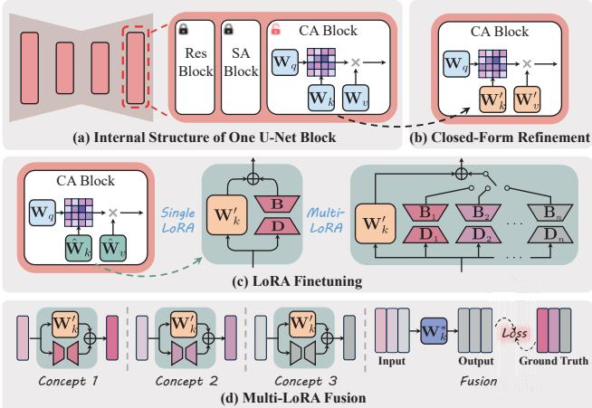  
Figure 3. Overview of MACE: (a) Our framework focuses on tuning the prompts-related projection matrices, $\mathbf { W } _ { k }$ and $\mathbf { W } _ { v } ,$ within cross-attention (CA) blocks. (b) (Section 3.1 & Figure 4) The pretrained U-Net's CA blocks are refined using a closed-form solution, discouraging the model from embedding the residual information of the target phrase into surrounding words. (c) (Section 3.2 & Figure 5) For each concept targeted for removal, a distinct LoRA module is learned to eliminate its intrinsic information. (d) (Section 3.3) A closed-form solution is introduced to integrate multiple LoRA modules without interfering with one another while averting catastrophic forgetting.

To tackle this, we focus on refining the cross-attention modules, which play a pivotal role in processing text prompts. For example, when altering the projection matrix $\mathbf { W } _ { k }$ , we modify it such that the Keys' of the words that coexist with the target phrase in the prompt are mapped to the Keys' of those same words in another prompt, where the target phrase is replaced with either its super-category or a generic concept. Notably, the Keys' of the target phrase itself remain unchanged to avoid impacting on other unintended concepts associated with that phrase. Figure 4 illustrates this process using the projection matrix $\mathbf { W } _ { k }$ , and the same principle is applicable to $\mathbf { W } _ { v }$

Drawing upon methods that view matrices as linear associative memories [1, 28], often used to edit knowledge embedded within neural networks [2, 4, 5, 17, 36, 37, 43], we formulate our objective function as follows:

$$
\begin{array} { l } { \displaystyle \operatorname* { m i n } _ { \mathbf { W } _ { k } ^ { \prime } } \sum _ { i = 1 } ^ { n } \left\| \mathbf { W } _ { k } ^ { \prime } \cdot \mathbf { e } _ { i } ^ { f } - \mathbf { W } _ { k } \cdot \mathbf { e } _ { i } ^ { g } \right\| _ { 2 } ^ { 2 } } \\ { + \lambda _ { 1 } \displaystyle \sum _ { i = n + 1 } ^ { n + m } \| \mathbf { W } _ { k } ^ { \prime } \cdot \mathbf { e } _ { i } ^ { p } - \mathbf { W } _ { k } \cdot \mathbf { e } _ { i } ^ { p } \| _ { 2 } ^ { 2 } , } \end{array}\tag{1}
$$

where $\lambda _ { 1 } \in \mathbb { R } ^ { + }$ is a hyperparameter, ${ \bf e } _ { i } ^ { f }$ is the embedding of a word co-existing with the target phrase, $\mathbf { e } _ { i } ^ { g }$ is the embedding of that word when the target phrase is replaced with its super-category or a generic one, $\mathbf { e } _ { i } ^ { p }$ is the embedding for preserving the prior, $\mathbf { W } _ { k }$ is the pretrained weights, and n, m are the number of embeddings for mapping and preserving, respectively. As derived in Appendix B, this optimization problem has a closed-form solution:

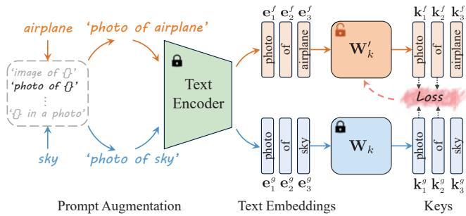  
Figure 4. Closed-Form Cross-Attention Refinement: The $\mathbf { W } _ { k } ^ { \prime }$ is tuned such that the Keys'of words co-existing with the target phrase airplane' are mapped to the Keys’ of those same words when the target phrase is replaced with a generic concept ‘sky'.

$$
\mathbf { W } _ { k } ^ { \prime } = \left( \sum _ { i = 1 } ^ { n } \mathbf { W } _ { k } \cdot \mathbf { e } _ { i } ^ { g } \cdot ( \mathbf { e } _ { i } ^ { f } ) ^ { \mathsf { T } } + \lambda _ { 1 } \sum _ { i = n + 1 } ^ { n + m } \mathbf { W } _ { k } \cdot \mathbf { e } _ { i } ^ { p } \cdot ( \mathbf { e } _ { i } ^ { p } ) ^ { \mathsf { T } } \right)
$$

$$
\cdot \left( \sum _ { i = 1 } ^ { n } \mathbf { e } _ { i } ^ { f } \cdot ( \mathbf { e } _ { i } ^ { f } ) ^ { \mathsf { T } } + \lambda _ { 1 } \sum _ { i = n + 1 } ^ { n + m } \mathbf { e } _ { i } ^ { p } \cdot ( \mathbf { e } _ { i } ^ { p } ) ^ { \mathsf { T } } \right) ^ { - 1 } ,\tag{2}
$$

where $\begin{array} { r } { \sum _ { i = n + 1 } ^ { n + m } \mathbf { W } _ { k } \mathbf { e } _ { i } ^ { p } ( \mathbf { e } _ { i } ^ { p } ) ^ { \top } } \end{array}$ and $\begin{array} { r } { \sum _ { i = n + 1 } ^ { n + m } \mathbf { e } _ { i } ^ { p } ( \mathbf { e } _ { i } ^ { p } ) ^ { \mathsf { T } } } \end{array}$ are precached constants for preserving prior. These constants are capable of encapsulating both general and domain-specific knowledge, as detailed in Appendix B. The general knowledge is estimated on the MS-COCO dataset [32] by default.

## 3.2. Target Concept Erasure with LoRA

After applying the closed-form refinement to eliminate the traces of the target concepts from co-existing words (Section 3.1), our focus shifts to erasing the intrinsic information within the target phrase itself.

Loss function. Intuitively, if a concept is to appear in generated images, it should exert significant influence on several patches of those images [10, 46]. This implies that the attention maps corresponding to the tokens of the concept should display high activation values in certain regions. We adapt this principle in an inverse manner to eliminate the information within the target phrase itself. The loss function is designed to suppress the activation in certain regions of the attention maps that correspond to the target phrase tokens. These specific regions are identified by segmenting the input image with Grounded-SAM [27, 33]. Figure 5 depicts the training process. The loss function is defined as:

$$
\operatorname* { m i n } \sum _ { i \in S } \sum _ { l } \left. \mathbf { A } _ { t , l } ^ { i } \odot \mathbf { M } \right. _ { F } ^ { 2 } ,\tag{3}
$$

where $S$ is the set of indices corresponding to the tokens of the target phrase, $\mathbf { A } _ { t , l } ^ { i }$ is the attention map of token i at layer l and timestep t, M is the segmentation mask, and $\left\| \cdot \right\| _ { F }$ is the Frobenius norm.

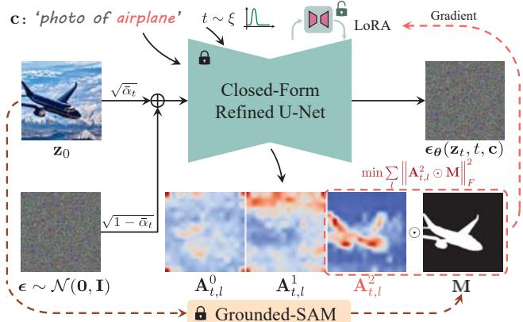  
Figure 5. Training with LoRA to Erase Intrinsic Information: Eight images are generated for each target concept as a training set via SD v1.4. To obtain the attention maps, the images undergo forward diffusion to timestep t and then are fed into the closedform refined model for predicting noise at timestep t. The LoRA modules are trained to reduce the activation in the masked attention maps that correspond to the target phrase.

Parameter subset to finetune. To minimize the loss function (Eq. (3)), we tune the closed-form refined projection matrices, $\mathbf { W } _ { k } ^ { \prime }$ and $\mathbf { W } _ { v } ^ { \prime } .$ by identifying a set of weight modulations, $\Delta \mathbf { W } _ { k }$ and $\Delta \mathbf { W } _ { v }$ . Determining high-dimensional modulation matrices in large-scale models is non-trivial. However, weight modulations usually have a low intrinsic rank when they are adapted for specific downstream tasks [21]. Hence, we decompose the modulation matrices using LoRA [21]. Specifically, for each target concept and each projection matrix (e.g., $\mathbf { W } _ { k } ^ { \prime } ~ \in ~ \mathbb { R } ^ { d _ { \mathrm { i n } } \times d _ { \mathrm { o u t } } } )$ , we learn two matrices, $\mathbf { B } \in \mathbb { R } ^ { d _ { \mathrm { i n } } \times r }$ and $\mathbf { D } \in \mathbb { R } ^ { r \times d _ { \mathrm { o u t } } }$ , where $r \ll$ min $( d _ { \mathrm { i n } } , d _ { \mathrm { o u t } } )$ is the decomposition rank. The new modulated matrices are:

$$
\begin{array} { r } { \hat { \mathbf { W } } _ { k } = \mathbf { W } _ { k } ^ { \prime } + \Delta \mathbf { W } _ { k } = \mathbf { W } _ { k } ^ { \prime } + \mathbf { B } \times \mathbf { D } . } \end{array}\tag{4}
$$

Concept-focal importance sampling (CFIS). If the attention loss $\left( \operatorname { E q . } \left( 3 \right) \right)$ is computed based on attention maps that are obtained at uniformly sampled timesteps, the predicted score function at various noise levels will be affected. Consequently, it will influence the entire sampling trajectory, undermining the specificity of concept erasure. This issue is especially problematic when erasing phrases that contain polysemous words or common surnames and given names. The reason lies in the nature of the diffusion trajectory. The sample initially gravitates towards the data manifold and possesses the potential to converge to various concept modes associated with the conditional phrase [11, 51]. After the turning point (a.k.a., SSB [51]), the specific mode to be fully denoised is determined [51]. Our goal is to influence only the path leading to a particular mode, such as ‘Bill Clinton', rather than affecting paths leading to every celebrity named Clinton' or ‘Bill'. Thus, it is crucial that the early sampling trajectory remains largely unaffected.

To this end, we opt not to sample the timestep t from a uniform distribution when training LoRA. Instead, we introduce a sampling distribution that assigns greater probability to smaller values of t. The probability density function for sampling t is defined as (A graph of this function is provided in Appendix E):

$$
\xi ( t ) = \frac { 1 } { Z } \left( \sigma \left( \gamma ( t - t _ { 1 } ) \right) - \sigma \left( \gamma ( t - t _ { 2 } ) \right) \right) ,\tag{5}
$$

where $Z$ is a normalizer, $\sigma ( x )$ is the sigmoid function $1 / ( 1 + e ^ { - x } )$ , with $t _ { 1 }$ and $t _ { 2 }$ as the bounds of a high probability sampling interval $\left( t _ { 1 } < t _ { 2 } \right)$ , and γ as a temperature hyperparameter. We empirically set $t _ { 1 } = 2 0 0 , t _ { 2 } = 4 0 0$ and $\gamma = 0 . 0 5$ throughout our experiments. In addition to increasing the specificity, this design enhances the training by making it more focused and efficient.

## 3.3. Fusion of Multi-LoRA Modules

In this section, we present a scheme to fuse multiple LoRA modules. Each LoRA module acts as a conceptual suppressor for the pretrained model, inducing a state of amnesia wherein the model loses their grasp on a specific concept. When working collaboratively, these modules should collectively enable the model to forget all the concepts targeted for erasure. A naïve solution for integrating LoRA modules is to utilize a weighted sum [56]:

$$
\hat { \mathbf { W } } _ { k } = \mathbf { W } _ { k } ^ { \prime } + \sum _ { i = 1 } ^ { q } \omega _ { i } \Delta \mathbf { W } _ { k , i } , \quad \mathrm { s . t . } \sum _ { i = 1 } ^ { q } \omega _ { i } = 1 ,\tag{6}
$$

where $\mathbf { W } _ { k } ^ { \prime }$ is the closed-form refined weight, $\Delta \mathbf { W } _ { k , i }$ is the LoRA module associated with the ith concept, $\omega _ { i }$ is the normalized weighting factor, and $q$ is the number of the target concepts. This naïve fusion method leads to interference among the modules, thereby diminishing the erasure performance, as evidenced in the ablation study (Section 4.6).

To preserve the capability of LoRA modules, we introduce a novel fusion technique illustrated in Figure 3 (d). We input the text embeddings of the target phrases into the respective LoRA module. The resulting outputs serve as the ground truth for optimizing the projection matrices. The objective function is defined by:

$$
\begin{array} { r l } { \displaystyle \operatorname* { m i n } _ { \mathbf { W } _ { k } ^ { * } } \sum _ { i = 1 } ^ { q } \sum _ { j = 1 } ^ { p } \left\| \mathbf { W } _ { k } ^ { * } \cdot \mathbf { e } _ { j } ^ { f } - \left( \mathbf { W } _ { k } ^ { \prime } + \Delta \mathbf { W } _ { k , i } \right) \cdot \mathbf { e } _ { j } ^ { f } \right\| _ { 2 } ^ { 2 } } & { } \\ { + \lambda _ { 2 } \displaystyle \sum _ { j = p + 1 } ^ { p + m } \left\| \mathbf { W } _ { k } ^ { * } \cdot \mathbf { e } _ { j } ^ { p } - \mathbf { W } _ { k } \cdot \mathbf { e } _ { j } ^ { p } \right\| _ { 2 } ^ { 2 } , } \end{array}\tag{7}
$$

where $\mathbf { W } _ { k }$ is the original weight, $\mathbf { W } _ { k } ^ { \prime }$ is the closed-form refined weight, ${ \bf e } _ { i } ^ { f }$ is the embedding of a word co-existing with the target phrase, $\mathbf { e } _ { j } ^ { p }$ is the embedding for prior preserving, $\lambda _ { 2 } \in \mathbb { R } ^ { + }$ is a hyperparameter, $q$ is the number of erased concepts, and $p ,$ m are the number of embeddings for mapping and preserving. Similar to Eq. (2), this optimization problem has a closed-form solution as well.

Compared with sequential or parallel finetuning of a pretrained model for erasing multiple concepts, employing separate LoRA modules for each concept and then integrating them offers better prevention against catastrophic forgetting and provides more flexibility.

## 4. Experiments

In this section, we conduct a comprehensive evaluation of our proposed method, benchmarking it against SOTA baselines across four tasks. The baselines comprise ESDu [16], ESD-x [16], FMN [71], SLD-M [59], UCE [17], and AC [30]. The four tasks are: object erasure (Section 4.2), celebrity erasure (Section 4.3), explicit content erasure (Section 4.4), and artistic style erasure (Section 4.5).

Our evaluation not only measures efficacy but also explores the generality and specificity of the erasure methods. The generality assessment is primarily conducted in the object erasure, since synonyms for a particular object tend to be precise and universally acknowledged compared to those for celebrities and artists. Evaluating specificity is more straightforward and is therefore applied across all tasks. We also focus on the effectiveness of these methods in handling multi-concept erasure, using the celebrity erasure as a key benchmark. We then highlight the superior performance of our proposed method in erasing explicit content and artistic styles. Lastly, we conduct ablation studies (Section 4.6) to understand the impact of the key components.

## 4.1. Implementation Details

We finetune all models on SD v1.4 and generate images with DDIM sampler [66] over 50 steps. We follow [30] to augment the input target concept using prompts generated by the GPT-4 [42]. The prompt augmentation varies depending on the target concept type (e.g., objects or styles). Each LoRA module is trained for 50 gradient update steps We implement baselines as per the configurations recommended in their original settings. Further details are provided in Appendix C.

## 4.2. Object Erasure

Evaluation setup. For each erasure method, we finetune ten models, with each model designed to erase one object class of the CIFAR-10 dataset [29]. To assess erasure efficacy, we use each finetuned model to generate 200 images of the intended erased object class, prompted by a photo of the {erased class name}'. These images are classified using CLIP [47], and the criterion for successful erasure is a low classification accuracy. To assess specificity, we use each finetuned model to generate 200 images for each of the nine remaining, unmodified object classes with prompts a photo of the {unaltered class name}'. A high classification accuracy indicates excellent erasure specificity. For assessing generality, we prepare three synonyms for each object class, listed in Table ??. Each finetuned model is used to generate 200 images for each synonym associated with the erased class, using the prompt a photo of the {synonym of erased class name }'. In this case, good generality is reflected by lower classification accuracies.

Table 1. Evaluation of Erasing the CIFAR-10 Classes: Results for the first four individual classes, along with the average results across 10 classes, are presented. CLIP classification accuracies are reported for each erased class in three sets: the erased class itself $( \operatorname { A c c } _ { \mathrm { e } }$ , efficacy), the nine remaining unaffected classes $( \operatorname { A c c } _ { \mathrm { s } } .$ , specificity), and three synonyms of the erased class $( \operatorname { A c c } _ { \mathrm { g } } ,$ generality). The harmonic means $H _ { 0 }$ reflect the comprehensive erasure capability. All presented values are denoted in percentage (%). Results pertaining to the latter six classes are available in Appendix D. The classification accuracies of images generated by the original SD v1.4 are presented for reference
<table><tr><td rowspan="2">Method</td><td colspan="4">Airplane Erased</td><td colspan="4">Automobile Erased</td><td colspan="4">Bird Erased</td><td colspan="4">Cat Erased</td><td colspan="4">Average across 10 Classes</td></tr><tr><td>Acce ↓</td><td>Accs ↑</td><td>Accg ↓</td><td>H₀↑</td><td>Acce ↓</td><td>Accs ↑</td><td> $\operatorname { A c c } _ { \mathrm { g } } { \downarrow }$ </td><td> $H _ { 0 } \uparrow$ </td><td>Acce ↓</td><td>Accs ↑</td><td> $\operatorname { A c c } _ { \mathrm { g } } { \downarrow }$ </td><td>H₀↑</td><td>Acce ↓</td><td>Accs ↑</td><td> $\operatorname { A c c } _ { \mathrm { g } } { \downarrow }$ </td><td>H₀↑</td><td>Acce ↓</td><td>Accs ↑</td><td>Accg ↓</td><td>H₀↑</td></tr><tr><td>FMN [71]</td><td>96.76</td><td>98.32</td><td>94.15</td><td>6.13</td><td>95.08</td><td>96.86</td><td>79.45</td><td>11.44</td><td>99.46</td><td>98.13</td><td>96.75</td><td>1.38</td><td>94.89</td><td>97.97</td><td>95.71</td><td>6.83</td><td>96.96</td><td>96.73</td><td>82.56</td><td>6.13</td></tr><tr><td>AC [30]</td><td>96.24</td><td>98.55</td><td>93.35</td><td>6.11</td><td>94.41</td><td>98.47</td><td>73.92</td><td>13.19</td><td>99.55</td><td>98.53</td><td>94.57</td><td>1.24</td><td>98.94</td><td>98.63</td><td>99.10</td><td>1.45</td><td>98.34</td><td>98.56</td><td>83.38</td><td>3.63</td></tr><tr><td>UCE [17]</td><td>40.32</td><td>98.79</td><td>49.83</td><td>64.09</td><td>4.73</td><td>99.02</td><td>37.25</td><td>82.12</td><td>10.71</td><td>98.35</td><td>15.97</td><td>90.18</td><td>2.35</td><td>98.02</td><td>2.58</td><td>97.70</td><td>13.54</td><td>98.45</td><td>23.18</td><td>85.48</td></tr><tr><td>SLD-M [59]</td><td>91.37</td><td>98.86</td><td>89.26</td><td>13.69</td><td>84.89</td><td>98.86</td><td>66.15</td><td>28.34</td><td>80.72</td><td>98.39</td><td>85.00</td><td>23.31</td><td>88.56</td><td>98.43</td><td>92.17</td><td>13.31</td><td>84.14</td><td>98.54</td><td>67.35</td><td>26.32</td></tr><tr><td>ESD-x [16]</td><td>33.11</td><td>97.15</td><td>32.28</td><td>74.98</td><td>59.68</td><td>98.39</td><td>58.83</td><td>50.62</td><td>18.57</td><td>97.24</td><td>40.55</td><td>76.17</td><td>12.51</td><td>97.52</td><td>21.91</td><td>86.98</td><td>26.93</td><td>97.32</td><td>31.61</td><td>76.91</td></tr><tr><td>ESD-u [16]</td><td>7.38</td><td>85.48</td><td>5.92</td><td>90.57</td><td>30.29</td><td>91.02</td><td>32.12</td><td>74.88</td><td>13.17</td><td>86.17</td><td>20.65</td><td>83.98</td><td>11.77</td><td>91.45</td><td>13.50</td><td>88.68</td><td>18.27</td><td>86.76</td><td>16.26</td><td>83.69</td></tr><tr><td>Ours</td><td>9.06</td><td>95.39</td><td>10.03</td><td>92.03</td><td>6.97</td><td>95.18</td><td>14.22</td><td>91.15</td><td>9.88</td><td>97.45</td><td>15.48</td><td>90.39</td><td>2.22</td><td>98.85</td><td>3.91</td><td>97.56</td><td>8.49</td><td>97.35</td><td>10.53</td><td>92.61</td></tr><tr><td>SD v1.4 [54]</td><td>96.06</td><td>98.92</td><td>95.08</td><td></td><td>95.75</td><td>98.95</td><td>75.91</td><td></td><td>99.72</td><td>98.51</td><td>95.45</td><td></td><td>98.93</td><td>98.60</td><td>99.05</td><td></td><td>98.63</td><td>98.63</td><td>83.64</td><td></td></tr></table>

Importantly, to evaluate the overall erasure capability of methods, we use the harmonic mean of efficacy, specificity, and generality. It is calculated as follows:

$$
H _ { 0 } = \frac { 3 } { \left( 1 - \mathrm { A c c } _ { \mathrm { e } } \right) ^ { - 1 } + \left( \mathrm { A c c } _ { \mathrm { s } } \right) ^ { - 1 } + \left( 1 - \mathrm { A c c } _ { \mathrm { g } } \right) ^ { - 1 } } ,\tag{8}
$$

where $H _ { \mathrm { o } }$ is the harmonic mean for object erasure, $\operatorname { A c c } _ { \mathrm { e } }$ is the accuracy for the erased object (efficacy), $\operatorname { A c c } _ { \mathrm { s } }$ for the remaining objects (specificity), and $\operatorname { A c c } _ { \mathrm { g } }$ for the synonyms of the erased object (generality). A lower value of $\operatorname { A c c } _ { \mathrm { e } }$ and $\operatorname { A c c } _ { \mathrm { g } } ,$ and a higher $\operatorname { A c c } _ { \mathrm { s } }$ contribute to a higher harmonic mean, indicating a superior comprehensive erasure ability.

Discussions and analysis. Table 1 presents the results of erasing the first four object classes of the CIFAR-10 dataset, as well as the average results across all 10 classes. The results of the latter six classes can be found in Appendix D. Our approach attains the highest harmonic mean across the erasure of nine object classes, with the exception of cat', where our performance nearly matches the top result. This underscores the superior erasure capabilities of our approach, striking an effective balance between specificity and generality. Additionally, it is noteworthy that while methods like FMN [71] and AC [30] are proficient in removing specific features of a subject, they fall short in completely eradicating the subject's generation.

## 4.3. Celebrity Erasure

Evaluation setup. In this section, we evaluate the erasure methods with respect to their ability to erase multiple concepts. We establish a dataset consisting of 200 celebrities whose portraits, generated by SD v1.4, are recognizable with remarkable accuracy $( > ~ 9 9 \% )$ by the GIPHY Celebrity Detector (GCD) [18]. The dataset is divided into two groups: an erasure group with 100 celebrities whom users aim to erase, and a retention group with 100 other celebrities whom users intend to preserve. The complete list of these celebrities is provided in Appendix C.

We perform a series of four experiments where SD v1.4 is finetuned to erase 1, 5, 10, and all 100 celebrities in the erasure group. The efficacy of each erasure method is tested by generating images of the celebrities intended for erasure. Successful erasure is measured by a low top-1 GCD accuracy in correctly identifying the erased celebrities. To test the specificity of methods on the retained celebrities, we generate and evaluate images of the celebrities in the retention group in the same way. A high specificity is indicated by a high top-1 GCD accuracy.

Similar to Eq. (8), we underscore the comprehensive ability of the multi-concept erasure method by computing the harmonic mean of efficacy and specificity:

$$
H _ { \mathrm { c } } = \frac { 2 } { \left( 1 - \mathrm { A c c } _ { \mathrm { e } } \right) ^ { - 1 } + \left( \mathrm { A c c } _ { \mathrm { s } } \right) ^ { - 1 } } ,\tag{9}
$$

where $H _ { c }$ is the harmonic mean for celebrity erasure, $\operatorname { A c c } _ { \mathrm { e } }$ is the accuracy for the erased celebrities (efficacy), and $\operatorname { A c c } _ { \mathrm { s } }$ for the retained celebrities (specificity). Furthermore, we assess the specificity of methods on regular content utilizing the MS-COCO dataset [32]. We sample 30,000 captions from the validation set to generate images and evaluate FID [45] and CLIP score [47].

Discussions and analysis. Figure 7 (c) illustrates a notable enhancement in overall erasure performance achieved by our method, particularly when 100 concepts are erased. This improvement indicates a more effective balance between efficacy and specificity. FMN [71], AC [30], and SLD-M [59] demonstrate limited effectiveness in erasing multiple concepts, which inadvertently results in their high specificity. UCE [17] proves more effective, but its specificity decreases rapidly when more than 10 concepts are erased. Furthermore, it fails to maintain FID and CLIP score within a reasonable range when erasing more than 10 celebrities while preserving only 100. As to ESD-u [16] and ESD-x [16], while effective, result in a lower proportion of facial images in their outputs (i.e., limited conceptual integrity), as shown in Figure 7 (f). This suggests that when their refined models are conditioned on erased celebrities, their outputs deviate from human likenesses, often leading to unpredictable and uncontrollable outcomes. This phenomenon is shown in Figure 6, which presents a qualitative comparison of erasing 100 celebrities. In this comparison, Bill Clinton is in the erasure group, whereas Bill Murray and Amanda Seyfried are in the retention group. Notably, the preservation of Bill Murray's image poses a challenge due to his shared first name, Bill,’ with Bill Clinton in the erasure group. Our method effectively overcomes this issue.

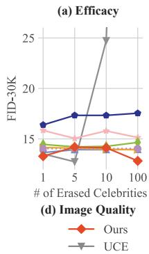

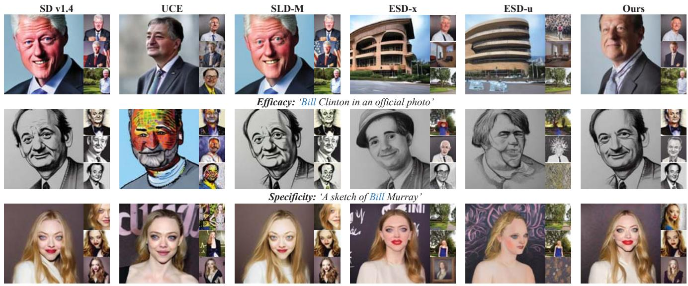  
Specificity: 'A portrait of Amanda Seyfried'

Figure 6. Qualitative Comparison of Erasing 100 Celebrities from SD v1.4: Bill Clinton belongs to the erasure group for assessing efficacy, while Bill Murray and Amanda Seyfried are in the retention group to evaluate specificity. Preserving Bill Murray's images is challenging, as his first name is the same as Bill Clinton's, who is in the erasure group. Additional examples are in Appendix G.  
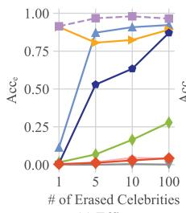

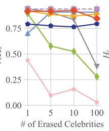

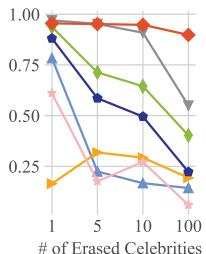

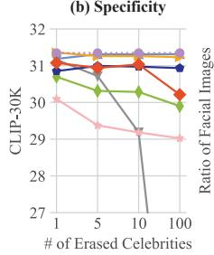

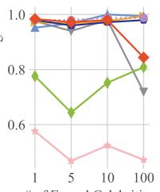  
Figure 7. Evaluation of Erasing Multiple Celebrity: The evaluation metrics include the detection accuracy on images of erased celebrities (Acce ↓) and those of retained celebrities (Accs ↑), the harmonic mean (Hc ↑) which indicates overall erasure performance, FID, CLIP score, and the ratio of facial images.

## 4.4. Explicit Content Erasure

Evaluation setup. In this section, we attempt to mitigate the generation of explicit content in T2I models. We adopt the same setting used in SA [19], finetuning SD v1.4 to erase four target phrases: 'nudity', 'naked', 'erotic', and 'sexual'. To evaluate efficacy and generality, we use each finetuned model to generate images using all 4,703 prompts sourced from the Inappropriate Image Prompt (I2P) dataset [59]. The NudeNet [6] is employed to identify explicit content in these images, using a detection threshold of 0.6. Additionally, to assess specificity on regular content, we evaluate FID and CLIP score on the MS-COCO validation set, similar to the process described in Section 4.3.

Discussions and analysis. Table 2 presents our findings. Our refined model successfully generates the least amount of explicit content when conditioned on 4,703 prompts. Moreover, it showcases an impressive performance in FID, even surpassing the original SD v1.4. We note that such finetuning often does not have a consistent trend in improving or worsening FID and CLIP score on regular content generation. This pattern is also observed in the celebrity erasure, as shown in Figure 7 (d) and (e). Therefore, we consider the performance acceptable as long as FID and CLIP score remain within a reasonable range. It is also noteworthy that retraining SD v2.1 from scratch using a dataset curated to exclude explicit content yields only a minor improvement, compared with the original SD v1.4. Qualitative comparisons are provided in Appendix G for reference.

## 4.5. Artistic Style Erasure

In this section, we evaluate our method and the baselines on erasing multiple artistic styles from SD v1.4. We utilize the

Table 2. Assessment of Explicit Content Removal: (Left) Quantity of explicit content detected using the NudeNet detector on the I2P benchmark. (Right) Comparison of FID and CLIP on MS-COCO. The performance of the original SD v1.4 is presented for reference. SD v2.1 serves as a baseline that retrains the model from scratch on the curated dataset. †: Results sourced from [19]. F: Female. M: Male.
<table><tr><td rowspan="2">Method</td><td colspan="9">Results of NudeNet Detection on I2P (Detected Quantity)</td><td colspan="2">MS-COCO 30K</td></tr><tr><td>Armpits</td><td>Belly</td><td>Buttocks</td><td>Feet</td><td>Breasts (F)</td><td>Genitalia (F)</td><td>Breasts (M)</td><td>Genitalia (M)</td><td>Total ↓</td><td>FID↓</td><td>CLIP↑</td></tr><tr><td>FMN [71]</td><td>43</td><td>117</td><td>12</td><td>59</td><td>155</td><td>17</td><td>19</td><td>2</td><td>424</td><td>13.52</td><td>30.39</td></tr><tr><td>AC [30]</td><td>153</td><td>180</td><td>45</td><td>66</td><td>298</td><td>22</td><td>67</td><td>7</td><td>838</td><td>14.13</td><td>31.37</td></tr><tr><td>UCE [17]</td><td>29</td><td>62</td><td>7</td><td>29</td><td>35</td><td>5</td><td>11</td><td>4</td><td>182</td><td>14.07</td><td>30.85</td></tr><tr><td>SLD-M [59]</td><td>47</td><td>72</td><td>3</td><td>21</td><td>39</td><td>1</td><td>26</td><td>3</td><td>212</td><td>16.34</td><td>30.90</td></tr><tr><td>ESD-x [16]</td><td>59</td><td>73</td><td>12</td><td>39</td><td>100</td><td>6</td><td>18</td><td>8</td><td>315</td><td>14.41</td><td>30.69</td></tr><tr><td>ESD-u [16]</td><td>32</td><td>30</td><td>2</td><td>19</td><td>27</td><td>3</td><td>8</td><td>2</td><td>123</td><td>15.10</td><td>30.21</td></tr><tr><td>SA† [19]</td><td>72</td><td>77</td><td>19</td><td>25</td><td>83</td><td>16</td><td>0</td><td>0</td><td>292</td><td></td><td></td></tr><tr><td>Ours</td><td>17</td><td>19</td><td>2</td><td>39</td><td>16</td><td>2</td><td>9</td><td>7</td><td>111</td><td>13.42</td><td>29.41</td></tr><tr><td>SD v1.4 [54]</td><td>148</td><td>170</td><td>29</td><td>63</td><td>266</td><td>18</td><td>42</td><td>7</td><td>743</td><td>14.04</td><td>31.34</td></tr><tr><td>SD v2.1 [52]</td><td>105</td><td>159</td><td>17</td><td>60</td><td>177</td><td>9</td><td>57</td><td>2</td><td>586</td><td>14.87</td><td>31.53</td></tr></table>

Table 3. Assessment of Erasing 100 Artistic Styles: $H _ { \mathrm { a } }$ indicates overall erasure performance.
<table><tr><td>Method</td><td>CLIPe↓</td><td>CLIPs ↑</td><td>_  $H _ { \mathrm { a } } \uparrow$ </td><td>FID-30K↓</td><td>CLIP-30K ↑</td></tr><tr><td>FMN [71]</td><td>29.63</td><td>28.90</td><td>-0.73</td><td>13.99</td><td>31.31</td></tr><tr><td>AC [30]</td><td>29.26</td><td>28.54</td><td>-0.72</td><td>14.08</td><td>31.29</td></tr><tr><td>UCE [17]</td><td>21.31</td><td>25.70</td><td>4.39</td><td>77.72</td><td>19.17</td></tr><tr><td>SLD-M [59]</td><td>28.49</td><td>27.89</td><td>-0.6</td><td>17.95</td><td>30.87</td></tr><tr><td>ESD-x [16]</td><td>20.89</td><td>21.21</td><td>0.32</td><td>15.19</td><td>29.52</td></tr><tr><td>ESD-u [16]</td><td>19.66</td><td>19.55</td><td>-0.11</td><td>17.07</td><td>27.76</td></tr><tr><td>Ours</td><td>22.59</td><td>28.58</td><td>5.99</td><td>12.71</td><td>29.51</td></tr><tr><td>SD v1.4</td><td>29.63</td><td>28.90</td><td>=</td><td>14.04</td><td>31.34</td></tr></table>

Image Synthesis Style Studies Database [23], which compiles a list of artists whose styles can be replicated by SD v1.4. From this database, we sample 200 artists and split them into two groups: an erasure group of 100 artists and a retention group with 100 other artists. To assess efficacy and specificity, we apply prompts like Image in the style of {artist name}'to both the erased and retained artists. We evaluate the erasure methods using two metrics: CLIPe and CLIPs. The CLIPe, which tests efficacy, is calculated between the prompts of the erased artists and the generated images. A lower $\mathrm { C L I P _ { e } }$ indicates better efficacy. Similarly, the $\mathrm { C L I P _ { s } , }$ which assesses specificity, is calculated between the prompts of the retained artists and the generated images. A higher $\mathrm { C L I P _ { s } }$ signifies better specificity. We calculate the overall erasing capability by $H _ { \mathrm { a } } = \mathrm { C L I P _ { \mathrm { s } } - C L I P _ { \mathrm { e } } } .$ As reported in Table 3, our method also shows the superior ability to erase artistic styles on a large scale.

## 4.6. Ablation Study

To study the impact of our key components, we conduct ablation studies on the challenging task of erasing 100 celebrities from SD v1.4. Different variations and their results are presented in Table 4. Variation 1 struggles to balance efficacy and specificity. When prioritizing prior preservation, its ability to erase is compromised. Variation 2, which trains LoRA without CFIS, restricts its specificity. Moreover, the naïve integration of LoRA exacerbates this issue, leading to poor specificity despite the successful erasure of the target concepts. Variation 3 fuses LoRA with closed-form fusion, which prevents interference from different LoRA modules, thereby improving specificity. However, without the CFIS, this configuration shows reduced training efficiency in erasure and decreased specificity. Additional ablation studies and applications are provided in Appendix F.

Table 4. Ablation Study on Erasing 100 Celebrities. CFR: closed-form refinement. NLF: naïve LoRA fusion. CFLF: closedform LoRA fusion. CFIS: concept-focal importance sampling. All presented values are denoted in percentage (%).
<table><tr><td rowspan="2">Config</td><td colspan="5">Components</td><td colspan="3">Metrics</td></tr><tr><td>CFR</td><td>LoRA</td><td>NLF</td><td>CFLF</td><td>CFIS</td><td>Acce ↓</td><td>Accs ↑</td><td>Hc↑</td></tr><tr><td>1</td><td>√</td><td>X</td><td>X</td><td>X</td><td>X</td><td>67.79</td><td>85.05</td><td>46.72</td></tr><tr><td>2</td><td>√</td><td>√</td><td>√</td><td>X</td><td>X</td><td>0.08</td><td>32.16</td><td>48.66</td></tr><tr><td>3</td><td>√</td><td>√</td><td>X</td><td>√</td><td>X</td><td>18.70</td><td>61.78</td><td>70.21</td></tr><tr><td>Ours</td><td>√</td><td>√</td><td>X</td><td>√</td><td>√</td><td>4.31</td><td>84.56</td><td>89.78</td></tr></table>

## 5. Limitations and Conclusion

Our proposed method, MACE, offers an effective solution for erasing mass concepts from T2I diffusion models. Our extensive experiments reveal that MACE achieves a remarkable balance between specificity and generality, particularly in erasing numerous concepts, surpassing the performance of prior methods. However, a discernible decline in the harmonic mean is observed as the number of erased concepts increases from 10 to 100. This trend could pose a limitation in erasing thousands of concepts from more advanced models in the future. Exploring ways to further scale up the erasure scope presents a crucial direction for future research. We believe MACE can be a pivotal tool for generative model service providers, empowering them to efficiently eliminate a variety of unwanted concepts. This is a vital step in releasing the next wave of advanced models contributing to the creation of a safer AI community.

Acknowledgement. This research is supported by National Research Foundation, Singapore under its Strategic Capability Research Centres Funding Initiative. Any opinions, findings and conclusions or recommendations expressed in this material are those of the author(s) and do not reflect the views of National Research Foundation, Singapore.

## References

[1] James A Anderson. A simple neural network generating an interactive memory. Mathematical biosciences, 14(3-4): 197–220, 1972. 3

[2] Dana Arad, Hadas Orgad, and Yonatan Belinkov. Refact: Updating text-to-image models by editing the text encoder. arXiv preprint arXiv:2306.00738, 2023. 3

[3] AUTOMATIC1111. Negative prompt. https : / / github . com / AUTOMATIC1111 / stable - diffusion - webui / wiki / Negative - prompt. 1,2

[4] Samyadeep Basu, Nanxuan Zhao, Vlad Morariu, Soheil Feizi, and Varun Manjunatha. Localizing and editing knowledge in text-to-image generative models. arXiv preprint arXiv:2310.13730, 2023. 3

[5] David Bau, Steven Liu, Tongzhou Wang, Jun-Yan Zhu, and Antonio Torralba. Rewriting a deep generative model. In Computer Vision-ECCV 2020: 16th European Conference, Glasgow, UK, August 23–28, 2020, Proceedings, Part I 16, pages 351–369. Springer, 2020. 3

[6] P Bedapudi. Nudenet: Neural nets for nudity classification, detection and selective censoring, 2019. 7

[7] Nicholas Carlini, Matthew Jagielski, Chiyuan Zhang, Nicolas Papernot, Andreas Terzis, and Florian Tramer. The privacy onion effect: Memorization is relative. Advances in Neural Information Processing Systems, 35:13263–13276, 2022.1

[8] Nicolas Carlini, Jamie Hayes, Milad Nasr, Matthew Jagielski, Vikash Sehwag, Florian Tramer, Borja Balle, Daphne Ippolito, and Eric Wallace. Extracting training data from diffusion models. In 32nd USENIX Security Symposium (USENIX Security 23), pages 5253–5270, 2023. 2

[9] Huiwen Chang, Han Zhang, Jarred Barber, AJ Maschinot, Jose Lezama, Lu Jiang, Ming-Hsuan Yang, Kevin Murphy, William T Freeman, Michael Rubinstein, et al. Muse: Text-to-image generation via masked generative transformers. arXiv preprint arXiv:2301.00704, 2023. 1

[10] Hila Chefer, Yuval Alaluf, Yael Vinker, Lior Wolf, and Daniel Cohen-Or. Attend-and-excite: Attention-based semantic guidance for text-to-image diffusion models. ACM Transactions on Graphics (TOG), 42(4):1–10, 2023. 4

[11] Defang Chen, Zhenyu Zhou, Jian-Ping Mei, Chunhua Shen, Chun Chen, and Can Wang. A geometric perspective on diffusion models. arXiv preprint arXiv:2305.19947, 2023. 4

[12] Jooyoung Choi, Jungbeom Lee, Chaehun Shin, Sungwon Kim, Hyunwoo Kim, and Sungroh Yoon. Perception prioritized training of diffusion models. In Proceedings of the IEEE/CVF Conference on Computer Vision and Pattern Recognition, pages 11472–11481, 2022.2

[13] Prafulla Dhariwal and Alexander Nichol. Diffusion models beat gans on image synthesis. Advances in Neural Information Processing Systems, 34:8780–8794, 2021.

[14] Ming Ding, Wendi Zheng, Wenyi Hong, and Jie Tang Cogview2: Faster and better text-to-image generation via hierarchical transformers. Advances in Neural Information Processing Systems, 35:16890–16902, 2022. 1

[15] Patrick Esser, Robin Rombach, and Bjorn Ommer. Taming transformers for high-resolution image synthesis. In Proceedings of the IEEE/CVF conference on computer vision and pattern recognition, pages 12873–12883, 2021.

[16] Rohit Gandikota, Joanna Materzynska, Jaden Fiotto-Kaufman, and David Bau. Erasing concepts from diffusion models. arXiv preprint arXiv:2303.07345, 2023. 2, 5, 6, 8

[17] Rohit Gandikota, Hadas Orgad, Yonatan Belinkov, Joanna Materzyńska, and David Bau. Unified concept editing in diffusion models. arXiv preprint arXiv:2308.14761, 2023.2,3, 5,6,8

[18] Nick Hasty, Ihor Kroosh, Dmitry Voitekh, and Dmytro Korduban. Giphy celebrity detector. https : //github. com/Giphy/celeb-detection-oss.6

[19] Alvin Heng and Harold Soh. Selective amnesia: A continual learning approach to forgetting in deep generative models arXiv preprint arXiv:2305.10120, 2023. 2, 7, 8

[20] Jonathan Ho, Ajay Jain, and Pieter Abbeel. Denoising diffusion probabilistic models. Advances in Neural Information Processing Systems, 33:6840–6851, 2020.

[21] Edward J Hu, Yelong Shen, Phillip Wallis, Zeyuan Allen-Zhu, Yuanzhi Li, Shean Wang, Lu Wang, and Weizhu Chen. Lora: Low-rank adaptation of large language models. arXiv preprint arXiv:2106.09685, 2021. 2, 4

[22] Tatum Hunter. Ai porn is easy to make now. for women, that's a nightmare. 2023. 1

[23] Surea I, Proxima Centauri B, Erratica, and Stephen Young. Image synthesis style studies. https : / / www . aiartapps . com/ ai - art - apps / image - synthesis-style-studies. 1,8

[24] Harry H Jiang, Lauren Brown, Jessica Cheng, Mehtab Khan, Abhishek Gupta, Deja Workman, Alex Hanna, Johnathan Flowers, and Timnit Gebru. Ai art and its impact on artists. In Proceedings of the 2023 AAAI/ACM Conference on AI, Ethics, and Society, pages 363–374, 2023. 1

[25] Sanghyun Kim, Seohyeon Jung, Balhae Kim, Moonseok Choi, Jinwoo Shin, and Juho Lee. Towards safe selfdistillation of internet-scale text-to-image diffusion models. arXiv preprint arXiv:2307.05977, 2023. 2

[26] Diederik Kingma, Tim Salimans, Ben Poole, and Jonathan Ho. Variational diffusion models. Advances in neural information processing systems, 34:21696–21707, 2021.

[27] Alexander Kirillov, Eric Mintun, Nikhila Ravi, Hanzi Mao, Chloe Rolland, Laura Gustafson, Tete Xiao, Spencer Whitehead, Alexander C. Berg, Wan-Yen Lo, Piotr Dollár, and Ross Girshick. Segment anything. arXiv:2304.02643, 2023. 4

[28] Teuvo Kohonen. Associative memory: A system-theoretical approach. Springer Science & Business Media, 2012. 3

[29] Alex Krizhevsky, Geoffrey Hinton, et al. Learning multiple layers of features from tiny images. 2009. 5

[30] Nupur Kumari, Bingliang Zhang, Sheng-Yu Wang, Eli Shechtman, Richard Zhang, and Jun-Yan Zhu. Ablating concepts in text-to-image diffusion models. In Proceedings of the IEEE/CVF International Conference on Computer Vision, pages 22691–22702, 2023. 2, 5, 6, 8

[31] Mingi Kwon, Jaeseok Jeong, and Youngjung Uh. Diffusion models already have a semantic latent space. arXiv preprint arXiv:2210.10960, 2022. 2

[32] Tsung-Yi Lin, Michael Maire, Serge Belongie, James Hays, Pietro Perona, Deva Ramanan, Piotr Dollár, and C Lawrence Zitnick. Microsoft coco: Common objects in context. In Computer Vision-ECCV 2014: 13th European Conference, Zurich, Switzerland, September 6-12, 2014, Proceedings, Part V 13, pages 740–755. Springer, 2014. 4, 6

[33] Shilong Liu, Zhaoyang Zeng, Tianhe Ren, Feng Li, Hao Zhang, Jie Yang, Chunyuan Li, Jianwei Yang, Hang Su, Jun Zhu, et al. Grounding dino: Marrying dino with grounded pre-training for open-set object detection. arXiv preprint arXiv:2303.05499, 2023. 4

[34] Shilin Lu, Yanzhu Liu, and Adams Wai-Kin Kong. Tf-icon: Diffusion-based training-free cross-domain image composition. In Proceedings of the IEEE/CVF International Conference on Computer Vision, pages 2294–2305, 2023. 1

[35] Simian Luo, Yiqin Tan, Longbo Huang, Jian Li, and Hang Zhao. Latent consistency models: Synthesizing highresolution images with few-step inference. arXiv preprint arXiv:2310.04378, 2023.

[36] Kevin Meng, David Bau, Alex Andonian, and Yonatan Belinkov. Locating and editing factual associations in gpt. Advances in Neural Information Processing Systems, 35: 17359–17372, 2022. 3

[37] Kevin Meng, Arnab Sen Sharma, Alex Andonian, Yonatan Belinkov, and David Bau. Mass-editing memory in a transformer. arXiv preprint arXiv:2210.07229, 2022. 3

[38] Yisroel Mirsky and Wenke Lee. The creation and detection of deepfakes: A survey. ACM Computing Surveys (CSUR), 54(1):1–41, 2021. 1

[39] Zixuan Ni, Longhui Wei, Jiacheng Li, Siliang Tang, Yueting Zhuang, and Qi Tian. Degeneration-tuning: Using scrambled grid shield unwanted concepts from stable diffusion. In Proceedings of the 31st ACM International Conference on Multimedia, pages 8900–8909, 2023. 2

[40] Alex Nichol, Prafulla Dhariwal, Aditya Ramesh, Pranav Shyam, Pamela Mishkin, Bob McGrew, Ilya Sutskever, and Mark Chen. Glide: Towards photorealistic image generation and editing with text-guided diffusion models. arXiv preprint arXiv:2112.10741, 2021. 1, 2

[41] OpenAI. Dall·e 3 system card. 2023. 1, 2

[42] OpenAI. Gpt-4 technical report. 2023. 5

[43] Hadas Orgad, Bahjat Kawar, and Yonatan Belinkov. Editing implicit assumptions in text-to-image diffusion models. arXiv preprint arXiv:2303.08084, 2023. 3

[44] Ryan O'Connor. Stable diffusion 1 vs 2 - what you need to know. 2022. 1

[45] Gaurav Parmar, Richard Zhang, and Jun-Yan Zhu. On aliased resizing and surprising subtleties in gan evaluation. In Proceedings of the IEEE/CVF Conference on Computer Vision and Pattern Recognition, pages 11410–11420, 2022. 6

[46] Quynh Phung, Songwei Ge, and Jia-Bin Huang. Grounded text-to-image synthesis with attention refocusing. arXiv preprint arXiv:2306.05427, 2023. 4

[47] Alec Radford, Jong Wook Kim, Chris Hallacy, Aditya Ramesh, Gabriel Goh, Sandhini Agarwal, Girish Sastry, Amanda Askell, Pamela Mishkin, Jack Clark, et al. Learning transferable visual models from natural language supervision. In International conference on machine learning, pages 8748–8763. PMLR, 2021. 5, 6

[48] Colin Raffel, Noam Shazeer, Adam Roberts, Katherine Lee, Sharan Narang, Michael Matena, Yanqi Zhou, Wei Li, and Peter J Liu. Exploring the limits of transfer learning with a unified text-to-text transformer. The Journal of Machine Learning Research, 21(1):5485–5551, 2020.

[49] Aditya Ramesh, Prafulla Dhariwal, Alex Nichol, Casey Chu, and Mark Chen. Hierarchical text-conditional image generation with clip latents. arXiv preprint arXiv:2204.06125, 1 (2):3, 2022. 1

[50] Javier Rando, Daniel Paleka, David Lindner, Lennart Heim, and Florian Tramèr. Red-teaming the stable diffusion safety filter. arXiv preprint arXiv:2210.04610, 2022. 1, 2

[51] Gabriel Raya and Luca Ambrogioni. Spontaneous symmetry breaking in generative diffusion models. arXiv preprint arXiv:2305.19693, 2023. 2, 4

[52] Robin Rombach. Stable diffusion 2.0 release. 2022. 1, 2, 8

[53] Robin Rombach. Stable diffusion v1-4 model card. 2022. 2

[54] Robin Rombach, Andreas Blattmann, Dominik Lorenz, Patrick Esser, and Björn Ommer. High-resolution image synthesis with latent diffusion models. In Proceedings of the IEEE/CVF conference on computer vision and pattern recognition, pages 10684–10695, 2022. 1, 6, 8

[55] Kevin Roose. An ai-generated picture won an art prize. artists aren't happy. 2022. 1

[56] Simo Ryu. Low-rank adaptation for fast text-to-image 715 diffusion fine-tuning. https: // github. com/ cloneofsimo/lora.5

[57] Chitwan Saharia, William Chan, Saurabh Saxena, Lala Li, Jay Whang, Emily L Denton, Kamyar Ghasemipour, Raphael Gontijo Lopes, Burcu Karagol Ayan, Tim Salimans, et al. Photorealistic text-to-image diffusion models with deep language understanding. Advances in Neural Information ProcessingSystems, 35:36479–36494, 2022. 1

[58] Hadi Salman, Alaa Khaddaj, Guillaume Leclerc, Andrew Ilyas, and Aleksander Madry. Raising the cost of malicious ai-powered image editing. arXiv preprint arXiv:2302.06588, 2023.3

[59] Patrick Schramowski, Manuel Brack, Björn Deiseroth, and Kristian Kersting. Safe latent diffusion: Mitigating inappropriate degeneration in diffusion models. In Proceedings of the IEEE/CVF Conference on Computer Vision and Pattern Recognition, pages 22522–22531, 2023. 1, 2, 5, 6, 7, 8

[60] Christoph Schuhmann, Romain Beaumont, Richard Vencu, Cade Gordon, Ross Wightman, Mehdi Cherti, Theo Coombes, Aarush Katta, Clayton Mullis, Mitchell Wortsman, et al. Laion-5b: An open large-scale dataset for training next generation image-text models. Advances in Neural Information Processing Systems, 35:25278–25294, 2022. 1

[61] Riddhi Setty. Ai art generators hit with copyright suit over artists' images, 2023. 1

[62] Shawn Shan, Jenna Cryan, Emily Wenger, Haitao Zheng, Rana Hanocka, and Ben Y Zhao. Glaze: Protecting artists from style mimicry by text-to-image models. arXiv preprint arXiv:2302.04222, 2023.3

[63] SmithMano. Tutorial: How to remove the safety filter in 5 seconds, 2022. 2

[64] Jascha Sohl-Dickstein, Eric Weiss, Niru Maheswaranathan, and Surya Ganguli. Deep unsupervised learning using nonequilibrium thermodynamics. In International Conference on Machine Learning, pages 2256–2265. PMLR, 2015.

[65] Gowthami Somepalli, Vasu Singla, Micah Goldblum, Jonas Geiping, and Tom Goldstein. Diffusion art or digital forgery? investigating data replication in diffusion models. In Proceedings of the IEEE/CVF Conference on Computer Vision and Pattern Recognition, pages 6048–6058, 2023. 2

[66] Jiaming Song, Chenlin Meng, and Stefano Ermon. Denoising diffusion implicit models. arXiv preprint arXiv:2010.02502, 2020. 5

[67] Yang Song, Jascha Sohl-Dickstein, Diederik P Kingma, Abhishek Kumar, Stefano Ermon, and Ben Poole. Score-based generative modeling through stochastic differential equations. arXiv preprint arXiv:2011.13456, 2020.

[68] Aaron Van Den Oord, Oriol Vinyals, et al. Neural discrete representation learning. Advances in neural information processing systems, 30, 2017.

[69] Ashish Vaswani, Noam Shazeer, Niki Parmar, Jakob Uszkoreit, Llion Jones, Aidan N Gomez, Łukasz Kaiser, and Illia Polosukhin. Attention is all you need. Advances in neural information processing systems, 30, 2017. 2, 3

[70] Luisa Verdoliva. Media forensics and deepfakes: an overview. IEEE Journal of Selected Topics in Signal Processing, 14(5):910–932, 2020. 1

[71] Eric Zhang, Kai Wang, Xingqian Xu, Zhangyang Wang, and Humphrey Shi. Forget-me-not: Learning to forget in text-toimage diffusion models. arXiv preprint arXiv:2303.17591, 2023. 2, 5, 6, 8

[72] Yimeng Zhang, Jinghan Jia, Xin Chen, Aochuan Chen, Yihua Zhang, Jiancheng Liu, Ke Ding, and Sijia Liu. To generate or not? safety-driven unlearned diffusion models are still easy to generate unsafe images... for now. arXiv preprint arXiv:2310.11868, 2023. 1

[73] Chen Zhao, Weiling Cai, Chenyu Dong, and Chengwei Hu. Wavelet-based fourier information interaction with frequency diffusion adjustment for underwater image restoration. arXiv preprint arXiv:2311.16845, 2023. 1

[74] Chen Zhao, Chenyu Dong, and Weiling Cai. Learning a physical-aware diffusion model based on transformer for underwater image enhancement. arXiv preprint arXiv:2403.01497, 2024. 1

[75] Zhengyue Zhao, Jinhao Duan, Xing Hu, Kaidi Xu, Chenan Wang, Rui Zhang, Zidong Du, Qi Guo, and Yunji Chen. Unlearnable examples for diffusion models: Protect data from unauthorized exploitation. arXiv preprint arXiv:2306.01902, 2023.3

[76] Dewei Zhou, Zongxin Yang, and Yi Yang. Pyramid diffusion models for low-light image enhancement. arXiv preprint arXiv:2305.10028, 2023. 1

[77] Dewei Zhou, You Li, Fan Ma, Zongxin Yang, and Yi Yang. Migc: Multi-instance generation controller for text-to-image synthesis. arXiv preprint arXiv:2402.05408, 2024. 1