# MANUS: Markerless Grasp Capture using Articulated 3D Gaussians

Chandradeep Pokhariya1 \* Kefan Chen2

Ishaan Nikhil Shah1 \*\*

Avinash Sharma1

Angela Xing2 Srinath Sridhar2

Zekun Li2

1IIIT Hyderabad 2Brown University ivl.cs.brown.edu/research/manus

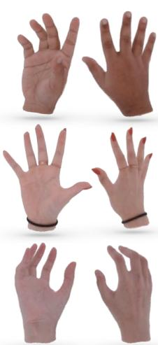  
MANUS-Hand

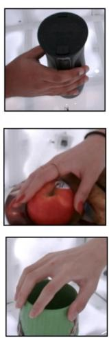  
Grasp Scene

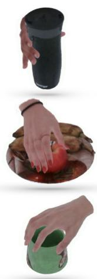  
Novel View 1

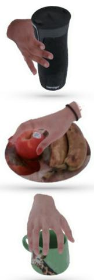  
Novel View 2

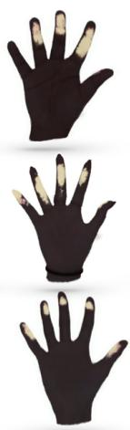  
Accumulated Contacts

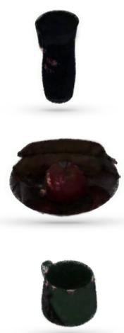  
Instantaneous  
Object Contacts

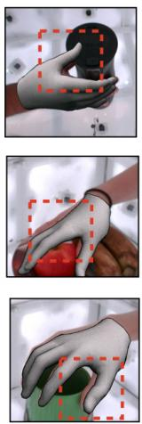  
Misalignment in MANO  
Figure 1. We introduce MANUS, a novel markerless approach for capturing grasps by employing an articulated 3D Gaussian representation to accurately model hand shapes. This approach improves contact estimation accuracy in comparison to other template-based approaches when evaluated against ground truth contacts.

## Abstract

Understanding how we grasp objects with our hands has important applications in areas like robotics and mixed reality. However, this challenging problem requires accurate modeling of the contact between hands and objects. To capture grasps, existing methods use skeletons, meshes, or parametric models that does not represent hand shape accurately resulting in inaccurate contacts. We present MANUS, a method for Markerless Hand-Object Grasp Capture using Articulated 3D Gaussians. We build a novel articulated 3D Gaussians representation that extends 3D Gaussian splatting [29] for high-fidelity representation of articulating hands. Since our representation uses Gaussian primitives optimized from the multi-view pixel-aligned losses, it enables us to efficiently and accurately estimate contacts between the hand and the object. For the most accurate results, our method requires tens of camera views that cur-

rent datasets do not provide. We therefore build MANUS-Grasps, a new dataset that contains hand-object grasps viewed from 50+ cameras across 30+ scenes, 3 subjects, and comprising over 7M frames. In addition to extensive qualitative results, we also show that our method outperforms others on a quantitative contact evaluation method that uses paint transferfrom the object to the hand.

## 1. Introduction

Every day, the average person effortlessly grasps more than a hundred different objects [74, 76]. This seemingly routine act of grasping poses a significant challenge for machines, as is evident from the extensive research on this topic in computer vision [16] and robotics [3, 4]. High-fidelity capture of natural human grasps could unlock new applications in areas like robotics and mixed reality, but this challenging problem first requires us to accurately estimate the contact between the hand and the object [5].

Previous work has addressed this problem by using gloves or special sensors [20, 49], but these devices are cumbersome and restrict hand movement. Therefore, a large body of work has focused on markerless grasp capture using one or more cameras [1, 6, 9, 21, 59].

Most of these methods use skeletons [21], meshes [1], or parametric models [26, 52] to model the hand and object. Although these representations are flexible and easy to use, they often cannot accurately model hand shape resulting in reduced contact accuracy (see Figure 1). Recently, articulated neural implicit representations [14, 40, 45] have been proposed as alternatives, but modeling contact in implicit representations is challenging and requires expensive sampling.

To overcome these limitations, we introduce MANUS, a method for Markerless Hand-Object Grasp Capture using Articulated 3D Gaussians. The key component of MANUS is a 3D Gaussian splatting [29] approach to build MANUS-Hand, an articulated hand model composed of 3D Gaussians that make it faster to optimize and infer than many implicitly-represented models. Similarly, we also capture the object using static 3D Gaussians. Since both MANUS-Hand and the object are modeled using Gaussians primitives with explicit positions and orientations, we can efficiently compute both instantaneous and accumulated contacts between them (see Section 4.2). When trained on datasets with tens of camera views, our method can accurately capture grasps since 3D Gaussians promote accurate pixel-level alignment resulting in more precise shape and contact estimation compared to existing methods.

Previous datasets [5, 17, 21–23, 36, 60, 75] have been instrumental in addressing the grasp capture problem but (1) they use specialized hardware (heat-sensitive cameras [5], or markers [60]) to capture hand-object grasps, making it hard to scale, (2) RGB camera-only datasets [6, 9, 17, 31], contain only a few views with occlusions making it hard to learn accurate contacts, and (3) they rely on the parametric models or skeletons to estimate contacts resulting in inaccurate contacts. Our main insight is that accurate contact modeling is much easier with a large number of camera views that reduce the effect of (self-)occlusions. Therefore, we curated a one-of-a-kind realworld multi-view RGB dataset, MANUS-Grasps, comprising over 7M frames˜ captured using 50+ high-framerate cameras, providing a full 360-degree coverage of grasp sequences occurring in over 30 diverse everyday scenarios. In addition, this dataset contains 15 evaluation sequences that employ wet paint on objects to leave a contact residue on the hand [27] providing a natural way to evaluate contact quality without additional equipment or annotation. We show extensive experiments ablating and justifying different components of MANUS-Hand, as well as the MANUS grasping method. In addition, we also provide a new metric of contact quality to assess the performance of MANUS against template-based methods. While our method is not designed for photorealism, we observe that the captured grasping sequences are comparable in visual quality to the best implicit hand models.

To summarize, our contributions include:

• MANUS-Hand, a new efficient representation for articulated hands that uses 3D Gaussian splatting for accurate shape and appearance representation.

• MANUS, a method that uses MANUS-Hand and a 3D Gaussian representation of the object to accurately model contacts.

• MANUS-Grasps, a large real-world multi-view RGB grasp dataset with over 7M frames from 50+ cameras,˜ providing full 360-degree coverage of grasps in over 30 diverse everyday life scenarios.

• A unique and novel approach to validate contact accuracy using paint transfer between the object and the hand.

## 2. Related Work

Representations: Skeletons and collections of shape primitives were some of the first representations to be used for hand–object interaction modeling [49, 59], but these representations are often not accurate enough for contact estimation. Meshes [1] and parametric models [26, 52] are currently the most popular alternatives but can also be misaligned with observations due to their lower-dimensional representation (see Figure 1).

Coordinate-based implicit neural networks, or neural fields [68], have shown great promise in accurately modeling shape and appearance in static scenes [10, 12, 29, 37, 39, 40, 44, 46, 57, 64, 70, 72] as well as dynamic scenes [19, 33, 38, 63, 69, 71]. Several methods specifically address articulated shapes [32] like human bodies [32, 35, 47, 48, 66], or hands [14, 28, 34, 45, 50]. However, they use representations that are inefficient for sampling and contact estimation. In contrast, we propose a new articulated neural field representation that extends 3D Gaussian splatting [29] to hands enabling efficient training/inference and contact estimation.

Hand-Object Interaction Capture: Previous work has attempted to model hand-object interactions using skeletons [21, 31], or customized meshes [1] as the hand representation without explicitly estimating contacts. Most other work [9, 17, 23, 36, 60] uses MANO in combination with mocap, or one or more camera views. While it becomes easier to estimate contact with a parametric mesh model, misalignments are still common (see Figure 1). To overcome the difficulty of accurate contact estimation, some methods resort to physical simulation [13, 62, 73], but these are limited to synthetic grasps only. In contrast, we propose a template-free articulated 3D Gaussian splatting model that provides a natural way to estimate accurate contacts.

Grasp Datasets: Datasets for human grasps are challenging to obtain because they need specialized hardware, extensive annotation, and significant post-processing to make them useful. Some datasets use markers or special gloves to track the hand and object [2, 15, 20, 61] but this hinders natural hand motion and introduces changes in image appearance. Synthetic datasets [23, 42, 43] suffer from a domain gap that makes it challenging to generalize to real data. Therefore, work has focused on manual annotations [1, 7, 51, 59], optimization [21], or automatic annotation [9, 56] from RGB or depth. Many of these datasets provide only 3D hand poses and lack information about contacts. Other datasets like InterHand2.6M [41, 75] are limited to hands only without any objects, while others [55] focus on 2D understanding only. Addressing these limitations, HOnnotate [21] introduces a markerless system for automatically annotating frames across 77K frames. However, the variety of objects and grasps in this dataset is somewhat limited. ContactDB [5] and ContactPose [6] address this limitation targets a broader variety of grasps. While ContactDB is captured using thermal imaging, ContactPose uses multi-view RGB-D data. Nonetheless, both methods are restricted to 3D hand poses, use non-realistic objects, and lack sufficient views for neural fields.

<table><tr><td>Dataset</td><td>#N Images (Views)</td><td>Annot. Type</td></tr><tr><td>w/o Contacts Annotation H2O-3D [22]</td><td>76k (5)</td><td>multi-kinect</td></tr><tr><td>FHPA [20] HOI4D [36] FreiHand [75]</td><td>105k (1) 2.4M (1) 37k (8)</td><td>magnetic single-manual semi-auto</td></tr><tr><td>HO3D [21] DexYCB [9]</td><td>78k (1-5) 582k (8)</td><td>multi-kinect multi-manual</td></tr><tr><td>ARCTIC [17] w/ Estimated Contacts Annotation</td><td>2.1M (9)</td><td>mocap</td></tr><tr><td>ContactPose [6] GRAB [60]</td><td>2.9M (3)</td><td>multi-kinect</td></tr><tr><td></td><td>- (-)</td><td>mocap</td></tr><tr><td>H20 [31]</td><td>571k (5)</td><td>multi-kinect</td></tr><tr><td>w/ Ground-Truth Contacts Annotation</td><td></td><td></td></tr><tr><td>MANUS-Grasps (Ours)</td><td>7M (50+)</td><td>multi-auto</td></tr></table>

Table 1. Dataset Comparison of existing Real World Datasets. The hands in previous datasets are represented by skeleton and MANO. Different from other works, we use Gaussian to model the hand. The keyword “single/multi-manual” denotes whether single or multiple views being used to annotate manually.

In contrast, we introduce MANUS-Grasps that includes diverse grasps from 50+ cameras capturing at 120 FPS specifically to support neural field methods. In total, we provide over 7M frames with ground truth camera poses,˜ segmentation, and estimated contacts.

## 3. Background

We briefly summarize recent advances in modeling radiance fields of static and dynamic scenes using 3D Gaussians [29, 38, 67]. Our method (see Section 4) extends the 3D Gaussians representation to articulated objects like the hand, and for grasp capture.

Static 3D Gaussians: Given multi-view images and a sparse point cloud of the scene, a set of 3D Gaussian primitives can be defined across world space $\boldsymbol { x } \in \mathrm { R } ^ { 3 \times 1 } \mathrm { a s }$

$$
G ( x ) = e ^ { \frac { - 1 } { 2 } ( x - \mu ) ^ { T } \Sigma ^ { - 1 } ( x - \mu ) } ,
$$

here each Gaussian primitive has 3D position (µ), opacity, anisotropic covariance matrix (Σ), and spherical harmonic (SH) coefficients. During the training of the radiance field, the properties of the initial 3D Gaussians are optimized together with a tile rasterizer [29] with the objective of minimizing pixel loss.

Dynamic 3D Gaussians: The 3D Gaussians approach has recently been extended to dynamic scenes [29, 67]. [67] introduces a deformation field that tracks the Gaussian position across timesteps. Similarly, [38] enable Gaussians to move and rotate over time while maintaining their color, opacity, and size. While these methods can capture dynamic and deformable scenes, they do not provide a way to control dynamic motion, $e . g .$ , using a skeleton. Furthermore, in these methods, Gaussians are free to move within the scene without any restrictions, which isn’t suitable for representing hands due to their kinematic structure. An articulated 3D Gaussians representation would be advantageous for grasp capture since it would enable low-dimensional skeleton-based control of the hand.

## 4. Method

MANUS aims to perform markerless capture of human hand grasps by accurately estimating the shape, appearance, and contacts between the hand and the object from multiview RGB videos. We achieve this by combining MANUS-Hand with an object model, both represented as 3D Gaussians, enabling us to compute contacts more efficiently than sampling-based implicit representations. Figure 3 provides an overview of our method.

## 4.1. MANUS-Hand

Our template-free, articulated hand model MANUS-Hand adopts 3D Gaussian splatting as the representation for accurate shape and appearance modeling of hands. Our model can be trained on sequences from any multi-view dataset to build an articulable hand model at any novel pose.

Representation: MANUS-Hand (see Figure 2) is composed of a skeleton with 21 bones and has 26 degrees of freedom (check supplementary for bone-specific DOFs).

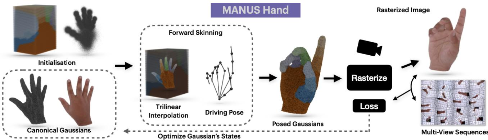  
Figure 2. MANUS-Hand is a template-free, articulable hand model learned from multi-view hand sequences which utilizes 3D Gaussian splatting representation for accurate modelling of the shape and appearance of hands.

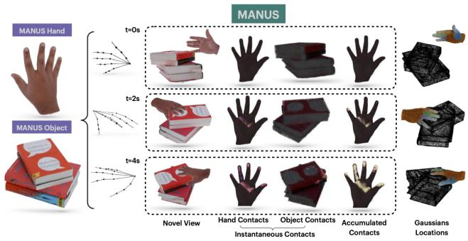  
Figure 3. MANUS leverages a driving pose to get MANUS-Hand in grasp scene. It is combined with an object model to get instantaneous and accumulated contacts between the two.

We built a custom pose estimation pipeline that uses AlphaPose [18] to estimate the 3D joint positions followed by an inverse kinematics fit (check supplementary). Since bone lengths can vary among different individuals, we estimate these lengths from the dataset and adjust the skeleton accordingly. The unique shape and appearance of a person’s hand in a canonical pose are determined by the states of 3D Gaussians, i.e., positions $\mu ,$ covariances $\Sigma ,$ opacities $\alpha ,$ and spherical harmonics coefficients $\phi .$ The covariance of each Gaussian in the canonical space is further defined as $\Sigma = R S S ^ { T } R .$ , where R and S denote the rotation and scaling of the Gaussians.

Optimization: A unique MANUS-Hand is optimized separately for each subject from a dense multi-view dataset containing approx 20 hand poses. To initialize Gaussian states in MANUS-Hand, we set their means to be points on a normal distribution centered at the midpoint of each bone in a canonical hand pose, with the distribution’s standard deviation adjusted to match the bone’s length (as shown in Figure 2 ). We follow a similar protocol as [29] to initialize the covariances, opacity, and SH coefficients.

To get the Gaussian positions in the posed space, forward kinematics and linear blend skinning is applied to the canonical Gaussians. One way to obtain skinning weights is to assign MANO weights [52] directly to the closest Gaussians. However, this approach results in artifacts because Gaussians could move in unpredictable ways during training leading to mismatched skinning weights (visualized in ablation study) To address this, we create a canonical grid inspired by Fast-SNARF [11]. Skinning weights are then allocated to grid voxels using the nearest neighbor method, termed as grid weights. Now to obtain the skinning weights for the queried Gaussians W in the canonical space, trilinear interpolation of these grid weights is performed. We calculate the transformed Gaussian positions using a perbone transformation matrix, denoted as $T _ { b }$ and linear blend skinning: $T _ { g } = W T _ { b } , \mu _ { p } = T _ { g } \mu ,$ , where $\mu _ { p }$ represents the location of Gaussians in the posed space, and $T _ { g }$ represents the transformation matrix for each Gaussian. To compute the covariance of the Gaussians in the posed space, it is transformed using a rotation matrix $R _ { g }$ , derived from $T _ { g }$ This is expressed as $\Sigma _ { p } ~ = ~ R _ { g } \Sigma R _ { g } ^ { T }$ Regarding the appearance, we optimize spherical harmonics coefficients for each Gaussian $\phi _ { g }$ in the canonical space. To get the colors in the transformed or posed space, the view direction from posed space $\nu _ { p } ^ { g }$ is first converted to the canonical space $\nu _ { c } ^ { g }$ as $\nu _ { c } ^ { g } = T _ { g } ^ { - 1 } \nu _ { p } ^ { g }$ , using $T _ { g }$ for each Gaussian. After this step, we use these transformed view directions $\mu _ { c } ^ { g }$ to query the spherical harmonics coefficients in canonical space and get corresponding RGB colors for each posed Gaussian. To get the final image rendering, all Gaussian states currently in the posed space are used as inputs to a differentiable rasterizer [29], denoted as R

$$
\mathcal { T } = \mathcal { R } ( \mu _ { p } , \nu _ { c } , \Sigma _ { p } , \alpha , \phi ) ,\tag{1}
$$

where I is the rendered image. During optimization, the Gaussian states are optimized using to minimize pixel loss on the posed hand. To optimize all Gaussian states, we impose a rendering loss $\mathcal { L } _ { 1 } = \| \hat { \boldsymbol { \mathcal { Z } } } - \boldsymbol { \mathcal { T } } \|$ and structural similarity [65] loss $\mathcal { L } _ { S S I M }$ between synthesized image I and ground truth image $\hat { \mathcal { T } }$ of the posed hand. To further improve the perceptual quality of the synthesized images, we add an additional perceptual loss $\mathcal { L } _ { p e r c } \left[ 2 5 \right]$

To avoid highly anisotropic Gaussians that could cause artifacts in the contact rendering, we incorporate an isotropic regularizer which ensures optimized Gaussians remain as isotropic as possible. If mi $1 _ { s } \in R ^ { 3 }$ and ma $\tau _ { s } \in R ^ { 3 }$ are the minimum and maximum scale of the optimized Gaussians, then isotropic regularizer $\mathcal { L } _ { i s o }$ is defined as

$$
\mathcal { L } _ { i s o } = ( \frac { \operatorname* { m i n } _ { s } } { \operatorname* { m a x } _ { s } } - s ) ^ { 2 } ,\tag{2}
$$

where s is set to be 0.4. Our final loss function is $L _ { h } =$ $\alpha \mathcal { L } _ { 1 } + \beta \mathcal { L } _ { S S I M } + \gamma \mathcal { L } _ { p e r c } + \delta \mathcal { L } _ { i s o }$

Inference: Once the Gaussian states are optimized, we can drive MANUS-Hand using a skeleton obtained from our pose estimation pipeline (check supplementary). Given a novel pose during the inference, MANUS-Hand outputs the transformed Gaussians as well as the rendered image from a particular view.

## 4.2. MANUS: Grasp Capture

While MANUS-Hand enables high-fidelity articulated hand modeling, it is not designed for capturing grasps and contacts. To capture grasps, we need a representation of the object as well as a method to estimate contacts.

Object Representation: For accurate representation of objects, we build a non-articulated Gaussian representation following Section 4.1 with some improvements to maintain geometric consistency and accuracy. To prevent floaters during optimization, we prune outlier Gaussians by projecting on image and culling if they lie outside the object mask. Grasp Capture: To capture the grasp in a particular sequence, we first articulate MANUS-Hand using the estimated hand pose. We then construct the object model as described above. Next, we combine both hand and object Gaussians. More specifically, if $G _ { h }$ and $G _ { o }$ are the hand Gaussians and object Gaussians in the grasp scene, we simply concatenate the Gaussians $G _ { f } = \{ G _ { o } , G _ { h } \}$ . Because we use Gaussian Splatting, it allows such a concatenation operation naturally – this would not be possible with implicit representations [14, 32, 45]. As the rasterization module only requires a set of Gaussians and their states, we can seamlessly merge hand and object Gaussians for every frame. The final grasp image is given by a rasterized composition of these Gaussians using Equation (1).

Contact Estimation: The contact map is calculated based on the proximity in 3D space between hand and object Gaussian positions. For each Gaussian on the hand, we find the closest Gaussian on the object. This pair is considered to be in contact if their distance is less than a certain threshold, and the same applies when assessing contact from the object’s perspective. Specifically, if $G _ { h }$ represents the Gaussians on the hand and $G _ { o }$ those on the object in the posed space, then the 3D contact map between them is defined as:

$$
C = \left\{ \begin{array} { l l } { { d ( G _ { h } , G _ { o } ) , } } & { { \mathrm { i f } d ( G _ { h } , G _ { o } ) < \tau } } \\ { { 0 , } } & { { \mathrm { o t h e r w i s e } } } \end{array} , \right.
$$

where d represents the pairwise Euclidean distance between the Gaussian locations. A contact is considered to have occurred if this distance is less than $\tau ,$ which is the predefined threshold for contact. We then use this method to estimate two kinds of contact maps on the hand and object: (1) an instantaneous contact map that denotes contact at a specific timestep, and (2) an accumulated contact map that denotes contact after the grasping has concluded. To get the accumulated contact map $C _ { a c c }$ we simply add the previous frame’s accumulated contact map to current frame. For rendering contact maps, we employ Equation (1) using the contact distance as the color value of each Gaussian.

## 4.3. MANUS-Grasps

For our grasp capture method to work well, a key requirement is a multi-view RGB dataset with tens of camera views that help resolve self-occlusions. Many prior datasets (see Section 2 and Table 1) contain multi-view images or video of hand grasps [21, 56, 61], but none have the large number of views needed to support neural field representations or are limited to hands only [41]. We therefore present MANUS-Grasps, a large real-world multi-view RGB grasp dataset with over 7M frames from 50+ cameras, providing˜ full 360-degree coverage of grasp sequences comprising of 30+ diverse object scenes.

Capture System: Our customized data capture setup consists of 53 RGB cameras uniformly located inside a cubical capture volume with each cube face consisting of 9 cameras. The sides of the cube are illuminated evenly using LED lights. Each RGB camera records at 120 FPS with a resolution of 1280 × 720. The cameras are software synchronized with a frame misalignment error of no more than 3 ms. The multi-view system is calibrated for camera intrinsics and extrinsics using COLMAP [53, 54] with fiducial markers on the walls.

Capture Protocol: Our capture protocol consists of four steps. First, we recorded multi-view videos of a subject’s right hand as they performed a brief articulating movement. Next, we capture only the object without the hand. Then, without moving the object, we record multi-view videos of the subject’s hand grasping the object. We repeat this process 30+ times per subject with 2-5 grasps per object scene. For evaluation sequences, we additionally capture a canonical pose at the end to record accumulated contacts seen in the transferred paint (see below).

Ground Truth Contact: A unique feature of our dataset is the capture of 15 evaluation sequences where the object has wet paint during the grasp [27]. As a result, paint is transferred to the hand resulting in visual evidence of contact. This contact mark is a physically accurate representation of the true (accumulated) contact between the hand and the object making it the true ground truth (even methods like [5] suffer from heat dissipation). We chose a bright green paint to enable automatic segmentation thereby creating a gold standard for contact evaluation.

Data Annotation: MANUS-Grasps also provides 2D and 3D hand joint locations along with hand and object segmentation masks. We obtain the joint locations from Alpha-Pose [18] followed by 3D triangulation and inverse kinematics [58]. We impose constraints to limit the degrees of freedom and joint angles for the rotation of the bones. To achieve temporal smoothness for the sequence, we apply the 1C Filter [8] on the estimated parameters. To segment the hand and object from the background, we use the Segment Anything Model (SAM) [30] followed by fitting an Instant-NGP model [44] to extract a binary mask to ensure multi-view consistency.

## 5. Experiments and Results

In this section, we show qualitative and quantitative results from our method. Our goal is to evaluate both the MANUS-Hand and the MANUS grasp capture method, and compare with existing methods.

## 5.1. Evaluating MANUS-Hand

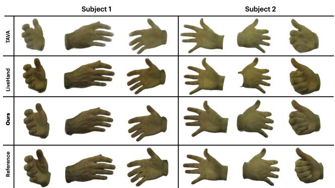  
Figure 4. Qualitative comparison of MANUS-Hand with Live-Hand [45] and TAVA [32]. It’s noteworthy that our renderings closely resemble those of LiveHand and surpass TAVA in quality, even in the absence of any components designed to enhance photorealism.

We first show results and experiments related to MANUS-Hand only. We quantitatively as well qualitatively assess the visual quality of our hand model with the current state-of-the-art method LiveHand [45] and TAVA [32]. Metrics, Dataset & Setup: We assess the visual quality of our hand model using PSNR, SSIM, and LPIPS metrics (where higher scores indicate better performance) on the Interhand2.6M dataset, as shown in Table 3. We used two subjects from Interhand2.6M (Capture0 and Capture1), focusing on the “ROM07-RT-Finger-Occlusions” sequence from the test set. We allocate 75% of the data for optimizing and use the remainder for evaluation.

Quantitative Evaluation: MANUS-Hand is not specifically designed for photorealism since we leave out ambient occlusion and shadow mapping and focus only on geometric accuracy. As shown in Table 3, our results outperforms TAVA however LiveHand emerges as the best in terms of the evaluated metrics (PSNR/LPIPS), which significantly penalize the absence of ambient occlusion and shadows (also mentioned by [32]). We want to emphasize that our primary goal is not to surpass existing hand models in terms of visual quality. Instead, our focus is on accurate contact estimation. LiveHand and TAVA both learn implicit volumetric density field which makes calculating contact maps complicated & expensive, whereas our Gaussians-based approach is more efficient. The comparison with LiveHand and TAVA is intended to demonstrate our comparable visual quality despite not being designed for it.

Qualitative Evaluation: We conducted a qualitative comparison of our MANUS-Hand with TAVA [32] and Live-Hand [45], as shown in Figure 4. The quality of our renderings is superior to TAVA [32] and is on par with that of LiveHand. In conclusion, despite not being tailored for photorealism, our method demonstrates substantial potential for application in photorealistic contexts.

## 5.2. Evaluating Grasp Capture

Next, we evaluate our MANUS method for grasp capture. In this paper, we assume that direct contact between the hand and the object is the primary mode of grasping (we ignore indirect grasping through tools). Therefore, the goal of grasp evaluation is to objectively measure the accuracy of contacts. We compare three methods: (1) MANO [52] fitting methods, (2) HARP [28], and (3) our MANUS model. Metric, Dataset & Setup: In our experiments, we use the wet-paint transfer method [27] to accurately collect ground truth accumulated contacts (see Section 4.3). After grasp completion, users are instructed to return to a canonical post-grasp pose. In this pose, the green paint residue in the grasping hand is automatically segmented and 2D contact maps are rendered from 10 different views (details in supplementary) using [44]. We then assess the quality of grasps estimated by different methods using the Intersection over Union (IoU) and F1-score metrics. All experiments use 15 sequences of our wet-paint evaluation sequences. We set the distance threshold τ = 0.004 for contact estimation for all methods. For a fair comparison, we subdivide the meshes of MANO and HARP from 778 to 49,000 vertices before estimating contact. For estimating contact masks in all meth-

ods, we utilize the ’gray’ color map [24] on the distance map. The contact masks for MANUS are rendered using [29], while for the other two frameworks, they are rendered using the emission shader in Blender. It’s noteworthy that MANUS consistently outperforms the others in the contact metric across all three subjects as shown in Table 2.
<table><tr><td>Method</td><td>Subject1</td><td>Subject2</td><td>Subject3</td></tr><tr><td>mIoU↑</td><td></td><td></td><td></td></tr><tr><td>MANO</td><td>0.161</td><td>0.135</td><td>0.208</td></tr><tr><td>HARP Ours</td><td>0.173 0.206</td><td>0.148 0.152</td><td>0.224 0.275</td></tr><tr><td>F1 score ↑</td><td></td><td></td><td></td></tr><tr><td>MANO</td><td></td><td></td><td></td></tr><tr><td>HARP</td><td>0.270</td><td>0.228</td><td>0.338</td></tr><tr><td></td><td>0.28875</td><td>0.2474</td><td>0.361</td></tr><tr><td>Ours</td><td>0.335</td><td>0.251</td><td>0.424</td></tr></table>

Table 2. Comparison of MANUS grasp capture approach with MANO and HARP on contact metric. Note that, we perform consistently better in both metrics.

Qualitative Evaluation: We also present a qualitative comparison of our contact results against those obtained using MANO and HARP in Figure 6. Our method shows a more accurate representation of the contact area, closely matching the actual contact masks, unlike the oversegmentation observed in MANO and HARP methods. Although our method outperforms others, we note that there is still significant room for improvement on our dataset for future methods to address.

Discussion: We also demonstrate the importance of dense camera views for accurate contact representation in Table 4 which shows the diminishing of contact metric as the number of camera view decreases. This finding is significant as it confirms our initial hypothesis that dense camera views are essential for accurate contact representation, helping to prevent self-occlusion scenarios.

Results: Finally, we show qualitative results in Figure 5, showcasing two different stages: one during the grasp process and another at the conclusion of the grasp. For a comprehensive 360-degree view of the grasp capture, an in-depth ablation study, and details on the implementation, please refer to our supplementary materials.

## 6. Conclusion

In this work, we proposed MANUS, which introduced a novel articulated 3D Gaussians representation, which successfully bridge the gap between the accurate modeling of contacts in hand-object interactions and the limitations of current data capturing techniques. We introduced MANUS-Grasps, an extensive multi-view dataset captured from 50+ cameras, which offers an unprecedented level of detail and accuracy, covering a wide range of scenes, subjects, and frames. Overall, MANUS demonstrates remarkable potential in advancing the fields of robotics, mixed reality, and activity recognition, enabling the creation of more accurate robotic systems and enhanced virtual interactions.

<table><tr><td>Method PSNR ↑</td><td>SSIM↑</td><td></td><td>LPIPS ↓ Test time (s) ↓</td></tr><tr><td>TAVA</td><td>22.85</td><td>0.983</td><td>0.099 11.00</td></tr><tr><td>LiveHand</td><td>31.16</td><td>0.9818</td><td>0.0278 0.022</td></tr><tr><td>Ours</td><td>26.32</td><td>0.9872 0.068</td><td>0.049</td></tr></table>

Table 3. Here, we show comparison of MANUS-Hand on Inter-Hand2.6M [41] dataset with LiveHand [45] and [32]. Note that our primary goal is to obtain accurate contacts, not visual quality.
<table><tr><td>Camera Views</td><td>Subject1</td><td>Subject2</td><td>Subject3</td></tr><tr><td>mIoU↑</td><td></td><td></td><td></td></tr><tr><td>5</td><td>0.147</td><td>0.140</td><td>0.214</td></tr><tr><td>10</td><td>0.164</td><td>0.145</td><td>0.256</td></tr><tr><td>20</td><td>0.176</td><td>0.142</td><td>0.261</td></tr><tr><td>Ours (30+)</td><td>0.206</td><td>0.152</td><td>0.275</td></tr><tr><td>F1 score ↑</td><td></td><td></td><td></td></tr><tr><td>5</td><td>0.244</td><td>0.235</td><td>0.343</td></tr><tr><td>10</td><td>0.266</td><td>0.242</td><td>0.401</td></tr><tr><td>20</td><td>0.271</td><td>0.240</td><td>0.410</td></tr><tr><td>Ours (30+)</td><td>0.335</td><td>0.251</td><td>0.424</td></tr></table>

Table 4. Here we show empirical findings demonstrating the decline in contact metric as the number of camera views decreases, leading to increased susceptibility to self-occlusions.

Limitations and Future Work: While our focus in this paper was on accurate contact estimation, we recognize that the complexity of hand dynamics in everyday life extends far beyond what we have explored. Our current focus has been on modeling single-hand grasping with static objects, without delving into the pose-dependent non-linear deformation caused by skin stretching. Additionally, hand-object manipulation for longer time-frames is unaddressed in this work and can be a interesting direction for future works. We also observe that there is room for improvement in the metrics we propose for future work. We also acknowledge the complexity and limited accessibility of our capture setup which motivates us to make dataset publicly available.

Acknowledgements: This work was supported by NSF CAREER grant #2143576, ONR DURIP grant N00014-23- 1-2804, ONR grant N00014-22-1-259, a gift from Meta Reality Labs, and an AWS Cloud Credits award. We would like to thank George Konidaris, Stefanie Tellex, and Dingxi Zhang. Additionally, we thank Bank of Baroda for partially funding Chandradeep’s travel expenses.

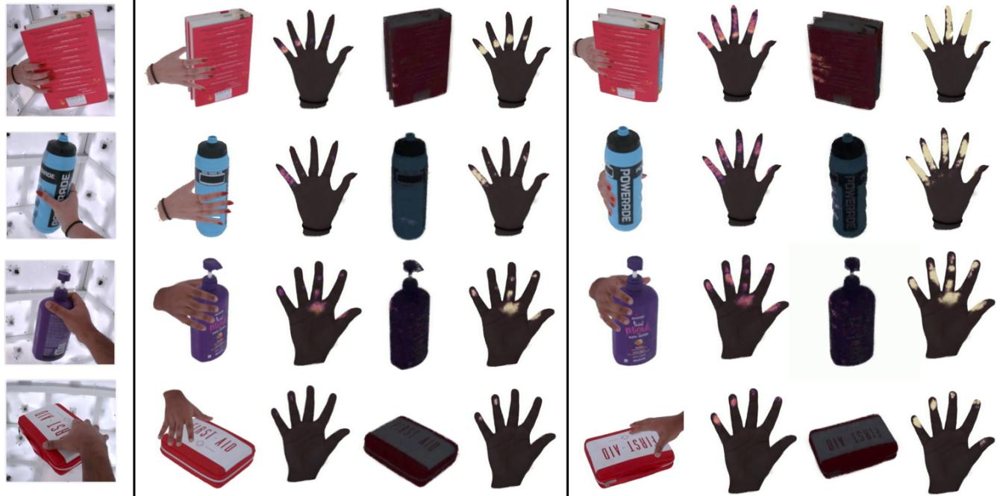

Grasp Scene

Captured Grasp

View/Timestep #1

Hand Contacts

Object Contacts

Accumulated Contacts

Captured Grasp

View/Timestep #2

Hand Contacts

Object Contacts

Accumulated Contacts

## Figure 5. Here we show our contact estimation results on novel views for a variety of objects. We show both instantaneous and accumulated contacts for the hand in a canonical pose. Best viewed zoomed.

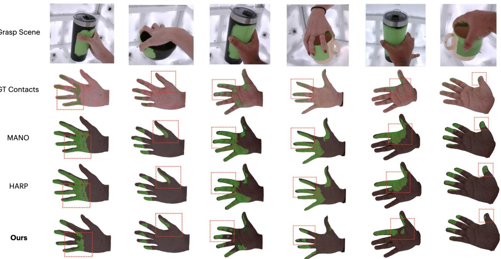

Figure 6. Contact Comparisons: We compare accumulated contacts of MANUS with that of MANO and HARP on ground truth contacts from MANUS Grasps dataset. It’s visible that our contacts are far more accurate and closer to the actual ground truths.

## References

[1] Luca Ballan, Aparna Taneja, Jurgen Gall, Luc Van Gool, and¨ Marc Pollefeys. Motion capture of hands in action using discriminative salient points. In Computer Vision–ECCV 2012: 12th European Conference on Computer Vision, Florence, Italy, October 7-13, 2012, Proceedings, Part VI 12, pages 640–653. Springer, 2012. 2, 3

[2] Keni Bernardin, Koichi Ogawara, Katsushi Ikeuchi, and Ruediger Dillmann. A sensor fusion approach for recognizing continuous human grasping sequences using hidden markov models. IEEE Transactions on Robotics, 21(1):47– 57, 2005. 3

[3] Antonio Bicchi and Vijay Kumar. Robotic grasping and contact: A review. In Proceedings 2000 ICRA. Millennium conference. IEEE international conference on robotics and automation. Symposia proceedings (Cat. No. 00CH37065), pages 348–353. IEEE, 2000. 1

[4] Jeannette Bohg, Antonio Morales, Tamim Asfour, and Danica Kragic. Data-driven grasp synthesis—a survey. IEEE Transactions on robotics, 30(2):289–309, 2013. 1

[5] Samarth Brahmbhatt, Cusuh Ham, Charles C Kemp, and James Hays. Contactdb: Analyzing and predicting grasp contact via thermal imaging. In Proceedings of the IEEE/CVF conference on computer vision and pattern recognition, pages 8709–8719, 2019. 1, 2, 3, 6

[6] Samarth Brahmbhatt, Chengcheng Tang, Christopher D Twigg, Charles C Kemp, and James Hays. Contactpose: A dataset of grasps with object contact and hand pose. In European Conference on Computer Vision, pages 361–378. Springer, 2020. 2, 3

[7] Ian M Bullock, Thomas Feix, and Aaron M Dollar. The yale human grasping dataset: Grasp, object, and task data in household and machine shop environments. The International Journal of Robotics Research, 34(3):251–255, 2015. 3

[8] Gery Casiez, Nicolas Roussel, and Daniel Vogel. 1´ C filter: a simple speed-based low-pass filter for noisy input in interactive systems. Proceedings of the SIGCHI Conference on Human Factors in Computing Systems, 2012. 6

[9] Yu-Wei Chao, Wei Yang, Yu Xiang, Pavlo Molchanov, Ankur Handa, Jonathan Tremblay, Yashraj S Narang, Karl Van Wyk, Umar Iqbal, Stan Birchfield, et al. Dexycb: A benchmark for capturing hand grasping of objects. In Proceedings of the IEEE/CVF Conference on Computer Vision and Pattern Recognition, pages 9044–9053, 2021. 2, 3

[10] Anpei Chen, Zexiang Xu, Andreas Geiger, Jingyi Yu, and Hao Su. Tensorf: Tensorial radiance fields. arXiv preprint arXiv:2203.09517, 2022. 2

[11] Xu Chen, Tianjian Jiang, Jie Song, Max Rietmann, Andreas Geiger, Michael J Black, and Otmar Hilliges. Fast-snarf: A fast deformer for articulated neural fields. IEEE Transactions on Pattern Analysis and Machine Intelligence, 2023. 4

[12] Zhiqin Chen and Hao Zhang. Learning implicit fields for generative shape modeling. Proceedings ofIEEE Conference on Computer Vision and Pattern Recognition (CVPR), 2019. 2

[13] Sammy Christen, Muhammed Kocabas, Emre Aksan, Jemin Hwangbo, Jie Song, and Otmar Hilliges. D-grasp: Physically plausible dynamic grasp synthesis for hand-object interactions. In Proceedings of the IEEE/CVF Conference on Computer Vision and Pattern Recognition (CVPR), 2022. 2

[14] Enric Corona, Tomas Hodan, Minh Vo, Francesc Moreno-Noguer, Chris Sweeney, Richard Newcombe, and Lingni Ma. Lisa: Learning implicit shape and appearance of hands. In CVPR, 2022. 2, 5

[15] Joseph DelPreto, Chao Liu, Yiyue Luo, Michael Foshey, Yunzhu Li, Antonio Torralba, Wojciech Matusik, and Daniela Rus. Actionnet: A multimodal dataset for human activities using wearable sensors in a kitchen environment. In Thirty-sixth Conference on Neural Information Processing Systems Datasets and Benchmarks Track, 2022. 3

[16] Ali Erol, George Bebis, Mircea Nicolescu, Richard D Boyle, and Xander Twombly. Vision-based hand pose estimation: A review. Computer Vision and Image Understanding, 108 (1-2):52–73, 2007. 1

[17] Zicong Fan, Omid Taheri, Dimitrios Tzionas, Muhammed Kocabas, Manuel Kaufmann, Michael J. Black, and Otmar Hilliges. ARCTIC: A dataset for dexterous bimanual handobject manipulation. In Proceedings IEEE Conference on Computer Vision and Pattern Recognition (CVPR), 2023. 2, 3

[18] Hao-Shu Fang, Jiefeng Li, Hongyang Tang, Chao Xu, Haoyi Zhu, Yuliang Xiu, Yong-Lu Li, and Cewu Lu. Alphapose: Whole-body regional multi-person pose estimation and tracking in real-time. IEEE Transactions on Pattern Analysis and Machine Intelligence, 2022. 4, 6

[19] Sara Fridovich-Keil, Giacomo Meanti, Frederik Rahbæk Warburg, Benjamin Recht, and Angjoo Kanazawa. K-planes: Explicit radiance fields in space, time, and appearance. In CVPR, 2023. 2

[20] Guillermo Garcia-Hernando, Shanxin Yuan, Seungryul Baek, and Tae-Kyun Kim. First-person hand action benchmark with rgb-d videos and 3d hand pose annotations. In Proceedings ofthe IEEE conference on computer vision and pattern recognition, pages 409–419, 2018. 1, 3

[21] Shreyas Hampali, Mahdi Rad, Markus Oberweger, and Vincent Lepetit. Honnotate: A method for 3d annotation of hand and object poses. In Proceedings of the IEEE/CVF conference on computer vision and pattern recognition, pages 3196–3206, 2020. 2, 3, 5

[22] Shreyas Hampali, Sayan Deb Sarkar, Mahdi Rad, and Vincent Lepetit. Keypoint transformer: Solving joint identification in challenging hands and object interactions for accurate 3d pose estimation. In IEEE Computer Vision and Pattern Recognition Conference, 2022. 3

[23] Yana Hasson, Gul Varol, Dimitrios Tzionas, Igor Kale-¨ vatykh, Michael J Black, Ivan Laptev, and Cordelia Schmid. Learning joint reconstruction of hands and manipulated objects. In CVPR 2019 - IEEE Conference on Computer Vision and Pattern Recognition, pages 11799–11808, Long Beach, United States, 2019. IEEE. 2, 3

[24] J. D. Hunter. Matplotlib: A 2d graphics environment. Computing in Science & Engineering, 9(3):90–95, 2007. 7

[25] Justin Johnson, Alexandre Alahi, and Li Fei-Fei. Perceptual losses for real-time style transfer and super-resolution. In Computer Vision–ECCV 2016: 14th European Conference, Amsterdam, The Netherlands, October 11-14, 2016, Proceedings, Part II 14, pages 694–711. Springer, 2016. 5

[26] Hanbyul Joo, Tomas Simon, and Yaser Sheikh. Total capture: A 3d deformation model for tracking faces, hands, and bodies. In Proceedings of the IEEE conference on computer vision and pattern recognition, pages 8320–8329, 2018. 2

[27] Noriko Kamakura, Michiko Matsuo, Harumi Ishii, Fumiko Mitsuboshi, and Yoriko Miura. Patterns of static prehension in normal hands. The American journal of occupational therapy, 34(7):437–445, 1980. 2, 6

[28] Korrawe Karunratanakul, Sergey Prokudin, Otmar Hilliges, and Siyu Tang. Harp: Personalized hand reconstruction from a monocular rgb video. 2023 IEEE/CVF Conference on Computer Vision and Pattern Recognition (CVPR), pages 12802–12813, 2022. 2, 6

[29] Bernhard Kerbl, Georgios Kopanas, Thomas Leimkuehler, and George Drettakis. 3d gaussian splatting for real-time radiance field rendering. ACM Transactions on Graphics (TOG), 42:1 – 14, 2023. 1, 2, 3, 4, 7

[30] Alexander Kirillov, Eric Mintun, Nikhila Ravi, Hanzi Mao, Chloe Rolland, Laura Gustafson, Tete Xiao, Spencer Whitehead, Alexander C. Berg, Wan-Yen Lo, Piotr Dollar, and´ Ross Girshick. Segment anything. arXiv:2304.02643, 2023. 6

[31] Taein Kwon, Bugra Tekin, Jan Stuhmer, Federica Bogo, and¨ Marc Pollefeys. H2o: Two hands manipulating objects for first person interaction recognition. In Proceedings of the IEEE/CVF International Conference on Computer Vision, pages 10138–10148, 2021. 2, 3

[32] Ruilong Li, Julian Tanke, Minh Vo, Michael Zollhofer, Jurgen Gall, Angjoo Kanazawa, and Christoph Lassner. Tava: Template-free animatable volumetric actors. 2022. 2, 5, 6, 7

[33] Tianye Li, Mira Slavcheva, Michael Zollhofer, Simon Green,¨ Christoph Lassner, Changil Kim, Tanner Schmidt, Steven Lovegrove, Michael Goesele, and Zhaoyang Lv. Neural 3d video synthesis. CoRR, abs/2103.02597, 2021. 2

[34] Yuwei Li, Longwen Zhang, Zesong Qiu, Yingwenqi Jiang, Nianyi Li, Yuexin Ma, Yuyao Zhang, Lan Xu, and Jingyi Yu. Nimble: a non-rigid hand model with bones and muscles. ACM Transactions on Graphics (TOG), 41(4):1–16, 2022. 2

[35] Lingjie Liu, Marc Habermann, Viktor Rudnev, Kripasindhu Sarkar, Jiatao Gu, and Christian Theobalt. Neural actor: Neural free-view synthesis of human actors with pose control. ACM Trans. Graph.(ACM SIGGRAPH Asia), 2021. 2

[36] Yunze Liu, Yun Liu, Che Jiang, Kangbo Lyu, Weikang Wan, Hao Shen, Boqiang Liang, Zhoujie Fu, He Wang, and Li Yi. Hoi4d: A 4d egocentric dataset for category-level humanobject interaction. In Proceedings of the IEEE/CVF Conference on Computer Vision and Pattern Recognition, pages 21013–21022, 2022. 2, 3

[37] Stephen Lombardi, Tomas Simon, Jason Saragih, Gabriel Schwartz, Andreas Lehrmann, and Yaser Sheikh. Neural volumes: Learning dynamic renderable volumes from images. ACM Trans. Graph., 38(4):65:1–65:14, 2019. 2

[38] Jonathon Luiten, Georgios Kopanas, Bastian Leibe, and Deva Ramanan. Dynamic 3d gaussians: Tracking by persistent dynamic view synthesis. arXiv preprint arXiv:2308.09713, 2023. 2, 3

[39] Lars Mescheder, Michael Oechsle, Michael Niemeyer, Sebastian Nowozin, and Andreas Geiger. Occupancy networks: Learning 3d reconstruction in function space. In Proceedings IEEE Conf. on Computer Vision and Pattern Recognition (CVPR), 2019. 2

[40] Ben Mildenhall, Pratul P. Srinivasan, Matthew Tancik, Jonathan T. Barron, Ravi Ramamoorthi, and Ren Ng. Nerf: Representing scenes as neural radiance fields for view synthesis. In ECCV, 2020. 2

[41] Gyeongsik Moon, Shoou-I Yu, He Wen, Takaaki Shiratori, and Kyoung Mu Lee. Interhand2. 6m: A dataset and baseline for 3d interacting hand pose estimation from a single rgb image. In European Conference on Computer Vision, pages 548–564. Springer, 2020. 3, 5, 7

[42] Franziska Mueller, Dushyant Mehta, Oleksandr Sotnychenko, Srinath Sridhar, Dan Casas, and Christian Theobalt. Real-time hand tracking under occlusion from an egocentric rgb-d sensor. In Proceedings of International Conference on Computer Vision (ICCV), 2017. 3

[43] Franziska Mueller, Florian Bernard, Oleksandr Sotnychenko, Dushyant Mehta, Srinath Sridhar, Dan Casas, and Christian Theobalt. Ganerated hands for real-time 3d hand tracking from monocular rgb. In Proceedings of Computer Vision and Pattern Recognition (CVPR), 2018. 3

[44] Thomas Muller, Alex Evans, Christoph Schied, and Alexan-¨ der Keller. Instant neural graphics primitives with a multiresolution hash encoding. ACM Trans. Graph., 41(4):102:1– 102:15, 2022. 2, 6

[45] Akshay Mundra, Jiayi Wang, Marc Habermann, Christian Theobalt, Mohamed Elgharib, et al. Livehand: Real-time and photorealistic neural hand rendering. arXiv preprint arXiv:2302.07672, 2023. 2, 5, 6, 7

[46] Jeong Joon Park, Peter Florence, Julian Straub, Richard Newcombe, and Steven Lovegrove. Deepsdf: Learning continuous signed distance functions for shape representation. In The IEEE Conference on Computer Vision and Pattern Recognition (CVPR), 2019. 2

[47] Sida Peng, Junting Dong, Qianqian Wang, Shangzhan Zhang, Qing Shuai, Xiaowei Zhou, and Hujun Bao. Animatable neural radiance fields for modeling dynamic human bodies. In ICCV, 2021. 2

[48] Sida Peng, Yuanqing Zhang, Yinghao Xu, Qianqian Wang, Qing Shuai, Hujun Bao, and Xiaowei Zhou. Neural body: Implicit neural representations with structured latent codes for novel view synthesis of dynamic humans. In CVPR, 2021. 2

[49] Tu-Hoa Pham, Nikolaos Kyriazis, Antonis A Argyros, and Abderrahmane Kheddar. Hand-object contact force estimation from markerless visual tracking. IEEE transactions on pattern analysis and machine intelligence, 40(12):2883– 2896, 2017. 1, 2

[50] Neng Qian, Jiayi Wang, Franziska Mueller, Florian Bernard, Vladislav Golyanik, and Christian Theobalt. Html: A parametric hand texture model for 3d hand reconstruction and

personalization. In Computer Vision–ECCV 2020: 16th European Conference, Glasgow, UK, August 23–28, 2020, Proceedings, Part XI 16, pages 54–71. Springer, 2020. 2

[51] Gregory Rogez, James S Supancic, and Deva Ramanan. Un-´ derstanding everyday hands in action from rgb-d images. In Proceedings of the IEEE international conference on computer vision, pages 3889–3897, 2015. 3

[52] Javier Romero, Dimitrios Tzionas, and Michael J. Black. Embodied hands: Modeling and capturing hands and bodies together. ACM Transactions on Graphics, (Proc. SIG-GRAPH Asia), 36(6), 2017. 2, 4, 6

[53] Johannes Lutz Schonberger and Jan-Michael Frahm.¨ Structure-from-motion revisited. In Conference on Computer Vision and Pattern Recognition (CVPR), 2016. 5

[54] Johannes Lutz Schonberger, Enliang Zheng, Marc Pollefeys,¨ and Jan-Michael Frahm. Pixelwise view selection for unstructured multi-view stereo. In European Conference on Computer Vision (ECCV), 2016. 5

[55] Dandan Shan, Jiaqi Geng, Michelle Shu, and David F Fouhey. Understanding human hands in contact at internet scale. In Proceedings of the IEEE/CVF conference on computer vision and pattern recognition, pages 9869–9878, 2020. 3

[56] Tomas Simon, Hanbyul Joo, Iain Matthews, and Yaser Sheikh. Hand keypoint detection in single images using multiview bootstrapping. In CVPR, 2017. 3, 5

[57] Vincent Sitzmann, Michael Zollhoefer, and Gordon Wetzstein. Scene representation networks: Continuous 3dstructure-aware neural scene representations. In Advances in Neural Information Processing Systems. Curran Associates, Inc., 2019. 2

[58] Srinath Sridhar, Antti Oulasvirta, and Christian Theobalt. Interactive markerless articulated hand motion tracking using rgb and depth data. In Proceedings ofthe IEEE International Conference on Computer Vision (ICCV), 2013. 6

[59] Srinath Sridhar, Franziska Mueller, Michael Zollhofer, Dan¨ Casas, Antti Oulasvirta, and Christian Theobalt. Real-time joint tracking of a hand manipulating an object from rgb-d input. In European Conference on Computer Vision, pages 294–310. Springer, 2016. 2, 3

[60] Omid Taheri, Nima Ghorbani, Michael J. Black, and Dimitrios Tzionas. GRAB: A dataset of whole-body human grasping of objects. In European Conference on Computer Vision (ECCV), 2020. 2, 3

[61] Omid Taheri, Nima Ghorbani, Michael J Black, and Dimitrios Tzionas. Grab: A dataset of whole-body human grasping of objects. In European conference on computer vision, pages 581–600. Springer, 2020. 3, 5

[62] Dylan Turpin, Liquan Wang, Eric Heiden, Yun-Chun Chen, Miles Macklin, Stavros Tsogkas, Sven Dickinson, and Animesh Garg. Grasp’d: Differentiable contact-rich grasp synthesis for multi-fingered hands. In ECCV, 2022. 2

[63] Feng Wang, Sinan Tan, Xinghang Li, Zeyue Tian, Yafe Song, and Huaping Liu. Mixed neural voxels for fast multiview video synthesis. In Proceedings of the IEEE/CVF International Conference on Computer Vision, pages 19706– 19716, 2023. 2

[64] Peng Wang, Lingjie Liu, Yuan Liu, Christian Theobalt, Taku Komura, and Wenping Wang. Neus: Learning neural implicit surfaces by volume rendering for multi-view reconstruction. In Proceedings of the Thirtieth International Joint Conference on Artificial Intelligence (IJCAI). International Joint Conferences on Artificial Intelligence Organization, 2021. 2

[65] Zhou Wang, Alan C Bovik, Hamid R Sheikh, and Eero P Simoncelli. Image quality assessment: from error visibility to structural similarity. IEEE transactions on image processing, 13(4):600–612, 2004. 4

[66] Chung-Yi Weng, Brian Curless, Pratul P. Srinivasan, Jonathan T. Barron, and Ira Kemelmacher-Shlizerman. HumanNeRF: Free-viewpoint rendering of moving people from monocular video. In Proceedings of the IEEE/CVF Conference on Computer Vision and Pattern Recognition (CVPR), pages 16210–16220, 2022. 2

[67] Guanjun Wu, Taoran Yi, Jiemin Fang, Lingxi Xie, Xiaopeng Zhang, Wei Wei, Wenyu Liu, Qi Tian, and Wang Xinggang. 4d gaussian splatting for real-time dynamic scene rendering. arXiv preprint arXiv:2310.08528, 2023. 3

[68] Yiheng Xie, Towaki Takikawa, Shunsuke Saito, Or Litany, Shiqin Yan, Numair Khan, Federico Tombari, James Tompkin, Vincent Sitzmann, and Srinath Sridhar. Neural fields in visual computing and beyond. Computer Graphics Forum, 2022. 2

[69] Zhiwen Yan, Chen Li, and Gim Hee Lee. Nerf-ds: Neural radiance fields for dynamic specular objects. In Proceedings of the IEEE/CVF Conference on Computer Vision and Pattern Recognition, pages 8285–8295, 2023. 2

[70] Lior Yariv, Jiatao Gu, Yoni Kasten, and Yaron Lipman. Volume rendering of neural implicit surfaces. In Thirty-Fifth Conference on Neural Information Processing Systems, 2021. 2

[71] Jae Shin Yoon, Kihwan Kim, Orazio Gallo, Hyun Soo Park, and Jan Kautz. Novel view synthesis of dynamic scenes with globally coherent depths from a monocular camera. In Proceedings of the IEEE/CVF Conference on Computer Vision and Pattern Recognition, pages 5336–5345, 2020. 2

[72] Alex Yu, Sara Fridovich-Keil, Matthew Tancik, Qinhong Chen, Benjamin Recht, and Angjoo Kanazawa. Plenoxels: Radiance fields without neural networks. arXiv preprint arXiv:2112.05131, 2021. 2

[73] Hui Zhang, Sammy Christen, Zicong Fan, Luocheng Zheng, Jemin Hwangbo, Jie Song, and Otmar Hilliges. Artigrasp: Physically plausible synthesis of bi-manual dexterous grasping and articulation. arXiv preprint arXiv:2309.03891, 2023. 2

[74] Joshua Z Zheng, Sara De La Rosa, and Aaron M Dollar. An investigation of grasp type and frequency in daily household and machine shop tasks. In 2011 IEEE international conference on robotics and automation, pages 4169–4175. IEEE, 2011. 1

[75] Christian Zimmermann, Duygu Ceylan, Jimei Yang, Bryan Russell, Max Argus, and Thomas Brox. Freihand: A dataset for markerless capture of hand pose and shape from single rgb images. In Proceedings of the IEEE/CVF International Conference on Computer Vision, pages 813–822, 2019. 2, 3

[76] Paula Zuccotti. Every Thing We Touch: A 24-hour Inventory ofOur Lives. Penguin UK, 2015. 1