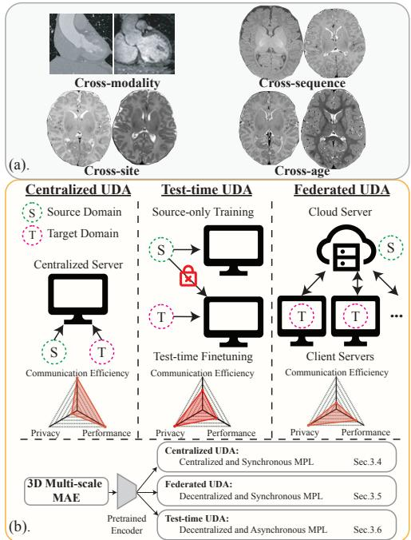
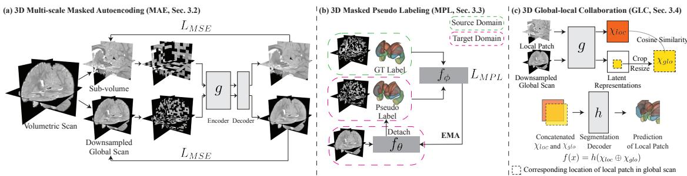
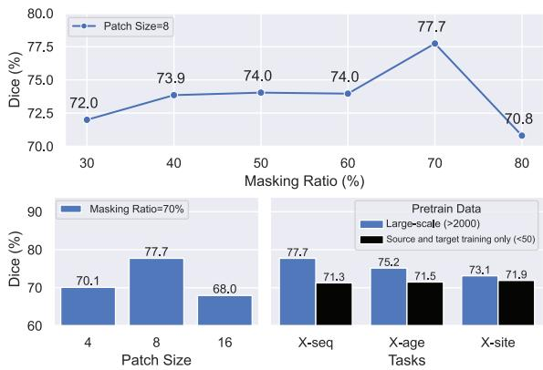

# MAPSeg: Unified Unsupervised Domain Adaptation for Heterogeneous Medical Image Segmentation Based on 3D Masked Autoencoding and Pseudo-Labeling

Xuzhe Zhang1†, Yuhao Wu2†, Elsa Angelini1,3, Ang Li4, Jia Guo1, Jerod M. Rasmussen5, Thomas G. O’Connor6, Pathik D. Wadhwa5, Andrea Parolin Jackowski7, Hai Li2, Jonathan Posner2, Andrew F. Laine1‡, Yun Wang2,8‡

1Columbia University 2Duke University 3Tel´ ecom Paris, LTCI, Institut Polytechnique de Paris´ 4University of Maryland, College Park 5University of California, Irvine 6University of Rochester 7Universidade Federal de Sao Paulo ˜ 8Emory University

## Abstract

Robust segmentation is critical for deriving quantitative measures from large-scale, multi-center, and longitudinal medical scans. Manually annotating medical scans, however, is expensive and labor-intensive and may not always be available in every domain. Unsupervised domain adaptation (UDA) is a well-studied technique that alleviates this label-scarcity problem by leveraging available labels from another domain. In this study, we introduce Masked Autoencoding and Pseudo-Labeling Segmentation (MAPSeg), a unified UDA framework with great versatility and superior performance for heterogeneous and volumetric medical image segmentation. To the best of our knowledge, this is the first study that systematically reviews and develops aframework to tacklefour different domain shifts in medical image segmentation. More importantly, MAPSeg is the first framework that can be applied to centralized, federated, and test-time UDA while maintaining comparable performance. We compare MAPSeg with previous state-of-the-art methods on a private infant brain MRI dataset and a public cardiac CT-MRI dataset, and MAPSeg outperforms others by a large margin (10.5 Dice improvement on the private MRI dataset and 5.7 on the public CT-MRI dataset). MAPSeg poses great practical value and can be applied to real-world problems. GitHub: https://github.com/XuzheZ/MAPSeg/.

## 1. Introduction

Quantitative measures from medical scans serve as biomarkers for various types of medical research and clinical practice. For instance, neurodevelopmental studies utilize metrics such as brain volume and cortex thickness/surface area from infant brain magnetic resonance imaging (MRI) to investigate the early brain development and neurodevelopmental disorders [2, 11, 23, 56]. Therefore, robust segmentation of medical images acquired from large-scale, multi-center, and longitudinal studies is desired, yet often challenged by the domain shifts across different imaging techniques and even within a single modality (Fig.1a). For example, computed tomography (CT) and MRI provide markedly different signals for the same structure (e.g., cardiac regions, Fig.1a). MRI, a widely adopted radiation-free imaging technique, bears various types of inherent heterogeneity, including cross-sequence (e.g., distinct contrasts for the same tissue in T1/T2 sequences) and cross-site (e.g., contrast of the same tissue in the same sequence varies with acquisition scanner and setup). Moreover, subject-dependent physiological changes also lead to domain shift. For example, contrasts of white matter and grey matter vary while the human brain undergoes significant growth and expansion within both cortical and subcortical regions during early postnatal years [19], which contributes to the cross-age domain shift (Fig.1a).

  
Figure 1. (a). Illustrations of four different domain shifts in medical images. (b). Overview of different UDA settings and how MAPSeg can fit into different scenarios.

The prevalent heterogeneities in medical images lead to suboptimal performance when deep neural networks trained in one source domain are applied to another target domain. To address this challenge, we introduce a unified unsupervised domain adaptation (UDA) framework for volumetric and heterogeneous medical image segmentation, named Masked Autoencoding and Pseudo-Labeling Segmentation (MAPSeg). To the best of our knowledge, MAPSeg is the first framework that can be used in centralized, federated, and test-time UDA for volumetric medical image segmentation while maintaining comparable performance. This versatility is particularly advantageous in the field of medical image segmentation, where data sharing is restricted and annotations are expensive. While centralized UDA delivers the best performance in most cases, the strict requirement of co-located data limits its application in multiinstitutional studies due to regulations such as the Health Insurance Portability and Accountability Act (HIPAA) and EU General Data Protection Regulation (GDPR) [35, 61]. MAPSeg circumvents this restriction with federated and test-time adaptation, enabling clinical and research collaboration across different medical centers. In contrast, some previous studies, despite showing promising results in one scenario, may become infeasible or suffer significant performance drop in others due to the requirement for co-located data or synchronous adaptation.

In addition, we conduct extensive experiments on a private infant brain MRI dataset, which includes expertprovided annotations, to evaluate MAPSeg on crosssequence, cross-site, and cross-age adaptation tasks. MAPSeg is also compared with previously reported stateof-the-art (SOTA) results on a public cardiac CT → MRI segmentation task. MAPSeg consistently outperforms previous SOTA methods by a large margin (10.5 Dice improvement on the private MRI dataset and 5.7 on the public CT-MRI dataset in the centralized UDA setting). While previous studies have separately explored one of the abovementioned domain shifts [12, 57, 70], they may not generalize to others. For example, cross-age domain shift is mainly composed of changes in brain size and contrast, and methods based on image-translation fail to handle it as they also change the size when translating data from target domain to source domain, leading to segmentation errors. We systematically evaluate MAPSeg across various domain shifts and imaging modalities, demonstrating its consistent and generalizable effectiveness.

Moreover, in all three UDA settings, MAPSeg does not rely on any target labels for model validation and selection. On the contrary, some previous studies on cardiac CT → MRI segmentation [3, 4] validate and select the best model using labeled target data, which may not be readily available in real-world problems. We demonstrate that MAPSeg surpasses the previous SOTA results without using any target label for validation, and the performance drop between using and without using target label is minor (0.9 mean Dice). This further justifies its practical value in real-world medical image segmentation tasks. The contributions of this study are multi-fold:

1. We propose MAPSeg, a unified UDA framework capable of handling various domain shifts in medical image segmentation.

2. MAPSeg is suitable for universal UDA scenarios, suggesting its versatility and practical value for real-world problems.

3. MAPSeg is extensively evaluated on both private and public datasets, outperforming previous SOTA methods by a large margin. We conduct detailed ablation studies to investigate the impact of each component of MAPSeg.

## 2. Related Work

## 2.1. Masked Image Modeling

Masked image modeling (MIM) represents a category of methods that learn representations from corrupted or incomplete images [7, 13, 26, 51], and can naturally serve as a pretext task for self-supervised learning. For example, masked autoencoder (MAE) trains an encoder by reconstructing missing regions from a masked image input and has demonstrated improved generalization and performance in downstream tasks [24, 36, 38, 59, 65–67]. MAPSeg heavily relies on MIM, leveraging MAE and masked pseudo-labeling (MPL), to achieve versatile UDA.

## 2.2. Pseudo-Labeling

Pseudo-labeling facilitates learning from limited or imperfect data and is prevalent in semi- and self-supervised learning [32, 40, 53]. Consistency regularization is widely used in pseudo-label learning [39, 54], which is a scheme that forces the model to output consistent prediction for inputs with different degrees of perturbation (e.g., weakly- and strongly-augmented images). Mean Teacher [60], a teacherstudent framework that generates pseudo-labels from the teacher model (which is a temporal ensembling of the student model), is also a common strategy. In this work, we utilize the teacher model to generate pseudo labels based on complete images and guide the learning of student model

on masked images.

## 2.3. Unsupervised Domain Adaptation

Discrepancy minimization, adversarial learning, and pseudo-labeling are the three main directions explored in UDA. Previous studies have explored minimizing the discrepancy between source and target domains within different spaces, such as input [3, 27, 70], feature [14–17, 25, 47], and output spaces [33, 63], and they sometimes overlap with approaches base on adversarial learning as the supervisory signal to align two distributions may come from statistical distance metrics [20, 46] or a discriminator model [15, 27, 63]. Meanwhile, self-training with pseudo-label is also a prevalent technique [72, 73, 76] and has shown significant improvement on natural image segmentation [29–31]. Hoyer et al. [31] proposed masked image consistency as a plug-in to improve previous UDA baselines. In contrast, MAPSeg leverages the synergy between MAE and MPL, and employs MPL as a standalone component for various scenarios.

In this study, we exploit the vanilla pseudo-labeling with three straightforward yet crucial measures to stabilize the training. We hypothesize that random masking is an ideal strong perturbation for consistency regularization in pseudo-labeling, and the model pretrained via MAE can be efficiently adapted to infer semantics of missing regions from visible patches. This hypothesis is justified in Sec. 4.3. In addition, we leverage the anatomical distribution prior in medical images and make predictions jointly based on local and global contexts, which also help mitigate the pseudolabel drifts. We demonstrate the superior performance and versatility of MAPSeg in different UDA scenarios in the following sections.

## 2.4. Federated Learning

Federated Learning (FL) is a distributed learning paradigm that aims to train models on decentralized data [49]. FL has attracted great attention in the research community in the last few years and numerous works have focused on the key challenges raised by FL such as data/system heterogeneity [58] and communication/computation efficiency [41]. By virtue of keeping privacy-sensitive medical data local, FL has been adopted for various medical image analysis tasks [22]. Sheller et al. [55] pioneered FL for brain tumor segmentation on multimodal brain scans in a multiinstitutional collaboration and showed its promising performance compared to centralized training. Yang et al. [68] proposed a federated semi-supervised learning framework for COVID-19 detection that relaxed the requirement for all clients to have access to ground truth annotations. Fed-Mix [64] further alleviated the necessity for all clients to possess dense pixel-level labels, allowing users with weak bounding-box labels or even image-level class labels to collaboratively train a segmentation model. In contrast, MAPSeg assumes all clients have completely unlabeled data when extended to federated UDA scenario. Mushtaq et al. [50] proposed a Federated Alternate Training (FAT) scheme that leverages both labeled and unlabeled data silos. It employs mixup [71] and pseudo-labeling to enable self-supervised learning on the unlabeled participants. MAPSeg, on the other hand, adopts masked pseudolabeling and global-local feature collaboration for adapting to unlabeled target domains. Yao et al. [69] introduced the federated multi-target domain adaptation problem and a solution termed DualAdapt. It decouples the local-classifier adaptation with client-side self-supervised learning from the feature alignment via server-side mixup and adversarial training. MAPSeg addresses the same federated multitarget UDA problem, and we compare our results to those of FAT and DualAdapt in Sec. 4.3.

## 2.5. Test-Time UDA

While federated UDA eases the constraint of centralized data, its learning paradigm still requires synchronous learning across server and clients. Test-time UDA [5, 10, 18, 25, 37, 44] assumes the unavailability of source-domain data when adapting to target domains. This assumption significantly limits the applicability of methods based on image translation, adversarial learning, and feature distribution alignment which require simultaneous access to both source and target data. Gandelsman et al. [18] explored using MAE retraining during test-time to improve classification without employing pseudo labeling. Chen et al. [5] proposed using prototype and uncertainty estimation for denoised pseudo labeling of 2D fundus images. Karani et al. [37] designed a 2D denoising autoencoder to refine pseudo labels. He et al. [25] employed AE during testtime to align source and target feature distributions by minimizing AE reconstruction loss. We demonstrate that, with slight performance drop on source domain, MAPSeg can be extended to test-time UDA with comparable performance to that of centralized UDA on target domain (Sec. 4.3).

## 3. Methods

## 3.1. Preliminary

In this section, we introduce each component of MAPSeg (Fig.2) and how MAPSeg can serve as a unified solution to centralized, federated, and test-time UDA (Fig.1b). We deploy MAPSeg for domain adaptative 3D segmentation of heterogeneous medical images and it consists of three components: (1) 3D masked multi-scale autoencoding for selfsupervised pre-training, (2) 3D masked pseudo-labeling for domain adaptive self-training, and (3) global-local feature collaboration to fuse global and local contexts for the final segmentation task. The hybrid cross-entropy and Dice loss (Eq.1) is often adopted for regular supervised segmentation training, and we employ it as the basic component of the objective functions for MAPSeg:

$$
\mathcal { L } _ { s e g } ( \hat { y } , y ) = - \frac { 1 } { n } \sum _ { i } \sum _ { j } y _ { i , j } \log ( \hat { y } _ { i , j } ) - \frac { 2 \sum y \hat { y } + \epsilon } { \sum y + \sum \hat { y } + \epsilon }\tag{1}
$$

where n denotes the number of pixels, $y _ { i , j }$ and $\hat { y } _ { i , j }$ represent the ground truth label and predicted probability for the ith pixel to belong to the jth class, and  is used to prevent zero-division.

In the following sections, notations are defined as: x and y indicate the original image and label of the randomly sampled local patch; X and $Y$ refer to downsampled global scan and label; the subscripts s and t refer to the source and target domains, respectively; the superscript M indicates the image is masked $( e . g . , x _ { t } ^ { M }$ refers to a masked local patch from the target domain).

## 3.2. 3D Multi-Scale Masked Autoencoder (MAE)

In this study, we propose a 3D variant of MAE using a 3D CNN backbone (Fig.2a). The detailed configuration can be found in Appendix Sec. 1.1. Training is jointly performed on two image sources with identical size $( 9 6 ^ { 3 }$ voxels): local patches x randomly sampled from the volumetric scan, and the whole scan downsampled to the same size, denoted as X. Both x and X are masked before feeding into the MAE: x is divided into non-overlapping 3D sub-patches with size $8 ^ { 3 }$ , of which 70% are masked out randomly based on a uniform distribution (Fig.2a); The same procedure is applied to X with patch size $4 ^ { 3 }$ since it contains a larger field-ofview (FOV). The masked versions of $x$ and $X$ are denoted as $x ^ { M }$ and $X ^ { M }$ , respectively. We train the MAE encoder and decoder to reconstruct $x / X$ based on $x ^ { M } / X ^ { M }$ using mean squared error on the masked-out regions as the objective function.

## 3.3. 3D Masked Pseudo-Labeling (MPL)

MPL uses a teacher-student framework which is a standard strategy in semi-/self-supervised learning [21, 60] to provide stable pseudo labels on an unlabeled target domain during training. After MAE pre-training, we keep the MAE encoder ${ } ^ { \cdot } g$ and append a segmentation decoder h to build the segmentation model $f = h \circ g \ ( { \mathrm { F i g } } . 2 { \mathrm { b - c } } )$ . Given an input image $x _ { s }$ and label $y _ { s }$ from the source domain and an input image $x _ { t }$ from the target domain, the teacher model $f _ { \theta }$ takes as input the target image $x _ { t }$ and generates pseudo labels $f _ { \theta } ( x _ { t } )$ , with gradient detached. The student model $f _ { \phi }$ is then optimized by minimizing the segmentation loss between the predictions of $x _ { t } ^ { M } / x _ { s } ^ { \overline { { M } } }$ and $f _ { \boldsymbol { \theta } } ( x _ { t } ) / y _ { s }$ , which can be formulated as:

$$
\mathcal { L } _ { M P L } = \mathcal { L } _ { S e g } ( f _ { \phi } ( x _ { t } ^ { M } ) , f _ { \theta } ( x _ { t } ) ) + \beta \mathcal { L } _ { S e g } ( f _ { \phi } ( x _ { s } ^ { M } ) , y _ { s } )\tag{2}
$$

where $\beta$ is the weight of source prediction and set as 0.5. The teacher model’s parameters θ are then updated during training via exponential moving average (EMA) based on the student model’s parameters φ [60].

$$
\theta _ { t + 1 }  \alpha \theta _ { t } + ( 1 - \alpha ) \phi _ { t } ,\tag{3}
$$

where t and $t + 1$ indicate training iterations and α is the EMA update weight. For model initialized from the largescale MAE pretraining, we set α as 0.999 during the first 1,000 steps and 0.9999 afterwards. For model pretrained on small-scale source and target datasets $( e . g .$ , only dozens of scans), we set α as 0.99 during the first 1,000 steps, 0.999 during the next 2,000 steps, and 0.9999 for the remaining training. The teacher model $f _ { \theta }$ is initialized with student model’s parameters $\phi$ after some warm-up training (e.g., 1,000 iterations) on the source-domain data.

## 3.4. 3D Global-Local Collaboration (GLC)

Directly applying MPL for UDA segmentation with large domain shift (e.g., cross-modality/sequence) may lead to unreliable pseudo-label and disrupt the training. Therefore, we design a GLC module (Fig.2c) to improve pseudolabeling by leveraging the spatial global-local contextual relations induced by the inherent anatomical distribution prior in medical images. With the image encoder pretrained to extract image features at both local and global levels during multi-scale MAE, we take advantage of the global-local contextual relations by concatenating local and global semantic features in the latent space and make prediction based on the fused features. We differ from previous study [8] by only applying GLC on the output of the encoder g instead of all layers to save computation cost and employing a different regularization to prevent segmentation decoder from predicting solely based on local features.

In GLC, a binary mask M is used to indicate the corresponding location of the local patch x inside the downsampled global volume X. The encoder $g$ takes as input x and X and generates the local latent feature $\chi _ { l o c } = g ( x )$ as well as cropped and resized global latent feature $\chi _ { g l o } =$ upsample $( M \odot g ( X ) )$ , where $\odot$ indicates cropping $g ( X )$ based on M followed by upsampling to match the spatial size of $\chi _ { l o c } .$ Therefore, segmenting a local patch x can be rewritten as $f ( x ) = h ( \chi _ { l o c } \oplus \chi _ { g l o } )$ , where ⊕ is the concatenation along channel dimension (Fig.2c). In addition, $f$ is also trained on downsampled global volume X with $\mathcal { L } _ { S e g } ( f ( X ) , Y ) )$ , in which the global latent feature $g ( X )$ is duplicated and $f ( X ) \ = \ h ( g ( X ) \oplus g ( X ) )$ , to prevent model from solely relying on local semantic features and encourage the encoder to extract meaningful semantic features from both local and global levels.

We also add a regularization term between the $\chi _ { l o c }$ and $\chi _ { g l o }$ to maintain their similarity following [8]. Instead of the $\mathcal { L } _ { 2 }$ regularization used in [8], we maximize the cosine similarity between the $\chi _ { l o c }$ and $\chi _ { g l o }$ as:

  
Figure 2. Components of the proposed MAPSeg framework. (a) 3D multi-scale masked autoencoding. (b) 3D masked pseudo labeling in source and target domains. (c) 3D Global-local collaboration.

$$
\mathcal { L } _ { c o s } ( x , X ) = 1 - \frac { \chi _ { l o c } \cdot \chi _ { g l o } } { \operatorname* { m a x } ( \| \chi _ { l o c } \| _ { 2 } , \| \chi _ { g l o } \| _ { 2 } , \epsilon ) }\tag{4}
$$

where  is used to prevent zero-division. The loss function for GLC calculated on the source data is formulated as:

$$
\begin{array} { c } { { \mathcal { L } _ { G L C } ^ { S } = \gamma ( \mathcal { L } _ { S e g } ( f _ { \phi } ( X _ { s } ) , Y _ { s } ) + \mathcal { L } _ { S e g } ( f _ { \phi } ( X _ { s } ^ { M } ) , Y _ { s } ) ) } } \\ { { + \delta ( \mathcal { L } _ { c o s } ( x _ { s } , X _ { s } ) + \mathcal { L } _ { c o s } ( x _ { s } ^ { M } , X _ { s } ^ { M } ) ) } } \end{array}\tag{5}
$$

where $\gamma$ and $\delta$ are the weights of the auxiliary global loss and cosine similarity, and set as $\gamma = 0 . 0 5$ and $\delta = 0 . 0 2 5$ in our experiments. Similarly, the GLC loss is also calculated on the target data based on pseudo-label $f _ { \theta } ( X _ { t } )$ and formulated as:

$$
\mathcal { L } _ { G L C } ^ { T } = 2 \gamma \mathcal { L } _ { S e g } ( f _ { \phi } ( X _ { t } ^ { M } ) , f _ { \theta } ( X _ { t } ) ) + 2 \delta \mathcal { L } _ { c o s } ( x _ { t } ^ { M } , X _ { t } ^ { M } )\tag{6}
$$

Therefore, the overall loss function of GLC is:

$$
\mathcal { L } _ { G L C } = \mathcal { L } _ { G L C } ^ { S } + \mathcal { L } _ { G L C } ^ { T }\tag{7}
$$

With the regular fully-supervised segmentation loss on source data $\mathcal { L } _ { F S S } = \beta \mathcal { L } _ { S e g } ( f _ { \phi } ( x _ { s } ) , y _ { s } )$ , where $\beta$ is defined as in Eq.2, the overall objective function $\mathcal { L }$ for centralized UDA is formulated as:

$$
\mathcal { L } = \mathcal { L } _ { F S S } + \mathcal { L } _ { M P L } + \mathcal { L } _ { G L C }\tag{8}
$$

It is clear that Eq.8 requires centralized and synchronous access to source and target data. In the section 3.5 and 3.6, we demonstrate how MAPSeg can be adapted to federated (decentralized and synchronous access to data) and test-time (decentralized and asynchronous access to data) UDA scenarios.

## 3.5. Extension to Federated UDA

In reality, labeled source-domain data and unlabeled targetdomain data are often collected at different sites. We consider a practical scenario where a server (e.g. a major hospital) hosts potentially large amount of both labeled and unlabeled scans, and distributed clients (e.g. clinics or imaging sites) possess only unlabeled images. This is an underexplored scenario as FL typically assumes either fully or partially labeled data from all clients. We extend MAPSeg to solve this federated multi-target UDA problem according to the details in Algorithm 1 of Appendix Sec. 1.2. Specifically, the server updates the student model $f _ { \phi }$ by minimizing the loss for the labeled source-domain data $D _ { S } \colon$

$$
\begin{array} { r l } & { \mathcal { L } _ { s } = \beta ( \mathcal { L } _ { s e g } ( f _ { \phi } ( x _ { s } ) , y _ { s } ) + \mathcal { L } _ { s e g } ( f _ { \phi } ( x _ { s } ^ { M } ) , y _ { s } ) ) } \\ & { \quad + \gamma ( \mathcal { L } _ { s e g } ( f _ { \phi } ( X _ { s } ) , Y _ { s } ) + \mathcal { L } _ { s e g } ( f _ { \phi } ( X _ { s } ^ { M } ) , Y _ { s } ) ) } \\ & { \quad + \delta ( \mathcal { L } _ { c o s } ( x _ { s } , X _ { s } ) + \mathcal { L } _ { c o s } ( x _ { s } ^ { M } , X _ { s } ^ { M } ) ) } \end{array}\tag{9}
$$

The clients update the student model $f _ { \phi }$ by minimizing the loss for its own unlabeled target-domain data $D _ { T } ^ { k }$ :

$$
\begin{array} { r l } & { \mathcal { L } _ { u } = \beta ( \mathcal { L } _ { s e g } ( f _ { \phi } ( x _ { t } ^ { M } ) , f _ { \theta } ( x _ { t } ) ) + \mathcal { L } _ { s e g } ( f _ { \phi } ( x _ { t } ) , f _ { \theta } ( x _ { t } ) ) ) } \\ & { \quad \quad + \gamma ( \mathcal { L } _ { s e g } ( f _ { \phi } ( X _ { t } ^ { M } ) , f _ { \theta } ( X _ { t } ) ) + \mathcal { L } _ { s e g } ( f _ { \phi } ( X _ { t } ) , f _ { \theta } ( X _ { t } ) ) ) } \end{array}
$$

$$
+ \delta ( \mathcal { L } _ { c o s } ( x _ { t } , X _ { t } ) + \mathcal { L } _ { c o s } ( x _ { t } ^ { M } , X _ { t } ^ { M } ) )\tag{10}
$$

Comparing to the centralized UDA loss $( \mathrm { E q } . 8 )$ , we decompose it into two components: fully supervised loss for server training $( \mathrm { E q . 9 } ) $ and self-supervised loss for client updates $( \mathrm { E q . 1 0 } )$ , which avoids the need for centralized data. After each local update, each client sends the EMA teacher model parameters θ to the server for aggregation following typical federated averaging[49].

## 3.6. Extension to Test-time UDA

Test-time UDA often involves two separate stages of training, including the source-only training at one center and the target-only finetuning at another site. In the federated UDA setting, Eq.9 and $\operatorname { E q . }$ 10 are jointly used to update the server model through synchronous federated averaging after each round. We can further ease the constraint of synchronous communication between source and target sites by training $f _ { \phi }$ on the source data using Eq.9 for some (e.g. 1,000) warm-up steps before distributing the model parameters $\phi$ to the target site for initializing the teacher model $f _ { \theta } .$ . On the target site, $f _ { \theta }$ provides stable pseudo-labels to guide the self-supervised training with Eq.10 and is updated by the EMA of φ following Eq.3. We find that in this asynchronous setting MAPSeg still performs well on the targetdomain data, albeit with a minor performance tradeoff on the source-domain data (see Tab.3).

## 3.7. Implementation Details

Model architecture and implementation. We implement the encoder backbone g using 3D-ResNet-like CNN. The segmentation decoder h is adapted from DeepLabV3 [6]. The framework is implemented using PyTorch. More details of the model and the training procedure are provided in Appendix Sec. 1.1 and 1.2.

Selecting the best model. For choosing the best model during training, some studies choose to train for fixed iterations and use the last checkpoint. On the other hand, some of the previous UDA studies [3, 4] face a dilemma in selecting the best model during training by validating against a holdout portion of target-domain labels, which is unrealistic as UDA assumes full absence of target labels. We demonstrate that MPL not only provides an efficient pathway to domain adaptative segmentation but also serves as an indicator of how well the model is being adapted to the target domain. We validate the model after each epoch and the best model is selected based on the score: $S c o r e = D i c e _ { S r c } - 0 . 5 \times$ $\overline { { \mathcal { L } _ { S e g } } } ( f _ { \phi } ( x _ { t } ^ { M } ) , f _ { \theta } ( x _ { t } ) )$ , where $D i c e _ { S r c }$ is the Dice score on source-domain validation set and $\overline { { \mathcal { L } _ { S e g } } } ( f _ { \phi } ( x _ { t } ^ { M } ) , f _ { \theta } ( x _ { t } ) )$ is the mean of $\mathcal { L } _ { S e g } ( f _ { \phi } ( x _ { t } ^ { M } ) , f _ { \theta } ( x _ { t } ) )$ during the last training epoch. From Eq.1, it is clear that $\begin{array} { r l } { \operatorname* { l i m } _ { \hat { y } \to y } \mathcal { L } _ { s e g } ( \hat { y } , y ) } & { { } = } \end{array}$ −1, therefore, Score has an upper bound of 1.5. We demonstrate in Tab.4 that the difference between validation using target labels versus Score is acceptable (81.2 vs. 80.3). Even without accessing target labels for validation, MAPSeg still surpasses the previous SOTA results that use target labels for validation. It is worth noting that we only use target labels for validation in Tab.4 for a fair comparison with previously reported results; other results presented use Score for validation by default. For federated and test-time $\mathrm { U D A } , S c o r e = - \overline { { \mathcal { L } _ { S e g } } } ( f _ { \phi } ( x _ { t } ^ { M } ) , f _ { \theta } ( x _ { t } ) )$

## 4. Experiments and Results

## 4.1. Datasets

Brain MRI Datasets. We include 2,421 (1,163 T1w) brain MRI scans acquired from newborn to toddler in this study. Among them, 2,306 are unannotated scans dedicated for the 3D multi-scale MAE pretraining. These MRI scans are acquired from multiple sites with different sequence parametrization and scanner types. All scans are preprocessed with skull stripping [28] and bias-field correction [62]. These MRI brain scans were acquired worldwide, and detailed descriptions can be found in Appendix Sec. 1.4.

To evaluate cross-sequence/site/age UDA segmentation for seven subcortical regions (i.e., hippocampus (HC), amygdala (AD), caudate (CD), putamen (PT), pallidum (PD), thalamus (TM), and accumbens (AB)), our analysis include manual segmentation of 115 scans. They comprise independent subjects from the BCP cohort (BCP50) with private expert segmentation for both T1w and T2w scans (acquired from 0 to 24 months postnatal age); 5 newborn scans from the ECHO cohort (ECHO5) with private expert segmentation; and 10 newborn scans from the M-CRIB project (MCRIB10) with publicly available segmentation [1].

Table 1. Performance of centralized UDA on brain MRI segmentation.
<table><tr><td colspan="8">Cross-Sequence</td></tr><tr><td rowspan="2">Method</td><td colspan="8">Dice(%) ↑</td></tr><tr><td>HC</td><td>AD</td><td>CD</td><td>PT</td><td>PD</td><td>TM</td><td>AB</td><td>Avg</td></tr><tr><td>AdvEnt[63]</td><td>56.7</td><td>52.7</td><td>66.7</td><td>66.1</td><td>61.8</td><td>74.1</td><td>40.1</td><td>59.8</td></tr><tr><td>DAFormer[29]</td><td>40.5</td><td>53.3</td><td>62.2</td><td>64.7</td><td>45.9</td><td>61.8</td><td>39.9</td><td>52.6</td></tr><tr><td>HRDA[30]</td><td>42.6</td><td>37.7</td><td>66.5</td><td>71.9</td><td>0.0</td><td>67.6</td><td>0.3</td><td>40.9</td></tr><tr><td>MIC[31]</td><td>40.3</td><td>47.0</td><td>72.5</td><td>52.9</td><td>0.0</td><td>62.1</td><td>0.0</td><td>39.3</td></tr><tr><td>DAR-UNet[70]</td><td>61.3</td><td>65.2</td><td>76.7</td><td>75.8</td><td>68.1</td><td>82.0</td><td>48.4</td><td>68.2</td></tr><tr><td>MAPSeg (Ours)</td><td>70.3</td><td>73.2</td><td>81.4</td><td>83.9</td><td>76.5</td><td>89.6</td><td>69.2</td><td>77.7</td></tr><tr><td colspan="9">Cross-Site</td></tr><tr><td colspan="9"></td></tr><tr><td rowspan="2">Method AdvEnt[63]</td><td>HC</td><td>AD</td><td>CD</td><td>Dice(%) ↑ PT</td><td>PD</td><td>TM</td><td>AB</td><td>Avg</td></tr><tr><td>27.1</td><td>6.7</td><td>21.0</td><td>23.1</td><td>12.5</td><td>36.0</td><td>20.5</td><td>21.0</td></tr><tr><td>DAFormer[29]</td><td>40.0</td><td>45.8</td><td>75.3</td><td>70.0</td><td>68.4</td><td>64.0</td><td>51.3</td><td>59.3</td></tr><tr><td>HRDA[30]</td><td>30.9</td><td>44.3</td><td>80.8</td><td>79.8</td><td>66.4</td><td>83.0</td><td>53.4</td><td>62.7</td></tr><tr><td>MIC[31]</td><td>48.1</td><td>36.2</td><td>67.7</td><td>82.8</td><td>69.5</td><td>66.8</td><td>52.3</td><td>60.5</td></tr><tr><td>DAR-UNet[70]</td><td>51.9</td><td>43.6</td><td>69.8</td><td>55.2</td><td>55.5</td><td>81.2</td><td>45.8</td><td>57.6</td></tr><tr><td>MAPSeg (Ours)</td><td>70.0</td><td>53.5</td><td>85.6</td><td>85.4</td><td>67.9</td><td>88.1</td><td>61.4</td><td>73.1</td></tr><tr><td colspan="9">Cross-Age</td></tr><tr><td colspan="9">Dice(%) ↑</td></tr><tr><td rowspan="2">Method AdvEnt[63]</td><td>HC</td><td>AD</td><td>CD</td><td>PT</td><td>PD</td><td>TM</td><td>AB</td><td>Avg</td></tr><tr><td>58.7</td><td>54.1</td><td>44.0</td><td>63.8</td><td>56.9</td><td>78.0</td><td>30.9</td><td>55.2</td></tr><tr><td>DAFormer[29]</td><td>30.2</td><td>65.7</td><td>72.7</td><td>55.8</td><td>38.4</td><td>88.8</td><td>57.3</td><td>58.4</td></tr><tr><td>HRDA[30]</td><td>48.6</td><td>66.6</td><td>81.9</td><td>67.7</td><td>35.7</td><td>74.1</td><td>56.0</td><td>61.5</td></tr><tr><td>MIC[31]</td><td>61.3</td><td>66.0</td><td>80.9</td><td>73.4</td><td>44.3</td><td>76.1</td><td>51.0</td><td>64.7</td></tr><tr><td>DAR-UNet[70]</td><td>58.8</td><td>56.3</td><td>64.4</td><td>64.5</td><td>53.6</td><td>82.6</td><td>28.6</td><td>58.8</td></tr><tr><td>MAPSeg (Ours)</td><td>75.8</td><td>76.7</td><td>83.1</td><td>71.4</td><td>58.2</td><td>90.7</td><td>70.1</td><td>75.2</td></tr></table>

Cardiac CT-MRI Dataset. Following the previous studies [3, 4], we include 40 independent scans (20 CT and 20 MRI) of cardiac regions from Multi-Modality Whole Heart Segmentation (MMWHS) Challenge 2017 dataset [48, 74, 75] with ground truth labels of ascending aorta (AA), left atrium blood cavity (LAC), left ventricle blood cavity (LVC), and myocardium of the left ventricle (MYO). Similarly, we apply bias-field correction to the MRI scans.

## 4.2. Dataset Partition

Pretraining. For multi-scale MAE pretraining on brain MRI scans, we have four models pretrained on different amounts of data to investigate the influence of pretraining data size. The model pretrained on large-scale data takes advantage of all 2,306 unannotated scans introduced in Sec. 4.1. Since there is no overlapping with the annotated scans, the pretrained model can be directly applied to all downstream UDA tasks (i.e., cross-site/age/sequence). We also pretrain the model solely relying on source and target training data of each task.

For multi-scale MAE pretraining on cardiac CT-MRI scans, the model is only pretrained on training scans of source (16 CT scans) and target (16 MRI scans) domains, following the partition adopted by previous studies.

Cross-Sequence UDA segmentation of brain. The model is trained on T1w MRI scans (source domain) and tested on T2w MRI scans (target domain). The BCP50 dataset is randomly split into two non-overlapping subsets of 25 subjects per each. The model is trained on T1w scans of the first group (source domain 18 scans for training and 7 for validation) and T2w scans of the second group (target domain 15 for training and 10 for testing). The best validation model is then applied to the T2w testing scans.

Cross-Site UDA segmentation of brain. The model is trained on a single site (BCP50, source domain) and tested on two other sites (MCRIB10 and ECHO5, target domains). Utilizing 50 T2w MRI scans from BCP as the source domain, we randomly select 40 scans for training and 10 for validation. Six scans from MCRIB10 and three scans from ECHO5 are used for UDA training, and remaining scans are used for testing.

Cross-Age UDA segmentation of brain. We also conduct experiments in cross-age segmentation using longitudinal scans from BCP50. We set the 24 T2w MRI scans of 12- 24 month-old infant as the source domain and 14 T2w MRI scans of 0-6 month-old infants as the target domain. For the source domain, 19 scans are randomly sampled for training and remaining 5 scans are used for validation. For the target domain, 8 scans are used for UDA training and 6 scans are used for testing.

Cross-Modality UDA segmentation of cardiac. For the cardiac scans, for a fair comparison, we follow the same partition employed by the previous studies. We set CT as the source domain and MRI as the target domain, and use 16 CT scans and 16 MRI scans for training, 4 CT scans for validation, and the remaining 4 MRI scans for testing.

## 4.3. Results

Centralized Domain Adaptation. To assess MAPSeg’s performance in different UDA tasks for infant brain MRI segmentation, we compare it with methods utilizing adversarial entropy minimization [63], image translation [70], and pseudo-labeling [29–31]. The results are reported in Tab.1. MAPSeg consistently outperforms its counterparts across all tasks. DAR-UNet ranks second in the cross-sequence task but shows degraded performance in others, partially due to translation error (details in Appendix). Among pseudo-labeling approaches, HRDA and MIC achieve the second best performance in cross-site and cross-age tasks, respectively. However, they fail to segment pallidum and accumbens in the cross-sequence task. A major challenge here is the small size of subcortical regions (accounting for approximately 2% of overall voxels) and significant class imbalance (e.g., thalamus comprises about

Table 2. Performance of federated UDA on brain MRI segmentation.
<table><tr><td rowspan="2">Method</td><td colspan="3">Dice(%) ↑</td></tr><tr><td>Cross-Sequence</td><td>Cross-Site</td><td>Cross-Age</td></tr><tr><td>FAT[50]</td><td>27.6</td><td>63.8</td><td>69.0</td></tr><tr><td>DualAdapt[69]</td><td>28.4</td><td>66.1</td><td>54.8</td></tr><tr><td>Fed-MAPSeg (ours)</td><td>69.9</td><td>73.6</td><td>71.0</td></tr></table>

Table 3. Comparison between centralized and test-time UDA on brain MRI segmentation. Performance of source domain are reported on source validation set.
<table><tr><td rowspan="2">Task</td><td colspan="2">Centralized UDA</td><td colspan="2">Test-time UDA</td><td rowspan="2"> $\Delta _ { S o u r c e }$ </td><td rowspan="2"> $\Delta _ { T a r g e t }$ </td></tr><tr><td>Source</td><td>Target</td><td>Source</td><td>Target</td></tr><tr><td>X-seq</td><td>84.0</td><td>77.7</td><td>79.2</td><td>75.9</td><td>-4.8</td><td>-1.8</td></tr><tr><td>X-age</td><td>85.8</td><td>75.2</td><td>84.2</td><td>72.9</td><td>-1.6</td><td>-2.3</td></tr><tr><td>X-site</td><td>85.7</td><td>73.1</td><td>79.9</td><td>70.3</td><td>-5.8</td><td>-2.8</td></tr></table>

0.8% of overall voxels, while accumbens accounts for only 0.03%). This imbalance poses a significant challenge for previous pseudo-labeling methods. Additional visualizations and discussions are available in Appendix Sec 1.7.

Federated Domain Adaptation. To evaluate our framework in the federated domain adaptation setting, we designate the labeled source-domain dataset as the server dataset and the unlabeled target-domain datasets as the client datasets. In the cross-sequence setting, the 25 T1w scans of the first group are considered as the server dataset, and the 25 T2w scans of the second group are split roughly equally into three disjoint client datasets. In the cross-site setting, the BCP50 is considered as the server dataset, and the ECHO5 and MCRIB10 naturally serve as two different client datasets. In the cross-age setting, we treat the scans from the first age group as the server dataset, and split the scans from the second age group equally into two client datasets.

We compare our Fed-MAPSeg with two other related work, FAT [50] and DualAdapt [69]. To our best knowledge, there is no direct comparison from the literature that addresses this challenging federated multi-target unsupervised domain adaptation for 3D medical image segmentation. FAT [50] proposes an alternating training scheme between the labeled and unlabeled data silos and adopts a mixup approach to augment the unlabeled input data for self-supervised learning with pseudo-labels. Dual-Adapt [69] considers a similar single-source to multi-target unsupervised domain adaptation setting, except that it only reports segmentation performance for 2D image datasets such as the DomainNet [52] and CrossCity [9]. Implementation details for our Fed-MAPSeg as well as the baselines are included in Appendix Sec. 1.3. We report our results in Tab.2. Fed-MAPSeg not only outperforms the two baselines by a large margin (esp. in the the cross-sequence setting), it also maintains a fairly close performance compared to the centralized UDA.

Table 4. Performance of centralized UDA on cardiact CT→ MRI segmentation. Underline indicates the target labels are not used for validation.
<table><tr><td colspan="4">Cardiac CT → MRI segmentation</td></tr><tr><td rowspan="2">Method</td><td colspan="3">Dice(%) ↑</td></tr><tr><td>AA LAC</td><td>LVC MYO</td><td>Avg</td></tr><tr><td>PnP-AdaNet[15] SIFA-V1[3]</td><td>43.7 47.0 67.0 60.7</td><td>77.7 48.6</td><td>54.3</td></tr><tr><td>SIFA-V2[4]</td><td>65.3 62.3</td><td>75.1 45.8</td><td>62.1 63.4</td></tr><tr><td>DAFormer[29]</td><td>75.2 59.4</td><td>78.9 47.3</td><td>65.9</td></tr><tr><td>MPSCL[45]</td><td>62.8 76.1</td><td>72.0 57.1 55.1</td><td>68.6</td></tr><tr><td>MA-UDA[34]</td><td>71.0 67.4</td><td>80.5 77.5 57.1</td><td>68.7</td></tr><tr><td>SE-ASA[17]</td><td>68.3 74.6</td><td></td><td>69.9</td></tr><tr><td>FSUDA-V1[42]</td><td>62.4 72.1</td><td>81.0 55.9 81.2</td><td>70.6</td></tr><tr><td>PUFT[14]</td><td>69.3 77.4</td><td>66.5</td><td></td></tr><tr><td>SDUDA[12]</td><td>72.8 79.3</td><td>83.0 63.6</td><td>73.3</td></tr><tr><td>FSUDA-V2[43]</td><td>72.5 78.6</td><td>82.3 64.7 82.6 68.4</td><td>74.8</td></tr><tr><td></td><td>78.5 81.8</td><td></td><td>75.5</td></tr><tr><td>MAPSeg (Ours)</td><td>78.2 81.8</td><td>92.1 68.8 92.9 72.0</td><td>80.3 81.2</td></tr></table>

Table 5. Ablation studies of MAPSeg components on crosssequence brain MRI segmentation.
<table><tr><td rowspan=1 colspan=3>Components</td><td rowspan=1 colspan=1>Performance</td></tr><tr><td rowspan=1 colspan=1>MAE</td><td rowspan=1 colspan=1>GLC</td><td rowspan=1 colspan=1>MPL</td><td rowspan=1 colspan=1>Dice(%) ↑</td></tr><tr><td rowspan=8 colspan=1>√√√√</td><td rowspan=8 colspan=1>√√√√</td><td rowspan=4 colspan=1>√</td><td rowspan=1 colspan=1>31.6</td></tr><tr><td rowspan=1 colspan=1>51.3</td></tr><tr><td rowspan=1 colspan=1>53.0</td></tr><tr><td rowspan=1 colspan=1>39.5</td></tr><tr><td rowspan=1 colspan=1>√</td><td rowspan=1 colspan=1>59.0</td></tr><tr><td rowspan=1 colspan=1></td><td rowspan=1 colspan=1>71.3</td></tr><tr><td rowspan=1 colspan=1>√</td><td rowspan=1 colspan=1>75.3</td></tr><tr><td rowspan=1 colspan=1>√</td><td rowspan=1 colspan=1>77.7</td></tr></table>

Test-Time Domain Adaptation. We further extend MAPSeg to Test-time UDA, and the results for different tasks are reported in Tab.3. With decentralized data and asynchronous training, MAPSeg still performs very well in all tasks, with performance drop smaller than 3% in the target domain. However, we observe a slightly more performance degradation in the source domain (Tab.3), particularly in cross-sequence and cross-site tasks, suggesting that the model suffers from forgetting of the source domain knowledge during test-time UDA.

Cross-Modality Segmentation of Cardiac. To evaluate the generalizability of MAPSeg, we further conduct experiment for cross-modality cardiac segmentation and the results are reported in Tab.4. MAPSeg surpasses all previously reported results. Results of MRI → CT segmentation can be found in Appendix Sec. 1.5.

Ablation Studies. To further investigate each component of MAPSeg, we conduct ablation studies focusing on MAE, GLC, MPL, masking ratio, masking patch size of local patch, and pretraining data size in the context of crosssequence segmentation. From Tab.5, it is clear that directly applying MPL only brings a minor improvement, suggesting using MPL alone suffers from pseudo-label drifts. By incorporating GLC to leverage global-local contexts, MPL yields better results. MAE pretraining significantly boosts the performance from using MPL alone (39.5 to 75.3), justifying MAE and MPL are complementary parts in MAPSeg. Combining MAE, MPL, and GLC together yields the optimal performance.

  
Figure 3. Ablation studies on masking ratio, patch size, and pretrain data. Experiments on masking ratio and patch size are conducted on cross-sequence task.

The impact of masking ratio and local patch size is reported in Fig.3. The masking ratio and patch size remain the same in MAE and MPL. The results indicate that MAPSeg is more sensitive to patch size. A patch size of 4 or 16 decreases the performance significantly. For the masking ratio, MAPSeg achieves optimal performance when 70% of the regions are masked out. Additionally, we evaluate model’s performance using only source and target training data (< 50 scans) for MAE pretraining, much fewer than the large-scale pretraining (> 2,000 scans). This suggests that, even with dozens of scans involved in MAE, MAPSeg still delivers comparable performance. Another benefit of largescale pretraining is its immediate applicability to new target domains; the pretrained encoders can be directly employed for MPL, bypassing the need for training from scratch. Additional analyses about sensitivity to other hyperparameters can be found in Appendix Sec. 1.6.

## 5. Conclusions

In this paper, we introduce the MAPSeg framework as a unified UDA framework that works on centralized, federated, and test-time UDA scenarios. We evaluate it under multiple domain shift and adaptation settings, and it outperforms all the baselines in all scenarios. We conduct extensive ablation study to demonstrate the effectiveness of each component.

## 6. Acknowledgements

This work was supported by NIH grants R00HD103912 (Y.W.), R01HL121270 (R.G.B. & A.F.L.), R01MH121070 (J.P. & A.P.J.), and NSF grant CNS-2112562 (H.L.), as well as by Duke Science and Technology (Y.W. & H.L.).

## References

[1] Bonnie Alexander, Andrea L Murray, Wai Yen Loh, Lillian G Matthews, Chris Adamson, Richard Beare, Jian Chen, Claire E Kelly, Sandra Rees, Simon K Warfield, et al. A new neonatal cortical and subcortical brain atlas: the melbourne children’s regional infant brain (m-crib) atlas. Neuroimage, 147:841–851, 2017.

[2] Danielle A Baribeau, Annie Dupuis, Tara A Paton, Christopher Hammill, Stephen W Scherer, Russell J Schachar, Paul D Arnold, Peter Szatmari, Rob Nicolson, Stelios Georgiades, et al. Structural neuroimaging correlates of social deficits are similar in autism spectrum disorder and attentiondeficit/hyperactivity disorder: analysis from the pond network. Translational psychiatry, 9(1):72, 2019.

[3] Cheng Chen, Qi Dou, Hao Chen, Jing Qin, and Pheng-Ann Heng. Synergistic image and feature adaptation: Towards cross-modality domain adaptation for medical image segmentation. Proceedings ofthe AAAI Conference on Artificial Intelligence, 33(01):865–872, 2019.

[4] Cheng Chen, Qi Dou, Hao Chen, Jing Qin, and Pheng Ann Heng. Unsupervised bidirectional cross-modality adaptation via deeply synergistic image and feature alignment for medical image segmentation. IEEE Transactions on Medical Imaging, 39(7):2494–2505, 2020.

[5] Cheng Chen, Quande Liu, Yueming Jin, Qi Dou, and Pheng-Ann Heng. Source-free domain adaptive fundus image segmentation with denoised pseudo-labeling. In Medical Image Computing and Computer Assisted Intervention–MICCAI 2021: 24th International Conference, Strasbourg, France, September 27–October 1, 2021, Proceedings, Part V 24, pages 225–235. Springer, 2021.

[6] Liang-Chieh Chen, George Papandreou, Florian Schroff, and Hartwig Adam. Rethinking atrous convolution for semantic image segmentation. arXiv preprint arXiv:1706.05587, 2017.

[7] Mark Chen, Alec Radford, Rewon Child, Jeffrey Wu, Heewoo Jun, David Luan, and Ilya Sutskever. Generative pretraining from pixels. In Proceedings of the 37th International Conference on Machine Learning, pages 1691–1703. PMLR, 2020.

[8] Wuyang Chen, Ziyu Jiang, Zhangyang Wang, Kexin Cui, and Xiaoning Qian. Collaborative global-local networks for memory-efficient segmentation of ultra-high resolution images. In Proceedings ofthe IEEE/CVF Conference on Computer Vision and Pattern Recognition (CVPR), 2019.

[9] Y. Chen, W. Chen, Y. Chen, B. Tsai, Y. Wang, and M. Sun. No more discrimination: Cross city adaptation of road scene segmenters. In 2017 IEEE International Conference on Computer Vision (ICCV), pages 2011–2020, Los Alamitos, CA, USA, 2017. IEEE Computer Society.

[10] Boris Chidlovskii, Stephane Clinchant, and Gabriela Csurka. Domain adaptation in the absence of source domain data. In Proceedings of the 22nd ACM SIGKDD International Conference on Knowledge Discovery and Data Mining, page 451–460, New York, NY, USA, 2016. Association for Computing Machinery.

[11] K Guadalupe Cruz, Yi Ning Leow, Nhat Minh Le, Elie Adam, Rafiq Huda, and Mriganka Sur. Cortical-subcortical interactions in goal-directed behavior. Physiological reviews, 103(1):347–389, 2023.

[12] Zhiming Cui, Changjian Li, Zhixu Du, Nenglun Chen, Guodong Wei, Runnan Chen, Lei Yang, Dinggang Shen, and Wenping Wang. Structure-driven unsupervised domain adaptation for cross-modality cardiac segmentation. IEEE Transactions on Medical Imaging, 40(12):3604–3616, 2021.

[13] Carl Doersch, Abhinav Gupta, and Alexei A. Efros. Unsupervised visual representation learning by context prediction. In Proceedings of the IEEE International Conference on Computer Vision (ICCV), 2015.

[14] Shunjie Dong, Zixuan Pan, Yu Fu, Dongwei Xu, Kuangyu Shi, Qianqian Yang, Yiyu Shi, and Cheng Zhuo. Partial unbalanced feature transport for cross-modality cardiac image segmentation. IEEE Transactions on Medical Imaging, 42 (6):1758–1773, 2023.

[15] Qi Dou, Cheng Ouyang, Cheng Chen, Hao Chen, Ben Glocker, Xiahai Zhuang, and Pheng-Ann Heng. Pnp-adanet: Plug-and-play adversarial domain adaptation network at unpaired cross-modality cardiac segmentation. IEEE Access, 7:99065–99076, 2019.

[16] Liang Du, Jingang Tan, Hongye Yang, Jianfeng Feng, Xiangyang Xue, Qibao Zheng, Xiaoqing Ye, and Xiaolin Zhang. Ssf-dan: Separated semantic feature based domain adaptation network for semantic segmentation. In Proceedings of the IEEE/CVF International Conference on Computer Vision (ICCV), 2019.

[17] Wei Feng, Lie Ju, Lin Wang, Kaimin Song, Xin Zhao, and Zongyuan Ge. Unsupervised domain adaptation for medical image segmentation by selective entropy constraints and adaptive semantic alignment. Proceedings of the AAAI Conference on Artificial Intelligence, 37(1):623–631, 2023.

[18] Yossi Gandelsman, Yu Sun, Xinlei Chen, and Alexei Efros. Test-time training with masked autoencoders. In Advances in Neural Information Processing Systems, pages 29374– 29385. Curran Associates, Inc., 2022.

[19] John H Gilmore, Rebecca C Knickmeyer, and Wei Gao. Imaging structural and functional brain development in early childhood. Nature Reviews Neuroscience, 19(3):123–137, 2018.

[20] Yves Grandvalet and Yoshua Bengio. Semi-supervised learning by entropy minimization. In Advances in Neural Information Processing Systems. MIT Press, 2004.

[21] Jean-Bastien Grill, Florian Strub, Florent Altche, Corentin´ Tallec, Pierre Richemond, Elena Buchatskaya, Carl Doersch, Bernardo Avila Pires, Zhaohan Guo, Mohammad Gheshlaghi Azar, et al. Bootstrap your own latent-a new approach to self-supervised learning. Advances in neural information processing systems, 33:21271–21284, 2020.

[22] Hao Guan and Mingxia Liu. Federated learning for medical image analysis: A survey. CoRR, abs/2306.05980, 2023.

[23] Heather Cody Hazlett, Hongbin Gu, Brent C Munsell, Sun Hyung Kim, Martin Styner, Jason J Wolff, Jed T Elison, Meghan R Swanson, Hongtu Zhu, Kelly N Botteron, et al. Early brain development in infants at high risk for autism spectrum disorder. Nature, 542(7641):348–351, 2017.

[24] Kaiming He, Xinlei Chen, Saining Xie, Yanghao Li, Piotr Dollar, and Ross Girshick. Masked autoencoders are scalable´ vision learners. In Proceedings ofthe IEEE/CVF Conference on Computer Vision and Pattern Recognition (CVPR), pages 16000–16009, 2022.

[25] Yufan He, Aaron Carass, Lianrui Zuo, Blake E Dewey, and Jerry L Prince. Autoencoder based self-supervised test-time adaptation for medical image analysis. Medical image analysis, 72:102136, 2021.

[26] Olivier Henaff. Data-efficient image recognition with contrastive predictive coding. In Proceedings of the 37th International Conference on Machine Learning, pages 4182– 4192. PMLR, 2020.

[27] Judy Hoffman, Eric Tzeng, Taesung Park, Jun-Yan Zhu, Phillip Isola, Kate Saenko, Alexei Efros, and Trevor Darrell. CyCADA: Cycle-consistent adversarial domain adaptation. In Proceedings ofthe 35th International Conference on Machine Learning, pages 1989–1998. PMLR, 2018.

[28] Andrew Hoopes, Jocelyn S Mora, Adrian V Dalca, Bruce Fischl, and Malte Hoffmann. Synthstrip: skull-stripping for any brain image. NeuroImage, 260:119474, 2022.

[29] Lukas Hoyer, Dengxin Dai, and Luc Van Gool. Daformer: Improving network architectures and training strategies for domain-adaptive semantic segmentation. In Proceedings of the IEEE/CVF Conference on Computer Vision and Pattern Recognition (CVPR), pages 9924–9935, 2022.

[30] Lukas Hoyer, Dengxin Dai, and Luc Van Gool. Hrda: Context-aware high-resolution domain-adaptive semantic segmentation. In Computer Vision – ECCV2022, pages 372– 391, Cham, 2022. Springer Nature Switzerland.

[31] Lukas Hoyer, Dengxin Dai, Haoran Wang, and Luc Van Gool. Mic: Masked image consistency for contextenhanced domain adaptation. In Proceedings of the IEEE/CVF Conference on Computer Vision and Pattern Recognition (CVPR), pages 11721–11732, 2023.

[32] Zijian Hu, Zhengyu Yang, Xuefeng Hu, and Ram Nevatia. Simple: Similar pseudo label exploitation for semisupervised classification. In Proceedings of the IEEE/CVF Conference on Computer Vision and Pattern Recognition (CVPR), pages 15099–15108, 2021.

[33] Jiaxing Huang, Shijian Lu, Dayan Guan, and Xiaobing Zhang. Contextual-relation consistent domain adaptation for semantic segmentation. In Computer Vision – ECCV 2020, pages 705–722, Cham, 2020. Springer International Publishing.

[34] Wen Ji and Albert C. S. Chung. Unsupervised domain adaptation for medical image segmentation using transformer with meta attention. IEEE Transactions on Medical Imaging, pages 1–1, 2023.

[35] Peter Kairouz, H. Brendan McMahan, Brendan Avent, Aurelien Bellet, Mehdi Bennis, Arjun Nitin Bhagoji, Kallista´ Bonawitz, Zachary Charles, Graham Cormode, Rachel Cummings, Rafael G. L. D’Oliveira, Hubert Eichner, Salim El Rouayheb, David Evans, Josh Gardner, Zachary Garrett, Adria Gasc\` on, Badih Ghazi, Phillip B. Gibbons, Marco´ Gruteser, Zaid Harchaoui, Chaoyang He, Lie He, Zhouyuan Huo, Ben Hutchinson, Justin Hsu, Martin Jaggi, Tara Javidi,

Gauri Joshi, Mikhail Khodak, Jakub Konecny, Aleksandra´ Korolova, Farinaz Koushanfar, Sanmi Koyejo, Tancrede Le-\` point, Yang Liu, Prateek Mittal, Mehryar Mohri, Richard Nock, Ayfer Ozg ¨ ur, Rasmus Pagh, Hang Qi, Daniel Ramage,¨ Ramesh Raskar, Mariana Raykova, Dawn Song, Weikang Song, Sebastian U. Stich, Ziteng Sun, Ananda Theertha Suresh, Florian Tramer, Praneeth Vepakomma, Jianyu Wang,\` Li Xiong, Zheng Xu, Qiang Yang, Felix X. Yu, Han Yu, and Sen Zhao. Advances and open problems in federated learning. Foundations and Trends R in Machine Learning, 14 (1–2):1–210, 2021.

[36] Ioannis Kakogeorgiou, Spyros Gidaris, Bill Psomas, Yannis Avrithis, Andrei Bursuc, Konstantinos Karantzalos, and Nikos Komodakis. What to hide from your students: Attention-guided masked image modeling. In Computer Vision – ECCV 2022, pages 300–318, Cham, 2022. Springer Nature Switzerland.

[37] Neerav Karani, Ertunc Erdil, Krishna Chaitanya, and Ender Konukoglu. Test-time adaptable neural networks for robust medical image segmentation. Medical Image Analysis, 68: 101907, 2021.

[38] Xiangwen Kong and Xiangyu Zhang. Understanding masked image modeling via learning occlusion invariant feature. In Proceedings of the IEEE/CVF Conference on Computer Vision and Pattern Recognition (CVPR), pages 6241–6251, 2023.

[39] Samuli Laine and Timo Aila. Temporal ensembling for semi-supervised learning. arXiv preprint arXiv:1610.02242, 2016.

[40] Dong-Hyun Lee et al. Pseudo-label: The simple and efficient semi-supervised learning method for deep neural networks. In Workshop on challenges in representation learning, ICML, page 896. Atlanta, 2013.

[41] Ang Li, Jingwei Sun, Xiao Zeng, Mi Zhang, Hai Li, and Yiran Chen. Fedmask: Joint computation and communicationefficient personalized federated learning via heterogeneous masking. In Proceedings of the 19th ACM Conference on Embedded Networked Sensor Systems, page 42–55, New York, NY, USA, 2021. Association for Computing Machinery.

[42] Shaolei Liu, Siqi Yin, Linhao Qu, and Manning Wang. Reducing domain gap in frequency and spatial domain for cross-modality domain adaptation on medical image segmentation. Proceedings ofthe AAAI Conference on Artificial Intelligence, 37(2):1719–1727, 2023.

[43] Shaolei Liu, Siqi Yin, Linhao Qu, Manning Wang, and Zhijian Song. A structure-aware framework of unsupervised cross-modality domain adaptation via frequency and spatial knowledge distillation. IEEE Transactions on Medical Imaging, pages 1–1, 2023.

[44] Yuang Liu, Wei Zhang, and Jun Wang. Source-free domain adaptation for semantic segmentation. In Proceedings of the IEEE/CVF Conference on Computer Vision and Pattern Recognition (CVPR), pages 1215–1224, 2021.

[45] Zhizhe Liu, Zhenfeng Zhu, Shuai Zheng, Yang Liu, Jiayu Zhou, and Yao Zhao. Margin preserving self-paced contrastive learning towards domain adaptation for medical im-

age segmentation. IEEE Journal of Biomedical and Health Informatics, 26(2):638–647, 2022.

[46] Mingsheng Long, Yue Cao, Jianmin Wang, and Michael Jordan. Learning transferable features with deep adaptation networks. In Proceedings ofthe 32nd International Conference on Machine Learning, pages 97–105, Lille, France, 2015. PMLR.

[47] Mingsheng Long, Han Zhu, Jianmin Wang, and Michael I Jordan. Unsupervised domain adaptation with residual transfer networks. In Advances in Neural Information Processing Systems. Curran Associates, Inc., 2016.

[48] Xinzhe Luo and Xiahai Zhuang. X-metric: An ndimensional information-theoretic framework for groupwise registration and deep combined computing. IEEE Transactions on Pattern Analysis and Machine Intelligence, 45(7): 9206–9224, 2023.

[49] Brendan McMahan, Eider Moore, Daniel Ramage, Seth Hampson, and Blaise Aguera y Arcas. Communicationefficient learning of deep networks from decentralized data. In Artificial intelligence and statistics, pages 1273–1282. PMLR, 2017.

[50] Erum Mushtaq, Yavuz Faruk Bakman, Jie Ding, and Salman Avestimehr. Federated alternate training (fat): Leveraging unannotated data silos in federated segmentation for medical imaging. In 20th IEEE International Symposium on Biomedical Imaging, ISBI 2023, Cartagena, Colombia, April 18-21, 2023, pages 1–5. IEEE, 2023.

[51] Deepak Pathak, Philipp Krahenbuhl, Jeff Donahue, Trevor Darrell, and Alexei A. Efros. Context encoders: Feature learning by inpainting. In Proceedings of the IEEE Conference on Computer Vision and Pattern Recognition (CVPR), 2016.

[52] Xingchao Peng, Qinxun Bai, Xide Xia, Zijun Huang, Kate Saenko, and Bo Wang. Moment matching for multi-source domain adaptation. In Proceedings of the IEEE International Conference on Computer Vision, pages 1406–1415, 2019.

[53] Andra Petrovai and Sergiu Nedevschi. Exploiting pseudo labels in a self-supervised learning framework for improved monocular depth estimation. In Proceedings of the IEEE/CVF Conference on Computer Vision and Pattern Recognition (CVPR), pages 1578–1588, 2022.

[54] Mehdi Sajjadi, Mehran Javanmardi, and Tolga Tasdizen. Regularization with stochastic transformations and perturbations for deep semi-supervised learning. In Advances in Neural Information Processing Systems. Curran Associates, Inc., 2016.

[55] Micah J. Sheller, G. Anthony Reina, Brandon Edwards, Jason Martin, and Spyridon Bakas. Multi-institutional deep learning modeling without sharing patient data: A feasibility study on brain tumor segmentation. In Brainlesion: Glioma, Multiple Sclerosis, Stroke and Traumatic Brain Injuries, pages 92–104, Cham, 2019. Springer International Publishing.

[56] Mark D Shen, Meghan R Swanson, Jason J Wolff, Jed T Elison, Jessica B Girault, Sun Hyung Kim, Rachel G Smith, Michael M Graves, Leigh Anne H Weisenfeld, Lisa Flake, et al. Subcortical brain development in autism and fragile x

syndrome: evidence for dynamic, age-and disorder-specific trajectories in infancy. American Journal of Psychiatry, 179 (8):562–572, 2022.

[57] Yue Sun, Kun Gao, Zhengwang Wu, Guannan Li, Xiaopeng Zong, Zhihao Lei, Ying Wei, Jun Ma, Xiaoping Yang, Xue Feng, Li Zhao, Trung Le Phan, Jitae Shin, Tao Zhong, Yu Zhang, Lequan Yu, Caizi Li, Ramesh Basnet, M. Omair Ahmad, M. N. S. Swamy, Wenao Ma, Qi Dou, Toan Duc Bui, Camilo Bermudez Noguera, Bennett Landman, Ian H. Gotlib, Kathryn L. Humphreys, Sarah Shultz, Longchuan Li, Sijie Niu, Weili Lin, Valerie Jewells, Dinggang Shen, Gang Li, and Li Wang. Multi-site infant brain segmentation algorithms: The iseg-2019 challenge. IEEE Transactions on Medical Imaging, 40(5):1363–1376, 2021.

[58] Minxue Tang, Xuefei Ning, Yitu Wang, Jingwei Sun, Yu Wang, Hai Li, and Yiran Chen. Fedcor: Correlation-based active client selection strategy for heterogeneous federated learning. In Proceedings of the IEEE/CVF Conference on Computer Vision and Pattern Recognition (CVPR), pages 10102–10111, 2022.

[59] Yucheng Tang, Dong Yang, Wenqi Li, Holger R. Roth, Bennett Landman, Daguang Xu, Vishwesh Nath, and Ali Hatamizadeh. Self-supervised pre-training of swin transformers for 3d medical image analysis. In Proceedings of the IEEE/CVF Conference on Computer Vision and Pattern Recognition (CVPR), pages 20730–20740, 2022.

[60] Antti Tarvainen and Harri Valpola. Mean teachers are better role models: Weight-averaged consistency targets improve semi-supervised deep learning results. In Advances in Neural Information Processing Systems. Curran Associates, Inc., 2017.

[61] Nguyen Binh Truong, Kai Sun, Siyao Wang, Florian Guitton, and Yike Guo. Privacy preservation in federated learning: Insights from the GDPR perspective. CoRR, abs/2011.05411, 2020.

[62] Nicholas J Tustison, Brian B Avants, Philip A Cook, Yuanjie Zheng, Alexander Egan, Paul A Yushkevich, and James C Gee. N4itk: improved n3 bias correction. IEEE transactions on medical imaging, 29(6):1310–1320, 2010.

[63] T. Vu, H. Jain, M. Bucher, M. Cord, and P. Perez. Advent: Adversarial entropy minimization for domain adaptation in semantic segmentation. In 2019 IEEE/CVF Conference on Computer Vision and Pattern Recognition (CVPR), pages 2512–2521, Los Alamitos, CA, USA, 2019. IEEE Computer Society.

[64] Jeffry Wicaksana, Zengqiang Yan, Dong Zhang, Xijie Huang, Huimin Wu, Xin Yang, and Kwang-Ting Cheng. Fedmix: Mixed supervised federated learning for medical image segmentation. IEEE Transactions on Medical Imaging, 42(7):1955–1968, 2023.

[65] Zhenda Xie, Zheng Zhang, Yue Cao, Yutong Lin, Jianmin Bao, Zhuliang Yao, Qi Dai, and Han Hu. Simmim: A simple framework for masked image modeling. In Proceedings of the IEEE/CVF Conference on Computer Vision and Pattern Recognition (CVPR), pages 9653–9663, 2022.

[66] Zhenda Xie, Zigang Geng, Jingcheng Hu, Zheng Zhang, Han Hu, and Yue Cao. Revealing the dark secrets of masked image modeling. In Proceedings ofthe IEEE/CVF Conference

on Computer Vision and Pattern Recognition (CVPR), pages 14475–14485, 2023.

[67] Zhenda Xie, Zheng Zhang, Yue Cao, Yutong Lin, Yixuan Wei, Qi Dai, and Han Hu. On data scaling in masked image modeling. In Proceedings ofthe IEEE/CVF Conference on Computer Vision and Pattern Recognition (CVPR), pages 10365–10374, 2023.

[68] Dong Yang, Ziyue Xu, Wenqi Li, Andriy Myronenko, Holger R. Roth, Stephanie Harmon, Sheng Xu, Baris Turkbey, Evrim Turkbey, Xiaosong Wang, Wentao Zhu, Gianpaolo Carrafiello, Francesca Patella, Maurizio Cariati, Hirofumi Obinata, Hitoshi Mori, Kaku Tamura, Peng An, Bradford J. Wood, and Daguang Xu. Federated semi-supervised learning for covid region segmentation in chest ct using multinational data from china, italy, japan. Medical Image Analysis, 70:101992, 2021.

[69] Chun-Han Yao, Boqing Gong, Hang Qi, Yin Cui, Yukun Zhu, and Ming-Hsuan Yang. Federated multi-target domain adaptation. In 2022 IEEE/CVF Winter Conference on Applications of Computer Vision (WACV), pages 1081–1090, 2022.

[70] Kai Yao, Zixian Su, Kaizhu Huang, Xi Yang, Jie Sun, Amir Hussain, and Frans Coenen. A novel 3d unsupervised domain adaptation framework for cross-modality medical image segmentation. IEEE Journal of Biomedical and Health Informatics, 26(10):4976–4986, 2022.

[71] Hongyi Zhang, Moustapha Cisse, Yann N. Dauphin, and David Lopez-Paz. mixup: Beyond empirical risk minimization. In International Conference on Learning Representations, 2018.

[72] Pan Zhang, Bo Zhang, Ting Zhang, Dong Chen, Yong Wang, and Fang Wen. Prototypical pseudo label denoising and target structure learning for domain adaptive semantic segmentation. In Proceedings of the IEEE/CVF Conference on Computer Vision and Pattern Recognition (CVPR), pages 12414– 12424, 2021.

[73] Zhedong Zheng and Yi Yang. Rectifying pseudo label learning via uncertainty estimation for domain adaptive semantic segmentation. International Journal of Computer Vision, 129(4):1106–1120, 2021.

[74] Xiahai Zhuang. Multivariate mixture model for myocardial segmentation combining multi-source images. IEEE Transactions on Pattern Analysis and Machine Intelligence, 41 (12):2933–2946, 2019.

[75] Xiahai Zhuang and Juan Shen. Multi-scale patch and multimodality atlases for whole heart segmentation of mri. Medical Image Analysis, 31:77–87, 2016.

[76] Yang Zou, Zhiding Yu, Xiaofeng Liu, B.V.K. Vijaya Kumar, and Jinsong Wang. Confidence regularized self-training. In Proceedings of the IEEE/CVF International Conference on Computer Vision (ICCV), 2019.