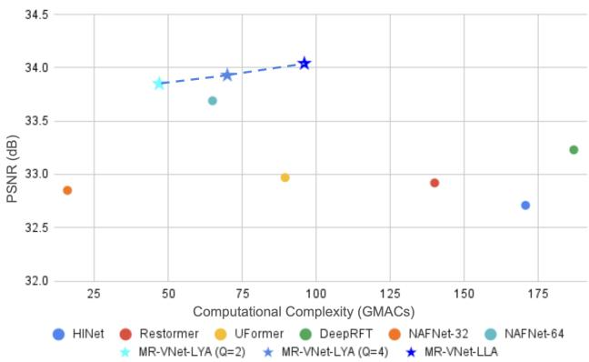
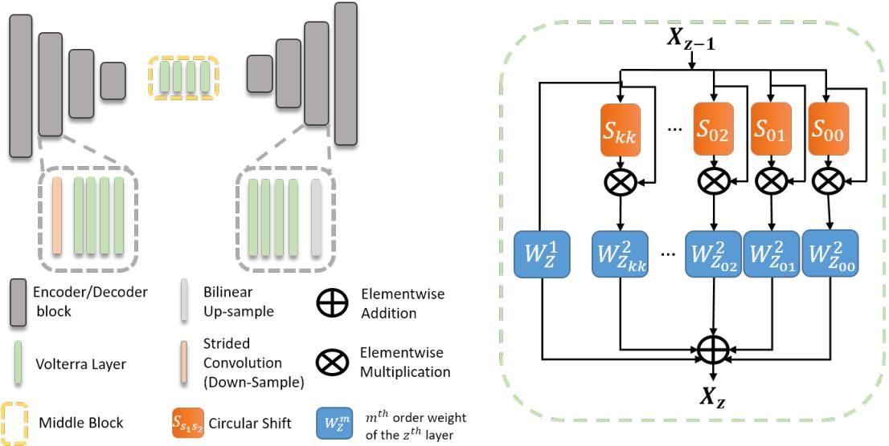
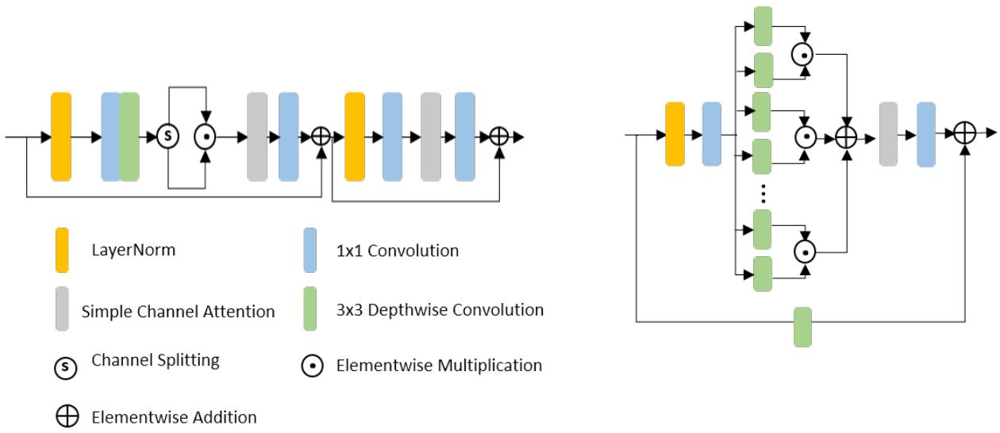
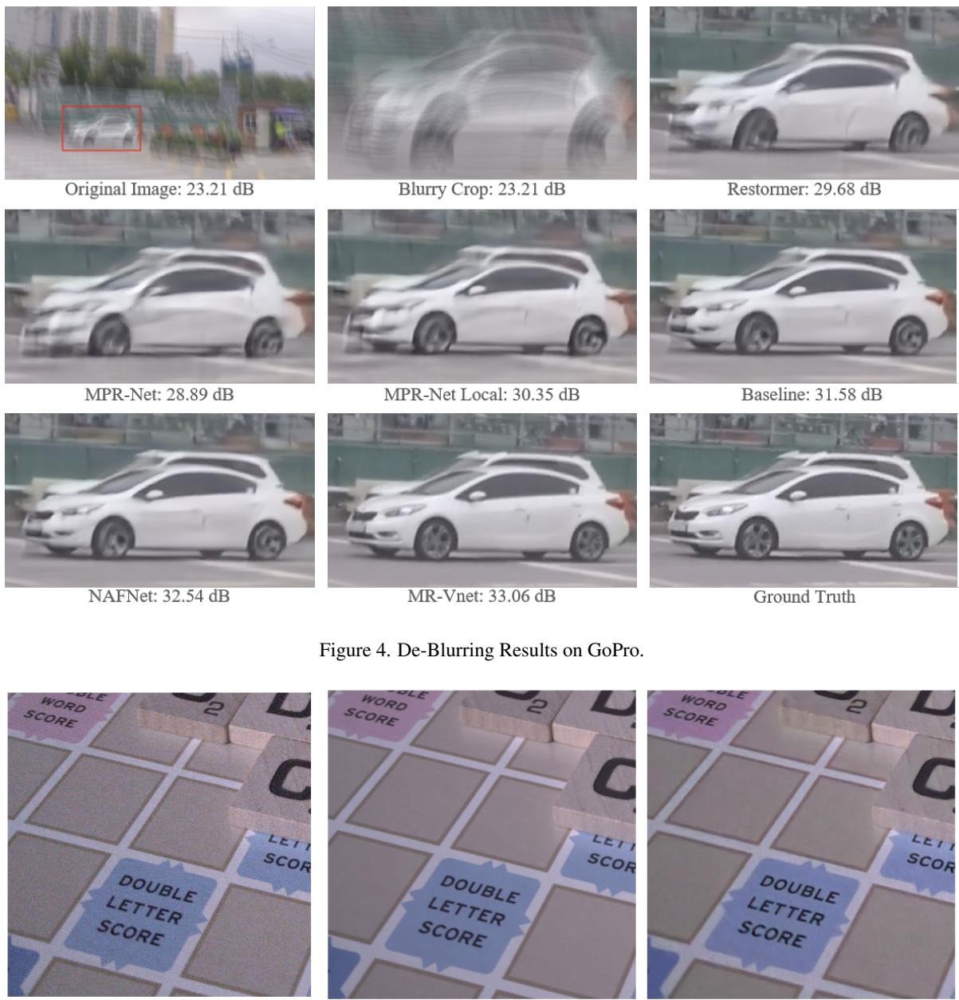

# MR-VNet: Media Restoration using Volterra Networks

Siddharth Roheda, Amit Unde, Loay Rashid

Samsung Research Institute Bengaluru, India

{sid.roheda, amit.unde, loay.rashid}@samsung.com

## Abstract

This research paper presents a novel class ofrestoration network architecture based on the Volterra series formulation. By incorporating non-linearity into the system response function through higher order convolutions instead of traditional activation functions, we introduce a general framework for image/video restoration. Through extensive experimentation, we demonstrate that our proposed architecture achieves state-of-the-art (SOTA) performance in the field of Image/Video Restoration. Moreover, we establish that the recently introduced Non-Linear Activation Free Network (NAF-NET) can be considered a special case within the broader class ofVolterra Neural Networks. These findings highlight the potential ofVolterra Neural Networks as a versatile and powerful tool for addressing complex restoration tasks in computer vision.

## 1. Introduction

In our increasingly visual-oriented world, media such as images and videos play a crucial role in conveying information, expressing emotions, and preserving memories. However, images/videos are susceptible to distortions during the process of capturing (eg. sensor noise, blur, zoom, bad exposure), saving/sharing (eg. compression, down-sampling), and editing (eg. un-natural artefacts). It is crucial to restore such degraded images so as to prevent loss of information and ensure that the best visual quality is delivered to users. This is done through techniques such as image de-noise, de-blur, compression reduction, super-resolution, etc. Recently, Convolutional Neural Networks (CNNs) coupled with ample training data and computational resources has driven remarkable progress in image restoration algorithms [5, 7, 24, 29, 30]. The basic building block in a CNN is a convolutional layer followed by an activation function. The convolution operation provides local connectivity and translational in-variance, while the activation function introduces non-linearity into the network. Following this, Transformer networks that use a more dynamic alternative of selfattention were introduced to resolve some of the shortcomings of CNNs. Namely, instead of relying on convolutional filters that have static weights and cannot adapt to input content, self-attention allows calculation of response at a given pixel by weighted sum of all other positions. The drawback of such methods is that they are extremely heavy and difficult to train. This also makes the analysis and tractability of such networks elusive. More recently, there was an interest shown in activation free networks [4] that are lighter and more powerful than the traditional CNNs. In our work we explore introduction of non-linearity in the network through interaction between the pixels of an image. This is done by performing higher order convolutions to augment linear convolutions. We utilize the well-established Volterra Series [21] to accomplish this task.

  
Figure 1. Comparison of PSNR (dB) and Computational Complexity (GMACs) of the various models on the GoPro Dataset.

Contributions: In this paper we propose a novel architecture tailored for image and video restoration that utilizes the recently proposed Volterra layers [18] to optimally introduce non-linearities in the restoration process. We design a U-Net like architecture integrated with Volterra layers to achieve high quality reconstruction while minimizing computational overhead. Our study demonstrates that using the Volterra formulation with the proposed lossless/lossy approximation results in significantly reduced network complexity and depth compared to traditional CNNs to achieve similar performance levels. We also showcase that the recently proposed Non-linear Activation Free NETworks (NAFNet) [4] are a special case of the Volterra Formulation.

## 2. Related Work

## 2.1. Volterra Filter

The Volterra Filter, as proposed in [21], serves as an approximation for capturing the non-linear relationship between the input at time t, denoted as $x _ { t } .$ , and the corresponding output yt. Mathematically, this relationship is expressed as follows:

$$
\begin{array} { c } { { \displaystyle y _ { t } = \sum _ { \tau _ { 1 } = 0 } ^ { L - 1 } W _ { \tau _ { 1 } } ^ { \mathbf 1 } x _ { t - \tau _ { 1 } } + \sum _ { \tau _ { 1 } , \tau _ { 2 } = 0 } ^ { L - 1 } W _ { \tau _ { 1 } , \tau _ { 2 } } ^ { \mathbf 2 } x _ { t - \tau _ { 1 } } x _ { t - \tau _ { 2 } } } } \\ { { + . . . + \displaystyle \sum _ { \tau _ { 1 } , \tau _ { 2 } , . . . , \tau _ { K } = 0 } ^ { L - 1 } W _ { \tau _ { 1 } , \tau _ { 2 } , . . . , \tau _ { K } } ^ { K } x _ { t - \tau _ { 1 } } x _ { t - \tau _ { 2 } } . . . x _ { t - \tau _ { K } } , } } \end{array}\tag{1}
$$

where L represents the filter memory or filter length, and $W ^ { K }$ is the weight matrix corresponding to the $K ^ { \widecheck { t } h }$ order term. Notably, the computational complexity of this formulation experiences exponential growth with an increase in the desired filter order. Specifically, a $K ^ { t h }$ order filter with length L necessitates solving $L ^ { K }$ equations. It is noteworthy that the first term in the equation corresponds to the linear convolutional layer commonly employed in Convolutional Neural Networks (CNNs).

The distinctive feature of Equation 1 is the incorporation of non-linearities through higher order convolutions, as opposed to the traditional activation function. For instance, the second term in Equation 1 specifically refers to a secondorder convolution.

## 2.2. Volterra Filters in Deep Learning

The potential of Volterra Filters in learning non-linear functions is vast, suggesting their potential utility in enhancing the performance of deep learning models. In the study by [31], the authors introduced a second-order Volterra filter to augment non-linearity, supplementing traditional activation functions. The application of a second-order Volterra Filter was also exemplified in facial recognition tasks [9]. Despite demonstrating the efficacy of Volterra Filters, the exploration was constrained to second-order non-linearities, primarily due to computational complexity limitations.

In another study [18], a cascaded approach to Volterra Filtering was proposed to address the challenge of Video Action Recognition. This approach involved cascading layers of second-order filters, resulting in a filter with significantly higher complexity. The research showcased the proficiency of Volterra Filters in learning non-linear information from data, all the while demanding lower computational resources compared to conventional Convolutional Neural Networks that rely on activation functions for introducing non-linearities.

## 2.3. Image/Video Restoration and Enhancement

Image and video restoration is a crucial task involving the enhancement of images or videos that have suffered degradation during capture or storage, ultimately delivering clean, sharp visuals to enhance user experience. Recent contributions in the literature, as exemplified by [5,11,13,20,29], have leveraged the U-Net architecture [19] and extended its capabilities for performance improvement. However, such extensions often come at the cost of increased model complexity. This escalation in complexity, ranging from the incorporation of multiple U-Net stages to the integration of transformers for image restoration, has resulted in a notable surge in model intricacies for achieving marginal PSNR/SSIM improvements.

In contrast, a Non-Linear Activation Free Network (NAFNet) was introduced in [4], challenging the prevailing notion that high complexities are indispensable. This work argued that a simple baseline network can achieve comparable results. Moreover, empirical evidence from this study demonstrated that non-linear activation functions may be dispensable, substitutable by straightforward elementwise multiplication. This finding aligns with the assertion in [18], where Volterra Filters replaced activation functions for Action Recognition tasks.

On a different front, Video Restoration has garnered increased attention in the research community. Video Restoration tasks present greater complexity than image restoration, given their multi-frame structure and temporal interdependencies among frames. Addressing both spatial and temporal aspects is crucial to ensuring flickerfree restoration and maintaining continuity across video frames. Recent research in Video Restoration, as observed in the use of LSTMs and RNNs [17, 22], emphasizes effective exploitation of temporal information. Alternatively, transformer architectures [10] have been employed to consider frame order and ensure coherence in restored videos. Volterra Filters [21] offer a promising formulation for exploring the temporal dynamics of videos, enabling the generation of non-linear interactions to enhance both spatial and temporal non-linearity.

## 3. Problem Formulation

Consider a collection of degraded images denoted as $X _ { D } = x _ { D } ^ { 1 } , x _ { D } ^ { 2 } , . . . , x _ { D } ^ { N }$ of particular interest. The objective is to devise a restoration function, $G : \mathbb { R } ^ { H \times W \times \bar { C } } $ $\mathbb { R } ^ { H \times W \times C }$ , capable of recovering a set of clean images, $X _ { R } = x _ { R } ^ { 1 } , x _ { R } ^ { \hat { 2 } } , . . . , x _ { R } ^ { N }$ from $X _ { D }$ . This restorative function is structured as a composition of an encoder, a middle block, and a decoder, expressed as follows:

$$
G = \mathcal { F } _ { D } \circ \mathcal { F } _ { M } \circ \mathcal { F } _ { E } .\tag{2}
$$

## 4. Proposed Solution

## 4.1. Volterra Filters for Restoration

In our proposed methodology, we employ the secondorder Volterra formulation to implement a Volterra layer. Specifically, the $z ^ { t h }$ layer of the Volterra Neural Network (VNN) processes the input $X _ { z - 1 }$ as follows:

$$
X _ { z } = V _ { z } ( X _ { z - 1 } ) = \mathbf { \mathcal { F } } _ { z } ^ { 1 } ( X _ { z - 1 } ) + \mathbf { \mathcal { F } } _ { z } ^ { 2 } ( X _ { z - 1 } ) ,\tag{3}
$$

where $\mathcal { F } _ { z } ^ { 1 }$ and $\mathcal { F } _ { z } ^ { 2 }$ represent the first and second-order convolution operations in the $z ^ { t h }$ layer. For video data tasks, a spatio-temporal (3D) version of the Volterra Filter is employed to compute the feature value at location $[ t , m _ { 1 } , m _ { 2 } ]$ , given by Equation 4:

$$
\begin{array} { r l } & { X _ { z } \bigg [ \underset { m _ { 2 } } { \overset { t } { \underbrace { t } } } \bigg ] = V _ { z } \left( X _ { z - 1 } \underset { \left[ m _ { 2 } - p _ { 1 } : m _ { 2 } + p _ { 2 } \right] } { \overset { t } { \underbrace { t - L : t + L } } } \right) } \\ & { \qquad = \underset { \tau _ { 1 } , \sigma _ { 1 1 } , \sigma _ { 2 1 } } { \sum } W _ { \left[ \underset { \sigma _ { 2 1 } } { \overset { \tau _ { 1 } } { \underbrace { \tau _ { 1 } } } } \right] } x \left[ \underset { m _ { 2 } - \sigma _ { 2 1 } } { \overset { t - \tau _ { 1 } } { \underbrace { t - \tau _ { 1 } } } } \right] } \\ & { \qquad + \underset { \tau _ { 1 } , \sigma _ { 1 1 } , \sigma _ { 2 1 } } { \sum } W _ { \left[ \underset { \sigma _ { 2 1 } } { \overset { \tau _ { 1 } } { \underbrace { \tau _ { 1 } } } } \right] } \left[ \underset { \sigma _ { 2 2 } } { \overset { \tau _ { 2 } } { \underbrace { \tau _ { 1 } } } } \right] ^ { T } \left[ \underset { m _ { 2 } - \sigma _ { 2 1 } } { \overset { \tau _ { 1 } } { \underbrace { t - \tau _ { 2 } } } } \right] ^ { X } \left[ \underset { m _ { 2 } - \sigma _ { 2 2 } } { \overset { t - \tau _ { 2 } } { \underbrace { t - \tau _ { 1 } } } } \right] ^ { \tau } , } \end{array}\tag{4}
$$

where $\tau _ { i } ~ \in ~ [ - L , L ] , ~ \sigma _ { 1 j } ~ \in ~ [ - p _ { 1 } , p _ { 1 } ]$ , and $\sigma _ { 2 j } \in$ $[ - p _ { 2 } , p _ { 2 } ]$ represent temporal and spatial translations (horizontal and vertical directions), respectively. Notably, the first term corresponds to the linear convolution utilized in Convolutional Neural Networks (CNNs), while the second term introduces non-linearity in the network instead of relying on a conventional activation function.

For image data, where only spatial translations (2D) are applicable, the feature value at location $[ m _ { 1 } , m _ { 2 } ]$ in feature map $X _ { z }$ is computed using a 2D version of the Volterra Filter, as expressed in Equation 5:

$$
\begin{array} { l } { { \displaystyle { \cal X } _ { z _ { [ m _ { 2 } ] } } = V _ { z } \left( { \cal X } _ { z - 1 } \} _ { [ m _ { 2 } - p _ { 2 } : m _ { 2 } + p _ { 2 } ] } \right) } } \\ { { ~ = \sum _ { \sigma _ { 1 1 } , \sigma _ { 2 1 } } W _ { [ \sigma _ { 2 1 } ] } ^ { 1 } \boldsymbol { x } _ { [ m _ { 2 } - \sigma _ { 2 1 } ] } ^ { \prime } } } \\ { { ~ + \sum _ { \sigma _ { 1 1 } , \sigma _ { 2 1 } } W _ { [ \sigma _ { 2 1 } ] } ^ { 2 } [ \sigma _ { 2 2 } ] ^ { \mathcal { X } } [ \stackrel { m _ { 1 } - \sigma _ { 1 1 } } { \scriptstyle { m _ { 2 } - \sigma _ { 2 1 } } } ] ^ { \mathcal { X } } \left[ { m _ { 1 } - \sigma _ { 1 2 } } \right] } , }  \end{array}\tag{5}
$$

where $\sigma _ { 1 j } \in [ - p _ { 1 } , p _ { 1 } ]$ and $\sigma _ { 2 j } ~ \in ~ [ - p _ { 2 } , p _ { 2 } ]$ represent spatial translations in the horizontal and vertical directions, respectively.

We incorporate these Volterra filter layers in a cascaded fashion, following the simple U-Net architecture. The cascading of the layers as defined in Equations 4 and 5 leads to the approximation of a higher-order Volterra filter.

Proposition 1. [Higher Order Complexity] [18] If Z second-order filters are cascaded, the resulting Volterra Network achieves an effective order of $\mathcal { K } _ { z } = 2 ^ { 2 ^ { \overline { { z } } - 1 } }$

The implementation of a $K ^ { t h }$ order Volterra Filter, as specified in Equation 1, necessitates $\scriptstyle \sum _ { k = 1 } ^ { K } ( L . { \mathcal { P } } _ { 1 } . { \mathcal { P } } _ { 2 } ) ^ { k }$ parameters. Where $\mathcal { P } _ { 1 } = 2 p _ { 1 } + 1 , \mathcal { P } _ { 2 } = 2 \bar { p } _ { 2 } + 1$ and $L = 1$ in case of images. The adoption of cascaded $2 ^ { n d }$ order filters emerges as a more resource-efficient approach for implementing the Volterra formulation, significantly reducing the required parameters [18].

Proposition 2. [VNN Complexity] [18] The complexity of a cascaded $\mathcal { K } _ { z } ^ { t h }$ order Volterra filter is given by:

$$
\sum _ { z = 1 } ^ { z } \left[ ( L _ { z } . \mathcal { P } _ { 1 _ { z } } \mathcal { P } _ { 2 _ { z } } + ( L _ { z } . \mathcal { P } _ { 1 _ { z } } \mathcal { P } _ { 2 _ { z } } ) ^ { 2 } ) \right] .\tag{6}
$$

As previously mentioned, our approach eschews explicit activation functions like ReLU, tanh, etc. The non-linearity is learned as a function of the input data. Proposition 3 highlights that the VNN formulation is proficient in approximating well-known activation functions, implying that VNN offers a generalized activation encompassing ReLU, sigmoid, tanh, etc., as special cases.

Proposition 3. [Generalized Activation] A Volterra Filter, as described in Equation 1, provides an approximation to any continuous function.

Proof. Employing the Taylor expansion, any non-linear function, $\sigma ( . )$ , can be expressed as:

$$
\sigma ( x ) = c ^ { 0 } + c ^ { 1 } x + . . . + c ^ { K } x ^ { K } + . . . c ^ { \infty } x ^ { \infty } .\tag{7}
$$

Specifically, a Sigmoid can be written as:

$$
\sigma _ { s i g m o i d } ( x ) = { \frac { 1 } { 1 + e ^ { x } } } = { \frac { 1 } { 2 } } + { \frac { 1 } { 4 } } x - { \frac { 1 } { 4 8 } } x ^ { 2 } + { \frac { 1 } { 4 8 0 } } x ^ { 5 } . . .\tag{8}
$$

From Equation 1, the Volterra Filter formulation can effectively approximate such an expansion upto a finite order when $L = p _ { 1 } = p _ { 2 } = 1$

$$
\sigma _ { V F } = w ^ { 0 } + w ^ { 1 } x + w ^ { 2 } x ^ { 2 } + \ldots + w ^ { K } x ^ { K } ,\tag{9}
$$

  
Figure 2. High level Block Diagram for implementation of the proposed VNN Image Restoration Model

where $w ^ { k }$ is learned during the training process, rendering it a more generalized activation function capable of learning data-dependent non-linearities. When $w ^ { k }$ in Equation 9 is assigned the values corresponding to the Taylor expansion coefficients of a specific activation function (such as the sigmoid in Equation 8), it assumes the role of a predefined activation function, representing a special case within the broader framework.

## 4.2. Realization of Higher Order Convolutions

## 4.2.1 Lossless Approximation

We will now elaborate on the implementation of the higherorder kernels outlined in Equation 3. The Volterra Formulation from Equation 3 can be expressed as follows:

$$
X _ { z } = W _ { z } ^ { 1 } \star X _ { z - 1 } + \sum _ { s _ { 1 } , s _ { 2 } } W _ { z _ { s _ { 1 } , s _ { 2 } } } ^ { 2 } \star X _ { z - 1 } . S _ { s _ { 1 } , s _ { 2 } } ( X _ { z - 1 } ) ,\tag{10}
$$

Here, $s _ { 1 }$ and $s _ { 2 }$ denote spatial shifts in the input feature map $X _ { z - 1 } ,$ and $\boldsymbol { S } _ { s _ { 1 } , s _ { 2 } }$ represents the feature map circularly shifted along its rows and columns by $s _ { 1 }$ and $s _ { 2 }$ respectively. The formulation described in Equation 10 enables the parallel implementation of second order Volterra kernel using 2D convolutions as part of PyTorch [16] or Tensorflow [1].

Consider the scenario where $\mathcal { P } _ { 1 } = \mathcal { P } _ { 2 } = \mathcal { P }$ . To implement the second term in Equation 10, $\mathcal { P } ^ { 2 }$ convolutions would be required. To mitigate redundancy and model complexity, we discard the symmetric terms, resulting in ${ } ^ { \mathcal { P } } C _ { 2 } <$ $\mathcal { P } ^ { 2 }$ convolutions. This approach reduces the model’s complexity by eliminating redundant information, thus serving as a lossless approximation of the exact kernel. In the subsequent section, we delve into a lossy approximation for the second-order Volterra kernel.

## 4.2.2 Lossy Approximation

Implementing higher-order convolution can incur significant costs despite the lossless optimization techniques discussed in Section 4.2.1. To address this, we employ the concept of separable kernels to approximate the second-order convolution. In the 2D case, the second-order filter is realized as follows:

$$
W _ { \mathcal { P } _ { 1 } \times \mathcal { P } _ { 2 } \times \mathcal { P } _ { 1 } \times \mathcal { P } _ { 2 } } ^ { 2 } = \sum _ { q = 1 } ^ { Q } W _ { a q _ { \mathcal { P } _ { 1 } \times \mathcal { P } _ { 2 } \times 1 } } ^ { 2 } W _ { b q _ { 1 } \times \mathcal { P } _ { 1 } \times \mathcal { P } _ { 2 } } ^ { 2 } ,\tag{11}
$$

where Q is the desired rank of approximation, $\mathcal { P } _ { 1 } ~ =$ $2 p _ { 1 } + 1$ and $\mathcal { P } _ { 2 } = 2 p _ { 2 } + 1$ . A similar separable kernel approach was explored in [3]. However, authors of [3] only considered a $1 ^ { s t }$ rank $( Q = 1 )$ approximation, leading to sub-optimal performance as detailed in Tables 5 and 6.

With this approximation, the Volterra Net Block can be implemented as follows:

$$
W _ { z } ^ { 1 } \star X _ { z - 1 } + \sum _ { q = 1 } ^ { Q } W _ { a q } ^ { 2 } \star X _ { z - 1 } . W _ { b q } ^ { 2 } \star X _ { z - 1 } .\tag{12}
$$

This reduces the complexity of network as $\begin{array} { r } { \sum _ { z = 1 } ^ { Z } \left[ ( L _ { z } . \mathcal { P } _ { 1 _ { z } } . \mathcal { P } _ { 2 _ { z } } ) ~ + ~ 2 Q \dot { ( L _ { z } . \mathcal { P } _ { 1 _ { z } } . \mathcal { P } _ { 2 _ { z } } ) } \right] } \end{array}$ which is significantly lower than Equation 6.

  
Figure 3. NAFNet Block on the left, MR-VNN block (lossy approximation) on the right

Proposition 4. [Second Order Approximation] The lossy approximation in Equation 11 is a $\bar { Q } ^ { t h }$ rank approximation of the exact quadratic kernel.

Proof. Let’s examine a 1-D Volterra Filter with length $L .$ The quadratic weight matrix, $W ^ { 2 }$ , in such a case has dimension $L \times L$ , and Equation 11 becomes:

$$
\boldsymbol { W } _ { L \times L } ^ { 2 ( Q ) } = \sum _ { q = 1 } ^ { Q } \boldsymbol { W } _ { a _ { q L \times 1 } } ^ { 2 } \boldsymbol { W } _ { b _ { q 1 \times L } } ^ { 2 } .\tag{13}
$$

Singular Value Decomposition of $W ^ { 2 }$ leads to:

$$
\mathbf { } W ^ { 2 } = U \Sigma V ^ { T } ,\tag{14}
$$

where U and V are $L \times L$ matrices, and Σ is a diagonal matrix with singular values of $W ^ { 2 }$ . Consequently, Equation 14 becomes:

$$
W ^ { 2 } = \sum _ { q = 1 } ^ { L } u _ { q } \sigma _ { q } v _ { q } ^ { T } ,\tag{15}
$$

where the $q ^ { t h }$ basis of $U$ and $V$ are represented by $u _ { q }$ and $v _ { q }$ respectively, and $\sigma _ { q }$ is the $q ^ { t h }$ singular value of $W ^ { 2 }$ $\mathbf { A } Q ^ { t { \hat { h } } }$ rank approximation is then given as:

$$
\begin{array} { l } { { W ^ { 2 } ( Q ) = \displaystyle \sum _ { q = 1 } ^ { Q } u _ { q } \sigma _ { q } v _ { q } ^ { T } } } \\ { { \ ~ = \displaystyle \sum _ { q = 1 } ^ { Q } \hat { u } _ { q } v _ { q } , } } \end{array}\tag{16}
$$

(17)

where $\hat { u } _ { q } = u _ { q } . \sigma _ { q } . \mathrm { ~ I f ~ } W _ { a q } ^ { 2 } = \hat { u } _ { q } \mathrm { ~ a n d ~ } W _ { b q } ^ { 2 } = v _ { q } ^ { T } ,$

$$
W ^ { 2 ( Q ) } = \sum _ { q = 1 } ^ { Q } W _ { a q } ^ { 2 } W _ { b q } ^ { 2 } .\tag{18}
$$

This proves that the approximation detailed in Equation 11 is indeed a $Q ^ { t h }$ rank approximation of the exact quadratic kernel, $W ^ { 2 }$

Proposition 5. [Special Case of NAFNet] The Non-Linear Activation Free Net (NAFNet) is a special case of Volterra Neural Networks, characterized by $W _ { z } ^ { 1 } = \beta . I$ and $Q = 1$

Proof. Consider the tensor $X _ { z - 1 _ { W \times H \times C } }$ to be the input to the $z ^ { t h }$ NAF-Block. The NAF-Block processes the input by convolving it with a kernel, $W _ { z _ { N A F } } ,$ , yielding the intermediate output, $L _ { z _ { W \times H \times 2 C } } = W _ { z _ { N A F } } \star X _ { z - 1 }$ . Subsequently, $L _ { z }$ is split into $L _ { z a w \times H \times C }$ and $L _ { z b _ { W } \times H \times C } ;$ , which are multiplied to produce the simple gate output, $M _ { z } \ =$ $L _ { z a } . L _ { z b }$ . Finally, the NAF-Block output is obtained as $X _ { z } = M _ { z } + \beta X _ { z - 1 }$ , where $\beta$ is a scaling factor. As $W _ { z _ { N A F } }$ is a depthwise convolution with groups $= 2 c ,$ it can be expressed as the product of separable convolutions:

$$
W _ { z _ { N A F } } = W _ { z a _ { N A F } } . W _ { z b _ { N A F } } ,\tag{19}
$$

Consequently, $M _ { z }$ is computed as,

$$
\begin{array} { c } { { M _ { z } = W _ { z a _ { N A F } } \star X _ { z - 1 } . W _ { z b _ { N A F } } \star X _ { z - 1 } } } \\ { { \ldots } } \\ { { = L _ { z a } . L _ { z b } . } } \end{array}\tag{20}
$$

Setting $Q = 1$ in Equation 11 yields the expression in Equation 20, demonstrating that the simple gate used in NAFNet Blocks is a $1 ^ { s t }$ rank approximation of the quadratic Volterra kernel.

<table><tr><td>Method MIMO-</td><td>UNet [7]</td><td>HINet [5]</td><td>MAXIM [20]</td><td>Restormer [27]</td><td>UFormer [23]</td><td>Deep- RFT [13]</td><td>MPR- Net [8]</td><td>NAF- Net [4]</td><td>MR-VNet- LYA (Q=2)</td><td>MR-VNet- LYA (Q=4)</td><td>MR- VNet- LLA</td></tr><tr><td>PSNR</td><td>32.68</td><td>32.71</td><td>32.86</td><td>32.92</td><td>32.97</td><td>33.23</td><td>33.31</td><td>33.69</td><td>33.85</td><td>33.93</td><td>34.04</td></tr><tr><td>SSIM</td><td>0.959</td><td>0.959</td><td>0.961</td><td>0.961</td><td>0.967</td><td>0.963</td><td>0.964</td><td>0.967</td><td>0.967</td><td>0.967</td><td>0.969</td></tr><tr><td>GMACs</td><td>1235</td><td>170.7</td><td>169.5</td><td>140</td><td>89.5</td><td>187</td><td>778.2</td><td>65</td><td>47</td><td>70</td><td>96</td></tr></table>

Table 1. De-Blurring Performance on GoPro Dataset. Best results are bold, second best are underlined.
<table><tr><td>Method MPR-</td><td>Net [8]</td><td>MIR- Net [28]</td><td>NBNet [6]</td><td>UFormer [23]</td><td>MAXIM [20]</td><td>HINet [5]</td><td>Restormer [27]</td><td>NAF- Net [4]</td><td>MR-VNet- LYA (Q=2)</td><td>MR-VNet- LYA (Q=4)</td><td>MR- VNet- LLA</td></tr><tr><td>PSNR</td><td>39.71</td><td>39.72</td><td>39.75</td><td>39.89</td><td>39.96</td><td>39.99</td><td>40.02</td><td>40.30</td><td>40.39</td><td>40.43</td><td>40.58</td></tr><tr><td>SSIM</td><td>0.958</td><td>0.959</td><td>0.959</td><td>0.960</td><td>0.960</td><td>0.958</td><td>0.960</td><td>0.962</td><td>0.962</td><td>0.963</td><td>0.963</td></tr><tr><td>GMACs</td><td>588</td><td>786</td><td>88.8</td><td>89.5</td><td>169.5</td><td>170.7</td><td>140</td><td>65</td><td>47</td><td>70</td><td>96</td></tr></table>

Table 2. De-Noising Performance on SIDD Dataset. Best results are bold, second best are underlined.

Furthermore, a residual is added to the simple gate output to obtain the final output, which can be written as $X _ { z } = M _ { z } + \beta . I \star X _ { z - 1 }$ . Consequently, the NAF-Block emerges as a special case of the Volterra Networks with $W _ { z } ^ { 1 } = \beta . I$ and $Q = 1$

The comparison of a NAFNet Block and a MR-VNet (Lossy Approximation) Block is depicted in Figure 3

## 4.3. Model Architecture

We design a U-Net inspired architecture for approximating the Encoder-Decoder functions. The input image undergoes initial processing through the Encoder function, $\mathcal { F } _ { E }$ $\mathbb { R } ^ { W \times H \times C } \stackrel { \bullet } { \to } \mathbb { R } ^ { w \times h \times c }$ , comprising 4 encoder blocks. Each encoder block consists of 4 Volterra Layers, implemented as described by Equation 5 utilizing the Lossless and Lossy approximations from Sections 4.2.1 and 4.2.2. Strided convolutions are employed in consecutive Encoder blocks to reduce resolution, resulting in a latent space configuration of $h = H / 8$ and $w = W / 8$ . The middle block in the latent space, $\mathcal { F } _ { M } : \mathbb { R } ^ { h \times w \times c }  \mathbb { R } ^ { h \times w \times c }$ , is implemented using a single Volterra Layer. Finally, the decoder function, $\mathcal { F } _ { D } : \overline { { \mathbb { R } ^ { h \times w \times c } } } \to \mathbb { R } ^ { \bar { H } \times W \times C }$ , transforms the encoded features back into the image space. The Decoder, symmetric in design to the Encoder with 4 blocks, has only 1 Volterra Layer per block. Each encoder block is connected to its corresponding decoder block via a residual connection. For video restoration problems, the same architecture is retained, but 3D Volterra Filters are used instead of 2D, as detailed in Equation 4. The entire architectural arrangement is illustrated in Figure 2.

## 5. Experiments

To assess the efficacy of the proposed Volterra Restoration Network, we conduct experiments targeting prevalent degradations in images and videos:

• Motion-Blur: This degradation, arising from camera or subject motion, is addressed by training and testing the restoration network on the GoPro [14] and Reds [15] datasets for image deblurring.

• Camera Sensor Noise: We aim to mitigate noise introduced by the camera sensor during image/video capture. Evaluation is performed using the SIDD [2] and CRVD [25] datasets.

We present two iterations of our proposed Volterra Layer-based architecture: MR-VNet-LYA, employing the Lossy approximation discussed in Section 4.2.2, and MR-VNet-LLA, incorporating the proposed Lossless approximation. Subsequently, we subject our method to a comprehensive evaluation against state-of-the-art (SOTA) algorithms in the domains of Image and Video Restoration. Evaluation metrics such as Peak Signal to Noise Ratio (PSNR) and Structural Similarity Index Measure (SSIM) are employed for a thorough assessment. Additionally, we conduct a detailed comparative analysis of the computational complexities associated with the proposed methods, quantified in terms of Giga Multiply-Add Computations (GMACs).

The efficacy of our proposed method is substantiated through comparisons with various SOTA techniques prevalent in the literature. A detailed quantitative assessment for De-Blurring is presented in Tables 1 and 3, utilizing the Go-Pro and REDS datasets, respectively. The results underscore the superior performance of our proposed model, outperforming existing SOTA methods in terms of both PSNR and SSIM metrics.

In the realm of image denoising, our proposed method outperforms alternative approaches, as evidenced by the quantitative results presented in Table 2 on the SIDD dataset. Notably, our technique demonstrates superior denoising efficacy, as reflected in higher Peak Signal to Noise Ratio (PSNR) and Structural Similarity Index Measure (SSIM) scores compared to competing methods.

  
Figure 5. De-Noising Results on SIDD. Left to Right: Noisy Image, NAFNet, MR-VNet (Ours)

<table><tr><td>Method</td><td>PSNR</td><td>SSIM</td><td>GMACs</td></tr><tr><td>MPRNet [8]</td><td>28.79</td><td>0.811</td><td>776.7</td></tr><tr><td>HiNet [5]</td><td>28.83</td><td>0.862</td><td>170.7</td></tr><tr><td>MAXIM [20]</td><td>28.93</td><td>0.865</td><td>169.5</td></tr><tr><td>NAFNet [4]</td><td>29.09</td><td>0.867</td><td>65</td></tr><tr><td>MR-VNet-LYA (Q=4)</td><td>29.79</td><td>0.868</td><td>70</td></tr><tr><td>MR-VNet-LLA</td><td>29.92</td><td>0.869</td><td>96</td></tr></table>

Table 3. De-Blurring Performance on REDS Dataset

Furthermore, our exploration extends to the challenging domain of video denoising, detailed in Table 4. In this scenario, we utilize 3D convolution as detailed in Equation 4 and exclusively assess the performance of our Lossy approximation due to its practical efficiency compared to the computationally demanding exact kernel. Our results underscore the effectiveness of the proposed method in achieving superior denoising outcomes in video data, showcasing its competitive edge over existing methodologies.

<table><tr><td>Method</td><td>PSNR</td><td>SSIM</td><td>GMACs</td></tr><tr><td>EMVD-L [12]</td><td>41.00</td><td>0.983</td><td>2543</td></tr><tr><td>RVIDEFormer [26]</td><td>41.29</td><td>0.984</td><td>287</td></tr><tr><td>LLVD-L [17]</td><td>41.41</td><td>0.984</td><td>117</td></tr><tr><td>MR-VNet-LYA</td><td>41.93</td><td>0.985</td><td>163</td></tr></table>

Table 4. De-Noising Performance on CRVD Dataset. Best performance is bold, second best is underlined.
<table><tr><td>Kernel Rank</td><td>PSNR</td><td>SSIM</td><td>GMACs</td></tr><tr><td>Q=1 (Special case of NAFNet)</td><td>33.50</td><td>0.965</td><td>36</td></tr><tr><td>Q=2</td><td>33.85</td><td>0.966</td><td>47</td></tr><tr><td>Q=4</td><td>33.93</td><td>0.967</td><td>70</td></tr><tr><td>Q=8</td><td>33.97</td><td>0.967</td><td>115</td></tr></table>

Table 5. Effect of the rank of $2 ^ { n d }$ order Kernel for GoPro
<table><tr><td>Kernel Rank</td><td>PSNR</td><td>SSIM</td><td>GMACs</td></tr><tr><td>Q=1 (Special case of NAFNet)</td><td>40.21</td><td>0.962</td><td>36</td></tr><tr><td>Q=2</td><td>40.39</td><td>0.963</td><td>47</td></tr><tr><td>Q=4</td><td>40.43</td><td>0.963</td><td>70</td></tr><tr><td>Q=8</td><td>40.46</td><td>0.964</td><td>115</td></tr></table>

Table 6. Effect of the rank of $2 ^ { n d }$ order Kernel for SIDD

These compelling quantitative results affirm the efficacy of our proposed method in addressing both image and video denoising challenges, positioning it as a robust and advanced solution in comparison to contemporary approaches.

## 5.1. Ablation Study

In our comprehensive ablation study, we rigorously analyze the individual contributions of various components within the proposed architecture.

We first investigate the impact of selecting the rank of the kernel in the context of lossy approximation, as demonstrated on the GoPro and SIDD datasets, as detailed in Tables 5 and 6. Notably, when the kernel is constrained to rank 1, it aligns with the specific case observed in NAFNet. As we escalate the rank, the approximation becomes progressively accurate, converging towards the precision of the exact kernel. However, this refinement comes at the expense of heightened complexity.

In Table 7, we demonstrate the impact of width of the architecture in terms of channels while keeping the quadratic filter rank constant.

In Table 8, we present the impact of incorporating activation functions alongside the ${ \bar { \mathbf { \theta } } } _ { 2 ^ { n d } }$ order kernel. Our observations indicate that, while ReLU and Sigmoid activation confer a marginal improvement in the case of NAFNet $( 1 ^ { s t }$ Rank approximation), the same effect is not discernible when employing a higher rank approximation of the Volterra Filter. This suggests that the $1 ^ { s t }$ Rank kernel utilized in NAFNet is insufficient to closely approximate the exact quadratic kernel. Consequently, the activation function introduces some non-linearity to the model, resulting in improved performance. However, with a closer approximation in the form of a higher rank kernel, none of the activation functions appear to contribute additional non-linearity beyond what the model has already learned.

<table><tr><td>Width</td><td>PSNR</td><td>SSIM</td><td>GMACs</td></tr><tr><td>16</td><td>32.80</td><td>0.961</td><td>8</td></tr><tr><td>24</td><td>32.92</td><td>0.963</td><td>18</td></tr><tr><td>32</td><td>33.18</td><td>0.966</td><td>32</td></tr><tr><td>48</td><td>33.93</td><td>0.967</td><td>70</td></tr></table>

Table 7. Effect of width of the architecture when Q=4 (GoPro Dataset)

<table><tr><td>Activation</td><td>NAFNet</td><td>MR-VNet</td></tr><tr><td>Identity</td><td>39.96</td><td>40.43</td></tr><tr><td>ReLU</td><td>39.98</td><td>40.40</td></tr><tr><td>GELU</td><td>39.97</td><td>40.39</td></tr><tr><td>Sigmoid</td><td>39.99</td><td>40.40</td></tr><tr><td>SiLU</td><td>39.96</td><td>40.39</td></tr></table>

Table 8. Impact of using activation functions. The performance is evaluated in terms of PSNR on the SIDD Dataset

## 6. Conclusion

In conclusion, our research introduces the Media Restoration-Volterra Network (MR-VNet) as a novel approach to image and video restoration. Leveraging higherorder Volterra filters, the proposed architecture demonstrates promising capabilities in addressing common image and video degradations, such as motion blur and camera sensor noise. Through the development of two architectural variants, VNN-LYA and VNN-LLA, employing lossy and lossless approximations, respectively, we offer a comprehensive exploration of the network’s performance.

Our experimental evaluations, conducted on diverse datasets including GoPro, Reds, SIDD, and CRVD, showcase the effectiveness of MR-VNet in comparison to stateof-the-art algorithms. Notably, MR-VNet exhibits competitive results in terms of Peak Signal to Noise Ratio (PSNR) and Structural Similarity Index Measure (SSIM). Furthermore, we analyze the impact of activation functions on the network’s performance, revealing insights into their efficacy in conjunction with higher-order Volterra filters.

## References

[1] Mart´ın Abadi, Ashish Agarwal, Paul Barham, Eugene Brevdo, Zhifeng Chen, Craig Citro, Greg S Corrado, Andy Davis, Jeffrey Dean, Matthieu Devin, et al. Tensorflow: Large-scale machine learning on heterogeneous distributed systems. arXiv preprint arXiv:1603.04467, 2016. 4

[2] Abdelrahman Abdelhamed, Stephen Lin, and Michael S Brown. A high-quality denoising dataset for smartphone cameras. In Proceedings of the IEEE conference on computer vision and pattern recognition, pages 1692–1700, 2018. 6

[3] Monami Banerjee, Rudrasis Chakraborty, Jose Bouza, and Baba C Vemuri. Volterranet: A higher order convolutional network with group equivariance for homogeneous manifolds. IEEE Transactions on Pattern Analysis and Machine Intelligence, 44(2):823–833, 2020. 4

[4] Liangyu Chen, Xiaojie Chu, Xiangyu Zhang, and Jian Sun. Simple baselines for image restoration. In European Conference on Computer Vision, pages 17–33. Springer, 2022. 1, 2, 6, 7

[5] Liangyu Chen, Xin Lu, Jie Zhang, Xiaojie Chu, and Chengpeng Chen. Hinet: Half instance normalization network for image restoration. In Proceedings of the IEEE/CVF Conference on Computer Vision and Pattern Recognition, pages 182–192, 2021. 1, 2, 6, 7

[6] Shen Cheng, Yuzhi Wang, Haibin Huang, Donghao Liu, Haoqiang Fan, and Shuaicheng Liu. Nbnet: Noise basis learning for image denoising with subspace projection. In Proceedings of the IEEE/CVF conference on computer vision and pattern recognition, pages 4896–4906, 2021. 6

[7] Sung-Jin Cho, Seo-Won Ji, Jun-Pyo Hong, Seung-Won Jung, and Sung-Jea Ko. Rethinking coarse-to-fine approach in single image deblurring. In Proceedings ofthe IEEE/CVF international conference on computer vision, pages 4641–4650, 2021. 1, 6

[8] Xiaojie Chu, Liangyu Chen, Chengpeng Chen, and Xin Lu. Improving image restoration by revisiting global information aggregation. In European Conference on Computer Vision, pages 53–71. Springer, 2022. 6, 7

[9] Ritwik Kumar, Arunava Banerjee, Baba C Vemuri, and Hanspeter Pfister. Trainable convolution filters and their application to face recognition. IEEE transactions on pattern analysis and machine intelligence, 34(7):1423–1436, 2011. 2

[10] Jingyun Liang, Jiezhang Cao, Yuchen Fan, Kai Zhang, Rakesh Ranjan, Yawei Li, Radu Timofte, and Luc Van Gool. Vrt: A video restoration transformer. arXiv preprint arXiv:2201.12288, 2022. 2

[11] Jingyun Liang, Jiezhang Cao, Guolei Sun, Kai Zhang, Luc Van Gool, and Radu Timofte. Swinir: Image restoration using swin transformer. In Proceedings of the IEEE/CVF international conference on computer vision, pages 1833–1844, 2021. 2

[12] Matteo Maggioni, Yibin Huang, Cheng Li, Shuai Xiao, Zhongqian Fu, and Fenglong Song. Efficient multi-stage video denoising with recurrent spatio-temporal fusion. In

Proceedings of the IEEE/CVF Conference on Computer Vision and Pattern Recognition, pages 3466–3475, 2021. 8

[13] Xintian Mao, Yiming Liu, Fengze Liu, Qingli Li, Wei Shen, and Yan Wang. Intriguing findings of frequency selection for image deblurring. In Proceedings of the AAAI Conference on Artificial Intelligence, volume 37, pages 1905–1913, 2023. 2, 6

[14] Seungjun Nah, Tae Hyun Kim, and Kyoung Mu Lee. Deep multi-scale convolutional neural network for dynamic scene deblurring. In Proceedings of the IEEE conference on computer vision and pattern recognition, pages 3883–3891, 2017. 6

[15] Seungjun Nah, Sanghyun Son, Suyoung Lee, Radu Timofte, and Kyoung Mu Lee. Ntire 2021 challenge on image deblurring. In Proceedings of the IEEE/CVF Conference on Computer Vision and Pattern Recognition, pages 149–165, 2021. 6

[16] Adam Paszke, Sam Gross, Francisco Massa, Adam Lerer, James Bradbury, Gregory Chanan, Trevor Killeen, Zeming Lin, Natalia Gimelshein, Luca Antiga, et al. Pytorch: An imperative style, high-performance deep learning library. Advances in neural information processing systems, 32, 2019. 4

[17] Loay Rashid, Siddharth Roheda, and Amit Unde. Llvd: Lstm-based explicit motion modeling in latent space for video denoising. 2, 8

[18] Siddharth Roheda and Hamid Krim. Conquering the cnn over-parameterization dilemma: A volterra filtering approach for action recognition. In Proceedings of the AAAI Conference on Artificial Intelligence, volume 34, pages 11948–11956, 2020. 1, 2, 3

[19] Olaf Ronneberger, Philipp Fischer, and Thomas Brox. Unet: Convolutional networks for biomedical image segmentation. In Medical Image Computing and Computer-Assisted Intervention–MICCAI 2015: 18th International Conference, Munich, Germany, October 5-9, 2015, Proceedings, Part III 18, pages 234–241. Springer, 2015. 2

[20] Zhengzhong Tu, Hossein Talebi, Han Zhang, Feng Yang, Peyman Milanfar, Alan Bovik, and Yinxiao Li. Maxim: Multi-axis mlp for image processing. In Proceedings of the IEEE/CVF Conference on Computer Vision and Pattern Recognition, pages 5769–5780, 2022. 2, 6, 7

[21] Vito Volterra. Theory of functionals and of integral and integro-differential equations. (No Title), 1959. 1, 2

[22] Wei Wang, Xin Chen, Cheng Yang, Xiang Li, Xuemei Hu, and Tao Yue. Enhancing low light videos by exploring high sensitivity camera noise. In Proceedings of the IEEE/CVF International Conference on Computer Vision, pages 4111– 4119, 2019. 2

[23] Zhendong Wang, Xiaodong Cun, Jianmin Bao, Wengang Zhou, Jianzhuang Liu, and Houqiang Li. Uformer: A general u-shaped transformer for image restoration. In Proceedings ofthe IEEE/CVF conference on computer vision and pattern recognition, pages 17683–17693, 2022. 6

[24] Qingyang Xu, Chengjin Zhang, and Li Zhang. Denoising convolutional neural network. In 2015 IEEE International Conference on Information and Automation, pages 1184– 1187. IEEE, 2015. 1

[25] Huanjing Yue, Cong Cao, Lei Liao, Ronghe Chu, and Jingyu Yang. Supervised raw video denoising with a benchmark dataset on dynamic scenes. In Proceedings ofthe IEEE/CVF conference on computer vision and pattern recognition, pages 2301–2310, 2020. 6

[26] Huanjing Yue, Cong Cao, Lei Liao, and Jingyu Yang. Rvideformer: Efficient raw video denoising transformer with a larger benchmark dataset. arXiv preprint arXiv:2305.00767, 2023. 8

[27] Syed Waqas Zamir, Aditya Arora, Salman Khan, Munawar Hayat, Fahad Shahbaz Khan, and Ming-Hsuan Yang. Restormer: Efficient transformer for high-resolution image restoration. In Proceedings of the IEEE/CVF conference on computer vision and pattern recognition, pages 5728–5739, 2022. 6

[28] Syed Waqas Zamir, Aditya Arora, Salman Khan, Munawar Hayat, Fahad Shahbaz Khan, Ming-Hsuan Yang, and Ling Shao. Learning enriched features for real image restoration and enhancement. In Computer Vision–ECCV 2020: 16th European Conference, Glasgow, UK, August 23–28, 2020, Proceedings, Part XXV 16, pages 492–511. Springer, 2020. 6

[29] Syed Waqas Zamir, Aditya Arora, Salman Khan, Munawar Hayat, Fahad Shahbaz Khan, Ming-Hsuan Yang, and Ling Shao. Multi-stage progressive image restoration. In Proceedings of the IEEE/CVF conference on computer vision and pattern recognition, pages 14821–14831, 2021. 1, 2

[30] Kai Zhang, Wangmeng Zuo, Shuhang Gu, and Lei Zhang. Learning deep cnn denoiser prior for image restoration. In Proceedings ofthe IEEE conference on computer vision and pattern recognition, pages 3929–3938, 2017. 1

[31] Georgios Zoumpourlis, Alexandros Doumanoglou, Nicholas Vretos, and Petros Daras. Non-linear convolution filters for cnn-based learning. In Proceedings of the IEEE international conference on computer vision, pages 4761–4769, 2017. 2