# Make Pixels Dance: High-Dynamic Video Generation

Yan Zeng∗ Guoqiang Wei∗ Jiani Zheng Jiaxin Zou Yang Wei Yuchen Zhang Hang Li

ByteDance Research

∗ Equal Contribution

{zengyan.yanne, weiguoqiang.9, lihang.lh}@bytedance.com https://makepixelsdance.github.io

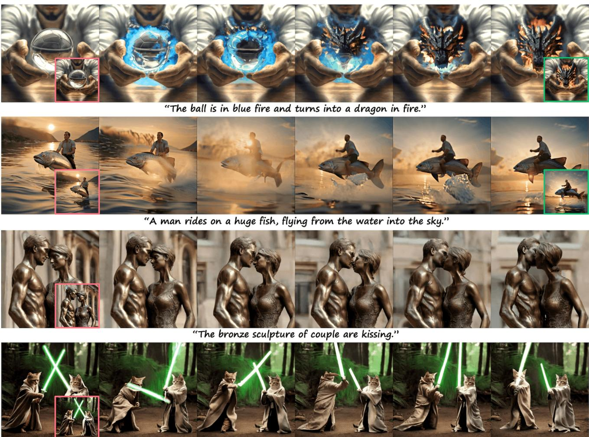  
"Two jedi cats are fighting with each other in the forest."

Figure 1. Generation results of PixelDance given text, first frame instruction highlighted in red box (and last frame instruction in green).   
Six frames sampled from a 16-frame clip are displayed. Human faces presented in this paper are synthesized using text-to-image models.

## Abstract

Creating high-dynamic videos such as motion-rich actions and sophisticated visual effects poses a significant challenge in the field of artificial intelligence. Unfortunately, current state-of-the-art video generation methods, primarily focusing on text-to-video generation, tend to produce video clips with minimal motions despite maintaining high fidelity. We argue that relying solely on text instructions is insufficient and suboptimal for video generation. In this paper, we introduce PixelDance, a novel approach based on diffusion models that incorporates image instructionsfor both thefirst and lastframes in conjunction with text instructions for video generation. Comprehensive experimental results demonstrate that PixelDance trained with public data exhibits significantly better proficiency in synthesizing videos with complex scenes and intricate motions, setting a new standard for video generation.

## 1. Introduction

Generating high-dynamic videos with motion-rich actions, sophisticated visual effects, or complex camera movements, has been a long-standing and formidable challenge in the field of artificial intelligence. Unfortunately, most existing video generation approaches focusing on text-to-video (T2V) generation [5, 11, 23, 58] are still limited to synthesize simple scenes, and often falling short in terms of visual details and dynamic motions. Recent state-of-the-art models have significantly enhanced T2V quality by incorporating an image input [12, 25, 31, 46], which provides finer visual details for video generation. Despite the advancements, the generated videos frequently exhibit limited motions as shown in Figure 2. This issue becomes particularly severe when the input images depict out-of-domain content unseen in training data, posing a key limitation of current methods.

To generate high-dynamic videos, we propose a novel video generation approach that incorporates image instructionsfor both thefirst and lastframes ofa video clip, in addition to text instruction. The image instruction for the first frame depicts the major scene of the video clip. The image instruction for the last frame, which is optionally used in training and inference, delineates the ending of the clip and provides additional control for generation. Image instructions enable the model to construct intricate scenes and actions. Moreover, our approach can create longer videos, where the model is applied multiple times and the last frame of the preceding clip serves as the first frame instruction for the subsequent clip.

The image instructions are more direct and accessible compared to text instructions. We use ground-truth video frames as the instructions for training. In contrast, recent work has proposed the use of highly descriptive text annotations [4] to better follow text instructions. Providing detailed textual annotations to precisely describe both the frames and the motions of videos is not only costly to collect but also difficult to learn for the model. To understand and follow complex text instructions, the model may need to significantly scale up. The image instructions overcome these challenges together with text instructions. Given the three instructions in training, the model focuses on learning the dynamics of video content, and better generalizes the learned dynamics knowledge to out-of-domain instructions in inference.

Specifically, we present PixelDance, a latent diffusion model based approach to video generation, conditioned on <text,first frame,last frame> instructions. The text instruction is encoded by a pre-trained text encoder and is integrated into the diffusion model via crossattention. The image instructions are encoded with a pretrained VAE encoder [35] and concatenated with either perturbed video latents or Gaussian noise as the input to the diffusion model. In training, we use the ground-truth first frame to enforce the model to strictly adhere to the instruction, maintaining continuity between consecutive video clips. In inference, this instruction can be conveniently obtained with T2I models [35] or provided by users.

Our approach is unique in the way of using the last frame instruction. We intentionally avoid encouraging the model to replicate the last frame instruction exactly since it is challenging to provide a perfect last frame in inference, and the model should accommodate user-provided coarse drafts for guidance. Such kind of instruction can be readily created by the user using basic image editing tools.

To this end, we develop three techniques. First, in training, the last frame instruction is randomly selected from the last three frames of a video clip. Second, we introduce noise to the instruction to mitigate the reliance on the instruction and promote the robustness of model. Third, we randomly drop the last frame instruction with a certain probability, e.g. 25%, in training. Correspondingly, we propose a simple yet effective sampling strategy for inference. During the first τ denoising steps, the last frame instruction is utilized to guide video generation towards the desired ending status. Then, in remaining steps, the instruction is dropped, allowing the model to generate more temporally coherent video. The impact of last frame instruction can be adjusted by τ .

Our model’s ability of leveraging image instructions enables more effective use of public <text,video> datasets, such as WebVid [2] which only contains coarse descriptions of videos [40], and lacks of content in diverse styles (e.g., comics and cartoons). Our model with only 1.5B parameters, trained mainly on WebVid, achieves stateof-the-art performance on multiple scenarios. First, given text instruction only, PixelDance leverages T2I models to obtain the first frame instruction to generate videos, reaching FVD scores of 381 and 242.8 on MSR-VTT [53] and UCF-101 [41] respectively. With the text and first frame instructions, PixelDance is able to generate more motionrich videos compared to existing models. Second, Pixel-Dance can generate continuous video clips, outperforming existing long video generation approaches [9, 17] in temporal consistency and video quality. Third, the last frame instructions are shown to be a critical component for creating intricate out-of-domain videos with complex scenes and/or actions, as shown in Figure 1. Overall, by actively interacting with PixelDance, we create the first three-minute video with a clear storyline at various complex scenes and characters hold consistent.

Our contributions can be summarized as follows:

• We propose a novel video generation approach based on diffusion model, PixelDance, which incorporates image instructions for both the first and last frames in conjunction with text instruction.

• We develop training and inference techniques for Pixel-Dance, which not only effectively enhances the quality of generated videos, but also provides users with more control over the video generation process.

• PixelDance trained on public data demonstrates remarkable performance in high-dynamic video generation with complex scenes and actions, setting a new standard for video generation.

## 2. Related Work

## 2.1. Video Generation

Video generation has long been an attractive and essential research topic [9, 34, 45]. Previous studies have resorted to different types of generative models such as GANs [13, 26, 30, 42] and Transfomers with VQVAE [10, 24, 54]. Recently, diffusion models have significantly advanced the progress of photorealistic T2I generation [3, 37], which exhibit superior to GANs and are parameter-efficient compared to transformer-based counterparts. Latent diffusion models [35] are proposed to reduce the computational burden by training a diffusion model in a compressed lowerdimensional latent space. For video generation, previous studies typically introduce temporal layers into the 2D UNet of a pre-trained T2I diffusion models [11, 15, 17, 28, 40, 46, 48, 58]. Although these advancements have paved the way for the generation of high-resolution videos through the integration of super-resolution modules [27], the videos produced are characterized by simple, minimal motions as shown in Figure 2.

Recently, the field of video editing has witnessed remarkable progress [29, 55, 57], particularly in terms of content modification while preserving the original structure and motion of the video [7, 51]. Despite these achievements, the necessity to search for an appropriate reference video for editing is time-consuming. Furthermore, this approach inherently constrains the scope of creation, as it precludes the possibility of synthesizing entirely novel content that may not exist in any reference video.

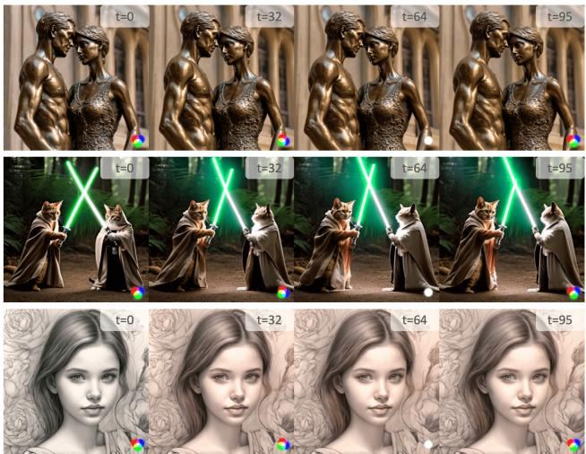  
Figure 2. Videos generated by state-of-the-art video generation model [12], compared with our results given the same text prompts and image conditions in Figure 1 and Figure 5.

## 2.2. Long Video Generation

Long video generation is a more challenging task which requires seamless transitions between successive video clips and long-term consistency of the scene and characters. There are typically two approaches: 1) autoregressive methods [16, 23, 44] employ a sliding window to generate a new clip conditioned on the previous clip. 2) hierarchical methods [10, 16, 18, 56] generate sparse frames first, then interpolate intermediate frames. However, the autoregressive approach is susceptible to quality degradation due to error cumulation over time. As for the hierarchical method, it needs long videos for training, which are difficult to obtain due to frequent shot changes in online videos. Besides, generating temporally coherent frames across larger time interval exacerbates the challenges, which often leads to low-quality ini tial frames, limiting achieving good results in interpolation stage. In this paper, we generates continuous video clips in the auto-regressive way and exhibits superior performance in synthesizing long-term consistent frames. Concurrently, we advocate for active user engagement with the generation process, akin to a film director’s role, to ensure that the produced content closely aligns with the user’s expectation.

## 3. Method

In this section, we will elaborate on the model architecture in Sec. 3.1, and then introduce the training and inference techniques tailored for our approach in Sec. 3.2.

## 3.1. Model Architecture

Latent Diffusion Architecture We adopt latent diffusion model [35] for video generation. Latent diffusion model is trained to denoise from a perturbed input in the latent space of a pre-trained VAE, in order to reduce the computational burden. We take the widely used 2D UNet [36] as diffusion model, which is constructed with a series of spatial downsampling layers followed by a series of spatial upsampling layers with inserted skip connections. Specifically, it is built with two basic blocks, i.e., 2D convolution block and 2D attention block. We extend the 2D UNet to 3D variant with inserting temporal layers [23], where 1D convolution layer along temporal dimension after 2D convolution layer, and 1D attention layer along temporal dimension following 2D attention layer. The model can be trained jointly with images and videos to maintain high-fidelity generation ability on spatial dimension. The 1D temporal operations are disabled for image input. We use bi-directional self-attention in all temporal attention layers. We encode the text instruction using a pre-trained CLIP text encoder [33], and the embedding ctext is injected through cross-attention layers in the UNet with hidden states as queries and $\mathbf { c } ^ { t e x t }$ as keys and values.

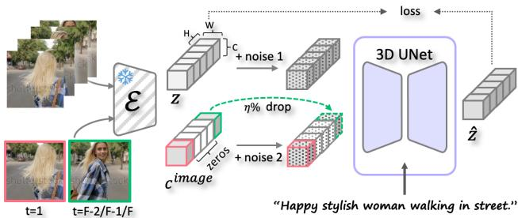  
Figure 3. Illustration of the training procedure of PixelDance. The original video clip and image instructions (in red and green boxes) are encoded into z and cimage, which are then concatenated along the channel dimension after perturbed with different noises.

Image Instruction Injection We incorporate image instructions for both the first and last frames in conjunction with text instruction. We utilize ground-truth video frames as the instructions in training, which is easy to obtain. Given the image instructions on the first and last frame, denoted as $\{ \mathbf { I } ^ { f i r s t } , \mathbf { T } ^ { l a s t } \}$ , we first encode them into the input space of diffusion models using VAE, result in $\{ \mathbf { f } ^ { \mathit { f i r s t } } , \bar { \mathbf { f } ^ { l a s t } } \}$ where $\mathbf { f } \in \mathbb { R } ^ { C \times H \times W }$ . To inject the instructions without loss of the temporal position information, the final image condition is then constructed as:

$$
\begin{array} { r } { \mathbf { c } ^ { i m a g e } = [ \mathbf { f } ^ { f i r s t } , \mathrm { P A D s } , \mathbf { f } ^ { l a s t } ] \in \mathbb { R } ^ { F \times C \times H \times W } , } \end{array}\tag{1}
$$

where $\mathtt { P A D S } \in \mathbb { R } ^ { ( F - 2 ) \times C \times H \times W }$ . The condition $\mathbf { c } ^ { i m a g e }$ is then concatenated with noised latent $\mathbf { z } _ { t }$ along the channel dimension, which is taken as the input of diffusion models.

## 3.2. Training and Inference

The training procedure is illustrated in Figure 3. For the first frame instruction, we employ the ground-truth first frame for training, making the model adhere to the first frame instruction strictly in inference. In contrast, we intentionally avoid encouraging the model to replicate the last frame instruction exactly. During inference, the ground-truth last frame is unavailable in advance, the model needs to accommodate user-provided coarse drafts for guidance to generate temporally coherent videos. To this end, we introduce three techniques. First, we randomly select an image from the last three ground-truth frames of a clip to serve as the last frame instruction for training. Second, to promote robustness, we perturb the encoded latents cimage of image instructions with noise.

Third, during training, we randomly drop the last frame instruction with probability η, by replacing the corresponding latent with zeros. Correspondingly, we propose a simple yet effective inference technique. During inferene, in the first τ out of the total T denoising steps, the last frame instruction is applied to guide the video generation towards desired ending status, and it is dropped in the subsequent steps to generate more plausible and temporally consistent videos:

$$
\begin{array} { r } { \tilde { \mathbf { x } } _ { \theta } = \left\{ \begin{array} { l l } { \hat { \mathbf { x } } _ { \theta } \big ( \mathbf { z } _ { t } , \mathbf { f } ^ { f i r s t } , \mathbf { f } ^ { l a s t } , \mathbf { c } ^ { t e x t } \big ) , } & { \mathrm { i f } t < \tau } \\ { \hat { \mathbf { x } } _ { \theta } \big ( \mathbf { z } _ { t } , \mathbf { f } ^ { f i r s t } , \mathbf { c } ^ { t e x t } \big ) , } & { \mathrm { i f } \tau \leq t \leq T } \end{array} \right. . } \end{array}\tag{2}
$$

τ determines the strength of model dependency on last frame instruction, adjusting τ will enable various applications. For example, our model can generate high-dynamic videos without last frame instruction $( \tau = 0 )$ . Additionally, we apply the classifier-free guidance [20] in inference, which mixes the score estimates of the model conditioned on text prompts and without text prompts.

## 4. Experiments

## 4.1. Implementation Details

Following previous work, we train the video diffusion model on WebVid [2], which contains about 10M short video clips with an average duration of 18 seconds, predominantly in the resolution of $3 3 6 \times 5 9 6$ Each video is associated with a paired text which generally offers a coarse description of video. Another nuisance issue of WebVid lies in the watermarks placed on all videos, which leads to the watermark’s presence in all generated videos. Thus, we expand our training data with other self-collected 500K watermark-free video clips depicting real-world entities such as humans, animals, objects, and landscapes, paired with coarse-grained textual descriptions. Despite comprising only a modest proportion, we surprisingly find that combining this dataset with WebVid for training ensures that PixelDance generates watermark-free videos if the image instructions are free of watermarks.

PixelDance is trained jointly on <text,video> dataset and <text,image> dataset. For video data, we randomly sample 16 consecutive frames with 4 fps per video. Following previous work [22], we adopt LAION-400M [39] as <text,image> dataset. Image-text data are utilized every 8 training iterations. The weights of pretrained text encoder and VAE model are frozen during training. We employ DDPM [21] with T = 1000 time steps for training. A noise corresponding to 100 time steps is introduced to the image instructions cimage. We incorporate ϵ-prediction [21] as training objective.

Table 1. Zero-shot T2V performance comparison on MSR-VTT. All methods generate video with spatial resolution of 256×256.
<table><tr><td>Method</td><td>#data #params.</td><td></td><td>CLIPSIM(↑)</td><td>FVD(↓)</td></tr><tr><td>Cog Video (En) [24]</td><td>5.4M</td><td>15.5B</td><td>0.2631</td><td>1294</td></tr><tr><td>MagicVideo [58]</td><td>10M</td><td></td><td></td><td>1290</td></tr><tr><td>LVDM [17]</td><td>2M</td><td>1.2B</td><td>0.2381</td><td>742</td></tr><tr><td>Video-LDM [6]</td><td>10M</td><td>4.2B</td><td>0.2929</td><td>=</td></tr><tr><td>InternVid [49]</td><td>28M</td><td></td><td>0.2951</td><td></td></tr><tr><td>ModelScope [46]</td><td>10M</td><td>1.7B</td><td>0.2939</td><td>550</td></tr><tr><td>Make-A-Video [40]</td><td>20M</td><td>9.7B</td><td>0.3049</td><td></td></tr><tr><td>Latent-Shift [1]</td><td>10M</td><td>1.5B</td><td>0.2773</td><td>=</td></tr><tr><td>VideoFactory [47]</td><td></td><td>2.0B</td><td>0.3005</td><td>=</td></tr><tr><td>PixelDance</td><td>10M</td><td>1.5B</td><td>0.3125</td><td>381</td></tr></table>

Table 2. Zero-shot T2V performance comparison on UCF-101. All methods generate video with spatial resolution of 256×256.
<table><tr><td>Method</td><td>#data</td><td>#params.</td><td>IS(↑) FID(↓)</td><td>FVD(↓)</td></tr><tr><td>CogVideo (En) [24]</td><td>5.4M</td><td>15.5B</td><td>25.27 179.00</td><td>701.59</td></tr><tr><td>MagicVideo [58]</td><td>10M</td><td></td><td>145.00</td><td>699.00</td></tr><tr><td>LVDM [17]</td><td>2M</td><td>1.2B</td><td></td><td>641.80</td></tr><tr><td>InternVid [49]</td><td>28M</td><td></td><td>21.04 60.25</td><td>616.51</td></tr><tr><td>Video-LDM [6]</td><td>10M</td><td>4.2B</td><td>33.45</td><td>550.61</td></tr><tr><td>ModelScope [46]</td><td>10M</td><td>1.7B</td><td></td><td>410.00</td></tr><tr><td>VideoFactory [47]</td><td></td><td>2.0B</td><td></td><td>410.00</td></tr><tr><td>Make-A-Video [40]</td><td>20M</td><td>9.7B</td><td>33.00</td><td>367.23</td></tr><tr><td>VidRD [14]</td><td>5.3M</td><td></td><td>39.37</td><td>363.19</td></tr><tr><td>Dysen-VDM [8]</td><td>10M</td><td></td><td>35.57</td><td>325.42</td></tr><tr><td>PixelDance</td><td>10M</td><td>1.5B</td><td>42.10</td><td>49.36 242.82</td></tr></table>

## 4.2. Video Generation

## 4.2.1 Quantitative Evaluation

We evaluate zero-shot video generation performance of our PixelDance on MSR-VTT [53] and UCF-101 [41] datasets, following previous work [6, 17, 24, 58]. MSR-VTT is a video retrieval dataset with descriptions for each video, while UCF-101 is an action recognition dataset with 101 action categories. To make a comparison with previous

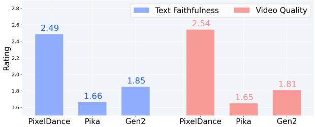  
Figure 4. Human evaluation results. PixelDance outperforms Gen2 [12] and PiKa [31] in terms of both text faithfulness and video quality.

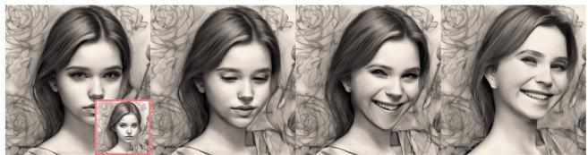

"Girl is smiling and winking."  
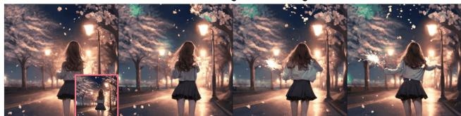  
"Girl is dancing on the road, hair is futtering, petals are falling down, fireworks are exploding in the remote"

  
"Rotate around the golden sculpture of Maneki-neko."

Figure 5. Illustration of video generation conditioned on the text and first frame instructions.

T2V approaches which are conditioned on text prompts only, we also evaluate only with text instructions. Specifically, we utilize off-the-shelf T2I Stable Diffusion V2.1 [35] to obtain the first frame instructions, and generate videos given the text and first frame instructions. Following previous work [8, 47], we randomly select one prompt per example to generate 2990 videos in total for evaluate, and report the Frechet Video Distance (FVD) [´ 43] and CLIPsimilarity (CLIPSIM) [50] on MSR-VTT dataset. For UCF-101 dataset, we construct descriptive text prompts per category and generate about 10K videos, and compare with previous works in terms of Inception Score (IS) [38], Frechet´ Inception Distance (FID) [19] and FVD, following previous work [8, 47].

Zero-short evaluation results on MSR-VTT and UCF-101 are presented in Table 1 and Table 2, respectively. Compared to other T2V approaches on the MSR-VTT, Pixel-Dance achieves state-of-the-art result in terms of FVD and CLIPSIM, demonstrating its remarkable ability to generate high-quality videos with better alignment to text prompts. Notably, PixelDance achieves an FVD score of 381, which substantially surpasses the previous state-of-the-art ModelScope [46], with an FVD of 550. On UCF-101 benchmark, PixelDance outperforms other models across various metrics, including IS, FID and FVD.

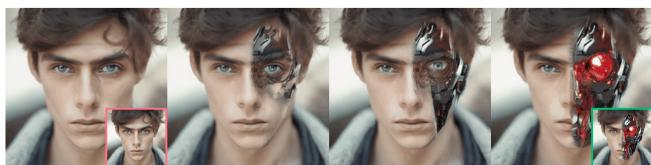

"Half of the face turns into cyborg face, robot eye, titanium skull."  
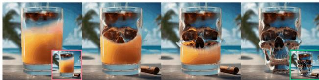  
"The glass is turning into a metal skull slowly."

## 4.2.2 Human Evaluation

Though above automatic evaluation metrics can assess the performance of models from various perspectives, they sometimes do not align well with human preference and fail to reflect the improvements in quality [22, 32, 40]. To make a more fair comparison, we use human evaluation to assess the performance of our PixelDance, Gen2 [12] and PiKa [31]. Specifically, we write 50 different prompts, covering diverse styles (real-world and cartoon, people and animal, wide-range landscapes and close-up), then we generate first frame with Stable Diffusion V2.1 [35] per prompt and generate one video for each method with <text,first frame> instructions. Users are asked to sort the randomly displayed videos per prompt (rating belongs to {3,2,1}, the higher, the better) w.r.t. two aspects: text faithfulness and video quality.

The human preference comparison result is demonstrated in Figure 4, where our PixelDance shows superior user preference in terms of both of text faithfulness and video quality, and outperforms Gen2 and PiKa with a clear margin.

## 4.2.3 Qualitative Analysis

Effectiveness of Each Instruction In PixelDance, the text instruction could be concise, considering that the first frame instruction has delivered the objects/characters and scenes, which are challenging to be described succinctly and precisely with text. Nonetheless, the text prompt plays a vital role of specifying various motions, including but

Figure 6. Illustration of complex video generation conditioned on the text, first frame and last frame instructions.  
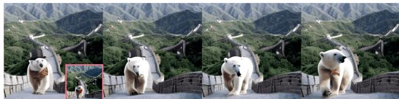  
"A polar bear is walking on the Great Wall."

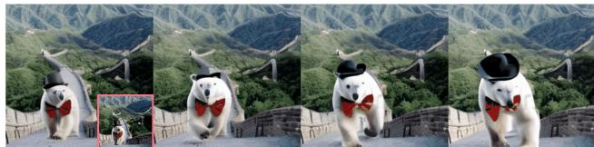  
"A polar bear with a black hat and a red bow tie is walking on the Great Wall."

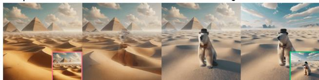  
"View of Egypt desert. Rotate. A polar bear is on the desert. Rotate."

Figure 7. First two rows: text instruction helps enhance the crossframe consistency of key elements like the black hat and red bow tie of the polar bear. Last row: natural shot transition.

not limited to body movements, facial expressions, object movements, and visual effects (first two rows of Figure 5). Besides, it allows for manipulating camera movements with prompts like ”zoom in/out” and ”rotate”, as shown in the last row of Figure 5. Moreover, the text instruction helps to hold the cross-frame consistency of specified key elements, such as the detailed descriptions of characters (polar bear in Figure 7).

The first frame instruction significantly improves the video quality by providing finer visual details. Moreover, it is key to generate multiple consecutive video clips. With the text and first frame instructions, PixelDance is able to generate more motion-rich videos (Figure 5 and Figure 7) compared to existing models.

The last frame instruction, delineating the concluding status of a video clip, provides an additional control on video generation. This instruction is instrumental for synthesizing intricate motions, and becomes particularly crucial for out-of-domain video generation as depicted in the first two samples in Figure 1 and Figure 6. Furthermore, we can generate a natural shot transition using last frame instruction (last sample of Figure 7).

Strength of Last Frame Guidance With the proposed techniques detailed in Sec. 3, we intentionally avoid encouraging the model replicate the last frame instruction exactly. As shown in Figure 8, without our techniques, the generated video abruptly ends in the given last frame exactly. In contrast, with our proposed methods, the generated video is more fluent and temporally consistent.

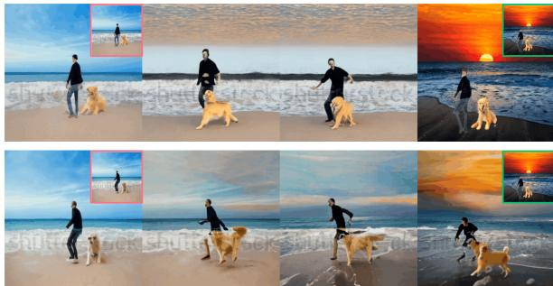  
"A man and a golden retriever is playing on the beach until sunset."

Generalization to Out-of-Domain Image Instructions Despite the notable lack of training videos in non-realistic styles (e.g., science fictions, comics, and cartoons), PixelDance demonstrates a remarkable capability to generate high-quality videos in these out-of-domain categories. This generalizability can be attributed to that PixelDance focuses on learning dynamics, given the image instructions. As PixelDance learns the underlying principles of motions in real world, it can generalize across various stylistic domains of image instructions.

## 4.3. Ablation Study

To evaluate the key components of PixelDance, we conduct a quantitative ablation study on the UCF-101 dataset following the zero-shot evaluation setting in Sec. 4.2.1.

First, to validate the influence of our self-collected data which is used for watermark-free video generation, we train two T2V baselines, ➀ on WebVid and self-collected data, and ➁ only on Webvid data. These two baselines have similar performance, demonstrating that the self-collected data has negligible influence on improving video generation performance but generating watermark-free videos.

Table 3. Ablation study results on UCF-101. All methods are trained on WebVid and self-collected data, except ➁ only on WebVid.
<table><tr><td>Method</td><td>FID(↓)</td><td>FVD(↓)</td></tr><tr><td>① T2V baseline</td><td>59.35</td><td>450.58</td></tr><tr><td>② T2V baseline (WebVid only)</td><td>56.16</td><td>454.29</td></tr><tr><td>③ PixelDance</td><td>49.36</td><td>242.82</td></tr><tr><td>④ PixelDance w/o  $\mathbf { c } ^ { t e x t }$ </td><td>51.26</td><td>375.79</td></tr><tr><td>⑤ PixelDance w/o flast</td><td>49.45</td><td>339.08</td></tr></table>

Based on the T2V baseline (➀), we further analyze the effectiveness of different instructions employed in our model. Considering the indispensable nature of the first frame instruction for the generation of continuous video clips, our ablation focuses on the text instruction (➂) and the last frame instruction (➃). The experimental results indicate that omitting either instruction results in a significant deterioration in video quality. Notably, even though the evaluation does not incorporate the last frame instruction, model trained with this instruction (➁) outperforms the model trained without it (➃). This observation reveals that relying solely on the <text, first frame> for video generation poses substantial challenges due to the significant diversity of video content. In contrast, incorporating all three instructions enhances PixelDance’s capacity to model motion dynamics and hold temporal consistency.

Figure 8. Illustration of the effectiveness of the proposed techniques (τ = 25) to avoid replicating the last frame instruction.  
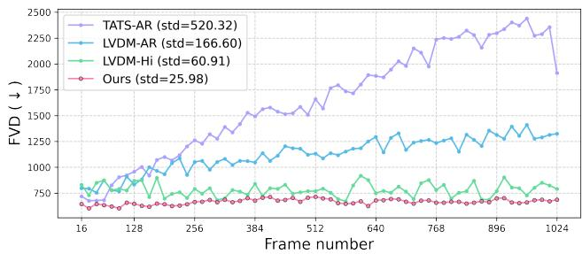  
Figure 9. FVD comparison for long video generation (1024 frames) on UCF-101. AR: auto-regressive. Hi: hierarchical. The construction of long video with PixelDance is in an autoregressive manner.

## 4.4. Long Video Generation

## 4.4.1 Quantitative Evaluation

As aforementioned, PixelDance is trained to strictly adhere to the first frame instruction, in order to generate long videos, where the last frame from preceding clip is used as the first frame instruction for generating the subsequent clip. To evaluate PixelDance’s capability of long video generation, we follow the previous work [9, 17] and generate 512 videos with 1024 frames on UCF-101 datasets, under the zero-shot setting detailed in Sec. 4.2.1. We report the FVD of every 16 frames extracted side-by-side from the synthesized videos. The results, as shown in Figure 9, show that PixelDance demonstrates lower FVD scores and smoother temporal variations, compared with auto-regressive models, TATS-AR [9] and LVDM-AR [17], and the hierarchical approach LVDM-Hi. Please refer to the Supplementary for visual comparisons.

## 4.4.2 Qualitative Analysis

This qualitative analysis focuses on PixelDance’s capabilities of generating a composite shot. This is formed by stringing together multiple continuous video clips that are temporally consistent. Figure 10 illustrates the capability of PixelDance to handle intricate shot compositions involv-

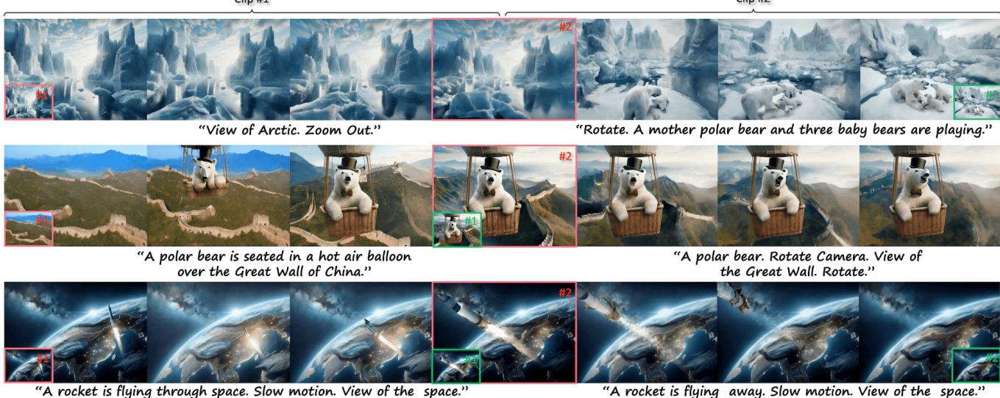  
Figure 10. Illustration of PixelDance handling intricate shot compositions consisting of two continuous video clips, in which case the last frame of the Clip #1 serves as the first frame instruction for Clip #2.

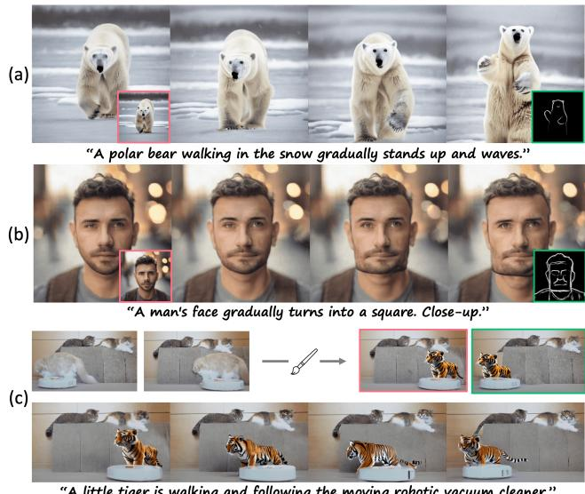  
"A little tiger is walking and following the moving robotic vacuum cleaner."

Figure 11. Illustration of video generation with sketch image as last frame instruction (first two examples), and PixelDance for zero-shot video editing (c).

ing complex camera movements (in Arctic scenes), smooth animation effects (polar bear appears in a hot air balloon over the Great Wall), and precise control over the trajectory of a rocket. These instances exemplify how users interact with PixelDance to craft desired video sequences. Leveraging PixelDance’s advanced generation capabilities, we have successfully synthesized a two-minute video that not only tells a coherent story but also maintains a consistent portrayal of the main character.

## 4.5. More Applications

Sketch Instruction Our proposed approach can be extended to other types of image instructions, such as semantic maps, image sketches, human poses, and bounding boxes. To demonstrate this, we take the image sketch as an example and finetune PixelDance with image sketch [52] as the last frame instruction. The results are shown in the first two rows of Figure 11, exhibiting that a simple sketch image is able to guide the video generation process.

Zero-shot Video Editing PixelDance is able to perform video editing without any training, achieved by transforming the video editing task into an image editing task. As shown in the last example in Figure 11, by editing the first frame and the last frame of the provided video, Pixel-Dance generates a temporally consistent video aligned with user expectation on video editing.

## 5. Conclusion

In this paper, we proposed a novel video generation approach based on diffusion models, PixelDance, which incorporates image instructions for both the first and last frames in conjunction with text instruction. We developed training and inference techniques tailored for this approach. PixelDance trained mainly on WebVid exhibited exceptional proficiency in synthesizing videos with complex scenes and actions, setting a new standard in video generation.

## References

[1] Jie An, Songyang Zhang, Harry Yang, Sonal Gupta, Jia-Bin Huang, Jiebo Luo, and Xi Yin. Latent-shift: Latent diffusion with temporal shift for efficient text-to-video generation. arXiv preprint arXiv:2304.08477, 2023. 5

[2] Max Bain, Arsha Nagrani, Gul Varol, and Andrew Zisser-¨ man. Frozen in time: A joint video and image encoder for end-to-end retrieval. In Proceedings ofthe IEEE/CVF International Conference on Computer Vision, pages 1728–1738, 2021. 2, 4

[3] Yogesh Balaji, Seungjun Nah, Xun Huang, Arash Vahdat, Jiaming Song, Karsten Kreis, Miika Aittala, Timo Aila, Samuli Laine, Bryan Catanzaro, et al. ediffi: Text-to-image diffusion models with an ensemble of expert denoisers. arXiv preprint arXiv:2211.01324, 2022. 3

[4] James Betker, Gabriel Goh, Li Jiang, Tim Brooks, Jianfeng Wang, Linjie Li, Long Ouyang, Juntang Zhuang, Yufei Guo, Wesam Manassra, Prafulla Dhariwal, Casey Chu, Yunxin Jiao, and Aditya Ramesh. Improving image captioning with better captions. 2023. 2

[5] Andreas Blattmann, Tim Dockhorn, Sumith Kulal, Daniel Mendelevitch, Maciej Kilian, Dominik Lorenz, Yam Levi, Zion English, Vikram Voleti, Adam Letts, et al. Stable video diffusion: Scaling latent video diffusion models to large datasets. arXiv preprint arXiv:2311.15127, 2023. 2

[6] Andreas Blattmann, Robin Rombach, Huan Ling, Tim Dockhorn, Seung Wook Kim, Sanja Fidler, and Karsten Kreis. Align your latents: High-resolution video synthesis with latent diffusion models. In Proceedings ofthe IEEE/CVF Conference on Computer Vision and Pattern Recognition, pages 22563–22575, 2023. 5

[7] Patrick Esser, Johnathan Chiu, Parmida Atighehchian, Jonathan Granskog, and Anastasis Germanidis. Structure and content-guided video synthesis with diffusion models. In Proceedings of the IEEE/CVF International Conference on Computer Vision, pages 7346–7356, 2023. 3

[8] Hao Fei, Shengqiong Wu, Wei Ji, Hanwang Zhang, and Tat-Seng Chua. Empowering dynamics-aware text-to-video diffusion with large language models. arXiv preprint arXiv:2308.13812, 2023. 5

[9] Songwei Ge, Thomas Hayes, Harry Yang, Xi Yin, Guan Pang, David Jacobs, Jia-Bin Huang, and Devi Parikh. Long video generation with time-agnostic vqgan and timesensitive transformer. In European Conference on Computer Vision, pages 102–118. Springer, 2022. 2, 3, 7

[10] Songwei Ge, Thomas Hayes, Harry Yang, Xi Yin, Guan Pang, David Jacobs, Jia-Bin Huang, and Devi Parikh. Long video generation with time-agnostic vqgan and timesensitive transformer. In European Conference on Computer Vision, pages 102–118. Springer, 2022. 3

[11] Songwei Ge, Seungjun Nah, Guilin Liu, Tyler Poon, Andrew Tao, Bryan Catanzaro, David Jacobs, Jia-Bin Huang, Ming-Yu Liu, and Yogesh Balaji. Preserve your own correlation: A noise prior for video diffusion models. In Proceedings of the IEEE/CVF International Conference on Computer Vision, pages 22930–22941, 2023. 2, 3

[12] Gen-2: The Next Step Forward for Generative AI. https://research.runwayml.com/gen2. 2, 3, 5, 6

[13] Ian Goodfellow, Jean Pouget-Abadie, Mehdi Mirza, Bing Xu, David Warde-Farley, Sherjil Ozair, Aaron Courville, and Yoshua Bengio. Generative adversarial nets. Advances in neural information processing systems, 27, 2014. 3

[14] Jiaxi Gu, Shicong Wang, Haoyu Zhao, Tianyi Lu, Xing Zhang, Zuxuan Wu, Songcen Xu, Wei Zhang, Yu-Gang Jiang, and Hang Xu. Reuse and diffuse: Iterative denoising for text-to-video generation. arXiv preprint arXiv:2309.03549, 2023. 5

[15] Xianfan Gu, Chuan Wen, Jiaming Song, and Yang Gao. Seer: Language instructed video prediction with latent diffusion models. arXiv preprint arXiv:2303.14897, 2023. 3

[16] William Harvey, Saeid Naderiparizi, Vaden Masrani, Christian Weilbach, and Frank Wood. Flexible diffusion modeling of long videos. Advances in Neural Information Processing Systems, 35:27953–27965, 2022. 3

[17] Yingqing He, Tianyu Yang, Yong Zhang, Ying Shan, and Qifeng Chen. Latent video diffusion models for high-fidelity video generation with arbitrary lengths. arXiv preprint arXiv:2211.13221, 2022. 2, 3, 5, 7

[18] Yingqing He, Tianyu Yang, Yong Zhang, Ying Shan, and Qifeng Chen. Latent video diffusion models for high-fidelity video generation with arbitrary lengths. arXiv preprint arXiv:2211.13221, 2022. 3

[19] Martin Heusel, Hubert Ramsauer, Thomas Unterthiner, Bernhard Nessler, and Sepp Hochreiter. Gans trained by a two time-scale update rule converge to a local nash equilibrium. Advances in neural information processing systems, 30, 2017. 5

[20] Jonathan Ho and Tim Salimans. Classifier-free diffusion guidance. arXiv preprint arXiv:2207.12598, 2022. 4

[21] Jonathan Ho, Ajay Jain, and Pieter Abbeel. Denoising diffusion probabilistic models. Advances in neural information processing systems, 33:6840–6851, 2020. 5

[22] Jonathan Ho, William Chan, Chitwan Saharia, Jay Whang, Ruiqi Gao, Alexey Gritsenko, Diederik P Kingma, Ben Poole, Mohammad Norouzi, David J Fleet, et al. Imagen video: High definition video generation with diffusion models. arXiv preprint arXiv:2210.02303, 2022. 5, 6

[23] Jonathan Ho, Tim Salimans, Alexey Gritsenko, William Chan, Mohammad Norouzi, and David J Fleet. Video diffusion models. In Advances in Neural Information Processing Systems, pages 8633–8646. Curran Associates, Inc., 2022. 2, 3, 4

[24] Wenyi Hong, Ming Ding, Wendi Zheng, Xinghan Liu, and Jie Tang. Cogvideo: Large-scale pretraining for text-to-video generation via transformers. arXiv preprint arXiv:2205.15868, 2022. 3, 5

[25] Xin Li, Wenqing Chu, Ye Wu, Weihang Yuan, Fanglong Liu, Qi Zhang, Fu Li, Haocheng Feng, Errui Ding, and Jingdong Wang. Videogen: A reference-guided latent diffusion approach for high definition text-to-video generation. arXiv preprint arXiv:2309.00398, 2023. 2

[26] Yitong Li, Martin Min, Dinghan Shen, David Carlson, and Lawrence Carin. Video generation from text. In Proceedings ofthe AAAI conference on artificial intelligence, 2018. 3

[27] Yunfan Lu, Zipeng Wang, Minjie Liu, Hongjian Wang, and Lin Wang. Learning spatial-temporal implicit neural representations for event-guided video super-resolution. In Proceedings of the IEEE/CVF Conference on Computer Vision and Pattern Recognition, pages 1557–1567, 2023. 3

[28] Zhengxiong Luo, Dayou Chen, Yingya Zhang, Yan Huang, Liang Wang, Yujun Shen, Deli Zhao, Jingren Zhou, and Tieniu Tan. Videofusion: Decomposed diffusion models for high-quality video generation. In Proceedings of the IEEE/CVF Conference on Computer Vision and Pattern Recognition, pages 10209–10218, 2023. 3

[29] Eyal Molad, Eliahu Horwitz, Dani Valevski, Alex Rav Acha, Yossi Matias, Yael Pritch, Yaniv Leviathan, and Yedid Hoshen. Dreamix: Video diffusion models are general video editors. arXiv preprint arXiv:2302.01329, 2023. 3

[30] Yingwei Pan, Zhaofan Qiu, Ting Yao, Houqiang Li, and Tao Mei. To create what you tell: Generating videos from captions, 2018. 3

[31] PiKa. https://pika.art/. 2, 5, 6

[32] Dustin Podell, Zion English, Kyle Lacey, Andreas Blattmann, Tim Dockhorn, Jonas Muller, Joe Penna, and¨ Robin Rombach. Sdxl: Improving latent diffusion models for high-resolution image synthesis. arXiv preprint arXiv:2307.01952, 2023. 6

[33] Alec Radford, Jong Wook Kim, Chris Hallacy, Aditya Ramesh, Gabriel Goh, Sandhini Agarwal, Girish Sastry, Amanda Askell, Pamela Mishkin, Jack Clark, et al. Learning transferable visual models from natural language supervision. In International conference on machine learning, pages 8748–8763. PMLR, 2021. 4

[34] MarcAurelio Ranzato, Arthur Szlam, Joan Bruna, Michael Mathieu, Ronan Collobert, and Sumit Chopra. Video (language) modeling: a baseline for generative models of natural videos. arXiv preprint arXiv:1412.6604, 2014. 3

[35] Robin Rombach, Andreas Blattmann, Dominik Lorenz, Patrick Esser, and Bjorn Ommer. High-resolution image¨ synthesis with latent diffusion models. In Proceedings of the IEEE/CVF conference on computer vision and pattern recognition, pages 10684–10695, 2022. 2, 3, 5, 6

[36] Olaf Ronneberger, Philipp Fischer, and Thomas Brox. Unet: Convolutional networks for biomedical image segmentation. In Medical Image Computing and Computer-Assisted Intervention–MICCAI 2015: 18th International Conference, Munich, Germany, October 5-9, 2015, Proceedings, Part III 18, pages 234–241. Springer, 2015. 4

[37] Chitwan Saharia, William Chan, Saurabh Saxena, Lala Li, Jay Whang, Emily L Denton, Kamyar Ghasemipour, Raphael Gontijo Lopes, Burcu Karagol Ayan, Tim Salimans, et al. Photorealistic text-to-image diffusion models with deep language understanding. Advances in Neural Information Processing Systems, 35:36479–36494, 2022. 3

[38] Masaki Saito, Shunta Saito, Masanori Koyama, and Sosuke Kobayashi. Train sparsely, generate densely: Memoryefficient unsupervised training of high-resolution temporal gan. International Journal of Computer Vision, 128(10-11): 2586–2606, 2020. 5

[39] Christoph Schuhmann, Richard Vencu, Romain Beaumont, Robert Kaczmarczyk, Clayton Mullis, Aarush Katta, Theo

Coombes, Jenia Jitsev, and Aran Komatsuzaki. Laion-400m: Open dataset of clip-filtered 400 million image-text pairs. arXiv preprint arXiv:2111.02114, 2021. 5

[40] Uriel Singer, Adam Polyak, Thomas Hayes, Xi Yin, Jie An, Songyang Zhang, Qiyuan Hu, Harry Yang, Oron Ashual, Oran Gafni, et al. Make-a-video: Text-to-video generation without text-video data. arXiv preprint arXiv:2209.14792, 2022. 2, 3, 5, 6

[41] Khurram Soomro, Amir Roshan Zamir, and Mubarak Shah. A dataset of 101 human action classes from videos in the wild. Centerfor Research in Computer Vision, 2(11), 2012. 2, 5

[42] Yu Tian, Jian Ren, Menglei Chai, Kyle Olszewski, Xi Peng, Dimitris N Metaxas, and Sergey Tulyakov. A good image generator is what you need for high-resolution video synthesis. arXiv preprint arXiv:2104.15069, 2021. 3

[43] Thomas Unterthiner, Sjoerd Van Steenkiste, Karol Kurach, Raphael Marinier, Marcin Michalski, and Sylvain Gelly. Towards accurate generative models of video: A new metric & challenges. arXiv preprint arXiv:1812.01717, 2018. 5

[44] Ruben Villegas, Mohammad Babaeizadeh, Pieter-Jan Kindermans, Hernan Moraldo, Han Zhang, Mohammad Taghi Saffar, Santiago Castro, Julius Kunze, and Dumitru Erhan. Phenaki: Variable length video generation from open domain textual descriptions. In International Conference on Learning Representations, 2023. 3

[45] Carl Vondrick, Hamed Pirsiavash, and Antonio Torralba. Generating videos with scene dynamics. Advances in neural information processing systems, 29, 2016. 3

[46] Jiuniu Wang, Hangjie Yuan, Dayou Chen, Yingya Zhang, Xiang Wang, and Shiwei Zhang. Modelscope text-to-video technical report. arXiv preprint arXiv:2308.06571, 2023. 2, 3, 5, 6

[47] Wenjing Wang, Huan Yang, Zixi Tuo, Huiguo He, Junchen Zhu, Jianlong Fu, and Jiaying Liu. Videofactory: Swap attention in spatiotemporal diffusions for text-to-video generation. arXiv preprint arXiv:2305.10874, 2023. 5

[48] Xiang Wang, Hangjie Yuan, Shiwei Zhang, Dayou Chen, Jiuniu Wang, Yingya Zhang, Yujun Shen, Deli Zhao, and Jingren Zhou. Videocomposer: Compositional video synthesis with motion controllability. arXiv preprint arXiv:2306.02018, 2023. 3

[49] Yi Wang, Yinan He, Yizhuo Li, Kunchang Li, Jiashuo Yu, Xin Ma, Xinyuan Chen, Yaohui Wang, Ping Luo, Ziwei Liu, et al. Internvid: A large-scale video-text dataset for multimodal understanding and generation. arXiv preprint arXiv:2307.06942, 2023. 5

[50] Chenfei Wu, Lun Huang, Qianxi Zhang, Binyang Li, Lei Ji, Fan Yang, Guillermo Sapiro, and Nan Duan. Godiva: Generating open-domain videos from natural descriptions. arXiv preprint arXiv:2104.14806, 2021. 5

[51] Jay Zhangjie Wu, Yixiao Ge, Xintao Wang, Stan Weixian Lei, Yuchao Gu, Yufei Shi, Wynne Hsu, Ying Shan, Xiaohu Qie, and Mike Zheng Shou. Tune-a-video: One-shot tuning of image diffusion models for text-to-video generation. In Proceedings of the IEEE/CVF International Conference on Computer Vision (ICCV), pages 7623–7633, 2023. 3

[52] Saining Xie and Zhuowen Tu. Holistically-nested edge detection. In Proceedings ofthe IEEE international conference on computer vision, pages 1395–1403, 2015. 8

[53] Jun Xu, Tao Mei, Ting Yao, and Yong Rui. Msr-vtt: A large video description dataset for bridging video and language. In Proceedings ofthe IEEE conference on computer vision and pattern recognition, pages 5288–5296, 2016. 2, 5

[54] Wilson Yan, Yunzhi Zhang, Pieter Abbeel, and Aravind Srinivas. Videogpt: Video generation using vq-vae and transformers. arXiv preprint arXiv:2104.10157, 2021. 3

[55] Shengming Yin, Chenfei Wu, Jian Liang, Jie Shi, Houqiang Li, Gong Ming, and Nan Duan. Dragnuwa: Fine-grained control in video generation by integrating text, image, and trajectory. arXiv preprint arXiv:2308.08089, 2023. 3

[56] Shengming Yin, Chenfei Wu, Huan Yang, Jianfeng Wang, Xiaodong Wang, Minheng Ni, Zhengyuan Yang, Linjie Li, Shuguang Liu, Fan Yang, et al. Nuwa-xl: Diffusion over diffusion for extremely long video generation. arXiv preprint arXiv:2303.12346, 2023. 3

[57] Jianfeng Zhang, Hanshu Yan, Zhongcong Xu, Jiashi Feng, and Jun Hao Liew. Magicavatar: Multimodal avatar generation and animation. arXiv preprint arXiv:2308.14748, 2023. 3

[58] Daquan Zhou, Weimin Wang, Hanshu Yan, Weiwei Lv, Yizhe Zhu, and Jiashi Feng. Magicvideo: Efficient video generation with latent diffusion models. arXiv preprint arXiv:2211.11018, 2022. 2, 3, 5