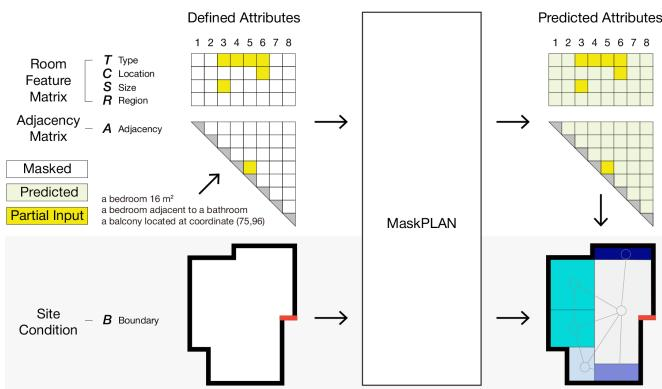
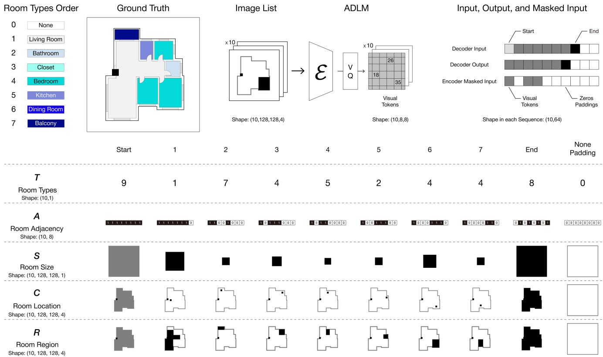
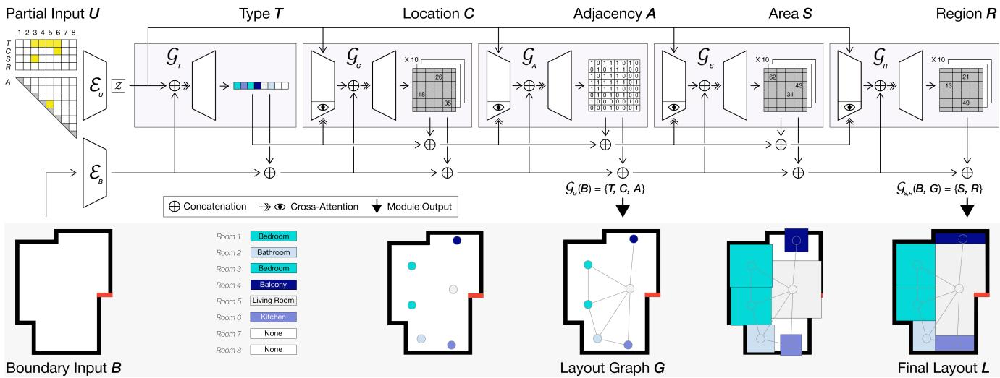
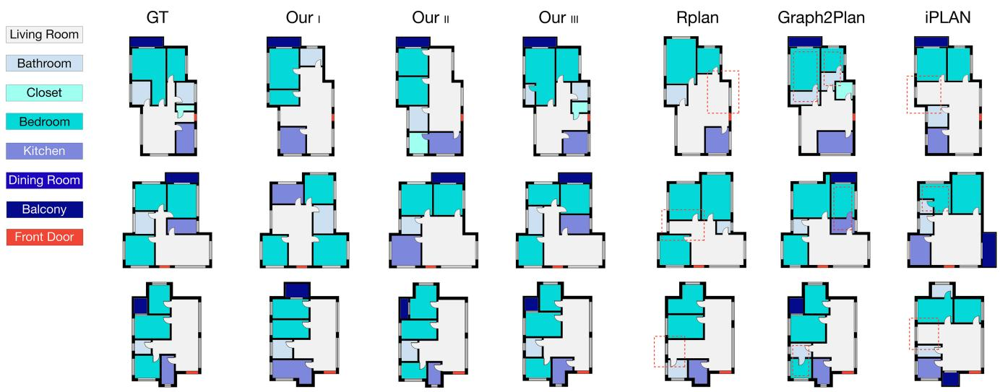
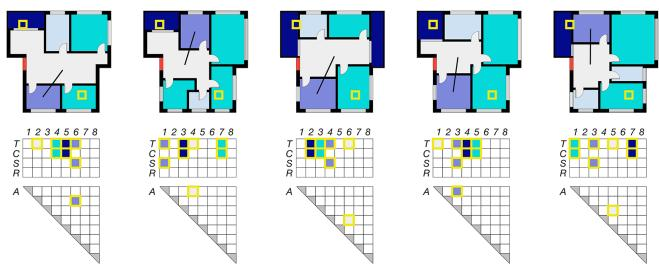
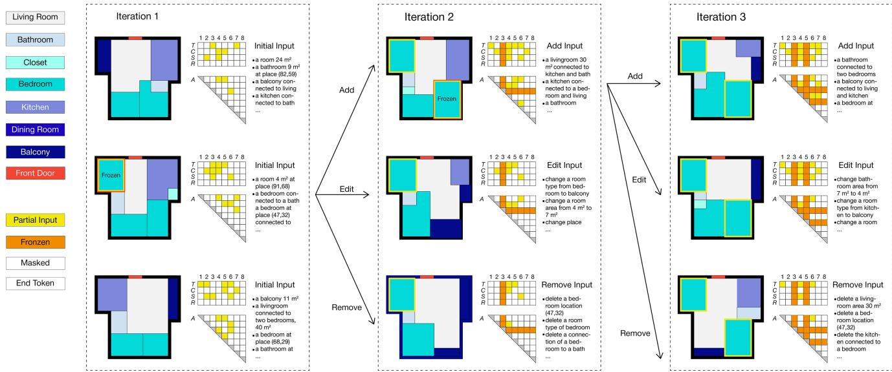

# MaskPLAN: Masked Generative Layout Planning from Partial Input

Hang Zhang, Anton Savov, Benjamin Dillenburger Digital Building Technologies, ETH Zurich {hangzhang, asavov, dillenbb}@ethz.ch

## Abstract

Layout planning, spanning from architecture to interior design, is a slow, iterative exploration of ill-defined problems, adopting a ”I’ll know it when I see it” approach to potential solutions. Recent advances in generative models promise automating layout generation, yet often overlook the crucial role of user-guided iteration, cannot generate full solutions from incomplete design ideas, and do not learn for the inter-dependency of layout attributes. To address these limitations, we propose Mask-PLAN, a novel generative model based on Graph-structured Dynamic Masked Autoencoders (GDMAE) featuring five transformers generating a blend ofgraph-based and imagebased layout attributes. MaskPLAN lets users generate and adjust layouts with partial attribute definitions, create alternatives for preferences, and practice new compositiondriven or functionality-driven workflows. Through crossattribute learning and the user input as a global conditional prior we ensure that design synthesis is calibrated at every intermediate stage, maintaining its feasibility and practicality. Extensive evaluations show MaskPLAN’s superior performance over existing methods across multiple metrics.

## 1. Introduction

Layout planning is a ubiquitous task across various domains, including architecture, urban, landscape, and interior design. It involves balancing functional needs, often depicted as a bubble diagram, with their compositional arrangement into a cohesive layout [26, 38]. The design of floor plan layouts is a slow, iterative process exploration of ill-defined problems, which under the motto ”I’ll know it when I see it” focuses on embracing possible solutions instead of solving for predefined criteria.

Recent achievements in generative models have shown significant potential for automating the process of layout generation [15, 23, 27, 35], specifically in the context of autonomously generating floor plans based on high level functional requirements [2, 7, 29, 31–33, 36, 40, 41, 53].

However, existing approaches predominantly employ holistic end-to-end architectures, while overlooking the critical role of user-guided iteration for the evolving understanding of design challenges. Furthermore, previous studies on user-guided layout generation [16, 21, 34, 40, 44, 50] exhibit three key shortcomings: (1) inability to accept partial inputs, (2) unsupported relevant attributes for user input, and (3) failure to combine functional and compositional attributes due to unlearned interdependencies.

  
Figure 1. MaskPLAN allows users to influence layout generation with just the features they prioritize, using partial inputs in a Graph-structured Dynamic Masked Autoencoder (GDMAE) equipped with five attribute-specific generative transformers for predicting layouts from incomplete design ideas.

Recently, masked autoencoders (MAE) [11, 17] enable autoregressive image synthesis based on partial information with high-fidelity results [5, 6, 17]. In this paper, we propose MaskPLAN (Fig. 1), a novel, MAE-based userguided generative model for layout planning. MaskPLAN addresses the three shortcomings in the state of the art with:

• Partial Input - we introduce a dynamic masking mechanism in a generative layout planning workflow that takes partial user input and autocompletes the remaining properties of the layout (Sec. 3.1). To date, MaskPLAN stands as the first model to accept such a free range of input.

• Full set of learnable attributes - we demonstrate exhaustive user-AI interactions by enabling users to define functional and compositional attributes in layout design cus-

tomization (Fig. 6).

• Cross-attribute learning - we incorporate the partial user input as a global conditional prior, calibrating the design synthesis across every intermediate stage to preserve the layout’s feasibility and practicality (Sec. 3.4).

• Feasible floor plans - we conduct extensive evaluations and demonstrate that our approach outperforms existing methods under various metrics (Sec. 4).

## 2. Related Work

In the context of our work on MaskPLAN, it is relevant to take a comprehensive review of the following aspects: generative floorplan layout synthesis, user-guided generative modeling and graph-structured masked autoencoders.

Generative Floorplan Layout Synthesis. Layout generation has recently been widely explored in data-driven machine learning [15, 23, 27]. Related studies span various domains, including molecule generation [10, 13, 30], indoor scene synthesis [47, 48], urban planning [8, 51], and especially the floor plan generation [1, 7, 16, 21, 32– 34, 36, 40, 41, 44, 50, 53]. Significant prior research has framed layout generation as a raster image synthesis task. Promising approaches in such field involve leveraging variational autoencoders (VAEs) [3, 24] and generative adversarial networks (GANs) [4, 14, 18, 27], which have demonstrated impressive results in generating floorplans [16, 32, 33, 50]. However, pure image-based approaches are inherently constrained by their inability to capture spatial relations, which are typically represented as layout graphs [2, 31, 32].

Several graph-structured generative models have shown promising potential to address this, such as graph neural networks (GNNs) [25, 39] in generative layout graph creation [10, 21, 28, 42]. Concurrently, emerging advancements in deep learning are also leveraged for the automation of urban planning [8] and floorplan generation [29, 44], as well as text-driven house layout prediction [7, 53]. More recent modern architectures such as vision transformers [12] and diffusion models [19] have also yielded high fidelity generative performance in floorplan layout synthesis with graph-structured input [15, 34, 35, 40]. However, only graph-based input does not enable the user to control the compositional aspects of the spatial allocation in a layout. In this work we propose a feature set that is a mix of imagebased and graph-based information.

User-guided Generative Modeling. Most layout generation approaches listed above employ an end-to-end architecture, constraining opportunities for iterative layout customization. Only several prior studies have explored userguided floorplan generation. Typical approaches are to let users define room types, locations, and bounding boxes [16, 50] or to customize a layout graph [21, 32–34]. Predicted attributes are most often room bounding boxes which are then post-processed to a layout. Notable exceptions are the prediction of layout edges in [34] and room polygon outlines in [40]. However, these approaches have three main shortcomings in supporting an iterative design workflow.

First, existing methods cannot generate full solutions from incomplete design ideas. Early in the design process, designers frequently work with uncertain details, leading to initial designs based on incomplete information [9, 38]. A more adaptable approach is needed for inputs like ”a 16 m2 bedroom next to a bathroom, and a balcony at given location,” as illustrated in Fig. 1.

Second, existing layout customization methods often lack flexibility, notably in adjusting room connectivity [16, 50] and modifying room sizes [16, 34, 40, 50]. An ideal interactive model should enable users to alter all relevant layout attributes such as room presence, location, size, adjacency, and shape, addressing these limitations.

Third, current layout generation processes often overlook the interconnectedness of layout attributes. Typically, these methods adopt a progressive, multi-stage approach [21, 33, 34, 44], sequentially addressing room types, locations, and sizes for example [16, 50], yet fail to recognize their mutual influence. This oversight prevents users from ”freezing” specific attributes—such as a room’s dimensions or purpose—while allowing the model to adjust its other attributes from earlier stages of the pipeline accordingly. Therefore, it’s crucial to implement comprehensive mutual relations encoding across all stages of attribute prediction to achieve practical layout designs.

To address these shortcomings, MaskPLAN is developed to enable access to all pivotal attributes during training and customization, encode user partial input as global prior knowledge, and simultaneously use it to calibrate the layout synthesis at every intermediate stage.

Graph-structured Masked Autoencoders (GMAE). MAEs have gained a significant traction in the development of generative models that are structured on graphs, as evidenced by several recent studies [20, 22, 30]. These investigations are based on the principles of subgraph [30] or partial graph [52], wherein the original graph undergoes stochastic masking on the graph level. This derived masked information is then subjected to training processes aimed at reconstructing the source graph [22, 37]. The architecture of graph-structured MAE resonates strongly with the objectives of this work and forms the basis for MaskPLAN.

## 3. Method

In MaskPLAN, layout generation is framed as predicting unobserved layout attributes from a masked attributes matrix, for which we propose a Graph-structured Dynamic Masked Autoencoder (GDMAE) featuring five generators that blend graph-based and image-based layout attributes.

  
Figure 2. Layout representation in MaskPLAN. Room types T and adjacency A are passed as binary vectors, while $C ,$ areas S, and regions R are represented as images and embedded into lower-dimensional visual tokens using a pretrained ADLM before masking.

## 3.1. Problem Formulation

MaskPLAN aims to reconstruct the source layout attributes L from the masked matrix U while considering the site condition B as an additional prior. Therefore, the primary objective of MaskPLAN is to learn the potential distributions $\mathcal { P } ( L | U , B )$ , restoring all the unobserved attributes in the layout. However, predicting all layout attributes simultaneously is challenging, so our method decodes them sequentially, with each attribute influencing the next. The joint probability distribution of the entire generation process is decomposed as follows:

$$
\begin{array} { r } { \mathcal { P } ( L | U , B ) = \mathcal { P } ( R | S , G , U , B ) } \\ { \mathcal { P } ( S | G , U , B ) \mathcal { P } ( G | U , B ) } \end{array}\tag{1}
$$

where ${ \mathcal { P } } ( G | U , B )$ refers to the prediction of the layout graph $G = \{ T , C , A \}$ composed of the predicted room types $T ,$ locations $C ,$ , and spatial relations A (Fig. 3). At the same time ${ \mathcal { P } } ( S | G , U , B )$ and ${ \mathcal { P } } ( R | S , G , U , B )$ denote the procedural forecasting of room areas S and explicit room shape regions R respectively.

## 3.2. Comparisons with Existing Generators

As discussed in Sec. 2, several existing studies have investigated the generation of floorplans with user guidance. RPLAN [50] employs a two-stage prediction strategy. Initially, the $T ^ { ' }$ and $\bar { C } ^ { ' }$ are predicted together in a serialized manner, defined as $\mathcal { P } ( \mathbf { \bar { \it T } } _ { i } ^ { \prime } , C _ { i } ^ { \prime } \mid T _ { j } ^ { \prime } , \bar { C } _ { j } ^ { \prime } , B )$ , where $j =$ $\{ 0 , 1 , . . . , i - 1 \}$ . Subsequently, the room walls are predicted which in turn implicitly define the rooms’ bounding boxes. Graph2Plan [21] retrieves the $T ^ { ' } , C ^ { ' } , A ^ { ' }$ and $S ^ { ' }$ from other layouts that share a similar boundary condition $B .$ Afterwards, the room bounding boxes estimated. iPLAN [16] commences with the $T ^ { ' }$ prediction, followed by $C ^ { ' }$ and bounding boxes simultaneously, in a serialized fashion.

In comparison, MaskPLAN is characterized by innovations as follows: (1) it integrates user partial input to globally supervise the layout generation, defined as $\mathcal { P } ( L | U , B )$ (Eq. 1); (2) instead of representing rooms as mere bounding boxes, it delineates them as explicit regions $R ^ { ' }$ (Fig. 2), lending higher accuracy to the geometrical representation; (3) it ensures all pivotal attributes are available both for training and customization, including $T ^ { ' , C ^ { ' } , A ^ { ' } , S ^ { ' } }$ , and $R ^ { ' }$ . To our knowledge, MaskPLAN stands as the first model to integrate these advanced features.

## 3.3. Layout Representation

We represent each floorplan layout as a combination of site condition B and layout attributes L (See Fig. 2). The site condition $B \in \mathbb { R } ^ { 1 2 \bar { 8 } \times 1 2 8 \times 3 }$ is represented as a three-channel image, consisting of the inside mask, boundary mask, and front door mask. The layout attributes $L = \{ T , C , A , S , R \}$ are designed to capture all the essential geometrical and categorical features in the layout and are annotated as the feature matrix and adjacency matrix (Fig. 1). To deal with variable count of rooms (constrained to a maximum of 8 from the training dataset) we introduce a [Start] and an [End] token to define every attribute’s sequence making its length equal to 10. Any non-existing values up to the count of 8 are zero-padded. In detail, the five attributes in L are represented as: T - denoting a room’s type $( T \in \mathbb { Z } ^ { 1 0 } )$ . We consolidate room types (13 in RPLAN) down to 8: living room, bathroom, closet, bedroom, kitchen, dining room, and balcony; C - representing the room’s central position by a square of $9 \times 9 \times 3$ pixels on a 4-channel image $( \hat { C } \in \hat { \mathbb { R } } ^ { 1 0 \times 1 2 8 \times 1 2 8 \times 4 } ) ; S$ - denoting room areas with a respectively sized square at the center of a one-channel image $( S \in \mathbb { R } ^ { 1 0 \times 1 2 8 \times 1 2 8 } ) ; A$ - indicating the spatial relations between rooms as binary matrix where 1 denotes rooms’ adjacency $( A \ \in \ \mathbb { Z } ^ { 1 0 \times 8 } ) \colon$ ; and S - representing the shapes of the rooms by the actual pixels the room occupies, duplicated in the initial three channels of a 4-channel image $\mathsf { \bar { ( } } R \in \mathbb { R } ^ { 1 0 \times 1 2 8 \times 1 2 8 \times 4 } )$ . The site condition B is consolidated into the fourth channel in the images of C and R, where the front door mask = 255, the boundary mask = 127, and the inside mask is omitted. This channel only contains site pixels, ensuring no conflicts between geometrical and site pixels.

Training on multiple sequences of high-resolution images is a computationally intensive task. Therefore, we pretrain an Attribute Discrete Latent Model (ADLM), which uses VQ-VAE [45] to encode the image information into a lower dimension as visual tokens. The ADLM encodes to a latent embedding space $\ b { d } \in \mathbb { R } ^ { K \times V }$ , where K is the size of discrete latent space and V is the dimension of each latent embedding vector. The encoded visual tokens are used in the training of the masked generative autoencoder. See further details in the supplementary.

## 3.4. Masked Generative Autoencoder

The core framework of MaskPLAN adapts the Graphstructured Dynamic Masked AutoEncoder (GDMAE), with transformers [12] as its foundational structure. Described in Fig. 3, MaskPLAN consists of six components, including the partial input encoder $\mathcal { E } _ { U }$ and five mutually related generators $\mathcal { G } _ { T } , \mathcal { G } _ { C } , \mathcal { G } _ { A } , \mathcal { G } _ { S }$ , and $\mathcal { G } _ { R }$ . The encoder $\mathcal { E } _ { U }$ maps the observed attributes $U$ to the latent representation z. As shown in recent layout generation approaches the generation of a floorplan layout is positively enhanced if predicated on its graph-based representation. Therefore, the five autoregressive decoding steps in MaskPLAN are split into two larger modules: the generator $\mathcal { G } _ { G }$ to first predict the layout graph G, and the generator $\mathcal { G } _ { S , R }$ to predict the final layout $L .$ The generators consistently take the boundary condition B and the partial input U as conditional factors. Furthemore, a novel addition to the transformer generator subarchitecture is adding cross-attention in the encoder from the predicted attributes at each stage.

Dynamic Masking. Masking design is crucial in our task, given that MaskPLAN is tailored to accommodate a broad range of partial input. We observed optimal values from 15% in BERT [11] to 75% in MAE [17]. However, a static masking ratio is inadequate to accommodate partial input spanning an unrestricted range. Given this challenge, we experimented with multiple combinations of masking schedules (Tab. 3), indicating that a dynamic uniform random masking between 50% - 100% achieves optimal performance, while also adeptly meets the demand for extensive adaptability in processing partial user inputs. As illustrated top right in Fig. 2, the masking is conducted after the ADLM-encoding into visual tokens. During training, we omit the [Start] token in the output to optimize resources when computing the attention score. At the same time the input omits the [End] token to avoid accidentally constraining the model on an arbitrary number of rooms. The input is then subjected to random masking, uniformly to ensure the masking behaviors are evenly distributed. Subsequently, the masked and the rest tokens in sequence are filled with zeros.

Partial Input Encoder. We adopted the encoder architecture from Vision Transformers (ViT) [12], using the same hyperparameters as ViT-Base. Unlike MAE, our partial input encoder $\mathcal { E } _ { U }$ is applied not simply to the unmasked attributes, but to the entire sequence of partial input U. Despite the dynamic nature of the masked proportion, this embedded vector retains a fixed dimension.

Generator Encoder conditioned with cross-attention. We augment the partial input U by observing all existing priors in the encoder of each generator. As shown in Fig. 3, the attribute generators are structured with this modified Encoder, with the exception of $\mathcal { G } _ { T }$ , as it is the first stage prediction. As a whole, each Generator Encoder takes U as input, and computes the cross-attention with the concatenation of all former predicted sequences. Subsequently, the augmented partial input latent vector is concatenated with site condition B and the formerly predicted attributes plus the tokens predicted so far in the current sequence.

Generator Decoder. MaskPLAN utilizes a decoder that bears resemblance to the autoregressive transformer [46], employing a procedural and iterative process of sequenceto-sequence generation. Each Generator Decoder computes the cross-attention with the hybrid conditions from the Generator Encoder and generates a distribution over probable values for the succeeding token in its current sequence.

  
Figure 3. The general framework of MaskPLAN. The partial input is encoded as a global prior, calibrating the design synthesis across five attribute-specific generators.

All five layout attributes are represented as integer matrices (See Sec. 3.3 and Fig. 2). Consequently, the objectives of all generators closely mirror the generation tasks observed in natural language processing, which involves classifying the current token based on the vocabulary size. In the stage of $\mathcal { G } _ { T }$ , the classification size corresponds to the count of room types. The output of $\mathcal { G } _ { A }$ adopts a binary format where the value of 1 signifies adjacency and 0 indicates non-adjacency. For ${ \mathcal { G } } _ { C } , { \mathcal { G } } _ { S }$ , and $\mathcal { G } _ { R }$ , which are all represented as visual tokens $I ,$ their classification size aligns with the dimension of the latent embedding vector $V ,$ as defined in the pretrained ADLM model. Our ablation study on this hyperparameter identified value 64 as the optimal.

In the last stage, the pretrained ADLM decodes the predicted visual tokens $I ^ { ' }$ to their corresponding images. For details on this see the supplementary material.

## 3.5. Loss Function

To learn the geometric and semantic constraints of a floorplan layout, we have a classification and a reconstruction training loss.

Classification Loss. As our generative transformer model is formulated to classify probable token values, the softmax function is applied to the final layer of each individual generator. Consequently, we first conduct the classification loss $\mathcal { L } _ { c l a }$ , measuring all the trainable features in the layout attributes, between ground truth $\{ T , \ C , \ A , \ S , \ R \} \ \epsilon { \cal L }$ and prediction $\{ T ^ { ' } , \stackrel { \smile } { C ^ { ' } } , A ^ { ' } , S ^ { ' } , \stackrel { \smile } { R } \} \epsilon L ^ { ' }$ . This loss is summed up as:

$$
\begin{array} { l } { \mathcal { L } _ { c l a } = \mathcal { L } _ { \mathcal { G } _ { G } } + \mathcal { L } _ { \mathcal { G } _ { S , R } } } \\ { \displaystyle = \sum _ { n } ^ { 5 } ( \sum _ { t } ^ { 8 } ( L o g \mathcal { P } ( ( x _ { n } ) _ { t } \mid ( x _ { n } ) _ { < t } ) ) ) } \end{array}\tag{2}
$$

where $\mathcal { L } _ { \mathcal { G } _ { G } }$ and $\mathcal { L } _ { \mathcal { G } _ { S , R } }$ denotes the loss from our dual generators, respectively. In detail, $( x _ { n } ) _ { t }$ is the predicted token from the nth attribute in $L = \{ T , C , A , S , R \}$ at time $t ,$ and $\mathcal { P } ( ( x _ { n } ) _ { t } \mid ( x _ { n } ) _ { < t } )$ is the probability distribution over the latent space. All of the individual attribute losses in $\operatorname { E q } . 2$ are using categorical cross-entropy.

Reconstruction Loss. We additionally measure the loss of image reconstruction $\mathcal { L } _ { r e c } { . }$ , evaluated on the difference between the ground truth image input and its corresponding image prediction, in the pixel space. This loss is defined as:

$$
\begin{array} { r l } {  { \mathcal { L } _ { r e c } = \lambda _ { 0 } \mathcal { L } _ { C _ { i m g } } + \lambda _ { 1 } \mathcal { L } _ { S _ { i m g } } + \lambda _ { 2 } \mathcal { L } _ { R _ { i m g } } } } \\ & { = \sum _ { j } ^ { 3 } \lambda _ { j } ( | | z _ { d } ( I _ { j } ) - M _ { j } | | _ { 2 } ^ { 2 } ) } \end{array}\tag{3}
$$

where $\mathcal { L } _ { C _ { i m g } } , \mathcal { L } _ { C _ { i m g } }$ and $\mathcal { L } _ { C _ { i m g } }$ denote the combination of L2 loss results, computed on three pairs of real and fake images: $C _ { i m g }$ and $C _ { i m g } ^ { ' } , S _ { i m g }$ and $S _ { i m g } ^ { ' } , R _ { i m g }$ and $R _ { i m g } ^ { ' } .$ In detail, $z _ { d } ( I _ { j } )$ , refers to the images reconstructed by the pre-trained ADLM decoder from the predicted visual tokens $( I _ { j } \in [ I _ { c } , I _ { s } , I _ { R } ] )$ and $M _ { j } \in [ M _ { c } , M _ { s } , M _ { r } ]$ denotes the list of ground truth images in $\{ C , S , R \}$ . Based on experience, we set $\lambda _ { 0 }$ as 2, λ as 1, and $\lambda _ { 2 }$ as 2. For the loss function of pre-trained ADLM see the supplementary.

  
Figure 4. The qualitative comparisons on layout reconstruction reveal that the baselines often generate layouts with missing wanted rooms or blocked rooms, demonstrated as red dashed lines. Our III delivers consistently good results and the close ground truth alignment of Our II highlights the effectiveness of MaskPLAN’s partial input guided generation.

## 4. Results

We conduct experiments on the RPLAN dataset [50], which is widely benchmarked in previous works [16, 21, 32, 33, 40, 50]. RPLAN consists of over 80’000 floor plan images sampled from real-world residential layouts in Asia. The training-validation-test split of the dataset is 80%–10%– 10%.

## 4.1. Metrics

We evaluate the generated layouts against ground truths and baseline results using two primary metrics: (1) the Frechet Inception Distance (FID) [18] computed on rendered images as $f i d _ { i m g } .$ , and (2) the Mean Squared Error (MSE) on $\{ T ^ { ' } , \ A ^ { ' } , \ S ^ { ' } \}$ as mseT, mseA, and mseS. We did not use metrics like Kullback–Leibler Divergence since probabilistic distributions equate different layouts (e.g., 2 bedrooms, 1 bathroom vs. 4 bedrooms, 2 bathrooms). All generated and ground truth images are standardized in format, scale, and room type category. To compute the MSE, we vectorize the predicted rendered image into the layout attribute vector with a size of $1 \times 8 ,$ , corresponding to the counts of room types (Fig. 2). Specifically, we parse these three vectors as follows: (1) each $T _ { i }$ in $T _ { v e c }$ denotes the number of rooms that belong to the ith room type; (2) in $A _ { v e c } ,$ if a room under the ith room type is adjacent to a room under the jth room type, both $A _ { i }$ and $A _ { j }$ will add value 1; (3) for $S _ { v e c } ,$ each $S _ { i }$ refers to the sum of real-world room sizes under the ith room type, derived from the pixel counts in image S and scaled in a factor of $( 2 0 / 2 5 6 ) ^ { 2 }$ (described in RPLAN dataset).

## 4.2. Baselines

We choose four recent studies as baselines: RPLAN [50], HouseDiffusion [40], iPLAN [16] and Graph2plan [21]. It is noteworthy that RPLAN, iPLAN, and Graph2plan need B for inference, while Graph2plan requires the integration of T, C, S, and A inputs, constituting the layout graph G. On the other hand, HouseDiffusion demands T and A as input conditions. For iPLAN we include two versions: iPLAN is only provided B, while iPLAN∗ is fed with B, T and C. If necessary, we feed the models all relevant ground truths for generation.

Given MaskPLAN’s ability to process inputs of varying completeness across five attributes, we evaluate its performance through three input variants. The first, termed Our I, predicts the layout simply on the given boundary B. The second variant, Our II, makes the prediction from boundary B and 25% random selected partial input. The third as Our III, derives the layout on the input of site condition B, room types T, room locations C, and room adjacency A, aligning the input format with that of layout graph G.

## 4.3. Quantitative Evaluation

Table 1 shows that Our III outperforms all other models across all metrics as it bypasses the first generator module $\mathcal { G } _ { G }$ and relies on the ground truth for T, C, and A as priors for $\mathcal { G } _ { L }$ . Our II reconstructs designs from only 25% partial input, yet surpasses most baseline metrics. Despite only using B as input, Our I closely follows iPLAN and Graph2Plan in performance. HouseDiffusion shows strength in mseT and $m s e _ { A }$ but falls short in other metrics, lacking the boundary conditioning B. iPLAN performs well in $f i d _ { i m g }$ and mse but struggles with mse due to not learning on adjacency A. iPLAN∗, receiving 40% partial input, i.e. T and C, outdoes Our II but not Our III. Graph2Plan does not learn the T, C, S, and A but requires them as input, which explains its very high mse score.

<table><tr><td rowspan=1 colspan=1>Method</td><td rowspan=1 colspan=4> $\underline { { f i d } } _ { i m g }$       mse     mseA     mses</td></tr><tr><td rowspan=1 colspan=1>HouseDiffusion</td><td rowspan=1 colspan=1>61.724</td><td rowspan=1 colspan=1>0.01742</td><td rowspan=1 colspan=1>5.486</td><td rowspan=1 colspan=1>21.571</td></tr><tr><td rowspan=1 colspan=1>RPLAN</td><td rowspan=1 colspan=1>7.130</td><td rowspan=1 colspan=1>0.24375</td><td rowspan=1 colspan=1>13.814</td><td rowspan=1 colspan=1>39.264</td></tr><tr><td rowspan=2 colspan=1>Our IiPLAN</td><td rowspan=1 colspan=1>4.182</td><td rowspan=1 colspan=1>0.28941</td><td rowspan=1 colspan=1>10.638</td><td rowspan=1 colspan=1>8.662</td></tr><tr><td rowspan=1 colspan=1>3.192</td><td rowspan=1 colspan=1>0.31722</td><td rowspan=1 colspan=1>24.192</td><td rowspan=1 colspan=1>11.407</td></tr><tr><td rowspan=1 colspan=1>Our II</td><td rowspan=1 colspan=1>1.741</td><td rowspan=1 colspan=1>0.00492</td><td rowspan=1 colspan=1>7.405</td><td rowspan=1 colspan=1>2.764</td></tr><tr><td rowspan=1 colspan=1>Graph2plan</td><td rowspan=1 colspan=1>1.290</td><td rowspan=1 colspan=1>0.00011</td><td rowspan=1 colspan=1>6.942</td><td rowspan=1 colspan=1>4.732</td></tr><tr><td rowspan=1 colspan=1>iPLAN*</td><td rowspan=1 colspan=1>0.241</td><td rowspan=1 colspan=1>0.00003</td><td rowspan=1 colspan=1>4.710</td><td rowspan=1 colspan=1>0.936</td></tr><tr><td rowspan=1 colspan=1>Our II</td><td rowspan=1 colspan=1>0.139</td><td rowspan=1 colspan=1>0.00001</td><td rowspan=1 colspan=1>1.947</td><td rowspan=1 colspan=1>0.442</td></tr></table>

Table 1. FID scores on rendered images and MSE scores on vectorized layout attributes.
<table><tr><td>Partial Input</td><td>20%</td><td>40%</td><td>60%</td><td>80%</td><td>100%</td></tr><tr><td> $\overline { { f i d _ { i m g } } }$ </td><td>2.314</td><td>1.123</td><td>0.931</td><td>0.417</td><td>0.593</td></tr></table>

Table 2. Generative performance when MaskPLAN is fed with different ranges of partial input (randomly masked in a fixed ratio).
<table><tr><td rowspan=1 colspan=1>Ablation Setting</td><td rowspan=1 colspan=1> $\hbar d _ { i m g }$ </td></tr><tr><td rowspan=2 colspan=1>w/o procedural conditionw/o ADLM pretrained</td><td rowspan=1 colspan=1>23.103</td></tr><tr><td rowspan=1 colspan=1>11.891</td></tr><tr><td rowspan=1 colspan=1>VAE instead of VQ-VAE</td><td rowspan=1 colspan=1>39.272</td></tr><tr><td rowspan=1 colspan=1>w/o per-pixel loss</td><td rowspan=1 colspan=1>14.092</td></tr><tr><td rowspan=1 colspan=1>0%-100% masking</td><td rowspan=1 colspan=1>6.478</td></tr><tr><td rowspan=1 colspan=1>25%-100% masking</td><td rowspan=1 colspan=1>5.169</td></tr><tr><td rowspan=2 colspan=1>75%-100% maskingOurs best</td><td rowspan=1 colspan=1>6.912</td></tr><tr><td rowspan=1 colspan=1>4.182</td></tr></table>

Table 3. Ablation study on various components in our model architectures. Quantitative evaluation is calculated on $f i d _ { i m g }$ , from MaskPLAN simply conditioned on the boundary B.  
  
Figure 5. Generating alternatives. MaskPLAN can generate layout options from the same partial input by varying the order of attributes in the input matrices. The examples here share the same partial input for the bedroom in the South-East, the balcony in the North-West, and a 15m2 kitchen adjacent to the living room.

We further evaluate the generative performance of Mask-PLAN with partial input from various fixed masking ratios in Tab. 2. While the model is trained with dynamic masking ranging from 50% - 100%, it could still perform layout prediction well on partial input out of this range. Strikingly, when fed with 100% input (the complete ground truth), MaskPLAN doesn’t exhibit any significant improvement in generative performance over the optimal performance it delivers 80% masking. This might be attributed to the model’s adaptation during training, which has not seen often such rich information. Notably, Our III which takes 60% of the full input but in essence the complete layout graph is better than a randomly sampled 60% of input on all five attributes. This showcases the effectiveness of the layout graph G as a strong prior for guiding the layout generation process.

## 4.4. Qualitative Evaluation

We qualitatively assess whether the models produce layouts that meet the input requirements, and if those layouts are coherent, feasible, and exhibit appropriate room sizes, placement, and connectivity. In Fig. 4 we present generated results from the three variants of MaskPLAN as well as iPlan, Rplan, Graph2Plan, all conditioned on identical boundaries. The common occurring mistakes of missing or blocked rooms are highlighted. In general, Our III delivers the highest layout quality when compared to all other methods, which is expected as it receives more information (layout graph G) as input. Layouts generated with Rplan often lack rooms, while those generated with Graph2Plan and iPlan suffer from overlapping and gaps in room placement. In particular, iPlan is not equipped with room adjacency information, causing its outcomes to sometimes alter the topology of the layout relations compared to the ground truth. Graph2Plan maintains the wanted adjacency between rooms but occasionally struggles to ensure accessibility from all functional rooms to the living room (e.g., the bedroom is blocked by the bathroom). On the other hand, Our I shows significant diversity in layout creation. At the same time, most of the layouts produced with Our II – given 25% partial input – align very closely with the ground truth, highlighting the effectiveness of our partial input guided generation.

## 4.5. Ablation Studies

Our ablation studies (Tab. 3) conditioned solely on the site boundary B as in Our I and measure the corresponding effect in $f i d _ { i m g }$ of different model architecture components. (1) w/o procedural conditioning: each attribute prediction is conditioned only on the partial input U and not previously predicted attributes as outlined in Eq. 2. It performs much worse as it lacks the existing features to guide subsequent predictions. (2) w/o pretrained ADLM: the ADLM model is integrated into the generative model, which makes it more challenging to converge and demonstrates the effectiveness of pertaining the ADLM. (3) VAE instead of VQ-VAE: the VQ-VAE in the ADLM is replaced with a simple VAE using the same hyperparameters. This results in a notable decline in accuracy and justifies the use of a quantized model. (4) w/o per-pixel loss: when the model is trained without the reconstruction loss $( \mathcal { L } _ { r e c } )$ , it struggles to reconstruct the layout accurately due to the absence of spatial pixel information. (5) masking designs: we tested various dynamic masking designs, to determine that the masking ratio from 50% to 100% (in Ours best) provides optimal accuracy. The static masking ratio is not considered in the ablations, as MaskPLAN is designed to support a free range of user partial input. More ablation studies are in the supplementary.

  
Figure 6. MaskPLAN enables iterative layout customization, a key part of real-world floorplan design, by allowing users to add, edit, remove, or freeze layout attributes, exploring multiple design paths from vague ideas to complete layouts.

## 4.6. User-gudied generation

MaskPLAN’s framework introduces novel features that allow users to generate and fine-tune layouts based on partial definition of any of the five attributes, create alternatives for the same preferences, and employ new design workflows driven by composition or functionality.

Partial Input Generation. Fig. 6 shows how users can customize layouts with MaskPLAN by providing partial inputs and iteratively refining them. They can start with incomplete designs, such as a large unspecified room, bathroom at a specific location and a kitchen next to it. Then users iteratively Add, Edit, and Remove room features to explore several paths of layout customization. Moreover, users can Freeze the predicted attributes of satisfactory rooms allowing for design iterations based on a blend of fixed and variable inputs, a unique guidance capability unmatched by current methods.

Generating alternatives. While technically one partial input leads to one layout, MaskPLAN can generate alternatives by altering the order of the wanted attributes specified in the masked input matrix. Fig. 5 shows layout variations produced in this manner from the same partial input.

Single-attribute Guidance. MaskPLAN allows users to control one of five generators at a time enabling new design workflows through single-attribute guidance which include (1) providing only a list of preferred room areas; (2) specifying only room adjacencies; and (3) a list of locations for unspecified rooms. See supplementary for synthetic results.

## 5. Conclusion

In this paper, we introduced MaskPLAN, a first of a kind generative model for floorplan layout generation that specifically addresses the challenge of design creation from partial user input. MaskPLAN enables a diverse set of user-AI interactions by incorporating all essential layout attributes and outperforms the current state-of-the-art in quantitative and qualitative metrics. While most recent generative approaches to floor plan generation focus on the functional aspect [49], architects also seek compositional clarity by employing layout typologies [38]. The novelty in Mask-PLAN is in decoupling and learning the cross-influence of programmatic and geometric attributes to enable both the functional and the composition-driven dimensions of the iterative design process. Current limitations primarily arise from the constraints of the training dataset, such as a limit to 8 rooms and orthogonal wall arrangements. Future research could expand the framework to include newer and more diverse datasets, like SwissDwellings [43], and extend its capabilities to multi-floor layout design.

## References

[1] Automated floorplan generation in architectural design: A review of methods and applications. Automation in Construction, 140:104385, 2022. 2

[2] Fan Bao, Dong-Ming Yan, Niloy J Mitra, and Peter Wonka. Generating and exploring good building layouts. ACM Transactions on Graphics (TOG), 32(4):1–10, 2013. 1, 2

[3] Jianmin Bao, Dong Chen, Fang Wen, Houqiang Li, and Gang Hua. Cvae-gan: fine-grained image generation through asymmetric training. In Proceedings of the IEEE international conference on computer vision, pages 2745–2754, 2017. 2

[4] Andrew Brock, Jeff Donahue, and Karen Simonyan. Large scale gan training for high fidelity natural image synthesis. arXiv preprint arXiv:1809.11096, 2018. 2

[5] Huiwen Chang, Han Zhang, Lu Jiang, Ce Liu, and William T Freeman. Maskgit: Masked generative image transformer. In Proceedings of the IEEE/CVF Conference on Computer Vision and Pattern Recognition, pages 11315–11325, 2022. 1

[6] Mark Chen, Alec Radford, Rewon Child, Jeffrey Wu, Heewoo Jun, David Luan, and Ilya Sutskever. Generative pretraining from pixels. In Proceedings of the 37th International Conference on Machine Learning, pages 1691–1703. PMLR, 2020. 1

[7] Qi Chen, Qi Wu, Rui Tang, Yuhan Wang, Shuai Wang, and Mingkui Tan. Intelligent home 3d: Automatic 3d-house design from linguistic descriptions only. In Proceedings of the IEEE/CVF Conference on Computer Vision and Pattern Recognition, pages 12625–12634, 2020. 1, 2

[8] Hang Chu, Daiqing Li, David Acuna, Amlan Kar, Maria Shugrina, Xinkai Wei, Ming-Yu Liu, Antonio Torralba, and Sanja Fidler. Neural turtle graphics for modeling city road layouts. In Proceedings ofthe IEEE/CVF international conference on computer vision, pages 4522–4530, 2019. 2

[9] Nigel Cross. Design thinking: Understanding how designers think and work. Bloomsbury Publishing, 2023. 2

[10] Nicola De Cao and Thomas Kipf. Molgan: An implicit generative model for small molecular graphs. arXiv preprint arXiv:1805.11973, 2018. 2

[11] Jacob Devlin, Ming-Wei Chang, Kenton Lee, and Kristina Toutanova. Bert: Pre-training of deep bidirectional transformers for language understanding. arXiv preprint arXiv:1810.04805, 2018. 1, 4

[12] Alexey Dosovitskiy, Lucas Beyer, Alexander Kolesnikov, Dirk Weissenborn, Xiaohua Zhai, Thomas Unterthiner, Mostafa Dehghani, Matthias Minderer, Georg Heigold, Sylvain Gelly, et al. An image is worth 16x16 words: Transformers for image recognition at scale. arXiv preprint arXiv:2010.11929, 2020. 2, 4

[13] Rafael Gomez-Bombarelli, Jennifer N Wei, David Duve-´ naud, Jose Miguel Hern´ andez-Lobato, Benjam´ ´ın Sanchez-´ Lengeling, Dennis Sheberla, Jorge Aguilera-Iparraguirre, Timothy D Hirzel, Ryan P Adams, and Alan Aspuru-Guzik.´ Automatic chemical design using a data-driven continuous representation of molecules. ACS central science, 4(2):268– 276, 2018. 2

[14] Ian Goodfellow, Jean Pouget-Abadie, Mehdi Mirza, Bing Xu, David Warde-Farley, Sherjil Ozair, Aaron Courville, and Yoshua Bengio. Generative adversarial networks. Communications ofthe ACM, 63(11):139–144, 2020. 2

[15] Kamal Gupta, Justin Lazarow, Alessandro Achille, Larry S Davis, Vijay Mahadevan, and Abhinav Shrivastava. Layouttransformer: Layout generation and completion with selfattention. In Proceedings of the IEEE/CVF International Conference on Computer Vision, pages 1004–1014, 2021. 1, 2

[16] Feixiang He, Yanlong Huang, and He Wang. iplan: interactive and procedural layout planning. In Proceedings of the IEEE/CVF Conference on Computer Vision and Pattern Recognition, pages 7793–7802, 2022. 1, 2, 3, 6

[17] Kaiming He, Xinlei Chen, Saining Xie, Yanghao Li, Piotr Dollar, and Ross Girshick. Masked autoencoders are scalable´ vision learners. In Proceedings ofthe IEEE/CVF Conference on Computer Vision and Pattern Recognition, pages 16000– 16009, 2022. 1, 4

[18] Martin Heusel, Hubert Ramsauer, Thomas Unterthiner, Bernhard Nessler, and Sepp Hochreiter. Gans trained by a two time-scale update rule converge to a local nash equilibrium. Advances in neural information processing systems, 30, 2017. 2, 6

[19] Jonathan Ho, Ajay Jain, and Pieter Abbeel. Denoising diffusion probabilistic models. Advances in neural information processing systems, 33:6840–6851, 2020. 2

[20] Zhenyu Hou, Xiao Liu, Yuxiao Dong, Chunjie Wang, Jie Tang, et al. Graphmae: Self-supervised masked graph autoencoders. arXiv preprint arXiv:2205.10803, 2022. 2

[21] Ruizhen Hu, Zeyu Huang, Yuhan Tang, Oliver Van Kaick, Hao Zhang, and Hui Huang. Graph2plan: Learning floorplan generation from layout graphs. ACM Transactions on Graphics (TOG), 39(4):118–1, 2020. 1, 2, 3, 6

[22] Ziniu Hu, Yuxiao Dong, Kuansan Wang, Kai-Wei Chang, and Yizhou Sun. Gpt-gnn: Generative pre-training of graph neural networks. In Proceedings of the 26th ACM SIGKDD International Conference on Knowledge Discovery & Data Mining, pages 1857–1867, 2020. 2

[23] Akash Abdu Jyothi, Thibaut Durand, Jiawei He, Leonid Sigal, and Greg Mori. Layoutvae: Stochastic scene layout generation from a label set. In Proceedings of the IEEE/CVF International Conference on Computer Vision, pages 9895– 9904, 2019. 1, 2

[24] Diederik P Kingma and Max Welling. Auto-encoding variational bayes. arXiv preprint arXiv:1312.6114, 2013. 2

[25] Thomas N Kipf and Max Welling. Semi-supervised classification with graph convolutional networks. arXiv preprint arXiv:1609.02907, 2016. 2

[26] Bryan Lawson. How Designers Think. Routledge, 2006. 1

[27] Jianan Li, Jimei Yang, Aaron Hertzmann, Jianming Zhang, and Tingfa Xu. Layoutgan: Generating graphic layouts with wireframe discriminators. arXiv preprint arXiv:1901.06767, 2019. 1, 2

[28] Renjie Liao, Yujia Li, Yang Song, Shenlong Wang, Will Hamilton, David K Duvenaud, Raquel Urtasun, and Richard

Zemel. Efficient graph generation with graph recurrent attention networks. Advances in neural information processing systems, 32, 2019. 2

[29] Jiachen Liu, Yuan Xue, Jose Duarte, Krishnendra Shekhawat, Zihan Zhou, and Xiaolei Huang. End-toend graph-constrained vectorized floorplan generation with panoptic refinement. In Computer Vision–ECCV 2022: 17th European Conference, Tel Aviv, Israel, October 23–27, 2022, Proceedings, Part XV, pages 547–562. Springer, 2022. 1, 2

[30] Omar Mahmood, Elman Mansimov, Richard Bonneau, and Kyunghyun Cho. Masked graph modeling for molecule generation. Nature communications, 12(1):3156, 2021. 2

[31] Paul Merrell, Eric Schkufza, and Vladlen Koltun. Computergenerated residential building layouts. In ACM SIGGRAPH Asia 2010 papers, pages 1–12. 2010. 1, 2

[32] Nelson Nauata, Kai-Hung Chang, Chin-Yi Cheng, Greg Mori, and Yasutaka Furukawa. House-gan: Relational generative adversarial networks for graph-constrained house layout generation. In Computer Vision–ECCV 2020: 16th European Conference, Glasgow, UK, August 23–28, 2020, Proceedings, Part I 16, pages 162–177. Springer, 2020. 2, 6

[33] Nelson Nauata, Sepidehsadat Hosseini, Kai-Hung Chang, Hang Chu, Chin-Yi Cheng, and Yasutaka Furukawa. Housegan++: Generative adversarial layout refinement network towards intelligent computational agent for professional architects. In Proceedings ofthe IEEE/CVF Conference on Computer Vision and Pattern Recognition, pages 13632–13641, 2021. 1, 2, 6

[34] Wamiq Para, Paul Guerrero, Tom Kelly, Leonidas J Guibas, and Peter Wonka. Generative layout modeling using constraint graphs. In Proceedings of the IEEE/CVF International Conference on Computer Vision, pages 6690–6700, 2021. 1, 2

[35] Despoina Paschalidou, Amlan Kar, Maria Shugrina, Karsten Kreis, Andreas Geiger, and Sanja Fidler. Atiss: Autoregressive transformers for indoor scene synthesis. Advances in Neural Information Processing Systems, 34:12013–12026, 2021. 1, 2

[36] Chi-Han Peng, Yong-Liang Yang, and Peter Wonka. Computing layouts with deformable templates. ACM Transactions on Graphics (TOG), 33(4):1–11, 2014. 1, 2

[37] Phillip E Pope, Soheil Kolouri, Mohammad Rostami, Charles E Martin, and Heiko Hoffmann. Explainability methods for graph convolutional neural networks. In Proceedings of the IEEE/CVF conference on computer vision and pattern recognition, pages 10772–10781, 2019. 2

[38] Roberto J Rengel. The interiorplan: Concepts and exercises. A&C Black, 2011. 1, 2, 8

[39] Franco Scarselli, Marco Gori, Ah Chung Tsoi, Markus Hagenbuchner, and Gabriele Monfardini. The graph neural network model. IEEE transactions on neural networks, 20(1): 61–80, 2008. 2

[40] Mohammad Amin Shabani, Sepidehsadat Hosseini, and Yasutaka Furukawa. Housediffusion: Vector floorplan generation via a diffusion model with discrete and continuous denoising. In Proceedings of the IEEE/CVF Conference on Computer Vision and Pattern Recognition, pages 5466– 5475, 2023. 1, 2, 6

[41] Feng Shi, Ranjith K Soman, Ji Han, and Jennifer K Whyte. Addressing adjacency constraints in rectangular floor plans using monte-carlo tree search. Automation in Construction, 115:103187, 2020. 1, 2

[42] Martin Simonovsky and Nikos Komodakis. Graphvae: Towards generation of small graphs using variational autoencoders. In Artificial Neural Networks and Machine Learning–ICANN 2018: 27th International Conference on Artificial Neural Networks, Rhodes, Greece, October 4-7, 2018, Proceedings, Part I 27, pages 412–422. Springer, 2018. 2

[43] Matthias Standfest, Michael Franzen, Yvonne Schroder,¨ Luis Gonzalez Medina, Yarilo Villanueva Hernandez, Jan Hendrik Buck, Yen-Ling Tan, Milena Niedzwiecka, and Rachele Colmegna. Swiss Dwellings: A large dataset of apartment models including aggregated geolocation-based simulation results covering viewshed, natural light, traffic noise, centrality and geometric analysis, 2022. 8

[44] Jiahui Sun, Wenming Wu, Ligang Liu, Wenjie Min, Gaofeng Zhang, and Liping Zheng. Wallplan: synthesizing floorplans by learning to generate wall graphs. ACM Transactions on Graphics (TOG), 41(4):1–14, 2022. 1, 2

[45] Aaron Van Den Oord, Oriol Vinyals, et al. Neural discrete representation learning. Advances in neural information processing systems, 30, 2017. 4

[46] Ashish Vaswani, Noam Shazeer, Niki Parmar, Jakob Uszkoreit, Llion Jones, Aidan N Gomez, Łukasz Kaiser, and Illia Polosukhin. Attention is all you need. Advances in neural information processing systems, 30, 2017. 4

[47] Kai Wang, Manolis Savva, Angel X Chang, and Daniel Ritchie. Deep convolutional priors for indoor scene synthesis. ACM Transactions on Graphics (TOG), 37(4):1–14, 2018. 2

[48] Kai Wang, Yu-An Lin, Ben Weissmann, Manolis Savva, Angel X Chang, and Daniel Ritchie. Planit: Planning and instantiating indoor scenes with relation graph and spatial prior networks. ACM Transactions on Graphics (TOG), 38(4):1– 15, 2019. 2

[49] Ramon Elias Weber, Caitlin Mueller, and Christoph Reinhart. Automated floorplan generation in architectural design: A review of methods and applications. Automation in Construction, 140:104385, 2022. 8

[50] Wenming Wu, Xiao-Ming Fu, Rui Tang, Yuhan Wang, Yu-Hao Qi, and Ligang Liu. Data-driven interior plan generation for residential buildings. ACM Transactions on Graphics (TOG), 38(6):1–12, 2019. 1, 2, 3, 6

[51] Linning Xu, Yuanbo Xiangli, Anyi Rao, Nanxuan Zhao, Bo Dai, Ziwei Liu, and Dahua Lin. Blockplanner: City block generation with vectorized graph representation. In 2021 IEEE/CVF International Conference on Computer Vision (ICCV), pages 5057–5066, 2021. 2

[52] Zhitao Ying, Dylan Bourgeois, Jiaxuan You, Marinka Zitnik, and Jure Leskovec. Gnnexplainer: Generating explanations for graph neural networks. Advances in neural information processing systems, 32, 2019. 2

[53] Hang Zhang. Text-to-form. In Proceedings of the 40th Annual Conference of the Association for Computer Aided Design in Architecture, pages 238–247, 2020. 1, 2