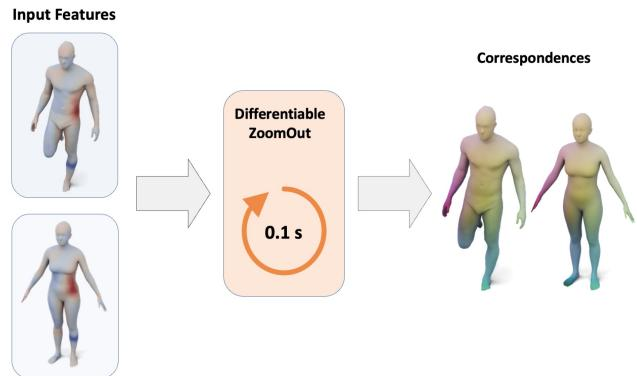
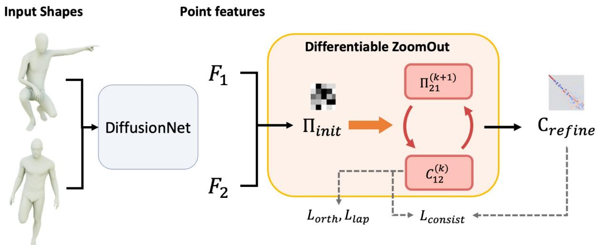
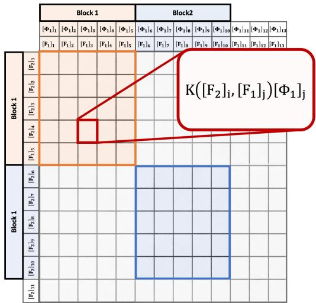
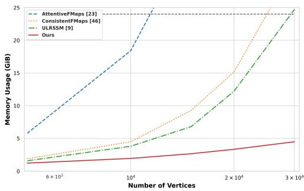
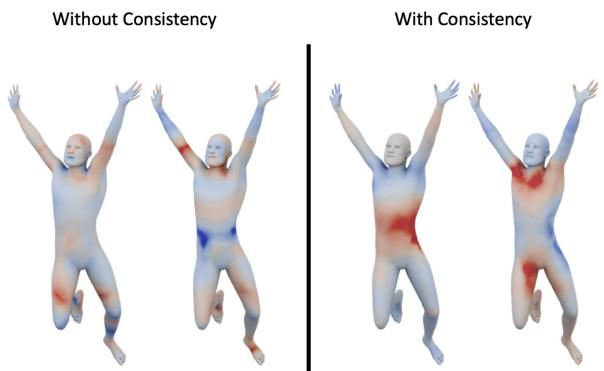

# Memory-Scalable and Simplified Functional Map Learning

Robin Magnet LIX, Ecole Polytechnique, IP Paris ´ rmagnet@lix.polytechnique.fr

Maks Ovsjanikov LIX, Ecole Polytechnique, IP Paris ´ maks@lix.polytechnique.fr

## Abstract

Deep functional maps have emerged in recent years as a prominent learning-basedframeworkfor non-rigid shape matching problems. While early methods in this domain only focused on learning in the functional domain, the latest techniques have demonstrated that by promoting consistency between functional and pointwise maps leads to significant improvements in accuracy. Unfortunately, existing approaches rely heavily on the computation of large dense matrices arising from soft pointwise maps, which compromises their efficiency and scalability. To address this limitation, we introduce a novel memory-scalable and efficient functional map learning pipeline. By leveraging the specific structure of functional maps, we offer the possibility to achieve identical results without ever storing the pointwise map in memory. Furthermore, based on the same approach, we present a differentiable map refinement layer adapted from an existing axiomatic refinement algorithm. Unlike many functional map learning methods, which use this algorithm at a post-processing step, ours can be easily used at train time, enabling to enforce consistency between the refined and initial versions of the map. Our resulting approach is both simpler, more efficient and more numerically stable, by avoiding differentiation through a linear system, while achieving close to state-of-the-art results in challenging scenarios.

## 1. Introduction

Automatically computing dense correspondences between non-rigid shapes is a classical problem in computer vision, forming the foundation of various downstream applications like shape registration [6], deformation [11, 45], and analysis [42]. A popular approach to tackle this problem involves the functional map pipeline [34], which represents correspondences as linear operators between functional spaces derived from the intrinsic Laplacian [31] on each shape. Numerous early methods [32, 33, 38] have leveraged this framework using handcrafted descriptors to generate functional maps, which can lack fine detail. Many algorithms [19, 27, 30, 39] have therefore successfully been developed in order to refine such imprecise maps into high quality dense correspondences.

  
Figure 1. Our method takes a set of point features as input, which can be learned, and uses a differentiable version of the ZoomOut algorithm to produce correspondences. Due to its light memory cost, it can be used while training a network, or when running the network on very dense meshes.

Building upon pioneering efforts by [12], recent advancements [17, 43, 46] have successfully explored the possibility of learning descriptors directly from data for subsequent functional map computations, adapting the original pipeline introduced by [34, 40]. Notably, the most recent developments in this area have observed that promoting functional maps to be “proper” (i.e., functional maps arising from pointwise ones) can lead to significant improvement in accuracy. The concept of “proper” functional maps was introduced in the optimization setting [39] and then quickly adopted within the learning context. Specifically, recent deep functional map methods have constructed dual-branch networks [2, 9, 23, 46] that enforce the connection between pointwise and functional maps and that have demonstrated impressive performance across multiple datasets. Interestingly, these studies highlighted the necessity of retaining the original functional map branch [46] to achieve optimal performance, despite its inherent instability when differentiating through the linear system solver [15].

In all these works, however, the “properness’ of functional maps is enforced by first computing a soft point-topoint map which is then converted to a functional map using matrix multiplication. This heavily limits the scalability of these approaches, as the dense pointwise map has to be stored in memory, which scales quadratically with the number of vertices. While common shape matching benchmarks only use meshes with low number of vertices, using these methods on real meshes is a serious challenge.

To address this limitation, we propose an approach that can compute the functional map associated with the soft p2p map, without ever storing the dense matrix in memory. Key to our approach is the fact that the proper functional map is defined as a matrix product between the soft pointwise map and the Laplacian basis [34, 39]. By exploiting this structure and GPU acceleration [10], we show that such matrix product can be computed directly without the necessity of storing the pointwise map, thus significantly improving both the speed and scalability of related approaches.

Our work additionally demonstrates the feasibility of discarding the original functional branch while preserving result quality. Our approach involves the transformation of a widely adopted map refinement algorithm [30], originally implemented on CPU, into a differentiable and memoryefficient GPU version using a similar pointwise map computation. Utilizing this refined map allows us to impose constraints on the structure of the learned functional map through a form of self-supervision. This, in turn, replaces the need for a consistency loss with the traditional functional map branch as in [9, 46], providing a novel simple and efficient solution for maintaining result quality in the absence of the original functional branch. Overall, our contributions can be summarized as follows:

• We propose efficient GPU implementation of differentiable pointwise map or functional map learning with minimal space complexity and numerical stability.

• We use a novel GPU adapted refinement algorithm at train time to provide self-supervision to the network.

• We introduce the first single-branch network for functional map learning without differentiating through a linear system solver.

## 2. Related Works

Shape matching and in particular functional map correspondence computation is a very wide and established a field of research. We here only review the works the closest to our work, and refer the interested reader to [35, 42] for an indepth description of related works.

Functional Maps Our work is built upon the functional map framework, originally developed in [34] and later extended in various ways [13, 30, 33, 38, 39], an overview being provided in [35]. This approach encodes correspondences between shapes as small sized matrices independently of the original number of vertices, offering an efficient way to compute maps. This then allows to efficiently enforce constraints on the correspondences such as bijectivity or area preservation using simple linear algebra. The most effective functional map algorithms are map refinement algorithms [16, 27, 30, 39], which take initial correspondences as input and iteratively refine them. While highly robust, obtaining initialization without landmarks often relies on the use of handcrafted descriptors such as HKS [7], WKS [4] or SHOT [48].

Deep Functional Maps A more recent line of research focus on learning descriptor functions directly from the surface itself. Originating with FMNet [25, 40] and further developed in [12, 43], these approaches typically take handcrafted descriptors as inputs and yield refined descriptor functions. These functions are then used in a standard functional map pipeline [34], and are usually postprocessed at test time using off-the-shelf map refinement algorithms [19, 30, 38, 50]. Using modern feature extractors for surfaces and point cloud [43, 47], these works obtained impressive results despite the unstable differentiation through a linear system solver [15]. While these initial approaches primarily focused on supervised learning, contemporary research in functional map learning emphasizes unsupervised learning of correspondences [8, 9, 23, 46]. This is achieved using functional map priors, that is, explicitly promoting structural properties on the learned functional map such as orthogonality - which corresponds to area preservation in the spatial domain. Recent advancements [39] have highlighted the importance of using extra structural constraint in the form of “proper” functional maps, that are functional maps obtained from pointwise correspondences, a guarantee not provided in the original pipeline [34] or learning-based approaches [12]. This led to the development of methods computing a second functional map at train-time using soft correspondences, resulting in dual-branches networks [2, 8, 9, 46]. These approaches were however recognized [46] as unable to scale to large meshes, due to large dense matrix computations, and had to use mesh resampling to avoid memory and speed issues.

Differentiable Refinement In a context also aligned with our work, it was noted in [23] that proper functional maps were guaranteed by many map refinement algorithms [27, 30, 39]. Subsequently, this refinement was partially integrated into a network as a differentiable post-processing step for the initially learned functional map. However, the design from [23] still relies on the original linear system solver, and their adaptation of [30] was only partial. This partial adaptation was necessitated by the potential memory overflow resulting from numerous dense map computations. Additionally, the output functional map was only a weighted sum of proper functional maps, thus lacking a guarantee of being proper itself.

## 3. Background & Motivation

Our method builds upon the functional map framework [34], and in particular of its recent development, using learning-based descriptors inspired by GeoFMaps [12]. Before describing our approach in Section 4, we provide an overview of the foundation of this pipeline. Interested readers are encouraged to explore numerous related works [2, 8, 9, 23, 35, 46] for additional insights into various adaptations and nuances of this framework.

Notations We will suppose to be given two shapes $S _ { 1 }$ and $S _ { 2 }$ with respectively $n _ { 1 }$ and $n _ { 2 }$ vertices. For each shape $S _ { i }$ we compute its intrinsic Laplacian [31], and store its eigenfunctions as columns of a matrix $\Phi _ { i } \in \mathbb { R } ^ { n _ { i } \times K }$ . We denote $\Phi _ { i } ^ { \dagger } = \Phi _ { i } ^ { \top } A _ { i }$ its pseudo-inverse, with $A _ { i }$ being the diagonal vertex-area matrix. Given any matrix $B ,$ we denote $[ B ] _ { i }$ the vector consisting of the i-th line of $B .$

Deep Functional Maps The standard deep functional map pipeline [12] takes 2 shapes $S _ { 1 }$ and $S _ { 2 }$ as input, and use a feature extractor network $\mathcal { F } _ { \theta }$ to generate p descriptor functions on each shape, stored as columns of matrices $F _ { i } = \mathcal { F } _ { \theta } ( S _ { i } ) \in \mathbb { R } ^ { n _ { i } \times p }$ . Following the standard functional map pipeline [34] these descriptors are first projected into the Laplacian basis $\mathbf { A } _ { i } = \boldsymbol { \Phi } _ { i } ^ { \dagger } \bar { F _ { i } } \in \mathbb { R } ^ { K \times p }$ and a functional map is obtained by solving the linear system:

$$
\underset { \mathbf { C } } { \arg \operatorname* { m i n } } \| \mathbf { C A } _ { 1 } - \mathbf { A } _ { 2 } \| _ { 2 } ^ { 2 } .\tag{1}
$$

This linear system is further usually regularized using an extra Laplacian term [12, 37]. During training, losses are then imposed on the computed functional map $\mathbf { C } ( \mathcal { F } _ { \theta } ( S _ { 1 } ) , \mathcal { F } _ { \theta } ( S _ { 2 } ) )$ . At test time, a pointwise map can be recovered from the map C and the eigenfunctions $\Phi _ { i }$ using nearest neighbor search [34, 36].

Two branches networks Recent works in functional map literature [39] have highlighted the positive effects of using proper functional maps. A functional map is proper if it arises from some underlying pointwise map. Specifically, a proper functional map is defined as the pull-back of a pointwise map $T : S _ { 2 }  S _ { 1 }$

$$
\mathbf { C } = \Phi _ { 2 } ^ { \dagger } \Pi \Phi _ { 1 }\tag{2}
$$

where $\Pi \in \{ 0 , 1 \} ^ { n _ { 2 } \times n _ { 1 } }$ is the matrix representation of the map T. Several works [2, 9, 46] adopt a differentiable approach to compute Π before deriving $\mathbf { C } _ { \mathrm { p r o p e r } }$ using Equation (2). Typically, the map Π is computed from the features $F _ { 1 }$ and $F _ { 2 }$ using a Gaussian kernel:

$$
\Pi _ { i j } = \frac { \exp ( \delta _ { i j } ) } { \sum _ { k } \exp ( \delta _ { i k } ) }\tag{3}
$$

with $\begin{array} { r } { \delta _ { i j } = - \frac { 1 } { 2 \sigma ^ { 2 } } \lVert [ F _ { 2 } ] _ { i } - [ F _ { 1 } ] _ { j } \rVert ^ { 2 } } \end{array}$ the distance between rows of the feature matrices, where σ a temperature - or blur parameter. For training purposes, a consistency loss between C, obtained with Eq. (1), and $\mathbf { C } _ { \mathrm { p r o p e r } }$ , derived using Eqs. (2) and (3), is employed. This approach is taken in addition to the standard orthogonality or bijectivity losses presented in [12].

ZoomOut A popular map refinement algorithm named ZoomOut [30] has often been used to obtain high-quality correspondences from low quality initial functional maps such as those obtained from learning pipelines. ZoomOut iteratively computes functional maps using Eq. (2) and pointwise map using nearest neighbor search between the rows of $\Phi _ { 1 } \mathbf { C } ^ { \bar { T } }$ and $\Phi _ { 2 }$ . Note that due to its iterative nature, ZoomOut is guaranteed to produce proper functional maps. A recent approximation [26] made the algorithm scalable to dense meshes on CPU, but however relies on sampling, a longer pre-processing and a final slow conversion from the samples back to the full shapes.

Drawbacks and motivation Despite achieving high quality results on shape matching benchmarks, the modern two-branches approaches presented above suffer from three notable drawbacks. Firstly, computing Π using Eq. (3) involves storing and differentiating through a dense $n _ { 2 } \times n _ { 1 }$ matrix, making the method scale poorly in terms of memory. In particular, because of the linear system used in the other branch, features are required to be of high dimension (usually 128 or 256) to ensure invertibility of the feature matrix, thus heavily slowing down computations. Secondly, a naive implementation of Eq. (3) can result in underflows in the forward or backward pass for low values of $\sigma .$ Thirdly, as remarked in some previous works [15] despite its necessity for achieving satisfactory results, the original functional map branch from [12] poses a risk of instability due to differentiation through the linear system solver.

In this work, we seek to address these challenges by establishing soft point-wise maps as a stable and memoryscalable option to learn functional maps, without approximations such as those presented in [26]. A second goal lies in trying to completely remove the spectral branch from the learning procedure. The necessity of the spectral branch suggested in [46] hints that properness might not be a sufficient constraint alone for efficient learning of correspondences. To overcome this challenge, we further refine the structural constraints by introducing the expectation that the functional map aligns with its refined version, produced by [30]. This leads to the first deep functional map method that completely avoids solving a linear system inside the network, enables unsupervised training, is scalable, efficient and leads to high quality results.

  
Figure 2. Our pipeline takes as input two shapes and use a feature extractor network to obtain pointwise features. These features are used to compute an initial pointwise map and then fed to our Differentiable ZoomOut block. All the pointwise maps Π are our scalable dense maps, which are memory efficient.

## 4. Method

In this section, we introduce our scalable approach to proper functional maps, which we then apply to design a novel GPU based differentiable version of the ZoomOut [30] algorithm. Finally, using these two elements, we introduce our new single branch network for functional map learning without a linear system solver.

## 4.1. Scalable Dense Maps

The key observation to this work is that all dense pointwise maps computed in deep functional map pipelines [3, 9, 23, 46] are used exclusively to compute functional maps using Equation (2). In particular, they are invariably found in a matrix product of the form $\Pi \Phi _ { 1 }$ . Previous work did not seek to exploit this fact, and instead computed the complete dense matrix Π separately before performing the matrix product. In contrast, we argue it is possible to compute the result of this inner product without ever computing any dense $n _ { 2 } \times n _ { 1 }$ matrix.

Observe first that we can explicitly write the i-th line of $\Pi \Phi _ { 1 }$ , using Equation (3) as:

$$
\begin{array} { l } { { [ \Pi \Phi _ { 1 } ] _ { i } = \displaystyle \sum _ { j = 1 } ^ { n _ { 1 } } \frac { \exp ( \delta _ { i j } ) } { \sum _ { k } \exp ( \delta _ { i k } ) } [ \Phi _ { 1 } ] _ { j } } } \\ { { = \displaystyle L _ { i } ^ { - 1 } \sum _ { j = 1 } ^ { n _ { 1 } } K \big ( [ F _ { 2 } ] _ { i } , [ F _ { 1 } ] _ { j } \big ) [ \Phi _ { 1 } ] _ { j } . } } \end{array}\tag{4}
$$

(5)

where K is an RBF Kernel, and $L _ { i }$ the row normalization. By rewriting the proper functional map definition in this kernel form, we can now leverage existing methods for heavily scalable and fast GPU computation with kernels [10, 28, 41]. These methods rely on, in particular, the fact that the entry $( i , j )$ of the Kernel matrix $K =$ $\big ( \exp ( \delta _ { i j } ) \big ) _ { i j }$ only depends on the vectors $[ F _ { 2 } ] _ { i }$ and $[ F _ { 1 } ] _ { j } .$ This allows to compute the sum in Equation (5) in a blockwise manner, where the values of K are computed during summation. This is highlighted in Figure 3, where we represent the dense matrix on which summation in applied in Equation (5). The per-row sum can then be computed first for each contiguous memory block before summing all the outputs to obtain the value of ΠΦ .

In practice, we rely on the Keops library [10], which applies such operations on very large dense matrices whose entries can be described by mathematical formulas applied to the inputs. Keops uses symbolic matrices, and computes reduction on-the-fly using per-block operations for fast computation without ever fitting the dense matrix in memory.

Note that the normalization $L _ { i }$ can additionally be handled using efficient stabilized logsumexp reductions and incorporated into the Kernel K to avoid underflow or overflow in the exponential. Furthermore, the gradient of $\Pi \Phi _ { 1 }$ with respect to $F _ { 1 }$ and $F _ { 2 }$ can be computed using a similar trick [10].

At test time, a vertex-to-vertex map can be extracted from Π by looking for the indices of the per-row maximal value, which is equivalent to running nearest neighbor search between the rows of $F _ { 1 }$ and the rows of $F _ { 2 }$ . This can again be run efficiently on GPU without computing the dense distance matrix, using GPU-based nearest neighbor implementations [10, 21].

Ultimately, our dense pointwise map only stores values for $F _ { 1 }$ and $F _ { 2 }$ as well as a the type of Kernel we use, and has therefore a linear memory cost.

  
Figure 3. Our scalable dense maps relies on the underlying structure of Eq. (5), where the sum is computed for each contiguous memory block highlighted in the image. The entries are evaluated on the fly while performing summation, and results from each block are then accumulated to obtain the final per-rows values. The implementation is provided by the Keops package [10].

## 4.2. Differentiable ZoomOut

As mentioned in Section 3, the ZoomOut algorithm [30] iteratively performs pointwise map computations using nearest neighbor queries between rows of $\Phi _ { 1 } \mathbf { C } _ { 1 2 } ^ { \top }$ and of $\Phi _ { 2 } ,$ and functional map computations using Eq. (2), while increasing the size $K$ of the spectral basis. By replacing the nearest neighbor queries by differentiable soft maps that we store using our scalable versions, we introduce Differentiable ZoomOut, a fast and fully differentiable block, with negligible memory cost. The algorithm is presented in detail in the supplementary material.

Since ZoomOut acts as a powerful map refinement algorithm, we would like to enforce consistency between the output and input functional maps of the ZoomOut algorithm in order to help training. We expect such a loss to provide meaningful guidance to the features.

However, we note that the output functional map $\mathbf { C } _ { \mathrm { r e f i n e } }$ has a larger size than the initial map $\mathbf { C } _ { \mathrm { i n i t } }$ This is due to ZoomOut using an increasing size of spectral basis. However, given a proper functional map of size $K _ { 2 } \times K _ { 1 }$ associated to a pointwise map Π, the principal submatrix composed of its first $K _ { 2 } ^ { \prime }$ rows and $K _ { 1 } ^ { \prime }$ column from the proper functional map of size $K _ { 2 } ^ { \prime } \times K _ { 1 } ^ { \prime }$ associated to the same map Π. This stems from the definition of proper functional maps [34], and we refer to the supplementary for details on this aspect. Therefore, our new consistency loss only uses a principal submatrix of the refined functional map:

$$
L _ { \mathrm { c o n s i s t } } ( \mathbf { C } _ { \mathrm { i n i t } } , \mathbf { C } _ { \mathrm { r e f i n e } } ) = \| \mathbf { C } _ { \mathrm { i n i t } } - [ \mathbf { C } _ { \mathrm { r e f i n e } } ] _ { 1 : K _ { \mathrm { i n i t } } , 1 : K _ { \mathrm { i n i t } } } \| _ { 2 } ^ { 2 }\tag{6}
$$

where $K _ { \mathrm { i n i t } }$ is the size of the input functional map.

## 4.3. Overall Pipeline and Implementation

We would first like to highlight that our scalable dense maps can be used in any existing functional map base model using dense pointwise maps, with no impact on the results. Furthermore, we present a novel singlebranch network for functional map prediction which exploits the structural properties of proper functional maps and does not require solving or differentiating through a linear system. We therefore present separate implementations first for our scalable dense maps and differentiable ZoomOut at https : / / github . com/RobinMagnet/ScalableDenseMaps, and of our entire pipeline at https : / / github . com / RobinMagnet/SimplifiedFmapsLearning.

As shown in Figure 2, our algorithm first extracts features from surfaces $S _ { 1 }$ and $S _ { 2 }$ using DiffusionNet [43]. This produces matrices of features $F _ { 1 } \in \mathbb { R } ^ { n _ { 1 } \times p }$ and $F _ { 2 } \in$ $\mathbb { R } ^ { n _ { 2 } \times p }$ . Importantly, we select $p = 3 2$ instead of the 128 or 256 Features produced by standard pipelines [2, 8, 9, 23, 46], as our approach does not require invertibility of a linear system obtained from the learned features.

An initial soft pointwise map $\Pi _ { \mathrm { i n i t } }$ is produced from the features using Equation (3), and then fed into our Differentiable ZoomOut algorithm presented in Section 4.2 where we perform 10 iteration with a spectral step size of 10 starting with $K _ { \mathrm { i n i t } } = 3 0$ . This results in a refined map $\mathbf { C } _ { \mathrm { f i n a l } }$ of size $K _ { \mathrm { f i n a l } } = 1 3 0$ . This whole process uses a blur parameter $\sigma = 1 0 ^ { - 2 }$ , which is much lower than previous implementations [23, 44, 46].

Our unsupervised training loss consists in 3 terms. First, an orthogonality constraint $\bar { L } _ { \mathrm { o r t h } } ( \mathbf { C } _ { \mathrm { i n i t } } ) = \| \mathbf { C } _ { \mathrm { i n i t } } ^ { \top } \mathbf { C } _ { \mathrm { i n i t } } - I \| _ { 2 } ^ { 2 }$ is applied to the initial functional map, with a weight of 1. The ZoomOut consistency loss from Equation (6) is applied with an initial weight of $1 0 ^ { - 4 }$ , gradually increased to $1 0 ^ { - 1 }$ . This term is therefore ignored during the first epochs until decent initialization has been found. We refer to the supplementary for more details on this aspect. We finally regularize the result using a Laplacian commutativity term as presented in [8, 37], which is a residual from the spectral branch we discarded. This final term receives a weight of $1 0 ^ { 2 }$ . Eventually, we train our network using ADAM optimizer [22] with an initial learning rate of $1 0 ^ { - 5 }$ . We refer the reader to the supplementary for some more precise details on the implementation.

## 4.4. Properties of learned features

An interesting aspect of the two-branches networks [2, 9, 46] is that each branch offers a different interpretation of the learned features. On the one hand, the standard functional map branch [12, 34] uses features $F _ { 1 }$ and $F _ { 2 }$ as functions on the shapes, expected to correspond, and forces the functional map to effectively transfer them when solving the linear system in Equation (1). On the other hand, the pointwise-map based branch solely relies on distances between rows of the feature matrices (Eq. (3)), viewing features as pointwise embeddings only.

<table><tr><td rowspan="2">Train Test</td><td colspan="3">F</td><td colspan="3">S</td><td colspan="3">F+S</td></tr><tr><td>F</td><td>S</td><td>S19</td><td>F</td><td>S</td><td>S19</td><td>F</td><td>S</td><td>S19</td></tr><tr><td>BCICP [38]</td><td>6.1</td><td></td><td></td><td></td><td>11.</td><td></td><td></td><td></td><td></td></tr><tr><td>ZoomOut [30]</td><td>6.1</td><td></td><td></td><td></td><td>7.5</td><td></td><td></td><td></td><td></td></tr><tr><td>SmoothShells [16]</td><td>2.5</td><td></td><td></td><td></td><td>4.7</td><td></td><td></td><td></td><td></td></tr><tr><td>DiscreteOp [39]</td><td>5.6</td><td>-</td><td>-</td><td>-</td><td>13.1</td><td></td><td>-</td><td>-</td><td></td></tr><tr><td>GeomFmaps [12]</td><td>3.5</td><td>4.8</td><td>8.5</td><td>4.0</td><td>4.3</td><td>11.2</td><td>3.5</td><td>4.4</td><td>7.1</td></tr><tr><td>Deep Shells [17]</td><td>1.7</td><td>5.4</td><td>27.4</td><td>2.7</td><td>2.5</td><td>23.4</td><td>1.6</td><td>2.4</td><td>21.1</td></tr><tr><td>NeuroMorph [18]</td><td>8.5</td><td>28.5</td><td>26.3</td><td>18.2</td><td>29.9</td><td>27.6</td><td>9.1</td><td>27.3</td><td>25.3</td></tr><tr><td>DUO-FMNet [14]</td><td>2.5</td><td>4.2</td><td>6.4</td><td>2.7</td><td>2.6</td><td>8.4</td><td>2.5</td><td>4.3</td><td>6.4</td></tr><tr><td>UDMSM [8]</td><td>1.5</td><td>7.3</td><td>21.5</td><td>8.6</td><td>2.0</td><td>30.7</td><td>1.7</td><td>3.2</td><td>17.8</td></tr><tr><td>ULRSSM [9]</td><td>1.6</td><td>6.4</td><td>14.5</td><td>4.5</td><td>1.8</td><td>18.5</td><td>1.5</td><td>2.0</td><td>7.9</td></tr><tr><td>ULRSSM (w/ fine-tune) [9]</td><td>1.6</td><td>2.2</td><td>5.7</td><td>1.6</td><td>1.9</td><td>6.7</td><td>1.6</td><td>2.1</td><td>4.6</td></tr><tr><td>AttentiveFMaps [23]</td><td>1.9</td><td>2.6</td><td>5.8</td><td>1.9</td><td>2.1</td><td>8.1</td><td>1.9</td><td>2.3</td><td>6.3</td></tr><tr><td>ConsistentFMaps [46]</td><td>2.3</td><td>2.6</td><td>3.8</td><td>2.5</td><td>2.4</td><td>4.5</td><td>2.2</td><td>2.3</td><td>4.3</td></tr><tr><td>Ours</td><td>1.9</td><td>2.4</td><td>4.2</td><td>1.9</td><td>2.4</td><td>6.9</td><td>1.9</td><td>2.3</td><td>3.6</td></tr></table>

Table 1. Mean geodesic errors (×100) when training and testing on the Faust, Scape and Shrec19 datasets. Best result is shown in bold.

Using a consistency loss between the two branches enables to merge the two effects, and, as highlighted in [46], removing the spectral branch has a serious impact on the results. In our experiments in Section 5, we observe that features learned without the spectral branch usually exhibited undesirable high-frequency variations. As emphasized by [2], smoothness of features is a key aspect for the generalization for functional map based methods. While all networks using the spectral branch provide relatively smooth features, we show in Section 5.4 that replacing this branch using a refinement consistency loss also promotes smoothness in features in our pipeline.

## 5. Results

In this section, we conduct a series of experiments to assess various aspects of our proposed method. In order to validate the capability of our entire pipeline, we first compare our method to several other works on multiple shape matching benchmarks. We additionally wish to highlight our scalable dense maps appear as a valuable tool for many functional map based networks using dense pointwise maps, independently of our complete pipeline. We therefore emphasize the memory scalability of our GPU-based ZoomOut algorithm compared to existing implementations of the algorithm.

Finally, inspired by [2] we analyze how our novel ZoomOut consistency loss we introduced at train-time influences the features learned by our feature extractor.

## 5.1. Datasets

We evaluate the shape matching performance of our algorithm across four widely-used human datasets, commonly employed as benchmarks. The evaluation includes the remeshed [38] version FAUST dataset [5] which contains 100 shapes, split in 80 and 20 shapes for training and testing as introduced in [12]. We also use the remeshed [38] version of the SCAPE dataset [1] with 71 humans divided in 51 shapes for training and 20 for testing. For testing purposes only, the remeshed version of the SHREC19 dataset [29], composed of 44 shapes, is also included.

While these datasets mostly contain near-isometric shapes, we also evaluate our method on the remeshed [27] Deforming Things 4D dataset [24], a challenging nonisometric dataset of humanoid shapes. In particular, we focus on the adapted version DT4D-H defined in [23], which defines 198 shapes for training and 95 for testing. Results on the SMAL [52] dataset, with PCK curves, can be found in the supplementary material.

## 5.2. Shape Matching Results

In this work, we exclusively evaluate unsupervised learning performances, and therefore discard baselines focusing on pure supervised learning [20, 25, 49, 51]. As a reference, we provide results using axiomatic functional map algorithms such as ZoomOut [30], Discrete Optimization [39], BCICP [38] and SmoothShells [16].

Our method can directly be compared to the following baselines: GeomFmaps [12], DUO-FMNet [14], DeepShells [17], NeuroMorph [18], AttentiveFMaps [23],

<table><tr><td rowspan="2">Train Test</td><td colspan="2">DT4D-H</td></tr><tr><td>intra-class</td><td>inter-class</td></tr><tr><td>Deep Shells [17]</td><td>3.4</td><td>31.1</td></tr><tr><td>DUO-FMNet [14]</td><td>2.6</td><td>15.8</td></tr><tr><td>AttentiveFMaps [23]</td><td>1.2</td><td>14.6</td></tr><tr><td>ULRSSM [9]</td><td>0.9</td><td>4.4</td></tr><tr><td>ConsistentFMaps [46]</td><td>1.2</td><td>6.1</td></tr><tr><td>Ours</td><td>1.8</td><td>4.1</td></tr></table>

Table 2. Mean geodesic error (×100) on the DeformingThing4D dataset subset from [23] (DT4D-H). Best results are highlighted in bold.

ConsistentFMaps [46], UDMSM [8], and ULRSSM [9]. Note that we all results are presented without test time refinement for fairness. In particular, ULRSSM [9] relies on fine-tuning the network for each shape in the test dataset independently, which we turn off to obtain the result. We provide results with fine-tuning using the “w/ fine-tune” tag. Note that we provide comparison with a more complete set of methods in the supplementary materials, as well as results of our pipeline without using the consistency loss.

Table 1 provides the mean geodesic error for all the aforementioned baselines, as well as for our pipeline described in Section 4.3. We evaluate our methods on combinations of the Faust (F), Scape (S) and Shrec19 (S19), when training either on Faust and Scape independently, or jointly (F+S). This table shows our simple pipeline provides similar performance to state of the arts methods, all the while being greatly scalable to large meshes and removing the need for differentiation through a linear system solver.

In addition, we evaluate our network on the DeformingThings4D dataset, and in particular on the subset provided in [23] for evaluation, as displayed on Table 2. Our method achieves better performance than existing baselines on the inter-class category, which shows its capabilities even in non-isometric scenarios.

  
Figure 4. GPU memory usage when processing a single pair of shapes, depending on their vertex count. Note, e.g., that AttentiveFMaps [23] runs out of 24GB memory after 11k vertices.

## 5.3. Scalability to Dense Meshes

In this section, we discuss the memory efficiency of our scalable maps, and highlight its speed performance in the case of very dense meshes where standard methods would go out of GPU-memory.

A first observation, provided in Figure 4 shows the GPU memory usage, using varying number of vertices, of current state-of-the-art methods for unsupervised shape matching. In particular, we notice that AttentiveFMaps [23], due to its multiple dense pointwise map computations, quickly runs out of 24 GiB GPU memory. On the other hand, while our method uses 11 different pointwise maps, its memory footprint remains significantly lower than competing methods [9, 46], in particular for large number of vertices.

Secondly, we analyze our results on the standard axiomatic ZoomOut algorithm [30], often used independently of learning pipelines, e.g. as a means to obtain maps from simple landmarks. In that case, we observe that usual implementations never leverage GPU acceleration and were only run on CPU, and we easily ported the code to GPU using PyTorch.

In Table 3, we first compare the CPU, GPU, and our version of ZoomOut, and show that the processing time in the presence of dense meshes remain reasonable. Our version of ZoomOut (“Our ZoomOut”) uses the same tools used to implement our Differentiable ZoomOut in Section 4.2, with a scalable version of brute force nearest neighbor in Keops [10], which again does not require fitting the distance matrix in memory. We additionally compare a na¨ıve PyTorch implementation of our Differentiable ZoomOut (Sec. 4.2) with one using our scalable dense maps. Finally, we add results by porting the approximation from [26] to GPU and using scalable dense maps (“Our + [26]”). More details on this mix and its usage are provided in the supplementary material.

Table 3 presents the results of applying these algorithms to shapes of varying sizes. In the initial experiment with meshes of around 5000 vertices, all methods exhibit similar performance, significantly outperforming the CPU-based algorithm due to GPU utilization. However, with denser meshes containing $1 0 ^ { 5 }$ vertices, conventional methods encounter GPU memory limitations, while our scalable dense maps offer notable improvements over existing approaches. Moreover, our modification of [26], which approximates the algorithm, presents the fastest results without memory overloading. This solves the main speed bottleneck presented in [26], with more details provided in the supplementary.

Our method therefore allows using several dense pointwise maps simultaneously, or training and testing functional maps network directly on dense shapes. We refer the interested reader to the supplementary material for such experiments on dense meshes, including texture transfer visualization.

<table><tr><td>Sparse (5K)</td><td>Dense (100k)</td></tr><tr><td>CPU ZoomOut</td><td>3.6 s 700 s</td></tr><tr><td>GPU ZoomOut 0.1 s</td><td>OOM</td></tr><tr><td>GPU Diff. ZoomOut 0.1 s</td><td>OOM</td></tr><tr><td>Our ZoomOut</td><td>0.1 s 2.4 s</td></tr><tr><td>Our Diff. ZoomOut 0.1 s</td><td>5s</td></tr><tr><td>Our + [26]</td><td>0.1 s 0.4 s</td></tr></table>

Table 3. Average processing time in seconds, between CPU, GPU, and memory scalable implementations of ZoomOut and Differentiable ZoomOut. The number of vertices is given in parentheses.

## 5.4. Learned Features

As highlighted in [2], analyzing the features learned in deep functional map networks valuable insights into their performance. In particular, it was shown that achieving smooth features positively impacts the network’s generalization capabilities.

The authors of [2] thus advocated explicitly enforcing features smoothness using spectral projection. This was used in [46] as well as in AttentiveFMaps [23]. In contrast, we do not enforce such constraints and no no loss in our pipeline directly promotes smoothness. In particular, the dense pointwise map Π built from the features do not use any neighboring information.

However, we show that the consistency loss introduced in Section 4.2 actually pushes the feature extractor to learn smooth features. To observe this, we retrain our network on the Scape dataset while removing the consistency loss from Equation (6), and visualize the learned features on test datasets. Figure 5 shows example of feature functions produced by the networks when trained with and without the consistency loss on a random surface from the SHREC19 dataset. On the left side of this image, we observe that without refinement consistency, the features seem to highlight multiple small patches on the surface. In contrast, the feature functions learned by our method, displayed on the rightmost part of the image, present nicer patterns where large geodesic patches of the surfaces are highlighted.

We argue that obtaining an orthogonal functional map from a soft pointwise map built with features does not require such features to exhibit smoothness. However, the introduction of the consistency loss serves a dual purpose. While its primary role is to align the functional map with the output of a refinement algorithm, it inadvertently acts as a compelling constraint that encourages the learning of smoother features. As this property has been noted as key to performance [2, 46], these result leads us to believe that incorporating such a loss into existing pipelines holds significant promise for enhancing overall performance in functional map learning.

  
Figure 5. Example of feature functions learned by our model, with or without consistency loss. As noted by [2], smoother features are generally preferred for generalization purposes.

## 6. Conclusion, Limitations & Future Work

In this work, we presented a novel approach to compute functional maps using soft pointwise map, without ever storing the dense matrix in memory. This novel implementation enables use to derive a fast, differentiable and memory efficient version of the ZoomOut algorithm [30]. In turn, we use this algorithm while training and derive a new consistency loss between the initial and refined version of the predicted functional map. We notice this loss appears particularly effective and allows us to use a new singlebranch architecture for functional map learning, which does not require differentiating through a linear system.

One major limitation of our method is its dependence on the computation of the spectrum Laplacian of the input shapes, which can become prohibitively slow with larger shapes. Furthermore, the ZoomOut algorithm, while particularly fit to handle near-isometric shapes, is prone to fail in the presence of highly non-isometric deformations or partiality [27]. The guidance provided by the consistency loss would then be unfit for the problem.

Future research could therefore seek to handle meshes with higher differences such as partiality, noise or simply high distortion. This would potentially require incorporating other refinement algorithms into the training pipeline. Investigating the impact of our new consistency loss in various pipelines would also contribute to a comprehensive understanding of its applicability and effectiveness.

Acknowledgements. The authors thank the anonymous reviewers for their valuable comments and suggestions. Parts of this work were supported by the ERC Starting Grant 758800 (EXPROTEA), ERC Consolidator Grant 101087347 (VEGA), ANR AI Chair AIGRETTE, as well as gifts from Ansys and Adobe Research.

## References

[1] Dragomir Anguelov, Praveen Srinivasan, Daphne Koller, Sebastian Thrun, Jim Rodgers, and James Davis. SCAPE: Shape completion and animation of people. ACM Transactions on Graphics, 24(3):408–416, 2005. 6

[2] Souhaib Attaiki and Maks Ovsjanikov. Understanding and Improving Features Learned in Deep Functional Maps. In 2023 IEEE/CVF Conference on Computer Vision and Pattern Recognition (CVPR), pages 1316–1326, Vancouver, BC, Canada, 2023. IEEE. 1, 2, 3, 5, 6, 8

[3] Souhaib Attaiki, Gautam Pai, and Maks Ovsjanikov. DPFM: Deep Partial Functional Maps. In 2021 International Conference on 3D Vision (3DV), pages 175–185, London, United Kingdom, 2021. IEEE. 4

[4] Mathieu Aubry, Ulrich Schlickewei, and Daniel Cremers. The wave kernel signature: A quantum mechanical approach to shape analysis. In 2011 IEEE International Conference on Computer Vision Workshops (ICCV Workshops), pages 1626–1633, Barcelona, Spain, 2011. IEEE. 2

[5] Federica Bogo, Javier Romero, Matthew Loper, and Michael J. Black. FAUST: Dataset and Evaluation for 3D Mesh Registration. In Proceedings of the IEEE Conference on Computer Vision and Pattern Recognition, pages 3794– 3801, 2014. 6

[6] Federica Bogo, Javier Romero, Gerard Pons-Moll, and Michael J. Black. Dynamic FAUST: Registering Human Bodies in Motion. In 2017 IEEE Conference on Computer Vision and Pattern Recognition (CVPR), pages 5573–5582, Honolulu, HI, 2017. IEEE. 1

[7] Michael M. Bronstein and Iasonas Kokkinos. Scale-invariant heat kernel signatures for non-rigid shape recognition. In 2010 IEEE Computer Society Conference on Computer Vision and Pattern Recognition, pages 1704–1711, San Francisco, CA, USA, 2010. IEEE. 2

[8] Dongliang Cao and Florian Bernard. Unsupervised Deep Multi-shape Matching. In Computer Vision – ECCV 2022, pages 55–71. Springer Nature Switzerland, Cham, 2022. 2, 3, 5, 6, 7

[9] Dongliang Cao, Paul Roetzer, and Florian Bernard. Unsupervised Learning of Robust Spectral Shape Matching. ACM Transactions on Graphics, 42(4):132:1–132:15, 2023. 1, 2, 3, 4, 5, 6, 7

[10] Benjamin Charlier, Jean Feydy, Joan Alexis Glaunes,\` Franc¸ois-David Collin, and Ghislain Durif. Kernel operations on the gpu, with autodiff, without memory overflows. Journal of Machine Learning Research, 22(74):1–6, 2021. 2, 4, 5, 7

[11] Bailin Deng, Yuxin Yao, Roberto M. Dyke, and Juyong Zhang. A Survey of Non-Rigid 3D Registration. Computer Graphics Forum, 41(2):559–589, 2022. 1

[12] Nicolas Donati, Abhishek Sharma, and Maks Ovsjanikov. Deep Geometric Functional Maps: Robust Feature Learning for Shape Correspondence. In 2020 IEEE/CVF Conference on Computer Vision and Pattern Recognition (CVPR), pages 8589–8598, Seattle, WA, USA, 2020. IEEE. 1, 2, 3, 5, 6

[13] Nicolas Donati, Etienne Corman, Simone Melzi, and Maks Ovsjanikov. Complex Functional Maps: A Conformal Link

Between Tangent Bundles. Computer Graphics Forum, 41 (1):317–334, 2022. 2

[14] Nicolas Donati, Etienne Corman, and Maks Ovsjanikov. Deep orientation-aware functional maps: Tackling symmetry issues in Shape Matching. In 2022 IEEE/CVF Conference on Computer Vision and Pattern Recognition (CVPR), pages 732–741, New Orleans, LA, USA, 2022. IEEE. 6, 7

[15] Omri Efroni, Dvir Ginzburg, and Dan Raviv. Spectral Teacher for a Spatial Student: Spectrum-Aware Real-Time Dense Shape Correspondence. In 2022 International Conference on 3D Vision (3DV), pages 1–10, 2022. 1, 2, 3

[16] Marvin Eisenberger, Zorah Lahner, and Daniel Cremers. Smooth Shells: Multi-Scale Shape Registration With Functional Maps. In Proceedings of the IEEE/CVF Conference on Computer Vision and Pattern Recognition, pages 12265– 12274, 2020. 2, 6

[17] Marvin Eisenberger, Aysim Toker, Laura Leal-Taixe, and´ Daniel Cremers. Deep Shells: Unsupervised Shape Correspondence with Optimal Transport. Advances in Neural Information Processing Systems, 33, 2020. 1, 6, 7

[18] M. Eisenberger, D. Novotny, G. Kerchenbaum, P. Labatut, N. Neverova, D. Cremers, and A. Vedaldi. NeuroMorph: Unsupervised Shape Interpolation and Correspondence in One Go. In 2021 IEEE/CVF Conference on Computer Vision and Pattern Recognition (CVPR), pages 7469–7479, Los Alamitos, CA, USA, 2021. IEEE Computer Society. 6

[19] Danielle Ezuz and Mirela Ben-Chen. Deblurring and Denoising of Maps between Shapes. Computer Graphics Forum, 36(5):165–174, 2017. 1, 2

[20] Thibault Groueix, Matthew Fisher, Vladimir G. Kim, Bryan C. Russell, and Mathieu Aubry. 3D-CODED : 3D Correspondences by Deep Deformation. arXiv:1806.05228 [cs], 2018. 6

[21] Jeff Johnson, Matthijs Douze, and Herve J ´ egou. Billion-´ scale similarity search with GPUs. IEEE Transactions on Big Data, 7(3):535–547, 2019. 4

[22] Diederik Kingma and Jimmy Ba. Adam: A method for stochastic optimization. In International Conference on Learning Representations (ICLR), San Diega, CA, USA, 2015. 5

[23] Lei Li, Nicolas Donati, and Maks Ovsjanikov. Learning Multi-resolution Functional Maps with Spectral Attention for Robust Shape Matching. Advances in Neural Information Processing Systems, 35:29336–29349, 2022. 1, 2, 3, 4, 5, 6, 7, 8

[24] Yang Li, Hikari Takehara, Takafumi Taketomi, Bo Zheng, and Matthias Niesner. 4DComplete: Non-Rigid Motion Estimation Beyond the Observable Surface. In 2021 IEEE/CVF International Conference on Computer Vision (ICCV), pages 12686–12696, Montreal, QC, Canada, 2021. IEEE. 6

[25] Or Litany, Tal Remez, Emanuele Rodola, Alex Bronstein, and Michael Bronstein. Deep Functional Maps: Structured Prediction for Dense Shape Correspondence. In 2017 IEEE International Conference on Computer Vision (ICCV), pages 5660–5668, Venice, 2017. IEEE. 2, 6

[26] Robin Magnet and Maks Ovsjanikov. Scalable and Efficient Functional Map Computations on Dense Meshes. Computer Graphics Forum, 42(2):89–101, 2023. 3, 7, 8

[27] Robin Magnet, Jing Ren, Olga Sorkine-Hornung, and Maks Ovsjanikov. Smooth Non-Rigid Shape Matching via Effective Dirichlet Energy Optimization. In 2022 International Conference on 3D Vision (3DV), pages 495–504, Prague, Czech Republic, 2022. IEEE. 1, 2, 6, 8

[28] Giacomo Meanti, Luigi Carratino, Lorenzo Rosasco, and Alessandro Rudi. Kernel Methods Through the Roof: Handling Billions of Points Efficiently. In Advances in Neural Information Processing Systems, pages 14410–14422. Curran Associates, Inc., 2020. 4

[29] S. Melzi, R. Marin, E. Rodola, U. Castellani, J. Ren, A.\` Poulenard, P. Wonka, and M. Ovsjanikov. Matching Humans with Different Connectivity. The Eurographics Association, 2019. 6

[30] Simone Melzi, Jing Ren, Emanuele Rodola, Abhishek\` Sharma, Peter Wonka, and Maks Ovsjanikov. ZoomOut: Spectral upsampling for efficient shape correspondence. ACM Transactions on Graphics, 38(6):1–14, 2019. 1, 2, 3, 4, 5, 6, 7, 8

[31] Mark Meyer, Mathieu Desbrun, Peter Schroder, and Alan H.¨ Barr. Discrete Differential-Geometry Operators for Triangulated 2-Manifolds. In Visualization and Mathematics III, pages 35–57. Springer Berlin Heidelberg, Berlin, Heidelberg, 2003. 1, 3

[32] Dorian Nogneng and Maks Ovsjanikov. Informative Descriptor Preservation via Commutativity for Shape Matching. Computer Graphics Forum, 36(2):259–267, 2017. 1

[33] D. Nogneng, S. Melzi, E. Rodola, U. Castellani, M. Bron-\` stein, and M. Ovsjanikov. Improved Functional Mappings via Product Preservation. Computer Graphics Forum, 37(2): 179–190, 2018. 1, 2

[34] Maks Ovsjanikov, Mirela Ben-Chen, Justin Solomon, Adrian Butscher, and Leonidas Guibas. Functional maps: A flexible representation of maps between shapes. ACM Transactions on Graphics, 31(4):1–11, 2012. 1, 2, 3, 5

[35] Maks Ovsjanikov, Etienne Corman, Michael Bronstein, Emanuele Rodola, Mirela Ben-Chen, Leonidas Guibas,\` Frederic Chazal, and Alex Bronstein. Computing and processing correspondences with functional maps. In ACM SIG-GRAPH 2017 Courses, pages 1–62, New York, NY, USA, 2017. Association for Computing Machinery. 2, 3

[36] Gautam Pai, Jing Ren, Simone Melzi, Peter Wonka, and Maks Ovsjanikov. Fast Sinkhorn Filters: Using Matrix Scaling for Non-Rigid Shape Correspondence with Functional Maps. In CVPR, Nashville (virtual), United States, 2021. 3

[37] Jing Ren, Mikhail Panine, Peter Wonka, and Maks Ovsjanikov. Structured Regularization of Functional Map Computations. Computer Graphics Forum, 38(5):39–53, 2019. 3, 5

[38] Jing Ren, Adrien Poulenard, Peter Wonka, and Maks Ovsjanikov. Continuous and orientation-preserving correspondences via functional maps. ACM Transactions on Graphics, 37(6):1–16, 2019. 1, 2, 6

[39] Jing Ren, Simone Melzi, Peter Wonka, and Maks Ovsjanikov. Discrete Optimization for Shape Matching. Computer Graphics Forum, 40(5):81–96, 2021. 1, 2, 3, 6

[40] Jean-Michel Roufosse, Abhishek Sharma, and Maks Ovsjanikov. Unsupervised Deep Learning for Structured Shape Matching. In 2019 IEEE/CVF International Conference on Computer Vision (ICCV), pages 1617–1627, Seoul, Korea (South), 2019. IEEE. 1, 2

[41] Alessandro Rudi, Luigi Carratino, and Lorenzo Rosasco. FALKON: An Optimal Large Scale Kernel Method. In Advances in Neural Information Processing Systems. Curran Associates, Inc., 2017. 4

[42] Yusuf Sahillioglu. Recent advances in shape correspon-˘ dence. The Visual Computer, 36(8):1705–1721, 2020. 1, 2

[43] Nicholas Sharp, Souhaib Attaiki, Keenan Crane, and Maks Ovsjanikov. DiffusionNet: Discretization Agnostic Learning on Surfaces. ACM Transactions on Graphics, 41(3):27:1– 27:16, 2022. 1, 2, 5

[44] Yi Shi, Mengchen Xu, Shuaihang Yuan, and Yi Fang. Unsupervised Deep Shape Descriptor With Point Distribution Learning. In 2020 IEEE/CVF Conference on Computer Vision and Pattern Recognition (CVPR), pages 9350–9359, Seattle, WA, USA, 2020. IEEE. 5

[45] Olga Sorkine and Marc Alexa. As-Rigid-As-Possible Surface Modeling. In Geometry Processing. The Eurographics Association, 2007. 1

[46] Mingze Sun, Shiwei Mao, Puhua Jiang, Maks Ovsjanikov, and Ruqi Huang. Spatially and Spectrally Consistent Deep Functional Maps. In Proceedings ofthe IEEE/CVF International Conference on Computer Vision, pages 14497–14507, 2023. 1, 2, 3, 4, 5, 6, 7, 8

[47] Hugues Thomas, Charles R. Qi, Jean-Emmanuel Deschaud, Beatriz Marcotegui, Franc¸ois Goulette, and Leonidas J. Guibas. KPConv: Flexible and Deformable Convolution for Point Clouds. arXiv:1904.08889 [cs], 2019. 2

[48] Federico Tombari, Samuele Salti, and Luigi Di Stefano. Unique Signatures of Histograms for Local Surface Description. In Computer Vision – ECCV 2010, pages 356–369, Berlin, Heidelberg, 2010. Springer. 2

[49] Giovanni Trappolini, Luca Cosmo, Luca Moschella, Riccardo Marin, Simone Melzi, and Emanuele Rodola. Shape\` Registration in the Time of Transformers. In Advances in Neural Information Processing Systems, pages 5731–5744. Curran Associates, Inc., 2021. 6

[50] Matthias Vestner, Roee Litman, Emanuele Rodola, Alex Bronstein, and Daniel Cremers. Product Manifold Filter: Non-rigid Shape Correspondence via Kernel Density Estimation in the Product Space. In 2017 IEEE Conference on Computer Vision and Pattern Recognition (CVPR), pages 6681–6690, Honolulu, HI, 2017. IEEE. 2

[51] Ruben Wiersma, Elmar Eisemann, and Klaus Hildebrandt. CNNs on surfaces using rotation-equivariant features. ACM Transactions on Graphics, 39(4):92:92:1–92:92:12, 2020. 6

[52] Silvia Zuffi, Angjoo Kanazawa, David W. Jacobs, and Michael J. Black. 3D Menagerie: Modeling the 3D Shape and Pose of Animals. 2017 IEEE Conference on Computer Vision and Pattern Recognition (CVPR), pages 5524–5532, 2017. 6