# Mocap Everyone Everywhere: Lightweight Motion Capture With Smartwatches and a Head-Mounted Camera

Jiye Lee Seoul National University kay2353@snu.ac.kr

Hanbyul Joo Seoul National University hbjoo@snu.ac.kr

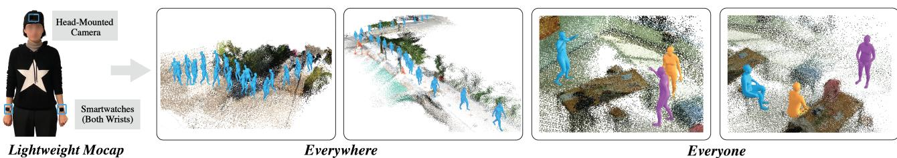  
Figure 1. We present a lightweight and affordable motion capture method based on two smartwatches and a head-mounted camera.

## Abstract

We present a lightweight and affordable motion capture method based on two smartwatches and a head-mounted camera. In contrast to the existing approaches that use six or more expert-level IMU devices, our approach is much more cost-effective and convenient. Our method can make wearable motion capture accessible to everyone everywhere, enabling 3Dfull-body motion capture in diverse environments. As a key idea to overcome the extreme sparsity and ambiguities of sensor inputs with different modalities, we integrate 6D head poses obtained from the headmounted cameras for motion estimation. To enable capture in expansive indoor and outdoor scenes, we propose an algorithm to track and update floor level changes to define head poses, coupled with a multi-stage Transformerbased regression module. We also introduce novel strategies leveraging visual cues of egocentric images to further enhance the motion capture quality while reducing ambiguities. We demonstrate the performance of our method on various challenging scenarios, including complex outdoor environments and everyday motions including object interactions and social interactions among multiple individuals.

## 1. Introduction

Human motion encapsulates the diverse and rich stories of human life in real-world situations. Thus, it is essential for machines not only to decipher the subtle nuances within these movements but also to authentically mimic them for seamless interaction and assistance with humans. However, the advancement in the research to make machines fully understand human motions lags considerably behind other AI domains focused on images or languages. The primary obstacle lies in the fact that 3D human motion datasets that reflect real-world scenarios remain exceedingly scarce, compared to the abundance of massive image or language datasets that capture diverse aspects of human life. This scarcity stems from the inherent challenge of acquiring motion capture data, necessitating specialized equipment and tools that are not readily available to the public. Despite notable efforts in collecting and refining motion capture datasets that are actively used in learning-based approaches (e.g., [33, 45]), the scale of these datasets remains in orders of magnitude smaller than the vast repositories of Internet images and language datasets.

In our endeavor to democratize motion capture for the general public free from the constraints of expert-level equipment and intricate settings, we present a lightweight and affordable motion capture method that utilizes Inertial Measurement Unit (IMU) sensors of smartwatches on wrists and a head-mounted camera. Our method can make wearable motion capture accessible to everyone, given the widespread availability and popularity of smartwatches, as well as the existence of action cameras and camera glasses (e.g., GoPro or Smart Glasses [2, 3] equipped with cameras). Our system can be applied for large-scale and long term motion captures without location constraints (indoors or outdoors). To this end, our method can enable the exploration of new research areas, such as social interaction scenarios involving multiple participants, each equipped with our lightweight capture setup.

Going beyond the traditional optical motion capture methods [5, 24], primarily feasible in well-set lab environments with limited scope and accessibility, there have been explorations to capture human motions with wearable sensors. Existing commercial solutions [4, 6] require attaching IMU sensors to all major body segments (17 to 19) using specialized suits or straps. While recent start-of-the-art approaches [23,55,56] have reduced the necessity to 6 sensors, it is still challenging for the public to equip themselves with 6 expert-level IMU sensors. Moreover, attaching sensors to the pelvis and legs may compromise usability. Due to the rise of VR/AR technologies and hardware, another research direction [9, 12, 22, 28, 51] utilize head-mounted displays (HMDs) [1] and hand-held controllers, which provide 6DoF (3D rotation and translation) information of the head and wrist movements, to reconstruct full-body motions. Using only three upper body sensors may improve usability, but this reliance on specialized devices restricts motion capture to indoor settings optimized for VR/AR equipment, thus limiting its broader applicability.

In this paper, we present a motion capture method that utilizes IMU sensors of smartwatches on wrists and a headmounted monocular camera. We overcome the sparsity of using only 2 sensors and the intrinsic ambiguities of IMU sensors (orientation, acceleration) by integrating head 6DoF poses obtained from the head-mounted camera into the motion estimation pipeline. In contrast to VR settings (e.g., HMDs) where head poses are given in a fixed world coordinate in a small indoor environment [9,12,22,28,51], it is not trivial to define head poses in expansive outdoor settings. Through an algorithm that automatically tracks and adjusts floor levels, our approach can robustly capture motion in “in-the-wild” scenarios in challenging locations with nonflat grounds such as hilly areas or stairs. Furthermore, we also present a motion optimization approach for enhancing capture quality in complex everyday motions, such as object interactions, by leveraging observed body part cues through the head-mounted camera. As our system can be conveniently equipped by multiple users, we also explore scenarios where the signals among the individuals are shared and the egocentric observations from one person can be used as sparse third-person views for the others, which can be additionally used for our motion optimization module.

Our contribution can be summarized as follows: (1) the first method to capture high-quality 3D full-body motion from a head-mounted camera and two smartwatches on wrists. Notably, we demonstrate our method on commonly available smartwatches rather than expert-level IMU sensors; (2) a novel algorithm to track and update floor levels coupled with a multi-stage Transformer-based motion estimation module, which enables capture in expansive indoor and outdoor settings; (3) a novel motion optimization module that utilizes visual information captured by monocular egocentric cameras.

## 2. Related Work

Motion Capture with IMU Sensors. Traditional motion capture mainly relied on optical methodologies such as optical markers [5] or markerless capture in a multi-view camera setup [24, 30, 59]. Although such methods demonstrate high-quality capture, they suffer from occlusions and are only applicable in specific settings with cameras. To mitigate such limitations there have been methods to fuse inertial sensor data to optical motion capture [14, 17, 25, 26, 34, 35, 39, 44, 46, 47]. Wearable motion capture with IMU sensors offers the advantage of freedom from location constraints and occlusions. Commercial methods [4, 6] leverage 17 to 19 IMU sensors, necessitating tight suits or straps with densely packed sensors. More recent approaches introduce more lightweight solutions by reducing the number of sensors up to 6, posed on the pelvis, wrists, legs, and head [19,23,48,54–56]. SIP [48] introduces an optimization-based approach and DIP [19] presents a deep learning-based method from 6 sensors using bidirectional RNNs. TransPose [56] extends this work by including global root translation estimation based on foot contact detection. More recently, PIP [55] and TIP [23] demonstrate state-of-the-art performance by combining physics-based optimization with an RNN-based kinematic approach [55] or combining body contact estimation and terrain generation with Transformer decoders [23]. To address the inher ent root drift issue in IMU-based methods, there have been approaches that additionally utilize camera positions from head-mounted cameras to enhance the accuracy of root translations [16, 54]. In these methods, the camera poses are often used as auxiliary cues to post-process root translation, while human pose estimation is still based on fullbody IMU sensor setup (17 for [16] or 6 for [54]). Typically, previous methods are demonstrated using expert-level devices [6]. Different from previous approaches, our method uses two smartwatches and integrates a head-mounted cam era into the body pose estimation pipeline.

Motion Capture with Egocentric Videos. Pose estimation from egocentric videos is receiving increased attention in recent studies. Several methods exploit fish-eye cameras by leveraging their advantages in visibility for egocentricpose estimation [21, 42, 43, 49, 50, 52]. Cha et al. [10] extend these methods by fusing full-body IMU sensors with fish-eye camera input. A few approaches pursue more challenging scenarios by estimating human pose with bodymounted cameras without other sensors. Shiratori et al. [40] use structure-from-motion (SfM) to determine body poses from body-mounted cameras, and Jiang et al. [20] exploit motion graphs for estimation from a single chest-mounted camera. Other methods [57, 58] combine kinematics and physics-based approaches to estimate physically plausible poses, which is extended by [32, 36] to simple scene interactions. You2Me [38] estimates pose under social interaction scenarios where the interaction target’s pose is visible in the egocentric video. Apart from these methods that directly learn from image inputs, EgoEgo [29] estimates motions from an egocentric video alone by introducing head poses as intermediate representations.

Motion Capture with VR-Based Upper Body Sensors. Recent advances in VR/AR technologies have led to the emergence of new devices that provide 6DoF information on head and wrist movements. Consequently, research has been done on controlling virtual avatars through such devices [7–9, 11, 12, 22, 28, 51, 53]. As determining full body motion from upper body sensors is challenging, earlier methods [11, 53] use root information explicitly by adding sensors on the pelvis [53] or implicitly by root-relative data representations [11]. CoolMoves [7] suggests kNNbased search which is limited to specific action types. More recent approaches demonstrate increased performance by exploiting various neural network structures such as flow models [8], Transformers [22], and diffusion models [12]. QuestSim [51] utilizes physics-based character control using deep reinforcement learning (DRL) to generate physically plausible full-body motions, which is extended by [28] to environment interactions. It is important to note that motion estimation with VR devices fundamentally differs from ours, as the 6DoF cues from the head and wrists are directly provided by the system and thus rely on a specified setting.

## 3. Method

## 3.1. Overview

Our method reconstructs 3D full-body human motion $\mathbf { M } = \{ \mathbf { m } _ { t } \} _ { t = 0 } ^ { T }$ by taking, as inputs, an egocentric video I and IMU sensor signals $\mathbf { S } _ { I M U } = \{ \mathbf { R } , \mathbf { A } \}$ (orientation, acceleration) from two smartwatches on wrists. We denote our system as a function ${ \mathcal F } .$

$$
\mathbf { M } = \mathcal { F } ( \mathbf { I } , \mathbf { S } _ { I M U } )\tag{1}
$$

where $\mathcal { F }$ is composed of two modules $\mathcal { F } _ { e s t }$ and $\mathcal { F } _ { o p t }$ , as shown in Fig. 2. The egocentric video from a head-mounted camera is a sequence of images, ${ \mathbf { I } } = \{ { \mathbf { I } } _ { t } \} _ { t = 0 } ^ { T }$ where $T$ is the sequence length, and $\mathbf { I } _ { t } \in \mathbb { R } ^ { h \times w \times 3 }$ indicates an image at time t. $\mathbf { S } _ { I M U } = \{ \mathbf { R } , \mathbf { A } \}$ is a set of IMU signal sequences for both the left and right wrist. ${ \mathbf { R } } = \{ { \mathbf { R } } _ { t } \} _ { t = 0 } ^ { T } .$ where $\mathbf { R } _ { t } ~ = ~ ( \mathbf { r } _ { t } ^ { l e f t } , \mathbf { r } _ { t } ^ { r i g h t } )$ , indicates the orientation signal for each sensor at time t in angle axis, $\mathbf { r } _ { t } ~ \in ~ s o ( 3 )$ Similarly, $\textbf { A } = \{ \mathbf { A } _ { t } \} _ { t = 0 } ^ { T } .$ , where $\mathbf { A } _ { t } ~ = ~ ( \mathbf { a } _ { t } ^ { l e f t } , \mathbf { a } _ { t } ^ { r i g h t } )$

represents the acceleration signals. The human motion output $\mathbf { M } = \{ \mathbf { m } _ { t } \} _ { t = 0 } ^ { T }$ is a sequence of pose $\mathbf { m } _ { t }$ , and $\mathbf { m } _ { t } ~ =$ $\left( \mathbf { p } _ { t } ^ { 0 } , \mathbf { q } _ { t } ^ { 0 } , \mathbf { q } _ { t } ^ { 1 } , . . . , \mathbf { q } _ { t } ^ { J } \right) \in \mathbb { R } ^ { 3 J + 3 }$ is a concatenated vector of root translation $ { \mathbf { p } } ^ { 0 } \in \mathbb { R } ^ { 3 }$ defined in a world coordinate and local joint rotations of J joints where the rotation of $j \cdot$ -th joint is represented as $\mathbf { q } ^ { j } \in s o ( 3 )$

We first apply an off-the-shelf monocular SLAM [41] with the egocentric video I. Given the original world coordinate arbitrarily defined from the SLAM model, we redefine the world coordinate via an alignment procedure described in Sec. 3.2, such that the scale of the world coordinate reflects the metric scale (in meter) and the negative zaxis is aligned to the gravity direction. From the SLAM, we obtain the 3D pointcloud W of the environment and camera pose at each time $\mathbf { C } = \{ \mathbf { C } _ { t } \} _ { t = 0 } ^ { T } ,$ defined in the world coordinate. Then, given the camera poses $\mathbf { C } ,$ , we compute the head pose ${ \mathbf H } = \{ { \mathbf H } _ { t } \} _ { t = 0 } ^ { T } ,$ , where $\mathbf { H } _ { t } \in S E ( 3 )$ is the location and orientation of the head joint. The head poses are directly leveraged into the estimation pipeline with sensor inputs, playing a key role in disambiguating motions during estimation. Notably, in non-flat spaces as in Fig. 3, the z-directional component of $\mathbf { H } _ { t }$ defined in the world coordinate does not necessarily reflect the metric height of the person because the height should be defined from the actual floor the person is currently standing. Thus, we compute the height of the head Ht by tracking and updating the floor level $f _ { t } \in \mathbb { R }$ at time t accordingly.

We build a transformer-based regression model coupled with a floor-level update module to estimate the full-body human motion from the cues of estimated head pose and wrist IMU signals: $\mathbf { M } _ { r e g } = \mathcal { F } _ { e s t } \big ( \mathbf { H } , \mathbf { W } , \mathbf { S } _ { I M U } \big )$ . While our initial full-body estimation ${ { \bf { M } } _ { r e g } }$ is already compelling, there exist fundamental ambiguities due to the extreme sparsity of our input signals. To address this issue, we leverage the visual cues captured by the head-mounted view I, where the hand position and the interactions with the environments are observed. While available only occasionally, we demonstrate the use of such visual cues can enhance the motion capture quality. Going one step further, we also consider multi-people capture scenarios where each individual wears our lightweight system. Assuming the visual signals among people can be shared, we can additionally leverage the occasional “third-person” views from other people for the target person’s motion capture. To fuse all of these available signals for more accurate motion estimation, we build a motion optimizer module $\mathcal { F } _ { o p t }$ where $\textbf { M } = \mathcal { F } _ { o p t } ( \textbf M _ { r e g } , \boldsymbol { \Phi } )$ Optimizing the human motion is done in aspatiotemporal manifold space [18], where ${ { \bf { M } } _ { r e g } }$ is the initial output from our motion regressor module and Φ is the visual cues extracted from head-mounted camera or third-person views from other users’ cameras. For $\Phi$ , we mainly use the 2D keypoint cues estimated from images in egocentric scenarios and 3D pose estimation results in multi-person scenar-

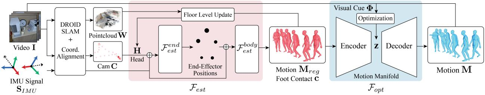  
Figure 2. System Overview

ios.

## 3.2. Pre-processing Sensor Inputs

Head Trajectory from Monocular SLAM. From egocentric video I, we first apply DROID-SLAM [41], noted for its accuracy and robustness compared to classical SLAM systems, to estimate camera trajectory C and reconstruct the 3D pointcloud W. In some cases, however, outliers may exist in camera pose estimation due to insufficient textures in the scenes or blurs, which may negatively affect our body pose estimation quality. As a way to filter out outliers, we compute the temporal acceleration between camera movements and detect erroneous camera pose estimation when the acceleration values are over a certain threshold. We fill in the missing camera poses via linear interpolation.

Aligning the Coordinate for Camera and IMU Sensors. For preprocessing, we align the arbitrarily defined original coordinate from SLAM into our desired real-world coordinate with metric scale and the negative z-axis to be aligned to the gravity direction. Additionally, we also calibrate the orientation of IMUs to have the common orientation axes aligned to the gravity direction. This is done via two steps: (1) aligning IMU sensors to real-world coordinates, and (2) aligning the coordinate from SLAM to IMU coordinates.

Because the camera center C may not be necessarily the same as the head joint location, we compute the fixed transformation $T _ { h e a d } ^ { c a m }$ to transform the camera pose into the head is computed by approximating the camera location in a surface point of SMPL mesh. Refer to the supp. mat. for the details of the alignment protocol and time synchronization.

## 3.3. Motion Estimation

Pre-Processing Input Signals. The motion estimator module $\mathcal { F } _ { e s t }$ is a transformer-based network to estimate motion and foot contacts from head trajectory ${ \mathbf { H } } = \{ { \mathbf { H } } _ { t } \} _ { t = 0 } ^ { T }$ and IMU sensor signals ${ \bf S } _ { I M U } = \{ { \bf R } , { \bf A } \}$ . We input the data into the network in a sliding temporal window manner with length N. For every window, we normalize the input to be local to the head coordinate H at $\tau \ = \ 0$ which is the first frame of the current window by applying a transformation matrix $T _ { \mathbf { H } _ { \tau } } ^ { w }$ that transforms the world coordinate to the coordinate of $\stackrel { \cdot } { \mathbf { H } } _ { \tau = 0 } .$ . The normalized cues are denoted with the hat symbol: $\hat { \mathbf { H } } = \{ \hat { \mathbf { H } } _ { \tau } \} _ { \tau = 0 } ^ { N } , \hat { \mathbf { R } } = \{ \hat { \mathbf { R } } _ { \tau } \} _ { \tau = 0 } ^ { N } ,$ $\hat { \mathbf { A } } = \{ \hat { \mathbf { A } } _ { \tau } \} _ { \tau = 0 } ^ { N } ,$ and $\hat { \bf m } _ { \tau } = \{ { \hat { \bf p } } _ { \tau } ^ { 0 } , { \hat { \bf q } } _ { \tau } ^ { 0 } , { \bf q } _ { \tau } ^ { 1 } , . . . { \bf q } _ { \tau } ^ { J } \} ^ { 1 }$ . The normalized output motion is recovered by applying $T _ { w } ^ { \mathbf { H } _ { \tau } }$ , or $( T _ { \mathbf { H } _ { \tau } } ^ { w } ) ^ { - 1 }$

Normalizing every cue to the first frame head coordinates may miss out on important absolute cues critical to defining human motions. For example, a person standing still and sitting still would have identical input when normalized. Thus, we furthermore include absolute head height (z-axis value) $h _ { t } \in \mathbb { R }$ , and the head up-vector $\theta _ { t } ^ { u p } \in \mathbb { R } ^ { 3 }$ defined in world coordinate. To accurately define head height $h ,$ we introduce an algorithm to update floor level $f _ { t }$ at time t based on network output (motion and foot contact) obtained until time $t - 1$ with 3D pointcloud W. Once the $f _ { t }$ is estimated, as described in Fig. 3, the head height $h _ { t }$ is computed based on the floor level, or $h _ { t } = \mathbf { H } _ { z } - f _ { t }$ The input components are concatenated into $\{ \mathbf { x } _ { \tau } \} _ { \tau = 0 } ^ { N } =$ $\{ \hat { \mathbf { H } } , \hat { \mathbf { R } } , \hat { \mathbf { A } } , h _ { \tau } , \dot { \theta } _ { \tau } ^ { u p } \} \in \mathbb { R } ^ { N \times 3 1 }$ . Before concatenating, rotations are converted into 6D representations [60].

Network Architecture. We formulate the estimation as a sequence-to-sequence (seq2seq) problem to effectively incorporate temporal information to address the ambiguities arising from the sparsity of sensor inputs. Following the previous work [22], we utilize Transformer encoder models and their self-attention mechanism to efficiently capture intricate relationships in the time-series data.

Different from the previous work [22] that directly maps input sequence $\{ \mathbf { x } _ { \tau } \} _ { \tau = 0 } ^ { \bar { N } }$ to the output motion ˆmτ, we adopt a multi-stage method as in [56] by introducing endeffector positions as intermediate representations. Specifically, we separate the system $\mathcal { F } _ { e s t }$ into two submodules $\mathcal { F } ^ { e n \bar { d } }$ and $\mathcal { F } ^ { b o d y }$ (we drop the subscript $\cdot _ { e s t } ,$ on these submodule names for brevity). The first submodule Fend takes $\{ \mathbf { x } _ { \tau } \} _ { \tau = 0 } ^ { N }$ as input and generates end-effector positions (hands and feet) $\{ \mathbf { x } _ { \tau } ^ { m i d } \} _ { \tau = 0 } ^ { N } \in \mathbb { R } ^ { N \times 1 2 }$ . The input $\left\{ { \bf x } _ { \tau } \right\}$ and $\{ \mathbf { x } _ { \tau } ^ { m i d } \}$ are fed into submodule ${ \mathcal { F } } ^ { b o d y }$ . The ${ \mathcal { F } } ^ { \bar { b o d y } }$ regresses the output motion $\{ \hat { \mathbf { m } } _ { \tau } \} _ { \tau = 0 } ^ { N }$ and also foot contact $\{ \mathbf { c } _ { \tau } \} _ { \tau = 0 } ^ { N }$ where ${ \bf c } _ { \tau } ~ = ~ \{ c _ { \tau } ^ { l f } , c _ { \tau } ^ { r f } \} . ~ c _ { \tau } ^ { l f }$ and $c _ { \tau } ^ { r f }$ indicate the contact probability of the left and right foot at time τ.

Both submodules are based on Transformer encoder models with linear embedding layers to project the input vector into continuous embeddings in the first part of the networks. For ${ \mathcal { F } } ^ { b o d y }$ where $\{ \mathbf { x } _ { \tau } ^ { i } \}$ and $\{ \mathbf { x } _ { \tau } ^ { m i d } \}$ are concatenated as input, there are two separate linear layers and the linear embeddings are concatenated and fed into the Transformer encoder. In submodule ${ \mathcal { F } } ^ { e n d }$ , the features generated by the Transformer encoder are converted into midrepresentations $\{ \mathbf { x } _ { \tau } ^ { m i d } \}$ by a 2-layer MLP. In submodule $\mathcal { F } ^ { \bar { b } o d y }$ , the output of the Transformer encoder is first converted into foot contact probabilities $\left\{ \mathbf { c } _ { \tau } \right\}$ . The contact probability and Transformer encoder output are concatenated and converted to output motion $\left\{ \hat { \mathbf { m } } _ { \tau } \right\}$ . The network architecture for both submodules are in Fig. 4.

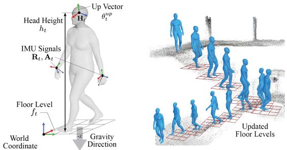  
Figure 3. (a) Visualization of input signals. (b) Visualization of the updated floor levels $f _ { t }$

Updating Floor Levels. Among the input $\left\{ \mathbf { x } _ { \tau } ^ { i } \right\}$ , the height cue h represents the metric height of the person’s head joint, which should be computed from the actual floor the character stands on. Assuming large-scale indoor and outdoor environments (e.g., multiple floors with stairs, and uphills), the actual floor the character stands on is not necessarily the same as the $z = 0$ plane in the world coordinate defined in the alignment procedure (Sec. 3.2). Therefore, the floor level should be updated based on the current character status and the environment.

The key idea of updating floor levels is to track the foot contact $\{ \mathbf { \bar { c } } _ { t } \} _ { t = 0 } ^ { t - 1 }$ . As foot contact is a form of interaction between the human and the floor, the foot position during contact can be considered as the floor level. From the contact estimation $\{ \mathbf { c } _ { t } \} _ { t = 0 } ^ { t - 1 }$ obtained by ${ \mathcal { F } } ^ { b o d y }$ , we find the latest time frame $t _ { m }$ where the foot contact occurs in either foot with a confidence value above a certain fixed threshold, $c _ { t _ { m } } ^ { f } > \lambda$ . Given the corresponding foot joint location $\mathbf { p } _ { t _ { m } } ^ { f }$ in contact, the floor point can be obtained by projecting $\mathbf { p } _ { t _ { m } } ^ { f }$ to the 3D scene pointcloud W, where we simply find nearby points and take the mean of their z values as $f _ { t }$ Visual examples of updated floors are shown in Fig. $3 ( \mathbf { b } ) ^ { 2 }$

Training. The submodules ${ \mathcal { F } } ^ { e n d }$ and ${ \mathcal { F } } ^ { b o d y }$ are trained endto-end, with the following loss terms $\mathcal { L } _ { p o s } , \mathcal { L } _ { r o t } , \mathcal { L } _ { r o o t } .$ $\mathcal { L } _ { m i d } , \mathcal { L } _ { c o n t a c t } , \mathcal { L } _ { f o o t v e l }$ , and $\mathcal { L } _ { c o n s }$ . The loss term $\mathcal { L } _ { r o o t }$

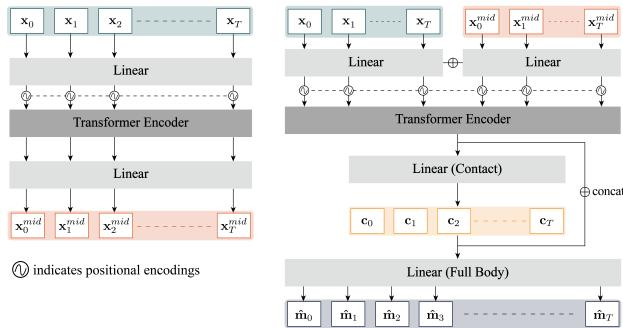  
Figure 4. Network architecture of submodules ${ \mathcal { F } } ^ { e n d }$ (left) and ${ \mathcal { F } } ^ { \sim d y }$ (right) of $\mathcal { F } _ { e s t }$

and $\mathcal { L } _ { \boldsymbol { r o t } }$ are:

$$
\begin{array} { l } { { \displaystyle { \mathcal { L } } _ { r o o t } = \| \hat { \mathbf { p } } ^ { 0 } - \hat { \mathbf { p } } _ { G T } ^ { 0 } \| + \| \hat { \mathbf { q } } ^ { 0 } - \hat { \mathbf { q } } _ { G T } ^ { 0 } \| } } \\ { { \displaystyle { \mathcal { L } } _ { r o t } = \sum _ { j \in J } \| \mathbf { q } ^ { j } - \mathbf { q } _ { G T } ^ { j } \| } . } \end{array}\tag{2}
$$

The terms $\mathcal { L } _ { r o o t }$ and $\mathcal { L } _ { \mathit { r o t } }$ enforces the output motion $\hat { \mathbf { m } } _ { t } =$ $\{ \hat { \mathbf p } _ { t } ^ { 0 } , \hat { \mathbf q } _ { t } ^ { 0 } , . . . , \mathbf q _ { t } ^ { J } \}$ to follow the given ground truth data.

The loss term $\mathcal { L } _ { p o s }$ penalizes the error accumulating along the kinematic chain by considering position values of each joint, and is measured by the weighted difference of joint positions.

$$
\mathcal { L } _ { p o s } = \sum _ { j \in J } w _ { j } \| \hat { \mathbf { p } } ^ { j } - \hat { \mathbf { p } } _ { G T } ^ { j } \|\tag{3}
$$

where $\hat { \mathbf { p } } ^ { j }$ indicates position of joint $j ,$ which is obtained by forward kinematics operation. In case of foot joints, $\dot { \mathcal { L } } _ { f o o t v e l } = \| \hat { \mathbf { v } } ^ { f o o t } - \hat { \mathbf { v } } _ { G T } ^ { \hat { f o o t } } \|$ is additionally computed to penalize foot slip artifacts and unnatural foot movements. $\hat { \mathbf { v } } ^ { j }$ indicates velocity of joint $j .$

${ \mathcal { L } } _ { m i d }$ and $\mathcal { L } _ { c o n s }$ are terms to jointly train the submodule ${ \mathcal { F } } ^ { e n d }$ and ${ \mathcal { F } } ^ { b o d y }$

$$
\begin{array} { l } { { \mathcal { L } _ { m i d } = \displaystyle \sum _ { j \in e n d } \| \hat { \bf p } _ { m i d } ^ { j } - \hat { \bf p } _ { G T } ^ { j } \| } } \\ { { \mathcal { L } _ { c o n s } = \displaystyle \sum _ { j \in e n d } \| \hat { \bf p } ^ { j } - \hat { \bf p } _ { m i d } ^ { j } \| } } \end{array}\tag{4}
$$

where $\hat { \mathbf { p } } _ { m i d } ^ { j }$ indicates the output of ${ \mathcal { F } } ^ { e n d }$ (end-effector positions). ${ \mathcal { L } } _ { m i d }$ directly trains the ${ \mathcal { F } } ^ { e n d }$ module to generate accurate intermediate representations $\mathbf { x } _ { \tau } ^ { m i d }$ . The consistency loss $\mathcal { L } _ { c o n s }$ enforces the consistency between midrepresentations and the output motion. Intuitively, the endeffector joint positions derived from the output motion $\hat { \mathbf { m } } _ { t }$ should be consistent with the intermediate output $\mathbf { x } _ { \tau } ^ { m i d }$ which is also the positions of end-effector joints. The two loss terms enforce ${ \mathcal { F } } ^ { e n d }$ to provide reliable additional information to submodule ${ \mathcal { F } } ^ { b o d y }$ , and enforce ${ \mathcal { F } } ^ { b o d y }$ to reflect the provided mid-representation to the final output.

$\mathcal { L } _ { c o n t a c t } = B C E L o s s ( \mathbf { c } , \mathbf { c } _ { G T } )$ is to train the model to estimate contact probabilities c. Here the subscript GT indicates ground truth while time τ is omitted for convenience.

## 3.4. Motion Optimization With Visual Cues

Generating Visual Cues From Images. Since we only use upper body sensors, fundamental ambiguities exist on the lower body joints. For example, sitting and crossing one’s legs cannot be easily distinguishable from other sitting postures. Also, different from VR-based systems, the absence of explicit positional data in raw IMU sensors can lead to uncertainties in determining hand positions. Although such ambiguities can be resolved in dynamic body movements (e.g., locomotion) by taking the dynamics into account via temporal information, our daily activities (e.g., manipulation) may often contain subtle and sophisticated motions with minimum movements. As a solution to enhance the motion capture accuracy, we present a method to leverage the visual cues from the head-mounted camera, based on the observation that it is common to look at one’s hands and the object during typical hand-involved interactions. The idea can be extended into multi-people scenarios, where we can assume multiple people wear our motion capture systems and their visual cues are shared with each other. As demonstrated in our experiments, a person’s egocentric view can be treated as occasionally available sparse 3rd person views which can be used as informative additional visual cues. Motivated by this idea, we leverage the RGB information of the egocentric video I. The visual cues $\displaystyle \Phi = [ \phi _ { E } , \phi _ { T } ]$ represent additional information of the human pose. In singleperson egocentric setting, $\phi _ { E } = \{ \mu _ { t } ^ { j } \}$ where $\boldsymbol { \mu } _ { t } ^ { j } \in \mathbb { R } ^ { 2 }$ , indicates the 2D location of joint $j$ in 2D image coordinates. Joint $j$ is either left or right wrist, or both in practice. In the case of multi-person capture scenarios, we can leverage a monocular 3D human pose estimation approach from 3rd person views of other individuals, which can be used during our motion optimization. The estimated 3D pose is denoted as $\phi _ { T } = \{ \tau _ { t } ^ { \overrightarrow { B A } } \}$ , where $\pmb { \tau } _ { t } ^ { \overrightarrow { B A } } = ( \mathbf { q } _ { t } ^ { 1 } . . . \mathbf { q } _ { t } ^ { j } ) ^ { A }$ indicates local joint rotations (excluding the root) of person A estimated via $\mathbf { I } _ { t } ^ { B }$ , or image taken by person B at time t. We use offthe-shelf models [15, 31] to obtain visual cues $\phi _ { E }$ and ϕ .

Manifold-Based Motion Optimization. The optimized motion M should not only fulfill the occasionally detected cues Φ, but it should maintain the semantics and naturalness of $\mathbf { M } _ { r e g } ,$ preserving spatiotemporal coherency. Instead of directly optimizing the motion output from ${ { \bf { M } } _ { r e g } }$ to Φ, we utilize the motion manifold-based method demonstrated in [18, 27]. As the motion manifold is learned to preserve spatio-temporal correlation of human movements, optimizing within this manifold space can enforce the optimized motion M to maintain its naturalness while fulfilling the target cues Φ. Especially in the case of egocentric visual cue $\phi _ { E }$ where only 2D joint cues are available, optimizing within this manifold space helps to maintain naturalness in the optimized motion despite the ambiguity of the cue.

To build motion manifolds we use convolutional autoencoders [18], compressing motion sequences into corresponding latent vectors. For training, the motion sequence $\bar { \mathbf { X } } \in \bar { \mathbb { R } ^ { T \times 1 3 7 } }$ is represented as a concatenated vector of foot contact, root translation, and joint rotations. The root translation and orientation are normalized based on the first frame of the motion sequence. The rotation values are converted into 6D representations [60] for network learning. The encoder E and decoder module $E ^ { - 1 }$ are trained based on reconstruction loss, or $\mathcal { L } _ { r e c o n } = | | \mathbf { X } - E ^ { - 1 } ( E \left( \mathbf { X } \right) ) | | ^ { 2 }$

Motion optimization is done by searching an optimal latent vector among the manifold. From the initial latent vector ${ \textbf { z } } = \ E ( \mathbf { X } )$ , where X is computed from $\mathbf { M } _ { r e g } ,$ the optimal latent vector $\mathbf { z } ^ { \ast }$ is found by minimizing loss $\mathcal { L } = \mathcal { L } _ { v i s } + \mathcal { L } _ { r e g } + \mathcal { L } _ { c o n t a c t } . ^ { 3 } \mathcal { L } _ { v i s }$ enforces to meet the provided visual cues:

$$
\begin{array} { r } { \mathcal { L } _ { v i s } = \left\{ \begin{array} { l l } { | | \pmb { \mu } _ { t } ^ { j } - \pi ( \mathbf { C } _ { t } , \mathbf { p } _ { t } ^ { j } ) | | } & { \pmb { \mu } _ { t } ^ { j } \in \phi _ { E } } \\ { \sum _ { j } w _ { j } | | \pmb { \tau } _ { t } ^ { j } - \mathbf { q } _ { t } ^ { j } | | } & { \pmb { \tau } _ { t } ^ { j } \in \phi _ { T } . } \end{array} \right. } \end{array}\tag{5}
$$

The function $\pi ( \mathbf { C } _ { t } , \mathbf { p } _ { t } ^ { j } )$ indicates the projection of 3D joint position $\mathbf { p } _ { t } ^ { j }$ with camera $\mathbf { C } _ { t } . ~ \mathcal { L } _ { r e g }$ is for regularization and $\mathcal { L } _ { c o n t a c t } = \mathbf { c } _ { t } \cdot \| \dot { \mathbf { p } } _ { t } ^ { f o o t } \|$ penalizes foot slip when the foot is in contact. Finally, the optimized motion M is derived from the optimized latent vector $\mathbf { z } ^ { \ast }$ by $E ^ { - 1 } ( \mathbf { z } ^ { * } )$ .

## 4. Experiments

## 4.1. Experimental Setup

Synthesizing IMU Data from Mocap. To build training data from motion datasets, we synthesize IMU signals using wrist poses, following the protocol in [23, 55, 56].

Processing IMU Signals from Smartwatches. For demonstrations with real-world IMU data using smartwatches, we apply filtering to reduce noise as in [23] beforehand.

Evaluation Metrics. We adopt the following metrics for quantitative experiments.

• Mean Per Joint Position Error (MPJPE): MPJPE represents the average position error per joint. (cm)

• Mean Per Joint Velocity Error (MPJVE): MPJVE measures the average velocity error across joints. $( c m / s )$

• Jitter: Jitter indicates how smooth the motion ${ \mathrm { i s } } ,$ and is measured by acceleration changes over time averaged by body joints. Here we present the relative ratio between the jitter of the predicted motion and the ground truth.

Baselines. Since we are the first to estimate full body motion from a head-mounted camera and two IMU sensors, no direct baselines exist. Thus, we compare our estimation module $\mathcal { F } _ { e s t }$ with previous SOTAs based on (1) 6 IMUs (full body) [23, 55], and (2) VR devices (upper body, 6 DoF) [12], which pursue similar goals with more information than our setup through additional sensors or 6DoF hand measurements. In the context of wearable and outdoor motion capture, we consider IMU-based methods as our main competitors. However, for completeness, we additionally compare with the VR device-based methods due to their technical similarity to our approach of estimating motion from upper body sensors. Note that in this comparison we assume fixed flat floor planes since previous approaches cannot handle varying floor levels.

• IMU Baselines (Full Body): We compare ours with PIP [55] and TIP [23]. Both estimate motion from 6 IMU sensors on the full body; head, wrists, pelvis, and legs. In the supp. mat. we also compare with EgoLocate [54] which leverages an additional head-mounted camera on top of the full-body IMU sensors for global translation correction.

VR Baselines (Upper Body): We consider AGRoL [12], the state-of-the-art method for tracking full body motion from 3 6DoF (position and orientation) sensor signals from the head and both wrists, as a baseline. We compare with two versions of AGRoL, the original version where the 6DoF values are given for all 3 sensors and a modified version where the position values of the wrist are replaced with acceleration as in IMU sensors.

• Ablative Baselines: We perform ablation studies on the floor level update in $\mathcal { F } _ { e s t }$ to present the contribution of the algorithm on scenarios with large areas with drastic floor changes such as walking down the stairs from the third to the second floor of a building. We furthermore compare the output of $\mathcal { F } _ { e s t }$ only and with $\mathcal { F } _ { o p t }$ to demonstrate the contribution of egocentric video to enhance motion estimation.

## 4.2. Comparison with IMU-Based Baselines

Dataset. We follow the previous approaches [23, 55] by training the models on AMASS [33] dataset and evaluating on the TotalCapture [44] dataset with real IMU data. 4

Results. As shown in Table 1, despite only utilizing sensors on the upper body, our method shows comparable or better performances compared to 6 IMU-based setups. In the root-relative position errors (r.MPJPE) which compare pose estimation quality ignoring root drifts, our approach outperforms the baselines. Notably, although PIP [55] explicitly correct pose with physics-based optimization, the performance of ours is comparable without such explicit corrections. In other metrics where root drift errors are also considered (MPJPE, Root PE), our method shows much better performance with significant decreases in root drift compared to baselines (MPJPE decreases by 87.7% for PIP and 89.8% for TIP; Root PE by 90.5% and 92.1%, respectively). For comparison with EgoLocate, results in supp. Table 2 shows our superior performance, especially in root-related position error terms (MPJPE, Root PE), despite the reduced number of sensors. These results demonstrate that incorporating head pose directly in estimation can improve performance and mitigate root drift issues without any additional localization or correction as done in previous approaches.

<table><tr><td>Method</td><td>r.MPJPE</td><td>MPJPE</td><td>MPJVE</td><td>Root PE</td><td>Jitter</td></tr><tr><td>PIP [55]</td><td>4.40</td><td>34.69</td><td>19.51</td><td>34.15</td><td>0.95</td></tr><tr><td>TIP [23]</td><td>4.88</td><td>41.79</td><td>36.26</td><td>41.18</td><td>16.52</td></tr><tr><td>Ours  $( \mathcal { F } _ { e s t } )$ </td><td>3.77</td><td>4.27</td><td>19.56</td><td>3.25</td><td>5.23</td></tr></table>

Table 1. Comparison with full body IMU-based methods on the TotalCapture dataset.
<table><tr><td rowspan=1 colspan=1>Dataset</td><td rowspan=1 colspan=1>Method</td><td rowspan=1 colspan=1>MPJPE (r.)</td><td rowspan=1 colspan=3>MPJVE  Root PE  Jitter</td></tr><tr><td rowspan=1 colspan=1>AMASS</td><td rowspan=1 colspan=1>AGRoL [12] $\mathbf { A G R o L } ^ { * }$ Ours $( \mathcal { F } _ { e s t } )$ </td><td rowspan=1 colspan=1>4.58 (4.89)6.53 (6.18)5.20 (4.95)</td><td rowspan=1 colspan=1>19.3124.9917.00</td><td rowspan=1 colspan=1>4.155.334.36</td><td rowspan=1 colspan=1>2.603.491.64</td></tr><tr><td rowspan=1 colspan=1>HPS</td><td rowspan=1 colspan=1>AGRoL [12]AGRoL*Ours $( \mathcal { F } _ { e s t } )$ </td><td rowspan=1 colspan=1>31.47 (27.64)33.46 (27.69)8.65 (8.24)</td><td rowspan=1 colspan=1>258.92389.8321.42</td><td rowspan=1 colspan=1>25.7628.226.97</td><td rowspan=1 colspan=1>40.8362.061.84</td></tr></table>

Table 2. Comparison with upper body VR-based methods on AMASS and HPS datasets. AGRoL with an asterisk is the modified version where wrist position are replaced with accelerations. (r.) indicates root-relative position errors.

## 4.3. Comparison with VR-Based Baselines

Dataset. For quantitative comparison, we generate train/test/validation split from a subset of AMASS dataset (CMU [45], HDM05 [37], BMLMovi [13]). We first evaluate our motion estimation module and AGRoL on the testing split of the AMASS dataset. Additionally, we also demonstrate the generalization ability of the modules by testing on the HPS [16] dataset. Regarding HPS dataset, we use the motion optimization result [16] as ground truth. We randomly select 10 sequences in 6 scenes for comparison. Results. As demonstrated in Table 2, our method shows on-par performance with the original AGRoL, even though in AGRoL the positions of both hands are provided. Compared with the modified AGRoL where wrist positions are replaced with accelerations, our module $\mathcal { F } _ { e s t }$ outperforms it in all of the metrics. Furthermore, our module $\mathcal { F } _ { e s t }$ shows a notable performance gap compared to AGRoL on the HPS dataset which includes motions in large-scale scenes. This is expected as AGRoL focuses on full body motion estimation in a VR-optimized setting, not in large-scale scenes.

## 4.4. Ablation Studies

Setup. For quantitative evaluation, we capture with our setup and with XSens MVN Link [6] together, where we use XSens as ground truth. More details are in supp. mat. Ablation on Motion Estimation. We demonstrate the contribution of the floor-level updating algorithm by capturing a sequence of walking downstairs. As seen in Table 3 and Fig. 5, without floor update (left) the head height is misleading and consequently, the module generates inaccurate poses. However, by accordingly updating the floor levels (right) the head height is adjusted so the network accurately estimates the motion of walking down the stairs.

<table><tr><td>Method</td><td>Upper PE</td><td>Lower PE</td><td>Full PE</td></tr><tr><td> $\mathcal { F } _ { e s t }$  w/o Floor Update</td><td>9.19</td><td>16.58</td><td>12.35</td></tr><tr><td> $\mathcal { F } _ { e s t }$  w/ Floor Update (Ours)</td><td>6.04</td><td>7.19</td><td>6.53</td></tr></table>

Table 3. Quantitative comparison with and $\mathcal { F } _ { e s t }$ without floor level update.  
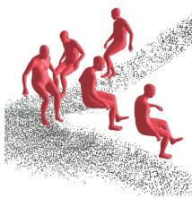  
Fest w/o Floor Update

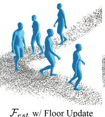  
Fest w/ Floor Update (Ours)

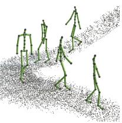  
GT

Figure 5. Comparison with $\mathcal { F } _ { e s t }$ without floor update (left) and with floor update (right). The floor update algorithm corrects head height for estimating accurate poses.
<table><tr><td>Method</td><td></td><td>Right Hand PE | Right Arm PE | Upper PE</td><td></td></tr><tr><td> $\mathcal { F } _ { e s t }$ </td><td>11.91</td><td>9.72</td><td>8.04</td></tr><tr><td> $\mathcal { F } _ { e s t } + \mathcal { F } _ { o p t } \ : ( \mathrm { O u r s } )$ </td><td>5.55</td><td>5.97</td><td>6.65</td></tr></table>

Table 4. Quantitative comparison with $\mathcal { F } _ { e s t }$ and $\mathcal { F } _ { e s t } + \mathcal { F } _ { o p t }$ optimized with egocentric-view visual cues.

Ablation on Motion Optimization. We first demonstrate the contribution of $\mathcal { F } _ { o p t }$ in hand-based everyday interaction scenarios. For quantitative comparison, we compare the initial motion output ${ { \bf { M } } _ { r e g } }$ and optimized final output M to ground-truth. As shown in Table 4, right arm PE and both arm PE both decreased in the final motion output M compared to the initial regression-based output ${ { \bf { M } } _ { r e g } }$ . Example results are shown in Fig. 6. We also demonstrate motion optimization results from visual cues in multi-person scenarios. As seen in Fig. 7, the egocentric image of person B serves as a “third-person view” of person A. Using this information can resolve the fundamental ambiguities of the legs that stem from upper-body sensor setups. Although the legs of $\mathcal { F } _ { e s t }$ (red) in Fig. 7 (a) are plausible, $\mathcal { F } _ { o p t }$ (blue) further captures the slight nuances of leg movements by leveraging visual cues $\tau _ { t } ^ { \overrightarrow { B A } }$

## 5. Discussion

We present a novel, easy-to-use, and affordable motion capture system with smartwatches on wrists and a headmounted camera. We overcome the sparsity and ambiguity of sensor inputs with different modalities by integrating head poses in the motion estimation pipeline. By tracking and updating floor levels to define head poses and incorporating into multi-stage Transformer-based estimation module our method can robustly capture motion in challenging locations with non-flat grounds. We further present a motion optimization approach by using visual cues through the camera. As multi-users can conveniently equip our setup, we also explore the scenarios when user signals are shared.

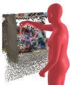

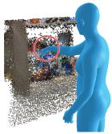

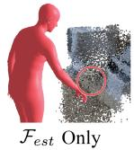

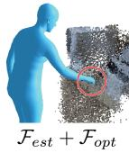  
(Ours)

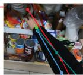

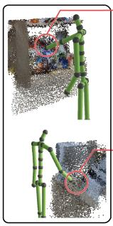  
GT

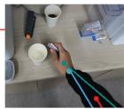  
Egocentric Image

Figure 6. Comparison with $\mathcal { F } _ { e s t }$ (left) and $\mathcal { F } _ { e s t } + \mathcal { F } _ { o p t }$ (right). The optimization module $\mathcal { F } _ { o p t }$ corrects the arm and hand pose based on the 2D hand keypoint detected in the egocentric image.  
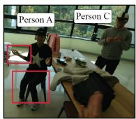

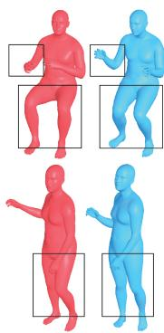

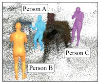

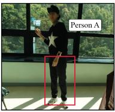  
Person A

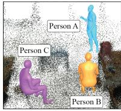  
Image IB of Person B  
3rd Person View  
Figure 7. Results of $\mathcal { F } _ { e s t }$ and $\mathcal { F } _ { e s t } + \mathcal { F } _ { o p t }$ in multi-person scenarios. (a) Comparison with $\mathcal { F } _ { e s t } ( \mathrm { r e d } )$ and $\mathcal { F } _ { e s t } + \mathcal { F } _ { o p }$ (blue) of person A with visual cue $\tau _ { t } ^ { \overrightarrow { B A } }$ (Sec. 3.4). (b) Image $\mathbf { I } _ { t } ^ { B }$ with person A. (c) 3rd person view of person A, B, and C.

Although the off-the-shelf models (e.g., DROID-SLAM) in our method are robust and show reliable results in most cases, our method does not work in rare catastrophic failures of the off-the-shelf models. Moreover, the networks in our module are trained with mean body shape, and head poses in real-world demonstrations are adjusted by scaling. Explicitly handling body shape variations in the module would be more promising which we leave as future work.

Acknowledgements. We thank Inhee Lee for supporting the system setup and thank Jiwon Song, Sumin Lee, and Hakjean Kim for assisting multi-person capture. This work was supported by SNU Creative-Pioneering Researchers Program, NRF grant funded by the Korea government (MSIT) (No.2022R1A2C2092724 and No. RS-2023- 00218601), and IITP grant funded by the Korean government (MSIT) (No.2021-0-01343). H. Joo is the corresponding author.

## References

[1] Meta quest vr headsets. https://www.meta.com/ quest/. 2

[2] Project aria. https://www.projectaria.com/. 1

[3] Ray-ban meta smart glasses. https://www.meta.com/ smart-glasses. 1

[4] Rokoko smartsuit pro. https://www.rokoko.com/ products/smartsuit-pro. 2

[5] Vicon motion capture system. https://www.vicon. com/motion-capture. 2

[6] Xsens mvn link. https://www.movella.com/ products/motion-capture/xsens-mvn-link. 2, 7

[7] Karan Ahuja, Eyal Ofek, Mar Gonzalez-Franco, Christian Holz, and Andrew D Wilson. Coolmoves: User motion accentuation in virtual reality. ACM IMWUT, 2021. 3

[8] Sadegh Aliakbarian, Pashmina Cameron, Federica Bogo, Andrew Fitzgibbon, and Thomas J Cashman. Flag: Flowbased 3d avatar generation from sparse observations. In CVPR, 2022. 3

[9] Sadegh Aliakbarian, Fatemeh Saleh, David Collier, Pashmina Cameron, and Darren Cosker. Hmd-nemo: Online 3d avatar motion generation from sparse observations. In ICCV, 2023. 2, 3

[10] Young-Woon Cha, Husam Shaik, Qian Zhang, Fan Feng, Andrei State, Adrian Ilie, and Henry Fuchs. Mobile. egocentric human body motion reconstruction using only eyeglassesmounted cameras and a few body-worn inertial sensors. In IEEE VR, 2021. 2

[11] Andrea Dittadi, Sebastian Dziadzio, Darren Cosker, Ben Lundell, Thomas J Cashman, and Jamie Shotton. Full-body motion from a single head-mounted device: Generating smpl poses from partial observations. In ICCV, 2021. 3

[12] Yuming Du, Robin Kips, Albert Pumarola, Sebastian Starke, Ali Thabet, and Artsiom Sanakoyeu. Avatars grow legs: Generating smooth human motion from sparse tracking inputs with diffusion model. In CVPR, 2023. 2, 3, 6, 7

[13] Saeed Ghorbani, Kimia Mahdaviani, Anne Thaler, Konrad Kording, Douglas James Cook, Gunnar Blohm, and Nikolaus F. Troje. MoVi: A Large Multipurpose Motion and Video Dataset, 2020. 7

[14] Andrew Gilbert, Matthew Trumble, Charles Malleson, Adrian Hilton, and John Collomosse. Fusing visual and inertial sensors with semantics for 3d human pose estimation. IJCV, 127, 2019. 2

[15] Shubham Goel, Georgios Pavlakos, Jathushan Rajasegaran, Angjoo Kanazawa, and Jitendra Malik. Humans in 4d: Reconstructing and tracking humans with transformers. In ICCV, 2023. 6

[16] Vladimir Guzov, Aymen Mir, Torsten Sattler, and Gerard Pons-Moll. Human poseitioning system (hps): 3d human pose estimation and self-localization in large scenes from body-mounted sensors. In CVPR, 2021. 2, 7

[17] Thomas Helten, Meinard Muller, Hans-Peter Seidel, and Christian Theobalt. Real-time body tracking with one depth camera and inertial sensors. In ICCV, 2013. 2

[18] Daniel Holden, Jun Saito, and Taku Komura. A deep learning framework for character motion synthesis and editing. ACM TOG, 35(4), 2016. 3, 6

[19] Yinghao Huang, Manuel Kaufmann, Emre Aksan, Michael J. Black, Otmar Hilliges, and Gerard Pons-Moll. Deep inertial poser learning to reconstruct human pose from sparse inertial measurements in real time. ACM TOG, 37(6), 2018. 2, 7

[20] Hao Jiang and Kristen Grauman. Seeing invisible poses: Estimating 3d body pose from egocentric video. In CVPR, 2017. 3

[21] Hao Jiang and Vamsi Krishna Ithapu. Egocentric pose estimation from human vision span. In ICCV, 2021. 2

[22] Jiaxi Jiang, Paul Streli, Huajian Qiu, Andreas Fender, Larissa Laich, Patrick Snape, and Christian Holz. Avatarposer: Articulated full-body pose tracking from sparse motion sensing. In ECCV, 2022. 2, 3, 4

[23] Yifeng Jiang, Yuting Ye, Deepak Gopinath, Jungdam Won, Alexander W Winkler, and C Karen Liu. Transformer inertial poser: Real-time human motion reconstruction from sparse imus with simultaneous terrain generation. In SIGGRAPH Asia, 2022. 2, 6, 7

[24] Hanbyul Joo, Hao Liu, Lei Tan, Lin Gui, Bart Nabbe, Iain Matthews, Takeo Kanade, Shohei Nobuhara, and Yaser Sheikh. Panoptic studio: A massively multiview system for social motion capture. In ICCV, 2015. 2

[25] Tomoya Kaichi, Tsubasa Maruyama, Mitsunori Tada, and Hideo Saito. Resolving position ambiguity of imu-based human pose with a single rgb camera. Sensors, 20(19), 2020. 2

[26] Christoph Kalkbrenner, Steffen Hacker, Maria-Elena Algorri, and Ronald Blechschmidt-Trapp. Motion capturing with inertial measurement units and kinect. In BIOSTEC, 2014. 2

[27] Jiye Lee and Hanbyul Joo. Locomotion-actionmanipulation: Synthesizing human-scene interactions in complex 3d environments. In ICCV, 2023. 6

[28] Sunmin Lee, Sebastian Starke, Yuting Ye, Jungdam Won, and Alexander Winkler. Questenvsim: Environment-aware simulated motion tracking from sparse sensors. In SIG-GRAPH, 2023. 2, 3

[29] Jiaman Li, Karen Liu, and Jiajun Wu. Ego-body pose estimation via ego-head pose estimation. In CVPR, 2023. 3

[30] Yebin Liu, Juergen Gall, Carsten Stoll, Qionghai Dai, Hans-Peter Seidel, and Christian Theobalt. Markerless motion capture of multiple characters using multiview image segmentation. IEEE TPAMI, 35(11), 2013. 2

[31] Camillo Lugaresi, Jiuqiang Tang, Hadon Nash, Chris Mc-Clanahan, Esha Uboweja, Michael Hays, Fan Zhang, Chuo-Ling Chang, Ming Guang Yong, Juhyun Lee, et al. Mediapipe: A framework for building perception pipelines. arXiv preprint arXiv:1906.08172, 2019. 6

[32] Zhengyi Luo, Ryo Hachiuma, Ye Yuan, and Kris Kitani. Dynamics-regulated kinematic policy for egocentric pose estimation. 2021. 3

[33] Naureen Mahmood, Nima Ghorbani, Nikolaus F Troje, Gerard Pons-Moll, and Michael J Black. Amass: Archive of motion capture as surface shapes. In ICCV, 2019. 1, 7

[34] Charles Malleson, John Collomosse, and Adrian Hilton. Real-time multi-person motion capture from multi-view video and imus. IJCV, 128, 2020. 2

[35] Charles Malleson, Andrew Gilbert, Matthew Trumble, John Collomosse, Adrian Hilton, and Marco Volino. Real-time full-body motion capture from video and imus. In 3DV, 2017. 2

[36] Josh Merel, Saran Tunyasuvunakool, Arun Ahuja, Yuval Tassa, Leonard Hasenclever, Vu Pham, Tom Erez, Greg Wayne, and Nicolas Heess. Catch & carry: reusable neural controllers for vision-guided whole-body tasks. ACM TOG, 39(4), 2020. 3

[37] Meinard Muller, Tido R¨ oder, Michael Clausen, Bernhard¨ Eberhardt, Bjorn Kr ¨ uger, and Andreas Weber. Documenta-¨ tion mocap database hdm05. Computer Graphics Technical Report CG-2007-2, Universitat Bonn¨ , 2007. 7

[38] Evonne Ng, Donglai Xiang, Hanbyul Joo, and Kristen Grauman. You2me: Inferring body pose in egocentric video via first and second person interactions. In CVPR, 2020. 3

[39] Gerard Pons-Moll, Andreas Baak, Thomas Helten, Meinard Muller, Hans-Peter Seidel, and Bodo Rosen-¨ hahn. Multisensor-fusion for 3d full-body human motion capture. In CVPR, 2010. 2

[40] Takaaki Shiratori, Hyun Soo Park, Leonid Sigal, Yaser Sheikh, and Jessica K. Hodgins. Motion capture from bodymounted cameras. In SIGGRAPH, 2011. 2

[41] Zachary Teed and Jia Deng. DROID-SLAM: Deep Visual SLAM for Monocular, Stereo, and RGB-D Cameras. In NeurIPS, 2021. 3, 4

[42] Denis Tome, Thiemo Alldieck, Patrick Peluse, Gerard Pons-Moll, Lourdes Agapito, Hernan Badino, and Fernando De la Torre. Selfpose: 3d egocentric pose estimation from a headset mounted camera. IEEE TPAMI, 2020. 2

[43] Denis Tome, Patrick Peluse, Lourdes Agapito, and Hernan Badino. xr-egopose: Egocentric 3d human pose from an hmd camera. In ICCV, 2019. 2

[44] Matthew Trumble, Andrew Gilbert, Charles Malleson, Adrian Hilton, and John Collomosse. Total capture: 3d human pose estimation fusing video and inertial sensors. In BMVC, 2017. 2, 7

[45] Carnegie Mellon University. Cmu mocap dataset. 1, 7

[46] Timo Von Marcard, Roberto Henschel, Michael J Black, Bodo Rosenhahn, and Gerard Pons-Moll. Recovering accurate 3d human pose in the wild using imus and a moving camera. In ECCV, 2018. 2

[47] Timo Von Marcard, Gerard Pons-Moll, and Bodo Rosenhahn. Human pose estimation from video and imus. IEEE TPAMI, 38(8), 2016. 2

[48] Timo Von Marcard, Bodo Rosenhahn, Michael J Black, and Gerard Pons-Moll. Sparse inertial poser: Automatic 3d human pose estimation from sparse imus. In Comput. Graph. Forum, 2017. 2

[49] Jian Wang, Lingjie Liu, Weipeng Xu, Kripasindhu Sarkar, and Christian Theobalt. Estimating egocentric 3d human pose in global space. In ICCV, 2021. 2

[50] Jian Wang, Diogo Luvizon, Weipeng Xu, Lingjie Liu, Kripasindhu Sarkar, and Christian Theobalt. Scene-aware egocentric 3d human pose estimation. In CVPR, 2023. 2

[51] Alexander Winkler, Jungdam Won, and Yuting Ye. Questsim: Human motion tracking from sparse sensors with simulated avatars. In SIGGRAPH Asia, 2022. 2, 3

[52] Weipeng Xu, Avishek Chatterjee, Michael Zollhoefer, Helge Rhodin, Pascal Fua, Hans-Peter Seidel, and Christian Theobalt. Mo 2 cap 2: Real-time mobile 3d motion capture with a cap-mounted fisheye camera. IEEE TVCG, 25(5), 2019. 2

[53] Dongseok Yang, Doyeon Kim, and Sung-Hee Lee. Lobstr: Real-time lower-body pose prediction from sparse upperbody tracking signals. In Comput. Graph. Forum, 2021. 3

[54] Xinyu Yi, Yuxiao Zhou, Marc Habermann, Vladislav Golyanik, Shaohua Pan, Christian Theobalt, and Feng Xu. Egolocate: Real-time motion capture, localization, and mapping with sparse body-mounted sensors. ACM TOG, 42(4), 2023. 2, 7

[55] Xinyu Yi, Yuxiao Zhou, Marc Habermann, Soshi Shimada, Vladislav Golyanik, Christian Theobalt, and Feng Xu. Physical inertial poser (pip): Physics-aware real-time human motion tracking from sparse inertial sensors. In CVPR, 2022. 2, 6, 7

[56] Xinyu Yi, Yuxiao Zhou, and Feng Xu. Transpose: Real-time 3d human translation and pose estimation with six inertial sensors. ACM TOG, 40(4), 2021. 2, 4, 6

[57] Ye Yuan and Kris Kitani. 3d ego-pose estimation via imitation learning. In ECCV, 2018. 3

[58] Ye Yuan and Kris Kitani. Ego-pose estimation and forecasting as real-time pd control. In ICCV, 2019. 3

[59] Yuxiang Zhang, Zhe Li, Liang An, Mengcheng Li, Tao Yu, and Yebin Liu. Lightweight multi-person total motion capture using sparse multi-view cameras. In ICCV, 2021. 2

[60] Yi Zhou, Connelly Barnes, Lu Jingwan, Yang Jimei, and Li Hao. On the continuity of rotation representations in neural networks. In CVPR, 2019. 4, 6