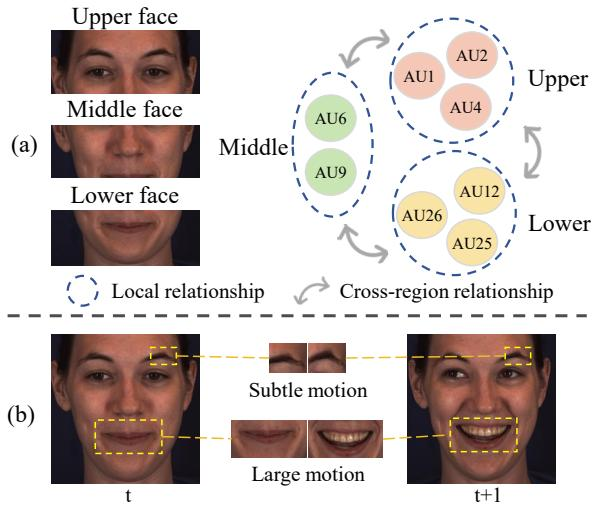
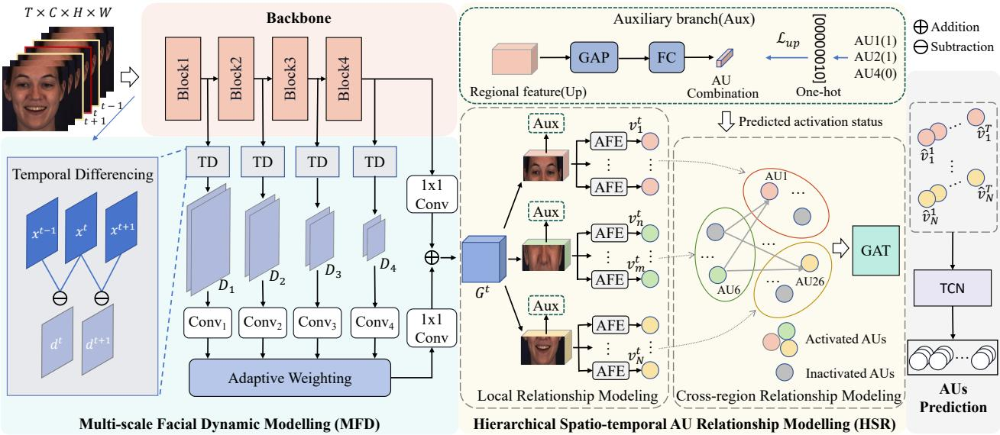
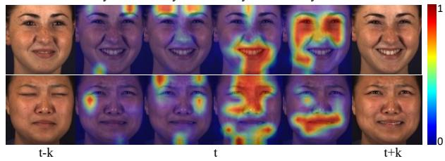
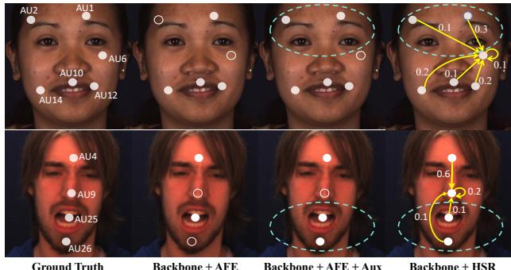

# Multi-scale Dynamic and Hierarchical Relationship Modeling for Facial Action Units Recognition

Zihan Wang1,2,3, Siyang Song4∗, Cheng Luo5, Songhe Deng1,2,3, Weicheng Xie1,2,3 and Linlin Shen1,2,3∗ 1Computer Vision Institute, School of Computer Science & Software Engineering, Shenzhen University, 2Shenzhen Institute of Artificial Intelligence and Robotics for Society,

3National Engineering Laboratory for Big Data System Computing Technology, Shenzhen University, 4University of Leicester, 5Monash University

## Abstract

Human facial action units (AUs) are mutually related in a hierarchical manner, as not only they are associated with each other in both spatial and temporal domains but also AUs located in the same/close facial regions show stronger relationships than those ofdifferentfacial regions. While none ofexisting approach thoroughly model such hierarchical inter-dependencies among AUs, this paper proposes to comprehensively model multi-scale AU-related dynamic and hierarchical spatio-temporal relationship among AUsfor their occurrences recognition. Specifically, we first propose a novel multi-scale temporal differencing network with an adaptive weighting block to explicitly capturefacial dynamics across frames at different spatial scales, which specifically considers the heterogeneity of range and magnitude in different AUs’ activation. Then, a two-stage strategy is introduced to hierarchically model the relationship among AUs based on their spatial distribution (i.e., local and cross-region AU relationship modelling). Experimental results achieved on BP4D and DISFA show that our approach is the new state-of-the-art in the field of AU occurrence recognition. Our code is publicly available at https://github.com/CVI-SZU/MDHR.

## 1. Introduction

Facial Action Coding System (FACS) [11] specifies a set of Facial Action Units (AUs) to describe multiple atomic human facial muscle movements, which can comprehensively and objectively describe various human facial expressions in an anonymous and concise manner [30]. Recent studies frequently show that AUs are robust and effective low-dimensional facial descriptors for various human behaviours understanding tasks, such as emotion [33, 51], mental health [34, 44] and pain level [10] analysis. As a result, a large number of studies attempt to automatically recognize AU occurrences from facial images or videos [7, 8, 16, 41, 45, 46, 55].

  
Figure 1. (a) hierarchical AU relationship; and (b) heterogeneous range and magnitude of different AUs’ activation.

Most of these approaches conduct AU recognition on still face images. Since each AU usually occur in a specific facial region, some recognize each AU based on a small facial patch defined by automatically detected facial landmarks [14, 18, 38]. However, they not only ignore contextual cues (i.e., AUs are mutually dependent [48]) obtainable from other facial regions for each AU’s recognition, but also suffer from errors caused by facial landmark detection. Consequently, other approaches jointly recognize multiple AUs from the entire face, allowing informative contextual cues [32, 36] to be utilized at the cost of including noises introduced by irrelevant facial regions when recognizing a particular AU. Specifically, transformer [13, 57] and graphbased [29, 46] approaches have been widely extended to model the relationship among AUs. However, most of these employ the same strategy to model the relationship between every pair of AUs in the spatial domain(e.g., via transformer encoder with the self-attention operation [13] and graph edges learned by the same cross-attention operation [29]), without giving explicit consideration to the natural hierarchical relationship among AUs (Problem 1). More specifically, AUs corresponding to the same/close facial regions frequently show stronger associations than AUs located in different facial regions(illustrated in Fig. 1 (a)), as AUs localized to the same/close facial regions may be influenced by some shared facial muscles [1].

Besides the spatial cues, some studies additionally model temporal dynamic between facial frames to enhance AU recognition performances [23, 24, 47]. A typical solution is applying common temporal models (e.g., Long-Short-Term-Memory (LSTM) [3, 18], Spatio-Temporal Graph [37, 50] and 3D Convolution Neural Networks (CNNs) [5]) to process the extracted frame-level static facial/AU features. However, these temporal modeling strategies are insensitive to subtle facial muscle movements. While other approaches [12, 43, 56] (e.g., optical flow and dynamic image) can explicitly capture facial motions, they still fail to consider that facial muscle movements corresponding to different AUs’ activation could exhibit heterogeneity in both range and magnitude (Problem 2), e.g., AU25 involves large-scale deformations of the mouth region, while AU2 are represented by subtle muscle movements surrounding eyebrows (illustrated in Fig. 1 (b)). In other words, facial dynamic of a certain spatial scale could contribute unequally to the recognition of different AUs.

In this paper, we propose a novel Multi-scale Dynamic and Hierarchical Relationship (MDHR) modeling approach for AU recognition, which: (i) hierarchically models spatiotemporal relationship among AUs; and (ii) adaptively considers facial dynamic at various spatial scales for each AU’s recognition. Our MDHR consists of two key modules. The Multi-scale Facial Dynamic Modelling (MFD) module that adaptively emphasizes AU-related facial dynamic at multiple spatial scales (i.e., computing differences between neighboring frames’ features maps output from different backbone layers), ensuring both obvious and subtle AU-related facial dynamic can be captured in an efficient manner (addressing Problem 2). Then, a Hierarchical Spatio-temporal AU Relationship Modelling (HSR) module is introduced to hierarchically model relationship among spatio-temporal AU features in a two-stage manner, where the first stage individually models relationship among AUs within the same/close facial region at both feature extraction and AU prediction levels, and the second stage explicitly learns the relationship between pairs of AUs located in different facial regions via graph edges (addressing Problem 1). The main contributions and novelties of this paper are summarised as follows:

• The proposed MFD is the first module that adaptively/specifically considers facial dynamic corresponding to each AU at each spatial scale, as each AUs’ activation exhibit heterogeneity in both range and magnitude.

• The proposed HSR is the first module that hierarchically learns local and cross-regional spatio-temporal relationship, while previous approaches fail to consider such hierarchical relationship.

• Experimental results show that our MDHR is the new state-of-the-art on the widely-used AU recognition benchmark datasets: BP4D [59] and DISFA [31], where the proposed MFD and HSR modules positively and complementarily contributed to this decent performance.

## 2. Related Work

Static face image-based methods: Existing approaches frequently predict AUs’ status based on static facial displays. Given the anatomical definition of AUs, many of them [6, 13, 14, 18, 19, 42] attempted to recognize each AU based on a face patch defined by automatically detected facial landmarks or other prior settings. For example, Zhao et al. [61] proposed a patch-based DRML that learns AU representations robust to variations inherent within local facial regions. EAC-Net [19] proposed a cropping layer to learn individual AU’s representation from small AU-specific areas. Furthermore, JAA-Net [38] jointly conducted AU recognition and face alignment, where the predicted facial landmarks are used to localize each AU region. To take global facial contextual cues into consideration, alternative approaches [23, 29, 36, 39, 40] learn each AU’s representation holistically from the full face image, where spatial attention mechanisms have been widely explored. Shao et al. [36] employed adaptive channel-wise and spatial attention strategy to enforce the model focusing on AU-related local features from the global face. Li et al. [20] proposed a self-diversified multi-channel attention to seek a more robust attention between the global facial representation and each target AU. As AUs are mutually related [60], recent approaches [2, 13, 32, 57] also specifically modelled the underlying relationship among them. For exampple, LP-Net [32] applied LSTMs to capture AU relationship. Jacob et al.[13] proposed a transformerstyle AU correlation network. In addition, graph-based strategies have been frequently investigated to model AU relationship[17, 26, 29, 46], where graph nodes have been frequently used to represent target AUs while edges explicitly define the relationship between every pair of AUs.

Spatial-temporal methods: Since facial dynamic also provide crucial cues for AU recognition [4], LSTM has been frequently employed by early studies [4, 15] to model temporal dynamic between static facial features extracted from adjacent frames. To further explore spatio-temporal relationship among AUs, a Spatio-temporal Graph Neural Network (GNN) [37] and a Heterogeneous Spatio-temporal Relation Learning Network (HSTR-Net) [47] have been proposed, both of which first construct a set of spatial graphs to model static AU relationship at the frame-level, and then individually model each AU’s temporal dynamic by considering its corresponding spatial graph node features across all frames. In addition, Li et al. [21] applied a transformer to learn both spatial AU dependencies and temporal interframe contexts by representing the inter-AU and inter-frame correlations within a multi-head attention matrix. Besides such standard temporal model-based feature-level dynamic modelling, other solutions [12, 22, 43, 53, 54] also have been investigated. For example, two auxiliary AU related tasks (e.g., ROI inpainting and optical flow estimation) are jointly conducted in [52] to enhance the regional features and encode the facial dynamic into the global facial representation, respectively. More recently, Yang et al. [56] introduced a temporal difference network (TDN) that extract facial dynamic at a specific spatial scale. Despite the progress made by approaches discussed above, to the best of our knowledge, none of them has specifically modelled AU-related multi-scale facial dynamic and the hierarchical spatio-temporal relationship among AUs.

## 3. Methodology

Overview: Given T consecutive facial frames $\begin{array} { r l } { S } & { { } = } \end{array}$ $\{ f ^ { 1 } , f ^ { 2 } , \cdot \cdot \cdot , f ^ { T } \} \in \mathbb { R } ^ { T \times C \times H \times W }$ , our approach jointly predicts multiple (N) AUs’ occurrence at the $t _ { \mathrm { t h } }$ facial frame $f ^ { t } \left( t = 1 , 2 , \cdot \cdot \cdot , T \right)$ by taking not only the $f ^ { t }$ but also its adjacent frames into consideration. As illustrated in Fig. 2 and Algorithm 1, our MDHR starts with utilizing a backbone (e.g., CNN or Transformer) to jointly extract static facial features from $f _ { t }$ and its adjacent frames $A ^ { t } = \{ f ^ { t - k } , \cdot \cdot \cdot , f ^ { t - 1 } , f ^ { t + 1 } , \cdot \cdot \cdot , f ^ { t + k } \}$ . For each frame, multi-scale static facial features are produced by $L - 1$ backbone hidden layers and the output layer (the $L _ { \mathrm { t h } }$ layer). Thus, L static facial feature sets corresponding to $2 k + 1$ frames $X _ { l } ~ = ~ \{ x _ { l } ^ { t - k } , \cdot \cdot \cdot ~ , x _ { l } ^ { t } , \cdot \cdot \cdot ~ , x _ { l } ^ { t + k } | l ~ = ~ 1 , 2 , \cdot \cdot \cdot ~ , L \}$ are generated (line 2 in Algorithm 1). Then, these multiscale features are fed to the Multi-scale Facial Dynamic Modelling (MFD) module, targeting at not only explicitly capturing facial dynamic at multiple spatial scales, but also adaptively combining these multi-scale facial dynamic features with the static feature $\ v x _ { L } ^ { t }$ (line 3 in Algorithm 1). Based on the spatio-temporal full face representation $G ^ { t }$ learned by MFD, a Hierarchical Spatio-temporal AU Relationship Modelling (HSR) module further adaptively models the hierarchical spatio-temporal relationship among AUs in a two-stage manner, where the spatial distribution of the target AUs on the human face is considered, resulting in N individual AU representations $\hat { V } ^ { t } = \{ \hat { v } _ { 1 } ^ { t } , \cdot \cdot \cdot , \hat { v } _ { N } ^ { t } \}$ (line 4 in Algorithm 1). Finally, a Temporal Convolution Networks (TCN) [27] with similarity calculating (SC) strategy [29] are employed to predict N AUs’ occurrences of the input T frames as $P ^ { 1 } , P ^ { 2 } , \cdot \cdot \cdot , P ^ { T } ( P ^ { t } = \{ p _ { 1 } ^ { t } , \cdot \cdot \cdot , p _ { N } ^ { t } \}$ , line 6 in Algorithm 1).

Algorithm 1 Pipeline of the proposed approach (MDHR)   
Input $\div T$ consecutive facial frames $S = \{ f ^ { 1 } , \cdots , f ^ { T } \}$   
Output: N AU’s predictions of each frame $f ^ { t }$   
1: for $t = 1$ to T do   
2: Generating multi-scale static global representations   
$X _ { 1 } , X _ { 2 } \cdots X _ { L } \longleftarrow \mathrm { B a c k b o n e } ( \Breve { f ^ { t - k } } , \cdot \cdot \cdot , \stackrel { \cdot } { f ^ { t } } \cdot \cdot \cdot f ^ { t + k } )$   
3: Generating global spatio-temporal features $G ^ { t } \gets$   
$\mathrm { M F D } ( X _ { 1 } , X _ { 2 } \cdot \cdot \cdot X _ { L } )$   
4: Generating hierarchical spatio-temporal   
relationship-aware AU features $\hat { V } ^ { t } \gets \mathrm { H S R } ( G ^ { t } )$   
5: end for   
6: Predicting N AUs of all frames ${ \cal P } ^ { 1 } , { \cal P } ^ { 2 } , \cdots , { \cal P } ^ { T } $   
$\operatorname { S C } ( \operatorname { T C N } ( \hat { V } ^ { 1 } , \cdot \cdot \cdot , \hat { V } ^ { t } , \cdot \cdot \cdot , \hat { V } ^ { T } ) )$

## 3.1. Multi-scale facial dynamic modelling

Inspired by the fact that facial muscle movements are continuous and smooth while each AU exhibit heterogeneity in their range of motions and magnitudes [1], we propose a novel MFD module to model the preceding and proceeding temporal evolution of the target face at multiple spatial scales. It includes a multi-scale Temporal Differecing block that first computes differences between global facial features extracted from every pair of neighboring frames at multiple spatial scales. The obtained multi-scale facial dynamic features are then masked by a set of weighting matrices learned by our adaptive weighting block, aiming to emphasize the informative cues for target AUs at multiple spatio-temporal scales.

Multi-scale Temporal Differecing block: This block is made up of multiple Temporal Differecing (TD) layers followed by convolution layers, which takes feature maps $X _ { l } = \{ x _ { l } ^ { t - k } , \cdots , x _ { l } ^ { t } , \cdots , \dot { x } _ { l } ^ { t + k } | l = 1 , 2 , \cdots , L \}$ produced by multiple $( L - 1 )$ hidden layers and the output layer of the backbone as the input, where $\boldsymbol { x } _ { l } ^ { t } \in \mathbb { R } ^ { C _ { l } \times H _ { l } \times \mathbf { \bar { W } } _ { l } }$ denotes the feature map corresponding to the $t _ { \mathrm { t h } }$ facial frame generated from the $l _ { \mathrm { t h } }$ backbone hidden layer $\mathrm { ( i . e . , } C _ { l } , H _ { l }$ , and $W _ { l }$ represent the channel, height and width of the $x _ { l } ^ { t }$ , respectively). Here, the $l _ { \mathrm { t h } }$ TD layer conducts point-to-point subtraction on feature maps produced by the $l _ { \mathrm { t h } }$ hidden layer between neighboring frames, aiming to capture facial dynamic at a certain spatial scale. This can be formulated as:

$$
d _ { l } ^ { t } = x _ { l } ^ { t } - x _ { l } ^ { t - 1 }\tag{1}
$$

Thus, a dynamic feature map $d _ { I } ^ { t } \in \mathbb { R } ^ { C _ { l } \times H _ { l } \times W _ { l } }$ representing the facial dynamic between $\check { f } ^ { t }$ and $f ^ { t - 1 }$ at the $l _ { \mathrm { t h } }$ spatial scale are produced from the $l _ { \mathrm { t h } }$ TD layer. As a result, L sets of dynamic features $D _ { l } = \{ \stackrel { \_ } { d _ { l } ^ { t - k + 1 } } , \stackrel { \cdot } { \cdot } \cdot \cdot , d _ { l } ^ { t } , \cdot \cdot \cdot , d _ { l } ^ { t + k } | l =$ $1 , 2 , \cdots , L \}$ are obtained to represent facial dynamic at L different scales. After that, we introduce L step convolution layers to resize the dynamic features extracted at different spatial scales as:

  
Figure 2. The pipeline of our MDHR, where k is set to 1. The MFD module (Sec. 3.1) first computes facial dynamic at multiple spatial scales based on feature maps output from multiple backbone hidden layers and the output layer. Then, the HSR module (Sec. 3.2) then individually models the relationship among AUs located in the same and different facial regions (the Auxiliary branch is only used at the training phase to make AU combination for each facial region (upper facial region is used as an example in the figure)). Finally, a TCN is individually employed to process every AU feature’s sequence of all the input T frames.

$$
\hat { d } _ { l } ^ { t } = \mathbf { C o n v } 2 \mathbf { D } _ { l } ( d _ { l } ^ { t } )\tag{2}
$$

where the kernel size and stride of the $l _ { \mathrm { t h } }$ Conv2D layer Conv2Dl are set to $8 / l ,$ ensuring all produced dynamic features $\hat { d } _ { l } ^ { t } \in \mathbb { R } ^ { c , h , w }$ to have the same shape. Finally, an average pooling is employed to process all re-shaped dynamic features at each spatial scale along the temporal axis as:

$$
\bar { d } _ { l } ^ { t } = \operatorname { A v g } ( \hat { d } _ { l } ^ { t - k + 1 } , \cdot \cdot \cdot , \hat { d } _ { l } ^ { t } , \cdot \cdot \cdot , \hat { d } _ { l } ^ { t + k } )\tag{3}
$$

This way, multi-scale and equal-shape facial dynamic features ${ \bar { d } } _ { 1 } ^ { t } , { \bar { d } } _ { 2 } ^ { t } , \dots , { \bar { d } } _ { L } ^ { t }$ of the target frame $f ^ { t }$ can be obtained, where each $\bar { d } _ { l } ^ { t }$ summarizes the temporal evolution of the $f ^ { t }$ by considering its preceding and succeeding k frames.

Adaptive weighting block: Facial muscle movements of large range and magnitude are typically associated with feature maps produced from deep backbone layers while subtle facial dynamic usually can be better described by feature maps produced from shallow backbone layers [25]. Thus, instead of simply conducting element-wise summation or concatenation (i.e., equally treats all components of all feature maps), we propose to adaptively learn L weighting matrices for properly combining the obtained L-scale dynamic features according to the target AUs’ typical and unique spatio-temporal scales. In particular, the weight matrix $w _ { l } ^ { t }$ at each spatial scale is obtained by exploring the underlying and internal cues from the obtained multi-scale dynamic features, which can be formulated as:

$$
w _ { l } ^ { t } = \mathrm { S o f t m a x } ( \mathrm { C o n v } _ { l } ( \mathrm { C o n c a t } ( [ \bar { d } _ { 1 } ^ { t } , \bar { d } _ { 2 } ^ { t } , \cdot \cdot \cdot , \bar { d } _ { L } ^ { t } ] ) ) )\tag{4}
$$

where $l = 1 , 2 , \cdots , L$ Specifically, multi-scale spatiotemporal features $\bar { d } _ { 1 } ^ { t } , \cdots , \bar { d } _ { L } ^ { \bar { t } }$ of the $f _ { t }$ are first concatenated along their channels, followed by $1 \times 1$ convolutions to reduce the number of its channels to one. This results in a unique weighting matrix $w _ { l } ^ { t } \in \mathbb { R } ^ { h \times w }$ to mask the spatiotemporal feature at each spatial scale l. A Softmax function is also applied to normalize the obtained weights such that $\begin{array} { r } { \sum _ { l = 1 } ^ { L } w _ { l } ^ { \dot { t } , \dot { \imath } , j } = 1 } \end{array}$ and $w _ { l } ^ { t , i , j } \in [ 0 , 1 ]$ , where i and $j$ index the spatial dimensions. Consequently, each obtained weight matrix wt is applied to the corresponding dynamic feature map $\bar { d } _ { l } ^ { t }$ by performing element-wise multiplication as:

$$
x _ { \mathrm { m o t i o n } } ^ { t } = \sum _ { l = 1 } ^ { L } w _ { l } ^ { t } * \bar { d } _ { l } ^ { t }\tag{5}
$$

where $x _ { \mathrm { m o t i o n } } ^ { t }$ represents the aggregated and adaptively weighted multi-scale facial dynamic representation of the $f _ { t } ,$ , which is then combined with the spatial feature $\boldsymbol { x } _ { L } ^ { t }$ produced by the output layer via the element-wise summation:

$$
G ^ { t } = x _ { \mathrm { m o t i o n } } ^ { t } + x _ { L } ^ { t }\tag{6}
$$

In summary, the proposed MFD module adaptively incorporates AU-aware facial dynamic with static and global facial cues into $G _ { t }$ for the fine-grained facial AU recognition.

## 3.2. Hierarchical spatio-temporal AU relationship modelling

Our HSR module hierarchically models the spatio-temporal relationship among AUs by specifically considering their spatial distribution on the face, as association among AUs in the same/close facial region could be stronger than AUs located in different facial regions [1]. It consists of two stages: the local AU relationship modelling stage first models the relationship among AUs located in the same facial region, and then the cross-regional AU relationship modeling stage adaptively explore the relationship between AU pairs of different facial regions.

Local AU Relationship Modelling: This stage specifically models relationship among AUs located in the same facial regions at both their features extraction level and prediction level. It builds on the assumption that constraining each AU feature’s extraction to its spatially correlated facial regions could partially avoid the negative impacts/noises caused by irrelevant facial regions [19]. Particularly, it first divides the spatio-temporal facial feature $G ^ { t } \in \mathbb { R } ^ { c \times \bar { h } \times w }$ extracted by MFD module into three subsets corresponding to three slightly overlapped facial regions: (1) the upper region encompassing eyebrows and eyes; (2) the middle region containing the nose and cheeks; and (3) the lower region covering the mouth and chin (Illustrated in Fig. 1). This is achieved by directly slicing the feature $G ^ { t }$ along the height dimension as:

$$
G _ { \mathrm { u p } } ^ { t } , G _ { \mathrm { m i d } } ^ { t } , G _ { \mathrm { l o w } } ^ { t } = G ^ { t } [ 0 : \frac { 3 } { 7 } h ] , G ^ { t } [ \frac { 2 } { 7 } h : \frac { 5 } { 7 } h ] , G ^ { t } [ \frac { 4 } { 7 } h : h ]\tag{7}
$$

where the height h of the $G ^ { t }$ is $7$ in our implementation, thus we empirically choose this best partition setting. After that, N AU-specific Feature Extractors (AFE) (each is made up of a convolution layer with kernel size of $1 \times 1$ and a Global Average Pooling (GAP) layer) are employed, where the $n _ { \mathrm { t h } }$ extractor learns a local relationship-aware feature $\boldsymbol { v } _ { n } ^ { t } \in \mathbb { R } ^ { 1 \times b }$ (b denotes the dimension of an AU vector) from its corresponding sliced regional feature $( G _ { \mathrm { u p } } ^ { t } , G _ { \mathrm { m i d } } ^ { t }$ or $G _ { \mathrm { l o w } } ^ { t } )$ , representing the $n _ { \mathrm { t h } } ~ \mathrm { A U ' _ { S } }$ status at the $t _ { t h }$ frame. Consequently, each AU feature is extracted in the context of its spatially adjacent AUs (i.e., modelling AU relationship of the same facial region at the feature extraction level).

In addition, the spatio-temporal relationship among AUs of the same facial region are also modelled at their prediction level, where an auxiliary branch (Aux) is added at the training phase. It is trained to predict an AU occurrence combination $Y _ { \mathrm { s u b } } ^ { t } = \{ y _ { \mathrm { s u b , 1 } } ^ { t } , \cdot \cdot \cdot , y _ { \mathrm { s u b , 2 } ^ { N _ { \mathrm { s u b } } } } ^ { t } \}$ (i.e., $Y _ { \mathrm { s u b } } ^ { t }$ is a one-hot vector and $N _ { \mathrm { s u b } }$ is the number of the target AUs in the corresponding sub-region) from each sliced regional feature $G _ { \mathrm { s u b } } ^ { t } \in \{ G _ { \mathrm { u p } } ^ { \bar { t } } , G _ { \mathrm { m i d } } ^ { t } , \mathsf { \bar { G } } _ { \mathrm { l o w } } ^ { t } \}$ , which jointly describes all $\mathrm { { A U s } } ^ { \mathbf { \prime } }$ occurrence status within each facial region. Mathematically, this process can be formulated as:

$$
P _ { \mathrm { s u b } } ^ { t } = \sigma ( { \mathrm { F C } } _ { \mathrm { s u b } } ( { \mathrm { G A P } } ( G _ { \mathrm { s u b } } ^ { t } ) ) )\tag{8}
$$

where $\sigma$ denotes the Softmax function and $\mathrm { F C } _ { \mathrm { s u b } }$ denotes a fully connected layer. As a result, training this branch enforces the network encoding underlying local AU relationship to each sliced regional feature, allowing AFE to extract enhanced AU-relevant features from regional features.

Cross-regional AU relationship modeling: Besides spatially adjacent AUs, each AU’s activation may also associate with AUs located in other facial regions [17]. Consequently, this stage aims to enhance the recognition performance by additionally capturing such cross-regional AU spatio-temporal dependencies within the given face image. It treats each local relationship-aware spatio-temporal AU feature $\boldsymbol { v } _ { n } ^ { t }$ extracted in the previous stage as a node, and adaptively connects it with all activated AU nodes belonging to other facial regions (i.e., AU activation status are decided by AU predictions of the first stage). This edge connection definition is inspired by the finding that activated AUs usually have more influences on other AUs [29]. As a result, the relationship of each cross regional AU pair is explicitly represented through a graph edge, and further modelled via a Graph Attention Network (GAT) [49] layer as:

$$
\begin{array} { r l } & { e _ { n , m } ^ { t } = \mathrm { L e a k y R e L U } \left( r ^ { T } \left[ W v _ { n } ^ { t } \parallel W v _ { m } ^ { t } \right] \right) } \\ & { \hat { v } _ { n } ^ { t } = \phi \left( \displaystyle \sum _ { m \in \cal N _ { n } ^ { t } } \alpha _ { n , m } ^ { t } W v _ { m } ^ { t } \right) } \\ & { \mathrm { ~ } \quad \quad \quad \quad \quad \quad \quad \mathrm { S u b j e c t ~ t o : ~ } \alpha _ { n , m } ^ { t } = \frac { \exp \left( e _ { n , m } ^ { t } \right) } { \displaystyle \sum _ { q \in \cal N _ { n } ^ { t } } \exp \left( e _ { n , q } ^ { t } \right) } } \end{array}\tag{9}
$$

where $e _ { n , m } ^ { t }$ is a graph edge defines the impacts of the $m _ { \mathrm { t h } }$ AU node to the $n _ { \mathrm { t h } } \thinspace \mathrm { A U }$ node in the $t _ { \mathrm { t h } }$ frame; $W \in \mathbb { R } ^ { b \times b }$ denotes a shared linear transformation applied to every node feature; ∥ is the concatenation operation; $\phi$ is an activation function and $r \in \mathbb { R } ^ { 2 b }$ denotes the weight of an attention operation. $N _ { n } ^ { t }$ is the set of the neighbours of the current node. Subsequently, N local and global hierarchical relationship-aware AU features $\hat { V } ^ { t } = \{ \hat { v } _ { 1 } ^ { t } , \hat { v } _ { 2 } ^ { t } , \cdots , \hat { v } _ { N } ^ { t } \}$ are generated to describe N target AUs in the $t _ { \mathrm { t h } }$ frame.

## 3.3. Loss function

As AU recognition constitutes a multi-label binary classification task, with most AUs inactivated the across majority of frames (please refer to Supplementary Material for details), an asymmetric loss function [29] is employed. Given the input consecutive $T$ facial frames with N target AUs, the loss function ${ \mathcal { L } } _ { \mathrm { A U } }$ for supervising all AUs’ recognition (i.e., output by the TCN/SC layers) is defined as: N T

$$
\mathcal { L } _ { \mathrm { A U } } = - \sum _ { n = 1 } \sum _ { t = 1 } w _ { n } [ y _ { n } ^ { t } \log ( p _ { n } ^ { t } ) + p _ { n } ^ { t } ( 1 - y _ { n } ^ { t } ) \log ( 1 - p _ { n } ^ { t } ) ]\tag{10}
$$

<table><tr><td rowspan="2" colspan="2">Method</td><td colspan="10">AU</td><td rowspan="2">Avg.</td><td rowspan="2">24</td></tr><tr><td>1</td><td>2</td><td>4</td><td>6</td><td>7</td><td>10</td><td>14</td><td>15</td><td>17</td><td>23</td></tr><tr><td rowspan="4">Static image-based</td><td>EAC-Net [19]</td><td>39.0</td><td>35.2</td><td>48.6</td><td>76.1</td><td>72.9</td><td>81.9</td><td>86.2</td><td>58.8</td><td>37.5</td><td>59.1</td><td>35.9</td><td>35.8 55.9</td></tr><tr><td>JAA-Net [35]</td><td>47.2</td><td>44.0</td><td>54.9</td><td>77.5</td><td>74.6 84.0</td><td>86.9</td><td>61.9</td><td>43.6</td><td>60.3</td><td>42.7</td><td>41.9</td><td>60.0</td></tr><tr><td>ARL [36]</td><td>45.8</td><td>39.8</td><td>55.1</td><td>75.7</td><td>77.2</td><td>82.3</td><td>86.6</td><td>58.8 47.6</td><td>62.1</td><td>47.4</td><td>55.4</td><td>61.1</td></tr><tr><td>SMA-Net [20]</td><td>56.5</td><td>45.1</td><td>57.0</td><td>79.5</td><td>79.5</td><td>84.5</td><td>86.4</td><td>66.1 55.8</td><td>64.2</td><td>48.7</td><td>56.8</td><td>64.9</td></tr><tr><td rowspan="4">Static AU relationship modeling</td><td>SRERL [17]</td><td>46.9</td><td>45.3</td><td>55.6</td><td>77.1</td><td>78.4</td><td>83.5</td><td>87.6</td><td>63.9 52.2</td><td>63.9</td><td>47.1</td><td>53.3</td><td>62.9</td></tr><tr><td>FAUDT [13]</td><td>51.7</td><td>49.3</td><td>61.0</td><td>77.8</td><td>79.5 82.9</td><td>86.3</td><td>67.6</td><td>51.9</td><td>63.0</td><td>43.7</td><td>56.3</td><td>64.2</td></tr><tr><td>FAN-Trans [57]</td><td>55.4</td><td>46.0</td><td>59.8</td><td>78.7</td><td>77.7 82.7</td><td>88.6</td><td>64.7</td><td>51.4</td><td>65.7</td><td>50.9</td><td>56.0</td><td>64.8</td></tr><tr><td>ME-GraphAU [29]</td><td>52.7</td><td>44.3</td><td>60.9</td><td>79.9</td><td>80.1 85.3</td><td></td><td>89.2 69.4</td><td>55.4</td><td>64.4</td><td>49.8</td><td>55.1</td><td>65.5</td></tr><tr><td rowspan="6">Spatio-temporal</td><td>STRAL [37]</td><td>48.2</td><td>47.7</td><td>58.1</td><td>75.8</td><td>78.1 81.6</td><td>87.6</td><td>60.5</td><td>50.2</td><td>64.0</td><td>51.2</td><td>55.2</td><td>63.2</td></tr><tr><td>HSTR-Net[47]</td><td>55.5</td><td>49.5</td><td>61.9</td><td>76.6</td><td>80.2 84.2</td><td>87.4</td><td>62.6</td><td>54.8</td><td>64.1</td><td>47.1</td><td>52.1</td><td>64.7</td></tr><tr><td>KS [21]</td><td>55.3</td><td>48.6</td><td>57.1</td><td>77.5</td><td>81.8 83.3</td><td>86.4</td><td>62.8</td><td>52.3</td><td>61.3</td><td>51.6</td><td>58.3</td><td>64.7</td></tr><tr><td>WSRTL [52]</td><td>59.7</td><td>51.7</td><td>61.6</td><td>80.3</td><td>80.9 85.2</td><td>89.7</td><td>67.8</td><td>52.2</td><td>63.4</td><td>51.4</td><td>46.9</td><td>65.9</td></tr><tr><td>Ours (ResNet-50)</td><td>58.3</td><td>50.9</td><td>58.9</td><td>78.4</td><td>80.3 84.9</td><td>88.2</td><td>69.5</td><td>56.0</td><td>65.5</td><td>49.5</td><td>59.3</td><td>66.6</td></tr><tr><td>Ours (Swin-B)</td><td>54.6</td><td>49.7</td><td>61.0</td><td>79.9</td><td>79.4</td><td>85.4</td><td>88.5</td><td>67.8 56.8</td><td>63.2</td><td>50.9</td><td>55.4</td><td>66.1</td></tr></table>

Table 1. F1 scores (in %) achieved for 12 AUs on BP4D dataset. The best and the second best results of each column are indicated with bold font and underline, respectively.
<table><tr><td colspan="2">Method</td><td colspan="7">AU</td><td rowspan="2">Avg.</td></tr><tr><td colspan="2"></td><td>1</td><td>2</td><td>4</td><td>6</td><td>9</td><td>12 25</td><td>26</td></tr><tr><td rowspan="4">Static image-based</td><td>EAC-Net [19]</td><td>41.5</td><td>26.4</td><td>66.4</td><td>50.7</td><td>80.5</td><td>89.3</td><td>88.9</td><td>15.6 48.5</td></tr><tr><td>JAA-Net [35]</td><td>43.7</td><td>46.2</td><td>56.0</td><td>41.4 44.7</td><td>69.6</td><td>88.3</td><td>58.4</td><td>56.0</td></tr><tr><td>ARL [36]</td><td>43.9</td><td>42.1</td><td>63.6</td><td>41.8</td><td>40.0</td><td>76.2 95.2</td><td>66.8</td><td>58.7</td></tr><tr><td>SMA-Net [20]</td><td>53.4</td><td>54.2</td><td>64.0</td><td>57.0</td><td>47.0 76.6</td><td>92.0</td><td>55.2</td><td>64.2</td></tr><tr><td rowspan="4">Static AU relationship modeling</td><td>SRERL [17]</td><td>45.7</td><td>47.8</td><td>59.6</td><td>47.1</td><td>45.6</td><td>73.5</td><td>84.3</td><td>43.6 55.9</td></tr><tr><td>FAUDT [13]</td><td>46.1</td><td>48.6</td><td>72.8</td><td>56.7</td><td>50.0</td><td>72.1</td><td>90.8 55.4</td><td>61.5</td></tr><tr><td>FAN-Trans [57]</td><td>56.4</td><td>50.2</td><td>68.6</td><td>49.2</td><td>57.6</td><td>75.6</td><td>93.6 58.8</td><td>63.8</td></tr><tr><td>ME-GraphAU[29]</td><td>54.6</td><td>47.1</td><td>72.9</td><td>54.0</td><td>55.7 76.7</td><td>91.1</td><td>53.0</td><td>63.1</td></tr><tr><td rowspan="6">Spatio-temporal</td><td>STRAL[37]</td><td>52.2</td><td>47.4</td><td>68.9</td><td>47.8</td><td>56.7</td><td>72.5</td><td>91.3</td><td>67.6</td><td>63.0</td></tr><tr><td>HSTR-Net[47]</td><td>54.3</td><td>50.8</td><td>70.1</td><td>66.6</td><td>59.6</td><td>68.0</td><td>97.9</td><td>69.8</td><td>62.9</td></tr><tr><td>KS [21]</td><td>53.8</td><td>59.9</td><td>69.2</td><td>54.2</td><td>50.8</td><td>75.8</td><td>92.2</td><td>46.8</td><td>62.8</td></tr><tr><td>WSRTL [52]</td><td>57.3</td><td>51.8</td><td>74.3</td><td>49.8</td><td>44.8</td><td>79.3</td><td>94.6</td><td>64.6</td><td>64.6</td></tr><tr><td>Ours (ResNet-50)</td><td>61.4</td><td>57.7</td><td>70.9</td><td>57.1</td><td>48.3</td><td>75.7</td><td>91.5</td><td>56.7</td><td>64.9</td></tr><tr><td>Ours (Swin-B)</td><td>65.4</td><td>60.2</td><td>75.2</td><td>50.2</td><td>52.4</td><td>74.3</td><td>93.7</td><td>58.2</td><td>66.2</td></tr></table>

Table 2. F1 scores (in %) achieved for 8 AUs on DISFA dataset. The best and second best results of each column are indicated with bold font and underline, respectively.

where $p _ { n } ^ { t }$ and $y _ { n } ^ { t }$ are the $n _ { \mathrm { t h } } \ \mathrm { A U ' _ { S } }$ prediction and the corresponding ground-truth for the frame $f ^ { t }$ , respectively; a $w _ { n }$ is calculated for each AU based on the training set to alleviate label imbalance issue; the $p _ { n } ^ { t }$ at the beginning of the second term $p _ { n } ^ { t } \big ( 1 - y _ { n } ^ { t } \big ) \log ( 1 - p _ { n } ^ { t } )$ dynamically down-weights the contribution of negative samples (inactive AUs), as inactive AUs significantly outnumber active ones in the training set. Besides, a cross-entropy loss is utilized to individually supervise regional AU combination predictions of all frames produced by the first stage of the HSR module as:

$$
\mathcal { L } _ { \mathrm { s u b } } = \sum _ { t = 1 } ^ { T } \sum _ { \mathrm { s u b } = \{ \mathrm { u p } , \mathrm { m i d } , \mathrm { d o w n } \} } \mathrm { C E } ( P _ { \mathrm { s u b } } ^ { t } , Y _ { \mathrm { s u b } } ^ { t } )\tag{11}
$$

where $P _ { \mathrm { s u b } } ^ { t }$ and $Y _ { \mathrm { s u b } } ^ { t }$ denote the AU combination prediction and the corresponding ground-truth of a facial region in the frame $f ^ { t }$ and CE denotes the cross-entropy function. By predicting such AU combinations consisting of multiple AUs located in the same facial region, the network is encouraged to model underlying dependencies among spatially adjacent AUs in each facial region. Consequently, the overall loss function for training the proposed network combines the two loss functions described above as:

$$
\mathcal { L } = \mathcal { L } _ { \mathrm { A U } } + \lambda \mathcal { L } _ { \mathrm { s u b } }\tag{12}
$$

where λ balances the contribution of the two losses.

## 4. Experiments

## 4.1. Experimental setup

Datasets: Our MDHR is evaluated on two AU recognition benchmark datasets: BP4D [59] and DISFA [31]. BP4D is made up of 328 facial videos containing around 140,000 frames collected from 23 females and 18 males. Meanwhile, DISFA contains 27 facial image sequence (totally 130, 815 frames) recorded from 12 females and 15 males who were asked to watch Youtube videos. Each frame in BP4D and DISFA is annotated with occurrence labels corresponding to 12 and 8 AUs, respectively.

Implementation details: We follow previous approaches [38, 60] to apply MTCNN [58] to crop and align a 224 × 224 face region from each frame, and conduct subjectindependent three-folds cross-validation for each dataset, where the reported results are achieved by averaging the validation results of three folds. We pad k frames that same to the first frame / last frame at the beginning / end of each face video to ensure all frames can be processed by our model. AdamW [28] optimizer with $\beta _ { 1 } = 0 . 9 , \beta _ { 2 } = 0 . 9 9 9$ is employed for training and the λ in Eq. 12 is set to 0.01. A cosine decay learning rate scheduler is utilized, with an initial value of 0.0001. Both backbones are pre-trained on ImageNet [9]. All our experiments are conducted using NVIDIA A100 GPUs based on the open-source PyTorch library. More detailed model, training/validation, and dataset settings are provided in the Supplementary Material.

Metrics: Following previous AU recognition studies [5, 22, 38], a common metric: frame-based F1 score $( F 1 =$ $2 \frac { P \cdot R } { P + R } )$ , is employed to evaluate the performance of our MDHR, which takes both recognition precision P and recall rate R into consideration.

## 4.2. Comparison with state-of-the-arts

Table 1 and Table 2 compare our approach with previous state-of-the-art AU recognition methods, including eight static image-based methods [13, 17, 19, 20, 29, 35, 36, 57] (where four methods specifically conduct AU relationship modeling) and four spatio-temporal methods [21, 37, 47, 52]. It can be observed that our MDHR achieved new SOTA results on both datasets, with F1-scores of 66.6% (ResNet50 backbone) and 66.2% (Swin-Transformer backbone) on BP4D and DISFA, respectively. Particularly, it has clear advantages over all static image-based methods, e.g., outperformed previous state-of-the-art static AU relationship modelling method [29] with 1.1% (ResNet) and 0.6% (Swin-Transformer) improvements on BP4D, as well as 1.8% (ResNet) and 3.1% (Swin-Transformer) improvements on DISFA, respectively. Meanwhile, our approach is also superior to previous spatio-temporal methods, achieving 0.7% and 1.6% higher F1 results over the best model WSRTL [52] on BP4D and DISFA, respectively.

These results suggest that: (i) the proposed MDHR is effective and robust in AU recognition, as it achieved both best and the second best performances on both datasets under two backbone settings; (ii) jointly modelling spatiotemporal relationship among AUs could lead to additional performance gains compared to approaches [29, 46] that only consider their spatial relationship; and (iii) our MDHR can better capture AU-related spatio-temporal cues over existing spatio-temporal AU recognition approaches [47, 52]. We didn’t compare approaches that utilized additional face datasets to train AU models [56] despite our MDHR still clearly outperformed them.

<table><tr><td rowspan="2">Backbone</td><td rowspan="2">MFD</td><td colspan="3">HSR</td><td rowspan="2">TCN</td><td rowspan="2">F1-score</td></tr><tr><td>AFE</td><td>Aux</td><td>CRM</td></tr><tr><td>√</td><td></td><td></td><td></td><td></td><td></td><td>63.3</td></tr><tr><td>√</td><td>√</td><td></td><td></td><td></td><td></td><td>64.6</td></tr><tr><td>√</td><td></td><td>√</td><td></td><td></td><td></td><td>64.1</td></tr><tr><td>V</td><td></td><td>√</td><td>√</td><td></td><td></td><td>64.5</td></tr><tr><td>√</td><td></td><td>√</td><td>√</td><td>√</td><td></td><td>65.1</td></tr><tr><td></td><td>√</td><td>√</td><td></td><td></td><td></td><td>65.3</td></tr><tr><td>v&gt;</td><td>√</td><td>√</td><td>√</td><td></td><td></td><td>65.7</td></tr><tr><td>√</td><td>√</td><td>√</td><td>√</td><td>√</td><td></td><td>66.3</td></tr><tr><td>√</td><td>√</td><td>√</td><td>√</td><td>√</td><td>√</td><td>66.6</td></tr></table>

Table 3. Average AU recognition F1 scores (%) achieved by various settings using ResNet50 backbone on BP4D dataset, where AFE, Aux, and CRM denote the AU-specific feature extractor, the added auxiliary branch and the Cross-regional AU relationship modelling block, all of which belong to the HSR module.

## 4.3. Ablation studies

We perform ablation studies on BP4D dataset to demonstrate various aspects of our approach, where the default setting employs the ResNet as the backbone and asymmetric loss (Eqa. 10) for the model training. We further provide more ablation results $( \mathrm { e . g . }$ ., the influence of the number of adjacent frames k, statistical analysis, model complexity analysis, etc.) in the Supplementary Material.

Contribution of each component: Table 3 compares contributions of different modules. Firstly, our MFD module brought 1.3% absolute improvement, highlighting the effectiveness of the MFD in capture AU-related spatiotemporal facial behaviour cues. Meanwhile, individually employing the HSR module boosting the F1 score from 63.3% to 65.1%, validating the importance of modelling hierarchical spatio-temporal relationship among AUs. Specifically, the use of AU-specific feature extractors to individually learn each AU from its sliced facial region improved the F1 score from 63.3% to 64.1%, and the auxiliary branch also contributes additional 0.4% improvement. Finally, we found that combining our MFD and HSR module with the TCN resulted in the best performance, which validates that these two modules can learn complementary AU-related cues to further enhance AU recognition performance.

Analysis of the MFD module: Table 4 investigates our MFD module based on the system (baseline) that combines the backbone and AU-specific feature extractors. It is clear that even using facial dynamic learned from the outputs of a single and two backbone layers can consistently benefit the recognition, while combining dynamic of all scales resulted in the largest improvement. This suggests that facial dynamic extracted by our MFD at different spatial scales contain complementary and useful cues for AU recognition., i.e., our MFD can emphasize each AU-related cues at its most related spatial scales (illustrated in Figure 3). Although simply adding or concatenating unweighted dynamic features of all spatial scales can already lead to performance gains, our adaptive weighting block still show clear advantage over them, suggesting that it can effectively consider the importance of each spatial scale on different AUs’ recognition.

Layer 1 Layer 2 Layer 3 Layer 4  

Figure 3. Visualization of adaptive weight matrices learned by the MFD module. The weight matrices learned for feature maps of shallow layers (layer 1 and 2) emphasized subtle motions (e.g., subtle eyebrow and cheek motions), while large check and mouth movements are captured in deeper layers (layer 3 and 4).
<table><tr><td></td><td>Method | baseline</td><td>Alone</td><td>Combination</td><td></td><td>|Sum Cat AW</td><td></td></tr><tr><td>layer 1</td><td></td><td>√</td><td>√ √</td><td>√</td><td>√</td><td>√</td></tr><tr><td>layer 2 layer 3</td><td></td><td></td><td>√ √</td><td>√ √ √ √</td><td>√ √</td><td>√ √</td></tr><tr><td>layer 4</td><td></td><td>√</td><td>√</td><td>√</td><td>√</td><td>√</td></tr><tr><td>F1-score</td><td>64.1</td><td>|64.364.7|64.664.864.7</td><td></td><td>64.9</td><td>64.9</td><td>65.3</td></tr></table>

Table 4. Results of different MFD module settings, where the left part displays results achieved by computing facial dynamic at different layers and their combinations (combined using our adaptive weighting), while the right side displays results of two other fusion strategy applied to combine facial dynamic of all scales, and AW denotes adaptive weighting.

<table><tr><td>AU relationship modeling method</td><td>F1-score</td></tr><tr><td>Fully-connected</td><td>64.6</td></tr><tr><td>Aux + Locally connected</td><td>64.2</td></tr><tr><td>Aux + Cross-regional fully-connected</td><td>64.9</td></tr><tr><td>Aux + Fully connected</td><td>64.8</td></tr><tr><td>Aux + Connecting cross-regional activated AUs</td><td>65.1</td></tr></table>

Table 5. Results of different edge connection strategies.

Analysis of the HSR module: Table 3 first demonstrates that not only the HSR module brought clear improvements but also both of its local and cross-regional AU relationship modelling blocks can improve AU predictions, i.e., all its block (e.g., AFE, Aux and CRM) positively contributed to the final performance. Figure 4 further visualizes the impact of these blocks. Additionally, Table 5 compares different AU graph edge connection settings of the crossregional AU relationship modelling block, where the setting that connects each activated AU to all other AUs located in different facial region achieved the superior performance to other edge settings, i.e., this setting can effectively model cross-regional AU relationship. Importantly, the HSR is not sensitive to different edge connection settings when crossregional AU relationship is considered.

  
Figure 4. Visualization of AU predictions under three HSR settings, where white solid and hollow dots denote activated and inactivated AUs. The green dotted circles denote the local AU relationship modelling, while the yellow lines/weights denote the graph edges describing the association between AUs. It can be observed that the local relationship modelling can effectively model dependencies between AUs in the same region to make better predictions (e.g., AU2 and AU26 in column 3), while additionally use cross-regional AU relationship modelling can further utilize the learned relationship cues to improve AU predictions in different facial regions (e.g., AU6 and AU9 in column 4).

## 5. Conclusion

This paper proposes a novel MDHR that not only computes facial dynamics at different spatial scales as AUs could exhibit heterogeneity in their ranges and magnitudes, but also models hierarchical spatio-temporal relationships among AUs. Results show that the proposed two modules can effective capture AU-related dynamics and their relationships, making our MDHR becoming the new SOTA AU recognition method. The main limitations are that our facial region slicing strategy could be potentially improved and more advanced graph edge learning strategies could be applied to HSR for better modelling relationships.

## 6. Acknowledgement

The work is supported by National Natural Science Foundation of China under Grant 82261138629; Guangdong Basic and Applied Basic Research Foundation under Grant 2023A1515010688 and Shenzhen Municipal Science and Technology Innovation Council under Grant JCYJ20220531101412030.

## References

[1] Luigi Cattaneo and Giovanni Pavesi. The facial motor system. Neuroscience & Biobehavioral Reviews, 38:135–159, 2014. 2, 3, 5

[2] Yanan Chang and Shangfei Wang. Knowledge-driven selfsupervised representation learning for facial action unit recognition. In Proceedings of the IEEE/CVF Conference on Computer Vision and Pattern Recognition, pages 20417– 20426, 2022. 2

[3] Wen-Sheng Chu, Fernando De la Torre, and Jeffrey F. Cohn. Learning spatial and temporal cues for multi-label facial action unit detection. In 2017 12th IEEE International Conference on Automatic Face Gesture Recognition (FG 2017), pages 25–32, 2017. 2

[4] Wen-Sheng Chu, Fernando De la Torre, and Jeffrey F Cohn. Learning spatial and temporal cues for multi-label facial action unit detection. In 2017 12th IEEE International Conference on Automatic Face & Gesture Recognition (FG 2017), pages 25–32. IEEE, 2017. 2

[5] Nikhil Churamani, Sinan Kalkan, and Hatice Gunes. Aulacaps: Lifecycle-aware capsule networks for spatio-temporal analysis of facial actions. In 2021 16th IEEE International Conference on Automatic Face and Gesture Recognition (FG 2021), pages 01–08. IEEE, 2021. 2, 7

[6] Ciprian Corneanu, Meysam Madadi, and Sergio Escalera. Deep structure inference network for facial action unit recognition. In Proceedings of the european conference on computer vision (ECCV), pages 298–313, 2018. 2

[7] Zijun Cui, Tengfei Song, Yuru Wang, and Qiang Ji. Knowledge augmented deep neural networks for joint facial expression and action unit recognition. Advances in Neural Information Processing Systems, 33:14338–14349, 2020. 1

[8] Zijun Cui, Chenyi Kuang, Tian Gao, Kartik Talamadupula, and Qiang Ji. Biomechanics-guided facial action unit detection through force modeling. In Proceedings of the IEEE/CVF Conference on Computer Vision and Pattern Recognition, pages 8694–8703, 2023. 1

[9] Jia Deng, Wei Dong, Richard Socher, Li-Jia Li, Kai Li, and Li Fei-Fei. Imagenet: A large-scale hierarchical image database. In 2009 IEEE conference on computer vision and pattern recognition, pages 248–255. Ieee, 2009. 7

[10] Joy O Egede, Siyang Song, Temitayo A Olugbade, Chongyang Wang, C De C Amanda, Hongying Meng, Min Aung, Nicholas D Lane, Michel Valstar, and Nadia Bianchi-Berthouze. Emopain challenge 2020: Multimodal pain evaluation from facial and bodily expressions. In 2020 15th IEEE International Conference on Automatic Face and Gesture Recognition (FG 2020), pages 849–856. IEEE, 2020. 1

[11] Paul Ekman and Wallace V Friesen. Facial action coding system. Environmental Psychology & Nonverbal Behavior, 1978. 1

[12] Shuangjiang He, Huijuan Zhao, Jing Juan, Zhe Dong, and Zhi Tao. Optical flow fusion synthesis based on adversarial learning from videos for facial action unit detection. In The International Conference on Image, Vision and Intelligent Systems (ICIVIS 2021), pages 561–571. Springer, 2022. 2, 3

[13] Geethu Miriam Jacob and Bjorn Stenger. Facial action unit detection with transformers. In Proceedings of the IEEE/CVF Conference on Computer Vision and Pattern Recognition, pages 7680–7689, 2021. 1, 2, 6, 7

[14] Shashank Jaiswal and Michel Valstar. Deep learning the dynamic appearance and shape of facial action units. In 2016 IEEE Winter Conference on Applications ofComputer Vision (WACV), pages 1–8, 2016. 1, 2

[15] Shashank Jaiswal and Michel Valstar. Deep learning the dynamic appearance and shape of facial action units. In 2016 IEEE winter conference on applications of computer vision (WACV), pages 1–8. IEEE, 2016. 2

[16] Zhao Kaili, Wen-Sheng Chu, and Honggang Zhang. Deep region and multi-label learning for facial action unit detection. In In Proceedings of the IEEE Conference on Computer Vision and Pattern Recognition, pages 3391–3399, 2016. 1

[17] Guanbin Li, Xin Zhu, Yirui Zeng, Qing Wang, and Liang Lin. Semantic relationships guided representation learning for facial action unit recognition. In Proceedings of the AAAI Conference on Artificial Intelligence, pages 8594– 8601, 2019. 2, 5, 6, 7

[18] Wei Li, Farnaz Abtahi, and Zhigang Zhu. Action unit detection with region adaptation, multi-labeling learning and optimal temporal fusing. In Proceedings of the IEEE conference on computer vision and pattern recognition, pages 1841–1850, 2017. 1, 2

[19] Wei Li, Farnaz Abtahi, Zhigang Zhu, and Lijun Yin. Eacnet: Deep nets with enhancing and cropping for facial action unit detection. IEEE transactions on pattern analysis and machine intelligence, 40(11):2583–2596, 2018. 2, 5, 6, 7

[20] Xiaotian Li, Zhihua Li, Huiyuan Yang, Geran Zhao, and Lijun Yin. Your “attention” deserves attention: A selfdiversified multi-channel attention for facial action analysis. In 2021 16th IEEE International Conference on Automatic Face and Gesture Recognition (FG 2021), pages 01– 08, 2021. 2, 6, 7

[21] Xiaotian Li, Xiang Zhang, Taoyue Wang, and Lijun Yin. Knowledge-spreader: Learning semi-supervised facial action dynamics by consistifying knowledge granularity. In Proceedings of the IEEE/CVF International Conference on Computer Vision (ICCV), pages 20979–20989, 2023. 3, 6, 7

[22] Yong Li, Jiabei Zeng, Shiguang Shan, and Xilin Chen. Selfsupervised representation learning from videos for facial action unit detection. In Proceedings of the IEEE/CVF Conference on Computer vision and pattern recognition, pages 10924–10933, 2019. 3, 7

[23] Zhihua Li, Xiang Deng, Xiaotian Li, and Lijun Yin. Integrating semantic and temporal relationships in facial action unit detection. In Proceedings ofthe 29th ACM International Conference on Multimedia, pages 5519–5527, 2021. 2

[24] Zhihua Li, Zheng Zhang, and Lijun Yin. Sat-net: Selfattention and temporal fusion for facial action unit detection. In 2020 25th International Conference on Pattern Recognition (ICPR), pages 5036–5043, 2021. 2

[25] Songtao Liu, Di Huang, and Yunhong Wang. Learning spatial fusion for single-shot object detection. arXiv preprint arXiv:1911.09516, 2019. 4

[26] Zhilei Liu, Jiahui Dong, Cuicui Zhang, Longbiao Wang, and Jianwu Dang. Relation modeling with graph convolutional networks for facial action unit detection. In MultiMedia Modeling: 26th International Conference, MMM 2020, Daejeon, South Korea, January 5–8, 2020, Proceedings, Part II 26, pages 489–501. Springer, 2020. 2

[27] Zhaoyang Liu, Donghao Luo, Yabiao Wang, Limin Wang, Ying Tai, Chengjie Wang, Jilin Li, Feiyue Huang, and Tong Lu. Teinet: Towards an efficient architecture for video recognition. In Proceedings of the AAAI conference on artificial intelligence, pages 11669–11676, 2020. 3

[28] Ilya Loshchilov and Frank Hutter. Decoupled weight decay regularization. In International Conference on Learning Representations, 2018. 7

[29] Cheng Luo, Siyang Song, Weicheng Xie, Linlin Shen, and Hatice Gunes. Learning multi-dimensional edge featurebased au relation graph for facial action unit recognition. arXiv preprint arXiv:2205.01782, 2022. 1, 2, 3, 5, 6, 7

[30] Brais Martinez, Michel F Valstar, Bihan Jiang, and Maja Pantic. Automatic analysis of facial actions: A survey. IEEE transactions on affective computing, 10(3):325–347, 2017. 1

[31] S Mohammad Mavadati, Mohammad H Mahoor, Kevin Bartlett, Philip Trinh, and Jeffrey F Cohn. Disfa: A spontaneous facial action intensity database. IEEE Transactions on Affective Computing, 4(2):151–160, 2013. 2, 6

[32] Xuesong Niu, Hu Han, Songfan Yang, Yan Huang, and Shiguang Shan. Local relationship learning with personspecific shape regularization for facial action unit detection. In Proceedings of the IEEE/CVF Conference on computer vision and pattern recognition, pages 11917–11926, 2019. 1, 2

[33] Tao Pu, Tianshui Chen, Yuan Xie, Hefeng Wu, and Liang Lin. Au-expression knowledge constrained representation learning for facial expression recognition. In 2021 IEEE international conference on robotics and automation (ICRA), pages 11154–11161. IEEE, 2021. 1

[34] Fabien Ringeval, Bjorn Schuller, Michel Valstar, Nicholas¨ Cummins, Roddy Cowie, Leili Tavabi, Maximilian Schmitt, Sina Alisamir, Shahin Amiriparian, Eva-Maria Messner, et al. Avec 2019 workshop and challenge: state-of-mind, detecting depression with ai, and cross-cultural affect recognition. In Proceedings ofthe 9th International on Audio/visual Emotion Challenge and Workshop, pages 3–12, 2019. 1

[35] Zhiwen Shao, Zhilei Liu, Jianfei Cai, and Lizhuang Ma. Deep adaptive attention for joint facial action unit detection and face alignment. In Proceedings of the European conference on computer vision (ECCV), pages 705–720, 2018. 6, 7

[36] Zhiwen Shao, Zhilei Liu, Jianfei Cai, Yunsheng Wu, and Lizhuang Ma. Facial action unit detection using attention and relation learning. IEEE transactions on affective computing, 13(3):1274–1289, 2019. 1, 2, 6, 7

[37] Zhiwen Shao, Lixin Zou, Jianfei Cai, Yunsheng Wu, and Lizhuang Ma. Spatio-temporal relation and attention learning for facial action unit detection. arXiv preprint arXiv:2001.01168, 2020. 2, 6, 7

[38] Zhiwen Shao, Zhilei Liu, Jianfei Cai, and Lizhuang Ma. Jaanet: joint facial action unit detection and face alignment via

adaptive attention. International Journal of Computer Vision, 129:321–340, 2021. 1, 2, 7

[39] Zhiwen Shao, Yong Zhou, Hancheng Zhu, Wen-Liang Du, Rui Yao, and Hao Chen. Facial action unit recognition by prior and adaptive attention. Electronics, 11(19):3047, 2022. 2

[40] Zhiwen Shao, Yong Zhou, Jianfei Cai, Hancheng Zhu, and Rui Yao. Facial action unit detection via adaptive attention and relation. IEEE Transactions on Image Processing, 32: 3354–3366, 2023. 2

[41] Zhiwen Shao, Yong Zhou, Jianfei Cai, Hancheng Zhu, and Rui Yao. Facial action unit detection via adaptive attention and relation. IEEE Transactions on Image Processing, 2023. 1

[42] Juan Song and Zhilei Liu. Self-supervised facial action unit detection with region and relation learning. In ICASSP 2023- 2023 IEEE International Conference on Acoustics, Speech and Signal Processing (ICASSP), pages 1–5. IEEE, 2023. 2

[43] Siyang Song, Enrique Sanchez-Lozano, Mani Kumar Tel-´ lamekala, Linlin Shen, Alan Johnston, and Michel Valstar. Dynamic facial models for video-based dimensional affect estimation. In Proceedings of the IEEE/CVF International Conference on Computer Vision Workshops, pages 0–0, 2019. 2, 3

[44] Siyang Song, Shashank Jaiswal, Linlin Shen, and Michel Valstar. Spectral representation of behaviour primitives for depression analysis. IEEE Transactions on Affective Computing, 13(2):829–844, 2020. 1

[45] Siyang Song, Yuxin Song, Cheng Luo, Zhiyuan Song, Selim Kuzucu, Xi Jia, Zhijiang Guo, Weicheng Xie, Linlin Shen, and Hatice Gunes. Gratis: Deep learning graph representation with task-specific topology and multi-dimensional edge features. arXiv preprint arXiv:2211.12482, 2022. 1

[46] Tengfei Song, Lisha Chen, Wenming Zheng, and Qiang Ji. Uncertain graph neural networks for facial action unit detection. In Proceedings of the AAAI Conference on Artificial Intelligence, pages 5993–6001, 2021. 1, 2, 7

[47] Wenyu Song, Shuze Shi, Yu Dong, and Gaoyun An. Heterogeneous spatio-temporal relation learning network for facial action unit detection. Pattern Recognition Letters, 164:268– 275, 2022. 2, 3, 6, 7

[48] Yan Tong, Wenhui Liao, and Qiang Ji. Facial action unit recognition by exploiting their dynamic and semantic relationships. IEEE Transactions on Pattern Analysis and Machine Intelligence, 29(10):1683–1699, 2007. 1

[49] Petar Velickoviˇ c, Guillem Cucurull, Arantxa Casanova,´ Adriana Romero, Pietro Lio, and Yoshua Bengio. Graph attention networks. arXiv preprint arXiv:1710.10903, 2017. 5

[50] Zihan Wang, Siyang Song, Cheng Luo, Yuzhi Zhou, Weicheng Xie, Linlin Shen, et al. Spatio-temporal au relational graph representation learning for facial action units detection. arXiv preprint arXiv:2303.10644, 2023. 2

[51] Hong-Xia Xie, Ling Lo, Hong-Han Shuai, and Wen-Huang Cheng. Au-assisted graph attention convolutional network for micro-expression recognition. In Proceedings of the 28th ACM International Conference on Multimedia, pages 2871– 2880, 2020. 1

[52] Jingwei Yan, Jingjing Wang, Qiang Li, Chunmao Wang, and Shiliang Pu. Weakly supervised regional and temporal learning for facial action unit recognition. IEEE Transactions on Multimedia, 2022. 3, 6, 7

[53] Jingwei Yan, Jingjing Wang, Qiang Li, Chunmao Wang, and Shiliang Pu. Weakly supervised regional and temporal learning for facial action unit recognition. IEEE Transactions on Multimedia, 25:1760–1772, 2023. 3

[54] Huiyuan Yang and Lijun Yin. Learning temporal information from a single image for au detection. In 2019 14th IEEE International Conference on Automatic Face & Gesture Recognition (FG 2019), pages 1–8. IEEE, 2019. 3

[55] Huiyuan Yang, Lijun Yin, Yi Zhou, and Jiuxiang Gu. Exploiting semantic embedding and visual feature for facial action unit detection. In Proceedings of the IEEE/CVF Conference on Computer Vision and Pattern Recognition, pages 10482–10491, 2021. 1

[56] Jing Yang, Yordan Hristov, Jie Shen, Yiming Lin, and Maja Pantic. Toward robust facial action units’ detection. Proceedings ofthe IEEE, 2023. 2, 3, 7

[57] Jing Yang, Jie Shen, Yiming Lin, Yordan Hristov, and Maja Pantic. Fan-trans: Online knowledge distillation for facial action unit detection. In Proceedings of the IEEE/CVF Winter Conference on Applications of Computer Vision, pages 6019–6027, 2023. 1, 2, 6, 7

[58] Kaipeng Zhang, Zhanpeng Zhang, Zhifeng Li, and Yu Qiao. Joint face detection and alignment using multitask cascaded convolutional networks. IEEE signal processing letters, 23 (10):1499–1503, 2016. 7

[59] Xing Zhang, Lijun Yin, Jeffrey F Cohn, Shaun Canavan, Michael Reale, Andy Horowitz, Peng Liu, and Jeffrey M Girard. Bp4d-spontaneous: a high-resolution spontaneous 3d dynamic facial expression database. Image and Vision Computing, 32(10):692–706, 2014. 2, 6

[60] Yong Zhang, Weiming Dong, Bao-Gang Hu, and Qiang Ji. Classifier learning with prior probabilities for facial action unit recognition. In Proceedings of the IEEE Conference on Computer Vision and Pattern Recognition (CVPR), 2018. 2, 7

[61] Kaili Zhao, Wen-Sheng Chu, and Honggang Zhang. Deep region and multi-label learning for facial action unit detection. In Proceedings of the IEEE conference on computer vision and pattern recognition, pages 3391–3399, 2016. 2