# NeRF Analogies: Example-Based Visual Attribute Transfer for NeRFs

Michael Fischer1\* Zhengqin Li2 Thu Nguyen-Phuoc2 Aljaz Bo ˇ ziˇ cˇ2 Zhao Dong2

Carl Marshall2 Tobias Ritschel1

1University College London 2Meta Reality Labs Research

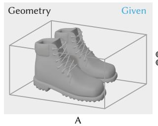

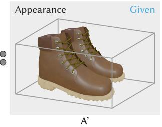

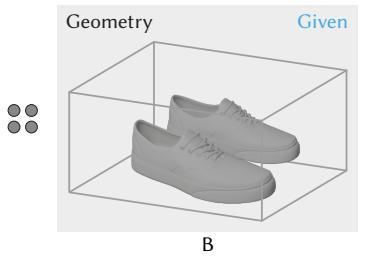

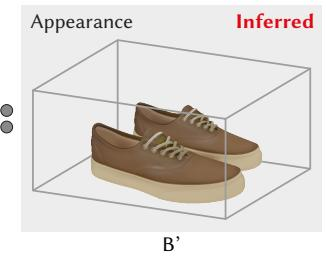  
Figure 1. Given a source NeRF that encodes 3D geometry (A) and appearance (A’), as well as a target NeRF that encodes 3D geometry without appearance (B), our method infers a NeRF analogy (B’) that combines the target geometry with the source appearance.

## Abstract

A Neural Radiance Field (NeRF) encodes the specific relation of 3D geometry and appearance ofa scene. We here ask the question whether we can transfer the appearance from a source NeRF onto a target 3D geometry in a semantically meaningful way, such that the resulting new NeRF retains the target geometry but has an appearance that is an analogy to the source NeRF. To this end, we generalize classic image analogies from 2D images to NeRFs. We leverage correspondence transfer along semantic affinity that is driven by semantic features from large, pre-trained 2D image models to achieve multi-view consistent appearance transfer. Our method allows exploring the mix-andmatch product space of 3D geometry and appearance. We show that our method outperforms traditional stylizationbased methods and that a large majority of users prefer our method over several typical baselines. Project page: mfischer-ucl.github.io/nerf\_analogies.

## 1. Introduction

Understanding and representing the three-dimensional world, a fundamental challenge in computer vision, requires accurate modeling of the interplay between geometry and appearance. NeRFs [42] have emerged as a pivotal tool in this space, uniquely encoding this relationship via optimized color- and density-mappings. However, in spite of their success for high-quality novel view synthesis (NVS), most NeRF representations remain notoriously hard to edit, which led to the research field of NeRF editing.

In this work, we contribute to this evolving landscape by exploring NeRF Analogies, a novel aspect of NeRF manipulation between semantically related objects. Fig. 1 illustrates this concept: We begin with an existing NeRF, designated A′, which is derived from the geometric structure of a boot (A) and its appearance. This NeRF, which we henceforth will call our source NeRF, encodes the relation of geometry and appearance. In a NeRF analogy, we now seek to infer a new NeRF, B′, which, given a target geometric shape (the sneaker, B), satisfies the analogy A : A′ :: B : B′, i.e., combines the visual appearance of A′ with the new geometry B. NeRF analogies hence are a way of changing a NeRF’s geometry while maintaining its visual appearance - a counterpoint to recent research, which often aims to update the encoded appearance based on (potentially non-intuitive) text-embeddings, while keeping the geometry (largely) unchanged.

Creating a NeRF analogy essentially requires solving the problem of finding semantically related regions between the target geometry B and the existing source NeRF A′, which will then serve as guides for the subsequent appearance transfer. While image-based correspondence has been thoroughly researched in the past [7, 14, 15, 39, 45, 49, 51], recent work has shown the (un)reasonable success of the activations of large, pre-trained networks for the task of (dense) semantic image correspondence [1, 8, 50, 63]. More specifically, Amir et al. [1] and Sharma et al. [50] both show that the features produced by the attention layers in vision transformers (ViTs) can be used as expressive descriptors for dense semantic correspondence tasks, presumably due to the attention mechanism’s global context [2, 21, 40, 54].

In this work, we thus leverage the expressiveness of DiNO-ViT, a large pre-trained vision transformer [10] to help us generalize classic Image Analogies [22] from twodimensional images to multiview-consistent light fields. To this end, we compute the semantic affinity between pixelqueries on renderings of the 3D target geometry and 2D slices of the source NeRF via the cosine-similarity of the produced ViT features, and subsequently use this mapping to transfer the visual appearance from the source onto the target. Assuming we can query the 3D position of our target geometry, repeating this process over many views and pixels results in a large corpus of position-appearance pairs, which we use as input for training our NeRF analogy B′, thereby achieving a multiview-consistent 3D representation that combines target geometry and source appearance.

We compare NeRF analogies to other methods via quantitative evaluation and a user-study and find that a significant majority of users prefer our method. NeRF analogies allow exploring the product space of 3D geometry and appearance and provide a practical way of changing neural radiance fields to new geometry while keeping their original appearance.

## 2. Previous Work

Example-based editing so far has largely been done in 2D, e.g., via the seminal PatchMatch algorithm [4], image analogies [22], deep image analogies [34], style transfer [18], example based visual attribute transfer [16, 20, 48] or, most recently, through ViT- or diffusion-features [53, 56]. Here, a reference (source) image or style is provided and used to update a content image (the target). These techniques have been shown to work well and to be intuitive, as the user can intuitively control the outcome by changing the style image (i.e., there is no black-box, like the prompt-embedding in text-based methods), but are limited to 2D. Most cannot easily be lifted to 3D (i.e., by multiview-training and backpropagation to a common underlying representation), as many of the employed operations are non-differentiable (e.g., the nearest neighbour field (NNF) search in [22] or up-scaling by res-block inversion in [34]). Hence, when they are na¨ıvely lifted to 3D by training a NeRF on the 2D output, the result will be of low quality, as different output views are not consistent, leading to floaters and density artifacts in free space.

Neural Radiance Fields [5, 6, 42, 44] do not have this problem, as they solve for an underlying 3D representation during multiview-training, i.e., the output is enforced to be consistent by simultaneously training on multiple views of the scene. However, editing NeRFs is a notoriously hard problem, as often geometry and appearance are entangled in a non-trivial way and non-intuitive, implicit representation.

NeRF editing hence often either simplifies this by separate editing of shape [11, 26, 36, 61, 62] or appearance [30, 57, 60, 65], recently also text-based [19, 52, 58]. Another branch of work is the stylization of NeRFs [23, 24, 37, 46, 59, 64], which uses methods from neural style transfer [18] to stylize the underlying NeRF, either via stylizing the captured images or through stylization of 3D feature volumes. Most of the aforementioned methods, however, ignore semantic similarity while performing stylization or appearance editing, with the exception of [3, 28, 47], who perform region-based stylization or appearance-editing of NeRFs, but do not change geometry. For an overview of the vast field of NeRFs and their editing techniques, we refer to the excellent surveys [17] and [55].

Limitations of many of the above approaches include that they are often solving for either shape or appearance changes, and that the recently popular text-embeddings often might not produce the exact intended result (we show an example in Fig. 8). Moreover, many NeRF shape editing methods are restricted to small or partial shape changes, as they solve for a deformation field and thus are restricted to a limited amount of change (e.g., excluding topological changes [3, 28, 61]). We aim to make progress in the direction of combined and multiview-consistent semantic appearance-editing by introducing NeRF analogies, combining target geometry with a source appearance. We defer the discussion of Inter-Surface Maps to the supplemental for brevity.

## 3. Our Approach

The following sections will first formalize the abstract idea (Sec. 3.1) and subsequently describe our specific implementation (Sec. 3.2).

## 3.1. NeRF Analogies

Feature extraction As mentioned previously, the source NeRF RSource provides view-dependent RGB color, while the target NeRF RTarget provides geometry. Rendering RSource and RTarget from random view directions produces the first three rows of the first column in Fig. 2, while the fourth row in that column is the result we aim to compute.

We then use these renderings to compute dense feature descriptors of all images (visualized as the false-color images in the second column of Fig. 2). We require this feature embedding to place semantically similar image parts in close regions of the embedding space.

For all renderings, we store the per-pixel features, the RGB color, the 3D position and the viewing directions of all non-background pixels into two large vectors, FSource and $\mathcal { F } ^ { \mathrm { T a r g e t } }$ . These are best imagined as point clouds in feature space, where some points are labeled as appearance and others as view direction, as seen in the last column of Fig. 2. This pair of point clouds will serve as supervision for our training, while the figure also shows grayed-out what is not relevant (positions of the source and the RGB and view direction of the target).

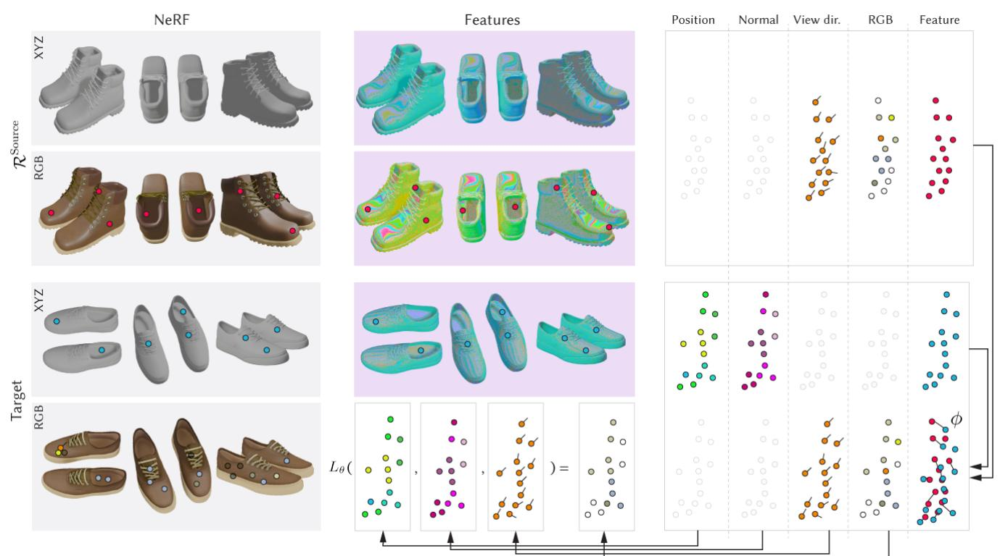  
Figure 2. The main steps of our approach from left to right: We render both the target and source NeRF (first and second pair of rows) into a set of 2D images (first column), and then extract features (middle column). An image hence is a point cloud in feature space, where every point is labeled by 3D position, normal, view direction and appearance (third column). We use view direction, RGB and features of the source NeRF, and position, normal and features of the target, and gray-out unused channels. We then establish correspondence between the source and target features via the mapping ϕ in the lower right subplot, allowing us to transfer appearance from the source to the geometry of the target. Finally, we train our NeRF analogy Lθ which combines the target’s geometry with the appearance from the source.

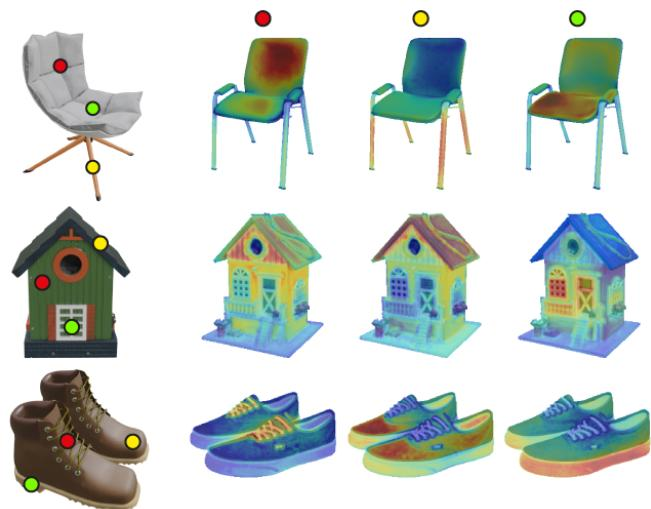  
Figure 3. DiNO affinity for various pixel queries (colored dots, columns) on various object pairs (rows), visualized as heatmap where blue and red correspond to 0 and 1, respectively.

Training In order to combine the appearance of the source with the geometry of the target, we train a 3Dconsistent NeRF representation on the previously extracted point clouds FSource and FTarget. As the target geometry is given, we only need to learn the view-dependent appearance part of that field, resulting in simple direct supervised learning that does not even require differentiable rendering. The key challenge is, however, to identify where, and under which viewing angle, the relevant appearance information for a given target location is to be found in the source.

To this end, we sample n locations in FSource (shown as red dots in Fig. 2), and, at each location, extract the source feature descriptors $\mathbf { f } ^ { \mathrm { S o u r c e } }$ , the source appearance $L ^ { \mathrm { S o u r c e } }$ and the source viewing directions $\omega ^ { \mathrm { S o u r c e } }$ . Similarly, we also sample m locations from the target point cloud FTarget (shown as blue dots in Fig. 2) and, at each location, fetch the image features $\mathbf { f } ^ { \mathrm { T a r g e t } }$ and the target positions $\mathbf { x } ^ { \mathrm { T a r g e t } }$

Now, we find a discrete mapping $\phi _ { j } \in ( 1 , \ldots , m ) \ \to$ $( 1 , \ldots , n )$ that maps every target location index j to the source location index i with maximal similarity :

$$
\phi _ { j } : = \arg \operatorname* { m a x } _ { i } \sin ( \mathbf { f } _ { j } ^ { \mathrm { T a r g e t } } , \mathbf { f } _ { i } ^ { \mathrm { S o u r c e } } ) .
$$

As m × n is a moderate number, this operation can be performed by constructing the full matrix, parallelized across the GPU, and finding the maximal column index for each row. The mapping $\phi$ is visualized as the links between nearby points in the overlapping feature point clouds in the lower right in Fig. 2. Notably, we do not enforce $\phi$ to be 3D-consistent or bijective, as this would constrain the possible transfer options (consider the case where the appearance transfer would need to be a 1:n mapping, e.g., when transferring the appearance from a single-legged chair onto a four-legged table). Instead, we ask for the feature with the maximum similarity and rely on the feature extractor to find the correct color-consistent matches across multiple views.

Now, define $L _ { j } ^ { \mathrm { T a r g e t } } = L _ { \phi _ { i } } ^ { \mathrm { S o u r c e } }$ as the appearance that the target should have under the mapping ϕ and a certain viewing direction, given the extracted correspondences.

This information – i) position, ii) direction, and iii) radiance – is commonly sufficient to train the appearance part of a radiance field: i) The target 3D positions are known, as they can be directly inferred from the target geometry and its renderings. ii) The source view direction is known on the source, and we would like the target’s view-dependence to behave the same. iii) The appearance is known from the source via the mapping ϕ. Notably, i) implies that the density function decays to a Dirac delta distribution, so no volume rendering is required. The appearance values simply have to be correct at the correct positions in space. Moreover, we found it beneficial to add the target’s surface normal into the network to provide high-frequency input signal that aides in recovering high-frequent color changes.

We thus train the parameters θ of our NeRF Analogy $L _ { \theta }$ (for detail see Suppl. Sec. 2) such that for every observed target position, target and source appearance match under the source viewing direction, i.e.,

$$
\mathbb { E } _ { j } [ | L _ { \theta } ( \mathbf { x } _ { j } ^ { \mathrm { { T a r g e t } } } , \mathbf { n } _ { j } ^ { \mathrm { { T a r g e t } } } , \omega _ { j } ^ { \mathrm { { T a r g e t } } } ) - \phi _ { j } ( L _ { i } ^ { \mathrm { { S o u r c e } } } , \omega _ { i } ^ { \mathrm { { S o u r c e } } } ) | _ { 1 } ] .
$$

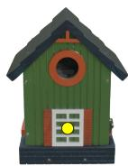

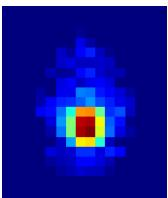  
DiNO, 28p

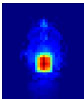  
Amir et al., 55p

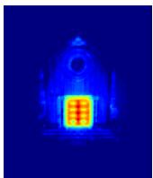  
Ours, 392p  
Figure 4. Self-similarity for a pixel query (the yellow point on the left image) for several variants of DiNO to illustrate the effects of feature resolution. Our version produces the most fine-granular features, as is visible in the rightmost image.

## 3.2. Implementation

Features Expressive features are crucial for establishing correspondences between objects and their semantic parts. We rely on the features produced by DiNO-ViT [10], which have been shown to capture both semantic and structural information to a high extent [1, 50] and defer discussion of our exact ViT setup to the supplemental for brevity.

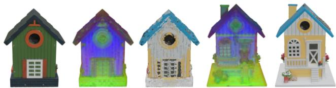  
Figure 5. The first three PCA components of the features as RGB colors. Semantically similar regions have similar descriptors, hence similar colors. Transferring the appearance along the most similar descriptor for each pixel creates the middle image.

Fig. 4 shows the comparison between the original ViT granularity, Amir et al. [1]’s reduced strides and our feature granularity, while Fig. 5 visualizes the semantic correspondence via the first three principal components of the ViT features computed across the two images. As commonly done, we compare the features according to their cosine similarity

$$
\mathrm { s i m } ( \mathbf { f } _ { 1 } , \mathbf { f } _ { 2 } ) : = { \frac { \langle \mathbf { f } _ { 1 } , \mathbf { f } _ { 2 } \rangle } { \left| \left| \mathbf { f } _ { 1 } \right| \right| \cdot \left| \left| \mathbf { f } _ { 2 } \right| \right| } } .
$$

As per the previous explanations in Sec. 3.1, the general idea behind our approach does not need, and never makes use of, the target geometry’s color or texture. However, as our feature extractor DiNO was trained on natural images, we found its performance to decrease on un-textured images and thus use textured geometry. We show an ablation of this in Sec. 4.2 and are confident that future, even more descriptive feature extractors (e.g., [12]) will be able to match correspondence quality on untextured meshes.

Sampling We randomly render 100 images per object. From each image, we sample an empirically determined number of 5,000 non-background pixels to compute their features and affinities. We now need to compute the cosine similarity into the source NeRF for all samples pixels. In practice, we importance-sample for the cosine similarity by constraining the similarity computation to the 5 closest views. While this approach might introduce slight bias, we found it to work well in practice (as similar views generally have higher similarity) while significantly reducing computation time. Similar to [13, 22, 34, 40], we assume roughly aligned objects, $i . e .$ , similar orientation and pose. For non-aligned objects, one could run a pre-conditioning step by optimizing rotation and translation such that the objects roughly align [43].

Edge loss As DiNO-ViT is a 2D method that we employ in a 3D context, it is inevitable that some of the feature correspondences will be noisy across different views, i.e., we cannot guarantee that a certain image part will map to the same location under a different view. In our training setup, this leads to washed-out details, which are especially notable in high-frequency regions, e.g., around edges, and on the silhouettes of the objects. We alleviate this by computing an additional regularization term that enforces the difference of Gaussians (DoGs) between monochrome versions of the current rendering $\mathcal { T } ^ { \mathrm { C u r r e n t } }$ and the target image $\mathcal { T } ^ { \mathrm { T a r g e t } }$ to coincide:

$$
\mathcal { L } _ { G } = \vert \mathcal { I } ^ { \mathrm { C u r r e n t } } \ast G _ { \sigma _ { 1 } } - \mathcal { I } ^ { \mathrm { T a r g e t } } \ast G _ { \sigma _ { 2 } } \vert _ { 1 }
$$

where ∗ denotes convolution. We use standard deviations $\sigma _ { 1 } = 1 . 0$ and $\sigma _ { 2 } = 1 . 6 $ , which is a common choice for this filter [41]. We add this term to our training loss, weighted by a factor λ, which we set to zero during the first 15% of the training in order to allow the network to learn the correct colors first before gradually increasing it to an empirically determined value of 50. We show an ablation of this loss in Sec. 4.2 and detail further training details in the supplemental.

## 4. Results

As we are, to the best of our knowledge, the first to introduce semantically meaningful appearance transfer onto arbitrary 3D geometry, there are no directly applicable comparisons to evaluate. Nonetheless, we compare to traditional image-analogy and style-transfer methods such as Neural Style Transfer [18], WCT [32] and Deep Image Analogies [34] by running them on pairs of images and then training a NeRF (we use InstantNGP [44]) on the resulting output images. For style transfer, WCT and deep image analogies, we use the publicly available implementations [25], [33] and [38], respectively. Those methods will necessarily produce floaters and free-space density artifacts, as they are not multiview-consistent. To allow a fairer comparison, we reduce these artifacts by multiplying their output with the target’s alpha-channel. Moreover, we compare to the 3D-consistent appearance transfer method SNeRF [46], which runs style transfer in conjunction with NeRF training. In accordance with the stylization and image-analogy literature, we use the target as content- and the source as style-image.

Qualitative We show results of our method and its competitors on various object pairs in Fig. 6. It becomes evident that style-based methods fail to produce sharp results and do not capture semantic similarity (e.g., the bag’s handle is not brown, the chair’s legs are not beige). Deep Image Analogies (DIA, [34]) manages to achieve crisp details, as it stitches the output together from pieces of the input, but does not capture the target’s details well (cf. the green chair’s backrest or the boots’ laces). As is seen from the videos in the supplemental material, none of the methods except SNeRF and ours are multiview-consistent, which leads to floaters, artifacts and inconsistent color changes.

We further show a NeRF analogy on a challenging multiobject scene in Fig. 9. The difficulties here arise from object-level ambiguities (no unique mapping between the two table tops), semantic gaps (sofas on the left vs. chairs on the right) and many-to-many relation (2 sofas vs. 4 chairs). In spite of not being perfect (e.g., the couch appearance bleeding onto parts of the table edges), our method handles this case well and transfers the appearance among semantically related objects (e.g., apples, plants, chairs).

Finally, we show results on real-world scenes from the MiP-NeRF 360 [6] and Tanks and Temples [27] datasets in Fig. 7. We replace parts of the encoded geometry by first manually finding a bounding box and then setting the volume density withing that box to zero. Rendering now results in the object being cut-out of the scene while inverting the box results in a rendering of the object only. Those renderings constitute our source appearance and, in conjunction with a provided target geometry, allow us to create a NeRF analogy which we can composit back into the original source NeRF via the painter’s algorithm. As Fig. 7 shows, our method produces consistent results and transfers the appearance in a semantically meaningful way. Interestingly, the comparison with the state-of-the-art text-based NeRF editing method Instruct-Nerf2Nerf [19] in Fig. 8 shows that their model cannot capture the required level of detail and thus fails to perform the required edits - a limitation of the underlying InstructPix2Pix’s text-embedding [9].

Quantitative The popular image metrics peak signal-tonoise ratio (PSNR) and Structural Similarity Index Measure (SSIM) require ground-truth reference images, which, for the case of NeRF analogies, do not exist, as the ”best“ semantic mapping is subjective and therefore cannot be uniquely determined. We thus report “bootstrapped” PSNR and SSIM (BPSNR, BSSIM) values: We first create a NeRF analogy and use it to render out all train and test images. The rendered-out train images then train a new NeRF (we use Instant-NGP [44]), from which we compute PSNR and SSIM between the previously- and now newly rendered test images. While these metrics must nominally not be compared to those reported by other methods (we are testing on the output of a method, not on ground-truth data), they serve as a relative (i.e., inter-method) indicator of multiviewconsistency: if the rendered-out test images are multiviewconsistent, the reconstruction will produce similar images, resulting in higher BPSNR and BSSIM values. Inspired by [19], we additionally report values for the CLIP direction consistency (CDC) (see Suppl. Sec. 2 for details).

# Target [WC]W2 [1] 4] Ourss U Source

Figure 6. Results of our method and related approaches on object pairs. For every row, we use the target’s geometry (top row) and the appearance of the source NeRF (bottom row). The multiview-consistency of these results is best appreciated in the supplemental videos.

We detail the quantitative results of the aforementioned metrics in Tab. 1 and find that they support the qualitative results: our method achieves the highest score across all metrics, while style transfer and WCT achieve the lowest scores. SNeRF produces better results but still shows relatively low scores, presumably because its style-transfer module struggles with the type of styles used in our experiments (the source appearance is highly non-stationary, which is known to cause problems to VGG-based methods). DIA performs surprisingly well on most metrics, although it does not have 3D information. We attribute this to the fact that it creates its output from patching together parts of the input, where the input by design is 3D consistent.

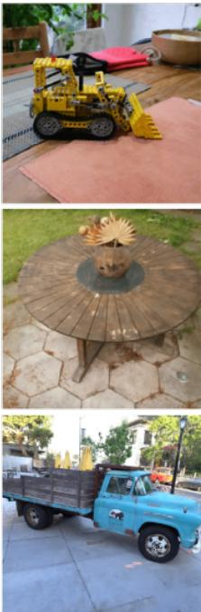  
Original

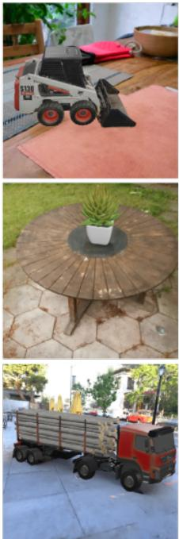  
Target

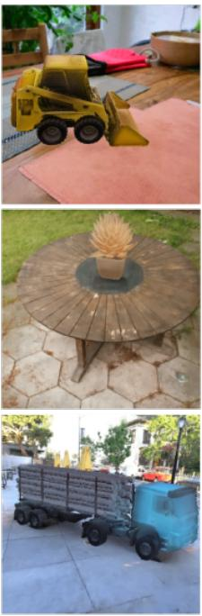  
Ours

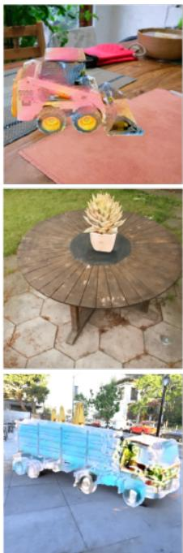  
ST

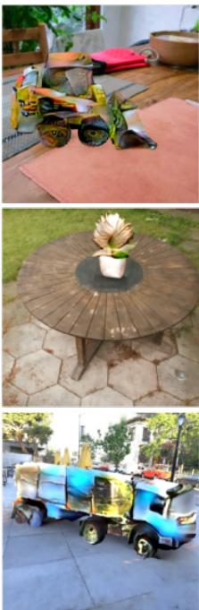  
WCT

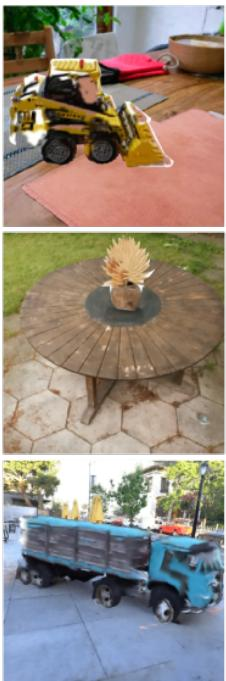  
DIA  
Figure 7. Results on the real-world KITCHEN (top), GARDEN (middle) and TRUCK scenes from the MiP-NeRF 360 [6] and Tanks and Temples [27] datasets, respectively. For each experiment, we show the original scene in the leftmost subplot, followed by the target geometry, our inferred NeRF analogy and the baselines style transfer [18], WCT [32] and Deep Image Analogies [34].

“turn the vase and flowers into brown echeveria”  
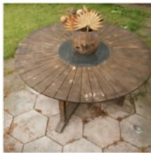

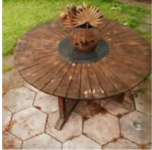

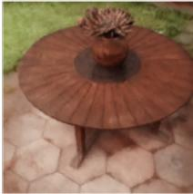  
"replace the excavator with a yellow skidsteer"

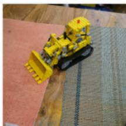  
Original

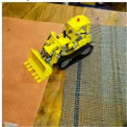  
InstructPix2Pix

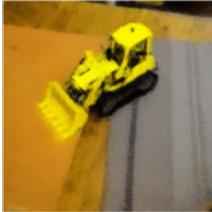  
InstructNeRF2NeRF

Figure 8. Text-based methods often cannot accurately represent the desired geometry, or the editing fails completely, as seen here. For our results on these scenes and views, see Fig. 7.  
Table 1. Quantitative results of our and other methods according to different metrics (cf. Sec. 4 for details). Higher is better for all, the best and second-best results are bold and underlined, respectively.
<table><tr><td rowspan="2"></td><td colspan="2">Metrics</td><td colspan="4">User study</td></tr><tr><td>BPSNR</td><td>BSSIM CLIP</td><td>Transfer</td><td>MVC</td><td>Quality</td><td>Comb.</td></tr><tr><td>ST [18]</td><td>25.14</td><td>.870 .981</td><td>1.7%</td><td>1.4%</td><td>2.9%</td><td>1.9%</td></tr><tr><td>WCT [32]</td><td>28.64</td><td>.917 1.983</td><td>3.4%</td><td>0.5%</td><td>0.5%</td><td>1.9%</td></tr><tr><td>DIA [34]</td><td>33.06</td><td>.968 .983</td><td>28.6%</td><td>20.5%</td><td>9.1%</td><td>23.0%</td></tr><tr><td>SNeRF [46]</td><td>32.41</td><td>.947 .984</td><td>7.8%</td><td>1.0%</td><td>2.9%</td><td>4.8%</td></tr><tr><td>Ours</td><td>36.16</td><td>.984 .992</td><td>58.5%</td><td>76.7%</td><td>84.8%</td><td>68.4%</td></tr></table>

## 4.1. User Study

In addition to the quantitative evaluation previously described, we ran a user study to complement the evaluation and to assess our method’s semantic quality, i.e., whether the produced output is a plausible mixture of target geometry and source appearance. In the first section of the study, participants were shown 2D results in randomized order and asked which approach best combines the target geometry and the source appearance (“Transfer” in Tab. 1). For the second study, we lifted the 2D methods to 3D by using their outputs as input images for InstantNGP [44]. We then rendered a circular camera trajectory and asked the participants to choose their preferred method for a) multi-view consistency and b) floaters and artifacts (“MVC” and “Quality” in

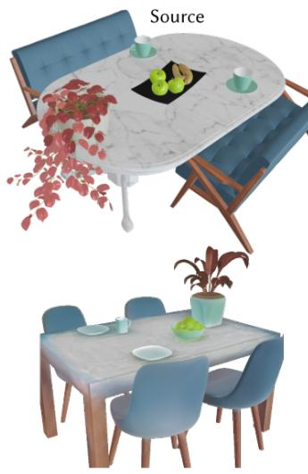

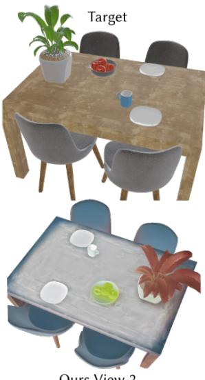  
Figure 9. A NeRF analogy on a multi-object scene. The semantic mapping correctly matches apples, plants, tables and chairs.

Tab. 1, respectively). We gathered responses from 42 participants and show the averaged responses across all three categories in the rightmost column (“Combined”) of Tab. 1. The results in Tab. 1 support our quantitative and qualitative findings and show our method to be leading by a wide margin across all categories. All statements are highly significant with a Pearson ξ-square test’s p < 0.001.

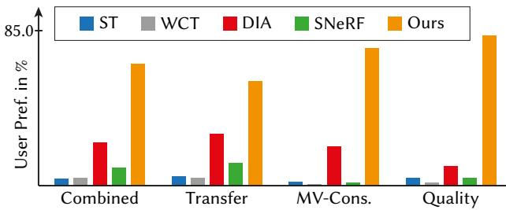  
Figure 10. Outcome of our user study, as also per Tab. 1.

## 4.2. Ablation Study

We show each of our design decision’s influence with an ablation, displayed qualitatively in Fig. 11. Ablating the edge-loss still allows clear color distinctions between semantic parts (e.g., front vs. roof), but leads to lowerfrequent detail, as the network has no incentive to learn the target’s fine-granular details. While ablating the texture on the target geometry leads to slightly washed-out descriptors, presumably due to more noise in the DiNO-ViT correspondences, our method still produces semantically similar results, supporting our claim that DiNO features are expressive and translate across the domain gap between textured and untextured geometry.

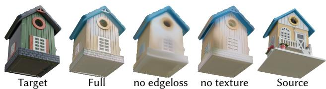  
Figure 11. Ablation of our method’s components (see Sec. 4.2).

## 5. Limitations

Our method fundamentally relies on the mapping ϕ and the NeRF representation R, and thus also inherits their unique limitations. It is, for instance, hard for DiNO (and most other correspondence methods) to resolve rotational ambiguities on round objects. Moreover, as we perform point-based appearance transfer, we are unable to transfer texture. We show a failure case in Fig. 12.

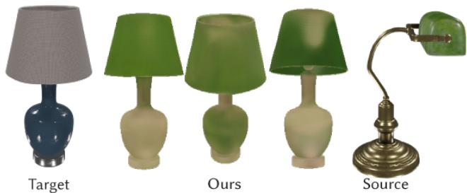  
Figure 12. A limitation of our method: due to specularity and rotation-symmetry, the DiNO correspondences are inaccurate, and our method tries to consolidate these inaccuracies by erroneously encoding the different colors in the viewing directions.

## 6. Conclusion

In this work, we have introduced NeRF Analogies, a framework for visual attribute transfer between NeRFs via semantic affinity from ViT features. Our method can aid in content-creation, e.g., by combining user-captured geometry with appearance from online 3D models, and works in multi-object settings and on real-world scenes. We compare favorably against other methods from the color-transfer and stylization literature and achieve the highest rankings in a user study both for transfer quality and multiviewconsistency. NeRF analogies open up new avenues of future research, such as the 3D-consistent transfer of texture or intrinsic scene parameters such as roughness or specular albedo. Moreover, it would be interesting to automatically learn the most relevant directions or views [29, 31, 35] for the subsequent learning of a NeRF analogy.

Acknowledgements Michael is supported by Meta Reality Labs, Grant Nr. 5034015, and a bursary from the Rabin Ezra Scholarship Trust. We thank the reviewers for their feedback.

## References

[1] Shir Amir, Yossi Gandelsman, Shai Bagon, and Tali Dekel. Deep vit features as dense visual descriptors. arXiv preprint arXiv:2112.05814, 2(3):4, 2021. 1, 2, 4

[2] Shir Amir, Yossi Gandelsman, Shai Bagon, and Tali Dekel. On the effectiveness of vit features as local semantic descriptors. In European Conference on Computer Vision, pages 39–55. Springer, 2022. 2

[3] Chong Bao, Yinda Zhang, Bangbang Yang, Tianxing Fan, Zesong Yang, Hujun Bao, Guofeng Zhang, and Zhaopeng Cui. Sine: Semantic-driven image-based nerf editing with prior-guided editing field. In The IEEE/CVF Computer Vision and Pattern Recognition Conference (CVPR), 2023. 2

[4] Connelly Barnes, Eli Shechtman, Adam Finkelstein, and Dan B Goldman. Patchmatch: A randomized correspondence algorithm for structural image editing. ACM Trans. Graph., 28(3):24, 2009. 2

[5] Jonathan T Barron, Ben Mildenhall, Matthew Tancik, Peter Hedman, Ricardo Martin-Brualla, and Pratul P Srinivasan. Mip-nerf: A multiscale representation for anti-aliasing neural radiance fields. In Proceedings of the IEEE/CVF International Conference on Computer Vision, pages 5855–5864, 2021. 2

[6] Jonathan T Barron, Ben Mildenhall, Dor Verbin, Pratul P Srinivasan, and Peter Hedman. Mip-nerf 360: Unbounded anti-aliased neural radiance fields. In Proceedings of the IEEE/CVF Conference on Computer Vision and Pattern Recognition, pages 5470–5479, 2022. 2, 5, 7

[7] Herbert Bay, Andreas Ess, Tinne Tuytelaars, and Luc Van Gool. Speeded-up robust features (surf). Computer vision and image understanding, 110(3):346–359, 2008. 1

[8] Anand Bhattad, Daniel McKee, Derek Hoiem, and DA Forsyth. Stylegan knows normal, depth, albedo, and more. arXiv preprint arXiv:2306.00987, 2023. 1

[9] Tim Brooks, Aleksander Holynski, and Alexei A Efros. Instructpix2pix: Learning to follow image editing instructions. In Proceedings of the IEEE/CVF Conference on Computer Vision and Pattern Recognition, pages 18392–18402, 2023. 5

[10] Mathilde Caron, Hugo Touvron, Ishan Misra, Herve J´ egou,´ Julien Mairal, Piotr Bojanowski, and Armand Joulin. Emerging properties in self-supervised vision transformers. In Proceedings of the IEEE/CVF international conference on computer vision, pages 9650–9660, 2021. 2, 4

[11] Jun-Kun Chen, Jipeng Lyu, and Yu-Xiong Wang. Neuraleditor: Editing neural radiance fields via manipulating point clouds. In Proceedings of the IEEE/CVF Conference on Computer Vision and Pattern Recognition, pages 12439– 12448, 2023. 2

[12] Niladri Shekhar Dutt, Sanjeev Muralikrishnan, and Niloy J Mitra. Diffusion 3d features (diff3f): Decorating untextured shapes with distilled semantic features. arXiv preprint arXiv:2311.17024, 2023. 4

[13] Michael Fischer and Tobias Ritschel. Metappearance: Metalearning for visual appearance reproduction. ACM Transactions on Graphics (TOG), 41(6):1–13, 2022. 4

[14] Michael Fischer and Tobias Ritschel. Plateau-reduced differ-

entiable path tracing. In Proceedings ofthe IEEE/CVF Conference on Computer Vision and Pattern Recognition, pages 4285–4294, 2023. 1

[15] Martin A Fischler and Robert C Bolles. Random sample consensus: a paradigm for model fitting with applications to image analysis and automated cartography. Communications ofthe ACM, 24(6):381–395, 1981. 1

[16] Jakub Fiser, Ondˇ ˇrej Jamriska, Michal Lukˇ a´c, Eli Shecht-ˇ man, Paul Asente, Jingwan Lu, and Daniel Sykora. Stylit:\` illumination-guided example-based stylization of 3d renderings. ACM Transactions on Graphics (TOG), 35(4):1–11, 2016. 2

[17] Kyle Gao, Yina Gao, Hongjie He, Dening Lu, Linlin Xu, and Jonathan Li. Nerf: Neural radiance field in 3d vision, a comprehensive review. arXiv preprint arXiv:2210.00379, 2022. 2

[18] Leon A Gatys, Alexander S Ecker, and Matthias Bethge. A neural algorithm of artistic style. arXiv preprint arXiv:1508.06576, 2015. 2, 5, 7

[19] Ayaan Haque, Matthew Tancik, Alexei A Efros, Aleksander Holynski, and Angjoo Kanazawa. Instruct-nerf2nerf: Editing 3d scenes with instructions. arXiv preprint arXiv:2303.12789, 2023. 2, 5

[20] Mingming He, Jing Liao, Dongdong Chen, Lu Yuan, and Pedro V Sander. Progressive color transfer with dense semantic correspondences. ACM Transactions on Graphics (TOG), 38 (2):1–18, 2019. 2

[21] Eric Hedlin, Gopal Sharma, Shweta Mahajan, Hossam Isack, Abhishek Kar, Andrea Tagliasacchi, and Kwang Moo Yi. Unsupervised semantic correspondence using stable diffusion. arXiv preprint arXiv:2305.15581, 2023. 2

[22] Aaron Hertzmann, Charles E Jacobs, Nuria Oliver, Brian Curless, and David H Salesin. Image analogies. In Seminal Graphics Papers: Pushing the Boundaries, Volume 2, pages 557–570. 2023. 2, 4

[23] Hsin-Ping Huang, Hung-Yu Tseng, Saurabh Saini, Maneesh Singh, and Ming-Hsuan Yang. Learning to stylize novel views. In Proceedings of the IEEE/CVF International Conference on Computer Vision, pages 13869–13878, 2021. 2

[24] Yi-Hua Huang, Yue He, Yu-Jie Yuan, Yu-Kun Lai, and Lin Gao. Stylizednerf: consistent 3d scene stylization as stylized nerf via 2d-3d mutual learning. In Proceedings of the IEEE/CVF Conference on Computer Vision and Pattern Recognition, pages 18342–18352, 2022. 2

[25] Alexis Jacq and Winston Herring. Neural style transfer, 2023. URL https://pytorch.org/tutorials/ advanced/neural\_style\_tutorial.html. 5

[26] Clement Jambon, Bernhard Kerbl, Georgios Kopanas,´ Stavros Diolatzis, George Drettakis, and Thomas Leimkuhler. Nerfshop: Interactive editing of neural¨ radiance fields. Proceedings of the ACM on Computer Graphics and Interactive Techniques, 6(1), 2023. 2

[27] Arno Knapitsch, Jaesik Park, Qian-Yi Zhou, and Vladlen Koltun. Tanks and temples: Benchmarking large-scale scene reconstruction. ACM Transactions on Graphics (ToG), 36 (4):1–13, 2017. 5, 7

[28] Sosuke Kobayashi, Eiichi Matsumoto, and Vincent Sitzmann. Decomposing nerf for editing via feature field distil-

lation. Advances in Neural Information Processing Systems, 35:23311–23330, 2022. 2

[29] Georgios Kopanas and George Drettakis. Improving nerf quality by progressive camera placement for unrestricted navigation in complex environments. arXiv preprint arXiv:2309.00014, 2023. 8

[30] Zhengfei Kuang, Fujun Luan, Sai Bi, Zhixin Shu, Gordon Wetzstein, and Kalyan Sunkavalli. Palettenerf: Palette-based appearance editing of neural radiance fields. In Proceedings of the IEEE/CVF Conference on Computer Vision and Pattern Recognition, pages 20691–20700, 2023. 2

[31] Keifer Lee, Shubham Gupta, Sunglyoung Kim, Bhargav Makwana, Chao Chen, and Chen Feng. So-nerf: Active view planning for nerf using surrogate objectives. arXiv preprint arXiv:2312.03266, 2023. 8

[32] Yijun Li, Chen Fang, Jimei Yang, Zhaowen Wang, Xin Lu, and Ming-Hsuan Yang. Universal style transfer via feature transforms. Advances in neural information processing systems, 30, 2017. 5, 7

[33] Liamheng. Pytorch1.4-wct-universal style transfer, 2020. URL https : / / github . com / liamheng / Pytorch1.4-WCT. 5

[34] Jing Liao, Yuan Yao, Lu Yuan, Gang Hua, and Sing Bing Kang. Visual attribute transfer through deep image analogy. arXiv preprint arXiv:1705.01088, 2017. 2, 4, 5, 7

[35] Chen Liu, Michael Fischer, and Tobias Ritschel. Learning to learn and sample brdfs. In Computer Graphics Forum, volume 42, pages 201–211. Wiley Online Library, 2023. 8

[36] Jia-Wei Liu, Yan-Pei Cao, Weijia Mao, Wenqiao Zhang, David Junhao Zhang, Jussi Keppo, Ying Shan, Xiaohu Qie, and Mike Zheng Shou. Devrf: Fast deformable voxel radiance fields for dynamic scenes. Advances in Neural Information Processing Systems, 35:36762–36775, 2022. 2

[37] Kunhao Liu, Fangneng Zhan, Yiwen Chen, Jiahui Zhang, Yingchen Yu, Abdulmotaleb El Saddik, Shijian Lu, and Eric P Xing. Stylerf: Zero-shot 3d style transfer of neural radiance fields. In Proceedings ofthe IEEE/CVF Conference on Computer Vision and Pattern Recognition, pages 8338– 8348, 2023. 2

[38] Ben Louis. Deep image analogies pytorch, 2021. URL https://github.com/Ben- Louis/Deep-Image-Analogy-PyTorch. 5

[39] David G Lowe. Distinctive image features from scaleinvariant keypoints. International journal of computer vision, 60:91–110, 2004. 1

[40] Grace Luo, Lisa Dunlap, Dong Huk Park, Aleksander Holynski, and Trevor Darrell. Diffusion hyperfeatures: Searching through time and space for semantic correspondence. arXiv preprint arXiv:2305.14334, 2023. 2, 4

[41] David Marr and Ellen Hildreth. Theory of edge detection. Proceedings of the Royal Society of London. Series B. Biological Sciences, 207(1167):187–217, 1980. 5

[42] Ben Mildenhall, Pratul P Srinivasan, Matthew Tancik, Jonathan T Barron, Ravi Ramamoorthi, and Ren Ng. Nerf: Representing scenes as neural radiance fields for view synthesis. Communications ofthe ACM, 65(1):99–106, 2021. 1, 2

[43] Luca Morreale, Noam Aigerman, Vladimir G Kim, and

Niloy J Mitra. Neural semantic surface maps. arXiv preprint arXiv:2309.04836, 2023. 4

[44] Thomas Muller, Alex Evans, Christoph Schied, and Alexan-¨ der Keller. Instant neural graphics primitives with a multiresolution hash encoding. ACM Transactions on Graphics (ToG), 41(4):1–15, 2022. 2, 5, 7

[45] Pauline C Ng and Steven Henikoff. Sift: Predicting amino acid changes that affect protein function. Nucleic acids research, 31(13):3812–3814, 2003. 1

[46] Thu Nguyen-Phuoc, Feng Liu, and Lei Xiao. Snerf: stylized neural implicit representations for 3d scenes. arXiv preprint arXiv:2207.02363, 2022. 2, 5, 7

[47] Hong-Wing Pang, Binh-Son Hua, and Sai-Kit Yeung. Locally stylized neural radiance fields. In Proceedings of the IEEE/CVF International Conference on Computer Vision, pages 307–316, 2023. 2

[48] Konstantinos Rematas, Tobias Ritschel, Mario Fritz, and Tinne Tuytelaars. Image-based synthesis and re-synthesis of viewpoints guided by 3d models. In Proceedings of the IEEE Conference on Computer Vision and Pattern Recognition, pages 3898–3905, 2014. 2

[49] Ethan Rublee, Vincent Rabaud, Kurt Konolige, and Gary Bradski. Orb: An efficient alternative to sift or surf. In 2011 International conference on computer vision, pages 2564– 2571. Ieee, 2011. 1

[50] Prafull Sharma, Julien Philip, Michael Gharbi, Bill Freeman,¨ Fredo Durand, and Valentin Deschaintre. Materialistic: Selecting similar materials in images. ACM Transactions on Graphics (TOG), 42(4):1–14, 2023. 1, 2, 4

[51] Jianbo Shi et al. Good features to track. In 1994 Proceedings ofIEEE conference on computer vision and pattern recognition, pages 593–600. IEEE, 1994. 1

[52] Hyeonseop Song, Seokhun Choi, Hoseok Do, Chul Lee, and Taehyeong Kim. Blending-nerf: Text-driven localized editing in neural radiance fields. In Proceedings of the IEEE/CVF International Conference on Computer Vision, pages 14383–14393, 2023. 2

[53] Adela´ Subrtovˇ a, Michal Luk´ a´c, Janˇ Cech, David Futschik,ˇ Eli Shechtman, and Daniel Sykora. Diffusion image analo-\` gies. In ACM SIGGRAPH 2023 Conference Proceedings, pages 1–10, 2023. 2

[54] Luming Tang, Menglin Jia, Qianqian Wang, Cheng Perng Phoo, and Bharath Hariharan. Emergent correspondence from image diffusion. arXiv preprint arXiv:2306.03881, 2023. 2

[55] Ayush Tewari, Justus Thies, Ben Mildenhall, Pratul Srinivasan, Edgar Tretschk, Wang Yifan, Christoph Lassner, Vincent Sitzmann, Ricardo Martin-Brualla, Stephen Lombardi, et al. Advances in neural rendering. In Computer Graphics Forum, volume 41, pages 703–735. Wiley Online Library, 2022. 2

[56] Narek Tumanyan, Omer Bar-Tal, Shai Bagon, and Tali Dekel. Splicing vit features for semantic appearance transfer. In Proceedings of the IEEE/CVF Conference on Computer Vision and Pattern Recognition, pages 10748–10757, 2022. 2

[57] Binglun Wang, Niladri Shekhar Dutt, and Niloy J Mitra. Proteusnerf: Fast lightweight nerf editing using 3d-aware image

context. arXiv preprint arXiv:2310.09965, 2023. 2

[58] Can Wang, Menglei Chai, Mingming He, Dongdong Chen, and Jing Liao. Clip-nerf: Text-and-image driven manipulation of neural radiance fields. In Proceedings of the IEEE/CVF Conference on Computer Vision and Pattern Recognition, pages 3835–3844, 2022. 2

[59] Can Wang, Ruixiang Jiang, Menglei Chai, Mingming He, Dongdong Chen, and Jing Liao. Nerf-art: Text-driven neural radiance fields stylization. IEEE Transactions on Visualization and Computer Graphics, 2023. 2

[60] Tong Wu, Jia-Mu Sun, Yu-Kun Lai, and Lin Gao. De-nerf: Decoupled neural radiance fields for view-consistent appearance editing and high-frequency environmental relighting. In ACM SIGGRAPH 2023 Conference Proceedings, pages 1– 11, 2023. 2

[61] Tianhan Xu and Tatsuya Harada. Deforming radiance fields with cages. In European Conference on Computer Vision, pages 159–175. Springer, 2022. 2

[62] Yu-Jie Yuan, Yang-Tian Sun, Yu-Kun Lai, Yuewen Ma, Rongfei Jia, and Lin Gao. Nerf-editing: geometry editing of neural radiance fields. In Proceedings ofthe IEEE/CVF Conference on Computer Vision and Pattern Recognition, pages 18353–18364, 2022. 2

[63] Junyi Zhang, Charles Herrmann, Junhwa Hur, Luisa Polania Cabrera, Varun Jampani, Deqing Sun, and Ming-Hsuan Yang. A tale of two features: Stable diffusion complements dino for zero-shot semantic correspondence. arXiv preprint arXiv:2305.15347, 2023. 1

[64] Kai Zhang, Nick Kolkin, Sai Bi, Fujun Luan, Zexiang Xu, Eli Shechtman, and Noah Snavely. Arf: Artistic radiance fields. In European Conference on Computer Vision, pages 717–733. Springer, 2022. 2

[65] Shangzhan Zhang, Sida Peng, Yinji ShenTu, Qing Shuai, Tianrun Chen, Kaicheng Yu, Hujun Bao, and Xiaowei Zhou. Dyn-e: Local appearance editing of dynamic neural radiance fields. arXiv preprint arXiv:2307.12909, 2023. 2