Our understanding of the generalization capabilities of neural networks (NNs) is still incomplete. Prevailing explanations are based on implicit biases of gradient descent (GD) but they cannot account for the capabilities of models from gradient-free methods [9] nor the simplicity bias recently observed in untrained networks [29]. This paper seeks other sources of generalization in NNs. Findings. To understand the inductive biases provided by architectures independently from GD, we examine untrained, random-weight networks. Even simple MLPs show strong inductive biases: uniform sampling in weight space yields a very biased distribution of functions in terms of complexity. But unlike common wisdom, NNs do not have an inherent “simplicity bias”. This property depends on components such as ReLUs, residual connections, and layer normalizations. Alternative architectures can be built with a biasfor any level ofcomplexity. Transformers also inherit all these propertiesfrom their building blocks. Implications. We provide a fresh explanation for the success of deep learning independent from gradient-based training. It points at promising avenues for controlling the solutions implemented by trained models.

# Neural Redshift: Random Networks are not Random Functions

Damien Teney Idiap Research Institute damien.teney@idiap.ch

Valentin Hartmann EPFL valentin.hartmann@epfl.ch

## Abstract

## 1. Introduction

Among various models in machine learning, neural networks (NNs) are the most successful on a variety of tasks. While we are pushing their capabilities with ever-larger models [72], much remains to be understood at the level of their building blocks. This work seeks to understand what provides NNs with their unique generalization capabilities.

The need for inductive biases. The success of ML depends on using suitable inductive biases1 [45]. They specify

Armand Mihai Nicolicioiu ETH Zurich armandmihai.nicolicioiu@inf.ethz.ch

Ehsan Abbasnejad University of Adelaide ehsan.abbasnejad@adelaide.edu

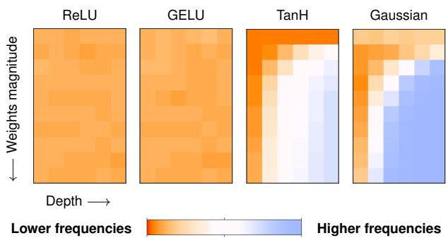  
Figure 1. We examine the complexity of the functions implemented by various MLP architectures. We find that much of their generalization capabilities can be understood independently from the optimization, training objective, scaling, or even data distribution. For example, ReLU and GELU networks (left) overwhelmingly represent low-frequency functions for any network depth or weight magnitude. Other activations lack this property.

how to generalize from a finite set of training examples to novel test cases. For example, linear models allow learning from few examples but generalize correctly only when the target function is itself linear. Large NNs are surprising in having large representational capacity [36] yet generalizing well across many tasks. In other words, among all learnable functions that fit the training data, those implemented by trained networks are often similar to the target function.

Explaining the success of neural networks. Some successful architectures are tailored to specific domains e.g. CNNs for image recognition. But even the simplest MLP architectures (multi-layer perceptrons) often display remarkable generalization. Two explanations for this success prevail, although they are increasingly challenged.

• Implicit biases of gradient-based optimization. A large amount of work studies the preference of (stochastic) gradient descent or (S)GD for particular solutions [20, 51]. But conflicting results have also appeared. First, fullbatch GD can be as effective as SGD [24, 38, 46, 69]. Second, Chiang et al. [9] showed that zeroth-order optimization can yield models with good generalization as frequently as GD. And third, Goldblum et al. [29] showed that language models with random weights already display a preference for low-complexity sequences. This “simplicity bias” was previously thought to emerge from training [65]. In short, gradient descent may help with generalization but it does not seem necessary.

• Good generalization as a fundamental property of all nonlinear architectures [33]. This vague conjecture does not account for the selection bias in the architectures and algorithms that researchers have converged on. For example, implicit neural representations (i.e. a network trained to represent a specific image or 3D shape) show that the success of NNs is not automatic and requires, in that case, activations very different from ReLUs.

The success of deep learning is thus not a product primarily of GD, nor is it universal to all architectures. This paper propose an explanation compatible with all above observations. It builds on the growing evidence that NNs benefit from their parametrization and the structure of their weight space [9, 29, 37, 64, 77, 79].

Contributions. We present experiments supporting this three-part proposition (stated formally in Appendix C).

(1) NNs are biased to implement functions of a particular level of complexity (not necessarily low) determined by the architecture. (2) This preferred complexity is observable in networks with random weights from an uninformed prior. (3) Generalization is enabled by popular components like ReLUs setting this bias to a low complexity that often aligns with the target function.

We name it the Neural Redshift (NRS) by analogy to physical effects2 that bias the observations of a signal towards low frequencies. Here, the parameter space of NNs is biased towards functions of low frequency, one of the measures of complexity used in this work (see Figure 1).

The NRS differs from prior work on the spectral bias [57, 84] and simplicity bias [3, 65] which confound the effects of architectures and gradient descent. The spectral bias refers to the earlier learning of low-frequencies during training (see discussion in Section 6). The NRS only involves the parametrization3 of NNs and thus shows interesting properties independent from optimization [80], scaling [5], learning objectives [9], or even data distributions [52].

Concretely, we examine various architectures with random weights. We use three measures of complexity: (1) decompositions in Fourier series and (2) in bases of orthogonal polynomials (equating simplicity with low frequencies/order) and (3) compressibility as an approximation of the Kolmogorov complexity [15]. We study how they vary across architectures and how these properties at initialization correlate with the performance of trained networks.

## Summary of findings.

• We verify the NRS with three notions of complexity that rely on frequencies in Fourier decompositions, order in polynomial decompositions, and compressibility of the input-output mapping (Section 3).

• We visualize the input-output mappings of 2D networks (Figure 3). They show intuitively the diversity of inductive biases across architectures that a scalar “complexity” cannot fully describe. Therefore, matching the complexity of an architecture with the target function is beneficial for generalization but hardly sufficient (Section 4.1).

• We show that the simplicity bias is not universal but depends on common components (ReLUs, residual connections, layer normalizations). ReLU networks also have the unique property of maintaining their simplicity bias for any depth and weight magnitudes. It suggests that the historical importance of ReLUs in the development of deep learning goes beyond the common narrative about vanishing gradients [42].

• We construct architectures where the NRS can be modulated (with alternative activations and weight magnitudes) or entirely avoided (parametrization in Fourier space, Section 3). It further demonstrates that the simplicity bias is not universal and can be controlled to learn complex functions (e.g. modulo arithmetic) or mitigate shortcut learning (Section 4.1).

• We show that the NRS is relevant to transformer sequence models. Random-weight transformers produce sequences of low complexity and this can also be modulated with the architecture. This suggests that transformers inherit inductive biases from their building blocks via mechanisms similar to those of simple models. (Section 5).

## 2. How to Measure Inductive Biases?

Our goal is to understand why NNs generalize when other models of similar capacity would often overfit. The immediate answer is simple: NNs have an inductive bias for functions with properties matching real-world data. Hence two subquestions.

## 1. What are these properties?

We will show that three metrics are relevant: low frequency, low order, and compressibility. Hereafter, they are collectively referred to as “simplicity”.

## 2. What gives neural networks these properties?

We will show that an overwhelming fraction of their parameter space corresponds to functions with such simplicity. While there exist solutions of arbitrary complexity, simple ones are found by default when navigating this space (especially with gradient-based methods).

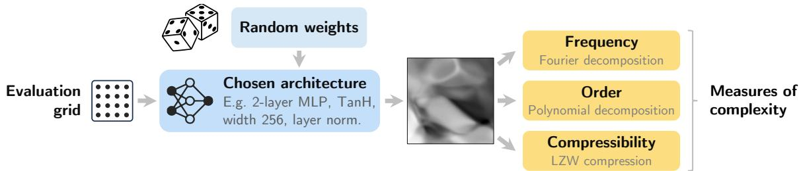  
Figure 2. Our methodology to characterize the inductive biases of an architecture. We evaluate a network with random weights/biases on a grid of points. This yields a representation of the function implemented by the network, shown here as a grayscale image for a 2D input. We then characterize this function using three measures of complexity.

Analyzing random networks. Given an architecture to characterize, we propose to sample random weights and biases, then evaluate the network on a regular grid in its input space (see Figure 2). Let $f _ { \pmb \theta } ( \pmb x )$ represent the function implemented by a network of parameters θ (weights and biases), evaluated on the input $\pmb { x } \in \mathbb { R } ^ { d }$ . The f represents an architecture with a scalar output and no output activation, which could serve for any regression or classification task.

We sample weights and biases from an uninformed prior chosen as a uniform distribution. Biases are sampled from $\mathcal { U } ( - 1 , 1 )$ , and weights from the range proposed by Glorot and Bengio [28] commonly used for initialization i.e. $\mathcal { U } ( - s , s )$ with $s = \alpha \sqrt { 6 / ( \mathrm { f a n } _ { \mathrm { i n } } + \mathrm { f a n } _ { \mathrm { o u t } } ) }$ where α is an extra factor (1 by default) to manipulate the weights’ magnitude in our experiments. These choices are not critical. Appendix E shows that other distributions (Gaussian, uniformball, long-tailed) lead to similar findings.

We then evaluate $f _ { \theta } ( \cdot )$ on points $\mathbf { X } _ { \mathrm { g r i d } } = \{ { \pmb x } _ { 1 } , \dots , { \pmb x } _ { N } \}$ sampled regularly in the input space. We restrict $\mathbf { X } _ { \mathrm { g r i d } }$ to the hypercube $[ - 1 , + 1 ] ^ { d }$ since the data used with NNs is commonly normalized. The evaluation of $f _ { \theta } ( \cdot )$ on $\mathbf { X } _ { \mathrm { g r i d } }$ yields a d-dimensional grid of scalars. In experiments of Section 3 where $d { = } 2$ , this is conveniently visualized as a 2D grayscale image to provide visual intuition about the function represented by the network. Next, we describe three quantifiable properties to extract from such representations.

Measures of complexity. Applying the above procedure to various architectures with 2D inputs yields clearly diverse visual representations (see Figure 3). For quantitative comparisons, we propose three functions of the form $\mathrm { C } ( \mathbf { X } _ { \mathrm { g r i d } } , f )$ that estimate proxies of the complexity of $f .$

• Fourier frequency. A first natural choice is to use Fourier analysis as in classical signal and image processing. The “image” to analyze is the d-dimensional evaluation of f on $\mathbf { X } _ { \mathrm { g r i d } }$ mentioned above. We first compute a discrete Fourier transform that approximates f with a weighted sum of sines of various frequencies. Formally, we have $f ( \boldsymbol { x } ) : = ( 2 \pi ) ^ { d / 2 } \int \tilde { f } ( \boldsymbol { k } ) e ^ { i \boldsymbol { k } \cdot \boldsymbol { x } } d \boldsymbol { k }$ where $\begin{array} { r } { \tilde { f } ( \pmb { k } ) : = \int f ( \pmb { x } ) e ^ { - i \pmb { k } \cdot \pmb { x } } } \end{array}$ dx is the Fourier transform. The discrete transform means that the frequency numbers k are regularly spaced, $\{ 0 , 1 , 2 , \ldots , K \}$ with the maximum K set according to the Nyquist–Shannon limit of $\mathbf { X } _ { \mathrm { g r i d } }$ We use the intuition that complex functions are those with large high-frequency coefficients [57]. Therefore, we define our measure of complexity as the average of the coefficients weighted by their corresponding frequency i.e. $\mathrm { C } _ { \mathrm { F o u r i e r } } ( f ) \ = \ \overline { { { \Sigma } } } _ { k = 1 } ^ { K } \tilde { f } ( k ) k \ / \ \Sigma _ { k = 1 } ^ { K } \tilde { f } ( k )$ For example, a smoothly varying function is likely to involve mostly low-frequency components, and therefore give a low value to CFourier.

• Polynomial order. A minor variation of Fourier analysis uses decompositions in bases of polynomials. The procedure is nearly identical, except for the sine waves of increasing frequencies being replaced with fixed polynomials of increasing order (details in Appendix D). We obtain an approximation of f as a weighted sum of such polynomials, and define our complexity measure $\mathrm { C _ { C h e b y s h e v } }$ exactly as above, i.e. the average of the coefficients weighted by their corresponding order. For example, the first two basis elements are a constant and a first-order polynomial, hence the decomposition of a linear f will use large coefficients on these low-order elements and give a low complexity. We implemented this method with several canonical bases of orthogonal polynomials (Hermite, Legendre, and Chebyshev polynomials) and found the latter to be the most numerically stable.

• Compressibility has been proposed as an approximation of the Kolmogorov complexity [15, 29, 79]. We apply the classical Lempel-Ziv (LZ) compression on the sequence $\mathbf { Y } { = } \{ f ( \pmb { x } _ { i } ) : \pmb { x } _ { i } \in \mathbf { X } \}$ . We then use the size of the dictionary built by the algorithm as our measure of complexity $\operatorname { C } _ { \mathrm { { L } } Z } ( f )$ . A sequence with repeating patterns will require a small dictionary and give a low complexity.

## 3. Inductive Biases in Random Networks

We are now equipped to compare architectures. We will show that various components shift the inductive bias towards low or high complexity (see Table 1). In particular, ReLU activations will prove critical for a simplicity bias insensitive to depth and weight / activation magnitude.

Table 1. Components that bias NNs towards low/high complexity.
<table><tr><td>Lower complexity</td><td>No impact</td><td>Higher complexity</td></tr><tr><td>ReLU-like activations</td><td>Width</td><td>Other activations</td></tr><tr><td>Small weights / activations Bias magnitudes Large weights/activations</td><td></td><td></td></tr><tr><td>Layer normalization</td><td></td><td>Depth</td></tr><tr><td>Residual connections</td><td></td><td>Multiplicative interactions</td></tr></table>

ReLU MLPs. We start with a 1-hidden layer multi-layer perceptron (MLP) with ReLU activations. We will then examine variations of this architecture. Formally, each hidden layer applies a transformation on the input: $\mathbf { \delta } \mathbf { x } \gets \phi ( W x + b )$ with weights W, biases $^ { b , }$ and activation function ϕ(·). MLPs are so simple that they are often thought as providing little or no inductive bias [5]. On the contrary, we observe in Figures 4 & 6 that MLPs have a very strong bias towards low-frequency, low-order, compressible functions. And this simplicity bias is remarkably unaffected by the magnitude of the weights, nor increased depth.

The variance in complexity across the random networks is essentially zero: virtually all of them have low complexity. This does not mean that they cannot represent complex functions, which would violate their universal approximation property [36]. Complex functions simply require precisely-adjusted weights and biases that are unlikely to be found by random sampling. These can still be found by gradient descent though, as we will see in Section 4.

ReLU-like activations (GELU, Swish, SELU [16]) are also biased towards low complexity. Unlike ReLUs, close examination in Appendix F shows that increasing depth or weight magnitudes slightly increases the complexity.

Others activations (TanH, Gaussian, sine) show completely different behaviour. Depth and weight magnitude cause a dramatic increase in complexity. Unsurprisingly, these activations are only used in special applications [58] with careful initializations [68]. Networks with these activations have no fixed preferred complexity independent of the weights’ or activations’ magnitudes.4 Mechanistically, the dependency on weight magnitudes is trivial to explain. Unlike with a ReLU, the output e.g. of a GELU is not equivariant to a rescaling of the weights and biases.

Figure 6 shows close correlations between complexity measures, though they measure different proxies. Figure 3 shows that different activations make distinctive patterns not captured by the complexity measures. More work will be needed to characterize such fine-grained differences.

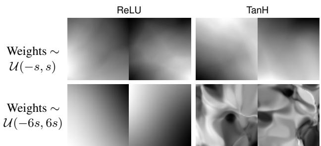  
Figure 3. Comparison of functions implemented by random MLPs (2D input, 3 hidden layers). ReLU and TanH architectures are biased towards different functions despite their universal approximation capabilities. ReLU architectures have the unique property of maintaining their simplicity bias regardless of weight magnitude.

Width has no impact on complexity, perhaps surprisingly. Additional neurons change the capacity of a model (what can be represented after training) but they do not affect its inductive biases. Indeed, the contribution of all neurons in a layer averages out to something invariant to their number.

Layer normalization is a popular component in modern architectures, including transformers [55]. It shifts and rescales the internal representation to zero mean and unit variance [4]. We place layer normalizations before each activation such that each hidden layer now applies the transformation: $\pmb { x }  ( W \pmb { x } + b ) ; \ \pmb { x }  \phi ( ( \pmb { x } - \bar { \pmb { x } } ) / \operatorname { s t d } ( \pmb { x } ) )$ where x¯ and std(x) denote the mean and standard deviation across channels. Layer normalization has the significant effect of removing variations in complexity with the weights’ magnitude for all activations (Figure 5). The weights can now vary (e.g. during training) without directly affecting the preferred complexity of the architecture. Layer normalizations also usually apply a learnable offset (0 by default) and scaling (1 by default) post-normalization. Given the above observations, when paired with an activation with some slight sensitivity to weight magnitude (e.g. GELUs, see Appendix F), this scaling can now be interpreted as a learnable shift in complexity, modulated by a single scalar (rather than the whole weight matrix without the normalization).

Residual connections [31]. We add these such that each non-linearity is now described with: ${ \pmb x }  ( x + \phi ( { \pmb x } ) )$ . This has the dramatic effect of forcing the preferred complexity to some of the lowest levels for all activations regardless of depth. This can be explained by the fact that residual connections essentially bypass the stacking of non-linearities that causes the increased complexity with increased depth.

Multiplicative interactions refer to multiplications of internal representations with one another [39] as in attention layers, highway networks, dynamic convolutions, etc. We place them in our MLPs as gating operations, such that each hidden layer corresponds to: $\pmb { x }  ( \phi ( W \pmb { x } + b ) \odot \sigma ( W ^ { \prime } \pmb { x } +$ $b ^ { \prime } ) )$ where $\sigma ( \cdot )$ is the logistic function. This creates a clear increase in complexity dependent on depth and weight magnitude, even for ReLU activations. This agrees with prior work showing that multiplicative interactions in polynomial networks [10] facilitate learning high frequencies.

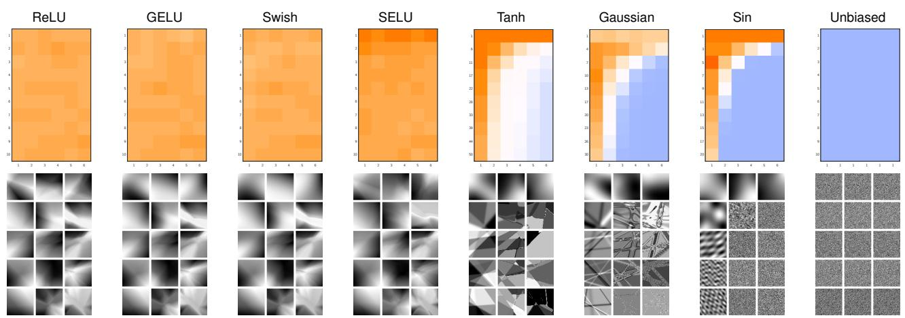  
Figure 4. Heatmaps of the average Fourier complexity of functions implemented by random-weight networks. Each heatmap corresponds to an activation function and each cell (within a heatmap) corresponds to a depth (heatmap columns) and weight magnitude (heatmap rows). We also show grayscale images of functions implemented by networks of an architecture corresponding to every other heatmap cell.

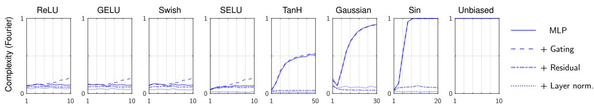  
Figure 5. The complexity of random models (Y axis) generally increases with weights / activations magnitudes (X axis). The sensitivity is however very different across activation functions. This sensitivity also increases with multiplicative interactions (i.e. gating), decreases with residual connections, and is essentially absent with layer normalization.

Unbiased model. As a counter-example to models showing some preferred complexity, we construct an architecture with no bias by design in the complexity measured with Fourier frequencies. This special architecture implements an inverse Fourier transform, parametrized directly with the coefficients and phase shifts of the Fourier components (details in Appendix D). The inverse Fourier transform is a weighted sum of sine waves, so this architecture can be implemented as a one-layer MLP with sine activations and fixed input weights representing each one Fourier component. These fixed weights prior to sine activations thus enforce a uniform prior overfrequencies.

This architecture behaves very differently from standard MLPs (Figure 4). With random weights, its Fourier spectrum is uniform, which gives a high complexity for any weight magnitude (depth is fixed). Functions implemented by this architecture look like white noise. Even though this architecture can be trained by gradient descent like any MLP, we show in Appendix E that it is practically useless because of its lack of any complexity bias.

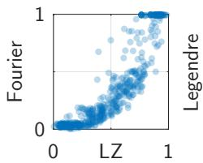

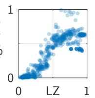

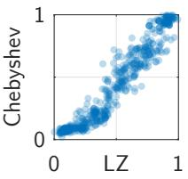  
Figure 6. Our various complexity measures are closely correlated despite measuring each a different proxy i.e. frequency (Fourier), polynomial order (Legendre, Chebyshev), or compressibility (LZ).

## Importance of ReLU activations

The fact that a strong simplicity bias depends on ReLU activations suggests that their historical importance in the development of deep learning goes beyond the common narrative about vanishing gradients [42]. The same may apply to residual connections and layer normalization since they alsox contribute strongly to the simplicity bias. This contrasts with the current literature that mostly invokes their numerical properties [6, 82, 83].

## 4. Inductive Biases in Trained Models

We now examine how the inductive biases of an architecture impact a model trained by standard gradient descent. We will show that there is a strong correlation between the complexity at initialization (i.e. with random weights as examined in the previous section) and in the trained model. We will also see that unusual architectures with a bias towards high complexity can improve generalization on tasks where the standard “simplicity bias” is suboptimal.

## 4.1. Learning Complex Functions

The NRS proposes that good generalization requires a good match between the complexity preferred by the architecture and the target function. We verify this claim by demonstrating improved generalization on complex tasks with architectures biased towards higher complexity. This is also a proof of concept of the potential utility of controlling inductive biases.

Experimental setup. We consider a simple binary classification task involving modulo arithmetic. Such tasks like the parity function [66] are known to be challenging for standard architectures because they contain high-frequency patterns. The input to our task is a vector of integers x ∈ $[ 0 , N { - } 1 ] ^ { d }$ . The correct labels are $1 ( \Sigma x _ { i } \le ( M / 2 )$ mod M). We consider three versions with $N { = } 1 6$ and $M = \{ 1 0 , 7 , 4 \}$ that correspond to increasingly higher frequencies in the target function (see Figure 7 and Appendix D for details).

Results. We see in Figure 7 that a ReLU MLP only solves the low-frequency version of the task. Even though this model can be trained to perfect training accuracy on the higher-frequency versions, it then fails to generalize because of its simplicity bias. We then train MLPs with other activations (TanH, Gaussian, sine) whose preferred complexity is sensitive to the activations’ magnitude. We also introduce a constant multiplicative prefactor before each activation function to modulate this bias without changing the weights’ magnitude, which could introduce optimization side effects. Some of these models succeed in learning all versions of the task when the prefactor is correctly tuned. For higher-frequency versions, the prefactor needs to be larger to shift the bias towards higher complexity. In Figure 7, we fit a quadratic approximation to the accuracy of Gaussian-activated models. The peak then clearly shifts to the right on the complex tasks. This agrees with the NRS proposition that complexity at initialization relates to properties of the trained model.

Let us also note that not all activations succeed, even with a tuned prefactor. This shows that matching the complexity of the architecture and of the target function is beneficial but not sufficient for good generalization. The inductive biases of an architecture are clearly not fully captured by any of our measures of complexity.

Target function (3 versions of “modulo addition”)  
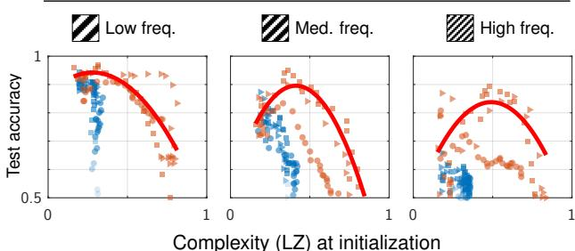  
(modulated by choices of activation and prefactor value)  
mlpRelu mlpGelu mlpSwish mlpTanh mlpGaussian mlpSin

Figure 7. Results training networks on three tasks of increasing complexity. Each point represents a different architecture. ReLUlike activations are biased towards low complexity and fail to generalize on complex tasks. With other activations, the complexity bias depends on the activation magnitudes, which we can control with a multiplicative prefactor. This enables generalization on complex tasks by shifting the bias to higher complexity.1 1 1 Indeed, the optimum prefactor (peak of the quadratic fit) shifts to the right on each task of increasing complexity.

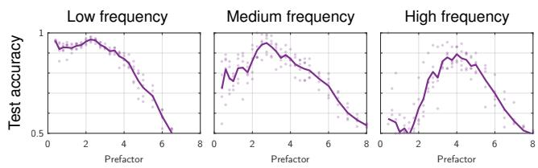  
Figure 8. Detail of Figure 7 for Gaussian activations. The peak accuracy shifts to the right on tasks of increasing complexity. This corresponds to a larger prefactor that shifts the bias towards higher complexity. Each point represents one random seed.

## Reinterpretation of existing work

## Loss landscapes Are All You Need [9]

Chiang et al. showed that networks with random weights, as long as they fit the training data with low training loss, are good solutions that generalize to the test data. We find “loss landscapes” slightly misleading because the key is in the parametrization of the network (and by extension of this landscape) and not in the loss function. Their results can be replicated by replacing the cross-entropy loss with an MSE loss, but not by replacing their MLP with our “unbiased learner” architecture.

The sampled solutions are good, not only because of their low training loss, but because they are found by uniformly sampling the weight space. Bad low-loss solutions also exist, but they are unlikely to be found by random sampling. Because of the NRS, all randomweight networks implement simple functions, which generalize as long as they fit the training data. An alternative title could be “Uniformly Sampling the Weight Space Is All You Need”.

## 4.2. Impact on Shortcut Learning

Shortcut learning refers to situations where the simplicity bias causes a model to rely on simple spurious features rather than learning the more-complex target function [65].

Experimental setup. We consider a regression task similar to Colored-MNIST. Inputs are images of handwritten digits juxtaposed with a uniform band of colored pixels that simulate spurious features. The labels in the training data are values in [0, 1] proportional to the digit value as well as to the color intensity. Therefore, a model can attain high training accuracy by relying either on the simple linear relation with the color, or the more complex recognition of the digits (the target task). To measure the reliance of a model on color or digit, we use two test sets where either the color or digit is correlated with the label while the other is randomized. See Appendix D for details.

Results. We train 2-layer MLPs with different activation functions. We also use a multiplicative prefactor, i.e. a constant $\alpha \in \mathrm { R } ^ { + }$ placed before each activation function such that each non-linear layer performs the following: $\pmb { x }  \phi \big ( \alpha ( W \pmb { x } + b ) \big )$ . The prefactor mimics a rescaling of the weights and biases with no optimization side effects.

We see in Figure 9 that the LZ complexity at initialization increases with prefactor values for TanH, Gaussian, and sine activations. Most interestingly, the accuracy on the digit and color also varies with the prefactor. The color is learned more easily with small prefactors (corresponding to a low complexity at initialization) while the digit is learned more easily at an intermediate value (corresponding to medium complexity at initialization). The best performance on the digit is reached at a sweet spot that we explain as the hypothesized “best match” between the complexity of the target function, and that preferred by the architecture. With larger prefactors, i.e. beyond this sweet spot, the accuracy on the digit decreases, and even more so with sine activations for which the complexity also increases more rapidly, further supporting the proposed explanation.

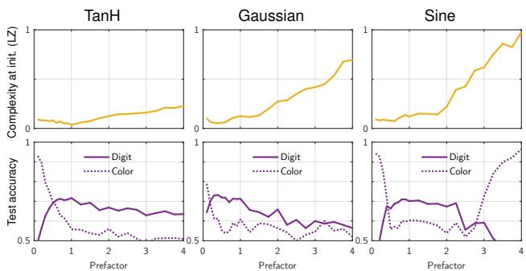  
Figure 9. Experiments on Colored-MNIST show a clear correlation between complexity at initialization (top) and test accuracy (bottom). Models with a bias for low complexity rely on the color i.e. the simpler feature. The accuracy on the digit peaks at a sweet spot where the models’ preferred complexity matches the digits’.

## Reinterpretation of existing work

## How You Start Matters for Generalization [59]

Ramasinghe et al. examine implicit neural representations (i.e. a network trained to represent one image). They observe that models showing high frequencies at initialization also learn high frequencies better. They conclude that complexity at initialization causally influences the solution. But our results suggest instead that these are two effects of a common cause: the architecture is biased towards a certain complexity, which influences both the untrained model and the solutions found by gradient descent. There exist configurations of weights that correspond to complex functions, but they are unlikely to be found in either case. Appendix E.3 shows that initializing GD from such a solution with an architecture biased toward simplicity does not yield complex solutions, thus disproving the causal relation.

## 5. Transformers are Biased Towards Compressible Sequences

We now show that the inductive biases observed with MLPs are relevant to transformer sequence models. The experiments below confirm the bias of a transformer for generating simple, compressible sequences [29] which could then explain the tendency of language models to repeat themselves [21, 34]. The experiments also suggest that transformers inherit this inductive bias from the same components as those explaining the simplicity bias in MLPs.

Experimental setup. We sample sequences from an untrained GPT-2 [55]. For each sequence, we sample random weights from their default initial distribution, then prompt the model with one random token (all of them being equivalent since the model is untrained), then generate a sequence of 100 tokens by greedy maximum-likelihood decoding. We evaluate the complexity of each sequence with the LZ measure (Section 2) and report the average over 1,000 sequences. We evaluate variations of the architecture: replacing activation functions in MLP blocks (GELUs by default), varying the depth (12 transformer blocks by default), and varying the activations’ magnitude by modifying the scaling factor in layer normalizations (1 by default).

Results. We first observe in Figure 10 that the default architecture is biased towards relatively simple sequences. This observation, already reported by Goldblum et al. [29], is non-trivial since a random model could as well generate completely random sequences. Changing the activation function from the default GELUs has a large effect. The complexity increases with SELU, TanH, sine, and decreases with ReLU. It is initially low with Gaussian activations, but climbs higher than most others with larger activation magnitudes. This is consistent with observations made on MLPs, where ReLU induced the strongest bias for simplicity, and TanH, Gaussian, sine for complexity. Variations of activations’ magnitude (via scaling in layer normalizations) has the same monotonic effect on complexity as observed in MLPs. However, we lack an explanation for the “shoulders” in the curves of SELU, Tanh, and sine. It may relate to them being the activations that output negative values most. Varying depth also has the expected effect of magnifying the differences across activations and scales.

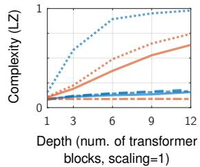

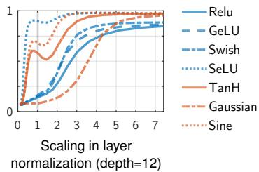  
Figure 10. Average complexity (LZ) of sequences generated by an untrained GPT-2. Variations of the architecture correspond to variations in complexity comparable to MLPs. This suggests that transformers inherit a bias for simple sequences from their building blocks via mechanisms similar to those in simple models.

Take-away. These results suggest that the bias for simple sequences of transformers originates from their building blocks via similar mechanisms to those causing the simplicity bias in other predictive models. The building blocks of transformers also seem to balance a shift towards higher complexity (attention, multiplicative interactions) and lower complexity (GELUs, layer normalizations, residual connections).

## 6. Related Work

Much effort has gone into explaining the success of deep learning through the inductive biases of SGD [48] and structured architectures [11, 90]. This work rather focuses on implicit inductive biases from unstructured architectures.

The simplicity bias is the tendency of NNs to fit data with simple functions [3, 25, 53, 75]. The spectral bias suggests that NNs prioritize learning low-frequency components of the target function [57, 84]. These studies confound architectures and optimization. And most explanations invoke implicit regularization of gradient descent [70, 85] and are specific to ReLU networks [35, 38, 88]. In contrast, we show that some form of spectral bias exists in common architectures independently of gradient descent.

A related line of study showed that Boolean MLPs are biased towards low-entropy functions [12, 44]. Work closer to ours [12, 44, 79] examines the simplicity bias of networks with random weights. These works are limited to MLPs with binary inputs or outputs [12, 44], ReLU activations, and simplicity measured as compressibility. In contrast, our work examines multiple measures of simplicity and a wider set of architectures. In work concurrent to ours, Abbe et al. [1] used Walsh decompositions (analogous to Fourier series for binary functions) to characterize the simplicity of learned binary classification networks. Their discussion is specific to classification and highly complementary to ours.

Our work also provides a new lens to explain why choices of activation functions are critical [16, 60, 67]. See Appendix A for an extended literature review.

## 7. Conclusions

We examined inductive biases that NNs possess independently of their optimization. We found that the parameter space of popular architectures corresponds overwhelmingly to functions with three quantifiable properties: low frequency, low order, and compressibility. They correspond to the simplicity bias previously observed in trained models which we now explain without involving (S)GD. We also showed that the simplicity bias is not universal to all architectures. It results from ReLUs, residual connections, layer normalization, etc. The popularity of these components likely reflects the collective search for architectures that perform well on real-world data. In short, the effectiveness of NNs is not an intrinsic property but the result of the adequacy between key choices (e.g. ReLUs) and properties of real-world data (prevalence of low-complexity patterns).

## Limitations and open questions.

• Our analysis used mostly small models and data to enable visualizations (2D function maps) and computations (Fourier decompositions). We showed the relevance of our findings to large transformers, but the study could be extended to other large architectures and tasks.

• Our analysis relies on empirical simulations. It could be carried out analytically to provide theoretical insights.

• Our results do not invalidate prior work on implicit biases of (S)GD. Future work should clarify the interplay of different sources of inductive biases. Even if most of the parameter space corresponds to simple functions, GD can navigate to complex ones. Are they isolated points in parameter space, islands, or connected regions? This relates to mode connectivity, lottery tickets [19], and the hypothesis that good flat minima occupy a large volume [37].

• We proposed three quantifiable facets of inductive biases. Much is missed about the “shape” of functions preferred by different activations (Figure 3). An extension could discover other reasons for the success of NNs and fundamental properties shared across real-world datasets.

• An application of our findings is in the control of inductive biases to nudge the behaviour of trained networks [87]. For example by manipulating the parametrization of NNs on which (S)GD is performed.5

## References

[1] Emmanuel Abbe, Samy Bengio, Aryo Lotfi, and Kevin Rizk. Generalization on the unseen, logic reasoning and degree curriculum. arXiv preprint arXiv:2301.13105, 2023. 8, 1

[2] Sanjeev Arora, Nadav Cohen, Wei Hu, and Yuping Luo. Implicit regularization in deep matrix factorization. NeurIPS, 32, 2019. 1

[3] Devansh Arpit, Stanislaw Jastrzebski, Nicolas Ballas, David Krueger, Emmanuel Bengio, Maxinder S Kanwal, Tegan Maharaj, Asja Fischer, Aaron Courville, Yoshua Bengio, et al. A closer look at memorization in deep networks. In ICML, pages 233–242. PMLR, 2017. 2, 8, 1

[4] Jimmy Lei Ba, Jamie Ryan Kiros, and Geoffrey E Hinton. Layer normalization. arXiv preprint arXiv:1607.06450, 2016. 4

[5] Gregor Bachmann, Sotiris Anagnostidis, and Thomas Hofmann. Scaling MLPs: A tale of inductive bias. arXiv preprint arXiv:2306.13575, 2023. 2, 4

[6] David Balduzzi, Marcus Frean, Lennox Leary, JP Lewis, Kurt Wan-Duo Ma, and Brian McWilliams. The shattered gradients problem: If resnets are the answer, then what is the question? In International Conference on Machine Learning, pages 342–350. PMLR, 2017. 5

[7] Satwik Bhattamishra, Arkil Patel, Varun Kanade, and Phil Blunsom. Simplicity bias in transformers and their ability to learn sparse boolean functions. arXiv preprint arXiv:2211.12316, 2022. 2

[8] Akhilan Boopathy, Kevin Liu, Jaedong Hwang, Shu Ge, Asaad Mohammedsaleh, and Ila R Fiete. Model-agnostic measure of generalization difficulty. In ICML, pages 2857– 2884. PMLR, 2023. 1

[9] Ping-yeh Chiang, Renkun Ni, David Yu Miller, Arpit Bansal, Jonas Geiping, Micah Goldblum, and Tom Goldstein. Loss landscapes are all you need: Neural network generalization can be explained without the implicit bias of gradient descent. In ICLR, 2022. 1, 2, 6

[10] Moulik Choraria, Leello Tadesse Dadi, Grigorios Chrysos, Julien Mairal, and Volkan Cevher. The spectral bias of polynomial neural networks. arXiv preprint arXiv:2202.13473, 2022. 5, 2

[11] Nadav Cohen and Amnon Shashua. Inductive bias of deep convolutional networks through pooling geometry. arXiv preprint arXiv:1605.06743, 2016. 8, 1

[12] Giacomo De Palma, Bobak Kiani, and Seth Lloyd. Random deep neural networks are biased towards simple functions. NeurIPS, 32, 2019. 8, 1

[13] Gregoire Del´ etang, Anian Ruoss, Jordi Grau-Moya, Tim´ Genewein, Li Kevin Wenliang, Elliot Catt, Chris Cundy, Marcus Hutter, Shane Legg, Joel Veness, et al. Neural networks and the chomsky hierarchy. arXiv preprint arXiv:2207.02098, 2022. 1

[14] Benoit Dherin, Michael Munn, Mihaela Rosca, and David Barrett. Why neural networks find simple solutions: The many regularizers of geometric complexity. NeurIPS, 35: 2333–2349, 2022. 2

[15] Kamaludin Dingle, Chico Q Camargo, and Ard A Louis. Input–output maps are strongly biased towards simple outputs. Nature communications, 9(1):761, 2018. 2, 3, 1

[16] Shiv Ram Dubey, Satish Kumar Singh, and Bidyut Baran Chaudhuri. Activation functions in deep learning: A comprehensive survey and benchmark. Neurocomputing, 2022. 4, 8, 2, 3

[17] Rahim Entezari, Hanie Sedghi, Olga Saukh, and Behnam Neyshabur. The role of permutation invariance in linear mode connectivity of neural networks. arXiv preprint arXiv:2110.06296, 2021. 1

[18] Emanuele Francazi, Aurelien Lucchi, and Marco Baity-Jesi. Initial guessing bias: How untrained networks favor some classes. arXiv preprint arXiv:2306.00809, 2023. 2

[19] Jonathan Frankle, Gintare Karolina Dziugaite, Daniel Roy, and Michael Carbin. Linear mode connectivity and the lottery ticket hypothesis. In International Conference on Machine Learning, pages 3259–3269. PMLR, 2020. 8

[20] Spencer Frei, Gal Vardi, Peter L Bartlett, Nathan Srebro, and Wei Hu. Implicit bias in leaky relu networks trained on highdimensional data. arXiv preprint arXiv:2210.07082, 2022. 1

[21] Zihao Fu, Wai Lam, Anthony Man-Cho So, and Bei Shi. A theoretical analysis of the repetition problem in text generation. In AAAI, pages 12848–12856, 2021. 7, 4

[22] Gallant. There exists a neural network that does not make avoidable mistakes. In IEEE International Conference on Neural Networks, pages 657–664. IEEE, 1988. 2

[23] Adria Garriga-Alonso, Carl Edward Rasmussen, and Lau-\` rence Aitchison. Deep convolutional networks as shallow gaussian processes. arXiv preprint arXiv:1808.05587, 2018. 1

[24] Jonas Geiping, Micah Goldblum, Phillip E Pope, Michael Moeller, and Tom Goldstein. Stochastic training is not necessary for generalization. arXiv preprint arXiv:2109.14119, 2021. 1

[25] Robert Geirhos, Jorn-Henrik Jacobsen, Claudio Michaelis,¨ Richard Zemel, Wieland Brendel, Matthias Bethge, and Felix A Wichmann. Shortcut learning in deep neural networks. Nature Machine Intelligence, 2(11):665–673, 2020. 8, 1

[26] Alan Martin Gilkes. Photograph enhancement by adaptive digital unsharp masking. PhD thesis, Massachusetts Institute of Technology, 1974. 5

[27] Raja Giryes, Guillermo Sapiro, and Alex M Bronstein. Deep neural networks with random gaussian weights: A universal classification strategy? IEEE Transactions on Signal Processing, 64(13):3444–3457, 2016. 1

[28] Xavier Glorot and Yoshua Bengio. Understanding the difficulty of training deep feedforward neural networks. In International Conference on Artificial Intelligence and Statistics, pages 249–256. JMLR, 2010. 3

[29] Micah Goldblum, Marc Finzi, Keefer Rowan, and Andrew Gordon Wilson. The no free lunch theorem, kolmogorov complexity, and the role of inductive biases in machine learning. arXiv preprint arXiv:2304.05366, 2023. 1, 2, 3, 7

[30] Michael Hahn, Dan Jurafsky, and Richard Futrell. Sensitivity as a complexity measure for sequence classification tasks. Transactions ofthe ACL, 9:891–908, 2021. 2

[31] Kaiming He, Xiangyu Zhang, Shaoqing Ren, and Jian Sun. Deep residual learning for image recognition. In CVPR, pages 770–778, 2016. 4

[32] Katherine L Hermann and Andrew K Lampinen. What shapes feature representations? exploring datasets, architectures, and training. arXiv preprint arXiv:2006.12433, 2020. 1

[33] Katherine L Hermann, Hossein Mobahi, Thomas Fel, and Michael C Mozer. On the foundations of shortcut learning. arXiv preprint arXiv:2310.16228, 2023. 2

[34] Ari Holtzman, Jan Buys, Li Du, Maxwell Forbes, and Yejin Choi. The curious case of neural text degeneration. arXiv preprint arXiv:1904.09751, 2019. 7, 4

[35] Qingguo Hong, Jonathan W Siegel, Qinyang Tan, and Jinchao Xu. On the activation function dependence of the spectral bias of neural networks. arXiv preprint arXiv:2208.04924, 2022. 8, 1

[36] Kurt Hornik, Maxwell Stinchcombe, and Halbert White. Multilayer feedforward networks are universal approximators. Neural networks, 2(5):359–366, 1989. 1, 4

[37] W. Ronny Huang, Zeyad Emam, Micah Goldblum, Liam Fowl, Justin K. Terry, Furong Huang, and Tom Goldstein. Understanding generalization through visualizations. In ”I Can’t Believe It’s Not Better!” NeurIPS Workshop, pages 87–97. PMLR, 2020. 2, 8

[38] Minyoung Huh, Hossein Mobahi, Richard Zhang, Brian Cheung, Pulkit Agrawal, and Phillip Isola. The lowrank simplicity bias in deep networks. arXiv preprint arXiv:2103.10427, 2021. 1, 8

[39] Siddhant M Jayakumar, Wojciech M Czarnecki, Jacob Menick, Jonathan Schwarz, Jack Rae, Simon Osindero, Yee Whye Teh, Tim Harley, and Razvan Pascanu. Multiplicative interactions and where to find them. In ICLR, 2020. 4

[40] Jaehoon Lee, Yasaman Bahri, Roman Novak, Samuel S Schoenholz, Jeffrey Pennington, and Jascha Sohl-Dickstein. Deep neural networks as gaussian processes. arXiv preprint arXiv:1711.00165, 2017. 1

[41] Kaifeng Lyu, Zhiyuan Li, Runzhe Wang, and Sanjeev Arora. Gradient descent on two-layer nets: Margin maximization and simplicity bias. NeurIPS, 34:12978–12991, 2021. 1

[42] Andrew L Maas, Awni Y Hannun, Andrew Y Ng, et al. Rectifier nonlinearities improve neural network acoustic models. In ICML, page 3. Atlanta, GA, 2013. 2, 5

[43] Alexander G de G Matthews, Mark Rowland, Jiri Hron, Richard E Turner, and Zoubin Ghahramani. Gaussian process behaviour in wide deep neural networks. In ICLR, 2018. 1

[44] Chris Mingard, Joar Skalse, Guillermo Valle-Perez, David´ Mart´ınez-Rubio, Vladimir Mikulik, and Ard A Louis. Neural networks are a priori biased towards boolean functions with low entropy. arXiv preprint arXiv:1909.11522, 2019. 8, 1, 2

[45] Tom M Mitchell. The need for biases in learning generalizations. Rutgers University CS tech report CBM-TR-117, 1980. 1

[46] Amirkeivan Mohtashami, Martin Jaggi, and Sebastian U Stich. Special properties of gradient descent with large learning rates. arXiv preprint arXiv:2205.15142, 2023. 1

[47] Guido F Montufar, Razvan Pascanu, Kyunghyun Cho, and Yoshua Bengio. On the number of linear regions of deep neural networks. NeurIPS, 27, 2014. 5

[48] Behnam Neyshabur, Ryota Tomioka, and Nathan Srebro. In search of the real inductive bias: On the role of implicit regularization in deep learning. arXiv preprint arXiv:1412.6614, 2014. 8, 1

[49] Elisa Oostwal, Michiel Straat, and Michael Biehl. Hidden unit specialization in layered neural networks: Relu vs. sigmoidal activation. Physica A: Statistical Mechanics and its Applications, 564:125517, 2021. 2

[50] Jeffrey Pennington, Samuel Schoenholz, and Surya Ganguli. The emergence of spectral universality in deep networks. In International Conference on Artificial Intelligence and Statistics, pages 1924–1932. PMLR, 2018. 1

[51] Scott Pesme, Loucas Pillaud-Vivien, and Nicolas Flammarion. Implicit bias of sgd for diagonal linear networks: a provable benefit of stochasticity. NeurIPS, 34:29218–29230, 2021. 1

[52] Mohammad Pezeshki, Oumar Kaba, Yoshua Bengio, Aaron C Courville, Doina Precup, and Guillaume Lajoie. Gradient starvation: A learning proclivity in neural networks. NeurIPS, 34:1256–1272, 2021. 2, 1

[53] Tomaso Poggio, Kenji Kawaguchi, Qianli Liao, Brando Miranda, Lorenzo Rosasco, Xavier Boix, Jack Hidary, and Hrushikesh Mhaskar. Theory of deep learning III: the nonoverfitting puzzle. CBMM Memo, 73:1–38, 2018. 8, 1

[54] Ben Poole, Subhaneil Lahiri, Maithra Raghu, Jascha Sohl-Dickstein, and Surya Ganguli. Exponential expressivity in deep neural networks through transient chaos. NeurIPS, 29, 2016. 1

[55] Alec Radford, Jeffrey Wu, Rewon Child, David Luan, Dario Amodei, Ilya Sutskever, et al. Language models are unsupervised multitask learners. OpenAI blog, 1(8):9, 2019. 4, 7

[56] Maithra Raghu, Ben Poole, Jon Kleinberg, Surya Ganguli, and Jascha Sohl-Dickstein. On the expressive power of deep neural networks. In ICML, pages 2847–2854. PMLR, 2017. 1

[57] Nasim Rahaman, Aristide Baratin, Devansh Arpit, Felix Draxler, Min Lin, Fred Hamprecht, Yoshua Bengio, and Aaron Courville. On the spectral bias of neural networks. In ICML, pages 5301–5310. PMLR, 2019. 2, 3, 8, 1

[58] Sameera Ramasinghe and Simon Lucey. Beyond periodicity: Towards a unifying framework for activations in coordinate-MLPs. In ECCV, pages 142–158. Springer, 2022. 4, 2

[59] Sameera Ramasinghe, Lachlan MacDonald, Moshiur Farazi, Hemanth Saratchandran, and Simon Lucey. How you start matters for generalization. arXiv preprint arXiv:2206.08558, 2022. 7, 9

[60] Sameera Ramasinghe, Lachlan E MacDonald, and Simon Lucey. On the frequency-bias of coordinate-MLPs. NeurIPS, 35:796–809, 2022. 8, 2

[61] Vishwanath Saragadam, Daniel LeJeune, Jasper Tan, Guha Balakrishnan, Ashok Veeraraghavan, and Richard G Baraniuk. Wire: Wavelet implicit neural representations. In CVPR, pages 18507–18516, 2023. 2

[62] Jurgen Schmidhuber. Discovering neural nets with low¨ kolmogorov complexity and high generalization capability. Neural Networks, 10(5):857–873, 1997. 1

[63] Samuel S Schoenholz, Justin Gilmer, Surya Ganguli, and Jascha Sohl-Dickstein. Deep information propagation. arXiv preprint arXiv:1611.01232, 2016. 1, 2

[64] Luca Scimeca, Seong Joon Oh, Sanghyuk Chun, Michael Poli, and Sangdoo Yun. Which shortcut cues will dnns choose? a study from the parameter-space perspective. arXiv preprint arXiv:2110.03095, 2021. 2

[65] Harshay Shah, Kaustav Tamuly, Aditi Raghunathan, Prateek Jain, and Praneeth Netrapalli. The pitfalls of simplicity bias in neural networks. NeurIPS, 33:9573–9585, 2020. 2, 7

[66] Shai Shalev-Shwartz, Ohad Shamir, and Shaked Shammah. Failures of gradient-based deep learning. In ICML, pages 3067–3075. PMLR, 2017. 6

[67] James Benjamin Simon, Sajant Anand, and Mike Deweese. Reverse engineering the neural tangent kernel. In ICML, pages 20215–20231. PMLR, 2022. 8, 2

[68] Vincent Sitzmann, Julien Martel, Alexander Bergman, David Lindell, and Gordon Wetzstein. Implicit neural representations with periodic activation functions. NeurIPS, 33:7462– 7473, 2020. 4, 8

[69] Samuel L Smith, Benoit Dherin, David GT Barrett, and Soham De. On the origin of implicit regularization in stochastic gradient descent. arXiv preprint arXiv:2101.12176, 2021. 1

[70] Daniel Soudry, Elad Hoffer, Mor Shpigel Nacson, Suriya Gunasekar, and Nathan Srebro. The implicit bias of gradient descent on separable data. The Journal ofMachine Learning Research, 19(1):2822–2878, 2018. 8, 1

[71] Joshua Stock, Jens Wettlaufer, Daniel Demmler, and Hannes Federrath. Property unlearning: A defense strategy against property inference attacks. arXiv preprint arXiv:2205.08821, 2022. 1

[72] Richard Sutton. The bitter lesson. Incomplete Ideas (blog), 13(1), 2019. 1

[73] Remi Tachet, Mohammad Pezeshki, Samira Shabanian, Aaron Courville, and Yoshua Bengio. On the learning dynamics of deep neural networks. arXiv preprint arXiv:1809.06848, 2018. 1

[74] Matthew Tancik, Pratul Srinivasan, Ben Mildenhall, Sara Fridovich-Keil, Nithin Raghavan, Utkarsh Singhal, Ravi Ramamoorthi, Jonathan Barron, and Ren Ng. Fourier features let networks learn high frequency functions in low dimensional domains. NeurIPS, 33:7537–7547, 2020. 2

[75] Damien Teney, Ehsan Abbasnejad, Simon Lucey, and Anton van den Hengel. Evading the simplicity bias: Training a diverse set of models discovers solutions with superior ood generalization. arXiv preprint arXiv:2105.05612, 2021. 8, 1, 2

[76] Damien Teney, Maxime Peyrard, and Ehsan Abbasnejad. Predicting is not understanding: Recognizing and addressing underspecification in machine learning. In European Conference on Computer Vision, pages 458–476. Springer, 2022. 2

[77] Ryan Theisen, Jason Klusowski, and Michael Mahoney. Good classifiers are abundant in the interpolating regime. In AISTATS, pages 3376–3384. PMLR, 2021. 2

[78] Dmitry Ulyanov, Andrea Vedaldi, and Victor Lempitsky. Deep image prior. In CVPR, pages 9446–9454, 2018. 1

[79] Guillermo Valle-Perez, Chico Q Camargo, and Ard A Louis. Deep learning generalizes because the parameter-function map is biased towards simple functions. arXiv preprint arXiv:1805.08522, 2018. 2, 3, 8, 1

[80] Gal Vardi. On the implicit bias in deep-learning algorithms. Communications ofthe ACM, 66(6):86–93, 2023. 2

[81] Yiheng Xie, Towaki Takikawa, Shunsuke Saito, Or Litany, Shiqin Yan, Numair Khan, Federico Tombari, James Tompkin, Vincent Sitzmann, and Srinath Sridhar. Neural fields in visual computing and beyond. In Computer Graphics Forum, pages 641–676. Wiley Online Library, 2022. 2, 5

[82] Ruibin Xiong, Yunchang Yang, Di He, Kai Zheng, Shuxin Zheng, Chen Xing, Huishuai Zhang, Yanyan Lan, Liwei Wang, and Tieyan Liu. On layer normalization in the transformer architecture. In International Conference on Machine Learning, pages 10524–10533. PMLR, 2020. 5

[83] Jingjing Xu, Xu Sun, Zhiyuan Zhang, Guangxiang Zhao, and Junyang Lin. Understanding and improving layer normalization. Advances in Neural Information Processing Systems, 32, 2019. 5

[84] Zhi-Qin John Xu, Yaoyu Zhang, Tao Luo, Yanyang Xiao, and Zheng Ma. Frequency principle: Fourier analysis sheds light on deep neural networks. arXiv preprint arXiv:1901.06523, 2019. 2, 8, 1, 3

[85] Zhi-Qin John Xu, Yaoyu Zhang, and Yanyang Xiao. Training behavior of deep neural network in frequency domain. In ICONIP, pages 264–274. Springer, 2019. 8, 1

[86] Greg Yang and Hadi Salman. A fine-grained spectral perspective on neural networks. arXiv preprint arXiv:1907.10599, 2019. 1

[87] Enyan Zhang, Michael A Lepori, and Ellie Pavlick. Instilling inductive biases with subnetworks. arXiv preprint arXiv:2310.10899, 2023. 8

[88] Shijun Zhang, Hongkai Zhao, Yimin Zhong, and Haomin Zhou. Why shallow networks struggle with approximating and learning high frequency: A numerical study. arXiv preprint arXiv:2306.17301, 2023. 8, 1

[89] Allan Zhou, Kaien Yang, Kaylee Burns, Yiding Jiang, Samuel Sokota, J Zico Kolter, and Chelsea Finn. Permutation equivariant neural functionals. arXiv preprint arXiv:2302.14040, 2023. 1

[90] Hattie Zhou, Arwen Bradley, Etai Littwin, Noam Razin, Omid Saremi, Josh Susskind, Samy Bengio, and Preetum Nakkiran. What algorithms can transformers learn? a study in length generalization. arXiv preprint arXiv:2310.16028, 2023. 8, 1, 2