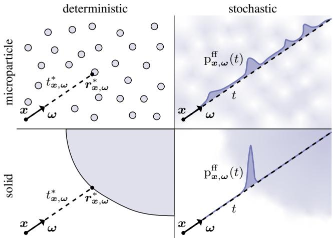
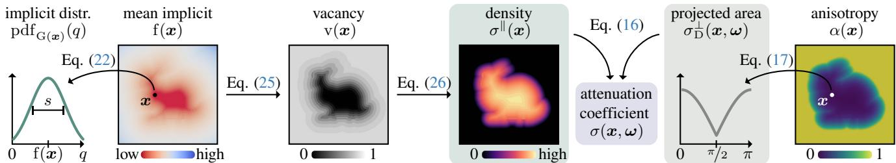
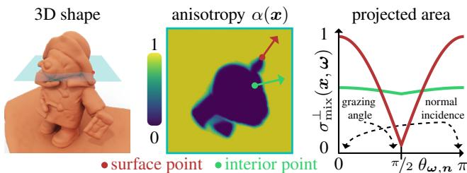
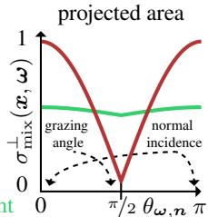
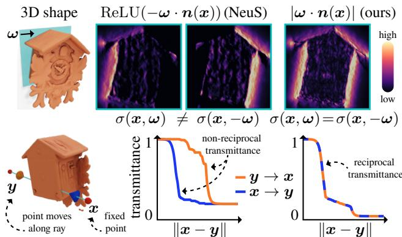
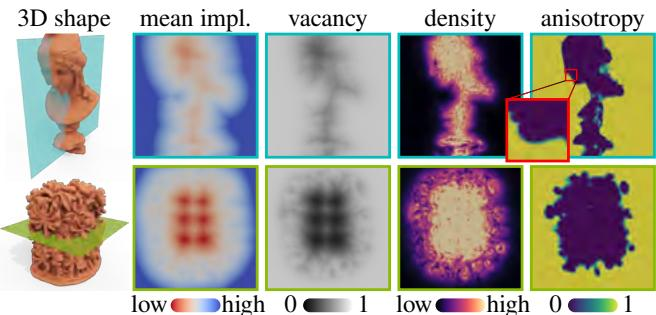
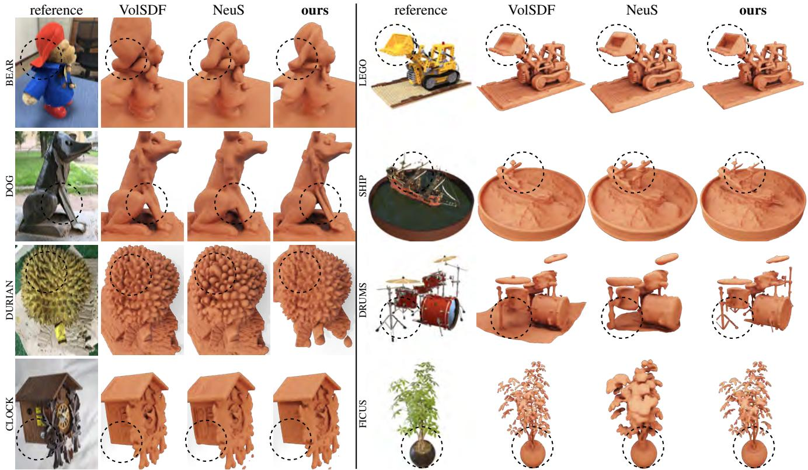

# Objects as volumes: A stochastic geometry view of opaque solids

Bailey Miller, Hanyu Chen, Alice Lai, Ioannis Gkioulekas Carnegie Mellon University

## Abstract

We develop a theoryfor the representation ofopaque solids as volumes. Starting from a stochastic representation of opaque solids as random indicatorfunctions, we prove the conditions under which such solids can be modeled using exponential volumetric transport. We also derive expressions for the volumetric attenuation coefficient as a functional ofthe probability distributions ofthe underlying indicator functions. We generalize our theory to accountfor isotropic and anisotropic scattering at different parts ofthe solid, and for representations of opaque solids as stochastic implicit surfaces. We derive our volumetric representationfrom first principles, which ensures that it satisfies physical constraints such as reciprocity and reversibility. We use our theory to explain, compare, and correct previous volumetric representations, as well as propose meaningful extensions that lead to improved performance in 3D reconstruction tasks.

## 1. Introduction

Volumetric representations have a long history in applied physics [38] and computer graphics [44], where they enable efficient light transport simulation in translucent objects (e.g., tissue, clouds, materials such as wax and soap) and participating media (e.g., smoke, fog, murky water). Since the introduction of NeRF by Mildenhall et al. [36], there has been a proliferation of neural rendering tech niques [5, 17, 45, 50, 61, 63, 66, 68] that use volumetric representations for scenes much unlike the above examples, comprising opaque objects (rather than translucent ones) in free space (rather than volumetric media). The tremendous success of volumetric representations for scenes without subsurface or volumetric scattering motivates questions such as: Why can we use volumetric light transport to simulate scenes with only light-surface interactions? What is the mathematical underpinning for modeling an opaque object as a volume? What are the properties of such a volume?

Our goal is to answer these questions. We start from first principles, revisiting the derivation of volumetric representations for translucent objects and participating media. As recent work in computer graphics highlights [9, 15, 26], volumetric representations are a formalism for querying stochastic geometry [12, 48]: From this lens, volumetric quantities such as transmittance and free-flight distribution are the answers to queries such as “are two points mutually visible” (a visibility query) and “what is the distance to first intersection along a ray” (a ray-casting query), when the geometry occluding visibility and terminating rays is stochastic.

Volumetric representations for translucent and participating media are stochastic abstractions of their microscopic structure: Such media comprise numerous microscopic particles that reflect and occlude light rays. Modeling explicit microparticle configurations, and rendering light transport through them, is prohibitively expensive. As a compromise for efficiency, volumetric representations allow to simulate light transport in such media on average [6]. These representations replace explicit with statistical descriptions of microparticle configurations (e.g., average particle location, size, shape, and orientation), analogously to statistical BRDF models for surface microgeometry [13, 14, 24, 46, 60]. Computer graphics has developed volumetric representations for microparticle media that account for details such as varying particle size and material [16, 32], shape and orientation [23, 25], and placement correlations [9, 15, 26].

We develop (Section 3) analogous volumetric representations for scenes comprising opaque macroscopic 3D objects, or opaque solids, using stochastic geometry theory. We prove (Section 3.1) formal conditions for exponential volumetric representations to apply to stochastic opaque solids; and functional relationships between volumetric parameters (i.e., attenuation coefficient) and stochastic geometry models. We adapt (Section 3.2) anisotropic volumetric representations of microparticle geometry to opaque solids, to account for effects such as directionally-dependent foreshortening near surfaces, and directionally-independent attenuation far from them. We extend (Section 3.3) our volumetric representations to utilize geometry models common in current practice (e.g., implicit surfaces). Our theory delivers volumetric representations equipped with properties necessary for physical plausibility (e.g., reciprocity and reversibility).

Our work is not the first to derive volumetric representations for opaque solids [45, 52, 63, 66]. Previous derivations generally consider how to transform a deterministic geometry representation (e.g., signed distance function) into a volumetric one that behaves approximately like the deterministic geometry. Despite its empirical success, this methodological approach remains heuristic and requires arbitrary choices (e.g., deciding what properties of deterministic geometry to preserve in the volumetric representation). By contrast, our derivation is rigorous, starting from only the axioms of volumetric transport, and helps place this prior work on a solid mathematical footing: We show (Section 4) that our theory explains previous volumetric representations as special cases of ours, corresponding to different stochastic modeling choices for the underlying opaque geometry. Our theory additionally highlights and addresses critical defects of previous volumetric representations (e.g., lack of reciprocity and reversibility), and generalizes them in principled ways.

Our volumetric representation can be readily incorporated within existing volumetric neural rendering pipelines [37, 54, 63, 67]. We show experimentally (Section 5) that replacing previous volumetric representations [63, 66] with ours leads to significantly better (qualitatively and quantitatively) 3D reconstructions on common datasets. We provide interactive visualizations, open-source code, and a supplement with all appendices on the project website.1

## 2. Volumetric light transport background

We begin with background on volumetric light transport (also known as radiative transfer). We follow Bitterli et al. [9] for our review, and refer to Preisendorfer [48, Chapter XV] and Chiu et al. [12] for a more comprehensive discussion.

Setup. Volumetric light transport models scenes with stochastic geometry (Figure 1). Classically in computer graphics, these are scenes comprising numerous microscopic particles [39] (e.g., translucent materials); whereas in neural rendering, they are scenes comprising macroscopic opaque objects. We term the two settings stochastic microparticle geometry and stochastic solid geometry, respectively.

In both settings, volumetric light transport algorithms simulate expected radiometric measurements over all realizations of the stochastic geometry [6]. They leverage the fact that deterministic light transport algorithms (e.g., path tracing) interact with scene geometry only through two geometric queries: Q1. visibility queries to compute the visibility $\mathrm { V } ( \pmb { x } , \pmb { y } ) \in \{ 0 , 1 \}$ between points x, $\pmb { y } \in \mathbb { R } ^ { 3 }$ ; Q2. ray-casting queries to compute the free-flight distance $t _ { { \pmb x } , \omega } ^ { * } \in [ 0 , \infty )$ a ray with origin $\pmb { x } \in \mathbb { R } ^ { 3 }$ and direction $\omega \in S ^ { 2 }$ travels until it first intersects the scene. Thus, we can translate light transport algorithms from the deterministic to the volumetric setting by stochasticizing these geometric queries [9].

To facilitate discussion of these stochastic queries, we introduce some notation. We denote by $r _ { \mathbf { x } , \omega } ( t ) \equiv \mathbf { x } + t$ ·ω the point on a ray with origin $\pmb { x } \in \mathbb { R } ^ { 3 }$ and direction ω $\in S ^ { 2 }$ after travel distance $t \in [ 0 , \infty )$ ; and by $\mathrm { V } _ { x , \omega } ( t ) \equiv \mathrm { V } ( \mathbf { x } , r _ { x , \omega } ( t ) )$ the visibility along the ray. Then, the free-flight distance becomes $t _ { x , \omega } ^ { * } \equiv \operatorname* { m a x } \{ t \in [ 0 , \infty ) : \mathrm { V } _ { x , \omega } ( t ) = 1 \}$ , and we denote by $r _ { x , \omega } ^ { * } \equiv r _ { x , \omega } ( t _ { x , \omega } ^ { * } )$ the first intersection point.

  
Figure 1. Volumetric representations replace deterministic (left) with stochastic (right) ray casting: rather than find the first intersection with deterministic geometry, they use the free-flight distribution along a ray to represent the probability of first intersection with stochastic geometry. Classical volumetric representations describe stochastic microparticle geometry (top). We derive volumetric representations for stochastic solid geometry (bottom).

Definition 1. In a scene with stochastic geometry O, the transmittance along a ray ${ \pmb r } _ { { \pmb x } , \omega } ( t )$ is the probability ofvisibilityfrom the ray origin x—equivalently, the tail distribution ofthefree-flight distance $t _ { \mathbf { x } , \omega } ^ { * } .$

$$
\mathrm { T } _ { \pmb { x } , \omega } ( t ) \equiv \mathrm { P r } _ { \mathcal { O } } \{ \mathrm { V } _ { \pmb { x } , \omega } ( t ) = 1 \} = \mathrm { P r } _ { \mathcal { O } } \{ t _ { \pmb { x } , \omega } ^ { * } \geq t \} .\tag{1}
$$

The free-flight distribution along a ray is the probability densityfunction ofthefree-flight distance $t _ { { \pmb x } , \omega } ^ { * } \mathrm { . }$

$$
\mathrm { p } _ { { \pmb x } , \omega } ^ { \mathrm { f f } } ( t ) \equiv - \frac { \mathrm { d } \mathrm { T } _ { { \pmb x } , \omega } } { \mathrm { d } t } ( t ) .\tag{2}
$$

The attenuation coefficient at point x and direction ω is the probability density of zero free-flight distance (equivalently, probability density ofray termination through x along ω):

$$
\begin{array} { r } { \sigma ( \pmb { x } , \omega ) \equiv \mathrm { p } _ { \pmb { x } , \omega } ^ { \mathrm { f f } } ( 0 ) . } \end{array}\tag{3}
$$

We postpone definitions of stochastic geometry O till Section 3. The transmittance inherits the following properties from visibility: 1. it is reciprocal, $\mathrm { T } _ { \mathbf { { x } } , \omega } ( t ) = \mathrm { T } _ { \mathbf { { y } } , - \omega } ( t )$ if $y ~ \equiv ~ r _ { x , \omega } ( t )$ ; 2. it is monotonically non-increasing, $\mathrm { T } _ { \mathbf { \boldsymbol { x } } , \omega } ( t ) \le \mathrm { T } _ { \mathbf { \boldsymbol { x } } , \omega } ( s )$ if $t < s ; 3$ . it satisfies $\mathrm { T } _ { { \pmb x } , \omega } ( 0 ) = 1$ The transmittance and free-flight distribution generalize the visibility (Q1) and ray-casting (Q2) queries, respectively: for deterministic geometry, Equation (1) reduces to the deterministic visibility, and Equation (2) reduces to the Dirac delta distribution $\delta \left( t - t _ { x , \omega } ^ { * } \right)$ centered at the deterministic free-flight distance. The attenuation coefficient will become important when we discuss exponential transport below.

We can use these definitions to generalize deterministic light transport algorithms, which recursively use the equation for the conservation of radiance along a ray, $L _ { \mathrm { i } } ( { \pmb x } , { \pmb \omega } ) =$ $L _ { \mathrm { o } } \left( r _ { x , \omega } ^ { * } , - \omega \right)$ , to volumetric light transport algorithms, which recursively use the expectation of this equation:

  
Figure 2. Overview of our theory, presented in Theorem 4, Definition 5, and Proposition 7.

$$
\mathbb { E } _ { \mathcal { O } } [ L _ { \mathrm { i } } ( \pmb { x } , \omega ) ] = \mathbb { E } _ { \mathcal { O } } \big [ L _ { \mathrm { o } } \big ( \pmb { r } _ { \pmb { x } , \omega } ^ { * } , - \omega \big ) \big ]\tag{4}
$$

$$
= \int _ { 0 } ^ { \infty } \overbrace { \mathrm { ~  ~ \ p ~ } _ { { \pmb { x } } , \omega } ^ { \mathrm { { f } } } ( t ) } ^ { \mathrm { { g e o m e t r y } } } ~ \cdot ~ \overbrace { \mathrm { ~  ~ \ g l o b a l ~ i l l u m i n a t i o n ~ } } ^ { \mathrm { g l o b a l ~ i l l u m i n a t i o n } } ~ \mathrm { d } { \boldsymbol { t } } .\tag{5}
$$

If we drop the distinction between expected and actual radiances, Equation (5) is the volume rendering equation that neural volume rendering techniques use [36]. Such techniques typically separately model the geometry and global illumination terms, the latter as either volumetric emission [36] or in-scattered radiance [58]. We focus on the geometry term, but discuss in Appendix B implications for the global illumination term from geometry modeling choices.

Exponential transport. Most commonly in computer vision and graphics, the free-flight distance is an exponential random variable, an assumption we call exponential transport. Then, Equations (1)–(3) and transmittance reciprocity imply:

$$
\mathrm { T } _ { \boldsymbol { x } , \omega } ( t ) = \exp \bigg ( - \int _ { 0 } ^ { t } \sigma ( r _ { \boldsymbol { x } , \omega } ( s ) , \omega ) \mathrm { d } s \bigg ) ,\tag{6}
$$

$$
\begin{array} { r } { \mathrm { p } _ { { \pmb x } , \omega } ^ { \mathrm { f f } } ( t ) = \sigma ( { \pmb r } _ { { \pmb x } , \omega } ( t ) , \omega ) \mathrm { T } _ { { \pmb x } , \omega } ( t ) , } \end{array}\tag{7}
$$

$$
\sigma ( { \pmb x } , \omega ) = \sigma ( { \pmb x } , - \omega ) .\tag{8}
$$

Thus, the attenuation coefficient becomes the rate parameter of the free-flight distance. Given known coefficient values, there exist efficient and accurate numerical approximations for the free-flight distribution and transmittance [18, 27, 43].

Exponential transport has been extensively studied for stochastic microparticle geometry [38]: It is equivalent to the Poisson Boolean model of stochastic geometry, where microparticle locations are independent [9, 15, 26] and distributed as a spatial Poisson process [12, 31]. This model allows expressing the attenuation coefficient analytically as a function of the probability distributions for the particle location, size, material, shape, and orientation [16, 23, 25]. The recent success of exponential transport in neural rendering [36, 45, 63, 66] motivates our study in Section 3, where we derive, for the first time, exponential transport models for stochastic solid geometry. Notably, Vicini et al. [59] suggest using non-exponential transport for stochastic solid geometry, a suggestion we briefly discuss in Section 6.

Isotropic and anisotropic transport. In isotropic transport, the attenuation coefficient is independent of direction, $\sigma ( \pmb { x } , \omega ) = \sigma ( \pmb { x } )$ ; and conversely for anisotropic transport [25]. In stochastic microparticle geometry, isotropic transport models microparticles as rotationally-symmetric scatterers (spheres). We explain isotropic versus anisotropic transport for stochastic solid geometry in Section 3.2.

## 3. Stochastic opaque solids

We develop our exponential transport theory for stochastic solid geometry in three parts: 1. In Section 3.1, we introduce a stochastic model for solid geometry, prove conditions for exponential transport, and derive expressions for the atten uation coefficient. 2. In Section 3.2, we generalize these expressions to model variable anisotropic behavior. 3. In Section 3.3, we adapt our expressions to implicit-surface geometry representations. Figure 2 summarizes our theory, and the project website includes a video explanation.

## 3.1. Conditions for exponential transport

To formalize our exponential transport model for stochastic opaque solid geometry, we first define an opaque solid.2

Definition 2. We define an indicator function $\mathrm { ~ I ~ : ~ } \mathbb { R } ^ { 3 } $ $\{ 0 , 1 \}$ as a binary scalarfield, and associate with it a solid $\mathcal { O } \equiv \left\{ \pmb { x } \in \mathbb { R } ^ { 3 } : \mathrm { I } ( \pmb { x } ) = 1 \right\}$ . The solid O is opaque if and only if, for every point $\mathbf { \boldsymbol { \mathbf { r } } } \in \mathcal { O }$ and direction $\omega \in S ^ { 2 }$ , the visibility satisfies $\mathrm { V } _ { x , \omega } ( t ) = \delta ( t )$

The definition of opacity implies that no ray of light can reach points inside the solid O. Therefore, our volumetric light transport formulation will exclude refractive surfaces. We can now use Definition 2 to also define a stochastic solid.

Definition 3. When the indicator function I(x) is a random scalarfield, we call the associated solid O a stochastic solid, for which we define the occupancy $\mathrm { ~ o ~ : ~ } \mathbb { R } ^ { 3 }  [ 0 , 1 ]$ and vacancy $\mathrm { v } : \mathbb { R } ^ { 3 }  [ 0 , 1 ]$ as the scalarfields:

$$
\mathrm { o } ( { \pmb x } ) \equiv \mathrm { P r } \{ \mathrm { I } ( { \pmb x } ) = 1 \} ,\tag{9}
$$

$$
\mathrm { v } ( { \pmb x } ) \equiv \mathrm { P r } \{ \mathrm { I } ( { \pmb x } ) = 0 \} = 1 - \mathrm { o } ( { \pmb x } ) .\tag{10}
$$

With this definition, we can interpret probabilities involving O in Equations (1)–(3) as probabilities over all realizations of the random indicator function I. We will consider the restriction of the indicator function, occupancy, and vacancy on a ray with origin $x \in \mathbb { R } ^ { 3 }$ and direction $\omega \in S ^ { 2 } \colon \operatorname { I } _ { x , \omega } ( t ) \equiv \operatorname { I } ( r _ { x , \omega } ( t ) )$ , and analogously $\mathrm { f o r ~ o } _ { { \pmb x } , \omega } ( t )$ and $\mathrm { v } _ { { \pmb x } , \omega } ( t )$ . We can now state our main technical result.

## Theorem 4: Exponential transport in opaque solids

We assume a random indicator function I and associated stochastic opaque solid O. Then, for any ray with origin $\pmb { x } \in \mathbb { R } ^ { 3 }$ and direction $\omega \in S ^ { 2 }$ , the free-flight distribution $\mathrm { p } _ { { \pmb x } , \omega } ^ { \mathrm { f f } }$ is exponential if and only if the restriction of the indicator function on this ray, $\mathrm { I } _ { { \pmb x } , \omega } ,$ is a continuous-time discrete-space Markov process; that is, it satisfies:

$$
\begin{array} { r } { \operatorname* { P r } \{ \mathrm { I } _ { \boldsymbol { x } , \omega } ( t ) | \mathrm { I } _ { \boldsymbol { x } , \omega } ( t _ { n } ) , t _ { n } < t , n = 1 , \ldots , N \} } \\ { = \operatorname* { P r } \{ \mathrm { I } _ { \boldsymbol { x } , \omega } ( t ) | \mathrm { I } _ { \boldsymbol { x } , \omega } ( \operatorname* { m a x } _ { n } t _ { n } ) \} . } \end{array}\tag{11}
$$

Additionally, the process $\mathrm { I } _ { { \pmb x } , \omega }$ is reversible and the corresponding transmittance $\mathrm { T } _ { \pmb { x } , \omega }$ is reciprocal if and only if the attenuation coefficient σ equals:

$$
\sigma _ { \delta } ( \mathbf { x } , \omega ) \equiv | \omega \cdot \nabla \log ( \mathrm { v } ( \mathbf { x } ) ) | = \frac { | \omega \cdot \nabla \mathrm { v } ( \mathbf { x } ) | } { \mathrm { v } ( \mathbf { x } ) } \enspace .\tag{12}
$$

We explain the notation $\sigma _ { \delta }$ in Section 3.2. Expressions for transmittance and free-flight distribution follow from Equations $( 6 ) – ( 7 )$ , and the attenuation coefficient satisfies Equation (8), as required for reciprocity. We discuss reversibility and prove Theorem 4 in Appendix F.1.

## 3.2. Anisotropy

Returning to Equation (12), we can rewrite it as the product:

$$
\begin{array} { r l r } & { } & { \equiv \sigma ^ { \parallel } ( x ) \quad \equiv \sigma _ { \delta } ^ { \perp } ( x , \omega ) } \\ & { } & { \sigma _ { \delta } ( \mathbf { x } , \omega ) = \frac { \parallel \nabla \mathrm { v } ( \mathbf { x } ) \parallel } { \mathrm { v } ( \mathbf { x } ) } \cdot \mathbf { \nabla } \vert \omega \cdot \pmb { n } ( \mathbf { x } ) \vert , } \end{array}\tag{13}
$$

where $\pmb { n } ( \pmb { x } ) \equiv \nabla \mathbf { v } ( \pmb { x } ) \big / \| \nabla \mathbf { v } ( \pmb { x } ) \|$ is the unit normal of the level set of v passing through x. We compare Equation (13) to the attenuation coefficient expressions for anisotropic stochastic microparticle geometry by Jakob et al. [25, Equation (11)] and Heitz et al. [23, Equation (2)]. As in those works, we can decompose the attenuation coefficient as the product of an isotropic density $\sigma ^ { \parallel } ( \pmb { x } )$ and an anisotropic projected area $\sigma _ { \delta } ^ { \bot } ( { \pmb x } , { \pmb \omega } ) . ^ { 3 }$ Intuitively: 1. The density $\sigma ^ { \parallel } ( \pmb { x } )$ increases as vacancy v(x) decreases; thus the ray termination probability through x increases the more likely x is to be occupied. 2. The projected area $\sigma _ { \delta } ^ { \bot } ( { \pmb x } )$ models foreshortening as a ray of direction ω encounters a surface patch of normal ${ \pmb n } ( { \pmb x } )$ ; at grazing angles $( | { \boldsymbol { \omega } } \cdot { \boldsymbol { n } } ( { \boldsymbol { \mathbf { x } } } ) | = 0 )$ the patch is invisible, whereas at normal incidence $( | { \boldsymbol { \omega } } \cdot { \boldsymbol { n } } ( { \boldsymbol { \mathbf { x } } } ) | = 1 )$ it is maximally visible, corresponding to zero and maximal, respectively, ray termination probability.

This anisotropic behavior mimics deterministic surfaces, and thus is suitable for points x likely to lie on the surface of a stochastic opaque solid $( \mathrm { i . e . , v } ( \pmb { x } ) \approx 1 / 2 )$ . However, points x that are likely inside the solid $( \mathrm { i . e . , v } ( { \pmb x } ) \approx 0 .$ , respectively)

should behave isotropically: rays passing through them at different directions should terminate with the same probability. To model these different behaviors, inspired from microflake models for microparticle geometry [23, 25], we generalize our definitions of $\sigma _ { \delta } ^ { \bot }$ and $\sigma _ { \delta } . $ 4

## Definition 5: Attenuation coefficient for opaque solids

We associate with each point $\pmb { x } \in \mathbb { R } ^ { 3 }$ a distribution of normals $\operatorname { D } _ { x } : S ^ { 2 } \to \mathbb { R } _ { \geq 0 }$ that satisfies $\int _ { S ^ { 2 } } \mathrm { D } _ { x } ( m )$ dm = 1. Then, we define at x the projected area for any direction $\omega \in S ^ { 2 }$ as the expected foreshortening:

$$
\sigma _ { \mathrm { D } } ^ { \perp } ( \pmb { x } , \omega ) \equiv \int _ { S ^ { 2 } } \vert \omega \cdot m \vert \mathrm { D } _ { \pmb { x } } ( \pmb { m } ) \mathrm { d } \pmb { m } \ ,\tag{14}
$$

the density as

$$
\sigma ^ { \parallel } ( { \pmb x } ) \equiv \frac { \lVert \nabla \mathrm { v } ( { \pmb x } ) \rVert } { \mathrm { v } ( { \pmb x } ) } \ ,\tag{15}
$$

and the generalized attenuation coefficient as the product:

$$
\sigma ( { \pmb x } , \omega ) \equiv \sigma ^ { \parallel } ( { \pmb x } ) \cdot \sigma _ { \mathrm { D } } ^ { \perp } ( { \pmb x } , \omega ) .\tag{16}
$$

For $\mathrm { D } _ { { \pmb x } , \delta } ( { \pmb m } ) \equiv \delta ( { \pmb m } - { \pmb n } ( { \pmb x } ) )$ , the projected area reduces to |ω · m|, explaining the notation $\sigma _ { \delta } , \sigma _ { \delta } ^ { \bot }$ in Equations $( 1 2 ) ‐ ( 1 3 )$ . By contrast, for the uniform distribution $\mathrm { D } _ { { \pmb x } , \mathrm { u n i f } } ( { \pmb m } ) \equiv 1 / 4 \pi$ , the projected area becomes $\sigma _ { \mathrm { u n i f } } ^ { \perp } ( \pmb { x } , \omega ) \equiv 1 / 2 ;$ then both the projected area and attenuation coefficient are isotropic. Definition 5 allows behaviors between these two extremes, $\mathrm { e . g . }$ , by using a linear mixture distribution of normals $\mathrm { D } _ { { \pmb x } , \mathrm { m i x } } ( { \pmb m } ) \equiv \alpha ( { \pmb x } ) \mathrm { D } _ { { \pmb x } , { \delta } } ( { \pmb m } ) +$ $( 1 - \alpha ( \pmb { x } ) ) \mathrm { D } _ { \pmb { x } , \mathrm { u n i f } } ( \pmb { m } )$ and corresponding projected area:

$$
\sigma _ { \mathrm { m i x } } ^ { \perp } ( { \pmb x } , \omega ) \equiv \alpha ( { \pmb x } ) \sigma _ { \delta } ^ { \perp } ( { \pmb x } , \omega ) + \left( 1 - \alpha ( { \pmb x } ) \right) \sigma _ { \mathrm { u n i f } } ^ { \perp } ( { \pmb x } , \omega )
$$

$$
= \alpha ( { \pmb x } ) | { \pmb \omega } \cdot { \pmb n } ( { \pmb x } ) | + \frac { 1 - \alpha ( { \pmb x } ) } { 2 } \ .\tag{17}
$$

The anisotropy parameter ${ \boldsymbol { \alpha } } ( { \boldsymbol { \mathbf { x } } } ) \in [ 0 , 1 ]$ continuously interpolates between fully anisotropic $( \alpha ( \pmb { x } ) = 1 )$ and fully isotropic $( \alpha ( { \pmb x } ) = 0 )$ projected area. Making this parameter spatially varying allows adapting the anisotropy behavior at different parts of an opaque solid, e.g., more anisotropic near its boundary, more isotropic in its interior (Figure 3). We discuss additional choices for the distribution of normals D and associated projected area $\sigma _ { \mathrm { D } } ^ { \perp }$ in Appendices B and E.

## 3.3. Stochastic implicit surfaces

Definitions 2 and 3 define a (stochastic) solid through the binary indicator function, because the indicator (respectively vacancy) function at a point x is the minimal information we need to determine visibility (respectively transmittance) for a ray that passes through x. However, it is common practice to define a solid through a non-binary scalar field, which provides richer information about the solid and its surface [47]. We explore this case next.

  
Figure 3. The attenuation coefficient optimized for the BEAR scene in BlendedMVS behaves as anticipated by our theory: isotropically in the object interior, and anisotropically near its surface.

Definition 6. We define an implicit function $\mathrm { G } : \mathbb { R } ^ { 3 }  \mathbb { R }$ as a real scalarfield, and associate with it an indicatorfunction $\operatorname { I } ( \pmb { x } ) \equiv \mathbf { 1 } _ { \{ \mathrm { G } ( \pmb { x } ) \leq 0 \} }$ and corresponding solid O. If G is also a random field, then we define the pointwise cumulative distribution function $\mathrm { c d f } _ { \mathrm { G ( } \pmb { x } ) } ,$ , probability density function $\mathrm { p d f } _ { \mathrm { G } ( \pmb { x } ) }$ , and mean implicit function $\operatorname { f } ( { \pmb x } ) { \boldsymbol { a } } s ,$ respectively:

$$
\mathrm { c d f } _ { \mathrm { G } ( \pmb { x } ) } ( \ v q ) \equiv \mathrm { P r } \{ \mathrm { G } ( \pmb { x } ) \leq q \} , q \in \mathbb { R } ,\tag{18}
$$

$$
\operatorname { p d f } _ { \mathrm { G } ( \pmb { x } ) } ( q ) \equiv \frac { \operatorname { d c d f } _ { \mathrm { G } ( \pmb { x } ) } ( q ) } { \operatorname { d } q } , q \in \mathbb { R } ,\tag{19}
$$

$$
\operatorname { f } ( { \pmb x } ) \equiv \mathbb { E } [ \operatorname { G } ( { \pmb x } ) ] = \int _ { - \infty } ^ { + \infty } { \pmb q } \cdot \operatorname { p d f } _ { \operatorname { G } ( { \pmb x } ) } ( { \pmb q } ) \mathrm { d } { \pmb q } .\tag{20}
$$

From Definition 6, the stochastic solid O is an excursion set of the random field G [3, Chapter 1], with its surface at the zero-level set of G, its interior where $\mathrm { G } < 0 .$ , and its exterior elsewhere. Such excursion sets have been extensively studied in applied mathematics, especially when G is a Gaussian process, i.e., its (joint) distribution at one or more points is Gaussian [3, Appendix]. Sellan and Jacobson´ [52, 53] recently proposed using excursion sets of Gaussian processes as a point-based stochastic implicit surface representation (Appendix A). Extending our theory to excursion sets of various stochastic implicit functions G will allow us to provide stochastic geometry interpretations for previous volumetric representations for opaque solids [63, 66].

To this end, we specialize to stochastic implicit functions with a symmetry property: At each $\mathbf { { \boldsymbol { x } } } , \operatorname { G } ( \mathbf { { \boldsymbol { x } } } )$ equals, up to a spatially varying shift f(x) and spatially constant scale $s > 0$ , a zero-mean, unit-variance, and symmetric random variable—that is, with a PDF $\psi : \mathbb { R } \to \mathbb { R } _ { \geq 0 }$ and CDF $\Psi : \mathbb { R }  [ 0 , 1 ]$ that satisfy, for all $q \in \mathbb { R } \left[ 1 1 \right]$

$$
\psi ( q ) = \psi ( - q ) { \mathrm { ~ a n d ~ } } \Psi ( q ) = 1 - \Psi ( - q ) .\tag{21}
$$

Such a CDF Ψ is a sigmoid function [19, 22] whose exact shape depends on the probability distribution. Common symmetric distributions include the Gaussian, logistic, and Laplace (in their zero-mean, unit-variance versions), giving rise to the error, logistic, and Laplace (respectively) sigmoid functions. The symmetry property implies for G:

$$
\mathrm { p d f } _ { \mathrm { G } ( \pmb { x } ) } ( q ) = \psi ( s ( q - \mathrm { f } ( \pmb { x } ) ) ) ,\tag{22}
$$

$$
\mathrm { c d f } _ { \mathrm { G } ( \pmb { x } ) } ( \ v q ) = \Psi ( s ( \ v q - \mathrm { f } ( \pmb { x } ) ) ) .\tag{23}
$$

We prove in Appendix F.2 the following proposition.

## Proposition 7: Stochastic implicit geometry

We assume a stochastic implicit function $\operatorname { G } ( \pmb { x } )$ satisfying Equations (22)–(23). Then, the occupancy and vacancy for the associated stochastic solid O equal:

$$
\operatorname { o } ( \pmb { x } ) = \operatorname* { P r } \{ \operatorname { G } ( \pmb { x } ) \leq 0 \} = \Psi ( - s \operatorname { f } ( \pmb { x } ) ) ,\tag{24}
$$

$$
\operatorname { v } ( \pmb { x } ) = \operatorname* { P r } \{ \mathrm { G } ( \pmb { x } ) > 0 \} = \Psi ( s \operatorname { f } ( \pmb { x } ) ) .\tag{25}
$$

If the stochastic solid O also satisfies the conditions of Theorem 4, then the attenuation coefficient equals:

$$
\begin{array} { r } { \sigma ( { \pmb x } , \omega ) = \frac { s \psi ( s \operatorname { \arg } ( { \pmb x } ) ) } { \Psi ( s \operatorname { f } ( { \pmb x } ) ) \| \nabla \operatorname { f } ( { \pmb x } ) \| } \cdot \sigma _ { \mathrm { D } } ^ { \perp } ( { \pmb x } , \omega ) , } \\ { \mathrm { w i t h ~ } \sigma _ { \mathrm { D } } ^ { \perp } \mathrm { ~ a s ~ i n ~ E q u a t i o n ~ } ( 1 4 ) . \qquad } \end{array}\tag{26}
$$

Proposition 7 completes our volumetric representation, which we summarize in Figure 2. Notably, the modeling choice to use an implicit function impacts the density $\sigma ^ { \parallel }$ (through the vacancy v), but not the projected area $\sigma _ { \mathrm { D } } ^ { \perp }$ . To help intuition, we discuss the behavior of different quantities. Vacancy. The vacancy v (Equation (25)) is a sigmoidal transform of the expected value f of the stochastic implicit function G (Equation (20)). This agrees with intuition: a large positive value of f(x) (i.e., high probability that x is outside the solid) results in $\mathrm { v } ( { \pmb x } ) \approx 1 ;$ ; a large negative value of f(x) (i.e., high probability that x is inside the solid) results in $\mathrm { v } ( { \pmb x } ) \approx 0 ;$ and $\operatorname { f } ( { \pmb x } ) = 0 ~ ( \mathrm { i . e . }$ , equal probability that x is inside or outside the solid) results in $\mathrm { v } ( { \pmb x } ) = { \ o { 1 } { / 2 } }$

Attenuation coefficient and free-flight distribution. The behaviors of the attenuation coefficient σ (Equation (26)) and free-flight distribution $\mathrm { p ^ { \mathrm { f f } } }$ (Equation (7)) are easier to understand if we consider points on a ray along which the mean implicit f monotonically decreases with a constant gradient. Then, the attenuation coefficient monotonically increases along the ray (i.e., as we move from points likely in the exterior to points likely in the interior of the solid). The free-flight distribution is maximal where along the ray $\operatorname { f } ( { \pmb x } ) = 0 ( \operatorname { i . e . }$ , at the point equally likely to be inside or outside the solid), and decreases as the magnitude of f increases (i.e., at points highly likely to be inside or outside the solid). Scale and uncertainty. The scale s controls the width of the sigmoid $\Psi ,$ and thus how fast the vacancy v transitions from 0 to 1 as the mean implicit function f increases—the larger s is, the narrower Ψ becomes, and the faster v changes. We can interpret this behavior by noticing that, from Equations (22)–(23), s is the inverse of the pointwise standard deviation of G. As s increases, the standard deviation decreases, and thus: 1. the pointwise PDF $\mathrm { p d f } _ { \mathrm { G } }$ becomes more concentrated around its mean f (i.e., the stochastic implicit function G becomes more certain); 2. the vacancy v and occupancy o become closer to the binary functions $\mathbf { 1 } _ { \{ \mathrm { f } > 0 \} }$ and $\mathbf { 1 } _ { \{ \mathrm { f } \leq 0 \} }$ (i.e., the random indicator function I becomes more certain). 3. the free-flight distribution $\mathrm { p ^ { \mathrm { f f } } }$ becomes closer to

Table 1. Classification of previous and new volumetric representations for opaque solids using our theory (Figure 2).
<table><tr><td>method</td><td>implicit function distribution Ψ</td><td>distribution of normals D</td></tr><tr><td>VolSDF</td><td>Laplace</td><td>uniform</td></tr><tr><td>NeuS</td><td>logistic</td><td>delta (with ReLU)</td></tr><tr><td>NeuS with</td><td>logistic</td><td>mixture (with ReLU,</td></tr><tr><td>cosine annealing</td><td></td><td>constant anisotropy)</td></tr><tr><td>ours</td><td>Gaussian</td><td>mixture (with x-varying anisotropy)</td></tr></table>

a Dirac delta function centered at the zero-level set of f (i.e., free-flight distances become more certain).

## 4. Relationship to prior work

Our theory provides a volumetric representation for opaque solids that permits various probabilistic modeling choices, e.g., selecting a distribution of normals (Equation (14)) and an implicit function distribution (Equation (26)). We use our theory to explain and compare volumetric representations in prior work as versions of our representation corresponding to specific choices for these distributions (Table 1), albeit with critical caveats that our theory addresses.

NeuS. Most closely related to our work is the NeuS volumetric representation by Wang et al. [63, Equation (10)]. Using our notation, their extinction coefficient equals:

$$
\begin{array} { r l } & { \sigma _ { \mathrm { N e u S } } ( { \pmb x } , \omega ) ~ \equiv } \\ & { \frac { s \psi _ { \mathrm { l o g i s t i c } } \left( s { \bf f } ( { \pmb x } ) \right) \| \nabla { \bf f } ( { \pmb x } ) \| } { \Psi _ { \mathrm { l o g i s t i c } } \left( s { \bf f } ( { \pmb x } ) \right) } ~ \cdot ~ \mathrm { R e L U } \left( - \omega \cdot { \pmb n } ( { \pmb x } ) \right) ~ , } \end{array}\tag{27}
$$

where: $1 . \psi _ { \mathrm { l o g i s t i c } }$ and $\Psi _ { \mathrm { l o g i s t i c } }$ are the PDF and CDF, respectively, for the zero-mean, unit-variance logistic distribution; and 2. the mean implicit function f is parameterized as a neural field that, during training, is also regularized to approximate a signed distance function (i.e., satisfy $\| \nabla \mathrm { f } ( \pmb { x } ) \| \approx 1 )$ . Comparing Equation (27) with our Equations (13) and (26), we see that the NeuS model is close to our model with Dirac delta distribution of normals $\mathrm { D } _ { { \pmb x } , \delta } $ , specialized to specific choices for the pointwise distribution ψ and mean implicit function f, with an important difference: it replaces the Dirac delta projected area $\sigma _ { \delta } ^ { \perp } ( \mathbf { x } , \omega ) \equiv | \omega \cdot n ( \mathbf { x } ) |$ with the anisotropic term Re $\operatorname { U } ( - { \boldsymbol { \omega } } \cdot { \boldsymbol { n } } ( { \boldsymbol { x } } ) ) \equiv \operatorname* { m a x } ( 0 , - { \boldsymbol { \omega } } \cdot { \boldsymbol { n } } ( { \boldsymbol { x } } ) )$ effectively clipping $\sigma _ { \mathrm { N e u S } }$ to zero when a ray is traveling outwards (towards larger vacancy or mean implicit values). Unfortunately, this choice has the consequence that the attenuation coefficient $\sigma _ { \mathrm { N e u S } }$ violates the reciprocity requirement of Equation (8), resulting in a physically implausible volumetric representation. We visualize this issue in Figure 4. As we discuss in Section 5, violation of reciprocity additionally negatively impacts 3D reconstruction quality.

Lastly, we prove in Appendix F.3 that using the logistic distribution for G(x) simplifies Equation (26):

  
Figure 4. When optimizing for the CLOCK scene in BlendedMVS using NeuS, the ReLU term leads to attenuation coefficient (top) and transmittance (bottom) values that violate reciprocity. By contrast, using our representation leads to reciprocal results.

$$
\begin{array} { l } { \sigma _ { \mathrm { l o g i s t i c } } ( \pmb { x } , \omega ) = } \\ { \quad } \\ { s \Psi _ { \mathrm { l o g i s t i c } } ( - s \operatorname { f } ( \pmb { x } ) ) \| \nabla \operatorname { f } ( \pmb { x } ) \| \mathrm {  ~ \cdot ~ } \sigma _ { \mathrm { D } } ^ { \perp } ( \pmb { x } , \omega ) , } \end{array}\tag{28}
$$

and analogously for $\sigma _ { \mathrm { N e u S } } ( \pmb { x } , \omega )$ in Equation (27). We use this observation as we discuss VolSDF next.

VolSDF. Another closely related model is the VolSDF model by Yariv et al. [66, Equations (2)–(3)]. Using our notation:

$$
\sigma _ { \mathrm { V o l S D F } } ( \pmb { x } , \omega ) \equiv s \Psi _ { \mathrm { L a p l a c e } } ( - s \operatorname { f } ( \pmb { x } ) ) \| \nabla \operatorname { f } ( \pmb { x } ) \| .\tag{29}
$$

where $\Psi _ { \mathrm { L a p l a c e } }$ is the CDF for the zero-mean, unit-variance Laplace distribution; and the mean implicit function $\operatorname { f } ( { \pmb x } )$ is parameterized as in NeuS. Comparing to Equation (28), we make two observations about the VolSDF model: 1. It uses the uniform distribution of normals $\mathrm { D } _ { \mathbf { \mathit { x } } , \mathrm { u n i f } }$ and isotropic (constant) projected area $\sigma _ { \mathrm { u n i f } } ^ { \perp } .$ , thus the attenuation coefficient becomes isotropic. 2. It uses a density $\sigma ^ { \parallel }$ equal to that in Equation (28) after replacing the logistic with the Laplace CDF. However, this replacement is not equivalent to modeling G(x) as a Laplace random variable. This is because the simplified expression of Equation (28) is correct for only the logistic distribution, whereas the Laplace distribution requires the full expression of Equation (26). Consequently, the VolSDF model uses an incorrect density term.

Cosine annealing. The official NeuS implementation [62, models/renderer.py#L232-L235] uses cosine annealing—transitioning from isotropy to anisotropy as optimization progresses—to improve convergence. This means replacing the anisotropic term in Equation (27) with:

$$
\alpha \cdot \mathrm { R e L U } ( - \omega \cdot n ( { \pmb x } ) ) + \frac { 1 - \alpha } { 2 } ,\tag{30}
$$

and changing the global anisotropy parameter α from 0 towards 1 using a predetermined annealing schedule. Comparing to Equation (17), our theory explains this heuristic as using a mixture distribution of normals, with the caveat that NeuS also replaces $\sigma _ { \delta } ^ { \bot }$ with the reciprocity-violating

Table 2. Chamfer distance statistics on the DTU and NeRF Realistic Synthetic datasets. We provide the full tables in Appendix E.
<table><tr><td>DTU</td><td>VolSDF</td><td>NeuS</td><td>ours</td></tr><tr><td>mean</td><td>1.84</td><td>2.17</td><td>1.57</td></tr><tr><td>median</td><td>1.74</td><td>1.99</td><td>1.56</td></tr><tr><td>NeRF RS</td><td>VolSDF</td><td>NeuS</td><td>ours</td></tr><tr><td>mean</td><td>0.252</td><td>0.201</td><td>0.113</td></tr><tr><td>median</td><td>0.100</td><td>0.085</td><td>0.057</td></tr></table>

Table 3. We use chamfer distance statistics on the DTU dataset for an ablation study. We provide the full tables in Appendix E.
<table><tr><td>Ψ model</td><td>logistic</td><td>Laplace</td><td>Gaussian</td></tr><tr><td>mean</td><td>1.98</td><td>1.96</td><td>1.78</td></tr><tr><td>median</td><td>1.86</td><td>1.92</td><td>1.74</td></tr><tr><td>D model</td><td>delta (ReLU)</td><td>delta</td><td>mixture mixture (const.) (var.)</td></tr><tr><td>mean</td><td>2.17</td><td>1.98</td><td>1.97 1.75</td></tr><tr><td>median</td><td>1.99</td><td>1.86</td><td>1.85 1.59</td></tr></table>

ReLU term, as we noted earlier. Additionally, NeuS uses a spatially constant anisotropy parameter α that cannot capture the qualitatively different foreshortening behavior of surface versus interior and exterior points (Section 5).

Scale optimization and adaptive shells. NeuS and VolSDF optimize the scale s, which typically increases as optimization progresses. Our theory explains this behavior as decreasing uncertainty of the stochastic geometry and convergence towards deterministic geometry (binary vacancy).

The adaptive shells representation by Wang et al. [64] modifies the NeuS representation to use a spatially varying scale s(x). Our theory explains this choice as spatially varying pointwise standard deviation, and thus uncertainty, for the stochastic implicit function G(x). In Appendix F.2 we explain how to modify the density σ∥ in Equation (26) to account for spatially varying scale s(x).

Other approaches. In the appendix we discuss other approaches for modeling stochastic solid geometry, such as occupancy networks [35, 40] and discretization approaches [8, 45, 55] in Appendix C, as well as stochastic implicit surfaces using point clouds [52] in Appendix A.

## 5. Experimental evaluation

Our theory provides a framework for systematically correcting volumetric representations for opaque solids in prior work (using reciprocal projected area and correct density), and designing new representations (using different distributions for the implicit function and normals). These changes are straightforward to implement within existing neural rendering pipelines. We do so within a simplified version of NeuS [63] and perform extensive experiments on multi-view 3D reconstruction tasks. The goal of these experiments is not state-of-the-art performance, but an exploration of the design space and an evaluation of volumetric representations within an equal framework. Our results show that, despite their simple nature, the changes our theory suggests greatly improve performance, qualitatively and quantitatively. Over all, our experiments demonstrate the utility of a rigorous theory of volumetric representations for opaque solids.

  
Figure 5. Visualization of shape and key quantities of our volumetric representation learned for scenes in the BlendedMVS dataset.

In this section, we summarize our experiments and findings. We discuss implementation details and list complete numerical results in Appendix E. Lastly, we provide interactive visualizations and code on the project website.

Comparison to prior work. We evaluate our best performing volumetric representation against those of NeuS [63] and VolSDF [66]. Table 1 summarizes the three representations. We use three datasets for evaluation: DTU [2], BlendedMVS [65], and NeRF realistic synthetic (NeRF RS) [36].

Table 2 and Figure 6 show quantitative and qualitative results. We observe the following: 1. Our representation performs the best across all datasets, both quantitatively and qualitatively. Qualitatively, the improvements are more pronounced in BlendedMVS and NeRF RS—whose scenes have more complex geometry, materials, and background—than in DTU—whose simpler scenes are reconstructed well by all representations. 2. Our representation learns meaningful scalar fields (Figure 5) for the mean implicit function f, vacancy v, density σ∥, and anisotropy α. The mean implicit function and vacancy lend themselves to downstream surface processing tasks (e.g., mesh extraction [33]). 3. The use of a spatially varying anisotropy α allows our representation to model the qualitatively different behaviors of points x on the surface (α(x) ≈ 1, i.e., strongly anisotropic) versus in the interior $( \alpha ( \pmb { x } ) \approx 0 , \mathrm { i . e . }$ , isotropic). By contrast, VolSDF and NeuS require all points x—surface or interior—to have either isotropic $( { \boldsymbol { \alpha } } ( { \boldsymbol { \mathbf { x } } } ) : = 0 )$ or perfectly anisotropic $( \alpha ( \pmb { x } ) : = 1 )$ , respectively, behavior.

Design and ablation. We use the DTU dataset to evaluate design choices for the implicit function distribution Ψ and distribution of normals D in Equations (14) and (26), respectively. This evaluation also serves as an ablation study for our best performing representation in Table 1. Table 3 shows the results. We observe the following: 1. For Ψ, using the Gaussian distribution (i.e., a Gaussian process [52]) outperforms using the Laplace (as in VolSDF) or logistic (as in

  
Figure 6. Qualitative comparisons on the BlendedMVS (left) and NeRF Realistic Synthetic (right) datasets. The dashed circles indicate areas of interest. We provide interactive visualizations of results on the complete datasets on the project website.

NeuS) distributions. 2. For D, using the spatially varying mixture distribution (Equation (17), to adapt to surface versus interior points) outperforms using the spatially constant mixture distribution (as in cosine annealing) or the delta distribution. 3. When using the delta distribution, including a reciprocity-violating ReLU term (Equation (27), as in NeuS) underperforms not doing so. This result highlights that enforcing reciprocity not only ensures physical plausibility, but also improves reconstruction performance.

## 6. Conclusion

We have taken first steps towards formalizing volumetric representations for opaque solids, using stochastic geometry theory. Our results should be of theoretical and practical in terest: On the theory side, they help explain why volumetric neural rendering can reconstruct solid geometry, and justify previous volumetric representations for it. On the practice side, they provide a toolbox for the design of physicallyplausible volumetric representations that greatly improve performance. We hope that our results will motivate further research along both theory and practice thrusts.

For the theory thrust, our theory is far from a complete formalism of volumetric representations for solid geometry. We highlight three important shortcomings that deserve further investigation. First, revisiting Equation (5), we focused on the geometry of opaque solids, but neglected their global illumination effects. In Appendix B, we briefly examine how geometry and global illumination must be coupled to ensure reciprocity. However, this topic requires further in vestigation. Second, we excluded (semi-)transparent solids, where interior points may be visible to each other (violat ing Definition 2). Developing volumetric representations for such solids will allow modeling complex reflective-refractive appearance. Third, we focused on exponential transport because it has served as a convenient approximation for most prior work. However, both empirical evidence [59] and stochastic geometry theory suggest that exponentiality may not be a suitable assumption for opaque solids. Indeed, the excursion sets of Gaussian processes typically have freeflight distributions (also known as the first-passage times of the Gaussian processes) that are non-exponential [1]. As Sellan and Jacobson ´ [53, Section 5.1] point out, characterizing these distributions requires reasoning about the spatial covariance structure of the Gaussian process [3, Appendix].

For the practice thrust, we have done only limited evaluation of how different volumetric representations interplay with different algorithms for free-flight estimation and sampling (Appendix D). The theoretical investigation and empirical evaluation of such algorithms will be critical for optimiz ing volumetric neural rendering pipelines for solid geometry. Acknowledgments. We thank Aswin Sankaranarayanan for helpful discussions. This work was supported by NSF awards 1900849, 2008123, NSF Graduate Research Fellowship DGE2140739, an NVIDIA Graduate Fellowship for Miller, and a Sloan Research Fellowship for Gkioulekas.

## References

[1] Odd O Aalen and Hakon K Gjessing. Understanding the shape˚ of the hazard rate: A process point of view (with comments and a rejoinder by the authors). Statistical Science, 16(1): 1–22, 2001. 8

[2] Henrik Aanæs, Rasmus Ramsbøl Jensen, George Vogiatzis, Engin Tola, and Anders Bjorholm Dahl. Large-scale data for multiple-view stereopsis. International Journal of Computer Vision, pages 1–16, 2016. 7

[3] Robert J Adler. The geometry of random fields. SIAM, 2010. 5, 8

[4] Matan Atzmon and Yaron Lipman. Sal: Sign agnostic learning of shapes from raw data. In IEEE/CVF Conference on Computer Vision and Pattern Recognition (CVPR), 2020. 5

[5] Dejan Azinovic, Ricardo Martin-Brualla, Dan B Goldman,´ Matthias Nießner, and Justus Thies. Neural rgb-d surface reconstruction. In Proceedings ofthe IEEE/CVF Conference on Computer Vision and Pattern Recognition (CVPR), pages 6290–6301, 2022. 1

[6] Chen Bar, Marina Alterman, Ioannis Gkioulekas, and Anat Levin. A Monte Carlo framework for rendering speckle statistics in scattering media. ACM Transactions on Graphics (TOG), 38(4):1–22, 2019. 1, 2

[7] Jonathan T Barron, Ben Mildenhall, Matthew Tancik, Peter Hedman, Ricardo Martin-Brualla, and Pratul P Srinivasan. Mip-NeRF: A multiscale representation for anti-aliasing neural radiance fields. In Proceedings of the IEEE/CVF International Conference on Computer Vision, pages 5855–5864, 2021. 3, 4

[8] Rahul Bhotika, David J Fleet, and Kiriakos N Kutulakos. A probabilistic theory of occupancy and emptiness. In Computer Vision—ECCV 2002: 7th European Conference on Computer Vision Copenhagen, Denmark, May 28–31, 2002 Proceedings, Part III 7, pages 112–130. Springer, 2002. 7, 3, 4

[9] Benedikt Bitterli, Srinath Ravichandran, Thomas Muller,¨ Magnus Wrenninge, Jan Novak, Steve Marschner, and Wo-´ jciech Jarosz. A radiative transfer framework for nonexponential media. ACM Transactions on Graphics (Proceedings ofSIGGRAPH Asia), 37(6):225:1–225:17, 2018. 1, 2, 3, 6

[10] James F Blinn. Models of light reflection for computer synthesized pictures. In Proceedings of the 4th annual conference on Computer graphics and interactive techniques, pages 192– 198, 1977. 2

[11] George Casella and Roger L Berger. Statistical inference. Cengage Learning, 2021. 5

[12] Sung Nok Chiu, Dietrich Stoyan, Wilfrid S Kendall, and Joseph Mecke. Stochastic geometry and its applications. John Wiley & Sons, 2013. 1, 2, 3

[13] Robert L Cook and Kenneth E. Torrance. A reflectance model for computer graphics. ACM Transactions on Graphics (ToG), 1(1):7–24, 1982. 1

[14] Jonathan Dupuy, Eric Heitz, and Eugene d’Eon. Additional progress towards the unification of microfacet and microflake theories. In Proceedings of the Eurographics Symposium on Rendering: Experimental Ideas & Implementations, page 55–63, 2016. 1

[15] Eugene d’Eon. A reciprocal formulation of nonexponential radiative transfer. 1: Sketch and motivation. Journal ofComputational and Theoretical Transport, 47(1-3):84–115, 2018. 1, 3

[16] Jeppe Revall Frisvad, Niels Jørgen Christensen, and Henrik Wann Jensen. Computing the scattering properties of participating media using lorenz-mie theory. In ACM SIG-GRAPH 2007 papers, pages 60–es. 2007. 1, 3

[17] Qiancheng Fu, Qingshan Xu, Yew-Soon Ong, and Wenbing Tao. Geo-neus: Geometry-consistent neural implicit surfaces learning for multi-view reconstruction. In Advances in Neural Information Processing Systems, 2022. 1

[18] Iliyan Georgiev, Zackary Misso, Toshiya Hachisuka, Derek Nowrouzezahrai, Jaroslav Kˇrivanek, and Wojciech Jarosz. In-´ tegral formulations of volumetric transmittance. ACM Transactions on Graphics (TOG), 38(6):1–17, 2019. 3, 4

[19] Xavier Glorot, Antoine Bordes, and Yoshua Bengio. Deep sparse rectifier neural networks. In Proceedings of the fourteenth international conference on artificial intelligence and statistics, pages 315–323. JMLR Workshop and Conference Proceedings, 2011. 5

[20] Amos Gropp, Lior Yariv, Niv Haim, Matan Atzmon, and Yaron Lipman. Implicit geometric regularization for learning shapes. In Proceedings of Machine Learning and Systems 2020, pages 3569–3579. 2020. 5

[21] Charles Han, Bo Sun, Ravi Ramamoorthi, and Eitan Grinspun. Frequency domain normal map filtering. In ACM SIGGRAPH 2007 papers, pages 28–es. 2007. 2

[22] Jun Han and Claudio Moraga. The influence of the sigmoid function parameters on the speed of backpropagation learning. In International workshop on artificial neural networks, pages 195–201. Springer, 1995. 5

[23] Eric Heitz, Jonathan Dupuy, Cyril Crassin, and Carsten Dachsbacher. The sggx microflake distribution. 34(4), 2015. 1, 3, 4, 5

[24] Eric Heitz, Johannes Hanika, Eugene d’Eon, and Carsten Dachsbacher. Multiple-scattering microfacet bsdfs with the smith model. ACM Transactions on Graphics (TOG), 35(4): 1–14, 2016. 1

[25] Wenzel Jakob, Adam Arbree, Jonathan T. Moon, Kavita Bala, and Steve Marschner. A radiative transfer framework for rendering materials with anisotropic structure. ACM Trans. Graph., 29(4):53:1–53:13, 2010. 1, 3, 4

[26] Adrian Jarabo, Carlos Aliaga, and Diego Gutierrez. A radiative transfer framework for spatially-correlated materials. ACM Transactions on Graphics (TOG), 37(4):1–13, 2018. 1, 3

[27] Markus Kettunen, Eugene D’Eon, Jacopo Pantaleoni, and Jan Novak. An unbiased ray-marching transmittance estimator.´ ACM Trans. Graph., 40(4), 2021. 3, 4

[28] Diederik P. Kingma and Jimmy Ba. Adam: A method for stochastic optimization. In 3rd International Conference on Learning Representations, ICLR 2015, San Diego, CA, USA, May 7-9, 2015, Conference Track Proceedings, 2015. 5

[29] Jan J Koenderink. Solid shape. MIT press, 1990. 3

[30] Peter Kutz, Ralf Habel, Yining Karl Li, and Jan Novak. Spec-´ tral and decomposition tracking for rendering heterogeneous

volumes. ACM Transactions on Graphics (TOG), 36(4):1–16, 2017. 4

[31] Gunter Last and Mathew Penrose.¨ Lectures on the Poisson process. Cambridge University Press, 2017. 3

[32] Aviad Levis, Yoav Y Schechner, and Anthony B Davis. Multiple-scattering microphysics tomography. In Proceedings ofthe IEEE Conference on Computer Vision and Pattern Recognition, pages 6740–6749, 2017. 1

[33] William E. Lorensen and Harvey E. Cline. Marching cubes: A high resolution 3d surface construction algorithm. In Proceedings ofthe 14th Annual Conference on Computer Graphics and Interactive Techniques, page 163–169, 1987. 7

[34] Nelson Max. Optical models for direct volume rendering. IEEE Transactions on Visualization and Computer Graphics, 1(2):99–108, 1995. 4

[35] Lars Mescheder, Michael Oechsle, Michael Niemeyer, Sebastian Nowozin, and Andreas Geiger. Occupancy networks: Learning 3d reconstruction in function space. In Proceedings ofthe IEEE/CVF conference on computer vision and pattern recognition, pages 4460–4470, 2019. 7, 3

[36] Ben Mildenhall, Pratul P Srinivasan, Matthew Tancik, Jonathan T Barron, Ravi Ramamoorthi, and Ren Ng. NeRF: Representing scenes as neural radiance fields for view synthesis. Communications ofthe ACM, 65(1):99–106, 2021. 1, 3, 7, 4, 5

[37] Ben Mildenhall, Dor Verbin, Pratul P. Srinivasan, Peter Hedman, Ricardo Martin-Brualla, and Jonathan T. Barron. Multi-NeRF: A Code Release for Mip-NeRF 360, Ref-NeRF, and RawNeRF, 2022. 2

[38] Michael I Mishchenko, Larry D Travis, and Andrew A Lacis. Multiple scattering of light by particles: radiative transfer and coherent backscattering. Cambridge University Press, 2006. 1, 3

[39] Jonathan T Moon, Bruce Walter, and Stephen R Marschner. Rendering discrete random media using precomputed scattering solutions. In Proceedings of the 18th Eurographics conference on Rendering Techniques, pages 231–242, 2007. 2

[40] Michael Niemeyer, Lars Mescheder, Michael Oechsle, and Andreas Geiger. Differentiable volumetric rendering: Learning implicit 3d representations without 3d supervision. In Proceedings of the IEEE/CVF Conference on Computer Vision and Pattern Recognition, pages 3504–3515, 2020. 7, 3

[41] Merlin Nimier-David, Thomas Muller, Alexander Keller, and¨ Wenzel Jakob. Unbiased inverse volume rendering with differential trackers. ACM Transactions on Graphics (TOG), 41 (4):1–20, 2022. 4

[42] James R Norris. Markov chains. Number 2. Cambridge university press, 1998. 3, 6, 7, 8

[43] Jan Novak, Andrew Selle, and Wojciech Jarosz. Residual´ ratio tracking for estimating attenuation in participating media. ACM Trans. Graph., 33(6):179–1, 2014. 3, 4

[44] Jan Novak, Iliyan Georgiev, Johannes Hanika, and Wojciech´ Jarosz. Monte carlo methods for volumetric light transport simulation. In Computer Graphics Forum, pages 551–576. Wiley Online Library, 2018. 1

[45] Michael Oechsle, Songyou Peng, and Andreas Geiger. Unisurf: Unifying neural implicit surfaces and radiance fields for multi-view reconstruction. In Proceedings of the IEEE/CVF International Conference on Computer Vision, pages 5589–5599, 2021. 1, 3, 7, 4

[46] Michael Oren and Shree K Nayar. Diffuse reflectance from rough surfaces. In Proceedings ofIEEE Conference on Computer Vision and Pattern Recognition, pages 763–764. IEEE, 1993. 1, 2

[47] Stanley Osher and Ronald P Fedkiw. Level set methods and dynamic implicit surfaces. Springer New York, 2005. 4

[48] Rudolph W Preisendorfer. Radiative transfer on discrete spaces. Elsevier, 2014. 1, 2

[49] Ravi Ramamoorthi and Pat Hanrahan. A signal-processing framework for inverse rendering. In Proceedings ofthe 28th annual conference on Computer graphics and interactive techniques, pages 117–128, 2001. 2

[50] Konstantinos Rematas, An Liu, Pratul P. Srinivasan, Jonathan T. Barron, Andrea Tagliasacchi, Thomas A. Funkhouser, and Vittorio Ferrari. Urban radiance fields. 2022 IEEE/CVF Conference on Computer Vision and Pattern Recognition (CVPR), pages 12922–12932, 2021. 1

[51] Tim Salimans and Durk P Kingma. Weight normalization: A simple reparameterization to accelerate training of deep neural networks. Advances in neural information processing systems, 29, 2016. 5

[52] Silvia Sellan and Alec Jacobson. Stochastic Poisson surface´ reconstruction. ACM Transactions on Graphics (TOG), 41 (6):1–12, 2022. 1, 5, 7, 2, 9

[53] Silvia Sellan and Alec Jacobson. Neural stochastic poisson´ surface reconstruction. In SIGGRAPH Asia 2023 Conference Papers, pages 1–9, 2023. 5, 8

[54] Matthew Tancik, Ethan Weber, Evonne Ng, Ruilong Li, Brent Yi, Justin Kerr, Terrance Wang, Alexander Kristoffersen, Jake Austin, Kamyar Salahi, Abhik Ahuja, David McAllister, and Angjoo Kanazawa. Nerfstudio: A modular framework for neural radiance field development. arXiv preprint arXiv:2302.04264, 2023. 2

[55] Shubham Tulsiani, Tinghui Zhou, Alexei A Efros, and Jitendra Malik. Multi-view supervision for single-view reconstruction via differentiable ray consistency. In Proceedings of the IEEE conference on computer vision and pattern recognition, pages 2626–2634, 2017. 7, 3, 4

[56] Ali Osman Ulusoy, Andreas Geiger, and Michael J Black. Towards probabilistic volumetric reconstruction using ray potentials. In 2015 International Conference on 3D Vision, pages 10–18. IEEE, 2015. 4

[57] Eric Veach. Robust Monte Carlo methods for light transport simulation. Stanford University, 1998. 1

[58] Dor Verbin, Peter Hedman, Ben Mildenhall, Todd Zickler, Jonathan T Barron, and Pratul P Srinivasan. Ref-NeRF: Structured view-dependent appearance for neural radiance fields. In 2022 IEEE/CVF Conference on Computer Vision and Pattern Recognition (CVPR), pages 5481–5490. IEEE, 2022. 3, 2, 4

[59] Delio Vicini, Wenzel Jakob, and Anton Kaplanyan. A nonexponential transmittance model for volumetric scene rep-

resentations. ACM Transactions on Graphics (TOG), 40(4): 1–16, 2021. 3, 8

[60] Bruce Walter, Stephen R Marschner, Hongsong Li, and Kenneth E Torrance. Microfacet models for refraction through rough surfaces. In Proceedings of the 18th Eurographics conference on Rendering Techniques, pages 195–206, 2007. 1, 2

[61] Jiepeng Wang, Peng Wang, Xiaoxiao Long, Christian Theobalt, Taku Komura, Lingjie Liu, and Wenping Wang. Neuris: Neural reconstruction of indoor scenes using normal priors. In Computer Vision – ECCV 2022: 17th European Conference, Tel Aviv, Israel, October 23–27, 2022, Proceedings, Part XXXII, page 139–155, Berlin, Heidelberg, 2022. Springer-Verlag. 1

[62] Peng Wang, Lingjie Liu, Yuan Liu, Christian Theobalt, Taku Komura, and Wenping Wang. Neus codebase. https:// github.com/Totoro97/NeuS, 2021. 6

[63] Peng Wang, Lingjie Liu, Yuan Liu, Christian Theobalt, Taku Komura, and Wenping Wang. NeuS: Learning neural implicit surfaces by volume rendering for multi-view reconstruction. Advances in Neural Information Processing Systems, 34, 2021. 1, 2, 3, 5, 6, 7, 4

[64] Zian Wang, Tianchang Shen, Merlin Nimier-David, Nicholas Sharp, Jun Gao, Alexander Keller, Sanja Fidler, Thomas Muller, and Zan Gojcic. Adaptive shells for efficient neural¨ radiance field rendering. 42(6), 2023. 7, 9

[65] Yao Yao, Zixin Luo, Shiwei Li, Jingyang Zhang, Yufan Ren, Lei Zhou, Tian Fang, and Long Quan. Blendedmvs: A large-scale dataset for generalized multi-view stereo networks. Computer Vision and Pattern Recognition (CVPR), 2020. 7

[66] Lior Yariv, Jiatao Gu, Yoni Kasten, and Yaron Lipman. Volume rendering of neural implicit surfaces. Advances in Neural Information Processing Systems, 34:4805–4815, 2021. 1, 2, 3, 5, 6, 7, 4

[67] Zehao Yu, Anpei Chen, Bozidar Antic, Songyou Peng Peng, Apratim Bhattacharyya, Michael Niemeyer, Siyu Tang, Torsten Sattler, and Andreas Geiger. Sdfstudio: A unified framework for surface reconstruction, 2022. 2

[68] Zehao Yu, Songyou Peng, Michael Niemeyer, Torsten Sattler, and Andreas Geiger. MonoSDF: Exploring monocular geometric cues for neural implicit surface reconstruction. In Advances in Neural Information Processing Systems, 2022. 1

[69] Kai Zhang, Gernot Riegler, Noah Snavely, and Vladlen Koltun. Nerf++: Analyzing and improving neural radiance fields. arXiv:2010.07492, 2020. 5