# On Exact Inversion of DPM-Solvers

Seongmin Hong1, Kyeonghyun Lee1, Suh Yoon Jeon1, Hyewon Bae1, Se Young Chun1,2,\* 1Dept. of ECE, 2INMC & IPAI, Seoul National University, Republic of Korea

{smhongok, litiphysics, euniejeon, hyewon0309, sychun}@snu.ac.kr

Project page: https://smhongok.github.io/inv-dpm.html

## Abstract

Diffusion probabilistic models (DPMs) are a key component in modern generative models. DPM-solvers have achieved reduced latency and enhanced quality significantly, but have posed challenges to find the exact inverse (i.e.,finding the initial noisefrom the given image). Here we investigate the exact inversions for DPM-solvers and propose algorithms to perform them when samples are generated by thefirst-order as well as higher-order DPM-solvers. For each explicit denoising step in DPM-solvers, weformulated the inversions using implicit methods such as gradient descent orforward step method to ensure the robustness to large classifier-free guidance unlike the prior approach using fixed-point iteration. Experimental results demonstrated that our proposed exact inversion methods significantly reduced the error of both image and noise reconstructions, greatly enhanced the ability to distinguish invisible watermarks and well prevented unintended background changes consistently during image editing.

## 1. Introduction

Diffusion probabilistic models (DPMs) are rapidly advancing as a key component in modern generative models for various applications such as unconditional image generation [8, 26, 31, 32], conditional image synthesis [7, 26] including text-guided image generation [24, 26, 27] and solving inverse problems in imaging [13, 16]. DPMs create (or sample) diverse and high-quality images by gradually denoising random initial noises either in the image domain [39] or in the latent space [26] (called latent diffusion model or LDM). However, this iterative denoising in DPMs usually takes a long sampling time [39].

There have been a considerable amount of studies to speed up the sampling time or the generative process in DPMs [14, 15, 17, 19, 29, 31, 43]. For example, denoising diffusion implicit model (DDIM) [31] has attempted to reduce the iterations (or steps) by formulating the denoising process of DPM as an ordinary differential equation (ODE), namely the diffusion ODE, and then by using the forward Euler method to sample a high-quality image with much fewer denoising steps (e.g., 50) than the diffusion steps (e.g., 1000) that were used in training. High-order DPMsolvers [14, 15] leverage fast ODE solvers such as exponential integrators to further reduce the number of denoising steps (e.g., 10), leading to significantly decreased sampling time compared to DDIM (first-order DPM-solver). However, fast DPM-solvers make it challenging to trace back the generative process and find the initial noise for a given image.

There have been great interests in tracing the generative process back, or inversion, which is a key component in a number of applications such as image editing [6, 11, 23, 34], style transfer [42], image-to-image translation [33], model attacks [4], watermark detection [36] and image restoration [10]. For example, image editing using DPM involves finding the latent vector for a given image through inversion and then using a different prompt in the generation process from that latent noise [6, 33, 34]. Unfortunately, the exact inversion of DPM-solvers is challenging. The na¨ıve DDIM inversion does not subtract the estimated Gaussian noise, but adds it to the clean image to find the correspond ing initial noise. As DDIM solves the diffusion ODE using the forward Euler method, the na¨ıve DDIM inversion uses the same method in reverse order along the time axis. This inversion is valid under the assumption that the estimated noises are almost the same in both t and t + dt, where dt is the time step. While this assumption approximately holds for the methods with many (small) diffusion steps, DPM-solvers with fewer denoising steps will break this assumption so that the na¨ıve DDIM inversion will not properly work anymore, leading to distortions [34].

Recently, several exact inversion methods have been proposed to achieve smaller reconstruction errors compared to the na¨ıve DDIM inversion. One approach is to replace the standard DDIM with new invertible generation methods for image editing so that the initial noise for the generated image by those methods can be estimated [34, 40]. However, they can not be used for the images generated by the standard DDIM. Pan et al. [21] proposed an exact inversion method that can be applicable for DDIM-generated images, but it suffers a significant performance drop as the classifier-free guidance increases (> 1) for enhancing image quality [7] (Large classifier-free guidance means severe extrapolation; see the supplementary material’s Eq. (S11).) Note that all these prior works [21, 34, 40] can not be applicable for high-order DPM-solvers. The invertibility of DPM-solvers is an important theoretical property that could unlock a broader range of applications with DPMs just like the invertibility works for other generative models such as generative adversarial networks (GANs) [35, 38, 44] and normalizing flows [22, 25, 37].

In this work, we investigate the exact inversions for DDIM (first-order DPM-solver) as well as the faster highorder DPM-solvers. For the standard DDIM with the forward Euler method, we propose the backward Euler method for its exact inversion, which is an implicit technique to solve an optimization problem at each step (see Algorithm 1). For high-order DPM-solvers with linear multistep methods, exact inversion is more challenging since linear multistep methods rely on past states so their exact inversions require knowledge of unknown future states. To address this issue, we propose the backward Euler with approximate high-order terms as illustrated in Figure 1 (see Algorithm 2). Lastly, note that the na¨ıve DDIM inversion is, in fact, the forward Euler method applied to the inversion. Table 1 summarizes the existing sampling and inversion methods as well as our contributions for them. Then, we evaluate our proposed algorithms in various scenarios and applications such as reconstruction of images and noise in pixel-space DPM as well as LDM (Sec. 5.1), watermark detection and classification (Sec. 5.2) and the backgroundpreserving image editing (Sec. 5.3). While these experiments were the tasks from [23, 34, 36], the proposed methods significantly reduce reconstruction errors, thus enabling a new task like watermark classification and allowing the background-preserving image editing without using any original latent vectors. The contributions of this paper are:

<table><tr><td>Order</td><td>Sampling (T → 0)</td><td>Inversion (0 → T)</td></tr><tr><td>1</td><td>backward Euler (-)</td><td>forward Euler (naïve DDIM inversion)</td></tr><tr><td>1</td><td>forward Euler (DDIM [31])</td><td>backward Euler ([21], Alg. 1)</td></tr><tr><td>≥2</td><td>linear multistep (DPM-Solver++ [15])</td><td>backward Euler with high-order term approximation (Alg. 2)</td></tr></table>

Table 1. Summary of sampling and its corresponding inversion. Na¨ıve DDIM inversion is not the corresponding inversion of DDIM, thus resulting in errors. For DDIM [31], our Algorithm 1 and the concurrent work [21] will be the corresponding inversion, but only ours can use classifier-free guidance > 1 for stably enhancing quality. For DPM-Solver++(2M) with a linear multistep method [15], our Algorithm 2 using the backward Euler with highorder term approximation will be the corresponding inversion.

• proposing the exact inversion methods to find the initial noise of the images generated by various existing diffusion probabilistic models including high-order DPMsolvers by our proposed high-order term approximation,

• implementing the backward Euler with either the gradient descent or the forward step method that enables exact inversion with large classifier-free guidance (> 1) for enhancing image quality, and

• demonstrating that our exact inversion methods significantly reduce reconstruction errors for existing ODEdriven generation methods (DDIM, DPM-Solver++) in both image and latent spaces, better detect noise-space watermarks and even enable to classify which watermarks were used, and substantially improve backgroundpreserving image editing.

## 2. Related Work

Diffusion probabilistic models: DPMs are a class of generative models that iteratively denoise, ultimately generating original clean data. DPMs show notable advantages in generating diverse and high-quality image [5, 8] (pixel-space DPM). In particular, latent diffusion models [26] (LDMs) enable high-resolution image generation through latent space processes. Now, DPMs are widely applicable across various domains and applications such as image generation [8, 26, 31, 32], conditional image synthesis [7, 24, 26, 26, 27] and solving inverse problems [13, 16, 30].

Fast ODE solvers for DPMs: The iterative denoising in DPMs usually takes a long sampling time [39] and overcoming this drawback of DPM has been an active research area. Early-stopping [17], neural operator [43], and progressive distillation [19, 29] can reduce sampling time, but require additional training. DDIM [31], DPM-Solver [14], and DPM-Solver++ [15] formulate the denoising process of DPM as an ODE and then solve it using the forward Euler method or fast ODE solvers like exponential integrators to reduce the number of sampling steps from 1000 to 50 or 10 steps, respectively. Since these methods are training-free, they can be practically used with open-source DPMs [26, 31].

Exact inversion methods: Inversion has been important for various applications such as image editing [6, 11, 23,

<table><tr><td></td><td>Standard sampling methods</td><td>Inversion of high-order DPM-solvers</td><td>Inversion with classifier-free guidance &gt; 1</td></tr><tr><td>Wallace et al. [34] Zhang et al. [40]</td><td>X</td><td>X</td><td></td></tr><tr><td>Pan et al. [21]</td><td></td><td>X</td><td>X</td></tr><tr><td>Ours</td><td>1</td><td></td><td></td></tr></table>

Table 2. Property comparisons of exact inversion methods.

33, 34, 42], model attacks [4], watermark detection [36] and image restoration [10]. Exact inversions have been proposed beyond the na¨ıve DDIM inversion. Wallace et al. [34] proposed a new sampling method, which performs exact diffusion inversion through invertible affine coupling transformations that alternately track and modify two separate quantities. Zhang et al. [40] proposed bi-directional approximation integration to ensure symmetry between sampling and inversion algorithms. However, these prior exact inversion methods [34, 40] proposed new sampling methods, thus exact inversions can be performed only for the images generated by these special methods, not for the images generated by the standard sampling methods such as DDIM. Recently, Pan et al. [21] proposed an exact inversion method with fixed point iterations (FPIs) for the standard DDIMgenerated images. However, FPI sometimes does not converge, thus resulting in poor performance with the increased classifier-free guidance $( > ~ 1 )$ while strong classifier-free guidance was supposed to enhance image fidelity. For real image editing, performing the exact inversion of high-order DPM-solvers was not necessary since there is no true noise vector. However, there are other applications where accurate inversion is important. Table 2 summarizes the differences between those exact inversion methods.

## 3. Background

## 3.1. Fast Sampling in DPM

DDIM [31], DPM-solver [14], and DPM-solver++ [15] are designed to recover $\pmb { x } _ { 0 } ~ \in ~ \mathbb { R } ^ { D }$ (image) from ${ \pmb x } _ { T } \in \mathbb { R } ^ { D }$ (noise), which is considered to have undergone the following diffusion process (gradually adding Gaussian noise) defined in $t \in [ 0 , T ]$ $q _ { t 0 } ( \pmb { x } _ { t } | \pmb { x } _ { 0 } ) = \mathcal { N } ( \pmb { x } _ { t } ; \alpha _ { t } \pmb { x } _ { 0 } , \sigma _ { t } ^ { 2 } \pmb { I } )$ where $\alpha _ { t } ^ { 2 } / \sigma _ { t } ^ { 2 }$ , referred to the signal-to-noise ratio (SNR), is a strictly decreasing function of t [12]. Sampling x0 can be done by solving the diffusion ODE, expressed as

$$
\frac { d \pmb { x } _ { t } } { d t } = \left( f ( t ) + \frac { g ^ { 2 } ( t ) } { 2 \sigma _ { t } ^ { 2 } } \right) \pmb { x } _ { t } - \frac { \alpha _ { t } g ^ { 2 } ( t ) } { 2 \sigma _ { t } ^ { 2 } } \pmb { x } _ { \pmb { \theta } } ( \pmb { x } _ { t } , t ) ,\tag{1}
$$

where $\begin{array} { r } { x _ { T } \sim \mathcal { N } ( \mathbf { 0 } , \tilde { \sigma } ^ { 2 } I ) , f ( t ) : = \frac { d \log \alpha _ { t } } { d t } , g ^ { 2 } ( t ) : = \frac { d \sigma _ { t } ^ { 2 } } { d t } - } \end{array}$ $2 \frac { d \log { \alpha _ { t } } } { d t } \sigma _ { t } ^ { 2 } \left[ 1 2 \right] . \ x _ { \theta } ( x _ { t } , t )$ is the data prediction model parameterized by learnable θ, aiming to estimate $\scriptstyle { \mathbf { { \mathit { x } } } } _ { 0 }$ from $\mathbf { \Delta } _ { \mathbf { \mathcal { X } } _ { t } }$

Note that we employ the diffusion ODE defined with data prediction (xθ) rather than noise prediction $( \epsilon _ { \theta } ) .$ , as it is known to better perform in guided sampling at higher order [15] (For the first order DDIM, they are equivalent).

Lu et al. [14], Zhang and Chen [41] have demonstrated that ODE solvers utilizing exponential integrators [9] exhibit significantly faster convergence compared to conventional solvers when addressing Eq. (1). When provided with an initial value $\mathbf { \delta } _ { \mathbf { \mathcal { X } } _ { s } }$ at time $s > 0 ,$ , Lu et al. [15] derived the solution $\mathbf { \Delta } _ { \mathbf { \mathcal { X } } _ { t } }$ for the diffusion ODE (Eq. (1)) at time t using an exponential integrator as follows:

$$
\pmb { x } _ { t } = \frac { \sigma _ { t } } { \sigma _ { s } } \pmb { x } _ { s } + \sigma _ { t } \int _ { \lambda _ { s } } ^ { \lambda _ { t } } e ^ { \lambda } \pmb { x } _ { \pmb { \theta } } ( \pmb { x } _ { \lambda } , \lambda ) d \lambda ,\tag{2}
$$

where $\pmb { x } _ { \lambda } : = \pmb { x } _ { t _ { \lambda } ( \lambda ) }$ is the change-of-variable forms for the log-SNR $( \lambda ) . \lambda _ { t } : = \log ( \alpha _ { t } / \sigma _ { t } )$ is the inverse of $t _ { \lambda } ( \cdot )$

Using the Talyor expansion at $\lambda _ { t _ { i - } }$ −1, DPM-Solver++ approximates the exact solution at time t , given $\mathbf { \mathcal { x } } _ { t _ { i - 1 } }$ at time $t _ { i - 1 } \colon$

$$
\begin{array} { r l } & { \boldsymbol { x } _ { t _ { i } } = \underbrace { \sigma _ { t _ { i } } } _ { \sigma _ { t _ { i - 1 } } } \boldsymbol { x } _ { t _ { i - 1 } } + \sigma _ { t _ { i } } \underset { n = 0 } { \overset { k - 1 } { \sum } } \underbrace { x _ { \theta } ^ { ( n ) } ( \boldsymbol { x } _ { \lambda _ { t _ { i - 1 } } } , \lambda _ { t _ { i - 1 } } ) } _ { \mathrm { e s i t i m a t e d } } } \\ & { \underbrace { \int _ { \lambda _ { t _ { i - 1 } } } ^ { \lambda _ { t _ { i } } } e ^ { \lambda } \frac { \left( \lambda - \lambda _ { t _ { i - 1 } } \right) ^ { n } } { n ! } d \lambda } _ { \mathrm { a n a l y t i c a l l y ~ c o m p u r e d } } d \underbrace { O ( h _ { i } ^ { k + 1 } ) , } _ { \mathrm { o m i t e d } } } \end{array}\tag{3}
$$

where $h _ { i } : = \lambda _ { t _ { i } } - \lambda _ { t _ { i - 1 } }$ . Since the integral part (w.r.t. λ) can be computed analytically and $\mathcal { O } ( h _ { i } ^ { k + 1 } )$ can be omitted, the only thing we need to find is $\mathbf { \pmb { x } } _ { \theta } ^ { ( n ) } ( \pmb { x } _ { \lambda _ { t _ { i - 1 } } } , \lambda _ { t _ { i - 1 } } )$ for $n = 0 , \ldots , k .$

The simplest approximation is $k = 1$ , and is equivalent to DDIM [31] as follows:

$$
\pmb { x } _ { t _ { i } } = \frac { \sigma _ { t _ { i } } } { \sigma _ { t _ { i - 1 } } } \pmb { x } _ { t _ { i - 1 } } - \alpha _ { t _ { i } } ( e ^ { - h _ { i } } - 1 ) \pmb { x } _ { \theta } ( \pmb { x } _ { t _ { i - 1 } } , t _ { i - 1 } ) .\tag{4}
$$

For more precise approximation (hence for smaller number of steps), k = 2 is a good choice:

$$
\begin{array} { r l } & { \pmb { x } _ { t _ { i } } = \left( \sigma _ { t _ { i } } / \sigma _ { t _ { i - 1 } } \right) \pmb { x } _ { t _ { i - 1 } } - \alpha _ { t _ { i } } \left( e ^ { - h _ { i } } - 1 \right) \left( \right. } \\ & { \left. \left( 1 + 1 / 2 r _ { i } \right) \pmb { x } _ { \theta } ( \pmb { x } _ { t _ { i - 1 } } , t _ { i - 1 } ) - \left( 1 / 2 r _ { i } \right) \pmb { x } _ { \theta } ( \pmb { x } _ { t _ { i - 2 } } , t _ { i - 2 } ) \right) . } \end{array}\tag{5}
$$

This is called as DPM-Solver++(2M) [15], where ‘2M’ denotes second-order multistep. DPM-Solver++(2M) uses the previous value $( i . e . , \pmb { x } _ { t _ { i - 2 } } )$ . Although DPM-Solver++(2M) enables fast sampling within only 10 to 20 steps, the nature of multistep methods becomes a tough obstacle for doing exact inversion. This will be covered in detail in Sec. 4.1.

## 3.2. Na¨ıve DDIM inversion

DDIM inversion implies obtaining ${ \bf { x } } _ { t _ { i - 1 } }$ given $\mathbf { \mathcal { x } } _ { t _ { i } }$ , so ${ \pmb x } _ { \pmb \theta } ( { \pmb x } _ { t _ { i - 1 } } , t _ { i - 1 } )$ as in Eq. (4) is not explicitly obtainable (as ${ \mathbf { \mathcal { x } } } _ { t _ { i - 1 } }$ is unknown yet). To avoid the computational overhead of the implicit method, the na¨ıve DDIM inversion takes the simplest way of using ${ \pmb x } _ { \pmb \theta } ( { \pmb x } _ { t _ { i } } , t _ { i - 1 } )$ instead of ${ \pmb x } _ { \pmb \theta } ( { \pmb x } _ { t _ { i - 1 } } , t _ { i - 1 } )$ . Each step of the na¨ıve DDIM inversion is expressed as follows:

$$
\hat { \pmb { x } } _ { t _ { i - 1 } } = \frac { \sigma _ { t _ { i - 1 } } } { \sigma _ { t _ { i } } } \left( \pmb { x } _ { t _ { i } } + \alpha _ { t _ { i } } ( e ^ { - h _ { i } } - 1 ) \pmb { x } _ { \theta } ( \pmb { x } _ { t _ { i } } , t _ { i - 1 } ) \right) .\tag{6}
$$

This method can be interpreted as another forward Euler method starting from t = 0; hence this is the exact inversion of sampling via the backward Euler, as shown in Tab. 1. Nevertheless, the na¨ıve DDIM inversion is widely used for many applications such as image editing [6, 11] as they have short runtimes.

## 4. Proposed Method

## 4.1. Exact Inversion of DDIM

Backward Euler method: From now on, we will distinguish that z is in the latent space and x is in the pixel space. We employ the backward Euler method for exact inversion of DDIM. Algorithm 1 shows the proposed exact inversion of DDIM. For initialization, we perform the na¨ıve DDIM inversion (line 4 of Algorithm 1). For iterations (lines 5-8 and UPDATE $( \hat { z } _ { t _ { i - 1 } } ; \hat { z } _ { t _ { i } } , z _ { t _ { i } } ^ { \prime } )$ of Algorithm 1), we use either gradient descent:

Taking gradient step on $\begin{array} { r } { \nabla _ { \hat { z } _ { t _ { i - 1 } } } \lVert \hat { z } _ { t _ { i } } - z _ { t _ { i } } ^ { \prime } \rVert _ { 2 } ^ { 2 } . } \end{array}$

or the forward step method:

$$
\hat { { z } } _ { t _ { i - 1 } } = \hat { { z } } _ { t _ { i - 1 } } - \rho ( { z } _ { t _ { i } } ^ { \prime } - \hat { { z } } _ { t _ { i } } ) ,
$$

where $\begin{array} { r } { z _ { t _ { i } } ^ { \prime } \gets \frac { \sigma _ { t _ { i } } } { \sigma _ { t _ { i - 1 } } } \hat { z } _ { t _ { i - 1 } } - \alpha _ { t _ { i } } ( e ^ { - h _ { i } } - 1 ) z _ { \theta } ( \hat { z } _ { t _ { i - 1 } } , t _ { i - 1 } ) . } \end{array}$

Gradient descent or the forward step method vs FPI: One may try employing FPI rather than gradient descent or the forward step method. However, in [21], it is observed that the accuracy of reconstruction (measured by LPIPS and SSIM) significantly decreases when the classifier-free guidance ω is larger than 1. In this paragraph, we briefly explain why FPI is vulnerable to large classifier-free guidance. In our setting (Eq. (4)), the FPI operator F can be defined as:

Algorithm 1 Inversion of DDIM via the backward Euler.   
Require: initial value x, time steps $\{ t _ { i } \} _ { i = 0 } ^ { M }$ , data prediction   
model ${ \boldsymbol { z } } _ { \theta } ,$ , UPDATE, $\mathcal { D } ^ { \dagger }$ in Sec. 4.1.   
1: Denote $h _ { i } : = \lambda _ { t _ { i } } - \lambda _ { t _ { i - 1 } } { \mathrm { ~ f o r ~ } } i = 1 , \ldots , M .$   
2: $\hat { \pmb { z } } _ { t _ { M } } \gets \mathcal { D } ^ { \dagger } ( { \pmb { x } } _ { 0 } )$ if LDM else x0   
3: for i ← M to 1 do   
4: $\begin{array} { r } { \hat { z } _ { t _ { i - 1 } } \gets \frac { \sigma _ { t _ { i - 1 } } } { \sigma _ { t _ { i } } } \left( \hat { z } _ { t _ { i } } + \alpha _ { t _ { i } } \left( e ^ { - h _ { i } } - 1 \right) z _ { \theta } ( \hat { z } _ { t _ { i } } , t _ { i - 1 } ) \right) } \end{array}$   
5: repeat   
6: $\begin{array} { r } { z _ { t _ { i } } ^ { \prime } \gets \frac { \sigma _ { t _ { i } } } { \sigma _ { t _ { i - 1 } } } \hat { z } _ { t _ { i - 1 } } - \alpha _ { t _ { i } } \big ( e ^ { - h _ { i } } - 1 \big ) z _ { \theta } \big ( \hat { z } _ { t _ { i - 1 } } , t _ { i - 1 } \big ) } \end{array}$   
7: UPDATE $( \hat { z } _ { t _ { i - 1 } } ; \hat { z } _ { t _ { i } } , z _ { t _ { i } } ^ { \prime } )$   
8: until converged   
9: end for   
10: return $\hat { z } _ { t _ { 0 } }$

$$
F ( \cdot ) : = \frac { \sigma _ { t _ { i - 1 } } } { \sigma _ { t _ { i } } } \alpha _ { t _ { i } } ( e ^ { - h _ { i } } - 1 ) { \pmb x } _ { \theta } ( \cdot , t _ { i - 1 } ) + \frac { \sigma _ { t _ { i - 1 } } } { \sigma _ { t _ { i } } } \hat { \pmb x } _ { t _ { i } } .\tag{7}
$$

To ensure the convergence of FPI, at the very least, $F$ needs to be nonexpansive, and a sufficient condition for being nonexpansive is that $\mathbf { \delta } x _ { \theta } ( \cdot , t _ { i - 1 } )$ is $\left( \sigma _ { t _ { i - 1 } } \alpha _ { t _ { i } } ( e ^ { - h _ { i } } { - } 1 ) \right) ^ { - 1 } -$ Lipschitz continuous. Considering the classifier-free guidance $\omega > 1$ , the model should be $( | \bar { \omega } | + | 1 - \omega | ) ^ { - 1 } \bar { ( } \sigma _ { t _ { i - 1 } } \bar { } \alpha _ { t _ { i } } ( e ^ { - h _ { i } } - 1 ) \big / \sigma _ { t _ { i } } \big ) ^ { - 1 }$ -Lipschitz continuous (See Sec. S1.2 in the supp.) This suggests that the inversion via FPI is likely to fail when the classifier-free guidance ω is large. In contrast, the forward step method (gradient descent) can adjust step sizes (learning rates). When the step size is reduced, it takes more time to converge, but is more likely to converge. This property enhances the robustness of our approach with large classifier-free guidance (Sec. 5). In fact, it is widely known that gradient descent or the forward step method is more stable than FPI [28].

Decoder inversion: As LDMs use latent variables in the diffusion process, they necessarily require a decoder (D) that can convert latent variable (z ) to image $\mathbf { \Gamma } ( \pmb { x } _ { 0 } )$ . Previous studies [21, 34] used the encoder (E) for the inversion of the decoder. However, since the encoder is not the exact inverse of the decoder, it induces reconstruction errors (so [21, 34] set $\| \mathcal { D } ( \mathcal { E } ( \pmb { x } _ { 0 } ) ) - \pmb { x } _ { 0 } \|$ as a lower bound for reconstruction errors). For reducing this error, we perform the exact inversion of the decoder. As in many GAN inversion studies [1–3, 38], we employ the gradient descent as:

1: function $\mathcal { D } ^ { \dagger } ( { \pmb x } )$ // Decoder inversion   
2: ${ \boldsymbol { z } } \gets { \boldsymbol { \mathcal { E } } } ( { \boldsymbol { \mathbf { \mathit { x } } } } )$   
3: repeat gradient step on $\nabla _ { z } \| \pmb { x } - \pmb { \mathcal { D } } ( \pmb { z } ) \| _ { 2 } ^ { 2 }$   
4: until converged   
5: return z   
6: end function

We use Algorithm 1 in Sec. 5.1 and 5.3.

## 4.2. Exact Inversion of High-order DPM-Solvers

In this subsection, we propose an exact inversion method for high-order DPM-solvers. Our motivation for this idea is that values prior to $t _ { i - 1 } ( i . e . , \pmb { x } _ { t _ { i - 2 } } , \pmb { x } _ { t _ { i - 3 } } , . . . )$ , which cannot be estimated at the current time, have been used for higher-order terms in Eq. (3), i.e.,

$$
\sigma _ { t _ { i } } \sum _ { n = 1 } ^ { k - 1 } { \pmb x } _ { \theta } ^ { ( n ) } ( { \pmb x } _ { \lambda _ { t _ { i - 1 } } } , \lambda _ { t _ { i - 1 } } ) \int _ { \lambda _ { t _ { i - 1 } } } ^ { \lambda _ { t _ { i } } } e ^ { \lambda } \frac { ( \lambda - \lambda _ { t _ { i - 1 } } ) ^ { n } } { n ! } d \lambda .\tag{8}
$$

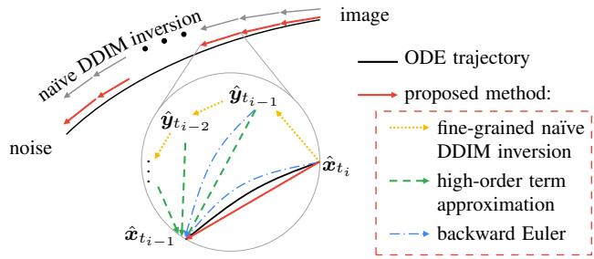  
Figure 1. An abstract of our algorithm for exact inversion of high-order DPM-solvers. Since $\hat { \pmb x } _ { t _ { i - 1 } } , \hat { \pmb x } _ { t _ { i - 2 } } , . . .$ . are needed for high-order terms but unobtainable, we estimate them via the finegrained na¨ıve DDIM inversion $( \hat { \pmb { y } } _ { t _ { i - 1 } } , \hat { \pmb { y } } _ { t _ { i - 2 } } , \dots )$ . Then we use the backward Euler method with high-order term approximation.

Their impact on the overall computation is expected to be relatively small. So we estimate these values $( i . e . ,$ $\pmb { x } _ { t _ { i - 1 } } , \pmb { x } _ { t _ { i - 2 } } , \ldots )$ using a slightly less precise method, such as the na¨ıve DDIM inversion with a finer step size (the yellow lines in Fig. 1). After that, we find $\hat { \ b { x } } _ { t _ { i } }$ by the backward Euler method (the blue lines in Fig. 1), as the highorder terms (Eq. (8)) are treated as constant (the green lines in Fig. 1). Figure 1 shows an abstract of our algorithm for exact inversion of forward linear multistep methods.

To illustrate this with DPM-Solver++(2M) (Eq. (5)), we provide Algorithm 2 (see the supplementary material). Using our key idea, we first obtain $\hat { y } _ { t _ { i - 1 } }$ and $\hat { y } _ { t _ { i - 2 } }$ as substitutes for $\hat { \pmb { x } } _ { t _ { i - 1 } }$ and $\hat { \pmb { x } } _ { t _ { i - 2 } }$ using a fine-grained na¨ıve DDIM inversion. Then we use $\hat { y } _ { t _ { i - 1 } }$ and $\hat { y } _ { t _ { i - 2 } }$ to find $\hat { \mathbf { \mathscr { x } } } _ { t _ { i - 1 } }$ via the backward Euler method with high-order term approximation as follows:

$$
d _ { i } ^ { \prime } \gets z _ { \theta } ( \hat { z } _ { t _ { i - 1 } } , t _ { i - 1 } ) + \underbrace { \frac { z _ { \theta } ( \hat { y } _ { t _ { i - 1 } } , t _ { i - 1 } ) - z _ { \theta } ( \hat { y } _ { t _ { i - 2 } } , t _ { i - 2 } ) } { 2 r _ { i } } } _ { \mathrm { h i g h - o r d e r ~ t e r m ~ a p p r o x i m a t i o n } } ,\tag{9}
$$

where $\begin{array} { r } { r _ { i } = \frac { \lambda _ { t _ { i - 1 } } - \lambda _ { t _ { i - 2 } } } { \lambda _ { t _ { i } } - \lambda _ { t _ { i - 1 } } } } \end{array}$ , and these operations are repeated until convergence is achieved. We employ Algorithm 2 in Sec. 5.1 and 5.2.

## 5. Experiments

## 5.1. Reconstruction

In this subsection, we perform the reconstruction of noise and image to evaluate the exact invertibility of the proposed methods. For simplicity, let ${ \bf { x } } _ { 0 } = \mathrm { D P M } ( { \bf { x } } _ { T } )$ . Let $\mathrm {  ~ \dot { ~ } D P M ^ { \dagger } ~ } : \mathbb { R } ^ { D } \  \ \mathbb { R } ^ { D }$ be the inversion of DPM. Let $\hat { \pmb { x } } _ { T } = \mathrm { D P M } ^ { \dagger } ( { \pmb { x } } _ { 0 } )$ and $\hat { \pmb x } _ { 0 } ~ = ~ \mathrm { D P M } ( \hat { \pmb x } _ { T } )$ Exact inversion of noise refers to ${ \pmb x } _ { T } = \hat { \pmb x } _ { T }$ , and thus, the goal is to minimize $\mathrm { N M S E } ( { \pmb x } _ { T } , \hat { \pmb x } _ { T } ) = \| { \pmb x } _ { T } - \hat { \pmb x } _ { T } \| _ { 2 } ^ { 2 } / \| { \pmb x } _ { T } \| _ { 2 } ^ { 2 }$ . Similarly, exact inversion of the image refers $\mathbf { o } ~ { \pmb x } _ { 0 } = \hat { { \pmb x } } _ { 0 }$ , and the objective is to minimize $\mathrm { N M S E } ( \pmb { x } _ { 0 } , \hat { \pmb { x } } _ { 0 } )$ . For practical utility, we used LDM [26] with the classifier-free guidance $\omega = 3 . 0$ . To evaluate algorithm performance independently, unaffected by decoder inversion or classifier-free guidance, we also use an unconditional pixel-space DPM [31] trained on the ImageNet64 dataset1.

Experimental results show that our Algs. 1 and 2 significantly reduce reconstruction errors than the na¨ıve DDIM inversion, whether it’s for images or noise, DDIM or highorder DPM-solver, or pixel-space DPM or LDM (see Fig. 2 and Fig. 3 for qualitative and quantitative results, respectively). In Fig. 3c, we also show that inversion with FPI (‘AIDI E’ of Pan et al. [21]) exhibits poor performance in noise reconstruction, as we noted in Sec. 4.1.

Some may argue that fine-grained na¨ıve DDIM inversion should perform well as it converges to the diffusion ODE trajectory (i.e., Eq. (2)). However, that is not the case, as DPM-solvers make a discretized trajectory. Even if we make the na¨ıve DDIM inversion finer to closely follow the ODE solution, it cannot further reduce the reconstruction error, as seen in the black lines in Fig. 3. Therefore, we must use implicit methods like our algorithms to address it.

## 5.2. Application: Tree-ring watermark

Wen et al. [36] proposed a new method for watermarking diffusion-generated images. It is invisible to human observers and robust to image manipulations. It works by embedding a watermark into the Fourier transform of the initial noise vector for image generattion. The watermark can be detected by inversion (to recover the initial noise vector) and comparing the Fourier transform to the expected watermark pattern. It can protect the intellectual property of the diffusion model and track diffusion-generated images’ provenance. In Sec. 5.2, we demonstrate that our proposed methods can enhance watermark detection.

In this subsection, we demonstrate the improved detection of watermarks [36] by employing our algorithm, even when the images were generated using high-order DPMsolvers. Furthermore, with improved reconstruction, our algorithm can perform classification as well. We used LDM [26], DPM-Solver++(2M) 10 steps, with classifierfree guidance $\omega = 3 . 0$ to generate images. We embedded three different watermarks as in the first column of Fig. 4. Figure 4 provides qualitative results of watermark detection, where the images were generated with the same prompt and different watermarks. Our Algorithm 2 exhibits the best reconstruction performance.

Figure 5 shows quantitative results of watermark classification, where 100 images were generated for each watermark. The $l _ { 1 }$ norm is used for classification, as same in the detection [36]. Our Algorithm 2 exhibits the best performance in classification, as well as in the reconstruction.

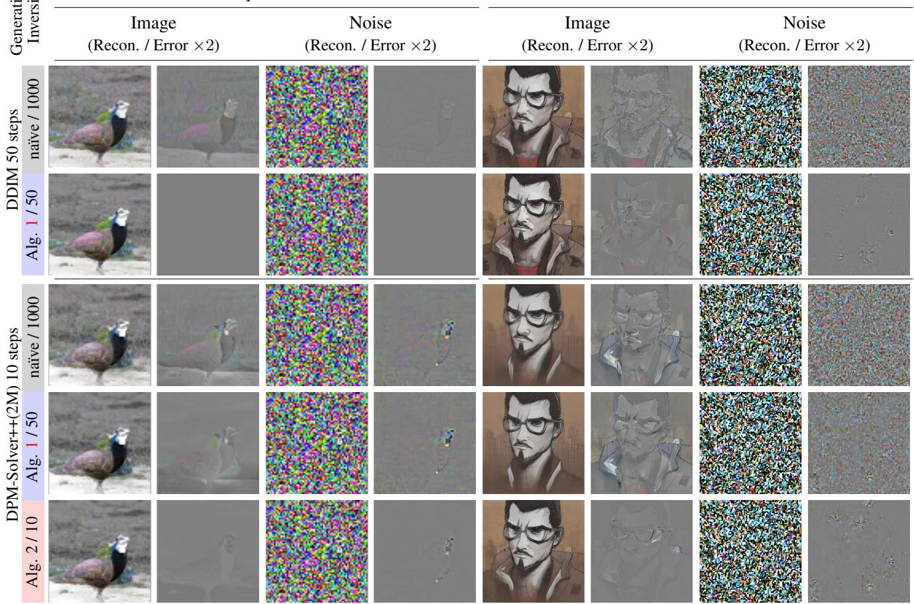  
Figure 2. Our Algs. 1 and 2 significantly reduce reconstruction errors, whether it’s for images or noise, DDIM or high-order DPM-solvers, or pixel-space DPM or LDM. The generation / inversion method varies for each row, e.g., ‘na¨ıve / 1000’ indicates that we performed the na¨ıve DDIM inversion (Eq. (6)) for 1000 steps. ‘Alg. 1 / 50’ and ‘Alg. 2 / 10’ attempt exact inversion with 50 steps of DDIM and 10 steps of DPM-Solver++(2M), respectively. Achieving exact inversion in LDM is challenging due to information loss from the autoencoder and instability caused by a classifier-free guidance of 3.0. Nonetheless, our algorithm produces good results also in LDM.

10 steps, LDM  
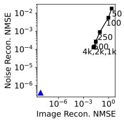  
(a) DDIM 50 steps, Pixel-space DPM

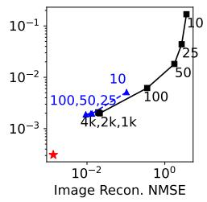

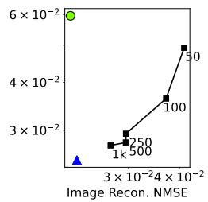  
(c) DDIM 50 steps, LDM

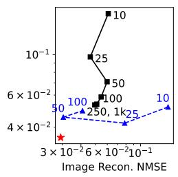  
(d) DPM-Solver++(2M)  
Figure 3. Our algorithms reconstruct better than the na¨ıve DDIM inversion. When the number of steps in the na¨ıve DDIM inversion is increased, the reconstruction error can be reduced, but it becomes saturated (black). Since DPM-solvers are incorrect in the aspects of the diffusion ODE, correcting their errors can further reduce the reconstruction errors. 3a and 3c were generated with DDIM using 50 steps, so Algorithm 1 based on the backward Euler (blue) minimizes the reconstruction errors, while 3b and 3d were generated with DPM-Solver++(2M) using 10 steps, making Algorithm 2, which approximates high-order terms, the best performer (red). Pan et al. [21]’s method using FPI exhibits poor performance on noise reconstruction in 3c, because of its weakness at large classifier-free guidance (> 1).

naïve DDIM inversion fixed point iteration (Pan et al.) backward Euler (ours, Alg. 1) backward Euler w/ high-order term ★ approximation (ours, Alg. 2)

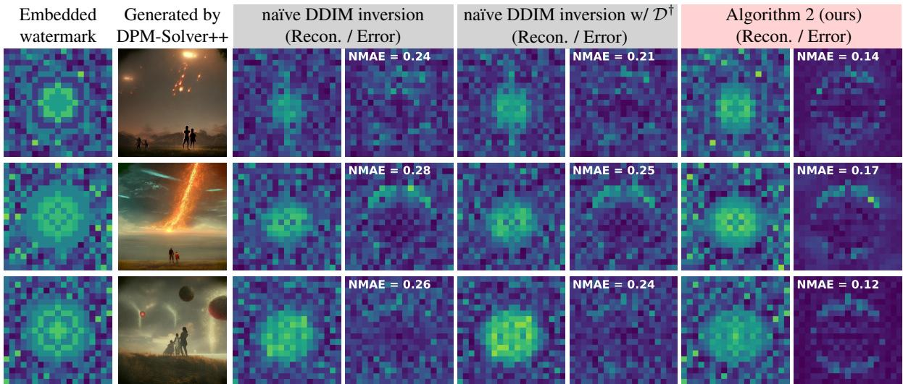  
Figure 4. Our Algorithm 2 enables accurate reconstruction of Tree-ring watermarks [36] in the Fourier space of the initial noise $\scriptstyle ( z _ { T } )$ . The Tree-ring watermark is embedded in the Fourier space of the initial noise in the shape of tree-rings and can be utilized for copyright tracing (column 1). Then, the image is generated starting from the watermarked noise. The practical approach is to accelerate image generation using methods like DPM-Solver++(2M) [15] (column 2). Using Algorithm 2 (columns 7-8) for watermark reconstruction results in lower errors compared to employing na¨ıve DDIM inversion (columns 3-6). We provide NMAE on each error map.

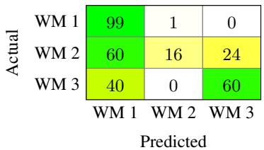  
(a) Na¨ıve DDIM inversion

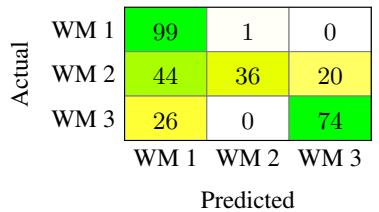  
(b) na¨ıve DDIM inversion w/ D† in Sec. 4.1

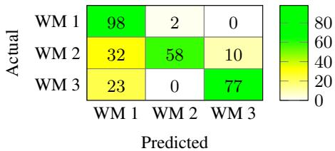  
(c) Algorithm 2 (ours)  
Figure 5. Our algorithm’s strong reconstruction performance allows for the classification of tree-ring watermarks as well. For copyright tracing, it is possible to generate images by embedding different unique watermarks. Three distinct watermarks (WM 1,2, and 3) are displayed in the first column of Fig. 4. In the confusion matrices, ‘Predicted’ corresponds to the watermark with the smallest $l _ { 1 }$ difference among the three watermarks. In Figs. 5a and 5b, the na¨ıve DDIM inversion encounters difficulties in detecting WM 2. In contrast (Fig. 5c), our Algorithm 2 performs well in detecting WM 2.

## 5.3. Application: Background-preserving editing

One of the most common applications is image editing [6, 11, 18, 20]: to manipulate an image based on a new condition while preserving information from the original image. Patashnik et al. [23] proposed methods to localize the variations exclusively on the object while preserving the background. They suggested a prompt-mixing technique that switches the original and new prompt during the denoising process. Additionally, they introduced two localization techniques: self-attention map injection and blending the original latent image with the generated one. These techniques allowed them to utilize the information included in the original latents, the image structure and detailed appearance of the desired region (e.g., background, objects to preserve). In Sec. 5.3, we experimentally demonstrate our proposed methods enable the background-preserving editing, without the need for the original latents.

Here, we experimentally show our Algorithm 1 enables the background-preserving editing proposed by Patashnik et al. [23], even though we don’t know the whole denoising process of the original image (i.e., trajectory, $( z _ { t _ { i } } ) _ { i = 0 } ^ { M } )$ Note that Patashnik et al. [23] employed oracle for the originally generated image, but any DDIM inversion methods (i.e., they knew the trajectory). Figure 6 displays the results of performing background-preserving image editing [23], where the original trajectory $( ( z _ { t _ { i } } ) _ { i = 0 } ^ { M } )$ is estimated using the na¨ıve DDIM inversion and our Algorithm 1. We conducted the same experiment on 60 (original) × 5 (edited) = 300 images as shown in Tab. 3. Note that the classifier-free guidance ω is set to 7.5, demonstrating the robustness of our method.

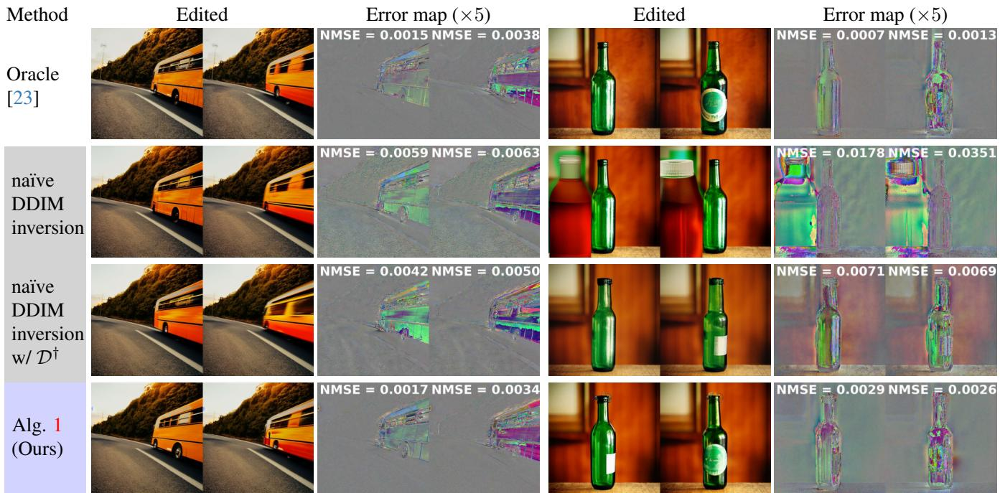  
Figure 6. Our Algorithm 1 enables the preservation of the background and upholds high diversity of editing, even though the image’s original trajectory (i.e., $( z _ { t _ { i } } ) _ { i = 0 } ^ { M } )$ is unknown. The first row (Oracle) shows the result when the entire generating trajectory is provided, while in the subsequent rows, only the generated image (i.e., x0) is given. In the latter cases, we estimate the trajectory through each inversion method and perform editing based on the inversion results. While D† (i.e., decoder inversion) enhances overall performance when employed with the na¨ıve DDIM inversion, using the backward Euler as Algorithm 1 is necessary to achieve background-preserved edits at a level similar to that of the oracle. We provide NMSE of background on each error map.

<table><tr><td rowspan=1 colspan=1>Oracle[23]</td><td rowspan=1 colspan=1>naïve DDIMinversion</td><td rowspan=1 colspan=1>naïve DDIMinversion w/ $\mathcal { D } ^ { \dagger }$ </td><td rowspan=1 colspan=1> $\mathrm { A l g . ~ 1 }$ (ours)</td></tr><tr><td rowspan=1 colspan=1>11.0±1.7</td><td rowspan=1 colspan=1>30.4±4.8</td><td rowspan=1 colspan=1>18.4±2.0</td><td rowspan=1 colspan=1>12.8±2.0</td></tr></table>

Table 3. Average NMSE $( \times 1 0 ^ { - 3 } )$ with 95% confidence interval, on the background-preserving editing experiment.
<table><tr><td rowspan=1 colspan=1>Naïve DDIM inversion</td><td rowspan=1 colspan=1>FPI [21]</td><td rowspan=1 colspan=1>Alg. 1</td><td rowspan=1 colspan=1>Alg. 2</td></tr><tr><td rowspan=1 colspan=1>3 (50 steps) 59 (1000 steps)</td><td rowspan=1 colspan=1>32</td><td rowspan=1 colspan=1>79</td><td rowspan=1 colspan=1>159</td></tr></table>

Table 4. Average runtime of various inversion algorithms in LDM including our Alg. 1 and 2 (in second).

## 6. Conclusion

We have presented exact inversion methods of DPMsolvers, to seek the initial noise of generated images. Our methods work by the backward Euler implemented with gradient descent or the forward step method, which is robust to large classifier-free guidance. For the inversion of highorder DPM-solvers, we approximate high-order terms using the na¨ıve DDIM inversion. Our method can be applied to various applications, such as watermark detection and the background-preserving editing. Our method is widely applicable to standard DPMs, thus can encourage to create new DPM applications where exact inversion is essential.

Limitations The proposed method comes with a significantly larger computational time compared to na¨ıve DDIM inversion, as shown in Tab. 4. Additionally, it assumes prior knowledge of the prompt in the case of LDMs. Although we tried to find ‘exact’ inversion $( \mathrm { N M S E } < 1 0 ^ { - 6 }$ in Fig. 3a), exactnesses were not perfect on accelerated schedulers (Fig. 3b) or in LDMs (Figs. 3c and 3d). In those cases, our method should be referred to as ‘near exact inversion rather than ‘exact inversion’. Lastly, estimating the prompt and initial noise jointly is left as future work.

Acknowledgements This work was supported by the New Faculty Startup Fund from Seoul National University, Institute of Information & communications Technology Planning & Evaluation (IITP) grant funded by the Korea government(MSIT) [NO.2021-0-01343, Artificial Intelligence Graduate School Program (Seoul National University)], National Research Foundation of Korea (NRF) grants funded by the Korea government (MSIT) (NRF-2022R1A4A1030579, NRF-2022M3C1A309202211). The authors acknowledged the financial support from the BK21 FOUR program of the Education and Research Program for Future ICT Pioneers, Seoul National University.

## References

[1] Rameen Abdal, Yipeng Qin, and Peter Wonka. Image2StyleGAN: How to embed images into the stylegan latent space? In ICCV, pages 4432–4441, 2019. 4

[2] Rameen Abdal, Yipeng Qin, and Peter Wonka. Image2StyleGAN++: How to edit the embedded images? In CVPR, pages 8296–8305, 2020.

[3] Ashish Bora, Ajil Jalal, Eric Price, and Alexandros G Dimakis. Compressed sensing using generative models. In ICML, 2017. 4

[4] Weixin Chen, Dawn Song, and Bo Li. TrojDiff: Trojan attacks on diffusion models with diverse targets. In CVPR, pages 4035–4044, 2023. 1, 3

[5] Prafulla Dhariwal and Alexander Nichol. Diffusion models beat GANs on image synthesis. NeurIPS, 34:8780–8794, 2021. 2

[6] Amir Hertz, Ron Mokady, Jay Tenenbaum, Kfir Aberman, Yael Pritch, and Daniel Cohen-or. Prompt-to-prompt image editing with cross-attention control. In ICLR, 2023. 1, 2, 4, 7

[7] Jonathan Ho and Tim Salimans. Classifier-free diffusion guidance. In NeurIPS 2021 Workshop on Deep Generative Models and Downstream Applications, 2021. 1, 2

[8] Jonathan Ho, Ajay Jain, and Pieter Abbeel. Denoising diffusion probabilistic models. NeurIPS, 33:6840–6851, 2020. 1, 2

[9] Marlis Hochbruck and Alexander Ostermann. Exponential integrators. Acta Numerica, 19:209–286, 2010. 3

[10] Bahjat Kawar, Michael Elad, Stefano Ermon, and Jiaming Song. Denoising diffusion restoration models. NeurIPS, 35: 23593–23606, 2022. 1, 3

[11] Gwanghyun Kim, Taesung Kwon, and Jong Chul Ye. Diffusionclip: Text-guided diffusion models for robust image manipulation. In CVPR, pages 2426–2435, 2022. 1, 2, 4, 7

[12] Diederik Kingma, Tim Salimans, Ben Poole, and Jonathan Ho. Variational diffusion models. NeurIPS, 34:21696– 21707, 2021. 3

[13] Haoying Li, Yifan Yang, Meng Chang, Shiqi Chen, Huajun Feng, Zhihai Xu, Qi Li, and Yueting Chen. SRDiff: Single image super-resolution with diffusion probabilistic models. Neurocomputing, 479:47–59, 2022. 1, 2

[14] Cheng Lu, Yuhao Zhou, Fan Bao, Jianfei Chen, Chongxuan Li, and Jun Zhu. DPM-Solver: A fast ODE solver for diffusion probabilistic model sampling in around 10 steps. NeurIPS, 35:5775–5787, 2022. 1, 2, 3

[15] Cheng Lu, Yuhao Zhou, Fan Bao, Jianfei Chen, Chongxuan Li, and Jun Zhu. DPM-Solver++: Fast solver for guided sampling of diffusion probabilistic models. arXiv:2211.01095, 2022. 1, 2, 3, 7

[16] Andreas Lugmayr, Martin Danelljan, Andres Romero, Fisher Yu, Radu Timofte, and Luc Van Gool. RePaint: Inpainting using denoising diffusion probabilistic models. In CVPR, pages 11461–11471, 2022. 1, 2

[17] Zhaoyang Lyu, Xudong Xu, Ceyuan Yang, Dahua Lin, and Bo Dai. Accelerating diffusion models via early stop of the diffusion process. arXiv:2205.12524, 2022. 1, 2

[18] Chenlin Meng, Yutong He, Yang Song, Jiaming Song, Jiajun Wu, Jun-Yan Zhu, and Stefano Ermon. SDEdit: Guided image synthesis and editing with stochastic differential equations. In ICLR, 2022. 7

[19] Chenlin Meng, Robin Rombach, Ruiqi Gao, Diederik Kingma, Stefano Ermon, Jonathan Ho, and Tim Salimans. On distillation of guided diffusion models. In CVPR, pages 14297–14306, 2023. 1, 2

[20] Alex Nichol, Prafulla Dhariwal, Aditya Ramesh, Pranav Shyam, Pamela Mishkin, Bob McGrew, Ilya Sutskever, and Mark Chen. GLIDE: Towards photorealistic image generation and editing with text-guided diffusion models. arXiv:2112.10741, 2021. 7

[21] Zhihong Pan, Riccardo Gherardi, Xiufeng Xie, and Stephen Huang. Effective real image editing with accelerated iterative diffusion inversion. In ICCV, pages 15912–15921, 2023. 2, 3, 4, 5, 6, 8

[22] George Papamakarios, Eric T Nalisnick, Danilo Jimenez Rezende, Shakir Mohamed, and Balaji Lakshminarayanan. Normalizing flows for probabilistic modeling and inference. Journal of Machine Learning Research, 22(57):1–64, 2021. 2

[23] Or Patashnik, Daniel Garibi, Idan Azuri, Hadar Averbuch-Elor, and Daniel Cohen-Or. Localizing object-level shape variations with text-to-image diffusion models. In ICCV, 2023. 1, 2, 7, 8

[24] Aditya Ramesh, Prafulla Dhariwal, Alex Nichol, Casey Chu, and Mark Chen. Hierarchical text-conditional image generation with CLIP latents. arXiv:2204.06125, 2022. 1, 2

[25] Danilo Rezende and Shakir Mohamed. Variational inference with normalizing flows. In ICML, pages 1530–1538, 2015. 2

[26] Robin Rombach, Andreas Blattmann, Dominik Lorenz, Patrick Esser, and Bjorn Ommer. High-resolution image syn-¨ thesis with latent diffusion models. In CVPR, pages 10684– 10695, 2022. 1, 2, 5

[27] Nataniel Ruiz, Yuanzhen Li, Varun Jampani, Yael Pritch, Michael Rubinstein, and Kfir Aberman. DreamBooth: Fine tuning text-to-image diffusion models for subject-driven generation. In CVPR, pages 22500–22510, 2023. 1, 2

[28] Ernest K Ryu and Wotao Yin. Large-scale convex optimization: algorithms & analyses via monotone operators. Cambridge University Press, 2022. 4

[29] Tim Salimans and Jonathan Ho. Progressive distillation for fast sampling of diffusion models. In ICLR, 2022. 1, 2

[30] Bowen Song, Soo Min Kwon, Zecheng Zhang, Xinyu Hu, Qing Qu, and Liyue Shen. Solving inverse problems with latent diffusion models via hard data consistency. arXiv preprint arXiv:2307.08123, 2023. 2

[31] Jiaming Song, Chenlin Meng, and Stefano Ermon. Denoising diffusion implicit models. In ICLR, 2021. 1, 2, 3, 5

[32] Yang Song and Stefano Ermon. Improved techniques for training score-based generative models. NeurIPS, 33:12438– 12448, 2020. 1, 2

[33] Xuan Su, Jiaming Song, Chenlin Meng, and Stefano Ermon. Dual diffusion implicit bridges for image-to-image translation. In ICLR, 2023. 1, 3

[34] Bram Wallace, Akash Gokul, and Nikhil Naik. EDICT: Exact Diffusion Inversion via Coupled Transformations. In CVPR, pages 22532–22541, 2023. 1, 2, 3, 4

[35] Tengfei Wang, Yong Zhang, Yanbo Fan, Jue Wang, and Qifeng Chen. High-fidelity GAN inversion for image attribute editing. In CVPR, pages 11379–11388, 2022. 2

[36] Yuxin Wen, John Kirchenbauer, Jonas Geiping, and Tom Goldstein. Tree-Ring Watermarks: Fingerprints for diffusion images that are invisible and robust. arXiv:2305.20030, 2023. 1, 2, 3, 5, 7

[37] Jay Whang, Erik Lindgren, and Alex Dimakis. Composing normalizing flows for inverse problems. In ICML, pages 11158–11169, 2021. 2

[38] Weihao Xia, Yulun Zhang, Yujiu Yang, Jing-Hao Xue, Bolei Zhou, and Ming-Hsuan Yang. GAN Inversion: A survey. IEEE TPAMI, 45(3):3121–3138, 2022. 2, 4

[39] Zhisheng Xiao, Karsten Kreis, and Arash Vahdat. Tackling the generative learning trilemma with denoising diffusion gans. In ICLR, 2021. 1, 2

[40] Guoqiang Zhang, Jonathan P Lewis, and W Bastiaan Kleijn. Exact diffusion inversion via bi-directional integration approximation. arXiv:2307.10829, 2023. 2, 3

[41] Qinsheng Zhang and Yongxin Chen. Fast sampling of diffusion models with exponential integrator. In NeurIPS 2022 Workshop on Score-Based Methods, 2022. 3

[42] Yuxin Zhang, Nisha Huang, Fan Tang, Haibin Huang, Chongyang Ma, Weiming Dong, and Changsheng Xu. Inversion-based style transfer with diffusion models. In CVPR, pages 10146–10156, 2023. 1, 3

[43] Hongkai Zheng, Weili Nie, Arash Vahdat, Kamyar Azizzadenesheli, and Anima Anandkumar. Fast sampling of diffusion models via operator learning. In ICML, pages 42390– 42402, 2023. 1, 2

[44] Jiapeng Zhu, Yujun Shen, Deli Zhao, and Bolei Zhou. Indomain GAN inversion for real image editing. In ECCV, pages 592–608, 2020. 2