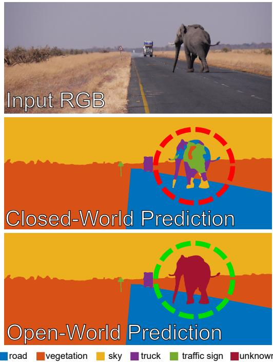
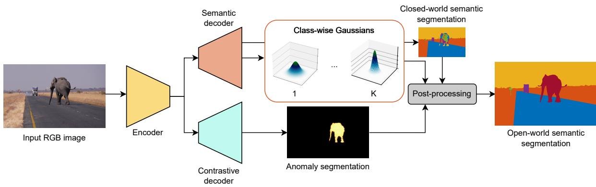
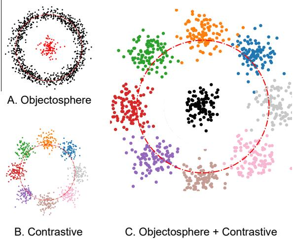
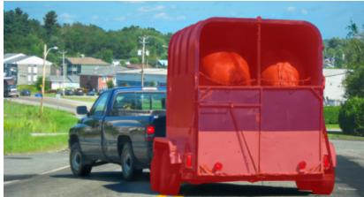
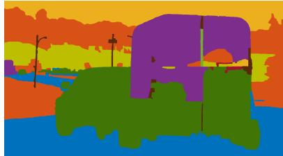
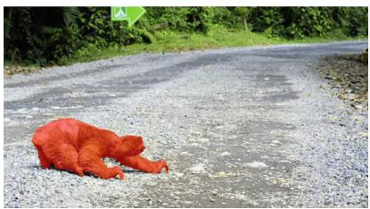
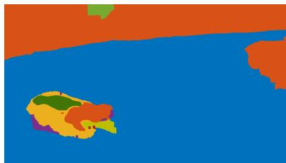

# Open-World Semantic Segmentation Including Class Similarity

Matteo Sodano1 Federico Magistri1 Lucas Nunes1 Jens Behley1 Cyrill Stachniss1,2 1Center for Robotics, University of Bonn 2Lamarr Institute for Machine Learning and Artificial Intelligence {firstname.lastname}@igg.uni-bonn.de

## Abstract

Interpreting camera data is key for autonomously acting systems, such as autonomous vehicles. Vision systems that operate in real-world environments must be able to understand their surroundings and need the ability to deal with novel situations. This paper tackles open-world semantic segmentation, i.e., the variant of interpreting image data in which objects occur that have not been seen during training. We propose a novel approach that performs accurate closed-world semantic segmentation and, at the same time, can identify new categories without requiring any additional training data. Our approach1 additionally provides a similarity measure for every newly discovered class in an image to a known category, which can be useful information in downstream tasks such as planning or mapping. Through extensive experiments, we show that our model achieves state-of-the-art results on classes knownfrom training data as well as for anomaly segmentation and can distinguish between different unknown classes.

## 1. Introduction

Autonomous systems need to understand their surroundings to operate robustly. To this end, semantic scene understanding based on sensor data is key and numerous variants exist, such as object detection [17, 49], semantic and instance segmentation [37, 39, 64], and panoptic segmentation [27, 28]. Over the last decade, we witnessed tremendous progress in scene interpretation for autonomous vehicles using machine learning. A central challenge for most learning-based systems is scenes in which novel and previously unseen objects occur. Such open-world settings, i.e., the fact that not everything can be covered in the training data, have to be considered when building vision systems for human-centered environments and real-world settings. For example, autonomous cars in cities will eventually experience situations or objects they have not seen before. They should be able to identify them, for example, to change into a more conservative mode of operation.

Today, high-quality datasets such as Cityscapes [13] or

  
Figure 1. Given an image containing a previously-unseen object (top), closed-world methods for semantic segmentation classify the pixels belonging to that object as one of the known classes (center, red circle). Our goal is to segment the unknown object and identify it as a semantic class different to the previously-known ones (bottom, green circle).

MS COCO [32] allow deep learning methods to achieve outstanding performance in closed-world scene understanding tasks. A prominent task is semantic segmentation [18], which aims to assign a semantic category to each pixel in an image. Systems operating under the closed-world assumption [53] typically cannot correctly recognize an object that belongs to none of the known categories. Often, they tend to be overconfident and assign such an object to one of the known classes. We believe that for applications targeting reliability and robustness under varying conditions, the closed-world assumption has to be relaxed, and we need to move towards open-world setups. Additionally, a measure of class similarity can help downstream tasks. For example, predicting that an area of the image is unknown but similar to the class car or another type of moving vehicle can be used in planning or tracking to estimate the motion of the object, or in mapping to discard that class from the map.

This paper investigates the problem of open-world semantic segmentation. Given an image at test time, we aim to have a model that is able to detect any pixel that belongs to a category that was unseen at training time and is also able to distinguish between different new categories. The first problem is called anomaly segmentation [9] and aims to achieve a binary segmentation between known and unknown. The second problem, called novel class discovery [20], aims to obtain a pixel-wise classification of novel samples into different classes starting from the knowledge of previously seen, labeled samples. We aim to investigate how to solve both tasks jointly in a neural network setting. We extend best-practice approaches for anomaly detection for classification tasks [2, 15, 66] and provide compelling results for both, anomaly segmentation and novel class discovery. See Fig. 1 for an example of the targeted output.

The main contribution of this paper is a novel approach for open-world segmentation based on an encoder-decoder convolutional neural network (CNN). We propose a new method that simultaneously performs accurate closed-world semantic segmentation while constraining all known classes towards their learned feature descriptor, thanks to a loss function we introduce. We combine operations on the feature space with binary anomaly segmentation that allows us to distinguish between different novel classes and provide a measure of similarity for every newly discovered class to a known category. We implemented and thoroughly tested our approach. In sum, our contributions are the following:

• A fully-convolutional neural network that achieves stateof-the-art performance on anomaly segmentation while providing compelling closed-world performance.

• A loss function that allows us to distinguish among different novel classes, and to provide a similarity score for each novel class to the known categories.

• Extensive experiments on multiple datasets, including the public benchmark SegmentMeIfYouCan, where we rank first in three out of five metrics.

## 2. Related Work

Semantic segmentation under closed-world settings achieved outstanding performances in different domains, such as autonomous driving [7, 40, 42, 62], indoor navigation [24, 30, 56], or agricultural robotics [12, 41, 50, 63]. However, the closed-world assumption should be relaxed when developing systems for navigating in the wild. In such cases, we need to move towards open-world setups.

Anomaly Detection and Classification. The openworld setting was initially explored for classification, where anomalous samples had to be recognized and discarded. This problem was tackled in different ways in the literature. Simple strategies such as thresholding the softmax activations [8, 22], using a background class for tackling unknown samples [6, 43, 60], and using model ensembles [31, 61] represent a solid starting point in theory. In practice, however, closed-world predictions tend to be overconfident by showing a peak in the softmax even for unknown samples [45, 58]. Additionally, it is impossible to train with all possible examples of unknown objects. To deal with this, modifications to the softmax layer have been proposed [2]. Other approaches rely on maximizing the entropy [15] or on energy scores [35], which are supposedly less susceptible to the aforementioned overconfidence issue. Even though these approaches can be easily adapted to the segmentation problem, they are limited in the sense that they rely on the output of the CNN to be “uncertainty-aware” to some extent, in order to be able to modify the scores, consider the output entropies, or similar.

In contrast, we operate on the feature space of the semantic segmentation to not only classify pixels correctly but also match their feature to a unique class descriptor, in order to use the distance from it as a measure of “unknown-ness”.

Open-World Segmentation. Open-world or anomaly segmentation extends the anomaly detection task by trying to predict whether each individual pixel in an image is an anomaly or not. Some methods rely on the estimation of the uncertainty on the prediction with Bayesian deep learning [16, 31, 54], or on the gradient [34, 38]. Other works use an additional dataset for out-of-distribution samples, in order to help the CNN recognize categories that do not belong to the standard training set [5, 10]. Recently, generative models have also been used, since in the reconstruction phase they will accurately resynthesize only the known areas, while unknown objects will suffer from a lower reconstruction quality, and can be recognized by looking at the most dissimilar areas between the input and the output [29, 33, 71]. Due to the limitation of available training data, many unsupervised approaches use synthetic anomaly data and train an anomaly detector which is either distancebased [36, 52, 59] or reconstruction-based [3, 67, 69], with the latter sharing the same concept as the generative models mentioned above. Vision-language models based on CLIP [47, 48, 72] are also gaining interest in the context of anomaly segmentation [25]. Lately, a lot of research interest is also going in the direction of anomaly segmentation in video streams because of its application in intelligent surveillance systems [57, 65, 68].

Differently from these approaches, we do not require additional data for training and do not rely on uncertainty estimation or generative models. In contrast, by operating on the feature space of the semantic segmentation task, we can define a distinct region for known and unknown classes. Furthermore, we leverage the feature descriptors of the known classes to recognize different unknown classes and find the most similar known class.

  
Figure 2. Given an RGB image as input, our network processes it by means of an encoder and two decoders. The semantic decoder produces a closed-world semantic segmentation and a Gaussian model for each known category. The class Gaussian models are built from a learned class descriptor (mean) and the variance of all predictions from it. A 3D example is shown in the image. The contrastive decoder provides an anomaly segmentation output. A post-processing phase finally achieves open-world semantic segmentation.

## 3. Our Approach

In this work, we tackle the problem of open-world semantic segmentation. In addition to handling known classes, we are particularly interested in segmenting all anomalous areas in an image, where previously unseen objects appear, and in differentiating between potentially multiple novel classes. We propose an approach (see Fig. 2) based on a convolutional neural network with one encoder and two decoders. The first decoder tackles semantic segmentation and operates on the feature space so that, for each class, features of pixels belonging to the same class are pushed together. The mean and variance of each individual class descriptor are stored representing Gaussian distributions that describe known classes. The second decoder performs binary anomaly segmentation. Results are finally merged to obtain open-world semantic segmentation, i.e. anomaly segmentation and novel class discovery.

## 3.1. General Network Architecture

Our network for open-world semantic segmentation is composed of one encoder and two decoders. We use a ResNet34 [21] encoder, where the basic ResNet block is replaced with the NonBottleneck-1D block [51], which allows a more lightweight architecture since all $3 \times 3$ convolutions are replaced by a sequence of 3 × 1 and $1 \times 3$ convolutions with a ReLU in between. For open-world segmentation, contextual information is valuable. Therefore, we expand the limited receptive field of ResNet by incorporating contextual information using a pyramid pooling module [70] after the encoding part. The features produced will be fed to two separate decoders, that share the same structural properties. In order to preserve the lightweight nature of the network, we use three SwiftNet modules [46] where we incorporate NonBottleneck-1D blocks, and two final upsampling modules based on nearest-neighbor and depth-wise convolutions, which reduce the computational load. We use encoder-decoder skip connections after each downsampling stage of the encoder to directly propagate more fine-grained features to the decoder.

## 3.2. Approach for Open-World Segmentation

Our approach for open-world segmentation builds upon the structure of the CNN we developed, and it exploits the double-decoder architecture for providing accurate segmentation of unknown regions. The first decoder, which we call “semantic decoder” in the following, targets semantic segmentation. We additionally manipulate the feature space to create a unique distinct descriptor for each known class. Our goal is to obtain a correct semantic segmentation for the known classes, but also produce pre-softmax features that are similar to the descriptor for each pixel of a certain class. In this way, we aim to detect as unknown classes all pixels whose feature vectors are substantially different from the descriptor of the class they have been assigned to. The second decoder, which we call “contrastive decoder” in the following, leverages the contrastive loss [11] and objectosphere loss [15] together, to place all features of known classes on the surface of a hypersphere while pushing the ones of unknown classes towards its center. In this way, the second decoder provides an anomaly segmentation, where the anomalous regions correspond to previously unseen classes. The two results are finally merged using an automated post-processing operation to obtain the final open-world segmentation.

In the following, we call $\Omega \ = \ \{ ( 1 , 1 ) , \ldots , ( H , W ) \}$ the set of pixels in the image, $Y ~ \in ~ \{ 1 , \dots , K \} ^ { H \times W }$ the ground truth mask, and $\hat { Y } \in \mathsf { \bar { \{ 1 , \ldots , K \} } } ^ { H \times W }$ the predicted mask, where 𝐻 and 𝑊 are the dimensions of the input image. Additionally, we denote with $\Omega _ { k } = \{ p \in \Omega \mid Y _ { p } = k \}$ the set of pixels whose ground truth label is 𝑘, and with $\hat { \Omega } _ { k } = \{ p \in \Omega \mid \hat { Y } _ { p } = Y _ { p } \}$ the set of pixels that are true positives for class $k , i . e .$ ., the set of pixels whose ground truth label and predicted label are 𝑘. Finally, the square of a vector refers to the element-wise operation (Hadamard product):

$$
\boldsymbol { \nu } ^ { 2 } = \left[ \nu _ { 1 } ^ { 2 } , \ldots , \nu _ { n } ^ { 2 } \right] ^ { \intercal }\tag{1}
$$

Semantic Decoder. The aim of semantic segmentation is to predict a categorical distribution over 𝐾 classes for all pixels in an image. We follow best practice and optimize it with the weighted cross-entropy loss

$$
\mathcal { L } _ { \mathrm { { s e m } } } = - \frac { 1 } { | \Omega | } \sum _ { p \in \Omega } \omega _ { k } t _ { p } ^ { \top } \log \big ( \sigma ( \boldsymbol { f } _ { p } ) \big ) ,\tag{2}
$$

where $\omega _ { k }$ is a class-wise weight computed via the inverse frequency of each class in the dataset, $\pmb { t } ~ \in ~ \mathbb { R } ^ { H \times W \times K }$ is a one-hot encoded pixel-wise ground truth label, ${ \pmb t } _ { p } ~ \in \mathbb { R } ^ { K }$ is a one-hot encoded pixel-wise ground truth label at pixel $p \in \Omega , \sigma$ indicates the softmax operation, and $f _ { p }$ denotes the pre-softmax feature predicted for pixel $p .$

As mentioned above, we do not only want to perform standard semantic segmentation but also build a class descriptor to bring all pixels belonging to a certain class towards a certain region in the feature space. To achieve this, we accumulate the pre-softmax features, also called activation vectors, of all true positives for each class, where a true positive is a pixel that is correctly segmented. With this, we can store a running average class prototype, or mean activation vector, $\pmb { \mu } _ { k } \in \bar { \mathbb { R } } ^ { K }$ for each class $k \in \{ 1 , \ldots , K \}$

$$
\pmb { \mu } _ { k } = \frac { 1 } { | \hat { \Omega } _ { k } | } \sum _ { p \in \hat { \Omega } _ { k } } \pmb { f } _ { p } .\tag{3}
$$

We also iteratively compute the per-class variance ${ \sigma _ { k } ^ { 2 } \in \mathbb { R } ^ { K } }$ via sum of squares, as

$$
\pmb { \sigma } _ { k } ^ { 2 } = \frac { 1 } { | \hat { \Omega } _ { k } | } \sum _ { p \in \hat { \Omega } _ { k } } \left( \pmb { f } _ { p } - \pmb { \mu } _ { k } \right) ^ { 2 } .\tag{4}
$$

At the beginning of epoch 𝑒, we have the means $\pmb { \mu } _ { k } ^ { e - 1 }$ and variances $\sigma _ { k } ^ { e - 1 }$ accumulated in the previous epoch. At epoch 𝑒, we can steer the semantic segmentation to predict, for each pixel with ground truth class $k ,$ a feature vector equal to $\pmb { \mu } _ { k } ^ { e - 1 }$ . For this, we introduce a feature loss function

$$
\mathcal { L } _ { \mathrm { f e a t } } = \frac { 1 } { | \Omega | } \sum _ { k = 1 } ^ { K } \sum _ { p \in \Omega _ { k } } \frac { \| f _ { p } - \mu _ { k } ^ { e - 1 } \| } { \pmb { \sigma } _ { k } ^ { e - 1 } } .\tag{5}
$$

This loss function is not active during the first epoch since there is no accumulated mean yet. Thus, we perform standard semantic segmentation during the first epoch.

The semantic decoder is thus optimized with a weighted sum of the loss functions introduced above

$$
\begin{array} { r } { \mathcal { L } _ { \mathrm { s d e c } } = w _ { 1 } \mathcal { L } _ { \mathrm { s e m } } + w _ { 2 } \mathcal { L } _ { \mathrm { f e a t } } . } \end{array}\tag{6}
$$

  
Figure 3. 2D visualization of the expected output of the contrastive decoder. The behavior of the objectosphere loss is shown in A, where all points coming from known classes (black) lie around the red (outer) circle of radius 𝜉, see Eq. (9), and the points from unknown classes lie around the origin. The contrastive loss is shown in B, where features lie on the unit circle. Together, they lead to a behavior similar to the one depicted in C.

Contrastive Decoder. The contrastive decoder explicitly aims for anomaly segmentation. Given an image of dimensions $H \times W$ , where known and unknown classes are present, the goal of the contrastive decoder is to provide the basis for a binary prediction where 0 corresponds to known classes and 1 to unknown classes. We achieve this by means of a combination between the contrastive loss [11] and the objectosphere loss [15]. First, we compute the mean feature representation $\overline { { f } } _ { k }$ for class 𝑘 in the current image as

$$
\overline { { \pmb { f } } } _ { k } = \frac { 1 } { | \Omega _ { k } | } \sum _ { p \in \Omega _ { k } } { f _ { p } ^ { d } } ,\tag{7}
$$

where $\boldsymbol { f } _ { p } ^ { d }$ is the feature predicted at pixel $p$ from the contrastive decoder (the equivalent of $f _ { p }$ for the semantic one). Then, we compute the contrastive loss ${ \mathcal { L } } _ { \mathrm { c o n t } }$ such that $\overline { { f } } _ { k }$ approximates the normalized mean representation $\bar { \pmb { \mu } } _ { k } ^ { e - 1 }$ of the corresponding class in the previous epoch $\pmb { \mu } _ { k } ^ { e - 1 }$ and gets dissimilar from the other classes mean representation:

$$
\mathcal { L } _ { \mathrm { c o n t } } = - \sum _ { k = 1 } ^ { K } \log \frac { \exp { ( \overline { { \pmb { f } } } _ { k } ^ { \intercal } \bar { \pmb { \mu } } _ { k } ^ { e - 1 } / \tau ) } } { \sum _ { i = 1 } ^ { K } \exp { ( \overline { { \pmb { f } } } _ { k } ^ { \intercal } \bar { \pmb { \mu } } _ { i } ^ { e - 1 } / \tau ) } } ,\tag{8}
$$

where 𝜏 is a temperature parameter. This way, the loss aims to make the features from the same class consistent with its running mean representation $\pmb { \mu } _ { k } ^ { e - 1 }$ , while scattering all 𝐾 classes around the unit hypersphere.

At the same time, we use the objectosphere loss $\mathcal { L } _ { \mathrm { o b j } }$

over each pixel $p \in \Omega$ given by

$$
\mathcal { L } _ { \mathrm { o b j } } = \left\{ \begin{array} { c l } { \operatorname* { m a x } \big ( \xi - \| f _ { p } \| ^ { 2 } , 0 \big ) } & { , \mathrm { i f } p \in \mathcal { D } _ { k } } \\ { \| f _ { p } \| ^ { 2 } } & { , \mathrm { o t h e r w i s e } } \end{array} \right. ,\tag{9}
$$

where $\mathcal { D } _ { k }$ is the set of pixels belonging to known classes. The remaining pixels, at training time, reduce to the unlabeled (void) areas of the image. This aims to make the norm of the feature vector $\| f _ { p } \|$ of pixels belonging to known classes $\mathcal { D } _ { k }$ bigger than a threshold $\xi ,$ while the norm of the features of pixels belonging to unknown classes $\mathcal { D } _ { u }$ gets reduced to 0. These two loss functions ${ \mathcal { L } } _ { \mathrm { c o n t } }$ and $\mathcal { L } _ { \mathrm { o b j } }$ together allows us to optimize towards a situation where the feature vectors of known classes are distributed along the surface of the 𝐾-dimensional hypersphere of radius $\xi ,$ while the feature vectors of unknown classes gets squashed to 0. A 2D example of the expected behavior is shown in Fig. 3.

The contrastive decoder is optimized with a weighted sum of the two losses given by

$$
{ \mathcal { L } } _ { \mathrm { c d e c } } = w _ { 3 } { \mathcal { L } } _ { \mathrm { c o n t } } + w _ { 4 } { \mathcal { L } } _ { \mathrm { o b j } } .\tag{10}
$$

Post-Processing for Anomaly Segmentation. To obtain the open-world predictions at test time, we fuse the outputs of the two decoders. The semantic encoder provides a standard closed-world semantic segmentation but, thanks to the loss function that operates directly on the feature space that we introduced, we can obtain an open-world segmentation. In fact, we computed mean $\pmb { \mu } _ { k } \in \mathbb { R } ^ { \bar { K } }$ and variance ${ \sigma _ { k } ^ { 2 } \in \mathbb { R } ^ { K } }$ of each class, meaning that, for each class, we can easily build a multi-variate normal distribution $N ( \boldsymbol { \mu } _ { k } , \pmb { \Sigma } _ { k } )$ , where $\pmb { \mu } _ { k }$ is the mean, and $\Sigma _ { k } = \mathrm { d i a g } ( \sigma _ { k } ^ { 2 } )$ is the covariance matrix, which reduces to the diagonalization of the variance $\sigma _ { k } ^ { 2 }$ under the assumption that all classes are independent. $\operatorname { A f } -$ ter building the Gaussian model of each class in the dataset, given a pixel 𝑝 whose predicted feature $f _ { p }$ would correspond to class $k , \forall k$ , we compute a fitting score by means of the squared exponential kernel

$$
s _ { k } ( { f } _ { p } ) = \exp \Bigg ( - \frac { 1 } { 2 } ( f _ { p } - \pmb { \mu } _ { k } ) ^ { \top } \pmb { \Sigma } _ { k } ^ { - 1 } ( f _ { p } - \pmb { \mu } _ { k } ) \Bigg ) .\tag{11}
$$

Then, for each pixel, we take the highest score

$$
s ( \boldsymbol { p } ) = \operatorname* { m a x } _ { k } s _ { k } ( \boldsymbol { f } _ { p } ) ,\tag{12}
$$

and, if it is low, then the pixel of interest is in the tail of the Gaussian, and is considered as a novel class, leading to an open-world prediction $\mathcal { U } _ { \mathrm { s e m } }$ of the semantic decoder. We can obtain a pixel-wise score $s _ { \mathrm { u n k } , p } ^ { \mathrm { s e m } }$ for being unknown $s _ { \mathrm { u n k } , p } ^ { \mathrm { s e m } } = 1 - s ( p )$

The contrastive decoder leads to a second open-world prediction ${ \mathcal { U } } _ { \mathrm { c o n t } }$ by considering as unknown all pixels whose feature norm is below a certain threshold. In particular, we can obtain a pixel-wise score $s _ { \mathrm { u n k } , p } ^ { \mathrm { c o n t } }$ for being unknown

$$
s _ { \mathrm { u n k } , p } ^ { \mathrm { c o n t } } = \operatorname* { m a x } { \left( 0 , \left( 1 - \frac { \| f _ { p } \| ^ { 2 } } { \xi } \right) \right) } ,\tag{13}
$$

where $f _ { p }$ is the predicted feature at pixel $p .$ This score is 1 when the norm of the feature vector is 0, and 0 when the norm is bigger than $\xi ,$ as described in Eq. (9).

Finally, we fuse the two predictions to obtain a cumulative pixel-wise score for being unknown as

$$
s _ { \mathrm { u n k } , p } = \frac { 1 } { 2 } \left( s _ { \mathrm { u n k } , p } ^ { \mathrm { s e m } } + s _ { \mathrm { u n k } , p } ^ { \mathrm { c o n t } } \right) .\tag{14}
$$

If $s _ { \mathrm { u n k } , p }$ is above a threshold $\delta ,$ the pixel is considered belonging to an unknown class.

Post-Processing for Open-World Semantic Segmentation. When a pixel is considered unknown, we need to store its activation vector and decide whether it belongs to an already-discovered class or a new one. Given the set of mean activation vectors for 𝐺 unknown classes discovered so far $\mathcal { F } = \{ f _ { u } ^ { 1 } , \ldots , f _ { u } ^ { G } \}$ , we take the vector $f _ { u } ^ { g }$ that minimizes the distance from the querying vector. If the distance between $f _ { u } ^ { g }$ and $f _ { p }$ is below a threshold $\eta ,$ then the pixel belongs to this class, and the mean activation vector gets updated, otherwise it creates a new unknown class $f _ { u } ^ { g + 1 }$ This allows us to have a virtually unlimited number of novel classes.

## 3.3. Class Similarity

As a byproduct of the open-world segmentation, our method can also predict the most similar known category for each unknown sample. As explained in Sec. 3.2, it does not suffice for a feature vector to have the highest activation in the 𝑘-th spot for being matched to class 𝑘. A sample can have the highest activation for a certain class 𝑘 but its score computed with Eq. (11) is higher for another class $\tilde { k } \ne k$ meaning that the sample is more inside the area of influence of class ˜𝑘 despite having a higher activation on class 𝑘. As the most similar class, we propose to choose the one that provides the highest score given by $\tilde { k } = \mathrm { a r g m a x } _ { k } s _ { k } ( f _ { p } )$

## 4. Experimental Evaluation

The main focus of this work is an approach for open-world semantic segmentation that also provides a measure of class similarity. We present experiments to show the capabilities of our method. The results of our experiments support our claims, which are: (i) our model achieves state-of-the-art results for anomaly segmentation while performing competitively on the known classes, (ii) our approach can distinguish between different unknown classes, and (iii) our approach can provide a similarity score for each novel class to the known ones.

  
(a) Input RGB

  
(b) Closed-world prediction

  
(c) Open-world prediction  
Figure 4. Results from the validation set of SegmentMeIfYouCan. We show the input RGB overlayed with the ground truth unknown mask (a), the prediction of our closed-world model (b), and the prediction of our approach for open-world segmentation (c). In the open-world prediction, the unknown class is shown in red.

Table 1. Left. Comparison between closed-world and open-world model on the known classes of the training datasets. Our OW approach does not harm closed-world semantic segmentation. Right. Results from the public leaderboard of the SegmentMeIfYouCan benchmark. We separate methods that use external data, i.e. out of distribution (OoD) data with semantic labels different from the ones in Cityscapes [9], during training. Our approach ranked overall top 1 for FPR95, PPV and mean F1, and top 6 for AUPR and sIoU (fourth and sixth, respectively) on January 31st, 2024.
<table><tr><td rowspan="2">Approach</td><td colspan="2">mIoU [%] ↑</td></tr><tr><td>CityScapes</td><td>BDDAnomaly</td></tr><tr><td>CW</td><td>71.1</td><td>64.1</td></tr><tr><td>OW</td><td>70.8</td><td>62.8</td></tr></table>

<table><tr><td rowspan="2">Approach</td><td rowspan="2">OoD</td><td colspan="2">Pixel-Level</td><td colspan="3">Component-Level</td></tr><tr><td>AUPR [%] ↑</td><td>FPR95 [%] ↓</td><td>sIoU gt [%] ↑</td><td>PPV [%]↑</td><td>mean F1 [%] ↑</td></tr><tr><td>DenseHybrid [19]</td><td>√</td><td>78.0</td><td>9.8</td><td>54.2</td><td>24.1</td><td>31.1</td></tr><tr><td>RbA [44]</td><td>√</td><td>94.5</td><td>4.6</td><td>64.9</td><td>47.5</td><td>51.9</td></tr><tr><td>Maskomaly [1]</td><td>x</td><td>93.4</td><td>6.9</td><td>55.4</td><td>51.2</td><td>49.9</td></tr><tr><td>RbA [44]</td><td>x</td><td>86.1</td><td>15.9</td><td>56.3</td><td>41.4</td><td>42.0</td></tr><tr><td>ContMAV (ours)</td><td>x</td><td>90.2</td><td>3.8</td><td>54.5</td><td>61.9</td><td>63.6</td></tr></table>

## 4.1. Experimental Setup

We use two datasets for validating our method: Segment-MeIfYouCan [9] and BDDAnomaly [23]. Since ground truths are available for the test set of BDDAnomaly, we use it for ablation studies and experiments on class similarity.

We evaluate our methods with the metrics proposed in the SegmentMeIfYouCan public benchmark for pixellevel performance: area under the precision-recall curve (AUPR) and the false positive rate at a true positive rate of 95% (FPR95). For SegmentMeIfYouCan, we report also component-level metrics provided by the benchmark. As explained, our approach is not limited to anomaly segmentation, but performs open-world semantic segmentation. Thus, we also report the mean intersection-overunion (mIoU) on the known classes, to show that our openworld segmentation approach does not underperform on the known classes when compared to the closed-world equivalent (see Tab. 1, left). Finally, we report the mIoU between the newly-discovered classes and their respective highestoverlapping ground truth class to be discovered.

In all tables, we call our method “ContMAV”, where “Cont” indicates the contrastive decoder and “MAV” the mean activation vector of the semantic decoder.

Training details and parameters. In all experiments, we use the one-cycle learning rate policy [55] with an initial learning rate of 0.004. We perform random scale, crop, and flip data augmentations, and optimize with Adam [26] for 500 epochs with batch size 8. We set $\xi = 1 , \delta = 0 . 6 .$ 𝜏 = 0.1, $\eta = 0 . 5 ,$ , and loss weights $w _ { 1 } = 0 . 9 , w _ { 2 } = 0 . 1$ $w _ { 3 } = 0 . 5 ,$ , and $w _ { 4 } = 0 . 5$ . For SegmentMeIfYouCan, we train only on Cityscapes. For BDDAnomaly, we train only on the training set of BDDAnomaly itself.

## 4.2. Anomaly Segmentation

The first set of experiments shows that our model achieves state-of-the-art results in anomaly segmentation, and thus also supports our first claim. Here, we aim for a binary segmentation between known classes and previously unseen classes. We report results on SegmentMeIfYouCan in Tab. 1, right and BDDAnomaly in Tab. 2. On SegmentMeIfYouCan, our method outperforms all baselines on

Table 2. Anomaly segmentation results on BDDAnomaly.
<table><tr><td>Approach</td><td>AUPR [%] ↑</td><td>FPR95 [%] ↓</td></tr><tr><td>MaxSoftmax [22]</td><td>3.7</td><td>24.5</td></tr><tr><td>Background [6]</td><td>1.1</td><td>40.1</td></tr><tr><td>MC Dropout [16]</td><td>4.3</td><td>16.6</td></tr><tr><td>Confidence [14]</td><td>3.9</td><td>24.5</td></tr><tr><td>MaxLogit [23]</td><td>5.4</td><td>14.0</td></tr><tr><td>ContMAV (ours)</td><td>96.1</td><td>6.9</td></tr></table>

FPR95 and ranks top 6 on the public leaderboard for AUPR. On the BDD datasets, our method outperforms all baselines on both metrics, providing compelling results for the task of anomaly segmentation. For the BDD datasets, in this experiment, we treat all the unknown categories as the same unknown class, without focusing on the fact they are, originally, separate classes. Our approach shows compelling results for anomaly segmentation, successfully dealing with challenging situations such as the case in which a known and an unknown object are overlapping, see Fig. 4. While SegmentMeIfYouCan is designed specifically for anomaly segmentation, having images where the anomalous objects are prominent, the BDD dataset is more challenging since objects belonging to bicycle or motorcycle can appear in very small areas of the image (see related figures in the supplementary material), making the task of anomaly segmentation more challenging and harder to solve.

## 4.3. Open-World Semantic Segmentation

The second experiment illustrates that our approach is capable of distinguishing between different unknown classes, rather than only stating whether something is known or unknown. We achieve this thanks to the feature loss function we introduced in Eq. (7). We conduct this experiment on BDDAnomaly since the test set is manually generated excluding images from the training and the validation set and thus the ground truth labels are available. Our approach is able to create multiple unknown classes, as explained in Sec. 3.2. To evaluate it,for each novel class we create we report the mIoU with the ground truth category that overlaps the most to it. We report results for our method together with results we would achieve without the feature loss function. Since this task is uncommon in the literature, we report one baseline approach as a performance lower bound, that uses the background class for the unknowns and performs K-means clustering in the feature space for this class. As a performance upper bound, we report the mIoU of the three classes in closed-world settings on the original BDD100K, where there is no unknown but every class is present at training time. Results are shown in Tab. 3. Our approach outperforms the baseline and provides satisfying results in distinguishing among different classes. Additionally, removing the feature loss function also provides

Table 3. Open-world semantic segmentation results on BD-DAnomaly.
<table><tr><td rowspan="2">Approach</td><td colspan="3">mIoU [%] ↑</td></tr><tr><td>Train</td><td>Motorcycle</td><td>Bicycle</td></tr><tr><td>Background + cluster</td><td>0</td><td>32.3</td><td>32.8</td></tr><tr><td>ContMAV (no feat loss)</td><td>48.1</td><td>53.8</td><td>39.9</td></tr><tr><td>ContMAV (with feat loss)</td><td>62.4</td><td>62.2</td><td>56.8</td></tr><tr><td>Closed-world</td><td>72.3</td><td>69.3</td><td>60.9</td></tr></table>

Table 4. Class similarity results on BDDAnomaly∗.
<table><tr><td rowspan="2">Approach</td><td colspan="2">Accuracy [%] ↑</td></tr><tr><td>Motorcycle</td><td>Train</td></tr><tr><td>Baseline</td><td>12.5</td><td>9.8</td></tr><tr><td>ContMAV with MA</td><td>39.9</td><td>27.6</td></tr><tr><td>ContMAV</td><td>58.9</td><td>49.9</td></tr></table>

good results for open-world segmentation, outperforming the baseline by a large margin. Thus, this experiment provides support for our second claim.

## 4.4. Experiments on Class Similarity

The third experiment shows that our approach successfully assigns to each novel class its most similar known category, supporting our third claim. For this experiment, we manually created a lookup table (see supplementary material for further details) in which each class is assigned a ground truth label indicating its most similar category. For this experiment, we used the BDDAnomaly∗ dataset proposed by Besnier et al. [4], that is a modification of BDDAnomaly where only train and motorcycle are unknown (we report anomaly segmentation results on this dataset in the supplement). In the lookup table, the unknown class “motorcycle” is reported as similar to “car”, while the unknown class “train” is reported as similar to “truck”. We report one baseline that performs semantic segmentation on the known classes and has a stack of linear layers on the pre-softmax features that learns the lookup table. We compare with our same approach but taking the class that has the highest activation as most similar. We report pixel-wise accuracy results in Tab. 4. The results show that the classifier does not generalize well to the unknown classes. Considering only the highest activation is better than the “specialized” classifier, but still it is not a reliable measure of class similarity.

## 4.5. Ablation Studies

Finally, we provide ablation studies to investigate the contribution of the modules we introduced. We refer to each ablation study in the tables by the letter in the first column.

Anomaly Segmentation. First, we perform an ablation study on the anomaly segmentation pipeline ( Tab. 5). We investigate the contribution of the feature loss $\mathcal { L } _ { \mathrm { f e a t } }$ , of the Gaussian post-processing described in Sec. 3.2, and of the contrastive decoder. We ablate different post-processing strategies. The first strategy is a softmax thresholding strategy where we consider a pixel as unknown if it has two or more activations above a threshold. The second strategy is based on the maximum softmax activation only and categorizes a pixel as unknown if its maximum activation is below a certain threshold. These two strategies yield similar performance, which is an expected outcome since they both rely on the standard final output vector. In the table, we can see that the thresholding strategy alone (A) has poor results, and its performance with the feature loss (B) is close to the performance of the maximum activation strategy with feature loss (E). Additionally, we notice how the thresholding without the feature loss but with the contrastive decoder (C) leads to better performance, that is however extremely similar to the one of the contrastive decoder only (G), suggesting that the contrastive decoder alone is better than a softmax thresholding strategy for this task. A further improvement comes from putting together the feature loss and the contrastive decoder, which leads to better results with both thresholding (D) and maximum activation (F). The other two post-processing strategies we employ are based on the output of the feature loss. One takes the minimum distance $D _ { \mu }$ of the activation vector from the mean activation vectors we built during training, while the last one is the Gaussian querying. They lead to similar performance when the contrastive decoder is not used (H and J), and yield the top 2 performance when the contrastive decoder is used (I and K). The Gaussian querying provides a further improvement and achieves the best performance for this task.

Table 5. Ablation study on our anomaly segmentation pipeline on BDDAnomaly. $\mathcal { L } _ { \mathrm { f e a t } }$ refers to the feature loss in Eq. (5), and $D _ { \mathrm { { c o n t } } }$ to the contrastive decoder. $\mathrm { ^ { 4 6 } P P ^ { 5 } }$ indicates the post-processing operation used for obtaining the open-world prediction: “Th” for softmax thresholding, $\mathbf { \ddot { \Phi } } ^ { 6 6 } \mathbf { M } \mathbf { A } ^ { 5 }$ for maximum activation, $D _ { \mu }$ for the minimum distance from the mean activation vector, $\mathrm { { } ^ { 6 6 } G s ^ { 9 } }$ for the Gaussian inference described in Sec. 3.2.
<table><tr><td></td><td></td><td></td><td></td><td colspan="2">BDDAnomaly</td></tr><tr><td></td><td> $\mathcal { L } _ { \mathrm { f e a t } }$ </td><td> $D _ { \mathrm { { c o n t } } }$ </td><td>PP</td><td>AUPR [%] ↑</td><td>FPR95 [%] ↓</td></tr><tr><td>A</td><td></td><td></td><td>Th</td><td>46.9</td><td>93.9</td></tr><tr><td>B</td><td>√</td><td></td><td>Th</td><td>76.4</td><td>88.6</td></tr><tr><td>C</td><td></td><td>√</td><td>Th</td><td>91.8</td><td>70.7</td></tr><tr><td>D</td><td>√</td><td>√</td><td>Th</td><td>94.1</td><td>54.4</td></tr><tr><td>E</td><td>√</td><td></td><td>MA</td><td>75.9</td><td>89.9</td></tr><tr><td>F</td><td>√</td><td>√</td><td>MA</td><td>93.9</td><td>57.6</td></tr><tr><td>G</td><td></td><td>√</td><td>一</td><td>91.8</td><td>69.7</td></tr><tr><td>H</td><td>√</td><td></td><td> $D _ { \mu }$ </td><td>94.2</td><td>57.0</td></tr><tr><td>I</td><td>√</td><td>√</td><td> $D _ { \mu }$ </td><td>94.8</td><td>29.8</td></tr><tr><td>J</td><td>√</td><td></td><td>Gs</td><td>94.2</td><td>55.8</td></tr><tr><td>K</td><td>√</td><td>√</td><td>Gs</td><td>96.1</td><td>6.9</td></tr></table>

Table 6. Ablation study on our class similarity approach on BDDAnomaly∗. $\mathcal { L } _ { \mathrm { f e a t } }$ refers to the feature loss in Eq. (5), and $D _ { \mathrm { { c o n t } } }$ to the contrastive decoder. $\mathrm { ^ { 6 6 } P P ^ { 5 } }$ indicates the postprocessing operation used for obtaining the open-world prediction: $\mathbf { \ddot { x } } \mathbf { A } \mathbf { A } ^ { \prime \prime }$ for maximum activation, $D _ { \mu }$ for the minimum distance from the mean activation vector, $^ { \mathrm { 6 6 } } \mathrm { { G s } ^ { \mathrm { 3 } } }$ for the Gaussian inference described in Sec. 3.2.
<table><tr><td colspan="4"></td><td colspan="2">Accuracy [%] ↑</td></tr><tr><td></td><td> $\mathcal { L } _ { \mathrm { f e a t } }$ </td><td> $D _ { \mathrm { { c o n t } } }$ </td><td>PP</td><td>Motorcycle</td><td>Train 25.9</td></tr><tr><td>L M</td><td>√ √</td><td>√</td><td>MA MA</td><td>38.4 39.9</td><td>27.6</td></tr><tr><td>N</td><td></td><td></td><td> $D _ { \mu }$ </td><td>53.5</td><td>41.7</td></tr><tr><td>0</td><td>√ √</td><td>√</td><td> $D _ { \mu }$ </td><td>54.3</td><td>42.1</td></tr><tr><td></td><td></td><td></td><td>Gs</td><td>57.8</td><td></td></tr><tr><td>P</td><td>√</td><td></td><td></td><td></td><td>48.6</td></tr><tr><td>Q</td><td>√</td><td>√</td><td>Gs</td><td>58.9</td><td>49.9</td></tr></table>

Class Similarity. The second ablation study targets the class similarity (Tab. 6). The presence of the contrastive decoder does not substantially improve the performance, since the class similarity originates from the semantic decoder. Still, numbers when the contrastive decoder is active (M, O, Q) or inactive (L, N, P) are slightly different since the contrastive decoder affects the shared encoder via backpropagation. The performance of class similarity is poor when we rely on the standard maximum activation (L and M), while it improves when it is based on the minimum distance $D _ { \mu }$ of the activation vector from the mean activation vectors built during training (N and O). The Gaussian postprocessing achieves the best performance for both classes (P and Q), proving the effectiveness of our approach.

## 5. Conclusions

In this paper, we presented a novel approach for openworld semantic segmentation on RGB images based on a double decoder architecture. Our method manipulates the feature space of the semantic segmentation for identifying novel classes and additionally indicates the known categories that are most similar to the newly discovered ones. We implemented and evaluated our approach on different datasets and provided comparisons with other existing models and supported all claims made in this paper. The experiments suggest that our double-decoder strategy achieves compelling open-world segmentation results. In fact, with our approach, we are able to detect all anomalous regions in an image and distinguish between different novel classes.

Acknowledgments. This work has partially been funded by the Deutsche Forschungsgemeinschaft (DFG, German Research Foundation) under Germany’s Excellence Strategy, EXC-2070 – 390732324 – PhenoRob and by the European Union’s Horizon 2020 research and innovation programme under grant agreement No 101017008 (Harmony).

## References

[1] Jan Ackermann, Christos Sakaridis, and Fisher Yu. Maskomaly: Zero-shot mask anomaly segmentation. In Proc. of British Machine Vision Conference (BMVC), 2023. 6

[2] Abhijit Bendale and Terrance E. Boult. Towards open set deep networks. In Proc. of the IEEE/CVF Conf. on Computer Vision and Pattern Recognition (CVPR), 2016. 2

[3] Paul Bergmann, Michael Fauser, David Sattlegger, and Carsten Steger. Uninformed Students: Student-Teacher Anomaly Detection With Discriminative Latent Embeddings. In Proc. of the IEEE/CVF Conf. on Computer Vision and Pattern Recognition (CVPR), 2020. 2

[4] Victor Besnier, Andrei Bursuc, David Picard, and Alexandre Briot. Triggering Failures: Out-Of-Distribution detection by learning from local adversarial attacks in Semantic Segmentation. In Proc. of the IEEE/CVF Intl. Conf. on Computer Vision (ICCV), 2021. 7

[5] Petra Bevandic, Ivan Kreso, Marin Orsi´ c, and Sinisa Segvi´ c.´ Simultaneous semantic segmentation and outlier detection in presence of domain shift. Pattern Recognition, 11824:33–47, 2019. 2

[6] Hermann Blum, Paul-Edouard Sarlin, Juan Nieto, Roland Siegwart, and Cesar Cadena. The Fishyscapes Benchmark: Measuring blind spots in semantic segmentation. Intl. Journal ofComputer Vision (IJCV), 129:3119–3135, 2021. 2, 7

[7] Shubhankar Borse, Ying Wang, Yizhe Zhang, and Fatih Porikli. Inverseform: A loss function for structured boundary-aware segmentation. In Proc. of the IEEE/CVF Conf. on Computer Vision and Pattern Recognition (CVPR), 2021. 2

[8] Douglas O. Cardoso, Joao Gama, and Felipe M.G. Franc¸a.˜ Weightless neural networks for open set recognition. Machine Learning, 106(9-10):1547–1567, 2017. 2

[9] Robin Chan, Krzysztof Lis, Svenja Uhlemeyer, Hermann Blum, Sina Honari, Roland Siegwart, Pascal Fua, Mathieu Salzmann, and Matthias Rottmann. SegmentMeIfYouCan: A Benchmark for Anomaly Segmentation. In Proc. of the Conf. on Neural Information Processing Systems (NeurIPS), 2021. 2, 6

[10] Robin Chan, Matthias Rottmann, and Hanno Gottschalk. Entropy maximization and meta classification for out-ofdistribution detection in semantic segmentation. In Proc. of the IEEE/CVF Conf. on Computer Vision and Pattern Recognition (CVPR), 2021. 2

[11] Ting Chen, Simon Kornblith, Mohammad Norouzi, and Geoffrey Hinton. A Simple Framework for Contrastive Learning of Visual Representations. In Proc. of the Intl. Conf. on Machine Learning (ICML), 2020. 3, 4

[12] Thomas A. Ciarfuglia, Ionut M. Motoi, Leonardo Saraceni, Mulham Fawakherji, Alberto Sanfeliu, and Daniele Nardi. Weakly and semi-supervised detection, segmentation and tracking of table grapes with limited and noisy data. Computers and Electronics in Agriculture, 205:107624, 2023. 2

[13] Marius Cordts, Mohamed Omran, Sebastian Ramos, Timo Rehfeld, Markus Enzweiler, Rodrigo Benenson, Uwe Franke, Stefan Roth, and Bernt Schiele. The Cityscapes dataset for semantic urban scene understanding. In Proc. of

the IEEE Conf. on Computer Vision and Pattern Recognition (CVPR), 2016. 1

[14] Terrance DeVries and Graham W. Taylor. Learning confidence for out-of-distribution detection in neural networks. arXiv preprint, arXiv:1802.04865, 2018. 7

[15] Akshay Raj Dhamija, Manuel Gunther, and Terrance Boult.¨ Reducing network agnostophobia. In Proc. of the Conf. on Neural Information Processing Systems (NeurIPS), 2018. 2, 3, 4

[16] Yarin Gal and Zoubin Ghahramani. Dropout as a Bayesian Approximation: Representing model uncertainty in deep learning. In Proc. of the Intl. Conf. on Machine Learning (ICML), 2016. 2, 7

[17] Ross Girshick. Fast R-CNN. In Proc. of the IEEE/CVF Intl. Conf. on Computer Vision (ICCV), 2015. 1

[18] Ross Girshick, Jeff Donahue, Trevor Darrell, and Jitendra Malik. Rich feature hierarchies for accurate object detection and semantic segmentation. In Proc. of the IEEE Conf. on Computer Vision and Pattern Recognition (CVPR), 2014. 1

[19] Matej Grcic, Petra Bevandi´ c, and Sinisa´ Segvi´ c. Densehy-´ brid: Hybrid anomaly detection for dense open-set recognition. In Proc. of the Europ. Conf. on Computer Vision (ECCV), 2022. 6

[20] Kai Han, Andrea Vedaldi, and Andrew Zisserman. Learning to discover novel visual categories via deep transfer clustering. In Proc. of the IEEE/CVF Conf. on Computer Vision and Pattern Recognition (CVPR), 2019. 2

[21] Kaiming He, Xiangyu Zhang, Shaoqing Ren, and Jian Sun. Deep residual learning for image recognition. In Proc. of the IEEE Conf. on Computer Vision and Pattern Recognition (CVPR), 2016. 3

[22] Dan Hendrycks and Kevin Gimpel. A baseline for detecting misclassified and out-of-distribution examples in neural networks. In Proc. of the Intl. Conf. on Learning Representations (ICLR), 2017. 2, 7

[23] Dan Hendrycks, Steven Basart, Mantas Mazeika, Andy Zou, Joe Kwon, Mohammadreza Mostajabi, Jacob Steinhardt, and Dawn Song. Scaling out-of-distribution detection for realworld settings. Proc. of the Intl. Conf. on Machine Learning (ICML), 2022. 6, 7

[24] Wenbo Hu, Hengshuang Zhao, Li Jiang, Jiaya Jia, and Tien-Tsin Wong. Bidirectional projection network for cross dimension scene understanding. In Proc. of the IEEE/CVF Conf. on Computer Vision and Pattern Recognition (CVPR), 2021. 2

[25] Jongheon Jeong, Yang Zou, Taewan Kim, Dongqing Zhang, Avinash Ravichandran, and Onkar Dabeer. WinCLIP: Zero-/Few-Shot Anomaly Classification and Segmentation. In Proc. of the IEEE/CVF Conf. on Computer Vision and Pattern Recognition (CVPR), 2023. 2

[26] Diederik P. Kingma and Jimmy Ba. Adam: A Method for Stochastic Optimization. In Proc. of the Intl. Conf. on Learning Representations (ICLR), 2015. 6

[27] Alexander Kirillov, Ross Girshick, Kaiming He, and Piotr Dollar. Panoptic Feature Pyramid Networks. In ´ Proc. of the IEEE/CVF Conf. on Computer Vision and Pattern Recognition (CVPR), 2019. 1

[28] Alexander Kirillov, Kaiming He, Ross Girshick, Carsten Rother, and Piotr Dollar. Panoptic Segmentation. In ´ Proc. of the IEEE/CVF Conf. on Computer Vision and Pattern Recognition (CVPR), 2019. 1

[29] Shu Kong and Deva Ramanan. Opengan: Open-set recognition via open data generation. In Proc. of the IEEE/CVF Conf. on Computer Vision and Pattern Recognition (CVPR), 2021. 2

[30] Abhijit Kundu, Xiaoqi Yin, Alireza Fathi, David Ross, Brian Brewington, Thomas Funkhouser, and Caroline Pantofaru. Virtual multi-view fusion for 3d semantic segmentation. In Proc. ofthe Europ. Conf. on Computer Vision (ECCV), 2020. 2

[31] Balaji Lakshminarayanan, Alexander Pritzel, and Charles Blundell. Simple and scalable predictive uncertainty estimation using deep ensembles. Proc. of the Conf. on Neural Information Processing Systems (NeurIPS), 2017. 2

[32] Tsung-Yi Lin, Michael Maire, Serge Belongie, James Hays, Pietro Perona, Deva Ramanan, Piotr Dollar, and C. Lawrence´ Zitnick. Microsoft COCO: Common objects in context. In Proc. ofthe Europ. Conf. on Computer Vision (ECCV), 2014. 1

[33] Krzysztof Lis, Sina Honari, Pascal Fua, and Mathieu Salzmann. Detecting road obstacles by erasing them. IEEE Trans. on Pattern Analysis and Machine Intelligence (TPAMI), 2024. 2

[34] Wen Liu, Weixin Luo, Dongze Lian, and Shenghua Gao. Future Frame Prediction for Anomaly Detection – A New Baseline. In Proc. of the IEEE/CVF Conf. on Computer Vision and Pattern Recognition (CVPR), 2018. 2

[35] Weitang Liu, Xiaoyun Wang, John Owens, and Yixuan Li. Energy-based out-of-distribution detection. In Proc. of the Conf. on Neural Information Processing Systems (NeurIPS), 2020. 2

[36] Wenrui Liu, Hong Chang, Bingpeng Ma, Shiguang Shan, and Xilin Chen. Diversity-Measurable Anomaly Detection. In Proc. ofthe IEEE/CVF Conf. on Computer Vision and Pattern Recognition (CVPR), 2023. 2

[37] Jonathan Long, Evan Shelhamer, and Trevor Darrell. Fully Convolutional Networks for Semantic Segmentation. In Proc. of the IEEE Conf. on Computer Vision and Pattern Recognition (CVPR), 2015. 1

[38] Kira Maag and Tobias Riedlinger. Pixel-wise gradient uncertainty for convolutional neural networks applied to out-of-distribution segmentation. arXiv preprint, arXiv:2303.06920, 2023. 2

[39] Elias Marks, Matteo Sodano, Federico Magistri, Louis Wiesmann, Dhagash Desai, Rodrigo Marcuzzi, Jens Behley, and Cyrill Stachniss. High precision leaf instance segmentation for phenotyping in point clouds obtained under real field conditions. IEEE Robotics and Automation Letters (RA-L), 2023. 1

[40] Andres Milioto and Cyrill Stachniss. Bonnet: An Open-Source Training and Deployment Framework for Semantic Segmentation in Robotics using CNNs. In Proc. ofthe IEEE Intl. Conf. on Robotics & Automation (ICRA), 2019. 2

[41] Andres Milioto, Philipp Lottes, and Cyrill Stachniss. Realtime Semantic Segmentation of Crop and Weed for Precision

Agriculture Robots Leveraging Background Knowledge in CNNs. In Proc. of the IEEE Intl. Conf. on Robotics & Automation (ICRA), 2018. 2

[42] Andres Milioto, Leonard Mandtler, and Cyrill Stachniss. Fast Instance and Semantic Segmentation Exploiting Local Connectivity, Metric Learning, and One-Shot Detection for Robotics. In Proc. of the IEEE Intl. Conf. on Robotics & Automation (ICRA), 2019. 2

[43] Noam Mor and Lior Wolf. Confidence prediction for lexicon-free ocr. In Proc. of the IEEE Winter Conf. on Applications of Computer Vision (WACV), 2018. 2

[44] Nazir Nayal, Mısra Yavuz, Joao F. Henriques, and Fatma˜ Guney. Segmenting unknown regions rejected by all. In¨ Proc. of the IEEE/CVF Intl. Conf. on Computer Vision (ICCV), 2023. 6

[45] Anh Nguyen, Jason Yosinski, and Jeff Clune. Deep neural networks are easily fooled: High confidence predictions for unrecognizable images. In Proc. of the IEEE/CVF Conf. on Computer Vision and Pattern Recognition (CVPR), 2015. 2

[46] Marin Orsic, Ivan Kreso, Petra Bevandi´ c, and Sinisa Segvi´ c.´ In Defense of Pre-Trained ImageNet Architectures for Real-Time Semantic Segmentation of Road-Driving Images. In Proc. of the IEEE/CVF Conf. on Computer Vision and Pattern Recognition (CVPR), 2019. 3

[47] Alec Radford, Jong Wook Kim, Chris Hallacy, Aditya Ramesh, Gabriel Goh, Sandhini Agarwal, Girish Sastry, Amanda Askell, Pamela Mishkin, Jack Clark, Gretchen Krueger, and Ilya Sutskever. Learning transferable visual models from natural language supervision. In Proc. of the Intl. Conf. on Machine Learning (ICML), 2021. 2

[48] Yongming Rao, Wenliang Zhao, Guangyi Chen, Yansong Tang, Zheng Zhu, Guan Huang, Jie Zhou, and Jiwen Lu. DenseCLIP: Language-Guided Dense Prediction With Context-Aware Prompting. In Proc. of the IEEE/CVF Conf. on Computer Vision and Pattern Recognition (CVPR), 2022. 2

[49] Shaoqing Ren, Kaiming He, Ross Girshick, and Jian Sun. Faster R-CNN: Towards real-time object detection with region proposal networks. In Proc. of the Advances in Neural Information Processing Systems (NIPS), 2015. 1

[50] Gianmarco Roggiolani, Matteo Sodano, Tiziano Guadagnino, Federico Magistri, Jens Behley, and Cyrill Stachniss. Hierarchical Approach for Joint Semantic, Plant Instance, and Leaf Instance Segmentation in the Agricultural Domain. Proc. of the IEEE Intl. Conf. on Robotics & Automation (ICRA), 2023. 2

[51] Eduardo Romera, Jose M. Alvarez, Luis M. Bergasa, and´ Roberto Arroyo. Erfnet: Efficient residual factorized convnet for real-time semantic segmentation. IEEE Trans. on Intelligent Transportation Systems (T-ITS), 19(1):263–272, 2018. 3

[52] Karsten Roth, Latha Pemula, Joaquin Zepeda, Bernhard Scholkopf, Thomas Brox, and Peter Gehler. Towards To-¨ tal Recall in Industrial Anomaly Detection. In Proc. of the IEEE/CVF Conf. on Computer Vision and Pattern Recognition (CVPR), 2022. 2

[53] Stuart J. Russell. Artificial intelligence a modern approach. Pearson Education, Inc., 2010. 1

[54] Hitesh Sapkota and Qi Yu. Bayesian Nonparametric Submodular Video Partition for Robust Anomaly Detection. In Proc. of the IEEE/CVF Conf. on Computer Vision and Pattern Recognition (CVPR), 2022. 2

[55] Leslie N. Smith and Nicholay Topin. Super-convergence: Very fast training of neural networks using large learning rates. Artificial Intelligence and Machine Learningfor Multi-Domain Operations Applications, 11006:369–386, 2019. 6

[56] Matteo Sodano, Federico Magistri, Tiziano Guadagnino, Jens Behley, and Cyrill Stachniss. Robust Double-Encoder Network for RGB-D Panoptic Segmentation. Proc. of the IEEE Intl. Conf. on Robotics & Automation (ICRA), 2023. 2

[57] Shengyang Sun and Xiaojin Gong. Hierarchical Semantic Contrast for Scene-Aware Video Anomaly Detection. In Proc. of the IEEE/CVF Conf. on Computer Vision and Pattern Recognition (CVPR), 2023. 2

[58] Tatiana Tommasi, Novi Patricia, Barbara Caputo, and Tinne Tuytelaars. A deeper look at dataset bias. Domain Adaptation in Computer Vision Applications, pages 37–55, 2017. 2

[59] Chin-Chia Tsai, Tsung-Hsuan Wu, and Shang-Hong Lai. Multi-scale patch-based representation learning for image anomaly detection and segmentation. In Proc. of the IEEE Winter Conf. on Applications of Computer Vision (WACV), 2022. 2

[60] Sagar Vaze, Kai Han, Andrea Vedaldi, and Andrew Zisserman. Open-set recognition: A good closed-set classifier is all you need. In Proc. of the Intl. Conf. on Learning Representations (ICLR), 2021. 2

[61] Apoorv Vyas, Nataraj Jammalamadaka, Xia Zhu, Dipankar Das, Bharat Kaul, and Theodore L Willke. Out-ofdistribution detection using an ensemble of self supervised leave-out classifiers. In Proc. of the Europ. Conf. on Computer Vision (ECCV), 2018. 2

[62] Wenhai Wang, Jifeng Dai, Zhe Chen, Zhenhang Huang, Zhiqi Li, Xizhou Zhu, Xiaowei Hu, Tong Lu, Lewei Lu, Hongsheng Li, et al. Internimage: Exploring large-scale vision foundation models with deformable convolutions. In Proc. of the IEEE/CVF Conf. on Computer Vision and Pattern Recognition (CVPR), 2023. 2

[63] Jan Weyler, Federico Magistri, Elias Marks, Yue Linn Chong, Matteo Sodano, Gianmarco Roggiolani, Nived Chebrolu, Cyrill Stachniss, and Jens Behley. PhenoBench– A Large Dataset and Benchmarks for Semantic Image Interpretation in the Agricultural Domain. arXiv preprint, arXiv:2306.04557, 2023. 2

[64] Enze Xie, Wenhai Wang, Zhiding Yu, Anima Anandkumar, Jose M Alvarez, and Ping Luo. Segformer: Simple and efficient design for semantic segmentation with transformers. In Proc. ofthe Conf. on Neural Information Processing Systems (NeurIPS), 2021. 1

[65] Zhiwei Yang, Jing Liu, Zhaoyang Wu, Peng Wu, and Xiaotao Liu. Video Event Restoration Based on Keyframes for Video Anomaly Detection. In Proc. of the IEEE/CVF Conf. on Computer Vision and Pattern Recognition (CVPR), 2023. 2

[66] Xincheng Yao, Ruoqi Li, Jing Zhang, Jun Sun, and Chongyang Zhang. Explicit Boundary Guided Semi-Push-

Pull Contrastive Learning for Supervised Anomaly Detection. In Proc. of the IEEE/CVF Conf. on Computer Vision and Pattern Recognition (CVPR), 2023. 2

[67] Vitjan Zavrtanik, Matej Kristan, and Danijel Skocaj. Draem-´ a discriminatively trained reconstruction embedding for surface anomaly detection. In Proc. of the IEEE/CVF Intl. Conf. on Computer Vision (ICCV), 2021. 2

[68] Chen Zhang, Guorong Li, Yuankai Qi, Shuhui Wang, Laiyun Qing, Qingming Huang, and Ming-Hsuan Yang. Exploiting Completeness and Uncertainty of Pseudo Labels for Weakly Supervised Video Anomaly Detection. In Proc. of the IEEE/CVF Conf. on Computer Vision and Pattern Recognition (CVPR), 2023. 2

[69] Xuan Zhang, Shiyu Li, Xi Li, Ping Huang, Jiulong Shan, and Ting Chen. DeSTSeg: Segmentation Guided Denoising Student-Teacher for Anomaly Detection. In Proc. of the IEEE/CVF Conf. on Computer Vision and Pattern Recognition (CVPR), 2023. 2

[70] Hengshuang Zhao, Jianping Shi, Xiaojuan Qi, Xiaogang Wang, and Jiaya Jia. Pyramid Scene Parsing Network. In Proc. of the IEEE/CVF Conf. on Computer Vision and Pattern Recognition (CVPR), 2017. 3

[71] Ying Zhao. OmniAL: A Unified CNN Framework for Unsupervised Anomaly Localization. In Proc. of the IEEE/CVF Conf. on Computer Vision and Pattern Recognition (CVPR), 2023. 2

[72] Yiwu Zhong, Jianwei Yang, Pengchuan Zhang, Chunyuan Li, Noel Codella, Liunian Harold Li, Luowei Zhou, Xiyang Dai, Lu Yuan, Yin Li, and Jianfeng Gao. RegionCLIP: Region-Based Language-Image Pretraining. In Proc. of the IEEE/CVF Conf. on Computer Vision and Pattern Recognition (CVPR), 2022. 2