# PFStorer: Personalized Face Restoration and Super-Resolution

Tuomas Varanka∗1 Tapani Toivonen2 Soumya Tripathy2 Guoying Zhao1 Erman Acar2 1 University of Oulu 2 Huawei Finland

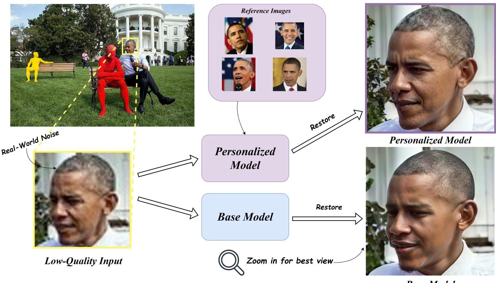  
Figure 1. Imagine wanting to restore a photo of yourself, only for the resulting image to not be you, but someone else! By utilizing a few high-quality reference images, we can faithfully restore images with fine-grained details. Best viewed by zooming in.

## Abstract

Recent developments in face restoration have achieved remarkable results in producing high-quality and lifelike outputs. The stunning results however oftenfail to befaithful with respect to the identity of the person as the models lack necessary context. In this paper, we explore the potential ofpersonalized face restoration with diffusion models. In our approach a restoration model is personalized using a few images of the identity, leading to tailored restoration with respect to the identity while retaining fine-grained details. By using independent trainable blocks for personalization, the rich prior ofa base restoration model can be exploited to its fullest. To avoid the model relying on parts of identity left in the conditioning low-quality images, a generative regularizer is employed. With a learnable parameter, the model learns to balance between the details generated

based on the input image and the degree of personalization. Moreover, we improve the training pipeline of face restoration models to enable an alignment-free approach. We showcase the robust capabilities ofour approach in several real-world scenarios with multiple identities, demonstrating our method’s ability to generate fine-grained details with faithful restoration. In the user study we evaluate the perceptual quality andfaithfulness of the generated details, with our method being voted best 61% of the time compared to the second best with 25% ofthe votes.

## 1. Introduction

Face restoration aims to recover HQ (high-quality) face images from degraded observations, such as blur, lowresolution, noise and compression artifacts. In real-world scenarios, the task is even more challenging, due to more complex degradations and variations in illumination and

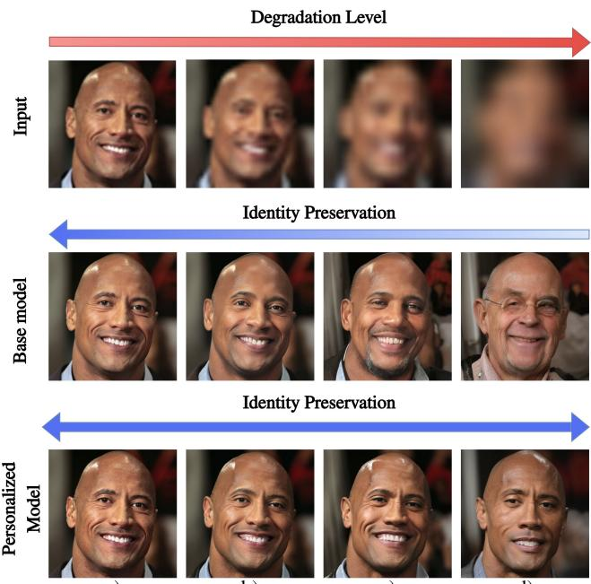  
a)  
b)  
c)  
d)  
Figure 2. Results under increasing levels of degradation. a) With only minor degradation, both base and personalized model are capable of restoration. b) The base model incorrectly restores finegrained details such as the nose and skin texture. c) More identity details such as eyes and facial hair are lost. d) Base model outputs a completely different identity, while the personalized model retains details of the identity, even if the semantics are not entirely correct due to the extreme low-quality input image. Best viewed by zooming in.

pose.

Restoration of faces is a highly ill-posed problem with multiple solutions to a given LQ (low-quality) input. Compared to natural images humans are very sensitive to subtle differences with facial images. Even small variations in the shape, size or color of eyes, nose, lips, etc., can cause a shift in the identity of the person, see top and middle row of Fig. 2. Furthermore, if we are familiar with identity of a specific person, we are even more prone to spotting subtle differences. We show an example in Fig. 1. A restoration model needs to not only output a realistic image, but also one that is faithful to the identity of the person.

Recent research on face restoration has seen great progress towards higher visual quality results. Many of the techniques exploit a generative prior such as GAN [3, 8, 37], codebooks [13, 22, 45] or diffusion models [38, 40]. Generative prior methods have been trained under a generative task prior to being modified to restoration models and as a result they are capable of outputting realistic face images. However, often the outputs can be inauthentic as the models lack crucial context about the identity. To combat this, a reference prior has been used [23, 24], which uses a HQ reference image of the same identity, leading in theory to high fidelity. However, in practice transferring the identity from a reference image is difficult due to differences in pose, illumination and semantics between the LQ and reference image.

To alleviate the ill-posedness of the restoration problem we fully exploit the reference images by creating a neural representation of the identity. We propose PFStorer (Personalized Face Restorer) to restore LQ face images while retaining the identity by personalization. Given a few HQ reference images (e.g. 3-5 selfies from a photo gallery) a restoration model is fine-tuned to a personalized restoration model. The reference images can have significantly different illumination, pose, expression and do not have to be aligned with the LQ image. Our goal is to personalize a restoration model such that it is able to restore person specific images while producing realistic images and being faithful to the identity.

As opposed to personalized generative models that personalize a generative model, we use a base face restoration model as our foundation. The base model is capable of realistic outputs, however the fidelity may suffer due to the ill-posedness of the task. Our strategy is to perform personalized restoration by fine-tuning a base restoration model with a few HQ reference images. However, a naive finetuning strategy can destroy the strong existing priors present in the base restoration model. To avoid catastrophic forgetting when performing fine-tuning for personalization, an adapter is used to keep the priors intact. Adapters are trainable blocks that can be used to adapt the flow of a model. By freezing the base model and only training the adapter blocks, existing priors can be preserved. To avoid the rapid change of intermediate outputs caused by adapters a learnable parameter is used. The learnable parameter also controls the amount of injection of personalization for different layers of the network, leading to more fine-grained control.

During training, we observe an issue where the model learns to rely too much on the LQ image ignoring the reference images. This is due to the majority of the training samples having low degradation, which can preserve identity information sufficient to restore the face without using the reference images. To alleviate the issue we design a generative regularizer, in which no conditional LQ image is given and the model is forced to generate the identity using only reference images. This approach encourages the model to learn a robust neural representation of the identity, as in generative personalization.

Furthermore, for the base face restoration model we finetune a general purpose restoration model on a face dataset to improve its restorative capabilities. During training, instead of resizing all images to a specific size and aligning them, random crops of the face images are used. This has several benefits: 1) The model has access to higher resolution patches. 2) The model is more robust to varying poses.

3) The model is capable of super-resolution through the use of tiling.

We experiment with our technique using both synthetic and real-world data. The user study confirms that our method is able to improve results over previous methods.

## 2. Related work

Face Restoration Most recent face restoration approaches include a generative prior, where the model has been trained in a generative manner prior to training it for restoration. GFP-GAN [37] uses the generator of Style-GAN2 [17] that has been trained on facial images to generate high-quality features. More recently, methods such as VQFR [13] and CodeFormer [45] have been using discrete codebooks with vector quantization and adversarial training [9] to “store” high-quality data. Some latest approaches use diffusion models [15] for restoration. DifFace [40] transforms the LQ input to the manifold of high-quality images with an arbitrary restoration model, which is followed by a forward and backward diffusion, bringing in fine-grained details. DR2 [38] uses a similar approach of first performing forward diffusion, after which backward diffusion is performed with guidance from the matching steps of forward diffusion. Zhao et al. [43] note that around 15% of the commonly used training data from FFHQ [16] is not necessarily high-quality. To improve the data quality they propose a two-step training process where after the first step, the training data is enhanced, using the model trained in the first step. Concurrent to our work is DiffBFR [28], which separates identity and texture restoration using cascaded diffusion models. Another concurrent work [5], also emphasizes the ill-posedness of the problem, but goes in the opposite direction to us, encouraging diversity, instead of personalization.

Personalization With the seminal work of DreamBooth [30] personalization of generative models with just a few images was made possible. DreamBooth can generate novel scenes of a specific object or a concept. It achieves this by fine-tuning a text-to-image diffusion model while overwriting a rare text embedding. Several works have since followed [2, 11, 12, 14, 19, 20, 25, 31, 34, 39] that attempt to improve personalization. Custom-Diffusion [19] only finetunes the attention layers present in the UNet architecture of StableDiffusion [29], significantly reducing the training time and model size. Perfusion [11] goes further and only does rank-1 updates of the attention layers, while locking the keys of cross-attention layers, significantly reducing compute and memory. ViCo [14] adds image-attention adapters to the cross-attention layers to learn cross-attention between the reference images and predicted image. It also learns a text embedding and applies a regularization using the class-token to avoid overfitting, leading to high-quality

results.

On a high-level similar to our approach is RealFill [33], which personalizes a pre-trained in-painting model to perform authentic in- and out-painting. Both MyStyle [26] and IdentityEncoder [32] first personalize the model and then transform it to perform tasks such as face in-painting, super-resolution and semantic editing. Compared to their approach, we transform a restoration model to a personalized restoration model as opposed to transforming a personalized model to a personalized super-resolution model.

Reference-Based Face Restoration Reference-based approaches use reference images from the same identity in the restoration process. GFRNet [21] uses a single reference image and learns a warping between the LQ and reference image. ASFFNet [23] selects the most similar reference image to reduce misalignment and uses adaptive feature fusion for the restoration. DMDNet [24] constructs a dictionary of deep features from important cropped regions (e.g., eyes, nose, mouth). An alignment module is then used to align the features of the input and reference images, resulting in a fusion of the features to the output image. These methods however struggle when the reference image and LQ input are not aligned or not similar enough. Compared to these approaches we learn a neural representation of the identity, enabling more robust restoration.

## 3. Method

We design a face restoration method capable of generating realistic imagery, while still being faithful to the identity of the person in a given image. We begin by analyzing the situation formally (Sec. 3.1) and conclude that a personal prior is required for faithful reconstruction in certain situations. Next, we present a method (Sec. 3.2) that preserves existing priors by utilizing adapters for personalized face restoration. To further enhance the results a generative regularizer is proposed to enable robust fine-grained restoration. We name this method PFStorer (ours). Beyond personalization (Sec. 3.3), we show simple modifications to the training pipeline of general face restoration methods that enable super-resolution and an alignment-free approach. We refer to this improved restoration model without personalization as the Base Model, which is used as a base for personalization. Background for diffusion models and personalization is given in the supplementary material.

## 3.1. The Need for a Personal Prior

Restoration of low quality images is naturally an ill-posed problem. Assume a degradation function $\mathcal { D } : \mathcal { T } \times \mathbb { R }  \mathcal { T }$ that takes in a face image $I \in \mathcal { T }$ and a value of degradation $d \in \mathbb { R }$ . A higher degradation value d indicates a higher degraded output image. When d approaches infinity the resulting image will be close to pure noise and restoring the image faithfully is no longer possible, $i d ( \mathcal { R } ( \mathcal { D } ( I ; d ) ) ) \neq i d ( I )$ where id is a function that returns the identity of a face image and R is a restoration model. There exists a value $d _ { f } < \infty$ after which faithful restoration is no longer possible. However, with additional personal prior $p _ { i d }$ the restoration can be made faithfully:

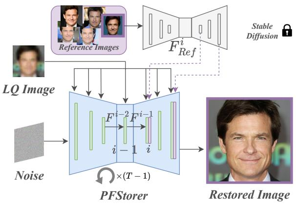

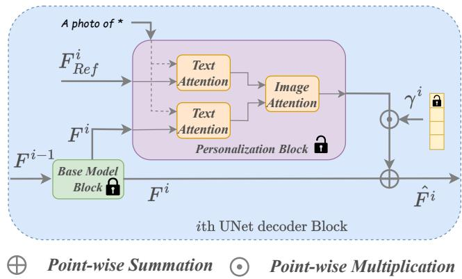  
Figure 3. (Left) PFStorer restores an image with a diffusion process conditioned on the LQ and the reference image. Base Model blocks are visualized in green and Personalization blocks in purple. StableDiffusion [29] is used to extract features $F _ { R e f } ^ { i }$ from the reference image. During training the reference image is randomly sampled from a set of reference images for each training iteration. During inference, no reference images are required as the identity is learned in the personalization blocks as a neural representation. (Right) ith UNet block containing the Base Model Block [35] and Personalization Block [14]. The Base Model Blocks contain the normal Stable Diffusion blocks with SFT (spatial feature transformation) [36] blocks from StableSR [35]. After the Base Model block, the intermediate features $F ^ { i }$ go to a trainable Personalization Block, which contains cross-attention between the text-embedding and reference image features $F _ { R e f } ^ { i } .$ A learnable adapter vector $\gamma ^ { i }$ balances the contribution between the base model and personalization.

$$
i d \left( \mathcal { R } ( \mathcal { D } ( I ; d _ { f } ) ; p _ { i d } ) \right) = i d ( I ) ,\tag{1}
$$

as $p _ { i d }$ is unchanged with any value of degradation $d .$ In this paper the personal prior $p _ { i d }$ is learned from a set of reference images using a diffusion model.

## 3.2. Personalized Face Restoration

The main idea is to use high-quality images of an individual in aid when restoring LQ images. We start with a restoration model, which is fine-tuned with a personalization technique using the reference images. The personalization is performed for each individual once, after which it can be used for inference as many times as wanted. In essence, the model is trained to add personal details, when the base restoration model is insufficient, due to the ill-posed nature of the problem. The architecture of the model can be seen from Fig. 3.

During the personalization fine-tuning, the model takes as input a synthesized LQ image $I _ { L Q }$ and a reference image $I _ { R e f }$ sampled from the set of reference images $\{ I _ { R e f } ^ { k } \}$ . A modified diffusion model loss

$$
\mathcal { L } _ { D i f f } = \mathbb { E } _ { z , t , I _ { L Q } , I _ { R e f } , \epsilon } \lVert \epsilon - \epsilon _ { \theta } ( z _ { t } , c , I _ { L Q } , I _ { R e f } ) \rVert _ { 2 } ,\tag{2}
$$

with the addition of the LQ and reference image, is used. Here $\epsilon _ { \theta }$ is the diffusion model, $z _ { t }$ the latent code at time $t ,$ c the conditioning text embedding and  the sampled noise from an Isotropic Gaussian distribution.

Personalization We initially attempt to fine-tune with prior-preservation regularization [30], but find that it fails to properly capture the fine-grained identity details as well as diminishes the results from restoration due to modifying existing priors. This motives the need for preserving the priors completely, leaving the priors untouched. Therefore, we prefer to utilize adapter blocks, which do not modify the existing priors at all, retaining their rich abilities to restore and generate. In order to implement this, we employ text and image cross-attentions between the learnable textembedding [10], reference image features $F _ { R e f } ^ { i }$ and intermediate restored image features $F ^ { i }$ of the layer i , as used similarly in [14] and shown on Fig. 3 right. The reference image features $F _ { R e f } ^ { i }$ are obtained from a frozen StableDiffusion [29], in practice they are fed through part of the Base Model in same batch as the LQ image. We refer to this as the Personalization Block (see Fig. 3 right).

Controlled Adaptation The simple addition of the personalization block however results in distorted outputs. This is due to the sudden additional data being added to the intermediate features of the Base Model from the personalization block. In order to avoid the personalization block from changing the outputs too much, a learnable vector $\gamma = \mathbf { 0 }$ can be used to initialize the outputs from the adapter, as in [4]. To further control the effect of personalization we introduce separate $\gamma$ for each personalization block applied at different resolution of PFStorer. Mathematically, each layer’s output can be expressed as:

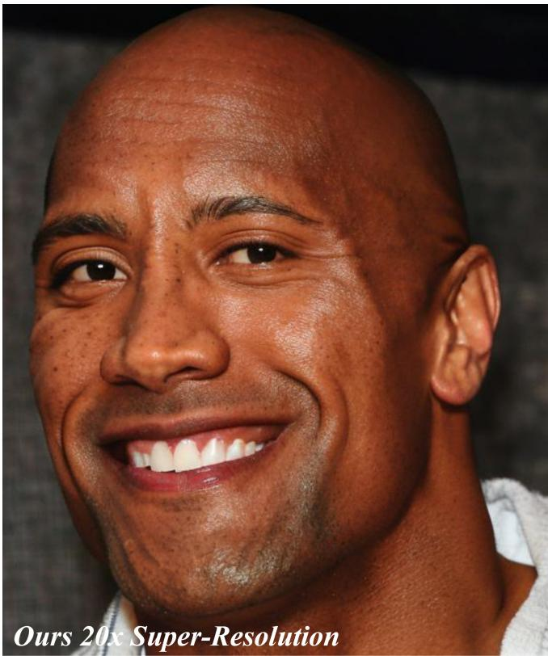

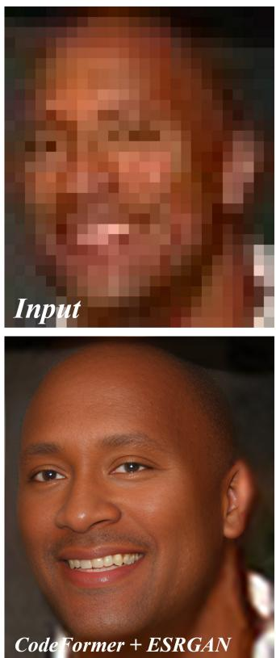

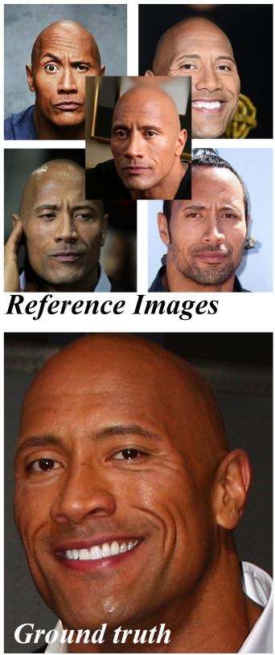  
Figure 4. 20x Super-resolution of a low-quality image. Super-resolution for images larger than $5 1 2 \times 5 1 2$ using a tiling approach from [35]. Image edited from Vecteezy.com.

$$
\hat { F } ^ { i } = F ^ { i } + \gamma ^ { i } \odot \mathrm { P e r s o n a l i z a t i o n - B l o c k } ( F ^ { i } , F _ { r e f } ^ { i } ) ,\tag{3}
$$

where Personalization-Block is the adapter, consisting of cross-attentions as shown on right of Fig. 3.

Generative Regularization Compared to personalized generative models our personalized restoration model has one additional signal, the low-quality image $I _ { L Q }$ . It guides the general structure of the restoration output and it may contain some information from the identity depending on the severity of the degradation. During training, the additional input can make the task of outputting personalized restored images easier, but it can also introduce shortcuts for the model as the model can rely on information from the additional input. This leaking of identity information from the input can lead to the model not fully learning a representation of the identity during training, hence leading to poor performance on difficult unseen cases, e.g. atmospheric turbulence.

To mitigate the above issue, we propose a generative regularizer that encourages the model to learn a more robust identity representation. A regularizing loss

$$
\mathcal { L } _ { G e n } = \mathbb { E } _ { z , t , I _ { L Q } , I _ { R e f } , \epsilon } \lVert \epsilon - \epsilon _ { \theta } ( z _ { t } , c , \infty , I _ { R e f } ) \rVert _ { 2 } .\tag{4}
$$

is added to the original training loss, where a null input ∅ is given as the conditioning LQ image. This forces the model to fully hallucinate the identity without any help from a conditioning image, encouraging a more robust representation of the identity. The final loss is then

$$
\mathcal { L } = \mathcal { L } _ { D i f f } + \lambda _ { G e n } \mathcal { L } _ { G e n } + \lambda _ { P e r s } \mathcal { L } _ { P e r s }\tag{5}
$$

where $\lambda _ { G e n }$ controls the weight of the generative term and $\lambda _ { P e r s } \mathcal { L } _ { P e r s }$ regularizes the cross-attention maps for the learnable text embedding token, which enforces personalization [14] (see the supplementary for $\mathcal { L } _ { P e r s } )$ . The trainable parameters θ from $\epsilon _ { \theta }$ consist of the personalization blocks and their accompanying vectors $\gamma ^ { i }$

## 3.3. Improving Face Restoration Diffusion Models

To integrate personalization into a restoration model, we first need a strong base restoration model. We train our model with the facial dataset FFHQ using the steps described below, which is initialized from the pre-trained StableSR [35]. We refer to the trained model as Base Model, as it has not been personalized to any specific person.

Existing Priors Many recent face restoration methods have used generative priors [37, 45]. We go further, and start our training on face images with a restoration model pre-trained on generic natural images, namely StableSR [35]. As the model is not trained from scratch on a new task, the training time is decreased and the model is more robust.

  
Input

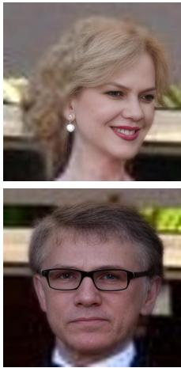  
CodeFormer

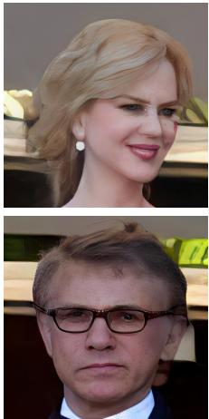  
DMDNet

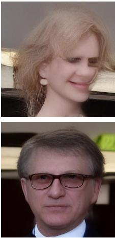  
DR2 + SPAR

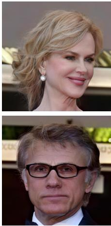  
Ours

  
Pseudo-GT

Alignment Free Approach Cropping and alignment is commonly used in face processing for standardizing input. However, delicate cropping and alignment using facial landmarks is prone to errors when face detection models fail. This is especially true in real world images. To avoid such approach we train our technique with a combination of random crops and resizing, following the training strategy of [35]. The random crops make the model more robust while also providing higher resolution inputs as details are not lost in the resizing operation.

Synthetic Noise Generation In order to generate LQ images for training, most previous face restoration approaches have used a simple first-order degradation that may not encompass all noises present in real-world images. We use a second order noise model from [35], ISP model from [41] and add motion blur and median blur to better simulate real-world conditions. As noted in [43], given a highquality input, a restoration model should not lose details in the restoration process. We enforce this by directly feeding the high-quality input as is with a probability of $p _ { H Q }$ , which is set to a low value of 0.03 in all of our experiments.

## 4. Experiments

Datasets For evaluation we use Celeb-Ref [24] and realworld images collected from the internet. Due to the large computational cost of diffusion models we choose a small subsection of the original Celeb-Ref. For synthetic data evaluation that contains the ground truth, we randomly choose 20 identities with at least 10 images each, for a total of 342 images. For each identity we reserve 5 images for the

Figure 5. Qualitative comparison with state-of-the-art restoration models on real-world images. Images from Wikimedia Commons.  
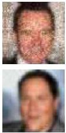  
Input

  
CodeFormer

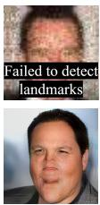  
DMDNet

  
DR2+SPAR

  
Ours

  
GT

Figure 6. Qualitative comparison with state-of-the-art restoration models on Celeb-Ref dataset [24] with heavy synthetic degradation. Best viewed zoomed in.

personalization, leaving a total 242 images for the testing. We further use two variations, light and heavy degradation sets, see the supplementary for details. For real-world data we again randomly choose 20 identities from Celeb-Ref, reverse search the identities using LAION-5B-KNN [1] and collect one image for each identity from online. We focus on high-quality images, where the subject is far away and/or out of focus and/or with poor illumination to best simulate real-world applications.

Baselines CodeFormer [45] is state-of-the-art technique for face restoration and it uses a codebook. DR2 [38] is based on a diffusion model and is meant for extreme degradations. For DR2, we use the provided SPAR enhancer and empirically find the optimal hyperparameters. DMD-Net [24] is state-of-the-art method for reference-based face restoration, for which we use the same set of 5 reference images as for the proposed method.

Evaluation Metrics For quantitative evaluation we use PSNR, SSIM, LPIPS [42], MUSIQ (KonIQ) [18], LMSE (Landmark MSE) [44], and ID (cosine similarity with Arc-Face [7]) as metrics.

Settings For methods that use reference images, 5 images are randomly sampled. For PFStorer, the personalization fine-tuning is done for 500 iterations, which corresponds to 10 minutes on a single A100. For all of our experiments we set the same settings, hyperparameters and a single seed. For detailed experimental settings see the supplementary material.

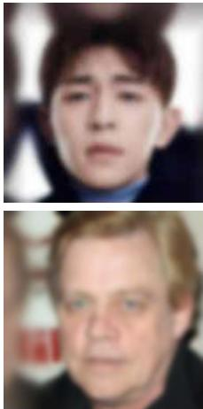  
Input

  
CodeFormer

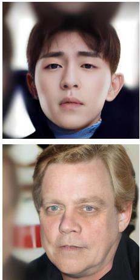  
DMDNet

  
DR2 + SPAR

  
Ours

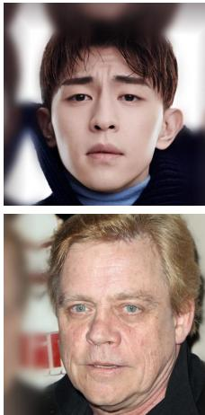  
GT

Figure 7. Qualitative comparison with state-of-the-art restoration models on Celeb-Ref dataset [24] with light synthetic degradation.  
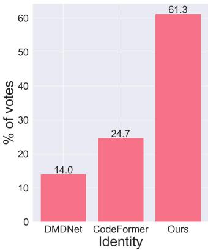

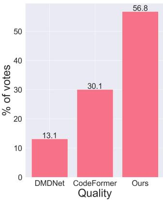  
Figure 8. User study results.

## 4.1. Comparisons

Qualitative To evaluate the effectiveness of the proposed method we show visual results in Figs. 4 to 7, for realworld, low-quality images collected from real-world, corrupted with heavy and light degradations. For the real-world sample we provide a pseudo-GT that can be used to compare with the identity. It can be observed from Fig. 5 that the baseline methods fail in preserving the identity and producing a high-quality image. Despite the difficult case on first row Fig. 5, where the head pose is atypical, the proposed method is able to restore the image faithfully, thanks to the learned representation of the identity. Figure 6 shows examples with heavy synthetic degradation. Even under heavy degradation the proposed method is able to restore the image faithfully, while other methods struggle with retaining the identity and outputting a realistic image. Under light degradation in Fig. 7, CodeFormer is able to output a high-quality image while mostly retaining the identity. Our method is able to retain even small details such as the wrinkles and skin texture.

Quantitative Quantitative results on the heavily degraded images can be seen from Tab. 1. The pixel-wise metrics PSNR and SSIM as well as the perceptual metric LPIPS have relatively similar values across the best performing methods, with slight differences. Notably, the big difference is in the ID metric, where the proposed method obtains a similarity of 57.18%, almost 20 percentage points higher than the next best performing method. This result showcases the benefit of personalization for retaining identity features. Another major improvement can be seen in the LMSE with almost half the error compared to CodeFormer. This is due to the combination of a strong base model and personalization. See supplementary for the real-world and lightly degraded samples.

Table 1. Quantitative results for images with heavy degradation. Red indicates the best and blue indicates the second best. Ref indicates whether the model uses reference images

<table><tr><td>Methods</td><td>Ref</td><td>PSNR ↑</td><td>SSIM↑</td><td>LPIPS↓</td><td>MUSIQ↑</td><td>LMSE↓</td><td>ID↑</td></tr><tr><td>Input</td><td></td><td>22.56</td><td>0.719</td><td>0.615</td><td>58.83</td><td>80.98</td><td>21.85</td></tr><tr><td>DMDNet [24]</td><td>√</td><td>22.64</td><td>0.684</td><td>0.491</td><td>47.17</td><td>89.26</td><td>29.51</td></tr><tr><td>DR2 + SPAR [38]</td><td></td><td>22.17</td><td>0.701</td><td>0.449</td><td>47.36</td><td>40.82</td><td>30.01</td></tr><tr><td>CodeFormer [45]</td><td></td><td>22.26</td><td>0.642</td><td>0.422</td><td>60.92</td><td>33.34</td><td>38.33</td></tr><tr><td>PFStorer (Ours)</td><td>√</td><td>22.62</td><td>0.679</td><td>0.414</td><td>64.04</td><td>18.37</td><td>57.18</td></tr><tr><td>GT</td><td></td><td>∞</td><td>1</td><td>0</td><td>62.37</td><td>0</td><td>100</td></tr></table>

User Study As the quantitative metrics are not fully able to capture the nuances of human preferred perceptual quality, a user study is conducted. We use all three partitions of the data. We randomly pick 100 images. To attain statistical significance we recruit 40 users, following [27]. With two questions we have a total of 8000 answers from users. We compare our method to only CodeFormer and DMDNet, as

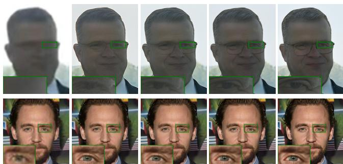  
Input  
λGen = 0  
Figure 9. (Top) In the presence of heavy degradation a larger $\lambda _ { G e n }$ is able to improve results. (Bottom) With minor degradation, a larger $\lambda _ { G e n }$ can deteriorate results.

DR2 often produces low-quality images. We ask users to choose between the best image in terms of quality and identity with respect to a reference image.

The results are shown in Fig. 8. Our method obtains the highest number of votes in both perceived identity and quality. Our method is especially good in capturing the identity, gaining 36.6 percentage points over the next best method, CodeFormer. This result resonates with both the qualitative results and quantitative metrics.

## 4.2. Further analysis

Personalization Table 2 demonstrates the improvements of the proposed method for personalization. Without personalization, the Base Model with the improved training mechanism is able to improve over StableSR [35] in all metrics. However, the results fall behind largely when personalization is added. Base Model + DreamBooth [30] and Base Model + ViCo [14] attain similar metrics, however a drop in the PSNR value even below StableSR [35] and the increase in LMSE compared to Base Model, signifies how fine-tuning the whole model can hurt the existing priors. For a fair comparison Base + ViCo also contains generative regularization and other proposed training method proposed and only lacks the learnable γ compared to PFStorer. The γ provides important balance over the personalized and restored features.

Table 2. Quantitative results for different personalization methods on the heavy portion. Red indicates the best and blue indicates the second best
<table><tr><td>Methods</td><td>Ref</td><td>PSNR ↑</td><td>SSIM↑</td><td>LPIPS↓</td><td>MUSIQ ↑</td><td>LMSE↓</td><td>ID↑</td></tr><tr><td>Input</td><td></td><td>22.56</td><td>0.719</td><td>0.615</td><td>58.83</td><td>80.98</td><td>21.85</td></tr><tr><td>StableSR [35]</td><td></td><td>21.68</td><td>0.601</td><td>0.605</td><td>38.55</td><td>93.82</td><td>22.87</td></tr><tr><td>Base Model</td><td></td><td>22.15</td><td>0.661</td><td>0.449</td><td>64.33</td><td>32.83</td><td>33.90</td></tr><tr><td>Base + DreamBooth [30]</td><td>√</td><td>21.13</td><td>0.659</td><td>0.487</td><td>62.65</td><td>37.48</td><td>52.72</td></tr><tr><td>Base + ViCo [14]</td><td>√</td><td>22.14</td><td>0.664</td><td>0.423</td><td>65.23</td><td>20.26</td><td>53.92</td></tr><tr><td>PFStorer (Ours)</td><td>√</td><td>22.62</td><td>0.679</td><td>0.414</td><td>64.04</td><td>18.37</td><td>57.18</td></tr><tr><td>GT</td><td></td><td>∞</td><td>1</td><td>0</td><td>62.37</td><td>0</td><td>100</td></tr></table>

Alignment-Free Training and Existing Priors An immediate benefit to our landmark- and alignment-free approach is that it can be run even when the landmark model fails, as can be seen from the top row of Fig. 6. Furthermore, due to the existing priors of the Base Model, the model is able to restore details from the full head and not only the face, see the result from CodeFormer from Fig. 5 top.

Generative Regularization Figure 9 showcases results with different values of the weight $\lambda _ { G e n }$ of generative regularization. A larger $\lambda _ { G e n }$ encourages more hallucination, which is beneficial for unseen cases, while a smaller $\lambda _ { G e n }$ focuses more on the restoration. To balance the effects we use a default $\lambda _ { G e n } = 0 . 1$ for all of our experiments based on empirical observations.

## 4.3. Limitations

We show an example of a limitation in Fig. 10. The output is faithful to the given reference images, hence if there are changes in the appearance between references and the input the result may be unwanted. As the model is based on Stable Diffusion it inherits its limitations of slow sampling speed and occasional unwanted artifacts and hallucinations due to the stochasticity. As a possible solution to stochasticity, concurrent work [6] guides the model towards visually appealing results.

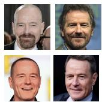  
References

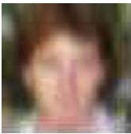  
Input

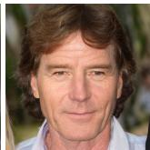  
PFStorer

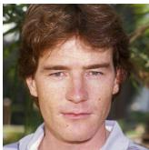  
GT  
Figure 10. The output is as accurate as the given reference images are.

## 5. Conclusions

In this work, we introduce the use ofpersonalization for the task of face restoration, where a restoration model is personalized using a few images of a person. We postulate that the problem of face restoration is an ill-posed problem and requires the use of a personal prior for faithful results. We propose the use of a personalization adapter that preserves existing priors of the base restoration model. To enhance the training generative regularization is designed. We showcase our method’s abilities through qualitative, quantitative and a user study.

Acknowledgements This work was supported by the Research Council of Finland Academy Professor project EmotionAI (grants 336116, 345122), ICT 2023 project Trust-Face (grant 345948), the University of Oulu & Research Council of Finland Profi 7 (grant 352788), and by Infotech Oulu.

## References

[1] LAION AI. Laion-knn api. https://rom1504. github.io/clip-retrieval/?back=https%3A% 2F%2Fknn.laion.ai&index=laion5B- H- 14& useMclip=false. Accessed 10-10-2023.

[2] Yuval Alaluf, Elad Richardson, Gal Metzer, and Daniel Cohen-Or. A neural space-time representation for text-toimage personalization, 2023.

[3] Chaofeng Chen, Xiaoming Li, Lingbo Yang, Xianhui Lin, Lei Zhang, and Kwan-Yee K Wong. Progressive semanticaware style transformation for blind face restoration. In Proceedings of the IEEE/CVF conference on computer vision and pattern recognition, pages 11896–11905, 2021.

[4] Zhe Chen, Yuchen Duan, Wenhai Wang, Junjun He, Tong Lu, Jifeng Dai, and Yu Qiao. Vision transformer adapter for dense predictions, 2023.

[5] Noa Cohen, Hila Manor, Yuval Bahat, and Tomer Michaeli. From posterior sampling to meaningful diversity in image restoration, 2023.

[6] Xiaoliang Dai, Ji Hou, Chih-Yao Ma, Sam Tsai, Jialiang Wang, Rui Wang, Peizhao Zhang, Simon Vandenhende, Xiaofang Wang, Abhimanyu Dubey, et al. Emu: Enhancing image generation models using photogenic needles in a haystack. arXiv preprint arXiv:2309.15807, 2023.

[7] Jiankang Deng, Jia Guo, Niannan Xue, and Stefanos Zafeiriou. Arcface: Additive angular margin loss for deep face recognition. In Proceedings of the IEEE/CVF conference on computer vision and pattern recognition, pages 4690–4699, 2019.

[8] Berk Dogan, Shuhang Gu, and Radu Timofte. Exemplar guided face image super-resolution without facial landmarks. In Proceedings ofthe IEEE/CVF conference on computer vision and pattern recognition workshops, pages 0–0, 2019.

[9] Patrick Esser, Robin Rombach, and Bjorn Ommer. Taming transformers for high-resolution image synthesis. In Proceedings of the IEEE/CVF conference on computer vision and pattern recognition, pages 12873–12883, 2021.

[10] Rinon Gal, Yuval Alaluf, Yuval Atzmon, Or Patashnik, Amit H Bermano, Gal Chechik, and Daniel Cohen-Or. An image is worth one word: Personalizing text-toimage generation using textual inversion. arXiv preprint arXiv:2208.01618, 2022.

[11] Rinon Gal, Moab Arar, Yuval Atzmon, Amit H Bermano, Gal Chechik, and Daniel Cohen-Or. Encoder-based domain tuning for fast personalization of text-to-image models. ACM Transactions on Graphics (TOG), 42(4):1–13, 2023.

[12] Jing Gu, Yilin Wang, Nanxuan Zhao, Tsu-Jui Fu, Wei Xiong, Qing Liu, Zhifei Zhang, He Zhang, Jianming Zhang, Hyun-Joon Jung, et al. Photoswap: Personalized subject swapping in images. arXiv preprint arXiv:2305.18286, 2023.

[13] Yuchao Gu, Xintao Wang, Liangbin Xie, Chao Dong, Gen Li, Ying Shan, and Ming-Ming Cheng. Vqfr: Blind face restoration with vector-quantized dictionary and parallel decoder. In European Conference on Computer Vision, pages 126–143. Springer, 2022.

[14] Shaozhe Hao, Kai Han, Shihao Zhao, and Kwan-Yee K Wong. Vico: Detail-preserving visual condition for

personalized text-to-image generation. arXiv preprint arXiv:2306.00971, 2023.

[15] Jonathan Ho, Ajay Jain, and Pieter Abbeel. Denoising diffusion probabilistic models. Advances in neural information processing systems, 33:6840–6851, 2020.

[16] Tero Karras, Samuli Laine, Miika Aittala, Janne Hellsten, Jaakko Lehtinen, and Timo Aila. Analyzing and improving the image quality of stylegan. In Proceedings of the IEEE/CVF conference on computer vision and pattern recognition, pages 8110–8119, 2020.

[17] Tero Karras, Samuli Laine, Miika Aittala, Janne Hellsten, Jaakko Lehtinen, and Timo Aila. Analyzing and improving the image quality of stylegan. In Proceedings of the IEEE/CVF conference on computer vision and pattern recognition, pages 8110–8119, 2020.

[18] Junjie Ke, Qifei Wang, Yilin Wang, Peyman Milanfar, and Feng Yang. Musiq: Multi-scale image quality transformer. In Proceedings of the IEEE/CVF International Conference on Computer Vision, pages 5148–5157, 2021.

[19] Nupur Kumari, Bingliang Zhang, Richard Zhang, Eli Shechtman, and Jun-Yan Zhu. Multi-concept customization of text-to-image diffusion. In Proceedings of the IEEE/CVF Conference on Computer Vision and Pattern Recognition, pages 1931–1941, 2023.

[20] Dongxu Li, Junnan Li, and Steven CH Hoi. Blipdiffusion: Pre-trained subject representation for controllable text-to-image generation and editing. arXiv preprint arXiv:2305.14720, 2023.

[21] Xiaoming Li, Ming Liu, Yuting Ye, Wangmeng Zuo, Liang Lin, and Ruigang Yang. Learning warped guidance for blind face restoration. In Proceedings of the European conference on computer vision (ECCV), pages 272–289, 2018.

[22] Xiaoming Li, Chaofeng Chen, Shangchen Zhou, Xianhui Lin, Wangmeng Zuo, and Lei Zhang. Blind face restoration via deep multi-scale component dictionaries. In European conference on computer vision, pages 399–415. Springer, 2020.

[23] Xiaoming Li, Wenyu Li, Dongwei Ren, Hongzhi Zhang, Meng Wang, and Wangmeng Zuo. Enhanced blind face restoration with multi-exemplar images and adaptive spatial feature fusion. In Proceedings ofthe IEEE/CVF Conference on Computer Vision and Pattern Recognition, pages 2706– 2715, 2020.

[24] Xiaoming Li, Shiguang Zhang, Shangchen Zhou, Lei Zhang, and Wangmeng Zuo. Learning dual memory dictionaries for blind face restoration. IEEE Transactions on Pattern Analysis and Machine Intelligence, 45(5):5904–5917, 2022.

[25] Jian Ma, Junhao Liang, Chen Chen, and Haonan Lu. Subject-diffusion: Open domain personalized text-to-image generation without test-time fine-tuning. arXiv preprint arXiv:2307.11410, 2023.

[26] Yotam Nitzan, Kfir Aberman, Qiurui He, Orly Liba, Michal Yarom, Yossi Gandelsman, Inbar Mosseri, Yael Pritch, and Daniel Cohen-Or. Mystyle: A personalized generative prior. ACM Transactions on Graphics (TOG), 41(6):1–10, 2022.

[27] Mayu Otani, Riku Togashi, Yu Sawai, Ryosuke Ishigami, Yuta Nakashima, Esa Rahtu, Janne Heikkila, and Shin’ichi¨

Satoh. Toward verifiable and reproducible human evaluation for text-to-image generation. In Proceedings of the IEEE/CVF Conference on Computer Vision and Pattern Recognition, pages 14277–14286, 2023.

[28] Xinmin Qiu, Congying Han, ZiCheng Zhang, Bonan Li, Tiande Guo, and Xuecheng Nie. Diffbfr: Bootstrapping diffusion model towards blind face restoration. arXiv preprint arXiv:2305.04517, 2023.

[29] Robin Rombach, Andreas Blattmann, Dominik Lorenz, Patrick Esser, and Bjorn Ommer. High-resolution image¨ synthesis with latent diffusion models. In Proceedings of the IEEE/CVF conference on computer vision and pattern recognition, pages 10684–10695, 2022.

[30] Nataniel Ruiz, Yuanzhen Li, Varun Jampani, Yael Pritch, Michael Rubinstein, and Kfir Aberman. Dreambooth: Fine tuning text-to-image diffusion models for subject-driven generation. In Proceedings of the IEEE/CVF Conference on Computer Vision and Pattern Recognition, pages 22500– 22510, 2023.

[31] Nataniel Ruiz, Yuanzhen Li, Varun Jampani, Wei Wei, Tingbo Hou, Yael Pritch, Neal Wadhwa, Michael Rubinstein, and Kfir Aberman. Hyperdreambooth: Hypernetworks for fast personalization of text-to-image models. arXiv preprint arXiv:2307.06949, 2023.

[32] Yu-Chuan Su, Kelvin CK Chan, Yandong Li, Yang Zhao, Han Zhang, Boqing Gong, Huisheng Wang, and Xuhui Jia. Identity encoder for personalized diffusion. arXiv preprint arXiv:2304.07429, 2023.

[33] Luming Tang, Nataniel Ruiz, Qinghao Chu, Yuanzhen Li, Aleksander Holynski, David E. Jacobs, Bharath Hariharan, Yael Pritch, Neal Wadhwa, Kfir Aberman, and Michael Rubinstein. Realfill: Reference-driven generation for authentic image completion, 2023.

[34] Yoad Tewel, Rinon Gal, Gal Chechik, and Yuval Atzmon. Key-locked rank one editing for text-to-image personalization. In ACM SIGGRAPH 2023 Conference Proceedings, pages 1–11, 2023.

[35] Jianyi Wang, Zongsheng Yue, Shangchen Zhou, Kelvin C. K. Chan, and Chen Change Loy. Exploiting diffusion prior for real-world image super-resolution, 2023.

[36] Xintao Wang, Ke Yu, Chao Dong, and Chen Change Loy. Recovering realistic texture in image super-resolution by deep spatial feature transform. In Proceedings of the IEEE conference on computer vision and pattern recognition, pages 606–615, 2018.

[37] Xintao Wang, Yu Li, Honglun Zhang, and Ying Shan. Towards real-world blind face restoration with generative facial prior. In Proceedings of the IEEE/CVF conference on computer vision and pattern recognition, pages 9168–9178, 2021.

[38] Zhixin Wang, Ziying Zhang, Xiaoyun Zhang, Huangjie Zheng, Mingyuan Zhou, Ya Zhang, and Yanfeng Wang. Dr2: Diffusion-based robust degradation remover for blind face restoration. In Proceedings of the IEEE/CVF Conference on Computer Vision and Pattern Recognition, pages 1704– 1713, 2023.

[39] Guangxuan Xiao, Tianwei Yin, William T Freeman, Fredo´ Durand, and Song Han. Fastcomposer: Tuning-free multi-

subject image generation with localized attention. arXiv preprint arXiv:2305.10431, 2023.

[40] Zongsheng Yue and Chen Change Loy. Difface: Blind face restoration with diffused error contraction. arXiv preprint arXiv:2212.06512, 2022.

[41] Kai Zhang, Yawei Li, Jingyun Liang, Jiezhang Cao, Yulun Zhang, Hao Tang, Deng-Ping Fan, Radu Timofte, and Luc Van Gool. Practical blind image denoising via swinconv-UNet and data synthesis. Machine Intelligence Research, 2023.

[42] Richard Zhang, Phillip Isola, Alexei A Efros, Eli Shechtman, and Oliver Wang. The unreasonable effectiveness of deep features as a perceptual metric. In Proceedings of the IEEE conference on computer vision and pattern recognition, pages 586–595, 2018.

[43] Yang Zhao, Tingbo Hou, Yu-Chuan Su, Xuhui Jia, Yandong Li, and Matthias Grundmann. Towards authentic face restoration with iterative diffusion models and beyond. In Proceedings of the IEEE/CVF International Conference on Computer Vision (ICCV), pages 7312–7322, 2023.

[44] Yinglin Zheng, Hao Yang, Ting Zhang, Jianmin Bao, Dongdong Chen, Yangyu Huang, Lu Yuan, Dong Chen, Ming Zeng, and Fang Wen. General facial representation learning in a visual-linguistic manner. In Proceedings of the IEEE/CVF Conference on Computer Vision and Pattern Recognition, pages 18697–18709, 2022.

[45] Shangchen Zhou, Kelvin Chan, Chongyi Li, and Chen Change Loy. Towards robust blind face restoration with codebook lookup transformer. Advances in Neural Information Processing Systems, 35:30599–30611, 2022.