# PRDP: Proximal Reward Difference Prediction for Large-Scale Reward Finetuning of Diffusion Models

Fei Deng1,2\*, Qifei Wang1, Wei Wei3†, Tingbo Hou1, Matthias Grundmann1 1Google, 2Rutgers University, 3Accenture

https://fdeng18.github.io/prdp

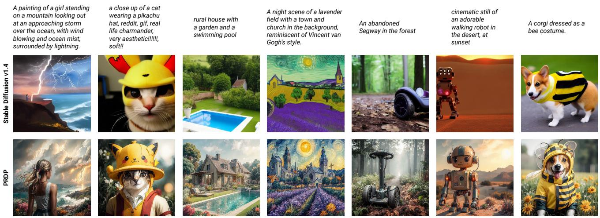  
Figure 1. Generation samples on complex, unseen prompts. Our proposed method, PRDP, achieves stable black-box reward finetuning for diffusion models for the first time on large-scale prompt datasets, leading to superior generation quality on complex, unseen prompts. Here, PRDP is finetuned from Stable Diffusion v1.4 on the training set prompts of Pick-a-Pic v1 dataset, using a weighted combination of rewards: PickScore = 10, HPSv2 = 2, Aesthetic = 0.05. The images within each column are generated using the same random seed.

## Abstract

Rewardfinetuning has emerged as a promising approach to aligning foundation models with downstream objectives. Remarkable success has been achieved in the language domain by using reinforcement learning (RL) to maximize rewards that reflect human preference. However, in the vision domain, existing RL-based rewardfinetuning methods are limited by their instability in large-scale training, rendering them incapable of generalizing to complex, unseen prompts. In this paper, we propose Proximal Reward Difference Prediction (PRDP), enabling stable black-box reward finetuning for diffusion models for the first time on large-scale prompt datasets with over 100K prompts. Our key innovation is the Reward Difference Prediction (RDP) objective that has the same optimal solution as the RL ob-

jective while enjoying better training stability. Specifically, the RDP objective is a supervised regression objective that tasks the diffusion model with predicting the reward difference of generated image pairs from their denoising trajectories. We theoretically prove that the diffusion model that obtains perfect reward difference prediction is exactly the maximizer ofthe RL objective. Wefurther develop an online algorithm with proximal updates to stably optimize the RDP objective. In experiments, we demonstrate that PRDP can match the reward maximization ability of well-established RL-based methods in small-scale training. Furthermore, through large-scale training on text prompts from the Human Preference Dataset v2 and the Pick-a-Pic v1 dataset, PRDP achieves superior generation quality on a diverse set ofcomplex, unseen prompts whereas RL-based methods completely fail.

## 1. Introduction

Diffusion models have achieved remarkable success in generative modeling of continuous data, especially in photorealistic text-to-image synthesis [7, 15, 30, 36, 37, 40, 44, 46]. However, the maximum likelihood training objective of diffusion models is often misaligned with their downstream use cases, such as generating novel compositions of objects unseen during training, and producing images that are aesthetically preferred by humans.

A similar misalignment problem exists in language models, where exactly matching the model output to the training distribution tends to yield undesirable model behavior. For example, the model may output biased, toxic, or harmful content. A successful solution, called reinforcement learning from human feedback (RLHF) [2, 31, 47, 61], is to use reinforcement learning (RL) to finetune the language model such that it maximizes some reward function that reflects human preference. Typically, the reward function is defined by a reward model pretrained from human preference data.

Inspired by the success of RLHF in language models, researchers have developed several reward models in the vision domain [22, 23, 53–55] that are similarly trained to be aligned with human preference. Furthermore, two recent works, DDPO [4] and DPOK [10], have explored using RL to finetune diffusion models. They both view the denoising process as a Markov decision process [9], and apply policy gradient methods such as PPO [42] to maximize rewards.

However, policy gradients are notoriously prone to high variance, causing training instability. To reduce variance, a common approach is to normalize the rewards by subtracting their expected value [48, 51]. DPOK fits a value function to estimate the expected reward, showing promising results when trained on 200 prompts. Alternatively, DDPO maintains a separate buffer for each prompt to track the mean and variance of rewards, demonstrating stable training on 400 prompts and better performance than DPOK. Nevertheless, we find that DDPO still suffers from training instability on larger numbers of prompts, depriving it of the benefits offered by training on large-scale prompt datasets.

In this paper, we propose Proximal Reward Difference Prediction (PRDP), a scalable reward maximization algorithm that does not rely on policy gradients. To the best of our knowledge, PRDP is the first method that achieves stable large-scale finetuning of diffusion models on more than 100K prompts for black-box reward functions.

Inspired by the recent success of DPO [35] that converts the RLHF objective for language models into a supervised classification objective, we derive for diffusion models a new supervised regression objective, called Reward Difference Prediction (RDP), that has the same optimal solution as the RLHF objective while enjoying better training stability. Specifically, our RDP objective tasks the diffusion model with predicting the reward difference of generated image pairs from their denoising trajectories. We prove that the diffusion model that obtains perfect reward difference prediction is exactly the maximizer of the RLHF objective. We further propose proximal updates and online optimization to improve training stability and generation quality.

Our contributions are summarized as follows:

• We propose PRDP, a scalable reward finetuning method for diffusion models, with a new reward difference prediction objective and its stable optimization algorithm.

• PRDP achieves stable black-box reward maximization for diffusion models for the first time on large-scale prompt datasets with over 100K prompts.

• PRDP exhibits superior generation quality and generalization to unseen prompts through large-scale training.

## 2. Preliminaries

In this section, we briefly introduce the generative process of denoising diffusion probabilistic models (DDPMs) [15, 44, 46]. Given a text prompt c, a text-to-image DDPM πθ with parameters θ defines a text-conditioned image distribution $\pi _ { \boldsymbol { \theta } } ( \mathbf { x } _ { 0 } | \mathbf { c } )$ as follows:

$$
\begin{array} { l } { \displaystyle \pi _ { \boldsymbol { \theta } } \big ( \mathbf { x } _ { 0 } \big \vert \mathbf { c } \big ) = \int \pi _ { \boldsymbol { \theta } } \big ( \mathbf { x } _ { 0 : T } \big \vert \mathbf { c } \big ) \mathrm { d } \mathbf { x } _ { 1 : T } } \\ { \displaystyle \qquad = \int p ( \mathbf { x } _ { T } ) \prod _ { t = 1 } ^ { T } \pi _ { \boldsymbol { \theta } } \big ( \mathbf { x } _ { t - 1 } \big \vert \mathbf { x } _ { t } , \mathbf { c } \big ) \mathrm { d } \mathbf { x } _ { 1 : T } , } \end{array}\tag{1}
$$

where $\mathbf { x } _ { \mathrm { 0 } }$ is the image, and $\mathbf { x } _ { 1 : T }$ are latent variables of the same dimension as x0. Typically, $p ( \mathbf { x } _ { T } ) = \mathcal { N } ( \mathbf { 0 } , \mathbf { I } )$ , and

$$
\pi _ { \boldsymbol { \theta } } ( \mathbf { x } _ { t - 1 } | \mathbf { x } _ { t } , \mathbf { c } ) = \mathcal { N } ( \mathbf { x } _ { t - 1 } ; \pmb { \mu } _ { \boldsymbol { \theta } } ( \mathbf { x } _ { t } , \mathbf { c } ) , \sigma _ { t } ^ { 2 } \mathbf { I } )\tag{2}
$$

is a Gaussian distribution with learnable mean and fixed covariance. To generate an image $\mathbf { x } _ { 0 } \sim \pi _ { \theta } ( \mathbf { x } _ { 0 } | \mathbf { c } )$ , DDPM uses ancestral sampling. That is, it samples the full denoising trajectory $\mathbf { x } _ { 0 : T } ~ \sim ~ \pi _ { \theta } ( \mathbf { x } _ { 0 : T } | \mathbf { c } )$ , by first sampling $\mathbf { x } _ { T } \sim p ( \mathbf { x } _ { T } )$ , and then sampling $\mathbf { x } _ { t - 1 } \sim \pi _ { \theta } ( \mathbf { x } _ { t - 1 } | \mathbf { x } _ { t } , \mathbf { c } )$ for $t = T , \dots , 1$ . Conversely, given a denoising trajectory $\mathbf { x } _ { \mathrm { 0 : } T }$ , we can analytically compute its log-likelihood as

$$
\begin{array} { r } { \log \pi _ { \boldsymbol { \theta } } ( \mathbf { x } _ { 0 : T } \vert \mathbf { c } ) = \log p ( \mathbf { x } _ { T } ) + \displaystyle \sum _ { t = 1 } ^ { T } \log \pi _ { \boldsymbol { \theta } } ( \mathbf { x } _ { t - 1 } \vert \mathbf { x } _ { t } , \mathbf { c } ) } \\ { = \displaystyle - \frac { 1 } { 2 } \sum _ { t = 1 } ^ { T } \frac { \Vert \mathbf { x } _ { t - 1 } - \boldsymbol { \mu } _ { \boldsymbol { \theta } } ( \mathbf { x } _ { t } , \mathbf { c } ) \Vert ^ { 2 } } { \sigma _ { t } ^ { 2 } } + C , } \end{array}\tag{3}
$$

(4)

where $C$ is a constant independent of θ.

## 3. Method

## 3.1. Reward Difference Prediction for KL-Regularized Reward Maximization

We start derivation from the typical RLHF objective [10]:

$$
\operatorname* { m a x } _ { \pi _ { \theta } } \ \mathbb { E } _ { \mathbf { x } _ { 0 } , \mathbf { c } } [ r ( \mathbf { x } _ { 0 } , \mathbf { c } ) - \beta \mathrm { K L } [ \pi _ { \theta } ( \mathbf { x } _ { 0 } | \mathbf { c } ) | | \pi _ { \mathrm { r e f } } ( \mathbf { x } _ { 0 } | \mathbf { c } ) ] ] .\tag{5}
$$

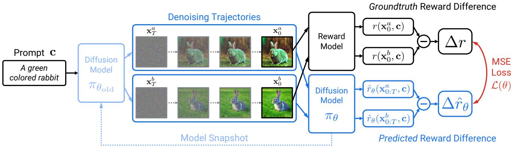  
Figure 2. PRDP framework. PRDP mitigates the instability of policy gradient methods by converting the RLHF objective to an equivalent supervised regression objective. Specifically, given a text prompt, PRDP samples two images, and tasks the diffusion model with predicting the reward difference of these two images from their denoising trajectories. The diffusion model is updated by stochastic gradient descent on the MSE loss that measures the prediction error. We prove that the MSE loss and the RLHF objective have the same optimal solution.

Here, we seek to finetune the diffusion model $\pi _ { \theta }$ by maximizing a given reward function $r ( \mathbf { x } _ { 0 } , \mathbf { c } )$ with a KL regularization, whose strength is controlled by a hyperparameter $\beta .$ The reward function can be a pretrained reward model $( e . g .$ , HPSv2 [53], PickScore [22]) that measures the generation quality, and the KL regularization discourages πθ from deviating too far from the pretrained diffusion model $\pi _ { \mathrm { r e f } } \ ( e . g .$ , Stable Diffusion [37]). This helps $\pi _ { \theta }$ to preserve the overall generation capability of $\pi _ { \mathrm { r e f } }$ , and keeps the generated images $\mathbf { x } _ { \mathrm { 0 } }$ close to the distribution where the reward model is accurate. The expectation is taken over text prompts $\mathbf { c } \sim p ( \mathbf { c } )$ and images ${ \bf x } _ { 0 } \sim \pi _ { \theta } ( { \bf x } _ { 0 } | { \bf c } )$ , where $p ( \mathbf { c } )$ is a predefined prompt distribution, usually a uniform distribution over a set of training prompts.

In contrast to language models, the KL regularization in Eq. (5) cannot be computed analytically, due to the intractable integral defined in Eq. (1). Hence, we instead maximize a lower bound of the objective in Eq. (5):

$$
\operatorname* { m a x } _ { \pi _ { \theta } } \ \mathbb { E } _ { \mathbf { x } _ { 0 } , \mathbf { c } } [ r ( \mathbf { x } _ { 0 } , \mathbf { c } ) - \beta \mathrm { K L } [ \pi _ { \theta } ( \bar { \mathbf { x } } | \mathbf { c } ) | | \pi _ { \mathrm { r e f } } ( \bar { \mathbf { x } } | \mathbf { c } ) ] ] ,\tag{6}
$$

where x¯ $\mathbf { : } = \mathbf { x } _ { 0 : T }$ is the full denoising trajectory. We provide the proof of lower bound in Appendix A.1.

While it is possible to apply REINFORCE [51] or more advanced policy gradient methods [4, 10, 42] to optimize Eq. (6), we empirically find they are hard to scale to large numbers of prompts due to training instability. Inspired by DPO [35], we propose to reformulate Eq. (6) into a supervised learning objective, allowing stable training on more than 100K prompts.

First, we derive the optimal solution to Eq. (6) as:

$$
\pi _ { \boldsymbol { \theta } ^ { \star } } \bigl ( \bar { \mathbf { x } } | \mathbf { c } \bigr ) = \frac { 1 } { Z ( \mathbf { c } ) } \pi _ { \mathrm { r e f } } \bigl ( \bar { \mathbf { x } } | \mathbf { c } \bigr ) \exp \left( \frac { 1 } { \beta } r ( \mathbf { x } _ { 0 } , \mathbf { c } ) \right) ,\tag{7}
$$

where $\begin{array} { r } { Z ( \mathbf { c } ) = \int \pi _ { \mathrm { r e f } } ( \bar { \mathbf { x } } | \mathbf { c } ) \mathrm { e x p } ( r ( \mathbf { x } _ { 0 } , \mathbf { c } ) / \beta ) \mathrm { d } \bar { \mathbf { x } } } \end{array}$ is the partition function. Proof can be found in Appendix $_ { \mathrm { A } . 2 }$ . Since

$Z ( \mathbf { c } )$ is intractable, Eq. (7) cannot be directly used to compute $\pi _ { \theta ^ { \star } }$ . However, it reveals that $\pi _ { \theta ^ { \star } }$ ⋆ must satisfy

$$
\log { \frac { \pi _ { \theta ^ { \star } } \bigl ( \bar { \mathbf { x } } | \mathbf { c } \bigr ) } { \pi _ { \mathrm { r e f } } \bigl ( \bar { \mathbf { x } } | \mathbf { c } \bigr ) } } = { \frac { 1 } { \beta } } r ( \mathbf { x } _ { 0 } , \mathbf { c } ) - \log Z ( \mathbf { c } )\tag{8}
$$

for all x¯ and c. This allows us to cancel the log $Z ( \mathbf { c } )$ term by considering two denoising trajectories $\bar { \mathbf { x } } ^ { a }$ and $\bar { \mathbf { x } } ^ { b }$ that correspond to the same text prompt c:

$$
\log \frac { \pi _ { \theta ^ { \star } } ( \bar { \mathbf { x } } ^ { a } | \mathbf { c } ) } { \pi _ { \mathrm { r e f } } ( \bar { \mathbf { x } } ^ { a } | \mathbf { c } ) } - \log \frac { \pi _ { \theta ^ { \star } } ( \bar { \mathbf { x } } ^ { b } | \mathbf { c } ) } { \pi _ { \mathrm { r e f } } ( \bar { \mathbf { x } } ^ { b } | \mathbf { c } ) } = \frac { r ( \mathbf { x } _ { 0 } ^ { a } , \mathbf { c } ) - r ( \mathbf { x } _ { 0 } ^ { b } , \mathbf { c } ) } { \beta } .\tag{9}
$$

Define

$$
\hat { r } _ { \theta } ( \bar { \mathbf { x } } , \mathbf { c } ) : = \log \frac { \pi _ { \theta } ( \bar { \mathbf { x } } | \mathbf { c } ) } { \pi _ { \mathrm { r e f } } ( \bar { \mathbf { x } } | \mathbf { c } ) } ,\tag{10}
$$

$$
\Delta \hat { r } _ { \theta } ( \bar { \bf x } ^ { a } , \bar { \bf x } ^ { b } , { \bf c } ) : = \hat { r } _ { \theta } ( \bar { \bf x } ^ { a } , { \bf c } ) - \hat { r } _ { \theta } ( \bar { \bf x } ^ { b } , { \bf c } ) ,\tag{11}
$$

$$
\Delta r ( \mathbf { x } _ { 0 } ^ { a } , \mathbf { x } _ { 0 } ^ { b } , \mathbf { c } ) : = r ( \mathbf { x } _ { 0 } ^ { a } , \mathbf { c } ) - r ( \mathbf { x } _ { 0 } ^ { b } , \mathbf { c } ) ,\tag{12}
$$

then Eq. (9) becomes

$$
\begin{array} { r } { \Delta \hat { r } _ { \theta ^ { \star } } ( \bar { \mathbf { x } } ^ { a } , \bar { \mathbf { x } } ^ { b } , \mathbf { c } ) = \Delta r ( \mathbf { x } _ { 0 } ^ { a } , \mathbf { x } _ { 0 } ^ { b } , \mathbf { c } ) / \beta . } \end{array}\tag{13}
$$

This motivates us to optimize $\pi _ { \theta }$ by minimizing the following mean squared error (MSE) loss:

$$
\begin{array} { r l } & { \mathcal { L } ( \theta ) = \mathbb { E } _ { \bar { \mathbf { x } } ^ { a } , \bar { \mathbf { x } } ^ { b } , \mathbf { c } } \left[ l _ { \theta } ( \bar { \mathbf { x } } ^ { a } , \bar { \mathbf { x } } ^ { b } , \mathbf { c } ) \right] } \\ & { \qquad : = \mathbb { E } _ { \bar { \mathbf { x } } ^ { a } , \bar { \mathbf { x } } ^ { b } , \mathbf { c } } \left\| \Delta \hat { r } _ { \theta } ( \bar { \mathbf { x } } ^ { a } , \bar { \mathbf { x } } ^ { b } , \mathbf { c } ) - \Delta r ( \mathbf { x } _ { 0 } ^ { a } , \mathbf { x } _ { 0 } ^ { b } , \mathbf { c } ) / \beta \right\| ^ { 2 } . } \end{array}
$$

We call $\mathcal { L } ( \boldsymbol { \theta } )$ the Reward Difference Prediction (RDP) objective, since we learn $\pi _ { \theta }$ by predicting the reward difference $\Delta r ( \mathbf { x } _ { 0 } ^ { a } , \mathbf { x } _ { 0 } ^ { b } , \mathbf { c } )$ instead of directly maximizing the reward. An illustration is provided in Fig. 2. We further show in Appendix A.3 that

$$
\pi _ { \theta } = \pi _ { \theta ^ { \star } } \iff { \mathcal { L } } ( \theta ) = 0 .\tag{15}
$$

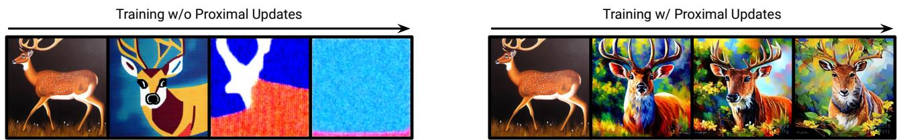  
Figure 3. Effect of proximal updates. We show generation samples during the PRDP training process. Here, we use the small-scale setup described in Sec. 4.1 and HPSv2 as the reward model. All samples use the same prompt “A painting of a deer” and the same random seed. (Left) Without proximal updates, training is quite unstable, and the generation quickly becomes meaningless noise. (Right) With proximal updates, the training stability is remarkably improved.

Algorithm 1 PRDP Training   
Require: pretrained diffusion model $\pi _ { \mathrm { r e f } } ,$ training prompt distri  
bution $p ( \mathbf { c } )$ , reward model $r ( \mathbf { x } _ { 0 } , \mathbf { c } )$ , training epochs E, gradi  
ent updates K per epoch, prompt batch size N, image batch   
size $B$ per prompt   
1: πθ $ \pi _ { \mathrm { r e f } }$ ▷ Initialization   
2: for epoch $e = 1 , \ldots , E$ do   
3: $\pi _ { \theta _ { \mathrm { o l d } } }  \pi _ { \theta }$ ▷ Model snapshot   
4: $\{ \mathbf { c } ^ { n } \} _ { n = 1 } ^ { N } \stackrel { i i d } { \sim } p ( \mathbf { c } )$ ▷ Sample text prompts   
5: for each text prompt $\mathbf { c } ^ { n }$ do   
6: $\{ \bar { \mathbf { x } } ^ { n , i } \} _ { i = 1 } ^ { B } \stackrel { i i d } { \sim } \pi _ { \theta _ { \mathrm { o l d } } } ( \bar { \mathbf { x } } | \mathbf { c } ^ { n } )$ ▷ Denoising trajectories   
7: end for   
8: Obtain rewards $r ( \mathbf { x } _ { 0 } ^ { n , i } , \mathbf { c } ^ { n } )$ for all $n , i$   
9: for gradient step $k = 1 , \ldots , K$ do   
10: $\begin{array} { r } { \bar { \mathcal { L } } ( \theta ) \gets \frac { \hat { 1 } } { N \binom { B } { 2 } } \sum _ { n = 1 } ^ { N } \sum _ { 1 \leq i < j \leq B } l _ { \theta } \big ( \bar { \mathbf { x } } ^ { n , i } , \bar { \mathbf { x } } ^ { n , j } , \mathbf { c } ^ { n } \big ) } \end{array}$   
11: Update model parameters θ by gradient descent   
12: end for   
13: end for

## 3.2. Online Optimization

To estimate the expectation in $\mathcal { L } ( \boldsymbol { \theta } )$ , we need samples of denoising trajectories $\bar { \mathbf { x } } ^ { a }$ and $\hat { \mathbf { x } } ^ { b }$ that correspond to the same prompt c. A straightforward approach, as similarly done in DPO, is to sample $\bar { \mathbf { x } } ^ { a } , \bar { \mathbf { x } } ^ { b } \overset { i i d } { \sim } \pi _ { \mathrm { r e f } } ( \bar { \mathbf { x } } | \mathbf { c } )$ . This can be implemented as uniform sampling from a fixed offline dataset generated by the pretrained model $\pi _ { \mathrm { r e f } }$

However, the offline dataset lacks sufficient coverage of samples from $\pi _ { \boldsymbol { \theta } } ( \bar { \bf x } | { \bf c } )$ that keeps updating, leading to suboptimal generation quality. Therefore, we propose an online optimization procedure, inspired by online RL algorithms. Specifically, we sample $\bar { \mathbf { x } } ^ { a } , \bar { \mathbf { x } } ^ { b } \overset { i i d } { \sim } \pi _ { \theta _ { \mathrm { o l d } } } ( \bar { \mathbf { x } } | \mathbf { c } )$ , where $\theta _ { \mathrm { o l d } }$ is a snapshot of the diffusion model parameters $\theta ,$ and we set $\theta _ { \mathrm { o l d } } \  \ \theta$ every K gradient updates. In practice, we use $\pi _ { \theta _ { \mathrm { o l d } } }$ to generate a batch of denoising trajectories, and then use all pairs of denoising trajectories in the batch to compute the loss $\mathcal { L } ( \boldsymbol { \theta } )$ . Details are provided in Algorithm 1. We will show in Sec. 4.3 that online optimization significantly improves generation quality.

## 3.3. Proximal Updates for Stable Training

We find in our experiments that directly optimizing Eq. (14) is prone to training instability, as illustrated in Fig. 3 (Left). This is likely due to excessively large model updates during training. To resolve this issue, we propose proximal updates that remove the incentive for moving $\pi _ { \theta }$ too far away from $\pi _ { \theta _ { \mathrm { o l d } } }$ . Inspired by PPO [42], we achieve this by clipping the log probability ratio l $\log ( \pi _ { \theta } ( \bar { \bf x } | { \bf c } ) / \pi _ { \theta _ { \mathrm { o l d } } } ( \bar { \bf x } | { \bf c } ) )$ to be within a small interval $[ - \epsilon ^ { \prime } , \epsilon ^ { \prime } ]$ . This can be implemented by clipping the $\hat { r } _ { \boldsymbol { \theta } } ( \bar { \bf x } , { \bf c } )$ as $\hat { r } _ { \theta } ^ { \mathrm { c l i p } } ( \bar { \bf x } , { \bf c } ) : =$

$$
\mathrm { c l i p } ( \hat { r } _ { \theta } ( \bar { \bf x } , { \bf c } ) , \hat { r } _ { \theta _ { \mathrm { o l d } } } ( \bar { \bf x } , { \bf c } ) - \epsilon ^ { \prime } , \hat { r } _ { \theta _ { \mathrm { o l d } } } ( \bar { \bf x } , { \bf c } ) + \epsilon ^ { \prime } ) ,\tag{16}
$$

because $\log ( \pi _ { \boldsymbol { \theta } } ( \bar { \bf x } | { \bf c } ) / \pi _ { \boldsymbol { \theta } _ { \mathrm { o l d } } } ( \bar { \bf x } | { \bf c } ) ) = \hat { r } _ { \boldsymbol { \theta } } ( \bar { \bf x } , { \bf c } ) - \hat { r } _ { \boldsymbol { \theta } _ { \mathrm { o l d } } } ( \bar { \bf x } , { \bf c } )$ We then use $\hat { r } _ { \theta } ^ { \mathrm { c l i p } } ( \bar { \bf x } , { \bf c } )$ to compute the clipped MSE loss $l _ { \theta } ^ { \mathrm { c l i p } } ( \bar { \mathbf { x } } ^ { a } , \bar { \mathbf { x } } ^ { b } , \mathbf { c } ) : =$

$$
\begin{array} { r } { \left\| \Delta \hat { r } _ { \theta } ^ { \mathrm { c l i p } } ( \bar { \mathbf { x } } ^ { a } , \bar { \mathbf { x } } ^ { b } , \mathbf { c } ) - \Delta r ( \mathbf { x } _ { 0 } ^ { a } , \mathbf { x } _ { 0 } ^ { b } , \mathbf { c } ) / \beta \right\| ^ { 2 } , } \end{array}\tag{17}
$$

where $\Delta \hat { r } _ { \theta } ^ { \mathrm { c l i p } } ( \bar { \mathbf { x } } ^ { a } , \bar { \mathbf { x } } ^ { b } , \mathbf { c } ) : = \hat { r } _ { \theta } ^ { \mathrm { c l i p } } ( \bar { \mathbf { x } } ^ { a } , \mathbf { c } ) - \hat { r } _ { \theta } ^ { \mathrm { c l i p } } ( \bar { \mathbf { x } } ^ { b } , \mathbf { c } )$ . Similar to PPO [42], our final loss is the maximum of the clipped and unclipped MSE loss:

$$
l _ { \theta } ( \bar { \mathbf { x } } ^ { a } , \bar { \mathbf { x } } ^ { b } , \mathbf { c } ) \gets \operatorname* { m a x } \bigl ( l _ { \theta } ( \bar { \mathbf { x } } ^ { a } , \bar { \mathbf { x } } ^ { b } , \mathbf { c } ) , l _ { \theta } ^ { \mathrm { c l i p } } ( \bar { \mathbf { x } } ^ { a } , \bar { \mathbf { x } } ^ { b } , \mathbf { c } ) \bigr ) .\tag{18}
$$

This ensures that we minimize an upper bound of the original loss, making the optimization problem well-defined.

In practice, the clipping in Eq. (16) is decomposed and applied at each denoising step t. First, $\hat { r } _ { \boldsymbol { \theta } } ( \bar { \bf x } , { \bf c } )$ can be decomposed as $\begin{array} { r } { \hat { r } _ { \theta } ( \bar { \bf x } , { \bf c } ) = \sum _ { t = 1 } ^ { T } \hat { r } _ { \theta , t } ( \bar { \bf x } , { \bf c } ) } \end{array}$ , where

$$
\hat { r } _ { \theta , t } ( \bar { \mathbf { x } } , \mathbf { c } ) : = \log ( \pi _ { \theta } ( \mathbf { x } _ { t - 1 } | \mathbf { x } _ { t } , \mathbf { c } ) / \pi _ { \mathrm { r e f } } ( \mathbf { x } _ { t - 1 } | \mathbf { x } _ { t } , \mathbf { c } ) )\tag{19}
$$

We apply clipping to each $\hat { r } _ { \theta , t } ( \bar { \bf x } , { \bf c } )$ as $\widehat { r } _ { \theta , t } ^ { \mathrm { c l i p } } ( \bar { \mathbf { x } } , \mathbf { c } ) : =$

$$
\mathrm { c l i p } \left( \hat { r } _ { \theta , t } ( \bar { \bf x } , { \bf c } ) , \hat { r } _ { \theta _ { \mathrm { o l d } } , t } ( \bar { \bf x } , { \bf c } ) - \epsilon , \hat { r } _ { \theta _ { \mathrm { o l d } } , t } ( \bar { \bf x } , { \bf c } ) + \epsilon \right) ,\tag{20}
$$

where ϵ is the stepwise clipping range. Finally, we replace Eq. (16) with

$$
\hat { r } _ { \theta } ^ { \mathrm { c l i p } } ( \bar { \mathbf { x } } , \mathbf { c } ) : = \sum _ { t = 1 } ^ { T } \hat { r } _ { \theta , t } ^ { \mathrm { c l i p } } ( \bar { \mathbf { x } } , \mathbf { c } ) .\tag{21}
$$

As shown in Fig. 3 (Right), our proposed proximal updates can remarkably improve optimization stability.

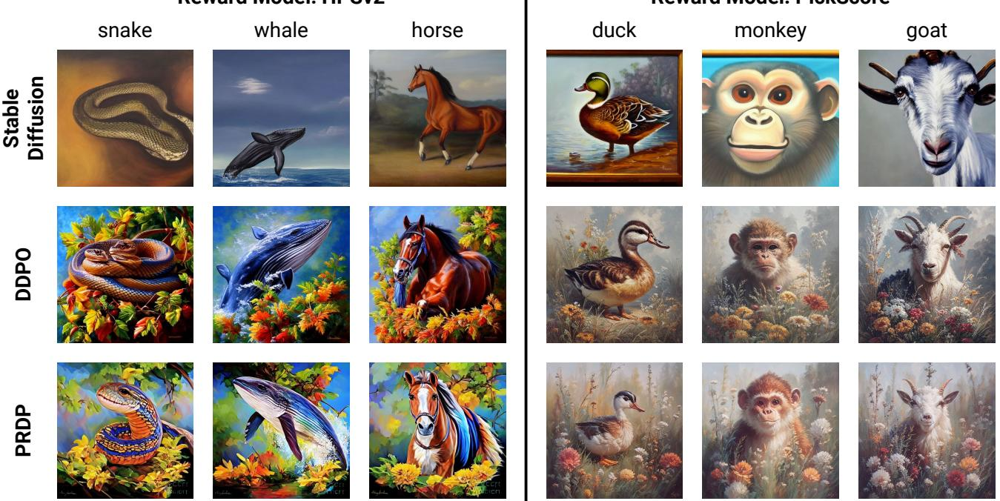  
Figure 4. Generation samples from small-scale training. DDPO and PRDP are finetuned from Stable Diffusion v1.4 on 45 prompts consisting of common animal names, with HPSv2 (Left) and PickScore (Right) as the reward model. Samples within each column use the same random seed. The prompt template is “A painting of a ⟨animal⟩”, where the ⟨animal⟩ is listed on top of each column. All prompts are seen during training. Both DDPO and PRDP significantly improve the generation quality, with PRDP being slightly better.

## 4. Experiments

In our experiments, we first verify on a set of 45 prompts that PRDP can match the reward maximization ability of DDPO [4], which is based on the well-established PPO [42] algorithm. We then conduct a large-scale training on more than 100K prompts from the training set of HPDv2 [53], showing that PRDP can successfully handle large-scale training whereas DDPO fails. We further perform a largescale multi-reward finetuning on the training set prompts of Pick-a-Pic v1 dataset [22], highlighting the superior generation quality of PRDP on complex, unseen prompts. Finally, we showcase the advantages of our algorithm design, such as online optimization and KL regularization.

## 4.1. Experimental Setup

To perform reward finetuning, we need a pretrained diffusion model, a pretrained reward model, and a training set of prompts. For all experiments, we use Stable Diffusion (SD) v1.4 [37] as the pretrained diffusion model, and finetune the full UNet weights. For sampling, during both training and evaluation, we use the DDPM sampler [15] with 50 denoising steps and a classifier-free guidance [14] scale of 5.0.

Small-scale setup. We use a set of 45 prompts, with the template “A painting of a animal ”, where the animal is taken from the list of common animal names used in DDPO.

Table 1. Reward score comparison on small-scale training.
<table><tr><td></td><td>SD v1.4</td><td>DDPO</td><td>PRDP</td></tr><tr><td>HPSv2</td><td>0.2855</td><td>0.3398</td><td>0.3471</td></tr><tr><td>PickScore</td><td>0.2179</td><td>0.2664</td><td>0.2700</td></tr></table>

We conduct reward finetuning separately for two recently proposed reward models, HPSv2 [53] and PickScore [22]. We train for 100 epochs, where in each epoch, we sample 32 prompts and 16 images per prompt. The evaluation uses the same set of prompts as training. We report reward scores averaged over 256 random samples per prompt.

Large-scale setup. Following DRaFT [6], we use more than 100K prompts from the training set of HPDv2, and finetune for HPSv2 and PickScore separately. We train for 1000 epochs. In each epoch, we sample 64 prompts and 8 images per prompt. We evaluate the finetuned model on 500 randomly sampled training prompts, as well as a variety of unseen prompts, including 500 prompts from the Pick-a-Pic v1 test set, and 800 prompts from each of the four benchmark categories of HPDv2, namely animation, concept art, painting, and photo. We report reward scores averaged over 64 random samples per prompt.

Large-scale multi-reward setup. We mostly follow the

## Reward Model: HPSv2

cinematic still of highly reflective stainless steel train in the desert, at sunset

The image is a wooden sculpture of a cute robot with cat ears, displayed in a contemporary art gallery.

A chibi frog character surfing at the beach.

Stable Diffusion

DDPO

PRDP

## Reward Model: PickScore

An anthropomorphic frog wizard wearing a cape and holding a wand.

Digital art of a cherry tree overlooking a valley with a waterfall at sunset.

A monkey in a blue top hat painted in oil by Vincent van Gogh in the 1800s.

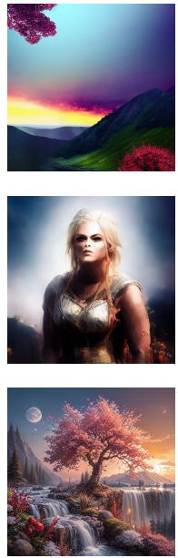

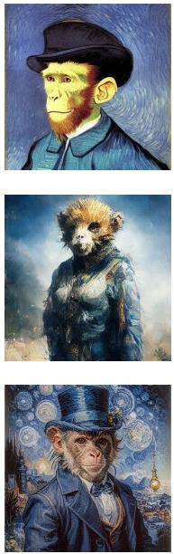  
Figure 5. Generation samples from large-scale training. DDPO and PRDP are finetuned from Stable Diffusion v1.4 on over 100K prompts from the training set of HPDv2, with HPSv2 (Left) and PickScore (Right) as the reward model. Samples within each column are generated from the prompt shown on top, using the same random seed. All prompts are unseen during training. PRDP significantly improves the generation quality over Stable Diffusion, whereas DDPO fails to generate reasonable results.

large-scale setup, except that we use the training set prompts of Pick-a-Pic v1 dataset, and a weighted combination of rewards: PickScore = 10, HPSv2 = 2, Aesthetic = 0.05, where Aesthetic is the LAION aesthetic score.

Baselines. DDPO [4] and DPOK [10] are the two most recent RL finetuning methods for black-box rewards. Since DDPO has demonstrated better performance than DPOK, we mainly compare to DDPO. To ensure a fair comparison, we train DDPO and PRDP for the same number of epochs, with the same number of reward queries per epoch. We also use the same random seeds to sample images for evaluation.

## 4.2. Main Results

Small-scale finetuning. We show generation samples from small-scale finetuning in Fig. 4 and reward scores in Tab. 1. Both DDPO and PRDP can significantly improve the generation quality over Stable Diffusion, with more vivid colors and details. Quantitatively, PRDP achieves slightly better reward scores than DDPO. This verifies that PRDP can match the reward maximization ability of well-established policy gradient methods.

Large-scale finetuning. We present generation samples from large-scale finetuning in Fig. 5 and reward scores in Tab. 2. We observe that Stable Diffusion generates images with relevant content but low quality. Meanwhile, DDPO fails to give reasonable results. It generates irrelevant, low quality images or even meaningless noise, leading to lower reward scores than Stable Diffusion. This is due to the instability of DDPO in large-scale training, which we further investigate in Appendix B. In contrast, PRDP maintains stability in the large-scale setup, and significantly improves the generation quality on both seen and unseen prompts.

Large-scale multi-reward finetuning. We provide generation samples in Figs. 1 and 11 to 15, and reward scores in Tab. 3, showing the superior generation quality of PRDP on a diverse set of complex, unseen prompts.

## 4.3. Effect of Online Optimization

In this section, we show that online optimization has a great advantage over offline optimization. To ensure a fair comparison, we use the same number of reward queries and gradient updates for both methods. Specifically, following the small-scale setup, for online training, we use 100 epochs, where each epoch makes 512 queries to the reward model.

Table 2. Reward score comparison on large-scale training.
<table><tr><td rowspan="2">Reward Model</td><td rowspan="2">Method</td><td rowspan="2">Seen Prompts HPD v2</td><td colspan="5">Unseen Prompts</td></tr><tr><td>Pick-a-Pic v1 Test Set</td><td>HPD v2 Animation</td><td>HPD v2 Concept Art</td><td>HPD v2 Painting</td><td>HPD v2 Photo</td></tr><tr><td rowspan="3">HPSv2</td><td>SD v1.4</td><td>Training Set 0.2685</td><td>0.2665</td><td>0.2737</td><td>0.2656</td><td>0.2654</td><td>0.2750</td></tr><tr><td>DDPO</td><td>0.2464</td><td>0.2501</td><td>0.2673</td><td>0.2558</td><td>0.2570</td><td>0.2093</td></tr><tr><td>PRDP</td><td>0.3175</td><td>0.3050</td><td>0.3223</td><td>0.3175</td><td>0.3172</td><td>0.3159</td></tr><tr><td rowspan="3">PickScore</td><td>SD v1.4</td><td>0.2092</td><td>0.2082</td><td>0.2111</td><td>0.2062</td><td>0.2059</td><td>0.2172</td></tr><tr><td>DDPO</td><td>0.2032</td><td>0.1992</td><td>0.2077</td><td>0.2125</td><td>0.2124</td><td>0.1780</td></tr><tr><td>PRDP</td><td>0.2424</td><td>0.2344</td><td>0.2450</td><td>0.2441</td><td>0.2448</td><td>0.2387</td></tr></table>

Online Optimization for HPSv2  
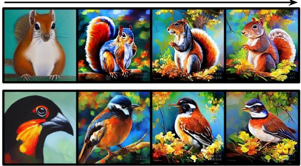

Online Optimization for PickScore  
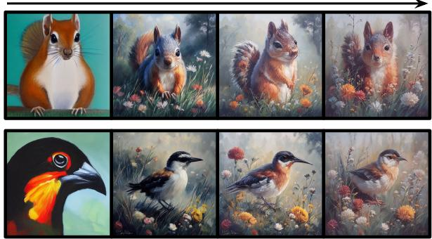  
Figure 6. Effect of online optimization. We show generation samples during the PRDP training process, with HPSv2 (Left) and PickScore (Right) as the reward model. We follow the small-scale training setup. The prompts for the first and the second rows are “A painting of a squirrel” and “A painting of a bird”, respectively. Samples within each row use the same random seed. It can be observed that online optimization continually improves the generation quality.

For offline training, we sample 51200 images from the pretrained Stable Diffusion, obtain their rewards, and then perform the same total number of gradient updates as in online training. We show generation samples during the online optimization process in Fig. 6, and quantitative comparisons in Fig. 7. We observe that online optimization continually improves the generation quality, achieving significantly better reward scores than offline optimization.

## 4.4. Effect of KL Regularization

A common limitation of reward finetuning is reward hacking, where the finetuned diffusion model exploits inaccuracies in the reward model, and produces undesired images with high reward scores. In this section, we show that the KL regularization in our PRDP formulation can help alleviate this issue. For this purpose, we use the LAION aesthetic predictor as the reward model. It only takes images as input, and can be exploited by disregarding text-image alignment. We follow the small-scale setup, except that we train for 250 epochs and directly use the 45 common animal names as prompts. As demonstrated in Fig. 8, DDPO, without KL regularization, is prone to reward hacking. It completely ignores the text prompts and generates similar images for all prompts. In contrast, PRDP with β = 10 can successfully preserve the text-image alignment while improving the aesthetic quality. More analysis can be found in Appendix C.

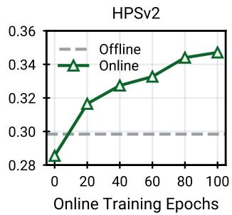

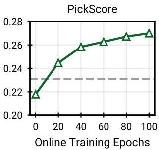  
Figure 7. Comparison of online and offline optimization. We evaluate the reward scores of model checkpoints during online optimization and the final model obtained by offline optimization. We follow the small-scale training setup, and optimize the models for HPSv2 and PickScore separately. Online optimization matches the performance of offline optimization in ∼10 epochs, and keeps improving the reward score afterwards.

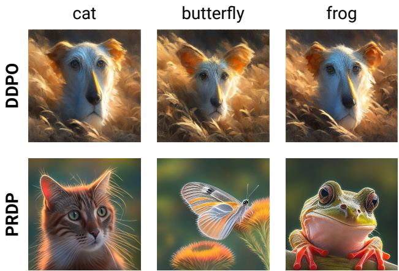  
Figure 8. Effect of KL regularization. We show generation samples from DDPO and PRDP when optimizing the LAION aesthetic score. We use the small-scale training setup, except that we train for 250 epochs. Samples within each column are generated from the prompt shown on top, using the same random seed. DDPO, without KL regularization, over-optimizes the reward, generating similar images for all prompts. In contrast, PRDP, formulated with KL regularization, successfully preserves text-image alignment.

## 5. Related Work

Diffusion models. As a new class of generative models, diffusion models [15, 44, 46] have achieved remarkable success in a wide variety of data modalities, including images [7, 17, 30, 36, 37, 39–41], videos [16, 43], audios [25], 3D shapes [13, 32, 57, 60], and robotic trajectories [1, 5, 18]. To facilitate control over the content and style of generation, recent works have investigated finetuning diffusion models on various conditioning signals [11, 19, 20, 27, 28, 38, 45, 58]. However, it remains challenging to adapt diffusion models to downstream use cases that are misaligned with the training objective, such as generating novel compositions of objects unseen during training, and producing images that are aesthetically preferred by humans. Although classifier guidance [7] can help mitigate this issue, the classifier requires noisy images as input, making it hard to use off-the-shelf classifiers such as object detectors and aesthetic predictors for guidance. In contrast, we finetune the diffusion model to maximize rewards that reflect downstream objectives. Our method can work with generic off-the-shelf reward models that take clean images as input.

Language model learning from human feedback. The maximum likelihood training objective for language models tends to yield undesirable model behavior, due to the potentially biased, toxic, or harmful content in the training data. Reinforcement learning from human feedback (RLHF) has recently emerged as a successful remedy [2, 3, 12, 26, 29, 31, 47, 52, 61]. Typically, a reward model is first trained from human preference data (e.g., rankings of outputs from a pretrained language model). Then, the language model is finetuned by online RL algorithms (e.g., PPO [42]) to maximize the score given by the reward model. More recently, DPO [35] proposes a supervised learning method that directly optimizes the language model from preference data, skipping the reward model training and avoiding the instability of RL algorithms. Our method is inspired by DPO and PPO, but designed specifically for diffusion models.

Reward finetuning for diffusion models. Inspired by the success of RLHF in the language domain, researchers have developed several reward models in the vision domain [21–24, 34, 53–56]. Moreover, recent works have explored using these reward models to improve the generation quality of diffusion models. A simple approach, called supervised finetuning [23, 54], is to finetune the diffusion model toward high-reward samples from an offline dataset. Its major drawback is that the generation quality is limited by the offline dataset. For further improvement, RAFT [8] proposes an online variant that iteratively re-generates the dataset. A more direct method for online optimization is to backpropagate the reward function gradient through the denoising process [6, 33, 49, 55]. However, this only works for differentiable rewards. For generic rewards, DDPO [4] and DPOK [10] propose RL finetuning. While they have shown promising results on small prompt sets, they are unstable in large-scale training. Our work addresses the training instability issue, achieving stable reward finetuning on largescale prompt datasets for generic rewards. Concurrent with our work, Diffusion-DPO [50] adapts DPO to efficiently align diffusion models from large-scale offline preference data, and [59] proposes to stabilize large-scale RL finetuning by combining the diffusion model pretraining loss.

## 6. Conclusion

This paper presents PRDP, the first black-box reward finetuning method for diffusion models that is stable on largescale prompt datasets with over 100K prompts. We achieve this by converting the RLHF objective to an equivalent supervised regression objective and developing its stable optimization algorithm. Our large-scale experiments highlight the superior generation quality of PRDP on complex, unseen prompts, which is beyond the capability of existing RL finetuning methods. We also demonstrate that the KL regularization in the PRDP formulation can help alleviate the common issue of reward hacking. We hope that our work can inspire future research on large-scale reward finetuning for diffusion models.

## Acknowledgments

We thank authors of DRaFT [6] for sharing their training prompts and reward models. We appreciate helpful discussion with Ligong Han, Yanwu Xu, Yaxuan Zhu, Zhonghao Wang, Yunzhi Zhang, Yang Zhao, and Zhisheng Xiao.

## References

[1] Anurag Ajay, Yilun Du, Abhi Gupta, Joshua B. Tenenbaum, Tommi S. Jaakkola, and Pulkit Agrawal. Is conditional generative modeling all you need for decision making? In International Conference on Learning Representations, 2023. 8

[2] Yuntao Bai, Andy Jones, Kamal Ndousse, Amanda Askell, Anna Chen, Nova DasSarma, Dawn Drain, Stanislav Fort, Deep Ganguli, Tom Henighan, Nicholas Joseph, Saurav Kadavath, Jackson Kernion, Tom Conerly, Sheer El-Showk, Nelson Elhage, Zac Hatfield-Dodds, Danny Hernandez, Tristan Hume, Scott Johnston, Shauna Kravec, Liane Lovitt, Neel Nanda, Catherine Olsson, Dario Amodei, Tom Brown, Jack Clark, Sam McCandlish, Chris Olah, Ben Mann, and Jared Kaplan. Training a helpful and harmless assistant with reinforcement learning from human feedback. arXiv preprint arXiv:2204.05862, 2022. 2, 8

[3] Yuntao Bai, Saurav Kadavath, Sandipan Kundu, Amanda Askell, Jackson Kernion, Andy Jones, Anna Chen, Anna Goldie, Azalia Mirhoseini, Cameron McKinnon, Carol Chen, Catherine Olsson, Christopher Olah, Danny Hernandez, Dawn Drain, Deep Ganguli, Dustin Li, Eli Tran-Johnson, Ethan Perez, Jamie Kerr, Jared Mueller, Jeffrey Ladish, Joshua Landau, Kamal Ndousse, Kamile Lukosuite, Liane Lovitt, Michael Sellitto, Nelson Elhage, Nicholas Schiefer, Noemi Mercado, Nova DasSarma, Robert Lasenby, Robin Larson, Sam Ringer, Scott Johnston, Shauna Kravec, Sheer El Showk, Stanislav Fort, Tamera Lanham, Timothy Telleen-Lawton, Tom Conerly, Tom Henighan, Tristan Hume, Samuel R. Bowman, Zac Hatfield-Dodds, Ben Mann, Dario Amodei, Nicholas Joseph, Sam McCandlish, Tom Brown, and Jared Kaplan. Constitutional AI: Harmlessness from AI feedback. arXiv preprint arXiv:2212.08073, 2022. 8

[4] Kevin Black, Michael Janner, Yilun Du, Ilya Kostrikov, and Sergey Levine. Training diffusion models with reinforcement learning. In International Conference on Learning Representations, 2024. 2, 3, 5, 6, 8, 15, 16, 18

[5] Chang Chen, Fei Deng, Kenji Kawaguchi, Caglar Gulcehre, and Sungjin Ahn. Simple hierarchical planning with diffusion. In International Conference on Learning Representations, 2024. 8

[6] Kevin Clark, Paul Vicol, Kevin Swersky, and David J. Fleet. Directly fine-tuning diffusion models on differentiable rewards. In International Conference on Learning Representations, 2024. 5, 8, 17

[7] Prafulla Dhariwal and Alexander Nichol. Diffusion models beat GANs on image synthesis. In Advances in Neural Information Processing Systems, 2021. 2, 8

[8] Hanze Dong, Wei Xiong, Deepanshu Goyal, Yihan Zhang, Winnie Chow, Rui Pan, Shizhe Diao, Jipeng Zhang, KaShun SHUM, and Tong Zhang. RAFT: Reward ranked finetuning for generative foundation model alignment. Transactions on Machine Learning Research, 2023. 8

[9] Ying Fan and Kangwook Lee. Optimizing DDPM sampling with shortcut fine-tuning. In International Conference on Machine Learning, 2023. 2

[10] Ying Fan, Olivia Watkins, Yuqing Du, Hao Liu, Moonkyung Ryu, Craig Boutilier, Pieter Abbeel, Mohammad Ghavamzadeh, Kangwook Lee, and Kimin Lee. DPOK: Reinforcement learning for fine-tuning text-to-image diffusion models. In Advances in Neural Information Processing Systems, 2023. 2, 3, 6, 8

[11] Rinon Gal, Yuval Alaluf, Yuval Atzmon, Or Patashnik, Amit Haim Bermano, Gal Chechik, and Daniel Cohen-or. An image is worth one word: Personalizing text-to-image generation using textual inversion. In International Conference on Learning Representations, 2023. 8

[12] Amelia Glaese, Nat McAleese, Maja Tr˛ebacz, John Aslanides, Vlad Firoiu, Timo Ewalds, Maribeth Rauh, Laura Weidinger, Martin Chadwick, Phoebe Thacker, Lucy Campbell-Gillingham, Jonathan Uesato, Po-Sen Huang, Ramona Comanescu, Fan Yang, Abigail See, Sumanth Dathathri, Rory Greig, Charlie Chen, Doug Fritz, Jaume Sanchez Elias, Richard Green, Sona Mokrá, Nicholasˇ Fernando, Boxi Wu, Rachel Foley, Susannah Young, Iason Gabriel, William Isaac, John Mellor, Demis Hassabis, Koray Kavukcuoglu, Lisa Anne Hendricks, and Geoffrey Irving. Improving alignment of dialogue agents via targeted human judgements. arXiv preprint arXiv:2209.14375, 2022. 8

[13] Jiatao Gu, Alex Trevithick, Kai-En Lin, Joshua M. Susskind, Christian Theobalt, Lingjie Liu, and Ravi Ramamoorthi. NerfDiff: Single-image view synthesis with NeRF-guided distillation from 3D-aware diffusion. In International Conference on Machine Learning, 2023. 8

[14] Jonathan Ho and Tim Salimans. Classifier-free diffusion guidance. In NeurIPS 2021 Workshop on Deep Generative Models and Downstream Applications, 2021. 5

[15] Jonathan Ho, Ajay Jain, and Pieter Abbeel. Denoising diffusion probabilistic models. In Advances in Neural Information Processing Systems, 2020. 2, 5, 8

[16] Jonathan Ho, William Chan, Chitwan Saharia, Jay Whang, Ruiqi Gao, Alexey Gritsenko, Diederik P. Kingma, Ben Poole, Mohammad Norouzi, David J. Fleet, and Tim Salimans. Imagen video: High definition video generation with diffusion models. arXiv preprint arXiv:2210.02303, 2022. 8

[17] Jonathan Ho, Chitwan Saharia, William Chan, David J. Fleet, Mohammad Norouzi, and Tim Salimans. Cascaded diffusion models for high fidelity image generation. Journal of Machine Learning Research, 23(47):1–33, 2022. 8

[18] Michael Janner, Yilun Du, Joshua Tenenbaum, and Sergey Levine. Planning with diffusion for flexible behavior synthesis. In International Conference on Machine Learning, 2022. 8

[19] Jindong Jiang, Fei Deng, Gautam Singh, and Sungjin Ahn. Object-centric slot diffusion. In Advances in Neural Information Processing Systems, 2023. 8

[20] Bahjat Kawar, Shiran Zada, Oran Lang, Omer Tov, Huiwen Chang, Tali Dekel, Inbar Mosseri, and Michal Irani. Imagic: Text-based real image editing with diffusion models. In CVPR, 2023. 8

[21] Junjie Ke, Keren Ye, Jiahui Yu, Yonghui Wu, Peyman Milanfar, and Feng Yang. VILA: Learning image aesthetics from

user comments with vision-language pretraining. In CVPR, 2023. 8

[22] Yuval Kirstain, Adam Polyak, Uriel Singer, Shahbuland Matiana, Joe Penna, and Omer Levy. Pick-a-Pic: An open dataset of user preferences for text-to-image generation. In Advances in Neural Information Processing Systems, 2023. 2, 3, 5, 16, 17

[23] Kimin Lee, Hao Liu, Moonkyung Ryu, Olivia Watkins, Yuqing Du, Craig Boutilier, Pieter Abbeel, Mohammad Ghavamzadeh, and Shixiang Shane Gu. Aligning textto-image models using human feedback. arXiv preprint arXiv:2302.12192, 2023. 2, 8

[24] Junnan Li, Dongxu Li, Caiming Xiong, and Steven Hoi. BLIP: Bootstrapping language-image pre-training for unified vision-language understanding and generation. In International Conference on Machine Learning, 2022. 8

[25] Haohe Liu, Zehua Chen, Yi Yuan, Xinhao Mei, Xubo Liu, Danilo Mandic, Wenwu Wang, and Mark D Plumbley. AudioLDM: Text-to-audio generation with latent diffusion models. In International Conference on Machine Learning, 2023. 8

[26] Hao Liu, Carmelo Sferrazza, and Pieter Abbeel. Chain of hindsight aligns language models with feedback. In International Conference on Learning Representations, 2024. 8

[27] Ron Mokady, Amir Hertz, Kfir Aberman, Yael Pritch, and Daniel Cohen-Or. Null-text inversion for editing real images using guided diffusion models. In CVPR, 2023. 8

[28] Chong Mou, Xintao Wang, Liangbin Xie, Jian Zhang, Zhongang Qi, Ying Shan, and Xiaohu Qie. T2I-adapter: Learning adapters to dig out more controllable ability for text-to-image diffusion models. arXiv preprint arXiv:2302.08453, 2023. 8

[29] Reiichiro Nakano, Jacob Hilton, Suchir Balaji, Jeff Wu, Long Ouyang, Christina Kim, Christopher Hesse, Shantanu Jain, Vineet Kosaraju, William Saunders, Xu Jiang, Karl Cobbe, Tyna Eloundou, Gretchen Krueger, Kevin Button, Matthew Knight, Benjamin Chess, and John Schulman. WebGPT: Browser-assisted question-answering with human feedback. arXiv preprint arXiv:2112.09332, 2021. 8

[30] Alexander Quinn Nichol, Prafulla Dhariwal, Aditya Ramesh, Pranav Shyam, Pamela Mishkin, Bob Mcgrew, Ilya Sutskever, and Mark Chen. GLIDE: Towards photorealistic image generation and editing with text-guided diffusion models. In International Conference on Machine Learning, 2022. 2, 8

[31] Long Ouyang, Jeffrey Wu, Xu Jiang, Diogo Almeida, Carroll Wainwright, Pamela Mishkin, Chong Zhang, Sandhini Agarwal, Katarina Slama, Alex Ray, John Schulman, Jacob Hilton, Fraser Kelton, Luke Miller, Maddie Simens, Amanda Askell, Peter Welinder, Paul F Christiano, Jan Leike, and Ryan Lowe. Training language models to follow instructions with human feedback. In Advances in Neural Information Processing Systems, 2022. 2, 8

[32] Ben Poole, Ajay Jain, Jonathan T. Barron, and Ben Mildenhall. DreamFusion: Text-to-3D using 2D diffusion. In International Conference on Learning Representations, 2023. 8

[33] Mihir Prabhudesai, Anirudh Goyal, Deepak Pathak, and Katerina Fragkiadaki. Aligning text-to-image diffusion

models with reward backpropagation. arXiv preprint arXiv:2310.03739, 2023. 8

[34] Alec Radford, Jong Wook Kim, Chris Hallacy, Aditya Ramesh, Gabriel Goh, Sandhini Agarwal, Girish Sastry, Amanda Askell, Pamela Mishkin, Jack Clark, Gretchen Krueger, and Ilya Sutskever. Learning transferable visual models from natural language supervision. In International Conference on Machine Learning, 2021. 8

[35] Rafael Rafailov, Archit Sharma, Eric Mitchell, Christopher D Manning, Stefano Ermon, and Chelsea Finn. Direct preference optimization: Your language model is secretly a reward model. In Advances in Neural Information Processing Systems, 2023. 2, 3, 8, 13

[36] Aditya Ramesh, Prafulla Dhariwal, Alex Nichol, Casey Chu, and Mark Chen. Hierarchical text-conditional image generation with CLIP latents. arXiv preprint arXiv:2204.06125, 2022. 2, 8

[37] Robin Rombach, Andreas Blattmann, Dominik Lorenz, Patrick Esser, and Björn Ommer. High-resolution image synthesis with latent diffusion models. In CVPR, 2022. 2, 3, 5, 8, 16, 17

[38] Nataniel Ruiz, Yuanzhen Li, Varun Jampani, Yael Pritch, Michael Rubinstein, and Kfir Aberman. DreamBooth: Fine tuning text-to-image diffusion models for subject-driven generation. In CVPR, 2023. 8

[39] Chitwan Saharia, William Chan, Huiwen Chang, Chris Lee, Jonathan Ho, Tim Salimans, David Fleet, and Mohammad Norouzi. Palette: Image-to-image diffusion models. In ACM SIGGRAPH 2022 Conference Proceedings, 2022. 8

[40] Chitwan Saharia, William Chan, Saurabh Saxena, Lala Li, Jay Whang, Emily L Denton, Kamyar Ghasemipour, Raphael Gontijo Lopes, Burcu Karagol Ayan, Tim Salimans, Jonathan Ho, David J Fleet, and Mohammad Norouzi. Photorealistic text-to-image diffusion models with deep language understanding. In Advances in Neural Information Processing Systems, 2022. 2

[41] Chitwan Saharia, Jonathan Ho, William Chan, Tim Salimans, David J. Fleet, and Mohammad Norouzi. Image super-resolution via iterative refinement. IEEE Transactions on Pattern Analysis and Machine Intelligence, 45(4):4713– 4726, 2023. 8

[42] John Schulman, Filip Wolski, Prafulla Dhariwal, Alec Radford, and Oleg Klimov. Proximal policy optimization algorithms. arXiv preprint arXiv:1707.06347, 2017. 2, 3, 4, 5, 8, 18

[43] Uriel Singer, Adam Polyak, Thomas Hayes, Xi Yin, Jie An, Songyang Zhang, Qiyuan Hu, Harry Yang, Oron Ashual, Oran Gafni, Devi Parikh, Sonal Gupta, and Yaniv Taigman. Make-A-Video: Text-to-video generation without text-video data. In International Conference on Learning Representations, 2023. 8

[44] Jascha Sohl-Dickstein, Eric Weiss, Niru Maheswaranathan, and Surya Ganguli. Deep unsupervised learning using nonequilibrium thermodynamics. In International Conference on Machine Learning, 2015. 2, 8

[45] Kihyuk Sohn, Lu Jiang, Jarred Barber, Kimin Lee, Nataniel Ruiz, Dilip Krishnan, Huiwen Chang, Yuanzhen Li, Irfan

Essa, Michael Rubinstein, Yuan Hao, Glenn Entis, Irina Blok, and Daniel Castro Chin. StyleDrop: Text-to-image synthesis of any style. In Advances in Neural Information Processing Systems, 2023. 8

[46] Yang Song, Jascha Sohl-Dickstein, Diederik P Kingma, Abhishek Kumar, Stefano Ermon, and Ben Poole. Score-based generative modeling through stochastic differential equations. In International Conference on Learning Representations, 2021. 2, 8

[47] Nisan Stiennon, Long Ouyang, Jeffrey Wu, Daniel Ziegler, Ryan Lowe, Chelsea Voss, Alec Radford, Dario Amodei, and Paul F Christiano. Learning to summarize with human feedback. In Advances in Neural Information Processing Systems, 2020. 2, 8

[48] Richard S Sutton and Andrew G Barto. Reinforcement learning: An introduction. MIT press, 2018. 2

[49] Bram Wallace, Akash Gokul, Stefano Ermon, and Nikhil Naik. End-to-end diffusion latent optimization improves classifier guidance. In ICCV, 2023. 8

[50] Bram Wallace, Meihua Dang, Rafael Rafailov, Linqi Zhou, Aaron Lou, Senthil Purushwalkam, Stefano Ermon, Caiming Xiong, Shafiq Joty, and Nikhil Naik. Diffusion model alignment using direct preference optimization. In CVPR, 2024. 8

[51] Ronald J Williams. Simple statistical gradient-following algorithms for connectionist reinforcement learning. Machine learning, 8:229–256, 1992. 2, 3

[52] Jeff Wu, Long Ouyang, Daniel M Ziegler, Nisan Stiennon, Ryan Lowe, Jan Leike, and Paul Christiano. Recursively summarizing books with human feedback. arXiv preprint arXiv:2109.10862, 2021. 8

[53] Xiaoshi Wu, Yiming Hao, Keqiang Sun, Yixiong Chen, Feng Zhu, Rui Zhao, and Hongsheng Li. Human preference score v2: A solid benchmark for evaluating human preferences of text-to-image synthesis. arXiv preprint arXiv:2306.09341, 2023. 2, 3, 5, 8, 15, 16, 17

[54] Xiaoshi Wu, Keqiang Sun, Feng Zhu, Rui Zhao, and Hongsheng Li. Human preference score: Better aligning text-toimage models with human preference. In ICCV, 2023. 8

[55] Jiazheng Xu, Xiao Liu, Yuchen Wu, Yuxuan Tong, Qinkai Li, Ming Ding, Jie Tang, and Yuxiao Dong. ImageReward: Learning and evaluating human preferences for textto-image generation. In Advances in Neural Information Processing Systems, 2023. 2, 8

[56] Jiahui Yu, Zirui Wang, Vijay Vasudevan, Legg Yeung, Mojtaba Seyedhosseini, and Yonghui Wu. CoCa: Contrastive captioners are image-text foundation models. Transactions on Machine Learning Research, 2022. 8

[57] Xiaohui Zeng, Arash Vahdat, Francis Williams, Zan Gojcic, Or Litany, Sanja Fidler, and Karsten Kreis. LION: Latent point diffusion models for 3D shape generation. In Advances in Neural Information Processing Systems, 2022. 8

[58] Lvmin Zhang, Anyi Rao, and Maneesh Agrawala. Adding conditional control to text-to-image diffusion models. In ICCV, 2023. 8

[59] Yinan Zhang, Eric Tzeng, Yilun Du, and Dmitry Kislyuk. Large-scale reinforcement learning for diffusion models. arXiv preprint arXiv:2401.12244, 2024. 8

[60] Linqi Zhou, Yilun Du, and Jiajun Wu. 3D shape generation and completion through point-voxel diffusion. In ICCV, 2021. 8

[61] Daniel M Ziegler, Nisan Stiennon, Jeffrey Wu, Tom B Brown, Alec Radford, Dario Amodei, Paul Christiano, and Geoffrey Irving. Fine-tuning language models from human preferences. arXiv preprint arXiv:1909.08593, 2019. 2, 8