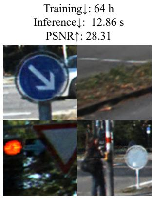
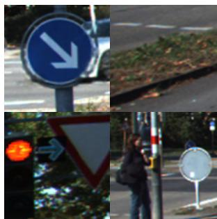
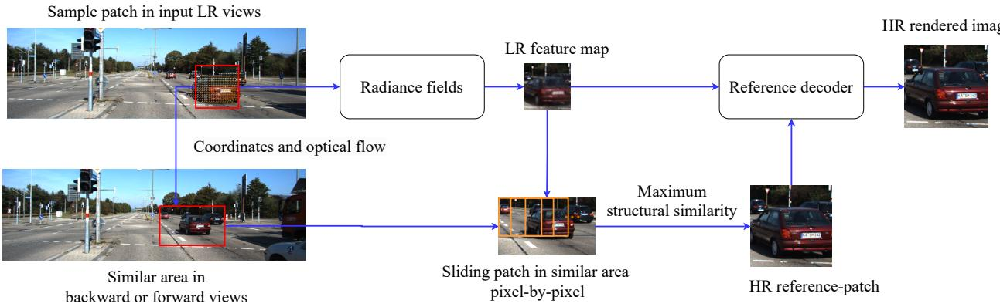
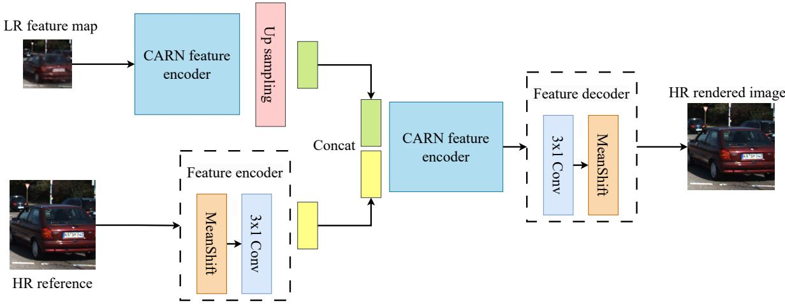
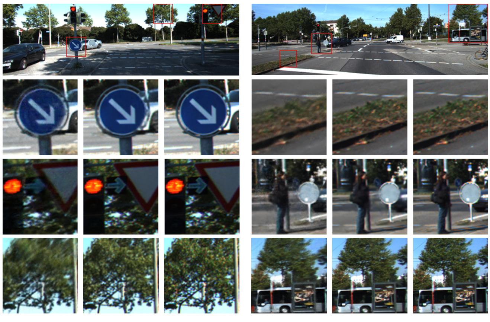
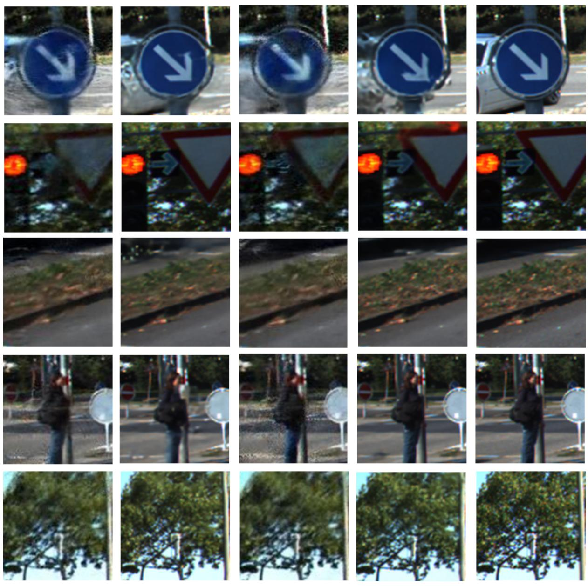

SUDS

# PaReNeRF: Toward Fast Large-scale Dynamic NeRF with Patch-based Reference

Xiao Tang∗1, Min Yang1, Penghui Sun1, Hui Li1, Yuchao Dai2, Feng Zhu1, Hojae Lee1 1Samsung R&D Institute China Xi’an (SRCX) 2Northwestern Polytechnical University

{xiao1.tang, min16.yang, penghui.sun, hui01.li}@samsung.com daiyuchao@nwpu.edu.cn, {f15.zhu, hojae72.lee}@samsung.com

## Abstract

With photo-realistic image generation, Neural Radiance Field (NeRF) is widely used for large-scale dynamic scene reconstruction as autonomous driving simulator. However, large-scale scene reconstruction still suffersfrom extremely long training time and rendering time. Low-resolution (L-R) rendering combined with upsampling can alleviate this problem but it degrades image quality. In this paper, we design a lightweight reference decoder which exploits prior information from known views to improve image reconstruction quality ofnew views. In addition, to speed up prior information search, we propose an optical flow and structural similarity based prior information search method. Results on KITTI and VKITTI2 datasets show that our method significantly outperforms the baseline method in terms of training speed, rendering speed and rendering quality.

## 1. Introduction

With the development of autonomous driving, it is challenging to conduct experiments in various driving scenarios due to complex geographical locations, varying surroundings and road conditions. With simulators like CARLA [8], developers can test thousands of times faster than road testing, but there are some serious issues such as domain gap and costly manual effort. With the rapid development of neural rendering technology, we can reconstruct higher-fidelity 3D scenes from real road test data at a lower cost.

NeRF [29] was first proposed in ECCV 2020 as a novel view synthesis method and has attracted more and more attention because of photo-realistic image generation. However, NeRF is originally designed for small static scene reconstruction, requiring camera views to be heavily overlapped. With the expansion of data collected by self-driving cars such as KITTI [12], nuScenes [3], and Waymo [9], researchers are paying increasing attention to the reconstruction and novel view rendering of large-scale dynamic scenes [22, 23, 26, 28, 32, 48, 51, 55, 57, 60].

  
Training↓: 26 h (↓60%) Inference↓: 1.61 s(↓87%) PSNR↑: 32.6(↑13%)

  
Figure 1. Comparison of image reconstruction performance on KITTI dataset. We show some local details of the image reconstruction results of the SUDS method and our PaReNeRF method. SUDS, the state-of-the-art neural rendering method for large-scale dynamic scenes, faces the problem of long training time and inference time, while PaReNeRF can generate higher-quality rendered images and significantly reduce training time (by 60%) and inference time (by 87%).

Due to the sparsity of the collected data and the single trajectory, it is still challenging to reconstruct largescale dynamic scenes. To solve this, many current studies design NeRF models for both the large-scale environment (background) and the moving objects (foreground) [22, 32, 55, 57, 60], and make use of RGB images, depth images, optical flow, semantic labels and other data to boost the training, which has achieved impressive reconstruction effect. However, the current state-of-the-art (SOTA) largescale dynamic scene reconstruction algorithms suffer from slow training and inference speed due to high-resolution rendering and much random ray sampling across videos. For example, Mars [55] and SUDS [48] take about more than 2 days to train a scene of about 9 seconds. In this paper, we propose to replace random ray sampling with patchbased sampling, which can greatly save data reading time and thus speed up training, but this does not contribute to the inference speed. Unisim [60] adopts a smaller resolution feature map than that of the rendered image, and relies on the CNN for upsampling, which significantly reduce both the training time and inference time at the expense of reconstruction accuracy. Prior information has been used in small static scene reconstruction based on sparse inputs [4, 7, 13, 15, 21, 35, 49, 53, 58, 61]. Due to the sparsity and the single trajectory of the data collected by self-driving car, we proposes a novel reference decoder to exploit prior information from known views to improve reconstruction quality of new views. We demonstrate our reconstruction capabilities on scenes from the KITTI [12] dataset and Virtual KITTI-2 (VKITTI2) [2] dataset in comparison with baseline methods. The obtained results, shown in Fig. 1, demonstrate the effectiveness of our method on both speed and rendering quality. In summary, our contributions can be summarized as follows:

• We propose an optical flow and structural similarity based prior information search method which can narrow the search area and speed up the search during the training phase.

• We replace random ray sampling with patch-based sampling, and propose a novel reference decoder to merge prior information into the decoding and upsampling network.

• On the KITTI and VKITTI2 datasets, we show that our approach can render highly detailed scene, significantly improve upon the state-of-the-art methods, and reduce training time and inference time by over 60% and 87% respectively.

## 2. Related Work

## 2.1. Neural radiance fields (NeRFs)

Implicit neural representations have demonstrated its effectiveness for novel view synthesis [6, 10, 24, 27, 30, 31, 37– 39, 41, 54, 62]. Among them, NeRF [29] achieved remarkable results for high-fidelity image generation by encoding continuous scene radiance fields within multi-layer perceptron (MLP) given a set of posed camera images. These methods can represent complex geometry and appearance and have achieved photorealistic rendering, but they focus only on small static and object-centric scenes.

## 2.2. Large-scale scene reconstruction

A growing number of NeRF extensions apply NeRF to unbounded scenes [11, 14, 18, 43, 46, 50, 52, 56, 59]. Block-NeRF [44] and Mega-NeRF [47] partition the scene spatially and train separate NeRF for each partition. URF [34] leverages accurate dense LiDAR depth and predicted image segmentation as supervision to provide significant performance improvements on street view data. BungeeNeRF [56] makes the first attempt to bring NeRF to city-scale, introducing a progressive training method from coarse to fine and thus adding more capacity to the network representation. All of these methods work only on static scenes, and produce many blurs, floaters and other artifacts when training on existing self-driving datasets.

## 2.3. NeRF for large-scale dynamic scene

As more and more street view data are collected by selfdriving cars, the reconstruction and novel view rendering for large-scale dynamic scenes have attracted the attention of many researchers [5, 22, 23, 26, 32, 36, 48, 55, 57, 60]. NSG [32] and PNF [22] decompose a scene into background and a set of objects, with each object represented by an MLP. These methods tend to reconstruct a single video clip of short duration due to the following limitations. (1) Memory grows linearly with the number of moving objects and input videos because a separate model is built for each object. (2) These methods require supervision via 3D bounding boxes and panoptic labels, obtained manually or via category-specific models [48].

As a step towards truly open-world reconstructions of dynamic cities, SUDS [48] factorizes the scene into three separate hash table data structures to efficiently encode static, dynamic, and far-field radiance fields, and makes use of a rich suite of informative but freely available input signals, such as LiDAR depth measurements and optical flow. SUD-S achieved SOTA performance but it requires long training time (e.g., more than two days for a nine-second video) due to high resolution (HR) and random ray samplings across videos. UniSim [60] renders a smaller resolution feature map and uses CNN for upsampling, which can significantly reduce training time, but such encoder-decoder structure decrease reconstruction accuracy. In order to simultaneously accelerate training speed, inference speed, and improve rendering quality, we propose a novel reference decoder which exploits prior information from known views to improve reconstruction quality of new views when decoding the lowresolution volume rendering feature map output by the radiance fields.

## 2.4. NeRF with reference

Prior information has been used to improve the performance of NeRF based on sparse perspectives [4, 17, 20, 25, 33, 40, 42, 49, 53, 61], but the scale of applied scenes, the use

  
Figure 2. The architecture of our proposed PaReNeRF. For a sampled patch in LR training views, we can find similar area in backward and forward views based on coordinates and optical flow, then slide patches in the similar areas and calculate the structural similarity of the slided patches and the LR feature map output by radiance fields. The HR reference-patch with max structural similarity is merged into reference decoder to improve the reconstruction quality.

## 3.1. Preliminaries

method of prior information, and the effects achieved are different from this paper. NeRF-SR [49] leverages a refinement network that blends details from only one HR reference by finding relevant patches with available depth maps. However, directly refining the HR image cannot improve the rendering speed, and the depth-based reference search method is only suitable for static scenes. pixelNeRF [61], MVSNeRF [4] and Wimbauer et al. [53] all introduced priors into the NeRF network to improve the training quality of sparse perspectives. For a query point, the corresponding image feature is extracted from the feature volume through projection and interpolation and passed into the NeRF network. However, these methods are only suitable for small static and object-centered scenes and not suitable for dynamic scenes due to the sparsity and single trajectory of camera poses in dynamic scenes. In order to find the most similar prior information in dynamic scenes, we proposes a search method based on optical flow and structural similarity.

## 3. Method

In this section, we first review the SUDS algorithm as the baseline. Next, we present the overall process of our method. We introduce our three main improvements to SUDS, including training and inference acceleration based on patch sampling and low-resolution rendering combined with upsampling, prior information search based on optical flow and structural similarity, and image quality improvement based on reference decoder. Finally, we discuss how to learn the model from real-world data. Fig. 2 shows an overview of our approach.

NFF and NeRF: Neural feature field (NFF) refers to a continuous function $f$ that maps a 3D point $x _ { i } \in \mathbb { R } ^ { 3 }$ and a view direction $\theta _ { i } \in \mathbb { R } ^ { 2 }$ to an implicit geometry $s \in$ R and a $N _ { f ^ { - } }$ dimensional feature descriptor $\bar { f } \in \mathbb { R } ^ { N _ { f } }$ [60]. The mapping function is realized by MLPs. NFFs can be seen as a superset of several existing studies [29, 53]. If we represent the implicit geometry as volume density $\sigma _ { i }$ and the feature descriptor as RGB color $c _ { i } ,$ NFF becomes NeRF [29, 60].

NeRF samples points along the ray for each image pixel, querying the MLP to obtain density and color values. Then it yields a color prediction value $\hat { C } ( \boldsymbol { r } )$ for the ray using numerical quadrature $\begin{array} { r } { \sum _ { i = 0 } ^ { N - 1 } T _ { i } ( 1 - e x p ( - \sigma _ { i } \delta _ { i } ) ) c _ { i } } \end{array}$ where $\begin{array} { r } { T _ { i } = e x p ( - \sum _ { j = 0 } ^ { i - 1 } \sigma _ { j } \delta _ { j } ) } \end{array}$ and $\delta _ { i }$ is the distance between samples. The training process optimizes the model by sampling image pixels and minimizing the loss function $\begin{array} { r } { \dot { \sum _ { r \in R } | | C ( r ) - \bar { C } ( \bar { r } ) | | ^ { 2 } } } \end{array}$

SUDS: Built upon NeRF [29], SUDS [48] decomposes the world into a static branch, a dynamic branch, and a farfield branch.

(1) The static branch models stationary topography that is consistent across videos and maps the feature vector obtained from hash table into a view-dependent color $c _ { s }$ and a view-independent density $\sigma _ { s }$

(2) The dynamic branch handles both transient (e.g., parked cars) and truly dynamic objects (e.g., pedestrians), and also assumes that both the density $\sigma _ { d }$ and color $c _ { d }$ depend on time.

(3) The far-field branch handles far-field objects and sky with an environment map. And then derives a single density and radiance value for any position by computing the weighted sum of the static and dynamic components.

The method jointly optimizes all three branches by minimizing the combination of reconstruction losses, warping losses, flow losses, static-dynamic factorization loss and shadow loss.

## 3.2. Reference decoder based NeRF

In the SUDS architecture, batches of rays are sampled randomly across input videos and high-resolution RGB images are rendered directly, but this requires long training time and inference time. We argue that patch-based ray sampling can reduce the time of data reading, thereby shortening the training time of the model. Moreover, similar to Unisim, we adopt low-resolution feature map rendering combined with CNN upsampling to further reduce the number of ray queries and thus training and inference time. However, patch-based ray sampling and such encoder-decoder structure will result in loss of rendering accuracy. In this paper, we provide a reference decoder $r f .$ , which can use reference information $R \in \mathbb R ^ { H \times W \times 3 }$ when decoding and upsampling low-resolution feature map $F \in \mathbb { R } ^ { H _ { f } \times W _ { f } ^ { \smile } \times N _ { f } }$ thus improving both training speed and rendering quality.

$$
r f : ( F \in \mathbb { R } ^ { H _ { f } \times W _ { f } \times N _ { f } } , R \in \mathbb { R } ^ { H \times W \times 3 } ) \to I \in \mathbb { R } ^ { H \times W \times 3 }\tag{1}
$$

The pipeline is shown in Fig. 2. We use the three branches described in SUDS as our radiance fields and change the RGB output to low-resolution feature map output. Specifically, we improve the SUDS from the following three aspects.

## 3.2.1 Patch-sampling based radiance fields

We change random ray sampling to patch sampling, which can greatly reduce the number of sampling times and thus training time. If N rays are randomly sampled for each batch, the data need to be loaded N times. Assuming that we set the patch size to $h \times w .$ , then we only need to load the data $N / ( h \times w )$ times to obtain N rays. In addition, patch-based ray sampling also make it possible to implement image-level processing (e.g., CNN upsampling) during the rendering.

To analyze the advantages and disadvantages of patch sampling and encoder-decoder structure, we conducted ablation experiments, and the detailed introduction of the dataset, parameter settings and experiment results is shown in Section 4. In a word, patch sampling can effectively improve the training speed, but the reconstruction accuracy is reduced. Using low-resolution feature map rendering combined with CNN upsampling can greatly speed up inference, but compared with the original SUDS, the reconstruction performance is declined and needs further optimization.

## 3.2.2 Prior information searching module

Considering that in the video, the same content (including static background and dynamic objects) will appear in different frames and views, the information of different frames and views can complement each other. Therefore, we proposes to integrate prior information of the known views into the decoding process to improve the rendering quality of new views.

Searching for reference information in the entire image is generally time-consuming [16]. In order not to affect the training speed, it is necessary to quickly search for the most similar prior information in the large-scale dynamic scene. We proposes an optical flow and structural similarity based search method, as shown in Fig. 2.

Specifically, in the training phase, for a randomly sampled patch $\bar { P \in \mathbb { R } ^ { h \times w \times 3 } }$ , the coordinate range of the patch pixels is $( i , j ) \in [ ( s i , s j ) , ( s i + h , s j + w ) ]$ . According to [45, 48], we can get 2D optical flow $f l _ { i j }$ for each pixel $( i , j )$ . And then we can determine similar regions $R e f f$ and $R e f b$ in the forward and backward views respectively by calculating the minimum $( m i n i , m i n j )$ and maximum (maxi, maxj) values of the original coordinates $( i , j )$ plus the optical flow values $f l _ { i j }$ . Then we slide the patches p pixel by pixel in the two similar regions $R e f f$ and $R e f b ,$ calculate the structural similarity s between p and the sampled patch P, and take the patch with the largest structural similarity as the reference patch RP.

In the inference stage, the structural similarity $s _ { m } , m \in$ [0, M] between the volume rendering feature map F of the new view and the RGB image $\hat { I } _ { m }$ of all known views is calculated, and the image with the highest structural similarity is used as the reference image $R I$

## 3.2.3 Reference decoder structure

In this section, we mainly introduce the structure of our proposed reference decoder $r f .$ . To minimize the latency of the reference decoder, we design a lightweight network based on a classic super-resolution network CARN [1] due to its comprehensive performance on both the speed and accuracy. The reference decoder exploits prior information RI from known views to improve reconstruction quality of new views when decoding the low-resolution volume rendering feature map F output by the radiance fields. As shown in the Fig. 3. our reference decoder includes the following modules:

• The feature encoder extract hidden feature of the reference-image RI.

• The CARN feature encoder extract hidden feature of the volume rendering feature map F and fused feature respectively, the cascading residual network can integrate features from multiple layers based on local and global cascaded modules to receive more information of different layers, we refer the reader to [1] for more details.

  
Figure 3. The structure of our reference decoder. Firstly, we apply Cascading Residual Network (CARN) encoding and upsampling to the LR feature map and output the HR feature map, and merge the feature of HR reference into the decoding process to improve the final rendering quality.

• The up-sampling module is a 3 × 1 convolutional layer with a PixelShuffle layer upsampling the low-resolution feature map F.

• The feature decoder render the final feature map to RGB image I.

## 3.3. Optimization

To optimize our system, we use the losses described in SUDS to jointly optimize the radiance fields and the reference decoder. For the detailed calculation of the losses, we refer the reader to [48].

In this paper, we only change the C(r) in the L2 photometric loss $\mathcal { L } _ { c } ( r ) = \left\| C ( r ) - \hat { C } ( r ) \right\| ^ { 2 }$ from the rendered RGB image output by the SUDS radiance field to the reconstructed image output by the reference decoder. In addition, we compute the losses in a patch-wise fashion.

## 4. Experiments

In this section, we provide both quantitative and qualitative comparisons to demonstrate the advantages of the proposed method.

## 4.1. Experimental Setup

Dataset. We evaluate our method using the same KITTI [12] and Virtual KITTI-2 (VKITTI2) [2] subsequences as in prior works [22, 32, 48]. Each training sequence consists of up to 90 time steps or 9 seconds and images with the size of $1 2 4 2 \times 3 7 5$ , each from two camera perspectives.

Tasks. We validate the photorealistic rendering performance of our method by evaluating image reconstruction and novel view synthesis (NVS). The training and testing image sets in the image reconstruction setting are identical, while in the NVS task, we render the frames that are not included in the training data. Specifically, we evaluate the methods using different train/test splits, holding out every 4th time step (75%), every other time step (50%), and finally training with only one in every four time steps (25%).

Baseline. We compare our method to other state-of-theart methods like NeRF, NeRF+Time, NSG, PNF, and SUD-S, rely on their reported numbers.

Metrics. We follow the standard evaluation protocol in image synthesis and report Peak Signal-to-Noise Ratio (P-SNR), Structural Similarity (SSIM), and Learned Perceptual Image Patch Similarity (LPIPS) of our default setting for quantitative evaluations. More importantly, we demonstrate the contribution of this algorithm to reducing training time and inference time in Table 2 and Table 1.

Training. We train our model for 125,000 iterations with 4,096 rays per batch, each batch including 16 patches with the size of 16×16. We render a lower-resolution (414×125) feature map than that of the rendered image $1 2 4 2 \times 3 7 5$ and rely on the reference decoder for 3x upsampling. We use Adam [19] with a learning rate of $5 \times 1 0 ^ { - 3 }$ decaying to $5 \times 1 0 ^ { - 4 }$

## 4.2. KITTI Benchmarks

## 4.2.1 Image reconstruction

The image reconstruction results of KITTI dataset are summarized in Table 1 with qualitative results in Fig. 4. Our proposed PaReNeRF achieves the best results across all metrics. Compared with the SOTA method SUDS, image quality is improved by 13% and meanwhile the training time and inference time are reduced by 60% and 87% respectively. As can be seen from Fig. 4, the proposed algorithm has clearer effect on the reconstructed image. And the qunatitative results of VKITTI2 dataset are summarized in Table 2. Since there were no image reconstruction results of other baseline methods on the VKITTI2 dataset, we reproduced the SOTA algorithm SUDS, named ${ \bf S U D S ^ { * } } ^ { \mathrm { ~ 1 ~ } }$ , for comparison. Table 2 shows that our method can greatly improve training speed and rendering speed and obtain better image quality for the VKITTI2 dataset.

  
SUDS  
Ours  
GT  
SUDS  
Ours  
GT

Figure 4. Image reconstruction on KITTI dataset. The first row is a sample of two scenes from the KITTI dataset. The following rows are some local details of the reconstruction results of the SUDS algorithm, our algorithm and the ground truth. Previous work failed to reconstruct some details and the image is a bit blurry. Our algorithm can achieve better reconstructed image quality and recover clearer details.
<table><tr><td></td><td>NeRF</td><td>NeRF+Time</td><td>NSG</td><td>PNF</td><td>SUDS</td><td>Ours</td></tr><tr><td>PSNR↑</td><td>23.34</td><td>24.18</td><td>26.66</td><td>27.48</td><td>28.31</td><td>32.642</td></tr><tr><td>SSIM↑</td><td>0.662</td><td>0.677</td><td>0.806</td><td>0.87</td><td>0.870</td><td>0.933</td></tr><tr><td>Training Time(h)↓</td><td>40</td><td>41</td><td>51</td><td>-</td><td>64</td><td>26</td></tr><tr><td>Inference Time(s)↓</td><td>7.2</td><td>7.8</td><td>3.1</td><td>-</td><td>12.86</td><td>1.61</td></tr></table>

Table 1. Comparison results of image reconstruction on KITTI dataset. We outperform past work on both the image reconstruction accuracy and the latency.

<table><tr><td></td><td>SUDS*</td><td>Ours</td></tr><tr><td>PSNR↑</td><td>30.853</td><td>30.894</td></tr><tr><td>SSIM↑</td><td>0.928</td><td>0.932</td></tr><tr><td>Training Time(h)↓</td><td>64</td><td>26</td></tr><tr><td>Inference Time(s)↓</td><td>11.89</td><td>1.35</td></tr></table>

Table 2. Comparison results of image reconstruction on VKITTI2 dataset.

  
SUDS-50%  
Ours-50%  
SUDS-75%  
Ours-75%  
GT  
Figure 5. Novel view synthesis on KITTI dataset. We show some local details of the new view rendering results when trained with different proportion of subsequence from the KITTI scenes. Ghosting artifacts is generated in the SUDS rendered images, while our algorithm performs better.

## 4.2.2 Novel view synthesis

In Table 3 and Fig. 5, we demonstrate our capabilities to generate plausible renderings at time steps unseen during training. As can be seen from the experimental results in Table 3, for both the KITTI dataset and VKITTI2 dataset, our algorithm performs best. In Fig. 5, we show qualitative results for novel view synthesis on the KITTI dataset. As the number of training views is reduced, ghosting artifacts will be generated in the SUDS rendered images, while our algorithm performs better under new views other than the training views. There are no obvious ghosting artifacts, and the details of the scene are well reconstructed.

## 4.3. Ablation Studies

We conduct a series of ablation studies to analyze each part of the proposed model. From Table 4, we can find the followings.

<table><tr><td rowspan="2"></td><td colspan="3">KITTI-75%</td><td colspan="3">KITTI-50%</td><td colspan="3">KITTI-25%</td></tr><tr><td>PSNR↑</td><td>SSIM↑</td><td>LPIPS↓</td><td>PSNR↑</td><td>SSIM↑</td><td>LPIPS↓</td><td>PSNR↑</td><td>SSIM↑</td><td>LPIPS↓</td></tr><tr><td>NeRF</td><td>18.56</td><td>0.557</td><td>0.554</td><td>19.12</td><td>0.587</td><td>0.497</td><td>18.61</td><td>0.57</td><td>0.51</td></tr><tr><td>NeRF+Time</td><td>21.01</td><td>0.612</td><td>0.492</td><td>21.34</td><td>0.635</td><td>0.448</td><td>19.55</td><td>0.586</td><td>0.505</td></tr><tr><td>NSG</td><td>21.53</td><td>0.673</td><td>0.254</td><td>21.26</td><td>0.659</td><td>0.266</td><td>20</td><td>0.632</td><td>0.281</td></tr><tr><td>SUDS</td><td>22.77</td><td>0.797</td><td>0.171</td><td>23.12</td><td>0.821</td><td>0.135</td><td>20.76</td><td>0.747</td><td>0.198</td></tr><tr><td>Ours</td><td>25.19</td><td>0.879</td><td>0.075</td><td>23.91</td><td>0.854</td><td>0.09</td><td>21.05</td><td>0.771</td><td>0.15</td></tr></table>

<table><tr><td rowspan="2"></td><td colspan="3">VKITTI2-75%</td><td colspan="3">VKITTI2-50%</td><td colspan="3">VKITTI2-25%</td></tr><tr><td>PSNR↑</td><td>SSIM↑</td><td>LPIPS↓</td><td>PSNR↑</td><td>SSIM↑</td><td>LPIPS↓</td><td>PSNR↑</td><td>SSIM↑</td><td>LPIPS↓</td></tr><tr><td>NeRF</td><td>18.67</td><td>0.548</td><td>0.634</td><td>18.58</td><td>0.544</td><td>0.635</td><td>18.17</td><td>0.537</td><td>0.644</td></tr><tr><td>NeRF+Time</td><td>19.03</td><td>0.574</td><td>0.587</td><td>18.9</td><td>0.565</td><td>0.61</td><td>18.04</td><td>0.545</td><td>0.626</td></tr><tr><td>NSG</td><td>23.41</td><td>0.689</td><td>0.317</td><td>23.23</td><td>0.679</td><td>0.325</td><td>21.29</td><td>0.666</td><td>0.317</td></tr><tr><td>SUDS</td><td>23.87</td><td>0.846</td><td>0.150</td><td>23.78</td><td>0.851</td><td>0.142</td><td>22.18</td><td>0.829</td><td>0.160</td></tr><tr><td>Ours</td><td>24.55</td><td>0.873</td><td>0.097</td><td>22.78</td><td>0.850</td><td>0.121</td><td>21.55</td><td>0.824</td><td>0.141</td></tr></table>

Table 3. Novel view synthesis results on both the KITTI and VKITTI2 dataset. As the fraction of training views decreases, accuracy drops for all methods. However, our algorithm performs best.
<table><tr><td>Patch Sampling</td><td>Encoder- Decoder</td><td>Reference Decoder</td><td>Iterations</td><td>PSNR</td><td>SSIM</td><td>Training Time(h)</td><td>Inference Time(s)</td></tr><tr><td>x</td><td>x</td><td>x</td><td>250K</td><td>28.31</td><td>0.870</td><td>64</td><td>12.55</td></tr><tr><td>√</td><td>x</td><td>x</td><td>250K</td><td>27.04</td><td>0.843</td><td>36</td><td>12.42</td></tr><tr><td>√</td><td>√</td><td>x</td><td>250K</td><td>29.31</td><td>0.866</td><td>44</td><td>1.75</td></tr><tr><td>√</td><td>√</td><td>x</td><td>125K</td><td>28.65</td><td>0.858</td><td>21</td><td>1.74</td></tr><tr><td>√</td><td>√</td><td>√</td><td>250K</td><td>33.23</td><td>0.941</td><td>55</td><td>1.61</td></tr><tr><td>√</td><td>√</td><td>√</td><td>125K</td><td>32.64</td><td>0.933</td><td>26</td><td>1.61</td></tr></table>

Table 4. Ablation study on the KITTI dataset. The first line is the reconstruction result of SUDS as the baseline, and then we analyze each part of the proposed model. PaReNeRF with full components achieved the best quantitative results.

Effect of patch sampling. Patch sampling can effectively improve the training speed of the model, but the inference speed cannot be improved because the sampling method in the inference stage remains unchanged and the entire image is still sampled pixel by pixel in batches. Moreover, since the patch sampling method reduces the randomness of data sampling during training, the reconstruction accuracy will also be reduced.

Effect of encoder-decoder structure. Compared with using patch sampling alone, applying low-resolution feature map rendering combined with CNN upsampling can greatly speed up inference and improve reconstruction quality, but it will consume more training time. If the training time is shortened by reducing the number of iterations from 250,000 to 125,000, the reconstruction performance will be reduced and worse than the original SUDS algorithm.

Effect of reference decoder. By introducing reference, image quality can be greatly improved. Even if the training iterations is reduced to 125,000, the image quality is still significantly better than the SUDS algorithm.

In conclusion, we have comprehensively improved training speed, inference speed and rendering quality by applying patch sampling and reference decoder.

## 5. Conclusion

In this work, we develop a large-scale dynamic neural rendering system based on reference decoder. We propose a structural similarity based prior information searching method, and to speed up the search during training phase, we use optical flow to narrow the search area. Furthermore, we propose a novel reference-decoder exploiting prior information from known views to improve reconstruction quality of new views. The experimental evaluations show that our system performs significantly better than baseline models. Although we have greatly improved the training speed and rendering speed of neural rendering method, there are still many open challenges before building truly real-time training and rendering.

## References

[1] Namhyuk Ahn, Byungkon Kang, and Kyung-Ah Sohn. Fast, accurate, and lightweight super-resolution with cascading residual network. In Proceedings of the European conference on computer vision (ECCV), pages 252–268, 2018. 4, 5

[2] Yohann Cabon, Naila Murray, and Martin Humenberger. Virtual kitti 2, 2020. 2, 5

[3] Holger Caesar, Varun Bankiti, Alex H Lang, Sourabh Vora, Venice Erin Liong, Qiang Xu, Anush Krishnan, Yu Pan, Giancarlo Baldan, and Oscar Beijbom. nuscenes: A multimodal dataset for autonomous driving. In Proceedings of the IEEE/CVF conference on computer vision and pattern recognition, pages 11621–11631, 2020. 1

[4] Anpei Chen, Zexiang Xu, Fuqiang Zhao, Xiaoshuai Zhang, Fanbo Xiang, Jingyi Yu, and Hao Su. Mvsnerf: Fast generalizable radiance field reconstruction from multi-view stereo. In Proceedings of the IEEE/CVF International Conference on Computer Vision, pages 14124–14133, 2021. 2, 3

[5] Xingyu Chen, Qi Zhang, Xiaoyu Li, Yue Chen, Ying Feng, Xuan Wang, and Jue Wang. Hallucinated neural radiance fields in the wild. In Proceedings of the IEEE/CVF Conference on Computer Vision and Pattern Recognition (CVPR), pages 12943–12952, 2022. 2

[6] Inchang Choi, Orazio Gallo, Alejandro Troccoli, Min H Kim, and Jan Kautz. Extreme view synthesis. In Proceedings ofthe IEEE/CVF International Conference on Computer Vision, pages 7781–7790, 2019. 2

[7] Kangle Deng, Andrew Liu, Jun-Yan Zhu, and Deva Ramanan. Depth-supervised nerf: Fewer views and faster training for free. In Proceedings of the IEEE/CVF Conference on Computer Vision and Pattern Recognition (CVPR), pages 12882–12891, 2022. 2

[8] Alexey Dosovitskiy, German Ros, Felipe Codevilla, Antonio Lopez, and Vladlen Koltun. Carla: An open urban driving simulator. In Conference on robot learning, pages 1–16. PMLR, 2017. 1

[9] Scott Ettinger, Shuyang Cheng, Benjamin Caine, Chenxi Liu, Hang Zhao, Sabeek Pradhan, Yuning Chai, Ben Sapp, Charles R Qi, Yin Zhou, et al. Large scale interactive motion forecasting for autonomous driving: The waymo open motion dataset. In Proceedings of the IEEE/CVF International Conference on Computer Vision, pages 9710–9719, 2021. 1

[10] John Flynn, Michael Broxton, Paul Debevec, Matthew Du-Vall, Graham Fyffe, Ryan Overbeck, Noah Snavely, and Richard Tucker. Deepview: View synthesis with learned gradient descent. In Proceedings of the IEEE/CVF Conference on Computer Vision and Pattern Recognition, pages 2367– 2376, 2019. 2

[11] Xiao Fu, Shangzhan Zhang, Tianrun Chen, Yichong Lu, Xiaowei Zhou, Andreas Geiger, and Yiyi Liao. Panopticnerf-360: Panoramic 3d-to-2d label transfer in urban scenes, 2023. 2

[12] Andreas Geiger, Philip Lenz, and Raquel Urtasun. Are we ready for autonomous driving? the kitti vision benchmark suite. In 2012 IEEE conference on computer vision and pattern recognition, pages 3354–3361. IEEE, 2012. 1, 2, 5

[13] Tao Hu, Xiaogang Xu, Shu Liu, and Jiaya Jia. Point2pix: Photo-realistic point cloud rendering via neural radiance fields, 2023. 2

[14] Xiuzhong Hu, Guangming Xiong, Zheng Zang, Peng Jia, Yuxuan Han, and Junyi Ma. Pc-nerf: Parent-child neural radiance fields under partial sensor data loss in autonomous driving environments, 2023. 2

[15] Shengyu Huang, Zan Gojcic, Zian Wang, Francis Williams, Yoni Kasten, Sanja Fidler, Konrad Schindler, and Or Litany. Neural lidar fields for novel view synthesis, 2023. 2

[16] Yuming Jiang, Kelvin CK Chan, Xintao Wang, Chen Change Loy, and Ziwei Liu. Robust reference-based super-resolution via c2-matching. In Proceedings of the IEEE/CVF Conference on Computer Vision and Pattern Recognition, pages 2103–2112, 2021. 4

[17] Daiju Kanaoka, Motoharu Sonogashira, Hakaru Tamukoh, and Yasutomo Kawanishi. Manifoldnerf: View-dependent image feature supervision for few-shot neural radiance fields, 2023. 2

[18] Seung Wook Kim, Bradley Brown, Kangxue Yin, Karsten Kreis, Katja Schwarz, Daiqing Li, Robin Rombach, Antonio Torralba, and Sanja Fidler. Neuralfield-ldm: Scene generation with hierarchical latent diffusion models, 2023. 2

[19] D Kinga, Jimmy Ba Adam, et al. A method for stochastic optimization. In International conference on learning representations (ICLR), page 6. San Diego, California;, 2015. 5

[20] Kanghyeok Ko and Minhyeok Lee. Zignerf: Zero-shot 3d scene representation with invertible generative neural radiance fields, 2023. 2

[21] Jonas Kulhanek and Torsten Sattler. Tetra-nerf: Representing neural radiance fields using tetrahedra, 2023. 2

[22] Abhijit Kundu, Kyle Genova, Xiaoqi Yin, Alireza Fathi, Caroline Pantofaru, Leonidas J Guibas, Andrea Tagliasacchi, Frank Dellaert, and Thomas Funkhouser. Panoptic neural fields: A semantic object-aware neural scene representation. In Proceedings of the IEEE/CVF Conference on Computer Vision and Pattern Recognition, pages 12871–12881, 2022. 1, 2, 5

[23] Zhengqi Li, Qianqian Wang, Forrester Cole, Richard Tucker, and Noah Snavely. Dynibar: Neural dynamic imagebased rendering. In Proceedings of the IEEE/CVF Conference on Computer Vision and Pattern Recognition, pages 4273–4284, 2023. 1, 2

[24] Lingjie Liu, Jiatao Gu, Kyaw Zaw Lin, Tat-Seng Chua, and Christian Theobalt. Neural sparse voxel fields. Advances in Neural Information Processing Systems, 33:15651–15663, 2020. 2

[25] Tianyu Liu, Hao Zhao, Yang Yu, Guyue Zhou, and Ming Liu. Car-studio: Learning car radiance fields from singleview and endless in-the-wild images, 2023. 2

[26] Yu-Lun Liu, Chen Gao, Andreas Meuleman, Hung-Yu Tseng, Ayush Saraf, Changil Kim, Yung-Yu Chuang, Johannes Kopf, and Jia-Bin Huang. Robust dynamic radiance fields. In Proceedings of the IEEE/CVF Conference on Computer Vision and Pattern Recognition, pages 13–23, 2023. 1, 2

[27] Stephen Lombardi, Tomas Simon, Jason Saragih, Gabriel Schwartz, Andreas Lehrmann, and Yaser Sheikh. Neural volumes: Learning dynamic renderable volumes from images. arXiv preprint arXiv:1906.07751, 2019. 2

[28] Andreas Meuleman, Yu-Lun Liu, Chen Gao, Jia-Bin Huang,´ Changil Kim, Min H. Kim, and Johannes Kopf. Progressively optimized local radiance fields for robust view synthesis. In Proceedings of the IEEE/CVF Conference on Computer Vision and Pattern Recognition (CVPR), pages 16539– 16548, 2023. 1

[29] Ben Mildenhall, Pratul P Srinivasan, Matthew Tancik, Jonathan T Barron, Ravi Ramamoorthi, and Ren Ng. Nerf: Representing scenes as neural radiance fields for view synthesis. Communications ofthe ACM, 65(1):99–106, 2021. 1, 2, 3

[30] Thomas Muller, Alex Evans, Christoph Schied, and Alexan-¨ der Keller. Instant neural graphics primitives with a multiresolution hash encoding. ACM Transactions on Graphics (ToG), 41(4):1–15, 2022. 2

[31] Michael Niemeyer, Lars Mescheder, Michael Oechsle, and Andreas Geiger. Differentiable volumetric rendering: Learning implicit 3d representations without 3d supervision. In Proceedings of the IEEE/CVF Conference on Computer Vision and Pattern Recognition, pages 3504–3515, 2020. 2

[32] Julian Ost, Fahim Mannan, Nils Thuerey, Julian Knodt, and Felix Heide. Neural scene graphs for dynamic scenes. In Proceedings of the IEEE/CVF Conference on Computer Vision and Pattern Recognition, pages 2856–2865, 2021. 1, 2, 5

[33] Sicong Pan, Liren Jin, Hao Hu, Marija Popovi?, and Maren Bennewitz. How many views are needed to reconstruct an unknown object using nerf?, 2023. 2

[34] Konstantinos Rematas, Andrew Liu, Pratul P Srinivasan, Jonathan T Barron, Andrea Tagliasacchi, Thomas Funkhouser, and Vittorio Ferrari. Urban radiance fields. In Proceedings of the IEEE/CVF Conference on Computer Vision and Pattern Recognition, pages 12932–12942, 2022. 2

[35] Barbara Roessle, Jonathan T. Barron, Ben Mildenhall, Pratul P. Srinivasan, and Matthias Nießner. Dense depth priors for neural radiance fields from sparse input views. In Proceedings of the IEEE/CVF Conference on Computer Vision and Pattern Recognition (CVPR), pages 12892–12901, 2022. 2

[36] Viktor Rudnev, Mohamed Elgharib, William A. P. Smith, Lingjie Liu, Vladislav Golyanik, and Christian Theobalt. Neural radiance fields for outdoor scene relighting. CoRR, abs/2112.05140, 2021. 2

[37] Vincent Sitzmann, Justus Thies, Felix Heide, Matthias Nießner, Gordon Wetzstein, and Michael Zollhofer. Deepvoxels: Learning persistent 3d feature embeddings. In Proceedings of the IEEE/CVF Conference on Computer Vision and Pattern Recognition, pages 2437–2446, 2019. 2

[38] Vincent Sitzmann, Michael Zollhofer, and Gordon Wet-¨ zstein. Scene representation networks: Continuous 3dstructure-aware neural scene representations. Advances in Neural Information Processing Systems, 32, 2019.

[39] Vincent Sitzmann, Julien Martel, Alexander Bergman, David Lindell, and Gordon Wetzstein. Implicit neural representa-

tions with periodic activation functions. Advances in neural information processing systems, 33:7462–7473, 2020. 2

[40] Nagabhushan Somraj and Rajiv Soundararajan. ViP-NeRF: Visibility prior for sparse input neural radiance fields. In Special Interest Group on Computer Graphics and Interactive Techniques Conference Conference Proceedings. ACM, 2023. 2

[41] Pratul P Srinivasan, Richard Tucker, Jonathan T Barron, Ravi Ramamoorthi, Ren Ng, and Noah Snavely. Pushing the boundaries of view extrapolation with multiplane images. In Proceedings of the IEEE/CVF Conference on Computer Vision and Pattern Recognition, pages 175–184, 2019. 2

[42] Jiakai Sun, Zhanjie Zhang, Jiafu Chen, Guangyuan Li, Boyan Ji, Lei Zhao, Wei Xing, and Huaizhong Lin. Vgos: Voxel grid optimization for view synthesis from sparse inputs, 2023. 2

[43] Teppei Suzuki. Federated learning for large-scale scene modeling with neural radiance fields, 2023. 2

[44] Matthew Tancik, Vincent Casser, Xinchen Yan, Sabeek Pradhan, Ben Mildenhall, Pratul P Srinivasan, Jonathan T Barron, and Henrik Kretzschmar. Block-nerf: Scalable large scene neural view synthesis. In Proceedings ofthe IEEE/CVF Conference on Computer Vision and Pattern Recognition, pages 8248–8258, 2022. 2

[45] Zachary Teed and Jia Deng. Raft: Recurrent all-pairs field transforms for optical flow. In Computer Vision – ECCV 2020, pages 402–419, Cham, 2020. Springer International Publishing. 4

[46] Haithem Turki, Deva Ramanan, and Mahadev Satyanarayanan. Mega-nerf: Scalable construction of large-scale nerfs for virtual fly-throughs. CoRR, abs/2112.10703, 2021. 2

[47] Haithem Turki, Deva Ramanan, and Mahadev Satyanarayanan. Mega-nerf: Scalable construction of largescale nerfs for virtual fly-throughs. In Proceedings of the IEEE/CVF Conference on Computer Vision and Pattern Recognition, pages 12922–12931, 2022. 2

[48] Haithem Turki, Jason Y Zhang, Francesco Ferroni, and Deva Ramanan. Suds: Scalable urban dynamic scenes. In Proceedings of the IEEE/CVF Conference on Computer Vision and Pattern Recognition, pages 12375–12385, 2023. 1, 2, 3, 4, 5

[49] Chen Wang, Xian Wu, Yuan-Chen Guo, Song-Hai Zhang, Yu-Wing Tai, and Shi-Min Hu. Nerf-sr: High quality neural radiance fields using supersampling. In Proceedings of the 30th ACM International Conference on Multimedia, pages 6445–6454, 2022. 2, 3

[50] Fusang Wang, Arnaud Louys, Nathan Piasco, Moussab Bennehar, Luis Rold?o, and Dzmitry Tsishkou. Planerf: Svd unsupervised 3d plane regularization for nerf large-scale scene reconstruction, 2023. 2

[51] Peng Wang, Yuan Liu, Zhaoxi Chen, Lingjie Liu, Ziwei Liu, Taku Komura, Christian Theobalt, and Wenping Wang. F2-nerf: Fast neural radiance field training with free camera trajectories. In Proceedings of the IEEE/CVF Conference on Computer Vision and Pattern Recognition (CVPR), pages 4150–4159, 2023. 1

[52] Zian Wang, Tianchang Shen, Jun Gao, Shengyu Huang, Jacob Munkberg, Jon Hasselgren, Zan Gojcic, Wenzheng Chen, and Sanja Fidler. Neural fields meet explicit geometric representation for inverse rendering of urban scenes, 2023. 2

[53] Felix Wimbauer, Nan Yang, Christian Rupprecht, and Daniel Cremers. Behind the scenes: Density fields for single view reconstruction. In Proceedings ofthe IEEE/CVF Conference on Computer Vision and Pattern Recognition, pages 9076– 9086, 2023. 2, 3

[54] Suttisak Wizadwongsa, Pakkapon Phongthawee, Jiraphon Yenphraphai, and Supasorn Suwajanakorn. Nex: Real-time view synthesis with neural basis expansion. In Proceedings of the IEEE/CVF Conference on Computer Vision and Pattern Recognition, pages 8534–8543, 2021. 2

[55] Zirui Wu, Tianyu Liu, Liyi Luo, Zhide Zhong, Jianteng Chen, Hongmin Xiao, Chao Hou, Haozhe Lou, Yuantao Chen, Runyi Yang, Yuxin Huang, Xiaoyu Ye, Zike Yan, Yongliang Shi, Yiyi Liao, and Hao Zhao. Mars: An instanceaware, modular and realistic simulator for autonomous driving, 2023. 1, 2

[56] Yuanbo Xiangli, Linning Xu, Xingang Pan, Nanxuan Zhao, Anyi Rao, Christian Theobalt, Bo Dai, and Dahua Lin. Citynerf: Building nerf at city scale. CoRR, abs/2112.05504, 2021. 2

[57] Ziyang Xie, Junge Zhang, Wenye Li, Feihu Zhang, and L Zhang. S-nerf: Neural radiance fields for street views, 2023. 1, 2

[58] Qiangeng Xu, Zexiang Xu, Julien Philip, Sai Bi, Zhixin Shu, Kalyan Sunkavalli, and Ulrich Neumann. Pointnerf: Point-based neural radiance fields. In Proceedings of the IEEE/CVF Conference on Computer Vision and Pattern Recognition (CVPR), pages 5438–5448, 2022. 2

[59] Yinghao Xu, Menglei Chai, Zifan Shi, Sida Peng, Ivan Skorokhodov, Aliaksandr Siarohin, Ceyuan Yang, Yujun Shen, Hsin-Ying Lee, Bolei Zhou, and Sergey Tulyakov. Discoscene: Spatially disentangled generative radiance fields for controllable 3d-aware scene synthesis, 2022. 2

[60] Ze Yang, Yun Chen, Jingkang Wang, Sivabalan Manivasagam, Wei-Chiu Ma, Anqi Joyce Yang, and Raquel Urtasun. Unisim: A neural closed-loop sensor simulator. In Proceedings of the IEEE/CVF Conference on Computer Vision and Pattern Recognition, pages 1389–1399, 2023. 1, 2, 3

[61] Alex Yu, Vickie Ye, Matthew Tancik, and Angjoo Kanazawa. pixelnerf: Neural radiance fields from one or few images. In Proceedings of the IEEE/CVF Conference on Computer Vision and Pattern Recognition, pages 4578–4587, 2021. 2, 3

[62] Tinghui Zhou, Richard Tucker, John Flynn, Graham Fyffe, and Noah Snavely. Stereo magnification: Learning view synthesis using multiplane images. arXiv preprint arXiv:1805.09817, 2018. 2