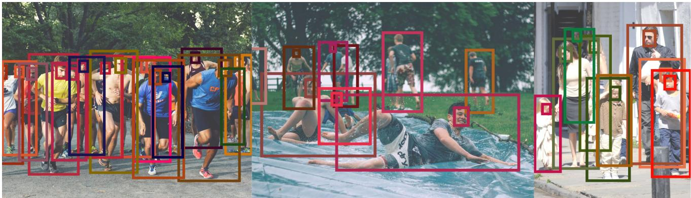
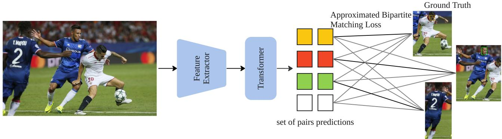
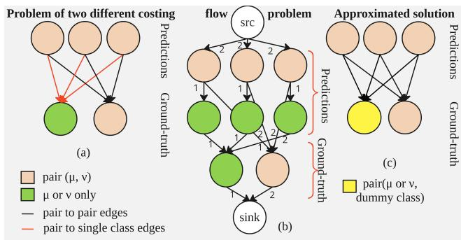
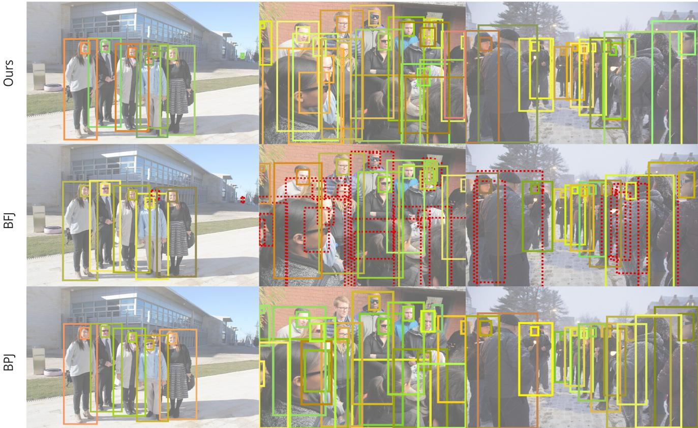

# PairDETR : Joint Detection and Association of Human Bodies and Faces

Ammar Ali MTS AI, ITMO ammarali32@itmo.ru

Georgii Gaikov MTS AI

Denis Rybalchenko VisionLabs

Alexander Chigorin VisionLabs

Ivan Laptev MBZUAI

Sergey Zagoruyko MTS AI, Skoltech

  
Figure 1. Results of our method for crowded scenes. Bounding boxes of the same color correspond to associated bodies and faces.

## Abstract

Image and video analysis requires not only accurate object detection but also the understanding of relationships among detected objects. Common solutions to relation mod eling typically resort to stand-alone object detectors fol lowed by non-differentiable post-processing techniques. Recently introduced detection transformers (DETR) perform end-to-end object detection based on a bipartite matching loss. Such methods, however, lack the ability to jointly detect objects and resolve object associations. In this paper, we build on the DETR approach and extend it to the joint detection ofobjects and their relationships by introducing an approximated bipartite matching. While our method can generalize to an arbitrary number ofobjects, we herefocus on the modeling of object pairs and their relations. In particular, we apply our method PairDETR to the problem of detecting human bodies andfaces, and associating themfor the same person. Our approach not only eliminates the needfor hand-designed post-processing but also achieves excellent resultsfor body-face associations. We evaluate PairDETR on the challenging CrowdHuman and CityPersons datasets and demonstrate a large improvement over the state ofthe art. Our training code and pre-trained models are available at https://github.com/mts-ai/pairdetr

## 1. Introduction

The detection of objects and their relationships is one of the key challenges in computer vision. It involves the prediction of bounding boxes for given object categories and assigning pairs of detected objects to particular relations.

For example, the detection of human faces and bodies, as well as the association of them for the same person, is essential for applications including human-computer interaction (gestures detection), gaming (in virtual reality), fitness and sport (from virtual coaching to automated match tracking), mass market (virtual try-on), and many others.

Person detection is a well-studied problem in computer vision. However, common approaches often focus on detecting human bodies, faces, and heads in isolation, without considering relationships among them. Given face and body detections, typical systems resolve object relations based on ad-hoc post-processing techniques, such as non-maxima suppression followed by the matching of overlapping object bounding boxes.

In this work, we formulate the detection and association of object pairs as a graph prediction problem. While applying transformer-based set prediction methods would result in a NP-hard matching problem, we propose an approximated solution formulated in terms of bipartite matching. We adopt the Deformable DETR architecture [33] and reformulate it to predict object pairs releasing PairDETR. Fig 2 illustrates how our proposed system was trained. For each input image, we extract the embedding using the ResNet-50 backbone, followed by an encoder-decoder transformer. For each query, the decoder predicts a pair that contains information about the detected body and the associated face, if any.

  
Figure 2. PairDETR extracts embeddings using ResNet-50 followed by a transformer to predict pairs. During training, pairs are matched with ground-truth and corrected using approximated matching loss.

We validate our method on the popular benchmarks for pedestrian detection and association, CrowdHuman and CityPersons. The log-average miss-matching rate mMR-2 is a metric that was introduced in the BFJ paper [25] to evaluate the association performance. Our experiments demonstrate that the proposed method improves association by reducing the log-average miss-matching rate mMR-2 , while having comparable results with the models trained only for detection in terms of AP.

On CrowdHuman, our method achieves 42% mMR-2 which outperforms the state-of-the-art [31] method by 8% Fig. 1 illustrates a range of difficult scenarios that involve a variety of body postures, partially visible bodies and faces, as well as multiple individuals standing in a row. To summarize, the contributions of our paper are the following:

1. We propose a new end-to-end method for joint pair detection and association using DETR-based detectors.

2. We show that our method PairDETR achieves state-ofthe-art body-face association results in the CrowdHuman and CityPersons datasets while maintaining comparable detection performance, without requiring complex postprocessing techniques.

3. We propose to use approximate bipartite matching to handle cases with no associations, which allows us to take advantage of body-head annotations.

## 2. Related work

Our method is inspired by prior work on transformer-based methods for object detection and graph prediction as well as CNN-based models for body-face association.

Transformer-based object detection. DETR [3] propose to redefine object detection as a set prediction problem. A feature extractor based on the convolutional neural network (ResNet-50) is followed by an encoder-decoder trans former to map embeddings to a fixed set of object-bounding boxes. During training, the bipartite matching between the predicted and ground truth object boxes is used to compute the loss for the optimal assignment. Recent follow up works [12, 17, 24, 27, 30, 33] extend DETR and introduce several improvements. For example, PED-DETR [12] addresses pedestrian detection in crowd scenes and modifies the DETR transformer decoder with rectified attention.

Iter-E2EDET [30] proposes an iterative label assignment, a relation information extractor and a query update procedure to refine features of noisy queries. Previous DETR-based methods mainly aim at object detection and cannot be directly extended to object detection and association without additional post-processing. In our work, we build on deformable DETR [33] and extend it by adapting the matching procedure

to handle object pair detection and association.

Inspired by DETR, VectorMapNet [14] addresses autonomous driving and defines the semantic map problem in terms of a sparse set detection. From multiple input images and sensor data embedded to the same hyperspace it predicts the surrounding environment components as a graph with information about the road, other vehicles and intersections. MapTR[11] presents a similar approach using RGB camera images only, the research introduces a permutationequivalent modeling for the predicted graph nodes to avoid the ambiguity and stabilizing the training. More related to our work, HOTR[8] extends DETR by formulating the detection of human-object interactions as a graph prediction problem. HOTR performs pair detection under assumption that the output is always a pair and the goal is to predict the relation between two objects from the input image. Similar to this work, our method also extends DETR and solves the graph prediction for the face-body detection and association problem, but does not assume a pair output always and can handle cases with missing associations in the image (detect only body if there is no visible face).

Detection and association methods. Prior to DETR, object detectors such as Faster R-CNN [13, 20] and YOLO [2, 19, 26] were typically based on convolutional feature extractors followed by decoders with non-maximum suppression (NMS). Such detectors make predictions using anchors or grids and require hand-designed post-processing steps. Some other anchor-free detectors use set-based bipartite matching losses as proposed in these researches[6][1] or non-unique assignment rules like RetinaNet [13], CenterNet [32] with convolutional or/and fully connected layers, but still require non-differentiable post-processing steps. For this reason, the extension of such methods to the problem of detecting and associating object pairs is difficult.

Recent methods for detecting and associating faces and bodies resort to independent object detection followed by relationship discriminating modules for matching JointDet [4], or using double anchors RPN to capture the body and face simultaneously Double Anchor R-CNN, [28].

BFJ [25] proposes an inspiring approach where faces and bodies are detected separately and then matched using an embedding matching loss and head boxes as hooks. The recent BPJ method [31] modifies the YOLO head to handle the detection of body parts and extends the object representation to include the center location offsets for the body and its parts. PETR [23] extends DETR for body parts association to solve human pose estimation problem by using multiple pose queries trained to estimate a set of full-body poses refined by a joint detector. Our proposed PairDETR keeps the end-to-end training property of DETR and extends DETR by resolving object associations. While we here apply PairDETR to faces and bodies, our method can generalize to the detection and association of multiple objects In contrast to PETR, we suggest an alternative approach for addressing the tasks of pair detection and association. Instead of em ploying multiple queries for joints, pose, and coordinates as in PETR, our method forecasts pairs for each query individually. To accomplish this, we utilized an approximated bipartite matching loss, which sets us apart from all previous methods.

## 3. Method

This section offers a concise overview of the transformerbased models known as the DETR family. Subsequently, we present the joint detection and association problem in terms of graph theory to illustrate why obtaining the matching loss in polynomial time is not possible. The problem becomes NP-hard when we blindly extend DETR for graph prediction. Then, we propose an approximation to map this problem to simple bipartite matching and the necessary modifications to Deformable DETR based on the suggested approximation.

## 3.1. DETR and set prediction models

We begin by briefly reviewing the DETR method, as it introduced a new concept to reformulate the object detection problem as a set prediction problem. The objective was to provide an end-to-end object detection baseline that doesn’t require any hand-designed post-processing like Non Maximum Suppression.

DETR predicts N boxes b with corresponding class probabilities, where N is higher than the maximum number of boxes on any image in the dataset. During training, bipartite matching is performed between the predictions and the ground truth to eliminate false positives and classify them as the no-object class. The loss is then calculated and propa gated back for the matched pairs and the no-object outputs. The loss function is defined as follows:

$$
\mathcal { L } ( y , \hat { y } ) = \sum _ { i = 1 } ^ { N } \left[ - \log \hat { p } _ { \hat { \sigma } ( i ) } ( c _ { i } ) + 1 _ { \{ c _ { i } \neq \varnothing \} } \mathcal { L } _ { \mathrm { b o x } } ( b _ { i } , \hat { b } _ { \hat { \sigma } } ( i ) ) \right] ,\tag{1}
$$

where $\hat { p }$ indicates the probability for a particular class, ˆb and b correspond to the predicted and ground-truth bounding boxes in order, c is the target class and, $y , \hat { y }$ refer to the ground-truth and the model’s output, respectively. σˆ is the optimal assignment result from the bipartite matching. − log $\hat { p } _ { \hat { \sigma } ( i ) } ( \boldsymbol { c } _ { i } )$ is the weighted cross-entropy loss, and $\mathcal { L } _ { \mathrm { b o x } } ( b _ { i } , \hat { b } _ { \hat { \sigma } } ( i ) )$ consists of the weighted sum of the $\ell _ { 1 }$ loss and GIoU loss [21] between bounding boxes.

## 3.2. Joint detection and association problem

Graph prediction methods. Representing object detection as a set prediction problem requires matching between predictions and ground truth. In DETR, the matching is one-to-one, resulting in a bipartite matching problem. To ensure the optimal assignment between each prediction and ground truth, we can find the minimum matching cost using the Hungarian algorithm [10], Maximum Matching [18], or MinCost MaxFlow.

In pair matching, where each node in the ground truth or predictions is a pair, the same solution for the optimal assignment remains valid. The only difference lies in the cost calculation, where instead of considering the cost of matching one object to another, it considers the total cost of matching each object in the pairs to their correspondences.

When we address the challenge of linking pairs of ground truth and predictions, we encounter a situation in which each node in the ground truth may not always represent an ob ject or a pair but can be one or the other. As a result, the graph is no longer bipartite, as the edges that connect two pairs are different from those connecting a pair to a single object. However, for the sake of simplicity, let’s visualize it as a bipartite graph with two types of edges and nodes. The ground truth nodes are divided into two types: type A indicates that the node is a (class or class ) object, From this point, we will refer to class as $\mu$ and for class as ν while type B indicates that the node is a pair (µ-ν). In broad terms, there will be n different types of nodes, and the graph’s complexity will increase exponentially. To provide a simplified representation, we will require approximately $2 ^ { n }$ classes to predict a graph with nclasses, as further elaborated later on. In Fig.3(a), we present our graph problem for pair case, the costs of the red edges correspond to the matching cost of only one class, while the cost of the black edges represents the pair-matching cost. We cannot directly apply maximum bipartite matching because the costs are different. To better understand the complexity of the problem, we can reformulate the graph into a flow problem. As shown in Fig.3 (b), we can divide each pair node into two nodes: one representing a pair and the other representing a single object. The edges between prediction pairs and ground truth pairs will have a capacity of two because we match two boxes at once, and the cost is equal to the matching cost of the pair (total of matching each object). If the flow passes through this edge, the cost is fixed regardless of the flow value. The edge between two objects alone no association has a capacity equal to one, and the cost of matching only that object. It is a known graph problem called FixedCost MaxFlow, but unfortunately this is an NP-hard problem [7][9]. To overcome this problem, let us list our graph and the problem properties:

  
Figure 3. (a). The left side represents the predictions as pairs, while the right side shows the ground truth, which has two types of nodes (pair or a single object). (b) Middle figure represents the graph as a flow problem. (c) Approximation of the problem as a bipartite matching using the head annotations

1. While the actual cost value is not a goal, it is important to minimize the total cost, and determine flow paths.

2. The final flow value is known and is equal to $f = 2 m + n$ where m is the number of target pairs and n is the number of target objects without pair.

## 3. The capacities on the graph equal to 1 or 2

The approximate bipartite matching of the previous problem is based on mapping it to a special case. As stated above, the capacity values differ between one and two since $\mu$ could be presented in the absence of ν and vice versa. Therefore, if we can guarantee that $\mu$ and ν always exist as a pair, then the capacity of each edge is identical. Then, the problem can be presented as a maximum matching problem that is solvable in $\mathcal { O } ( V E )$ where V is the number of vertices and $E$ is the number of edges. From above, if $\mu$ or ν is missing and we can add a representative node of the missing class to the graph that has similar cost criteria, then we can approximately map the problem back to being solvable in polynomial time. Let us name the added nodes as relatively estimated class $\hat { \mu }$ and relatively estimated class $\hat { \nu }$ for $\mu$ and ν in order. Then we propose our cost as follows:

$$
\begin{array} { r } { C _ { \mathrm { p a i r } } = f _ { 1 } \cdot C _ { \mu } + \left( 1 - f _ { 1 } \right) \cdot C _ { \hat { \mu } } } \\ { + f _ { 2 } \cdot C _ { \nu } + \left( 1 - f _ { 2 } \right) \cdot C _ { \hat { \nu } } \ , } \end{array}\tag{2}
$$

where $f _ { 1 }$ and $f _ { 2 }$ equals one in case it is an original node and zero in case of a relatively estimated node. The cost for a particular matched pair follows the costing used on the Deformable DETR [33]. The generalization of the proposed approach is as follows: for any fixed-cost MaxFlow problem, (1) there is a possibility to replace the nodes with other types; (2) the capacity measurement is unified over all edges; and (3) the cost of the new edges is obtainable. Using these principles, we can map the problem to an approximated maximum matching problem. In our experiments on the face-body detection and association problem, we used head annotations as the relatively estimated face when the face is not visible. We experimentally show in section 4.2 that head annotations are not necessary and can be replaced by a geometric approximation.

## 3.3. PairDETR architecture

We propose architecture that we call PairDETR architecture, inspired by Deformable DETR, an enhanced version of DETR. Deformable DETR improves upon the slow convergence issue and provides better detection of small objects.

As mentioned in section 3.3, our approximate matching criteria requires annotations for invisible parts or annotations similar to visible ones, which we call relatively expected class annotations. The proposed matching approach requires the model to predict the relatively expected class when one of the classes is invisible.

This setup means that the model always recognizes pairs, even if the face is not visible. Therefore, we need to add an additional class to indicate that the detected face is a relatively expected face, so the total number of classes is three. In general, if there are cases where the face is visible and the body is not, we need to add a fourth class As previously stated, the number of classes is $2 ^ { n }$ , where n represents the number of objects that need to be detected and associated. to distinguish between all cases during inference. The use of head annotations provides an advantage to our system, as it enables head detection when faces are not visible, which is particularly useful in many systems. The proposed method is not specific to Deformable DETR; it could be extended to any set prediction model. We chose Deformable DETR as a benchmark for extending set prediction models for graph prediction without additional box refinement steps in two stages: Relation Net or hybrid matching [33][30]. We believe that simplicity reflects the strength of our method.

Table 1. Comparison between our model and state of the art on CityPersons dataset. PairDETR outperforms BFJ method on the association on all scenarios while maintaining comparable mAP results
<table><tr><td rowspan="2">Model</td><td rowspan="2">AP face↑</td><td rowspan="2">AP body↑</td><td colspan="4"> $\mathrm { m M R } ^ { - 2 }$ </td></tr><tr><td>reasonable↓</td><td>partial↓</td><td>bare↓</td><td>heavy↓</td></tr><tr><td>RetinaNet + BFJ[25]</td><td>36.2</td><td>79.3</td><td>39.5</td><td>41.5</td><td>38.5</td><td>63.1</td></tr><tr><td>FPN + BFJ[25]</td><td>68</td><td>84.4</td><td>32.7</td><td>30.6</td><td>33.0</td><td>53.5</td></tr><tr><td>BPJDet-L [31]</td><td>61</td><td>75.5</td><td>26.4</td><td>27.7</td><td>25.5</td><td>46.2</td></tr><tr><td>PairDETR (ours)</td><td>70.2</td><td>84.1</td><td>22.22</td><td>21.28</td><td>22.77</td><td>37.83</td></tr></table>

Following DETR, we predict a fixed number of pairs, and perform an approximated bipartite matching between the ground truth pairs and the predicted pairs. The matching cost is determined by the sum of the costs of body bounding box matching and face or head bounding box matching. To solve the linear assignment problem, we use the Hungarian algorithm, which produces a distinctive match for each pair based on the ground truth. Finally, we calculate the losses for each bounding box in the pair independently.

## 4. Experiments

We first validate that our method outperforms state-of-theart methods in terms of association quality. We provide a detailed ablation of the matcher compared to other approximated solutions and also demonstrate the impact of the predicted relative points on the performance. We show that adding the association to Deformable DETR doesn’t affect the detection performance. We will provide source code for reproducing the experiments, along with pretrained model weights.

Datasets. To validate PairDETR , we selected two popular datasets for pedestrian detection: CrowdHuman [22] and CityPersons [29]. CrowdHuman consists of 15k images for training with head and body annotations. It contains a total of 340k person annotations for invisible or visible body/head parts , and 4.3k images for validation. BFJ authors [25] provided supplementary annotations for the faces, which we used for training to compare with their results. On average, there are 23 person bounding boxes per image in the dataset.

The CityPersons dataset consists of 500 validation images and 3k training images with around 19k bounding boxes in total, and an average of 7 person annotations per image.

Technical details. We train our model with an initial learning rate of 4·10−5 with a step schedule to drop the LR by 0.1 at epoch 40. The model is trained for 50 epochs in total on six GPUs with batch size of 1 per card. We use the AdamW optimizer [15] with a weight decay of 0.0001. The model has been trained in two stages: in the first stage, we used COCO initial weights to fine-tune our model on the CrowdHuman without association. The second stage of training uses the first stage resulting weights as initial weights, freezing the backbone, and adding the association matcher. We trained our model with dynamic resizing, where the longest size is 1400 with padding following COCO transforms for the CrowdHuman dataset and 2048 × 1024 image size for the CityPersons dataset.

Statistical significance. To ensure the reproducibility and stability of our method we trained the model multiple times on the CrowdHuman dataset with different random seeds, we were able to get almost the same results: (1) the mean value for $\mathrm { A P _ { b o d y } }$ equals to 87.04 and the standard deviation (std) is 0.043; (2) the mean value for $\mathrm { A P _ { f a c e } }$ equals to 72.55 and the standard deviation is 0.43; (3) the mean value of $\mathrm { m } \mathbf { M } \mathbf { R } ^ { - 2 }$ equals to 42.7 and the standard deviation is 0.28.

## 4.1. Comparison with other methods

We pick BFJ and BPJDet as baselines to compare with our method. BFJ is a strong baseline due to the results on Crowd-Human and CityPersons datasets, so we choose it as a main baseline. BPJDet uses a different backbone, significantly higher image resolution than BFJ, and thus not directly comparable neither to BFJ nor to ours. Moreover we concentrate on the association results and changing the backbone will directly reflect on the AP results.

In table 1 we present our results against the state of the art for the CityPersons dataset. Our method outperforms the BFJ and BPJ methods in $\mathrm { m M R } ^ { - 2 }$ with a large gap in all scenarios while keeping comparable or higher detection metrics. It is important to mention that the models are trained with different image sizes on this dataset: BFJ with 3072 × 1536 resolution, BPJ with $1 5 3 6 \times 1 5 3 6$ . Also, initial weights of BPJ and PairDETR are trained on COCO, and BFJ on ImageNet. In table 2 we present our results for the Crowd-Human dataset. Our method also outperforms the BFJ and BPJ methods in $\mathrm { m } \mathbf { M } \mathbf { R } ^ { - 2 }$ with a large gap in different splits.

Table 2. Comparison between Our model and the state of the art on CrowdHuman dataset. Our model outperforms it with 33.3% reduction to the mMR-2 results in comparison with (1 stage), and 20% reduction in comparison with (2 stages). \*indicates the numbers calculated using our scripts and not mentioned in the original papers.
<table><tr><td rowspan="2">Model</td><td rowspan="2">AP face↑</td><td rowspan="2"> $\mathbf { A P b o d y } \uparrow$ </td><td colspan="6"> $\mathrm { m } \mathrm { { M R } } ^ { - 2 }$ </td><td rowspan="2">Backbone</td><td rowspan="2">E2E</td></tr><tr><td>reasonable↓</td><td>partial↓</td><td>bare↓</td><td>heavy↓</td><td>hard↓</td><td>all.↓</td></tr><tr><td>RetinaNet + BFJ[25]</td><td>58.7</td><td>80</td><td></td><td></td><td></td><td></td><td></td><td>63.7</td><td>ResNet-50</td><td>x</td></tr><tr><td>CrowdDet + BFJ[25]</td><td>70.5</td><td>90.3</td><td></td><td></td><td></td><td></td><td></td><td>52.3</td><td>ResNet-50</td><td>x</td></tr><tr><td>BPJDet-L [31]</td><td>81.6</td><td>89.5</td><td> $4 2 . 5 ^ { * }$ </td><td>50.58*</td><td>34.45*</td><td>72.79*</td><td>77.30*</td><td>50.1</td><td>YOLOv5</td><td>x</td></tr><tr><td>FPN + BFJ[25]</td><td>69.9</td><td>88.7</td><td>42.96*</td><td>48.2*</td><td>37.96*</td><td>67.31*</td><td>71.44*</td><td>52.5</td><td>ResNet-50</td><td>x</td></tr><tr><td>FPN + POS[25]</td><td>71.1</td><td>87.9</td><td> $5 5 . 4 9 ^ { * }$ </td><td> $6 2 . 0 ^ { * }$ </td><td> $4 8 . 2 ^ { * }$ </td><td>80.98*</td><td>84.58*</td><td>66.4</td><td>ResNet-50</td><td>x</td></tr><tr><td>PairDETR (ours)</td><td>72.6</td><td>87.17</td><td>35.25</td><td>38.12</td><td>30.38</td><td>52.47</td><td>55.75</td><td>42.9</td><td>ResNet-50</td><td>√</td></tr></table>

CrowdDet is capable of achieving higher $\mathrm { A P _ { b o d y } }$ results due to its use of additional post processing (refinement and a special set NMS for crowd scenes); without it, the $\mathrm { A P _ { b o d y } }$ drops to 87.4% as reported in the paper [5]. Moreover, the authors of the BFJ [25] provide pretrained weights for the FPN + BFJ model and not CrowdDet therefore, our extended comparison and visualization will be held against this model.

As mentioned above, BPJDet-L uses another backbone and larger images sizes which explains the higher AP results for CrowdHuman and lower AP results for CityPersons especially for the face class. One of the main challenges faced by DETR-based methods is detecting small objects. To analyze this issue, we split the data into small-medium and large body bounding boxes using the standard thresholds, and compare our method with BPJDet on CrowdHuman. Our method has demonstrated superior performance in all scenarios in association, despite having a different backbone and resolution compared to BPJDet. Specifically, it has shown better association results and more accurate detection outcomes for the large split. In table 3, we report AP and $\mathbf { m } \mathbf { M } \mathbf { R } ^ { - 2 }$ results for our model against BPJDet for the large split. For more qualitative results and computational effort comparison we refer the reader to supplementary material.

Table 3. Comparison between our model and BPJ method in terms average precision and miss-matching rate for large body bounding boxes larger than 96x96 pixels with their corresponding faces.
<table><tr><td>Model</td><td>AP face ↑</td><td>AP body↑</td><td> $\mathrm { m M R } ^ { - 2 } \downarrow$ </td></tr><tr><td>BPJDet-L[31]</td><td>90.89</td><td>90.17</td><td>53.81</td></tr><tr><td>PairDETR (ours)</td><td>89.65</td><td>93.14</td><td>41.31</td></tr></table>

Detailed $\mathbf { m } \mathbf { M } \mathbf { R } ^ { - 2 }$ Comparison. We have followed the BFJ way of calculating the mMR-2 : (1) The face and body IoU with ground truth are higher than 0.5; (2) the two boxes (face and body) on the ground truth belong to the same person. For a detailed comparison of the mMR-2 values, we have used the visibility threshold to split the dataset into (reasonable, bare, partial, heavy, and hard) with the following visibility ranges (0.65:1, 0.9:1, 0.65:0.9, 0:0.65, 0:0.5).

In Fig. 4, we show some examples of how our model works in comparison with the baselines BFJ and BPJ in difficult scenarios: (1) when the face is barely visible; (2) when the scene is crowded with intersections between bodies; and (3) when there is only face visible (people in front of each others). In Fig. 1 we show how our model performs over different challenging scenarios.

## 4.2. Ablation

For the ablation study, we concentrate on three main points: (i) the effect of adding associations to the detection results; (ii) the matching approximation impact on the AP and mMR-2 outcomes is assessed by comparing it to various other approximations for the matching cost; (iii) the effect of the adaptive relative points.

Detection results with/without association. As shown in Table 4, Deformable DETR achieves $\mathrm { A P _ { b o d y } }$ 86.5% and $\operatorname { A P } _ { \mathrm { f a c e } }$ 72.2% without association on the CrowdHuman dataset. After adding association, we gain 0.4% for $\mathrm { A P _ { f a c e } }$ and 0.6% for $\mathrm { A P _ { b o d y } }$ The addition of association in the model has led to a slight improvement in its performance, which suggests that extending DETR-based models for pairs detection or graph prediction can maintain good performance for more complex tasks. Furthermore, it indicates that using recent DETR-based models can enhance the detection and association for this particular task.

The matching method impact on AP and $\mathbf { m } \mathbf { M } \mathbf { R } ^ { - 2 }$ results. We have tried different approximations for the matching problem mentioned in Section 3.2. The results illustrate that our method outperforms all other approximations, as shown in table 5. The concept of body approximation involves evaluating the cost of aligning body predictions with the actual ground truth, disregarding the presence of the face when it is not visible, and then doubling the body cost to serve as the flow value for the pair. This approach was influenced by the work of [9]. The basic approximation suggests that we treat the pair flow as equal to one, transforming our problem into a maximum matching problem in line with the conventional object detection method, DETR. The cost formulas are similar to the body approximation, but without doubling the body cost. For a detailed comparison with visualization, we refer the reader to supplementary material. Based on our findings, it appears that our proposed method outperforms other approaches when it comes to estimating the matching cost, as there is a significant difference in the results obtained. Additionally, our Basic and Body approximations were also able to surpass the current state-of-the-art in terms of association performance.

  
\_ Colored boxes indicates correct detection and association $\overline { { \underline { { \mathbf { \Pi } } } } } = \equiv \equiv \mathbf { \frac { \partial \mathbf { \sigma } } { \partial \mathbf { \sigma } } }$ Red dashed boxes indicates correct detection and no association

Figure 4. Visual comparison between our method, BFJ and BPJ, we choose these images from the validation set with partially visible faces and crowd scenes, to show the robustness of our method.  
Table 4. Comparison between different runs specification for our model. Adding association enhanced the $\mathrm { A P _ { f a c e } }$ by 0.4% and $\mathrm { A P _ { b o d y } }$ by 0.6%.
<table><tr><td>Association</td><td>training stage</td><td> $\mathrm { { A P } _ { f a c e } \uparrow }$ </td><td> $\mathbf { A P _ { b o d y } } \uparrow$ </td><td>initial weights</td></tr><tr><td>x</td><td>1</td><td>71.4</td><td>85.9</td><td>COCO</td></tr><tr><td>x</td><td>2</td><td>72.2</td><td>86.5</td><td>stage1</td></tr><tr><td>√</td><td>2</td><td>72.6</td><td>87.1</td><td>stage1</td></tr></table>

Table 5. Comparison between different matching approximations, our approximation outperforms other methods on both AP and mMR-2
<table><tr><td>Matching method</td><td> $\mathrm { { A P } _ { f a c e } \uparrow }$ </td><td> $\mathrm { A P _ { b o d y } \uparrow }$ </td><td> $\mathrm { m } \mathbf { M } \mathbf { R } ^ { - 2 } \downarrow$ </td></tr><tr><td>Basic</td><td>71.4</td><td>84.26</td><td>45.29</td></tr><tr><td>MinCost MaxFlow</td><td>61.5</td><td>80.3</td><td>76.9</td></tr><tr><td>Body Approximation</td><td>68.4</td><td>86.05</td><td>48.67</td></tr><tr><td>Head Approximation</td><td>72.6</td><td>87.1</td><td>42.9</td></tr></table>

Impact of relative point locations. We conduct experiments on the relative points of the deformable attention and find that using them adaptively achieves the best results. Rather than predicting a fixed relative point for each object (face or body), we predict the face relative point for facebody pairs and the body relative point for head-body pairs. This enables us to obtain sampling locations from the deformable attention layer, where the output of the model is still an offset for both with respect to the dynamic relative point. For a better understanding of the relative points influence on the results, we perform the following experiments (Table 6):

1. Relative points only for the body: we predict the body location as an offset of the predicted relative points; the same is true for the face, but the sampling location was calculated with respect to the body.

2. Relative points for the face only: same as the previous one, but vice versa offsets for the face and body, but the sampling location calculated with respect to the face.

3. Adaptive relative points: both (body and face) are predicted as an offset of a single reference point, and the sampling location is calculated adaptively for face when the pair is face-body and for body when the pair is headbody.

For a detailed comparison with visualization, we refer the reader to supplementary material. Our findings indicate that

Table 6. Comparison between different relative points usage, the adaptive method outperforms other methods on the mean AP and mMR-2
<table><tr><td>Relative point</td><td> $\mathrm { { A P } _ { f a c e } \uparrow }$ </td><td> $\mathbf { A P _ { b o d y } } \uparrow$ </td><td> $\mathrm { m } \mathbf { M } \mathbf { R } ^ { - 2 } \downarrow$ </td></tr><tr><td>body</td><td>62.4</td><td>88.3</td><td>47.57</td></tr><tr><td>face</td><td>68.7</td><td>87.6</td><td>43.9</td></tr><tr><td>face and body</td><td>66.1</td><td>85.5</td><td>45.18</td></tr><tr><td>pair adaptive</td><td>72.6</td><td>87.1</td><td>42.9</td></tr></table>

the choice of reference points plays a significant role in determining the outcomes of experiments. To improve the generalizability of this approach, future experiments could explore modifying the deformable attention mechanism to handle multiple reference points per query. However, using a single reference point for objects that are close to each other can be advantageous in reducing the $\mathrm { m } \mathbf { M } \mathbf { R } ^ { - 2 }$ for this specific task.

## Training with body-relatively expected face annotations:

In order to approximate the cost without using head annotations and achieve similar results, we can generate expected faces for the body. These expected faces are generated for pairs where the face is not visible, and are based on the square centered on the top edge of the body annotations, with a fixed ratio α of the body width. We have chosen α to be equal to 0.3. Approximating the missing annotation of invisible parts can also be done with a simple linear regression. As long as the cost mapping is correct, the approximation works. All of our previous experiments were done using head annotations, but as we mentioned above, the use of head annotations is not unavoidable. We trained our model with the same hyper-parameters and environment by replacing the head annotation with a body relatively expected face annotation generated as described in 3.3, and we were able to obtain almost the same results shown in Table 7. This experiment confirms that there is no

Table 7. Comparison between training using original head annotation against body-relatively expected generated annotations
<table><tr><td>body-relatively expected annotations</td><td> $\mathrm { A P _ { f a c e } \uparrow }$ </td><td> $\mathbf { A P _ { b o d y } } \uparrow$ </td><td> $\mathrm { m } \mathbf { M } \mathbf { R } ^ { - 2 } \downarrow$ </td></tr><tr><td>x</td><td>72.6</td><td>87.1</td><td>42.9</td></tr><tr><td>√</td><td>72.9</td><td>87.1</td><td>42.8</td></tr></table>

necessity for additional annotations for the approximated bipartite matching loss, provided we can identify a method to substitute it with fabricated dummy values.

## 4.3. Limitations

PairDETR shows strong performance for pair detection and association. We trained and evaluated it against two opensource datasets. PairDETR built on top of Deformable DETR, which uses deformable attention layers taking only one relative point per query, making it hard to extend the current approach to graph prediction. Using the DETR architecture could solve the issue, but it would suffer from slow convergence and weakness against small object detection and association. Although the recently introduced RT-DETR[16] can help address the challenge of small objects, it is beyond the scope of our paper as our focus is on exploring associations and developing a new approach to enhance DETR-based models for more intricate tasks. One way to extend the method for graph detection is by supporting multi-reference points with deformable attention, but it would still suffer from the problem that the number of classes will grow exponentially. The proposed method needs extra annotations for invisible parts or objects or relatively generated annotations. Therefore, if we cannot obtain or generate such annotations, the method will be limited to other matching approximations.

## 5. Conclusion

We presented PairDETR, an extended version of Deformable DETR, for end-to-end detection and association based on approximated bipartite matching loss for graph prediction. The proposed method outperforms the state-of-the-art results for association while maintaining comparable detection results to other methods on the challenging CrowdHuman and CityPersons datasets. Our proposed approximation for the NP-hard problem is scalable and can handle not only pairs but also multi-object associations. The proposed approximation is a step forward into more appropriate solutions for graph prediction problems, including landmark detection, object detection and association, and many other vision tasks.

## References

[1] Irwan Bello, Barret Zoph, Quoc Le, Ashish Vaswani, and Jonathon Shlens. Attention augmented convolutional networks. In 2019 IEEE/CVF International Conference on Computer Vision (ICCV), pages 3285–3294, 2019. 3

[2] Alexey Bochkovskiy, Chien-Yao Wang, and Hong-Yuan Mark Liao. Yolov4: Optimal speed and accuracy of object detection, 2020. 3

[3] Nicolas Carion, Francisco Massa, Gabriel Synnaeve, Nicolas Usunier, Alexander Kirillov, and Sergey Zagoruyko. End-toend object detection with transformers. In Computer Vision – ECCV 2020, pages 213–229, Cham, 2020. Springer International Publishing. 2

[4] Cheng Chi, Shifeng Zhang, Junliang Xing, Zhen Lei, Stan Z. Li, and Xudong Zou. Relational learning for joint head and human detection. Proceedings of the AAAI Conference on Artificial Intelligence, 34(07):10647–10654, 2020. 3

[5] Xuangeng Chu, Anlin Zheng, Xiangyu Zhang, and Jian Sun. Detection in crowded scenes: One proposal, multiple predictions. In 2020 IEEE/CVF Conference on Computer Vision and Pattern Recognition (CVPR), pages 12211–12220, 2020. 6

[6] Dumitru Erhan, Christian Szegedy, Alexander Toshev, and Dragomir Anguelov. Scalable object detection using deep neural networks. In 2014 IEEE Conference on Computer Vision and Pattern Recognition, pages 2155–2162, 2014. 3

[7] Michael R. Garey and David S. Johnson. Computers and Intractability; A Guide to the Theory ofNP-Completeness. W. H. Freeman & Co., USA, 1990. 4

[8] Bumsoo Kim, Junhyun Lee, Jaewoo Kang, Eun-Sol Kim, and Hyunwoo J. Kim. Hotr: End-to-end human-object interaction detection with transformers. In 2021 IEEE/CVF Conference on Computer Vision and Pattern Recognition (CVPR), pages 74–83, 2021. 2

[9] Sven Oliver Krumke, Hartmut Noltemeier, S. Schwarz, Hans-Christoph Wirth, and Ramamoorthi Ravi. Flow improvement and network flows with fixed costs. 1999. 4, 7

[10] Harold W. Kuhn. The hungarian method for the assignment problem. Naval Research Logistics (NRL), 52, 1955. 3

[11] Bencheng Liao, Shaoyu Chen, Xinggang Wang, Tianheng Cheng, Qian Zhang, Wenyu Liu, and Chang Huang. MapTR: Structured modeling and learning for online vectorized HD map construction. In The Eleventh International Conference on Learning Representations, 2023. 2

[12] Matthieu Lin, Chuming Li, Xingyuan Bu, Ming Sun, Chen Lin, Junjie Yan, Wanli Ouyang, and Zhidong Deng. Detr for crowd pedestrian detection, 2021. 2

[13] Tsung-Yi Lin, Priya Goyal, Ross Girshick, Kaiming He, and Piotr Dollár. Focal loss for dense object detection. In 2017 IEEE International Conference on Computer Vision (ICCV), pages 2999–3007, 2017. 3

[14] Yicheng Liu, Tianyuan Yuan, Yue Wang, Yilun Wang, and Hang Zhao. Vectormapnet: end-to-end vectorized hd map learning. In Proceedings of the 40th International Conference on Machine Learning. JMLR.org, 2023. 2

[15] Ilya Loshchilov and Frank Hutter. Decoupled weight decay regularization. In International Conference on Learning Representations, 2017. 5

[16] Wenyu Lv, Shangliang Xu, Yian Zhao, Guanzhong Wang, Jinman Wei, Cheng Cui, Yuning Du, Qingqing Dang, and Yi Liu. Detrs beat yolos on real-time object detection. ArXiv, abs/2304.08069, 2023. 8

[17] Depu Meng, Xiaokang Chen, Zejia Fan, Gang Zeng, Houqiang Li, Yuhui Yuan, Lei Sun, and Jingdong Wang. Conditional detr for fast training convergence. In 2021 IEEE/CVF International Conference on Computer Vision (ICCV), pages 3631–3640, 2021. 2

[18] Marcin Mucha. Maximum Matching, pages 504–506. Springer US, Boston, MA, 2008. 3

[19] Joseph Redmon and Ali Farhadi. Yolov3: An incremental improvement, 2018. 3

[20] Shaoqing Ren, Kaiming He, Ross Girshick, and Jian Sun. Faster r-cnn: Towards real-time object detection with region proposal networks. IEEE Transactions on Pattern Analysis and Machine Intelligence, 39(6):1137–1149, 2017. 3

[21] Hamid Rezatofighi, Nathan Tsoi, JunYoung Gwak, Amir Sadeghian, Ian Reid, and Silvio Savarese. Generalized intersection over union: A metric and a loss for bounding box regression. In 2019 IEEE/CVF Conference on Computer Vision and Pattern Recognition (CVPR), pages 658–666, 2019. 3

[22] Shuai Shao, Zijian Zhao, Boxun Li, Tete Xiao, Gang Yu, Xiangyu Zhang, and Jian Sun. Crowdhuman: A benchmark for detecting human in a crowd, 2018. 5

[23] Dahu Shi, Xing Wei, Liangqi Li, Ye Ren, and Wenming Tan. End-to-end multi-person pose estimation with transformers. In 2022 IEEE/CVF Conference on Computer Vision and Pattern Recognition (CVPR), pages 11059–11068, 2022. 3

[24] Peize Sun, Rufeng Zhang, Yi Jiang, Tao Kong, Chenfeng Xu, Wei Zhan, Masayoshi Tomizuka, Lei Li, Zehuan Yuan, Changhu Wang, and Ping Luo. Sparse r-cnn: End-to-end object detection with learnable proposals. In 2021 IEEE/CVF Conference on Computer Vision and Pattern Recognition (CVPR), pages 14449–14458, 2021. 2

[25] Junfeng Wan, Jiangfan Deng, Xiaosong Qiu, and Feng Zhou. Body-face joint detection via embedding and head hook. In 2021 IEEE/CVF International Conference on Computer Vision (ICCV), pages 2939–2948, 2021. 2, 3, 5, 6

[26] Chien-Yao Wang, I-Hau Yeh, and Hong-Yuan Mark Liao. You only learn one representation: Unified network for multiple tasks. J. Inf. Sci. Eng., 40(1):691–709, 2024. 3

[27] Hao Zhang, Feng Li, Shilong Liu, Lei Zhang, Hang Su, Jun Zhu, Lionel M. Ni, and Heung-Yeung Shum. DINO: DETR with improved denoising anchor boxes for end-to-end object detection. In The Eleventh International Conference on Learning Representations, ICLR 2023, Kigali, Rwanda, May 1-5, 2023. OpenReview.net, 2023. 2

[28] Kevin Zhang, Feng Xiong, Peize Sun, Li Hu, Boxun Li, and Gang Yu. Double anchor R-CNN for human detection in a crowd. CoRR, abs/1909.09998, 2019. 3

[29] Shanshan Zhang, Rodrigo Benenson, and Bernt Schiele. Citypersons: A diverse dataset for pedestrian detection. In

2017 IEEE Conference on Computer Vision and Pattern Recognition (CVPR), pages 4457–4465, 2017. 5

[30] Anlin Zheng, Yuang Zhang, Xiangyu Zhang, Xiaojuan Qi, and Jian Sun. Progressive end-to-end object detection in crowded scenes. In 2022 IEEE/CVF Conference on Computer Vision and Pattern Recognition (CVPR), pages 847–856, 2022. 2, 5

[31] Huayi Zhou, Fei Jiang, and Hongtao Lu. Body-part joint detection and association via extended object representation. In IEEE International Conference on Multimedia and Expo, ICME 2023, Brisbane, Australia, July 10-14, 2023, pages 168–173. IEEE, 2023. 2, 3, 5, 6

[32] Xingyi Zhou, Dequan Wang, and Philipp Krähenbühl. Objects as points, 2019. 3

[33] Xizhou Zhu, Weijie Su, Lewei Lu, Bin Li, Xiaogang Wang, and Jifeng Dai. Deformable DETR: deformable transformers for end-to-end object detection. In 9th International Conference on Learning Representations, ICLR 2021, Virtual Event, Austria, May 3-7, 2021. OpenReview.net, 2021. 2, 4, 5