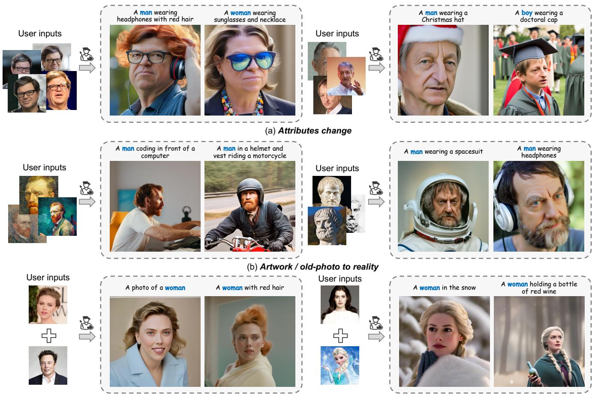
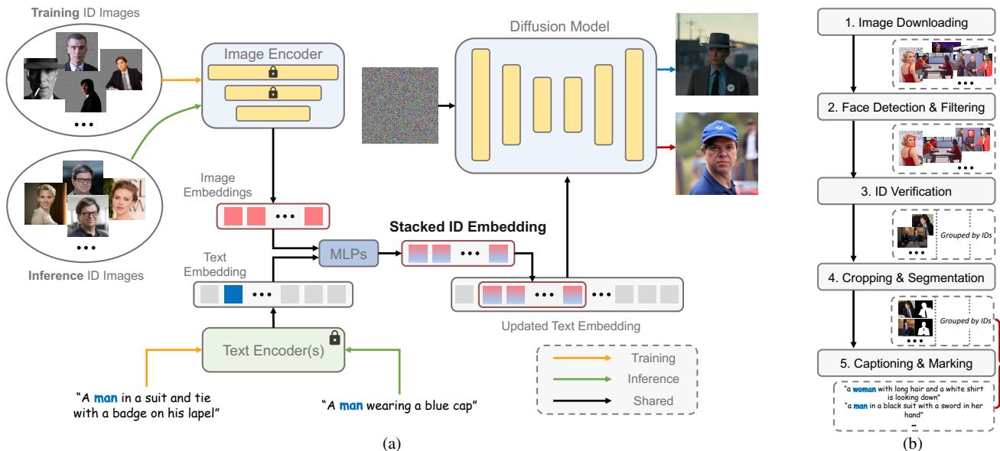
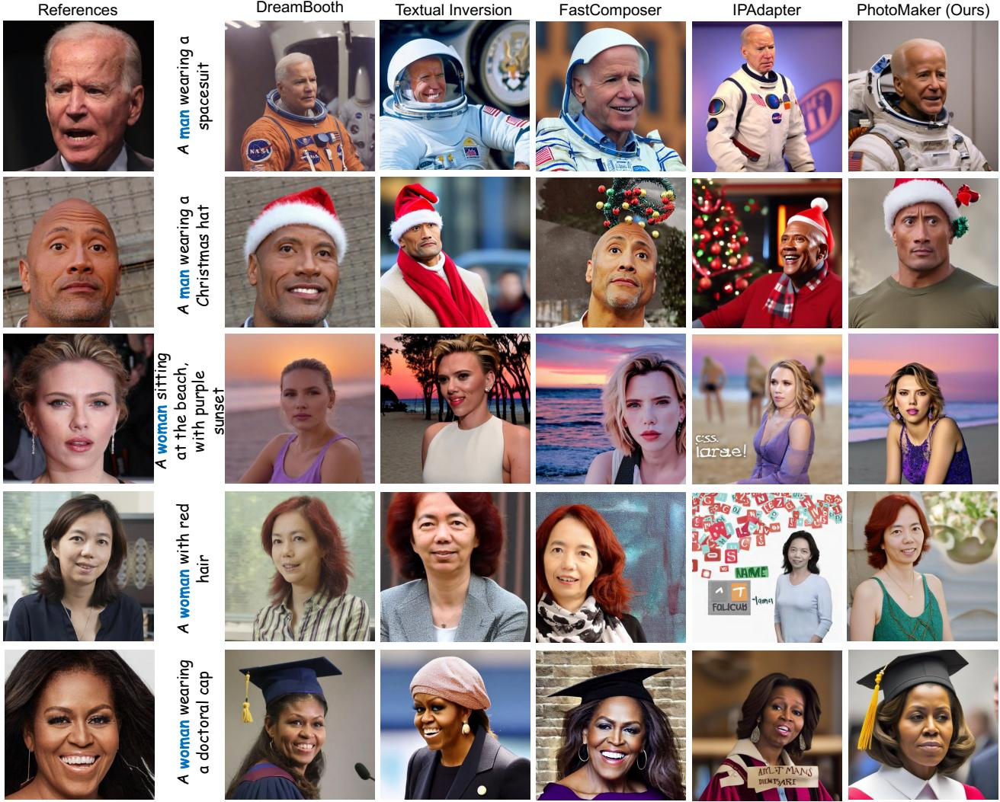
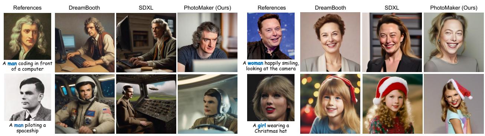
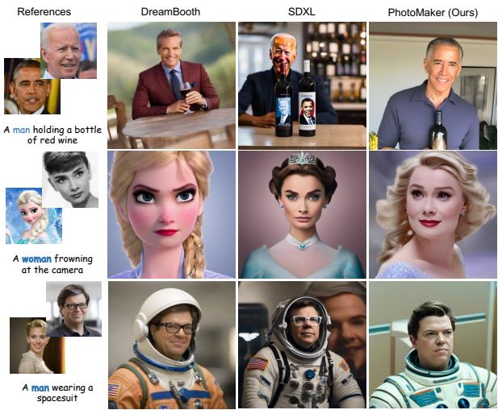

# PhotoMaker: Customizing Realistic Human Photos via Stacked ID Embedding

Zhen Li∗1,2, Mingdeng Cao∗2,3, Xintao Wang†2, Zhongang Qi2, Ming-Ming Cheng†4,1, Ying Shan2 1VCIP, CS, Nankai University 2ARC Lab, Tencent PCG 3The University of Tokyo 4NKIARl, Shenzhen Futian

  
Figure 1. Given a few images of input ID(s), the proposed PhotoMaker can generate diverse personalized ID images based on the text prompt in a single forward pass. Our method can well preserve the ID information from the input image pool while generating realistic human photos. PhotoMaker also empowers many interesting applications such as (a) changing attributes, (b) bringing persons from artworks or old photos into reality, or (c) performing identity mixing. (Zoom-in for the best view)

## Abstract

Recent advances in text-to-image generation have made remarkable progress in synthesizing realistic human photos conditioned on given text prompts. However, existing personalized generation methods cannot simultaneously satisfy the requirements of high efficiency, promising identity (ID) fidelity, and flexible text controllability. In this work, we introduce PhotoMaker, an efficient personalized textto-image generation method, which mainly encodes an arbitrary number of input ID images into a stack ID embedding for preserving ID information. Such an embedding, serving as a unified ID representation, can not only encap sulate the characteristics of the same input ID comprehensively, but also accommodate the characteristics of different IDs for subsequent integration. This paves the way for more intriguing and practically valuable applications. Besides, to drive the training of our PhotoMaker, we propose an ID-oriented data construction pipeline to assemble the training data. Under the nourishment of the dataset constructed through the proposed pipeline, our PhotoMaker demonstrates better ID preservation ability than test-time fine-tuning based methods, yet provides significant speed improvements, high-quality generation results, strong generalization capabilities, and a wide range of applications.

## 1. Introduction

Customized image generation related to humans [15, 30, 37, 56] has received considerable attention, giving rise to numerous applications, such as personalized portrait photos [41], image animation [77], and virtual try-on [67]. Early methods [44, 46], limited by the capabilities of generative models (i.e., GANs [18, 31]), could only customize the generation of the facial area, resulting in low diversity, scene richness, and controllability. Thanks to largerscale text-image pair training datasets [61], larger generation models [49, 58], and text/visual encoders [50, 51] that can provide stronger semantic embeddings, diffusionbased text-to-image generation models have been continuously evolving recently. This evolution enables them to generate increasingly realistic facial details and rich scenes. The controllability has also greatly improved due to the existence of text prompts and structural guidance [45, 75]

Meanwhile, under the nurturing of powerful diffusion text-to-image models, many diffusion-based customized generation algorithms [16, 55] have emerged to meet users demand for high-quality customized results. The most widely used in both commercial and community applications are DreamBooth-based methods [55, 57].

Such applications require dozens of images of the same identity (ID) to fine-tune the model parameters. Although the results generated have high ID fidelity, there are two obvious drawbacks. One is that customized data used for fine-tuning each time requires manual collection and thus is very time-consuming and laborious. The other is that customizing each ID requires 10-30 minutes and consumes many computing resources, especially when the generation model grows. Therefore, to simplify and accelerate the customized generation process, recent works, driven by existing human-centric datasets [31, 38], have trained visual encoders [9, 72] or hyper-networks [2, 56] to represent the input ID images as embeddings or LoRA [25] weights of the model. After training, users only need to provide an image of the ID to be customized, and personalized generation can be achieved through a few dozen steps of fine-tuning or even without any tuning process. However, the results customized by these methods cannot simultaneously possess ID fidelity and generation diversity like DreamBooth (see Fig. 3). There are two major reasons. First, during the training process, both the target image and the input ID image sample from the same image. The trained model easily remembers characteristics unrelated to the ID in the image, such as expressions and viewpoints, which leads to poor editability. Second, relying solely on a single ID image to be customized makes it difficult for the model to discern the characteristics of the ID to be generated from its internal knowledge, resulting in unsatisfactory ID fidelity.

Based on the above two points, and inspired by the success of DreamBooth, in this paper, we aim to: 1) ensure variations in viewpoints, expressions, and accessories between ID and target images, preventing irrelevant information memorization; 2) train the model with multiple different images of the same ID for a comprehensive and accurate representation.

Therefore, we propose a simple yet effective feedforward customized human generation framework that can receive multiple input ID images, termed as PhotoMaker. To better represent the ID information of each input image, we stack the encoding of multiple input ID images at the semantic level, constructing a stacked ID embedding. This embedding can be regarded as a unified representation of the ID to be generated, and each of its subparts corresponds to an input ID image. To better integrate this ID representation and the text embedding into the network, we replace the class word (e.g., man and woman) of the text embedding with the stacked ID embedding. The result embedding simultaneously represents the ID to be customized and the contextual information to be generated. Through this design, without adding extra modules in the network, the cross-attention layer of the generation model itself can adaptively integrate the ID information contained in the stacked ID embedding.

At the same time, the stacked ID embedding allows us to accept any number of ID images as input during inference while maintaining the efficiency of the generation like other tuning-free methods [62, 72]. Specifically, our method requires about 10 seconds to generate a customized human photo when receiving four ID images, which is about 130× faster than DreamBooth. Moreover, since our stacked ID embedding can represent the customized ID more comprehensively and accurately, our method can provide better ID fidelity and generation diversity compared to state-of-theart tuning-free methods. Compared to previous methods, our framework has also greatly improved in terms of controllability. It can not only perform common recontextualization but also change the attributes of the input human image (e.g., accessories and expressions), generate a human photo with completely different viewpoints from the input ID, and even modify the input ID’s gender and age (see Fig. 1).

It is worth noticing that our PhotoMaker also unleashes a lot of possibilities for users to generate customized human photos. Specifically, although the images that build the stacked ID embedding come from the same ID during training, we can use different ID images to form the stacked ID embedding during inference to merge and create a new customized ID. The merged new ID can retain the characteristics of different input IDs. For example, we can generate Scarlett Johansson that looks like Elon Musk or a customized ID that mixes a person with a well-known IP character (see Fig. 1(c)). At the same time, the merging ratio can be simply adjusted by prompt weighting [21, 26] or by changing the proportion of different ID images in the input image pool, demonstrating the flexibility of our framework.

Our PhotoMaker necessitates the simultaneous input of multiple images with the same ID during the training process, thereby requiring the support of an ID-oriented human dataset. However, existing datasets either do not classify by IDs [31, 37, 61, 78] or only focus on faces without including other contextual information [38, 46, 68]. Therefore, we design an automated pipeline to construct an ID-related dataset to facilitate the training of our PhotoMaker. Through this pipeline, we can build a dataset that includes many IDs, each with multiple images featuring diverse viewpoints, attributes, and scenarios. Meanwhile, in this pipeline, we can automatically generate a caption for each image, marking out the corresponding class word [55], to better adapt to the training needs of our framework.

## 2. Related work

Text-to-Image Diffusion Models. Diffusion models [23, 64] have made remarkable progress in text-conditioned image and video generation [4, 32, 52, 54, 58, 69, 71], attracting widespread attention in recent years. The remarkable performance of these models can be attributable to highquality large-scale text-image datasets [7, 60, 61], the continuous upgrades of foundational models [8, 48], conditioning encoders [27, 50, 51], and the improvement of controllability [36, 45, 73, 75]. Due to these advancements, Podell et al. [49] developed the currently most powerful open-source generative model, SDXL. Given its impressive capabilities in generating human portraits, we build our PhotoMaker based on this model. However, our method can also be extended to other text-to-image synthesis models.

Personalization in Diffusion Models. Owing to the powerful generative capabilities of the diffusion models, more researchers try to explore personalized generation based on them. Currently, mainstream personalized synthesis methods can be mainly divided into two categories. One relies on additional optimization during the test phase, such as DreamBooth [55] and Textual Inversion [1, 16, 66]. Given that both pioneer works require substantial time for finetuning, some studies have attempted to expedite the process of personalized customization by reducing the number of parameters needed for tuning [20, 34, 57, 74] or by pretraining with large datasets [17, 56, 65]. Despite these advances, they still require extensive fine-tuning of the pretrained model for each new concept, making the process time-consuming and restricting its applications. Recently, some studies [10, 11, 29, 42, 43, 62, 70] attempt to perform personalized generation using a single image with a single forward pass, significantly accelerating the personalization process. These methods either utilize personalization datasets [10, 63] for training or encode the images to be customized in the semantic space [9, 29, 43, 62, 70, 72]. Our method focuses on the generation of human portraits based on both of the aforementioned technical approaches. Specifically, it not only relies on the construction of an IDoriented personalization dataset, but also on obtaining the embedding that represents the person’s ID in the semantic space. Unlike previous embedding-based methods, our PhotoMaker extracts a stacked ID embedding from multiple ID images. While providing better ID representation, the proposed method can maintain the same high efficiency as previous embedding-based methods. Recent studies [19, 39, 40] also showed how to make different concepts appear in the generated image by training multiple LoRAs, which is different from our approach of semantically integrating multiple IDs.

## 3. Method

## 3.1. Overview

Given a few ID images to be customized, the goal of our PhotoMaker is to generate a new photo-realistic human image that retains the characteristics of the input IDs and changes the content or the attributes of the generated ID under the control of the text prompt. Although we input multiple ID images for customization like DreamBooth, we still enjoy the same efficiency as other tuning-free methods, accomplishing customization with a single forward pass, while maintaining promising ID fidelity and text edibility. In addition, we can also mix multiple input IDs, and the generated image can well retain the characteristics of different IDs, which releases possibilities for more applications. The above capabilities are mainly brought by our proposed simple yet effective stacked ID embedding, which can provide a unified representation of the input IDs. Furthermore, to facilitate training our PhotoMaker, we design a data construction pipeline to build a human-centric dataset classified by IDs. Fig. 2(a) shows the overview of the proposed PhotoMaker. Fig. 2(b) shows our data construction pipeline.

## 3.2. Stacked ID Embedding

Encoders. Following recent works [28, 29, 62, 70], we use the CLIP [50] image encoder $\mathcal { E } _ { i m g }$ to extract image embeddings for its alignment with the output space of the CLIP text encoder in diffusion models. Before feeding each input image into the image encoder, we filled the image areas other than the body part of a specific ID with random noises to eliminate the influence of other IDs and the background. Since the data used to train the original CLIP image encoder mostly consists of natural images, to better enable the model to extract ID-related embeddings from the masked images, we finetune part of the transformer layers in the image encoder when training our PhotoMaker. We also introduce additional learnable projection layers to inject the embedding obtained from the image encoder into the same dimension as the text embedding. Let $\{ X ^ { i } \mid i = 1 \ldots N \}$ denote N input ID images acquired from a user, we thus obtain the extracted embeddings $\{ e ^ { i } \in \mathbb { R } ^ { D } \mid i = 1 \ldots N \}$ , where D denotes the projected dimension. Each embedding corresponds to the ID information of an input image. For a given text prompt T, we extract text embeddings $\bar { t } \in \mathbb { R } ^ { L \times D }$ using the pre-trained CLIP text encoder $\mathcal { E } _ { t e x t }$ , where L denotes the length of the embedding.

  
Figure 2. Overviews of the proposed (a) PhotoMaker and (b) ID-oriented data construction pipeline.

Stacking. Recent works [16, 55, 72] have shown that, in the text-to-image models, personalized character ID information can be represented by some unique tokens. Our method also has a similar design to better represent the ID information of the input human images. Specifically, we mark the corresponding class word (e.g., man and woman) in the input caption (see Sec. 3.3). We then extract the feature vector at the corresponding position of the class word in the text embedding. This feature vector will be fused with each image embedding $e ^ { i } .$ . We use two MLP layers to perform such a fusion operation. The fused embeddings can be denoted as $\{ \hat { e } ^ { i } \in \mathbb { R } ^ { D } \mid i = 1 \ldots N \}$ . By combining the feature vector of the class word, this embedding can represent the current input ID image more comprehensively. In addition, during the inference stage, this fusion operation also provides stronger semantic controllability for the customized generation process. For example, we can customize the age and gender of the human ID by simply replacing the class word (see Sec. 4.2).

After obtaining the fused embeddings, we concatenate them along the length dimension to form the stacked id embedding:

$$
\boldsymbol { s } ^ { * } = \mathtt { C o n c a t } ( [ \hat { e } ^ { 1 } , \ldots , \hat { e } ^ { N } ] ) \quad \boldsymbol { s } ^ { * } \in \mathbb { R } ^ { N \times D } .\tag{1}
$$

This stacked ID embedding can serve as a unified representation of multiple ID images while it retains the original representation of each input ID image. It can accept any number of ID image encoded embeddings, therefore, its length N is variable. Compared to DreamBooth-based methods [55, 57], which inputs multiple images to finetune the model for personalized customization, our method essentially sends multiple embeddings to the model simultaneously. After packaging the multiple images of the same ID into a batch as the input of the image encoder, a stacked ID embedding can be obtained through a single forward pass, significantly enhancing efficiency compared to tuning-based methods. Meanwhile, compared to other embedding-based methods [70, 72], this unified representation can maintain both promising ID fidelity and text controllability, as it contains more comprehensive ID information. In addition, it is worth noting that, although we only used multiple images of the same ID to form this stacked ID embedding during training, we can use images that come from different IDs to construct it during the inference stage. Such flexibility opens up possibilities for many interesting applications. For example, we can mix two persons that exist in reality or mix a person and a well-known character IP

(see Sec. 4.2).

Merging. We use the inherent cross-attention mechanism in diffusion models to adaptively merge the ID information contained in stacked ID embedding. We first replace the feature vector at the position corresponding to the class word in the original text embedding t with the stacked id embedding $s ^ { * } ,$ , resulting in an updated text embedding $t ^ { * } \in \mathbb { R } ^ { ( L + N - 1 ) \times D }$ . Then, the cross-attention operation can be formulated as:

$$
\left\{ \begin{array} { l l } { \mathbf { Q } = \mathbf { W } _ { Q } \cdot \phi ( z _ { t } ) ; \mathbf { K } = \mathbf { W } _ { K } \cdot t ^ { * } ; \mathbf { V } = \mathbf { W } _ { V } \cdot t ^ { * } } \\ { { \sf A t t e n t i o n } ( \mathbf { Q } , \mathbf { K } , \mathbf { V } ) = { \sf s o f t m a x } \big ( \frac { \mathbf { Q } \mathbf { K } ^ { T } } { \sqrt { d } } \big ) \cdot \mathbf { V } , } \end{array} \right.\tag{2}
$$

where $\phi ( \cdot )$ is an embedding that can be encoded from the input latent by the UNet denoiser. d denotes the token dimension. $\mathbf { W } _ { Q } , \mathbf { W } _ { K }$ , and $\mathbf { W } _ { V }$ are projection matrices. Besides, we can adjust the degree of participation of one input ID image in generating the new customized ID through prompt weighting [21, 26], demonstrating theflexibility of our PhotoMaker. Recent works [34, 57] found that ID customization performance can be improved by simply tuning the weights of the attention layers. To make the diffusion model better perceive the ID information contained in the stacked ID embedding, we additionally train the LoRA [25, 57] residuals of the matrices in the attention layers.

## 3.3. ID-Oriented Human Data Construction

Since our PhotoMaker needs to sample multiple images of the same ID for constructing the stacked ID embedding during the training process, we need to use a dataset classified by IDs to drive the training process of our PhotoMaker. However, existing human datasets either do not annotate ID information [31, 37, 61, 78], or the richness of the scenes they contain is very limited [38, 46, 68] (i.e., they only focus on the face area). Thus, in this section, we will introduce a pipeline for constructing a human-centric text-image dataset, which is classified by different IDs. Fig. 2(b) illustrates the proposed pipeline. This dataset not only facilitates the training process of our PhotoMaker but also may inspire potential future ID-driven research. The statistics of the dataset are shown in the appendix.

Image downloading. We first list a roster of celebrities, which can be obtained from VGGFace2 [5]. We search for names in the search engine according to the list and crawled the data. About 100 images were downloaded for each name. To generate higher quality portrait images [49], we filtered out images with the shortest side of the resolution less than 512 during the download process.

Face detection and filtering. We first use RetinaNet [14] to detect face bounding boxes and filter out the detections with small sizes (less than 256 × 256). If an image does not contain any bounding boxes that meet the requirements, the image will be filtered out. We then perform ID verification for the remaining images.

ID verification. Since an image may contain multiple faces, we need first to identify which face belongs to the current identity group. Specifically, we send all the face regions in the detection boxes of the current identity group into Arc-Face [13] to extract identity embeddings and calculate the L2 similarity of each pair of faces. We sum the similarity calculated by each identity embedding with all other embeddings to get the score for each bounding box. We select the bounding box with the highest sum score for each image with multiple faces. After bounding box selection, we recompute the sum score for each remaining box. We calculate the standard deviation δ of the sum score by ID group. We empirically use 8δ as a threshold to filter out images with inconsistent IDs.

Cropping and segmentation. We first crop the image with a larger square box based on the detected face area while ensuring that the facial region can occupy more than 10% of the image after cropping. Since we need to remove the irrelevant background and IDs from the input ID image before sending it into the image encoder, we need to generate the mask for the specified ID. Specifically, we employ the Mask2Former [12] to perform panoptic segmentation for the ‘person’ class. We leave the mask with the highest overlap with the facial bounding box corresponding to the ID. Besides, we choose to discard images where the mask is not detected, as well as images where no overlap is found between the bounding box and the mask area.

Captioning and marking We generate a caption for each cropped image using BLIP2[35]. Captions without a class word (e.g., man, woman, boy) are regenerated until one appears. The class word is singularized to focus on a single ID and its position is marked. Captions with one class word are directly annotated. For multiple class words, the most frequent one is chosen for the current identity group. Each caption in the group is matched and marked with the group’s class word. If a caption lacks the matching class word, we segment it using a dependence parsing model[24]. The CLIP score[50] between the sub-caption and the specific ID region in the image is calculated, as is the label similarity between the current segment’s class word and the identity group’s class word using SentenceFormer[53]. The class word with the highest product of the CLIP score and label similarity is marked.

## 4. Experiments

## 4.1. Setup

Implementation details. To generate more photorealistic human portraits, we employ SDXL model [49] stable-diffusion-xl-base-1.0 as our text-toimage synthesis model. Correspondingly, the resolution of training data is resized to 1024 × 1024. We employ CLIP ViT-L/14 [50] and an additional projection layer to obtain the initial image embeddings ei. For text embeddings, we keep the original two text encoders in SDXL for extraction. The overall framework is optimized with Adam [33] on 8 NVIDIA A100 GPUs for two weeks with a batch size of 48. We set the learning rate as 1e − 4 for LoRA weights, and 1e − 5 for other trainable modules. During training, we randomly sample 1-4 images with the same ID as the current target ID image to form a stacked ID embedding. Besides, to improve the generation performance by using classifierfree guidance, we have a 10% chance of using null-text embedding to replace the original updated text embedding t∗. We also use masked diffusion loss [3] with a probability of 50% to encourage the model to generate more faithful IDrelated areas. During the inference stage, we use delayed subject conditioning [72] to solve the conflicts between text and ID conditions. We use 50 steps of DDIM sampler [64]. The scale of classifier-free guidance is set to 5.

Evaluation metrics. Following DreamBooth [55], we use DINO [6] and CLIP-I [16] metrics to measure the ID fidelity and use CLIP-T [50] metric to measure the prompt fidelity. For a more comprehensive evaluation, we also compute the face similarity by detecting and cropping the facial regions between the generated image and the real image with the same ID. We use RetinaFace [14] as the detection model. Face embedding is extracted by FaceNet [59]. To evaluate the quality of the generation, we employ the FID metric [22, 47]. Importantly, as most embedding-based methods tend to incorporate facial pose and expression into the representation, the generated images often lack variation in the facial region. Thus, we propose a metric, named Face Diversity, to measure the diversity of the generated facial regions. Specifically, we first detect and crop the face region in each generated image. Next, we calculate the LPIPS [76] scores between each pair of facial areas for all generated images and take the average. The larger this value, the higher the diversity of the generated facial area.

Evaluation dataset. Our evaluation dataset includes 25 IDs, which consist of 9 IDs from Mystyle [46] and an additional 16 IDs that we collected by ourselves. Note that these IDs do not appear in the training set, serving to evaluate the generalization ability of the model. To conduct a more comprehensive evaluation, we also prepare 40 prompts, which cover a variety of expressions, attributes, decorations, actions, and backgrounds. For each prompt of each ID, we generate 4 images for evaluation. More details are listed in the appendix.

## 4.2. Applications

In this section, we will elaborate on the applications that our PhotoMaker can empower. For each application, we choose the comparison methods which may be most suitable for the corresponding setting. The comparison method will be chosen from DreamBooth [55], Textual Inversion [16], Fast-Composer [72], and IPAdapter [73]. We prioritize using the official model provided by each method. For DreamBooth and IPAdapter, we use their SDXL versions for a fair comparison. For all applications, we have chosen four input ID images to form the stacked ID embedding in our PhotoMaker. We also fairly use four images to train the methods that need test-time optimization. We provide more samples and stylization results in the appendix for each application.

Recontextualization. We first show results with simple context changes such as modified hair color and clothing or generate backgrounds based on basic prompt control. Since all methods can adapt to this application, we conduct quantitative and qualitative comparisons of the generated results (see Tab. 1 and Fig. 3). The results show that our method can well satisfy the ability to generate high-quality images, while ensuring high ID fidelity (with the largest CLIP-T and DINO scores, and the second-best Face Similarity). Compared to most methods, our method generates images of higher quality, and the generated facial regions exhibit greater diversity. At the same time, our method can maintain a high efficiency consistent with embedding-based methods. For a more comprehensive comparison, we show the user study and non-celebrities results in the appendix.

Bringing person in artwork/old photo into reality. By taking artistic paintings, sculptures, or old photos of a person as input, our PhotoMaker can bring a person from the last century or even ancient times to the present century to “take” photos for them. Fig. 4(a) illustrate the results. Compared to our method, both Dreambooth and SDXL have difficulty generating realistic human images that have not appeared in real photos. Moreover, the heavy dependence of DreamBooth on image quality and resolution makes it challenging to produce high-quality results with old photos.

Changing age or gender. By simply replacing class words (e.g. man and woman), our method can achieve changes in gender and age. Fig. 4(b) shows the results. Although SDXL and DreamBooth can also achieve the corresponding effects after prompt engineering, our method can more easily capture the characteristic information of the characters due to the role of the stacked ID embedding. Therefore, our results show a higher ID fidelity.

Identity mixing. If the users provide images of different IDs as input, our PhotoMaker can well integrate the characteristics of different IDs to form a new ID. From Fig. 5, we can see that neither DreamBooth nor SDXL can achieve identity mixing. In contrast, our method can retain the characteristics of different IDs well on the generated new ID, regardless of whether the input is an anime IP or a real person, and regardless of gender. Besides, we can control the proportion of this ID in the new generated ID by controlling the corresponding ID input quantity or prompt weighting. We show more comparisons and this ability in the appendix.

  
Figure 3. Qualitative comparison on universal recontextualization samples. We compare our method with DreamBooth [55], Textual Inversion [16], FastComposer [72], and IPAdapter [73] for five different identities and corresponding prompts. We observe that our method generally achieves high-quality generation, promising editability, and strong identity fidelity. (Zoom-infor the best view)

<table><tr><td></td><td>CLIP-T↑ (%)</td><td>CLIP-I↑ (%)</td><td>DINO↑ (%)</td><td>Face Sim.↑ (%)</td><td>Face Div.↑ (%)</td><td>FID↓</td><td>Speed↓ (s)</td></tr><tr><td>DreamBooth [55]</td><td>29.8</td><td>62.8</td><td>39.8</td><td>49.8</td><td>49.1</td><td>374.5</td><td>1284</td></tr><tr><td>Textual Inversion [16]</td><td>24.0</td><td>70.9</td><td>39.3</td><td>54.3</td><td>59.3</td><td>363.5</td><td>2400</td></tr><tr><td>FastComposer [72]</td><td>28.7</td><td>66.8</td><td>40.2</td><td>61.0</td><td>45.4</td><td>375.1</td><td>8</td></tr><tr><td>IPAdapter [73]</td><td>25.1</td><td>71.2</td><td>46.2</td><td>67.1</td><td>52.4</td><td>375.2</td><td>12</td></tr><tr><td>PhotoMaker (Ours)</td><td>26.1</td><td>73.6</td><td>51.5</td><td>61.8</td><td>57.7</td><td>370.3</td><td>10</td></tr></table>

Table 1. Quantitative comparison on the universal recontextualization setting. The metrics used for benchmarking cover the ability to preserve ID information (i.e., CLIP-I, DINO, and Face Similarity), text consistency (i.e., CLIP-T), diversity of generated faces (i.e., Fac Diversity), and generation quality (i.e., FID). Besides, we define personalized speed as the time it takes to obtain the final personalized image after feeding the ID condition(s). We measure personalized time on a single NVIDIA Tesla V100 GPU. The best result is shown in bold, and the second best is underlined

## 4.3. Ablation study

We shortened the total number of training iterations by eight times to conduct ablation studies for each variant.

The choices of composing multiple embeddings. We explore three ways to compose the ID embedding, including averaging the image embeddings, adaptively projecting embeddings through a linear layer, and our stacking way. From Tab. 2a, we see the stacking way has the highest ID fidelity while ensuring a diversity of generated faces, demonstrating its effectiveness. Besides, such a way offers greater flexibility than others, including accepting any number of images and better controlling the mixing process of different IDs.

(a)  
  
(b)  
Figure 4. Applications on (a) artwork and old photo, and (b) changing age or gender. We are able to bring the past people back to real life or change the age and gender of the input ID. For the first application, we prepare a prompt template A photo of <original prompt>, photo-realistic for DreamBooth and SDXL. Correspondingly, we change the class word to the celebrity name in the original prompt. For the second one, we replace the class word to <class word> <name>, (at the age of 12) for them.

<table><tr><td colspan="2">CLIP-T↑</td><td>DINO↑</td><td>Face Sim.↑</td><td>Face Div.↑</td></tr><tr><td>Average</td><td>28.7</td><td>47.0</td><td>48.8</td><td>56.3</td></tr><tr><td>Linear</td><td>28.6</td><td>47.3</td><td>48.1</td><td>54.6</td></tr><tr><td>Stacked</td><td>28.0</td><td>49.5</td><td>53.6</td><td>55.0</td></tr></table>

(a) Embedding composing choices.

<table><tr><td></td><td>CLIP-T↑</td><td>DINO↑</td><td>Face Sim.↑</td><td>Face Div.↑</td></tr><tr><td>FFHQ-wild</td><td>27.1</td><td>48.5</td><td>62.0</td><td>50.0</td></tr><tr><td>Ours data (w. single)</td><td>27.0</td><td>49.1</td><td>63.5</td><td>49.8</td></tr><tr><td>Ours data (w. stacked)</td><td>28.6</td><td>45.3</td><td>63.9</td><td>55.6</td></tr></table>

(b) The benefits from data and stacked ID embedding

Table 2. Ablation studies for the proposed PhotoMaker. The best results are marked in bold.  
  
Figure 5. Identity mixing. We are able to generate the image with a new ID while preserving input identity characteristics. We prepare a prompt template <original prompt>, with a face blended with <name:A> and <name:B> for SDXL. (Zoom-infor the best view)

The source of improvement. In Tab. 2b, we designed two additional experiments to decouple our technical contribution and data construction contribution. Firstly, since we aim to generate portrait images, we used the publicly available FFHQ-wild [31] dataset as training data instead of FFHQ [31] and CelebA-HQ [38], which focus on face area generation only. We consider this experiment as a baseline. Next, we replaced the dataset with data collected through the proposed pipeline and trained with a single embedding. It can be seen that there is no significant improvement compared to the baseline. Finally, we introduced stacked ID embedding. It can be seen that this variant has a weak impact on similarity, but the face diversity and text consistency are greatly improved.

## 5. Conclusion

We have presented PhotoMaker, an efficient personalized text-to-image generation method that focuses on generating realistic human photos. Our method leverages a simple yet effective representation, stacked ID embedding, for better preserving ID information. Experimental results have demonstrated that our PhotoMaker, compared to other methods, can simultaneously satisfy high-quality and diverse generation capabilities, promising editability, high inference efficiency, and strong ID fidelity. Besides, we also have found that our method can empower many interesting applications that previous methods are hard to achieve, such as changing age or gender, bringing persons from old photos or artworks back to reality, and identity mixing.

Acknowledgement: This research was supported by NSFC (NO.62225604). Computations were partially supported by the Supercomputing Center of Nankai University (NKSC).

## References

[1] Yuval Alaluf, Elad Richardson, Gal Metzer, and Daniel Cohen-Or. A neural space-time representation for text-toimage personalization. TOG, 2023. 3

[2] Moab Arar, Rinon Gal, Yuval Atzmon, Gal Chechik, Daniel Cohen-Or, Ariel Shamir, and Amit H Bermano. Domainagnostic tuning-encoder for fast personalization of text-toimage models. TOG, 2023. 2

[3] Omri Avrahami, Kfir Aberman, Ohad Fried, Daniel Cohen-Or, and Dani Lischinski. Break-a-scene: Extracting multiple concepts from a single image. In SIGGRAPH Asia, 2023. 6

[4] Tim Brooks, Bill Peebles, Connor Holmes, Will DePue, Yufei Guo, Li Jing, David Schnurr, Joe Taylor, Troy Luhman, Eric Luhman, Clarence Ng, Ricky Wang, and Aditya Ramesh. Video generation models as world simulators. 2024. 3

[5] Qiong Cao, Li Shen, Weidi Xie, Omkar M Parkhi, and Andrew Zisserman. Vggface2: A dataset for recognising faces across pose and age. In FG, 2018. 5

[6] Mathilde Caron, Hugo Touvron, Ishan Misra, Herve J´ egou,´ Julien Mairal, Piotr Bojanowski, and Armand Joulin. Emerging properties in self-supervised vision transformers. In ICCV, 2021. 6

[7] Soravit Changpinyo, Piyush Sharma, Nan Ding, and Radu Soricut. Conceptual 12m: Pushing web-scale image-text pretraining to recognize long-tail visual concepts. In CVPR, 2021. 3

[8] Junsong Chen, Jincheng Yu, Chongjian Ge, Lewei Yao, Enze Xie, Yue Wu, Zhongdao Wang, James Kwok, Ping Luo, Huchuan Lu, et al. Pixart-alpha: Fast training of diffusion transformer for photorealistic text-to-image synthesis. arXiv preprint arXiv:2310.00426, 2023. 3

[9] Li Chen, Mengyi Zhao, Yiheng Liu, Mingxu Ding, Yangyang Song, Shizun Wang, Xu Wang, Hao Yang, Jing Liu, Kang Du, et al. Photoverse: Tuning-free image customization with text-to-image diffusion models. arXiv preprint arXiv:2309.05793, 2023. 2, 3

[10] Wenhu Chen, Hexiang Hu, Yandong Li, Nataniel Rui, Xuhui Jia, Ming-Wei Chang, and William W Cohen. Subject-driven text-to-image generation via apprenticeship learning. arXiv preprint arXiv:2304.00186, 2023. 3

[11] Xi Chen, Lianghua Huang, Yu Liu, Yujun Shen, Deli Zhao, and Hengshuang Zhao. Anydoor: Zero-shot object-level image customization. arXiv preprint arXiv:2307.09481, 2023. 3

[12] Bowen Cheng, Ishan Misra, Alexander G. Schwing, Alexander Kirillov, and Rohit Girdhar. Masked-attention mask transformer for universal image segmentation. In CVPR, 2022. 5

[13] Jiankang Deng, Jia Guo, Niannan Xue, and Stefanos Zafeiriou. Arcface: Additive angular margin loss for deep face recognition. In CVPR, 2019. 5

[14] Jiankang Deng, Jia Guo, Evangelos Ververas, Irene Kotsia, and Stefanos Zafeiriou. Retinaface: Single-shot multi-level face localisation in the wild. In CVPR, 2020. 5, 6

[15] Deng-Ping Fan, Ziling Huang, Peng Zheng, Hong Liu, Xuebin Qin, and Luc Van Gool. Facial-sketch synthesis: A new challenge. Machine Intelligence Research, 2022. 2

[16] Rinon Gal, Yuval Alaluf, Yuval Atzmon, Or Patashnik, Amit H Bermano, Gal Chechik, and Daniel Cohen-Or. An image is worth one word: Personalizing text-to-image generation using textual inversion. In ICLR, 2023. 2, 3, 4, 6, 7

[17] Rinon Gal, Moab Arar, Yuval Atzmon, Amit H Bermano, Gal Chechik, and Daniel Cohen-Or. Designing an encoder for fast personalization of text-to-image models. arXiv preprint arXiv:2302.12228, 2023. 3

[18] Ian Goodfellow, Jean Pouget-Abadie, Mehdi Mirza, Bing Xu, David Warde-Farley, Sherjil Ozair, Aaron Courville, and Yoshua Bengio. Generative adversarial networks. ACM Communications, 2020. 2

[19] Yuchao Gu, Xintao Wang, Jay Zhangjie Wu, Yujun Shi, Chen Yunpeng, Zihan Fan, Wuyou Xiao, Rui Zhao, Shuning Chang, Weijia Wu, Yixiao Ge, Shan Ying, and Mike Zheng Shou. Mix-of-show: Decentralized low-rank adaptation for multi-concept customization of diffusion models. In NeurIPS, 2023. 3

[20] Ligong Han, Yinxiao Li, Han Zhang, Peyman Milanfar, Dimitris Metaxas, and Feng Yang. Svdiff: Compact parameter space for diffusion fine-tuning. In ICCV, 2023. 3

[21] Amir Hertz, Ron Mokady, Jay Tenenbaum, Kfir Aberman, Yael Pritch, and Daniel Cohen-Or. Prompt-to-prompt image editing with cross attention control. In ICLR, 2023. 3, 5

[22] Martin Heusel, Hubert Ramsauer, Thomas Unterthiner, Bernhard Nessler, and Sepp Hochreiter. Gans trained by a two time-scale update rule converge to a local nash equilibrium. In NeurIPS, 2017. 6

[23] Jonathan Ho, Ajay Jain, and Pieter Abbeel. Denoising diffusion probabilistic models. In NeurIPS, 2020. 3

[24] Matthew Honnibal, Ines Montani, Sofie Van Landeghem, and Adriane Boyd. spacy: Industrial-strength natural language processing in python, 2020. 5

[25] Edward J Hu, Yelong Shen, Phillip Wallis, Zeyuan Allen-Zhu, Yuanzhi Li, Shean Wang, Lu Wang, and Weizhu Chen. Lora: Low-rank adaptation of large language models. In ICLR, 2022. 2, 5

[26] Huggingface. Prompt weighting. https : //huggingface.co/docs/diffusers/usingdiffusers/weighted\_prompts, 2023. 3, 5

[27] Gabriel Ilharco, Mitchell Wortsman, Ross Wightman, Cade Gordon, Nicholas Carlini, Rohan Taori, Achal Dave, Vaishaal Shankar, Hongseok Namkoong, John Miller, Hannaneh Hajishirzi, Ali Farhadi, and Ludwig Schmidt. Openclip, 2021. 3

[28] Ge-Peng Ji, Mingchen Zhuge, Dehong Gao, Deng-Ping Fan, Christos Sakaridis, and Luc Van Gool. Masked visionlanguage transformer in fashion. Machine Intelligence Research, 2023. 3

[29] Xuhui Jia, Yang Zhao, Kelvin CK Chan, Yandong Li, Han Zhang, Boqing Gong, Tingbo Hou, Huisheng Wang, and Yu-Chuan Su. Taming encoder for zero fine-tuning image customization with text-to-image diffusion models. arXiv preprint arXiv:2304.02642, 2023. 3

[30] Xuan Ju, Ailing Zeng, Chenchen Zhao, Jianan Wang, Lei Zhang, and Qiang Xu. HumanSD: A native skeleton-guided diffusion model for human image generation. In ICCV, 2023. 2

[31] Tero Karras, Samuli Laine, and Timo Aila. A style-based generator architecture for generative adversarial networks. In CVPR, 2019. 2, 3, 5, 8

[32] Bahjat Kawar, Shiran Zada, Oran Lang, Omer Tov, Huiwen Chang, Tali Dekel, Inbar Mosseri, and Michal Irani. Imagic: Text-based real image editing with diffusion models. In CVPR, 2023. 3

[33] Diederik P Kingma and Jimmy Ba. Adam: A method for stochastic optimization. In ICLR, 2015. 6

[34] Nupur Kumari, Bingliang Zhang, Richard Zhang, Eli Shechtman, and Jun-Yan Zhu. Multi-concept customization of text-to-image diffusion. In CVPR, 2023. 3, 5

[35] Junnan Li, Dongxu Li, Silvio Savarese, and Steven Hoi. Blip-2: Bootstrapping language-image pre-training with frozen image encoders and large language models. In ICML, 2023. 5

[36] Yuheng Li, Haotian Liu, Qingyang Wu, Fangzhou Mu, Jianwei Yang, Jianfeng Gao, Chunyuan Li, and Yong Jae Lee. Gligen: Open-set grounded text-to-image generation. In CVPR, 2023. 3

[37] Xian Liu, Jian Ren, Aliaksandr Siarohin, Ivan Skorokhodov, Yanyu Li, Dahua Lin, Xihui Liu, Ziwei Liu, and Sergey Tulyakov. Hyperhuman: Hyper-realistic human generation with latent structural diffusion. arXiv preprint arXiv:2310.08579, 2023. 2, 3, 5

[38] Ziwei Liu, Ping Luo, Xiaogang Wang, and Xiaoou Tang. Deep learning face attributes in the wild. In ICCV, 2015. 2, 3, 5, 8

[39] Zhiheng Liu, Ruili Feng, Kai Zhu, Yifei Zhang, Kecheng Zheng, Yu Liu, Deli Zhao, Jingren Zhou, and Yang Cao. Cones: Concept neurons in diffusion models for customized generation. arXiv preprint arXiv:2303.05125, 2023. 3

[40] Zhiheng Liu, Yifei Zhang, Yujun Shen, Kecheng Zheng, Kai Zhu, Ruili Feng, Yu Liu, Deli Zhao, Jingren Zhou, and Yang Cao. Cones 2: Customizable image synthesis with multiple subjects. arXiv preprint arXiv:2305.19327, 2023. 3

[41] Samoyed Ventures Pte Ltd. Photo ai. https : / / photoai.com/, 2023. Accessed: 2023-12-08. 2

[42] Jian Ma, Junhao Liang, Chen Chen, and Haonan Lu. Subject-diffusion: Open domain personalized text-to-image generation without test-time fine-tuning. arXiv preprint arXiv:2307.11410, 2023. 3

[43] Yiyang Ma, Huan Yang, Wenjing Wang, Jianlong Fu, and Jiaying Liu. Unified multi-modal latent diffusion for joint subject and text conditional image generation. arXiv preprint arXiv:2303.09319, 2023. 3

[44] Andrew Melnik, Maksim Miasayedzenkau, Dzianis Makarovets, Dzianis Pirshtuk, Eren Akbulut, Dennis Holzmann, Tarek Renusch, Gustav Reichert, and Helge Ritter. Face generation and editing with stylegan: A survey. arXiv preprint arXiv:2212.09102, 2022. 2

[45] Chong Mou, Xintao Wang, Liangbin Xie, Jian Zhang, Zhongang Qi, Ying Shan, and Xiaohu Qie. T2i-adapter: Learning

adapters to dig out more controllable ability for text-to-image diffusion models. arXiv preprint arXiv:2302.08453, 2023. 2, 3

[46] Yotam Nitzan, Kfir Aberman, Qiurui He, Orly Liba, Michal Yarom, Yossi Gandelsman, Inbar Mosseri, Yael Pritch, and Daniel Cohen-Or. Mystyle: A personalized generative prior. TOG, 2022. 2, 3, 5, 6

[47] Gaurav Parmar, Richard Zhang, and Jun-Yan Zhu. On aliased resizing and surprising subtleties in gan evaluation. In CVPR, 2022. 6

[48] William Peebles and Saining Xie. Scalable diffusion models with transformers. In ICCV, 2023. 3

[49] Dustin Podell, Zion English, Kyle Lacey, Andreas Blattmann, Tim Dockhorn, Jonas Muller, Joe Penna, and¨ Robin Rombach. Sdxl: Improving latent diffusion models for high-resolution image synthesis. arXiv preprint arXiv:2307.01952, 2023. 2, 3, 5

[50] Alec Radford, Jong Wook Kim, Chris Hallacy, Aditya Ramesh, Gabriel Goh, Sandhini Agarwal, Girish Sastry, Amanda Askell, Pamela Mishkin, Jack Clark, et al. Learning transferable visual models from natural language supervision. In ICML, 2021. 2, 3, 5, 6

[51] Colin Raffel, Noam Shazeer, Adam Roberts, Katherine Lee, Sharan Narang, Michael Matena, Yanqi Zhou, Wei Li, and Peter J Liu. Exploring the limits of transfer learning with a unified text-to-text transformer. JMLR, 2020. 2, 3

[52] Aditya Ramesh, Prafulla Dhariwal, Alex Nichol, Casey Chu, and Mark Chen. Hierarchical text-conditional image generation with clip latents. arXiv preprint arXiv:2204.06125, 2022. 3

[53] Nils Reimers and Iryna Gurevych. Sentence-bert: Sentence embeddings using siamese bert-networks. In EMNLP, 2019. 5

[54] Robin Rombach, Andreas Blattmann, Dominik Lorenz, Patrick Esser, and Bjorn Ommer. High-resolution image syn-¨ thesis with latent diffusion models. In CVPR, 2022. 3

[55] Nataniel Ruiz, Yuanzhen Li, Varun Jampani, Yael Pritch, Michael Rubinstein, and Kfir Aberman. Dreambooth: Fine tuning text-to-image diffusion models for subject-driven generation. In CVPR, 2023. 2, 3, 4, 6, 7

[56] Nataniel Ruiz, Yuanzhen Li, Varun Jampani, Wei Wei, Tingbo Hou, Yael Pritch, Neal Wadhwa, Michael Rubinstein, and Kfir Aberman. Hyperdreambooth: Hypernetworks for fast personalization of text-to-image models. arXiv preprint arXiv:2307.06949, 2023. 2, 3

[57] Simo Ryu. Low-rank adaptation for fast text-to-image diffusion fine-tuning. https : / / github . com / cloneofsimo/lora, 2022. 2, 3, 4, 5

[58] Chitwan Saharia, William Chan, Saurabh Saxena, Lala Li, Jay Whang, Emily Denton, Seyed Kamyar Seyed Ghasemipour, Burcu Karagol Ayan, S Sara Mahdavi, Rapha Gontijo Lopes, et al. Photorealistic text-to-image diffusion models with deep language understanding. In NeurIPS, 2022. 2, 3

[59] Florian Schroff, Dmitry Kalenichenko, and James Philbin. Facenet: A unified embedding for face recognition and clustering. In CVPR, 2015. 6

[60] Christoph Schuhmann, Richard Vencu, Romain Beaumont, Robert Kaczmarczyk, Clayton Mullis, Aarush Katta, Theo Coombes, Jenia Jitsev, and Aran Komatsuzaki. Laion-400m: Open dataset of clip-filtered 400 million image-text pairs. arXiv preprint arXiv:2111.02114, 2021. 3

[61] Christoph Schuhmann, Romain Beaumont, Richard Vencu, Cade Gordon, Ross Wightman, Mehdi Cherti, Theo Coombes, Aarush Katta, Clayton Mullis, Mitchell Wortsman, et al. Laion-5b: An open large-scale dataset for training next generation image-text models. arXiv preprint arXiv:2210.08402, 2022. 2, 3, 5

[62] Jing Shi, Wei Xiong, Zhe Lin, and Hyun Joon Jung. Instantbooth: Personalized text-to-image generation without testtime finetuning. arXiv preprint arXiv:2304.03411, 2023. 2, 3

[63] Kihyuk Sohn, Nataniel Ruiz, Kimin Lee, Daniel Castro Chin, Irina Blok, Huiwen Chang, Jarred Barber, Lu Jiang, Glenn Entis, Yuanzhen Li, et al. Styledrop: Text-to-image generation in any style. In NeurIPS, 2023. 3

[64] Jiaming Song, Chenlin Meng, and Stefano Ermon. Denoising diffusion implicit models. In ICLR, 2021. 3, 6

[65] Yoad Tewel, Rinon Gal, Gal Chechik, and Yuval Atzmon. Key-locked rank one editing for text-to-image personalization. In SIGGRAPH, 2023. 3

[66] Andrey Voynov, Qinghao Chu, Daniel Cohen-Or, and Kfir Aberman. p+: Extended textual conditioning in text-toimage generation. arXiv preprint arXiv:2303.09522, 2023. 3

[67] Bochao Wang, Huabin Zheng, Xiaodan Liang, Yimin Chen, Liang Lin, and Meng Yang. Toward characteristicpreserving image-based virtual try-on network. In ECCV, 2018. 2

[68] Kaisiyuan Wang, Qianyi Wu, Linsen Song, Zhuoqian Yang, Wayne Wu, Chen Qian, Ran He, Yu Qiao, and Chen Change Loy. Mead: A large-scale audio-visual dataset for emotional talking-face generation. In ECCV, 2020. 3, 5

[69] Zhouxia Wang, Ziyang Yuan, Xintao Wang, Tianshui Chen, Menghan Xia, Ping Luo, and Yin Shan. Motionctrl: A unified and flexible motion controller for video generation. arXiv preprint arXiv:2312.03641, 2023. 3

[70] Yuxiang Wei, Yabo Zhang, Zhilong Ji, Jinfeng Bai, Lei Zhang, and Wangmeng Zuo. Elite: Encoding visual concepts into textual embeddings for customized text-to-image generation. In ICCV, 2023. 3, 4

[71] Ruiqi Wu, , Liangyu Chen, Tong Yang, Chunle Guo, Chongyi Li, and Xiangyu Zhang. Lamp: Learn a motion pattern for few-shot video generation. In CVPR, 2024. 3

[72] Guangxuan Xiao, Tianwei Yin, William T Freeman, Fredo´ Durand, and Song Han. Fastcomposer: Tuning-free multisubject image generation with localized attention. arXiv preprint arXiv:2305.10431, 2023. 2, 3, 4, 6, 7

[73] Hu Ye, Jun Zhang, Sibo Liu, Xiao Han, and Wei Yang. Ipadapter: Text compatible image prompt adapter for text-toimage diffusion models. arXiv preprint arXiv:2308.06721, 2023. 3, 6, 7

[74] Ge Yuan, Xiaodong Cun, Yong Zhang, Maomao Li, Chenyang Qi, Xintao Wang, Ying Shan, and Huicheng

Zheng. Inserting anybody in diffusion models via celeb basis. In NeurIPS, 2023. 3

[75] Lvmin Zhang, Anyi Rao, and Maneesh Agrawala. Adding conditional control to text-to-image diffusion models. In ICCV, 2023. 2, 3

[76] Richard Zhang, Phillip Isola, Alexei A Efros, Eli Shechtman, and Oliver Wang. The unreasonable effectiveness of deep features as a perceptual metric. In CVPR, 2018. 6

[77] Wenxuan Zhang, Xiaodong Cun, Xuan Wang, Yong Zhang, Xi Shen, Yu Guo, Ying Shan, and Fei Wang. Sadtalker: Learning realistic 3d motion coefficients for stylized audiodriven single image talking face animation. In CVPR, 2023. 2

[78] Yinglin Zheng, Hao Yang, Ting Zhang, Jianmin Bao, Dongdong Chen, Yangyu Huang, Lu Yuan, Dong Chen, Ming Zeng, and Fang Wen. General facial representation learning in a visual-linguistic manner. In CVPR, 2022. 3, 5