# Predicated Diffusion: Predicate Logic-Based Attention Guidance for Text-to-Image Diffusion Models

Kota Sueyoshi, Takashi Matsubara

Osaka University

1-3 Machikaneyama, Toyonaka, Osaka, 560-8531 Japan.

sueyoshi@hopf.sys.es.osaka-u.ac.jp, matsubara@sys.es.osaka-u.ac.jp

## Abstract

Diffusion models have achieved remarkable success in generating high-quality, diverse, and creative images. However, in text-based image generation, they often struggle to accurately capture the intended meaning of the text. For instance, a specified object might not be generated, or an adjective might incorrectly alter unintended objects. Moreover, we found that relationships indicating possession between objects are frequently overlooked. Despite the diversity of users’ intentions in text, existing methods often focus on only some aspects of these intentions. In this paper, we propose Predicated Diffusion, a unified framework designed to more effectively express users’ intentions. It represents the intended meaning as propositions using predicate logic and treats the pixels in attention maps as fuzzy predicates. This approach provides a differentiable loss function that offers guidance for the image generation process to betterfulfill the propositions. Comparative evaluations with existing methods demonstrated that Predicated Diffusion excels in generating imagesfaithful to various text prompts, while maintaining high image quality, as validated by human evaluators and pretrained image-text models.

## 1. Introduction

Recent advancements in deep learning have paved the way for generating high-quality, diverse, and creative images. This progress is primarily attributed to diffusion models [13, 35], which recursively update images to remove noise and to make them more realistic. Diffusion models are significantly more stable and scalable compared to previous methods, such as generative adversarial networks [9, 26] or autoregressive models [16, 36]. Moreover, the field of text-based image generation is attracting considerable attention, with the goal being to generate images faithful to a text prompt given as input. Even in this area, the contributions of diffusion models are notable [28]. We can benefit from commercial applications such as DALL-E [29] and Imagen [33], as well as the state-of-the-art open-source model, Stable Diffusion [24, 31]. These models are trained on large-scale and diverse image-text datasets, which allows them to respond to a variety of prompts and to generate images of objects with colors, shapes, and materials not found in the existing datasets.

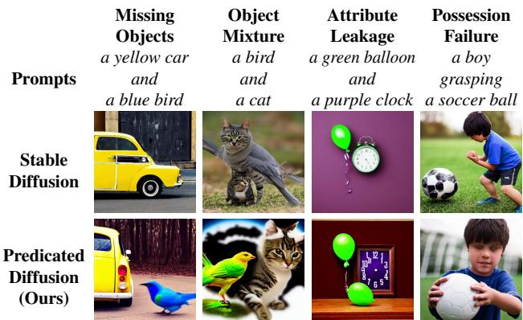  
Figure 1. Visualizations of typical challenges in text-based image generation using diffusion models. The proposed Predicated Diffusion can address all of these challenges.

However, many previous studies have pointed out that these models often generate images that ignore the intended meanings of a given prompt, as exemplified in Fig. 1 [2, 6, 30, 39]. When multiple objects are specified in a prompt, only some are generated, with the others disappearing (see the column missing objects in Fig. 1). Also, two specified objects are sometimes mixed together to form one object in the generated image (object mixture). Given an adjective in a prompt, it alters a different object than the one the adjective was originally intended to modify (attribute leakage). We have found a novel challenge: while a prompt specifies an object being held by someone, the object is depicted as if discarded on the ground (possession failure). Since retraining diffusion models on large-scale datasets is prohibitively expensive, many studies have proposed methods offering guidance for the image generation process of pre-trained diffusion models, ensuring that the images are updated to become more faithful to the prompt. However, these guidances vary widely, and a unified solution to address the diverse challenges has yet to be established.

The root cause of these challenges lies in the diffusion models’ inability to accurately capture the logical statements presented in the given prompts, as observed in other image-text models [41]. If we could represent such logical statements using predicate logic and integrate it into the diffusion model, the generated images might be more faithful to the statements. Motivated by this idea, we introduce Predicated Diffusion in this paper. Herein, we represent the relationships between the words in the prompt by propositions using predicate logic. By employing attention maps and fuzzy logic [10, 25], we measure the degree to which the image under generation fulfills the propositions, providing guidance for images to become more faithful to the prompt. See the conceptual diagram in Fig. 2. The contribution of this paper is threefold.

Theoretical Justification and Generality: Most existing methods have been formulated based on deep insights, which makes it unclear how to combine them effectively or how to apply them in slightly different situations. In contrast, Predicated Diffusion can resolve a variety of challenges based on the same foundational theory, allowing us to deductively expand it to address challenges not summarized in Fig. 1.

High Fidelity to Prompt: The images generated by the proposed Predicated Diffusion and comparison methods were examined by human evaluators and pretrained imagetext models [17, 27]. We observed that Predicated Diffusion generates images more faithful to the prompts and more effectively prevents the issues shown in Fig. 1, while maintaining or even improving the image quality.

New Challenge and Solution: This paper introduces a new challenge, named possessionfailure, which occurs when the generated image fails to correctly depict a prompt indicating a subject in possession of an object. Thus, we broaden the horizons of the current research, which has mainly focused on the presence or absence of objects and attributes, to encompass actions. The fact that Predicated Diffusion can successfully address this new challenge is worthy of attention.

## 2. Related Work

Diffusion Models for Image Generation A diffusion model was proposed as a parameterized Markov chain [13, 34]. Taking a given image x as the initial state $x _ { 0 } .$ , the forward process $q ( x _ { t + 1 } | x _ { t } )$ adds noise to the state $x _ { t }$ from time $t ~ = ~ 0$ to $T .$ . The model learns the reverse process $p ( x _ { t - 1 } | x _ { t } )$ and thereby the data distribution $p ( x ) = p ( x _ { 0 } )$

(1) Given a text prompt A white teddy bear with a green shirt and a smiling girl

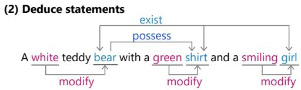

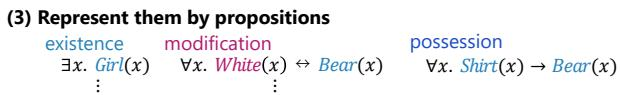

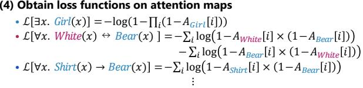

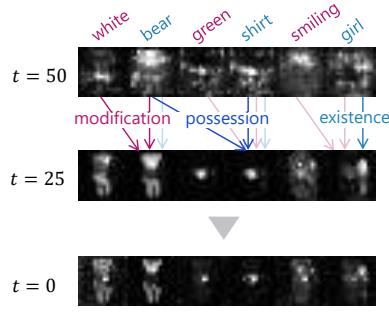

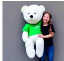  
Figure 2. The conceptual diagram of the proposed Predicated Diffusion, composed of steps (1)–(6). One can make propositions manually or using a syntactic dependency parser.

Intuitively speaking, it repeatedly denoises images to be more realistic. The reverse process resembles a discretized stochastic differential equation, akin to the Langevin dynamics, which ascends the gradient of the log-probability, $\nabla _ { x } \log p ( x )$ , where $\nabla _ { x }$ denotes the gradient with respect to image x [35].

A diffusion model can learn the conditional probability $p ( x | c )$ The condition c might be text, images, or other annotations [28, 31]. One of the leading models, Stable Diffusion, employs the cross-attention mechanism for conditioning [37]. A convolutional neural network (CNN), U-Net [32], transforms the image x into an intermediate representation. For text conditions, a text encoder, based on CLIP [27], transforms text prompt c into a sequence of intermediate representations, each linked to a word w within the prompt c. Given these representations, the crossattention mechanism creates an attention map $A _ { w }$ for each word w. U-Net then updates the image x using these maps as weights. Technically, these processes target not the image x but the latent variable z extracted by a variational autoencoder [15].

Despite its sophistication, Stable Diffusion sometimes fails to capture the intended meaning of the text prompt, as discussed in the Introduction. To address this, Structure Diffusion feeds segmented text prompts to the text encoder to emphasize each clause [6].

Training-Free Guidance Even when a diffusion model is designed without condition c, it can reproduce the conditional probability $p ( x | c )$ without retraining. This is because, from a diffusion model $p ( x )$ and a separate classifier $p ( c | x )$ for class label $c ,$ one can obtain the gradient of the conditional log-probability, $\nabla _ { x } \log p ( x | c ) ~ =$ $\nabla _ { x } \log p ( c | x ) + \nabla _ { x } \log p ( x )$ . Although grounded in probability theory, what it practically offers is additional guidance $\nabla _ { x } \log p ( c | x )$ for updating images, which is generalized as classifier guidance [3].

Consider the reverse process modeled as a Gaussian distribution $p ( \boldsymbol { x } _ { t - 1 } | \boldsymbol { x } _ { t } ) \ = \ \mathcal { N } ( \boldsymbol { x } _ { t - 1 } | \mu _ { \boldsymbol { \theta } } ( \boldsymbol { x } _ { t } , t ) , \boldsymbol { \Sigma } _ { \boldsymbol { \theta } } ( \boldsymbol { x } _ { t } , t ) )$ where the parameters are determined by neural networks $\mu _ { \theta }$ and $\Sigma _ { \theta }$ . A guidance method can be defined as a method that introduces an adjustment $g ( x _ { t } , t )$ to the update in the reverse process as $\mathcal { N } ( x _ { t - 1 } | \mu _ { \theta } ( x _ { t } , t ) + g ( x _ { t } , t ) , \Sigma _ { \theta } ( x _ { t } , t ) )$

When the diffusion model is conditioned on c, the difference between conditional and unconditional updates serves as classifier-free guidance, which can adjust the fidelity of the generated image to condition c [12]. Liu et al. [18] proposed Composable Diffusion, inspired by energy-based models [5]. It generates an image conditioned on two concepts, c and $c _ { 1 } ,$ , by summing their respective conditional updates. It negates or removes a concept $c _ { n }$ from generated images by subtracting the update conditioned on $c _ { n } ,$ , termed as a negative prompt. Some studies developed guidance using annotations, such as bounding boxes [19, 20, 40] and segmentation masks [23]. While effective in intentionally controlling image layout, guidance methods based on annotations sometimes limit the diversity of generated images.

Attention Guidance Other previous studies developed guidance methods using the attention maps of the crossattention mechanism, termed as attention guidance. High pixel intensity in an attention map $A _ { w }$ suggests the presence of the corresponding object or concept w at that pixel. Attend-and-Excite enhances the intensity of at least one pixel in the attention map $A _ { w }$ to ensure the existence of the corresponding object w (that is, address missing objects) [2]. SynGen equalizes the intensity distributions for related nouns and adjectives, while differentiating others, thus addressing attribute leakage [30]. While these methods are based on deep insights, they lack comprehensive theoretical justification and generality.

Table 1. Propositions and Attention Map.
<table><tr><td>Proposition</td><td>Attention Map</td></tr><tr><td>true</td><td>1</td></tr><tr><td>false</td><td>0</td></tr><tr><td> $P ( x )$ </td><td> $A _ { P } [ i ]$ </td></tr><tr><td> $\neg { P } ( x )$ </td><td> $1 - { \dot { A } } _ { P } [ i ]$ </td></tr><tr><td> $P ( x ) \land Q ( x )$ </td><td> $A _ { P } [ i ] \times \dot { A } _ { Q } [ i ]$ </td></tr><tr><td> $P ( x )  Q ( x )$ </td><td> $1 - \dot { A } _ { P } [ i ] \stackrel { \sim } { \times } \stackrel { \sim } ( 1 - A _ { Q } [ i ] )$ </td></tr><tr><td> $P ( x ) \lor Q ( y )$ </td><td> $\underline { { { 1 } } } - ( 1 - A _ { P } [ i ] ) \times ( \mathrm { i } - A _ { Q } [ j ] )$ </td></tr><tr><td> $\forall x . P ( x )$ </td><td> $\Pi _ { i } A _ { P } [ i ]$ </td></tr><tr><td> $\exists x . P ( x )$ </td><td> $\begin{array} { r } { \bar { 1 } ^ { - } \prod _ { i } \dot { ( 1 - A _ { P } [ i ] ) } } \end{array}$ </td></tr></table>

## 3. Method

## 3.1. Predicated Diffusion

Predicate Logic First-order predicate logic is a formal language for expressing knowledge [7]. Variables like x and y denote unspecified objects. Predicates like P and $Q$ indicate properties or relationships between objects. Using variables and predicates, we can express logical statements that define object properties. For example, the proposition $P ( x )$ represents the statement $^ { \bullet \bullet } x$ has property $P .$ If the predicate $P$ indicates the property “being a dog,” the proposition $P ( x )$ represents the statement “x is a dog.” The existential quantifier, denoted by ∃, declares the existence of objects satisfying a given property. Thus, the proposition ∃x. $P ( x )$ asserts the existence of at least one object x that satisfies the predicate $P ,$ representing that “There is a dog.”

Fuzzy Logic in Attention Map Let $A _ { P } [ i ] \in [ 0 , 1 ]$ denote the intensity of the i-th pixel in the attention map $A _ { P }$ corresponding to a word P. Here, we treat the intensity $A _ { P } [ i ]$ as a continuous version of a proposition $P ( x )$ . Specifically, we employ the product fuzzy logic and its operations (the strong conjunction, strong negation, and material implication), summarized in Table 1 [10, 25]. $A _ { P } [ i ] = 1$ indicates that the proposition $P ( x )$ holds, whereas $A _ { P } [ i ] = 0$ implies that it does not. $1 - A _ { P } [ i ]$ indicates the the negation of the proposition, $\neg P ( x )$ Given another proposition $Q ( x )$ , we consider the conjunction $Q ( x ) \land P ( x )$ to correspond to the product $A _ { Q } [ i ] \times A _ { P } [ i ]$ in the attention maps. The implication satisfies $P ( x )  Q ( x ) = \neg ( P ( x ) \land \neg Q ( x ) )$ , which corresponds to $1 - A _ { P } [ i ] \times ( 1 - A _ { Q } [ i ] )$ . The disjunction $Q ( x ) \vee P ( x )$ is equivalent to $\neg ( \neg Q ( x ) \land \neg P ( x ) )$ and corresponds to $1 - ( 1 - A _ { Q } [ i ] ) \times ( 1 - A _ { P } [ i ] )$ . The universal quantifier ∀ asserts that a predicate holds for all objects. ∀x. $P ( x ) = \land _ { x } P ( x )$ corresponds to $\Pi _ { i } A _ { P } [ i ]$ . Using this, the existential proposition ∃x. $P ( x )$ can be re-expressed as $\neg ( \forall x . \neg P ( x ) )$ , corresponding to $\begin{array} { r } { 1 - \prod _ { i } ( 1 - A _ { P } [ i ] ) } \end{array}$

Predicated Diffusion For simplicity, we will treat italicized words as predicates. For instance, we will use $D o g ( x )$

Table 2. Statements that Predicated Diffusion Can Express.
<table><tr><td>Statements</td><td>Example Prompts</td><td>Loss</td></tr><tr><td>Existence</td><td>There is a dog</td><td>(1)</td></tr><tr><td>Modification</td><td>A black dog</td><td>(2)</td></tr><tr><td>Concurrent existence</td><td>There are a dog and a cat</td><td>(3)</td></tr><tr><td>One-to-one correspondence</td><td>A black dog and a white cat</td><td>(5)</td></tr><tr><td>Possession</td><td>A man holding a bag</td><td>(6)</td></tr><tr><td>Multi-color</td><td>A green and grey bird</td><td>(A1)</td></tr><tr><td>Negation</td><td>without snow</td><td>(A2)</td></tr></table>

to represent the statement “x is a dog” rather than $P ( x )$ . We represent the prompt “There is a $\mathrm { d o g } ^ { \prime \mathrm { , } }$ by the proposition $\exists x . D o g ( x )$ . Then, we expect that $\begin{array} { r } { 1 - \prod _ { i } ( 1 - A _ { D o g } [ i ] ) = 1 } \end{array}$ To encourage this, we consider its negative logarithm,

$$
\begin{array} { r } { \mathcal { L } [ \exists x . D o g ( x ) ] = - \log ( 1 - \prod _ { i } ( 1 - A _ { D o g } [ i ] ) ) , } \end{array}\tag{1}
$$

and adopt it as the loss function. Minimizing it makes the intensity of at least one pixel approach 1, ensuring the existence of a dog. This loss function is inspired by the negative log-likelihood for Bernoulli random variables.

Here, we propose an attention guidance, Predicated Diffusion. Given a proposition R to hold, Predicated Diffusion converts it to an equation of the attention map intensity following Table 1, takes its negative logarithm, uses it as a loss function ${ \mathcal { L } } [ R ] ,$ and integrates it into the reverse process as the guidance term $\boldsymbol { g } ( x _ { t } , t ) ~ = ~ - \nabla _ { x _ { t } } \mathcal { L } [ \boldsymbol { R } ]$ . The guidance term decreases the loss function ${ \mathcal { L } } [ R ]$ and guides the image toward fulfilling the proposition R. A visual representation is found in Fig. 2. We provide an overview of prompts and their corresponding loss functions in Table 2.

We develop this idea into the modification by adjectives. For a prompt such as “There is a black dog,” it can be decomposed into: “There is a dog,” and “The dog is black.” The former statement has been discussed above. We represent the latter by the proposition ∀x. $D o g ( x )  B l a c k ( x )$ Then, the loss function is

$$
\begin{array} { r l } & { \mathcal { L } [ \forall x . D o g ( x )  B l a c k ( x ) ] } \\ & { \qquad = - \sum _ { i } \log ( 1 - A _ { D o g } [ i ] \times ( 1 - A _ { B l a c k } [ i ] ) ) . } \end{array}\tag{2}
$$

Intuitively, this loss function guides all pixels depicting a dog towards a black hue; however, its purpose is not to render the dog entirely in solid black. We employed product fuzzy logic to imply a tendency rather than enforce a strict property.

## 3.2. Addressing Challenges

Concurrent Existence by Logical Conjunction When a text prompt specifies multiple objects, a frequent challenge is the disappearance of one of the objects, known as missing objects. We address this challenge using Predicated Diffusion. Take, for example, the prompt “There are a dog and a cat.” This prompt can be decomposed into two statements:

“There is a dog,” and “There is a cat.” As noted above, each statement can be represented by a proposition using the existential quantifier. Since two propositions can be combined using logical conjunction, the original prompt is represented by the proposition $( \exists x . D o g ( x ) ) \land ( \exists x . C a t ( x ) )$ . The corresponding loss function is

$$
\begin{array} { r l } & { \mathcal { L } [ ( \exists x . D o g ( x ) ) \land ( \exists x . C a t ( x ) ) ] } \\ & { \qquad = \mathcal { L } [ \exists x . D o g ( x ) ] + \mathcal { L } [ \exists x . C a t ( x ) ] . } \end{array}\tag{3}
$$

Minimizing this loss function encourages the concurrent existence of both a dog and a cat.

One-to-One Correspondence When a prompt includes multiple adjectives and nouns, diffusion models often struggle with correct correspondence, leading to the challenge referred to as attribute leakage. For instance, with the prompt “a black dog and a white cat,” leakage could result in the generation of a white dog or a black cat. To prevent such leakage using Predicated Diffusion, it is essential to deduce statements that are implicitly suggested by the original prompt. Firstly, we can deduce the statement “The dog is black” and its the converse, “The black object is a dog.” The latter can be represented by the proposition ∀x. $B l a c k ( x )  D o g ( x )$ . When these two statements are combined, they can be represented using a biimplication: ∀x. $D o g ( x )  B l a c k ( x )$ . This leads to the loss function:

$$
\begin{array} { r l } & { \mathcal { L } \big [ \forall x . D o g ( x )  B l a c k ( x ) \big ] } \\ & { = \mathcal { L } \big [ \forall x . D o g ( x ) {  } B l a c k ( x ) \land \forall x . B l a c k ( x ) {  } D o g ( x ) \big ] \ ( 4 ) } \\ & { = \mathcal { L } \big [ \forall x . D o g ( x ) {  } B l a c k ( x ) \big ] { + } \mathcal { L } \big [ \forall x . B l a c k ( x ) {  } D o g ( x ) \big ] } \end{array}
$$

Next, we can deduce the negative statement “The dog is not white,” represented by ∀x. $D o g ( x )  \lnot W h i t e ( x )$ . A similar deduction applies to the white cat. Hence, the comprehensive loss function for the original prompt is:

$$
\begin{array} { r l } & { \mathcal { L } _ { \mathrm { o n e - t o - o n e } } = \mathcal { L } [ \forall x . D o g ( x ) \left. B l a c k ( x ) ] } \\ & { \quad \quad \quad + \mathcal { L } [ \forall x . C a t ( x ) \left. W h i t e ( x ) ] } \\ & { \quad \quad \quad + \alpha \mathcal { L } [ \forall x . D o g ( x ) \right. \neg W h i t e ( x ) ] } \\ & { \quad \quad \quad + \alpha \mathcal { L } [ \forall x . C a t ( x ) \right. \neg B l a c k ( x ) ] , } \end{array}\tag{5}
$$

where the hyperparameter $\alpha \in [ 0 , 1 ]$ adjusts the weight of the negative statements. To further ensure the existence of objects, the loss function (3) can also be applied.

Possession by Logical Implication Given the prompt “a man holding a bag,” diffusion models often depict the bag as not being held by the man. We refer to this challenge as possession failure. To address this using Predicated Diffusion, we propose the proposition ∀x. $B a g ( x )  M a n ( x )$ leading to the loss function:

$$
\begin{array} { r l r } { \left. { \mathcal { L } [ \forall x . B a g ( x )  M a n ( x ) ] } } \\ & \right.{ } & { = - \sum _ { i } \log ( 1 - A _ { B a g } [ i ] \times ( 1 - A _ { M a n } [ i ] ) ) . } \end{array}\tag{6}
$$

The loss function aims to depict the bag as part of the man. Because attention maps typically have lower resolution than the original image, minor displacements between objects and their possessors are acceptable, eliminating the need for complete overlaps. This approach applies not just to holding but also to any words indicating possession, such as having, grasping, and wearing.

## 3.3. Comparisons, Extensions, and Limitations

Several studies have introduced loss functions or quality measures for machine learning methods by drawing inspiration from fuzzy logic [4, 8, 14, 21, 22]. In this context, Predicated Diffusion is the first method to establish the correspondence between the attention map and the predicates.

The propositions and corresponding loss functions can be adapted to a variety of scenarios, including, but not limited to, the concurrent existence of more than two objects, a single object modified by multiple adjectives, the combination of one-to-one correspondence and possession, and the negation of existence, modifications, and possessions, as we will show in the following sections. The definition of conjunction allows us to simply sum up loss functions for all propositions. These propositions can be formulated manually by users, extracted automatically from prompts using a syntactic dependency parser, or derived from additional data sources such as scene graphs [6].

Predicated Diffusion inherits some of the general limitations of diffusion models, including challenges like the inability to count objects accurately and the tendency for bias toward more typical examples. Due to this limitation, the loss function (5) is inappropriate when multiple instances of the same noun are modified by different adjectives (e.g., “a black dog and a white dog”).

The (weak) conjunction of Godel fuzzy logic and the¨ product fuzzy logic is achieved by the minimum operation [10, 25]. If we employ this operation and define the loss function by taking the negative instead of the negative logarithm, the proposition asserting the concurrent existence, $( \exists x . D o g ( x ) ) \land ( \exists x . C a t ( x ) )$ , leads to the loss function max $\begin{array} { r } { ( 1 - \operatorname* { m a x } _ { i } A _ { D o g } [ i ] , 1 - \operatorname* { m a x } _ { i } A _ { C a t } [ i ] ) } \end{array}$ . This is equivalent to the one used for Attend-and-Excite [2]. This comparison suggests that our approach considers Attend-and-Excite as Godel fuzzy logic, replaces the underlying logic¨ with the product fuzzy logic, and broadens the scope of target propositions. Similar to the loss function (5), SynGen equalizes the attention map intensities for related nouns and adjectives [30]. SynGen additionally differentiates those for all word pairs except for the adjective-noun pairs. In contrast, the loss function (5) differentiates those for only specific pairs which could trigger attribute leakage based on inferred propositions, thereby preventing the disruption of the harmony, as shown in the following section.

## 4. Experiments and Results

## 4.1. Experimental Settings

We implemented Predicated Diffusion by adapting the official implementation of Attend-and-Excite [2]1. The reverse process spans 50 steps; we applied the guidance of Predicated Diffusion only to the initial 25 steps, following [2, 30]. See Appendix A.1 for more details. For comparison, we also prepared Composable Diffusion [18], Structure Diffusion [6], and SynGen [30], in addition to Stable Diffusion and Attend-and-Excite. All methods used the officially pretrained Stable Diffusion v1.4 [31]2 as backbones.

We conducted four experiments for assessing each method’s performance. We provided each method with the same prompt and random seed, and then generated a set of images. Human evaluators were tasked with the visual assessment of these generated images as follows.

(i) Concurrent Existence: We prepared 400 random prompts, each mentioning “[Object A] and [Object B]”, and generated 400 sets of images. The evaluators identified cases of “missing objects” based on two criteria: a lenient criterion where “object mixture” was not counted as “missing objects”, and a strict criterion where it was. For Predicated Diffusion, we used the loss function (3).

(ii) One-to-One Correspondence: Similarly, we prepared 400 random prompts, each mentioning “[Adjective A] [Object A] and [Adjective B] [Object B]”. In addition to identifying missing objects, the evaluators identified the cases of “attribute leakage”. For Predicated Diffusion, we used the loss function (3)+(5) with α = 0.3.

(iii) Possession: We prepared 10 prompts, each mentioning “[Subject A] is [Verb C]-ing [Object B]”. [Verb C] can be “have,” “hold,” “wear,” or the like. We generated 20 images for each of these prompts. In addition to identifying missing objects, the evaluators identified the cases of “possession failure”. For Predicated Diffusion, we used the loss function (3)+(6).

(iv) Complicated: To demonstrate the generality of Predicated Diffusion, we prepared diverse prompts, some of which were taken from the ABC-6K dataset [6]. Images were generated after manually extracting propositions and their respective loss functions. While a summary of generated images is presented, numerical evaluations were not undertaken due to the diversity of the prompts.

Experiments (i) and (ii) were inspired by previous works [2, 6, 30]. In Experiments (i)–(iii), the evaluators also assessed the fidelity of the generated images to the prompts. Instructions and evaluation criteria provided to the evaluators are detailed in Appendix A.2 The candidates of objects, adjectives, and prompts can be found in Appendix A.3.

Table 3. Results of Experiments (i) for Concurrent Existence and (ii) for One-to-One Correspondence.
<table><tr><td rowspan="3"></td><td colspan="4">Experiment (i) for Concurrent Existence</td><td colspan="5">Experiment (ii) for One-to-One Correspondence</td></tr><tr><td colspan="2">Human Evaluation</td><td colspan="2">Automatic Evaluation</td><td colspan="3">Human Evaluation</td><td colspan="2">Automatic Evaluation</td></tr><tr><td>Missing† Objects</td><td>Fidelity</td><td>Similarity†</td><td>CLIP- IQA</td><td>Missing† Objects</td><td>Attribute Leakage</td><td>Fidelity</td><td>Similarity†</td><td>CLIP- IQA</td></tr><tr><td>Stable Diffusion</td><td>54.7 / 66.0</td><td>11.0</td><td>0.326 / 0.767</td><td>0.761</td><td>64.8 / 73.5</td><td>88.5</td><td>6.0</td><td>0.345 / 0.744</td><td>0.756</td></tr><tr><td>Composable Diffusion</td><td>44.5 / 82.3</td><td>2.5</td><td>0.317 / 0.739</td><td>0.764</td><td>49.3 / 83.5</td><td>88.5</td><td>3.8</td><td>0.348 / 0.729</td><td>0.757</td></tr><tr><td>Structure Diffusion</td><td>56.0 / 64.5</td><td>12.0</td><td>0.325 / 0.763</td><td>0.763</td><td>64.3 / 69.5</td><td>86.5</td><td>5.8</td><td>0.346 / 0.741</td><td>0.760</td></tr><tr><td>Attend-and-Excite</td><td>25.3 / 36.3</td><td>29.5</td><td>0.342 / 0.814</td><td>0.766</td><td>28.0 / 35.8</td><td>64.5</td><td>19.3</td><td>0.367 / 0.792</td><td>0.761</td></tr><tr><td>SynGen</td><td></td><td></td><td>-/-</td><td></td><td>23.3 / 29.3</td><td>40.3</td><td>36.8</td><td>0.367 / 0.801</td><td>0.750</td></tr><tr><td>Predicated Diffusion</td><td>18.5 / 28.5</td><td>30.3</td><td>0.348 / 0.825</td><td>0.775</td><td>10.0 / 16.5</td><td>33.0</td><td>44.8</td><td>0.379 / 0.811</td><td>0.769</td></tr></table>

†Using the lenient and strict criterions. ‡Text-image similarity and text-text similarity.

a crown and a rabbit  
a bird and a cat  
an apple and a lion  
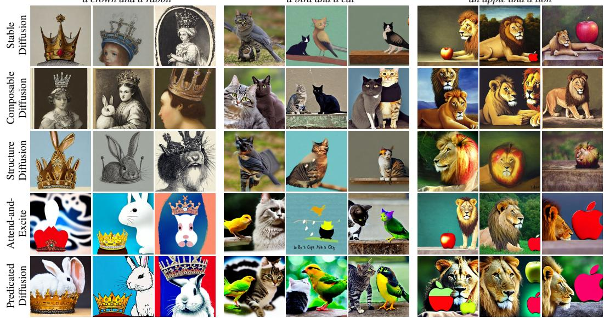  
Figure 3. Example results of Experiment (i) for concurrent existence. See also Fig. A2.

a yellow car and a blue bird  
a greenfrog and a gray cat  
a green balloon and a purple clock  
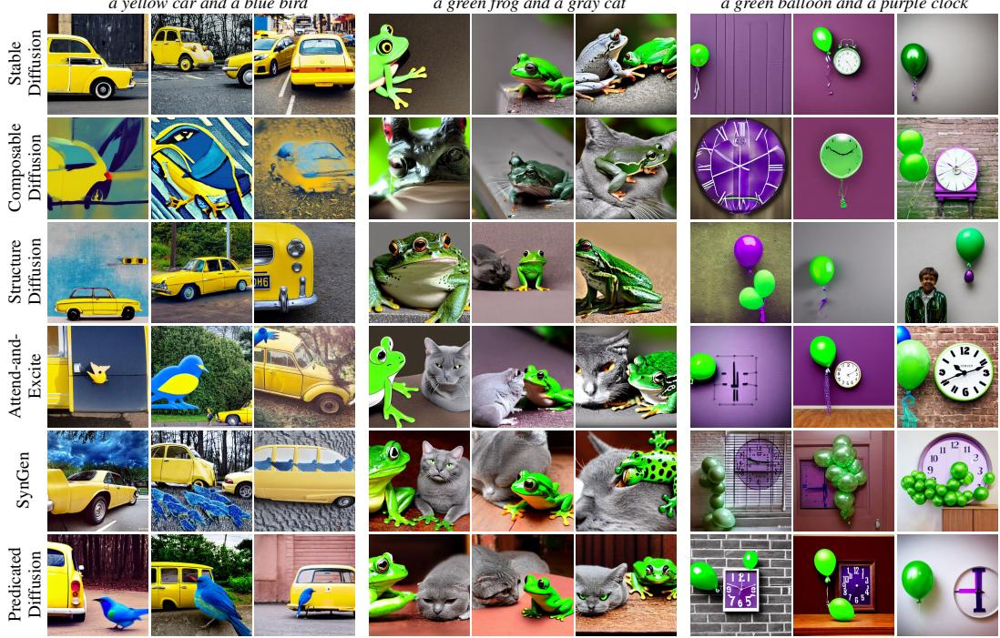  
Figure 4. Example results of Experiment (ii) for one-to-one correspondence. See also Fig. A3.

We also automatically measured the fidelity and quality of generated images by using the pretrained image-text encoder, CLIP [27] and image-captioning model, BLIP [17]. We prepared 10,000 images for each of Experiments (i)– (iii). For the fidelity, we evaluated similarity measures proposed by Chefer et al. [2]. The text-image similarity is the cosine similarity between the prompts and the generated images in the embedding space of CLIP. For the text-text similarity, instead of the generated images, their captions generated by BLIP are used. For the quality, we performed CLIP image quality assessment (CLIP-IQA) [38]. This metric evaluates how close an image is to the text “good photo” as opposed to “bad photo” in the embedding space, and it has been proven to be highly correlated with the human perception of image quality. Unlike Frechet inception\` distance (FID) [11] or the similarity measures introduced above, CLIP-IQA does not require the ground truth dataset or the text prompts, but only measures image quality.

## 4.2. Results

Concurrent Existence and One-to-One Correspondence Table 3 summarizes the results from Experiments (i) and (ii). Scores of human evaluations are expressed in percentages. Higher scores are desirable for fidelity, similarities, and CLIP-IQA, while lower values are preferred for the remaining metrics. Predicated Diffusion notably outperforms other methods, as it achieved the best outcomes across all 13 metrics; it improves both the quality and fidelity of the generated images. It is worth noting that SynGen degraded the image quality measured by CLIP-IQA compared to the backbone, Stable Diffusion. Figures 3 and 4 show example images for visual evaluation, where images in each column are generated using the same random seed. See also Figs. A2 and A3 in Appendix. Stable Diffusion, Composable Diffusion, and Structure Diffusion often exhibit missing objects and attribute leakage. The absence of objects is particularly evident when prompts feature unusual object combinations like “a crown and a rabbit” and “a yellow car and a blue bird.” When the prompts specify visually similar objects, such as “a bird and a cat,” the two objects often get mixed together. While Attend-and-Excite effectively prevents the issue of missing objects, it struggles with attribute leakage in Experiment (ii), due to its lack of a dedicated mechanism to address this. While SynGen has achieved relatively good results, Predicated Diffusion outperforms it by further preventing missing objects and attribute leakage and producing images most faithful to the prompt. Although this aspect was not explicitly part of the evaluation, SynGen often generates multiple instances of small objects, such as birds and balloons.

Possession Table 4 summarizes the results from Experiment (iii). Predicated Diffusion notably outperforms other methods on all seven metrics. Compared to Stable Diffusion, Attend-and-Excite succeeds in preventing missing objects but, on the contrary, fails to prevent possession failure, losing human-evaluated fidelity and CLIP-IQA. Figures 5 and A4 show visual samples of generated images. If [Subject A] is an animal, Attend-and-Excite succeeds more frequently than Stable Diffusion in depicting both objects but often depicts [Object B] as discarded on the ground or suspended in the air. If [Subject A] is a human, the vanilla Stable Diffusion often produces satisfactory results. Then, Attend-and-Excite, however, tends to deteriorate the overall image quality. With the possession relationship, [Subject A] and [Object B] often overlap. Attend-and-Excite makes both stand out competitively and potentially disrupts the overall harmony. In contrast, the loss function (6) is designed to encourage overlap, and hence Predicated Diffusion adeptly depicts subjects in possession of objects.

Qualitative Analysis on Complicated Prompts Figures 6, A5, and A6 show example results from Experiment (iv) along with the propositions used for Predicated Diffusion. Both the vanilla Stable Diffusion and Structure Diffusion plagued by missing objects and attribute leakage. When tasked with generating “A black bird with a red beak,” SynGen produced multiple red objects, as observed in Ex periments (i) and (ii). When generating “A white teddy bear with a green shirt and a smiling girl,” comparison methods other than Predicated Diffusion often mistakenly identified the girl, not the teddy bear, as the owner of the green shirt. In comparison to the vanilla Stable Diffusion, SynGen reduced the size of the teddy bear’s shirt because it differentiates between the intensity distributions on the attention maps of different objects. A similar tendency is evident in the third case in Fig. 6, where the adjective “green” often alters wrong objects, and the green hair is not placed on the baby’s head. Predicated Diffusion performed well in these scenarios, which include the concurrent existence of more than two objects with specified colors and possession relationships simultaneously.

See Appendix B for further assessments; visualization of attention maps (B.1), assignment of multiple colors to a single object, negation of objects (B.2), automatic extraction of propositions (B.3), additional analyses (B.4), ablation studies (B.5), and a discussion on more recent models (B.6).

## 5. Conclusion

This paper proposed Predicated Diffusion, where the intended meanings in a text prompt are represented by propositions using predicate logic, offering guidance for textbased image generation by diffusion models. Experiments using Stable Diffusion as a backbone have demonstrated that Predicated Diffusion effectively addresses common challenges; missing objects, attribute leakage, and possession failures. Compared to existing methods, Predicated Diffusion excels in generating images that are more faithful to the prompts and of superior quality. Moreover, due to the generality of predicate logic, Predicated Diffusion can fulfill complicated prompts that include multiple objects, adjectives, and their relationships. Although predicates cannot represent all meanings present in natural languages, they can handle most scenarios for adjusting the layout of generated images. In future work, we plan to combine Predicated Diffusion with other backbones and explore 2-ary predicates asserting relationships, such as Above(x, y), which implies “x is above $y . \vec { }$

A white teddy bear with a green shirt  
a bear having an apple  
(∃x. Bird(x)) ∧ (∃x. Beak(x)) ∧(∀x. Bird(x) ↔ Black(x)) ∧(∀x. Beak(x) ↔ Red(x)) ∧(∀x. Beak(x) → Bird(x))  
Table 4. Results of Experiment (iii) for Possession
<table><tr><td rowspan="2">Methods</td><td colspan="3">Human Evaluation</td><td rowspan="2"></td><td colspan="2">Automatic Evaluation</td></tr><tr><td>Missing Objects†</td><td>Possession Failure</td><td>Fidelity</td><td>Similarity</td><td>CLIP-IQA</td></tr><tr><td>Stable Diffusion</td><td>31.5 / 36.0</td><td>52.5</td><td>33.5</td><td></td><td>0.320 / 0.811</td><td>0.762</td></tr><tr><td>Attend-and-Excite</td><td>7.5 / 17.0</td><td>51.5</td><td>27.5</td><td></td><td>0.334 / 0.843</td><td>0.760</td></tr><tr><td>Predicated Diffusion</td><td>4.0 /  7.0</td><td>29.5</td><td>52.0</td><td></td><td>0.345 / 0.855</td><td>0.765</td></tr></table>

†Using the lenient and strict criterions. ‡Text-image similarity and text-text similarity.

a frog wearing a hat  
A black bird with red beak  
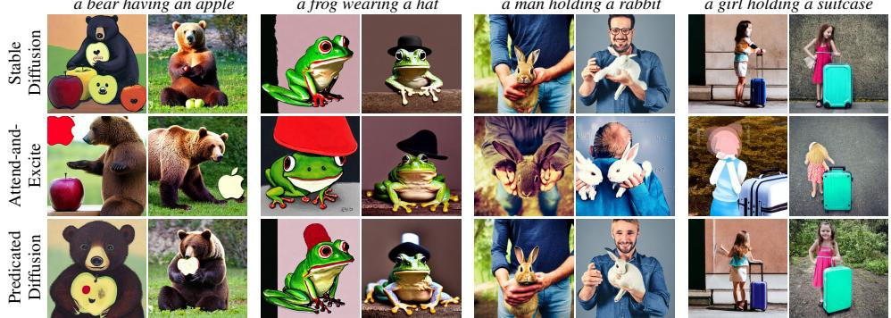  
a man holding a rabbit  
a girl holding a suitcase  
Figure 5. Example results of Experiment (iii) for possession. See also Fig. A4.  
A baby with green hair laying in a black blanket next to a teddy bear

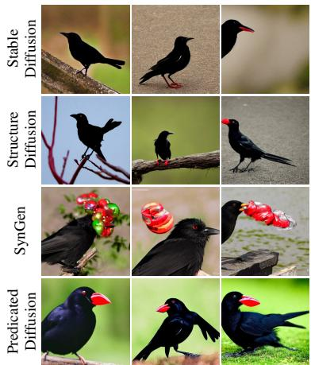

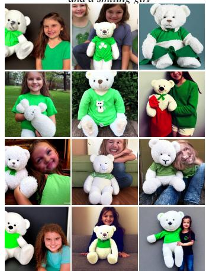  
(∃x. Bear(x)) ∧ (∃x. Shirt(x)) ∧(∃x. Girl(x)) ∧(∀x. Bear(x) ↔ White(x)) ∧(∀x. Bear(x) ↔ Teddy(x)) ∧(∀x. Shirt(x) ↔ Green(x)) ∧(∀x. Girl(x) ↔ Smiling(x)) ∧(∀x. Shirt(x) → Bear(x))

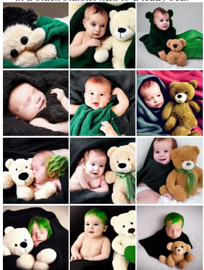  
Figure 6. Example results of Experiment (iv) using prompts in ABC-6K. See also Figs. A5 and A6.

Acknowledgements: This work was partially supported by JST PRESTO (JPMJPR21C7) and Moonshot R&D (JPMJMS2033-14), Japan.

## References

[1] Mohammadreza Armandpour, Ali Sadeghian, Huangjie Zheng, Amir Sadeghian, and Mingyuan Zhou. Re-imagine the Negative Prompt Algorithm: Transform 2D Diffusion into 3D, alleviate Janus problem and Beyond. arXiv, 2023. 4

[2] Hila Chefer, Yuval Alaluf, Yael Vinker, Lior Wolf, and Daniel Cohen-Or. Attend-and-Excite: Attention-Based Semantic Guidance for Text-to-Image Diffusion Models. In ACM SIGGRAPH, 2023. 1, 3, 5, 7, 2

[3] Prafulla Dhariwal and Alex Nichol. Diffusion Models Beat GANs on Image Synthesis. In Advances in Neural Information Processing Systems (NeurIPS), 2021. 3

[4] Michelangelo Diligenti, Marco Gori, and Claudio Sacca.\` Semantic-based regularization for learning and inference. Artificial Intelligence, 244:143–165, 2017. 5

[5] Yilun Du, Shuang Li, and Igor Mordatch. Compositional visual generation with energy based models. In Advances in Neural Information Processing Systems (NeurIPS), 2020. 3

[6] Weixi Feng, Xuehai He, Tsu-Jui Fu, Varun Jampani, Arjun Akula, Pradyumna Narayana, Sugato Basu, Xin Eric Wang, and William Yang Wang. Training-Free Structured Diffusion Guidance for Compositional Text-to-Image Synthesis. In International Conference on Learning Representations (ICLR), 2023. 1, 3, 5

[7] Michael R. Genesereth and Nils J. Nilsson. Logical Foundations of Artificial Intelligence. Morgan Kaufmann, Los Altos, Calif, 1987. 3

[8] Eleonora Giunchiglia, Mihaela Catalina Stoian, and Thomas Lukasiewicz. Deep Learning with Logical Constraints. In International Joint Conference on Artificial Intelligence (IJ-CAI), pages 5478–5485, 2022. 5

[9] Ian J. Goodfellow, Jean Pouget-Abadie, Mehdi Mirza, Bing Xu, David Warde-Farley, Sherjil Ozair, Aaron Courville, and Yoshua Bengio. Generative Adversarial Nets. In Advances in Neural Information Processing Systems (NIPS), pages 2672– 2680, 2014. 1

[10] Petr Hajek. ´ Metamathematics of Fuzzy Logic. Springer Netherlands, Dordrecht, 1998. 2, 3, 5

[11] Martin Heusel, Hubert Ramsauer, Thomas Unterthiner, Bernhard Nessler, and Sepp Hochreiter. GANs Trained by a Two Time-Scale Update Rule Converge to a Local Nash Equilibrium. In Advances in Neural Information Processing Systems (NeurIPS), 2017. 7

[12] Jonathan Ho and Tim Salimans. Classifier-Free Diffusion Guidance. In NeurIPS 2021 Workshop on Deep Generative Models and Downstream Applications, 2021. 3

[13] Jonathan Ho, Ajay Jain, and Pieter Abbeel. Denoising diffusion probabilistic models. In Advances in Neural Information Processing Systems (NeurIPS), pages 6840–6851, 2020. 1, 2

[14] Zhiting Hu, Xuezhe Ma, Zhengzhong Liu, Eduard Hovy, and Eric Xing. Harnessing Deep Neural Networks with Logic Rules. In Annual Meeting of the Association for Computational Linguistics (ACL), pages 2410–2420, 2016. 5

[15] Diederik P. Kingma and Max Welling. Auto-Encoding Variational Bayes. In International Conference on Learning Representations (ICLR), 2014. 3

[16] Alexander Kolesnikov and Christoph H. Lampert. PixelCNN Models with Auxiliary Variables for Natural Image Modeling. In International Conference on Machine Learning (ICML), 2017. 1

[17] Junnan Li, Dongxu Li, Caiming Xiong, and Steven Hoi. BLIP: Bootstrapping Language-Image Pre-training for Unified Vision-Language Understanding and Generation. In International Conference on Machine Learning (ICML), pages 12888–12900. PMLR, 2022. 2, 7

[18] Nan Liu, Shuang Li, Yilun Du, Antonio Torralba, and Joshua B. Tenenbaum. Compositional Visual Generation with Composable Diffusion Models. In European Conference on Computer Vision (ECCV), 2022. 3, 5, 4

[19] Wan-Duo Kurt Ma, J. P. Lewis, W. Bastiaan Kleijn, and Thomas Leung. Directed Diffusion: Direct Control of Object Placement through Attention Guidance. arXiv, 2023. 3

[20] Jiafeng Mao and Xueting Wang. Training-Free Location Aware Text-to-Image Synthesis. arXiv, 2023. 3

[21] Giuseppe Marra, Francesco Giannini, Michelangelo Diligenti, Marco Maggini, and Marco Gori. T-Norms Driven Loss Functions for Machine Learning. Applied Intelligence, 2023. 5

[22] Goncalo Mordido, Julian Niedermeier, and Christoph Meinel. Assessing Image and Text Generation with Topological Analysis and Fuzzy Logic. In IEEE Winter Conference on Applications of Computer Vision (WACV), pages 2012– 2021, Waikoloa, HI, USA, 2021. IEEE. 5

[23] Dong Huk Park, Grace Luo, Clayton Toste, Samaneh Azadi, Xihui Liu, Maka Karalashvili, Anna Rohrbach, and Trevor Darrell. Shape-Guided Diffusion with Inside-Outside Attention. arXiv, 2023. 3

[24] Dustin Podell, Zion English, Kyle Lacey, Andreas Blattmann, Tim Dockhorn, Jonas Muller, Joe Penna, and¨ Robin Rombach. SDXL: Improving Latent Diffusion Models for High-Resolution Image Synthesis. 2023. 1

[25] Piotr Prokopowicz, Jacek Czerniak, Dariusz Mikołajewski, Łukasz Apiecionek, and Dominik Sle¸zak, editors.´ Theory and Applications ofOrdered Fuzzy Numbers. Springer International Publishing, Cham, 2017. 2, 3, 5

[26] Alec Radford, Luke Metz, and Soumith Chintala. Unsupervised Representation Learning with Deep Convolutional Generative Adversarial Networks. In International Conference on Learning Representations (ICLR), 2016. 1

[27] Alec Radford, Jong Wook Kim, Chris Hallacy, Aditya Ramesh, Gabriel Goh, Sandhini Agarwal, Girish Sastry, Amanda Askell, Pamela Mishkin, Jack Clark, Gretchen Krueger, and Ilya Sutskever. Learning Transferable Visual Models From Natural Language Supervision. In International Conference on Machine Learning (ICML), pages 8748–8763. PMLR, 2021. 2, 7

[28] Aditya Ramesh, Mikhail Pavlov, Gabriel Goh, Scott Gray, Chelsea Voss, Alec Radford, Mark Chen, and Ilya Sutskever. Zero-Shot Text-to-Image Generation. In International Conference on Machine Learning (ICML), pages 8821–8831. PMLR, 2021. 1, 2

[29] Aditya Ramesh, Prafulla Dhariwal, Alex Nichol, Casey Chu, and Mark Chen. Hierarchical Text-Conditional Image Generation with CLIP Latents. arXiv, 2022. 1

[30] Royi Rassin, Eran Hirsch, Daniel Glickman, Shauli Ravfogel, Yoav Goldberg, and Gal Chechik. Linguistic Binding in Diffusion Models: Enhancing Attribute Correspondence through Attention Map Alignment. arXiv, 2023. 1, 3, 5

[31] Robin Rombach, Andreas Blattmann, Dominik Lorenz, Patrick Esser, and Bjorn Ommer. High-Resolution Image¨ Synthesis with Latent Diffusion Models. In IEEE/CVF Conference on Computer Vision and Pattern Recognition (CVPR), 2022. 1, 2, 5

[32] Olaf Ronneberger, Philipp Fischer, and Thomas Brox. U-Net: Convolutional Networks for Biomedical Image Segmentation. In Medical Image Computing and Computer-Assisted Intervention (MICCAI), pages 234–241, 2015. 2

[33] Chitwan Saharia, William Chan, Saurabh Saxena, Lala Li, Jay Whang, Emily Denton, Seyed Kamyar Seyed Ghasemipour, Burcu Karagol Ayan, S. Sara Mahdavi, Rapha Gontijo Lopes, Tim Salimans, Jonathan Ho, David J. Fleet, and Mohammad Norouzi. Photorealistic Text-to-Image Diffusion Models with Deep Language Understanding. arXiv, 2022. 1

[34] Jascha Sohl-Dickstein, Eric A. Weiss, Niru Maheswaranathan, and Surya Ganguli. Deep unsupervised learning using nonequilibrium thermodynamics. In International Conference on Machine Learning (ICML), pages 2246–2255, 2015. 2

[35] Yang Song, Jascha Sohl-Dickstein, Diederik P. Kingma, Abhishek Kumar, Stefano Ermon, and Ben Poole. Score-Based Generative Modeling through Stochastic Differential Equations. In International Conference on Learning Representations (ICLR), 2021. 1, 2

[36] Aaron van den Oord, Nal Kalchbrenner, and Koray¨ Kavukcuoglu. Pixel recurrent neural networks. In International Conference on Machine Learning (ICML), pages 2611–2620, 2016. 1

[37] Ashish Vaswani, Noam Shazeer, Niki Parmar, Jakob Uszkoreit, Llion Jones, Aidan N. Gomez, Łukasz Kaiser, and Illia Polosukhin. Attention is all you need. In Advances in Neural Information Processing Systems (NIPS), 2017. 2

[38] Jianyi Wang, Kelvin C.K. Chan, and Chen Change Loy. Exploring CLIP for Assessing the Look and Feel of Images. In AAAI Conference on Artificial Intelligence (AAAI), pages 2555–2563, 2023. 7

[39] Zijie J. Wang, Evan Montoya, David Munechika, Haoyang Yang, Benjamin Hoover, and Duen Horng Chau. DiffusionDB: A Large-scale Prompt Gallery Dataset for Text-to-Image Generative Models. In Annual Meeting of the Association for Computational Linguistics (ACL), pages 893–911, 2023. 1

[40] Jinheng Xie, Yuexiang Li, Yawen Huang, Haozhe Liu, Wentian Zhang, Yefeng Zheng, and Mike Zheng Shou. BoxDiff: Text-to-Image Synthesis with Training-Free Box-Constrained Diffusion. In International Conference on Computer Vision (ICCV), 2023. 3

[41] Mert Yuksekgonul, Federico Bianchi, Pratyusha Kalluri, Dan Jurafsky, and James Zou. When and Why Vision-

Language Models Behave like Bags-Of-Words, and What to Do About It? In International Conference on Learning Representations (ICLR), 2023. 2