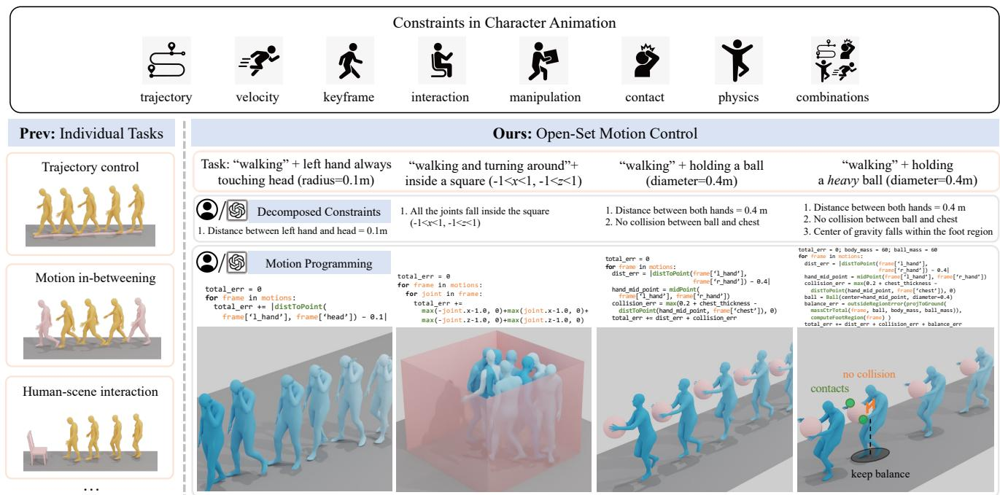
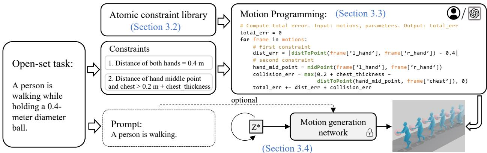
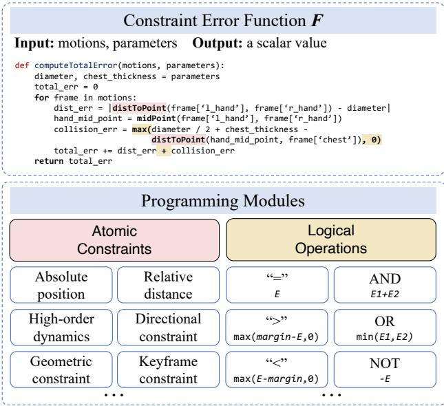
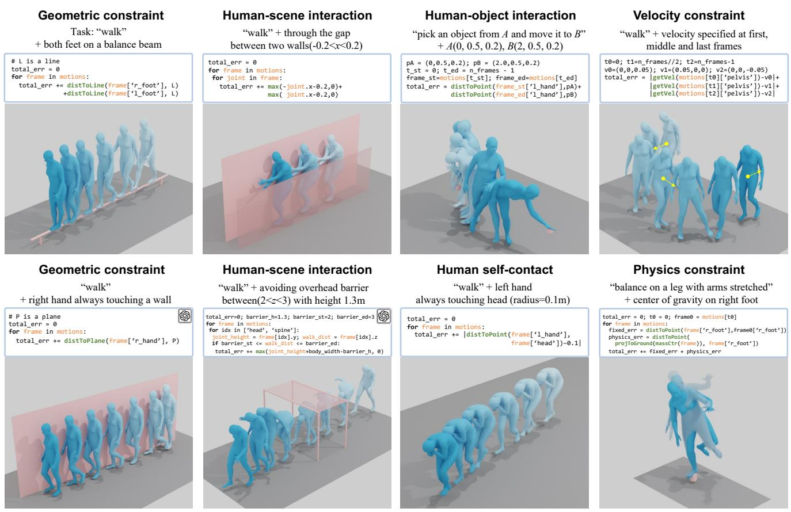
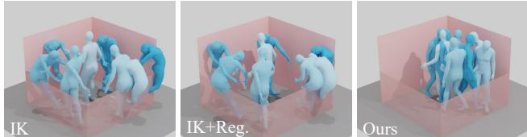
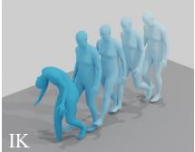
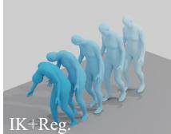
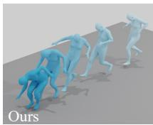

# Programmable Motion Generation for Open-Set Motion Control Tasks

Hanchao Liu1,2∗ Xiaohang Zhan2† Shaoli Huang2 Tai-Jiang Mu1† Ying Shan2 1 BNRist, Tsinghua University 2 Tencent AI Lab

  
Figure 1. We introduce Programmable Motion Generation as a solution for open-set human motion control. Unlike previous works that treat a finite set of motion constraints as individual tasks, we attempt to solve vast and novel tasks in a unified framework. Through Programmable Motion Generation, an arbitrary controlled motion generation task is effectively solved by simply programming an error function rather than collecting training data and designing networks. The programming is also able to be implemented automatically.

## Abstract

Character animation in real-world scenarios necessitates a variety of constraints, such as trajectories, keyframes, interactions, etc. Existing methodologies typically treat single or a finite set of these constraint(s) as separate control tasks. These methods are often specialized, and the tasks they address are rarely extendable or customizable. We categorize these as solutions to the close-set motion control problem. In response to the complexity of practical motion control, we propose and attempt to solve the open-set motion control problem. This problem is characterized by an open andfully customizable set ofmotion con-

trol tasks. To address this, we introduce a new paradigm, programmable motion generation. In this paradigm, any given motion control task is broken down into a combination of atomic constraints. These constraints are then programmed into an error function that quantifies the degree to which a motion sequence adheres to them. We utilize a pre-trained motion generation model and optimize its latent code to minimize the error function of the generated motion. Consequently, the generated motion not only inherits the prior of the generative model but also satisfies the requirements of the compounded constraints. Our experiments demonstrate that our approach can generate highquality motions when addressing a wide range of unseen tasks. These tasks encompass motion control by motion dynamics, geometric constraints, physical laws, interactions with scenes, objects or the character’s own body parts, etc.

All ofthese are achieved in a unified approach, without the need for ad-hoc paired training data collection or specialized network designs. During the programming of novel tasks, we observed the emergence ofnew skills beyond those of the prior model. With the assistance of large language models, we also achieved automatic programming. We hope that this work will pave the way for the motion control of general AI agents.

## 1. Introduction

Character animation techniques have extensive applications in the film and game industry, as well as in robotics [27]. Recently, relying on large motion capture database, AI-based human motion generation methods have demonstrated their potentials when given multi-modal signals like text [1, 12, 24, 33] or audio [3, 22]. However, in the practical applications of character animation, it is crucial to consider various constraints of motions, since a character is never isolated in space. These constraints typically include joint trajectories, motion dynamics such as velocity or acceleration, key-frames, interactions with scenes and objects, self-contacts [26], laws of physics, etc., and their combinations.

Artists often use Inverse Kinematics (IK) systems in Digital Content Creation (DCC) software to modify motions to meet customized constraints. However, due to the absence of motion priors, IK cannot ensure spatial validity among joints or temporal coherence among frames, thus usually yielding unsatisfactory results. On the other hand, as shown in Fig. 1, existing AI-based animation methods typically pre-define single or a finite set of constraint(s) and formulate it as individual tasks, such as trajectory and velocity control [5, 17, 19, 35], motion in-betweening [14, 34, 40], human-scene/object interactions [4, 7, 37, 45], physics-based animation [29, 30, 41, 46], etc. Under such task-specific paradigm: first, for each task, the dataset and the methodology are specifically designed and individually trained; second, those methods intrinsically cannot deal with customized constraints or arbitrary combinations of them, thus being seldom extendable or customizable. We classify those individual tasks as close-set motion control problem.

In this paper, to confront the complexity of practical motion control, we pose a new problem, i.e. open-set motion control, where the set of motion control tasks is open and fully customizable. For example, as shown in Fig. 1, the generated motions of “walking” can be accompanied by any arbitrary constraint, such as “left hand always touching head”, “limited in a given square”, “holding a ball”, etc, without special training data or network designs. To the best of our knowledge, this problem has never been solved by previous works.

To address this challenging problem, our key observations are: (1) a complicated motion control task can be broken down into several constraints; (2) almost all constraints can be measured via errors, e.g., using distance as an error to measure the “contact of both hands” constraint, and (3) the errors are mathematically additive. Based on these observations, we propose a new motion generation paradigm, i.e. programmable motion generation, where an arbitrary controlled motion generation task is unifiedly solved by simply programming the error function. Specifically, given an arbitrary motion control task, we formulate it as combinations of atomic constraints, and program them into an error function that measures how much the generated motion follows those constraints. Taking human-object interaction as an example in Fig. 2, given a task that a person is walking while holding a 0.4 meter diameter ball, we break it down into two atomic constraints: (1) contact of hands and the ball: the distance of both hands keeps 0.4 meter; (2) avoiding collision between the ball and the chest: the distance between the mid-point of both hands and the chest joint is larger than the radius plus chest thickness. Afterwards, we program the function to compute the total error. As long as such error function is differentiable, there are many ways to optimize a pre-trained motion generation model to minimize the error. According to our statistics, almost all commonly-used constraints can be programmed as differentiable functions. In this way, the motion is optimized to satisfy the constraints while still inheriting the prior from the pre-trained generative model.

This paradigm is extendable, e.g., if the ball is heavy, we can simply add another constraint to keep balance when walking, i.e., the ground projection point of the overall center of gravity should fall within the convex hull formed by the outline of both feet.

Additionally, to facilitate programming, we provide an atomic constraint library comprising of common atomic constraints. We also design a motion programming framework that pre-defines the input, output, as well as usable logical operations. Under the programming framework, by combining modules from the library, one can easily build complex constraints to solve customized tasks, just like building blocks. The framework and the library also make automatic programming easier. We instruct a large language model (LLM) to understand the task description and use the programming framework and the library to generate code of the error function. One can choose to automatically program for convenience or manually program for controllability and interpretability.

In summary, the contributions are as follows:

• We pose the new problem of open-set motion control, hoping to open up new research areas for pursuing an omnipotent and generalizable intelligent agent, and providing more powerful tools for character animation developers and artists.

  
Figure 2. Overview of Programmable Motion Generation. Given an arbitrary task, we formulate it as a combination of motion constraints. Under our programming framework, by combining modules from our atomic constraint library, it is easy to program the error function to solve complex tasks just like building blocks. The programming also supports to be performed automatically by LLMs via simply providing textual descriptions of the task. Finally, the latent code z of a pre-trained motion generation network is optimized to minimize the error function, thus producing motions in high quality as well as satisfying the constraints. The prompt is optional if we use text-to-motion network as the pre-trained generative model.

• To address the above problem, we propose programmable motion generation, a novel, flexible, customizable and versatile paradigm and its implementation.

• Extensive experiments show its feasibility and high motion quality for a wide range of tasks. We also observe emergence of new skills from novel tasks.

• Its compatibility with LLMs makes automatic execution of arbitrary open-set tasks possible, showing bigger imagination space in the future.

## 2. Related Work

Human Motion Generation. Deep learning-based human motion generation has achieved great progress. Various network structures are proposed for motion generation including convolutional auto-encoder [16, 18], variational auto-encoder (VAE) [32], generative adversarial network (GAN) [43] and diffusion models [8, 9, 38, 49]. Apart from generating isolated human motions with text input [1, 12, 24], many researches focus on generating humans that interact with the surroundings and common objects [4, 11, 15, 39, 48]. Note that these approaches usually require specific network designs for different types of conditioning signals. They are task-specific and usually incorporate task-specific domain knowledge. In this paper we aim to find a versatile approach that works on multiple tasks.

Human Motion Editing and Control. There are also works focusing on editing or adding control to human motion generation [17, 19, 35, 38]. MDM [38] naturally supports local trajectory editing for a certain joint in a similar manner of image inpainting [25]. PriorMDM [35] extends MDM and further exploits the correlation between the edited joints and the rest of the body with an additional finetuning process to alleviate artifacts like foot skating and motion breaking. However, those inpainting-based methods only support local trajectory editing and cannot well handle global trajectories when interacting with surrounding scenes and objects. They also fail when dealing with very sparse control signals [19]. PFNN [17] focuses on root trajectory control but still relies on training with conditioning signals.

An alternative solution is to cast motion control as an optimization problem. Essentially inverse kinematics (IK) supports arbitrary motion editing, but it cannot guarantee high motion quality as no prior or learning is involved. The recent GMD [19] follows classifier guidance but only supports root trajectory control. The very recent OmniControl [42] takes trajectories of arbitrary joints as control signals, but it still only receives trajectories as control signals and involves network training. In contrast our work studies a broader and more fundamental problem by allowing any forms of constraints on arbitrary joints without re-training.

Human Motion Priors. Various forms of human motion priors are proposed to help generate more plausible human poses and motions for pose estimation tasks. Temporal consistency priors are applied on velocity and acceleration [23, 50], feature space [47], and DCT [2]. Other forms of learned priors include VPoser [28], MPoser [21], and adversarial motion priors [10, 21, 31]. Recently a few motion priors are introduced for motion generation tasks. The inpainting-based editing [38] uses motion prior learned from the motion diffusion model (MDM). PriorMDM [35] further uses frozen MDM as a generative motion prior to generate long sequences and multi-person interactions. We also utilize pre-trained MDM as a strong motion prior. However, we adopt a different approach by imposing constraints and guiding it to generate motions that fit the prior.

## 3. Programmable Motion Generation

## 3.1. Overview

Given an open-set motion control task, we aim to generate a motion sequence $\boldsymbol { x } \in \mathbb { R } ^ { N \times D }$ which contains N frames of D-dimensional poses. It is usually expressed as the rotation and position of each joint at each frame. As in Fig. 2, we first break down the task to several motion constraints and the optional condition $\mathcal { C } .$ The form of C depends on the motion generation network we use. For example, when we use the text-to-motion network, C can be text prompt or left empty. Afterwards, these constraints are programmed as an error function $F ( \cdot )$ that quantifies the degree to which a motion sequence adheres to them. We provide an atomic constraint library (Section 3.2) and fundamental rules for motion programming $F$ (Section 3.3). This process can be conducted manually, and we also show the potential of using LLM $( e . g .$ . GPT [6]) to automatically write code for $F .$

After motion programming, we formulate this motion control task as an optimization problem:

$$
\operatorname* { m i n } _ { z } \ F ( G _ { \theta } ( z , \mathcal { C } ) , p ) ,\tag{1}
$$

where $\theta$ is the frozen weight of a motion generation model $G _ { \theta }$ and $p$ is the parameters affiliated to this task. Our goal is to optimize the latent vector z for the generative model so that the generated motion sample $x = G _ { \theta } ( z , \mathcal { C } )$ adheres to those constraints. We present the solution for this optimization problem in Section 3.4.

## 3.2. Atomic Constraints

Theoretically, the total error function $F$ can be composed of any error $E ( x )$ that is differentiable with respect to x. Here we introduce an atomic constraint library in a modular and systematic way to support various tasks. They are representative spatial and temporal constraints that serve as building blocks for the error function $F .$ . For convenience, we denote the motion of $j \cdot$ -th joint as $x _ { j }$ , the position of j-th joint in the global coordinate system as $x _ { j } ^ { \bar { p o s } } = T ( x _ { j } )$ , where $T$ transforms the motion $x _ { j }$ to global joint positions and it is differentiable.

Absolute Position Constraint requires the trajectory $x _ { j } ^ { p o s }$ of j-th joint to be close to a given trajectory $\hat { x } _ { i } ^ { p o s }$ and is in the form of L-n norms, i.e. $, \bar { E ( x _ { j } ^ { p o s } , x _ { j } ^ { p o s } ) } = | x _ { j } ^ { p o s } - \hat { x } _ { j } ^ { p o s } | _ { n }$ Existing trajectory-based motion control tasks [19, 35, 42] constitute a subset of this constraint. It can also serve as a regularization term if we do not wish to change too much from the motion generated by original $G _ { \theta }$

High-order Dynamics Constraint constrains motion dynamics of joints instead of positions. A typical example is to constrain the magnitude and orientation of velocity or acceleration for certain joints. This constraint is in the form of $E ( x _ { j } ^ { ( k ) } , \hat { x } _ { j } ^ { ( k ) } )$ by taking the k-th numerical differential of $x _ { j }$ and ${ \hat { x } } _ { j }$

  
Figure 3. The programming framework that pre-defines the input, output, atomic constraints and the redesigned logical operations as building blocks for motion programming. The example code corresponds to the task of “holding a ball”.

Geometric Constraints constrain a joint $x _ { j } ^ { p o s }$ on a geometric primitive $P$ in the global coordinate system, such as a curve or a surface, denoted by $E ( x _ { i } ^ { p o s } , P )$ . As common cases, we implement distToLine, distToPlane, etc. in our constraint library. Note that constraining a joint on a line differs from the aforementioned point-wise trajectory constraint, and the latter is stricter than the former.

Relative Distance Constraint models relationships between two joints, $e . g .$ , the distance of any two joints is denoted by $\bar { E ( x _ { j } ^ { p o s } , x _ { k } ^ { p o s } ) }$ . Similarly, the angle between two joints also belongs to this category.

Directional Constraint requires a bone consisting of $x _ { j }$ and its parent joint $p a r e n t ( x _ { j } )$ to point at a given direction $d ,$ denoted by $\mathcal { G } \left( x _ { j } ^ { \hat { p } o s } - p \dot { a } r \ ' e n t ( \dot { x } _ { j } ^ { p o s } ) , d \right)$

Key-frame Constraint enforces constraint at certain timestamps. For this purpose, we can define the aforementioned constraints at some certain timestamps t only, in the form of $E \left( E _ { \mathrm { s p a t i a l } } \left( x , * \right) , t \right)$ , where $E _ { \mathrm { s p a t i a l } }$ is any constraint irrelevant to time.

One can always write customized constraints to extend the library if necessary. For example, if we want the agent to maintain body balance when performing a certain task, Centor-of-mass Constraint is required. It means the ground projection point of the overall center of gravity should fall within the convex hull formed by the outline of both feet. It is quite extendable by using your imagination. For example, what if the agent is subjected to some additional external forces while maintaining balance, such as pull force or centrifugal force?

## 3.3. Motion Programming

To further facilitate programming, we provide a motion programming framework consisting of the following rules.

Input and output. The input consists of “motions” and “parameters”. The “motions” is a list of dictionaries containing information of joints. The “parameters” includes task-related constants. The output is a scalar value representing the total error.

Logical operations. We redesign some of the logical operations in standard programming language to better support motion programming.

• “>” implemented by max(margin − E, 0), means the error should be larger than a given margin. It is commonly used in obstacle avoidance.

$\ " < \ "$ implemented by max $( E - m a r g i n , 0 )$ , means the error should be less than a given margin.

$\mathrm { \ddot { s } } \mathrm { A N D \vec { \theta } }$ implemented by $E _ { 1 } + E _ { 2 }$ , means both constraints are satisfied.

$\because \mathrm { O R } ^ { \prime \prime }$ implemented by $m i n ( E _ { 1 } , E _ { 2 } )$ , means one of the constraints is satisfied.

$\mathbf { \hat { \mu } } ^ { 6 6 } \mathbf { N O T } ^ { 7 }$ implemented by −E, means the error should be as large as possible. It is used to keep the agent as far away as possible from some geometric objects.

Other programming rules. Conditions like “if-elif-else” and loops like “for” are supported. It means we allow the constraints to be triggered by some customized conditions, and repeatedly applied to different frames and joints. At last, the error function is required to be differentiable to the input motion.

A template of the error function is shown in Fig. 3.

## 3.4. Latent Noise Optimization

As for the optimization in Eq. (1), we utilize a pre-trained motion diffusion model (MDM) [38] in our experiments as the prior model. Specifically, we adapt MDM to its DDIM [36] form so that the latent noise z is a single vector. We use Adam [20] as the optimizer in all the experiments, though other optimizers such as L-BFGS are also supported.

The human motion has invariance in translation and rotation on the horizontal plane. For tasks with constraints related to horizontal positions or rotations, we can relax the constraint by transforming it to an equivalent constraint using spatial transformation. This reduces the difficulty for the original optimization problem. For example, the constraint “touching a vertical plane whose equation is $z = 1 0 ^ { \prime }$ is firstly transformed to “touching a vertical plane whose equation is $z = 0 ^ { , }$ ; after optimization, the motion is then transformed back to satisfy the original constraint.

## 4. Task and Applications

In this section, we show how to combine atomic constraints to constitute a wide range of open-set motion control tasks

and applications. For each task category we present several specific sub-tasks for the later evaluation.

## 4.1. Motion Control with High-order Dynamics

The tasks related to velocity or acceleration can be solved via high-order dynamics constraints. We conducted the following specific task in our experiments:

Task HOD-1: specifying the velocity (both magnitude and orientation) for several key-frames. This task uses “highorder dynamics constraint” and “key-frame constraint”.

## 4.2. Motion Control with Geometric Constraints

Geometric constraints are common in the real world such as hand touching a wall, feet on a balance beam. These tasks are supported by calling geometric constraints. They are significantly different from trajectory control tasks which are required to specify the exact joint positions at each timestamp. Geometric constraints, as looser constraints, are more suitable for such tasks like hand touching a wall that do not need to pre-define the trajectories. Note that the constraint relaxation strategy can be applied in these tasks. The representative tasks in our experiments include:

Task GEO-1: walking with hand touching a vertical wall.   
Task GEO-2: walking with feet on a balance beam.

## 4.3. Human-Scene Interaction

Tasks related to human-scene interactions can be solved by combining multiple constraints and logical operations. The representative tasks conducted in the experiments include: Task HSI-1: constraining the head heights on the first, central and last frames. This task uses “geometric constraint” and “key-frame constraint”.

Task HSI-2: head avoiding an overhead barrier on a specified key-frame. This task uses “geometric constraint”, “< operation”, and “key-frame constraint”.

Task HSI-3: constraining a human to walk inside a square area. This task uses “geometric constraint”, “< operation” and “> operation”.

Task HSI-4: avoiding an overhead barrier specified by its position on the z-axis. This task uses “geometric constraint” and “< operation”.

Task HSI-5: constraining a human to walk in a narrow gap between two walls specified by the x-axis. This task uses “geometric constraint”, “< operation” and “> operation”.

## 4.4. Human-Object Interaction

Humans usually interact with objects by hands in actions like holding, carrying and some other body parts like hips in actions like sitting. These tasks can be solved via combinations of constraints and logical operations. The representative tasks in our experiments include:

Task HOI-1: moving an object from one place to another. Both starting and end positions for the controlled hand are specified. This task uses “absolute position constraint” and “key-frame constraint”.

Task HSI-1: head height constraint
<table><tr><td>Method</td><td>Foot Skate ↓</td><td>Max Acc. ↓</td><td>C.Err. ↓</td><td>Unsucc. Rate ↓</td><td>FID↓</td><td>Diversity →</td><td>R-prec. (Top3) ↑</td></tr><tr><td>MDM (Unconstrained) [38]</td><td>0.086</td><td>0.097</td><td>0.118</td><td>0.718</td><td>0.545</td><td>9.656</td><td>0.610</td></tr><tr><td>MDM Edit [38]</td><td>0.094</td><td>0.148</td><td>0.109</td><td>0.645</td><td>0.554</td><td>9.656</td><td>0.614</td></tr><tr><td>IK</td><td>0.093</td><td>0.414</td><td>0.012</td><td>0.088</td><td>0.545</td><td>9.653</td><td>0.610</td></tr><tr><td>IK+Reg.</td><td>0.269</td><td>0.121</td><td>0.012</td><td>0.088</td><td>0.782</td><td>9.509</td><td>0.603</td></tr><tr><td>Ours</td><td>0.075</td><td>0.094</td><td>0.012</td><td>0.088</td><td>0.556</td><td>9.611</td><td>0.597</td></tr></table>

Table 1. Comparison with other methods with constraints sampled from groundtruth HumanML3D test set. The constraints are imposed on the first, central and last frames. MDM (Unconstrained) serves as a numerical reference. The failure of any single indicator (marked in red) means the failure of the entire task. Baseline methods always fail in certain metrics while ours performs generally well on all metrics.
<table><tr><td rowspan="2"></td><td colspan="3">Task HSI-2: avoiding barrier</td><td colspan="3">Task HSI-3: walking inside a square</td></tr><tr><td>Foot Skate ↓</td><td>Max Acc. ↓</td><td>C.Err. ↓</td><td>Foot Skate ↓</td><td>Max Acc. ↓</td><td>C.Err. ↓</td></tr><tr><td>Method MDM (Unconstrained) [38]</td><td>0.096</td><td>0.126</td><td>0.454</td><td>0.096</td><td>0.126</td><td>0.301</td></tr><tr><td>IK</td><td>0.132</td><td>1.919</td><td>0.047</td><td>0.139</td><td>0.292</td><td>0.015</td></tr><tr><td>IK+Reg.</td><td>0.589</td><td>0.361</td><td>0.047</td><td>0.215</td><td>0.128</td><td>0.015</td></tr><tr><td>Ours</td><td>0.189</td><td>0.150</td><td>0.097</td><td>0.125</td><td>0.093</td><td>0.012</td></tr><tr><td></td><td></td><td>Task GEO-1: hand touching wall</td><td></td><td></td><td>Task HOI-1: moving object</td><td></td></tr><tr><td>Method</td><td>Foot Skate ↓</td><td>Max Acc. ↓</td><td>C.Err. ↓</td><td>Foot Skate ↓</td><td>Max Acc. ↓</td><td>C.Err. ↓</td></tr><tr><td>MDM (Unconstrained) [38]</td><td>0.096</td><td>0.126</td><td>0.233</td><td>0.029</td><td>0.026</td><td>1.701</td></tr><tr><td>MDM Edit [38]</td><td>0.161</td><td>0.147</td><td>0.141</td><td>0.029</td><td>0.032</td><td>1.739</td></tr><tr><td>PriorMDM [35]</td><td>0.350</td><td>0.197</td><td>0.185</td><td>0.327</td><td>0.213</td><td>1.884</td></tr><tr><td>IK</td><td>0.147</td><td>0.187</td><td>0.010</td><td>0.408</td><td>0.919</td><td>0.011</td></tr><tr><td>IK+Reg.</td><td>0.536</td><td>0.117</td><td>0.010</td><td>0.405</td><td>0.037</td><td>0.011</td></tr><tr><td>Ours</td><td>0.110</td><td>0.104</td><td>0.023</td><td>0.114</td><td>0.068</td><td>0.028</td></tr></table>

Table 2. Comparison with other methods on unseen tasks. MDM Edit and PriorMDM cannot address these tasks natively. We adapt them with ad-hoc tricks to fit these tasks. MDM (Unconstrained) serves as a numerical reference. The failure of any single indicator (marked in red) means the failure of the entire task. Baseline methods always fail in certain metrics while ours achieves good balance on motion quality and reaching the given constraints.

Task HOI-2: carrying a large ball with its diameter specified. This task uses “relative distance constraint” and “> operation”.

## 4.5. Human Self-Contact

Moreover, we handle human self-contact by applying relative distance constraint on those joints that are in contact with each other. The task in our experiment is:

Task HSC-1: walking with a hand always touching the head. This task uses “relative distance constraint”.

## 4.6. Physics-based Generation

Lastly, our framework supports complex physics-based generation. For example, given the mass of each bone for a body and using center-of-mass constraint, we can generate physically plausible motions that conform to the physical law of gravity. The tasks conducted in our experiments are: PBG-1: standing with single foot and keep balanced. This task uses “absolute position constraint” and “center-of-mass constraint”.

PBG-2: carrying a heavy ball and keeping balanced at the same time. This task uses “relative distance constraint”, “center-of-mass constraint” and “> operation”.

## 5. Experiments

As our open-set motion control problem deviates from standard text-to-motion generation [12] and trajectory-based motion control [35], we evaluate our method on a set of pre-defined sub-tasks defined in Section 4. Details for each sub-task are provided in the supplementary material.

  
Figure 4. Qualitative examples of our method for diverse open-set motion control tasks. The task, error function code and generated motion are demonstrated for each example. The code labeled with GPT marker is generated by GPT given the task description in text.

## 5.1. Evaluation Metrics

For measuring non-semantic motion quality, we use foot skating ratio (Foot Skate) proposed in [19] to measure the motion coherence and over-smoothing artifacts, and use maximum joint acceleration (Max Acc.) max $\{ \ddot { x } _ { i } ^ { p o s } \}$ in a generated sample to measure frame-wise inconsistency. For semantic-related motion quality, we adopt commonlyused Frechet Inception Distance (FID), Diversity and R-Precision as in [35]. Moreover, we use constraint error (C. Err) in MAE to measure how well the generated motion satisfies the given constraints. The unsuccess rate is defined as the percentage of the generated samples which fail to meet all the constraints within 5 cm threshold. Note that the semantic-related metrics require that the imposed constraints also come from the groundtruth data distribution. Therefore, for unseen constraints we only evaluate on non-semantic motion quality metrics and constraint errors.

## 5.2. Baselines

We compare our method with several baseline methods. (1) Inverse Kinematics (IK). The optimization process is performed on the motion x instead of backpropagating to the latent noise z. (2) Inverse Kinematics with regularization (IK+Reg.). The L2-norm regularization $| x _ { [ i + 1 ] } - x _ { [ i ] } | _ { 2 }$ is added to help alleviate the frame inconsistency. (3) Motion editing of Motion Diffusion Model (MDM Edit) [38]. We first use MDM to generate trajectories for both root joint and controlled joint that meet the given constraint and then perform inpainting using these trajectories. However, as retrieving joint positions directly leads to invalid bone lengths, we choose to recover the final result from joint rotations with a skeleton template. (4) PriorMDM finetuned control [35]. It builds on MDM Edit and further finetunes the model parameters to capture the relationship between the clean controlled joint and the remaining joints.

## 5.3. Implementation Details

We use the official weight of MDM [38] pre-trained on HumanML3D [12] and keep it frozen. We use its DDIM version with a step of $T _ { \mathrm { M D M } } = 1 0 0$ , which makes our latent noise optimization faster. For a fair comparison, all the baseline methods also use the same DDIM model. We find that optimizing with learning rate 0.005 and 100 optimization steps generally works well for a majority of tasks. More details are provided in the supplementary material.

## 5.4. Results and Evaluation

Quantitative Evaluation. We evaluate on tasks with both known constraints (Table 1) and unseen constraints (Table 2). As in Table 1, we show high-quality and coherent motion over baselines including IK and MDM Edit methods, which always fail in some certain metrics (marked in red background in the table). Similarly, comprehensive evaluation on four unseen sub-tasks (Table 2) shows that our method achieves good balance between motion quality and constraint errors. Especially, IK produces inconsistent motion (failed in Max. Acc.) when the added constraints are sparse, and generates over-smooth motion (failed in Foot Skate) if imposing regularization terms for frame consistency. Inpainting methods are not able to produce motions that are faithfully constrained.

Qualitative Evaluation. In Fig. 4, we demonstrate the versatility of our approach by solving a series of open-set tasks described in Sec. 4. Our method generates high quality and visually coherent motions under various constraints. Moreover, our method performs well for tasks with both single and complicated multiple constraints. Especially, inpainting-based methods are unable to deal with inequality constraints and those constraints in which all body joints need to be edited, such as center-of-mass constraint.

Motion Control for Unseen Tasks. If we construct a set of unseen constraints that are new to the generation model, our method is still able to generate quite reasonable actions. For example, for “walking between two walls”, the arms are brought together and the shoulders are shrank to adapt to the narrow space. This suggests that the proposed approach intriguingly demonstrates a certain level of proficiency in fostering the emergence of new skills for motion generation. Motion Programming by LLM. Apart from manually programming the task into constraints, in Fig. 4 we show the potential for an LLM with reasoning ability to translate task description into constraints and code the error function F, which is similar to [13, 44]. We observe that GPT understands concept like touching wall by picking the correct distToPlane constraint, and picks correct inequality operations for tasks like avoiding overhead barrier and walking inside a square. More evaluation is in the supplementary.

## 5.5. Analysis

Effect of motion prior. As in Fig. 5, in the task of walking inside a square, our method generates valid poses while IK and IK+Reg. produce invalid ones. Moreover, this type of whole-body inequality constraint cannot be handled by inpainting-based methods like MDM Edit and PriorMDM. In the task of head height constraint, IK generates incoherent motion, and IK+Reg. generates over-smooth motion with massive foot skating. Our method generates coherent motion while adhering to the given constraint.

To show the effect of bone length preserving, we further analyze the correctness of neck lengths in the generated motions for the task head height constraint in Table 1. As shown in Table 3, we can preserve bone lengths even if we recover from local joint positions. The inpainting-based method MDM Edit struggles with local joint positions converted from global trajectories. The denoising process cannot remedy sparse and invalid inpainting signals, therefore generating motions with invalid bone lengths.

Task: “walking and turning around” + inside a square (-1<x<1, -1<z<1)  
  
Task: “walking” + head height for the keyframe = 0.8 m

Figure 5. Effect of our motion prior. Top row: Ours generates valid poses while IK and IK+Reg produce invalid ones. Bottom row: IK generates incoherent motion and IK+Reg generates oversmooth motion with massive foot skating. Our method generates coherent motion while adhering to the given constraint.
<table><tr><td>Method</td><td>Bone Length Incorrect Ratio</td></tr><tr><td>MDM (Unconstrained)</td><td>0.048</td></tr><tr><td>MDM Edit (Position)</td><td>0.525</td></tr><tr><td>Ours</td><td>0.051</td></tr></table>

Table 3. Comparison of effect on bone length preservation in the task head height constraint. The inpainting-based method fails to preserve correct bone lengths if recovering from local joint positions. Ours well preserves bone lengths for the generated motions.

## 6. Conclusion

In this work, we present the new problem of open-set motion control. We propose a new paradigm for this problem, namely programmable motion generation. The key idea is to formulate an arbitrary task as an error function built from atomic constraints and logical operations and use it to guide a pre-trained motion generation model to generate motion that meets these constraints. In the future work, we will extend the current framework to whole-body generation which allows more details, and study how to enable automatic constraint generation in large and rich semantic scenes.

Acknowledgements This work was supported by the National Science and Technology Major Project (2021ZD0112902), the National Natural Science Foundation of China (62220106003), and the Research Grant of Beijing Higher Institution Engineering Research Center and Tsinghua-Tencent Joint Laboratory for Internet Innovation Technology.

## References

[1] Chaitanya Ahuja and Louis-Philippe Morency. Language2pose: Natural language grounded pose forecasting. In 2019 International Conference on 3D Vision (3DV), pages 719–728. IEEE, 2019. 2, 3

[2] Ijaz Akhter, Tomas Simon, Sohaib Khan, Iain Matthews, and Yaser Sheikh. Bilinear spatiotemporal basis models. ACM Transactions on Graphics (TOG), 31(2):1–12, 2012. 3

[3] Simon Alexanderson, Rajmund Nagy, Jonas Beskow, and Gustav Eje Henter. Listen, denoise, action! audio-driven motion synthesis with diffusion models. ACM Transactions on Graphics (TOG), 42(4):1–20, 2023. 2

[4] Joao Pedro Araujo, Jiaman Li, Karthik Vetrivel, Rishi Agar-´ wal, Jiajun Wu, Deepak Gopinath, Alexander William Clegg, and Karen Liu. Circle: Capture in rich contextual environments. In Proceedings of the IEEE/CVF Conference on Computer Vision and Pattern Recognition, pages 21211–21221, 2023. 2, 3

[5] Okan Arikan and David A Forsyth. Interactive motion generation from examples. ACM Transactions on Graphics (TOG), 21(3):483–490, 2002. 2

[6] Tom Brown, Benjamin Mann, Nick Ryder, Melanie Subbiah, Jared D Kaplan, Prafulla Dhariwal, Arvind Neelakantan, Pranav Shyam, Girish Sastry, Amanda Askell, et al. Language models are few-shot learners. Advances in neural information processing systems, 33:1877–1901, 2020. 4

[7] Zhe Cao, Hang Gao, Karttikeya Mangalam, Qi-Zhi Cai, Minh Vo, and Jitendra Malik. Long-term human motion prediction with scene context. In Computer Vision–ECCV 2020: 16th European Conference, Glasgow, UK, August 23– 28, 2020, Proceedings, Part I 16, pages 387–404. Springer, 2020. 2

[8] Xin Chen, Biao Jiang, Wen Liu, Zilong Huang, Bin Fu, Tao Chen, and Gang Yu. Executing your commands via motion diffusion in latent space. In Proceedings of the IEEE/CVF Conference on Computer Vision and Pattern Recognition, pages 18000–18010, 2023. 3

[9] Rishabh Dabral, Muhammad Hamza Mughal, Vladislav Golyanik, and Christian Theobalt. Mofusion: A framework for denoising-diffusion-based motion synthesis. In Proceedings of the IEEE/CVF Conference on Computer Vision and Pattern Recognition, pages 9760–9770, 2023. 3

[10] Andrey Davydov, Anastasia Remizova, Victor Constantin, Sina Honari, Mathieu Salzmann, and Pascal Fua. Adversarial parametric pose prior. In Proceedings ofthe IEEE/CVF Conference on Computer Vision and Pattern Recognition, pages 10997–11005, 2022. 3

[11] Anindita Ghosh, Rishabh Dabral, Vladislav Golyanik, Christian Theobalt, and Philipp Slusallek. Imos: Intent-driven full-body motion synthesis for human-object interactions. In Computer Graphics Forum, pages 1–12. Wiley Online Library, 2023. 3

[12] Chuan Guo, Shihao Zou, Xinxin Zuo, Sen Wang, Wei Ji, Xingyu Li, and Li Cheng. Generating diverse and natural 3d human motions from text. In Proceedings of the IEEE/CVF Conference on Computer Vision and Pattern Recognition, pages 5152–5161, 2022. 2, 3, 6, 7

[13] Tanmay Gupta and Aniruddha Kembhavi. Visual programming: Compositional visual reasoning without training. In Proceedings of the IEEE/CVF Conference on Computer Vision and Pattern Recognition, pages 14953–14962, 2023. 8

[14] Felix G Harvey, Mike Yurick, Derek Nowrouzezahrai, and´ Christopher Pal. Robust motion in-betweening. ACM Transactions on Graphics (TOG), 39(4):60–1, 2020. 2

[15] Mohamed Hassan, Duygu Ceylan, Ruben Villegas, Jun Saito, Jimei Yang, Yi Zhou, and Michael J Black. Stochastic scene-aware motion prediction. In Proceedings of the IEEE/CVF International Conference on Computer Vision, pages 11374–11384, 2021. 3

[16] Daniel Holden, Jun Saito, and Taku Komura. A deep learning framework for character motion synthesis and editing. ACM Transactions on Graphics (TOG), 35(4):1–11, 2016. 3

[17] Daniel Holden, Taku Komura, and Jun Saito. Phasefunctioned neural networks for character control. ACM Transactions on Graphics (TOG), 36(4):1–13, 2017. 2, 3

[18] Shuaiying Hou, Congyi Wang, Wenlin Zhuang, Yu Chen, Yangang Wang, Hujun Bao, Jinxiang Chai, and Weiwei Xu. A causal convolutional neural network for multi-subject motion modeling and generation. Computational Visual Media, 10(1):45–59, 2024. 3

[19] Korrawe Karunratanakul, Konpat Preechakul, Supasorn Suwajanakorn, and Siyu Tang. Guided motion diffusion for controllable human motion synthesis. In Proceedings of the IEEE/CVF International Conference on Computer Vision, pages 2151–2162, 2023. 2, 3, 4, 7

[20] Diederik P Kingma and Jimmy Ba. Adam: A method for stochastic optimization. arXiv preprint arXiv:1412.6980, 2014. 5

[21] Muhammed Kocabas, Nikos Athanasiou, and Michael J Black. Vibe: Video inference for human body pose and shape estimation. In Proceedings of the IEEE/CVF conference on computer vision and pattern recognition, pages 5253–5263, 2020. 3

[22] Jing Li, Di Kang, Wenjie Pei, Xuefei Zhe, Ying Zhang, Zhenyu He, and Linchao Bao. Audio2gestures: Generating diverse gestures from speech audio with conditional variational autoencoders. In Proceedings of the IEEE/CVF International Conference on Computer Vision, pages 11293– 11302, 2021. 2

[23] Zongmian Li, Jiri Sedlar, Justin Carpentier, Ivan Laptev, Nicolas Mansard, and Josef Sivic. Estimating 3d motion and forces of person-object interactions from monocular video. In Proceedings of the IEEE/CVF Conference on Computer Vision and Pattern Recognition, pages 8640–8649, 2019. 3

[24] Junfan Lin, Jianlong Chang, Lingbo Liu, Guanbin Li, Liang Lin, Qi Tian, and Chang-Wen Chen. Being comes from not-being: Open-vocabulary text-to-motion generation with wordless training. In Proceedings of the IEEE/CVF Conference on Computer Vision and Pattern Recognition (CVPR), pages 23222–23231, 2023. 2, 3

[25] Andreas Lugmayr, Martin Danelljan, Andres Romero, Fisher Yu, Radu Timofte, and Luc Van Gool. Repaint: Inpainting using denoising diffusion probabilistic models. In Proceedings of the IEEE/CVF Conference on Computer Vision and Pattern Recognition, pages 11461–11471, 2022. 3

[26] Lea Muller, Ahmed AA Osman, Siyu Tang, Chun-Hao P Huang, and Michael J Black. On self-contact and human pose. In Proceedings of the IEEE/CVF Conference on Computer Vision and Pattern Recognition, pages 9990–9999, 2021. 2

[27] Yusuke Nishimura, Yutaka Nakamura, and Hiroshi Ishiguro. Long-term motion generation for interactive humanoid robots using gan with convolutional network. In Companion of the 2020 ACM/IEEE international conference on humanrobot interaction, pages 375–377, 2020. 2

[28] Georgios Pavlakos, Vasileios Choutas, Nima Ghorbani, Timo Bolkart, Ahmed AA Osman, Dimitrios Tzionas, and Michael J Black. Expressive body capture: 3d hands, face, and body from a single image. In Proceedings of the IEEE/CVF conference on computer vision and pattern recognition, pages 10975–10985, 2019. 3

[29] Xue Bin Peng, Glen Berseth, KangKang Yin, and Michiel Van De Panne. Deeploco: Dynamic locomotion skills using hierarchical deep reinforcement learning. ACM Transactions on Graphics (TOG), 36(4):1–13, 2017. 2

[30] Xue Bin Peng, Pieter Abbeel, Sergey Levine, and Michiel Van de Panne. Deepmimic: Example-guided deep reinforcement learning of physics-based character skills. ACM Transactions On Graphics (TOG), 37(4):1–14, 2018. 2

[31] Xue Bin Peng, Ze Ma, Pieter Abbeel, Sergey Levine, and Angjoo Kanazawa. Amp: Adversarial motion priors for stylized physics-based character control. ACM Transactions on Graphics (ToG), 40(4):1–20, 2021. 3

[32] Mathis Petrovich, Michael J Black, and Gul Varol. Action-¨ conditioned 3d human motion synthesis with transformer vae. In Proceedings of the IEEE/CVF International Conference on Computer Vision, pages 10985–10995, 2021. 3

[33] Mathis Petrovich, Michael J Black, and Gul Varol. Temos:¨ Generating diverse human motions from textual descriptions. In European Conference on Computer Vision, pages 480– 497. Springer, 2022. 2

[34] Jia Qin, Youyi Zheng, and Kun Zhou. Motion in-betweening via two-stage transformers. ACM Transactions on Graphics (TOG), 41(6):1–16, 2022. 2

[35] Yoni Shafir, Guy Tevet, Roy Kapon, and Amit Haim Bermano. Human motion diffusion as a generative prior. In The Twelfth International Conference on Learning Representations, 2023. 2, 3, 4, 6, 7

[36] Jiaming Song, Chenlin Meng, and Stefano Ermon. Denoising diffusion implicit models. In International Conference on Learning Representations, 2020. 5

[37] Sebastian Starke, He Zhang, Taku Komura, and Jun Saito. Neural state machine for character-scene interactions. ACM Trans. Graph., 38(6):209–1, 2019. 2

[38] Guy Tevet, Sigal Raab, Brian Gordon, Yoni Shafir, Daniel Cohen-or, and Amit Haim Bermano. Human motion diffusion model. In The Eleventh International Conference on Learning Representations, 2022. 3, 5, 6, 7

[39] Jingbo Wang, Yu Rong, Jingyuan Liu, Sijie Yan, Dahua Lin, and Bo Dai. Towards diverse and natural scene-aware 3d human motion synthesis. In Proceedings of the IEEE/CVF Conference on Computer Vision and Pattern Recognition, pages 20460–20469, 2022. 3

[40] Dong Wei, Xiaoning Sun, Huaijiang Sun, Bin Li, Shengxiang Hu, Weiqing Li, and Jianfeng Lu. Understanding textdriven motion synthesis with keyframe collaboration via diffusion models. arXiv preprint arXiv:2305.13773, 2023. 2

[41] Jungdam Won, Deepak Gopinath, and Jessica Hodgins. A scalable approach to control diverse behaviors for physically simulated characters. ACM Transactions on Graphics (TOG), 39(4):33–1, 2020. 2

[42] Yiming Xie, Varun Jampani, Lei Zhong, Deqing Sun, and Huaizu Jiang. Omnicontrol: Control any joint at any time for human motion generation. In The Twelfth International Conference on Learning Representations, 2023. 3, 4

[43] Liang Xu, Ziyang Song, Dongliang Wang, Jing Su, Zhicheng Fang, Chenjing Ding, Weihao Gan, Yichao Yan, Xin Jin, Xiaokang Yang, et al. Actformer: A gan-based transformer towards general action-conditioned 3d human motion generation. In Proceedings of the IEEE/CVF International Conference on Computer Vision, pages 2228–2238, 2023. 3

[44] Mengdi Xu, Peide Huang, Wenhao Yu, Shiqi Liu, Xilun Zhang, Yaru Niu, Tingnan Zhang, Fei Xia, Jie Tan, and Ding Zhao. Creative robot tool use with large language models. arXiv preprint arXiv:2310.13065, 2023. 8

[45] Sirui Xu, Zhengyuan Li, Yu-Xiong Wang, and Liang-Yan Gui. Interdiff: Generating 3d human-object interactions with physics-informed diffusion. In Proceedings of the IEEE/CVF International Conference on Computer Vision, pages 14928–14940, 2023. 2

[46] Ye Yuan, Jiaming Song, Umar Iqbal, Arash Vahdat, and Jan Kautz. Physdiff: Physics-guided human motion diffusion model. In Proceedings ofthe IEEE/CVF International Conference on Computer Vision, pages 16010–16021, 2023. 2

[47] Siwei Zhang, Yan Zhang, Federica Bogo, Marc Pollefeys, and Siyu Tang. Learning motion priors for 4d human body capture in 3d scenes. In Proceedings of the IEEE/CVF International Conference on Computer Vision, pages 11343– 11353, 2021. 3

[48] Xiaohan Zhang, Bharat Lal Bhatnagar, Sebastian Starke, Vladimir Guzov, and Gerard Pons-Moll. Couch: Towards controllable human-chair interactions. In European Conference on Computer Vision, pages 518–535. Springer, 2022. 3

[49] Zixiang Zhou and Baoyuan Wang. Ude: A unified driving engine for human motion generation. In Proceedings of the IEEE/CVF Conference on Computer Vision and Pattern Recognition, pages 5632–5641, 2023. 3

[50] Alexandra Zimmer, Anna Hilsmann, Wieland Morgenstern, and Peter Eisert. Imposing temporal consistency on deep monocular body shape and pose estimation. Computational Visual Media, 9(1):123–139, 2023. 3