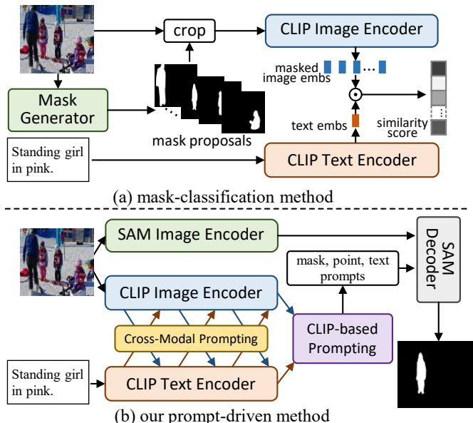
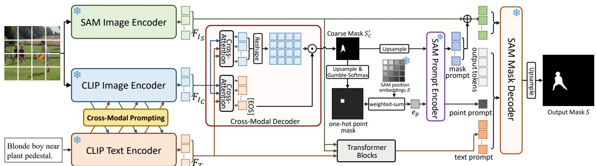
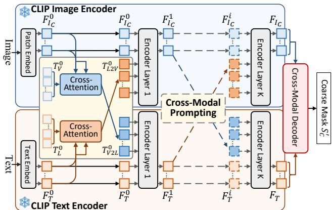
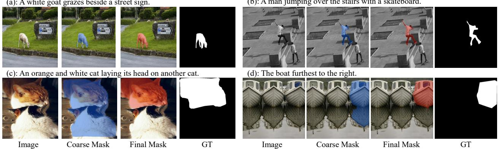

# Prompt-Driven Referring Image Segmentation with Instance Contrasting

Chao Shang, Zichen Song, Heqian Qiu ∗, Lanxiao Wang, Fanman Meng, Hongliang Li ∗ University of Electronic Science and Technology of China

shangc@std.uestc.edu.cn, szc.uestc@gmail.com, hqqiu@uestc.edu.cn,

lanxiao.wang@std.uestc.edu.cn, fmmeng@uestc.edu.cn, hlli@uestc.edu.cn

## Abstract

Referring image segmentation (RIS) aims to segment the target referent described by natural language. Recently, large-scale pre-trained models, e.g., CLIP and SAM, have been successfully applied in many downstream tasks, but they are not well adapted to RIS task due to inter-task differences. In this paper, we propose a new prompt-driven framework named Prompt-RIS, which bridges CLIP and SAM end-to-end and transfers their rich knowledge and powerful capabilities to RIS task through prompt learning. To adapt CLIP to pixel-level task, we first propose a Cross-Modal Prompting method, which acquires more comprehensive vision-language interaction and fine-grained textto-pixel alignment by performing bidirectional prompting. Then, the prompt-tuned CLIP generates masks, points, and text prompts for SAM to generate more accurate mask predictions. Moreover, we further propose Instance Contrastive Learning to improve the model’s discriminability to different instances and robustness to diverse languages describing the same instance. Extensive experiments demonstrate that the performance of our method outperforms the state-of-the-art methods consistently in both general and open-vocabulary settings.

## 1. Introduction

Referring Image Segmentation [6, 11, 14] is one of the most challenging tasks in the field of vision-language understanding, which aims to segment corresponding target referent given a natural language description. Compared with semantic segmentation task [3, 40] that only segment predefined fixed categories, RIS can more flexibly segment targets of any category, location or attribute based on freefrom language, which requires a more comprehensive understanding and alignment between diverse language expressions and images, so it can be widely used in real-world scenarios like robots and human-computer interactions.

  
Figure 1. Existing methods (a) of adapting CLIP to segmentation typically adopt two-stage mask-classification manner. Our method (b) bridges CLIP and SAM end-to-end through prompt learning.

Most existing methods [14, 19, 41, 46] typically use traditional single-modal pre-trained image or text backbones to extract features for RIS tasks. Recently, with the rise of large-scale pre-trained models [9, 23, 38], their powerful generalization capabilities have attracted increasing research attention. Among them, vision-language models, like CLIP [38] and ALIGN [17], that are pre-trained on large-scale image-text pairs, demonstrates powerful generalization capabilities in multiple downstream tasks. And the large-scale segmentation model SAM [23] also shows the ability to generate promising segmentation results based on its data engine and diverse prompts.

Currently, increasing researchers focus on how to adapt these pre-trained models, represented by CLIP [38], to different downstream tasks. On the one hand, to avoid CLIP forgetting the generalized knowledge during fine-tuning, many prompt learning methods [18, 21, 25, 52] are proposed, which freeze the model parameters and introduce additional learnable prompt tokens for new task adaptation.

On the other hand, since CLIP is trained by image-level tasks and lacks pixel-level recognition capabilities. To adapt CLIP to more fine-grained tasks like segmentation, most existing methods adopt a two-stage “mask-classification” manner [7, 28, 50], as shown in Fig. 1(a), which first use pre-trained mask generators such as Maskformer [5] or SAM [23] to generate class-agnostic mask proposals, then crop the image based on the foreground in the masks, and finally use CLIP to classify the foreground.

However, the above methods are not adapted well to RIS. Firstly, most of the existing prompt learning methods are unidirectional information flow prompting, like visionto-language [52] or language-to-vision [4, 21] prompting. RIS task requires sufficient cross-modal interaction to correspond different contents of the text with different regions in the image, while the unidirectional prompting makes it difficult to capture text-pixel correspondences due to the lack of sufficient cross-modal interaction. Secondly, RIS is not a simple task of classifying instances in images. The content of the text may not explicitly contain the category of the target, but describes the target’s location, attributes, and relationships with other instances, while the ”maskclassification” methods only focus on the foreground instance in the mask and ignore to understand more global contexts such as the different instances and their relationships in the image. The original SAM used for the RIS task also needs to input the mask-cropped images into CLIP to generate approximate text prompts, which also ignores the contextual information about the referent, so it is difficult to generate accurate segmentation results without positional priors provided by additional point prompts.

To address the above problems, we propose a new framework called Prompt-RIS, which bridges CLIP and SAM intuitively and explores the powerful capabilities of these two models for RIS through prompt learning, as shown in Fig. 1(b). Firstly, to adapt CLIP to the pixel-level RIS task and improve the cross-modal interaction between image and text in the encoding process, we propose a new bidirectional information flow prompt learning method called Cross-Modal Prompting (CMP). During the CLIP encoding, the two modalities generate prompts for each other, and the prompts contain rich context information from the other modality, thus the two modalities achieve mutual alignment through prompting. Then, we further adopt SAM to generate more accurate segmentation results. Since CLIP acquires more text-pixel alignment capabilities through crossmodal prompting, we use the prompt-tuned CLIP to provide mask prompts and point prompts for SAM, and we also project CLIP-encoded text features as the text prompts of SAM. Based on the cross-modal prompting and the above three types of prompts from CLIP to SAM, we bridge CLIP and SAM end-to-end and form a powerful model for RIS.

Moreover, to further improve the accuracy of mask and point prompts for SAM, we observed that there are often multiple instances that have descriptions in the same image, and each instance often has multiple different descriptions. Therefore, we propose Instance Contrastive Learning (ICL), which simultaneously samples multiple sentences corresponding to the same image, and learns to improve the similarity of the predicted masks corresponding to sentences describing the same instance, while suppress the overlap between the masks corresponding to sentences describing different instances. Based on contrastive learning between instances from the same image, the model further improves its localization ability to distinguish different instances and alignment ability between instances and texts.

Our contributions are summarized as follows:

• Structurally, we propose a new prompt-driven framework named Prompt-RIS to intuitively bridge CLIP and SAM end-to-end, which transfers their rich knowledge and powerful capabilities to referring image segmentation task through prompt learning.

• Methodologically, we propose Cross-Modal Prompting CMP to adapt CLIP to pixel-level RIS tasks and improve the information interaction between vision and language modalities. And we further propose Instance Contrastive Learning ICL to improve the model’s discriminability to different instances and robustness to diverse languages describing the same instance.

• Experimentally, we conduct extensive experiments on three benchmarks and further evaluate the generalization ability on unseen categories. The performance of our method consistently outperforms the previous SOTAs.

## 2. Related Works

Referring Image Segmentation. The goal of referring image segmentation (RIS) is to understand natural language based on images, and locate and segment the target referent described in the language. This task was first proposed by [11], and early works [2, 27, 30, 35] mainly focus on concatenating visual and linguistic features generated by CNN and LSTM [10] directly, and utilize convolutional networks to achieve multi-modal fusion and understanding. With the application of attention mechanisms in multi-modal learning, more works [8, 13, 39, 47] are proposed to enhance the alignment relationship between words and different targets in images through cross-modal attention. CMPC [14] maps language features into entities, attributes and relationships, and constructs a multi-modal graph, and then captures the correct entity through graph reasoning. LSMC [15] further introduces the Dependency Parsing Tree to obtain more accurate linguistic structures of the input sentence.

Recently, with the rise of Transformers [42], VLT [6] introduces a transformer framework to capture language information from different visual aspects. ReSTR [22] proposes a vision-language transformer encoder to fuse the features from two modalities, and introduce a class token to capture the target referent. LAVT [46] proposes to perform cross-modal fusion in the process of image encoding. CGFormer [41] introduces the paradigm of mask classification into RIS task and groups visual features into the query tokens for cross-modal reasoning. DMMI [12] proposes two transformer decoders to align vision and language from dual directions. With the vision-language model CLIP [38] adapts to a variety of downstream tasks, CRIS [43] adds a cross-modal decoder based on CLIP to adapt CLIP to pixellevel RIS task. ETRIS [44] further performs cross-modal feature fusion in the encoding process. Our method aims to adapt CLIP to more fine-grained tasks while preserving the rich knowledge of CLIP for unseen categories through prompt learning.

  
Figure 2. The overview of Prompt-RIS. Our method bridges CLIP and SAM based on prompt learning. CLIP is first adapted to RIS through Cross-Modal Prompting, then the prompt-tuned CLIP generates masks, points and text prompts for SAM to obtain final predictions.

Prompt Learning. To transfer large-scale language models to downstream tasks and avoid forgetting the learned generalization knowledge through fine-tuning, prompt learning [24, 31] is proposed to adapt the model to specific tasks by adding handcrafted or learnable tokens to the fixed model. Recently, with the success of applying visionlanguage pre-trained models e.g., CLIP [38] and ALIGN [17], to downstream tasks, prompt learning has been further extended to computer vision [1, 18] and multi-modal learning [25, 45, 52, 53] tasks. CoOp [53] employs learnable prompting tokens as context and jointly inputs them with category words to adapt CLIP to image recognition tasks. Co-CoOp [52] further proposes to obtain the context tokens conditioned on image information. MaPLe [21] generates vision prompts based on language prompts.

Most existing prompt learning methods focus on imagelevel tasks and adopt unidirectional information flow prompting, e.g., vision-to-language or language-to-vision. For pixel-level tasks like segmentation, SAM [23] is proposed to generate promising segmentation results based on different prompts, but it is still difficult to generate accurate mask predictions for RIS task without point prompts. In this paper, we bridge SAM and CLIP end-to-end for RIS based on prompt learning, and further propose a new cross-modal prompting method to better adapt CLIP to pixel-level task and perform cross-modal interactions more sufficiently.

## 3. Method

## 3.1. Prompt-RIS Structure

Our proposed Prompt-RIS bridges two large-scale pretrained models CLIP [38] and SAM [23] based on prompt learning, and explores to transfer their rich knowledge and powerful capabilities to the RIS task. The overall structure of our method is shown in Fig. 2. CLIP is first adapted to the pixel-level RIS task through Cross-Modal Prompting, and then the prompt-tuned CLIP generates masks, points and text prompts and inputs them into SAM to generate final segmentation predictions. Next, we will elaborate the structure details of our proposed framework.

Image&Text Encoding. Our Prompt-RIS framework mainly consists of CLIP and SAM, so there are two image encoders corresponding to the two models respectively, and we use the vision transformer (ViT) of CLIP and SAM as image encoders in this paper. The image is resized to different resolutions for the two encoders, thus the image is split into $N _ { C } = H _ { C } W _ { C }$ (for CLIP) and $N _ { S } = H _ { S } W _ { S }$ (for SAM) patches respectively, and $N _ { C } < N _ { S }$ in our method. Then the patches projected to image embedding features $F _ { I _ { C } } ^ { 0 } \in \mathbb { R } ^ { \bar { N } _ { C } \times D _ { I _ { C } } }$ and $F _ { I _ { c } } ^ { 0 } \in \mathbb { R } ^ { N _ { S } \times D _ { S } }$ , and input into two image encoders, where $\stackrel {  } { F } _ { I _ { C } } ^ { 0 }$ is input into the CLIP image encoder $\mathbf { E } _ { I _ { c l i p } }$ jointly with a class [CLS] token $c ^ { 0 } \in \mathbb { R } ^ { D _ { I _ { C } } }$ and $\mathbf { E } _ { I _ { c l i p } }$ generates image features $F _ { I _ { C } } \in \mathbb { R } ^ { N _ { C } \times D _ { I _ { C } } }$

Given a language description with length L, we first add [SOS] and [EOS] at the beginning and end of the sentence following CLIP, and project it to an text embedding feature sequence $F _ { T } ^ { 0 } \ \in \ \bar { \mathbb { R } ^ { \left( L + 2 \right) \times D _ { T } } }$ , and then input $F _ { T } ^ { 0 }$ into $\mathrm { C L I P } \mathrm { s }$ text encoder $\mathbf { E } _ { T _ { c l i p } }$ to generate text features $F _ { T } \in \mathbb { R } ^ { ( L + 2 ) \times D _ { T } }$ . In the process of CLIP image and text encoding, the visual and linguistic features in the intermediate layer generate prompt tokens to each other for crossmodal interaction and text-pixel alignment, which will be introduced in Section 3.2.

CLIP-based Prompting. After obtaining image $F _ { I _ { C } }$ and text features $F _ { T }$ from CLIP encoders, we use a tiny decoder based on cross-attention to further capture relevant context from the other modality and get updated $F _ { I _ { C } } ^ { \prime } \in$ $\mathbb { R } ^ { N _ { C } \times D _ { C } }$ and $F _ { T } ^ { \prime } \in \mathbb { R } ^ { ( L + 2 ) \times D _ { C } }$ , which are formulated as:

$$
\begin{array} { r } { F _ { I _ { C } } ^ { \prime } = C r o s s A t t n ( F _ { I _ { C } } , F _ { T } ) ; } \\ { F _ { T } ^ { \prime } = C r o s s A t t n ( F _ { T } , F _ { I _ { C } } ) } \end{array}\tag{1}
$$

Then, as the middle part of Fig. 2, we take the feature at [EOS] position in $F _ { T } ^ { \prime }$ as the global text feature $t _ { q } ~ \in$ $\mathbb { R } ^ { D }$ , and calculate the text-pixel response map $S ^ { \prime } \in \breve { \mathbb { R } } ^ { N _ { C } }$ through the inner product:

$$
S _ { C } ^ { \prime } = F _ { I _ { C } } ^ { \prime } \cdot t _ { g }\tag{2}
$$

We reshape $S _ { C } ^ { \prime }$ to $H _ { C } \times W _ { C }$ and obtain a mask prediction of the target referent with low resolution, so we utilize it as a coarse mask.

To obtain more accurate masks, we further incorporate a powerful segmentation model SAM into our method. SAM generates mask predictions based on multiple types of prompts, including dense prompts (masks) and sparse prompts (points, boxes and text). As we obtained the coarse mask prediction $S _ { C } ^ { \prime }$ and encoded text features $F _ { T }$ from CLIP, intuitively, the generation of CLIP can be used as prompts for SAM.

As shown in the right part of Fig. 2, firstly, $S _ { C } ^ { \prime }$ is upsampled to a higher resolution mask $S _ { C } \in \mathbb { R } ^ { 4 H _ { S } \times \smile }$ and projected to mask prompts $P _ { m a s k } \in \mathbb { R } ^ { H _ { S } \times W _ { S } \times D _ { S } }$ through SAM prompt encoder. Secondly, $S _ { C }$ can provide the target referent location information, so the location with high response scores in $S _ { C }$ can be selected to get the point prompts $P _ { p o i n t } \in { \mathbb { R } } ^ { D _ { S } }$ . The prompt encoder in SAM maps point coordinates to position embeddings, and uses the embeddings to generate point prompts. However, in the training process, mask to coordinates is not differentiable, resulting in CLIP and SAM unable to be trained jointly. To solve this problem, we operate gumbel-softmax [16] (differentiable based on straight-through estimator) on flattened $S _ { C }$ to generate $M ^ { \prime } ~ \in ~ \overline { { \mathbb { R } } } ^ { 1 6 H _ { S } W _ { S } }$ that hard assigns a high response position discretely, and reshape $M ^ { \prime }$ back to get a one-hot point map $M \in \dot { \mathbb { R } } ^ { 4 H _ { S } \times 4 W _ { S } }$ . And since the SAM parameters are frozen during training, the embeddings of all positions $E \in \mathbb { R } ^ { 4 H _ { S } \times 4 W _ { S } \times D _ { S } }$ in SAM can be pre-calculated and are fixed. Therefore, we store E and perform a weighted sum of $E$ using M to obtain the position embedding of the one-hot point $e _ { p } \in \mathbb { R } ^ { D _ { S } }$ , the process is formulated as:

$$
\begin{array} { c } { { M = G u m b e l - S o f t M a x ( S _ { C } ) ; } } \\ { { { } } } \\ { { e _ { p } = \sum _ { i = 1 } ^ { 1 6 H _ { S } W _ { S } } M _ { i } E _ { i } } } \end{array}\tag{3}
$$

where the reshape operation is omitted for simplicity. In this way, we can derive the position embedding $e _ { p }$ of the point from mask $S _ { C }$ differentiably. In inference, we directly select the position embedding at the highest response position of $S _ { C }$ . Finally, for text prompts $\bar { P _ { t e x t } } \in \bar { \mathbb { R } ^ { ( L + 2 ) \times \bar { D } s } }$ , we utilize two transformer blocks composed of self- and crossattention modules, which takes the text features $F _ { T }$ generated by CLIP as queries, and projects into text prompts conditioned on the image features $\mathbf { \bar { \mathit { F } } } _ { I _ { S } } \in \mathbb { R } ^ { H _ { S } \times \mathbf { \bar { \mathit { W } } } _ { S } \times \mathbf { \bar { \mathit { D } } } _ { S } }$ from the SAM image encoder.

  
Figure 3. Cross-Modal Prompting (CMP). At each CLIP encoding layer, image and text features generate prompts for each other, facilitating cross-modal interaction and text-pixel alignment.

SAM Decoding. Based on the dense mask prompts $P _ { m a s k } \in \mathbb { R } ^ { H _ { S } \times \smile } \lor _ { S } ^ { - } \times D _ { S }$ and the sparse prompts $P _ { p o i n t } \in$ $\mathbb { R } ^ { D _ { S } }$ and $P _ { t e x t } \in \mathbb { R } ^ { ( L + 2 ) \times D _ { S } }$ , we obtain the mask prediction $S ^ { \prime } \in \mathbb { R } ^ { 4 H _ { S } \times 4 W _ { S } }$ with higher resolution through SAM mask decoder $\mathbf { D } _ { s a m } ,$ , the process is formulated by:

$$
S ^ { \prime } = { \bf D } _ { s a m } ( [ T _ { i o u } ; T _ { o u t } ; P _ { p o i n t } ; P _ { t e x t } ] , ( P _ { m a s k } + F _ { I _ { S } } ) )\tag{4}
$$

where $T _ { i o u } \in \mathbb { R } ^ { D _ { S } }$ and $T _ { o u t } \in \mathbb { R } ^ { 4 \times D _ { S } }$ are the output tokens in SAM for IoU and mask predictions, and [;] is concatenation. And $S ^ { \prime }$ is further $\times 4$ upsampled to get the final $1 6 H _ { S } \times 1 6 W _ { S }$ segmentation prediction S. The SAM decoder will generate multiple mask predictions for each image-text pair, and we only use the first prediction following the multiple prompts settings of SAM.

## 3.2. Cross-Modal Prompting

Sufficient cross-modal interaction is essential for multimodal learning to improve text-pixel alignment [14, 43, 46]. However, in the CLIP encoding, there is no interaction process between vision and language, and only the final global features of the two modalities are learned to match through contrastive learning, which is effective for image-level tasks like classification or image-text retrieval, but suboptimal for pixel-level RIS task. Moreover, to transfer the rich knowledge of CLIP to downstream tasks, existing methods [4, 21, 52] propose prompt learning that project the information from one modality to the prompts of another modality, but such unidirectional information stream prompting methods still cannot perform sufficient cross-modal interaction.

Therefore, to adapt the CLIP to the pixel-level RIS task and improve the interaction of visual and linguistic information more sufficiently during the CLIP encoding process, we propose a new Cross-Modal Prompting (CMP) method, as shown in Fig. 3, which is the bidirectional prompting fashion. In the intermediate layers of image and text encoding, we symmetrically perform Vision-to-Language (V2L) prompting and Language-to-Vision (L2V) prompting.

Specifically, taking V2L prompting as an example. For the image features $\bar { F } _ { I _ { C } } ^ { i } ~ \in ~ \mathbb { R } ^ { \bar { N _ { C } } \times \bar { D _ { I _ { C } } } }$ and text features $F _ { T } ^ { i } \in \mathbb { R } ^ { ( L + 2 ) \times D _ { T } }$ output from the i-th encoding layer, the most straightforward way is to project all visual patch features $F _ { I _ { C } } ^ { i }$ or the global [CLS] features $c ^ { i } \in \mathbb { R } ^ { \tilde { D } _ { I _ { C } } }$ as the V2L prompt tokens, and then concatenated with $F _ { T } ^ { i }$ and input into next text encoding layer. However, using all visual patch features as V2L prompts will greatly increase the computational complexity of the text encoder, while using visual global visual feature makes it difficult to achieve finegrained vision-to-language interaction. To solve this problem, we propose to introduce an additional set of learnable tokens $T _ { V } ^ { i } \in \mathbb { R } ^ { n \times D _ { I _ { C } } }$ , where $n < < N _ { C }$ . Then we employ the cross-attention module to take $T _ { V } ^ { i }$ as queries and visual features $F _ { I _ { C } } ^ { i }$ as keys and values to generate visual-aware V2L prompt tokens $T _ { V 2 L } ^ { i } \in \mathbb { R } ^ { n \times D _ { T } }$ . The V2L prompting process can be formulated as:

$$
\begin{array} { r } { T _ { V 2 L } ^ { i } = C r o s s A t t n ( T _ { V } ^ { i } , F _ { I c } ^ { i } ) ; } \\ { \lbrack \_ ; F _ { T } ^ { i + 1 } ] = \mathbf { E } _ { T _ { c l i p } } ^ { i + 1 } ( [ T _ { V 2 L } ^ { i } ; F _ { T } ^ { i } ] ) } \end{array}\tag{5}
$$

where $\mathbf { E } _ { T _ { c l i p } } ^ { i + 1 }$ denotes the i+1-th layer of the text encoder ${ \bf E } _ { T _ { c l i p } }$ . In this way, the tokens in $T _ { V 2 L } ^ { i }$ correspond to different visual contents through the attention mechanism, which is not only more fine-grained than using global features, but also more computationally efficient. For L2V prompting, the process is symmetric:

$$
\begin{array} { c } { { T _ { L 2 V } ^ { i } = C r o s s A t t n ( T _ { L } ^ { i } , F _ { T } ^ { i } ) ; } } \\ { { \lbrack \ldots ; c ^ { i + 1 } ; F _ { I _ { C } } ^ { i + 1 } \rbrack = { \bf E } _ { I _ { c l i p } } ^ { i + 1 } ( [ T _ { L 2 V } ^ { i } ; c ^ { i } ; F _ { I _ { C } } ^ { i } ] ) } } \end{array}\tag{6}
$$

We implement cross-modal prompting at each layer of the CLIP image and text encoders, and visual and linguistic information are interacted more sufficiently during the encoding process through cross-modal prompting.

## 3.3. Instance Contrastive Learning

In our proposed framework, the mask and point prompts input to SAM are derived by the coarse mask $S _ { C } ^ { \prime }$ from CLIP, thus the accuracy of the target referent location in $S _ { C } ^ { \prime }$ will affect the accuracy of the final segmentation prediction generated by SAM. We observed that there are often multiple instances that have language descriptions in the same image, and each instance often has multiple different descriptions. Therefore, to further improve the model’s discriminability of different instances and its robustness to different languages describing the same instance, we propose Instance Contrastive Learning (ICL).

Specifically, we sample b descriptions for one image, which may or may not describe the same instance in the image, so the model produces b mask predictions based on this image and b sentences. We use contrastive learning to encourage masks corresponding to sentences describing the same instance to be similar, and suppress the overlap of the mask corresponding to sentences describing different instances. We adopt the Dice coefficient [36] to calculate the overlaps between two masks. Given one image and b descriptions, b mask predictions can be obtained. We can get $O \in \mathbb { R } ^ { b \times b }$ by calculating the overlaps between each two masks, and the overlap score between the i-th and j-th final masks $S _ { i }$ and $S _ { j }$ is calculated by:

$$
O _ { i j } = \frac { 2 \sum _ { k = 1 } ^ { H W } S _ { i } ^ { k } S _ { j } ^ { k } } { \sum _ { k = 1 } ^ { H W } S _ { i } ^ { k } + \sum _ { k = 1 } ^ { H W } S _ { j } ^ { k } }\tag{7}
$$

where $i , j \in { 1 , 2 , . . . , b , O _ { i j } } \in [ 0 , 1 ]$ , H and $W$ is the size of $S , S _ { i } ^ { k }$ is the value of the i-th mask $S ^ { i }$ at position $k ,$ the sigmoid operation is omitted. The instance contrastive loss is formulated as:

$$
\begin{array} { c } { { L _ { i c l } = displaystyle \frac { 1 } { b ^ { 2 } } \sum _ { i = 1 } ^ { b } \sum _ { j = 1 } ^ { b } - w _ { i } ( Y _ { i j } l o g ( O _ { i j } ) } } \\ { { + ( 1 - Y _ { i j } ) l o g ( 1 - O _ { i j } ) ) } } \end{array}\tag{8}
$$

where $Y _ { i j }$ indicates whether the $S _ { i }$ and $S _ { j }$ correspond to the same instance, and $w _ { i }$ is the IoU between the i-th mask $S _ { i }$ and the ground truth, which is used to prevent the misleading of the wrong mask prediction. $L _ { i c l }$ is also applied on coarse mask $S _ { C } ^ { \prime }$

For segmentation loss, we adopt binary cross-entropy loss and Dice loss [36] on both the coarse mask $S _ { C } ^ { \prime }$ and the final mask $S$ respectively, denoted as $L _ { c l i p . s e g }$ and $L _ { s a m \_ s e g }$ . The total loss of our method is:

$$
{ \cal L } = { \cal L } _ { c l i p . s e g } + { \cal L } _ { s a m . s e g } + { \cal L } _ { i c l }\tag{9}
$$

## 4. Experiments

## 4.1. Datasets and Metrics

Datasets. To verify the effectiveness of our proposed method, we conduct extensive experiments on three datasets: RefCOCO [48], RefCOCO+ [48], G-Ref [34, 37].

RefCOCO [48] is one of the most commonly used datasets for RIS task. It adopts 19,994 image data from the MS-COCO [29] and collects 142,210 referring descriptions used to describe 50,000 instances through a two-player game [20]. The expressions are mainly used to describe the location of the instance with an average length of 3.5 words. RefCOCO+ [48] adopts 19,992 images from MS-COCO [29] and collects 141,564 referring expressions for 49,856 instances. The expressions mainly describe the attributes of instances G-Ref [34, 37] is also collected from MS-COCO [29], including 26,711 images and 104,560 referring expressions for 54,822 objects. The average expression length of G-Ref is 8.4 words, and the expressions are more diverse. G-Ref can be split based on two types of partitions: Google [34] and UMD [37] partitions.

Table 1. Comparison with state-of-the-arts on RefCOCO, RefCOCO+ and G-Ref datasets using oIoU and mIoU metrics.
<table><tr><td rowspan="2"></td><td rowspan="2">Method</td><td colspan="3">RefCOCO</td><td colspan="3">RefCOCO+</td><td colspan="3">G-Ref</td></tr><tr><td>val</td><td>testA</td><td>testB</td><td>val</td><td>testA</td><td>testB</td><td>val(G)</td><td>val(U)</td><td>test(U)</td></tr><tr><td rowspan="10">oIoU</td><td>RMI [30]</td><td>45.18</td><td>45.69</td><td>45.57</td><td>29.86</td><td>30.48</td><td>29.50</td><td>34.52</td><td></td><td></td></tr><tr><td>MattNet [49]</td><td>56.51</td><td>62.37</td><td>51.70</td><td>46.67</td><td>52.39</td><td>40.08</td><td></td><td>47.64</td><td>48.61</td></tr><tr><td>CMSA [47]</td><td>58.32</td><td>60.61</td><td>55.09</td><td>43.76</td><td>47.60</td><td>37.89</td><td>39.98</td><td></td><td></td></tr><tr><td>CMPC [14]</td><td>61.36</td><td>64.53</td><td>59.64</td><td>49.56</td><td>53.44</td><td>43.23</td><td>49.05</td><td></td><td></td></tr><tr><td>EFN [8]</td><td>62.76</td><td>65.69</td><td>59.67</td><td>51.50</td><td>55.24</td><td>43.01</td><td>51.93</td><td></td><td></td></tr><tr><td>ReSTR [22]</td><td>67.22</td><td>69.30</td><td>64.45</td><td>55.78</td><td>60.44</td><td>48.27</td><td>54.48</td><td></td><td></td></tr><tr><td>LAVT [46]</td><td>72.73</td><td>75.82</td><td>68.79</td><td>62.14</td><td>68.38</td><td>55.10</td><td>60.50</td><td>61.24</td><td>62.09</td></tr><tr><td>DMMI [12]</td><td>74.13</td><td>77.13</td><td>70.16</td><td>63.98</td><td>69.73</td><td>57.03</td><td>61.98</td><td>63.46</td><td>64.19</td></tr><tr><td>CGFormer [41]</td><td>74.75</td><td>77.30</td><td>70.64</td><td>64.54</td><td>71.00</td><td>57.14</td><td>62.51</td><td>64.68</td><td>65.09</td></tr><tr><td>Ours</td><td>76.36</td><td>80.37</td><td>72.29</td><td>67.06</td><td>73.58</td><td>58.96</td><td>64.79</td><td>67.16</td><td>69.01</td></tr><tr><td rowspan="7">mIoU</td><td>CGAN [33]</td><td>64.86</td><td>68.04</td><td>62.07</td><td></td><td></td><td>44.06</td><td></td><td>51.01</td><td>51.69</td></tr><tr><td>LTS [19]</td><td>65.43</td><td>67.76</td><td>63.08</td><td>51.03 54.21</td><td>55.51 58.32</td><td>48.02</td><td></td><td>54.40</td><td>54.25</td></tr><tr><td>RefTR [26]</td><td>74.34</td><td>76.77</td><td>70.87</td><td>66.75</td><td>70.58</td><td>59.40</td><td></td><td>66.63</td><td>67.39</td></tr><tr><td>VLT [6]</td><td>65.65</td><td>68.29</td><td>62.73</td><td>55.50</td><td>59.20</td><td>49.36</td><td>49.76</td><td>52.99</td><td>56.65</td></tr><tr><td>CRIS [43]</td><td>70.47</td><td>73.18</td><td>66.10</td><td>62.27</td><td>68.08</td><td>53.68</td><td></td><td>59.87</td><td></td></tr><tr><td>ETRIS [44]</td><td>70.51</td><td>73.51</td><td>66.63</td><td>60.10</td><td>66.89</td><td>50.17</td><td>57.88</td><td>59.82</td><td>60.36 59.91</td></tr><tr><td>CGFormer [41]</td><td>76.93</td><td>78.70</td><td>73.32</td><td>68.56</td><td>73.76</td><td>61.72</td><td>65.79</td><td>67.57</td><td>67.83</td></tr><tr><td></td><td>Ours</td><td>78.10</td><td>81.21</td><td>74.64</td><td>71.13</td><td>76.60</td><td>64.25</td><td>69.17</td><td>70.47</td><td>71.29</td></tr></table>

Moreover, to verify the generalization of our method to unseen categories, following [41], we divide the categories of instances in the datasets into seen and unseen splits based on the open-vocabulary detection setting [51], and train our method only on the seen categories, and evaluate the performance on the splits of seen and unseen respectively.

Metrics. Following the metrics used in previous works [41, 46], we adopt overall Intersection over Union (oIoU), mean Intersection over Union (mIoU) and P@X to evaluate the performance of our method, where P@X represents the proportion of IoU between mask predictions and ground truth higher than thresholds X∈ {0.5, 0.7, 0.9}.

## 4.2. Implementation Details

We build our method based on CLIP and SAM, and adopt ViT-B/16 as the image encoder of both models. The input image is resized to 480 × 480 for CLIP and 1024 × 1024 for SAM, thus $H _ { C } = W _ { C } = 3 0$ and $H _ { S } = W _ { S } = 6 4$ The number n of prompt tokens in CMP is set to 16. In the training process, we sample 16 images per batch and further sample b = 4 sentences corresponding to per image for instance contrastive learning, so our batch size is $B =$ 64. To provide richer sentences for each image, we combine the three datasets with all images in validation or test sets removed to train our model. If the number of expressions corresponding to one image is less than b, we repeat the sampling while randomly masking out a portion of words.

We trained the model for 50 epochs using the AdamW optimizer [32] with an initial learning rate 1e-4 and polynomial decay power of 0.9. To accelerate the convergence, we first train CLIP with CMP and ICL for the first 20 epochs to generate coarse masks, and then jointly train the entire model end-to-end for the last 30 epochs. To reduce the decoder’s over-reliance on certain prompts and the error accumulation from the coarse mask generated by CLIP, we randomly dropout the three types of prompts during training to improve the effectiveness of each type of prompt.

## 4.3. Comparison with State-of-the-arts

We first perform experiments on three common datasets and compare the performance with the state-of-the-art methods. As reported in Table 1, our method consistently outperforms the previous state-of-the-art methods on all splits. For the RefCOCO which mainly describes location information, our method outperforms the previous best by an average of 2.11 points on oIoU and 1.67 points on mIoU. For RefCOCO+ which focuses on describing instance attributes, our method improves by over 2.5 points on both oIoU and mIoU compared to the previous best, and the improvements are more obvious than RefCOCO, indicating that the model can understand the different attributes at different regions of the image in a more fine-grained manner and align them with linguistic information. On more challenging dataset G-Ref, our method has a stronger ability to understand longer and more complex languages. Our method outperforms the previous best by 2.89 points on oIoU and 3.25 points on mIoU, which shows that our method obtains more accurate language semantics understanding and referent segmentation based on CLIP and SAM.

Table 2. Comparison of generalization performance using mIoU. † denotes results from [41], and ∗ denotes our re-implemented results.
<table><tr><td rowspan="3">Method</td><td colspan="3">RefCOCO</td><td colspan="4">RefCOCO+</td><td colspan="6">G-Ref</td></tr><tr><td colspan="2">val</td><td colspan="2">test</td><td colspan="2">val</td><td colspan="2">test</td><td colspan="2">val(G)</td><td colspan="2">test(U)</td></tr><tr><td>seen unseen</td><td>seen</td><td>unseen</td><td>seen</td><td>unseen</td><td>seen</td><td>unseen</td><td>seen</td><td>unseen</td><td>seen</td><td>unseen</td><td>seen unseen</td></tr><tr><td>CRIS† [43]</td><td>68.66 52.77</td><td>52.77</td><td>52.66</td><td>61.49</td><td>48.08</td><td>60.46</td><td>45.26</td><td>42.36</td><td>32.84</td><td>58.64</td><td>42.63</td><td>59.68 38.88</td></tr><tr><td>LAVT† [46]</td><td>73.05 61.35</td><td>72.31</td><td>57.66</td><td>61.17</td><td>41.49</td><td>60.97</td><td>38.67</td><td>57.33</td><td>40.43</td><td>60.16 42.33</td><td>60.37</td><td>41.38</td></tr><tr><td>ETRIS* [44]</td><td>71.78 59.76</td><td>70.94</td><td>56.97</td><td>60.12</td><td>49.29</td><td>62.99</td><td>46.30</td><td>57.99</td><td>40.24 59.35</td><td>43.82</td><td>58.90</td><td>41.04</td></tr><tr><td>CGFormer† [41]</td><td>75.52 63.17</td><td>74.63</td><td>59.03</td><td>67.44</td><td>51.24</td><td>66.35</td><td>48.11</td><td>62.85 45.05</td><td>65.60</td><td>46.11</td><td>65.67</td><td>42.31</td></tr><tr><td>Ours</td><td>78.74 65.07</td><td>78.15</td><td>62.02</td><td>71.96</td><td>52.05</td><td>71.35</td><td>53.50</td><td>66.71 47.99</td><td>68.75</td><td>46.41</td><td>69.70</td><td>45.66</td></tr></table>

Table 3. Components ablation results on RefCOCO val set. We use CLIP with a cross-modal decoder as the baseline, add our proposed CMP in Sec. 3.2 to generate coarse masks, and then add ICL in Sec. 3.3 and SAM in Sec. 3.1 to get our complete model.
<table><tr><td></td><td>CLIP CMP ICL SAM|P@0.5 P@0.7 P@0.9</td><td>oIoU mIoU</td></tr><tr><td> $\checkmark$ </td><td>78.72 65.26 16.37</td><td>|65.24 67.94</td></tr><tr><td> $\checkmark$   $\checkmark$   $\checkmark$   $\checkmark$   $\checkmark$ </td><td>84.75 74.71 24.38</td><td>71.51 73.10</td></tr><tr><td>√ √ √</td><td>85.55 76.90 26.16</td><td>72.57 73.97</td></tr><tr><td> $\checkmark$ </td><td>88.33 81.35 36.55</td><td>75.86 77.40</td></tr><tr><td> $\checkmark$   $\checkmark$   $\checkmark$ </td><td>88.46 82.07 39.78</td><td>76.36 78.10</td></tr></table>

Compared to other CLIP-based methods CRIS [43] and ETRIS [44], our method outperforms the two methods by a large margin (6∼10 points) on three datasets. The second row of Table 3 is the ablation results (on RefCOCO val set) of our method when only using prompt-tuned CLIP, which has the similar structure as CLIP-based CRIS and ETRIS. So, for a more fair comparison, we compare the performance of our method in the second row of Table 3 with CRIS and ETRIS in Table 1 on RefCOCO val set, and our method still outperforms CRIS and ETRIS by ∼2.5 mIoU points on RefCOCO, which demonstrates that our Cross-Modal Prompting can still achieve more accurate segmentation results without complex decoders, and verifies the effectiveness of our proposed cross-modal prompt learning.

Moreover, we further perform model generalization experiments, and the mIoU comparison results are shown in Table 2, and we re-implement the CLIP-based method ETRIS [44] on the generalization setting. It can be observed that our method outperforms the previous methods in both seen and unseen categories on three datasets. Compared to the previous best CLIP-based CGFormer, the average performance of our method outperforms CGFormer by over 2.5 points on the unseen split of three datasets, demonstrating

Table 4. Comparison results of different prompting methods.
<table><tr><td>Method</td><td>P@0.5</td><td>P@0.7</td><td>P@0.9</td><td>oIoU</td><td>mIoU</td></tr><tr><td>Baseline</td><td>78.72</td><td>65.26</td><td>16.37</td><td>65.24</td><td>67.94</td></tr><tr><td>V2LP</td><td>80.45</td><td>67.70</td><td>17.68</td><td>67.48</td><td>69.53</td></tr><tr><td>L2VP</td><td>83.72</td><td>73.40</td><td>23.61</td><td>70.52</td><td>72.44</td></tr><tr><td>CMP</td><td>84.75</td><td>74.71</td><td>24.38</td><td>71.51</td><td>73.10</td></tr></table>

our proposed method exploits the rich knowledge in CLIP and SAM more sufficiently.

## 4.4. Ablation Studies

To verify the effectiveness of our proposed framework with cross-modal prompting (CMP) and instance contrastive learning (ICL), we perform ablations on RefCOCO val set.

Component Ablations. Our method mainly consists of CLIP and SAM, and further adds CMP and ICL. To verify the effectiveness of each component, we use CLIP with a cross-modal decoder as the baseline, which is introduced at the start of CLIP-based Prompting part in Section 3.1. As shown in Table 3, we first added CMP to the CLIP-baseline. Compared with the baseline, CMP brings 5.16 points improvement on mIoU, which demonstrates the importance of cross-modal interaction. Compared with the 6.03 points improvement on P@0.5, P@0.9 is improved by 8.01 points, which shows that CLIP+CMP can generate more accurate mask predictions, and verifies that our proposed CMP can adapt CLIP more effectively to pixel-level RIS task.

Next, we add SAM to the model, and achieve 4.3 points mIoU performance improvements, and as the threshold of P@X increases from 0.5 to 0.9, the benefits brought by SAM become more obvious. SAM improves P@0.5 by 3.58 points compared to CLIP+CMP, and significantly improves P@0.9 by 12.17 points, which shows that powerful SAM can distinguish different instances more accurately and generate more detailed masks. Finally, we add ICL to CLIP+CMP and the whole model respectively, and ICL brings 1.87 and 3.32 points improvement on P@0.9, further improving the accuracy of the model’s positioning and segmentation of referent targets.

Analysis of CMP. In our method, we propose CMP to adapt CLIP to pixel-level tasks and improve crossmodal interaction through bidirectional prompting, including vision-to-language prompting (V2LP) and language-tovision prompting (L2VP). To verify the effectiveness of the bidirectional prompting fashion, we add V2LP and L2VP to the baseline respectively. As shown in Table 4, compared with the baseline, V2LP brings 1.59 points improvement and L2VP brings 4.5 points on mIoU, and CMP gets better performance by combining the two promptings, which shows that our proposed bidirectional prompting method can achieve better vision and language alignment.

(a): A white goat grazes beside a street sign.  
(b): A man jumping over the stairs with a skateboard.  
  
Figure 4. Comparison of visualization results of the coarse masks and final masks on G-Ref val set.

Table 5. Effectiveness of mask, point and text prompts.
<table><tr><td rowspan=1 colspan=2>mask point text</td><td rowspan=1 colspan=1>P@0.5P@0.7P@0.9</td><td rowspan=1 colspan=1>oIoUmIoU</td></tr><tr><td rowspan=4 colspan=2>√√</td><td rowspan=1 colspan=1>37.24 15.00  1.55</td><td rowspan=1 colspan=1>42.8842.63</td></tr><tr><td rowspan=1 colspan=1>84.65  71.0  22.9</td><td rowspan=1 colspan=1>70.8272.01</td></tr><tr><td rowspan=1 colspan=1>61.79 35.36  5.1</td><td rowspan=4 colspan=1>55.3455.1872.6175.1170.9573.2475.8677.40</td></tr><tr><td rowspan=1 colspan=1></td><td rowspan=1 colspan=1>85.88 76.91 34.86</td></tr><tr><td rowspan=3 colspan=2>VV          √√   √√    √  √</td><td rowspan=1 colspan=1></td><td rowspan=1 colspan=1>85.50 72.83 26.45</td></tr><tr><td rowspan=2 colspan=1>88.33 81.35 36.5587.78 79.48 36.5288.46 82.07 39.78</td></tr><tr><td rowspan=1 colspan=1>74.3476.7576.3678.10</td></tr></table>

Effectiveness of CLIP-based Prompting. To bridge CLIP and SAM, we employ three types of prompts generated by CLIP. Therefore, we further perform an ablation experiment on these three types of prompts to evaluate their impact on the final segmentation performance. As reported in Table 5, the model can achieve competitive performance using only one or two types of prompts in inference, indicating that the model does not over-rely on a particular prompt, which verifies that the model can benefit from different prompts to generate more accurate mask predictions.

Compared with the original SAM that uses manual points and CLIP-based text as prompts in the RIS task, our method uses masks and points prompts generated by CLIP, reducing additional human interaction costs. And as shown in the last two rows of Table 5, compared with using points and text prompts, adding mask prompts to our method further improves the performance by 1.35 mIoU points, verifying the effectiveness of the mask prompts generated in our method for further improving segmentation performance.

Effectiveness of ICL. Since an image often contains multiple instances with multiple descriptions, we test the image average accuracy (ImgAcc) and the instance average accuracy (InstAcc) w/ and w/o ICL respectively. ImgAcc means first calculating the mIoU of all samples corresponding to the same image and getting $\mathrm { m I o U } _ { i m g } ,$ then calculating the average $\mathrm { m I o U } _ { i m g }$ of all images. Similarly, InstAcc is applied on instances. Compared with the performance w/o ICL (ImgAcc=77.61, InstAcc=76.02), our method obtains better results w/ ICL (ImgAcc=79.34, InstAcc=77.74).

Qualitative Results. Fig. 4 shows the visualized segmentation results of our proposed Prompt-RIS. We compared the coarse masks generated by the prompt-tuned CLIP with the more detailed final masks generated by the whole model. For examples (a) and (b) in the first row, although the coarse masks accurately locate the target referents, the quality of the masks is poor, and our method can further improve the coarse masks with better details. For examples (c) and (d) in the second row, the coarse masks do not locate the targets accurately, but our method can correct the final masks based on the mask and text information, and generate more accurate segmentation results.

## 5. Conclusion

In this paper, we propose a new framework, Prompt-RIS, for referring image segmentation, which combines CLIP and SAM intuitively through prompt learning. Based on this framework, we further propose the Cross-Modal Prompting method to adapt CLIP to pixel-level tasks and improve the vision-language alignment through cross-modal interaction. We propose Instance Contrastive Learning to improve the model’s discriminability of different instances and robustness to different languages describing the same instance. The performance and generalization of our method outperform the SOTAs on three datasets.

Acknowledgement. This work was support in part by National Science and Technology Major Project (2021ZD0112001), National Natural Science Foundation of China (No. U23A20286, 62301121, 62271119) and China Postdoctoral Science Foundation (2023M740529).

## References

[1] Hyojin Bahng, Ali Jahanian, Swami Sankaranarayanan, and Phillip Isola. Visual prompting: Modifying pixel space to adapt pre-trained models. arXiv preprint arXiv:2203.17274, 3:11–12, 2022. 3

[2] Ding-Jie Chen, Songhao Jia, Yi-Chen Lo, Hwann-Tzong Chen, and Tyng-Luh Liu. See-through-text grouping for referring image segmentation. In Proceedings of the IEEE/CVF International Conference on Computer Vision, pages 7454–7463, 2019. 2

[3] Liang-Chieh Chen, Yukun Zhu, George Papandreou, Florian Schroff, and Hartwig Adam. Encoder-decoder with atrous separable convolution for semantic image segmentation. In Proceedings of the European conference on computer vision (ECCV), pages 801–818, 2018. 1

[4] Wentao Chen, Chenyang Si, Zhang Zhang, Liang Wang, Zilei Wang, and Tieniu Tan. Semantic prompt for few-shot image recognition. In Proceedings of the IEEE/CVF Conference on Computer Vision and Pattern Recognition, pages 23581–23591, 2023. 2, 4

[5] Bowen Cheng, Alex Schwing, and Alexander Kirillov. Perpixel classification is not all you need for semantic segmentation. Advances in Neural Information Processing Systems, 34:17864–17875, 2021. 2

[6] Henghui Ding, Chang Liu, Suchen Wang, and Xudong Jiang. Vision-language transformer and query generation for referring segmentation. In Proceedings of the IEEE/CVF International Conference on Computer Vision, pages 16321–16330, 2021. 1, 2, 6

[7] Jian Ding, Nan Xue, Gui-Song Xia, and Dengxin Dai. Decoupling zero-shot semantic segmentation. In Proceedings of the IEEE/CVF Conference on Computer Vision and Pattern Recognition, pages 11583–11592, 2022. 2

[8] Guang Feng, Zhiwei Hu, Lihe Zhang, and Huchuan Lu. Encoder fusion network with co-attention embedding for referring image segmentation. In Proceedings of the IEEE/CVF Conference on Computer Vision and Pattern Recognition, pages 15506–15515, 2021. 2, 6

[9] Luciano Floridi and Massimo Chiriatti. Gpt-3: Its nature, scope, limits, and consequences. Minds and Machines, 30: 681–694, 2020. 1

[10] Sepp Hochreiter and Jurgen Schmidhuber. Long short-term¨ memory. Neural computation, 9(8):1735–1780, 1997. 2

[11] Ronghang Hu, Marcus Rohrbach, and Trevor Darrell. Segmentation from natural language expressions. In European Conference on Computer Vision, pages 108–124. Springer, 2016. 1, 2

[12] Yutao Hu, Qixiong Wang, Wenqi Shao, Enze Xie, Zhenguo Li, Jungong Han, and Ping Luo. Beyond one-to-one: Rethinking the referring image segmentation. In Proceedings ofthe IEEE/CVF International Conference on Computer Vision, pages 4067–4077, 2023. 3, 6

[13] Zhiwei Hu, Guang Feng, Jiayu Sun, Lihe Zhang, and Huchuan Lu. Bi-directional relationship inferring network for referring image segmentation. In Proceedings of the IEEE/CVF Conference on Computer Vision and Pattern Recognition, pages 4424–4433, 2020. 2

[14] Shaofei Huang, Tianrui Hui, Si Liu, Guanbin Li, Yunchao Wei, Jizhong Han, Luoqi Liu, and Bo Li. Referring image segmentation via cross-modal progressive comprehension. In Proceedings ofthe IEEE/CVF Conference on Computer Vision and Pattern Recognition, pages 10488–10497, 2020. 1, 2, 4, 6

[15] Tianrui Hui, Si Liu, Shaofei Huang, Guanbin Li, Sansi Yu, Faxi Zhang, and Jizhong Han. Linguistic structure guided context modeling for referring image segmentation. In European Conference on Computer Vision, pages 59–75. Springer, 2020. 2

[16] Eric Jang, Shixiang Gu, and Ben Poole. Categorical reparameterization with gumbel-softmax. arXiv preprint arXiv:1611.01144, 2016. 4

[17] Chao Jia, Yinfei Yang, Ye Xia, Yi-Ting Chen, Zarana Parekh, Hieu Pham, Quoc Le, Yun-Hsuan Sung, Zhen Li, and Tom Duerig. Scaling up visual and vision-language representation learning with noisy text supervision. In International conference on machine learning, pages 4904–4916. PMLR, 2021. 1, 3

[18] Menglin Jia, Luming Tang, Bor-Chun Chen, Claire Cardie, Serge Belongie, Bharath Hariharan, and Ser-Nam Lim. Visual prompt tuning. In European Conference on Computer Vision, pages 709–727. Springer, 2022. 1, 3

[19] Ya Jing, Tao Kong, Wei Wang, Liang Wang, Lei Li, and Tieniu Tan. Locate then segment: A strong pipeline for referring image segmentation. In Proceedings ofthe IEEE/CVF Conference on Computer Vision and Pattern Recognition, pages 9858–9867, 2021. 1, 6

[20] Sahar Kazemzadeh, Vicente Ordonez, Mark Matten, and Tamara Berg. Referitgame: Referring to objects in photographs of natural scenes. In Proceedings of the 2014 conference on empirical methods in natural language processing (EMNLP), pages 787–798, 2014. 5

[21] Muhammad Uzair Khattak, Hanoona Rasheed, Muhammad Maaz, Salman Khan, and Fahad Shahbaz Khan. Maple: Multi-modal prompt learning. In Proceedings of the IEEE/CVF Conference on Computer Vision and Pattern Recognition, pages 19113–19122, 2023. 1, 2, 3, 4

[22] Namyup Kim, Dongwon Kim, Cuiling Lan, Wenjun Zeng, and Suha Kwak. Restr: Convolution-free referring image segmentation using transformers. In Proceedings of the IEEE/CVF Conference on Computer Vision and Pattern Recognition, pages 18145–18154, 2022. 2, 6

[23] Alexander Kirillov, Eric Mintun, Nikhila Ravi, Hanzi Mao, Chloe Rolland, Laura Gustafson, Tete Xiao, Spencer Whitehead, Alexander C Berg, Wan-Yen Lo, et al. Segment anything. arXiv preprint arXiv:2304.02643, 2023. 1, 2, 3

[24] Brian Lester, Rami Al-Rfou, and Noah Constant. The power of scale for parameter-efficient prompt tuning. arXiv preprint arXiv:2104.08691, 2021. 3

[25] Dongxu Li, Junnan Li, Hongdong Li, Juan Carlos Niebles, and Steven CH Hoi. Align and prompt: Video-and-language pre-training with entity prompts. In Proceedings of the IEEE/CVF Conference on Computer Vision and Pattern Recognition, pages 4953–4963, 2022. 1, 3

[26] Muchen Li and Leonid Sigal. Referring transformer: A one-step approach to multi-task visual grounding. Advances

in neural information processing systems, 34:19652–19664, 2021. 6

[27] Ruiyu Li, Kaican Li, Yi-Chun Kuo, Michelle Shu, Xiaojuan Qi, Xiaoyong Shen, and Jiaya Jia. Referring image segmentation via recurrent refinement networks. In Proceedings ofthe IEEE Conference on Computer Vision and Pattern Recognition, pages 5745–5753, 2018. 2

[28] Feng Liang, Bichen Wu, Xiaoliang Dai, Kunpeng Li, Yinan Zhao, Hang Zhang, Peizhao Zhang, Peter Vajda, and Diana Marculescu. Open-vocabulary semantic segmentation with mask-adapted clip. In Proceedings of the IEEE/CVF Conference on Computer Vision and Pattern Recognition, pages 7061–7070, 2023. 2

[29] Tsung-Yi Lin, Michael Maire, Serge Belongie, James Hays, Pietro Perona, Deva Ramanan, Piotr Dollar, and C Lawrence´ Zitnick. Microsoft coco: Common objects in context. In European conference on computer vision, pages 740–755. Springer, 2014. 5, 6

[30] Chenxi Liu, Zhe Lin, Xiaohui Shen, Jimei Yang, Xin Lu, and Alan Yuille. Recurrent multimodal interaction for referring image segmentation. In Proceedings of the IEEE International Conference on Computer Vision, pages 1271–1280, 2017. 2, 6

[31] Xiao Liu, Kaixuan Ji, Yicheng Fu, Weng Lam Tam, Zhengxiao Du, Zhilin Yang, and Jie Tang. P-tuning v2: Prompt tuning can be comparable to fine-tuning universally across scales and tasks. arXiv preprint arXiv:2110.07602, 2021. 3

[32] Ilya Loshchilov and Frank Hutter. Decoupled weight decay regularization. arXiv preprint arXiv:1711.05101, 2017. 6

[33] Gen Luo, Yiyi Zhou, Rongrong Ji, Xiaoshuai Sun, Jinsong Su, Chia-Wen Lin, and Qi Tian. Cascade grouped attention network for referring expression segmentation. In Proceedings ofthe 28th ACM International Conference on Multimedia, pages 1274–1282, 2020. 6

[34] Junhua Mao, Jonathan Huang, Alexander Toshev, Oana Camburu, Alan L Yuille, and Kevin Murphy. Generation and comprehension of unambiguous object descriptions. In Proceedings ofthe IEEE conference on computer vision and pattern recognition, pages 11–20, 2016. 5, 6

[35] Edgar Margffoy-Tuay, Juan C Perez, Emilio Botero, and´ Pablo Arbelaez. Dynamic multimodal instance segmentation´ guided by natural language queries. In Proceedings of the European Conference on Computer Vision (ECCV), pages 630–645, 2018. 2

[36] Fausto Milletari, Nassir Navab, and Seyed-Ahmad Ahmadi. V-net: Fully convolutional neural networks for volumetric medical image segmentation. In 2016 fourth international conference on 3D vision (3DV), pages 565–571. IEEE, 2016. 5

[37] Varun K Nagaraja, Vlad I Morariu, and Larry S Davis. Modeling context between objects for referring expression understanding. In European Conference on Computer Vision, pages 792–807. Springer, 2016. 5, 6

[38] Alec Radford, Jong Wook Kim, Chris Hallacy, Aditya Ramesh, Gabriel Goh, Sandhini Agarwal, Girish Sastry, Amanda Askell, Pamela Mishkin, Jack Clark, et al. Learning transferable visual models from natural language supervi-

sion. In International conference on machine learning, pages 8748–8763. PMLR, 2021. 1, 3

[39] Hengcan Shi, Hongliang Li, Fanman Meng, and Qingbo Wu. Key-word-aware network for referring expression image segmentation. In Proceedings of the European Conference on Computer Vision (ECCV), pages 38–54, 2018. 2

[40] Robin Strudel, Ricardo Garcia, Ivan Laptev, and Cordelia Schmid. Segmenter: Transformer for semantic segmentation. In Proceedings ofthe IEEE/CVF International Conference on Computer Vision, pages 7262–7272, 2021. 1

[41] Jiajin Tang, Ge Zheng, Cheng Shi, and Sibei Yang. Contrastive grouping with transformer for referring image segmentation. In Proceedings of the IEEE/CVF Conference on Computer Vision and Pattern Recognition, pages 23570– 23580, 2023. 1, 3, 6, 7

[42] Ashish Vaswani, Noam Shazeer, Niki Parmar, Jakob Uszkoreit, Llion Jones, Aidan N Gomez, Łukasz Kaiser, and Illia Polosukhin. Attention is all you need. Advances in neural information processing systems, 30, 2017. 2

[43] Zhaoqing Wang, Yu Lu, Qiang Li, Xunqiang Tao, Yandong Guo, Mingming Gong, and Tongliang Liu. Cris: Clipdriven referring image segmentation. In Proceedings of the IEEE/CVF Conference on Computer Vision and Pattern Recognition, pages 11686–11695, 2022. 3, 4, 6, 7

[44] Zunnan Xu, Zhihong Chen, Yong Zhang, Yibing Song, Xiang Wan, and Guanbin Li. Bridging vision and language encoders: Parameter-efficient tuning for referring image segmentation. In Proceedings of the IEEE/CVF International Conference on Computer Vision, pages 17503–17512, 2023. 3, 6, 7

[45] Hao Yang, Junyang Lin, An Yang, Peng Wang, Chang Zhou, and Hongxia Yang. Prompt tuning for generative multimodal pretrained models. arXiv preprint arXiv:2208.02532, 2022. 3

[46] Zhao Yang, Jiaqi Wang, Yansong Tang, Kai Chen, Hengshuang Zhao, and Philip HS Torr. Lavt: Language-aware vision transformer for referring image segmentation. In Proceedings of the IEEE/CVF Conference on Computer Vision and Pattern Recognition, pages 18155–18165, 2022. 1, 3, 4, 6, 7

[47] Linwei Ye, Mrigank Rochan, Zhi Liu, and Yang Wang. Cross-modal self-attention network for referring image segmentation. In Proceedings of the IEEE/CVF Conference on Computer Vision and Pattern Recognition, pages 10502– 10511, 2019. 2, 6

[48] Licheng Yu, Patrick Poirson, Shan Yang, Alexander C Berg, and Tamara L Berg. Modeling context in referring expressions. In European Conference on Computer Vision, pages 69–85. Springer, 2016. 5, 6

[49] Licheng Yu, Zhe Lin, Xiaohui Shen, Jimei Yang, Xin Lu, Mohit Bansal, and Tamara L Berg. Mattnet: Modular attention network for referring expression comprehension. In Proceedings of the IEEE Conference on Computer Vision and Pattern Recognition, pages 1307–1315, 2018. 6

[50] Seonghoon Yu, Paul Hongsuck Seo, and Jeany Son. Zeroshot referring image segmentation with global-local context features. In Proceedings of the IEEE/CVF Conference on

Computer Vision and Pattern Recognition, pages 19456– 19465, 2023. 2

[51] Alireza Zareian, Kevin Dela Rosa, Derek Hao Hu, and Shih-Fu Chang. Open-vocabulary object detection using captions. In Proceedings of the IEEE/CVF Conference on Computer Vision and Pattern Recognition, pages 14393–14402, 2021. 6

[52] Kaiyang Zhou, Jingkang Yang, Chen Change Loy, and Ziwei Liu. Conditional prompt learning for vision-language models. In Proceedings of the IEEE/CVF Conference on Computer Vision and Pattern Recognition, pages 16816–16825, 2022. 1, 2, 3, 4

[53] Kaiyang Zhou, Jingkang Yang, Chen Change Loy, and Ziwei Liu. Learning to prompt for vision-language models. International Journal of Computer Vision, 130(9):2337–2348, 2022. 3