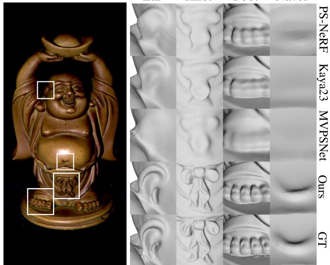
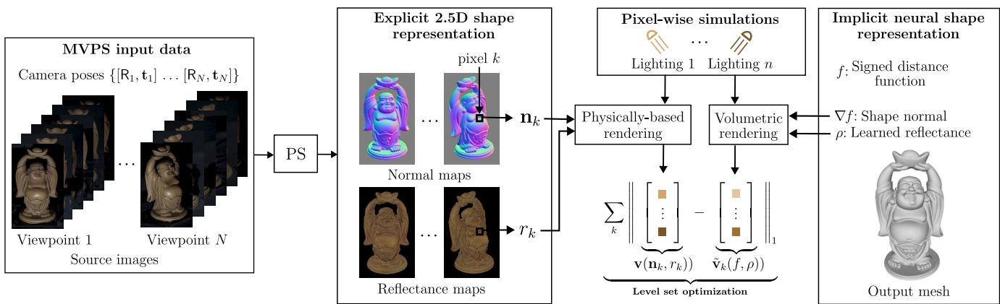
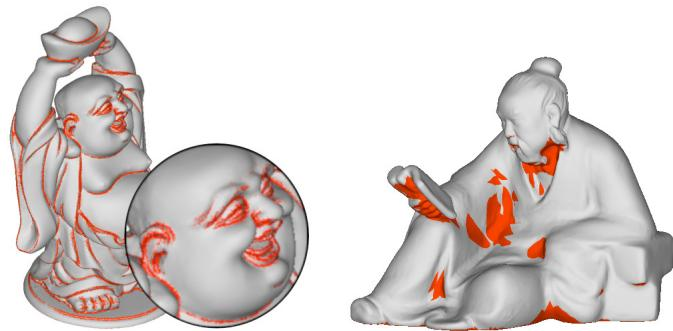
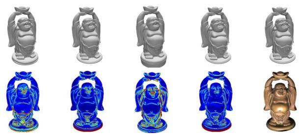
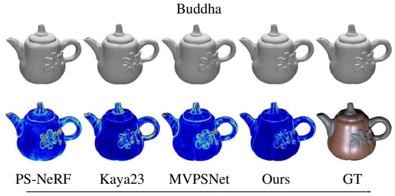
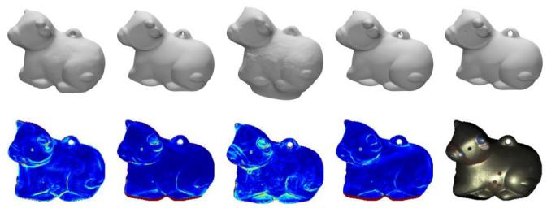
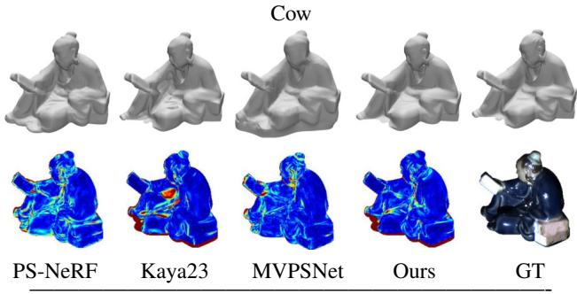
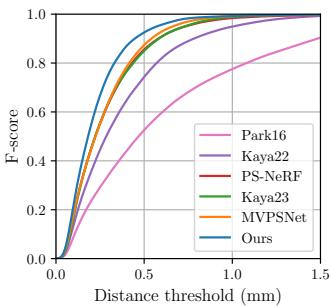
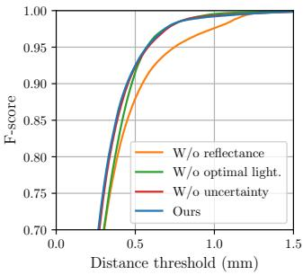
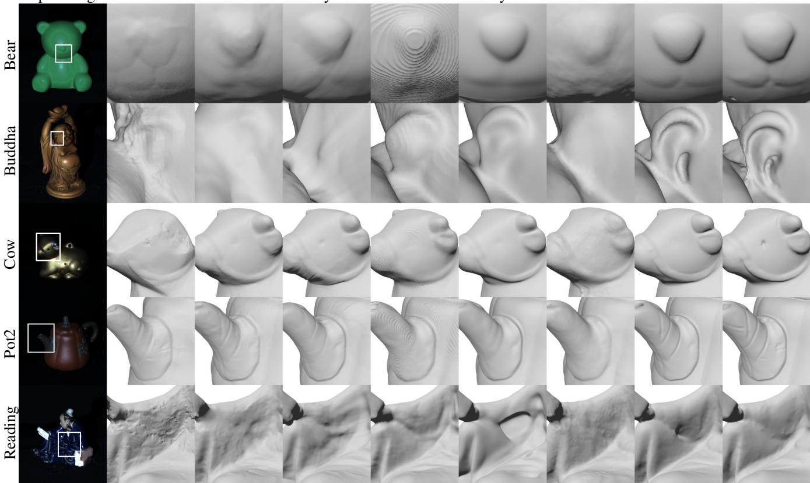

# RNb-NeuS: Reflectance and Normal-based Multi-View 3D Reconstruction

Baptiste Brument1,\* Robin Bruneau1,2,\* Yvain Queau´ 3 Jean Melou´ 1 Franc¸ois Bernard Lauze2 Jean-Denis Durou1 Lilian Calvet4

1IRIT, UMR CNRS 5505, Toulouse, France 2DIKU, Copenhagen, Denmark 3Normandie Univ, UNICAEN, ENSICAEN, CNRS, GREYC, Caen, France 4OR-X, Balgrist Hospital, University of Zurich, Zurich, Switzerland¨

## Abstract

This paper introduces a versatile paradigm for integrating multi-view reflectance (optional) and normal maps acquired through photometric stereo. Our approach employs a pixel-wise joint re-parameterization of reflectance and normal, considering them as a vector of radiances rendered under simulated, varying illumination. This reparameterization enables the seamless integration of reflectance and normal maps as input data in neural volume rendering-based 3D reconstruction while preserving a single optimization objective. In contrast, recent multi-view photometric stereo (MVPS) methods depend on multiple, potentially conflicting objectives. Despite its apparent simplicity, our proposed approach outperforms state-of-the-art approaches in MVPS benchmarks across F-score, Chamfer distance, and mean angular error metrics. Notably, it significantly improves the detailed 3D reconstruction of areas with high curvature or low visibility.

## 1. Introduction

Automatic 3D reconstruction is pivotal in various fields, such as archaeological and cultural heritage (virtual reconstruction), medical imaging (surgical planning), virtual and augmented reality, games and film production.

Multi-view stereo (MVS) [5], which retrieves the geometry of a scene seen from multiple viewpoints, is the most famous 3D reconstruction solution. Coupled with neural volumetric rendering (NVR) techniques [22], it effectively handles complex structures and self-occlusions. However, dealing with non-Lambertian scenes remains a challenge due to the breakdown of the underlying brightness consistency assumption. The problem is also ill-posed in certain configurations e.g., poorly textured scene [25] or degenerate viewpoints configurations with limited baselines. Moreover, despite recent efforts in this direction [13], recovering the thinnest geometric details remains difficult under fixed illumination. In such a setting, estimating the reflectance of the scene also remains a challenge.

Ear  
Knot  
Navel  
Foot  
  
Figure 1. One image from DiLiGenT-MV’s Buddha dataset [12], and 3D reconstruction results from several recent MVPS methods: [11, 26, 27] and ours. The latter provides the fine details closest to the ground truth (GT), while being remarkably simpler.

On the other hand, photometric stereo (PS) [24], which relies on a collection of images acquired under varying lighting, excels in the recovery of high-frequency details under the form of normal maps. It is also the only photographic technique that can estimate reflectance. And, with the recent advent of deep learning techniques [8], PS gained enough maturity to handle non-Lambertian surfaces and complex illumination. Yet, its reconstruction of geometry’s low frequencies remains suboptimal.

Given these complementary characteristics, the integration of MVS and PS seems natural. This integration, known as multi-view photometric stereo (MVPS), aims to reconstruct geometry from multiple views and illumination conditions. Recent MVPS solutions jointly solve MVS and PS within a multi-objective optimization, potentially losing the thinnest details due to the possible incompatibility of these objectives – see Fig. 1. In this work, we explore a simpler route for solving MVPS by decoupling the two problems.

We start with the observation that recent PS techniques deliver exceptionally high-quality reflectance and normal maps, which we use as input data. To accurately reconstruct the surface reflectance and geometry, we need to fuse these maps, a challenging task within a single-objective optimization due to their inhomogeneity. Our method provides a solution to this problem by combining NVR with a simple and effective pixel-wise re-parameterization.

In this method, the input reflectance and normal for each pixel are merged into a vector of radiances simulated under arbitrary, varying illumination. We then adapt an NVR pipeline to optimize the consistency of these simulations wrt to the scene reflectance and geometry, modeled as the zero-level set of a trained signed distance function (SDF). Coupled with a state-of-the-art PS method such as [8] for obtaining the input reflectance and normals, this approach yields an MVPS pipeline reaching an unprecedented level of fine details, as illustrated in Fig. 1. Besides being the first to exploit reflectance as a prior, our proposed MVPS paradigm is extremely versatile, compatible with any existing or future PS method, whether calibrated or uncalibrated, deep learning-based, or classic optimization procedures.

The rest of this work is organized as follows. Sect. 2 discusses state-of-the-art MVPS methods. The proposed 3D reconstruction from reflectance and normals is detailed in Sect. 3. Sect. 4 then sketches a proposal for an MVPS algorithm based on this approach. Sect. 5 extensively evaluates this algorithm, before our conclusions are drawn in Sect. 6.

## 2. Related work

Classical methods The first paper to deal with MVPS is by Hernandez et al. [6]. To avoid having to arbitrate the conflicts between the different normal maps, a 3D mesh is iteratively deformed, starting from the visual hull until the images recomputed using the Lambertian model match the original images, while penalizing the discrepancy between the PS normals and those of the 3D mesh. No prior knowledge of camera poses or illumination is required. Under the same assumptions, Park et al. [19, 20] start from a 3D mesh obtained by SfM (structure-from-motion) and MVS. Simultaneous estimation of reflectance, normals and illumination is achieved by uncalibrated PS, using the normals from the 3D mesh to remove the ambiguity, and estimating the details of the relief through 2D displacement maps.

MVPS is solved for the first time with a SDF representation of the surface by Logothetis et al. [14]. Therein, illumination is represented as near point light sources which are assumed calibrated, as well as the camera poses. Thanks to a voxel-based implementation, the surface details are better rendered than with the method of Park et al. [20].

Li et al [12] refine a 3D mesh obtained by propagating the SfM points according to [17], and estimate the BRDF using a calibrated setup. The creation of the public dataset “DiLiGenT-MV” validates numerically the improved results, in comparison with those of [20].

Deep learning-based methods Kaya et al. [10] proposed a solution to MVPS based on neural radiance fields (NeRFs) [16]. For each viewpoint, a normal map is obtained using a pre-trained PS network, before a NeRF is adapted to account for input surface normals from PS in the color function. The recovered geometry yet remains perfectible, according to [9]. Therein, the authors propose learning an SDF function whose zero level set best explains pixel depth and normal maps obtained by a pre-trained MVS [21] or PS network [7], respectively. To manage conflicting objectives in the proposed multi-objective optimization and get the best out of MVS and PS predictions, both networks are modified to output uncertainty measures on depth and normal predictions. The SDF optimization is then carried out while accounting for the inferred uncertainties.

PS-NeRF [26] solves MVPS by jointly estimating the geometry, material and illumination. To this end, the authors propose to regularize the gradient of a UNISURF [18] using the normal maps from PS, while relying on multi-layer perceptrons (MLPs) to explicitly model surface normals, BRDF, illumination, and visibility. These MLPs are optimized based on a shadow-aware differentiable rendering layer. A similar track is followed in [2], where NeRFs are combined with a physically-based differentiable renderer.

Such NeRF-based approaches provide undeniably better 3D reconstructions than classical methods, yet they remain computationally intensive. Recently, Zhao et al. [27] proposed a fast deep learning-based solution to MVPS. Aggregated shading patterns are matched across viewpoints so that to predict pixel depths and normal maps.

In [11], the authors proposed to complement the solution of [9] by adding a NVR loss term in order to benefit from the reliability of NVR in reconstructing objects with diverse material types. However, this results in a multiobjective optimization comprising three loss terms (besides the Eikonal term). However, similar to [9], the uncertaintybased hyper-parameter tuning does not completely eliminate conflicting objectives, which may induce a loss of finescale details. In contrast, we propose a single objective optimization based on an ad hoc re-parametrization which leads to the seamless integration of PS results in standard NVR pipelines. This is detailed in the next paragraph.

  
Figure 2. Overview of the proposed MVPS pipeline. The reflectance and normal maps provided for each view by PS are fused, by combining volume rendering with a pixel-wise re-parameterization of the inputs using physically-based rendering.

## 3. Proposed approach

Our aim is to infer a surface whose geometric and photometric properties are consistent with the per-view PS results. To do so, we resort to a volume rendering framework coupled with a re-parameterization of the inputs, as illustrated in Fig. 2 and detailed in the rest of this section.

## 3.1. Overview

Input data From the N image sets captured under fixed viewpoint and varying illumination, PS provides N reflectance and normal maps, out of which we extract a batch of m posed reflectance and normal values $\{ r _ { k } \in \mathbb { R } , { \bf n } _ { k } \in$ ${ \mathbb S } ^ { 2 } \} _ { k = 1 \dots m }$ Here, the normal vectors are expressed in world coordinates using the known camera poses. The input reflectance is without loss of generality represented by a scalar (albedo). Let us emphasize that this assumption does not imply that the observed scene must be Lambertian, but rather that we use only the diffuse component of the estimated reflectance. Using other reflectance components (specularity, roughness, etc.), if available, would represent a straightforward extension to more evolved physically-based rendering (PBR) models. Yet, we leave such an extension to perspective for now, since there are few PS methods reliably providing such data. Also, if the PS method provides no reflectance, one can set $r _ { k } \equiv 1$ and use the proposed framework for multi-view normal integration.

Surface parameterization Our aim is to infer a 3D model of a scene, which consists of both a geometric map $f : \mathbb { R } ^ { 3 } \ \to \ \mathbb { R }$ and a photometric one ${ \rho : \mathbb { R } ^ { 3 } \  \ \mathbb { R } } .$ Therein, $f$ associates a 3D point with its signed distance to the surface, which is thus given by the zero level set of $f \colon$ $S = \{ \mathbf { x } \in \mathbb { R } ^ { 3 } | f ( \mathbf { x } ) = 0 \}$ . Regarding $\rho ,$ it encodes the reflectance associated with a 3D point. For input consistency, $\rho$ is considered as a scalar function (albedo), though more advanced PBR models could again be incorporated.

Objective function Our method builds upon a reparameterization $\mathbf { v } : \mathbb { S } ^ { 2 } \times \mathbb { R } \ \to \ \mathbb { R } ^ { n }$ which combines a surface normal ${ \mathbf { n } } _ { k } \ \in \ \mathbb { S } ^ { 2 }$ and a reflectance value $r _ { k } \in \mathbb { R }$ into a vector $\mathbf { v } ( \mathbf { n } _ { k } , r _ { k } ) \ \in \ \mathbb { R } ^ { n }$ of n radiance values that are simulated by physically-based rendering, using an arbitrary image formation model under varying illumination. Given this re-parameterization, the 3D reconstruction problem amounts to minimizing the difference between a batch of m intensity vectors simulated either from the input data or from volume rendering with the same PBR model, along with a regularization on the SDF:

$$
\operatorname* { m i n } _ { f , \rho } \sum _ { k = 1 } ^ { m } \| \mathbf { v } ( \mathbf { n } _ { k } , r _ { k } ) - \tilde { \mathbf { v } } _ { k } ( f , \rho ) \| _ { 1 } + \lambda \mathcal { L } _ { \mathrm { r e g } } ( f ) .\tag{1}
$$

Here, $\{ ( \mathbf { n } _ { k } , r _ { k } ) \} _ { k = 1 \dots m }$ stands for the batch of input reflectance and normal values, $\mathbf { v } ( \mathbf { n } _ { k } , r _ { k } )$ for the k-th intensity vector simulated from the input data, $\tilde { \mathbf { v } } _ { k } ( f , \rho )$ for the corresponding one simulated by volume rendering, and $\lambda > 0$ is a tunable hyper-parameter for balancing the data fidelity with the regularizer $\mathcal { L } _ { \mathrm { r e g } }$ . The actual optimization can then be carried out seamlessly by resorting to a volume rendering-based 3D reconstruction pipeline such as NeuS [22], given that both $\tilde { \mathbf { v } } _ { k } ( f , \rho )$ and $\mathbf { v } ( \mathbf { n } _ { k } , r _ { k } )$ correspond to pixel intensities. Let us now detail how we simulate the latter intensities $\mathbf { v } ( \mathbf { n } _ { k } , r _ { k } )$ from the input reflectance and normal data.

## 3.2. Reflectance and normal re-parameterization

The input reflectance $\{ r _ { k } \in \mathbb { R } \} _ { k }$ and normals $\{ \mathbf { n } _ { k } \in \mathbb { S } ^ { 2 } \} _ { k }$ values constitute inhomogeneous quantities: the former are photometric scalars, and the latter geometric vectors lying on the three-dimensional unit sphere. Direct optimization of their consistency with the scene normal $\frac { \nabla f } { \| \nabla f \| }$ and albedo $\rho$ would lead to multiple objectives balanced by hyperparameters.

Instead, we propose to jointly re-parameterize the reflectance and normal data into a set of vectors $\{ \mathbf { v } ( \mathbf { n } _ { k } , r _ { k } ) \in$ $\mathbb { R } ^ { n } \} _ { k }$ of homogeneous quantities, namely radiance values simulated using a PBR model under varying illumination. In order to enforce the bijectivity of this re-parameterization, we choose as PBR model the linear Lambertian one, under pixel-wise varying illumination represented by $n \ : = \ : 3$ arbitrary illumination vectors $\mathbf { l } _ { k , 1 } , \mathbf { l } _ { k , 2 } , \mathbf { l } _ { k , 3 } \in \mathbb { R } ^ { 3 }$

$$
\begin{array} { r } { { \mathbf { v } } ( { \mathbf { n } } _ { k } , r _ { k } ) = r _ { k } [ { \mathbf { n } } _ { k } ^ { \top } \mathbf { l } _ { k , 1 } , { \mathbf { n } } _ { k } ^ { \top } \mathbf { l } _ { k , 2 } , { \mathbf { n } } _ { k } ^ { \top } \mathbf { l } _ { k , 3 } ] ^ { \top } } \\ { = r _ { k } \mathbf { L } _ { k } \mathbf { n } _ { k } , ~ } \end{array}\tag{2}
$$

with $\mathsf { L } _ { k } = [ \mathbf { l } _ { k , 1 } , \mathbf { l } _ { k , 2 } , \mathbf { l } _ { k , 3 } ] ^ { \top }$ the arbitrary per-pixel illumination matrix.

For the re-reparameterization to be bijective, the reflectance $r _ { k }$ must be non-null (a basic assumption in photographic 3D vision), and $\mathsf { L } _ { k }$ must be non-singular i.e., the lighting directions must be chosen linearly independent. Then, the original reflectance and normal can be retrieved from the simulated intensities by $r _ { k } = \| \mathsf { L } _ { k } ^ { - 1 } \mathbf { v } ( \mathbf { n } _ { k } , r _ { k } ) \|$ and $\begin{array} { r } { \mathbf { n } _ { k } = \frac { \mathsf { L } _ { k } ^ { - 1 } \mathbf { v } \left( \mathbf { n } _ { k } , r _ { k } \right) } { \| \mathsf { L } _ { k } ^ { - 1 } \mathbf { v } \left( \mathbf { n } _ { k } , r _ { k } \right) \| } } \end{array}$ . Considering $n > 3$ illumination vectors and resorting to the pseudo-inverse operator might induce more robustness but at the price of losing bijectivity and thus not entirely relying on the PS inputs. We leave this as a possible future work, which might be particularly interesting when the PS inputs are uncertain, or when considering more evolved PBR models involving additional reflectance clues such as roughness, anisotropy or specularity.

In practice, the choice of each arbitrary triplet of light directions $\mathbf { l } _ { k , 1 } , \mathbf { l } _ { k , 2 } , \mathbf { l } _ { k , 3 }$ can be made to minimize the uncertainty on the normal estimate. To this end, the illumination triplet proposed in [4] can be considered. Therein, the authors show that the optimal configuration for three images is vectors that are equally spaced in tilt by 120 degrees, with a constant slant of 54.74 degrees (wrt to ${ \bf n } _ { k } )$

Let us remark that with the above linear model, it is possible to simulate negative radiance values, when one of the dot products between the normal and the lighting vectors is negative, which corresponds to self-shadowing. While negative radiance values are obviously non physically plausible, this is not a problem for the proposed reparameterization, as long as it remains consistent with the NVR strategy, which we are now going to detail.

## 3.3. Volume rendering-based 3D reconstruction

We now turn our attention to deriving the volume rendering function $\tilde { \mathbf { v } } _ { k }$ arising in Eq. (1). The role of this function is to simulate, from the scene geometry $f$ and albedo $\rho ,$ an intensity vector $\tilde { \mathbf { v } } _ { k }$ which will be compared with the vector $\mathbf { v } _ { k }$ that is simulated from the inputs as described in the previous paragraph.

Our solution largely takes inspiration from the NeuS method [22], that was initially proposed as a solution to the single-light multi-view 3D surface reconstruction problem. Therein, the rendering function follows a volume rendering scheme which accumulates the colors along the ray corresponding to the k-th pixel. Denoting by ${ \mathbf o } _ { k } \in \mathbb { R } ^ { 3 }$ the camera center for this observation, and by $\mathbf { d } _ { k }$ the corresponding viewing direction, this ray is written $\{ { \bf x } _ { k } ( t ) = $ $\mathbf { o } _ { k } + t \mathbf { d } _ { k } \mid t \geq 0 \}$ . By extending the NeuS volume renderer to the multi-illumination scenario, each coefficient $\tilde { v } _ { k , l }$ of $\tilde { \mathbf { v } } _ { k }$ is then given, $\forall l \in \{ 1 , 2 , 3 \}$ , by:

$$
\tilde { v } _ { k , l } = \int _ { t _ { n } } ^ { t _ { f } } w ( t , f ( \mathbf { x } _ { k } ( t ) ) ) c _ { l } ( \mathbf { x } _ { k } ( t ) ) \mathrm { d } t ,\tag{3}
$$

where $t _ { n } , t _ { f }$ stand for the range bounds over which the colors are accumulated. The weight function w is constructed from the SDF f in order to ensure that it is both occlusionaware and locally maximal on the zero level set, see [22] for details. As for the functions $c _ { l } : \mathbb { R } ^ { 3 }  \mathbb { R }$ , they represent the scene’s apparent color. In the original NeuS framework, this color depends not only on the 3D locations, but also on the viewing direction $\mathbf { d } _ { k }$ , and it is directly optimized along with the SDF $f .$ . Our case, where the albedo is optimized in lieu of the apparent color, and the illumination varies with the data index k and the illumination index $l ,$ is however slightly different.

As a major difference with this prototypical NVR-based 3D reconstruction method, we optimize the SDF $f$ and the surface albedo $\mathrm { i . e . }$ , the scene’s intrinsic color $\rho$ rather than its apparent color $c _ { l } .$ . The dependency upon the viewing direction must thus be removed, in order to ensure consistency with the Lambertian model used for simulating the inputs. More importantly, contrarily to NeuS where the illumination is fixed, each input data $v _ { k , l } : = r _ { k } \mathbf { n } _ { k } ^ { \top } \mathbf { l } _ { k , l }$ is simulated under a different, arbitrary illumination ${ \mathbf { l } } _ { k , l }$ . For the NVR to produce simulations $\tilde { v } _ { k , l }$ matching this input set of intensities, it is necessary to explicitly write the dependency of the apparent color $c _ { l }$ upon the scene’s geometry $f ,$ reflectance $\rho$ and illumination ${ \mathbf { l } } _ { k , l }$ . Our volume renderer is then still given by Eq. (3), but the color of each 3D point must be replaced by:

$$
\begin{array} { r } { c _ { l } ( \mathbf x _ { k } ( t ) ) = \rho ( \mathbf x _ { k } ( t ) ) \nabla f ( \mathbf x _ { k } ( t ) ) ^ { \top } \mathbf l _ { k , l } , } \end{array}\tag{4}
$$

where the illumination vectors ${ \mathbf { l } } _ { k , l }$ are the same as those in Eq. (2).

Let us remark that the scalar product above corresponds, up to a normalization by $\| \nabla f ( \mathbf { x } _ { k } ( t ) ) \|$ ∥, to the shading. Yet, we do not need to apply this normalization, because the regularization term $\mathcal { L } _ { \mathrm { r e g } } ( f )$ in (1) will take care of ensuring the unit length of $\nabla f$ . Indeed, as in the original NeuS framework, the SDF is regularized using an eikonal term:

$$
\mathcal { L } _ { \mathrm { r e g } } ( f ) = \frac { \sum _ { k = 1 } ^ { m } \int _ { t _ { n } } ^ { t _ { f } } \left( \lVert \nabla f ( \mathbf { x } _ { k } ( t ) ) \rVert ^ { 2 } - 1 \right) ^ { 2 } \mathrm { d } t } { m \left( t _ { f } - t _ { n } \right) } .\tag{5}
$$

Similarly to the original NeuS, an additional regularization based on object masks can also be utilized for supervision, if such masks are provided.

Plugging (4) into (3) yields the definition of our volume renderer accounting for the varying, arbitrary illumination vectors $\boldsymbol { \mathrm { l } } _ { k , l } .$ . Next, plugging (2), (3) and (5) into (1), we obtain our objective function, which ensures the consistency between the simulations obtained from the input, and those obtained by volume rendering. It should be emphasized that, besides the eikonal regularization – which is standard and only serves to ensure the unit-length constraint of the normal, our strategy leads to a single objective optimization formulation for NVR-based 3D surface reconstruction from reflectance and normal data.

The discretization of the variational problem (1) is then achieved exactly as in the original NeuS work [22]. It is based on representing $f$ and $\rho$ by MLPs and hierarchically sampling points along the rays.

## 4. Application to MVPS

We present a standalone MVPS pipeline that is built on top of the proposed reflectance and normal-based 3D reconstruction method. Our MVPS pipeline includes the following steps:

1. Compute the reflectance and normals maps for each viewpoint through PS;

2. Select a batch of the most reliable inputs $\{ r _ { k } \}$ and $\left\{ { \bf n } _ { k } \right\}$ ;

3. Scale the reflectance values $\{ r _ { k } \}$ across the entire image collection;

4. Simulate the radiance values following Eq. (2), using a pixel-wise optimal lighting triplet $\mathsf { L } _ { k } \mathrm { ; }$

5. Optimize the loss in Eq. (1) over the SDF f and albedo $\rho ;$

6. Reconstruct the surface from the SDF.

Step 1: PS-based reflectance and normal estimation Any PS method is suitable for obtaining the inputs for each viewpoint. However, not all PS methods actually provide reflectance clues, and not all of them can simultaneously handle non-Lambertian surfaces and unknown, complex illumination. CNN-PS [7], for instance, provides only normals, and for calibrated illumination. For these reasons, we base our MVPS pipeline on the recent transformersbased method SDM-UniPS [8], which exhibits remarkable performance in recovering intricate surface normal maps even when images are captured under unknown, spatiallyvarying lighting conditions in uncontrolled environments. As advised by the author of [8], when the number of images is too large for the method to be applied, one can simply take the median of the results over sufficiently many $N _ { \mathrm { t r i a l s } }$ random tria $^ { \mathrm { l s , } }$ each trial involving the random selection of a few number of images.

Step 2: Uncertainty evaluation To prevent poorly estimated normals from corrupting 3D reconstruction, we discard the less reliable ones. To this end, we use as uncertainty measure the average absolute angular deviation of the normals computed over the $N _ { \mathrm { t r i a l s } }$ random trials in Step 1. Pixels associated with an uncertainty measure higher than a threshold $( \tau = 1 5 ^ { \circ }$ in our experiments) are excluded from the optimization. Advanced uncertainty metrics, as proposed by Kaya et al. [9], could further refine this process.

Step 3: Reflectance maps scaling The individual reflectance maps computed by PS need to be appropriately scaled. This is because in an uncalibrated setting, the reflectance estimate is relative to both the camera’s response, and the incident lighting intensity. Consequently, each reflectance map is estimated only up to a scale factor. To estimate this scale factor, the complete pipeline is first run without using the reflectance maps. This provides pairs of homologous points that are subsequently used to scale the reflectance maps. Concretely, given a pair of neighboring viewpoints, the ratios of corresponding reflectance values between the two viewpoints are stored, and their median is used to adjust each reflectance map’s scale factor. This operation is repeated across the entire viewpoint collection. Note that, if the camera’s response and the illumination were known i.e., a calibrated PS method was used in Step 1, then the reflectance would be determined without scale ambiguity and this step could be skipped.

Step 4: Radiance simulation To simulate the radiance values, we choose as lighting triplet the one which is optimal, relative to the normal ${ \bf n } _ { k }$ [4]. The actual formula is provided in the supplementary material.

Step 5: Optimization The actual optimization of the loss function is carried out using a straightforward adaptation of the NeuS architecture [22], where viewing direction was removed from the network’s input to turn radiance into albedo. In all our experiments, we let the optimization run for a total of 300k iterations, with a batch size of 512 pixels. To ensure that the networks have a better understanding of our MVPS data, we decided to train each iteration not only on a random view, but also on all rendered images of this view under varying illumination. The backward operation is then applied only after the loss is computed on all pixels for all the illumination conditions. In terms of computation time, our approach is comparable with the original NeuS framework, requiring in our tests from 8 to 16 hours on a standard GPU for the 3D reconstruction of each dataset from DiLiGenT-MV [12].

Step 6: Surface reconstruction Once the SDF is estimated, we extract its zero level set using the marching cube algorithm [15].

## 5. Experimental results

## 5.1. Experimental setup

Evaluation datasets We used the DiLiGenT-MV benchmark dataset [12] to perform all our experiments, statistical evaluations, and ablations. It includes five real-world objects with complex reflectance properties and surface profiles, making it an ideal choice for the proposed method evaluation. Each object is imaged from 20 calibrated viewpoints using the classical turntable MVPS acquisition setup [6]. For each view, 96 images are acquired under different illuminations. Given the large volume of images, which is impractical for transformers-based methods, our implementation of Step 1 (PS) employs SDM-UniPS [8] with only 10 input images. To this end, we computed each $r _ { k }$ and ${ \bf n } _ { k }$ as the medians of the computed reflectances and normals over $N _ { \mathrm { t r i a l s } } = 1 0 0$ random trials, each trial involving the random selection of 10 images from the 96 available in the DiLiGenT-MV dataset.

Evaluation scores We performed our quantitative evaluations using F-score and Chamfer distance (CD), to measure the accuracy of the reconstructed vertices. We also measured the mean angular error (MAE) of the imaged meshes, to evaluate the accuracy of the reconstructed normals wrt the ground truth normals provided in DiLiGenT-MV. We report both the results averaged over all mesh vertices, and those on vertices clustered in two particularly interesting classes, namely high curvature and low visibility areas, as illustrated in Fig. 3. To identify the high curvature areas, we used the library VCGLib [1] and the 3D mesh processing software system Meshlab [3], taking the absolute value of the curvature to merge the convex and concave zones and retaining the vertices whose curvature is higher than 1.6. To segment the low visibility areas, we summed the boolean visibility of each vertex in each view. Low visibility then corresponds to vertices visible in less than 5 viewpoints, among the 20 ones of DiLiGenT-MV.

  
Figure 3. High curvature (left) and low visibility (right) areas, on the Buddha and Reading datasets.

## 5.2. Baseline comparisons

We first provide in Fig. 4 a qualitative comparison of our results on four objects, and compare them with the three most recent methods from the literature, namely PS-NERF [26], Kaya23 [11] and MVPSNet [27]. In comparison with these state-of-the-art deep learning-based methods, the recovered geometry is overall more satisfactory.

This is confirmed quantitatively when evaluating Chamfer distances and MAE, provided in Tables 1 and 2. Therein, beside the aforementioned methods we also report the results from the Kaya22 method [9] and those from the non deep learning-based ones Park16 [20] and Li19 [12] (which is not fully automatic). From the tables, it can be seen that our method outperforms other fully automated standalone ones, and is competitive with the semi-automated one. On average, our method reports a Chamfer distance which is 17.4% better than the second best score, obtained by MVPSNet [27]. Regarding MAE, our score is similar to Kaya23 [11] with a small average difference of 0.2 degree. The superiority of our approach can also be observed by considering the F-scores, which are reported in Fig. 5.

<table><tr><td rowspan="2">Methods</td><td colspan="6">Chamfer distance ↓</td></tr><tr><td>Bear</td><td>Budd.</td><td>Cow</td><td>Pot2</td><td>Read.</td><td>Aver.</td></tr><tr><td>Park16</td><td>0.92</td><td>0.39</td><td>0.34</td><td>0.94</td><td>0.53</td><td>0.62</td></tr><tr><td>Li19 †</td><td>0.22</td><td>0.28</td><td>0.11</td><td>0.23</td><td>0.27</td><td>0.22</td></tr><tr><td>Kaya22</td><td>0.39</td><td>0.4</td><td>0.3</td><td>0.4</td><td>0.35</td><td>0.37</td></tr><tr><td>PS-NeRF</td><td>0.32</td><td>0.28</td><td>0.24</td><td>0.24</td><td>0.33</td><td>0.28</td></tr><tr><td>Kaya23</td><td>0.33</td><td>0.21</td><td>0.22</td><td>0.37</td><td>0.28</td><td>0.28</td></tr><tr><td>MVPSNet</td><td>0.28</td><td>0.3</td><td>0.25</td><td>0.27</td><td>0.25</td><td>0.27</td></tr><tr><td>Ours</td><td>0.22</td><td>0.22</td><td>0.25</td><td>0.16</td><td>0.27</td><td>0.23</td></tr></table>

Table 1. Chamfer distance (lower is better) averaged overall all vertices. Best results. Second best. Since † requires manual efforts, it is not ranked.

<table><tr><td></td><td colspan="6">Normal MAE↓</td></tr><tr><td>Methods</td><td>Bear</td><td>Budd.</td><td>Cow</td><td>Pot2</td><td>Read.</td><td>Aver.</td></tr><tr><td>Park16</td><td>9.64</td><td>12.6</td><td>8.23</td><td>11.1</td><td>9.01</td><td>10.1</td></tr><tr><td>Li19 †</td><td>3.85</td><td>11.0</td><td>2.82</td><td>5.88</td><td>6.30</td><td>5.97</td></tr><tr><td>Kaya22</td><td>4.89</td><td>12.5</td><td>4.44</td><td>8.68</td><td>6.52</td><td>7.41</td></tr><tr><td>PS-NeRF</td><td>5.48</td><td>11.7</td><td>5.46</td><td>7.65</td><td>9.13</td><td>7.88</td></tr><tr><td>Kaya23</td><td>3.24</td><td>8.12</td><td>3.04</td><td>5.63</td><td>5.66</td><td>5.14</td></tr><tr><td>MVPSNet</td><td>5.26</td><td>14.1</td><td>6.28</td><td>6.69</td><td>8.58</td><td>8.18</td></tr><tr><td>SDM-UniPS*</td><td>4.79</td><td>9.60</td><td>5.46</td><td>5.56</td><td>10.1</td><td>7.12</td></tr><tr><td>Ours</td><td>2.70</td><td>8.17</td><td>3.61</td><td>4.11</td><td>6.18</td><td>4.95</td></tr></table>

Table 2. Normal MAE (lower is better) averaged over all views. For reference, the mono-view PS results from SDM-UniPS [8] (\*) are also provided, although it does not provide a full 3D reconstruction and thus its Chamfer distance cannot be evaluated.

  
PS-NeRF  
Kaya23  
MVPSNet  
Ours  
GT

  
PS-NeRF  
MVPSNet  
Ours  
Kaya23  
GT

Pot2  
  
Reading

Figure 4. Reconstructed 3D mesh and corresponding angular error of four objects from the DiLiGenT-MV benchmark.  
  
(a)

  
(b)  
Figure 5. F-score (higher is better) as a function of the distance error threshold, in comparison with other state-of-the-art methods (a), and disabling individual components of our method (b).

<table><tr><td></td><td colspan="2">All</td><td colspan="2">High curv.</td><td colspan="2">Low vis.</td></tr><tr><td>% Vertices</td><td colspan="2">100%</td><td colspan="2">8.27%</td><td colspan="2">8.70%</td></tr><tr><td>Scores</td><td>CD</td><td>MAE</td><td>CD</td><td>MAE</td><td>CD</td><td>MAE</td></tr><tr><td>Park16 Li19 † Kaya22 PS-NeRF Kaya23</td><td>0.62 0.22 0.37 0.28 0.28 0.27</td><td>10.1 5.97 7.41 7.88 5.14 8.18</td><td>0.88 0.51 0.45 0.38 0.29 0.53</td><td>29.0 26.2 28.0 25.8 23.6</td><td>0.68 0.67 0.54 0.5 0.41 0.49</td><td>29.6 33.3 31.7 24.0 20.7 28.9</td></tr></table>

Table 3. Chamfer distance and normal MAE (lower is better) on high curvature and low visibility areas.

## 5.3. High curvature and low visibility areas

To highlight the level of details in the 3D reconstructions, Figs. 1 and 6 provide other qualitative comparisons focusing on one small part of each object. Ours is the only method achieving a high fidelity reconstruction on the ear, the knot and the navel of Buddha, and on the spout of Pot2. To quantify this gain, we also report in Table 3 the average CD and MAE over all datasets, yet taking into account only the high curvature and low visibility areas. It is worth noticing that the CD error of PS-NeRF and MVPSNet on high curvature areas increases by 36% and 96%, respectively, in comparison with that averaged over the entire set of vertices. Ours, on the contrary, increases by 4% only. Similarly, on low visibility areas their error increases by 78% and 81%, and Kaya23 by 46%, while ours increases only by 13%.

## 5.4. Ablation study

Lastly, we conducted an ablation study, to quantify the impact of some parts of our pipeline. More precisely, we quantify in Fig. 5b and Table 4 the impact of providing PSestimated reflectance maps, in comparison with providing only normals (“W/o reflectance”). We also evaluate that of the pixel-wise optimal lighting triplet, in comparison with using the same arbitrary one for all pixels in one view (“W/o optimal lighting”). Lastly, we evaluate the impact of discarding the less reliable inputs, in comparison with using all of them (“W/o uncertainty”). The feature that influences most the accuracy of the 3D reconstruction is the use of reflectance. The other two features also positively impact the reconstruction, but to a lesser extent.

  
Figure 6. Qualitative comparison between our results and state-of-the-art ones, on parts of the meshes representing fine details.

<table><tr><td rowspan="2">Methods</td><td colspan="6">Chamfer distance ↓</td></tr><tr><td>Bear</td><td>Budd.</td><td>Cow</td><td>Pot2</td><td>Read.</td><td>Aver.</td></tr><tr><td>W/o reflect.</td><td>0.23</td><td>0.22</td><td>0.39</td><td>0.16</td><td>0.31</td><td>0.26</td></tr><tr><td>W/o opt. 1.</td><td>0.32</td><td>0.22</td><td>0.20</td><td>0.19</td><td>0.27</td><td>0.24</td></tr><tr><td>W/o uncert.</td><td>0.22</td><td>0.22</td><td>0.27</td><td>0.16</td><td>0.27</td><td>0.23</td></tr><tr><td>Ours</td><td>0.22</td><td>0.22</td><td>0.25</td><td>0.16</td><td>0.27</td><td>0.23</td></tr></table>

Table 4. Chamfer distance (lower is better) averaged overall all vertices, while disabling individual features of the pipeline (reflectance estimation, optimal lighting, and uncertainty evaluation).

## 5.5. Limitations

Our approach heavily relies on the quality of the PS normal maps. In our experiments, we used SDM-UniPS [8], which generally yields high quality results. Yet, it occasionally yields corrupted normals, leading to inconsistencies across viewpoints that may result in errors in the reconstruction (cf. supplementary material). This could be handled in the future by replacing the PS method by a more robust one. A second limitation, similar to PS-NeRF, is the computation time, which falls within the range of 8 to 16 hours for one object in DiLiGenT-MV. Fortunately, NeuS2 [23], a significantly faster version of NeuS, will allow us to reduce the computation time to around ten minutes.

## 6. Conclusion

We have introduced a neural volumetric rendering method for 3D surface reconstruction based on reflectance and normal maps, and applied it to multi-view photometric stereo. The proposed method relies on a joint re-parameterization of reflectance and normal as a vector of radiances rendered under simulated, varying illumination. It involves a single objective optimization, and it is highly flexible since any existing or future PS method can be used for constructing the input reflectance and normal maps. Coupled with a stateof-the-art uncalibrated PS method, our method reaches unprecedented results on the public dataset DiLiGenT-MV in terms of F-score, Chamfer distance and mean angular error metrics. Notably, it provides exceptionally high quality results in areas with high curvature or low visibility. Its main limitation for now is its computational cost, which we plan to reduce by adapting recent developments within the NeuS2 framework [23]. Using reflectance uncertainty in addition to that of normal maps offers room for improvement.

Acknowledgements. This work was supported by the Danish project PHYLORAMA, the ALICIA-Vision project, the IMG project (ANR-20-CE38-0007), the OR-X and associated funding by the University of Zurich and University Hospital Balgrist.

## References

[1] VCGLib. https://github.com/cnr-isti-vclab/vcglib. 6

[2] Meghna Asthana, William Smith, and Patrik Huber. Neural apparent BRDF fields for multiview photometric stereo. In Proceedings of the 19th ACM SIGGRAPH European Conference on Visual Media Production, pages 1–10, 2022. 2

[3] Paolo Cignoni, Marco Callieri, Massimiliano Corsini, Matteo Dellepiane, Fabio Ganovelli, Guido Ranzuglia, et al. Meshlab: an open-source mesh processing tool. In Proceedings of the Eurographics Italian Chapter Conference, pages 129–136, 2008. 6

[4] Ondrej Drbohlav and Mike Chantler. On optimal light configurations in photometric stereo. In Proceedings of the 10th IEEE International Conference on Computer Vision, pages 1707–1712, 2005. 4, 5

[5] Yasutaka Furukawa, Carlos Hernandez, et al. Multi-view´ stereo: A tutorial. Foundations and Trends® in Computer Graphics and Vision, 9(1-2):1–148, 2015. 1

[6] Carlos Hernandez, George Vogiatzis, and Roberto Cipolla.´ Multiview Photometric Stereo. IEEE Transactions on Pattern Analysis and Machine Intelligence, 30(3):548–554, 2008. 2, 6

[7] Satoshi Ikehata. CNN-PS: CNN-based photometric stereo for general non-convex surfaces. In Proceedings of the European Conference on Computer Vision, pages 3–18, 2018. 2, 5

[8] Satoshi Ikehata. Scalable, Detailed and Mask-Free Universal Photometric Stereo. In Proceedings of the IEEE/CVF Conference on Computer Vision and Pattern Recognition, pages 13198–13207, 2023. 1, 2, 5, 6, 8

[9] Berk Kaya, Suryansh Kumar, Carlos Oliveira, Vittorio Ferrari, and Luc Van Gool. Uncertainty-aware deep multi-view photometric stereo. In Proceedings of the IEEE/CVF Conference on Computer Vision and Pattern Recognition, pages 12601–12611, 2022. 2, 5, 6

[10] Berk Kaya, Suryansh Kumar, Francesco Sarno, Vittorio Ferrari, and Luc Van Gool. Neural radiance fields approach to deep multi-view photometric stereo. In Proceedings of the IEEE/CVF Winter Conference on Applications of Computer Vision, pages 1965–1977, 2022. 2

[11] Berk Kaya, Suryansh Kumar, Carlos Oliveira, Vittorio Ferrari, and Luc Van Gool. Multi-View Photometric Stereo Revisited. In Proceedings of the IEEE/CVF Winter Conference on Applications of Computer Vision, pages 3126–3135, 2023. 1, 2, 6

[12] Min Li, Zhenglong Zhou, Zhe Wu, Boxin Shi, Changyu Diao, and Ping Tan. Multi-view photometric stereo: A robust solution and benchmark dataset for spatially varying isotropic materials. IEEE Transactions on Image Processing, 29:4159–4173, 2020. 1, 2, 5, 6

[13] Zhaoshuo Li, Thomas Muller, Alex Evans, Russell H Taylor,¨ Mathias Unberath, Ming-Yu Liu, and Chen-Hsuan Lin. Neuralangelo: High-Fidelity Neural Surface Reconstruction. In Proceedings of the IEEE/CVF Conference on Computer Vision and Pattern Recognition, pages 8456–8465, 2023. 1

[14] Fotios Logothetis, Roberto Mecca, and Roberto Cipolla. A differential volumetric approach to multi-view photometric

stereo. In Proceedings of the IEEE/CVF International Conference on Computer Vision, pages 1052–1061, 2019. 2

[15] William E Lorensen and Harvey E Cline. Marching cubes: A high resolution 3D surface construction algorithm. In Seminal graphics: pioneering efforts that shaped the field, pages 347–353. 1998. 5

[16] Ben Mildenhall, Pratul P Srinivasan, Matthew Tancik, Jonathan T Barron, Ravi Ramamoorthi, and Ren Ng. NeRF: Representing Scenes as Neural Radiance Fields for View Synthesis. Communications of the ACM, 65(1):99–106, 2021. 2

[17] Diego Nehab, Szymon Rusinkiewicz, James Davis, and Ravi Ramamoorthi. Efficiently combining positions and normals for precise 3D geometry. ACM Tansactions on Graphics, 24 (3):536–543, 2005. 2

[18] Michael Oechsle, Songyou Peng, and Andreas Geiger. Unisurf: Unifying neural implicit surfaces and radiance fields for multi-view reconstruction. In Proceedings of the IEEE/CVF International Conference on Computer Vision, pages 5589–5599, 2021. 2

[19] Jaesik Park, Sudipta N Sinha, Yasuyuki Matsushita, Yu-Wing Tai, and In So Kweon. Multiview photometric stereo using planar mesh parameterization. In Proceedings of the IEEE International Conference on Computer Vision, pages 1161–1168, 2013. 2

[20] Jaesik Park, Sudipta N Sinha, Yasuyuki Matsushita, Yu-Wing Tai, and In So Kweon. Robust multiview photometric stereo using planar mesh parameterization. IEEE Transactions on Pattern Analysis and Machine Intelligence, 39(8): 1591–1604, 2016. 2, 6

[21] Fangjinhua Wang, Silvano Galliani, Christoph Vogel, Pablo Speciale, and Marc Pollefeys. Patchmatchnet: Learned multi-view patchmatch stereo. In Proceedings of the IEEE/CVF Conference on Computer Vision and Pattern Recognition, pages 14194–14203, 2021. 2

[22] Peng Wang, Lingjie Liu, Yuan Liu, Christian Theobalt, Taku Komura, and Wenping Wang. NeuS: Learning Neural Implicit Surfaces by Volume Rendering for Multi-view Reconstruction. In Proceedings of the Conference on Neural Information Processing Systems, 2021. 1, 3, 4, 5

[23] Yiming Wang, Qin Han, Marc Habermann, Kostas Daniilidis, Christian Theobalt, and Lingjie Liu. Neus2: Fast learning of neural implicit surfaces for multi-view reconstruction. In Proceedings of the IEEE/CVF International Conference on Computer Vision, pages 3295–3306, 2023. 8

[24] Robert J Woodham. Photometric method for determining surface orientation from multiple images. Optical Engineering, 19(1):139–144, 1980. 1

[25] Qingshan Xu, Weihang Kong, Wenbing Tao, and Marc Pollefeys. Multi-scale geometric consistency guided and planar prior assisted multi-view stereo. IEEE Transactions on Pattern Analysis and Machine Intelligence, 45(4):4945–4963, 2022. 1

[26] Wenqi Yang, Guanying Chen, Chaofeng Chen, Zhenfang Chen, and Kwan-Yee K Wong. PS-NeRF: Neural Inverse Rendering for Multi-view Photometric Stereo. In Proceedings of the European Conference on Computer Vision, pages 266–284, 2022. 1, 2, 6

[27] Dongxu Zhao, Daniel Lichy, Pierre-Nicolas Perrin, Jan-Michael Frahm, and Soumyadip Sengupta. MVPSNet: Fast Generalizable Multi-view Photometric Stereo. In Proceedings of the IEEE/CVF International Conference on Computer Vision, pages 12525–12536, 2023. 1, 2, 6