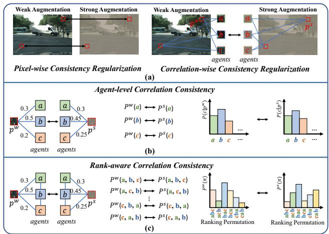
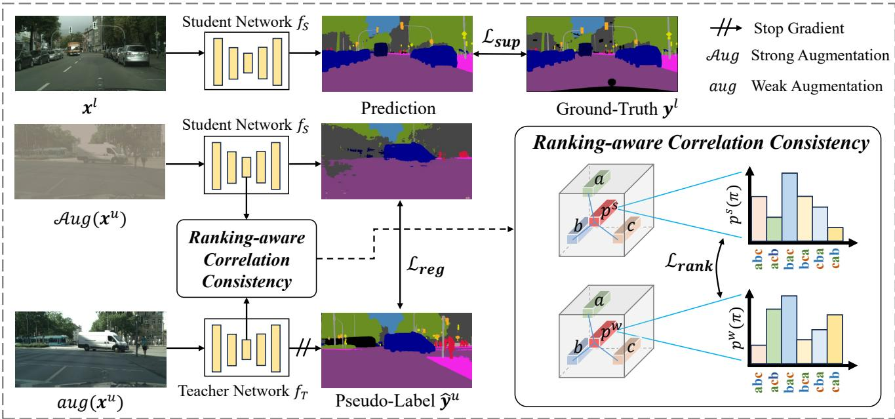
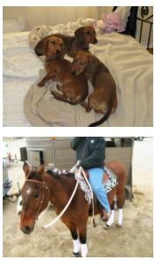
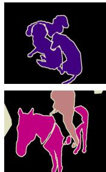
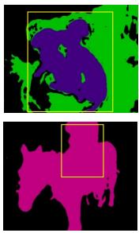
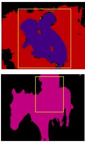
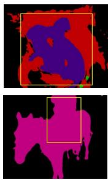
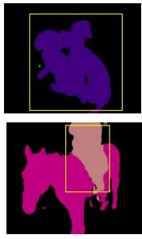
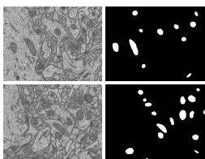
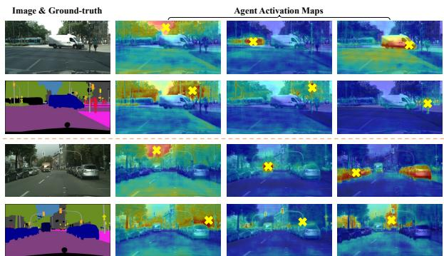

# RankMatch: Exploring the Better Consistency Regularization for Semi-supervised Semantic Segmentation

Huayu Mai1∗ Rui Sun1\* Tianzhu Zhang1,2† Feng Wu1 1University of Science and Technology of China 2Deep Space Exploration Lab

{mai556, issunrui}@mail.ustc.edu.cn, {tzzhang, fengwu}@ustc.edu.cn

## Abstract

The key lie in semi-supervised semantic segmentation is how to fully exploit substantial unlabeled data to improve the model’s generalization performance by resorting to constructing effective supervision signals. Most methods tend to directly apply contrastive learning to seek additional supervision to complement independent regular pixel-wise consistency regularization. However, these methods tend not to be preferred ascribed to their complicated designs, heavy memory footprints and susceptibility to confirmation bias. In this paper, we analyze the bottlenecks exist in contrastive learning-based methods and offer a fresh perspective on inter-pixel correlations to construct more safe and effective supervision signals, which is in line with the nature of semantic segmentation. To this end, we develop a coherent RankMatch network, including the construction of representative agents to model inter-pixel correlation beyond regular individual pixel-wise consistency, and further unlock the potential of agents by modeling inter-agent relationships in pursuit of rank-aware correlation consistency. Extensive experimental results on multiple benchmarks, including mitochondria segmentation, demonstrate that RankMatch performsfavorably against state-of-the-art methods. Particularly in the low-data regimes, RankMatch achieves significant improvements.

## 1. Introduction

Semantic segmentation, which aims to explain visual semantics at the pixel level, has achieved conspicuous achievements attributed to the recent advances in deep neural network [28] as a fundamental task in computer vision with widespread applications such as visual understanding [11], autonomous driving [12], etc. However, its data-driven nature makes it labor-intensive and timeconsuming to gather massive pixel-level annotations as training data. To alleviate the data-hunger issue, considerable works [19, 44, 57] have turned their attention to semisupervised semantic segmentation task. However, since only limited labeled data is accessible, how to fully exploit a large amount of unlabeled data to improve the model’s generalization performance by resorting to constructing effective supervision signals is thus extremely challenging.

  
Figure 1. Illustration of our motivation. (a) shows the differences between independent pixel-wise consistency regularization and correlation-wise consistency regularization. Evidently, taking the rich inter-pixel correlation into account can bring rich extra supervision. (b) shows the straightforward implementation of correlation-wise consistency regularization, i.e., treating each agent independently. (c) shows our core idea, rank-aware correlation consistency. We harness the inter-agent relationship by considering every possible agent rank permutation probability.

In previous literature, pseudo-labeling [1, 22] and consistency regularization [2, 21] have emerged as mainstream paradigms to leverage unlabeled data for semi-supervised semantic segmentation. Recently, these two paradigms are typically encapsulated into a teacher-student scheme [46] (where the teacher and student can be identical), that is, the teacher network with weakly augmented perturbation view generates corresponding pseudo-labels to instruct the student network under the presence of strongly augmented perturbation view, using a form of pixel-wise consistency regularization (see Figure 1 (a)).

After an in-depth analysis of the teacher-student scheme, we argue that constructing extra supervision from substantial unlabeled samples matters in semi-supervised semantic segmentation, which is intuitively sensible from the definition of the task itself; that is, empowering regular consistency regularization to adapt to dense pixel-level prediction rather than suffering from the supervision signals of limited capacity derived at the individual pixel level (Figure 1 (a)). Inspired by the recent popularity of representation learning [8, 18], it naturally comes into mind to directly apply contrastive learning [33, 48, 50, 52] to semi-supervised semantic segmentation to establish an ample set of positive/negative samples in the representation space, aiming at seeking additional supervision to complement independent pixel-wise consistency regularization.

Despite their promising results, these methods tend not to be preferred ascribed to complicated designs and heavy memory footprint raised by the existence of ad hoc numerous positive/negative samples, inevitably compressing their capability and compromising the inherent simplicity of the teacher-student scheme. Plus, considering the absence of ground truth in unlabeled data, the determination of positive/negative samples is entirely conditioned on the model’s biased predictions (erroneous pseudo-labels), leading to confirmation bias [14]. To make matters worse, the corollary of error accumulation is inevitably amplified by inbuilt low-data regimes of semi-supervised semantic segmentation, hindering the generalization ability of the model.

In this paper, we analyze the bottlenecks exist in contrastive learning-based methods for improving pixel-wise consistency regularization, and offer a fresh perspective on inter-pixel correlations to construct more safe and effective supervision signals for robust semi-supervised semantic segmentation. Intuitively, most methods neglect the fact that dense pixel prediction task carries rich inter-pixel information beyond basic individual pixel-wise consistency, shedding light on the possibility of closer collaboration between the inter-pixel correlation and the consistency regularization (i.e., correlation-wise consistency regularization, right part of Figure 1 (a)) to comprehensively probe unlabeled data. The main idea is, we prepend the agent-level correlation consistency through a set of representative reference points (referred to as agents) to model the inter-pixel correlation (see Figure 1 (b)). For each pixel from the weakly augmented or corresponding strongly augmented view, we can obtain the agent-level correlation (i.e., a likelihood vector) by comparing this pixel with a set of agents. In essence, the agent-level correlation reflects the consensus among representative agents with a broader receptive field, thus it encodes a higher-order consistency regularization to adapt to dense pixel-level prediction. However, it is nontrivial to attain the appropriate agents without any supervision signals for training. Intuitively, the agents should resonate favorably with diverse semantic cues from the original pixels with a wide range of semantic contrast descriptions. To this end, we devise an orthogonal selection strategy to pick the most representative agents from the feature map, preserving as much critical information as possible in the original pixels. In this way, benefiting from the richer description of the data distribution in agent-level correlation, we can achieve better exploitation of the unlabeled data.

Based on the above discussion, it is natural to integrate the resultant agent-level correlation into the teacher-student scheme and impose consistency constraint resorting to KL divergence, etc. ( Figure 1 (b)). However, such a straightfor ward constraint treats each agent independently and heavily relies on strong i.i.d. assumption, hindering the potential for further optimization of the model. In fact, there exist specific relationships between agents that should also be considered in the agent-level correlation consistency regularization. For example, as shown in Figure 1, agent a and agent b are two pixels that reside in the same car while agent c situates from the road. Thus, agent a should hold a tighter relationship with agent b than agent c. To harness the inter-agent relationship modeling structure information for more effective supervision signals, instead of taking each agent independently, we carefully design the rank-aware correlation consistency to strive to further un lock the potential of agents by imposing the agent-level correlation rich in inter-agent relationship to be consistent between the teacher and student networks (i.e., weak and strong augmented views, Figure 1 (c)). The core idea is that we take the agent ranking as a random event rather than a deterministic permutation. For instance, the corre lation between different agents and a given pixel $p ^ { w }$ varies, which can be regarded as the probabilities in ranking. The probability of being ranked first of the agent a is 0.3 while 0.5 of the agent b. From this perspective, the ranking permutation reflects the relationship of agents w.r.t. the pixel. In this way, for a given pixel, we consider every possible rank permutation of the agents (e.g., abc, cba, etc.), and transform the agent-level correlation into the agent-ranking probability distribution. By constraining the consistency of the agent-ranking probability distribution between teacher and student networks, the model can be guided by more effective supervision signals. Ultimately, we term our final model as RankMatch.

In this work, our contributions can be summarized as follows: (1) We analyze the bottlenecks exist in contrastive learning-based methods for improving pixel-wise consistency regularization, and offer a fresh perspective on inter-pixel correlations to construct more safe and effective supervision signals which is in line with the nature of semantic segmentation. (2) We develop a coherent RankMatch network, including the construction of representative agents to model inter-pixel correlation beyond regular individual pixel-wise consistency, and further unlock the potential of agents by modeling inter-agent relationships in pursuit of rank-aware correlation consistency. (3) Extensive experiments on three challenging benchmarks including mitochondria segmentation demonstrate that our RankMatch outperforms state-of-the-art semi-supervised semantic segmentation methods. Particularly in low-data regimes, RankMatch achieves significant improvements.

  
Figure 2. The framework of our RankMatch. The student network is guided by two sources of supervision, including the ground truth for the labeled data and the pseudo-labels generated by the teacher network for the unlabeled data. In previous consistency regularization methods, consistency is imposed at the pixel-level. While our work focuses on the rich correlations between pixels and imposes consistency constraint at the correlation-level. Furthermore, we design the ranking-aware correlation consistency for more effective supervision signals.

## 2. Related Work

Semi-supervised Learning. Semi-supervised learning [13, 37, 62] (SSL) is a well-studied topic and recent research can be summarized in two branches: Pseudolabeling and consistency regularization. Pseudo-labeling [1, 5, 22, 59] methods involve training the model on unlabeled samples using pseudo-labels generated from the most upto-date optimized model. On the other hand, consistency regularization-based [21, 46, 47, 55] methods leverage the smoothness assumption [32], encouraging the model to exhibit consistency when presented with the same example under different perturbations. Notably, recent SSL methods [3, 4, 15, 40, 56] have demonstrated the synergy between consistency regularization and Pseudo-labeling.

One prominent example is FixMatch [40], which generates pseudo-labels from weakly augmented unlabeled images for strongly augmented versions of the same images. This concise yet powerful approach has gained widespread adoption in recent SSL studies.

Semi-supervised Semantic Segmentation. Benefits from the advances in deep neural network [30, 35, 41, 42, 45, 51, 53, 54] and various kinds of semi-supervised semantic segmentation (SSSS) algorithms [25, 27, 36, 44, 60, 61] have been proposed based on the mature combination of Pseudo-labeling and consistency regularization. Most of all, UniMatch [57] taking into account the nature of semantic segmentation tasks, incorporates suitable data augmentations into FixMatch, thus evolving into a concise yet powerful SSSS baseline. On top of these fundamental designs, motivated by representation learning, a series of works [33, 48, 50, 52] have incorporated contrastive learning into SSSS, tailoring it to the characteristics of the dense prediction task. In this paper, we offer a fresh perspective on inter-pixel correlations to construct more safe and effective supervision signals for robust semi-supervised semantic segmentation.

## 3. Method

In this section, we first formulate the semi-supervised semantic segmentation problem as preliminaries and introduce the core idea of the proposed RankMatch from the perspective of correlation. Then we describe the details of the construction of the agent-level correlation to mine more reliable information in the unlabeled data. Finally, rank-aware correlation consistency regularization is devised to harness the inter-agent relationship for more effective supervision signals. In Algorithm 1, we present the pseudo algorithm of our RankMatch to clearly summarize the method.

## 3.1. Preliminaries

Given a labeled set $\mathcal { D } ^ { l } = \{ ( \mathbf { { x } } _ { i } ^ { l } , \mathbf { { y } } _ { i } ^ { l } ) \} _ { i = 1 } ^ { N ^ { l } }$ and an unlabeled set $\mathcal { D } ^ { u } = \{ \pmb { x } _ { i } ^ { u } \} _ { i = 1 } ^ { N ^ { u } }$ , where $N ^ { u } \gg N ^ { l }$ , semi-supervised semantic segmentation aims to train a segmentation model with limited labeled data and vast unlabeled data. As shown in Figure 2, the popular teacher-student scheme consists of a teacher network $f _ { T }$ and a student network $f _ { S }$ . The student network is guided by two sources of supervision, including the ground truth for the labeled data and the pseudolabels generated by the teacher network for the unlabeled data. The teacher network can either be identical to the student network or an exponentially moving average (EMA) version of the student network. In specific, for the labeled data, the supervised loss $\mathcal { L } _ { s u p }$ can be formulated as:

$$
\mathcal { L } _ { s u p } = \frac { 1 } { N ^ { l } } \sum _ { i = 1 } ^ { N ^ { l } } \frac { 1 } { H W } \sum _ { j = 1 } ^ { H W } \ell _ { c e } \left( { \pmb y } _ { i j } ^ { l } , f _ { S } ( { \pmb x } _ { i } ^ { l } ) _ { j } \right) ,\tag{1}
$$

where H and $W$ represent the height and width of the input image, $\ell _ { c e }$ denotes the standard pixel-wise cross-entropy loss. For the unlabeled data, the teacher network takes the weak augmented view $a u g ( \pmb { x } _ { i } ^ { u } )$ as input and generates pseudo-labels $\hat { \mathbf { y } } _ { i } ^ { u }$ for the student network as:

$$
\begin{array} { r } { \hat { \pmb { y } } _ { i j } ^ { u } = \left\{ \begin{array} { l l } { \mathrm { a r g } \operatorname* { m a x } f _ { T } ( a u g ( \pmb { x } _ { i } ^ { u } ) ) _ { j } , } & { c _ { i j } ^ { u } > \gamma } \\ { \mathrm { i g n o r e } \mathrm { i n d e x } , } & { \mathrm { o t h e r w i s e } } \end{array} \right. , } \end{array}\tag{2}
$$

where $c _ { i j } ^ { u } = \operatorname* { m a x } { f _ { T } ( a u g ( \pmb { x } _ { i } ^ { u } ) ) _ { j } }$ represents the confidence of the teacher prediction for $j ^ { t h }$ pixel and $\gamma$ denotes the confidence threshold to exclude unreliable pseudo-labels from training. As result, we can obtain the consistency regularization loss $\mathcal { L } _ { \boldsymbol { r } \boldsymbol { e } \boldsymbol { g } }$ as:

$$
\mathcal { L } _ { r e g } = \frac { 1 } { N ^ { u } } \sum _ { i = 1 } ^ { N ^ { u } } \frac { 1 } { H W } \sum _ { j = 1 } ^ { H W } \ell _ { c e } \left( \hat { \pmb y } _ { i j } ^ { u } , f _ { S } ( A u g ( \pmb x _ { i } ^ { u } ) ) _ { j } \right)\tag{3}
$$

where $\mathcal { A } u g ( \cdot )$ means the strong augmentation. By imposing consistency regularization, the model can learn reliable information from unlabeled data. The overall loss of the commonly used teacher-student scheme is $\mathcal { L } = \mathcal { L } _ { s u p } + \mathcal { L } _ { r e g } .$

Note that the above consistency regularization is operated at pixel-level, still stuck in the mindset of classification task. We contend that there exist substantial inter-pixel correlations within an image inherently, which should be taken into account in consistency regularization. What follows, we detail the process of modeling inter-pixel correlation.

## 3.2. Agent-level Correlation

To mine more reliable information in the unlabeled data, the idea arises naturally that we can impose consistency regularization at the correlation level, which is much richer than pixels. However, simply enforcing the correlations of all pixels $( i . e .$ , the self-correlation matrix) to be consistent between teacher and student is not desirable. Lots of noise in the self-correlation matrix interferes with the optimization of the model, leading to a sub-optimal result.

In order to better model the inter-pixel correlation for consistency regularization, we construct the agent-level correlation by comparing each pixel with a set of representative reference points (referred to as agents). Intuitively, the agents should resonate favorably with diverse semantic cues from original pixels with a wide range of semantic contrast descriptions. For this purpose, we design an orthogonal selection strategy to pick the most representative agents from the image. Specifically, we obtain the feature map $\pmb { F } \in \mathbb { R } ^ { C \times h \times w }$ for an unlabeled image $\pmb { x } ^ { u }$ extracted by the feature extractor of the segmentation model. Then, we incrementally build a set of agents $A = \{ f _ { i } ^ { a } \} _ { i = 1 } ^ { N } \in \mathbb { R } ^ { C \times N }$ sampled from the $\pmb { F }$ such that a new agent is maximally orthogonal $( i . e .$ , minimal cosine similarity) to the agents already selected, starting with a pixel feature at random, where N denotes the number of agents. This greedy strategy is dynamic, since it selects agents from the feature of the current image, preserving as much critical information as possible in the original pixels.

In this way, we can get the agent-level correlation $^ c \in$ $\mathbb { R } ^ { 1 \times N }$ (omit the subscript $i , j$ for convenience), i.e., pixelagent-level correlation for a given pixel feature $f$ by

$$
\pmb { c } = s o f t m a x ( \pmb { f A } ^ { \top } ) ,\tag{4}
$$

where T refers to the matrix transpose operation. Straightforwardly, we can impose the consistency regularization between the agent-level correlation $c ^ { w }$ of teacher network and the $c ^ { s }$ of student network resorting to KL divergence as:

$$
\mathcal { L } _ { c o r r } = \frac { 1 } { N ^ { u } } \sum _ { i = 1 } ^ { N ^ { u } } \frac { 1 } { H W } \sum _ { j = 1 } ^ { H W } \ell _ { k l } \left( c _ { i j } ^ { w } , c _ { i j } ^ { s } \right) .\tag{5}
$$

However, such a naive constraint treats each agent independently hindering the potential for further model optimization. In the next, we introduce rank-aware correlation consistency regularization to model the specific relationships between agents.

## 3.3. Rank-aware Correlation Consistency

To harness the inter-agent relationship for more effective supervision signals, we carefully design the rank-aware consistency regularization. The core idea is that we take the agent ranking as a random event rather than a deterministic permutation. That is to say, every permutation of the agents exists with some probability rather than only the permutation from largest to smallest exists. The probability of one permutation $\pi \in \mathcal { P } \left( \left| \mathcal { P } \right| = N ! \right)$ given c can be derived as:

Algorithm 1 Pseudo algorithms of RankMatch   
1: Inputs: Labeled Set $\mathcal { D } ^ { l } = \{ (  { \mathbf { x } } _ { i } ^ { l } ,  { \mathbf { y } } _ { i } ^ { l } ) \} _ { i = 1 } ^ { N ^ { l } }$ , Unlabeled Set ${ \mathcal D } ^ { u } = \{ \pmb x _ { i } ^ { u } \} _ { i = 1 } ^ { N ^ { u } } ( N ^ { u } \gg N ^ { l } )$   
2: Define: Teacher Network $f _ { T } ,$ , Student Network $f _ { S }$ , Weak Augmentation $a u g ( \cdot )$ , Strong Augmentation $\mathcal { A } u g ( \cdot )$   
3: Output: Student Network $f _ { S }$   
4: for each batch of $( \pmb { x } _ { i } ^ { l } , \pmb { y } _ { i } ^ { l } ) , \pmb { x } _ { i } ^ { u }$ in $\mathcal { D } _ { l } , \mathcal { D } _ { u }$ do   
5: # Labeled Data:   
6: Calculate $\mathcal { L } _ { s u p }$ for $f _ { S }$ by Equation (1) ▷ Supervised Loss   
7: # Unlabeled Data:   
8: Obtain pseudo-labels from $f _ { T }$ by Equation $( 2 )$   
9: Calculate $\mathcal { L } _ { r e g }$ for $f _ { S }$ by Equation (3) ▷ Pixel-wise Consistency Regularization Loss   
10: Obtain agents for $f _ { T }$ and $f _ { S }$ respectively through orthogonal selection strategy   
11: Calculate the agent-level correlation by Equation (4)   
12: Transform the agent-level correlation into agent-ranking probability distribution by Equation (6)   
13: Calculate $\mathcal { L } _ { r a n k }$ for $f _ { S }$ by Equation (8) ▷ Rank-aware Correlation Consistency Regularization Loss   
14: Gradient backward $\mathcal { L } _ { s u p } + \mathcal { L } _ { r e g } + \lambda \mathcal { L } _ { r a n k }$ ▷ Update Model   
15: end for

$$
P ( \pi | \mathbf { c } ) = \prod _ { n = 1 } ^ { N } \frac { \pmb { c } _ { \pi ( n ) } } { \sum _ { n ^ { \prime } = n } ^ { N } \pmb { c } _ { \pi ( n ^ { \prime } ) } } ,\tag{6}
$$

where $\pi ( n )$ denotes the $n ^ { t h }$ agent index of this permutation. For example, suppose we have three agents: $a , b$ and c. One permutation of these three agents is ${ \boldsymbol \pi } = ( a , b , c )$ . Based on the agent-level correlation c, we can derive the probability of permutation π:

$$
P ( \pi | { \boldsymbol { c } } ) = { \frac { c ( a ) } { c ( a ) + c ( b ) + c ( c ) } } \cdot { \frac { { \boldsymbol { c } } ( b ) } { c ( b ) + c ( c ) } } \cdot { \frac { { \boldsymbol { c } } ( { \boldsymbol { c } } ) } { c ( { \boldsymbol { c } } ) } } .\tag{7}
$$

From this perspective, the ranking permutation reflects the relationship of agents. By calculating the probabilities for all $| \mathcal { P } |$ permutations, we transform the agent-level correlation c into agent-ranking probability distribution $P ( \mathcal { P } | c ) \in$ $\mathbb { R } ^ { 1 \times | \mathcal { P } | }$ |, which has modeled the inter-agent relationship. In fact, if we calculate the full permutations for all N agents, the computational overhead is indeed unacceptable. For computational efficiency, we focus on the permutations of the top-4 agents for each pixel, based on our observation that in every agent-level correlation, the top-4 agents have occupied almost all weight. Then, the rank-aware correlation consistency regularization can be obtained by:

$$
\mathcal { L } _ { r a n k } = \frac { 1 } { N ^ { u } } \sum _ { i = 1 } ^ { N ^ { u } } \frac { 1 } { H W } \sum _ { j = 1 } ^ { H W } \ell _ { k l } \left( P ( \mathcal { P } | \pmb { c } _ { i j } ^ { w } ) , P ( \mathcal { P } | \pmb { c } _ { i j } ^ { s } ) \right) .\tag{8}
$$

Finally, the overall loss objective of our RankMatch is derived as:

$$
\mathcal { L } = \mathcal { L } _ { s u p } + \mathcal { L } _ { r e g } + \lambda \mathcal { L } _ { r a n k } ,\tag{9}
$$

where the λ is the trade-off weight.

## 4. Experiments

## 4.1. Experimental Setup

Datasets: (1) PASCAL VOC 2012 [11] is an object-centric semantic segmentation dataset, containing 20 object classes in the foreground and a background class with 1,464 and 1,449 finely annotated images for training and validation, respectively. Many researches [9, 19] augment the original training set (i.e., classic) with additional 9,118 coarsely annotated images in SBD [16] to get a blender training set. (2) Cityscapes [10] is an urban scene understanding dataset consisting of 2,975 images for training and 500 images for validation. The initial 30 semantic classes are re-mapped into 19 classes for the semantic segmentation task.

Implementation Details: For a fair comparison, we use ResNet-50/101 [17] pretrained on ImageNet [20] as the backbone and DeepLabv3+ [7] as the decoder. The crop size is set as $5 1 3 \times 5 1 3$ for PASCAL and $8 0 1 \times 8 0 1$ for Cityscapes, respectively. We adopt stochastic gradient descent (SGD) optimizer with an initial learning rate of 0.001 for PASCAL and 0.005 for Cityscapes. Polynomial Decay learning rate policy is applied throughout the whole training. The strong augmentation $\mathcal { A } u g ( \cdot )$ contains random color jitter, grayscale and Gaussian blur. The weak augmentation $a u g ( \cdot )$ consists of random crop, resize and horizontal flip. The features used to construct the correlation consistency are extracted from the output of the ASPP module [6] and the channel number is 256. We set the number of agents N = 128 and trade-off weight $\lambda = 0 . 1$ for all experiments. The model is trained for 80 epochs on PASCAL and 240 epochs on Cityscapes with a batch size of $^ { 8 , }$ using 8× RTX 3090 GPUs (memory is 24G/GPU).

Table 1. Quantitative results of different SSL methods on Pascal classic set. We report mIoU (%) under various partition protocols and show the improvements over Sup.-only baseline. The best is highlighted in bold.
<table><tr><td rowspan="2">Method</td><td colspan="4">ResNet-50</td><td colspan="5">ResNet-101</td></tr><tr><td>1/16(92)</td><td>1/8(183)</td><td>1/4(366)</td><td>1/2(732)</td><td>Full(1464)</td><td>1/16(92)</td><td>1/8(183)</td><td>1/4(366)</td><td>1/2(732)</td><td>Full(1464)</td></tr><tr><td>Sup.-only</td><td>44.0</td><td>52.3</td><td>61.7</td><td>66.7</td><td>72.9</td><td>45.1</td><td>55.3</td><td>64.8</td><td>69.7</td><td>73.5</td></tr><tr><td>FixMatch[NeurIPS&#x27;20] [40]</td><td>60.1</td><td>67.3</td><td>71.4</td><td>73.7</td><td>76.9</td><td>63.9</td><td>73.0</td><td>75.5</td><td>77.8</td><td>79.2</td></tr><tr><td>iMAS[CVPR&#x27;23] [60]</td><td></td><td></td><td></td><td></td><td></td><td>68.8</td><td>75.3</td><td>79.1</td><td>80.2</td><td>82.0</td></tr><tr><td>AugSeg[CVPR·23] [61]</td><td>64.2</td><td>72.1</td><td>76.1</td><td>77.4</td><td>78.8</td><td>71.0</td><td>75.4</td><td>78.8</td><td>80.3</td><td>81.3</td></tr><tr><td>DGCL[CVPR&#x27;23][50]</td><td></td><td></td><td></td><td></td><td></td><td>70.4</td><td>77.1</td><td>78.7</td><td>79.2</td><td>81.5</td></tr><tr><td>CSS[CCV*23][48]</td><td>68.0</td><td>71.9</td><td>74.9</td><td>77.6</td><td></td><td></td><td></td><td></td><td></td><td></td></tr><tr><td>LOGICDIAG[ICCV*23] [25]</td><td></td><td></td><td></td><td></td><td></td><td>73.2</td><td>76.6</td><td>77.9</td><td>79.3</td><td></td></tr><tr><td>NP-SemiSeg[ICML/23] [49]</td><td>65.7</td><td>72.3</td><td>75.7</td><td>77.4</td><td></td><td></td><td></td><td></td><td></td><td></td></tr><tr><td>DAW[NeurlPS*23] [44]</td><td>68.5</td><td>73.1</td><td>76.3</td><td>78.6</td><td>79.7</td><td>74.8</td><td>77.4</td><td>79.5</td><td>80.6</td><td>81.5</td></tr><tr><td>Switch[NeurIPS&#x27;23][36]</td><td>70.7</td><td>74.5</td><td>76.4</td><td>77.6</td><td>78.1</td><td></td><td></td><td></td><td></td><td></td></tr><tr><td>UniMatch[CVPR&#x27;23] [57]</td><td>67.4</td><td>71.9</td><td>75.3</td><td>78.0</td><td>79.3</td><td>73.5</td><td>75.4</td><td>78.7</td><td>80.2</td><td>81.9</td></tr><tr><td>RankMatch (Ours)</td><td>71.6</td><td>74.6</td><td>76.7</td><td>78.8</td><td>80.0</td><td>75.5</td><td>77.6</td><td>79.8</td><td>80.7</td><td>82.2</td></tr><tr><td>∆↑</td><td>+27.6</td><td>+22.3</td><td>+15.0</td><td>+12.1</td><td>+7.1</td><td>+30.4</td><td>+22.3</td><td>+15.0</td><td>+11.0</td><td>+8.7</td></tr></table>

Table 2. Quantitative results of different SSL methods on Pascal blender set. We report mIoU (%) under various partition protocols and show the improvements over Sup.-only baseline. The best is highlighted in bold.
<table><tr><td rowspan="2">Method</td><td colspan="3">ResNet-50</td><td colspan="3">ResNet-101</td></tr><tr><td>1/16(662)</td><td>1/8(1323)</td><td>1/4(2646)</td><td>1/16(662)</td><td>1/8(1323)</td><td>1/4(2646)</td></tr><tr><td>Sup.-only</td><td>62.4</td><td>68.2</td><td>72.3</td><td>67.5</td><td>71.1</td><td>74.2</td></tr><tr><td>FixMatch[NeurIPS:20][40]</td><td>70.6</td><td>73.9</td><td>75.1</td><td>74.3</td><td>76.3</td><td>76.9</td></tr><tr><td>ST++[CVPR:&#x27;22] [58]</td><td>72.6</td><td>74.4</td><td>75.4</td><td>74.5</td><td>76.3</td><td>76.6</td></tr><tr><td>U2PL[CVPR/22][52]</td><td></td><td></td><td></td><td>77.2</td><td>79.0</td><td>79.3</td></tr><tr><td>AugSeg[CVPR·23] [61]</td><td>74.6</td><td>75.9</td><td>77.1</td><td>77.0</td><td>77.3</td><td>78.8</td></tr><tr><td>iMAS[CVPR23] [60]</td><td>75.9</td><td>76.7</td><td>77.1</td><td>77.2</td><td>78.4</td><td>79.3</td></tr><tr><td>CFCG[ICCV&quot;23] [23]</td><td>75.0</td><td>77.1</td><td>77.7</td><td>76.8</td><td>79.1</td><td>79.9</td></tr><tr><td>NP-SemiSeg[ICML/23] [49]</td><td>73.4</td><td>76.5</td><td>76.7</td><td></td><td></td><td></td></tr><tr><td>DAW[NeurIPS&#x27;23][44]</td><td>76.2</td><td>77.6 76.9</td><td>77.4</td><td>78.5</td><td>78.9</td><td>79.6</td></tr><tr><td>UniMatch[CVPR&#x27;23] [57]</td><td>75.8</td><td></td><td>76.8</td><td>78.1</td><td>78.4</td><td>79.2</td></tr><tr><td>RankMatch (Ours)</td><td>76.6</td><td>77.8</td><td>78.3</td><td>78.9</td><td>79.2</td><td>80.0</td></tr><tr><td>∆↑</td><td>+14.2</td><td>+9.6</td><td>+6.0</td><td>+11.4</td><td>+8.1</td><td>+5.8</td></tr></table>

## 4.2. Comparison with State-of-the-art Methods

For parameter efficiency, we adopt the popular consistency regularization framework UniMatch [57] as our baseline, that is the teacher and student networks are identical. We evaluate our method on both PASCAL (classic and blender) and Cityscapes datasets with both ResNet-50 and ResNet-101 backbone under diverse partition protocols, and make exhaustive comparisons with the state-of-the-art methods [23–25, 33, 36, 40, 44, 48–50, 52, 58, 60, 61]. The consistently dominant performance under all partition protocols with different backbones on all datasets proves the effectiveness of our RankMatch.

Results on PASCAL. Table 1 and Table 2 show the comparison of our method with the SOTA methods on PASCAL classic and blender set. Compared with the supervised-only (Sup.-only) model, our method achieves considerable performance improvements, suggesting that the information in unlabeled data is effectively utilized in our method. Moreover, we consistently observe substantial performance gains when compared to the baseline method, i.e., UniMatch.

Specifically, our approach achieves 71.6% and 75.5% under 1/16(92) partition on classic set with the backbone ResNet-50 and ResNet-101, boosting the baseline by 4.2% and 2.0%, respectively. These results underscore the powerful information mining capability of RankMatch under the extremely scarce labeled data setting.

Results on Cityscapes. Table 3 presents a comparative result of RankMatch against the SOTA methods on the Cityscapes dataset. Specifically, with the backbone ResNet-50, RankMatch outperforms the Sup.-only model by 12.1%, 7.5%, 6.1% and 2.9% under 1/16, 1/8, 1/4 and 1/2 partition protocols, respectively. Furthermore, when compared with the recent and competitive contrastive method ESL [33], our method maintains superior performance, e.g., 2.0% performance lift under 1/16 partition protocol with the ResNet-101 backbone, showing the superiority of our method over contrastive learning.

Qualitative Results. We compare the qualitative results of our method with different SOTA methods on the PASCAL dataset. As shown in Figure 3, RankMatch shows more powerful segmentation performance in fine-grained details $( e . g .$ , the dogs on the bed and the man on horseback). With the help of rank-aware correlation consistency, RankMatch exhibits superior abilities in most scenarios.

Image  
DGCL  
UniMatch  
Table 3. Quantitative results of different SSL methods on Cityscapes. We report mIoU (%) under various partition protocols and show the improvements over Sup.-only baseline. The best is highlighted in bold.
<table><tr><td rowspan="2">Method</td><td colspan="4">ResNet-50</td><td colspan="4">ResNet-101</td></tr><tr><td>1/16(186)</td><td>1/8(372)</td><td>1/4(744)</td><td>1/2(1488)</td><td>1/16(186)</td><td>1/8(372)</td><td>1/4(744)</td><td>1/2(1488)</td></tr><tr><td>Sup.-only</td><td>63.3</td><td>70.2</td><td>73.1</td><td>76.6</td><td>66.3</td><td>72.8</td><td>75.0</td><td>78.0</td></tr><tr><td>FixMatch[NeurlPS*20][40]</td><td>72.6</td><td>75.7</td><td>76.8</td><td>78.2</td><td>74.2</td><td>76.2</td><td>77.2</td><td>78.4</td></tr><tr><td>AEL[NeurIPS&#x27;21][19]</td><td>74.0</td><td>75.8</td><td>76.2</td><td></td><td>75.8</td><td>77.9</td><td>79.0</td><td>80.3</td></tr><tr><td>AugSeg[cVPR&#x27;23] [61]</td><td>73.7</td><td>76.4</td><td>78.7</td><td>79.3</td><td>75.2</td><td>77.8</td><td>79.5</td><td>80.4</td></tr><tr><td>iMAS[CVPR&#x27;23][60]</td><td>74.3</td><td>77.4</td><td>78.1</td><td>79.3</td><td></td><td></td><td></td><td></td></tr><tr><td>ESL[cCV23] [33]</td><td></td><td></td><td></td><td></td><td>75.1</td><td>77.1</td><td>78.9</td><td>80.4</td></tr><tr><td>Co-Train[IccV*23] [24]</td><td></td><td>76.3</td><td>77.1</td><td></td><td>75.0</td><td>77.3</td><td>78.7</td><td></td></tr><tr><td>NP-SemiSeg[ICML/23][49]</td><td>73.0</td><td>77.1</td><td>78.8</td><td>78.7</td><td></td><td></td><td></td><td></td></tr><tr><td>Switch[NeurlPS&#x27;23] [36]</td><td></td><td></td><td></td><td></td><td>76.8</td><td>78.4</td><td>79.4</td><td>80.5</td></tr><tr><td>DAW[NeurIPS&#x27;23][44]</td><td>75.2 75.0</td><td>77.5</td><td>79.1</td><td>79.5</td><td>76.6</td><td>78.4</td><td>79.8</td><td>80.6</td></tr><tr><td>UniMatch[CVPR&#x27;23] [57]</td><td></td><td>76.8</td><td>77.5</td><td>78.6</td><td>76.6</td><td>77.9</td><td>79.2</td><td>79.5</td></tr><tr><td>RankMatch (Ours)</td><td>75.4</td><td>77.7</td><td>79.2</td><td>79.5</td><td>77.1</td><td>78.6</td><td>80.0</td><td>80.7</td></tr><tr><td>∆↑</td><td>+12.1</td><td>+7.5</td><td>+6.1</td><td>+2.9</td><td>+10.8</td><td>+5.8</td><td>+5.0</td><td>+2.7</td></tr></table>

  
Ground Truth

  
U�PL

  
Figure 3. Qualitative comparison with different methods. Note that significant improvements are marked with yellow boxes.

Table 4. Ablation studies of different components.
<table><tr><td></td><td>Contrastive Correlation Rank</td><td></td><td>mIoU(92)</td><td>mIoU(1464)</td></tr><tr><td></td><td></td><td></td><td>67.4</td><td>79.3</td></tr><tr><td>√</td><td></td><td></td><td>68.6</td><td>79.6</td></tr><tr><td></td><td>√</td><td></td><td>70.3</td><td>79.5</td></tr><tr><td></td><td>√</td><td>√</td><td>71.6</td><td>80.0</td></tr></table>

  
Ours

Table 5. Ablation on different agent selection strategies.  
Table 6. Ablation on different correlation consistency.
<table><tr><td rowspan=1 colspan=1>Agent Selection</td><td rowspan=1 colspan=1>mIoU</td></tr><tr><td rowspan=1 colspan=1>All</td><td rowspan=1 colspan=1>69.8</td></tr><tr><td rowspan=1 colspan=1>Random</td><td rowspan=1 colspan=1>70.2</td></tr><tr><td rowspan=1 colspan=1>Top-N</td><td rowspan=1 colspan=1>70.6</td></tr><tr><td rowspan=1 colspan=1>Orthogonal</td><td rowspan=1 colspan=1>71.6</td></tr></table>

<table><tr><td>Corr. Consis.</td><td>mIoU</td></tr><tr><td>L2</td><td>70.2</td></tr><tr><td>CE</td><td>1 70.1</td></tr><tr><td>KL</td><td>| 70.3</td></tr><tr><td>Rank-aware</td><td>71.6</td></tr></table>

## 4.3. Ablation Study and Analysis

To look deeper into our method, we perform a series of ablation studies on PASCAL classic set under $1 / 1 6 ( 9 2 )$ partition protocol with ResNet-50 to analyze our RankMatch.

Table 7. Evaluation of the Agents number N.  
Table 8. Evaluation of the trade-off weight λ.
<table><tr><td>Agents number N|</td><td>mIoU</td></tr><tr><td>64</td><td>一 69.0</td></tr><tr><td>128</td><td>71.6</td></tr><tr><td>256</td><td>71.1</td></tr><tr><td>512</td><td>69.9</td></tr></table>

<table><tr><td rowspan=1 colspan=1>Trade-off weight λ</td><td rowspan=1 colspan=1>mIoU</td></tr><tr><td rowspan=1 colspan=1>0.05</td><td rowspan=1 colspan=1>70.8</td></tr><tr><td rowspan=1 colspan=1>0.1</td><td rowspan=1 colspan=1>71.6</td></tr><tr><td rowspan=1 colspan=1>0.2</td><td rowspan=1 colspan=1>71.2</td></tr><tr><td rowspan=1 colspan=1>0.5</td><td rowspan=1 colspan=1>70.9</td></tr></table>

Effectiveness of Components. In Table 4, we report the results of $1 / 1 6 ( 9 2 )$ and Full(1464) to clearly substantiate the effectiveness of our design. Note that, “Contrastive” denotes the reproduced results for $\mathrm { U ^ { 2 } P L }$ [52], a classic contrastive learning method in the semi-supervised semantic segmentation, based on our baseline $( i . e . ,$ , UniMatch). The correlation-level consistency (“Correlation”) without rank-aware $( ^ { 6 6 } R a n k ^ { 3 } )$ means that treating each agent independently and straightforwardly imposing correlation-level regularization resorting to KL divergence, i.e., $\mathcal { L } _ { c o r r }$ in Equation (5). (1) Indeed, while contrastive learning can yield certain benefits for pixel-level consistency regularization baseline $( 1 ^ { s t }$ row vs. 2nd row), it is still inferior to correlation-level consistency regularization $( 2 ^ { n d }$ row vs. $3 ^ { r d }$ & $4 ^ { t h }$ rows). (2) By comparing the results of the $3 ^ { r d }$ and $1 ^ { s t }$ rows, a naive consideration of correlation-level consistency reveals a significant performance improvement for pixel-level consistency regularization baseline. This observation indicates that the abundant correlations provide additional information gain for consistency regularization. (3) As 3rd vs. 4th row shows, harnessing the relationships between agents through the construction of the agent-ranking probability distribution can yield more effective supervision signals, manifesting in further performance improvements. Effectiveness of Orthogonal Selection Strategy. In Table 5, we explore various strategies for agent selection, including “ALL” (considering all pixels in the feature map as agents), “Random” (randomly pick N pixels in the feature map as agents), “Top-N” (select top N pixels conditioned on the cumulative self-correlation matrix along the pixels dimension), and our proposed “Orthogonal”. (1) Selecting all pixels as agents is not a desirable approach, as it inevitably introduces considerable noise among these pixels. This noise can adversely affect the quality of supervision signals, resulting in sub-optimal performance. (2) The strategy of “Orthogonal” achieves the best results, which is in line with our design purpose, that is, that representative agents can enjoy synergy with subsequent correlation-level consistency. We visualize the agent-pixel activation maps for those agents selected by “Orthogonal”, as shown in Figure 5. It can be observed that the different agents activate different parts of the image, and resonate favorably with diverse semantic cues from the original pixels. These carefully selected agents retain as much critical information as possible in the original image, facilitating the subsequent construction of correlation consistency.

<table><tr><td>Method</td><td colspan="4">|Spe.|1/32(5) 1/16(10) 1/8(20)</td></tr><tr><td>Sup.-only</td><td></td><td>45.7</td><td>57.4</td><td>61.8</td></tr><tr><td rowspan="3">MT [46] CCT [38] CPS [9] DualRel [34]</td><td rowspan="3">×××&gt;</td><td>71.8</td><td>72.4</td><td>75.4</td></tr><tr><td>84.7</td><td>85.4</td><td>85.8</td></tr><tr><td>84.5 85.6</td><td>84.6 86.3</td><td>85.8 87.2</td></tr><tr><td>Ours</td><td>|x|</td><td>86.9</td><td>87.5</td><td>88.1</td></tr></table>

Figure 4. Visualization of the Table 9. Quant. results of differ-Lucchi dataset. ent SSL methods on Lucchi.

Effectiveness of Rank-aware Correlation Consistency. To investigate the effectiveness of rank-aware correlation consistency, we compare different modeling strategies for correlation consistency in Table 6. Among them, L2, CE, and KL belong to agent-independent correlation consistency, overlooking the inherent relationships between agents and resulting in sub-optimal performance. The proposed rank-aware correlation consistency achieve the best results, indicating that modeling the relationships between agents contributes to more effective supervision signals.

Hyperparameter Evaluations. (1) As shown in Table 7, it can be observed that the performance is optimal with N = 128. This result aligns with intuition, as too few agents can lead to information loss from the original image while too many can introduce noise into the training. Therefore, finding a balance for N is crucial. (2) λ controls the relative importance of the rank-aware correlation consistency loss, our model achieves much better performance when λ = 0.1 as shown in Table 8.

  
Figure 5. Visualization of the agent activation maps from our orthogonal selection for better illustration. The yellow cross denotes the position of agents in the original image.

Scalability for Other Scenarios. We extend our experimental evaluations on mitochondria segmentation [26, 27, 31, 39, 43] dataset Lucchi [29] to assess the scalability of our method. Figure 4 illustrates the images and ground truth of the Lucchi dataset, highlighting a common challenge in electron microscope images where instances are notably small and scattered. It underscores the need for more robust supervision during training within a semi-supervised framework. As depicted in Table 9, RankMatch exhibits superior performance compared to other competitive methods. Notably, our approach surpasses the specialized (“spe.”) method DualRel [34] in the domain of electron microscopy images, underscoring the capability of our method to provide more rich and effective supervision.

## 5. Conclusion

In this paper, we offer a fresh perspective on inter-pixel correlations to construct more safe and effective supervision signals. To this end, We develop a coherent RankMatch network, including the construction of representative agents to model inter-pixel correlation beyond regular individual pixel-wise consistency, and further unlock the potential of agents by modeling inter-agent relationships in pursuit of rank-aware correlation consistency. Extensive experimental results on challenging benchmarks show the effectiveness.

## 6. Acknowledgments

This work was partially supported by the National Defense Basic Scientific Research Program of China (Grant JCKY2021601B013), National Nature Science Foundation of China (Grant 62021001), Youth Innovation Promotion Association CAS 2018166.

## References

[1] Eric Arazo, Diego Ortego, Paul Albert, Noel E O’Connor, and Kevin McGuinness. Pseudo-labeling and confirmation bias in deep semi-supervised learning. In 2020 International Joint Conference on Neural Networks (IJCNN), pages 1–8. IEEE, 2020. 1, 3

[2] Philip Bachman, Ouais Alsharif, and Doina Precup. Learning with pseudo-ensembles. Advances in neural information processing systems, 27, 2014. 1

[3] David Berthelot, Nicholas Carlini, Ian Goodfellow, Nicolas Papernot, Avital Oliver, and Colin A Raffel. Mixmatch: A holistic approach to semi-supervised learning. Advances in neural information processing systems, 32, 2019. 3

[4] David Berthelot, Rebecca Roelofs, Kihyuk Sohn, Nicholas Carlini, and Alex Kurakin. Adamatch: A unified approach to semi-supervised learning and domain adaptation. arXiv preprint arXiv:2106.04732, 2021. 3

[5] Paola Cascante-Bonilla, Fuwen Tan, Yanjun Qi, and Vicente Ordonez. Curriculum labeling: Revisiting pseudolabeling for semi-supervised learning. In Proceedings of the AAAI Conference on Artificial Intelligence, pages 6912– 6920, 2021. 3

[6] Liang-Chieh Chen, George Papandreou, Iasonas Kokkinos, Kevin Murphy, and Alan L Yuille. Deeplab: Semantic image segmentation with deep convolutional nets, atrous convolution, and fully connected crfs. IEEE transactions on pattern analysis and machine intelligence, 40(4):834–848, 2017. 5

[7] Liang-Chieh Chen, Yukun Zhu, George Papandreou, Florian Schroff, and Hartwig Adam. Encoder-decoder with atrous separable convolution for semantic image segmentation. In Proceedings of the European conference on computer vision (ECCV), pages 801–818, 2018. 5

[8] Ting Chen, Simon Kornblith, Mohammad Norouzi, and Geoffrey Hinton. A simple framework for contrastive learning of visual representations. In International conference on machine learning, pages 1597–1607. PMLR, 2020. 2

[9] Xiaokang Chen, Yuhui Yuan, Gang Zeng, and Jingdong Wang. Semi-supervised semantic segmentation with cross pseudo supervision. In Proceedings of the IEEE/CVF Conference on Computer Vision and Pattern Recognition, pages 2613–2622, 2021. 5, 8

[10] Marius Cordts, Mohamed Omran, Sebastian Ramos, Timo Rehfeld, Markus Enzweiler, Rodrigo Benenson, Uwe Franke, Stefan Roth, and Bernt Schiele. The cityscapes dataset for semantic urban scene understanding. In Proceedings ofthe IEEE conference on computer vision and pattern recognition, pages 3213–3223, 2016. 5

[11] Mark Everingham, Luc Van Gool, Christopher KI Williams, John Winn, and Andrew Zisserman. The pascal visual object classes (voc) challenge. International journal of computer vision, 88:303–338, 2010. 1, 5

[12] Di Feng, Christian Haase-Schutz, Lars Rosenbaum, Heinz¨ Hertlein, Claudius Glaeser, Fabian Timm, Werner Wiesbeck, and Klaus Dietmayer. Deep multi-modal object detection and semantic segmentation for autonomous driving: Datasets, methods, and challenges. IEEE Transactions on

Intelligent Transportation Systems, 22(3):1341–1360, 2020. 1

[13] Yves Grandvalet and Yoshua Bengio. Semi-supervised learning by entropy minimization. Advances in neural information processing systems, 17, 2004. 3

[14] Chuan Guo, Geoff Pleiss, Yu Sun, and Kilian Q Weinberger. On calibration of modern neural networks. In International conference on machine learning, pages 1321–1330. PMLR, 2017. 2

[15] Lan-Zhe Guo and Yu-Feng Li. Class-imbalanced semisupervised learning with adaptive thresholding. In International Conference on Machine Learning, pages 8082–8094. PMLR, 2022. 3

[16] Bharath Hariharan, Pablo Arbelaez, Lubomir Bourdev,´ Subhransu Maji, and Jitendra Malik. Semantic contours from inverse detectors. In 2011 international conference on computer vision, pages 991–998. IEEE, 2011. 5

[17] Kaiming He, Xiangyu Zhang, Shaoqing Ren, and Jian Sun. Deep residual learning for image recognition. In Proceedings ofthe IEEE conference on computer vision and pattern recognition, pages 770–778, 2016. 5

[18] Kaiming He, Haoqi Fan, Yuxin Wu, Saining Xie, and Ross Girshick. Momentum contrast for unsupervised visual representation learning. In Proceedings of the IEEE/CVF conference on computer vision and pattern recognition, pages 9729–9738, 2020. 2

[19] Hanzhe Hu, Fangyun Wei, Han Hu, Qiwei Ye, Jinshi Cui, and Liwei Wang. Semi-supervised semantic segmentation via adaptive equalization learning. Advances in Neural Information Processing Systems, 34:22106–22118, 2021. 1, 5, 7

[20] Alex Krizhevsky, Ilya Sutskever, and Geoffrey E Hinton. Imagenet classification with deep convolutional neural networks. Advances in neural information processing systems, 25, 2012. 5

[21] Samuli Laine and Timo Aila. Temporal ensembling for semisupervised learning. arXiv preprint arXiv:1610.02242, 2016. 1, 3

[22] Dong-Hyun Lee et al. Pseudo-label: The simple and efficient semi-supervised learning method for deep neural networks. In Workshop on challenges in representation learning, ICML, page 896, 2013. 1, 3

[23] Shuo Li, Yue He, Weiming Zhang, Wei Zhang, Xiao Tan, Junyu Han, Errui Ding, and Jingdong Wang. Cfcg: Semisupervised semantic segmentation via cross-fusion and contour guidance supervision. In Proceedings of the IEEE/CVF International Conference on Computer Vision, pages 16348– 16358, 2023. 6

[24] Yijiang Li, Xinjiang Wang, Lihe Yang, Litong Feng, Wayne Zhang, and Ying Gao. Diverse cotraining makes strong semisupervised segmentor. arXiv preprint arXiv:2308.09281, 2023. 7

[25] Chen Liang, Wenguan Wang, Jiaxu Miao, and Yi Yang. Logic-induced diagnostic reasoning for semi-supervised semantic segmentation. In Proceedings of the IEEE/CVF International Conference on Computer Vision, pages 16197– 16208, 2023. 3, 6

[26] Xiaoyu Liu, Bo Hu, Wei Huang, Yueyi Zhang, and Zhiwei Xiong. Efficient biomedical instance segmentation via knowledge distillation. In International Conference on Medical Image Computing and Computer-Assisted Intervention, pages 14–24. Springer, 2022. 8

[27] Xiaoyu Liu, Wei Huang, Zhiwei Xiong, Shenglong Zhou, Yueyi Zhang, Xuejin Chen, Zheng-Jun Zha, and Feng Wu. Learning cross-representation affinity consistency for sparsely supervised biomedical instance segmentation. In Proceedings of the IEEE/CVF International Conference on Computer Vision, pages 21107–21117, 2023. 3, 8

[28] Jonathan Long, Evan Shelhamer, and Trevor Darrell. Fully convolutional networks for semantic segmentation. In Proceedings of the IEEE conference on computer vision and pattern recognition, pages 3431–3440, 2015. 1

[29] Aurelien Lucchi, Kevin Smith, Radhakrishna Achanta, Gra-´ ham Knott, and Pascal Fua. Supervoxel-based segmentation of mitochondria in em image stacks with learned shape features. IEEE transactions on medical imaging, 31(2):474– 486, 2011. 8

[30] Naisong Luo, Yuwen Pan, Rui Sun, Tianzhu Zhang, Zhiwei Xiong, and Feng Wu. Camouflaged instance segmentation via explicit de-camouflaging. In Proceedings of the IEEE/CVF Conference on Computer Vision and Pattern Recognition, pages 17918–17927, 2023. 3

[31] Naisong Luo, Rui Sun, Yuwen Pan, Tianzhu Zhang, and Feng Wu. Electron microscopy images as set of fragments for mitochondrial segmentation. In Proceedings ofthe AAAI Conference on Artificial Intelligence, 2024. 8

[32] Yucen Luo, Jun Zhu, Mengxi Li, Yong Ren, and Bo Zhang. Smooth neighbors on teacher graphs for semi-supervised learning. In Proceedings of the IEEE conference on computer vision and pattern recognition, pages 8896–8905, 2018. 3

[33] Jie Ma, Chuan Wang, Yang Liu, Liang Lin, and Guanbin Li. Enhanced soft label for semi-supervised semantic segmentation. In Proceedings ofthe IEEE/CVF International Conference on Computer Vision, pages 1185–1195, 2023. 2, 3, 6, 7

[34] Huayu Mai, Rui Sun, Tianzhu Zhang, Zhiwei Xiong, and Feng Wu. Dualrel: Semi-supervised mitochondria segmentation from a prototype perspective. In Proceedings of the IEEE/CVF Conference on Computer Vision and Pattern Recognition, pages 19617–19626, 2023. 8

[35] Huayu Mai, Rui Sun, Yuan Wang, Tianzhu Zhang, and Feng Wu. Pay attention to target: Relation-aware temporal consistency for domain adaptive video semantic segmentation. In Proceedings of the AAAI Conference on Artificial Intelligence, 2024. 3

[36] Jaemin Na, Jung-Woo Ha, Hyung Jin Chang, Dongyoon Han, and Wonjun Hwang. Switching temporary teachers for semi-supervised semantic segmentation. In Thirtyseventh Conference on Neural Information Processing Systems, 2023. 3, 6, 7

[37] Avital Oliver, Augustus Odena, Colin A Raffel, Ekin Dogus Cubuk, and Ian Goodfellow. Realistic evaluation of deep semi-supervised learning algorithms. Advances in neural information processing systems, 31, 2018. 3

[38] Yassine Ouali, Celine Hudelot, and Myriam Tami. Semi-´ supervised semantic segmentation with cross-consistency training. In Proceedings of the IEEE/CVF Conference on Computer Vision and Pattern Recognition, pages 12674– 12684, 2020. 8

[39] Yuwen Pan, Naisong Luo, Rui Sun, Meng Meng, Tianzhu Zhang, Zhiwei Xiong, and Yongdong Zhang. Adaptive template transformer for mitochondria segmentation in electron microscopy images. In Proceedings of the IEEE/CVF International Conference on Computer Vision, pages 21474– 21484, 2023. 8

[40] Kihyuk Sohn, David Berthelot, Nicholas Carlini, Zizhao Zhang, Han Zhang, Colin A Raffel, Ekin Dogus Cubuk, Alexey Kurakin, and Chun-Liang Li. Fixmatch: Simplifying semi-supervised learning with consistency and confidence. Advances in neural information processing systems, 33:596– 608, 2020. 3, 6, 7

[41] Rui Sun, Yihao Li, Tianzhu Zhang, Zhendong Mao, Feng Wu, and Yongdong Zhang. Lesion-aware transformers for diabetic retinopathy grading. In Proceedings of the IEEE/CVF Conference on Computer Vision and Pattern Recognition, pages 10938–10947, 2021. 3

[42] Rui Sun, Naisong Luo, Yuwen Pan, Huayu Mai, Tianzhu Zhang, Zhiwei Xiong, and Feng Wu. Appearance prompt vision transformer for connectome reconstruction. In Proceedings of the Thirty-Second International Joint Conference on Artificial Intelligence, IJCAI-23, pages 1423–1431. International Joint Conferences on Artificial Intelligence Organization, 2023. Main Track. 3

[43] Rui Sun, Huayu Mai, Naisong Luo, Tianzhu Zhang, Zhiwei Xiong, and Feng Wu. Structure-decoupled adaptive part alignment network for domain adaptive mitochondria segmentation. In International Conference on Medical Image Computing and Computer-Assisted Intervention, pages 523– 533. Springer, 2023. 8

[44] Rui Sun, Huayu Mai, Tianzhu Zhang, and Feng Wu. Daw: Exploring the better weighting function for semi-supervised semantic segmentation. In Thirty-seventh Conference on Neural Information Processing Systems, 2023. 1, 3, 6, 7

[45] Rui Sun, Yuan Wang, Huayu Mai, Tianzhu Zhang, and Feng Wu. Alignment before aggregation: trajectory memory retrieval network for video object segmentation. In Proceedings of the IEEE/CVF International Conference on Computer Vision, pages 1218–1228, 2023. 3

[46] Antti Tarvainen and Harri Valpola. Mean teachers are better role models: Weight-averaged consistency targets improve semi-supervised deep learning results. Advances in neural information processing systems, 30, 2017. 1, 3, 8

[47] Vikas Verma, Kenji Kawaguchi, Alex Lamb, Juho Kannala, Arno Solin, Yoshua Bengio, and David Lopez-Paz. Interpolation consistency training for semi-supervised learning. Neural Networks, 145:90–106, 2022. 3

[48] Changqi Wang, Haoyu Xie, Yuhui Yuan, Chong Fu, and Xiangyu Yue. Space engage: Collaborative space supervision for contrastive-based semi-supervised semantic segmentation. In Proceedings of the IEEE/CVF International Conference on Computer Vision, pages 931–942, 2023. 2, 3, 6

[49] Jianfeng Wang, Daniela Massiceti, Xiaolin Hu, Vladimir Pavlovic, and Thomas Lukasiewicz. Np-semiseg: When neural processes meet semi-supervised semantic segmentation. 2023. 6, 7

[50] Xiaoyang Wang, Bingfeng Zhang, Limin Yu, and Jimin Xiao. Hunting sparsity: Density-guided contrastive learning for semi-supervised semantic segmentation. In Proceedings of the IEEE/CVF Conference on Computer Vision and Pattern Recognition, pages 3114–3123, 2023. 2, 3, 6

[51] Yuan Wang, Rui Sun, Zhe Zhang, and Tianzhu Zhang. Adaptive agent transformer for few-shot segmentation. In European Conference on Computer Vision, pages 36–52. Springer, 2022. 3

[52] Yuchao Wang, Haochen Wang, Yujun Shen, Jingjing Fei, Wei Li, Guoqiang Jin, Liwei Wu, Rui Zhao, and Xinyi Le. Semi-supervised semantic segmentation using unreliable pseudo-labels. In Proceedings of the IEEE/CVF Conference on Computer Vision and Pattern Recognition, pages 4248– 4257, 2022. 2, 3, 6, 7

[53] Yuan Wang, Naisong Luo, and Tianzhu Zhang. Focus on query: Adversarial mining transformer for few-shot segmentation. In Advances in Neural Information Processing Systems, 2023. 3

[54] Yuan Wang, Rui Sun, and Tianzhu Zhang. Rethinking the correlation in few-shot segmentation: A buoys view. In Proceedings of the IEEE/CVF Conference on Computer Vision and Pattern Recognition, pages 7183–7192, 2023. 3

[55] Qizhe Xie, Zihang Dai, Eduard Hovy, Thang Luong, and Quoc Le. Unsupervised data augmentation for consistency training. Advances in neural information processing systems, 33:6256–6268, 2020. 3

[56] Yi Xu, Lei Shang, Jinxing Ye, Qi Qian, Yu-Feng Li, Baigui Sun, Hao Li, and Rong Jin. Dash: Semi-supervised learning with dynamic thresholding. In International Conference on Machine Learning, pages 11525–11536. PMLR, 2021. 3

[57] Lihe Yang, Lei Qi, Litong Feng, Wayne Zhang, and Yinghuan Shi. Revisiting weak-to-strong consistency in semi-supervised semantic segmentation. arXiv preprint arXiv:2208.09910, 2022. 1, 3, 6, 7

[58] Lihe Yang, Wei Zhuo, Lei Qi, Yinghuan Shi, and Yang Gao. St++: Make self-training work better for semi-supervised semantic segmentation. In Proceedings ofthe IEEE/CVF Conference on Computer Vision and Pattern Recognition, pages 4268–4277, 2022. 6

[59] Bowen Zhang, Yidong Wang, Wenxin Hou, Hao Wu, Jindong Wang, Manabu Okumura, and Takahiro Shinozaki. Flexmatch: Boosting semi-supervised learning with curriculum pseudo labeling. Advances in Neural Information Processing Systems, 34:18408–18419, 2021. 3

[60] Zhen Zhao, Sifan Long, Jimin Pi, Jingdong Wang, and Luping Zhou. Instance-specific and model-adaptive supervision for semi-supervised semantic segmentation. In Proceedings of the IEEE/CVF Conference on Computer Vision and Pattern Recognition, pages 23705–23714, 2023. 3, 6, 7

[61] Zhen Zhao, Lihe Yang, Sifan Long, Jimin Pi, Luping Zhou, and Jingdong Wang. Augmentation matters: A simple-yeteffective approach to semi-supervised semantic segmenta-

tion. In Proceedings of the IEEE/CVF Conference on Computer Vision and Pattern Recognition, pages 11350–11359, 2023. 3, 6, 7

[62] Xiaojin Jerry Zhu. Semi-supervised learning literature sur vey. 2005. 3