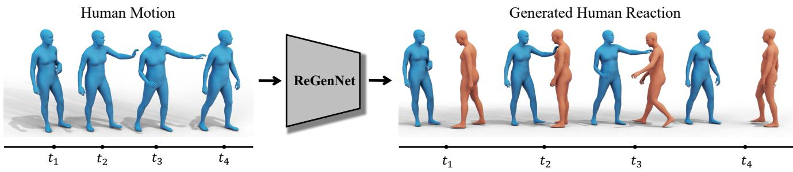
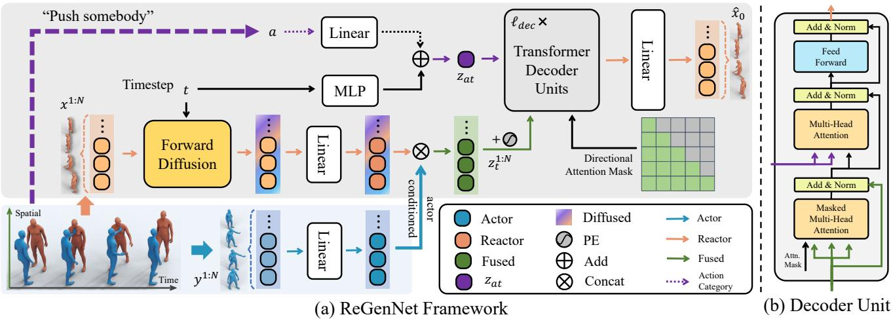
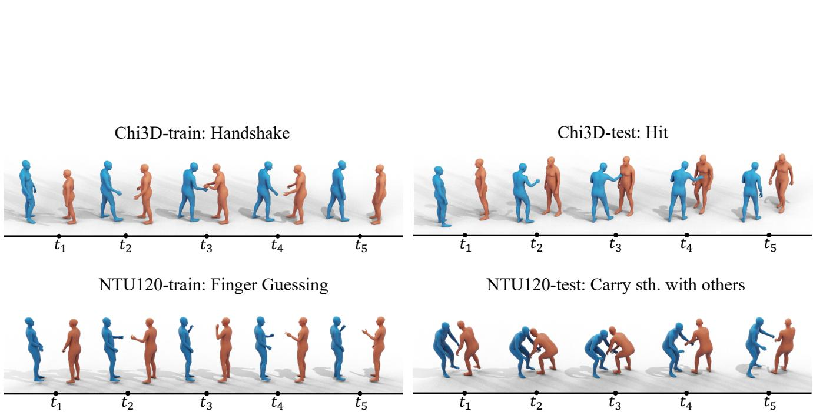

# ReGenNet: Towards Human Action-Reaction Synthesis

Liang Xu1,2 Yizhou Zhou3 Yichao Yan1† Xin Jin2† Wenhan Zhu1 Fengyun Rao3 Xiaokang Yang1 Wenjun Zeng2

1MoE Key Lab of Artificial Intelligence, AI Institute, Shanghai Jiao Tong University, Shanghai, China 2Ningbo Institute of Digital Twin, Eastern Institute of Technology, Ningbo, China 3WeChat, Tencent Inc.

https://liangxuy.github.io/ReGenNet/

## Abstract

Humans constantly interact with their surrounding environments. Current human-centric generative models mainly focus on synthesizing humans plausibly interacting with static scenes and objects, while the dynamic human actionreaction synthesis for ubiquitous causal human-human interactions is less explored. Human-human interactions can be regarded as asymmetric with actors and reactors in atomic interaction periods. In this paper, we comprehensively analyze the asymmetric, dynamic, synchronous, and detailed nature of human-human interactions and propose the first multi-setting human action-reaction synthesis benchmark to generate human reactions conditioned on given human actions. To begin with, we propose to annotate the actor-reactor order of the interaction sequences for the NTU120, InterHuman, and Chi3D datasets. Based on them, a diffusion-based generative model with a Transformer decoder architecture called ReGenNet together with an explicit distance-based interaction loss is proposed to predict human reactions in an online manner, where thefuture states of actors are unavailable to reactors. Quantitative and qualitative results show that our method can generate instant and plausible human reactions compared to the baselines, and can generalize to unseen actor motions and viewpoint changes.

## 1. Introduction

Human-centric generative models have been widely studied with numerous applications. Currently, there exists substantial progress on generative models to synthesize how digital humans actively interact with the environments with physical and semantic plausibility, e.g., conditioned on a given scene [26, 27, 70, 82–84] and object [63, 64, 71, 85]. However, for human-human interactions, a man could be active or passive in atomic interaction periods. Existing works for human motion generation mainly treat the actors and reactors equally or limited on single human motion generation [44, 58, 72], while neglecting the reaction generation problem for ubiquitous human-human interactions (see Fig. 1). In this paper, we focus on generative models for human action-reaction synthesis, i.e., generating human reactions given the action sequence of another as conditions. We believe this task will contribute to many applications in AR/VR, games, human-robot interaction, and embodied AI.

Modeling human-human interactions is a challenging task with the following features: 1) Asymmetric, i.e., the actor and reactor play asymmetric roles during a causal in teraction, where one person acts, and the other reacts [79]; 2) Dynamic, i.e., during the interaction period, the two people constantly wave their body parts, move close/away, and change relative orientations, spatially and temporally; 3) Synchronous, i.e., typically, one person responds instantly with others such as an immediate evasion when someone throws a punch, thus the online generation is required; 4) Detailed, i.e., the interaction between humans involves not only coarse body movements together with relative position changes but also local hand gestures and even facial expressions. Thus, it is desirable to design a generative model that simultaneously considers the above characteristics.

Directly applying previous human-centric generative models [64, 82, 83, 85] for human action-reaction synthesis is impractical, because existing models typically consider static scenes or objects, yet dynamic humans are more complicated. Moreover, online generation is also not required for human scene/object interaction scenarios, yet significant for action-reaction synthesis. On the other hand, recent years have witnessed the rapid development of single human motion generation conditioned on action categories [51, 67], text descriptions [21, 37, 52], audios [3, 25, 40–42] or sparse tracking signals [2, 14, 35]. However, very few works [44, 61, 62, 72, 73] have been proposed to generate multi-person interactions, yet treating the actor-reactor equally [44, 72] or focus on specific action categories, such as “martial arts” [62]. The sparse skeleton joints or SMPL body models [46] are widely adopted, while greatly limiting the fineness and details of hands-involved interactions such as “playing finger guessing”, letting alone the synchronous and asymmetric natures. To the best of our knowledge, no previous works have been proposed to deal with all the aforementioned patterns of human-human interactions. There are no such human-human interaction datasets with actor-reactor annotations.

  
Figure 1. Illustration of our proposed ReGenNet, i.e., given a human motion sequence and generate the plausible human reactions, which will have broad applications in AR/VR and games.

In this paper, we comprehensively consider the intrinsic features of human-human interactions and propose the first human action-reaction synthesis benchmark with the following designs: 1) We adopt the SMPL-X [50] body model as our data representation because it contains detailed articulated hand poses. In terms of the datasets, we choose Chi3D [15] with SMPL-X annotations from the body markers; we also extend the widely used NTU120 dataset [45] to SMPL-X version by a state-of-the-art pose estimation method [80]; we also adopt the human-human interaction MoCap dataset InterHuman [44] for its accurate motion sequences. 2) For the absence of asymmetry nature in current interaction datasets, we annotate the actors and reactors of the above three datasets. Based on these annotations, we propose, to our best knowledge, the first multisetting human action-reaction synthesis benchmark aiming to generate physically and semantically plausible human reactions conditioned on a given person’s action sequence. 3) To generate instant and synchronous human reactions, we need to design an online model, i.e., future human motion is unavailable for the synthesis at the current moment. We adopt a diffusion model together with the Transformer architecture to model the spatiotemporal interactions, and we choose the Transformer-decoder for its leftward property via the masked multi-head attention and inference in an auto-regressive manner. 4) To handle the highly dynamic human-human interactions, we draw inspiration from the previous human scene/object interaction counterparts which model the contact/interaction using distance-based representations [64, 82]. We thus design interaction losses that explicitly measure the relative distances of the interacted spatiotemporal body poses, orientations, and translations.

Considering that in practical applications, the intention of the actor could be agnostic to reactors, we also train our model in an unconstrained fashion [53, 67]. With the above designs, we name our reaction generation model as ReGen-Net. Extensive experiments show that ReGenNet can synthesize realistic human reactions with the lowest time delay compared to the baselines, and can generalize to unseen actor motions and viewpoint changes. Our model is modular and flexible to be trimmed for other practical applications such as multi-person interaction generation tasks.

Our contributions can be summarized as follows. We comprehensively analyze the asymmetric, dynamic, synchronous, and detailed nature of human-human interactions. Based on these analyses, we propose the first multi-setting human action-reaction synthesis benchmark with three dedicated annotated datasets. To address this task, we present ReGenNet, a diffusion-based generative model to synthesize plausible and instant human reactions. Our benchmark, data, models, and code will be made publicly available.

## 2. Related Work

Human-scene/object interaction. Synthesizing humanscene/object interactions is critical for games and AR/VR applications [76–78]. The goal is to fit the human body with scenes/objects as contexts, so as to plausibly navigate/interact in the scenes or manipulate the objects with geometric and semantic constraints. For human-scene interactions, [18, 24, 27, 33, 38, 43, 56, 57, 82, 83] can generate static interactions with unseen environments. Recent works [26, 70, 84] extended to produce dynamic humanscene interactions, which is equivalent to generating motion sequences with scene contexts. For human-object interactions, earlier works [19, 36] focused on generating hand object interactions. [7, 32, 63] built databases of wholebody interactions with daily objects and promoted the research works on synthesizing whole-body manipulations with objects [63, 64, 71, 85].

The core of these human-centric generative models lies in understanding the semantics and affordances of scenes/objects, together with training a conditional generative model based on the scene/object priors. Our proposed benchmark of human action-reaction synthesis, where the motion of the actor can also be viewed as the contexts, is also significant yet not explored to the best of our knowledge. The highly dynamic human motion is also more complicated than static scenes and objects.

<table><tr><td>Dataset</td><td>Year</td><td>Verbs</td><td>Motions</td><td>Modality</td><td>Asymmetry</td></tr><tr><td>SBU [79]</td><td>2012</td><td>8</td><td>300</td><td>Skel.</td><td>x</td></tr><tr><td>ShakeFive2 [69]</td><td>2016</td><td>8</td><td>153</td><td>Skel.</td><td>x</td></tr><tr><td>K3HI [6]</td><td>2020</td><td>8</td><td>312</td><td>Skel.</td><td>x</td></tr><tr><td>NTU120 [45]</td><td>2019</td><td>26</td><td>8,276</td><td>Skel.</td><td>x</td></tr><tr><td>You2Me [49]</td><td>2020</td><td>4</td><td>42</td><td>Skel.</td><td>x</td></tr><tr><td>Chi3D [15]</td><td>2020</td><td>8</td><td>373</td><td>SMPL-X</td><td>x</td></tr><tr><td>InterHuman [44]</td><td>2023</td><td>-</td><td>6,022</td><td>SMPL</td><td>x</td></tr><tr><td>Chi3D-AS(Ours)</td><td>2023</td><td>8</td><td>373</td><td>SMPL-X</td><td>√</td></tr><tr><td>InterHuman-AS(Ours)</td><td>2023</td><td>-</td><td>6,022</td><td>SMPL</td><td>√</td></tr><tr><td>NTU120-AS(Ours)</td><td>2023</td><td>26</td><td>8,118</td><td>SMPL-X</td><td>√</td></tr></table>

Table 1. Human-human interaction datasets. Skel. denotes skeleton and AS denotes asymmetry.

Human motion generation. The goal is to generate human motion conditioned on different guidances. Early works [5, 16, 23, 28, 47, 48, 66] focused on the task of future motion prediction, i.e., to predict the motion of future frames given past motion as guidance. Besides, motion synthesis from high-level semantic signals such as action labels [9, 10, 20, 51, 67, 72, 75], text [1, 13, 21, 37, 52, 81], music [4, 40–42], speech [3, 25] have emerged in recent years. However, [53, 67] also proved that human motion generation can also be learned without conditions in an unsupervised manner. Furthermore, human-human interaction synthesis has also been noticed [44, 58, 61, 62, 72]. However, these works treated the actor-reactor equally [44, 72] or focused on specific action categories [62] in graphics. Another line of research in AR/VR scenarios reverted the full-body poses from the sparse tracking signal of head and wrists [2, 8, 14, 34, 35], facilitating real-world applications.

The key component of these works is to learn generative models such as GANs [17, 72, 75], VAEs [9, 20, 39, 51], flow-based models [2, 55] and diffusion models [13, 31, 67, 81]. In this paper, we also adopt the diffusion models for high-quality synthesis. However, most previous works neglected the asymmetry of causal human-human interactions. Concurrent works [12, 65] target at human reaction generation, yet [12] adopts very sparse skeleton representations and [65] only handles the “offline” and “unconstrained” setting of human reaction generation without generating instant and intention agnostic reactions.

Human-human interaction dataset. Human-human interactions are indispensable components in our daily lives. Many multi-person interaction datasets such as UMPM [68], SBU [79], ShakeFive2 [69], K3HI [6], You2Me [49], Chi3d [15], NTU120 [45], ExPI [22], InterHuman [44] have been produced with various sizes and modalities as in Tab. 1. Especially, NTU120 [45] is a largescale human motion dataset with 26 interactive action categories and concurrently, InterHuman [44] brings the currently largest multi-human interaction dataset with text description annotations.

However, all these previous datasets overlooked the asymmetry property of causal human-human interactions. Thus, we propose to annotate the actor-reactor order of the Chi3D, NTU120 and InterHuman datasets. We also extend the NTU120 dataset to the SMPL-X version to better describe the fine-grained interaction patterns.

## 3. Human Action-Reaction Synthesis 3.1. Modeling setup

Dataset Formulation. In this work, we tackle the problem of fine-grained human action-reaction synthesis. However, we notice that all the previous multi-person interaction datasets ignored the asymmetry property of causal relationships (see Tab. 1). Thus, we choose three datasets, i.e., NTU120 [45], InterHuman [44] and Chi3D [15], and annotate the actor-reactor order of each interaction sequence. We also extend the NTU120 dataset to SMPL-X representation by a pose estimation method [80]. We name the datasets as NTU120-AS, InterHuman-AS and Chi3D-AS, where “AS” denotes asymmetry. For the details of the asymmetric action definition and the labeling process, please refer to the supplementary materials.

Problem Formulation. In the setting of human actionreaction synthesis, our goal is to generate the reaction conditioned on an arbitrary action. Formally, we denote the reaction as $\boldsymbol { x } ^ { 1 : N } = \{ x ^ { i } \} _ { i = 1 } ^ { N }$ and the action as $\boldsymbol { y } ^ { 1 : N } = \{ y ^ { i } \} _ { i = 1 } ^ { N }$ of duration N. The intention a can be a signal of action label, text, and audio to dictate the interaction, which could be optional for intention-agnostic scenarios.

To enhance the representational power of human-human interactions, we adopt SMPL-X [50] human model to represent the human motion sequence. Thus, the reaction can be represented as $x ^ { i } \ = \ [ \pmb { \theta } _ { i } ^ { x } , \pmb { q } _ { i } ^ { x } , \pmb { \gamma } _ { i } ^ { x } ]$ where $\pmb { \theta } _ { i } ^ { x } \in \mathbb { R } ^ { 3 K }$ $\pmb q _ { i } ^ { x } \in \mathbb { R } ^ { 3 } , \gamma _ { i } ^ { x } \in \mathbb { R } ^ { 3 }$ are the pose parameters, global orientation and the root translation of the person, respectively. K = 54 is the number of body joints together with the jaw, eyeballs, and fingers.

Motion Diffusion Model. Diffusion models [31, 59] have been proven to serve as a powerful generative model for human motion synthesis [13, 14, 67, 81], which can be regarded as learning a Markov chain-based progressive noising and denoising of human motions. Given the reaction $x _ { 0 } ^ { 1 : N }$ sampled from the real interaction data distribution, the noising process can be written as

$$
q ( x _ { t } ^ { 1 : N } | x _ { t - 1 } ^ { 1 : N } ) = \mathcal { N } ( x _ { t } ^ { 1 : N } ; \sqrt { \alpha _ { t } } x _ { t - 1 } ^ { 1 : N } , ( 1 - \alpha _ { t } ) I ) ,\tag{1}
$$

where t is the timestep of the diffusion process, $\alpha _ { t } \in ( 0 , 1 )$ is a constant hyper-parameter and I is the identity matrix. With sufficiently large $T , \alpha _ { t }$ becomes small enough and $x _ { T } ^ { 1 : N }$ can be approximated as a Gaussian noise $\mathcal { N } ( 0 , I )$ To generate the high-fidelity reaction, we need to reverse denoise the $x _ { T }$ back to $x _ { 0 }$ for T timesteps. In our setting, the reverse diffusion process is conditionally formulated as $p ( x _ { t - 1 } ^ { 1 : N } | x _ { t } ^ { 1 : N } , y ^ { 1 : N } , a )$ . We follow [14, 54, 67] to use a neural network F to directly predict the clean body poses instead of predicting the residual noise, $i . e . , \ \hat { x } _ { 0 } \ =$ $F ( x _ { t } , y ^ { 1 : N } , t , a )$ , so that we can add geometric losses directly on the predicted ${ \hat { x } } _ { 0 } . F$ can be implemented by Transformers or MLP networks for different applications. The training objective of the diffusion model is formulated as

  
Figure 2. The architecture of our proposed ReGenNet which is formulated in a diffusion-based framework with Transformer Decoder Units. The gray panel of (a) illustrates the whole diffusion model with the “Forward Diffusion” process and a stack of $\ell _ { d e c }$ “Transformer Decoder Units” as the denoising process, the blue panel of (a) is the actor feature as the condition. (b) shows the details of the “Transformer Decoder Units” with directional attention mask for online reaction synthesis.

$$
\begin{array} { r } { \mathcal { L } _ { d m } = \mathbb { E } _ { x _ { 0 } \sim q ( x _ { 0 } ) , t \sim [ 1 , T ] } [ \| x _ { 0 } - F ( x _ { t } , y ^ { 1 : N } , t , a ) \| _ { 2 } ^ { 2 } ] . } \end{array}
$$

## 3.2. Reaction Generation Network

(2)

In this section, we introduce our holistic diffusion-based reaction generation framework as shown in Fig. 2, which consists of a diffusion model M and a Transformer decoder $F .$ Given a coupled action-reaction pair and the optional action category (dotted lines in Fig. $\hat { 2 } ) < x ^ { 1 : N } , y ^ { 1 : N } , a > , y ^ { 1 : N }$ and a serve as conditions and $\bar { x ^ { 1 : N } }$ is the reaction to generate. For a sampled noising timestep t, we add noise to $x ^ { 1 : N }$ through the forward diffusion process as Eq. (1) to produce the noised $\boldsymbol { x } _ { t } ^ { 1 : N }$ . Then both the $\boldsymbol { x } _ { t } ^ { 1 : N }$ and the $y ^ { 1 : N }$ are linearly projected to obtain the latent features through an FC layer to dimension $d ,$ and concatenated together through the feature dimension. We also apply another FC layer to fuse the concatenated features and reduce the dimension to produce the final tokens $z _ { t } ^ { 1 : N }$ . Experimental results show that the conditioning scheme by concatenation is simple yet effective. The noising timestep t and the optional action label a are all projected to dimension d by separate feed-forward networks and then summed up to obtain the token $z _ { a t }$

We implement F by stacking $\ell _ { d e c }$ layers of Transformer decoder units to prevent future information leakage via the masked multi-head attention for online generation. $F$ takes $z _ { a t }$ as input tokens and $z _ { t } ^ { 1 : N }$ summed with a standard positional embedding as output tokens together with a directional attention mask, which is critical to prevent the model from seeing future actions at the current moment. The output of the decoders is then projected back as the predicted clean body poses $\hat { x } _ { 0 } ^ { 1 : N }$ . During inference time, we generate human reactions in an auto-regressive manner.

Explicit interaction loss. Inspired by previous generative models of human scene/object interaction counterparts, which designed delicate distance-based representations to model interactions, we design explicit interaction losses to measure the relative distances of the interacted spatiotemporal body pose θ, orientation q and translation γ as

$$
\begin{array} { r l } & { \pmb { \theta } ^ { x  y } = F K ( \pmb { \theta } ^ { y } ) - F K ( \pmb { \theta } ^ { x } ) ; } \\ & { q ^ { x  y } = R M ( \pmb { q } ^ { y } ) ^ { \top } \cdot R M ( \pmb { q } ^ { x } ) ; } \\ & { \gamma ^ { x  y } = \gamma ^ { y } - \gamma ^ { x } , } \end{array}\tag{3}
$$

where $F K ( \cdot )$ denotes the forward kinematic function to convert the rotation pose into joint positions, and RM(·) converts the rotation poses to rotation matrices. The interaction loss is formulated as

$$
\begin{array} { l } { \displaystyle \mathcal { L } _ { i n t e r } = \frac { 1 } { N } \bigg ( \sum _ { i = 1 } ^ { N } { \| \pmb { \theta } ^ { x _ { 0 } \to y } - \pmb { \theta } ^ { \hat { x } _ { 0 } \to y } \| _ { 2 } ^ { 2 } } } \\ { \displaystyle + \sum _ { i = 1 } ^ { N } { \| \pmb { q } ^ { x _ { 0 } \to y } - \pmb { q } ^ { \hat { x } _ { 0 } \to y } \| _ { 2 } ^ { 2 } } + \sum _ { i = 1 } ^ { N } { \| \gamma ^ { x _ { 0 } \to y } - \gamma ^ { \hat { x } _ { 0 } \to y } \| _ { 2 } ^ { 2 } } \bigg ) . } \end{array}\tag{4}
$$

<table><tr><td rowspan="2">Method</td><td colspan="4">Train conditioned</td><td colspan="4">Test conditioned</td></tr><tr><td>FID↓</td><td> $\operatorname { A c c . \uparrow }$ </td><td> $\mathrm { D i v . } $ </td><td> $\mathrm { M u l t i m o d . } $ </td><td> $\mathrm { F I D \downarrow }$ </td><td> $\operatorname { A c c . \uparrow }$ </td><td> $\mathrm { D i v .  }$ </td><td>Multimod.→</td></tr><tr><td>Real</td><td> $0 . 0 9 ^ { \pm 0 . 0 0 }$ </td><td> $1 . 0 0 0 ^ { \pm 0 . 0 0 0 0 }$ </td><td> $1 0 . 5 4 ^ { \pm 0 . 0 6 }$ </td><td> $2 6 . 7 1 ^ { \pm 0 . 6 2 }$ </td><td> $0 . 0 9 ^ { \pm 0 . 0 0 }$ </td><td> $0 . 8 6 7 ^ { \pm 0 . 0 0 0 2 }$ </td><td> $1 3 . 0 6 ^ { \pm 0 . 0 9 }$ </td><td> $2 5 . 0 3 ^ { \pm 0 . 2 3 }$ </td></tr><tr><td>cVAE [39]</td><td> $7 7 . 5 2 ^ { \pm 7 . 2 5 }$ </td><td> $0 . 8 9 9 ^ { \pm 0 . 0 0 0 2 }$ </td><td> $1 0 . 1 0 ^ { \pm 0 . 0 2 }$ </td><td> $1 9 . 3 8 ^ { \pm 0 . 1 6 }$ </td><td> $7 0 . 1 0 ^ { \pm 3 . 4 2 }$ </td><td> $0 . 7 2 4 ^ { \pm 0 . 0 0 0 2 }$ </td><td> $1 1 . 1 4 ^ { \pm 0 . 0 4 }$ </td><td> $1 8 . 4 ^ { \pm 0 . 2 6 }$ </td></tr><tr><td>AGRoL [14]</td><td> $3 8 . 0 4 ^ { \pm 1 . 4 5 }$ </td><td> $0 . 9 3 2 ^ { \pm 0 . 0 0 0 1 }$ </td><td> $1 0 . 9 5 ^ { \pm 0 . 0 7 }$ </td><td> $2 1 . 4 4 ^ { \pm 0 . 3 4 }$ </td><td> $4 4 . 9 4 ^ { \pm 2 . 4 6 }$ </td><td> $\overline { { 0 . 6 8 0 ^ { \pm 0 . 0 0 0 1 } } }$ </td><td> $1 2 . 5 1 ^ { \pm 0 . 0 9 }$ </td><td> $1 9 . 7 3 ^ { \pm 0 . 1 7 }$ </td></tr><tr><td>MDM [67]</td><td> $4 0 . 1 3 ^ { \pm 3 . 6 5 }$ </td><td> $0 . 9 5 5 ^ { \pm 0 . 0 0 0 1 }$ </td><td> $\mathbf { 1 0 . 5 3 ^ { \pm 0 . 0 4 } }$ </td><td> $2 1 . 1 5 ^ { \pm 0 . 2 6 }$ </td><td> $5 4 . 5 4 ^ { \pm 3 . 9 4 }$ </td><td> $0 . 7 0 4 ^ { \pm 0 . 0 0 0 3 }$ </td><td> $1 1 . 9 8 ^ { \pm 0 . 0 7 }$ </td><td> $1 9 . 4 5 ^ { \pm 0 . 2 0 }$ </td></tr><tr><td>MDM-GRU [67]</td><td> $5 . 3 1 ^ { \pm 0 . 1 8 }$ </td><td> $0 . 9 9 3 ^ { \pm 0 . 0 0 0 0 }$ </td><td> $1 1 . 0 3 ^ { \pm 0 . 0 6 }$  </td><td> $2 5 . 0 4 ^ { \pm 0 . 3 6 }$  </td><td> $2 4 . 2 5 ^ { \pm 1 . 3 9 }$ </td><td> $0 . 7 2 0 ^ { \pm 0 . 0 0 0 2 }$  </td><td> $\mathbf { 1 3 . 4 3 ^ { \pm 0 . 0 9 } }$ </td><td> $2 2 . 2 4 ^ { \pm 0 . 2 9 }$ </td></tr><tr><td>ReGenNet</td><td> $\mathbf { 0 . 9 0 ^ { \pm 0 . 0 1 } }$ </td><td> $\mathbf { 1 . 0 0 0 ^ { \pm 0 . 0 0 0 0 } }$ </td><td> $1 0 . 6 9 ^ { \pm 0 . 0 5 }$ </td><td> $\mathbf { 2 6 . 2 5 ^ { \pm 0 . 3 5 } }$ </td><td> $\mathbf { 1 1 . 0 0 ^ { \pm 0 . 7 4 } }$  </td><td> $\mathbf { 0 . 7 4 9 ^ { \pm 0 . 0 0 0 2 } }$ </td><td> $1 3 . 8 0 ^ { \pm 0 . 1 6 }$  </td><td> $\pmb { 2 2 . 9 0 ^ { \pm 0 . 1 4 } }$ </td></tr></table>

Table 2. Comparison to state-of-the-arts on the online, unconstrained setting for human action-reaction synthesis on NTU120-AS. ± indicates 95% confidence interval, → means that closer to Real is better. Bold indicates best result and underline indicates second best.
<table><tr><td rowspan="2">Method</td><td colspan="4">Train conditioned</td><td colspan="4">Test conditioned</td></tr><tr><td>FID↓</td><td> $\operatorname { A c c . \uparrow }$ </td><td> $\mathrm { D i v .  }$ </td><td> $\mathrm { M u l t i m o d . } $ </td><td> $\mathrm { F I D \downarrow }$ </td><td> $\operatorname { A c c . \uparrow }$ </td><td> $\mathrm { D i v .  }$ </td><td>Multimod.→</td></tr><tr><td>Real</td><td> $0 . 1 9 ^ { \pm 0 . 0 1 }$ </td><td> $1 . 0 0 0 ^ { \pm 0 . 0 0 0 0 }$ </td><td> $5 . 3 6 ^ { \pm 0 . 0 8 }$ </td><td> $2 0 . 0 6 ^ { \pm 0 . 7 8 }$ </td><td> $0 . 7 5 ^ { \pm 0 . 1 8 }$ </td><td> $0 . 6 9 1 ^ { \pm 0 . 0 0 9 3 }$ </td><td> $7 . 1 5 ^ { \pm 1 . 2 7 }$ </td><td> $1 2 . 9 4 ^ { \pm 0 . 9 6 }$ </td></tr><tr><td>cVAE [39]</td><td> $2 5 . 4 5 ^ { \pm 1 3 . 9 }$ </td><td> $0 . 8 4 3 ^ { \pm 0 . 0 0 0 5 }$ </td><td> $9 . 0 2 ^ { \pm 0 . 3 0 }$ </td><td> $1 3 . 8 2 ^ { \pm 0 . 6 4 }$ </td><td> $1 7 . 3 3 ^ { \pm 1 7 . 1 4 }$ </td><td> $0 . 5 5 2 ^ { \pm 0 . 0 0 2 4 }$ </td><td> $8 . 2 0 ^ { \pm 0 . 5 7 }$ </td><td> $1 1 . 4 4 ^ { \pm 0 . 3 5 }$ </td></tr><tr><td>AGRoL [14]</td><td> $4 7 . 7 3 ^ { \pm 5 . 9 5 }$ </td><td> $0 . 9 7 5 ^ { \pm 0 . 0 0 0 1 }$ </td><td> $7 . 4 3 ^ { \pm 0 . 2 1 }$ </td><td> $1 5 . 5 9 ^ { \pm 0 . 4 9 }$ </td><td> $6 4 . 8 3 ^ { \pm 2 7 7 . 8 }$ </td><td> $0 . 6 4 4 ^ { \pm 0 . 0 0 3 9 }$ </td><td> $\mathbf { 7 . 0 0 ^ { \pm 0 . 9 5 } }$ </td><td> $1 1 . 3 3 ^ { \pm 0 . 6 5 }$ </td></tr><tr><td>MDM [67]</td><td> $1 5 . 9 6 ^ { \pm 1 . 9 2 }$ </td><td> $\mathbf { 1 . 0 0 0 ^ { \pm 0 . 0 0 0 0 } }$ </td><td> $5 . 9 8 ^ { \pm 0 . 1 5 }$ </td><td> $1 6 . 4 3 ^ { \pm 0 . 5 0 }$ </td><td> $1 8 . 4 0 ^ { \pm 7 . 9 5 }$ </td><td> $\mathbf { 0 . 6 4 7 ^ { \pm 0 . 0 0 3 5 } }$ </td><td> $5 . 8 9 ^ { \pm 0 . 3 3 }$ </td><td> $1 0 . 9 6 ^ { \pm 0 . 2 7 }$ </td></tr><tr><td>MDM-GRU [67]</td><td> $4 . 9 6 ^ { \pm 0 . 9 7 }$ </td><td> $0 . 9 9 5 ^ { \pm 0 . 0 0 0 0 }$ </td><td> $6 . 3 6 ^ { \pm 0 . 2 2 }$ </td><td> $1 7 . 7 9 ^ { \pm 0 . 5 8 }$ </td><td> $1 8 . 6 3 ^ { \pm 2 5 . 8 7 }$ </td><td> $0 . 5 7 4 ^ { \pm 0 . 0 0 4 6 }$  </td><td> $6 . 2 0 ^ { \pm 0 . 2 4 }$  </td><td> $1 0 . 4 9 ^ { \pm 0 . 3 2 }$ </td></tr><tr><td>ReGenNet</td><td> $\mathbf { 0 . 2 7 ^ { \pm 0 . 0 3 } }$ </td><td> $\mathbf { 1 . 0 0 0 ^ { \pm 0 . 0 0 0 0 } }$ </td><td> $\mathbf { 5 . 3 9 ^ { \pm 0 . 1 2 } }$ </td><td> $\mathbf { 2 0 . 2 4 ^ { \pm 0 . 6 4 } }$ </td><td> $\mathbf { 1 3 . 7 6 ^ { \pm 4 . 7 8 } }$ </td><td> $0 . 6 0 1 ^ { \pm 0 . 0 0 4 0 }$  </td><td> $6 . 3 5 ^ { \pm 0 . 2 4 }$ </td><td> $\mathbf { 1 2 . 0 2 ^ { \pm 0 . 3 3 } }$  </td></tr></table>

Table 3. Comparison to state-of-the-arts on the online, unconstrained setting for human action-reaction synthesis on $\mathrm { C h i 3 D  – A S . \pm }$ indicates 95% confidence interval, → means that closer to Real is better. Bold indicates best result and underline indicates second best.

<table><tr><td>Methods</td><td>R Precision  $( \mathrm { T o p } 3 ) \uparrow$ </td><td> $\mathrm { F I D \downarrow }$ </td><td>MM Dist.↓</td><td>Diversity→</td><td>MModality ↑</td></tr><tr><td>Real</td><td> $\overline { { 0 . 7 2 2 ^ { \pm 0 . 0 0 4 } } }$ </td><td> $\overline { { 0 . 0 0 2 ^ { \pm 0 . 0 0 0 2 } } }$ </td><td> $\overline { { 3 . 5 0 3 ^ { \pm 0 . 0 1 1 } } }$ </td><td> $\overline { { 5 . 3 9 0 ^ { \pm 0 . 0 5 8 } } }$ </td><td></td></tr><tr><td>T2M [21]</td><td> $0 . 2 2 4 ^ { \pm 0 . 0 0 3 }$ </td><td> $\overline { { 3 2 . 4 8 2 ^ { \pm 0 . 0 9 7 5 } } }$ </td><td> $7 . 2 9 9 ^ { \pm 0 . 0 1 6 }$ </td><td> $\overline { { 4 . 3 5 0 ^ { \pm 0 . 0 7 3 } } }$ </td><td> $0 . 7 1 9 ^ { \pm 0 . 0 4 1 }$ </td></tr><tr><td>MDM [67]</td><td> $0 . 3 7 0 ^ { \pm 0 . 0 0 6 }$ </td><td> $3 . 3 9 7 ^ { \pm 0 . 0 3 5 2 }$ </td><td> $8 . 6 4 0 ^ { \pm 0 . 0 6 5 }$ </td><td> $4 . 7 8 0 ^ { \pm 0 . 1 1 7 }$ </td><td> $2 . 2 8 8 ^ { \pm 0 . 0 3 9 }$ </td></tr><tr><td>MDM-GRU [67]</td><td> $0 . 3 2 8 ^ { \pm 0 . 0 1 2 }$ </td><td> $6 . 3 9 7 ^ { \pm 0 . 2 1 4 0 }$ </td><td> $8 . 8 8 4 ^ { \pm 0 . 0 4 0 }$ </td><td> $4 . 8 5 1 ^ { \pm 0 . 0 8 1 }$ </td><td> $2 . 0 7 6 ^ { \pm 0 . 0 4 0 }$ </td></tr><tr><td>RAIG [65]</td><td> $0 . 3 6 3 ^ { \pm 0 . 0 0 8 }$ </td><td> $2 . 9 1 5 ^ { \pm 0 . 0 2 9 2 }$ </td><td></td><td> $\overline { { 4 . 7 3 6 ^ { \pm 0 . 0 9 9 } } }$ </td><td> $2 . 2 0 3 ^ { \pm 0 . 0 4 9 }$ </td></tr><tr><td>InterGen [44]</td><td> $0 . 3 7 4 ^ { \pm 0 . 0 0 5 }$ </td><td> $\overline { { 1 3 . 2 3 7 ^ { \pm 0 . 0 3 5 2 } } }$ </td><td> $\frac { 7 . 2 9 4 ^ { \pm 0 . 0 2 6 } } { 1 0 . 9 2 9 ^ { \pm 0 . 0 2 6 } }$ </td><td> $4 . 3 7 6 ^ { \pm 0 . 0 4 2 }$ </td><td> $\mathbf { 2 . 7 9 3 ^ { \pm 0 . 0 1 4 } }$ </td></tr><tr><td>ReGenNet</td><td>0.407±0.003</td><td> $\overline { { { \bf 2 . 2 6 5 ^ { \pm 0 . 0 9 6 9 } } } }$ </td><td> $\overline { { { \bf 6 . 8 6 0 ^ { \pm 0 . 0 . 0 4 0 } } } }$ </td><td> $\overline { { { \bf 5 . 2 1 4 ^ { \pm 0 . 1 3 9 } } } }$ </td><td> $\underline { { 2 . 3 9 1 ^ { \pm 0 . 0 2 3 } } }$ </td></tr></table>

Table 4. Comparison to state-of-the-arts on the online, unconstrained setting for human action-reaction synthesis on the InterHuman-AS dataset.
<table><tr><td>Method</td><td>FID↓</td><td> $\operatorname { A c c . \uparrow }$ </td><td> $\mathrm { D i v . } $ </td><td>Multimod.→</td></tr><tr><td>Real</td><td> $0 . 1 0 ^ { \pm 0 . 0 0 }$ </td><td> $0 . 8 4 9 ^ { \pm 0 . 0 0 0 2 }$ </td><td> $1 2 . 9 8 ^ { \pm 0 . 1 1 }$ </td><td> $2 2 . 7 7 ^ { \pm 0 . 3 5 }$ </td></tr><tr><td>cVAE [39]</td><td> $6 3 . 2 3 ^ { \pm 7 . 7 4 }$ </td><td> $0 . 7 0 8 ^ { \pm 0 . 0 0 0 4 }$ </td><td> $1 1 . 1 5 ^ { \pm 0 . 0 3 }$ </td><td> $1 7 . 3 4 ^ { \pm 0 . 2 3 }$ </td></tr><tr><td>AGRoL [14]</td><td> $3 5 . 8 3 ^ { \pm 1 . 1 3 }$ </td><td> $\overline { { 0 . 5 9 2 ^ { \pm 0 . 0 0 0 3 } } }$ </td><td> $1 2 . 4 2 ^ { \pm 0 . 0 6 }$ </td><td> $1 8 . 6 7 ^ { \pm 0 . 2 1 }$ </td></tr><tr><td>MDM [67]</td><td> $3 6 . 7 5 ^ { \pm 2 . 8 7 }$ </td><td> $0 . 6 9 2 ^ { \pm 0 . 0 0 0 4 }$ </td><td> $\overline { { 1 1 . 7 3 ^ { \pm 0 . 0 5 } } }$ </td><td> $1 8 . 2 4 ^ { \pm 0 . 2 1 }$ </td></tr><tr><td>MDM-GRU [67]</td><td> $2 5 . 5 7 ^ { \pm 1 . 7 1 }$ </td><td> $0 . 6 3 6 ^ { \pm 0 . 0 0 0 5 }$ </td><td> $\mathbf { 1 3 . 2 0 ^ { \pm 0 . 0 9 } }$ </td><td> $2 0 . 4 9 ^ { \pm 0 . 3 3 }$ </td></tr><tr><td>ReGenNet</td><td> $\overline { { 8 . 1 6 ^ { \pm 0 . 4 2 } } }$ </td><td> $\mathbf { 0 . 7 1 3 ^ { \pm 0 . 0 0 0 2 } }$ </td><td> $1 3 . 8 8 ^ { \pm 0 . 1 3 }$ </td><td> $\overline { { 2 1 . 6 3 ^ { \pm 0 . 4 1 } } }$ </td></tr></table>

Table 5. Generalization results to different viewpoints on the online, unconstrained setting on the NTU120-AS dataset.

Overall, the training loss is $\mathcal { L } _ { a l l } = \mathcal { L } _ { d m } + \lambda _ { i n t e r } \cdot \mathcal { L } _ { i n t e r } ,$ and $\lambda _ { i n t e r }$ is the loss weight.

tion branch can be enabled if the actor’s intention is available to the reactor, or removed otherwise; 2) The directional attention mask can be disabled for offline models.

## 4. Experiment

Customization Support. We tackle the most challenging setting of online action-reaction synthesis without seeing the future motions, even being agnostic to the actor’s intentions. There exist other scenarios that relax these restrictions, such as offline generative models if the time delay can be tolerated. Our proposed ReGenNet is modular, flexible, and can be trimmed for other practical usages. 1) The inten-

## 4.1. Datasets and Evaluation Metrics

First, we give the definitions of our experiment settings. We name the setting of instant human action-reaction synthesis without seeing the future motions as online models, and the opposite is offline models to relax the synchronicity requirements. We also define unconstrained and constrained settings depending on whether the intention of the actor is visible to the reactor. We mainly focus on the challenging online, unconstrained setting due to its potential for practical applications.

We evaluate our model on our proposed NTU120-AS, InterHuman-AS and Chi3D-AS datasets with SMPL-X [50] body models and actor-reactor annotations. NTU120-AS includes 8,118 human interaction sequences captured by 3 cameras of 26 action categories. We choose camera 1 and follow the cross-subject protocol where half of the subjects are used for training and the remaining ones for testing. We also evaluate our model on camera 2 to examine the generalization ability for viewpoint changes. InterHuman-AS presents 6,022 interaction sequences captured by a multiview motion capture studio. Chi3D-AS contains 373 interaction sequences and we randomly split the training and test sets with a ratio of 4:1. In all our experiments, we adopt the free manner [30]. The batch size is set as 64 for NTU120- AS, InterHuman-AS and 16 for Chi3D-AS, the number of decoder layers is 8 and the latent dimension of the Transformer tokens is 512. For the loss weights, we set $\lambda _ { i n t e r } =$ 1. Each model is trained for 500K steps on 4 NVIDIA A100 GPUs within 20 hours. During inference, we adopt the DDIM [60] strategy to accelerate. Unless specified, we run 5 sampling steps for all the diffusion-based models.

<table><tr><td rowspan="2">Class</td><td rowspan="2">Settings</td><td colspan="4">Train conditioned</td><td colspan="4">Test conditioned</td></tr><tr><td>FID↓</td><td>Acc.↑</td><td> $\mathrm { D i v . } $ </td><td>Multimod.→</td><td>FID↓</td><td>Acc.↑</td><td>Div.→</td><td>Multimod.→</td></tr><tr><td></td><td>Real</td><td> $0 . 0 9 4 ^ { \pm 0 . 0 0 0 3 }$ </td><td> $1 . 0 0 0 ^ { \pm 0 . 0 0 }$ </td><td> $1 0 . 5 4 2 ^ { \pm 0 . 0 6 3 2 }$ </td><td> $2 6 . 7 0 9 ^ { \pm 0 . 6 1 9 3 }$ </td><td> $0 . 0 8 5 ^ { \pm 0 . 0 0 0 3 }$ </td><td> $0 . 8 6 7 ^ { \pm 0 . 0 0 0 2 }$ </td><td> $1 3 . 0 6 3 ^ { \pm 0 . 0 9 0 8 }$ </td><td> $2 5 . 0 3 2 ^ { \pm 0 . 2 3 3 2 }$ </td></tr><tr><td rowspan="2">Modules</td><td>1) Add</td><td> $0 . 9 7 5 ^ { \pm 0 . 0 1 8 6 }$ </td><td> $1 . 0 0 0 ^ { \pm 0 . 0 0 }$ </td><td> $1 0 . 6 8 5 ^ { \pm 0 . 0 4 9 3 }$ </td><td> $2 6 . 2 7 2 ^ { \pm 0 . 3 6 6 3 }$ </td><td> $1 2 . 8 2 8 ^ { \pm 0 . 9 3 3 5 }$ </td><td> $0 . 7 4 7 ^ { \pm 0 . 0 0 0 3 }$ </td><td> $1 3 . 7 2 1 ^ { \pm 0 . 1 5 1 3 }$ </td><td> $2 2 . 7 7 1 ^ { \pm 0 . 1 9 2 1 }$ </td></tr><tr><td>2) w.o. PE</td><td> $0 . 8 9 2 ^ { \pm 0 . 0 1 3 0 }$ </td><td> $1 . 0 0 0 ^ { \pm 0 . 0 0 }$ </td><td> $1 0 . 7 1 7 ^ { \pm 0 . 0 5 6 7 }$ </td><td> $2 6 . 3 4 5 ^ { \pm 0 . 3 4 3 2 }$ </td><td> $1 2 . 9 1 6 ^ { \pm 1 . 2 8 0 2 }$ </td><td> $0 . 7 4 7 ^ { \pm 0 . 0 0 0 1 }$ </td><td> $1 3 . 7 7 5 ^ { \pm 0 . 1 5 2 6 }$ </td><td> $2 2 . 7 5 2 ^ { \pm 0 . 1 3 3 0 }$ </td></tr><tr><td>Loss</td><td>W.0.  $\mathcal { L } _ { i n t e r }$ </td><td> $1 . 9 6 0 ^ { \pm 0 . 0 6 2 1 }$ </td><td> $0 . 9 9 9 ^ { \pm 0 . 0 0 }$ </td><td> $1 0 . 7 7 8 ^ { \pm 0 . 0 5 9 7 }$ </td><td> $2 6 . 0 2 4 ^ { \pm 0 . 3 2 2 3 }$ </td><td> $1 2 . 1 4 6 ^ { \pm 0 . 9 0 4 4 }$ </td><td> $0 . 7 5 1 ^ { \pm 0 . 0 0 0 2 }$ </td><td> $1 3 . 7 2 7 ^ { \pm 0 . 1 8 0 8 }$ </td><td> $2 2 . 8 4 6 ^ { \pm 0 . 1 6 0 6 }$ </td></tr><tr><td rowspan="4">Num. of  $\ell _ { d e c }$ </td><td>2</td><td> $1 1 . 4 4 5 ^ { \pm 0 . 8 7 3 8 }$ </td><td> $0 . 9 9 3 ^ { \pm 0 . 0 0 }$ </td><td> $1 0 . 9 7 2 ^ { \pm 0 . 0 5 4 3 }$ </td><td> $2 4 . 8 1 5 ^ { \pm 0 . 3 7 6 9 }$ </td><td> $2 9 . 0 1 5 ^ { \pm 3 . 7 7 5 1 }$ </td><td> $0 . 7 4 4 ^ { \pm 0 . 0 0 0 2 }$ </td><td> $1 3 . 1 0 7 ^ { \pm 0 . 1 2 7 3 }$ </td><td> $2 1 . 1 3 4 ^ { \pm 0 . 1 1 5 0 }$ </td></tr><tr><td></td><td> $3 . 2 1 8 ^ { \pm 0 . 1 1 2 0 }$ </td><td> $0 . 9 9 9 ^ { \pm 0 . 0 0 }$ </td><td> $1 0 . 8 5 6 ^ { \pm 0 . 0 5 2 1 }$ </td><td> $2 5 . 7 2 8 ^ { \pm 0 . 3 7 9 0 }$ </td><td> $1 8 . 1 4 8 ^ { \pm 1 . 7 4 1 3 }$ </td><td> $0 . 7 4 3 ^ { \pm 0 . 0 0 0 2 }$ </td><td> $1 3 . 4 1 8 ^ { \pm 0 . 1 0 4 8 }$ </td><td> $2 1 . 8 1 3 ^ { \pm 0 . 1 6 7 1 }$ </td></tr><tr><td>4 12</td><td> $1 . 9 6 7 ^ { \pm 0 . 0 2 8 7 }$ </td><td> $1 . 0 0 0 ^ { \pm 0 . 0 0 }$ </td><td> $1 0 . 7 5 2 ^ { \pm 0 . 0 5 3 3 }$ </td><td> $2 6 . 0 3 8 ^ { \pm 0 . 3 3 7 0 }$ </td><td> $1 3 . 3 4 8 ^ { \pm 0 . 7 4 2 0 }$ </td><td> $0 . 7 2 5 ^ { \pm 0 . 0 0 0 2 }$ </td><td> $1 4 . 0 9 0 ^ { \pm 0 . 1 6 2 9 }$ </td><td> $2 2 . 9 0 6 ^ { \pm 0 . 1 1 9 7 }$ </td></tr><tr><td>16</td><td> $2 . 3 8 2 ^ { \pm 0 . 0 5 1 1 }$ </td><td> $1 . 0 0 0 ^ { \pm 0 . 0 0 }$ </td><td> $1 0 . 7 5 7 ^ { \pm 0 . 0 5 0 9 }$ </td><td> $2 5 . 9 0 8 ^ { \pm 0 . 3 3 7 0 }$ </td><td> $1 1 . 0 8 9 ^ { \pm 1 . 3 9 0 2 }$ </td><td> $0 . 7 2 8 ^ { \pm 0 . 0 0 0 2 }$ </td><td> $1 4 . 1 7 3 ^ { \pm 0 . 1 3 2 7 }$ </td><td> $2 3 . 0 6 9 ^ { \pm 0 . 2 4 9 2 }$ </td></tr><tr><td>Final Version</td><td>ReGenNet</td><td> $0 . 8 9 6 ^ { \pm 0 . 0 1 0 9 }$  </td><td> $1 . 0 0 0 ^ { \pm 0 . 0 0 }$  一</td><td> $1 0 . 6 9 4 ^ { \pm 0 . 0 5 4 2 }$ </td><td> $2 6 . 2 4 7 ^ { \pm 0 . 3 4 7 6 }$ </td><td> $1 0 . 9 9 9 ^ { \pm 0 . 7 4 2 5 }$ </td><td> $0 . 7 4 9 ^ { \pm 0 . 0 0 0 2 }$ </td><td> $1 3 . 7 9 7 ^ { \pm 0 . 1 5 9 3 }$ </td><td> $2 2 . 9 0 2 ^ { \pm 0 . 1 3 5 3 }$ </td></tr></table>

Table 6. Ablation studies on the online, unconstrained setting on the NTU120-AS dataset.
<table><tr><td rowspan="2">Timesteps</td><td colspan="4">Train conditioned</td><td colspan="4">Test conditioned</td><td rowspan="2">Latency(ms)</td></tr><tr><td>FID↓</td><td> $\operatorname { A c c . \uparrow }$ </td><td> $\mathrm { D i v .  }$ </td><td>Multimod.→</td><td> $\mathrm { F I D \downarrow }$ </td><td> $\operatorname { A c c . \uparrow }$ </td><td> $\mathrm { D i v .  }$ </td><td>Multimod.→</td></tr><tr><td>Real</td><td> $0 . 0 9 4 ^ { \pm 0 . 0 0 0 3 }$ </td><td> $1 . 0 0 0 ^ { \pm 0 . 0 0 }$ </td><td> $1 0 . 5 4 2 ^ { \pm 0 . 0 6 3 2 }$ </td><td> $2 6 . 7 0 9 ^ { \pm 0 . 6 1 9 3 }$ </td><td> $0 . 0 8 5 ^ { \pm 0 . 0 0 0 3 }$ </td><td> $0 . 8 6 7 ^ { \pm 0 . 0 0 0 2 }$ </td><td> $1 3 . 0 6 3 ^ { \pm 0 . 0 9 0 8 }$ </td><td> $2 5 . 0 3 2 ^ { \pm 0 . 2 3 3 2 }$ </td><td>-</td></tr><tr><td>2</td><td> $0 . 9 1 2 ^ { \pm 0 . 0 1 1 0 }$ </td><td> $1 . 0 0 0 ^ { \pm 0 . 0 0 }$ </td><td> $1 0 . 6 8 8 ^ { \pm 0 . 0 5 2 9 }$ </td><td> $2 6 . 2 4 9 ^ { \pm 0 . 3 5 0 4 }$ </td><td> $1 2 . 1 3 2 ^ { \pm 0 . 8 3 0 1 }$ </td><td> $0 . 7 5 1 ^ { \pm 0 . 0 0 0 2 }$ </td><td> $1 3 . 7 0 7 ^ { \pm 0 . 1 6 8 3 }$ </td><td> $2 2 . 7 9 7 ^ { \pm 0 . 1 1 7 2 }$ </td><td>0.33</td></tr><tr><td>5</td><td> $0 . 8 9 6 ^ { \pm 0 . 0 1 0 9 }$  </td><td> $1 . 0 0 0 ^ { \pm 0 . 0 0 }$ </td><td> $1 0 . 6 9 4 ^ { \pm 0 . 0 5 4 2 }$ </td><td> $2 6 . 2 4 7 ^ { \pm 0 . 3 4 7 6 }$ </td><td> $1 0 . 9 9 9 ^ { \pm 0 . 7 4 2 5 }$ </td><td> $0 . 7 4 9 ^ { \pm 0 . 0 0 0 2 }$ </td><td> $1 3 . 7 9 7 ^ { \pm 0 . 1 5 9 3 }$  </td><td> $2 2 . 9 0 2 ^ { \pm 0 . 1 3 5 3 }$ </td><td>0.76</td></tr><tr><td>10</td><td> $0 . 9 0 3 ^ { \pm 0 . 0 1 0 8 }$ </td><td> $1 . 0 0 0 ^ { \pm 0 . 0 0 }$ </td><td> $1 0 . 6 9 1 ^ { \pm 0 . 0 5 3 6 }$ </td><td> $2 6 . 2 5 0 ^ { \pm 0 . 3 5 0 7 }$ </td><td> $1 1 . 4 6 6 ^ { \pm 0 . 8 1 9 9 }$ </td><td> $0 . 7 4 9 ^ { \pm 0 . 0 0 0 2 }$ </td><td> $1 3 . 7 6 2 ^ { \pm 0 . 1 6 4 7 }$ </td><td> $2 2 . 8 5 5 ^ { \pm 0 . 1 2 6 4 }$ </td><td>1.58</td></tr><tr><td>100</td><td> $0 . 8 9 7 ^ { \pm 0 . 0 1 0 9 }$ </td><td> $1 . 0 0 0 ^ { \pm 0 . 0 0 }$ </td><td> $1 0 . 6 9 2 ^ { \pm 0 . 0 5 3 7 }$ </td><td> $2 6 . 2 4 8 ^ { \pm 0 . 3 4 9 1 }$ </td><td> $1 1 . 0 8 2 ^ { \pm 0 . 7 4 4 0 }$ </td><td> $0 . 7 4 8 ^ { \pm 0 . 0 0 0 2 }$ </td><td> $1 3 . 7 9 4 ^ { \pm 0 . 1 5 8 1 }$ </td><td> $2 2 . 8 9 0 ^ { \pm 0 . 1 2 2 3 }$ </td><td>15.17</td></tr><tr><td>1000</td><td> $0 . 9 0 8 ^ { \pm 0 . 0 1 0 9 }$ </td><td> $1 . 0 0 0 ^ { \pm 0 . 0 0 }$ </td><td> $1 0 . 6 9 2 ^ { \pm 0 . 0 5 4 0 }$ </td><td> $2 6 . 2 4 7 ^ { \pm 0 . 3 5 0 2 }$ </td><td> $1 1 . 7 1 9 ^ { \pm 0 . 8 0 5 9 }$ </td><td> $0 . 7 5 0 ^ { \pm 0 . 0 0 0 1 }$ </td><td> $1 3 . 7 3 8 ^ { \pm 0 . 1 6 6 5 }$ </td><td> $2 2 . 8 3 0 ^ { \pm 0 . 1 2 2 0 }$ </td><td>150.69</td></tr></table>

Table 7. Ablation Studies of the number of DDIM [60] sampling timesteps on the online, unconstrained setting on NTU120-AS.

<table><tr><td>Method</td><td>FID↓</td><td> $\operatorname { A c c . \uparrow }$ </td><td> $\mathrm { D i v .  }$ </td><td>Multimod.→</td></tr><tr><td>Real</td><td> $0 . 0 9 ^ { \pm 0 . 0 0 }$ </td><td> $\overline { { 0 . 8 6 7 ^ { \pm 0 . 0 0 0 2 } } }$ </td><td> $1 3 . 0 6 ^ { \pm 0 . 0 9 }$ </td><td> $2 5 . 0 3 ^ { \pm 0 . 2 3 }$ </td></tr><tr><td>Random</td><td> $1 2 . 6 9 ^ { \pm 1 . 2 2 }$ </td><td> $0 . 6 5 6 ^ { \pm 0 . 0 0 0 2 }$ </td><td> $1 3 . 9 7 ^ { \pm 0 . 0 8 }$ </td><td> $2 2 . 1 9 ^ { \pm 0 . 3 4 }$ </td></tr><tr><td>ReGenNet</td><td> $\mathbf { 1 1 . 0 0 ^ { \pm 0 . 7 4 } }$  </td><td> $\mathbf { 0 . 7 4 9 ^ { \pm 0 . 0 0 0 2 } }$ </td><td> $\mathbf { 1 3 . 8 0 ^ { \pm 0 . 1 6 } }$ </td><td> $\mathbf { 2 2 . 9 0 ^ { \pm 0 . 1 4 } }$ </td></tr></table>

Table 8. Ablation studies on the necessity of the explicit actorreactor order annotations on the NTU120-AS dataset.

6D rotation representation [86] as in [51].

## 4.3. Comparison to State-of-the-arts

For evaluation metrics, we follow prior works in human motion generation [20, 51, 67] and use Frechet Inception Distance (FID) [29], action recognition accuracy, diversity, and multi-modality for quantitative evaluations. For all these metrics, we train the action recognition model [74] to extract motion features for calculating FID, diversity, and multi-modality, or directly compute the action recognition accuracy. Following [72], the root translation is considered for the action recognition model since relative root translations matter for person-person interactions. We generate the reactions by sampling actor motions from the training or test sets as train-conditioned and test-conditioned, respectively. Evaluation results for test conditioned examine the capability of reaction generation for unseen actor motions. We generate 1,000 samples 20 times with different random seeds and report the average with the confidence interval at 95% as previous works [20, 51, 67].

## 4.2. Implementation Details

We train our diffusion-based model with $T = 1 0 0 0$ noising timesteps and a cosine noise schedule in a classifier-

We evaluate our model on the most challenging online, unconstrained setting, i.e., to generate instant reactions without knowing the intention of the actors. Since there is no previous work tackling the conditional human actionreaction synthesis setting, we adopt and re-implement some previous works for human-centric generative models as baselines 1) cVAE [39], which is widely adopted in previous human-scene/object interaction generative models; 2) MDM [67], the state-of-the-art diffusion-based method for human motion generation and MDM-GRU [67], a diffusion-based model with a GRU [11] backbone; 3) AGRoL [14], the state-of-the-art method to generate fullbody motions from sparse tracking signals, implemented by diffusion models with MLPs as backbones. At the inference stage, we employ a sliding-window strategy to iteratively generate the reactions for the online setting. For a fair comparison, we also run 5 DDIM sampling steps for AGRoL [14], MDM [67] and MDM-GRU [67]. For the text-conditioned setting, we adopt T2M [21], MDM [67], MDM-GRU [67], RAIG [65] and InterGen [44] baselines.

<table><tr><td rowspan="2">Method</td><td colspan="4">Train conditioned</td><td colspan="4">Test conditioned</td></tr><tr><td>FID↓</td><td>Acc.↑</td><td>Div.→</td><td>Multimod.→</td><td>FID↓</td><td>Acc.↑</td><td>Div.→</td><td>Multimod.→</td></tr><tr><td>Real</td><td> $0 . 0 9 ^ { \pm 0 . 0 0 }$ </td><td> $1 . 0 0 0 ^ { \pm 0 . 0 0 0 0 }$ </td><td> $1 0 . 5 4 ^ { \pm 0 . 0 6 }$ </td><td> $2 6 . 7 1 ^ { \pm 0 . 6 2 }$ </td><td> $0 . 0 9 ^ { \pm 0 . 0 0 }$ </td><td> $0 . 8 6 7 ^ { \pm 0 . 0 0 0 2 }$ </td><td> $1 3 . 0 6 ^ { \pm 0 . 0 9 }$ </td><td> $2 5 . 0 3 ^ { \pm 0 . 2 3 }$ </td></tr><tr><td>cVAE [39]</td><td> $8 1 . 6 2 ^ { \pm 1 4 . 4 3 }$ </td><td> $0 . 9 0 2 ^ { \pm 0 . 0 0 0 2 }$ </td><td> $1 0 . 1 0 ^ { \pm 0 . 0 2 }$ </td><td> $1 9 . 3 8 ^ { \pm 0 . 1 6 }$ </td><td> $7 4 . 7 3 ^ { \pm 4 . 8 6 }$ </td><td> $0 . 7 6 0 ^ { \pm 0 . 0 0 0 2 }$ </td><td> $1 1 . 1 4 ^ { \pm 0 . 0 4 }$ </td><td> $1 8 . 4 0 ^ { \pm 0 . 2 6 }$ </td></tr><tr><td>AGRoL [14]</td><td> $1 0 . 8 7 ^ { \pm 1 . 0 7 }$ </td><td> $0 . 9 8 3 ^ { \pm 0 . 0 0 0 0 }$ </td><td> $1 1 . 4 5 ^ { \pm 0 . 0 7 }$ </td><td> $2 3 . 8 0 ^ { \pm 0 . 4 2 }$ </td><td> $1 6 . 5 5 ^ { \pm 1 . 4 1 }$ </td><td> $0 . 7 1 6 ^ { \pm 0 . 0 0 0 2 }$ </td><td> $1 3 . 8 4 ^ { \pm 0 . 1 0 }$ </td><td> $2 1 . 7 3 ^ { \pm 0 . 2 0 }$ </td></tr><tr><td>MDM [67]</td><td> $\underline { { 1 . 6 1 ^ { \pm 0 . 0 2 } } }$ </td><td> $0 . 9 9 9 ^ { \pm 0 . 0 0 0 0 }$ </td><td> $1 0 . 7 6 ^ { \pm 0 . 0 6 }$ </td><td> $2 6 . 0 2 ^ { \pm 0 . 3 0 }$ </td><td> $\underline { { 7 . 4 9 ^ { \pm 0 . 6 2 } } }$ </td><td> $\mathbf { 0 . 7 7 5 ^ { \pm 0 . 0 0 0 3 } }$ </td><td> $\underline { { 1 3 . 6 7 ^ { \pm 0 . 1 8 } } }$ </td><td> $2 4 . 1 4 ^ { \pm 0 . 2 9 }$ </td></tr><tr><td>MDM-GRU [67]</td><td> $5 . 3 1 ^ { \pm 0 . 1 8 }$ </td><td> $0 . 9 9 3 ^ { \pm 0 . 0 0 0 0 }$ </td><td> $1 1 . 0 3 ^ { \pm 0 . 0 6 }$ </td><td> $2 5 . 0 4 ^ { \pm 0 . 3 6 }$ </td><td> $2 4 . 2 5 ^ { \pm 1 . 3 9 }$ </td><td> $0 . 7 2 0 ^ { \pm 0 . 0 0 0 2 }$  </td><td> $\mathbf { 1 3 . 4 3 ^ { \pm 0 . 0 9 } }$ </td><td> $2 2 . 2 4 ^ { \pm 0 . 2 9 }$ </td></tr><tr><td>ReGenNet</td><td> $\mathbf { 0 . 6 4 ^ { \pm 0 . 0 1 } }$ </td><td> $\mathbf { 1 . 0 0 0 ^ { \pm 0 . 0 0 0 0 } }$ </td><td> $\mathbf { 1 0 . 7 0 ^ { \pm 0 . 0 5 } }$ </td><td> $\mathbf { 2 6 . 3 6 ^ { \pm 0 . 3 8 } }$ </td><td> $\mathbf { 6 . 1 9 ^ { \pm 0 . 3 3 } }$  </td><td> $\underline { { 0 . 7 7 2 ^ { \pm 0 . 0 0 0 3 } } }$ </td><td> $1 4 . 0 3 ^ { \pm 0 . 0 9 }$  </td><td> $\mathbf { 2 5 . 2 1 ^ { \pm 0 . 3 4 } }$ </td></tr></table>

Table 9. Results on the offline, unconstrained setting on NTU120-AS. Bold indicates best result and underline indicates second best.

<table><tr><td rowspan="2">Method</td><td colspan="4">Train-conditioned</td><td colspan="4">Test-conditioned</td></tr><tr><td>FID↓</td><td>Acc.↑</td><td>Div.→</td><td>Multimod.→</td><td>FID↓</td><td>Acc.↑</td><td>Div.→</td><td>Multimod.→</td></tr><tr><td>Real</td><td> $0 . 0 9 ^ { \pm 0 . 0 0 }$ </td><td> $1 . 0 0 0 ^ { \pm 0 . 0 0 0 0 }$ </td><td> $1 0 . 5 4 ^ { \pm 0 . 0 6 }$ </td><td> $2 6 . 7 1 ^ { \pm 0 . 6 2 }$ </td><td> $0 . 0 9 ^ { \pm 0 . 0 0 }$ </td><td> $0 . 8 6 7 ^ { \pm 0 . 0 0 0 2 }$ </td><td> $1 3 . 0 6 ^ { \pm 0 . 0 9 }$ </td><td> $2 5 . 0 3 ^ { \pm 0 . 2 3 }$ </td></tr><tr><td>ReGenNet-unconstrained</td><td> $0 . 9 0 ^ { \pm 0 . 0 1 }$ </td><td> $\mathbf { 1 . 0 0 0 ^ { \pm 0 . 0 0 0 0 } }$ </td><td> $\mathbf { 1 0 . 6 9 ^ { \pm 0 . 0 5 } }$ </td><td> $2 6 . 2 5 ^ { \pm 0 . 3 5 }$ </td><td> $\underline { { 1 1 . 0 0 ^ { \pm 0 . 7 4 } } }$ </td><td> $\underline { { 0 . 7 4 9 ^ { \pm 0 . 0 0 0 2 } } }$ </td><td> $\mathbf { 1 3 . 8 0 ^ { \pm 0 . 1 6 } }$ </td><td> $2 2 . 9 0 ^ { \pm 0 . 1 4 }$ </td></tr><tr><td>ReGenNet-constrained</td><td> $\mathbf { 0 . 8 6 ^ { \pm 0 . 0 1 } }$ </td><td> $\mathbf { 1 . 0 0 0 ^ { \pm 0 . 0 0 0 0 } }$ </td><td> $1 0 . 6 9 ^ { \pm 0 . 0 6 }$ </td><td> $\mathbf { 2 6 . 2 6 ^ { \pm 0 . 3 5 } }$ </td><td> $\mathbf { 5 . 8 9 ^ { \pm 0 . 2 4 } }$ </td><td> $\mathbf { 0 . 9 0 2 ^ { \pm 0 . 0 0 0 1 } }$ </td><td> $1 1 . 9 0 ^ { \pm 0 . 0 6 }$ </td><td> $\mathbf { 2 5 . 0 8 ^ { \pm 0 . 2 0 } }$ </td></tr></table>

Table 10. Results on the online, constrained setting on NTU120-AS. Bold indicates best result and underline indicates second best.

Tab. 2, Tab. 3 and show the comparisons on the NTU120- AS and Chi3D-AS dataset, respectively. For the two datasets, ReGenNet notably outperforms baselines on the FID metric, which shows that our generation is closest to the real human reaction distributions. For the train-conditioned setting where the actor motions are sampled from the training set, our method yields state-of-the-art performance for FID, action recognition accuracy, diversity, and multimodality on NTU120-AS and Chi3D-AS datasets (except for second best for the diversity of NTU120-AS), which shows that our model learns the reaction patterns well. For the test-conditioned setting, our method achieves the best FID, action recognition accuracy, and multi-modality for the NTU120-AS dataset and the best FID, and multimodality for the Chi3D-AS dataset. This verifies that our method can generalize well to unseen actor motions. Due to the limited scale of the Chi3D-AS test set, there might be some fluctuations in the experimental results. Tab. 4 shows the comparisons on the InterHuman-AS dataset, our method also yields the best results over the baselines.

## 4.4. Generalization Experiments

To verify the generalization ability of our model to viewpoint changes, we train the generative models on camera 1 and inference on camera 2 of the NTU120-AS dataset. As reported in Tab. 5, ReGenNet achieves the best FID score, action recognition accuracy, and multi-modality than other baselines, which shows the robustness of our method.

## 4.5. Ablation Study

Basic Module Designs. As illustrated in Sec. 3.2, a simple yet effective conditioning scheme is to concatenate the actor and reactor motion features as the input to the Transformer decoders. We also tried to add these features together and the results are listed on the “Modules - 1) Add” setting in Tab. 6. However, the results become inferior in terms of the FID and action recognition accuracy metrics. We also verify that adding positional embedding is effective to bring lower FID scores for the test-conditioned setting.

Explicit Interaction Loss. We design distance-based explicit interaction loss based on the relative interacted body pose, head orientation, and positions as Eq. (4). From the $\mathbf { \tilde { \Sigma } } ^ { \mathrm { * } } \mathbf { L o s s - w . o \ } \mathcal { L } _ { i n t e r } \mathbf { \Sigma } ^ { \mathrm { , , } }$ setting in Tab. 6, we derive that the explicit interaction loss contributes to lower FIDs with minor action recognition accuracy drop for the test conditioned setting $( 0 . 7 5 1  0 . 7 4 9 )$ . This confirms that the explicit interaction loss enhances the reaction generation quality.

Layer of Decoders. We set the number of Transformer decoder units layers $\ell _ { d e c } = 8$ in our ultimate model, and we also ablate $\ell _ { d e c } = 2 , 4 , 1 2 , 1 6$ . As represented on the $\mathbf { \hat { \theta } } ^ { 6 6 } \mathbf { N u m } .$ . of $\ell _ { d e c } { \bf \ " }$ setting of Tab. 6, we can observe that setting $\ell _ { d e c } = 8$ obtains the best overall performance.

Number of DDIM sampling timesteps. We report the reaction generation results and the latency for per frame reaction generation under different DDIM [60] sampling timesteps, i.e., 2, 5, 10, 10, 100, and 1000. We take our trained ReGenNet with 1,000 sampling timesteps and inference with a subset of diffusion steps. From Tab. 7, we can see that 5 DDIM timesteps inference yields the best FID score with low latency. Thus, we adopt the DDIM-5 inference for all the reported results.

Necessity of actor-reactor annotations. To verify the necessity of explicitly annotating the actor-reactor orders, we ablate it by randomly shuffling the actor-reactor roles in an unsupervised way for human reaction generation. The results depicted in Tab. 8 show that random shuffling brings inferior performance than ours. One possible explanation could be that the action pattern and reaction pattern differ a lot, yet directly randomly shuffling the actor-reactor order may distract the reaction generation model.

  
Figure 3. Visualization of human action-reaction synthesis results. Blue for actors and Orange for reactors.

## 4.6. Extension to other settings

Our proposed ReGenNet is modular and can be trimmed for other scenarios. We show the experimental results of our model adapting to offline (see Tab. 9) and constrained (see Tab. 10) settings. For the offline setting, we replace the Transformer decoder units equipped with attention masks with an 8-layer Transformer encoder architecture. As shown in Tab. 9, our model achieves superior performance on most of the metrics, which shows the effectiveness of our method and flexibility for adaptation. For the constrained setting where the actor’s intention is available to the reactor, we embed the action label a into ReGenNet as described in Sec. 3.2. As expected, the constrained setting achieves superior performance than the unconstrained setting since the action serves as a strong hint to generate the reactions.

## 4.7. Qualitative evaluation.

We visualize some human reaction generation examples in Fig. 3, sampled from the train/test sets of Chi3D-AS and NTU120-AS datasets. The visualization results show that ReGenNet can synthesize human reactions with plausible 1) relative head orientations, i.e., handshaking face-to-face; 2) position change, i.e., step back for hitting; 3) body part movements and hand gestures, i.e., realistic hand pose; and 4) semantics, i.e., the action between the actor and reactor is visually reasonable. For more visualizations and videos of the generated human reactions, please refer to the Suppl.

## 5. Conclusion and Limitations

In this paper, we propose the first multi-setting human action-reaction synthesis benchmark with a comprehensive analysis of the asymmetric, dynamic, synchronous, and detailed characteristics of human-human interactions. For the first time, we annotate the actor-reactor order for the NTU120, Chi3D, and InterHuman datasets. We propose ReGenNet, a conditional diffusion model with a Transformer decoder architecture combined with an explicit distance-based interaction loss. Extensive experiments demonstrated that ReGenNet can generate instant and realistic reactions, even being agnostic to the actor’s intentions. We also verify that our method is generalizable to viewpoint changes. Furthermore, experimental results show that ReGenNet is modular and can be trimmed for different settings of conditional action-reaction generations.

Limitations. The setup of our benchmark and datasets still has some limitations: 1) Setup: Real-world human-human interactions are much more complicated with longer durations, interaction patterns, and actor-reactor transitions. Currently, we only focus on the human action-reaction synthesis within atomic action periods, which could be improved in the future; 2) Datasets: The human motion of the NTU120 dataset extracted by algorithms is noisy, even with human-human inter-penetrations. The facial expressions for these datasets are also not natural. Therefore, high-quality human-human interaction datasets with actor-reactor annotations are desired in the future.

Acknowledgments. This work was supported in part by NSFC (62201342, 62101325), Shanghai Municipal Science and Technology Major Project (2021SHZDZX0102), NSFC under Grant 62302246 and ZJNSFC under Grant LQ23F010008, and supported by High Performance Computing Center at Eastern Institute of Technology, Ningbo.

## References

[1] Chaitanya Ahuja and Louis-Philippe Morency. Language2pose: Natural language grounded pose forecasting. In 3DV, pages 719–728. IEEE, 2019. 3

[2] Sadegh Aliakbarian, Pashmina Cameron, Federica Bogo, Andrew Fitzgibbon, and Thomas J Cashman. Flag: Flowbased 3d avatar generation from sparse observations. In CVPR, pages 13253–13262, 2022. 1, 3

[3] Tenglong Ao, Qingzhe Gao, Yuke Lou, Baoquan Chen, and Libin Liu. Rhythmic gesticulator: Rhythm-aware co-speech gesture synthesis with hierarchical neural embeddings. TOG, 41(6):1–19, 2022. 1, 3

[4] Andreas Aristidou, Anastasios Yiannakidis, Kfir Aberman, Daniel Cohen-Or, Ariel Shamir, and Yiorgos Chrysanthou. Rhythm is a dancer: Music-driven motion synthesis with global structure. arXiv preprint arXiv:2111.12159, 2021. 3

[5] German Barquero, Sergio Escalera, and Cristina Palmero. Belfusion: Latent diffusion for behavior-driven human motion prediction. arXiv preprint arXiv:2211.14304, 2022. 3

[6] Murchana Baruah and Bonny Banerjee. A multimodal predictive agent model for human interaction generation. In CVPR, pages 1022–1023, 2020. 3

[7] Julia Borras and Tamim Asfour. A whole-body pose tax-´ onomy for loco-manipulation tasks. In IROS, pages 1578– 1585. IEEE, 2015. 2

[8] Angela Castillo, Maria Escobar, Guillaume Jeanneret, Albert Pumarola, Pablo Arbelaez, Ali Thabet, and Artsiom´ Sanakoyeu. Bodiffusion: Diffusing sparse observations for full-body human motion synthesis. arXiv preprint arXiv:2304.11118, 2023. 3

[9] Pablo Cervantes, Yusuke Sekikawa, Ikuro Sato, and Koichi Shinoda. Implicit neural representations for variable length human motion generation. In ECCV, pages 356–372. Springer, 2022. 3

[10] Xin Chen, Biao Jiang, Wen Liu, Zilong Huang, Bin Fu, Tao Chen, Jingyi Yu, and Gang Yu. Executing your commands via motion diffusion in latent space. arXiv preprint arXiv:2212.04048, 2022. 3

[11] Kyunghyun Cho, Bart Van Merrienboer, Caglar Gulcehre,¨ Dzmitry Bahdanau, Fethi Bougares, Holger Schwenk, and Yoshua Bengio. Learning phrase representations using rnn encoder-decoder for statistical machine translation. arXiv preprint arXiv:1406.1078, 2014. 6

[12] Baptiste Chopin, Hao Tang, Naima Otberdout, Mohamed Daoudi, and Nicu Sebe. Interaction transformer for human reaction generation. IEEE Transactions on Multimedia, 2023. 3

[13] Rishabh Dabral, Muhammad Hamza Mughal, Vladislav Golyanik, and Christian Theobalt. Mofusion: A framework for denoising-diffusion-based motion synthesis. arXiv preprint arXiv:2212.04495, 2022. 3

[14] Yuming Du, Robin Kips, Albert Pumarola, Sebastian Starke, Ali Thabet, and Artsiom Sanakoyeu. Avatars grow legs: Generating smooth human motion from sparse tracking inputs with diffusion model. arXiv preprint arXiv:2304.08577, 2023. 1, 3, 4, 5, 6, 7

[15] Mihai Fieraru, Mihai Zanfir, Elisabeta Oneata, Alin-Ionut Popa, Vlad Olaru, and Cristian Sminchisescu. Threedimensional reconstruction of human interactions. In CVPR, pages 7214–7223, 2020. 2, 3

[16] Katerina Fragkiadaki, Sergey Levine, Panna Felsen, and Jitendra Malik. Recurrent network models for human dynamics. In ICCV, pages 4346–4354, 2015. 3

[17] Ian J. Goodfellow, Jean Pouget-Abadie, Mehdi Mirza, Bing Xu, David Warde-Farley, Sherjil Ozair, Aaron C. Courville, and Yoshua Bengio. Generative adversarial nets. In NIPS, pages 2672–2680, 2014. 3

[18] Helmut Grabner, Juergen Gall, and Luc Van Gool. What makes a chair a chair? In CVPR 2011, pages 1529–1536. IEEE, 2011. 2

[19] Patrick Grady, Chengcheng Tang, Christopher D Twigg, Minh Vo, Samarth Brahmbhatt, and Charles C Kemp. Contactopt: Optimizing contact to improve grasps. In CVPR, pages 1471–1481, 2021. 2

[20] Chuan Guo, Xinxin Zuo, Sen Wang, Shihao Zou, Qingyao Sun, Annan Deng, Minglun Gong, and Li Cheng. Action2motion: Conditioned generation of 3d human motions. In ACM Multimedia, pages 2021–2029. ACM, 2020. 3, 6

[21] Chuan Guo, Shihao Zou, Xinxin Zuo, Sen Wang, Wei Ji, Xingyu Li, and Li Cheng. Generating diverse and natural 3d human motions from text. In CVPR, pages 5152–5161, 2022. 1, 3, 5, 6

[22] Wen Guo, Xiaoyu Bie, Xavier Alameda-Pineda, and Francesc Moreno-Noguer. Multi-person extreme motion prediction. In CVPR, pages 13053–13064, 2022. 3

[23] Wen Guo, Yuming Du, Xi Shen, Vincent Lepetit, Xavier Alameda-Pineda, and Francesc Moreno-Noguer. Back to mlp: A simple baseline for human motion prediction. In CVPR, pages 4809–4819, 2023. 3

[24] Abhinav Gupta, Scott Satkin, Alexei A Efros, and Martial Hebert. From 3d scene geometry to human workspace. In CVPR 2011, pages 1961–1968. IEEE, 2011. 2

[25] Ikhsanul Habibie, Mohamed Elgharib, Kripasindhu Sarkar, Ahsan Abdullah, Simbarashe Nyatsanga, Michael Neff, and Christian Theobalt. A motion matching-based framework for controllable gesture synthesis from speech. In ACM SIG-GRAPH 2022 Conference Proceedings, pages 1–9, 2022. 1, 3

[26] Mohamed Hassan, Duygu Ceylan, Ruben Villegas, Jun Saito, Jimei Yang, Yi Zhou, and Michael J Black. Stochastic scene-aware motion prediction. In CVPR, pages 11374– 11384, 2021. 1, 2

[27] Mohamed Hassan, Partha Ghosh, Joachim Tesch, Dimitrios Tzionas, and Michael J Black. Populating 3d scenes by learning human-scene interaction. In CVPR, pages 14708– 14718, 2021. 1, 2

[28] Alejandro Hernandez, Jurgen Gall, and Francesc Moreno-Noguer. Human motion prediction via spatio-temporal inpainting. In CVPR, pages 7134–7143, 2019. 3

[29] Martin Heusel, Hubert Ramsauer, Thomas Unterthiner, Bernhard Nessler, and Sepp Hochreiter. Gans trained by a two time-scale update rule converge to a local nash equilibrium. In NIPS, pages 6626–6637, 2017. 6

[30] Jonathan Ho and Tim Salimans. Classifier-free diffusion guidance. arXiv preprint arXiv:2207.12598, 2022. 6

[31] Jonathan Ho, Ajay Jain, and Pieter Abbeel. Denoising diffusion probabilistic models. Advances in Neural Information Processing Systems, 33:6840–6851, 2020. 3

[32] Kaijen Hsiao and Tomas Lozano-Perez. Imitation learning of whole-body grasps. In 2006 IEEE/RSJ international conference on intelligent robots and systems, pages 5657–5662. IEEE, 2006. 2

[33] Ruizhen Hu, Zihao Yan, Jingwen Zhang, Oliver Van Kaick, Ariel Shamir, Hao Zhang, and Hui Huang. Predictive and generative neural networks for object functionality. arXiv preprint arXiv:2006.15520, 2020. 2

[34] Yinghao Huang, Manuel Kaufmann, Emre Aksan, Michael J Black, Otmar Hilliges, and Gerard Pons-Moll. Deep inertial poser: Learning to reconstruct human pose from sparse inertial measurements in real time. TOG, 37(6):1–15, 2018. 3

[35] Jiaxi Jiang, Paul Streli, Huajian Qiu, Andreas Fender, Larissa Laich, Patrick Snape, and Christian Holz. Avatarposer: Articulated full-body pose tracking from sparse motion sensing. In ECCV, pages 443–460. Springer, 2022. 1, 3

[36] Korrawe Karunratanakul, Jinlong Yang, Yan Zhang, Michael J Black, Krikamol Muandet, and Siyu Tang. Grasping field: Learning implicit representations for human grasps. In 3DV, pages 333–344. IEEE, 2020. 2

[37] Jihoon Kim, Jiseob Kim, and Sungjoon Choi. Flame: Freeform language-based motion synthesis & editing. arXiv preprint arXiv:2209.00349, 2022. 1, 3

[38] Vladimir G Kim, Siddhartha Chaudhuri, Leonidas Guibas, and Thomas Funkhouser. Shape2pose: Human-centric shape analysis. TOG, 33(4):1–12, 2014. 2

[39] Diederik P Kingma and Max Welling. Auto-encoding variational bayes. arXiv preprint arXiv:1312.6114, 2013. 3, 5, 6, 7

[40] Hsin-Ying Lee, Xiaodong Yang, Ming-Yu Liu, Ting-Chun Wang, Yu-Ding Lu, Ming-Hsuan Yang, and Jan Kautz. Dancing to music. NeurIPS, 32, 2019. 1, 3

[41] Buyu Li, Yongchi Zhao, Shi Zhelun, and Lu Sheng. Danceformer: Music conditioned 3d dance generation with parametric motion transformer. AAAI, 36(2):1272–1279, 2022.

[42] Ruilong Li, Shan Yang, David A Ross, and Angjoo Kanazawa. Ai choreographer: Music conditioned 3d dance generation with aist++. In CVPR, pages 13401–13412, 2021. 1, 3

[43] Xueting Li, Sifei Liu, Kihwan Kim, Xiaolong Wang, Ming-Hsuan Yang, and Jan Kautz. Putting humans in a scene: Learning affordance in 3d indoor environments. In CVPR, pages 12368–12376, 2019. 2

[44] Han Liang, Wenqian Zhang, Wenxuan Li, Jingyi Yu, and Lan Xu. Intergen: Diffusion-based multi-human motion generation under complex interactions. arXiv preprint arXiv:2304.05684, 2023. 1, 2, 3, 5, 6

[45] Jun Liu, Amir Shahroudy, Mauricio Perez, Gang Wang, Ling-Yu Duan, and Alex C Kot. Ntu rgb+ d 120: A largescale benchmark for 3d human activity understanding. T-PAMI, 42(10):2684–2701, 2019. 2, 3

[46] Matthew Loper, Naureen Mahmood, Javier Romero, Gerard Pons-Moll, and Michael J. Black. SMPL: a skinned multiperson linear model. ACM Trans. Graph., 34(6):248:1– 248:16, 2015. 2

[47] Wei Mao, Miaomiao Liu, and Mathieu Salzmann. Weaklysupervised action transition learning for stochastic human motion prediction. In CVPR, pages 8151–8160, 2022. 3

[48] Julieta Martinez, Michael J Black, and Javier Romero. On human motion prediction using recurrent neural networks. In CVPR, pages 2891–2900, 2017. 3

[49] Evonne Ng, Donglai Xiang, Hanbyul Joo, and Kristen Grauman. You2me: Inferring body pose in egocentric video via first and second person interactions. In CVPR, pages 9890– 9900, 2020. 3

[50] Georgios Pavlakos, Vasileios Choutas, Nima Ghorbani, Timo Bolkart, Ahmed AA Osman, Dimitrios Tzionas, and Michael J Black. Expressive body capture: 3d hands, face, and body from a single image. In CVPR, pages 10975– 10985, 2019. 2, 3, 5

[51] Mathis Petrovich, Michael J Black, and Gul Varol. Action-¨ conditioned 3d human motion synthesis with transformer vae. In CVPR, pages 10985–10995, 2021. 1, 3, 6

[52] Mathis Petrovich, Michael J Black, and Gul Varol. Temos:¨ Generating diverse human motions from textual descriptions. In ECCV, pages 480–497. Springer, 2022. 1, 3

[53] Sigal Raab, Inbal Leibovitch, Peizhuo Li, Kfir Aberman, Olga Sorkine-Hornung, and Daniel Cohen-Or. Modi: Unconditional motion synthesis from diverse data. arXiv preprint arXiv:2206.08010, 2022. 2, 3

[54] Aditya Ramesh, Prafulla Dhariwal, Alex Nichol, Casey Chu, and Mark Chen. Hierarchical text-conditional image generation with clip latents. arXiv preprint arXiv:2204.06125, 2022. 4

[55] Danilo Rezende and Shakir Mohamed. Variational inference with normalizing flows. In International conference on machine learning, pages 1530–1538. PMLR, 2015. 3

[56] Manolis Savva, Angel X Chang, Pat Hanrahan, Matthew Fisher, and Matthias Nießner. Scenegrok: Inferring action maps in 3d environments. TOG, 33(6):1–10, 2014. 2

[57] Manolis Savva, Angel X Chang, Pat Hanrahan, Matthew Fisher, and Matthias Nießner. Pigraphs: learning interaction snapshots from observations. ACM Transactions on Graphics (TOG), 35(4):1–12, 2016. 2

[58] Yonatan Shafir, Guy Tevet, Roy Kapon, and Amit H Bermano. Human motion diffusion as a generative prior. arXiv preprint arXiv:2303.01418, 2023. 1, 3

[59] Jascha Sohl-Dickstein, Eric Weiss, Niru Maheswaranathan, and Surya Ganguli. Deep unsupervised learning using nonequilibrium thermodynamics. In ICML, pages 2256– 2265. PMLR, 2015. 3

[60] Jiaming Song, Chenlin Meng, and Stefano Ermon. Denoising diffusion implicit models. arXiv preprint arXiv:2010.02502, 2020. 6, 7

[61] Sebastian Starke, Yiwei Zhao, Taku Komura, and Kazi Zaman. Local motion phases for learning multi-contact character movements. TOG, 39(4):54–1, 2020. 1, 3

[62] Sebastian Starke, Yiwei Zhao, Fabio Zinno, and Taku Komura. Neural animation layering for synthesizing martial arts movements. TOG, 40(4):1–16, 2021. 1, 2, 3

[63] Omid Taheri, Nima Ghorbani, Michael J Black, and Dimitrios Tzionas. Grab: A dataset of whole-body human grasping of objects. In ECCV, pages 581–600. Springer, 2020. 1, 2

[64] Omid Taheri, Vasileios Choutas, Michael J Black, and Dimitrios Tzionas. Goal: Generating 4d whole-body motion for hand-object grasping. In CVPR, pages 13263–13273, 2022. 1, 2

[65] Mikihiro Tanaka and Kent Fujiwara. Role-aware interaction generation from textual description. In Proceedings of the IEEE/CVF International Conference on Computer Vision, pages 15999–16009, 2023. 3, 5, 6

[66] Jianwei Tang, Jieming Wang, and Jian-Fang Hu. Predicting human poses via recurrent attention network. Visual Intelligence, 1(1):18, 2023. 3

[67] Guy Tevet, Sigal Raab, Brian Gordon, Yonatan Shafir, Daniel Cohen-Or, and Amit H Bermano. Human motion diffusion model. arXiv preprint arXiv:2209.14916, 2022. 1, 2, 3, 4, 5, 6, 7

[68] NP Van der Aa, Xinghan Luo, Geert-Jan Giezeman, Robby T Tan, and Remco C Veltkamp. Umpm benchmark: A multiperson dataset with synchronized video and motion capture data for evaluation of articulated human motion and interaction. In ICCV Workshops, pages 1264–1269. IEEE, 2011. 3

[69] Coert Van Gemeren, Ronald Poppe, and Remco C Veltkamp. Spatio-temporal detection of fine-grained dyadic human interactions. In Human Behavior Understanding: 7th International Workshop, HBU 2016, Amsterdam, The Netherlands, October 16, 2016, Proceedings 7, pages 116–133. Springer, 2016. 3

[70] Jiashun Wang, Huazhe Xu, Jingwei Xu, Sifei Liu, and Xiaolong Wang. Synthesizing long-term 3d human motion and interaction in 3d scenes. In CVPR, pages 9401–9411, 2021. 1, 2

[71] Yan Wu, Jiahao Wang, Yan Zhang, Siwei Zhang, Otmar Hilliges, Fisher Yu, and Siyu Tang. Saga: Stochastic wholebody grasping with contact. In ECCV, pages 257–274. Springer, 2022. 1, 2

[72] Liang Xu, Ziyang Song, Dongliang Wang, Jing Su, Zhicheng Fang, Chenjing Ding, Weihao Gan, Yichao Yan, Xin Jin, Xiaokang Yang, Wenjun Zeng, and Wei Wu. Actformer: A ganbased transformer towards general action-conditioned 3d human motion generation. arXiv e-prints, pages arXiv–2203, 2022. 1, 3, 6

[73] Liang Xu, Xintao Lv, Yichao Yan, Xin Jin, Shuwen Wu, Congsheng Xu, Yifan Liu, Yizhou Zhou, Fengyun Rao, Xingdong Sheng, Yunhui Liu, Wenjun Zeng, and Xiaokang Yang. Inter-x: Towards versatile human-human interaction analysis. arXiv preprint arXiv:2312.16051, 2023. 1

[74] Sijie Yan, Yuanjun Xiong, and Dahua Lin. Spatial temporal graph convolutional networks for skeleton-based action recognition. In AAAI, pages 7444–7452. AAAI Press, 2018. 6

[75] Sijie Yan, Zhizhong Li, Yuanjun Xiong, Huahan Yan, and Dahua Lin. Convolutional sequence generation for skeletonbased action synthesis. In ICCV, pages 4393–4401. IEEE, 2019. 3

[76] Xingyi Yang, Jingwen Ye, and Xinchao Wang. Factorizing knowledge in neural networks. In European Conference on Computer Vision, pages 73–91. Springer, 2022. 2

[77] Xingyi Yang, Daquan Zhou, Songhua Liu, Jingwen Ye, and Xinchao Wang. Deep model reassembly. Advances in neural information processing systems, 35:25739–25753, 2022.

[78] Yan Yichao, Cheng Yuhao, Chen Zhuo, Peng Yicong, Wu Sijing, Zhang Weitian, Li Junjie, Li Yixuan, Gao Jingnan, Zhang Weixia, Zhai Guangtao, and Yang Xiaokang. A survey on generative 3d digital humans based on neural networks: representation, rendering, and learning. SCIENTIA SINICA Informationis, pages 1858–, 2023. 2

[79] Kiwon Yun, Jean Honorio, Debaleena Chattopadhyay, Tamara L Berg, and Dimitris Samaras. Two-person interaction detection using body-pose features and multiple instance learning. In CVPRW, pages 28–35. IEEE, 2012. 1, 3

[80] Hongwen Zhang, Yating Tian, Yuxiang Zhang, Mengcheng Li, Liang An, Zhenan Sun, and Yebin Liu. Pymaf-x: Towards well-aligned full-body model regression from monocular images. arXiv preprint arXiv:2207.06400, 2022. 2, 3

[81] Mingyuan Zhang, Zhongang Cai, Liang Pan, Fangzhou Hong, Xinying Guo, Lei Yang, and Ziwei Liu. Motiondiffuse: Text-driven human motion generation with diffusion model. arXiv preprint arXiv:2208.15001, 2022. 3

[82] Siwei Zhang, Yan Zhang, Qianli Ma, Michael J Black, and Siyu Tang. Place: Proximity learning of articulation and contact in 3d environments. In 3DV, pages 642–651. IEEE, 2020. 1, 2

[83] Yan Zhang, Mohamed Hassan, Heiko Neumann, Michael J Black, and Siyu Tang. Generating 3d people in scenes without people. In CVPR, 2020. 1, 2

[84] Kaifeng Zhao, Shaofei Wang, Yan Zhang, Thabo Beeler, and Siyu Tang. Compositional human-scene interaction syn thesis with semantic control. In ECCV, pages 311–327. Springer, 2022. 1, 2

[85] Keyang Zhou, Bharat Lal Bhatnagar, Jan Eric Lenssen, and Gerard Pons-Moll. Toch: Spatio-temporal object-to-hand correspondence for motion refinement. In ECCV, pages 1– 19. Springer, 2022. 1, 2

[86] Yi Zhou, Connelly Barnes, Jingwan Lu, Jimei Yang, and Hao Li. On the continuity of rotation representations in neural networks. In CVPR, pages 5745–5753. Computer Vision Foundation / IEEE, 2019. 6