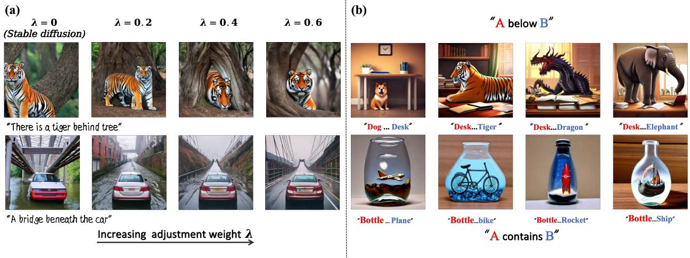
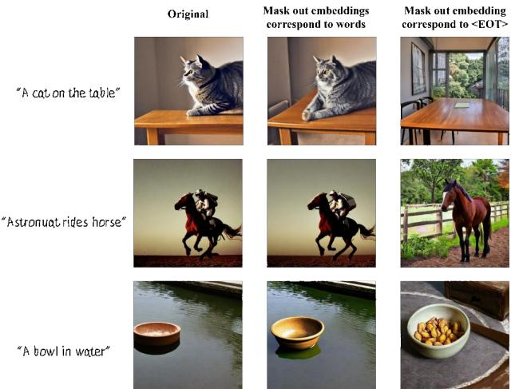
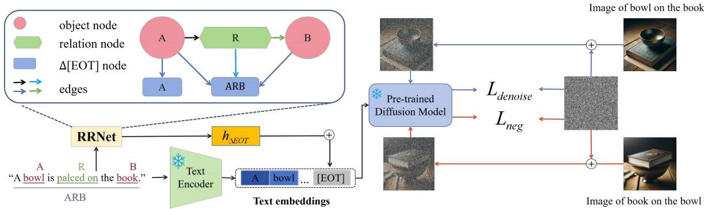
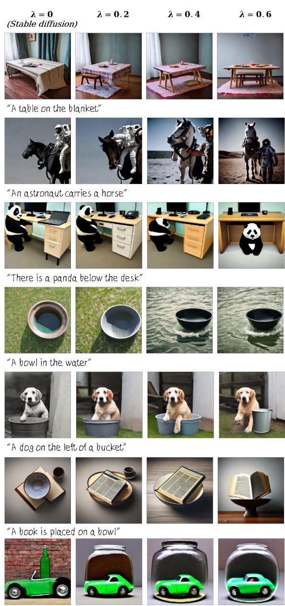
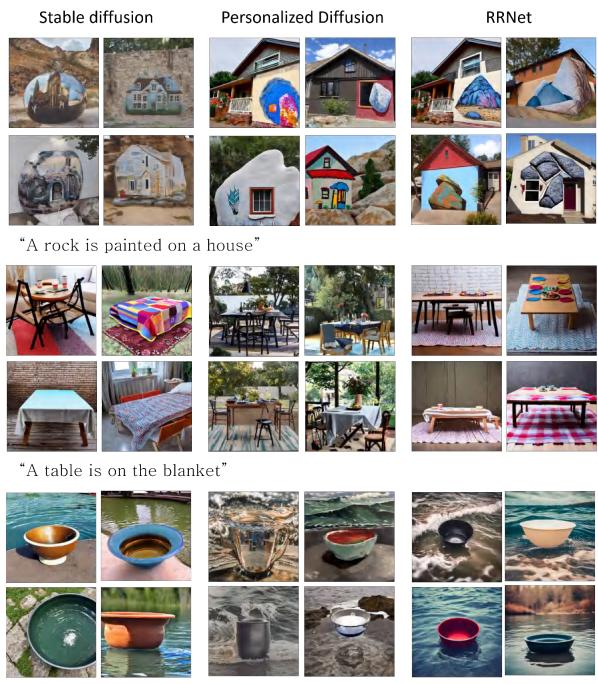
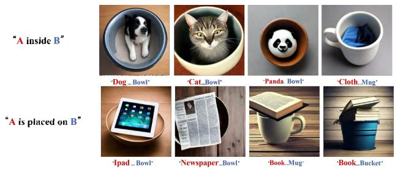
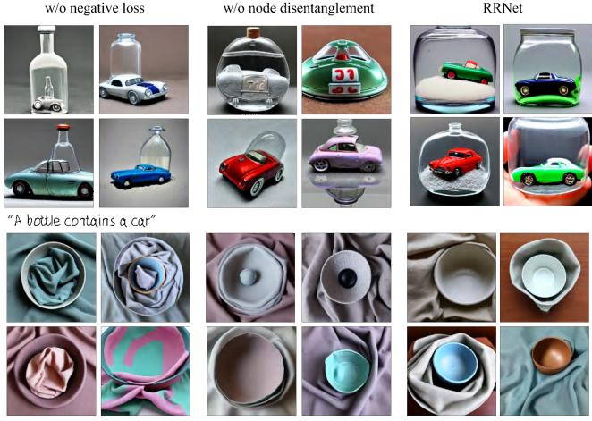

# Relation Rectification in Diffusion Model

Yinwei Wu Xingyi Yang Xinchao Wang\* National University of Singapore wuyinwei@u.nus.edu, xyang@u.nus.edu, xinchao@nus.edu.sg

  
Figure 1. Results Visualization of Relation Rectification. (a) Our approach enables diffusion model to successfully generate images with the correct directional relation in response to the textual prompt, which they originally failed. (b) Our method can synthesize relation of diverse and unseen objects in zero-shot manner.

## Abstract

Despite their exceptional generative abilities, large T2I diffusion models, much like skilled but careless artists, often struggle with accurately depicting visual relationships between objects. This issue, as we uncover through careful analysis, arises from a misaligned text encoder that struggles to interpret specific relationships and differentiate the logical order of associated objects. To resolve this, we introduce a novel task termed Relation Rectification, aiming to refine the model to accurately represent a given relationship it initially fails to generate. To address this, we propose an innovative solution utilizing a Heterogeneous Graph Convolutional Network (HGCN). It models the directional relationships between relation terms and corresponding objects within the input prompts. Specifically, we optimize the HGCN on a pair of prompts with identical relational words but reversed object orders, supplemented by a few reference images. The lightweight HGCN adjusts the text embeddings generated by the text encoder, ensur-

ing accurate reflection of the textual relation in the embedding space. Crucially, our method retains the parameters ofthe text encoder and diffusion model, preserving the model’s robust performance on unrelated descriptions. We validated our approach on a newly curated dataset of diverse relational data, demonstrating both quantitative and qualitative enhancements in generating images with precise visual relations. Project page: https://wuyinweihah.github.io/rrnet.github.io/ .

## 1. Introduction

Diffusion-based text-to-image (T2I) models [14, 32] have set new benchmarks in the synthesis of images from textual descriptions, achieving remarkable fidelity and detail. Nevertheless, a nontrivial gap persists in their ability to interpret and visually articulate the interacting objects within a given prompt, especially when the description includes directional or relational terms. For instance, a prompt such as “a book is placed on a bowl” frequently leads to a visual representation where the intended directionality of the interaction is misconstrued, resulting in scene akin to “a bowl is placed on a book”. This indicates a crucial limitation in the model’s relational understanding, a pivotal aspect of cognitive comprehension that remains to be fully integrated into the generated images.

The problem of relation mis-interpretion is not unique to diffusion models; indeed, it is endemic to the broader class of Vision-Language Models (VLMs) [50]. The crux of this issue stems from the standard contrastive or maskfilling training of VLMs [12, 17, 41], which prioritize global semantics but fails to capture correct relationships between objects. Consequently, these models, especially diffusion-based T2I models, often understand texts as “Bagof words” [50], neglecting the compositional semantics necessary for accurate image generation.

In response, some researchers have incorporated auxiliary input, such as canvas layouts, to guide image synthesis [47, 52]. However, such interventions circumvent rather than resolve the primary limitation: the text encoder’s inadequate response to the directionality of textual relations. Addressing this fundamental issue remains a pivotal concern for advancing the field.

To address the issue, we introduce a new task named Relation Rectification. Given a pair of prompts that describe the same relation but with the positions of the objects reversed (for instance, “The bowl is inside the cloth” vs. “The cloth is inside the bowl”), termed object-swapped prompts (OSPs). The task aims to allow the model to give different responses to OSPs according to the differences in object relationships, rather than simplifying prompts to just ”Bags-of-words”.

Upon investigating the inner workings of the diffusion model, we found that the embedding of the special token [EOT], signifying the end of text, plays a pivotal role inguiding the generation of relationships. We further identified a critical issue: the embeddings of [EOT] generated from OSPs are nearly identical, rendering the directionality of the relations indistinguishable.

To address this, we introduce RRNet, a novel framework designed to augment the relation understanding of diffusion models like Stable Diffusion (SD). The essence of RRNet is to explicitly encode the directional aspect of relationships within a sentence. Specifically, we conceptualize OSPs as pairs of directed heterogeneous graphs. To process these graphs, we utilize a Heterogeneous Graph Convolutional Network (HGCN), which generates adjustment vectors to distinctly separate the [EOT] embeddings of OSPs. During training, we update the lightweight HGCN only, while maintaining the parameters of SD to be fixed.

To evaluate the efficacy of our approach, we compiled Relation Rectification Benchmark, a new dataset for evaluation and rigorously test RRNet across a spectrum of relationships. The experimental results indicate that despite a minor decrease in image fidelity, RRNet enhances the accuracy of SD’s relationship generation by up to 25Additionally, our method significantly enhances interpretability, clearly depicting the directional transitions in relationships. Furthermore, RRNet demonstrates robust generalization capabilities, effectively handling even unseen objects in the dataset. This comprehensive testing underscores RRNet’s potential in improving relationship interpretation in image generation tasks.

Our contributions are summarized as belows:

• We introduce the novel task of Relation Rectification, focused on enhancing SD’s capability to accurately generate images that reflect the directional relationships outlined in text prompts.

• We identify that the primary limitation of vanilla SD in relation rectification arises from the indistinguishable text embeddings of OSPs.

• We proposed RRNet, a HGCN based model that designed to aid SD in accurately generating images with directional relationships. Our approach requires only the training of a lightweight HGCN, and can effectively address the task of relation rectification.

• We contribute the Relation Rectification Benchmark, serving as a valuable evaluation tool for assessing the effectiveness of relation rectification methods.

## 2. Related work

Diffusion Models. Diffusion models [5, 6, 14, 32, 45] view image generation as process of gradual denoising from isotropic noise. Recent advances have seen diffusion-based models reach the forefront in the field of T2I generation [10, 33, 35, 37, 39, 48]. Notably, the Stable Diffusion (SD) [37] operates by denoising within the latent space, conditioned on the text embeddings from pre-trained text encoders [34]. However, text embeddings generated from sentences that contain directional relations are often inaccurate, leading to difficulties for SD in accurately generating the relationships. Our method corrects these inaccurate embeddings. By doing so, it allows SD to more accurately capture relationship within text, leading to better image quality.

Personalized Diffusion. Personalized diffusion focuses on creating images that align with specific, personalized visual concepts [8, 18, 23, 38] by tuning the general-purpose diffusion model. Leveraging off-the-shelf model tuning techniques [15, 16, 49], it modifies aspects such as text embeddings or attention patterns within the diffusion process. These modifications guide the diffusion to achieve a customized image generation. Unlike other methods that concentrate on generating particular visual content, we focus on improving the model’s ability to generate precise visual relationships by adjusting the embeddings.

Vision-Language Models. Vision-Language Models (VLMs) [19, 24, 34] aim to learn a unified cross-modality representation space between image and text by pre-training on a large number of image-text pairs. For example, CLIP [34] learned text-image shared representations by using contrast learning on large-scale image-text pairs. However, recent work [50] suggests that the contrastive objective used to train CLIP does not explicitly encourage it to learn sentence order information, leading to CLIP’s tendency to interpret sentences as Bags-of-Words. Our work not only identifies the impact of this characteristic on T2I diffusion models which using CLIP as a text encoder, but also proposes an effective solution to mitigate the negative effects it introduces.

Compositional Image Generation. Compositional Image Generation aims to enable generative models to generate images from prompts that describe the composition of certain concepts. Composable Diffusion [29] utilizes multiple diffusion models to control the generation of different concepts, thereby achieving precise object positioning. GLi-GEN [26] and ControlNet [52] guide compositional generation by providing additional multimodal conditions for training. Another branch of works [2, 3, 7, 47] modify the cross-attention layout within the diffusion model to control object generation positions in a training-free manner. However, previous research primarily examines simple [9] spatial relationships. Our work delves into more intricate spatial and action-based relationships.

Graph Convolutional Network. Graphs differ fundamentally from image and text data. They comprise nodes and edges, with edges representing the relationships between nodes. Recent advancements in Graph Convolutional Networks (GCNs) [11, 22, 30] have significantly improved graph learning tasks. GCNs have been successfully applied in diverse domains [20, 25, 36, 46]. Heterogeneous graphs represent a distinct category of graphs, and they are capable of depicting various types of nodes and their interrelations. To manage this particular type of graph, Heterogeneous GCNs (HGCN) [44, 51] are proposed. More specifically, HGCNs adopt various functions to handle information emanating from various types of nodes. In our work, we introduce HGCN to tackle the challenge posed by the text encoder of SD, specifically its insensitivity to the directional relations within sentences.

## 3. Approach

## 3.1. Preliminaries

Text-to-Image Diffusion Models and its Text Encoder. We apply our method over a pretrained T2I SD. Given an initial Gaussian noise $z \sim \mathcal { N } ( 0 , I )$ and a textual prompt y,

  
Figure 2. Effect of masking out text embeddings corresponding to different tokens. We found that masking out the embedding of [EOT] dramatically destroy the semantic of generated images, including relationships, whereas masking out the embeddings corresponds to words results in only marginal changes.

the SD can generate an image that matches the prompt by stepwise denoising. The SD is trained by minimizing LDM loss as follows:

$$
\mathcal { L } _ { L D M } = \mathbb { E } _ { z \sim \mathcal { N } ( 0 , I ) , y , t } [ | | \epsilon - \epsilon _ { \theta } \bigl ( z _ { t } , t , c ( y ) \bigr ) | | _ { 2 } ^ { 2 } ] ,\tag{1}
$$

where the $\epsilon _ { \theta }$ is parameterized as a U-Net. At each timestep $t ,$ the denoising network $\epsilon _ { \theta }$ aims at predicting the noise ϵ added to the latent code. The textual prompt y that describes the final image content guides the denoising process. Before provided to the SD, the prompt is encoded by a text encoder $c ,$ to produce text embeddings $c ( y ) \in \mathbb { R } ^ { K \times d }$ , where K represents the number of tokens and d the token embedding dimension. Typically, the text embeddings $c ( y )$ generated by c have a length K of 77. In addition to embeddings representing each word in $y ,$ embeddings of special tokens are also included. Notably, the special token [EOT] marks the end of Text, and its embedding (denoted as $V _ { e o t } )$ is used to represent semantic information for the entire sentence during the contrast learning of c.

Key Finding: $V _ { e o t }$ controls the relation. In addressing our specific problem, we identified that the $V _ { e o t }$ vector plays a pivotal role in controlling the relationships and semantics in generated images. Our experiments, as shown in Figure 2, revealed a critical observation: when $V _ { e o t }$ is masked out, SD struggles to generate images that accurately depict valid relationships. This finding underscores the heavy reliance of SD on $V _ { e o t }$ for relation generation. We hypothesize that this is due to $V _ { e o t }$ accumulating rich semantics from other tokens, including both object and relational information, thereby serving as a crucial component in relationship generation. Further, we observed that the $V _ { e o t }$ vectors of OSPs have a cosine similarity close to 1, indicating they are nearly indistinguishable to SD.

Based on these findings, we plan to differentiate the $V _ { e o t }$ vectors of OSPs to enhance SD’s relationship generation accuracy.

Graph Convolutional Network. GCN excels in processing graph data, A graph can be defined as a tuple of $G = ( \nu , \mathcal { E } )$ V represents for nodes set and E is the edges set. For the directed graph used in our work, each directed edge $e _ { i , j } \in \mathcal { E }$ connects node $v _ { i }$ to node $v _ { j }$

GCN updates a node’s representation by aggregating information from its neighbors. For a GCN comprising $L$ convolutional layers, the update formula for the node representation of the l th layer can be expressed as follows:

$$
h _ { i } ^ { ( l + 1 ) } = \sigma ( b ^ { ( l ) } + \sum _ { j : ( e _ { j , i } ) \in \mathcal { E } } \alpha _ { j , i } h _ { j } ^ { ( l ) } W ^ { ( l ) } ) ,\tag{2}
$$

where $\it { h ^ { ( l ) } }$ is the representation of the node at layer l. $\alpha _ { j , i }$ denotes the edge weight. W and b are learnable parameters and σ is the activation function.

To differentiate the $V _ { e o t }$ of OSPs, we use graphs to represent the directions of the relations in sentences. Our approach utilizes a heterogeneous graph to model diverse information as different node types. Objects and relations are distinct node types, $\nu _ { O } , \nu _ { R } \in \nu$ . Their information will be aggregated into $\nu _ { \Delta E O T }$ , which is responsible for learning adjustment vectors to separate the $V _ { e o t }$ of OSPs.

In our HGCN, the weight matrix W varies by node types, allowing specific aggregation for each information type.

## 3.2. Problem Definition

In our paper, we define relation rectification as the task of enabling T2I SD to generate images that more accurately represent the described relationships of OSPs. For a prompts y contains directional relationship, we aim to adjust its text embeddings $c ( y )$ using an additional model $\phi$ such that:

$$
\arg \operatorname* { m a x } _ { \phi } P ( x | \phi ( c ( y ) ) ) - P ( \widetilde { x } | \phi ( c ( y ) ) )\tag{3}
$$

where $P$ is the generating distribution of ${ \mathrm { S D } } ,$ and x and $\widetilde { x }$ are two sets of images describe by y and its object-swapped counterpart ${ \widetilde { y } } .$ Achieving this objective requires two key criteria:

C1. The text embeddings of OSPs must be distinguishable after adjustment.

C2. The adjusted embeddings should remain valid for SD’s input domain, effectively guiding the generation of the correct relational direction.

As such, we give our solution to each criterion.

Solution to C1. We introduce the Relation Rectification Net (RRNet), which conceptualizes OSPs as heterogeneous graphs to capture the directional relations. RRNet uses these graphs to produce adjustment vectors that separate the embeddings of OSPs. We discuss RRNet in Sec 3.2.1.

Solution to C2. We utilize SD’s capability to understand visual semantics, guiding RRNet to create effective adjustment vectors. By analyzing example images corresponding to OSPs, SD discerns various relational directions, imparting this knowledge to RRNet for modifying text embeddings. More details are discussed in Sec 3.2.2.

## 3.2.1 Relation Rectification Net

As we have identified, the relationship information for SD is predominantly encoded within the $V _ { e o t }$ . To effectively rectify and optimize this vector for accurate relation generation, we’ve developed a model that incorporates a HGCN. This HGCN is specifically engineered to process heterogeneous graphs derived from OSPs, subsequently outputting adjustment vectors that refine the $V _ { e o t }$

Heterogeneous Graph Construction. A pair of OSPs contain objects $A , B$ and a relationship R conceptualized as two distinct triplets: $< A , R , B > \mathrm { a n d } < B , R , A >$ . It is important to note that $< A , R , B > \neq < B , R , A >$ due to the directional nature of R. These triplets are directly modeled as directed graphs, for example $< A , R , B > \cos { \mathfrak { a } }$ a graph with directed edges $A  R$ and $R  B ,$

Considering the different semantics of object and relation nodes, we employ heterogeneous graphs. Here, objects and relations are represented as two distinct node types, $v _ { r } \in \mathcal { V } _ { R }$ for relations and and $v _ { o } \in \mathcal { V } _ { O }$ for objects.

In addition to $\gamma _ { R }$ and $\nu _ { O }$ , a third kind of nodes, $\gamma _ { \Delta E O T } ,$ is utilized to learn the adjustment vector $h _ { \Delta E O T }$ The learned $h _ { \Delta E O T }$ will be used to adjust the relation direction information in original $V _ { e o t }$ of OSPs.

Relation Adjustment. With the graph topology established, we initiate the node representations. For object nodes $\nu _ { O }$ and relation nodes $\gamma _ { R }$ , we employ CLIP’s word embeddings, rich in semantic content, as their initial representations. Node $\nu _ { \Delta E O T }$ is initialized randomly.

In the HGCN layers, the information from $\nu _ { O }$ and $\gamma _ { R }$ aggregates into $\nu _ { \Delta E O T }$ along edges. The update formula for $\nu _ { \Delta E O T }$ is:

$$
h _ { \Delta E O T } ^ { ( l + 1 ) } = \sum _ { \varepsilon \in \hat { \varepsilon } } \sigma ( b ^ { ( l ) } + \sum _ { j : ( e _ { j , i } ) \in \mathcal { E } } \alpha _ { j , i } h _ { j } ^ { ( l ) } W _ { \varepsilon } ^ { ( l ) } ) ,\tag{4}
$$

where $\hat { \mathcal { E } }$ is the set of all edge types, and $W _ { \mathcal { E } } ^ { ( l ) }$ denotes the weight of the edge of type $\mathcal { E } .$ After several convolution layers, relation direction and node representations of $A , R$ and B merge into $\mathcal { V } _ { \Delta E O T }$ . As illustrated in the bottom left part of Figure 3, the final adjusted $\stackrel { * } { V _ { e o t } }$ is obtain via:

$$
V _ { e o t } ^ { ' } = V _ { e o t } + \lambda \cdot h _ { \Delta E O T } ^ { ( L ) } ,\tag{5}
$$

  
Figure 3. Our RRNet Architecture. Given OSPs and their exemplar images, the RRNet learns to produce adjustment vectors ${ h } _ { \Delta E O T } ^ { ( L ) } ,$ which will then be added on original $V _ { e o t }$ of the prompts. The rectified embeddings then will used as the condition to guidance the generation process of a frozen SD. The upper left part is the heterogeneous graph RRNet uses to model the relation direction. Upon optimization with negative loss and denoising loss, the SD will be able to generate images with correct relation direction.

here the $\lambda \in [ 0 , 1 ]$ moderates the adjustment strength. By adjusting the value of $\lambda ,$ a trade-off between image quality and relation generation accuracy can be made. This additive operation is inspired by previous works [4, 42] on concept algebraic in VLMs’ embedding space.

Object Node Disentanglement. Our objective extends beyond just memorizing relationships; we aim to separate the features of individual objects, represented by nodes A and B, from the relationship R. This separation is essential to prevent the blending of object features with relations.

To achieve this, as depicted in Figure 3, RRNet includes a dedicated node, $v _ { \Delta E O T } ^ { A } \in \mathcal { V } _ { \Delta E O T }$ for object A. $V _ { e o t } ^ { A }$ is extracted from template sentence “This is a photo of $\{ \mathtt { A } \} ^ { * }$ . We aim to preserve A ’s accurate semantic in $V _ { e o t } ^ { A }$ after applying the adjustments through equation 5 with $h _ { \Delta E O T } ^ { \bar { A } }$ . The $h _ { \Delta E O T } ^ { A }$ is obtained from the final layer representation of $v _ { \Delta E O T } ^ { A } ,$ , as depicted in equation 4. This method ensures the disentanglement of node A from node B and relation R.

However, since $V _ { e o t } ^ { A }$ already aligns closely with object $A \ ' \mathrm { s }$ semantic and might not require adjustment, $h _ { \Delta E O T } ^ { A }$ could potentially learn a trivial solution, such as zero. To prevent this, we add Gaussian noise to $V _ { e o t } ^ { A } ,$ so that the $h _ { \Delta E O T } ^ { A }$ is forced to learning a valid semantic vector.

For the disentanglement of object B, owing to the concurrent training of RRNet $\mathrm { f r o m } ~ < ~ A , R , B ~ >$ and $<$ $B , R , A >$ directions, when training in the $< B , R , A >$ direction, B is also disentangled

## 3.2.2 Relation Compelling Losses

In our study, we have developed a relation compelling loss, consisting of both positive and negative components, tailored to enhance SD’s interpretation of relationships.

Positive Loss. Our goal is to guide SD in identifying text embeddings that generate images with specific relationship

semantics, as outlined in equation 3. To achieve this, we directly utilize the denoising loss as below:

$$
\mathcal { L } _ { d e n o i s e } = \mathbb { E } _ { z \sim \mathcal { N } ( 0 , I ) , y , t } [ | | \epsilon - \epsilon _ { \theta } ( x _ { t } , t , \phi ( c ( y ) ) ) | | _ { 2 } ^ { 2 } ] ,\tag{6}
$$

where $\phi$ is the RRNet, and $\phi ( c ( y ) ) )$ adjusts the text embeddings of prompt y. The $x _ { t }$ are exemplar images corresponding to y. Through $\mathcal { L } _ { d e n o i s e }$ , RRNet learns to generate adjustment vectors that align text embeddings of $y$ with the relation semantics in the exemplar images.

Negative Loss. Solely relying on $\mathcal { L } _ { d e n o i s e }$ risks the model focusing on superficial features such as image background, rather than the desired relations. To address this and ensure $V _ { e o t }$ separation in OSPs, we introduce a negative loss:

$$
\mathcal { L } _ { n e g } = \mathbb { E } _ { z \sim \mathcal { N } ( 0 , I ) , \widetilde { y } , t } [ - | | \epsilon - \epsilon _ { \theta } ( x _ { t } , t , \phi ( c ( \widetilde { y } ) ) ) | | _ { 2 } ^ { 2 } ] ,\tag{7}
$$

where $\widetilde { y }$ is the OSP counterpart of $y .$

The final loss becomes:

$$
\mathcal { L } = \eta \cdot \mathcal { L } _ { d e n o i s e } + \xi \cdot \mathcal { L } _ { n e g }\tag{8}
$$

here, the $\eta$ and $\xi$ ere hyperparameters balancing the two losses. Intuitively, $\mathcal { L } _ { d e n o i s e }$ helps RRNet in discerning relation semantics, while $L _ { n e g }$ mitigates unintended semantics, aiding in separating $V _ { e o t }$ of OSPs.

During training, for each OSP pair represented as $<$ $A , R , B \ > \ \mathrm { a n d } \ < \ B , R , A \ > ,$ our dataset includes four types of image-text pairs: two types for the original OSPs and two for disentangling the object node features. The computation of loss for each image-text pair involves the incorporation of the other three pairs using Equation 8.

Once trained, RRNet is capable of generating adjustment vectors that effectively separate the $V _ { e o t }$ of OSPs, thus enhancing SD’s precision in relationship generation.

## 4. Experiment

## 4.1. Experimental Setup

Dataset. For a comprehensive benchmarking, we compiled a dataset with 21 relationships, split into 8 positional (like below, on the left) and 13 action (such as touch, follow) types. Each includes a pair of object-swapped prompts (OSPs) and corresponding images. We generated 100 images per prompt, totaling 4200 images, to rigorously assess the accuracy of relation generation. For detailed dataset statistics, please refer to Appendix D.

Implementation Details. We train RRNet on Stable Diffusion 2-1 for 100 epochs. During training, λ in Equation 5 is set to 1. For the loss in Equation 8, we found that setting the weight η of denoising loss to 10 and weight ξ for negative loss to 2 works well for most cases. Training for each relationship only takes about 20 minutes on 1 NVIDIA V100 GPU.

During generation, the weight λ can be set within [0, 1]. In our experiments, we assess the generation outcomes using various values of λ. For the denoising process, we use the PNDM scheduler [21] and adopt 30 steps. The classifier-free guidance is applied for better image quality. Baselines. In the absence of existing approaches designed to generate correct relations, we established our own baselines. The first baseline is SD itself. Additionally, we compare our method with personalized diffusion models [8, 23, 38], where we optimize the CLIP text encoder within the SD model. To ensure a fair comparison, we optimize the text encoder using the same loss function that is applied in these personalized diffusion methods. More comparative experiments are provided in the Appendix A. Evaluation Metrics. We report two evaluation metrics

• Relationship Generation Accuracy. To evaluate the accuracy of relationship generation, we employ vision-language chatbots proficient in image semantics, specifically Qwen-VL-Chat [1] and LLaVA [28]. The evaluation approach involves: (1) Using a sentence representing triplet <A, R, B> and a corresponding image as a prompt. (2) Verifying the presence of entities A and B in the image. (3) Guiding the chatbots to determine the relationship between A and B. (4) Having the chatbots choose the most plausible relationship from <A, R, B> , <B, R, A> , or Neither .

In steps (1) and (2) described above, chatbots perform the task of detecting object generation, from which we derive the Object Generation Accuracy (OGA). This metric is used to assess the accuracy of entity generation.

• Frechet Inception Distance (FID) ´ . FID [13] is used to evaluate the quality of generated images. It can mea-

  
"A bottle contains a car"

Figure 4. Qualitative Results. By increasing the weight λ of the adjustment vector, we show the process of correcting relation direction in the generated images that were originally incorrect.

sure the feature similarity between generated and real images via a pre-trained inception model [40]. We caculate the FID score between 4,200 generated images and all images from validation set of COCO [27].

"A bowl is in the water"

<table><tr><td>Method</td><td>Position(Qwen)↑</td><td>Position(LLaVA)↑</td><td>Action(Qwen) ↑</td><td>Action(LLaVA)↑</td><td>OGA↑</td><td>FID↓</td></tr><tr><td>RR Dataset</td><td>0.849</td><td>0.763</td><td>0.616</td><td>0.652</td><td>1.000</td><td>N/A</td></tr><tr><td>Stable Diffusion</td><td>0.467</td><td>0.542</td><td>0.399</td><td>0.543</td><td>0.898</td><td>83.73</td></tr><tr><td>Personalized Diffusion</td><td>0.509</td><td>0.558</td><td>0.273</td><td>0.518</td><td>0.844</td><td>91.93</td></tr><tr><td>RRNet (λ=0.2)</td><td>0.564</td><td>0.597</td><td>0.469</td><td>0.565</td><td>0.937</td><td>89.13</td></tr><tr><td>RRNet (λ=0.4)</td><td>0.646</td><td>0.648</td><td>0.492</td><td>0.603</td><td>0.964</td><td>94.73</td></tr><tr><td>RRNet (λ=0.6)</td><td>0.697</td><td>0.684</td><td>0.500</td><td>0.632</td><td>0.970</td><td>100.78</td></tr><tr><td>RRNet (λ=1)</td><td>0.729</td><td>0.724</td><td>0.490</td><td>0.651</td><td>0.971</td><td>110.01</td></tr></table>

Table 1. Quantitative Results of Positional Relation Generation. We evaluate the generation accuracy through Qwen-VL-Chat and LLaVA chatbots, and the generated image quality is evaluated via FID. The Position and Action represent for evaluation on positional relationships part and action relationships part of the dataset, respectively. Object generation accuracy (OGA) is the average calculated from all position and action relations.

  
Figure 5. Qualitative Comparisons. Our method outperforms the baselines in terms of the relationship generation.

## 4.2. Comparisons

Quantitative analysis. Table 1 presents the quantitative results on positional and action relationships generation. Our method obtains a better relationship generation accuracy and object generation accuracy compared to baselines. By increasing the adjustment weight λ in equation 5, the RR-Net can achieve a higher generation accuracy.

However, it can be observed that a larger λ could also leads to a larger FID score, indicating lower image fidelity. To balance relationship generation accuracy and image diversity, we discovered that setting λ between 0.4 and 0.6 significantly improves relationship accuracy while preserv-

ing image quality.

Qualitative analysis. Figure 4 and Figure 1(a) illustrate the interpretability of our adjustment vector approach. As λ increases, the generated images progressively shift to the correct relationship direction. For example, the second row of Figure 4 shows an astronaut transitioning from riding a horse (λ = 0) to eventually leading the horse $( \lambda = 0 . 6 )$ This progression visually illustrates the transition of relationships towards the correct direction, demonstrating RR-Net’s capability in rectifying relations.

In Figure 5, we compare our method against baselines. Original SD generations often mix relationship directions, failing to distinguish them accurately. The personalized diffusion approach, Personalized diffusion, while learning the relationship, often alters object semantics. As observed in the bottom row, it successfully learns the meaning of “In water”, but sacrifices the meaning of “A bowl”, which in turn incorrectly generates cup and bucket similar to bowl. Our approach, in contrast, correctly portrays relationship directions and maintains the objects’ original meanings in the generated images.

## 4.3. User Study

Setup. We conducted a user study with 63 evaluators to evaluate relationship generation accuracy. Ten relationships were chosen from our dataset, with images generated by RRNet and baselines. For each, evaluators selected the image that best depicted the described relationship from two randomly chosen images per method.

Results. The outcomes of this user study are detailed in Table 3. We observe that the generation of RRNet are more favored by evaluators, with an absolute improvement of 68.1% on personalized diffusion and 58.58% on SD.

## 4.4. Generalization to Unseen Objects

In our framework, for each set of OSPs, the RRNet is trained with images contains only one pair of objects. It is normal to wonder if the trained RRNet can generalize well

"A bowl inside the cloth"

<table><tr><td>Method</td><td>Position(Qwen) ↑</td><td>Position(LLaVA)↑</td><td>Action(Qwen) ↑</td><td>Action(LLaVA)↑</td><td>OGA↑</td></tr><tr><td>RRNet</td><td>0.697</td><td>0.684</td><td>0.500</td><td>0.632</td><td>0.970</td></tr><tr><td>w/o HGCN</td><td>0.509</td><td>0.558</td><td>0.273</td><td>0.518</td><td>0.844</td></tr><tr><td>w/o negative loss</td><td>0.534</td><td>0.633</td><td>0.451</td><td>0.555</td><td>0.949</td></tr><tr><td>w/o node disentanglement</td><td>0.543</td><td>0.635</td><td>0.426</td><td>0.535</td><td>0.938</td></tr></table>

Table 2. Quantitative Results of Variants of RRNet.

<table><tr><td>Method</td><td>User Preference Rate ↑</td></tr><tr><td>Stable Diffusion</td><td>16.98%</td></tr><tr><td>Personalized Diffusion</td><td>7.46%</td></tr><tr><td>RRNet (λ=0.6)</td><td>75.56%</td></tr></table>

Table 3. Results of User Study. The result shows the percentage of evaluators prefer the image produced by RRNet verse baselines.

  
Figure 6. Example of Generalization. By switching the objects in the prompts, RRNet can still generate correct relationships.

to the unseen objects.

As shown in Figure 6 and Figure 1(b), by constructing new graphs, RRNet demonstrates its ability to handle many objects unseen in the training dataset.

## 4.5. Ablation Study

Here, we demonstrate the importance of our three designs, 1) HGCN 2) negative loss, and 3) object node disentanglement. For a fair comparison, we kept the training hyperparameters the same and set λ=0.6 during image generation.

HGCN. Excluding the HGCN, which accounts for graph structure, RRNet reverts to a basic personalized diffusion model. This scenario has been analyzed and compared in Table 5. The results indicate that the construction of relational graphs is crucial for effective relation modeling in RRNet.

Negative loss. As depicted in Figure 7, the absence of negative loss leads to generated images that somewhat conform to both relational directions. For instance, in the upper row, images of “A bottle contains a car, and a car contains a bottle” are generated. Meanwhile, as can be seen from Table 2, without negative loss, the performance of the model decreases a lot.

  
Figure 7. Ablation Results.

Object node disentanglement. Omitting this component leads to the blending of semantics of nodes representing different objects. As shown in Figure 7, this results in generated images with merged features, such as a bottle with car-like traits or a bowl resembling cloth. Quantitative results in Table 2 further show reduced accuracy in generating both relationships and objects.

## 5. Conclusion

We presented a novel framework, named RRNet, to enhance the ability of diffusion models in generating images with more accurate relation directions. The key of our approach is to employ a HGCN to explicitly model the relational direction present in the prompts. RRNet will produce an adjustment vector to rectify the direction of the relations in the text embeddings that are provided to SD. We experimentally demonstrate the interpretability as well as the robust performance of our approach.

## Acknowledgements

This research is supported by the Ministry of Education, Singapore, under its Academic Research Fund Tier 2 (Award Number: MOE-T2EP20122-0006).

## References

[1] Jinze Bai, Shuai Bai, Shusheng Yang, Shijie Wang, Sinan Tan, Peng Wang, Junyang Lin, Chang Zhou, and Jingren Zhou. Qwen-vl: A versatile vision-language model for understanding, localization, text reading, and beyond. Sep 2023. 6

[2] Hila Chefer, Yuval Alaluf, Yael Vinker, Lior Wolf, and Daniel Cohen-Or. Attend-and-excite: Attention-based semantic guidance for text-to-image diffusion models. Jan 2023. 3

[3] Minghao Chen, Iro Laina, and Andrea Vedaldi. Training-free layout control with cross-attention guidance. Apr 2023. 3, 11

[4] Ching-Yao Chuang, Varun Jampani, Yuanzhen Li, Antonio Torralba, and Stefanie Jegelka. Debiasing vision-language models via biased prompts. Jan 2023. 5

[5] Prafulla Dhariwal and Alex Nichol. Diffusion models beat gans on image synthesis. Neural Information Processing Systems,Neural Information Processing Systems, Dec 2021. 2

[6] Chengbin Du, Yanxi Li, Zhongwei Qiu, and Chang Xu. Stable diffusion is unstable. Advances in Neural Information Processing Systems, 36, 2023. 2

[7] Weixi Feng, Xuehai He, Tsu-Jui Fu, Varun Jampani, Arjun Akula, Pradyumna Narayana, Sugato Basu, XinEric Wang, WilliamYang Wang, UcSanta Barbara, Santa Uc, Cruz Cruz, and Google Google. Training-free structured diffusion guidance for compositional text-to-image synthesis. 3

[8] Rinon Gal, Yuval Alaluf, Yuval Atzmon, Or Patashnik, AmitH Bermano, Gal Chechik, and Daniel Cohen-Or. An image is worth one word: Personalizing text-to-image generation using textual inversion. 2, 6, 11

[9] Tejas Gokhale, Hamid Palangi, Besmira Nushi, Vibhav Vineet, Eric Horvitz, Ece Kamar, Chitta Baral, and Yezhou Yang. Benchmarking spatial relationships in text-to-image generation. 3

[10] Shuyang Gu, Dong Chen, Jianmin Bao, Fang Wen, Bo Zhang, Dongdong Chen, Lu Yuan, and Baining Guo. Vector quantized diffusion model for text-to-image synthesis. In 2022 IEEE/CVF Conference on Computer Vision and Pattern Recognition (CVPR), Jun 2022. 2

[11] WilliamL. Hamilton, Zhitao Ying, and Jure Leskovec. Inductive representation learning on large graphs. Neural Information Processing Systems,Neural Information Processing Systems, Jun 2017. 3

[12] Roei Herzig, Alon Mendelson, Leonid Karlinsky, Assaf Arbelle, Rogerio Feris, Trevor Darrell, and Amir Globerson. Incorporating structured representations into pretrained vision & language models using scene graphs. May 2023. 2

[13] Martin Heusel, Hubert Ramsauer, Thomas Unterthiner, Bernhard Nessler, and Sepp Hochreiter. Gans trained by a two time-scale update rule converge to a local nash equilibrium. Neural Information Processing Systems,Neural Information Processing Systems, Jan 2017. 6

[14] Jonathan Ho, Ajay Jain, Pieter Abbeel, and UC Berkeley. Denoising diffusion probabilistic models. 1, 2

[15] Neil Houlsby, Andrei Giurgiu, Stanislaw Jastrzebski, Bruna Morrone, Quentin De Laroussilhe, Andrea Gesmundo, Mona Attariyan, and Sylvain Gelly. Parameter-efficient transfer learning for nlp. In International conference on machine learning, pages 2790–2799. PMLR, 2019. 2

[16] EdwardJ. Hu, Yelong Shen, Phillip Wallis, Zeyuan Allen-Zhu, Yuanzhi Li, Shean Wang, and Weizhu Chen. Lora: Low-rank adaptation of large language models. arXiv: Computation and Language,arXiv: Computation and Language, Jun 2021. 2, 11

[17] Yufeng Huang, Jiji Tang, Zhuo Chen, Rongsheng Zhang, Xinfeng Zhang, Weijie Chen, Zeng Zhao, Tangjie Lv, Zhipeng Hu, and Wen Zhang. Structure-clip: Enhance multimodal language representations with structure knowledge. arXiv preprint arXiv:2305.06152, 2023. 2

[18] Ziqi Huang, Tianxing Wu, Yuming Jiang, KelvinC.K. Chan, and Ziwei Liu. Reversion: Diffusion-based relation inversion from images. Mar 2023. 2

[19] Chao Jia, Yinfei Yang, Ye Xia, Yi-Ting Chen, Zarana Parekh, Hieu Pham, QuocV. Le, Yun-Hsuan Sung, Zhen Li, and Tom Duerig. Scaling up visual and vision-language representation learning with noisy text supervision. Cornell University - arXiv,Cornell University - arXiv, Feb 2021. 3

[20] Yongcheng Jing, Yining Mao, Yiding Yang, Yibing Zhan, Mingli Song, Xinchao Wang, and Dacheng Tao. Learning graph neural networks for image style transfer. Jul 2022. 3

[21] Tero Karras, Miika Aittala, Timo Aila, and Samuli Laine. Elucidating the design space of diffusion-based generative models. Advances in Neural Information Processing Systems, 35:26565–26577, 2022. 6

[22] Thomas Kipf and Max Welling. Semi-supervised classification with graph convolutional networks. arXiv: Learning,arXiv: Learning, Sep 2016. 3

[23] Nupur Kumari, Bingliang Zhang, Richard Zhang, Eli Shechtman, and Jun-Yan Zhu. Multi-concept customization of text-to-image diffusion. Dec 2022. 2, 6

[24] Junnan Li, Dongxu Li, Caiming Xiong, and Steven Hoi. Blip: Bootstrapping language-image pre-training for unified vision-language understanding and generation. 3

[25] Rui Li, Xin Yuan, Mohsen Radfar, Peter Marendy, Wei Ni, Terrence J. O’Brien, and Pablo Casillas-Espinosa. Graph signal processing, graph neural network and graph learning on biological data: A systematic review. IEEE Reviews in Biomedical Engineering, page 109–135, Jan 2023. 3

[26] Yuheng Li, Haotian Liu, Qingyang Wu, Fangzhou Mu, Jianwei Yang, Jianfeng Gao, Chunyuan Li, and YongJae Lee. Gligen: Open-set grounded text-to-image generation. Jan 2023. 3

[27] Tsung-Yi Lin, Michael Maire, Serge Belongie, James Hays, Pietro Perona, Deva Ramanan, Piotr Dollar, and C. Lawrence´ Zitnick. Microsoft COCO: Common Objects in Context, page 740–755. Jan 2014. 6

[28] Haotian Liu, Chunyuan Li, Qingyang Wu, YongJae Lee, Madison Madison, and Microsoft Research. Visual instruction tuning. 6

[29] Nan Liu, Shuang Li, Yilun Du, Antonio Torralba, and JoshuaB. Tenenbaum. Compositional visual generation with composable diffusion models. Jun 2022. 3

[30] Zhiyuan Liu and Jie Zhou. GRAPH ATTENTION NET-WORKS, page 39–41. Jan 2020. 3, 12

[31] Ilya Loshchilov and Frank Hutter. Decoupled weight decay regularization, 2019. 12

[32] Alex Nichol and Prafulla Dhariwal. Improved denoising diffusion probabilistic models. Cornell University - arXiv,Cornell University - arXiv, Feb 2021. 1, 2

[33] Alex Nichol, Prafulla Dhariwal, Aditya Ramesh, Pranav Shyam, Pamela Mishkin, Bob McGrew, Ilya Sutskever, and Mark Chen. Glide: Towards photorealistic image generation and editing with text-guided diffusion models. 2

[34] Alec Radford, JongWook Kim, Chris Hallacy, Aditya Ramesh, Gabriel Goh, Sandhini Agarwal, Girish Sastry, Amanda Askell, Pamela Mishkin, Jack Clark, Gretchen Krueger, and Ilya Sutskever. Learning transferable visual models from natural language supervision. Cornell University - arXiv,Cornell University - arXiv, Feb 2021. 2, 3

[35] Aditya Ramesh, Prafulla Dhariwal, Alex Nichol, Casey Chu, and Mark Chen. Hierarchical text-conditional image generation with clip latents. 2

[36] Alireza Rezvanian and Mohammad Reza Meybodi. Stochastic graph as a model for social networks. Computers in Human Behavior, 64:621–640, Nov 2016. 3

[37] Robin Rombach, Andreas Blattmann, Dominik Lorenz, Patrick Esser, and Bjorn Ommer. High-resolution image synthesis with latent diffusion models. In 2022 IEEE/CVF Conference on Computer Vision and Pattern Recognition (CVPR), Jun 2022. 2

[38] Nataniel Ruiz, Yuanzhen Li, Varun Jampani, Yael Pritch, Michael Rubinstein, and Kfir Aberman. Dreambooth: Fine tuning text-to-image diffusion models for subject-driven generation. Aug 2022. 2, 6

[39] Chitwan Saharia, William Chan, Saurabh Saxena, Lala Li, Jay Whang, Emily Denton, Seyed Kamyar, Seyed Ghasemipour, Burcu Karagol, SSara Mahdavi, RaphaGontijo Lopes, Tim Salimans, Jonathan Ho, DavidJ Fleet, and Mohammad Norouzi. Photorealistic text-to-image diffusion models with deep language understanding. 2

[40] Christian Szegedy, Vincent Vanhoucke, Sergey Ioffe, Jon Shlens, and Zbigniew Wojna. Rethinking the inception architecture for computer vision. In 2016 IEEE Conference on Computer Vision and Pattern Recognition (CVPR), Jun 2016. 6

[41] Tristan Thrush, Ryan Jiang, Max Bartolo, Amanpreet Singh, Adina Williams, Douwe Kiela, and Candace Ross. Winoground: Probing vision and language models for visiolinguistic compositionality. 2

[42] Matthew Trager, Pramuditha Perera, Luca Zancato, Alessandro Achille, Parminder Bhatia, and Stefano Soatto. Linear spaces of meanings: Compositional structures in visionlanguage models. Feb 2023. 5

[43] Minjie Wang, Da Zheng, Zihao Ye, Quan Gan, Mufei Li, Xiang Song, Jinjing Zhou, Chao Ma, Lingfan Yu, Yu Gai, Tianjun Xiao, Tong He, George Karypis, Jinyang Li, and Zheng Zhang. Deep graph library: A graph-centric, highly-performant package for graph neural networks. arXiv preprint arXiv:1909.01315, 2019. 12

[44] Xiao Wang, Houye Ji, Chuan Shi, Bai Wang, Yanfang Ye, Peng Cui, and Philip S Yu. Heterogeneous graph attention network. In The World Wide Web Conference, May 2019. 3

[45] Zhendong Wang, Yifan Jiang, Huangjie Zheng, Peihao Wang, Pengcheng He, Zhangyang Wang, Weizhu Chen, Mingyuan Zhou, et al. Patch diffusion: Faster and more dataefficient training of diffusion models. Advances in Neural Information Processing Systems, 36, 2024. 2

[46] Lingfei Wu, Yu Chen, Kai Shen, Xiaojie Guo, Hanning Gao, Shucheng Li, Jian Pei, and Bo Long. Graph neural networks for natural language processing: A survey., Jan 2023. 3

[47] Jinheng Xie, Yuexiang Li, Yawen Huang, Haozhe Liu, Wentian Zhang, Yefeng Zheng, and MikeZheng Shou. Boxdiff: Text-to-image synthesis with training-free box-constrained diffusion. Jul 2023. 2, 3

[48] Xingyi Yang, Daquan Zhou, Jiashi Feng, and Xinchao Wang. Diffusion probabilistic model made slim. In Proceedings of the IEEE/CVF Conference on Computer Vision and Pattern Recognition, pages 22552–22562, 2023. 2

[49] Xingyi Yang, Daquan Zhou, Songhua Liu, Jingwen Ye, and Xinchao Wang. Deep model reassembly. Advances in neural information processing systems, 35:25739–25753, 2022. 2

[50] Mert Yuksekgonul, Federico Bianchi, Pratyusha Kalluri, Dan Jurafsky, and James Zou. When and why visionlanguage models behave like bag-of-words models, and what to do about it? Oct 2022. 2, 3

[51] Chuxu Zhang, Dongjin Song, Chao Huang, Ananthram Swami, and Nitesh V. Chawla. Heterogeneous graph neural network. In Proceedings ofthe 25th ACM SIGKDD International Conference on Knowledge Discovery; Data Mining, Jul 2019. 3

[52] Lvmin Zhang and Maneesh Agrawala. Adding conditional control to text-to-image diffusion models. 2, 3