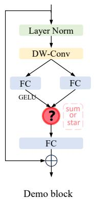
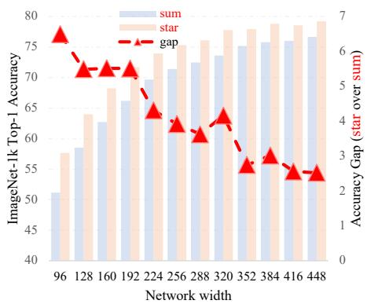
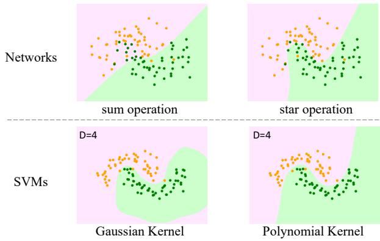
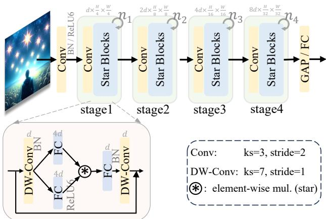
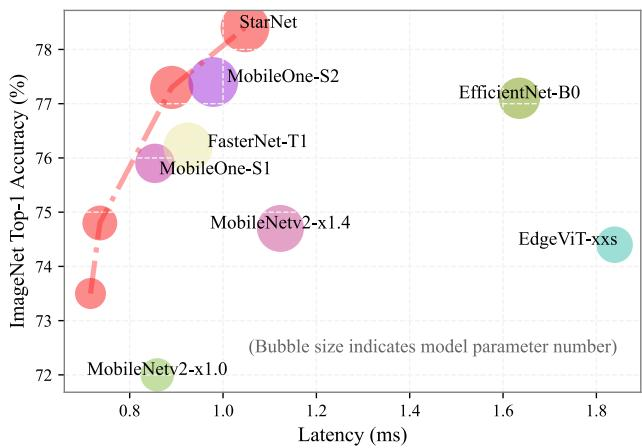

# Rewrite the Stars

Xu Ma1, Xiyang Dai2, Yue Bai1, Yizhou Wang1, Yun Fu1 1Northeastern University 2Microsoft

## Abstract

Recent studies have drawn attention to the untapped potential of the "star operation" (element-wise multiplication) in network design. While intuitive explanations abound, the foundational rationale behind its application remains largely unexplored. Our study attempts to reveal the star operation’s ability of mapping inputs into high-dimensional, non-linear feature spaces—akin to kernel tricks—without widening the network. We further introduce StarNet, a simple yet powerful prototype, demonstrating impressive performance and low latency under compact network structure and efficient budget. Like stars in the sky, the star operation appears unremarkable but holds a vast universe ofpotential. Our work encouragesfurther exploration across tasks, with codes available at https://github.com/ma-xu/Rewrite-the-Stars.

## 1. Introduction

The learning paradigms have imperceptibly and gradually evolved in the past decade. Since AlexNet [33], a myriad of deep networks [4, 23, 32, 37, 49] have emerged, each building on the other. Despite their characteristic insights and contributions, this line of models is mostly based on the blocks that blend linear projection (i.e., convolution and linear layers) with non-linear activations. Since [56], selfattention has dominated natural language processing, and later computer vision [14]. The most distinctive feature of self-attention is mapping features to different spaces and then constructing an attention matrix through dot-product multiplication. However, this implementation is not efficient, and results in the attention complexity scaling quadratically with the increase in the number of tokens.

Recently, a new learning paradigm has been gaining increased attention: fusing different subspace features through element-wise multiplication. We refer to this paradigm as ‘star operation’ for simplicity (owing to the element-wise multiplication symbol resembling a star). Star operation exhibits promising performance and efficiency across various research fields, including Natural Language Processing (i.e., Monarch Mixer [16], Mamba [17], Hyena Hierarchy [44],

  
Figure 1. Illustration of the advantage of the star operation (element-wise multiplication). The left side depicts a basic building block abstracted from related works [18, 45, 60], with “?" representing either ‘star’ or ‘summation.’ The right side highlights the notable performance disparity between the two operations, with ‘star’ exhibiting superior performance, particularly with a narrower width. Please check Sec. 3.4.1 for more results.

GLU [48], etc.), Computer Vision (i.e., FocalNet [60], Hor-Net [45], VAN [18], etc.), and more. For illustration, we construct a ‘demo block’ for image classification, as depicted on the left in Fig. 1. By stacking multiple demo blocks following a stem layer, we construct a straightforward model named DemoNet. Keeping all other factors constant, we observe that element-wise multiplication (star operation) consistently surpasses summation in performance, as illustrated on the right in Fig. 1. Although the star operation is remarkably simple, it raises the question: why does it deliver such gratifying results? In response to this, several assumptive explanations have been proposed. For instance, FocalNet [60] posits that star operations can act as modulation or gating mechanisms, dynamically altering input features. HorNet [45] suggests that the advantage lies in harnessing high-ordered features. Meanwhile, both VAN [18] and Monarch Mixer [16] attribute the effectiveness to convolutional attention. While these preliminary explanations provides some insights, they are largely based on intuition and assumptions, lacking comprehensive analysis and strong evidence. Consequently, the foundational rationale behind remain unexamined, posing a challenge to better understanding and effectively leveraging the star operations.

In this work, we explain the strong representative ability of star operation by explicitly demonstrating that: the star operation possesses the capability to map inputs into an exceedingly high-dimensional, non-linear feature space. Instead of relying on intuitive or assumptive high-level explanations, we delve deep into the details of star operations. By rewriting and reformulating star operations, we uncover that this seemingly simple operation can generate a new feature space comprising approximately $\scriptstyle \left( { \frac { d } { \sqrt { 2 } } } \right) ^ { 2 }$ linearly independent dimensions, as detailed in Sec. 3.1. The way star operation achieves such non-linear high dimensions is distinct from traditional neural networks that increase the network width (aka channel number). Rather, the star operation is analogous to kernel functions that conduct pairwise multiplication of features across distinct channels, particularly polynomial kernel functions [25, 47]. When incorporated into neural networks and with the stacking of multiple layers, each layer contributes to an exponential increase in the implicit dimensional complexity. With just a few layers, the star operation enables the attainment of nearly infinite dimensions within a compact feature space, as elaborated in Sec .3.2. Operating within a compact feature space while benefiting from implicit high dimensions, that is where the star operation captivates with its unique charm.

Drawing from the aforementioned insights, we infer that the star operation may inherently be more suited to efficient, compact networks as opposed to the conventionally used large models. To validate this, we introduce a proof of-concept efficient network, StarNet, characterized by its conciseness and efficiency. The detailed architecture of Star-Net can be found in Fig. 3. StarNet is notably straightforward, devoid of sophisticated designs and fine-tuned hyperparameters. In terms of design philosophy, StarNet clearly diverges from existing networks, as illustrated in Table 1. Capitalizing on the efficacy of the star operation, our StarNet can even surpasses various meticulously designed efficient models, like MobileNetv3 [27], EdgeViT [42], FasterNet [6], etc. For example, our StarNet-S4 outperforms EdgeViT-XS by 0.9% top-1 accuracy on ImageNet-1K validation set while running 3 faster on iPhone13 and CPU, and 2 faster on GPU. These results not only empirically validate our insights regarding the star operation but also underscore its practical value in real-world applications.

We succinctly summarize and emphasize the key contributions of this work as follows:

• Foremost, we demonstrated the effectiveness of star operations, as illustrated in Fig. 1. We unveiled that the star operation possesses the capability to project features into an exceedingly high-dimensional implicit feature space, akin to polynomial kernel functions, as detailed in Sec. 3.

• We validated our analysis through empirical results (refer Fig. 1, Table 2, and Table 3, etc.), theoretical exploration (in Sec. 3), and visual representation (see Fig. 2).

<table><tr><td>Main Insight</td><td>Networks</td></tr><tr><td>DW-Conv</td><td>MobileNetv2 [28, 46]</td></tr><tr><td>Feature Shuffle</td><td>ShuffleNet [65], ShuffleNetv2 [40]</td></tr><tr><td>Feature Re-use</td><td>GhostNet [19], FasterNet [6]</td></tr><tr><td>NAS</td><td>EfficientNet [50, 51], MnasNet [52]</td></tr><tr><td>Re-paramerization Hybrid Architecture</td><td>MobileOne [55], FasterViT [21]</td></tr><tr><td></td><td>Mobile-Former [9], EdgeViT [42]</td></tr><tr><td>Implicit high dimension</td><td> $\mathbf { S t a r N e t } _ { \mathrm { ( o u r s ) } }$ </td></tr></table>

Table 1. Taxonomy of prominent efficient networks based on their key insights. We introduce StarNet that is distinguished by exploring a novel approach: leveraging implicit high dimensions through star operations to enhance network efficiency.

• Drawing inspiration from our analysis, we identify the utility of the star operation in the realm of efficient networks and present a proof-of-concept model, StarNet. Remarkably, StarNet achieves promising performance without the need for intricate designs or meticulously selected hyperparameters, surpassing numerous efficient designs.

• It is noteworthy that there exists a multitude of unexplored possibilities based on the star operation, such as learning without activations and refining operations within implicit dimensions. We envision that our analysis can serve as a guiding framework, steering researchers away from haphazard network design attempts.

## 2. Related Work

Element-wise Multiplication in Neural Networks. Recent efforts have demonstrated that utilizing element-wise multiplication can be a more effective choice than summation in network design for feature aggregation, as exemplified by FocalNet [60], VAN [18], Conv2Former [26], HorNet [45], and more [35, 36, 58, 61]. To elucidate its superiority, intuitive explanations have been developed, in cluding modulation mechanism, high-order features, and the integration of convolutional attention, etc. Although many tentative explanations have been proposed and empirical im provements have been achieved, the foundational rationale behind has remained unexamined. In this work, we explicitly emphasize that the element-wise multiplication is crucial, regardless of trivial architectural modifications. It has the capacity to implicitly transform input features into exceptionally high and nonlinear dimensions in a novel manner, but operate in low-dimensional space.

High-Dimensional & Non-Linear Feature Transformation. The inclusion of high-dimensional and nonlinear features is crucial in both traditional machine learning algorithms [3, 20] and deep learning networks [33, 34, 49, 63]. This necessity stems from the intricate nature of real-world data and the inherent capacity of models to represent this complexity. Nevertheless, it is important to recognize that these two lines of approaches achieve this goal from different perspectives. In the era of deep learning, we typically start by linearly projecting low-dimensional features into a high-dimensional space and then introduce non-linearity using activation functions $( e . g . , \mathrm { R e L U } , \mathrm { G E L U } , e t c . )$ . In contrast, we can simultaneously attain high-dimensionality and non-linearity using kernel tricks [10, 47] in traditional machine learning algorithms. For instance, a polynomial kernel function $k \left( x _ { 1 } , x _ { 2 } \right) = \left( \gamma x _ { 1 } \cdot x _ { 2 } + c \right) ^ { d }$ can project the input feature $x _ { 1 } , x _ { 2 } \in \mathbb { R } ^ { n }$ into a $( n + 1 ) ^ { d }$ high-dimensional nonlinear feature space; a Gaussian kernel function $k \left( x _ { 1 } , x _ { 2 } \right) =$ $\begin{array} { r l r } {  { \exp ( - \| x _ { 1 } \| ^ { 2 } ) \exp ( - \| x _ { 2 } \| ^ { 2 } ) \sum _ { i = 0 } ^ { + \infty } \frac { ( 2 x _ { 1 } ^ { \top } x _ { 2 } ) ^ { i } } { i ! } } } \end{array}$ can result in an infinite-dimensional feature space through Taylor expansion. As a comparison, we can observe that classical machine learning kernel methods and neural networks differ in their implementation and comprehension of high-dimensional and non-linear features. In this work, we demonstrate that the star operation can obtain a high-dimensional and non-linear feature space within a low-dimensional input, akin to the principles of kernel tricks. A simple visualization experiment shown in $\mathrm { F i g } 2$ further illustrates the connections between star operation and polynomial kernel functions.

Efficient Networks. Efficient Networks strive to strike the ideal balance between computational complexity and performance. In recent years, numerous innovative concepts have been introduced to enhance the efficiency of networks. These include depth-wise convolution [28, 46], feature reuse [6, 19], and re-parameterization [55], among others. A comprehensive summary can be found in Table 1. In stark contrast to all previous methods, we demonstrate that the star operation can serve as a novel methodology for efficient networks. It has the unique capability to implicitly consider extremely high-dimensional features while performing computations in a low-dimensional space. The salient merit is discriminative in distinguishing star operation from other technologies in the realm of efficient networks, and makes it particularly suitable for efficient network design. With star operations, we demonstrate that a straightforward network can easily outperform heavily handcrafted designs.

## 3. Rewrite the Stars

We start by rewriting the star operation to explicitly showcase its ability of achieving exceedingly high dimensions. We then demonstrate that after multiple layers, star can significantly increase the implicit dimensions to nearly infinite dimensionality. Discussions are presented subsequently.

## 3.1. Star Operation in One layer

In a single layer of neural networks, the star operation is typically written as $\left( \mathrm { W } _ { 1 } ^ { \mathrm { T } } \mathrm { X } + \mathrm { B } _ { 1 } \right) * \left( \mathrm { W } _ { 2 } ^ { \mathrm { T } } \mathrm { X } + \bar { \mathrm { B } _ { 2 } } \right)$ , signifying the fusion of two linearly transformed features through element-wise multiplication. For convenience, we consolidate the weight matrix and bias into a single entity, denoted by $\mathrm { W = \left\lceil \bar { W } \right\rceil }$ , and similarly, $\mathrm { X } = \left[ \begin{array} { l } { \mathrm { X } } \\ { 1 } \end{array} \right]$ , resulting star operation $\left( \mathbf { \bar { W } } _ { 1 } ^ { \mathrm { T } } \mathbf { \bar { X } } \right) * \left( \mathbf { W } _ { 2 } ^ { \mathrm { T } } \mathbf { X } \right)$ . To simplify our analysis, we ∗focus on the scenario involving a one output channel transformation and a single-element input. Specifically, we define $w _ { 1 } , w _ { 2 } , x \in \mathbb { R } ^ { ( d + 1 ) \times 1 }$ , where d is the input channel number. It can be readily extended to accommodate multiple output channels $\mathrm { W } _ { 1 } , \mathrm { W } _ { 2 } \ \in \ \mathbb { R } ^ { ( d + 1 ) \times \left( d ^ { \prime } + 1 \right) }$ and to handle multiple feature elements, with $\mathbf { X } \in \mathbb { R } ^ { ( d + 1 ) \times n }$

∈Generally, we can rewrite the star operation by:

$$
w _ { 1 } ^ { \mathrm { T } } x * w _ { 2 } ^ { \mathrm { T } } x\tag{1}
$$

$$
= \left( \sum _ { i = 1 } ^ { d + 1 } w _ { 1 } ^ { i } x ^ { i } \right) * \left( \sum _ { j = 1 } ^ { d + 1 } w _ { 2 } ^ { j } x ^ { j } \right)\tag{2}
$$

$$
= \sum _ { i = 1 } ^ { d + 1 } \sum _ { j = 1 } ^ { d + 1 } w _ { 1 } ^ { i } w _ { 2 } ^ { j } x ^ { i } x ^ { j }\tag{3}
$$

$$
= \underbrace { \alpha _ { ( 1 , 1 ) } x ^ { 1 } x ^ { 1 } + \dots + \alpha _ { ( 4 , 5 ) } x ^ { 4 } x ^ { 5 } + \dots + \alpha _ { ( d + 1 , d + 1 ) } x ^ { d + 1 } x ^ { d + 1 } } _ { ( d + 2 ) ( d + 1 ) / 2 \mathrm { ~ i t e m s ~ } }\tag{4}
$$

where we use $i , j$ to index the channel and ↵ is a coefficient for each item:

$$
\alpha _ { ( i , j ) } = \left\{ \begin{array} { c l } { { w _ { 1 } ^ { i } w _ { 2 } ^ { j } } } & { { \mathrm { i f ~ } i = = j , } } \\ { { w _ { 1 } ^ { i } w _ { 2 } ^ { j } + w _ { 1 } ^ { j } w _ { 2 } ^ { i } } } & { { \mathrm { i f ~ } i ! = j . } } \end{array} \right.\tag{5}
$$

Upon rewriting the star operation delineated in Eq. 1, we can expand it into a composition of $\frac { ( d + 2 ) ( d + 1 ) } { 2 }$ distinct items, as presented in Eq. 4. Of note is that each item (besides $\alpha _ { ( d + 1 , : ) } x ^ { d + 1 } x )$ exhibits a non-linear association with $x ,$ indicating that they are individual and implicit dimensions. Therefore, we perform computations within a d-dimensional space using a computationally efficient star operation, yet we achieve a representation in a $\textstyle { \frac { ( d + 2 ) ( d + 1 ) } { 2 } } \approx \left( { \frac { d } { \sqrt { 2 } } } \right) ^ { 2 }$ (considering d  2) implicit dimensional feature space, significantly amplifying the feature dimensions without incurring any additional computational overhead within a single layer. Of note is that this prominent property shares a similar philosophy as kernel functions, and we refer readers to [25, 47] for a wider and deeper outlook.

## 3.2. Generalized to multiple layers

Next, we demonstrate that by stacking multiple layers, we can exponentially increase the implicit dimensions to nearly infinite in a recursive manner.

Considering an initial network layer with a width of d, the application of one star operation yields the expression $\begin{array} { r } { \sum _ { i = 1 } ^ { d + 1 ^ { \ast } } \sum _ { j = 1 } ^ { d + 1 } w _ { 1 } ^ { i } w _ { 2 } ^ { j } x ^ { i } x ^ { j } } \end{array}$ , as detailed in Eq. 3. This results in a representation within an implicit feature space of R $\scriptstyle \sum _ { \lambda } \left( { \frac { d } { \sqrt { 2 } } } \right) ^ { 2 ^ { 1 } }$

Let $O _ { l }$ denote the output of l-th star operation, we get:

$$
O _ { 1 } = \sum _ { i = 1 } ^ { d + 1 } \sum _ { j = 1 } ^ { d + 1 } w _ { ( 1 , 1 ) } ^ { i } w _ { ( 1 , 2 ) } ^ { j } x ^ { i } x ^ { j } \qquad \in \mathbb { R } ^ { \left( \frac { d } { \sqrt { 2 } } \right) ^ { 2 ^ { 1 } } }\tag{6}
$$

$$
O _ { 2 } = \mathrm { W } _ { 2 , 1 } ^ { \mathrm { T } } \mathrm { O } _ { 1 } * \mathrm { W } _ { 2 , 2 } ^ { \mathrm { T } } \mathrm { O } _ { 1 }
$$

$$
\in \mathbb { R } ^ { \left( \frac { d } { \sqrt { 2 } } \right) ^ { 2 ^ { 2 } } }\tag{7}
$$

$$
O _ { 3 } = \mathrm { W _ { 3 , 1 } ^ { T } O _ { 2 } * W _ { 3 , 2 } ^ { T } O _ { 2 } }
$$

$$
\in \mathbb { R } ^ { \left( \frac { d } { \sqrt { 2 } } \right) ^ { 2 ^ { 3 } } }\tag{8}
$$

$$
O _ { l } = \mathrm { W } _ { l , 1 } ^ { \mathrm { T } } \mathrm { O } _ { 1 - 1 } * \mathrm { W } _ { l , 2 } ^ { \mathrm { T } } \mathrm { O } _ { 1 - 1 }\tag{9}
$$

$$
\epsilon \mathbb { R } ^ { \left( \frac { d } { \sqrt { 2 } } \right) ^ { 2 ^ { l } } }\tag{10}
$$

That is, with l layers, we can implicitly obtain a feature space belonging to $\mathbb { R } ^ { \left( \frac { d } { \sqrt { 2 } } \right) ^ { 2 ^ { l } } }$ . For instance, given a 10-layer isotropic network with a width of 128, the implicit feature dimension number achieved through the star operation approximates $9 0 ^ { 1 0 2 4 }$ , which can be reasonably approximated as infinite dimensions. Therefore, by stacking multiple layers, even just a few, star operations can substantially amplify the implicit dimensions in an exponential manner.

## 3.3. Special Cases

Not all star operations adhere to the formulation presented in Eq. 1, where each branch undergoes a transformation. For instance, VAN[18] and SENet [30] incorporate one identity branch, while GENet-✓− [29] operates without any learnable transformation. Subsequently, we will delve into the intricacies of these unique cases.

Case I: Non-Linear Nature of $\mathbf { W _ { 1 } }$ and/or $\mathbf { W _ { 2 } }$ In practical scenarios, a significant number of studies $( \mathrm { e . g . }$ Conv2Former, FocalNet, etc.) implement the transformation functions $\mathrm { W } _ { 1 }$ and/or $\mathrm { { W _ { 2 } } }$ as non-linear by incorporating activation functions. Nonetheless, a critical aspect is their maintenance of channel communications, as depicted in Eq. 2. Importantly, the number of implicit dimensions remains unchanged (approximately $\textstyle { \frac { d ^ { 2 } } { 2 } } )$ ), thereby not affecting our analysis in Sec. 3.1. Hence, we can simply use the linear transformation as a demonstration.

Case II: $\mathbf { W _ { 1 } ^ { T } X } * \mathbf { X }$ . When removing the transformation $\mathrm { { W } _ { 2 } . }$ , the implicit dimension number decreases from approximately $\frac { d ^ { 2 } } { 2 }$ to 2d.

Case III: $\mathbf { X } * \mathbf { X }$ . In this case, star operation converts the ∗feature from a feature space $\left\{ x ^ { 1 } , x ^ { 2 } , { \dot { \cdots } } , x ^ { d } \right\} \in \mathbb { R } ^ { d }$ to a new space characterized by $\left\{ \ l { x } ^ { 1 } { x } ^ { 1 } , { \dot { \ l } { x } } ^ { 2 } { x } ^ { 2 } , { \cdots } , { \ l { x } } ^ { d } { \dot { x } } ^ { d } \right\} \in \mathbb { R } ^ { d }$

There are several notable aspects to consider. First, star operations and their special cases are commonly (though not necessarily) integrated with spatial interactions, typically implemented via pooling or convolution, as exemplified in VAN [18]. Many of these approaches emphasize the benefits of an expanded receptive field, yet often overlook the advantages conferred by implicit high-dimensional spaces. Second, it is feasible to combine these special cases, as demonstrated in Conv2Former [26], which merges aspects of Case I and Case II, and in GENet-✓− [29], which blends elements of Case I and Case III. Lastly, although Cases II and III may not significantly increase the implicit dimensions in a single layer, the use of linear layers (primarily for channel communication) and skip connections can cumulatively achieve high implicit dimensions across multiple layers.

<table><tr><td>Width</td><td>96</td><td>128</td><td>160</td><td>192</td><td>224</td><td>256</td><td>288</td></tr><tr><td>sum acc.</td><td>51.1</td><td>58.5</td><td>62.7</td><td>66.2</td><td>69.6</td><td>71.4</td><td>72.5</td></tr><tr><td>star acc.</td><td>57.6</td><td>64.0</td><td>68.2</td><td>71.7</td><td>73.9</td><td>75.3</td><td>76.1</td></tr><tr><td>acc. gap</td><td>6.5↑</td><td>5.5↑</td><td>5.5↑</td><td>5.5↑</td><td>4.3↑</td><td>3.9↑</td><td>3.6↑</td></tr></table>

Table 2. ImageNet-1k classification accuracy of DemoNet using sum operation or star operation with different widths. We set the depth to 12. We gradually increase the width by a step of 32.
<table><tr><td>Depth</td><td>10</td><td>12</td><td>14</td><td>16</td><td>18</td><td>20</td><td>22</td></tr><tr><td>sum acc.</td><td>63.8</td><td>66.3</td><td>68.2</td><td>68.8</td><td>69.9</td><td>69.6</td><td>70.6</td></tr><tr><td>star acc.</td><td>70.3</td><td>71.8</td><td>72.9</td><td>72.9</td><td>73.9</td><td>75.4</td><td>75.4</td></tr><tr><td>acc. gap</td><td>6.5↑</td><td>5.5↑</td><td>4.7↑</td><td>4.1↑</td><td>4.0↑</td><td>5.8↑</td><td>4.8↑</td></tr></table>

Table 3. ImageNet-1k classification accuracy of DemoNet using sum operation or star operation with different depths. We set the width to 192. We gradually increase the depth by a step of 2.

## 3.4. Empirical Study

To substantiate and validate our analysis, we conduct extensive studies on the star operation from various perspectives.

## 3.4.1 Empirical superiority of star operation

Initially, we empirically validate the superiority of the star operation compared to simple summation. As illustrated in Fig. 1, we build an isotropic network, referred to as DemoNet, for this demonstration. DemoNet is designed to be straightforward, consisting of a convolutional layer that reduces the input resolution by a factor of 16, followed by a sequence of homogeneous demo blocks for feature extraction (refer to Fig. 1, left side). Within each demo block, we apply either the star operation or the summation operation to amalgamate features from two distinct branches. By varying the network’s width and depth, we explore the distinctive attributes of each operation. The implementation details of DemoNet are provided in the supplementary Algorithm 1.

From Table 2 and Table 3, we can see that star operation consistently outperforms sum operation, regardless of the network depth and width. This phenomenon verifies the effectiveness and superiority of star operation. Moreover, we observed that with the increase in network width, the performance gains brought by the star operation gradually diminish. However, we did not observe a similar phenomenon in the case of varying depths. This disparity in behavior suggests two key insights: 1) The gradual decrease in the gains brought by the star operation as shown in Table 2 is not a consequence of the model’s enlarged size; 2) Based on this, it implies that the star operation does intrinsically expand the network’s dimensionality, which in turn lessens the incremental benefits of widening the network.

  
Figure 2. Decision Boundary Comparison on 2D Noisy Moon Dataset [43]. Star-based network exhibits more effective decision boundary than summation under identical configurations. Relative to SVMs, the star operation’s boundary closely aligns with that of a polynomial kernel SVM, differing from the Gaussian kernel SVM. More details are available in the Supplementary.

## 3.4.2 Decision Boundary comparison

Subsequently, we visually analyze and discern the differences between the star and summation operations. For this purpose, we visualize the decision boundaries of these two operations on the toy 2D moon dataset [43], which is consist of two sets of moon-shaped 2D points. In terms of the model configuration, we eliminate normalization and convolutional layers from the demo block. Given the relatively straightfor ward nature of this dataset, we configure the model with a width of 100 and a depth of 4.

Fig. 2 (top row) displays the decision boundaries delineated by the sum and star operations. It is evident that the star operation delineates a significantly more precise and effective decision boundary compared to the sum operation. Notably, the observed differences in decision boundaries do not stem from non-linearity, as both operations incorporate activation functions in their respective building blocks. The primary distinction arises from the star operation’s capability to attain exceedingly high dimensionality, a characteristic we have previously analyzed in detail.

As aforementioned, the star operation functions analogously to kernel functions, particularly the polynomial kernel function. To corroborate this, we also illustrate the decision boundaries of SVM with both Gaussian and polynomial kernels (implemented using the scikit-learn package [43]) in Fig. 2 (bottom row). In line with our expectations, the decision boundary produced by the star operation closely mirrors that of the polynomial kernel, while markedly diverging from the Gaussian kernel. This compelling evidence further substantiates the correctness of our analysis.

<table><tr><td>operation</td><td>w/ act.</td><td>w/o act.</td><td>Accuracy drop</td></tr><tr><td>sum</td><td>66.2</td><td>32.4</td><td>33.8↓</td></tr><tr><td>star</td><td>71.7</td><td>70.5</td><td>1.2↓</td></tr></table>

Table 4. DemoNet (width=192, depth=12) performance with and without activations. Removing all activations leads to a significant performance drop in summation, whereas the star operation maintains its efficacy when removing ALL activations.

## 3.4.3 Extension to networks without activations

Activation functions are fundamental and indispensable components in neural networks. Commonly employed activations like ReLU and GELU, however, are subject to certain drawbacks such as ‘mean shift’ [4, 22, 24] and information loss [46], among others. The prospect of excluding activation functions from networks is an intriguing and potentially advantageous concept. Nevertheless, without activation functions, traditional neural networks would collapse into a single-layer network due to the lack of non-linearity.

In this study, while our primary focus is on the implicit high-dimensional feature achieved via star operations, the aspect of non-linearity also holds profound importance. To investigate this, we experiment by removing all activations from DemoNet, thus creating an activation-free network. The results in Table 4 are highly encouraging. As expected, the performance of the summation operation deteriorates markedly upon the removal of all activations, from 66.2% to 32.4%. In stark contrast, the star operation experiences only a minimal impact from the elimination of activations, evidenced by a mere 1.2% decrease in accuracy. This experiment not only corroborates our theoretical analysis but also paves the way for expansive avenues in future research.

## 3.5. Open Discussions & Broader Impacts

Although based on the simple operation, our analysis lays the groundwork for exploring fundamental challenges in deep learning. Below, we outline several promising and intriguing research questions that merit further investigation, where the star operation could play a pivotal role.

I. Are activation functions truly indispensable? In our research, we have concentrated on the aspect of implicit high dimensions introduced by star operations. Notably, star operations also incorporate non-linearity, a characteristic that distinguishes kernel functions from other linear machine learning methods. A preliminary experiment in our study demonstrated the potential feasibility of eliminating activation layers in neural networks.

  
Figure 3. StarNet architecture overview. StarNet follows traditional hierarchical networks, and directly uses the convolutional layer to down-sample the resolution and double the channel number in each stage. We repeat multiple star blocks to extract features. Without any intricate structures and carefully chosen hyperparameters, StarNet is able to deliver promising performance.

II. How do star operations relate to self-attention and matrix multiplication? Self-attention utilizes matrix multiplication to produce matrices in $\mathbb { R } ^ { n \times n }$ . It can be demonstrated that matrix multiplication in self-attention shares similar attributes (non-linearity and high dimensionality) with element-wise multiplication. Notably, matrix multiplication facilitates global interactions, in contrast to the element-wise multiplication. However, matrix multiplication alters the input shape, necessitating additional operations (e.g., pooling, another round of matrix multiplication, etc.) to reconcile tensor shape, a complication avoided by element-wise multiplication. PolyNL [2] provides preliminary efforts in this direction. Our analysis could offer new insights into the effectiveness of self-attention and contribute to the revisiting on ‘dynamic’ features [7, 8, 12] in neural networks.

III. How to optimize the coefficient distribution in implicit high-dimensional spaces? Traditional neural networks can learn a distinct set of weight coefficients for each channel, but the coefficients for each implicit dimension in star operations, akin to kernel functions, are fixed. For instance, in the polynomial kernel function $k \left( x _ { 1 } , x _ { 2 } \right) = \left( \gamma x _ { 1 } \cdot x _ { 2 } + c \right) ^ { d }$ , the coefficient distribution can be adjusted via hyper-parameters. In star operations, while the weights $\mathrm { W _ { 1 } }$ and $\mathrm { { W _ { 2 } } }$ are learnable, they offer only limited scope for fine-tuning the distribution, as opposed to allowing for customized coefficients for each channel as in traditional neural networks. This constraint might explain why extremely high dimensions result in only moderate performance improvements. Notably, skip connections seem to aid in smoothing the coefficient distribution [57], and dense connections (as in DenseNet [32]) may offer additional benefits. Furthermore, employing exponential functions could provide a direct mapping to implicit infinite dimensions, similar to Gaussian kernel functions.

<table><tr><td>Variant</td><td>embed</td><td>depth</td><td>Params</td><td>FLOPs</td></tr><tr><td>StarNet-s1</td><td>24</td><td>[2, 2, 8, 3]</td><td>2.9M</td><td>425M</td></tr><tr><td>StarNet-s2</td><td>32</td><td>[1, 2, 6, 2]</td><td>3.7M</td><td>547M</td></tr><tr><td>StarNet-s3</td><td>32</td><td>[2, 2, 8, 4]</td><td>5.8M</td><td>757M</td></tr><tr><td>StarNet-s4</td><td>32</td><td>[3, 3, 12, 5]</td><td>7.5M</td><td>1075M</td></tr></table>

Table 5. Configurations of StarNets. We only vary the embed width and the depth to build different sizes of StarNet.

## 4. Proof-of-Concept: StarNet

Given the unique advantage of the star operation — its ability to compute in a low-dimensional space while yielding high-dimensional features — we identify its utility in the domain of efficient network architectures. Consequently, we introduce StarNet as a proof-of-concept model. Star-Net is characterized by an exceedingly minimalist design and a significant reduction in human intervention. Despite its simplicity, StarNet showcases exceptional performance, underscoring the efficacy of the star operation.

## 4.1. StarNet Architecture

StarNet is structured as a 4-stage hierarchical architecture, utilizing convolutional layer for down-sampling and a modified demo block for feature extraction. To meet the requirement of efficiency, we replace Layer Normalization with Batch Normalization and place it after the depth-wise convolution (can be fused during inference). Drawing inspiration from MobileNeXt[66], we incorporate a depth-wise convolution at the end of each block. The channel expansion factor is consistently set at 4, with network width doubling at each stage. The GELU activation in the demo block is substituted with ReLU6, following the MobileNetv2 [46] design. The StarNet framework is illustrated in Fig. 3. We only vary the block numbers and input embedding channel number to build different sizes of StarNet, as detailed in Table 5.

While many advanced design techniques (like reparameterization, integrating with attention, SE-block, etc.) can empirically enhance performance, but will also obscure our contributions. By deliberately eschewing these sophisticated design elements and minimizing human design intervention, we underscore the pivotal role of star operations in the conceptualization and functionality of StarNet.

## 4.2. Experimental Results

We adhere to a standard training recipe from DeiT [53] to ensure a fair comparison when training our StarNet models. All models are trained from scratch over 300 epochs, utilizing the AdamW optimizer [39] with an initial learn ing rate of 3e-3 and a batch size of 2048. Comprehensive training details are provided in the supplementary materials. For benchmark purposes, our PyTorch models are converted to the ONNX format [13] to facilitate latency evaluations on both CPU (Intel Xeon CPU E5-2680 v4 @ 2.40GHz) and GPU (P100). Additionally, we deploy the models on iPhone13 using CoreML-Tools [1] to assess latency on mobile devices. Detailed settings for these benchmarks are also available in the supplementary materials.

Table 6. Comparison of Efficient Models on ImageNet-1k. Models with a size under 1G FLOPs are compared, sorted by parameter count. Latency is evaluated across various platforms, including Intel E5-2680 CPU, P100 GPU, and iPhone 13 mobile device. Latency benchmarking batch size is set to 1 as in real-world scenario.
<table><tr><td rowspan="2">Model</td><td rowspan="2">Top-1 (%)</td><td colspan="2">Params FLOPs</td><td colspan="3">Latency (ms)</td></tr><tr><td>(M)</td><td>(M)</td><td>Mobile GPU</td><td></td><td>CPU</td></tr><tr><td>MobileOne-S0 [55]</td><td>71.4</td><td>2.1</td><td>275</td><td>0.7</td><td>1.1</td><td>2.2</td></tr><tr><td>ShuffleV2-1.0 [40]</td><td>69.4</td><td>2.3</td><td>146</td><td>4.1</td><td>2.2</td><td>3.8</td></tr><tr><td>MobileV3-S0.75 [27]</td><td>65.4</td><td>2.4</td><td>44</td><td>5.5</td><td>1.8</td><td>2.5</td></tr><tr><td>GhostNet0.5 [19]</td><td>66.2</td><td>2.6</td><td>42</td><td>10.0</td><td>2.9</td><td>4.8</td></tr><tr><td>MobileV3-S [27]</td><td>67.4</td><td>2.9</td><td>66</td><td>6.5</td><td>1.8</td><td>2.6</td></tr><tr><td>StarNet-S1</td><td>73.5</td><td>2.9</td><td>425</td><td>0.7</td><td>2.3</td><td>4.3</td></tr><tr><td>MobileV2-1.0 [46]</td><td>72.0</td><td>3.4</td><td>300</td><td>0.9</td><td>2.2</td><td>3.2</td></tr><tr><td>ShuffleV2 1.5 [40]</td><td>72.6</td><td>3.5</td><td>299</td><td>5.9</td><td>2.2</td><td>4.9</td></tr><tr><td>Mobileformer-52 [9]</td><td>68.7</td><td>3.6</td><td>52</td><td>6.6</td><td>8.3</td><td>26.0</td></tr><tr><td>FasterNet-T0 [6]</td><td>71.9</td><td>3.9</td><td>338</td><td>0.7</td><td>2.5</td><td>5.7</td></tr><tr><td>StarNet-S2</td><td>74.8</td><td>3.7</td><td>547</td><td>0.7</td><td>2.0</td><td>4.5</td></tr><tr><td>MobileV3-L0.75 [27]</td><td>73.3</td><td>4.0</td><td>155</td><td>10.9</td><td>2.2</td><td>4.4</td></tr><tr><td>EdgeViT-XXS [42]</td><td>74.4</td><td>4.1</td><td>559</td><td>1.8</td><td>8.9</td><td>12.6</td></tr><tr><td>MobileOne-S1 [55]</td><td>75.9</td><td>4.8</td><td>825</td><td>0.9</td><td>1.5</td><td>6.0</td></tr><tr><td>GhostNet1.0 [19]</td><td>73.9</td><td>5.2</td><td>141</td><td>7.9</td><td>3.6</td><td>7.0</td></tr><tr><td>EfficientNet-B0 [50]</td><td>77.1</td><td>5.3</td><td>390</td><td>1.6</td><td>3.4</td><td>8.8</td></tr><tr><td>MobileV3-L [27]</td><td>75.2</td><td>5.4</td><td>219</td><td>11.4</td><td>2.5</td><td>5.2</td></tr><tr><td>StarNet-S3</td><td>77.3</td><td>5.8</td><td>757</td><td>0.9</td><td>2.7</td><td>6.7</td></tr><tr><td>EdgeViT-XS [42]</td><td>77.5</td><td>6.8</td><td>1166</td><td>3.5</td><td>12.1</td><td>18.3</td></tr><tr><td>MobileV2-1.4 [46]</td><td>74.7</td><td>6.9</td><td>585</td><td>1.1</td><td>2.8</td><td>5.4</td></tr><tr><td>GhostNet1.3 [19]</td><td>75.7</td><td>7.3</td><td>226</td><td>9.7</td><td>3.9</td><td>11.0</td></tr><tr><td>ShuffleV2-2.0 [40]</td><td>74.9</td><td>7.4</td><td>591</td><td>19.9</td><td>2.6</td><td>9.7</td></tr><tr><td>Fasternet-T1 [6]</td><td>76.2</td><td>7.6</td><td>855</td><td>0.9</td><td>3.3</td><td>9.7</td></tr><tr><td>MobileOne-S2 [55]</td><td>77.4</td><td>7.8</td><td>1299</td><td>1.0</td><td>2.0</td><td>8.9</td></tr><tr><td>StarNet-S4</td><td>78.4</td><td>7.5</td><td>1075</td><td>1.0</td><td>3.7</td><td>9.4</td></tr></table>

The experimental results are presented in Table 6. With minimal handcrafted design, our StarNet is able to deliver promising performance in comparison with many other stateof-the-art efficient models. Notably, StarNet achieves a top-1 accuracy of 73.5% in just 0.7 seconds on iPhone 13 device, surpassing MobileOne-S0 by 2.1% (73.5% vs. 71.4%) at the same latency. When scaling the model to a 1G FLOPs budget, StarNet continues to exhibit remarkable performance, outperforming MobileOne-S2 by 1.0%, and surpassing EdgeViT-XS by 0.9% while being three times faster (1.0 ms vs. 3.5 ms). This impressive efficiency, given the model’s straightforward design, can be mainly attributed to the fundamental role of the star operation. Fig. 4 further illustrates the latency-accuracy trade-off among various models. If we can further push the performance of StarNet to a higher level? We believe that through careful hyperparameter optimization, leveraging insights from Table 1, and applying training enhancements such as more epochs or distillation, substantial improvements could be made to Star-Net’s performance. However, achieving a high-performance model is not our primary goal, as such enhancements could potentially obscure the core contributions of the star operation. We left the engineering work behind.

  
Figure 4. Mobile Device (iPhone13) Latency vs. ImageNet Accuracy. Models with excessively high latency are excluded from this figure. More results on different mobile devices can be found in supplementary Table 19.

## 4.3. More Ablation studies

Substituting the star operation. The star operation is identified as the sole contributor to the high performance of our model. To empirically validate this assertion, we systematically replaced the star operation with summation in our implementation. Specifically, this entailed substituting the ‘\*’ operator with a ‘+’ in the model’s architecture.

The results are delineated in Table 7. Removing all star operations resulted in a notable performance decline, with a 3.1% drop in accuracy observed. Interestingly, the impact of the star operation on performance appears minimal in the first and second stages of the model. This observation is logical. With a very narrow width, the ReLU6 activation results in some features turning to zero. In the context of the star operation, this leads to numerous dimensions in its implicit high-dimensional space also becoming zero, thereby restraining its full potential. However, its contribution becomes significantly more pronounced in the last two stages (when width is not that small), leading to performance in creases of 1.6% and 1.6%, respectively. Last three rows in Table 7 also validate our analysis.

<table><tr><td rowspan=1 colspan=5>Stage 1 Stage 2 Stage 3 Stage 4 Top-1</td></tr><tr><td rowspan=1 colspan=1>sum</td><td rowspan=1 colspan=1>sum</td><td rowspan=1 colspan=1>sum</td><td rowspan=1 colspan=1>sum</td><td rowspan=1 colspan=1>75.3</td></tr><tr><td rowspan=1 colspan=1>star</td><td rowspan=1 colspan=1>sum</td><td rowspan=1 colspan=1>sum</td><td rowspan=1 colspan=1>sum</td><td rowspan=1 colspan=1>75.1</td></tr><tr><td rowspan=1 colspan=1>star</td><td rowspan=1 colspan=1>star</td><td rowspan=1 colspan=1>sum</td><td rowspan=1 colspan=1>sum</td><td rowspan=1 colspan=1>75.2</td></tr><tr><td rowspan=1 colspan=1>star</td><td rowspan=1 colspan=1>star</td><td rowspan=1 colspan=1>star</td><td rowspan=1 colspan=1>sum</td><td rowspan=1 colspan=1>76.8</td></tr><tr><td rowspan=1 colspan=1>star</td><td rowspan=1 colspan=1>star</td><td rowspan=1 colspan=1>star</td><td rowspan=1 colspan=1>star</td><td rowspan=1 colspan=1>78.4</td></tr><tr><td rowspan=1 colspan=2>sum     sum</td><td rowspan=1 colspan=1>star</td><td rowspan=1 colspan=1>sum</td><td rowspan=1 colspan=1>76.4</td></tr><tr><td rowspan=1 colspan=2>sum     sum</td><td rowspan=1 colspan=1>sum</td><td rowspan=1 colspan=1>star</td><td rowspan=1 colspan=1>76.9</td></tr><tr><td rowspan=1 colspan=2>sum     sum</td><td rowspan=1 colspan=1>star</td><td rowspan=1 colspan=1>star</td><td rowspan=1 colspan=1>78.4</td></tr></table>

Table 7. Gradually replacing star operation ‘\*’ with summation ‘+’ in StarNet-S4 (considering its sufficient depth and model size).
<table><tr><td>StarNet</td><td>Mobile (ms) sum / star</td><td>GPU (ms) sum / star</td><td>CPU (ms) sum / star</td></tr><tr><td>S1</td><td> $0 . 7 / 0 . 7 \textcircled { - }$ </td><td>2.3 / 2.3 ()</td><td> $3 . 8 \ : / \ : 4 . 3 \ : _ { ( + 0 . 5 ) }$ </td></tr><tr><td>S2</td><td> $0 . 8 / 0 . 7 _ { \ : ( - 0 . 1 ) }$ </td><td>2.0 / 2.0 ()</td><td> $4 . 2 / 4 . 5 _ { \ ( + 0 . 3 ) }$ </td></tr><tr><td>S3</td><td> $0 . 9 / 0 . 9 \ L _ { ( - ) }$ </td><td>2.7 / 2.7 ()</td><td> $5 . 9 \ : / \ : 6 . 7 \ : _ { ( + 0 . 8 ) }$ </td></tr><tr><td>S4</td><td> $1 . 1 / 1 . 0 _ { ( - 0 . 1 ) }$ </td><td>3.7 / 3.7 ()</td><td> $8 . 4 / 9 . 4 _ { ( + 1 . 0 ) }$ </td></tr></table>

Table 8. Latency comparison of different operations in StarNet.

Latency impact of the star operation. Theoretically, multiplication operations (such as the star operation in our study) are understood to have a higher computational complexity compared to simpler summation operations, as indicated in several related works [5, 15]. However, practical latency outcomes may not always align with theoretical predictions. We conducted benchmarks to compare the latency of replacing all star operations with summation, with the results detailed in Table 8. From the table, we observed that the latency impact is contingent on the hardware. In practice, the star operation did not result in any additional latency on GPU and iPhone devices relative to the summation operation. However, the summation operation was slightly more efficient than the star operation on CPU (e.g., 8.4ms vs. 9.4 ms for StarNet-S4). Given the considerable performance gap, this minor latency overhead on CPU can be deemed negligible.

Study on the activation placement. We present a comprehensive analysis regarding the placement of activation functions (ReLU6) within our network block. For clarity, x1 and $x _ { 2 }$ are used to denote the outputs of the two branches, with StarNet-S4 serving as the demonstrative model.

Here, we investigated four approaches to implementing activation functions within StarNet: 1) employing no activations, 2) activating both branches, 3) activating post star operation, and 4) activating a single branch, which is our default practice. The results, as depicted in Table 9, demonstrate that activating only one branch yields the highest accuracy, reaching 78.4%. Inspiringly, the complete removal of activations from StarNet (except one in the stem layer) leads to a mere 2.8% reduction in accuracy, bringing it down to 75.6%, a performance that is still competitive with some strong baselines in Table 6. These findings, consistent with Table 4, underscore the potential of activation-free networks.

<table><tr><td> ${ x _ { 1 } } ^ { * } { x _ { 2 } }$  (no act.)</td><td> $\arctan ( x _ { 1 } ) ^ { * } \mathrm { a c t } ( x _ { 2 } )$   $\left( \mathrm { a c t . \ b o t h } \right)$ </td><td> $\arctan ( x _ { 1 } ^ { * } x _ { 2 } )$  (post act.)</td><td> $\arctan ( x _ { 1 } ) ^ { * } x _ { 2 }$  (act. one)</td></tr><tr><td>75.6</td><td>78.0</td><td>77.0</td><td>78.4</td></tr></table>

Table 9. Results of diverse activation placements in StarNet-S4.

Study on the design of block with star operation. In StarNet, the star operation is typically implemented as act $\left( \mathrm { W _ { 1 } ^ { T } X } \right) * \left( \mathrm { W _ { 2 } ^ { T } \bar { X } } \right)$ , as detailed in Sec. 3.1. This standard approach allows StarNet-S4 to reach an accuracy of 84.4%. However, alternative implementations are possible. We experimented with a variation: $\left( \mathrm { W _ { 2 } ^ { T } a c t \left( W _ { 1 } ^ { T } \dot { X } \right) } \right) * \mathrm { X } .$ where $\mathbf { W _ { 1 } } \in \mathbb { R } ^ { d \times d ^ { \prime } }$ is designed to expand the width, and $\mathrm { W } _ { 2 } \in \mathbb { R } ^ { d ^ { \prime } \times d }$ restores it back to d. This adjustment results in the transformation of only one branch, while the other remains unaltered. We vary d′ to ensure same computational complexity as StarNet-S4. By doing so, the performance experienced a significant reduction, dropping from 78.4% to 74.4%, which equates to a 4.0% decrease in accuracy. While a better and careful design might mitigate this performance gap, the marked difference in accuracy emphasizes the efficacy of our initial implementation in harnessing the star operation’s capabilities, and underscores the critical importance of transforming both branches in the star operation.

## 5. Conclusion

In this study, we have delved into the intricate details of the star operation, going beyond the intuitive and plausible explanations as in previous research. We recontextualized the star operations, uncovering that their strong representational capacity is derived from implicitly high-dimensional spaces. In many ways, the star operation mirrors the behavior of polynomial kernel functions. Our analysis was rigorously validated through empirical, theoretical, and visual methods. Our results were mathematically and theoretically solid, aligning coherently with the analysis we have presented. Building on this foundation, we positioned the star operation within the realm of efficient network designs and introduced StarNet, a simple prototype network. StarNet’s impressive performance, achieved without the reliance on sophisticated designs or meticulously chosen hyper-parameters, stands as a testament to the efficacy of star operations. Furthermore, our exploration of the star operation opens up numerous potential research avenues, as we discussed above.

## References

[1] Apple. Core ml tools. https://apple.github.io/ coremltools/docs-guides/source/overviewcoremltools.html, 2022. Accessed: (November 2023). 7

[2] Francesca Babiloni, Ioannis Marras, Filippos Kokkinos, Jiankang Deng, Grigorios Chrysos, and Stefanos Zafeiriou. Poly-nl: Linear complexity non-local layers with 3rd order polynomials. In Proceedings ofthe IEEE/CVF international conference on computer vision, pages 10518–10528, 2021. 6

[3] Christopher M Bishop and Nasser M Nasrabadi. Pattern recognition and machine learning. Springer, 2006. 2

[4] Andy Brock, Soham De, Samuel L Smith, and Karen Simonyan. High-performance large-scale image recognition without normalization. In ICML, 2021. 1, 5

[5] Hanting Chen, Yunhe Wang, Chunjing Xu, Boxin Shi, Chao Xu, Qi Tian, and Chang Xu. Addernet: Do we really need multiplications in deep learning? In CVPR, 2020. 8

[6] Jierun Chen, Shiu-hong Kao, Hao He, Weipeng Zhuo, Song Wen, Chul-Ho Lee, and S-H Gary Chan. Run, don’t walk: Chasing higher flops for faster neural networks. In CVPR, 2023. 2, 3, 7

[7] Yinpeng Chen, Xiyang Dai, Mengchen Liu, Dongdong Chen, Lu Yuan, and Zicheng Liu. Dynamic convolution: Attention over convolution kernels. In CVPR, 2020. 6

[8] Yinpeng Chen, Xiyang Dai, Mengchen Liu, Dongdong Chen, Lu Yuan, and Zicheng Liu. Dynamic relu. In ECCV, 2020. 6

[9] Yinpeng Chen, Xiyang Dai, Dongdong Chen, Mengchen Liu, Xiaoyi Dong, Lu Yuan, and Zicheng Liu. Mobile-former: Bridging mobilenet and transformer. In CVPR, 2022. 2, 7

[10] Corinna Cortes and Vladimir Vapnik. Support-vector networks. Machine learning, 20:273–297, 1995. 3

[11] Ekin D Cubuk, Barret Zoph, Dandelion Mane, Vijay Vasudevan, and Quoc V Le. Autoaugment: Learning augmentation policies from data. CVPR, 2019. 2

[12] Xiyang Dai, Yinpeng Chen, Bin Xiao, Dongdong Chen, Mengchen Liu, Lu Yuan, and Lei Zhang. Dynamic head: Unifying object detection heads with attentions. In CVPR, 2021. 6

[13] ONNX Runtime developers. Onnx runtime. https:// onnxruntime.ai/, 2023. Version: 1.13.1. 7, 2

[14] Alexey Dosovitskiy, Lucas Beyer, Alexander Kolesnikov, Dirk Weissenborn, Xiaohua Zhai, Thomas Unterthiner, Mostafa Dehghani, Matthias Minderer, Georg Heigold, Sylvain Gelly, et al. An image is worth 16x16 words: Transformers for image recognition at scale. ICLR, 2021. 1

[15] Mostafa Elhoushi, Zihao Chen, Farhan Shafiq, Ye Henry Tian, and Joey Yiwei Li. Deepshift: Towards multiplication-less neural networks. In CVPR, 2021. 8

[16] Daniel Y Fu, Simran Arora, Jessica Grogan, Isys Johnson, Sabri Eyuboglu, Armin W Thomas, Benjamin Spector, Michael Poli, Atri Rudra, and Christopher Ré. Monarch mixer: A simple sub-quadratic gemm-based architecture. In NeurIPS, 2023. 1

[17] Albert Gu and Tri Dao. Mamba: Linear-time sequence modeling with selective state spaces. arXiv preprint arXiv:2312.00752, 2023. 1

[18] Meng-Hao Guo, Cheng-Ze Lu, Zheng-Ning Liu, Ming-Ming Cheng, and Shi-Min Hu. Visual attention network. Computa tional Visual Media, 9(4):733–752, 2023. 1, 2, 4

[19] Kai Han, Yunhe Wang, Qi Tian, Jianyuan Guo, Chunjing Xu, and Chang Xu. Ghostnet: More features from cheap operations. In CVPR, 2020. 2, 3, 7

[20] Trevor Hastie, Robert Tibshirani, Jerome H Friedman, and Jerome H Friedman. The elements of statistical learning: data mining, inference, and prediction. Springer, 2009. 2

[21] Ali Hatamizadeh, Greg Heinrich, Hongxu Yin, Andrew Tao, Jose M Alvarez, Jan Kautz, and Pavlo Molchanov. Fastervit: Fast vision transformers with hierarchical attention. arXiv preprint arXiv:2306.06189, 2023. 2

[22] Kaiming He, Xiangyu Zhang, Shaoqing Ren, and Jian Sun. Delving deep into rectifiers: Surpassing human-level performance on imagenet classification. In ICCV, 2015. 5

[23] Kaiming He, Xiangyu Zhang, Shaoqing Ren, and Jian Sun. Deep residual learning for image recognition. In CVPR, 2016. 1

[24] Dan Hendrycks and Kevin Gimpel. Gaussian error linear units (gelus). arXiv preprint arXiv:1606.08415, 2016. 5

[25] Thomas Hofmann, Bernhard Schölkopf, and Alexander J Smola. Kernel methods in machine learning. 2008. 2, 3

[26] Qibin Hou, Cheng-Ze Lu, Ming-Ming Cheng, and Jiashi Feng. Conv2former: A simple transformer-style convnet for visual recognition. arXiv preprint arXiv:2211.11943, 2022. 2, 4

[27] Andrew Howard, Mark Sandler, Grace Chu, Liang-Chieh Chen, Bo Chen, Mingxing Tan, Weijun Wang, Yukun Zhu, Ruoming Pang, Vijay Vasudevan, et al. Searching for mobilenetv3. In ICCV, 2019. 2, 7

[28] Andrew G Howard, Menglong Zhu, Bo Chen, Dmitry Kalenichenko, Weijun Wang, Tobias Weyand, Marco Andreetto, and Hartwig Adam. Mobilenets: Efficient convolutional neural networks for mobile vision applications. arXiv preprint arXiv:1704.04861, 2017. 2, 3

[29] Jie Hu, Li Shen, Samuel Albanie, Gang Sun, and Andrea Vedaldi. Gather-excite: Exploiting feature context in convolutional neural networks. NeurIPS, 2018. 4

[30] Jie Hu, Li Shen, and Gang Sun. Squeeze-and-excitation networks. In CVPR, 2018. 4

[31] Gao Huang, Yu Sun, Zhuang Liu, Daniel Sedra, and Kilian Q Weinberger. Deep networks with stochastic depth. In ECCV, 2016. 2

[32] Gao Huang, Zhuang Liu, Laurens Van Der Maaten, and Kilian Q Weinberger. Densely connected convolutional networks. In CVPR, 2017. 1, 6

[33] Alex Krizhevsky, Ilya Sutskever, and Geoffrey E Hinton. Imagenet classification with deep convolutional neural networks. NeurIPS, 25, 2012. 1, 2

[34] Yann LeCun, Yoshua Bengio, and Geoffrey Hinton. Deep learning. nature, 521(7553):436–444, 2015. 2

[35] Siyuan Li, Zedong Wang, Zicheng Liu, Cheng Tan, Haitao Lin, Di Wu, Zhiyuan Chen, Jiangbin Zheng, and Stan Z Li. Efficient multi-order gated aggregation network. arXiv preprint arXiv:2211.03295, 2022. 2

[36] Weifeng Lin, Ziheng Wu, Jiayu Chen, Jun Huang, and Lianwen Jin. Scale-aware modulation meet transformer. In ICCV, 2023. 2

[37] Zhuang Liu, Hanzi Mao, Chao-Yuan Wu, Christoph Feichtenhofer, Trevor Darrell, and Saining Xie. A convnet for the 2020s. In CVPR, pages 11976–11986, 2022. 1

[38] Ilya Loshchilov and Frank Hutter. Sgdr: Stochastic gradien descent with warm restarts. ICLR, 2017. 2

[39] Ilya Loshchilov and Frank Hutter. Decoupled weight decay regularization. ICLR, 2019. 7, 2

[40] Ningning Ma, Xiangyu Zhang, Hai-Tao Zheng, and Jian Sun. Shufflenet v2: Practical guidelines for efficient cnn architecture design. In ECCV, 2018. 2, 7

[41] Rafael Müller, Simon Kornblith, and Geoffrey E Hinton. When does label smoothing help? NeurIPS, 2019. 2

[42] Junting Pan, Adrian Bulat, Fuwen Tan, Xiatian Zhu, Lukasz Dudziak, Hongsheng Li, Georgios Tzimiropoulos, and Brais Martinez. Edgevits: Competing light-weight cnns on mobile devices with vision transformers. In ECCV, 2022. 2, 7

[43] F. Pedregosa, G. Varoquaux, A. Gramfort, V. Michel, B. Thirion, O. Grisel, M. Blondel, P. Prettenhofer, R. Weiss, V. Dubourg, J. Vanderplas, A. Passos, D. Cournapeau, M. Brucher, M. Perrot, and E. Duchesnay. Scikit-learn: Machine learning in Python. Journal of Machine Learning Research, 12:2825–2830, 2011. 5

[44] Michael Poli, Stefano Massaroli, Eric Nguyen, Daniel Y Fu, Tri Dao, Stephen Baccus, Yoshua Bengio, Stefano Ermon, and Christopher Ré. Hyena hierarchy: Towards larger convolutional language models. arXiv preprint arXiv:2302.10866, 2023. 1

[45] Yongming Rao, Wenliang Zhao, Yansong Tang, Jie Zhou, Ser Nam Lim, and Jiwen Lu. Hornet: Efficient high-order spatial interactions with recursive gated convolutions. NeurIPS, 2022. 1, 2

[46] Mark Sandler, Andrew Howard, Menglong Zhu, Andrey Zhmoginov, and Liang-Chieh Chen. Mobilenetv2: Inverted residuals and linear bottlenecks. In CVPR, 2018. 2, 3, 5, 6, 7

[47] John Shawe-Taylor and Nello Cristianini. Kernel methodsfor pattern analysis. Cambridge university press, 2004. 2, 3

[48] Noam Shazeer. Glu variants improve transformer. arXiv preprint arXiv:2002.05202, 2020. 1

[49] Karen Simonyan and Andrew Zisserman. Very deep convolutional networks for large-scale image recognition. ICLR, 2015. 1, 2

[50] Mingxing Tan and Quoc Le. Efficientnet: Rethinking model scaling for convolutional neural networks. In ICML, 2019. 2, 7

[51] Mingxing Tan and Quoc Le. Efficientnetv2: Smaller models and faster training. In ICML, 2021. 2

[52] Mingxing Tan, Bo Chen, Ruoming Pang, Vijay Vasudevan, Mark Sandler, Andrew Howard, and Quoc V Le. Mnasnet: Platform-aware neural architecture search for mobile. In CVPR, 2019. 2

[53] Hugo Touvron, Matthieu Cord, Matthijs Douze, Francisco Massa, Alexandre Sablayrolles, and Hervé Jégou. Training data-efficient image transformers & distillation through attention. In ICML, 2021. 6

[54] Hugo Touvron, Matthieu Cord, Alexandre Sablayrolles, Gabriel Synnaeve, and Hervé Jégou. Going deeper with image transformers. In ICCV, 2021. 2

[55] Pavan Kumar Anasosalu Vasu, James Gabriel, Jeff Zhu, Oncel Tuzel, and Anurag Ranjan. Mobileone: An improved one millisecond mobile backbone. In CVPR, 2023. 2, 3, 7

[56] Ashish Vaswani, Noam Shazeer, Niki Parmar, Jakob Uszkoreit, Llion Jones, Aidan N Gomez, Łukasz Kaiser, and Illia Polosukhin. Attention is all you need. NeurIPS, 2017. 1

[57] Andreas Veit, Michael J Wilber, and Serge Belongie. Residual networks behave like ensembles of relatively shallow networks. NeurIPS, 2016. 6

[58] Syed Talal Wasim, Muhammad Uzair Khattak, Muzammal Naseer, Salman Khan, Mubarak Shah, and Fahad Shahbaz Khan. Video-focalnets: Spatio-temporal focal modulation for video action recognition. In ICCV, 2023. 2

[59] Ross Wightman. Pytorch image models. https : / / github . com / rwightman / pytorch - image - models, 2019. 4

[60] Jianwei Yang, Chunyuan Li, Xiyang Dai, and Jianfeng Gao. Focal modulation networks. NeurIPS, 2022. 1, 2

[61] Guhnoo Yun, Juhan Yoo, Kijung Kim, Jeongho Lee, and Dong Hwan Kim. Spanet: Frequency-balancing token mixer using spectral pooling aggregation modulation. In ICCV, 2023. 2

[62] Sangdoo Yun, Dongyoon Han, Seong Joon Oh, Sanghyuk Chun, Junsuk Choe, and Youngjoon Yoo. Cutmix: Regularization strategy to train strong classifiers with localizable features. In ICCV, 2019. 2

[63] Matthew D Zeiler and Rob Fergus. Visualizing and understanding convolutional networks. In ECCV, 2014. 2

[64] Hongyi Zhang, Moustapha Cisse, Yann N Dauphin, and David Lopez-Paz. mixup: Beyond empirical risk minimization. ICLR, 2018. 2

[65] Xiangyu Zhang, Xinyu Zhou, Mengxiao Lin, and Jian Sun. Shufflenet: An extremely efficient convolutional neural network for mobile devices. In CVPR, 2018. 2

[66] Daquan Zhou, Qibin Hou, Yunpeng Chen, Jiashi Feng, and Shuicheng Yan. Rethinking bottleneck structure for efficient mobile network design. In ECCV, 2020. 6