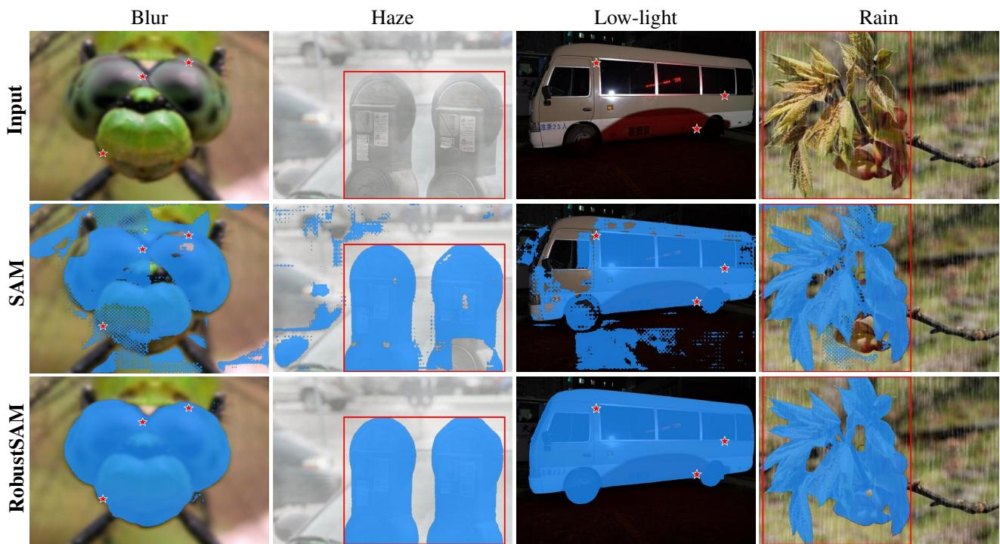
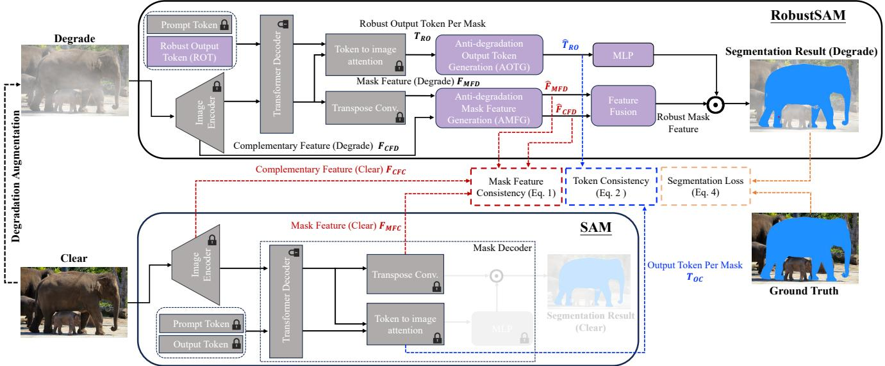
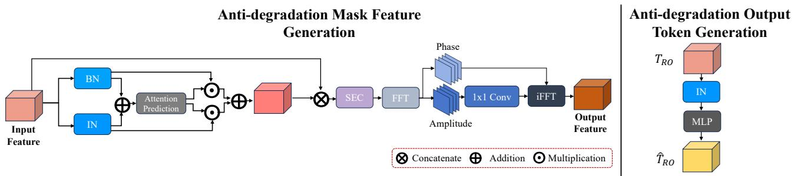
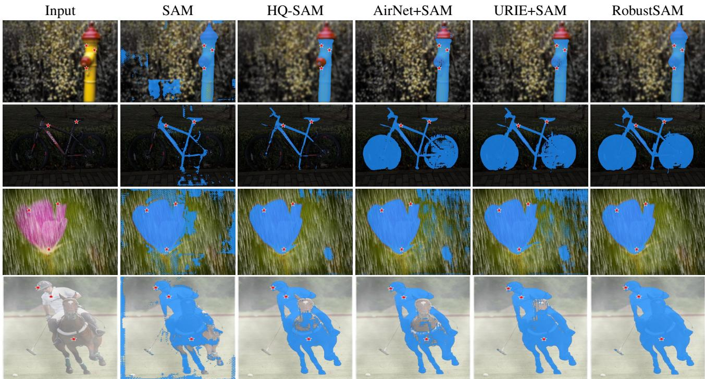
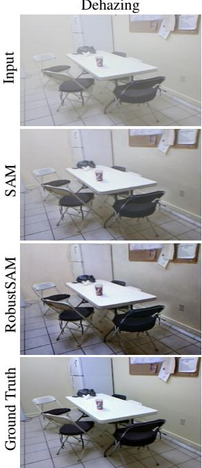
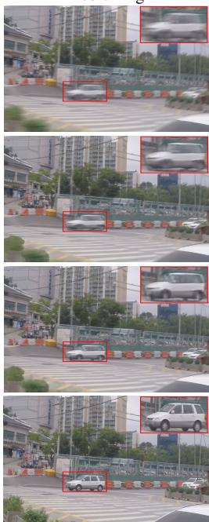

# RobustSAM: Segment Anything Robustly on Degraded Images

Wei-Ting Chen1,2† Yu-Jiet Vong1 Sy-Yen Kuo1 Sizhou Ma2\* Jian Wang2\*

1National Taiwan University 2Snap Inc.

  
Figure 1. Comparative results of SAM and RobustSAM under different degradations using unseen datasets: RobustSAM outperforms with precise boundaries and intact structures, where SAM falters with errors and fragmentation. Red star points and bounding boxe are our examples’ input prompts.

## Abstract

Segment Anything Model (SAM) has emerged as a transformative approach in image segmentation, acclaimed for its robust zero-shot segmentation capabilities and flexible prompting system. Nonetheless, its performance is challenged by images with degraded quality. Addressing this limitation, we propose the Robust Segment Anything Model (RobustSAM), which enhances SAM’s performance on lowquality images while preserving its promptability and zeroshot generalization. Our method leverages the pre-trained SAM model with only marginal parameter increments and computational requirements. The additional parameters of RobustSAM can be optimized within 30 hours on eight GPUs, demonstrating its feasibility and practicality for typ-

ical research laboratories. We also introduce the Robust-Seg dataset, a collection of 688K image-mask pairs with different degradations designed to train and evaluate our model optimally. Extensive experiments across various segmentation tasks and datasets confirm RobustSAM’s superior performance, especially under zero-shot conditions, underscoring its potential for extensive real-world application. Additionally, our method has been shown to effectively improve the performance of SAM-based downstream tasks such as single image dehazing and deblurring.

## 1. Introduction

Accurate image segmentation is crucial to various downstream applications such as robotics, augmented/virtual reality, and content creation. Segment Anything Model (SAM) [29] has opened a new chapter in image segmentation in the wild: Utilizing the comprehensive SA-1B dataset, which comprises over a billion annotated masks, SAM generalizes to a huge variety of objects and can accurately segment a scene given minimalistic prompts, ranging from point annotations to bounding boxes. This innovative approach revolutionizes zero-shot segmentation by seamlessly adapting to various applications.

As SAM demonstrates its versatility across diverse segmentation tasks [21, 25, 52, 66, 66, 73, 88], attention has turned to its robustness and scalability when confronting complex and challenging scenarios. Specifically, enhancing its robustness on degraded images remains a frontier to be explored. A body of literature [24, 58, 61, 71] has pointed out that the performance of SAM decreases with imaging degradations like low lighting, noise, blur, adverse weather, and compression artifacts. These degradations significantly impact the quality of the segmentation masks that SAM generates, directly influencing downstream tasks relying on these masks. Specifically, recent image restoration works such as dehazing [26], deblurring [41], and superresolution [50] have been utilizing these masks or latent features as a structure prior which generalizes to unseen scenes. However, these works assume that SAM can produce reliable and accurate masks even in degraded conditions. If the robustness of SAM is compromised in these cases, the benefit of integrating prior knowledge becomes constrained, limiting their applicability to real-world scenarios.

To address this challenge, one intuitive approach is to utilize existing image restoration techniques [9, 31, 56] to preprocess the images before feeding them into SAM. Although these methods can improve the image quality to a degree, there is no guarantee that the selected image restoration techniques would be able to improve image segmentation [7, 12, 40, 64, 70]. This is because most image restoration algorithms are optimized for human visual perception rather than the specific demands of segmentation models like SAM.

An alternative strategy involves directly fine-tuning SAM on degraded images. However, direct adjustments to the SAM decoder or integrating a new decoder module can profoundly impair the model’s generalizability on zeroshot tasks. Furthermore, blindly fine-tuning SAM with degraded images can lead to catastrophic forgetting, where the network inadvertently loses its knowledge learned from the original, clean images [16, 30].

To this end, we introduce RobustSAM, which achieves robustness in handling degraded images while retaining zero-shot functionality. Our method proposes two novel modules: the Anti-Degradation Token Generation Module and the Anti-Degradation Mask Feature Generation Module. Supervised by consistency losses with features extracted from paired clear images by original SAM, these modules are designed to extract degradation-invariant segmentation features. We also fine-tuned the original output token of SAM, adapting it to our robust segmentation approach. By freezing the original modules from SAM during training, the proposed method enhanced its ability to process degraded images while preserving its effectiveness on zero-shot segmentation.

Moreover, the proposed additional modules in Robust-SAM can be trained efficiently. In contrast to the original SAM, which demands training on hundreds of GPUs, RobustSAM can be trained within 30 hours on eight A100s. This marks the accessibility of RobustSAM, making it ready to be integrated into various application scenarios. Extensive experiments demonstrate that our Robust-SAM performs well in clear and degraded scenarios. Furthermore, we found that RobustSAM benefits SAM-based downstream tasks in degraded scenarios, such as single image dehazing and deblurring, by providing a more robust prior, thereby enhancing their effectiveness.

To enhance the capabilities and robustness of Robust-SAM, we introduce the Robust-Seg dataset. Robust-Seg combines 43K meticulously annotated images from 7 existing datasets. Each image is subject to 15 different types of carefully modeled synthetic degradation, resulting in a comprehensive collection of 688K images in Robust-Seg. This extensive dataset aims to push the boundaries of image segmentation and serve as a valuable resource for future research.

To summarize, our contributions are as follows:

• We propose RobustSAM, a zero-shot segmentation model built upon the Segment Anything model, with enhanced robustness against various image degradations. This enhanced robustness is shown to improve the performance of downstream applications significantly.

• We construct the Robust-Seg dataset, a collection of 688K image-mask pairs with different degradations. We hope Robust-Seg will establish a new benchmark for segmentation models on degraded images.

## 2. Related Work

## 2.1. Segment Anything Model

Segment Anything Model (SAM) [29] achieves unprecedented performance in image segmentation, advancing various subdomains in computer vision [51]. SAM accepts intuitive prompts such as points or bounding boxes, demonstrating exceptional zero-shot transfer learning capability across diverse segmentation tasks and new image distributions. Its adaptability is proven across various domains, including medical imaging [91], [66], [18], [62], camouflaged object detection [66], and salient object segmentation [51]. In addition to its segmentation capability, SAM plays a foundational role in enhancing computer vision tasks, including semantic segmentation [91], [62], [4], image editing [85], and video object tracking [78], [11]. While SAM demonstrates promising capabilities, its performance is challenged by poor image quality [24, 58, 61, 71], affecting segmentation and downstream task accuracy.

## 2.2. Robust Segmentation

In the domains of autonomous driving and surveillance analysis, a multitude of studies [14, 16, 59, 74, 81, 92] have identified a decrease in CNN-based segmentation performance when dealing with degraded images, which leads to the development of various remedial approaches. For instance, QualNet [28] explores quality-agnostic feature extraction through a reversible encoding scheme, while URIE [64] addresses multiple image impairments, enhancing segmentation stability through classification constraints. Concurrently, FIFO [35] propels segmentation frameworks to learn fog-resistant features via a fog pass filter mechanism. However, these technologies primarily focus on a single type of degradation, potentially lacking robustness against multiple image degradations. Moreover, this strategy of jointly training with downstream tasks may dilute the zero-shot advantage of SAM.

## 2.3. Image Restoration

In the field of image restoration, methods targeting single types of degradation such as SRCNN [13] pioneered the application of convolutional neural networks to the enhancement of image quality. Subsequent innovations have emerged across different domains, achieving notable successes in super-resolution (SR) [34, 46, 90], denoising [1, 2, 53, 89], dehazing [8, 19, 36], deraining [57, 60, 79], underwater enhancement [49, 77] and deblurring [15, 32, 33]. Attempts like MPRNet [87], and HINet [6] have been made to address multiple degradations through a single network. Recently, transformer-based methods have also gained traction in image restoration tasks [44, 72, 86]. Nonetheless, while multi-degradation approaches such as All-in-One [39], IPT [3], and AirNet [37] offer greater flexibility and improved performance, they aim to enhance visual quality for human perception, instead of improving the performance of downstream tasks such as segmentation.

## 3. Proposed Method

## 3.1. Preliminary: Segment Anything Model

We provide a concise overview of the SAM framework [29]. As shown in the lower half of Figure 2, SAM incorporates three key components: an image encoder, a prompt encoder, and a mask decoder. The image encoder processes input images using the Vision Transformer (ViT). The prompt encoder handles sparse prompt inputs (such as points, boxes, and text) and dense inputs (masks), transforming them into appropriate representations. The mask decoder is a modified Transformer decoder block [69]. It combines image and prompt embeddings with an output token to generate mask features. This process involves prompt self-attention and bidirectional cross-attention between the prompts and image embeddings. Notably, the mask decoder uses transpose convolutions to create detailed mask features. The output token per mask, derived from token-to-image attention, is transformed by an MLP into a dynamic classifier. When multiplied with the mask features, this classifier yields the final segmentation mask.

## 3.2. Robust Segment Anything Model

We propose RobustSAM, which addresses image degradation while preserving the zero-shot learning capabilities of SAM. Diverging from standard approaches that fine-tune SAM or jointly train complex adaptation modules, Robust-SAM employs a minimalistic yet deliberate enhancement.

## 3.2.1 Model Overview

Figure 2 gives an overview of the proposed Robust-SAM. The key contribution of RobustSAM is the Anti-Degradation Output Token Generation (AOTG) and Anti-Degradation Mask Feature Generation (AMFG) modules, which extract degradation-invariant information that is aligned those extracted from clear images by the original SAM. This is achieved by generating clear-degraded image pairs through 15 types of synthetic degradation augmentation. Different losses are then applied to enforce the consistency between clear and degraded features, as well as the predicted segmentation and ground truth. Notice that although supervised with synthetic degradations, Robust-SAM generalizes well to real-world images, as shown in Sec. 5.

Training. To train RobustSAM, we begin by applying a degradation augmentation to a clear input image and then feeding the resulting degraded image into RobustSAM. Initially, the model leverages its Image Encoder to extract features from this degraded image. Unlike the original SAM framework, we finetuned the output token, now called the Robust Output Token (ROT). This ROT, along with the prompt token and the features extracted by the Image Encoder, is processed through the original SAM layers to generate mask feature (degrade) $F _ { M F D }$ and Robust Output Token per mask $T _ { R O }$

  
Figure 2. Overview of our proposed RobustSAM. RobustSAM augments the original SAM by incorporating five essential components (in purple). During training, clear images are fed through the original SAM modules $\mathrm { ( i n \ g r a y ) }$ to produce features for clear scenes. Subsequently, degraded images, generated through augmentation of clear inputs, are processed by RobustSAM, yielding features for degraded scenarios. These are then refined via Anti-degradation modules, ensuring consistency with features from clear scenes. This methodology, supported by a segmentation loss, achieves precise segmentation outcomes in both clear and degraded image conditions. During inference, only RobustSAM is used to predict a segmentation mask from an input image. Note: The prompt encoder is excluded for conciseness, and the padlock icons represent fixed components loaded from the original SAM model that are not updated during training.

The AOTG block processes the $T _ { R O }$ to extract information resilient to degradation, transforming it into $\hat { T } _ { R O }$ . Simultaneously, the AMFG block refines the mask and complementary features from the Image Encoder’s early and final layers $( F _ { M F D }$ and $F _ { C F D } )$ , removing degradationrelated information to produce refined features $( \hat { F } _ { M F D }$ and $\hat { F } _ { C F D } )$ . Following the architecture proposed in [27], a Feature Fusion block combines these refined features into our final robust mask feature for improving the segmentation quality.

In parallel, the original clear image is processed by standard SAM to extract clear versions of the complementary feature $( F _ { C F C } )$ , mask feature $( F _ { M F C } )$ , and output token $( T _ { O C } )$ . Consistency losses between these clear features and refined features from RobustSAM ensure alignment with undegraded image outputs. The segmentation results from the degraded input are then compared against the ground truth using a segmentation loss function.

In our degradation augmentation approach, we include 15 types of degradations and an identity mapping. This ensures that clear images retain their quality, avoiding performance drops in non-degraded scenarios.

Inference. During inference, only the RobustSAM (Figure 2, top half) is used to generate the segmentation mask.

In the following, we give a detailed discussion on the proposed Anti-Degradation Output Token Generation and Anti-Degradation Mask Feature Generation modules.

## 3.2.2 Anti-Degradation Mask Feature Generation

As shown in Figure 3, the input features are first processed by Instance Normalization (IN). Inspired by previous work [23, 64, 68], the purpose of IN is to standardize the variations associated with image degradation. Intuitively, this removes the style attributes while preserving the core content. This step is essential to mitigate the influence of individual image distortions, ensuring the content’s stability under diverse degradation conditions. Parallel to this, inspired by [64], we include another branch that applies Batch Normalization (BN). BN is crucial as it addresses the potential loss of detail resulting from the IN process, as indicated by [55, 64].

We then merge the features generated by BN and IN individually. An attention mechanism scrutinizes the merged features to generate attention maps, which dynamically weigh the importance of each feature type, thus synthesizing a feature set that encapsulates the advantages of both normalization techniques [64]. To compensate for any semantic information that may have been lost, this enhanced feature set is concatenated with the original input features along the channel dimension. Additionally, we integrate channel attention, akin to the squeeze-and-excitation approach (SEC) [20, 43], to refine the feature integration adaptively.

  
Figure 3. Overview of the proposed Anti-degradation Mask Feature Generation (AMFG) and Anti-degradation Output Token Generation (AOTG). SEC denotes Squeeze-and-Excitation Channel attention.

Inspired by [22, 75, 80, 82, 84], we introduced the Fourier Degradation Suppression module to enhance the integrated features by transforming them from the spatial to the frequency domain using the Fourier transform. This technique leverages the amplitude components to capture style information about image degradation. By applying a 1×1 convolution, we focus on isolating and removing degradation elements. Meanwhile, the phase components are preserved to maintain the structural integrity. Following this, an inverse Fourier transform brings the refined features back to the spatial domain. This process treats degradations as image styles and generates degradation-invariant features for robust segmentation.

This module is applied to two features generated by preceding modules: the complementary feature (degrade) $F _ { C F D }$ and the mask feature (degrade) $F _ { M F D }$ . To ensure that these refined features maintain consistency with the corresponding features extracted by the SAM model $( i . e .$ $F _ { C F C }$ and $F _ { M F C } )$ when using clear images as input, we employ the Mask Feature Consistency Loss $( \mathcal { L } _ { \mathrm { M F C } } )$

$$
\mathcal { L } _ { \mathrm { M F C } } = \Vert \hat { F } _ { C F D } - F _ { C F C } \Vert _ { 2 } + \Vert \hat { F } _ { M F D } - F _ { M F C } \Vert _ { 2 }\tag{1}
$$

By minimizing each part of ${ \mathcal { L } } _ { \mathrm { M F C } }$ , we ensure that the refined features remain consistent with those extracted under clear image conditions, thus guaranteeing the robustness and consistency of the features across different degradations.

## 3.2.3 Anti-Degradation Output Token Generation

The Anti-Degradation Output Token Generation module is dedicated to refining Robust Output Token per mask $( T _ { R O } )$ to remove degradation-related information. Unlike conventional mask features, $T _ { R O }$ primarily functions to ensure the clarity of classification boundaries, thus containing less texture information. Therefore, we found that using a lightweight module to filter information sensitive to degradation is sufficient. As depicted on the right side of Figure

3, this module utilizes multiple layers of Instance Normalization followed by a single MLP layer. This strategy aims to maintain computational efficiency while ensuring that the model can recover robust mask information from inputs affected by degradation. The refined token $\hat { T } _ { R O }$ is then compared with the output token $T _ { O C }$ extracted under clear input conditions by the original SAM to calculate Token Consistency Loss ${ \mathcal { L } } _ { \mathrm { T C } }$

$$
\mathcal { L } _ { \mathrm { T C } } = \Vert \hat { T } _ { R O } - T _ { O C } \Vert _ { 2 }\tag{2}
$$

This loss ensures that the refined token remains consistent with those extracted under clear image conditions. After processing through the MLP, the output is combined with the Robust Mask Feature to generate the final mask.

## 3.2.4 Overall Loss

The overall loss function integrates the Mask Feature Consistency Loss $( \mathcal { L } _ { \mathrm { M F C } } )$ , Token Consistency Loss $( \mathcal { L } _ { \mathrm { T C } } )$ , and the Segmentation Loss $( \mathcal { L } _ { \mathrm { S e g } } )$ to form a comprehensive penalty for the model. The overall loss is expressed as:

$$
\mathcal { L } _ { \mathrm { O v e r a l l } } = \mathcal { L } _ { \mathrm { M F C } } + \lambda _ { 1 } \mathcal { L } _ { \mathrm { T C } } + \lambda _ { 2 } \mathcal { L } _ { \mathrm { S e g } }\tag{3}
$$

Here, $\mathcal { L } _ { \mathrm { S e g } }$ is a combined segmentation loss that incorporates both Dice [47] and Focal losses [65]:

$$
\mathcal { L } _ { \mathrm { S e g } } = \mathcal { L } _ { \mathrm { D i c e } } ( P , G ) + \lambda _ { 3 } \mathcal { L } _ { \mathrm { F o c a l } } ( P , G )\tag{4}
$$

where P is the predicted mask, G is the ground truth mask, and $\lambda _ { 1 } { - } \lambda _ { 3 }$ are hyperparameters for weighting different losses. This composite loss function is designed to ensure enhancement in segmentation quality while bolstering the robustness of the model against degradation.

## 4. Implementation Details

## 4.1. Dataset

To train and evaluate RobustSAM, we constructed a comprehensive Robust-Seg dataset, featuring 688,000 imagemask pairs. This dataset is composed of images from several existing datasets, specifically LVIS [17], ThinObject-5k [45], MSRA10K [10], NDD20 [67], STREETS [63], FSS-1000 [42], and COCO [48]. In this dataset, we incorporate original clear images and versions augmented with 15 types of synthetic degradations, including blur, noise, low light, adverse weather conditions, and so on. This approach ensures the model is extensively trained and robust to various image qualities.

<table><tr><td rowspan="3"></td><td colspan="4">Training</td><td colspan="2">Inference</td></tr><tr><td>Learnable Params</td><td>#GPU</td><td>Batch Size</td><td>Time (h)</td><td>FPS</td><td>Mem.</td></tr><tr><td>SAM</td><td>1250 MB</td><td>256</td><td>256</td><td>N/A</td><td>2.90</td><td>9.63G</td></tr><tr><td>RobustSAM</td><td>403 MB</td><td>8</td><td>8</td><td>30</td><td>2.80</td><td>10.08G</td></tr></table>

Table 1. Comparative computational requirements for SAM and RobustSAM.

During training, we utilize the entire training sets (and their augmentations) of MSRA10K, ThinObject-5k, and LVIS. The test sets (and their augmentations) of MSRA10k and LVIS are used to validate the segmentation accuracy of the model. To challenge the zero-shot generalization of the model, we test it against the full range of images (and their augmentations) from the NDD20, STREETS, FSS-1000, and COCO datasets.

In addition, we conduct extensive testing using the complete BDD-100k [83] and LIS [5, 76] datasets, which include a variety of real-world degradations such as low-light, blur, rain, and snow. This approach ensures a thorough evaluation of RobustSAM’s performance in realistic scenarios and its robustness to adverse environmental conditions typically encountered in real-world applications.

## 4.2. Training Detail

During the training phase of RobustSAM, we keep the pretrained SAM parameters frozen, focusing only on optimizing the proposed modules for robustness. We train Robust-SAM using point-based prompts.

RobustSAM significantly enhances segmentation quality and is designed for fast and efficient training. With a learning rate of 0.0005 for 40 epochs, the training is completed in 30 hours for 130,000 iterations on 8 Nvidia A100 GPUs. Table 1 details the training and inference performance of RobustSAM compared to SAM. RobustSAM not only delivers improved segmentation outcomes but does so with remarkable training efficiency compared to SAM.

## 4.3. Evaluation Protocol

To evaluate the performance of RobustSAM, we employ several metrics: Intersection over Union (IoU), Dice Coefficient (Dice), Pixel Accuracy (PA), and Average Precision (AP) at various threshold levels.

<table><tr><td rowspan="2">Method</td><td colspan="2">Degrade</td><td colspan="2">Clear</td><td colspan="2">Average</td></tr><tr><td>IoU</td><td>PA</td><td>IoU</td><td>PA</td><td>IoU</td><td>PA</td></tr><tr><td>SAM</td><td>0.8194</td><td>0.9108</td><td>0.8402</td><td>0.9235</td><td>0.8207</td><td>0.9116</td></tr><tr><td>HQ-SAM</td><td>0.8358</td><td>0.9202</td><td>0.8604</td><td>0.9328</td><td>0.8373</td><td>0.9210</td></tr><tr><td>AirNet+SAM</td><td>0.8157</td><td>0.9193</td><td>0.8236</td><td>0.9294</td><td>0.8162</td><td>0.9199</td></tr><tr><td>URIE+SAM</td><td>0.8217</td><td>0.9125</td><td>0.8450</td><td>0.9245</td><td>0.8231</td><td>0.9132</td></tr><tr><td>RobustSAM</td><td>0.8609</td><td>0.9640</td><td>0.8726</td><td>0.9649</td><td>0.8616</td><td>0.9641</td></tr></table>

Table 2. Performance Comparison on test set of MSRA10k [10] datasets (seen datasets with synthetic degradations) in Robust-Seg dataset using point prompts for “Degrade”, “Clear”, and “Average” scenarios. “Degrade” refers to the set of images subjected to 15 different types of degradation, “Clear” refers to the original, undegraded images, and “Average” represents the weighted sum average of the “Degrade” and “Clear” scenarios. The words with boldface indicate the best results, and those with underline indicate the second-best results.

<table><tr><td rowspan="2">Method</td><td colspan="2">Degrade</td><td colspan="2">Clear</td><td colspan="2">Average</td></tr><tr><td>IoU</td><td>PA</td><td>IoU</td><td>PA</td><td>IoU</td><td>PA</td></tr><tr><td>SAM</td><td>0.7341</td><td>0.9181</td><td>0.7415</td><td>0.9282</td><td>0.7346</td><td>0.9187</td></tr><tr><td>HQ-SAM</td><td>0.7405</td><td>0.9242</td><td>0.7502</td><td>0.9319</td><td>0.7411</td><td>0.9246</td></tr><tr><td>AirNet+SAM</td><td>0.7352</td><td>0.9198</td><td>0.7419</td><td>0.9293</td><td>0.7356</td><td>0.9204</td></tr><tr><td>URIE+SAM</td><td>0.7336</td><td>0.9182</td><td>0.7406</td><td>0.9277</td><td>0.7340</td><td>0.9188</td></tr><tr><td>RobustSAM</td><td>0.7506</td><td>0.9327</td><td>0.7592</td><td>0.9339</td><td>0.7511</td><td>0.9328</td></tr></table>

Table 3. Performance comparison on the test set of LVIS [17] dataset (a seen dataset with synthetic degradations) in Robust-Seg dataset using Bounding Box prompts.

<table><tr><td rowspan="2">Method</td><td colspan="2">Degrade</td><td colspan="2">Clear</td><td colspan="2">Average</td></tr><tr><td>IoU</td><td>PA</td><td>IoU</td><td>PA</td><td>IoU</td><td>PA</td></tr><tr><td>SAM</td><td>0.7981</td><td>0.9555</td><td>0.8295</td><td>0.9707</td><td>0.8000</td><td>0.9565</td></tr><tr><td>HQ-SAM</td><td>0.8079</td><td>0.9617</td><td>0.8448</td><td>0.9756</td><td>0.8102</td><td>0.9625</td></tr><tr><td>AirNet+SAM</td><td>0.7988</td><td>0.9629</td><td>0.8312</td><td>0.9752</td><td>0.8008</td><td>0.9637</td></tr><tr><td>URIE+SAM</td><td>0.7904</td><td>0.9593</td><td>0.8288</td><td>0.9740</td><td>0.7928</td><td>0.9602</td></tr><tr><td>RobustSAM</td><td>0.8195</td><td>0.9778</td><td>0.8529</td><td>0.9817</td><td>0.8216</td><td>0.9780</td></tr></table>

Table 4. Zero-shot segmentation comparison on the whole NDD20 [67], STREETS [63], and FSS-1000 [42] (unseen datasets with synthetic degradations) in Robust-Seg dataset using point prompts.

<table><tr><td rowspan="2">Method</td><td colspan="4">Performance Metrics</td></tr><tr><td>AP</td><td>APs</td><td>APM</td><td>APL</td></tr><tr><td>SAM</td><td>0.5002</td><td>0.3168</td><td>0.4292</td><td>0.5243</td></tr><tr><td>HQ-SAM</td><td>0.5052</td><td>0.2920</td><td>0.4267</td><td>0.5517</td></tr><tr><td>AirNet+SAM</td><td>0.4926</td><td>0.3068</td><td>0.4263</td><td>0.5187</td></tr><tr><td>URIE+SAM</td><td>0.4980</td><td>0.3186</td><td>0.4319</td><td>0.5215</td></tr><tr><td>RobustSAM</td><td>0.5130</td><td>0.3192</td><td>0.4416</td><td>0.5518</td></tr></table>

Table 5. Zero-shot segmentation comparison on the whole COCO [48] (unseen datasets with synthetic degradations) in Robust-Seg dataset using Bounding Box prompts.

## 5. Experimental Results

In this section, we present the evaluation results of the proposed RobustSAM.

  
Figure 4. Qualitative Analysis of Segmentation: A visual comparison on unseen datasets highlighting the performance improvements of the RobustSAM over existing strategies.

<table><tr><td rowspan="2">Method</td><td colspan="2">Point</td><td colspan="2">Bounding Box</td></tr><tr><td>IoU</td><td>Dice</td><td>IoU</td><td>Dice</td></tr><tr><td>SAM</td><td>0.3056</td><td>0.3837</td><td>0.8808</td><td>0.9171</td></tr><tr><td>HQ-SAM</td><td>0.2943</td><td>0.3712</td><td>0.8877</td><td>0.9245</td></tr><tr><td>AirNet+SAM</td><td>0.3245</td><td>0.4550</td><td>0.8776</td><td>0.9129</td></tr><tr><td>URIE+SAM</td><td>0.3042</td><td>0.3828</td><td>0.8799</td><td>0.9165</td></tr><tr><td>RobustSAM</td><td>0.3717</td><td>0.8926</td><td>0.8958</td><td>0.9416</td></tr></table>

Table 6. Zero-shot segmentation comparison on the whole BDD-100k [83] and LIS [5, 76] datasets (unseen datasets with real-world degradations) using point prompts.

## 5.1. Performance Evaluation

In the landscape of image segmentation under challenging conditions, our RobustSAM framework is compared with several existing methods to establish its efficacy. We benchmark against the foundational SAM model and a strategic two-stage methodology where images are first passed through universal image restoration techniques to refine input quality, subsequently followed by SAM-driven segmentation. To that end, we incorporate AirNet [37], a stateof-the-art general visual quality enhancement method tailored for unknown degradation. Furthermore, we integrate URIE [64], an image restoration approach optimized to set the stage for more effective segmentation. Additionally, we compare with HQ-SAM [27], which is a high-quality iteration of the original SAM.

Comparison on Seen Datasets. We evaluate the performance of our proposed methods within the framework of Robust-Seg on seen datasets: LVIS [17] and MSRA10K [10]. Specifically, we assess the methods on the test sets of these datasets. The results show that our approach yields superior performance, effectively handling the varied challenges posed by these diverse scenes. Additionally, RobustSAM demonstrates its strength in significantly improving segmentation in degraded scenarios while maintaining or enhancing performance in clear scenes. Detailed results are presented in Table 2 and Table 3, demonstrating our method’s efficacy across different segmentation scenarios.

Zero-shot Segmentation Comparison. We first assessed our methods on the entire NDD20 [67], STREETS [63], and FSS-1000 [42] and COCO [48] datasets, all of which are synthesized degradations designed to challenge segmentation models. These test sets’ results, which highlight our approaches’ adaptability and accuracy, are detailed in Table 4 and Table 5. Moreover, to validate our methods’ capabilities against real-world degradations, we expanded our evaluation to include the entire BDD-100k [83] and LIS datasets [5, 76]. These datasets are particularly challenging due to their wide variety of real-world degradations, ranging from weather conditions to noise and variable lighting. The results of these assessments are provided in Table 6. In addition, we present the qualitative comparison of segmentation in Figure 4. These results indicate that RobustSAM possesses significant robustness in zero-shot segmentation, maintaining high performance across different degradations.

Dehazing  
Deblurring  

Figure 5. Enhancing SAM-based applications: A qualitative demonstration of RobustSAM’s superiority in refining SAM-based single image dehazing and deblurring.
<table><tr><td rowspan="2">Module</td><td colspan="2">Metric</td></tr><tr><td>IoU</td><td>PA</td></tr><tr><td>Baseline</td><td></td><td></td></tr><tr><td>SAM SAM-Finetune</td><td>0.3056</td><td>0.8911</td></tr><tr><td>SAM-Finetune Decoder</td><td>0.1871</td><td>0.7691</td></tr><tr><td></td><td>0.2476</td><td>0.8691</td></tr><tr><td>SAM-Finetune Output Token</td><td>0.3194</td><td>0.9036</td></tr><tr><td>RobustSAM</td><td></td><td></td></tr><tr><td>wAMFG</td><td>0.3455</td><td>0.9059</td></tr><tr><td>w AMFG-F</td><td>0.3535</td><td>0.9120</td></tr><tr><td>w AMFG-F+AOTG</td><td>0.3651</td><td>0.9193</td></tr><tr><td>w AMFG-F+AOTG+ROT (ALL)</td><td>0.3717</td><td>0.9226</td></tr></table>

Table 7. Efficacy of Proposed Modules: An evaluation on the BDD-100k [83] and LIS [5, 76] datasets reveals that each of the proposed modules enhances the performance of RobustSAM. (We use point prompts in this comparison.)
<table><tr><td rowspan="2">Prior</td><td colspan="2">Dehazing</td><td colspan="2">Deblurring</td></tr><tr><td>PSNR</td><td>SSIM</td><td>PSNR</td><td>SSIM</td></tr><tr><td>SAM</td><td>21.677</td><td>0.8451</td><td>27.491</td><td>0.9066</td></tr><tr><td>RobustSAM</td><td>23.159</td><td>0.8685</td><td>29.351</td><td>0.9229</td></tr></table>

Table 8. Quantitative evaluation for Dehazing [26] and Deblurring [41] tasks using different priors.

## 5.2. Ablation Study

To further understand the impact of our contributions, we conducted an ablation study. All experiments were performed on the BDD-100k [83] and LIS [5, 76] datasets.

Fine-tune SAM? We fine-tuned the SAM model in various configurations: fine-tuning the entire model, the decoder, and the output token. The results are presented in Table 7. It was observed that fine-tuning the entire SAM model or its decoder drastically reduces its zero-shot capabilities, leading to a significant drop in performance. Fine-tuning only output token resulted in performance improvements; however, they were still inferior compared to RobustSAM.

Effectiveness of Proposed Modules. Furthermore, we validated the effectiveness of each proposed module, including the Anti-degradation Mask Feature Generation Module (AMFG), ADM with Fourier Degradation Suppression module (AMFG-F), Anti-degradation Output Token Generation (AOTG), and Robust Output Token (ROT). The findings presented in Table 7 show that each introduced module positively influences RobustSAM’s overall performance, with the AMFG module demonstrating the most significant enhancement.

## 5.3. Improving SAM-prior Tasks

To validate whether our RobustSAM can enhance the performance of applications based on SAM priors under degraded image conditions, we selected single image dehazing [26] and single image deblurring [41] as test cases. Following the original papers’ settings for these tasks, we utilized SAM and RobustSAM as their priors and evaluated their performance on SOTS dataset [38] for dehazing and GoPro dataset [54] for deblurring. The findings, presented in Table 8 and Figure 5, demonstrate that employing RobustSAM yields superior performance on downstream tasks. This enhancement can be attributed to RobustSAM’s improved segmentation accuracy on degraded images, providing a more robust prior for these tasks.

## 6. Conclusion

This paper introduces RobustSAM, which excels in segmenting images under diverse degradations. The model’s strength is rooted in its components—particularly the Anti-degradation Mask Feature Generation Module, Antidegradation Output Token Generation, and Robust Output Token modules. To verify the effectiveness of RobustSAM, we proposed a large-scale dataset called Robust-Seg. Furthermore, we prove RobustSAM’s superiority extends to improving SAM-based tasks such as dehazing and deblurring, confirming its value as a dependable tool for image processing under degraded conditions. Its performance sets a new standard for robustness in zero-shot segmentation, offering a promising direction for future research.

## References

[1] Abdelrahman Abdelhamed, Marcus A Brubaker, and Michael S Brown. Noise flow: Noise modeling with conditional normalizing flows. In ICCV, 2019. 3

[2] Tim Brooks, Ben Mildenhall, Tianfan Xue, Jiawen Chen, Dillon Sharlet, and Jonathan T Barron. Unprocessing images for learned raw denoising. In CVPR, 2019. 3

[3] Hanting Chen, Yunhe Wang, Tianyu Guo, Chang Xu, Yiping Deng, Zhenhua Liu, Siwei Ma, Chunjing Xu, Chao Xu, and Wen Gao. Pre-trained image processing transformer. In CVPR, 2021. 3

[4] Jiaqi Chen, Zeyu Yang, and Li Zhang. Semantic segment anything. https://github.com/fudan-zvg/ Semantic-Segment-Anything, 2023. 3

[5] Linwei Chen, Ying Fu, Kaixuan Wei, Dezhi Zheng, and Felix Heide. Instance segmentation in the dark. IJCV, 2023. 6, 7, 8

[6] Liangyu Chen, Xin Lu, Jie Zhang, Xiaojie Chu, and Chengpeng Chen. Hinet: Half instance normalization network for image restoration. In CVPR, 2021. 3

[7] Wei-Ting Chen, I-Hsiang Chen, Chih-Yuan Yeh, Hao-Hsiang Yang, Hua-En Chang, Jian-Jiun Ding, and Sy-Yen Kuo. Rvsl: Robust vehicle similarity learning in real hazy scenes based on semi-supervised learning. In ECCV, 2022. 2

[8] Wei-Ting Chen, Jian-Jiun Ding, and Sy-Yen Kuo. Pms-net: Robust haze removal based on patch map for single images. In CVPR, 2019. 3

[9] Wei-Ting Chen, Zhi-Kai Huang, Cheng-Che Tsai, Hao-Hsiang Yang, Jian-Jiun Ding, and Sy-Yen Kuo. Learning multiple adverse weather removal via two-stage knowledge learning and multi-contrastive regularization: Toward a unified model. In CVPR, 2022. 2

[10] Ming-Ming Cheng, Niloy J. Mitra, Xiaolei Huang, Philip H. S. Torr, and Shi-Min Hu. Global contrast based salient region detection. IEEE TPAMI, 2015. 6, 7

[11] Yangming Cheng, Liulei Li, Yuanyou Xu, Xiaodi Li, Zongxin Yang, Wenguan Wang, and Yi Yang. Segment and track anything. arXiv preprint arXiv:2305.06558, 2023. 3

[12] Steven Diamond, Vincent Sitzmann, Frank Julca-Aguilar, Stephen Boyd, Gordon Wetzstein, and Felix Heide. Dirty pixels: Towards end-to-end image processing and perception. ACM TOG, 2021. 2

[13] Chao Dong, Chen Change Loy, Kaiming He, and Xiaoou Tang. Learning a deep convolutional network for image super-resolution. In ECCV, 2014. 3

[14] Kazuki Endo, Masayuki Tanaka, and Masatoshi Okutomi. Semantic segmentation of degraded images using layer-wise feature adjustor. In WACV, 2023. 3

[15] Hongyun Gao, Xin Tao, Xiaoyong Shen, and Jiaya Jia. Dynamic scene deblurring with parameter selective sharing and nested skip connections. In CVPR, 2019. 3

[16] Dazhou Guo, Yanting Pei, Kang Zheng, Hongkai Yu, Yuhang Lu, and Song Wang. Degraded image semantic segmentation with dense-gram networks. TIP, 2019. 2, 3

[17] Agrim Gupta, Piotr Dollar, and Ross Girshick. LVIS: A dataset for large vocabulary instance segmentation. In CVPR, 2019. 6, 7

[18] Dongsheng Han, Chaoning Zhang, Yu Qiao, Maryam

Qamar, Yuna Jung, SeungKyu Lee, Sung-Ho Bae, and Choong Seon Hong. Segment anything model (sam) meets glass: Mirror and transparent objects cannot be easily detected. arXiv preprint arXiv:2305.00278, 2023. 3

[19] Kaiming He, Jian Sun, and Xiaoou Tang. Single image haze removal using dark channel prior. PAMI, 2010. 3

[20] Jie Hu, Li Shen, and Gang Sun. Squeeze-and-excitation networks. In CVPR, 2018. 5

[21] Mingzhe Hu, Yuheng Li, and Xiaofeng Yang. Skinsam: Empowering skin cancer segmentation with segment anything model. arXiv preprint arXiv:2304.13973, 2023. 2

[22] Jiaxing Huang, Dayan Guan, Aoran Xiao, and Shijian Lu. Rda: Robust domain adaptation via fourier adversarial attacking. In ICCV, 2021. 5

[23] Xun Huang and Serge Belongie. Arbitrary style transfer in real-time with adaptive instance normalization. In ICCV, 2017. 4

[24] Yihao Huang, Yue Cao, Tianlin Li, Felix Juefei-Xu, Di Lin, Ivor W Tsang, Yang Liu, and Qing Guo. On the robustness of segment anything. arXiv preprint arXiv:2305.16220, 2023. 2, 3

[25] Wei Ji, Jingjing Li, Qi Bi, Wenbo Li, and Li Cheng. Segment anything is not always perfect: An investigation of sam on different real-world applications. arXiv preprint arXiv:2304.05750, 2023. 2

[26] Zheyan Jin, Shiqi Chen, Yueting Chen, Zhihai Xu, and Huajun Feng. Let segment anything help image dehaze. arXiv preprint arXiv:2306.15870, 2023. 2, 8

[27] Lei Ke, Mingqiao Ye, Martin Danelljan, Yifan Liu, Yu-Wing Tai, Chi-Keung Tang, and Fisher Yu. Segment anything in high quality. arXiv:2306.01567, 2023. 4, 7

[28] Insoo Kim, Seungju Han, Ji-won Baek, Seong-Jin Park, Jae-Joon Han, and Jinwoo Shin. Quality-agnostic image recognition via invertible decoder. In CVPR, 2021. 3

[29] Alexander Kirillov, Eric Mintun, Nikhila Ravi, Hanzi Mao, Chloe Rolland, Laura Gustafson, Tete Xiao, Spencer Whitehead, Alexander C. Berg, Wan-Yen Lo, Piotr Dollár, and Ross Girshick. Segment anything. arXiv:2304.02643, 2023. 2, 3

[30] James Kirkpatrick, Razvan Pascanu, Neil Rabinowitz, Joel Veness, Guillaume Desjardins, Andrei A Rusu, Kieran Milan, John Quan, Tiago Ramalho, Agnieszka Grabska-Barwinska, et al. Overcoming catastrophic forgetting in neural networks. PNAS, 2017. 2

[31] Ashutosh Kulkarni, Shruti S Phutke, and Subrahmanyam Murala. Unified transformer network for multi-weather image restoration. In ECCV, 2022. 2

[32] Orest Kupyn, Volodymyr Budzan, Mykola Mykhailych, Dmytro Mishkin, and Jiˇrí Matas. Deblurgan: Blind motion deblurring using conditional adversarial networks. In CVPR, 2018. 3

[33] Orest Kupyn, Tetiana Martyniuk, Junru Wu, and Zhangyang Wang. Deblurgan-v2: Deblurring (orders-of-magnitude) faster and better. In ICCV, 2019. 3

[34] Christian Ledig, Lucas Theis, Ferenc Huszár, Jose Caballero, Andrew Cunningham, Alejandro Acosta, Andrew Aitken, Alykhan Tejani, Johannes Totz, Zehan Wang, et al. Photorealistic single image super-resolution using a generative adversarial network. In CVPR, 2017. 3

[35] Sohyun Lee, Taeyoung Son, and Suha Kwak. Fifo: Learning fog-invariant features for foggy scene segmentation. In CVPR, 2022. 3

[36] Boyun Li, Yuanbiao Gou, Jerry Zitao Liu, Hongyuan Zhu, Joey Tianyi Zhou, and Xi Peng. Zero-shot image dehazing. TIP, 2020. 3

[37] Boyun Li, Xiao Liu, Peng Hu, Zhongqin Wu, Jiancheng Lv, and Xi Peng. All-in-one image restoration for unknown corruption. In CVPR, 2022. 3, 7

[38] Boyi Li, Wenqi Ren, Dengpan Fu, Dacheng Tao, Dan Feng, Wenjun Zeng, and Zhangyang Wang. Reside: A benchmark for single image dehazing. arXiv preprint arXiv:1712.04143, 2017. 8

[39] Ruoteng Li, Robby T Tan, and Loong-Fah Cheong. All in one bad weather removal using architectural search. In CVPR, 2020. 3

[40] Siyuan Li, Iago Breno Araujo, Wenqi Ren, Zhangyang Wang, Eric K Tokuda, Roberto Hirata Junior, Roberto Cesar-Junior, Jiawan Zhang, Xiaojie Guo, and Xiaochun Cao. Single image deraining: A comprehensive benchmark analysis. In CVPR, 2019. 2

[41] Siwei Li, Mingxuan Liu, Yating Zhang, Shu Chen, Haoxiang Li, Hong Chen, and Zifei Dou. Sam-deblur: Let segment anything boost image deblurring. arXiv preprint arXiv:2309.02270, 2023. 2, 8

[42] Xiang Li, Tianhan Wei, Yau Pun Chen, Yu-Wing Tai, and Chi-Keung Tang. Fss-1000: A 1000-class dataset for fewshot segmentation. CVPR, 2020. 6, 7

[43] Xia Li, Jianlong Wu, Zhouchen Lin, Hong Liu, and Hongbin Zha. Recurrent squeeze-and-excitation context aggregation net for single image deraining. In ECCV, 2018. 5

[44] Jingyun Liang, Jiezhang Cao, Guolei Sun, Kai Zhang, Luc Van Gool, and Radu Timofte. Swinir: Image restoration using swin transformer. In ICCV, 2021. 3

[45] Jun Hao Liew, Scott Cohen, Brian Price, Long Mai, and Jiashi Feng. Deep interactive thin object selection. In WACV, 2021. 6

[46] Bee Lim, Sanghyun Son, Heewon Kim, Seungjun Nah, and Kyoung Mu Lee. Enhanced deep residual networks for single image super-resolution. In CVPRW, 2017. 3

[47] Tsung-Yi Lin, Priya Goyal, Ross Girshick, Kaiming He, and Piotr Dollár. Focal loss for dense object detection. In ICCV, 2017. 5

[48] Tsung-Yi Lin, Michael Maire, Serge Belongie, James Hays, Pietro Perona, Deva Ramanan, Piotr Dollár, and C Lawrence Zitnick. Microsoft coco: Common objects in context. In ECCV, 2014. 6, 7

[49] Risheng Liu, Xin Fan, Ming Zhu, Minjun Hou, and Zhongxuan Luo. Real-world underwater enhancement: Challenges, benchmarks, and solutions under natural light. IEEE TCSVT. 3

[50] Zhihe Lu, Zeyu Xiao, Jiawang Bai, Zhiwei Xiong, and Xinchao Wang. Can sam boost video super-resolution? arXiv preprint arXiv:2305.06524, 2023. 2

[51] Jun Ma and Bo Wang. Segment anything in medical images. arXiv preprint arXiv:2304.12306, 2023. 2, 3

[52] Zhiheng Ma, Xiaopeng Hong, and Qinnan Shangguan. Can sam count anything? an empirical study on sam counting. arXiv preprint arXiv:2304.10817, 2023. 2

[53] Ben Mildenhall, Jonathan T Barron, Jiawen Chen, Dillon

Sharlet, Ren Ng, and Robert Carroll. Burst denoising with kernel prediction networks. In CVPR, 2018. 3

[54] Seungjun Nah, Tae Hyun Kim, and Kyoung Mu Lee. Deep multi-scale convolutional neural network for dynamic scene deblurring. In CVPR, 2017. 8

[55] Hyeonseob Nam and Hyo-Eun Kim. Batch-instance normalization for adaptively style-invariant neural networks. NIPS, 2018. 4

[56] Prashant W Patil, Sunil Gupta, Santu Rana, Svetha Venkatesh, and Subrahmanyam Murala. Multi-weather image restoration via domain translation. In ICCV, 2023. 2

[57] Rui Qian, Robby T Tan, Wenhan Yang, Jiajun Su, and Jiaying Liu. Attentive generative adversarial network for raindrop removal from a single image. In CVPR, 2018. 3

[58] Yu Qiao, Chaoning Zhang, Taegoo Kang, Donghun Kim, Shehbaz Tariq, Chenshuang Zhang, and Choong Seon Hong. Robustness of sam: Segment anything under corruptions and beyond. arXiv preprint arXiv:2306.07713, 2023. 2, 3

[59] AN Rajagopalan et al. Improving robustness of semantic segmentation to motion-blur using class-centric augmentation. In CVPR, 2023. 3

[60] Dongwei Ren, Wangmeng Zuo, Qinghua Hu, Pengfei Zhu, and Deyu Meng. Progressive image deraining networks: A better and simpler baseline. In CVPR, 2019. 3

[61] Xinru Shan and Chaoning Zhang. Robustness of segment anything model (sam) for autonomous driving in adverse weather conditions. arXiv preprint arXiv:2306.13290, 2023. 2, 3

[62] Qiuhong Shen, Xingyi Yang, and Xinchao Wang. Anything-3d: Towards single-view anything reconstruction in the wild. arXiv preprint arXiv:2304.10261, 2023. 3

[63] Corey Snyder and Minh Do. Streets: A novel camera network dataset for traffic flow. NIPS, 2019. 6, 7

[64] Taeyoung Son, Juwon Kang, Namyup Kim, Sunghyun Cho, and Suha Kwak. Urie: Universal image enhancement for visual recognition in the wild. In ECCV, 2020. 2, 3, 4, 7

[65] Carole H Sudre, Wenqi Li, Tom Vercauteren, Sebastien Ourselin, and M Jorge Cardoso. Generalised dice overlap as a deep learning loss function for highly unbalanced segmentations. In MICCAI, 2017. 5

[66] Lv Tang, Haoke Xiao, and Bo Li. Can sam segment anything? when sam meets camouflaged object detection. arXiv preprint arXiv:2304.04709, 2023. 2, 3

[67] Cameron Trotter, Georgia Atkinson, Matt Sharpe, Kirsten Richardson, A Stephen McGough, Nick Wright, Ben Burville, and Per Berggren. Ndd20: A large-scale few-shot dolphin dataset for coarse and fine-grained categorisation. arXiv preprint arXiv:2005.13359, 2020. 6, 7

[68] Dmitry Ulyanov, Andrea Vedaldi, and Victor Lempitsky. Instance normalization: The missing ingredient for fast stylization. arXiv preprint arXiv:1607.08022, 2016. 4

[69] Ashish Vaswani, Noam Shazeer, Niki Parmar, Jakob Uszkoreit, Llion Jones, Aidan N Gomez, Łukasz Kaiser, and Illia Polosukhin. Attention is all you need. NIPS, 2017. 3

[70] Rosaura G Vidal, Sreya Banerjee, Klemen Grm, Vitomir Struc, and Walter J Scheirer. Ugˆ 2: A video benchmark for assessing the impact of image restoration and enhancement on automatic visual recognition. In WACV, 2018. 2

[71] Yuqing Wang, Yun Zhao, and Linda Petzold. An empirical study on the robustness of the segment anything model

(sam). arXiv preprint arXiv:2305.06422, 2023. 2, 3

[72] Zhendong Wang, Xiaodong Cun, Jianmin Bao, Wengang Zhou, Jianzhuang Liu, and Houqiang Li. Uformer: A general u-shaped transformer for image restoration. In CVPR, 2022. 3

[73] Junde Wu, Rao Fu, Huihui Fang, Yuanpei Liu, Zhaowei Wang, Yanwu Xu, Yueming Jin, and Tal Arbel. Medical sam adapter: Adapting segment anything model for medical image segmentation. arXiv preprint arXiv:2304.12620, 2023. 2

[74] Weihao Xia, Zhanglin Cheng, Yujiu Yang, and Jing-Hao Xue. Cooperative semantic segmentation and image restoration in adverse environmental conditions. arXiv preprint arXiv:1911.00679, 2019. 3

[75] Qinwei Xu, Ruipeng Zhang, Ya Zhang, Yanfeng Wang, and Qi Tian. A fourier-based framework for domain generalization. In CVPR, 2021. 5

[76] Hong Yang, Wei Kaixuan, Chen Linwei, and Fu Ying. Crafting object detection in very low light. In BMVC, 2021. 6, 7, 8

[77] Hao-Hsiang Yang, Kuan-Chih Huang, and Wei-Ting Chen. Laffnet: A lightweight adaptive feature fusion network for underwater image enhancement. In ICRA, 2021. 3

[78] Jinyu Yang, Mingqi Gao, Zhe Li, Shang Gao, Fangjing Wang, and Feng Zheng. Track anything: Segment anything meets videos. arXiv preprint arXiv:2304.11968, 2023. 3

[79] Wenhan Yang, Robby T Tan, Jiashi Feng, Jiaying Liu, Zongming Guo, and Shuicheng Yan. Deep joint rain detection and removal from a single image. In CVPR, 2017. 3

[80] Yanchao Yang and Stefano Soatto. Fda: Fourier domain adaptation for semantic segmentation. In CVPR, 2020. 5

[81] Zhou Yang, Weisheng Dong, Xin Li, Jinjian Wu, Leida Li, and Guangming Shi. Self-feature distillation with uncertainty modeling for degraded image recognition. In ECCV, 2022. 3

[82] Zizheng Yang, Jie Huang, Jiahao Chang, Man Zhou, Hu Yu, Jinghao Zhang, and Feng Zhao. Visual recognition-driven image restoration for multiple degradation with intrinsic semantics recovery. In CVPR, 2023. 5

[83] Fisher Yu, Wenqi Xian, Yingying Chen, Fangchen Liu, Mike Liao, Vashisht Madhavan, Trevor Darrell, et al. Bdd100k: A diverse driving video database with scalable annotation tooling. arXiv preprint arXiv:1805.04687, 2(5):6, 2018. 6, 7, 8

[84] Hu Yu, Naishan Zheng, Man Zhou, Jie Huang, Zeyu Xiao, and Feng Zhao. Frequency and spatial dual guidance for image dehazing. In ECCV, 2022. 5

[85] Tao Yu, Runseng Feng, Ruoyu Feng, Jinming Liu, Xin Jin, Wenjun Zeng, and Zhibo Chen. Inpaint anything: Segment anything meets image inpainting. arXiv preprint arXiv:2304.06790, 2023. 3

[86] Syed Waqas Zamir, Aditya Arora, Salman Khan, Munawar Hayat, Fahad Shahbaz Khan, and Ming-Hsuan Yang. Restormer: Efficient transformer for high-resolution image restoration. In CVPR, 2022. 3

[87] Syed Waqas Zamir, Aditya Arora, Salman Khan, Munawar Hayat, Fahad Shahbaz Khan, Ming-Hsuan Yang, and Ling Shao. Multi-stage progressive image restoration. In CVPR, 2021. 3

[88] Kaidong Zhang and Dong Liu. Customized segment anything model for medical image segmentation. arXiv preprint arXiv:2304.13785, 2023. 2

[89] Kai Zhang, Wangmeng Zuo, and Lei Zhang. Ffdnet: Toward a fast and flexible solution for cnn-based image denoising. TIP, 2018. 3

[90] Yulun Zhang, Yapeng Tian, Yu Kong, Bineng Zhong, and Yun Fu. Residual dense network for image super-resolution. In CVPR, 2018. 3

[91] Yizhe Zhang, Tao Zhou, Peixian Liang, and Danny Z Chen. Input augmentation with sam: Boosting medical image segmentation with segmentation foundation model. arXiv preprint arXiv:2304.11332, 2023. 3

[92] Ziqi Zhou, Zheng Wang, Huchuan Lu, Song Wang, and Meijun Sun. Multi-type self-attention guided degraded saliency detection. In AAAI, 2020. 3