“Coat”

# SAI3D: Segment Any Instance in 3D Scenes

Yingda Yin\*1,2 Yuzheng Liu\*2,3 Yang Xiao\*4 Daniel Cohen-Or 5 Jingwei Huang 6 Baoquan Chen 2,3

1School of Computer Science, Peking University 2National Key Lab of General AI, China 3School of Intelligence Science and Technology, Peking University 4Ecole des Ponts ParisTech 5Tel-Aviv University 6Tencent

## Abstract

Advancements in 3D instance segmentation have traditionally been tethered to the availability of annotated datasets, limiting their application to a narrow spectrum of object categories. Recent efforts have sought to harness vision-language models like CLIPfor open-set semantic reasoning, yet these methods struggle to distinguish between objects of the same categories and rely on specific prompts that are not universally applicable. In this paper, we introduce SAI3D, a novel zero-shot 3D instance segmentation approach that synergistically leverages geometric priors and semantic cues derivedfrom Segment Anything Model (SAM). Our method partitions a 3D scene into geometric primitives, which are then progressively merged into 3D instance segmentations that are consistent with the multi-view SAM masks. Moreover, we design a hierarchical region-growing algorithm with a dynamic thresholding mechanism, which largely improves the robustness offinegrained 3D scene parsing. Empirical evaluations on Scan-Net, Matterport3D and the more challenging ScanNet++ datasets demonstrate the superiority of our approach. Notably, SAI3D outperforms existing open-vocabulary baselines and even surpasses fully-supervised methods in classagnostic segmentation on ScanNet++. Our project page is at https://yd-yin.github.io/SAI3D.

## 1. Introduction

3D instance segmentation aims to parse a 3D scene into a set of objects represented as binary foreground masks associated with semantic labels. Although 3D instance segmentation has made great progress, state-of-the-art methods are supervised, and heavily rely on precise 3D annotations. Consequently, these methods are confined to a narrow scope of object categories within specific datasets like ScanNet [5] or KITTI [8]. This limitation considerably constrains their applications in open-world scenarios such as embodied agents and autonomous driving.

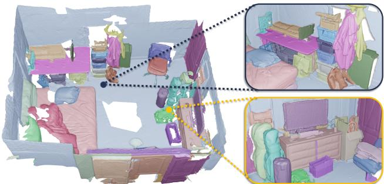  
Zero-shot instance segmentation

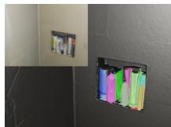  
“Shower Gel”

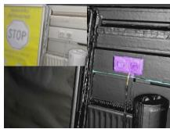  
“Outlet”

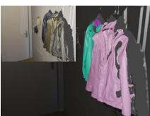  
Zero-shot query-based segmentation  
Figure 1. SAI3D: A Zero-Shot Approach for 3D Instance Segmentation. SAI3D leverages geometric priors and 2D segmentation foundation models to perform training-free zero-shot 3D instance segmentation (top). Our generated 3D masks enable applications of open-vocabulary queries of fine-grained 3D instances (bottom).

Advanced methods, based on vision-language foundation models like CLIP [36], have shown impressive performance in open-set semantic reasoning. These approaches have prompted recent studies exploring how these foundation models can assist in comprehending 3D scenes (e.g., OpenScene [32] and LERF [18]).

Although achieving open-world 3D grounding, these approaches typically predict a heatmap without distinguishing among different objects with the same semantics. Moreover, they rely on specific prompts that might not be readily available for all objects within a 3D scene.

More recently, the Segment Anything Model (SAM) [19] has achieved cutting-edge results in fine-grained image segmentation within complex scenes. Building on this progress, SA3D [1] utilizes a NeRF trained on a set of 2D images. By using manual prompts in a single view (rough points representing the target object), it generates object masks within a 3D grid via cross-view self-prompting, incorporating the functionalities of SAM. Advancing further, SAM3D [51] employs SAM for automatic mask generation, partitioning images into dense instance masks, and then projecting them into the 3D scene through an iterative merging process. Notably, SAM3D is capable of generating more detailed masks compared to ground-truth annotations in ScanNet. However, it is susceptible to 2D mask errors due to the local adjacent frame merging process, which might overlook global consensus.

In this work, we investigate how to better leverage geometric priors and multi-view consistency for fine-grained instance segmentation of intricate 3D scenes. We introduce SAI3D (Segment Any Instance in 3D Scenes), which takes advantage of SAM to conduct zero-shot 3D instance segmentation, without training or finetuning with 3D annotations. SAI3D dissects the 3D scene into geometric primitives, and builds a sparse affinity matrix that captures pairwise similarity scores based on the 2D masks generated by SAM. Our approach involves the progressive merging of these primitives using a region-growing algorithm, and an aggregation of votes from all valid images, to obtain a multi-view consistent 3D instance segmentation.

We evaluate our method on ScanNetV2 [5], ScanNet200 [38], Matterport3D [2] as well as the recently developed ScanNet++ [52]. Notably, ScanNet++ provides more detailed segmentation masks with rich semantics, thereby offering a more realistic and challenging benchmark for inthe-wild scenarios. For class-agnostic segmentation, our method significantly outperforms SAM3D and other openvocabulary segmentation baselines on both datasets. Remarkably, when evaluated on ScanNet++, our zero-shot method achieves better results when compared with fullysupervised Mask3D models trained on ScanNet, underlining the efficacy of SAI3D in fine-grained instance segmentation of complex 3D scenes.

Overall, our contributions are summarized as follows:

• We introduce SAI3D, an efficient zero-shot 3D instance segmentation method combining geometric priors and semantic-aware image segmentation.

• We present a carefully designed aggregation method of 2D image masks into coherent 3D segmentations that are consistent across different views.

• We demonstrate that the generated 3D masks are more accurate than previous approaches, opening new opportunities for unsupervised 3D learning.

## 2. Related Work

Closed-vocabulary 3D segmentation. 3D semantic segmentation is a long-studied topic, which aims to categorize each point in a given 3D scene with a specific semantic class [10, 15, 22, 23, 32–34, 38, 47, 48, 53]. 3D instance segmentation extends this by identifying distinct objects within the same semantic category and assigning unique masks to each object instance [4, 6, 12, 14, 15, 17, 21, 25, 29, 37, 41–46]. ScanNet200 [5] is a standard benchmark used for indoor 3D instance segmentation evaluation, and Mask3D [41] achieves state-of-the-art performance on it using a transformer-based network. Despite its advancements, Mask3D still requires a large amount of 3D annotated data for network training, as previous supervised learning methods. This hampers generalizing the method towards openworld scenarios containing novel objects of unseen categories. Moreover, the annotated 3D data is expensive to collect, and sometimes even impossible due to privacy reasons. In this paper, we focus on zero-shot open-vocabulary 3D segmentation, where no training or finetuning with 3D annotation is needed.

Open-vocabulary 2D image segmentation. By training on the large-scale web data of image-text pairs, foundation image-language models such as CLIP [35] have achieved impressive performance in aligning image and text in highdimensional feature space. The following works apply CLIP feature to various zero-shot image tasks, including image captioning [3, 49], object recognition [13], and object detection [11, 26]. More recently, OpenSeg [9] and OV-Seg [24] extend foundation image-language models to semantic image segmentation by learning a semanticaware pixel-wise embedding. Segment Anything Model (SAM) [19] takes a step further to segment any object, in any image, with user-provided or automatically-generated prompts. SAM has learned a general notion of what objects are, which enables zero-shot generalization to unfamiliar objects and images without requiring additional training. In our work, we benefit from the zero-shot generalization of SAM to produce high-quality 2D masks on multi-view images, and aggregate them into consistent 3D segments using a primitive-based region growing.

Open-vocabulary 3D segmentation. Inspired by the successful 2D open-vocabulary segmentation models, Open-Scene [32] proposes an open-vocabulary 3D semantic segmentation by distilling the CLIP feature onto 3D point clouds. On the other hand, LERF [18] and DFF [20] integrate language within NeRF by optimizing an extra feature field that aligns with the CLIP feature. While these methods enable open-vocabulary querying by text prompts, they cannot distinguish between object instances of the same categories. To solve this issue, OpenMask3D [43] and OpenIns3D [16] leverage the pre-trained Mask3D models for class-agnostic 3D mask proposal generation. While achieving promising instance segmentation results on indoor scenes with similar objects as the training data (Scan-Net), we show in our experiments that they fail in complex scenes with fine-grained objects. Concurrent work, MaskClustering [50] and Open3DIS [30], both utilize 2D foundation models to obtain segmentation masks, subsequently aggregating these masks to construct 3D representations. In this work, we integrate both 3D geometric priors and semantic clues from multi-view 2D masks from SAM model for fine-grained 3D instance segmentation.

## 3. Method

We build a training-free zero-shot 3D instance segmentation framework based on powerful 2D foundation models (e.g., SAM). Formally, we assume a 3D scene represented as point cloud $P \in \mathbb { R } ^ { N \times 3 }$ , together with a set of posed RGB-D images $\{ I _ { m } , D _ { m } , E _ { m } \} _ { m = 1 } ^ { M }$ , where $I _ { m }$ and $D _ { m }$ denotes the RGB image and depth map, and $E _ { m }$ is the corresponding camera extrinsic parameters. We aim to predict a set of 3D instance masks representing different object instances in that scene.

Overview. The overview of our approach is shown in Fig. 2. First, we group scene points into 3D primitives $\left\{ Q _ { i } \right\} _ { i = 1 } ^ { N _ { Q } }$ using normal-based graph cut, and predict 2D image masks $\{ S _ { i } \} _ { i = 1 } ^ { M } .$ based on the SAM automatic mask generation. The 3D point grouping incorporates geometry information, while the 2D image segmentation inherits the powerful parsing ability from image foundation models. Then, we build a scene graph with nodes corresponding to the 3D primitives, and each edge represents the pairwise affinity score computed based on the related 2D masks. Finally, we obtain the 3D instance masks by merging neighboring primitives with large affinity scores, which is implemented using a progressive region growing algorithm.

## 3.1. Scene Graph Construction

Based on the 3D scene point cloud, we group 3D points with similar geometric properties into continuous regions, and represent these regions as the scene nodes. For each node, we aggregate a set of related images as well as the corresponding 2D masks. We build graph edges to connect neighboring nodes, and weight each edge with the primitive similarity, which is computed by comparing two sets of image masks corresponding to the primitives.

3D primitives. We follow recent works [39, 51] to group points with similar geometric properties into 3D primitives. Specifically, we apply a normal-based graph cut algorithm [7] to over-segment the point cloud $P \in \mathbb { R } ^ { N \times 3 }$ into a set of superpoints $\{ Q _ { i } \} _ { i = 1 } ^ { N _ { Q } }$ . Compared with a scene graph built at the point-level, the transformation of unstructured 3D points to geometry-based primitives enables efficient handling of unstructured 3D data. More importantly, the affinity scores computed between primitives are more reliable than those computed between points, which largely improves the robustness of our approach.

2D masks. We employ the auto mask generation technique of SAM to obtain 2D object masks on the RGB images. We note that when a pixel is covered by multiple masks, only the one with the highest predicted IoU is maintained to achieve distinct, non-overlapping masks. As shown in Fig. 2, the predicted 2D masks represent the notion of objects learned by SAM, and we incorporate it into the 3D scenes via a primitive-based region growing.

## 3.2. Primitive Affinity

Given a pair of 3D primitives $Q _ { i } , Q _ { j }$ , the affinity score $A _ { i , j }$ between them represents the likelihood of their belonging to the same object instance. We compute this affinity score by comparing the corresponding 2D masks covered by the projected 3D primitives. This results in an adjacency matrix $\mathbf { \bar { A } } \in \mathbb { R } ^ { N _ { Q } \times N _ { Q } }$ , which will be used for merging primitives with high-affinity scores.

Primitive projection. We consider the common pinhole camera matrix for 2D-3D projection in our approach. For the i-th 3D primitive $Q _ { i } ,$ , we obtain its projection on the mth image by rendering $Q _ { i }$ with the corresponding camera pose parameters $E _ { m }$

$$
Q _ { i , m } ^ { \mathrm { 2 D } } = \Pi ( Q _ { i } , E _ { m } )\tag{1}
$$

where Π(·) is the point rendering operator. As shown in Fig. 3, the projected primitives can be partially visible or completely occluded in the image. We compute the visibility of a projected primitive as the ratio of 3D points that are visible in the image. For each primitive, we discard images where the primitive visibility is zero, and keep the rest images as valid ones.

Affinity in a single view. Based on the projected primitive $Q _ { i , m } ^ { \mathrm { 2 D } }$ and the image segmentation $S _ { m } .$ , we collect the mask labels covered by $Q _ { i , m } ^ { 2 \mathrm { D } }$ and compute a normalized histogram of the mask labels as a vector, denoted as $\mathbf { h } _ { i , m }$ . This histogram represents a distribution of 2D instance mask labels corresponding to the projected primitive. As shown in Fig. 3, a projected primitive can have multiple 2D instance mask labels, represented in different colors.

We compute the affinity score between two primitives projected in the m-th image as the cosine similarity between two vectors:

$$
A _ { i , j } ^ { m } = \frac { \mathbf { h } _ { i , m } \cdot \mathbf { h } _ { j , m } } { | \mathbf { h } _ { i , m } | | \mathbf { h } _ { j , m } | } .\tag{2}
$$

Affinity in multiple views. Since 3D primitives are observed in different images, the affinity scores $A _ { i , j } ^ { m }$ can also vary across different views. We treat the affinity score of each valid as a candidate, and combine them together using a voting scheme in order to achieve cross-view consistency. Formally, we compute a weight for each candidate $A _ { i , j } ^ { m }$ , and get the final affinity score using weighted-sum:

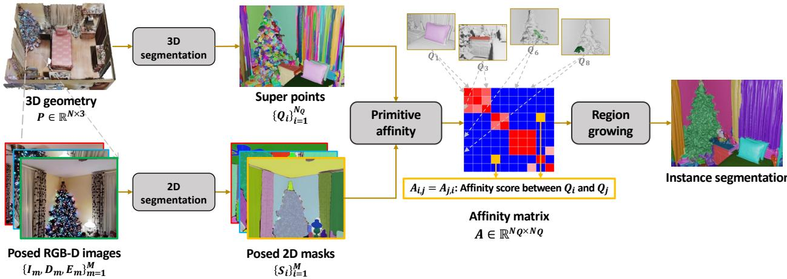  
Figure 2. Method overview. Our approach combines geometric priors with the capabilities of 2D foundation models. We over-segment 3D point clouds into superpoints (top-left), and generate 2D image masks using SAM (bottom-left). We then construct a scene graph that quantifies the pairwise affinity scores of super points (middle). Finally, we leverage a progressive region growing to gradually merge 3D superpoints into the final 3D instance segmentation masks (right).

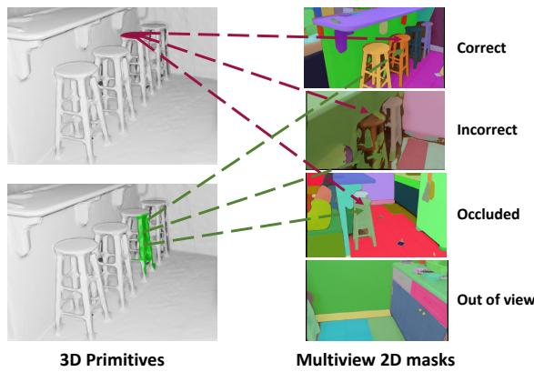  
Figure 3. 3D-2D projections. Affinity scores for 3D primitives are derived by projecting them onto multi-view 2D masks. In the provided example, accurate masks (first row) confirm object unity, like parts of a stool, while incorrect masks (second row) introduce noise in affinity assessment. Points occluded in images (third row) or outside image boundaries (fourth row) are excluded from affinity score calculations to ensure segmentation accuracy.

$$
A _ { i , j } = \frac { 1 } { \sum _ { m = 1 } ^ { M } w _ { i , j } ^ { m } } \sum _ { m = 1 } ^ { M } \left( w _ { i , j } ^ { m } A _ { i , j } ^ { m } \right) .\tag{3}
$$

The weight $w _ { i , j } ^ { m }$ is calculated as the product of visibilities of $Q _ { i , m } ^ { \mathrm { 2 D } }$ and $Q _ { j , m } ^ { \mathrm { 2 D } }$ as Eq. 4

$$
w _ { i , j } ^ { m } = \frac { \sum _ { p \in Q _ { i } } \mathbb { 1 } \ ( \mathrm { V a l i d } ( p , S _ { m } ) ) } { | Q _ { i } | } \frac { \sum _ { p \in Q _ { j } } \mathbb { 1 } \ ( \mathrm { V a l i d } ( p , S _ { m } ) ) } { | Q _ { j } | }\tag{4}
$$

where “Valid” function indicates if the projected point p is visible in the 2D segmentation mask $S _ { m }$ . Note that $w _ { i , j } ^ { m } = 0$

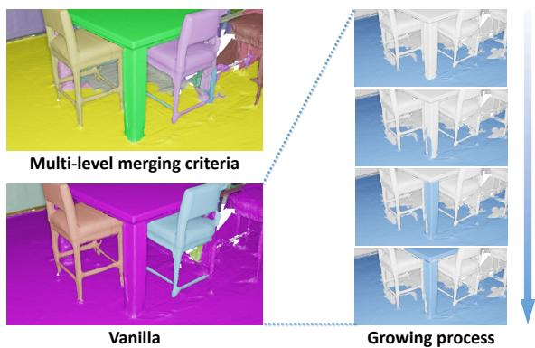  
Figure 4. Multi-level merging criteria. (Left) Compared with the vanilla region growing that accumulates merging errors during the growing process, our approach achieves better results using multilevel merging criteria. (Right) The vanilla algorithm mistakenly merges the entire table with the ground, triggered merely by an incorrect affinity between tiny segments of the table leg and the ground.

for invalid images where either one of the primitives is not visible.

## 3.3. Primitive Merging

Based on the scene graph and the computed affinity matrix, we obtain the final 3D instance masks using a regiongrowing algorithm that gradually merges 3D primitives with large affinity scores. We design a progressive regiongrowing algorithm, with multi-level merging criteria.

Multi-level merging criteria. Given a region represented as a queue of primitives, the top primitive is popped out and used to retrieve the neighboring nodes for growing. In the vanilla region growing algorithm, a node would be added to the region if it shares a high-affinity score with the popped node. However, this pairwise comparison is prone to errors, which would accumulate along with the growing process, as shown in Fig. 4. To solve this problem, we propose a multilevel merging criteria that compute the affinity score in a hierarchical way, where the affinity scores between the candidate node and all the nodes within the region are summed together by weighting them according to the graph distance.

Progressive growing. Another important hyper-parameter of region-growing is the affinity threshold, which is used to determine if two regions should be merged or not. As shown in Fig. 5, the region-growing process is sensitive to the threshold value, and setting a fixed threshold usually results in over-segmentation or under-segmentation. Based on this observation, we propose a progressive growing algorithm, where the growing process is decomposed into multiple stages with threshold values varying from high to low. In this way, we merge small regions with a strict criterion at the beginning, which prevents incorrect merges from accumulating along with the growing process. As the regions gradually grow into large ones that are more reliable, we use a more relaxed criterion to merge them. This dynamic thresholding approach ensures that our merging framework remains sensitive to the evolving certainty of connectivity, thereby enhancing the accuracy of the final segmentation.

## 3.4. Open-vocabulary 3D Object Search

Our generated 3D instance masks enable the application of open-vocabulary queries of fine-grained 3D objects. Given a text prompt describing the target object, we leverage the 2D segmentation method OVSeg [24] to obtain semantic masks on the 2D images. We then back-project the 2D object masks onto 3D points, and compute the overlap between the projected masks and the generated 3D instance masks. The 3D instances having an overlap larger than 50% will be assigned as the target object masks.

## 4. Experiment

We evaluate SAI3D on multiple datasets to demonstrate its effectiveness in 3D instance segmentation. We compare it with leading methods in open-vocabulary segmentation, which, like SAI3D, are designed for zero-shot transfer scenarios. Additionally, we benchmark against the state-ofthe-art closed-vocabulary methods that require training on annotated datasets.

## 4.1. Experiment Setup

Datasets. ScanNet++ [52] is a very recently released indoor dataset that offers posed RGB-D streams, high-quality 3D geometry captured by advanced laser technology, and comprehensive object annotations. Compared with previous datasets, ScanNet++ features higher-resolution 3D geometry and finer-grained data annotations, especially for long-tail semantics, which poses new challenges that reflect real-world applications. To better validate the robustness of our method, we also incorporate the well-studied Scan-NetV2 [5], ScanNet200 [38] (with 200 semantic classes) and Matterport3D[2] datasets. Please see supplementary for more details.

Table 1. Class-agnostic 3D instance segmentation on Scan-Net++ dataset. We compare against both closed-vocabulary and open-vocabulary methods, and report average precision scores. Note that Mask3D is trained on ScanNetV2 dataset.
<table><tr><td>Method</td><td>Training Set</td><td>AP</td><td> $\mathrm { { A P } _ { 5 0 } }$ </td><td> $\mathrm { A P _ { 2 5 } }$ </td></tr><tr><td>Closed-vocabulary</td><td></td><td></td><td></td><td></td></tr><tr><td>Mask3D [40]</td><td>ScanNetV2</td><td>9.9</td><td>17.3</td><td>25.8</td></tr><tr><td>Open-vocabulary</td><td></td><td></td><td></td><td></td></tr><tr><td>Felzenszwalb et al. [7]</td><td></td><td>4.1</td><td>9.2</td><td>25.3</td></tr><tr><td>SAM3D [51]</td><td></td><td>7.2</td><td>14.2</td><td>29.4</td></tr><tr><td>Ours</td><td></td><td>17.1</td><td>31.1</td><td>49.5</td></tr></table>

Evaluation metrics. We evaluate the numerical results with the widely-used Average Precision score. Following the baselines [39, 41, 43], we report scores at IoU scores of 25 % and 50 % (AP@25, AP@50) and averaged over all overlaps between [50 % and 95 %] at 5 % steps. We adopt two evaluation setups: class-agnostic instance segmentation focuses only on the accuracy of the instance masks themselves, and semantic instance segmentation that also considers their associated semantic labels. We calculated the average score across all semantic categories to obtain the overall performance.

Baselines. We compare our approach with both closedvocabulary and open-vocabulary baselines. Mask3D is the state-of-the-art, transformer-based method, supervised with training data. For open-vocabulary methods, we compare with the recent SAM3D [51], UnScene3D [39], and OVIR-3D [27]. Notably, SAM3D is very similar to our approach by building upon the automatic mask generation of SAM, but differs in the merging process. Unlike our approach based on 3D primitives, SAM3D projects 2D masks onto 3D and iteratively merges them frame by frame, which overlooks the global geometry properties of the 3D scene. OpenMask3D [43] is built upon Mask3D with supervised mask proposals and open-vocabulary semantic assignment. In addition, We also compare with the traditional point grouping methods like HDBSCAN [28] and Felzenszwalb’s algorithm [7], as well as a feature clustering method [31].

## 4.2. Results

Fine-grained 3D segmentation. Table 1 reports the numerical results for class-agnostic instance segmentation on ScanNet++ dataset. Our method outperforms prior works in all evaluation metrics. Not only did it surpass the unsupervised methods significantly, but it also outperformed the closed-vocabulary baseline trained on ScanNetV2. This highlights our method’s ability to handle detailed objects

Progressive threshold

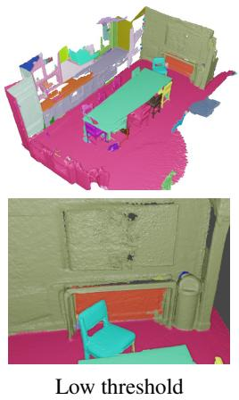

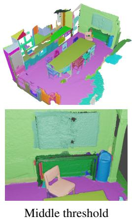

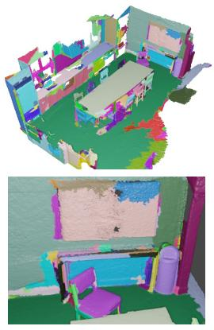

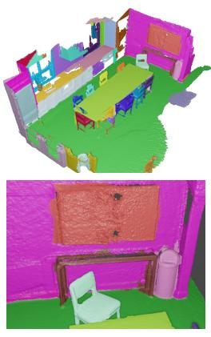  
Figure 5. Different thresholding strategies. Without dynamic thresholding, the segmentation results can be sensitive to the manual affinity threshold. A lower threshold is prone to under-segmentation, such as the merged television and the wall (first column). Conversely, a higher threshold may result in over-segmentation, breaking objects into messy parts (third column). Our progressive thresholding introduces a dynamic threshold along with the merging process, thus contributing to more robust and accurate segmentation.

Table 2. Class-agnostic 3D instance segmentation on Scan-NetV2 dataset.
<table><tr><td>Method</td><td>Training Set</td><td>AP</td><td> $\mathrm { { A P } _ { 5 0 } }$ </td><td>AP25</td></tr><tr><td>Closed-vocabulary</td><td></td><td></td><td></td><td></td></tr><tr><td>Mask3D [40]</td><td>ScanNetV2</td><td>65.7</td><td>83.1</td><td>91.0</td></tr><tr><td>Mask3D [40]</td><td>S3DIS</td><td>31.1</td><td>44.9</td><td>58.0</td></tr><tr><td>Open-vocabulary</td><td></td><td></td><td></td><td></td></tr><tr><td>HDBSCAN [28]</td><td></td><td>1.6</td><td>5.5</td><td>32.1</td></tr><tr><td>Nunes et al. [31]</td><td></td><td>2.3</td><td>7.3</td><td>30.5</td></tr><tr><td>Felzenszwalb et al. [7]</td><td></td><td>5.0</td><td>12.7</td><td>38.9</td></tr><tr><td>UnScene3D [39] *</td><td></td><td>15.9</td><td>32.2</td><td>58.5</td></tr><tr><td>SAM3D [51]</td><td></td><td>20.2</td><td>34.0</td><td>53.3</td></tr><tr><td>Ours</td><td></td><td>30.8</td><td>50.5</td><td>70.6</td></tr></table>

and diverse semantic categories effectively.

The visual comparisons, illustrated in Fig. 6, further underscore the effectiveness of our approach. Compared with prior works that struggle to generate clean segments on objects of small size, our approach is capable of identifying complex objects in cluttered scenes. For example, we succeed in segmenting various items stored in the cabinet while other methods group them together as a single instance.

Open-vocabulary 3D object querying. An important application of our method is zero-shot prompt-based instance segmentation. As depicted in Fig. 1 and 7, our approach effectively segments the 3D scene into clean segments, and identifies specific objects with the input prompts. Since our approach generates more detailed and accurate 3D instance segmentation than previous works, we are able to retrieve rare objects like “toilet roll” or “shower gel”.

Standard 3D segmentation. Table 2 reports the classagnostic instance segmentation results on ScanNetV2 dataset. Our method significantly outperforms the openvocabulary baselines that do not require any training or finetuning on 3D annotation. As seen from the table, the supervised method Mask3D suffers from a performance drop when trained on a different dataset, which indicates that supervised methods tend to overfit the training data, and lack a generalization ability toward open scenes.

Table 3. Semantic instance segmentation on ScanNet200 dataset.
<table><tr><td>Method</td><td>AP</td><td> $\mathrm { { A P } _ { 5 0 } }$ </td><td> $\mathrm { A P _ { 2 5 } }$ </td><td>Head (AP)</td><td>Common (AP)</td><td>Tail (AP)</td></tr><tr><td colspan="7">Sup. mask + Open-vocab. semantic</td></tr><tr><td>OpenMask3D [43] 15.4</td><td></td><td>19.9</td><td>23.1</td><td>17.1</td><td>14.1</td><td>14.9</td></tr><tr><td colspan="7">Open-vocab. mask + Open-vocab. semantic</td></tr><tr><td>OVIR-3D [27]†</td><td>9.3</td><td>18.7</td><td>25.0</td><td>9.8</td><td>9.4</td><td>8.5</td></tr><tr><td>SAM3D [51]</td><td>9.8</td><td>15.2</td><td>20.7</td><td>9.2</td><td>8.3</td><td>12.3</td></tr><tr><td>Ours</td><td>12.7</td><td>18.8</td><td>24.1</td><td>12.1</td><td>10.4</td><td>16.2</td></tr></table>

Following OpenMask3D [43], semantic instance segmentation is evaluated on ScanNet200 dataset, with numerical results in Table 3. We adopt the pipeline of Open-Mask3D [43] to assign semantic labels for our method. As shown in the table, our method clearly results in superior performance than the open-vocabulary baselines, but lags behind OpenMask3D that relies on the supervised mask proposals. Upon closer examination, we notice that our method shows weaker performance on frequently occurring semantics (Head), but outperforms on long-tail labels (Tail). This observation highlights the strength of our method in zero-shot generalization, better at handling diverse and less common labels.

“Switch”  

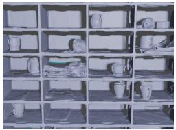

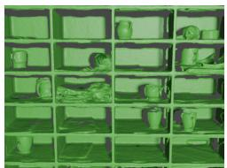

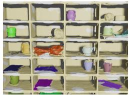

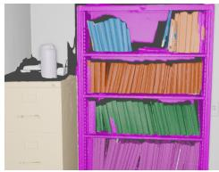

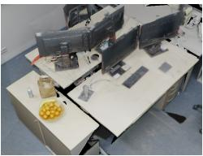

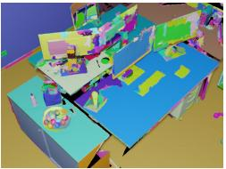

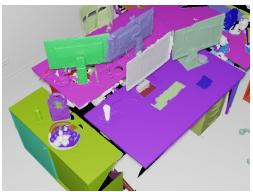

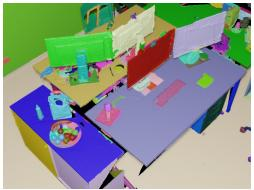

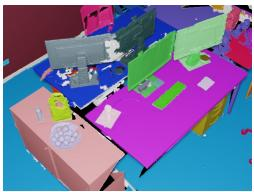

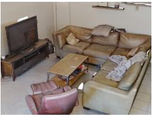

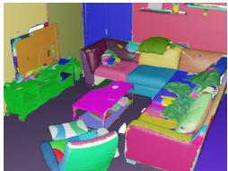

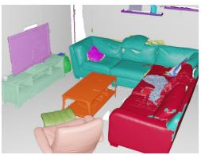

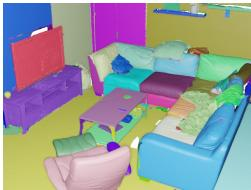

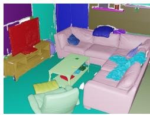

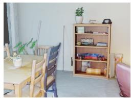  
Input

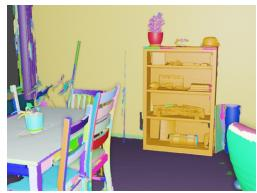  
SAM3D

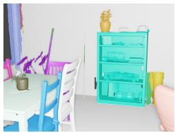  
Mask3D

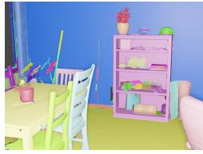  
Ours

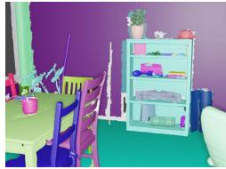  
GT

Figure 6. Visual results of 3D instance segmentation on ScanNet++ dataset. We compare with both open-vocabulary and closedvocabulary baselines.  
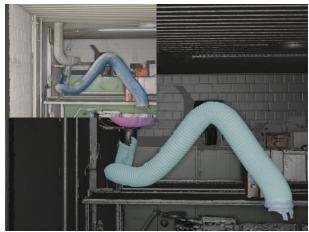  
“Pipe”

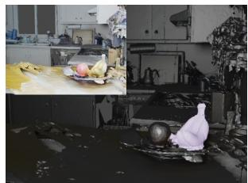

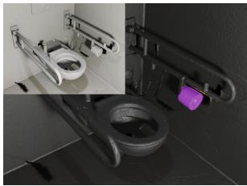  
“Banana”  
“Toilet roll”

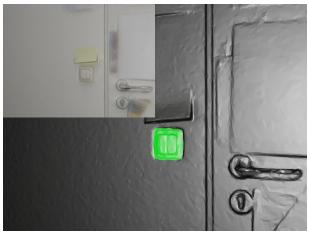

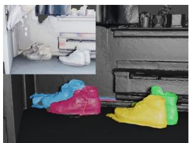  
“Shoes”

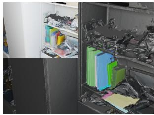  
“Book”

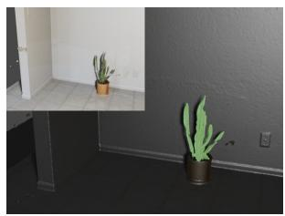  
“Botany”

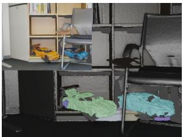  
“Toy car”

Figure 7. Open-vocabulary 3D object search. Given a text prompt, our method finds accurate target object masks, even with long-tail semantics.

Table 4. Class-agnostic and semantic instance segmentation on Matterport3D dataset.
<table><tr><td rowspan="2">Method</td><td colspan="3">Class-agnostic</td><td colspan="3">Semantic</td></tr><tr><td>AP</td><td> $\mathrm { { A P } _ { 5 0 } }$ </td><td> $\mathrm { A P _ { 2 5 } }$ </td><td>AP</td><td> $\mathrm { { A P } _ { 5 0 } }$ </td><td> $\mathrm { { A P _ { 2 5 } } }$ </td></tr><tr><td>OpenMask3D [43]</td><td>15.3</td><td>28.3</td><td>43.3</td><td>7.7</td><td>13.9</td><td>20.3</td></tr><tr><td>OVIR-3D [27]</td><td>6.6</td><td>15.6</td><td>28.3</td><td>5.8</td><td>13.8</td><td>22.4</td></tr><tr><td>SAM3D [51]</td><td>10.1</td><td>19.4</td><td>36.1</td><td>4.4</td><td>7.3</td><td>11.3</td></tr><tr><td>Ours</td><td>21.5</td><td>38.3</td><td>59.1</td><td>8.9</td><td>15.3</td><td>20.9</td></tr></table>

Table 5. The ablation studies of the effectiveness of our designs. The experiments are conducted on ScanNetV2 dataset.
<table><tr><td>3D superpoint primitive</td><td>Multi-level merging criteria</td><td>Progressive growing</td><td>AP</td><td> $\mathrm { { A P } _ { 5 0 } }$ </td><td> $\mathrm { A P _ { 2 5 } }$ </td></tr><tr><td></td><td></td><td></td><td>19.5</td><td>32.8</td><td>52.9</td></tr><tr><td>√</td><td></td><td></td><td>24.2</td><td>39.5</td><td>59.2</td></tr><tr><td>√</td><td>√</td><td></td><td>28.4</td><td>46.5</td><td>67.0</td></tr><tr><td>√</td><td></td><td>√</td><td>27.6</td><td>45.5</td><td>65.8</td></tr><tr><td>√</td><td>√</td><td>√</td><td>30.8</td><td>50.5</td><td>70.6</td></tr></table>

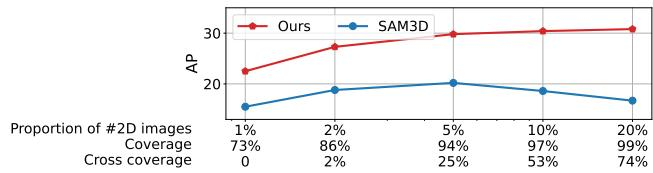  
Figure 8. Ablation studies on the correlation between performance and the number of 2D images. We define coverage and cross coverage as the percentage of points observed at least once and more than 10 times, respectively. The experiments are conducted on ScanNetV2 dataset.

To further evaluate the generalizability, we conduct experiments on Matterport3D dataset for both class-agnostic and semantic instance segmentation tasks. As shown in Table 4, our zero-shot method consistently outperforms other baselines, while OpenMask3D suffers a significant performance drop since it is trained on ScanNet200 dataset.

## 4.3. Ablation and Analysis

Effect of our designs on the region growing algorithm. We analyze the three key design choices of our region growing algorithm: the adoption of 3D superpoint primitive, Multi-level merging criteria, and Progressive growing. The results of ablation studies are shown in Table 5. We find that omitting the 3D superpoints and using a classic point-based region-growing approach leads to a noticeable drop in performance. The incorporation of multi-level merging criteria and the use of progressive growing both contribute to enhancing the algorithm’s robustness, particularly in dealing with the noise present in 2D segmentation masks, yielding better results respectively. When all the proposed designs are combined, there is an approximately 50% improvement compared to the original, basic version of the algorithm, underlining the effectiveness of our design choices.

Effect of the number of 2D images. As both our approach and the concurrent method SAM3D leverages 2D image masks, we thus study the method’s robustness against the number of images. Among all the images of a 3D scene, we vary the proportion of views from 1% to 20% and report the performance curve in Fig. 8. Our approach progressively improves the 3D segmentation performance when more views are provided, while SAM3D fails to aggregate useful information when the proportion of views becomes larger than 5%. More importantly, our approach achieves an AP score larger than 20 with only 1% of views, outperforming the best performance achieved by SAM3D. This highlights the effectiveness of our algorithm.

## 5. Conclusion

We introduce SAI3D, a novel approach for zero-shot 3D instance segmentation. Our method offers an efficient alternative to supervised methods which are confined to specific datasets and hence inhibit broader applicability in openworld scenarios. The technique we presented builds upon the power of 2D and 3D segmentation techniques, and a novel progressive region-growing algorithm, which smartly merges the 3D superpoints into object masks that define the final 3D instance segmentation.

Through our evaluation on ScanNet, ScanNet++ and Matterport3D datasets, we demonstrate that our approach significantly outperforms prior unsupervised methods like SAM3D in class-agnostic segmentation, and even surpass fully supervised Mask3D models trained with 3D annotations on the more challenging ScanNet++ dataset. This success underscores the potential of leveraging geometric primitives and multi-view consistency to achieve highquality instance segmentation in complex 3D scenes, without using 3D labeled data.

Limitations. Our method fundamentally relies on accurate 2D segmentation results and reliable 2D-3D alignment. As our approach builds a scene graph based on 3D primitives and computes an affinity matrix based on 2D masks through 2D-3D lifting, incorrect 2D masks or camera poses naturally result in unreliable affinities, thus affecting the fine segmentation results. Though several techniques are designed to better leverage geometry priors and multi-view consensus, designing a more advanced 2D mask aggregation mechanism should be a promising direction.

Another limitation is the running speed. As our approach involves aggregating 2D mask segmentation from images, the total processing time linearly scale with the number of images making it difficult to apply in large-scale scenes. Designing a more efficient algorithm without iterating over all images is another important future direction.

Acknowledgement. This work was supported in part by National Key R&D Program of China 2022ZD0160801.

## References

[1] Jiazhong Cen, Zanwei Zhou, Jiemin Fang, Chen Yang, Wei Shen, Lingxi Xie, Xiaopeng Zhang, and Qi Tian. Segment anything in 3d with nerfs. 2023. 2

[2] Angel Chang, Angela Dai, Thomas Funkhouser, Maciej Halber, Matthias Niessner, Manolis Savva, Shuran Song, Andy Zeng, and Yinda Zhang. Matterport3d: Learning from rgbd data in indoor environments. International Conference on 3D Vision (3DV), 2017. 2, 5

[3] Jaemin Cho, Seunghyun Yoon, Ajinkya Kale, Franck Dernoncourt, Trung Bui, and Mohit Bansal. Fine-grained image captioning with clip reward. arXiv preprint arXiv:2205.13115, 2022. 2

[4] Christopher Choy, JunYoung Gwak, and Silvio Savarese. 4d spatio-temporal convnets: Minkowski convolutional neural networks. In Proceedings of the IEEE/CVF conference on computer vision and pattern recognition, pages 3075–3084, 2019. 2

[5] Angela Dai, Angel X Chang, Manolis Savva, Maciej Halber, Thomas Funkhouser, and Matthias Nießner. Scannet: Richly-annotated 3d reconstructions of indoor scenes. In Proceedings ofthe IEEE conference on computer vision and pattern recognition, pages 5828–5839, 2017. 1, 2, 5

[6] Siqi Fan, Qiulei Dong, Fenghua Zhu, Yisheng Lv, Peijun Ye, and Fei-Yue Wang. Scf-net: Learning spatial contextual features for large-scale point cloud segmentation. In Proceedings of the IEEE/CVF Conference on Computer Vision and Pattern Recognition, pages 14504–14513, 2021. 2

[7] Pedro F Felzenszwalb and Daniel P Huttenlocher. Efficient graph-based image segmentation. International journal of computer vision, 59:167–181, 2004. 3, 5, 6

[8] Andreas Geiger, Philip Lenz, Christoph Stiller, and Raquel Urtasun. Vision meets robotics: The kitti dataset. International Journal ofRobotics Research (IJRR), 2013. 1

[9] Golnaz Ghiasi, Xiuye Gu, Yin Cui, and Tsung-Yi Lin. Scaling open-vocabulary image segmentation with image-level labels. In European Conference on Computer Vision, pages 540–557. Springer, 2022. 2

[10] Benjamin Graham, Martin Engelcke, and Laurens Van Der Maaten. 3d semantic segmentation with submanifold sparse convolutional networks. In Proceedings of the IEEE conference on computer vision and pattern recognition, pages 9224–9232, 2018. 2

[11] Xiuye Gu, Tsung-Yi Lin, Weicheng Kuo, and Yin Cui. Open-vocabulary object detection via vision and language knowledge distillation. arXiv preprint arXiv:2104.13921, 2021. 2

[12] Lei Han, Tian Zheng, Lan Xu, and Lu Fang. Occuseg: Occupancy-aware 3d instance segmentation. In Proceedings ofthe IEEE/CVF conference on computer vision and pattern recognition, pages 2940–2949, 2020. 2

[13] Deepti Hegde, Jeya Maria Jose Valanarasu, and Vishal Patel. Clip goes 3d: Leveraging prompt tuning for language grounded 3d recognition. In Proceedings of the IEEE/CVF International Conference on Computer Vision, pages 2028– 2038, 2023. 2

[14] Ji Hou, Angela Dai, and Matthias Nießner. 3d-sis: 3d semantic instance segmentation of rgb-d scans. In Proceedings ofthe IEEE/CVF conference on computer vision and pattern recognition, pages 4421–4430, 2019. 2

[15] Qingyong Hu, Bo Yang, Linhai Xie, Stefano Rosa, Yulan Guo, Zhihua Wang, Niki Trigoni, and Andrew Markham. Randla-net: Efficient semantic segmentation of large-scale point clouds. In Proceedings of the IEEE/CVF conference on computer vision and pattern recognition, pages 11108– 11117, 2020. 2

[16] Zhening Huang, Xiaoyang Wu, Xi Chen, Hengshuang Zhao, Lei Zhu, and Joan Lasenby. Openins3d: Snap and lookup for 3d open-vocabulary instance segmentation. arXiv preprint arXiv:2309.00616, 2023. 2

[17] Le Hui, Linghua Tang, Yaqi Shen, Jin Xie, and Jian Yang. Learning superpoint graph cut for 3d instance segmentation. Advances in Neural Information Processing Systems, 35:36804–36817, 2022. 2

[18] Justin Kerr, Chung Min Kim, Ken Goldberg, Angjoo Kanazawa, and Matthew Tancik. Lerf: Language embedded radiance fields. In Proceedings of the IEEE/CVF International Conference on Computer Vision, pages 19729–19739, 2023. 1, 2

[19] Alexander Kirillov, Eric Mintun, Nikhila Ravi, Hanzi Mao, Chloe Rolland, Laura Gustafson, Tete Xiao, Spencer Whitehead, Alexander C. Berg, Wan-Yen Lo, Piotr Dollar, and´ Ross Girshick. Segment anything. arXiv:2304.02643, 2023. 2

[20] Sosuke Kobayashi, Eiichi Matsumoto, and Vincent Sitzmann. Decomposing nerf for editing via feature field distillation. Advances in Neural Information Processing Systems, 35:23311–23330, 2022. 2

[21] Maksim Kolodiazhnyi, Danila Rukhovich, Anna Vorontsova, and Anton Konushin. Top-down beats bottom-up in 3d instance segmentation. arXiv preprint arXiv:2302.02871, 2023. 2

[22] Abhijit Kundu, Xiaoqi Yin, Alireza Fathi, David Ross, Brian Brewington, Thomas Funkhouser, and Caroline Pantofaru. Virtual multi-view fusion for 3d semantic segmentation. In Computer Vision–ECCV 2020: 16th European Conference, Glasgow, UK, August 23–28, 2020, Proceedings, Part XXIV 16, pages 518–535. Springer, 2020. 2

[23] Yangyan Li, Rui Bu, Mingchao Sun, Wei Wu, Xinhan Di, and Baoquan Chen. Pointcnn: Convolution on x-transformed points. Advances in neural information processing systems, 31, 2018. 2

[24] Feng Liang, Bichen Wu, Xiaoliang Dai, Kunpeng Li, Yinan Zhao, Hang Zhang, Peizhao Zhang, Peter Vajda, and Diana Marculescu. Open-vocabulary semantic segmentation with mask-adapted clip. In Proceedings of the IEEE/CVF Conference on Computer Vision and Pattern Recognition, pages 7061–7070, 2023. 2, 5

[25] Zhihao Liang, Zhihao Li, Songcen Xu, Mingkui Tan, and Kui Jia. Instance segmentation in 3d scenes using semantic superpoint tree networks. In Proceedings of the IEEE/CVF International Conference on Computer Vision, pages 2783– 2792, 2021. 2

[26] Jiayi Lin and Shaogang Gong. Gridclip: One-stage object detection by grid-level clip representation learning. arXiv preprint arXiv:2303.09252, 2023. 2

[27] Shiyang Lu, Haonan Chang, Eric Pu Jing, Abdeslam Boularias, and Kostas Bekris. Ovir-3d: Open-vocabulary 3d instance retrieval without training on 3d data. In Conference on Robot Learning, pages 1610–1620. PMLR, 2023. 5, 6, 8

[28] Leland McInnes and John Healy. Accelerated hierarchical density based clustering. In 2017 IEEE International Conference on Data Mining Workshops (ICDMW), pages 33–42. IEEE, 2017. 5, 6

[29] Alexey Nekrasov, Jonas Schult, Or Litany, Bastian Leibe, and Francis Engelmann. Mix3d: Out-of-context data augmentation for 3d scenes. In 2021 International Conference on 3D Vision (3DV), pages 116–125. IEEE, 2021. 2

[30] Phuc DA Nguyen, Tuan Duc Ngo, Chuang Gan, Evangelos Kalogerakis, Anh Tran, Cuong Pham, and Khoi Nguyen. Open3dis: Open-vocabulary 3d instance segmentation with 2d mask guidance. arXiv preprint arXiv:2312.10671, 2023. 3

[31] Lucas Nunes, Xieyuanli Chen, Rodrigo Marcuzzi, Aljosa Osep, Laura Leal-Taixe, Cyrill Stachniss, and Jens Behley.´ Unsupervised class-agnostic instance segmentation of 3d lidar data for autonomous vehicles. IEEE Robotics and Automation Letters, 7(4):8713–8720, 2022. 5, 6

[32] Songyou Peng, Kyle Genova, Chiyu ”Max” Jiang, Andrea Tagliasacchi, Marc Pollefeys, and Thomas Funkhouser. Openscene: 3d scene understanding with open vocabularies. In Proceedings of the IEEE/CVF Conference on Computer Vision and Pattern Recognition (CVPR), 2023. 1, 2

[33] Charles R Qi, Hao Su, Kaichun Mo, and Leonidas J Guibas. Pointnet: Deep learning on point sets for 3d classification and segmentation. In Proceedings of the IEEE conference on computer vision and pattern recognition, pages 652–660, 2017.

[34] Charles Ruizhongtai Qi, Li Yi, Hao Su, and Leonidas J Guibas. Pointnet++: Deep hierarchical feature learning on point sets in a metric space. Advances in neural information processing systems, 30, 2017. 2

[35] Alec Radford, Jong Wook Kim, Chris Hallacy, Aditya Ramesh, Gabriel Goh, Sandhini Agarwal, Girish Sastry, Amanda Askell, Pamela Mishkin, Jack Clark, et al. Learning transferable visual models from natural language supervision. In International conference on machine learning, pages 8748–8763. PMLR, 2021. 2

[36] Alec Radford, Jong Wook Kim, Chris Hallacy, Aditya Ramesh, Gabriel Goh, Sandhini Agarwal, Girish Sastry, Amanda Askell, Pamela Mishkin, Jack Clark, et al. Learning transferable visual models from natural language supervision. In International conference on machine learning, pages 8748–8763. PMLR, 2021. 1

[37] Dario Rethage, Johanna Wald, Jurgen Sturm, Nassir Navab, and Federico Tombari. Fully-convolutional point networks for large-scale point clouds. In Proceedings of the European Conference on Computer Vision (ECCV), pages 596– 611, 2018. 2

[38] David Rozenberszki, Or Litany, and Angela Dai. Languagegrounded indoor 3d semantic segmentation in the wild. In

European Conference on Computer Vision, pages 125–141. Springer, 2022. 2, 5

[39] David Rozenberszki, Or Litany, and Angela Dai. Unscene3d: Unsupervised 3d instance segmentation for indoor scenes. arXiv preprint arXiv:2303.14541, 2023. 3, 5, 6

[40] Jonas Schult, Francis Engelmann, Alexander Hermans, Or Litany, Siyu Tang, and Bastian Leibe. Mask3D: Mask Transformer for 3D Semantic Instance Segmentation. 2023. 5, 6

[41] Jonas Schult, Francis Engelmann, Alexander Hermans, Or Litany, Siyu Tang, and Bastian Leibe. Mask3d: Mask transformer for 3d semantic instance segmentation. In 2023 IEEE International Conference on Robotics and Automation (ICRA), pages 8216–8223. IEEE, 2023. 2, 5

[42] Jiahao Sun, Chunmei Qing, Junpeng Tan, and Xiangmin Xu. Superpoint transformer for 3d scene instance segmentation. In Proceedings of the AAAI Conference on Artificial Intelligence, pages 2393–2401, 2023.

[43] Ayc¸a Takmaz, Elisabetta Fedele, Robert W. Sumner, Marc Pollefeys, Federico Tombari, and Francis Engelmann. OpenMask3D: Open-Vocabulary 3D Instance Segmentation. In Advances in Neural Information Processing Systems (NeurIPS), 2023. 2, 5, 6, 8

[44] Hugues Thomas, Charles R Qi, Jean-Emmanuel Deschaud, Beatriz Marcotegui, Franc¸ois Goulette, and Leonidas J Guibas. Kpconv: Flexible and deformable convolution for point clouds. In Proceedings ofthe IEEE/CVF international conference on computer vision, pages 6411–6420, 2019.

[45] Thang Vu, Kookhoi Kim, Tung M Luu, Thanh Nguyen, Junyeong Kim, and Chang D Yoo. Softgroup++: Scalable 3d instance segmentation with octree pyramid grouping. arXiv preprint arXiv:2209.08263, 2022.

[46] Weiyue Wang, Ronald Yu, Qiangui Huang, and Ulrich Neumann. Sgpn: Similarity group proposal network for 3d point cloud instance segmentation. In Proceedings of the IEEE conference on computer vision and pattern recognition, pages 2569–2578, 2018. 2

[47] Yue Wang, Yongbin Sun, Ziwei Liu, Sanjay E Sarma, Michael M Bronstein, and Justin M Solomon. Dynamic graph cnn for learning on point clouds. ACM Transactions on Graphics (tog), 38(5):1–12, 2019. 2

[48] Wenxuan Wu, Zhongang Qi, and Li Fuxin. Pointconv: Deep convolutional networks on 3d point clouds. In Proceedings of the IEEE/CVF Conference on computer vision and pattern recognition, pages 9621–9630, 2019. 2

[49] Shitong Xu. Clip-diffusion-lm: Apply diffusion model on image captioning. arXiv preprint arXiv:2210.04559, 2022. 2

[50] Mi Yan, Jiazhao Zhang, Yan Zhu, and He Wang. Maskclustering: View consensus based mask graph clustering for open-vocabulary 3d instance segmentation. arXiv preprint arXiv:2401.07745, 2024. 3

[51] Yunhan Yang, Xiaoyang Wu, Tong He, Hengshuang Zhao, and Xihui Liu. Sam3d: Segment anything in 3d scenes. 2023. 2, 3, 5, 6, 8

[52] Chandan Yeshwanth, Yueh-Cheng Liu, Matthias Nießner, and Angela Dai. Scannet++: A high-fidelity dataset of 3d indoor scenes. In Proceedings of the IEEE/CVF International Conference on Computer Vision, pages 12–22, 2023. 2, 5

[53] Zihui Zhang, Bo Yang, Bing Wang, and Bo Li. Growsp: Unsupervised semantic segmentation of 3d point clouds. In Proceedings of the IEEE/CVF Conference on Computer Vision and Pattern Recognition, pages 17619–17629, 2023. 2