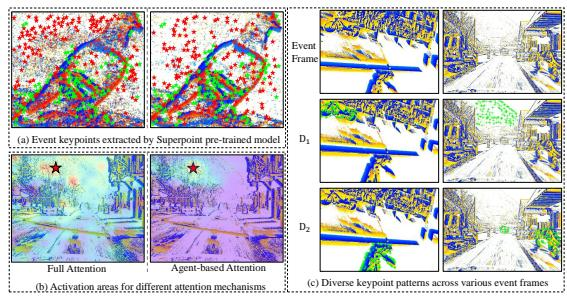
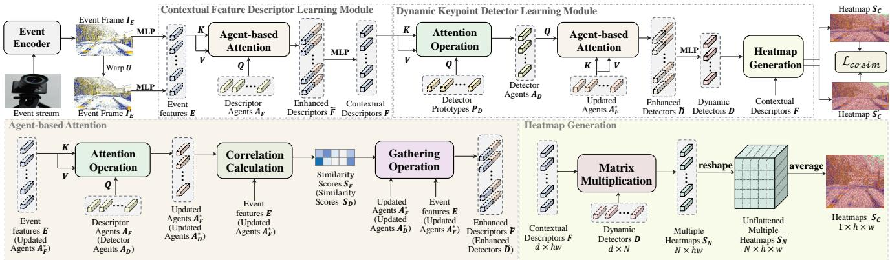
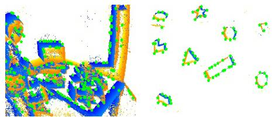
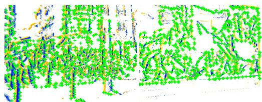
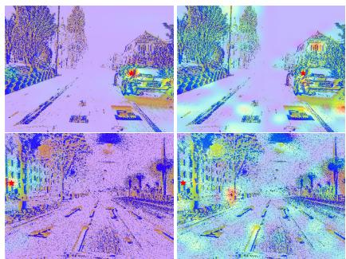

# SD2Event:Self-supervised Learning of Dynamic Detectors and Contextual Descriptors for Event Cameras

Yuan Gao1,Yuqing Zhu1, Xinjun Li1, Yimin Du1, Tianzhu Zhang1,2,\* 1 University of Science and Technology of China 2 Deep Space Exploration Laboratory {wazs98, yuqingzhu, lxj3017, ymdu}@mail.ustc.edu.cn, {tzzhang}@ustc.edu.cn

## Abstract

Event cameras offer many advantages over traditional frame-based cameras, such as high dynamic range and low latency. Therefore, event cameras are widely applied in diverse computer vision applications, where event-based keypoint detection is a fundamental task. However, achieving robust event-based keypoint detection remains challenging because the ground truth of event keypoints is difficult to obtain, descriptors extracted by CNN usually lack discriminative ability in the presence ofintense noise, andfixed keypoint detectors are limited in detecting varied keypoint patterns. To address these challenges, a novel event-based keypoint detection method is proposed by learning dynamic detectors and contextual descriptors in a self-supervised manner (SD2Event), including a contextual feature descriptor learning (CFDL) module and a dynamic keypoint detector learning (DKDL) module. The proposed SD2Event enjoys several merits. First, the proposed CFDL module can model long-range contexts efficiently and effectively. Second, the DKDL module generates dynamic keypoint detectors, which can detect keypoints with diverse patterns across various event streams. Third, the proposed self-supervised signals can guide the model’s adaptation to event data. Extensive experimental results on three challenging benchmarks show that our proposed method significantly outperforms stateof-the-art event-based keypoint detection methods.

## 1. Introduction

Different from traditional frame-based cameras, event cameras possess a distinctive capability to capture individual events at their corresponding pixel positions, triggered by changes in pixel brightness over a temporal resolution. This unique paradigm offers unique advantages, including high dynamic range, low latency, microsecond temporal resolution, low power consumption, and high pixel bandwidth [1, 11, 17, 21, 25]. Owing to these inherent characteristics, event cameras are widely applied in diverse computer vision applications, such as structured light 3D scanning [19], optical flow estimation [3, 32], HDR image reconstruction [26, 28] and Simultaneous Localization and Mapping (SLAM) [21]. Among these applications, keypoint detection for event data has attracted increasing attention from both academia and industry [1, 13, 15, 17, 18], due to its fundamental role in 3D scene analysis. Nevertheless, achieving robust event-based keypoint detection remains challenging due to various factors, such as the unique spatio-temporal data structure, diverse noise patterns, illumination fluctuations, and viewpoint transformations.

  
Figure 1. Illustration of our motivation. (a) presents the keypoint matching results for an event frame pair by applying the Superpoint model trained on conventional image datasets. Correct and incorrect matches are denoted by green and red stars, respectively. (b) shows the comparative analysis between our agent-based attention and full attention, where full attention would aggregate irrelevant noise from event streams. (c) illustrates the diverse event keypoint patterns (e.g., bicycles and mountains in the second row) across different event frames, which can be effectively captured by our proposed dynamic keypoint detectors ({D}2i=1).

To address the above challenges, numerous methods have been proposed for event-based keypoint detection [1, 7, 15, 18, 29]. Generally, existing approaches can be categorized into two main classes including hand-crafted methods [1, 7, 13, 20, 29] and data-driven methods [15, 18]. Hand-crafted methods localize salient keypoints through detectors designed based on human prior knowledge[1, 7, 29]. For example, evHarris [29] creates a binary frame indicating the event’s occurrence at each pixel. Then, the Harris corner detector [14] is applied to the binary frame to classify events as corners. However, these methods are inherently constrained by human knowledge and struggle to consistently detect repeatable event keypoints with diverse noise and motion patterns. To alleviate the problem, several datadriven methods have been proposed [15, 18]. For instance, the state-of-the-art method EventPoint [15] transforms the asynchronous event stream into an artificial frame, referred to as Tencode. Then, the SuperPoint [8] model is applied to Tencode to establish supervisory signals. Subsequently, a Superpoint-like architecture network is trained to learn detectors and descriptors. Despite the success of these methods, there still exist three notable limitations. (1) Lack of ground truth annotations. To address this issue, Event-Point [15] generates supervisory signals by leveraging the SuperPoint [8] model. Notably, the SuperPoint model is trained on conventional image datasets rather than event datasets. (2) Limited feature receptive field. EventPoint utilizes the Convolutional Neural Network (CNN) for feature extraction, resulting in a constrained receptive field. (3) Fixed event keypoint detectors. In [15], keypoint detectors are trained on specific event datasets. During testing, these detectors keep fixed, potentially facing challenges in effectively capturing various event keypoint patterns across different testing datasets.

Based on the above discussions, we find that the design of supervisory signals, as well as the descriptor and detector learning are all crucial in event-based keypoint detection. To enhance the robustness of event-based keypoint detection against diverse challenges, the following three issues should be considered carefully. (1) How to design suitable supervisory signals. Owing to the unique sensing paradigm of event cameras, obtaining ground truth keypoints for event streams proves to be challenging. To address this challenge, existing methods leverage keypoint detectors for conventional image datasets to generate supervisory signals. Specifically, SILC [18] applies the Harris corner detector to conventional images provided by the dataset, which are captured in the same array of pixels as event data. Differently, EventPoint applies the SuperPoint [8] model to event frames to establish supervisory signals. It’s worth noting that SuperPoint is trained on conventional image datasets rather than event datasets. However, due to the inherent distinctions between event data and conventional image data, these supervisory signals may introduce potential limitations to the model’s learning. As shown in Figure 1 (a), the keypoints extracted by the Superpoint model exhibit limited repeatability and are not suitable as effective supervisory signals. Thus, it becomes imperative to introduce novel self-supervised signals to guide the model’s learning effectively. (2) How to learn feature descriptors with long-range dependencies. The state-of-the-art method [15] utilizes CNN to extract features from event frames. However, due to the limited receptive field of CNN, the extracted features would lack discriminative ability, particularly in complex scenarios such as high-speed motions. To address this challenge, attention mechanisms, proven effective in capturing long-range dependencies in computer vision [9, 30], offer a potential solution. Nevertheless, due to the inherent noise characteristics in event streams, traditional full attention may aggregate irrelevant noise. As shown in Figure 1 (b), with full attention, the activation areas corresponding to the event keypoint located on the tree (marked by a star) exhibit notable noise distributed across streets, mountains, and buildings. Additionally, the computational burden of full attention hinders the efficiency of event stream processing. Consequently, there is an urgent need to propose an effective and efficient attention mechanism to capture long-range dependencies in features while mitigating the impact of noise. (3) How to learn keypoint detectors suitable for various event keypoint patterns. Because of the inherent nature of event data, keypoints in event streams exhibit diverse patterns in response to diverse factors such as varying noise levels, motion complexities, and real-world conditions, as shown in Figure 1 (c). Traditional methods typically rely on hand-crafted algorithms to construct keypoint detectors [1, 13, 17, 18, 29], which are easily constrained by human prior knowledge. To address this limitation, data-driven methods have been proposed. However, these methods can only obtain a fixed detector learned from specific datasets [15], which may limit their adaptability to different event keypoint patterns during testing. Thus, it is necessary to design dynamic keypoint detectors, which can flexibly update with the input and capture diverse keypoint patterns across various event streams.

Motivated by the above observations, we propose a novel event-based keypoint detection method by learning dynamic event-based detectors and contextual descriptors in a self-supervised manner. Our proposed model mainly consists of a contextual feature descriptor learning module and a dynamic keypoint detector learning module. In the contextual feature descriptor learning module, it is designed to capture long-range dependencies effectively and efficiently. Given the artificial frames transformed from event streams, the original event features are extracted using a Multi-Layer Perceptron (MLP). Subsequently, a group of descriptor agents are introduced to aggregate contextual information within these original event features via our designed agent-based attention mechanism. Specifically, the descriptor agents are first applied to interact with event features via the attention mechanism. Then, we identify the updated descriptor agent with the highest similarity score for each event feature and concatenate them to obtain enhanced event features. Considering the noise properties in event data, agent-based attention can reduce the effect of irrelevant noise while capturing the long-range dependencies.

Finally, we use a MLP to fuse the enhanced features to obtain contextual features. In the dynamic keypoint detector learning module, it is proposed to generate adaptive keypoint detectors which can identify diverse patterns of event keypoints across various event frames and lead to robust keypoint detection. Given the contextual feature descriptors, we first design a set of detector prototypes, which can interact with the contextual features via the attention mechanism to obtain detector agents. Recognizing the noise inherent in event data, we propose to refine the detector agents with the updated descriptor agents, which serve as the cluster center of the event features. Specifically, we first apply the attention mechanism to model the interaction between the detector agents and the updated descriptor agents. Each updated detector agent is concatenated with the updated descriptor agent which exhibits the highest similarity score. In this way, enhanced keypoint detectors are acquired. Finally, we use a MLP to fuse the enhanced keypoint detectors to obtain dynamic keypoint detectors. The generated detectors update with each input during both training and testing dynamically, and can capture diverse patterns of event keypoints from different event frames. As for the supervisory signal, we utilize pre-designed transformations as the reference ground truth to warp the original event frames and create corresponding event frame pairs. These pairs are then input into our proposed model to obtain keypoint heatmaps. Finally, we employ a cosine similarity constraint on the heatmap pairs, which can guide our model to identify consistent and repeatable keypoints in event streams.

The main contributions of this work can be summarized as follows. (1) We propose a novel event-based keypoint detection method by learning dynamic detectors and contextual descriptors for event streams in a self-supervised manner. Our model excels in extracting discriminative feature descriptors and realizing robust keypoint detection, even in some extremely challenging scenarios. (2) The proposed supervisory signals can guide the model’s adaptation to event data. The proposed contextual feature descriptor learning module can model long-range dependencies effectively and efficiently via our proposed agent-based attention. And the dynamic keypoint detector learning module generates dynamic keypoint detectors, which can flexibly update with the input and detect keypoints with diverse patterns across various event streams. (3) Extensive experimental results on three challenging benchmarks show that our proposed method outperforms state-of-the-art eventbased keypoint detection methods significantly.

## 2. Related Work

In this Section, we briefly overview methods that are related to hand-crafted event-based keypoint detection and datadriven event-based keypoint detection.

Hand-crafted Event-based Keypoint Detection. Early methods for hand-crafted event-based keypoint detection can date back to [7], which classifies incoming events as corners by considering the optical flow [3] orientation in their local neighborhood. Recently, an increasing number of hand-crafted keypoint detection approaches [1, 13, 20, 29] for event cameras have been proposed. Among these methods, evHarris [29] creates a binary frame that denotes the event’s presence at individual pixels. Then, the Harris corner detector [14] is applied to the binary frame to identify corner events. Differently, evFast [20] proposes a novel adaptation of the FAST detector [27] and applies it to the widely adopted artificial frame known as Time Surface [3]. Building upon [20], Arc [1] introduces an innovative event filter to alleviate redundancy, which significantly improves efficiency. In contrast, luvHarris [13] presents a novel adaptation of the Harris corner detector for event data. By reusing convolution results across neighboring pixels in corner detection, luvHarris mitigates redundant processing and enhances overall efficiency. Despite their success, the handcrafted designs exhibit limitations in adapting to the unique characteristics of event data, thereby constraining further advancements. Consequently, recent approaches have begun to focus on data-driven event-based keypoint detection.

Data-driven Event-based Keypoint Detection. Recently, several methods [15, 18] propose to leverage machine learning techniques to detect keypoints for event streams. Among these methods, SILC [18] introduces a novel event representation which remains invariant to the speed of dynamic objects. Based on this representation, SILC employs a Random Forest [5] as the detector to discriminate corner events. To derive supervisory signals, the Harris corner detector is applied to conventional images provided by the dataset, which are captured in the same array of pixels as event data. Differently, EventPoint [15] proposes a novel event representation called Tencode by leveraging both polarities and timestamps. Then, supervisory signals are derived by applying the SuperPoint model [8] to the Tencode representation. Notably, the SuperPoint model is trained on conventional image datasets. Finally, a Superpoint-like architecture network is trained to learn detectors and descriptors. These data-driven keypoint detectors have proven success. However, the supervisory signals generated from keypoint detectors on the conventional image datasets are not suitable. And the features extracted by CNN with the limited receptive field may lack discriminability. Besides, the keypoint detectors maintain fixed after training, posing limitations on the extraction of repeatable keypoints. In contrast, our proposed self-supervised signals can guide the model’s learning effectively. The contextual feature descriptor learning module can capture the long-range dependencies effectively and efficiently. Besides, the designed dynamic keypoint detector learning module can adaptively generate keypoint detectors, which excel in capturing diverse keypoint patterns across various event streams.

## 3. Our Approach

In this section, we present our proposed method by learning dynamic keypoint detectors and contextual descriptors for event data in a self-supervised manner. The overall architecture is illustrated in Figure 2.

## 3.1. Overview

As shown in Figure 2, our proposed model consists of a contextual feature descriptor learning (CFDL) module and a dynamic keypoint detector learning (DKDL) module. Given the original event streams, we utilize an event encoder to obtain event frames, which are then sent into a Multi-Layer Perceptron (MLP) to extract original event features. In the CFDL module, we define a set of descriptor agents to interact with event features via our proposed agent-based attention, resulting in updated descriptor agents and enhanced descriptors. Subsequently, enhanced descriptors are sent into a MLP to generate contextual feature descriptors. In the DKDL module, we define a set of detector prototypes to interact with contextual feature descriptors via traditional attention. The produced detector agents then engage with updated descriptor agents using our proposed agent-based attention. These enhanced detectors are subsequently processed through a MLP to generate dynamic keypoint detectors. Upon obtaining contextual feature descriptors and dynamic keypoint detectors, we leverage a dot product operation to generate keypoint heatmaps. To guide the model’s learning, we impose cosine similarity constraints on pairs of heatmaps corresponding to original features and those warped by pre-defined transformations.

## 3.2. Event Encoder

The output of an event camera is represented as an asynchronous stream of events $\{ { \bf e } _ { i } \} _ { i \in \mathbb { N } }$ . Each event $\mathbf { e } _ { i }$ includes four-dimensional information $\left( x _ { i } , y _ { i } , t _ { i } , p _ { i } \right)$ , where $( x _ { i } , y _ { i } )$ refer to the pixel coordinates of the event, $t _ { i }$ represents the timestamp when the event is captured, and polarity $p _ { i } \in \{ - 1 , 1 \}$ is the sign of the brightness change. Existing event-based keypoint detection methods [1, 13, 18, 20] generally adopt Time Surface [3] as the event stream representation. Given a fixed time interval $\Delta t ,$ a single frame representation I is generated according to the latest events captured at each pixel in the time window $( T , T + \Delta t )$ ,

$$
\mathbf { I _ { E } } [ x _ { i } , y _ { i } ] = t _ { i } \longleftarrow { ( x _ { i } , y _ { i } , t _ { i } , p _ { i } ) } .\tag{1}
$$

Although proven effective, Time Surface ignores information provided by polarity, thereby constraining its potential for further success. To address this problem, Event-Point [15] proposes an effective event stream representation named Tencode by incorporating polarities and timestamps. Inspired by [15], we propose a novel representation by coupling polarity and time more tightly. Specifically, given a fixed time interval $\Delta t ,$ events falling in the time window $( T , T + \Delta t )$ can form a frame $\mathbf { I _ { E } }$ as follows,

$$
\mathbf { I } _ { \mathbf { E } } [ x _ { i } , y _ { i } ] = ( 2 5 5 , t _ { i T } , 0 ) \longleftarrow { ( x _ { i } , y _ { i } , t _ { i } , + 1 ) } ,\tag{2}
$$

$$
\mathbf { I _ { E } } [ x _ { i } , y _ { i } ] = ( 0 , 2 5 5 - t _ { i T } , 2 5 5 ) \xleftarrow { } ( x _ { i } , y _ { i } , t _ { i } , - 1 ) ,\tag{3}
$$

where $t _ { i }$ is the timestamp of the latest event occurred at pixel $( x _ { i } , y _ { i } )$ , and $t _ { i T } = 1 2 7 \times ( T + \Delta t - t _ { i } ) / \Delta t$

## 3.3. Contextual Feature Descriptor Learning

To efficiently and effectively capture long-range dependencies within event streams, we design an agent-based attention mechanism. After obtaining event features ${ \textbf { E } } \in$ $\mathbb { R } ^ { d \times h w }$ , we initialize M descriptor agents $\mathbf { A } _ { \mathbf { F } } ~ \in ~ \mathbb { R } ^ { d \times M }$ with a set of learnable parameters [31]. Then, we utilize the agent-based attention to model the interaction between event features E and descriptor agents $\mathbf { A } _ { \mathbf { F } }$ , resulting in enhanced descriptors $\widetilde { \mathbf { F } } .$ Finally, we generate contextual descriptors F from $\widetilde { \mathbf { F } }$ via a MLP. Next, we introduce the details of agent-based attention.

Agent-based Attention. As shown in Figure 2, we aim to utilize descriptor agents AF to aggregate contextual information from event features E. Specifically, keys and values arise from event features E, and queries arise from descriptor agents $\mathbf { A } _ { \mathbf { F } }$

$$
\mathbf { Q } = \mathbf { W } ^ { \mathcal { Q } } \mathbf { A } _ { \mathbf { F } } , \mathbf { K } = \mathbf { W } ^ { \mathcal { K } } \mathbf { E } , \mathbf { V } = \mathbf { W } ^ { \mathcal { V } } \mathbf { E } ,\tag{4}
$$

where $\mathbf { W } ^ { \mathcal { Q } } \in \mathbb { R } ^ { d _ { k } \times d } , \mathbf { W } ^ { \mathcal { K } } \in \mathbb { R } ^ { d _ { k } \times d } , \mathbf { W } ^ { \mathcal { V } } \in \mathbb { R } ^ { d \times d }$ are linear projections. Then, the descriptor agents are updated with the multi-head attention mechanism [30],

$$
\mathbf { A } _ { \mathbf { F } } ^ { * } = \mathrm { A t t e n t i o n } \left( \mathbf { Q } , \mathbf { K } , \mathbf { V } \right) = \mathbf { V } \cdot \mathrm { S o f t m a x } ( \mathbf { K } ^ { \top } \mathbf { Q } ) .\tag{5}
$$

In this way, $\mathbf { A } _ { \mathbf { F } } ^ { * }$ can effectively capture long-range dependencies. Considering the noise properties in event data, we update event features E with the most relevant updated descriptor agents $\mathbf { A } _ { \mathbf { F } } ^ { * }$ . To achieve this, we calculate similarity scores $\mathbf { S _ { F } }$ by a dot product operation between them, i.e. $\mathbf { S _ { F } } = \mathbf { A _ { F } ^ { * } } ^ { \top } \mathbf { E }$ . Then, we can obtain each enhanced descriptor as follows,

$$
\widetilde { \mathbf { F } } _ { i } = [ \mathbf { E } _ { i } , \mathbf { A } _ { \mathbf { F } _ { j } } ^ { * } ] , \mathrm { { w h e r e } } j = \arg \operatorname* { m a x } _ { k } \mathbf { S } _ { \mathbf { F } k , i } .\tag{6}
$$

Here, [, ] is a vector concatenation operation. And $\widetilde { \mathbf { F } } _ { i } , \mathbf { E } _ { i } .$ $\mathbf { A } _ { \mathbf { F } _ { j } } ^ { * }$ denote the $i ^ { t h }$ enhanced descriptor, the $i ^ { t h }$ event feature and the $j ^ { t h }$ updated descriptor agent, respectively.

## 3.4. Dynamic Keypoint Detector Learning

After obtaining the contextual feature descriptors F, we aim to learn dynamic keypoint detectors, which can capture diverse event keypoint patterns across various event streams. Specifically, we first initialize detector propotypes $\mathbf { P _ { D } }$ and model the interaction between $\mathbf { P _ { D } }$ and contextual features

  
Figure 2. The architecture of our SD2Event consists of two major components, including a contextual feature descriptor learning (CFDL) module and a dynamic keypoint detector learning (DKDL) module. The event stream is first sent into an event encoder to obtain the event frame $\mathbf { I _ { E } }$ . We employ a MLP on $\mathbf { I _ { E } }$ to generate original event features E. Then, in the CFDL module, we define a set of descriptor agents $\mathbf { A } _ { \mathbf { F } }$ to interact with flattened features E via our proposed agent-based attention, resulting in contextual descriptors F. Next, in the DKDL module, we define a set of detector prototypes $\mathbf { P _ { D } }$ to interact with contextual descriptors F via the attention mechanism. The resulting detector agents $\mathbf { A } _ { \mathbf { D } }$ are refined with updated descriptor agents ${ \mathbf { A } _ { \mathbf { F } } } ^ { * }$ via our proposed agent-based attention, yielding dynamic detectors D. Then, the keypoint heatmap $\mathbf { S _ { C } }$ is calculated with dynamic detectors D and contextual descriptors F. Besides, we utilize the pre-designed transformation U to warp the event frame $\mathbf { I } _ { \mathbf { E } } .$ The resulting $\mathbf { I } _ { \mathbf { E } } ^ { \prime }$ is also sent into above modules to obatin heatmap $\mathbf { S } _ { \mathbf { C } } { ' }$ . Finally, we enforce a cosine similarity constraint on $\mathbf { S _ { C } }$ and $\mathbf { S } \mathbf { c } ^ { \prime }$ to guide the learning of our model. For more details, please refer to the text.

F to produce detector agents $\mathbf { A } _ { \mathbf { D } }$ . Recognizing the noise inherent in event data, we propose to refine the detector agents $\mathbf { A } _ { \mathbf { D } }$ with the updated descriptor agents $\mathbf { A } _ { \mathbf { F } } ^ { * }$ via the agent-based attention, resulting in enhanced detectors $\widetilde { \bf D }$ Subsequently, we utilize a MLP to fuse enhanced detectors De to generate dynamic keypoint detectors D. Finally, we realize heatmap generation with dynamic detectors D and contextual descriptors F. Below, we introduce the designs of agent-based attention and heatmap generation in detail.

Agent-based Attention. As shown in Figure 2, we aim to utilize detector agents $\mathbf { A } _ { \mathbf { D } }$ to aggregate information from the updated descriptor agents $\mathbf { A } _ { \mathbf { F } } ^ { * }$ via the attention operation. Formally,

$$
\mathbf { Q } = \mathbf { W } ^ { \mathcal { Q } } \mathbf { A } _ { \mathbf { D } } , \mathbf { K } = \mathbf { W } ^ { \mathcal { K } } \mathbf { A } _ { \mathbf { F } } ^ { * } , \mathbf { V } = \mathbf { W } ^ { \mathcal { V } } \mathbf { A } _ { \mathbf { F } } ^ { * } ,\tag{7}
$$

$$
\mathbf { A } _ { \mathbf { D } } ^ { * } = \mathrm { A t t e n t i o n } ( \mathbf { Q } , \mathbf { K } , \mathbf { V } ) = \mathbf { V } \cdot \mathrm { S o f t m a x } ( \mathbf { K } ^ { \top } \mathbf { Q } ) .\tag{8}
$$

Then, we calulate the similarity scores $\mathbf { S _ { D } }$ between updated descriptor agents $\mathbf { A } _ { \mathbf { F } } ^ { * }$ and updated detector agents $\mathbf { A } _ { \mathbf { D } } ^ { * }$ by a dot product operation, i.e. $\mathbf { S _ { D } } = \mathbf { A _ { F } ^ { * } } ^ { \top } \mathbf { A _ { D } ^ { * } }$ . Then, we can obtain each enhanced detector as follows,

$$
\widetilde { \mathbf { D } } _ { i } = [ \mathbf { A } _ { \mathbf { D } _ { i } } ^ { * } , \mathbf { A } _ { \mathbf { F } _ { j } } ^ { * } ] , \mathrm { ~ w h e r e ~ \ } j = \arg \operatorname* { m a x } _ { k } \mathbf { S } _ { \mathbf { D } { k } , i } .\tag{9}
$$

Heatmap Generation. After obtaining the contextual descriptors $\mathbf { \bar { F } } \in \mathbb { R } ^ { d \times h w }$ and dynamic keypoint detectors $\mathbf { D \in }$ $\mathbb { R } ^ { d \times N }$ , multiple score maps $\mathbf { \bar { S } } _ { N } \in \mathbb { R } ^ { N \times _ { h w } }$ are generated by a dot product operation between them, $i . e . \mathbf { S } _ { N } = \mathbf { D } ^ { \top } \mathbf { F }$ . We then reshape $\mathbf { S } _ { N }$ and obtain unflattened multiple heatmaps $\overline { { \mathbf { S } _ { \mathbf { N } } } } ~ \in ~ \mathbb { R } ^ { \bar { N } \times h \times w }$ . Finally, we average $\overline { { \mathbf { S _ { N } } } }$ along the first channel to obtain heatmaps $\mathbf { S } _ { \mathbf { C } } \in \mathbb { R } ^ { 1 \times h \times w }$

## 3.5. Supervisory Signals

To guide the model learning effectively, we design a novel supervisory signal. For each event frame $\mathbf { I _ { E } }$ generated from the event streams, we randomly generate the camera pose transformation $\mathbf { U } \in \mathrm { S E } ( 3 )$ as the reference ground truth to warp $\mathbf { I _ { E } }$ and obtain $\mathbf { I } _ { \mathbf { E } } ^ { \prime }$ . We send the event frame pairs into our proposed model to obtain keypoint heatmaps $\mathbf { S _ { C } }$ and $\mathbf { S } _ { \mathbf { C } } { ' }$ . Then, we define the cosine similarity loss as follows,

$$
\mathcal { L } _ { \mathrm { c o s i m } } \left( \mathbf { I } _ { \mathbf { E } } , \mathbf { I } _ { \mathbf { E } } ^ { \prime } , \mathbf { U } \right) = 1 - \frac { 1 } { | \mathcal { O } | } \sum _ { o \in \mathcal { O } } \mathrm { c o s i m } \left( \mathbf { S } _ { \mathbf { C } } [ o ] , \mathbf { S } _ { \mathbf { C } } ^ { \prime } [ o ] \right) ,\tag{10}
$$

where $\mathcal { O }$ is the set of overlapping patches between $\mathbf { I _ { E } }$ and ${ \bf { I } } _ { \bf { E } } { ' }$ . Besides, we introduce two other objective functions to guide our model learning. To guide the proposed detectors to focus on salient positions, we use the peaky loss,

$$
\mathcal { L } _ { \mathrm { p e a k y } } \left( \mathbf { I } _ { \mathbf { E } } \right) = 1 - \frac { 1 } { | \mathcal { O } | } \sum _ { o \in \mathcal { O } } \left( \operatorname* { m a x } _ { ( i , j ) \in o } \mathbf { S } _ { \mathbf { C } { i j } } - \operatorname* { m e a n } _ { ( i , j ) \in o } \mathbf { S } _ { \mathbf { C } { i j } } \right) .\tag{11}
$$

For the goal of expanding the discrepancy among updated descriptor agents $\mathbf { A } _ { \mathbf { F } } ^ { * }$ and updated detector agents $\mathbf { A } _ { \mathbf { D } } ^ { * }$ , we impose the diversity loss $\mathcal { L } _ { d i v } = \mathcal { L } _ { d f } + \mathcal { L } _ { d d }$ , where

$$
\mathcal { L } _ { d f } = \frac { 1 } { M ( M - 1 ) } \sum _ { j = 1 } ^ { M } \sum _ { k = 1 , k \neq j } ^ { M } \frac { \left. \mathbf { A _ { F } ^ { * } } _ { j } , \mathbf { A _ { F } ^ { * } } _ { k } \right. } { \left\| \mathbf { A _ { F } ^ { * } } _ { j } \right\| _ { 2 } \left\| \mathbf { A _ { F } ^ { * } } _ { k } \right\| _ { 2 } } ,\tag{12}
$$

$$
\mathcal { L } _ { d d } = \frac { 1 } { N ( N - 1 ) } \sum _ { j = 1 } ^ { N } \sum _ { k = 1 , k \neq j } ^ { N } \frac { \left. \mathbf { A _ { D } ^ { * } } _ { j } , \mathbf { A _ { D } ^ { * } } _ { k } \right. } { \left\| \mathbf { A _ { D } ^ { * } } _ { j } \right\| _ { 2 } \left\| \mathbf { A _ { D } ^ { * } } _ { k } \right\| _ { 2 } } .\tag{13}
$$

Finally, we combine these loss functions by a weighted sum to train our model, $i . e .$

$$
\mathcal { L } _ { t o t a l } = \mathcal { L } _ { c o s i m } + \alpha _ { 1 } \mathcal { L } _ { p e a k y } + \alpha _ { 2 } \mathcal { L } _ { d i v } ,\tag{14}
$$

where $\alpha _ { 1 }$ and $\alpha _ { 2 }$ are weight terms to balance these losses.

## 4. Experiments

In this section, we first introduce implementation details. Then, we show experimental results and some visualizations on three public benchmarks. Finally, we conduct a series of ablation studies to verify the effectiveness of each component. Please refer to the Supplementary Material for some discussions and more visualization results.

## 4.1. Implementation Details

In this work, we implement the proposed model in Pytorch [23]. We propose a novel event stream representation inspired by [15]. Then a two-layer MLP network is applied to extract original event features. In the CFDL module, the number of descriptor agents M is set to 32. The dimension of image features d = 128. In the attention operation, crossattention heads are set to 8. And $d _ { k }$ (the dimension of Q and K) in Eq. (4)and Eq. (7) is equal to d. In the DKDL module, the number of detector agents N is set to 16. The weight terms $\alpha _ { 1 }$ and $\alpha _ { 2 }$ in the objective function are set to 0.6 and 0.8. Keypoints can be obtained by applying the local maxima filtering and the threshold constraint on the score map $\mathbf { S } _ { C } .$ . For run-time performance, our proposed model runs at 9ms for a 240×180 event frame. For training, we adopt the same outdoor training dataset [12] as [15], the same indoor training dataset from [21] as [18]. All parameters in our proposed model are randomly initialized and trained from scratch with the Adam optimizer. The learning rate is set to $1 0 ^ { - 3 }$ , and the weight decay is $5 \times 1 0 ^ { - 4 }$ . It converges after 12 hours of training on a single RTX 3090 GPU.

## 4.2. Datasets and Evaluation Metrics

Event-Camera. The Event-Camera dataset [21] is recorded by a DAVIS-240C sensor [4], which combines a conventional frame-based camera and an event sensor in the same array of pixels. The primary challenging factors for Event-Camera lie in the presence of various camera motions and intense noise within the scene. To evaluate our model, we adopt the same subsets as [1, 18]. As for the evaluation metric, we follow [18] and report the reprojection error.

N-Caltech101. The N-Caltech101 [22] dataset is an event version of the well-known Caltech101 dataset [10]. It comprises 101 distinct object categories, with sample sizes varying between 31 and 800 per category. N-Caltech101 presents a challenge due to its inclusion of diverse object categories, coupled with substantial variations in viewing angles, scales, and background textures within each category. We follow the same procedure as [16, 24] to evaluate our method. As for the evaluation metric, we follow [25], and report the intersection over union (IoU) matching score. HVGA ATIS Corner. The HVGA ATIS Corner [18] consists of 7 sequences depicting planar scenes. The dataset is challenging since diverse texture variations exist. Here, the evaluation metric we adopt is the same as [6, 15, 18]. And we report the reprojection error, which is computed by estimating a homography from the matched points.

Table 1. Evaluation results on the Event-Camera dataset. We report the reprojection error in pixels.
<table><tr><td>Methods</td><td>Reprojection Error</td></tr><tr><td>Arc [1]</td><td>2.58</td></tr><tr><td>evFast [20]</td><td>2.50</td></tr><tr><td>evHarris [29]</td><td>2.46</td></tr><tr><td>SILC [18]</td><td>2.16</td></tr><tr><td>SD2Event (ours)</td><td>1.64</td></tr></table>

  
Figure 3. Qualitative results on the Event-Camera dataset. Green stars denote the extracted keypoints.

  
Figure 4. Qualitative results on the N-Caltech101 dataset. Green stars denote the extracted keypoints.

## 4.3. Comparison with State-of-the-art Methods

Results on Event-Camera dataset. We compare our model with previous state-of-the-art event-based keypoint detection methods [6, 15, 18, 20, 29]. As shown in Table 1, our method excels with a reprojection error of 1.64 pixels, surpassing all other methods by a significant margin. Compared with SILC [18], our method improves by 0.52 pixels in reprojection error. Finally, we show some qualitative results in Figure 3. We attribute the top performance to three delicate designs. Our proposed novel self-supervised signals can guide the model’s adaptation to event data. And the CFDL module can obtain discriminative descriptors under challenges such as intense noise and violent motion. Moreover, the DKDL module generates dynamic keypoint detectors capable of capturing diverse motion and noise patterns within various event streams.

Results on N-Caltech101 dataset. We compare our method with the state-of-the-art event-based keypoint detection method [15]. As shown in Table 2, our method outperforms Eventpoint [15] by 6% in feature matching IoU.

Table 2. Evaluation results on the N-Caltech101 dataset. We report the feature matching IoU in percentage.
<table><tr><td>Methods</td><td>IoU</td></tr><tr><td>DART (FIFO size=5000) [25]</td><td>0.67</td></tr><tr><td>DART (FIFO size=2000) [25]</td><td>0.72</td></tr><tr><td>Eventpoint [15]</td><td>0.83</td></tr><tr><td>SD2Event (ours)</td><td>0.89</td></tr></table>

Table 3. Evaluation results on the HVGA ATIS Corner dataset. We report the reprojection error in pixels across event frame pairs at time intervals of 25ms, 50ms, and 100ms.
<table><tr><td>Methods</td><td>25ms</td><td>50ms</td><td>100ms</td></tr><tr><td>evHarris [29]</td><td>2.57</td><td>3.46</td><td>4.58</td></tr><tr><td>Chiberre et al. [6]</td><td>2.56</td><td></td><td></td></tr><tr><td>SILC [18]</td><td>2.45</td><td>3.02</td><td>3.68</td></tr><tr><td>evFast [20]</td><td>2.12</td><td>2.63</td><td>3.18</td></tr><tr><td>Eventpoint [15]</td><td>1.27</td><td>1.41</td><td>1.72</td></tr><tr><td>SD2Event (ours)</td><td>0.67</td><td>0.76</td><td>0.93</td></tr></table>

  
Figure 5. Qualitative results on the HVGA ATIS Corner dataset. Green dots denote the extracted keypoints.

Finally, we show some qualitative results in Figure 4. The results demonstrate that our proposed self-supervised signals can facilitate repeatable event keypoint detection. Our proposed CFDL module can capture long-range contexts and generate discriminative descriptors under extreme appearance changes. Besides, our DKDL module produces dynamic keypoint detectors, which can update with the current input and focus on varying event keypoint patterns caused by diverse object categories and intense noise.

Results on HVGA ATIS Corner dataset. We compare our model with previous state-of-the-art event keypoint detection methods [6, 15, 18, 20, 29]. As shown in Table 3, Our proposed method obtains the best performance among all event-based keypoint detection methods. Specifically, compared with Eventpoint [15], our method improves by 0.60, 0.65, and 0.79 pixels in reprojection error for event frame pairs at time intervals of 25ms, 50ms, and 100ms, respectively. Finally, we show some qualitative results in Figure 5. It can be seen that our proposed method can realize event keypoint detection robust to intense noise and varying degrees of texture. The reason may be that well-designed supervisory signals can effectively guide our model to perceive unique characteristics of event data. Our designed DKDL module produces dynamic keypoint detectors that can identify different patterns of event keypoints across various degrees of texture. Besides, our proposed CFDL module can capture long-range dependencies, resulting in discriminative descriptors even in texture-less regions.

Table 4. Effectiveness of each component on the HVGA ATIS Corner dataset. We report the reprojection error in pixels across event frame pairs at time intervals of 25ms, 50ms, and 100ms.
<table><tr><td>Models</td><td>DKDL</td><td>CFDL</td><td>25ms</td><td>50ms</td><td>100ms</td></tr><tr><td>[A]</td><td>x</td><td>x</td><td>5.45</td><td>10.34</td><td>16.99</td></tr><tr><td>[B]</td><td>x</td><td>√</td><td>1.13</td><td>1.27</td><td>1.54</td></tr><tr><td>[C]</td><td>√</td><td>x</td><td>0.89</td><td>1.01</td><td>1.25</td></tr><tr><td>[D]</td><td>√</td><td>√</td><td>0.67</td><td>0.76</td><td>0.93</td></tr></table>

## 4.4. Ablation Studies

To analyze the effects of each component in our proposed method, we perform a series of ablation studies on the HVGA ATIS Corner dataset. In Table 4, for the model [A], We first extract original features E using a MLP, and the keypoint detector is implemented with a 1 × 1 convolutional kernel. Then, for the model [B], original features E are processed by CFDL to obtain contextual descriptors, while the keypoint detector is implemented with a 1 × 1 convolutional kernel. For the model [C], original features E are not processed by CFDL, and dynamic detectors are learned by sending E into the DKDL. The model [D] is the full model of our proposed method.

Effects of the CFDL module. As shown in Table 4, with the proposed CFDL module, the performance on the HVGA ATIS Corner is improved notably. In specific, the performance of model [B] is improved by 4.32, 9.07, and 15.45 pixels in reprojection error for event frame pairs at time intervals of 25ms, 50ms, and 100ms, compared to the model [A]. And the model [D] also performs better than the model [C]. The main reason is that our CFDL module can model long-range dependencies effectively, which is beneficial to handling challenging factors such as high-speed moving objects for robust event-based keypoint detection.

Impacts about the number of descriptor agents in the CFDL module. Here, we study the performance with different numbers of descriptor agents (M) in the CFDL mod ule. M is picked from the set {2, 4, 8, 16, 32, 64}, and we evaluate the performance on the HVGA ATIS Corner dataset. As shown in Table 5, we find that the overall performance of the model improves with the increase of M, and the model can get the best performance when M = 32. There is no performance gain when M continues to increase. The reason may be that the setting M = 32 is able to adequately capture different contexts in the input event frames, and more descriptor agents may impede model training due to a lack of sufficient explicit constraints.

Effects of the DKDL module. As shown in Table 4, when adding our proposed DKDL module, the performance on the HVGA ATIS Corner dataset can achieve significant improvement. Specifically, the performance of model [C] is gained by 4.56, 9.33, and 15.74 pixels in reprojection error for event frame pairs at time intervals of 25ms, 50ms, and 100ms, compared to the model [A]. Besides, the model [D] also performs much better than the model [B]. The main reason is that our proposed DKDL module can generate dynamic keypoint detectors, which excel in capturing diverse keypoint patterns across various event streams.

Table 5. Impacts of the number of descriptor agents on HVGA ATIS Corner. We report the reprojection error in pixels across event frame pairs at time intervals of 25ms, 50ms, and 100ms.
<table><tr><td>Models</td><td>25ms</td><td>50ms</td><td>100ms</td></tr><tr><td>M=2</td><td>0.85</td><td>0.96</td><td>1.18</td></tr><tr><td>M=4</td><td>0.77</td><td>0.87</td><td>1.07</td></tr><tr><td>M=8</td><td>0.72</td><td>0.82</td><td>1.01</td></tr><tr><td>M=16</td><td>0.69</td><td>0.78</td><td>0.96</td></tr><tr><td>M=32</td><td>0.67</td><td>0.76</td><td>0.93</td></tr><tr><td>M=64</td><td>0.68</td><td>0.77</td><td>0.95</td></tr></table>

Table 6. Impacts of the number of detector prototypes on HVGA ATIS Corner. We report the reprojection error in pixels across event frame pairs at time intervals of 25ms, 50ms, and 100ms.
<table><tr><td>Models</td><td>25ms</td><td>50ms</td><td>100ms</td></tr><tr><td>N=2</td><td>0.96</td><td>1.09</td><td>1.34</td></tr><tr><td>N=4</td><td>0.82</td><td>0.92</td><td>1.11</td></tr><tr><td>N=8</td><td>0.71</td><td>0.81</td><td>0.99</td></tr><tr><td>N=16</td><td>0.67</td><td>0.76</td><td>0.93</td></tr><tr><td>N=32</td><td>0.68</td><td>0.77</td><td>0.94</td></tr></table>

  
Figure 6. Qualitative comparisons between our proposed agentbased attention mechanism (the first column) and the standard full attention (the second column).

Impacts about the number of detector prototypes in the DKDL module. To investigate the influences of the number of detector prototypes (N) in the DKDL module, we pick N from the set {2, 4, 8, 16, 32} and evaluate the performance on the HVGA ATIS Corner dataset. As shown in Table 6, we find that setting N = 16 yields the best performance. As N increases beyond 16, there is no discernible improvement in performance. This observation suggests that the model with N = 16 is sufficient to capture diverse event keypoint patterns on the HVGA ATIS Corner dataset.

Effects of the agent-based attention. To demonstrate the effectiveness of our proposed agent-based attention, we show some qualitative comparisons between the agentbased attention mechanism and the standard full attention [2]. As shown in Figure 6, we can find that the full attention introduces extra noise from event streams when conducting global interactions. For example, in the first row, we select a pixel from the car to interact with other pixels. For the full attention, attention scores are elevated for pixels in numerous irrelevant regions, such as those located on roads, which are generally noise from event data. By contrast, our proposed agent-based attention mechanism has a clear attention score map, as shown in Figure 6, which can effectively capture the long-range dependencies while mitigating the effect of irrelevant noise. Thanks to the welldesigned agent-based attention, our proposed CFDL module can generate discriminative descriptors even under complex challenges. And our proposed DKDL module can adequately perceive diverse event keypoint patterns from different event streams and remain impervious to intense noise from event data, leading to robust keypoint detection.

Table 7. Effectiveness of self-supervised signals. We report the reprojection error in pixels across event frame pairs at time intervals of 25ms, 50ms, and 100ms.
<table><tr><td>Model</td><td>25ms</td><td>50ms</td><td>100ms</td></tr><tr><td>[A]</td><td>1.03</td><td>1.16</td><td>1.42</td></tr><tr><td>[B]</td><td>0.83</td><td>0.94</td><td>1.15</td></tr><tr><td>[C]</td><td>0.67</td><td>0.76</td><td>0.93</td></tr></table>

Effects of the self-supervised signals. As shown in Table 7, the effectiveness of our proposed self-supervised signals is fully demonstrated. For model [A], we follow the same procedure as EventPoint [15] and utilize the Superpoint [8] model to generate supervisory signals. In the case of model [B], we utilize pre-defined homography transformations to generate image pairs for self-supervised learning. The model [C] is our SD2Event, which leverages pre-defined camera pose transformations to generate image pairs for self-supervised learning.

## 5. Conclusion

In this work, we propose a novel event-based keypoint detection method by learning dynamic detectors and contextual descriptors for event streams in a self-supervised manner. Our method consists of three elegant designs, including self-supervised signals specifically designed for event keypoints, a CFDL module and a DKDL module. With these three well-designed components, our proposed method excels in extracting discriminative feature descriptors and realizing robust keypoint detection for event streams, even in some extremely challenging scenarios. Extensive experimental results on three challenging benchmarks demonstrate the effectiveness of our proposed method.

## 6. Acknowledgement

This work was partially supported by the “14th Five-Year Plan” Civil Space Technology Preliminary Research Project (D040103), National Nature Science Foundation of China (Grant 12150007), and Youth Innovation Promotion Association CAS 2018166.

## References

[1] Ignacio Alzugaray and Margarita Chli. Asynchronous corner detection and tracking for event cameras in real time. IEEE Robotics and Automation Letters, 3(4):3177–3184, 2018. 1, 2, 3, 4, 6

[2] Dzmitry Bahdanau, Kyung Hyun Cho, and Yoshua Bengio. Neural machine translation by jointly learning to align and translate. In Proceedings of the International Conference on Learning Representations, 2015. 8

[3] Ryad Benosman, Charles Clercq, Xavier Lagorce, Sio-Hoi Ieng, and Chiara Bartolozzi. Event-based visual flow. IEEE Transactions on Neural Networks and Learning Systems, 25 (2):407–417, 2013. 1, 3, 4

[4] Christian Brandli, Raphael Berner, Minhao Yang, Shih-Chii Liu, and Tobi Delbruck. A 240× 180 130 db 3 µs latency global shutter spatiotemporal vision sensor. IEEE Journal of Solid-State Circuits, 49(10):2333–2341, 2014. 6

[5] Leo Breiman. Random forests. Machine Learning, 45:5–32, 2001. 3

[6] Philippe Chiberre, Etienne Perot, Amos Sironi, and Vincent Lepetit. Detecting stable keypoints from events through image gradient prediction. In Proceedings of the IEEE Conference on Computer Vision and Pattern Recognition Workshops, pages 1387–1394, 2021. 6, 7

[7] Xavier Clady, Sio-Hoi Ieng, and Ryad Benosman. Asynchronous event-based corner detection and matching. Neural Networks, 66:91–106, 2015. 1, 3

[8] Daniel DeTone, Tomasz Malisiewicz, and Andrew Rabinovich. Superpoint: Self-supervised interest point detection and description. In Proceedings of the IEEE Conference on Computer Vision and Pattern Recognition Workshops, pages 224–236, 2018. 2, 3, 8

[9] Alexey Dosovitskiy, Lucas Beyer, Alexander Kolesnikov, Dirk Weissenborn, Xiaohua Zhai, Thomas Unterthiner, Mostafa Dehghani, Matthias Minderer, Georg Heigold, Sylvain Gelly, Jakob Uszkoreit, and Neil Houlsby. An image is worth 16x16 words: Transformers for image recognition at scale. In Proceedings of the International Conference on Learning Representations, 2021. 2

[10] Li Fei-Fei, Rob Fergus, and Pietro Perona. Learning generative visual models from few training examples: An incremental bayesian approach tested on 101 object categories. In Proceedings of the IEEE Conference on Computer Vision and Pattern Recognition Workshops, pages 178–178. IEEE, 2004. 6

[11] Guillermo Gallego, Tobi Delbruck, Garrick Orchard, Chiara¨ Bartolozzi, Brian Taba, Andrea Censi, Stefan Leutenegger, Andrew J Davison, Jorg Conradt, Kostas Daniilidis, et al.¨ Event-based vision: A survey. IEEE Transactions on Pattern Analysis and Machine Intelligence, 44(1):154–180, 2022. 1

[12] Mathias Gehrig, Willem Aarents, Daniel Gehrig, and Davide Scaramuzza. Dsec: A stereo event camera dataset for driving scenarios. IEEE Robotics and Automation Letters, 6(3): 4947–4954, 2021. 6

[13] Arren Glover, Aiko Dinale, Leandro De Souza Rosa, Simeon Bamford, and Chiara Bartolozzi. luvharris: A practical corner detector for event-cameras. IEEE Transactions on

Pattern Analysis and Machine Intelligence, 44(12):10087– 10098, 2022. 1, 2, 3, 4

[14] Chris Harris, Mike Stephens, et al. A combined corner and edge detector. In Proceedings of the Alvey Vision Conference, pages 1–6, 1988. 2, 3

[15] Ze Huang, Li Sun, Cheng Zhao, Song Li, and Songzhi Su. Eventpoint: Self-supervised interest point detection and description for event-based camera. In Proceedings of the IEEE Winter Conference on Applications of Computer Vision, pages 5396–5405, 2023. 1, 2, 3, 4, 6, 7, 8

[16] Svetlana Lazebnik, Cordelia Schmid, and Jean Ponce. Beyond bags of features: Spatial pyramid matching for recognizing natural scene categories. In Proceedings of the IEEE Conference on Computer Vision and Pattern Recognition, pages 2169–2178. IEEE, 2006. 6

[17] Ruoxiang Li, Dianxi Shi, Yongjun Zhang, Kaiyue Li, and Ruihao Li. Fa-harris: A fast and asynchronous corner detector for event cameras. In Proceedings of the IEEE International Conference on Intelligent Robots and Systems, pages 6223–6229, 2019. 1, 2

[18] Jacques Manderscheid, Amos Sironi, Nicolas Bourdis, Davide Migliore, and Vincent Lepetit. Speed invariant time surface for learning to detect corner points with event-based cameras. In Proceedings of the IEEE Conference on Computer Vision and Pattern Recognition, pages 10245–10254, 2019. 1, 2, 3, 4, 6, 7

[19] Nathan Matsuda, Oliver Cossairt, and Mohit Gupta. Mc3d: Motion contrast 3d scanning. In Proceedings of the IEEE International Conference on Computational Photography, pages 1–10, 2015. 1

[20] Elias Mueggler, Chiara Bartolozzi, and Davide Scaramuzza. Fast event-based corner detection. In Proceedings of the British Machine Vision Conference, 2017. 1, 3, 4, 6, 7

[21] Elias Mueggler, Henri Rebecq, Guillermo Gallego, Tobi Delbruck, and Davide Scaramuzza. The event-camera dataset and simulator: Event-based data for pose estimation, visual odometry, and slam. The International Journal of Robotics Research, 36(2):142–149, 2017. 1, 6

[22] Garrick Orchard, Ajinkya Jayawant, Gregory K Cohen, and Nitish Thakor. Converting static image datasets to spiking neuromorphic datasets using saccades. Frontiers in neuroscience, 9:437, 2015. 6

[23] Adam Paszke, Sam Gross, Francisco Massa, Adam Lerer, James Bradbury, Gregory Chanan, Trevor Killeen, Zeming Lin, Natalia Gimelshein, Luca Antiga, et al. Pytorch: An imperative style, high-performance deep learning library. Advances in neural information processing systems, 32, 2019. 6

[24] Bharath Ramesh, Cheng Xiang, and Tong H Lee. Multiple object cues for high performance vector quantization. Pattern Recognition, 67:380–395, 2017. 6

[25] Bharath Ramesh, Hong Yang, Garrick Orchard, Ngoc Anh Le Thi, Shihao Zhang, and Cheng Xiang. Dart: distribution aware retinal transform for event-based cameras. IEEE Transactions on Pattern Analysis and Machine Intelligence, 42(11):2767–2780, 2020. 1, 6, 7

[26] Henri Rebecq, Rene Ranftl, Vladlen Koltun, and Davide´ Scaramuzza. High speed and high dynamic range video with

an event camera. IEEE Transactions on Pattern Analysis and Machine Intelligence, 43(6):1964–1980, 2021. 1

[27] Edward Rosten and Tom Drummond. Machine learning for high-speed corner detection. In Proceedings ofthe European Conference on Computer Vision, pages 430–443, 2006. 3

[28] Viktor Rudnev, Mohamed Elgharib, Christian Theobalt, and Vladislav Golyanik. Eventnerf: Neural radiance fields from a single colour event camera. In Proceedings ofthe IEEE Conference on Computer Vision and Pattern Recognition, pages 4992–5002, 2023. 1

[29] Valentina Vasco, Arren Glover, and Chiara Bartolozzi. Fast event-based harris corner detection exploiting the advantages of event-driven cameras. In Proceedings ofthe IEEE International Conference on Intelligent Robots and Systems, pages 4144–4149, 2016. 1, 2, 3, 6, 7

[30] Ashish Vaswani, Noam Shazeer, Niki Parmar, Jakob Uszkoreit, Llion Jones, Aidan N Gomez, Łukasz Kaiser, and Illia Polosukhin. Attention is all you need. Advances in Neural Information Processing Systems, 30, 2017. 2, 4

[31] Philippe Weinzaepfel, Thomas Lucas, Diane Larlus, and Yannis Kalantidis. Learning super-features for image retrieval. In Proceedings of the International Conference on Learning Representations, 2022. 4

[32] Alex Zihao Zhu, Liangzhe Yuan, Kenneth Chaney, and Kostas Daniilidis. Unsupervised event-based learning of optical flow, depth, and egomotion. In Proceedings ofthe IEEE Conference on Computer Vision and Pattern Recognition, pages 989–997, 2019. 1