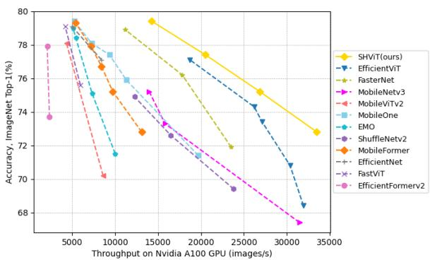
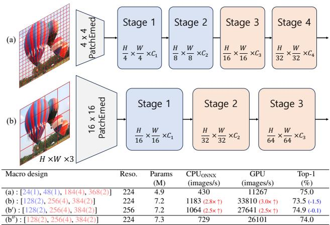
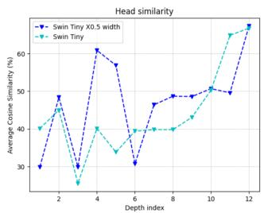
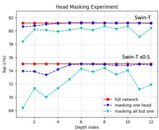
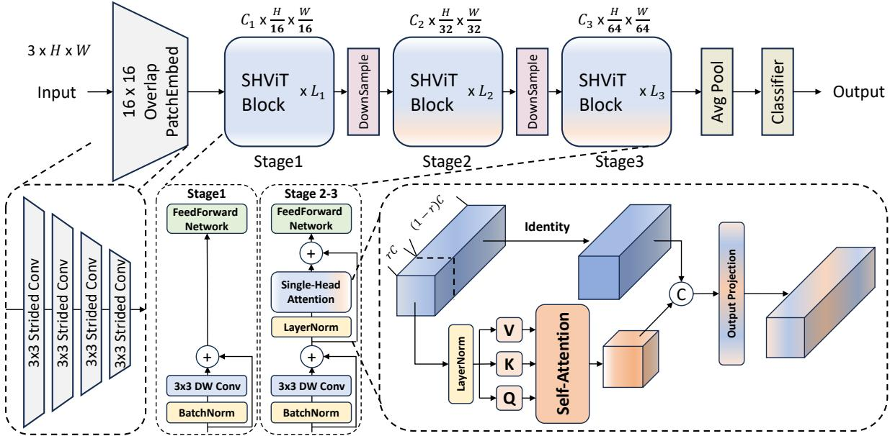
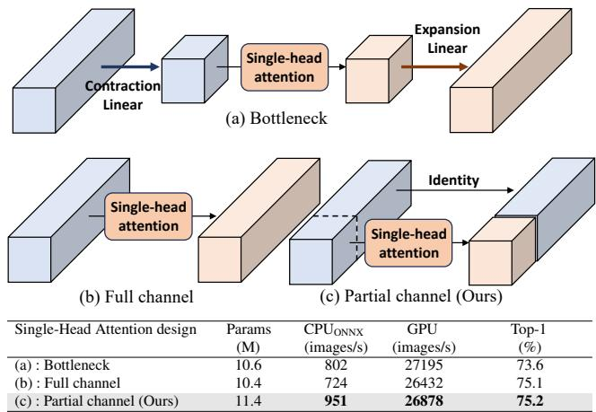
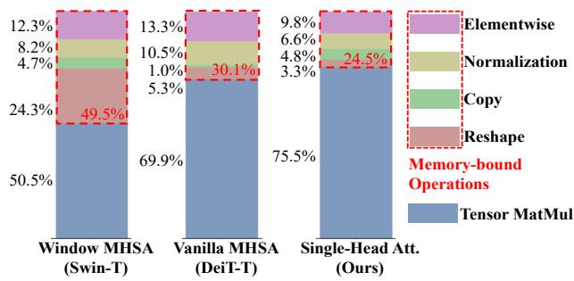
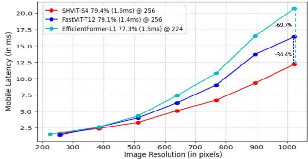

# SHViT: Single-Head Vision Transformer with Memory Efficient Macro Design

Seokju Yun Youngmin Ro\* Machine Intelligence Laboratory, University of Seoul, Korea Code: https://github.com/ysj9909/SHViT

## Abstract

Recently, efficient Vision Transformers have shown great performance with low latency on resource-constrained devices. Conventionally, they use 4×4 patch embeddings and a 4-stage structure at the macro level, while utilizing sophisticated attention with multi-head configuration at the micro level. This paper aims to address computational redundancy at all design levels in a memory-efficient manner. We discover that using larger-stride patchify stem not only reduces memory access costs but also achieves competitive performance by leveraging token representations with reduced spatial redundancyfrom the early stages. Furthermore, our preliminary analyses suggest that attention layers in the early stages can be substituted with convolutions, and several attention heads in the latter stages are computationally redundant. To handle this, we introduce a single-head attention module that inherently prevents head redundancy and simultaneously boosts accuracy by parallelly combining global and local information. Building upon our solutions, we introduce SHViT, a Single-Head Vision Transformer that obtains the state-of-the-art speed-accuracy tradeoff. For example, on ImageNet-1k, our SHViT-S4 is 3.3×, 8.1×, and 2.4×faster than MobileViTv2 ×1.0 on GPU, CPU, and iPhone12 mobile device, respectively, while being 1.3% more accurate. For object detection and instance segmentation on MS COCO using Mask-RCNN head, our model achieves performance comparable to FastViT-SA12 while exhibiting 3.8× and 2.0× lower backbone latency on GPU and mobile device, respectively.

## 1. Introduction

Vision Transformers (ViT) have demonstrated impressive performance across various computer vision tasks due to their high model capabilities [1–3]. Compared to Convolutional Neural Networks (CNN) [4, 5], ViTs excel in modeling long-range dependencies and scale effectively with large amounts of training data and model parameters [6]. Despite these advantages, the lack of inductive bias in vanilla ViTs necessitates more training data, and the global attention module incurs quadratic computational complexity with respect to the image size. To address these challenges, previous research has either combined ViTs with CNNs or introduced cost-efficient attention variants.

  
Figure 1. Comparison of throughput and accuracy between our SHViT and other recent methods.

Recently, studies addressing problems with real-time constraints have also proposed efficient models following similar strategies. And their strategies can be categorized into two groups: 1) efficient architecture - macro design; and 2) efficient Multi-Head Self-Attention (MHSA) - micro design. Studies exploring architectural design [7–12] utilize convolution to handle high-resolution / low-level features and employ attention for low-resolution / high-level features, demonstrating superior performance without complex operations. However, most of these methods mainly focus on which modules to use for aggregating tokens rather than how to construct the tokens (about patchify stem and stage design). On the other hand, efficient MHSA techniques reduce the cost of attention by implementing sparse attention [9, 13–18] or low-rank approximation [19–22]. These modules are applied with the commonly adopted multi-head mechanism. Despite all the great progress, redundancies in macro/micro design are still not fully understood or addressed. In this paper, we explore the redundancy at all design levels, and propose memory-efficient solutions.

To identify computational redundancy in macro design, we concentrate on patch embedding size, observing that most recent efficient models use a 4×4 patch embedding. We conduct experiments as shown in Fig. 2 to analyze spatial redundancy in traditional macro design and find several intriguing results. First, despite having fewer channels, the early stages exhibit a severe speed bottleneck due to the large number of tokens (at 224×224, stage1: 3136 tokens; stage2: 784 tokens). Second, using a 3-stage design that processes 196 tokens in the first stage through a 16×16 patchify stem does not lead to a significant drop in performance. For further comparison, we set up a basic model (Tab. 6 (2)) employing the aforementioned macro design, performing simple token mixing using a 3×3 depthwise convolution. Compared to the efficient model MobileViT-XS [18], our simple model achieves 1.5% superior accuracy on ImageNet-1k [23], while running 5.0× / 7.6× faster on the A100 GPU / Intel CPU. These results demonstrate that there is considerable spatial redundancy in the early stages, and compared with specialized attention methods, efficient macro design is more crucialfor the model to achieve competitive performance within strict latency limits. Note that this observation does not mean the token mixer is trivial.

We also probe redundancy in micro design, specifically within the MHSA layer. Most efficient MHSA methods have primarily focused on effective spatial token mixing. Due to the efficient macro design, we are able to use compact token representations with increased semantic density. Thus, we turn our focus to the channel (head) redundancy present in attention layers, also crucial aspect overlooked in most previous works. Through comprehensive experiments, we find that there is a noticeable redundancy in multi-head mechanism, particularly in the latter stages. We then propose a novel Single-Head Self-Attention (SHSA) as a competitive alternative that reduces the computational redundancy. In SHSA, self-attention with a single head is applied to just a subset of the input channels, while the others remain unchanged. SHSA layer not only eliminates the computational redundancy derived from multi-head mechanism but also reduces memory access cost by processing partial channels. Also, these efficiencies enable stacking more blocks with a larger width, leading to performance improvement within the same computational budget.

Based on these findings, we introduce a Single-Head Vision Transformer (SHViT) based on memory-efficient design principles, as a new family of networks that run highly fast on diverse devices. Experiments demonstrate that our SHViT achieves state-of-the-art performance for classification, detection, and segmentation tasks in terms of both speed and accuracy, as shown in Fig. 1. For instance, our SHViT-S4 achieves 79.4% top-1 accuracy on ImageNet with throughput of 14283 images/s on an Nvidia A100 GPU and 509 images/s on an Intel Xeon Gold 5218R CPU @ 2.10GHz, outperforming EfficientNet-B0 [24] by 2.3% in accuracy, 69.4% in GPU inference speed, and 90.6% in

  
Figure 2. Macro design analysis. All stages are composed of MetaFormer blocks [28]. The stages depicted in blue and red utilize depthwise convolution and attention layers as token mixer, respectively. In the table below, the macro design numbers represent the number of channels, while the numbers in parentheses indicate the number of blocks.

CPU speed. Also, SHViT-S4 has 1.3% better accuracy than MobileViTv2×1.0 [21] and is 2.4× faster on iPhone12 mobile device. For object detection and instance segmentation on MS COCO [25] using Mask-RCNN [26] detector, our model significantly outperforms EfficientViT-M4 [27] by 6.2 APbox and 4.9 APmask with a smaller backbone latency on various devices.

In summary, our contributions are as follows:

• We conduct a systematic analysis of the redundancy that has been overlooked in the majority of existing research, and propose memory-efficient design principles to tackle it.

• We introduce Single-Head ViT(SHViT), which strike a good accuracy-speed tradeoff on a variety of devices such as GPU, CPU, and iPhone mobile device.

• We carry out extensive experiments on various tasks and validate the high speed and effectiveness of our SHViT.

## 2. Analysis and Method

In this section, we first conduct analyses of redundancies in both macro and micro design through first-of-itskind experiments and then discuss various solutions to mitigate them. After that, we introduce the Single-Head Vision Transformer (SHViT) and explain its details.

## 2.1. Analysis of Redundancy in Macro Design

Most efficient models [5,7–9,11,17,19,21,29,30] adopt a 4×4 patchify stem / 4-stage configuration (Fig. 2 (a)). In contrast, plain ViT models [1, 31] adopt a 16×16 patchify stem to generate meaningful input tokens for subsequent MHSA layers. We focus on this discrepancy and further hypothesize that a larger-stride patchify stem is not only necessary for the MHSA layers but also crucial for effective representation learning within tight latency regimes.

<table><tr><td></td><td>Query pixel</td><td></td><td>Most important head</td><td></td><td></td><td>Most redundant head</td><td></td><td>Head similarity (%)</td><td>Remove 1 head (∆%)</td><td></td><td>Leave 1 head (∆%)</td><td></td></tr><tr><td></td><td>DeiT Tiny (6heads) :72.14% (72.95%)</td><td></td><td></td><td></td><td></td><td></td><td></td><td>3heads</td><td>6heads 3heads</td><td>6heads</td><td>3heads</td><td>6heads</td></tr><tr><td>Layer 1</td><td></td><td></td><td></td><td></td><td></td><td></td><td></td><td>49.5 63.9</td><td>-0.81</td><td>-0.15</td><td>-1.71</td><td>-1.13</td></tr><tr><td>Layer 2</td><td></td><td></td><td></td><td></td><td></td><td></td><td></td><td>35.5 57.7</td><td>-0.95</td><td>-0.18</td><td>-2.60</td><td>-2.21</td></tr><tr><td>Layer 3 (a) Layer 4</td><td></td><td></td><td></td><td></td><td></td><td>ns</td><td></td><td>18.4 34.8</td><td>-1.51</td><td>-0.27</td><td>-4.50</td><td>-4.63</td></tr><tr><td>Layer 5</td><td></td><td></td><td></td><td></td><td></td><td></td><td></td><td>39.2 33.8</td><td>-0.59</td><td>-0.25</td><td>-2.65</td><td>-4.51</td></tr><tr><td>Layer 6</td><td></td><td></td><td></td><td></td><td></td><td></td><td></td><td>53.2 46.2</td><td>-0.52</td><td>-0.28</td><td>-1.22</td><td>-2.40</td></tr><tr><td>Layer 7</td><td></td><td></td><td></td><td></td><td></td><td></td><td>47.5</td><td>39.7</td><td>-0.11</td><td>-0.31</td><td>-0.51</td><td>-2.13</td></tr><tr><td></td><td></td><td></td><td></td><td></td><td></td><td></td><td>52.1</td><td>41.3</td><td>-0.64</td><td>-0.37</td><td>-1.54</td><td>-1.61</td></tr><tr><td>Layer 8</td><td></td><td></td><td></td><td></td><td></td><td></td><td>63.5</td><td>53.2</td><td>-0.76</td><td>-0.05</td><td>-1.51</td><td>-1.67</td></tr><tr><td>Layer 9</td><td></td><td></td><td></td><td></td><td></td><td></td><td>69.0</td><td>64.2</td><td>-0.68</td><td>-0.28</td><td>-1.40</td><td>-1.35</td></tr><tr><td>(b)Layer 10</td><td></td><td></td><td></td><td></td><td></td><td></td><td></td><td>76.2 53.9</td><td>-0.76</td><td>-0.36</td><td>-1.17</td><td>-1.73</td></tr><tr><td>Layer 11</td><td></td><td></td><td></td><td></td><td></td><td></td><td></td><td>91.6 81.2</td><td>-0.55</td><td>-0.09</td><td>-0.92</td><td>-1.08</td></tr><tr><td>Layer 12</td><td></td><td></td><td></td><td></td><td></td><td></td><td>91.2</td><td>71.5</td><td>-0.26</td><td>-0.04</td><td>-0.54</td><td>-0.74</td></tr></table>

Figure 3. Multi-head redundancy analysis on DeiT [31]. To better analyze head redundancy, we increase the number of heads in DeiT-T from 3 to 6 and retrain the model. We compute the attention maps and calculate the average cosine similarity between each head in different layers across 128 test samples from ImageNet. The importance of each head is determined by its score when it is removed and when it is left alone. Zoom-in for better visibility.

To substantiate our hypothesis, inspired by [10, 27, 32], we adopt 16×16 patchify stem and 3-stage design. We build two models based on the MetaFormer block [28] and the two aforementioned macro designs (see Fig. 2 for details). Specifically, we configured both models to have a similar number of channels for equivalent feature map size. Surprisingly, model (b) is 3.0× / 2.8× faster on the GPU / CPU, respectively, although it performs 1.5% worse than (a). Furthermore, when trained at a resolution of 256×256, (b′) is not only comparable to (a) but also significantly faster.

As shown in the above observations, our proposed efficient macro design has the following advantages: 1) token representations with large receptive fields and reduced spatial redundancy can be utilized at the early stages. 2) It can diminish the feature map size by up to 16 times, leading to a significant reduction in memory access costs. 3) due to the aggressive stride design, there’s only a mild decrease in throughput when the resolution is increased, leading to effective performance enhancement (as shown in Fig. 2(b′), 8, and Tab. 2).

## 2.2. Analysis of Redundancy in Micro Design

MHSA layer computes and applies attention maps independently in multiple subspaces (heads), which has consistently shown enhanced performance [1, 33]. However, while attention maps are computationally demanding, recent studies have shown that many of them aren’t critically essential [34–39]. We also delve into the multi-head redundancy of prevailing tiny ViT models (DeiT-T [31], Swin-T [40]) through three experiments:attention map visualization, head similarity analysis, and head ablation study

  
Figure 4. Multi-head redundancy analysis on Swin [40]. We scale down by halving the width of Swin-T. Left: the average cosine similarity. Right: head masking results. The process of deriving the results is the same as the DeiT experiment. (Fig. 3)

For head similarity analysis, we measure the average cosine similarity between each head and other heads in the same layer. For head ablation study, we evaluate the performance impact by nullifying the output of some heads in a given layer while maintaining full heads in the other layers. And the highest score is reported. Details of each experiment and further results are provided in the supplementary materials.

First of all, in the early stages (Fig. 3 (a)), we observe that the top-performing heads tend to operate in a convolutionlike manner, while heads that have minimal impact on performance when removed typically process information more globally. Also, as shown in Fig. 2 (b′′), the model using attention layers in the first stage exhibits a less favorable speed-accuracy trade-off compared to those employing depthwise convolution layers in the first stage. Hence, for efficiency, we use convolutions with spatial inductive bias as the token mixer in the initial stage.

In the latter stages, we find that there is a lot of redundancy both at the feature and prediction levels. For example, the latter stages of DeiT-T (Fig. 3 (b)) exhibit the average head similarity of 78.3% (64.8% for 6 heads), with Swin-T also demonstrating notably high values (Fig. 4 Left). In the experiment of removing one head, We observe that the majority of heads can be removed without deviating too much from the original accuracy. Remarkably, in some cases of Swin-T (Fig. 4 Right), removing a head even leads to slightly improved score. Furthermore, when using just one head out of 12 or 24 in Swin-T, the performance drop is, on average, only 0.95% points.

Previous approaches [34–39] to tackle head redundancy typically train full networks first and then prune unnecessary heads. Although these methods are effective, they come at the expense of increased computational resources and memory footprints during training. To address the aforementioned problem cost-effectively, we design our attention module with a single head to inherently avoid head redundancy. This approach ensures both the training and inference processes are streamlined and efficient.

  
Figure 5. Overview of Single-Head Vision Transformer (SHViT). The model starts with a 16×16 overlapping patch embedding layer and uses single-head attention layers in the latter stages to efficiently compute global dependencies. See text for details.

## 2.3. Single-Head Self-Attention

Based on the above analyses, we propose a new Single-Head Self-Attention (SHSA), with details presented in the lower right corner of Fig. 5. It simply applies an attention layer with a single head on only a part of the input channels $( C _ { p } { = } r C )$ for spatial feature aggregation and leaves the remaining channels untouched. We set r to 1/4.67 as a default. Formally, the SHSA layer can be described as:

$$
\mathrm { S H S A } ( \mathbf { X } ) = \mathrm { C o n c a t } ( \tilde { \mathbf { X } } _ { a t t } , \mathbf { X } _ { r e s } ) W ^ { O }\tag{1}
$$

$$
\begin{array} { r } { \tilde { \mathrm { X } } _ { a t t } = \mathrm { A t t e n t i o n } ( \mathbf { X } _ { a t t } W ^ { Q } , \mathbf { X } _ { a t t } W ^ { K } , \mathbf { X } _ { a t t } W ^ { V } ) , } \end{array}\tag{2}
$$

$$
\mathrm { A t t e n t i o n } ( \mathbf { Q } , \mathbf { K } , \mathbf { V } ) = \mathrm { S o f t m a x } ( \mathbf { Q } \mathbf { K } ^ { \top } / \sqrt { d _ { q k } } ) \mathbf { V } ,\tag{3}
$$

$$
\mathrm { X } _ { a t t } , \mathrm { X } _ { r e s } = \mathrm { S p l i t } ( \mathbf { X } , [ C _ { p } , C - C _ { p } ] )\tag{4}
$$

where $W ^ { Q } , \thinspace W ^ { K } , \thinspace W ^ { V }$ , and $W ^ { O }$ are projection weights, $d _ { q k }$ is the dimension of the query and key (set to 16 as a default), and Concat( · ) is the concatenation operation. For consistent memory access, we take the initial $C _ { p }$ channels as representatives of the whole feature maps. Additionally, the final projection of SHSA is applied to all channels, rather than just the initial $C _ { p }$ channels, ensuring efficient propagation of the attention features to the remaining channels. SHSA can be interpreted as sequentially stretching the previously parallel-computed redundant heads along the block-axis.

<table><tr><td>Single-Head Attention design</td><td>Params (M)</td><td>CPUONNX (images/s)</td><td>GPU (images/s)</td><td>Top-1 (%)</td></tr><tr><td>(a) : Bottleneck</td><td>10.6</td><td>802</td><td>27195</td><td>73.6</td></tr><tr><td>(b) : Full channel</td><td>10.4</td><td>724</td><td>26432</td><td>75.1</td></tr><tr><td>(c) : Partial channel (Ours)</td><td>11.4</td><td>951</td><td>26878</td><td>75.2</td></tr></table>

Figure 6. Comparison of Single-head attention designs. (a) replaces convolution with single-head attention in ResNet’s bottleneck block [4]. The contraction ratio is equal to the partial ratio in (c). (b) uses full channels for single-head attention modules. All models are configured to have similar speeds. Our partial channel approach has the best speed-accuracy tradeoff.

In Fig. 6, we also explore various single-head designs. Recent studies [7, 12, 27, 29, 32, 41, 42] sequentially combines convolution and attention layers to incorporate local details into a global contexts. Unfortunately, this approach can only extract either local detail or global context in a given token mixer. Also, it is noted in [6] that some channels process local details while others handle global modeling. These observations imply that the current serial approaches have redundancy when processing all channels in each layer (Fig. 6 (a), (b)). In contrast, our partial channel approach with preceding convolution memory-efficiently addresses the aforementioned issue by leveraging two complementary features in parallel within a single token mixer [12, 43].

  
Figure 7. Runtime breakdown. Operations highlighted in the red box represent memory-bound operations, where the majority of the duration is consumed by memory accesses, and the computational time is relatively brief.

For effective utilization of the attention layer, Layer Normalization [44] is essential; meanwhile, to implement a multi-head approach, data movements like reshape operation are required. Consequently, as shown in Fig. 7, a large portion of MHSA’s runtime is taken up by memory-bound operations like reshaping and normalization [27,45–47]. By minimizing the use of memory-bound operations or applying them to fewer input channels, the SHSA module can fully leverage the computing power of GPUs/CPUs.

## 2.4. Single-Head Vision Transformer

An overview of the Single-Head Vision Transformer (SHViT) architecture is illustrated in Fig. 5. Given an input image, we first apply four 3×3 strided convolution layers to it. Compared to the stride-16 16×16 convolution tokenizing used by standard ViT models [1, 31], our overlapping patchify stem can extract better local representations [10,27,32]. Then, the tokens pass through three stages of stacked SHViT blocks for hierarchical representation extraction. A SHViT block consists of three main modules (see Fig. 5): Depthwise Convolution (DWConv) layer for local feature aggregation or conditional position embedding [48, 49], Single-Head Self-Attention (SHSA) layer for modeling global contexts, and Feed-Forward-Network (FFN) for channel interaction. The expansion ratios in FFN are set to 2. The combination of DWConv and SHSA captures both local and global dependencies in a computationally and memory-efficient manner. Based on findings in sec. 2.2, we do not use the SHSA layer in the first stage. To reduce tokens without information loss, we utilize an efficient downsampling layer, which is composed of two stage 1 blocks, with an inverted residual block [27,50,51] (stride-2) placed between them. Finally, the global average pooling and fully connected layer are used to output the predictions.

<table><tr><td>Model variants</td><td>Depth</td><td>Emb. dim.</td><td>Reso.</td><td>Partial ratio</td><td>Exp. ratio</td></tr><tr><td>SHViT-S1</td><td>[2, 4,5]</td><td>[128,224,320]</td><td>224</td><td rowspan="3">1/4.67</td><td rowspan="3">2</td></tr><tr><td>SHViT-S2</td><td>[2, 4, 5]</td><td>[128, 308, 448]</td><td>224</td></tr><tr><td>SHViT-S3</td><td>[3, 5,5]</td><td>[192, 352, 448]</td><td>224</td></tr><tr><td>SHViT-S4</td><td>[4, 7, 6]</td><td>[224, 336, 448]</td><td>256</td><td></td><td></td></tr></table>

Table 1. Architecture details of SHViT variants.

Besides the aforementioned operators, normalization and activation layers also play crucial roles in determining the model speed. We employ Layer Normalization [44] only for the SHSA layer while integrating Batch Normalization (BN) [52] into the remaining layers, as BN can be merged into its adjacent convolution or linear layers. We also use ReLU [53] activations instead of other complex alternatives [51, 54, 55], as they are much slower on various inference deployment platforms [7, 27, 56].

We build four SHViT variants with different settings of depth and width. Due to the large-sized patch embedding and single-head design, we can use a larger number of channels and blocks than previous efficient models. Model specifications are provided in Tab. 1.

## 3. Experiments

## 3.1. Implementation Details

We conduct image classification on ImageNet-1K [23], which includes 1.28M training and 50K validation images for 1000 categories. All models are trained from scratch using AdamW [57] optimizer for 300 epochs with a learning rate of $1 0 ^ { - 3 }$ and a total batch size of 2048. We use cosine learning rate scheduler [58] with linear warmup for 5 epochs. Weight decays are set to 0.025/0.032/0.035/0.03 for SHViT-S1 to S4. For fair comparison, we follow the same data augmentation proposed in [31], including Mixup [59], random erasing [60], and auto-augmentation [61]. For 3842 and $5 1 2 ^ { 2 }$ resolution, we finetune the model for 30 epochs with weight decay of $1 0 ^ { - 8 }$ and learning rate of 0.004. Additionally, we assess throughput performance across various hardware platforms. We measure GPU throughput on an Nvidia A100 with batch size of 256. For CPU and CPU , we evaluate the runtime on an Intel(R) Xeon(R) Gold 5218R CPU @ 2.10GHz processor , with batch size of 16 (using a single thread). For CPUONNX, we convert the models to ONNX [62] runtime format. Mobile latency is measured using iPhone 12 with iOS version 16.5. We export the models (batch size is set to 1) using CoreML tools [63] and report the median latency over 1,000 runs. We also validate our model as an efficient vision backbone for object detection and instance segmentation on COCO [25] with RetinaNet [64] and Mask R-CNN [26], respectively. All models are trained under 1× schedule (12 epochs) following [40] on mmdetection library [65].

<table><tr><td rowspan="2">Model</td><td rowspan="2">Reso.</td><td rowspan="2">Epochs</td><td rowspan="2">FLOPs (M)</td><td rowspan="2">Params (M)</td><td colspan="3">Throughput (images/s)</td><td rowspan="2">Top-1 (%)</td><td rowspan="2">Top-5 (%)</td></tr><tr><td>GPU</td><td>CPU</td><td>CPUONNX</td></tr><tr><td>MobileNetV3-Small [51]</td><td>224</td><td>600</td><td>57</td><td>2.5</td><td>31477</td><td>167</td><td>1172</td><td>67.4</td><td>一</td></tr><tr><td>MobileViT-XXS [18]</td><td>256</td><td>300</td><td>410</td><td>1.3</td><td>7594</td><td>21</td><td>170</td><td>69.0</td><td></td></tr><tr><td>MobileViTV2 ×0.5 [21]</td><td>256</td><td>300</td><td>466</td><td>1.4</td><td>8616</td><td>17</td><td>157</td><td>70.2</td><td></td></tr><tr><td>EfficientViT-M2 [27]</td><td>224</td><td>300</td><td>201</td><td>4.2</td><td>30377</td><td>147</td><td>781</td><td>70.8</td><td>90.2</td></tr><tr><td>MobileOne-S0 [56]</td><td>224</td><td>300</td><td>275</td><td>2.1</td><td>19689</td><td>86</td><td>1648</td><td>71.4</td><td></td></tr><tr><td>EMO-1M [29]</td><td>224</td><td>300</td><td>261</td><td>1.3</td><td>10032</td><td>34</td><td>119</td><td>71.5</td><td></td></tr><tr><td>FasterNet-T0 [30]</td><td>224</td><td>300</td><td>340</td><td>3.9</td><td>23518</td><td>92</td><td>844</td><td>71.9</td><td></td></tr><tr><td>ShuffleNetV2 ×1.5 [66]</td><td>224</td><td>300</td><td>299</td><td>3.5</td><td>16495</td><td>62</td><td>799</td><td>72.6</td><td></td></tr><tr><td>MobileFormer-96M [19]</td><td>224</td><td>450</td><td>96</td><td>3.6</td><td>13106</td><td>91</td><td>235</td><td>72.8</td><td></td></tr><tr><td>SHViT-S1</td><td>224</td><td>300</td><td>241</td><td>6.3</td><td>33489</td><td>143</td><td>1111</td><td>72.8</td><td>91.0</td></tr><tr><td>EfficientFormerV2-S0 [9]</td><td>224</td><td>300</td><td>400</td><td>3.5</td><td>2374</td><td>54</td><td>372</td><td>73.7</td><td>一</td></tr><tr><td>EfficientViT-M4 [27]</td><td>224</td><td>300</td><td>299</td><td>8.8</td><td>26201</td><td>113</td><td>616</td><td>74.3</td><td>91.8</td></tr><tr><td>EdgeViT-XXS [17]</td><td>224</td><td>300</td><td>600</td><td>4.1</td><td>6763</td><td>33</td><td>168</td><td>74.4</td><td></td></tr><tr><td>MobileViT-XS [18]</td><td>256</td><td>300</td><td>986</td><td>2.3</td><td>4408</td><td>8</td><td>96</td><td>74.8</td><td>一</td></tr><tr><td>ShuffleNetV2 ×2.0 [66]</td><td>224</td><td>300</td><td>591</td><td>7.4</td><td>12276</td><td>40</td><td>250</td><td>74.9</td><td>92.4</td></tr><tr><td>EMO-2M [29]</td><td>224</td><td>300</td><td>439</td><td>2.3</td><td>7333</td><td>25</td><td>78</td><td>75.1</td><td></td></tr><tr><td>MobileNetV3-Large [51]</td><td>224</td><td>600</td><td>217</td><td>5.4</td><td>13994</td><td>43</td><td>613</td><td>75.2</td><td>I</td></tr><tr><td>SHViT-S2</td><td>224</td><td>300</td><td>366</td><td>11.4</td><td>26878</td><td>99</td><td>951</td><td>75.2</td><td>92.4</td></tr><tr><td>FastViT-T8 [7]</td><td>256</td><td>300</td><td>700</td><td>2.1</td><td>5978</td><td>23</td><td>140</td><td>75.6</td><td>-</td></tr><tr><td>GhostNet ×1.3 [67]</td><td>224</td><td>300</td><td>226</td><td>7.3</td><td>9433</td><td>39</td><td>109</td><td>75.7</td><td>92.7</td></tr><tr><td>FasterNet-T1 [30]</td><td>224</td><td>300</td><td>850</td><td>7.6</td><td>17827</td><td>41</td><td>552</td><td>76.2</td><td></td></tr><tr><td>EfficientNet-B0 [24]</td><td>224</td><td>350</td><td>390</td><td>5.3</td><td>8433</td><td>26</td><td>267</td><td>77.1</td><td>93.3</td></tr><tr><td>EfficientViT-M5 [27]</td><td>224</td><td>300</td><td>522</td><td>12.4</td><td>18722</td><td>64</td><td>456</td><td>77.1</td><td>93.4</td></tr><tr><td>PoolFormer-S12 [28]</td><td>224</td><td>300</td><td>1823</td><td>11.9</td><td>5432</td><td>13</td><td>120</td><td>77.2</td><td></td></tr><tr><td>MobileOne-S2 [56]</td><td>224</td><td>300</td><td>1299</td><td>7.8</td><td>9355</td><td>22</td><td>581</td><td>77.4</td><td>一</td></tr><tr><td>SHViT-S3</td><td>224</td><td>300</td><td>601</td><td>14.2</td><td>20522</td><td>62</td><td>731</td><td>77.4</td><td>93.4</td></tr><tr><td>EdgeViT-XS [17]</td><td>224</td><td>300</td><td>1100</td><td>6.7</td><td>5520</td><td>21</td><td>120</td><td>77.5</td><td>1</td></tr><tr><td>EfficientFormerV2-S1 [9]</td><td>224</td><td>300</td><td>650</td><td>6.1</td><td>2112</td><td>37</td><td>325</td><td>77.9</td><td></td></tr><tr><td>MobileViTV2 ×1.0 [21]</td><td>256</td><td>300</td><td>1800</td><td>4.9</td><td>4345</td><td>7</td><td>63</td><td>78.1</td><td></td></tr><tr><td>ResNet50 [4,5]</td><td>224</td><td>300</td><td>4110</td><td>25.6</td><td>5281</td><td>8</td><td>271</td><td>78.8</td><td></td></tr><tr><td>FasterNet-T2 [30]</td><td>224</td><td>300</td><td>1910</td><td>15.0</td><td>11181</td><td>21</td><td>417</td><td>78.9</td><td></td></tr><tr><td>EMO-6M [29]</td><td>224</td><td>300</td><td>961</td><td>6.1</td><td>5105</td><td>15</td><td>50</td><td>79.0</td><td></td></tr><tr><td>EfficientNet-B1 [24]</td><td>240</td><td>350</td><td>700</td><td>7.8</td><td>4982</td><td>11</td><td>156</td><td>79.1</td><td>94.4</td></tr><tr><td>FastViT-T12 [7]</td><td>256</td><td>300</td><td>1400</td><td>6.8</td><td>4197</td><td>14</td><td>92</td><td>79.1</td><td></td></tr><tr><td>MobileFormer-508M [19]</td><td>224</td><td>450</td><td>508</td><td>14.0</td><td>5390</td><td>23</td><td>91</td><td>79.3</td><td></td></tr><tr><td>MobileOne-S4 [56]</td><td>224</td><td>300</td><td>2978</td><td>14.8</td><td>5281</td><td>11</td><td>281</td><td>79.4</td><td></td></tr><tr><td>SHViT-S4</td><td>256</td><td>300</td><td>986</td><td>16.5</td><td>14283</td><td>36</td><td>509</td><td>79.4</td><td>94.5</td></tr><tr><td>Finetuning with higher resolution</td><td></td><td></td><td></td><td></td><td></td><td></td><td></td><td></td><td></td></tr><tr><td>EfficientViT-M5r384 [27]</td><td>384</td><td>330</td><td>1486</td><td>12.4</td></table>

Table 2. SHViT classification performance on ImageNet-1K [23] with comparisons to SOTA efficient models. Throughput is measured on an Nvidia A100 GPU with batch size of 256 for GPU and Intel(R) Xeon(R) Gold 5218R CPU @ 2.10GHz processor with batch size of 16 for CPU and CPU . Larger throughput means faster inference speed. FLOP count is computed by fvcore [68] library.

## 3.2. SHViT on ImageNet-1K Classification

As shown in Fig. 1, Tab. 2, and 4, we compare Single-Head Vision transformer (SHViT) with the state-of-theart models. The comparison results clearly show that our SHViT achieves a better trade-off between accuracy and throughput/latency across various devices.

Comparison with efficient CNNs. Our SHViT-S1 achieves 5.4% higher accuracy than MobileNetV3-Small [51], while maintaining similar speeds on both the A100 GPU and Intel CPU. Compared to ShuffleNetV2 ×2.0 [66], SHViT-S2 obtains slightly better performance with 2.2× and 2.5× speed improvements on the A100 GPU and Intel CPU, respectively. Furthermore, our model is 3.8× faster when converted to the ONNX runtime format. Compared to the recent FasterNet-T1 [30], SHViT-S3 not only achieves 1.2% higher accuracy but also runs faster: 15.1% on the A100 GPU and 32.4% on the Intel CPU. Notably, at Top-1 accuracy of 79.1−79.4%, our model is 2.9×/ 3.3× faster than EfficientNet-B1 [24], 3.4×/ 5.5× faster than FastViT-T12 [7], and 2.7×/ 1.8× faster than MobileOne-S4 [56] on the A100 GPU/Intel CPU with ONNX format. When leveraging minimal attention module in a memory-efficient way, ViTs can still showfast inference speeds like efficient CNNs.

Comparison with efficient ViTs and hybrid models. Our SHViT-S1 has 10% and 42% higher throughput than EfficientViT-M2 [27] on the A100 GPU and Intel CPU with ONNX runtime, respectively, while showing better performance with a large margin (70.8% → 72.8%). SHViT-S3 obtains similar accuracy to PoolFormer-S12 [28], but it uses 3× fewer FLOPs, is 3.8× faster on the A100 GPU, and

<table><tr><td rowspan="2">Model</td><td rowspan="2">Reso.</td><td rowspan="2">Flops (M)</td><td colspan="3">Throughput (images/s)</td><td rowspan="2">Top-1 (%)</td></tr><tr><td>GPU</td><td>CPU</td><td>CPUONNX</td></tr><tr><td>SHViT-S1</td><td>224</td><td>241</td><td>33489</td><td>143</td><td>1111</td><td>74.0</td></tr><tr><td>SwiftFormer-XS [69]</td><td>224</td><td>600</td><td>7922</td><td>26</td><td>175</td><td>75.7</td></tr><tr><td>EfficientFormerV2-S0 [9]</td><td>224</td><td>400</td><td>2374</td><td>54</td><td>372</td><td>75.7</td></tr><tr><td>SHViT-S2</td><td>224</td><td>366</td><td>26878</td><td>99</td><td>951</td><td>76.2</td></tr><tr><td>FastViT-T8 [7]</td><td>256</td><td>1400</td><td>5978</td><td>23</td><td>140</td><td>76.7</td></tr><tr><td>SHViT-S3</td><td>224</td><td>601</td><td>20522</td><td>62</td><td>731</td><td>78.3</td></tr><tr><td>SwiftFormer-S [69]</td><td>224</td><td>1000</td><td>6415</td><td>21</td><td>147</td><td>78.5</td></tr><tr><td>EfficientFormerV2-S1 [9]</td><td>224</td><td>650</td><td>2112</td><td>37</td><td>325</td><td>79.0</td></tr><tr><td>EfficientFormer-L1 [8]</td><td>224</td><td>1300</td><td>6840</td><td>21</td><td>274</td><td>79.2</td></tr><tr><td>SHViT-S4</td><td>256</td><td>986</td><td>14283</td><td>36</td><td>509</td><td>80.2</td></tr></table>

Table 3. Comparison of SOTA efficient models on ImageNet-1K classification, using DeiT [31] distillation recipe.

6.1× faster as ONNX model. Remarkably, our SHViT-S4 surpasses recent EdgeViT-XS [17] with a 1.9% higher accuracy, while being 2.6× faster on A100 GPU, 1.7× faster on Intel CPU, and 4.2× faster on ONNX implementation. As shown in the results above, when converted to ONNX format, our models demonstrate a notable performance boost compared to the recent SOTA models. This enhancement is largely because our single-head design uses fewer reshape operations, which often cause overhead in ONNX runtime. To summarize, the above results demonstrate that our proposed memory-efficient macro design has a more significant impact on the speed-accuracy tradeoff than efficient attention variants or highly simple operations like pooling.

Finetuning with higher resolution. Following [27], we also finetune our SHViT-S4 to higher resolutions. Compared to the state-of-the-art EfficientViT-M5r512 [27], our $\mathrm { S H V i T - S 4 } _ { r 3 8 4 }$ attains competitive performance, even when trained at a lower resolution. Additionally, $\mathrm { S H V i T - S 4 } _ { r 3 8 4 }$ is 77.4% faster on the A100 GPU, 55.6% on the Intel CPU, and an impressive 3.6× faster on ONNX runtime format. Moreover, $\mathrm { S H V i T - S 4 } _ { r 5 1 2 }$ achieves 82.0% top-1 accuracy with throughput of 3957 images/s on the A100 GPU, demonstrating effectiveness across various input sizes.

Distillation results. We report the performance of our models using DeiT [31] distillation recipe in Tab. 3. Notably, our models outperform competing models in both speed and accuracy. Specifically, SHViT-S3 even surpasses FastViT-T8 which is 5.2× slower as ONNX models. SHViT-S4 attains superior performance than EfficientFormer-L1 [8] while being 2.1× / 1.9× faster on the GPU / ONNX runtime.

<table><tr><td>Model</td><td>Latency (ms)</td><td>Top-1 (%)</td></tr><tr><td>EfficientFormer-L1 [8]</td><td>1.5</td><td>77.3 (79.2)</td></tr><tr><td>EfficientFormerV2-S1 [9]</td><td>1.3</td><td>77.9 (79.0)</td></tr><tr><td>MobileViTv2 × 1.0 [21]</td><td>3.8</td><td>78.1</td></tr><tr><td>EfficientNet-B1 [24]</td><td>1.8</td><td>79.1</td></tr><tr><td>FastViT-T12 [7]</td><td>1.4</td><td>79.1 (80.3)</td></tr><tr><td>MobileOne-S4 [56]</td><td>1.7</td><td>79.4</td></tr><tr><td>SHViT-S4</td><td>1.6</td><td>79.4 (80.2)</td></tr></table>

Table 4. Mobile latency comparison. The results in brackets are trained with distillation [31].

Mobile Latency Evaluation. We also verify the effectiveness of our model on the mobile device in Tab. 4. Compared to the efficient models EfficientNet-B1 [24] / MobileOne-S4 [56], our SHViT-S4 achieves similar accuracy while running 0.2 ms / 0.1 ms

faster on iPhone 12 device. SHViT-S4 also obtains competitive performance against highly-optimized models for mobile latency, indicating its consistent performance across diverse inference platforms. Further results in Fig. 8 show that our model significantly outperforms over the recent models FastViT [7] and EfficientFormer [8], especially at higher resolutions. At low resolutions, SHViT-S4 is slightly slower, but at 1024 × 1024, our model achieves 34.4% and 69.7% lower latency than FastViT and EfficientFormer, respectively. These results stem from the increased memory efficiency in the macro and micro design.

  
Figure 8. Mobile latency comparison of a SHViT-S4 with recent state-of-the-art FastViT [7] and EfficientFormer [8]; measured on iPhone 12 for various input sizes.

<table><tr><td colspan="10">RetinaNet Object Detection on COCO</td></tr><tr><td rowspan="2">Backbone</td><td colspan="3">Latency (ms)</td><td rowspan="2">AP</td><td rowspan="2">AP50</td><td rowspan="2">AP75</td><td rowspan="2">AP8</td><td rowspan="2">APm</td><td rowspan="2">AP{</td></tr><tr><td>GPU</td><td>CPU</td><td>Mobile</td></tr><tr><td>MobileNetV3 [51]</td><td>0.34</td><td>7.5</td><td>7.5</td><td>29.9</td><td>49.3</td><td>30.8</td><td>14.9</td><td>33.3</td><td>41.1</td></tr><tr><td>EfficientViT-M4 [27]</td><td>0.33</td><td>7.3</td><td>7.8</td><td>32.7</td><td>52.2</td><td>34.1</td><td>17.6</td><td>35.3</td><td>46.0</td></tr><tr><td>PVTv2-B0 [70]</td><td>0.73</td><td>115.4</td><td>27.5</td><td>37.2</td><td>57.2</td><td>39.5</td><td>23.1</td><td>40.4</td><td>49.7</td></tr><tr><td>MobileFormer-508M [19]</td><td>0.89</td><td>35.7</td><td>26.9</td><td>38.0</td><td>58.3</td><td>40.3</td><td>22.9</td><td>41.2</td><td>49.7</td></tr><tr><td>EdgeViT-XXS [17]</td><td>0.88</td><td>38.4</td><td>12.9</td><td>38.7</td><td>59.0</td><td>41.0</td><td>22.4</td><td>42.0</td><td>51.6</td></tr><tr><td>SHViT-S4</td><td>0.28</td><td>5.0</td><td>3.3</td><td>38.8</td><td>59.8</td><td>41.1</td><td>22.0</td><td>42.4</td><td>52.7</td></tr></table>

<table><tr><td rowspan="2">Backbone</td><td colspan="3">Latency (ms)</td><td rowspan="2"> $\mathbf { A P } ^ { b }$ </td><td rowspan="2"> $\mathbf { A P } _ { 5 0 } ^ { b }$ </td><td rowspan="2">AP75</td><td rowspan="2">APm</td><td rowspan="2">AP50</td><td rowspan="2">AP75</td></tr><tr><td>GPU</td><td>CPU</td><td>Mobile</td></tr><tr><td>EfficientNet-B0 [24]</td><td>0.54</td><td>16.7</td><td>3.8</td><td>31.9</td><td>51.0</td><td>34.5</td><td>29.4</td><td>47.9</td><td>31.2</td></tr><tr><td>EfficientViT-M4 [27]</td><td>0.33</td><td>7.3</td><td>7.8</td><td>32.8</td><td>54.4</td><td>34.5</td><td>31.0</td><td>51.2</td><td>32.2</td></tr><tr><td>PoolFormer-S12 [28]</td><td>1.20</td><td>40.4</td><td>6.8</td><td>37.3</td><td>59.0</td><td>40.1</td><td>34.6</td><td>55.8</td><td>36.9</td></tr><tr><td>EfficientFormer-L1 [8]</td><td>0.84</td><td>21.0</td><td>4.3</td><td>37.9</td><td>60.3</td><td>41.0</td><td>35.4</td><td>57.3</td><td>37.3</td></tr><tr><td>ResNet-50 [4]</td><td>0.94</td><td>19.0</td><td>8.8</td><td>38.0</td><td>58.6</td><td>41.4</td><td>34.4</td><td>55.1</td><td>36.7</td></tr><tr><td>FastViT-SA12 [7]</td><td>1.06</td><td>39.4</td><td>6.5</td><td>38.9</td><td>60.5</td><td>42.2</td><td>35.9</td><td>57.6</td><td>38.1</td></tr><tr><td>SHViT-S4</td><td>0.28</td><td>5.0</td><td>3.3</td><td>39.0</td><td>61.2</td><td>41.9</td><td>35.9</td><td>57.9</td><td>37.9</td></tr></table>

Table 5. Comparison results on object detection and instance segmentation on COCO 2017 [25] using RetinaNet [64] and Mask RCNN [26] head. Backbone latencies are measured with image crops of 512 × 512. The batch sizes used for GPU, CPU, and Mobile latency are 32, 16, and 1 respectively.

## 3.3. SHViT on downstream tasks

In Tab. 5, We evaluate the transfer ability of our SHViT using two frameworks: 1) RetinaNet [64] for object detection, 2) Mask R-CNN [26] for instance segmentation. Object detection. SHViT-S4 is 2.3× faster on mobile device than MobileNetV3 [51] and outperforms it by +8.9 AP. Compared to MobileFormer [19], our model achieves better performance while being 3.2× and 8.2× faster on the A100 GPU and mobile device, respectively.

<table><tr><td rowspan="2">#Row</td><td rowspan="2">Ablation</td><td rowspan="2">Variant</td><td colspan="3">Throughput (images/s)</td><td rowspan="2">Top-1 (%)</td></tr><tr><td>GPU</td><td>CPU</td><td> $\overline { { \mathrm { C P U } _ { \mathrm { O N N X } } } }$ </td></tr><tr><td>(1)</td><td>Single Head</td><td>→ MHSA [1, 33]</td><td>18036</td><td>50</td><td>578</td><td>77.7</td></tr><tr><td>(2)</td><td>Self-Attention</td><td>→ None</td><td>22075</td><td>61</td><td>792</td><td>76.3</td></tr><tr><td>(3)</td><td></td><td>=1/8</td><td>20666</td><td>57</td><td>754</td><td>77.1</td></tr><tr><td>(4)</td><td>Partial Ratio</td><td>= 1/4.67 (SHViT-S3)</td><td>20522</td><td>62</td><td>731</td><td>77.4</td></tr><tr><td>(5)</td><td></td><td>= 1/2</td><td>19976</td><td>56</td><td>673</td><td>77.5</td></tr></table>

Table 6. Ablation on our proposed Single-Head Attention and design choice for SHViT-S3 variant.

Instance Segmentation. SHViT-S4 surpasses GPU or mobile-optimized models like EfficientViT [27] and EfficientNet [24] in speed, while delivering a substantial performance boost. Remarkably, our model gains 1.7 $\mathsf { A P } ^ { b }$ and 1.3 $\mathbf { A P } ^ { m }$ over PoolFormer [28] but runs 4.3×, 8.1×, and 2.1× faster on the GPU, CPU, and mobile device respectively.

As shown in the above results, the large-stride patchify stem with 3-stage reduces not only computational costs but also generates meaningful token representations, especially at higher resolutions. Furthermore, the marked performance gap with EfficientViT [27], using a similar macro design, proves the efficacy of our micro design choices.

## 3.4. Ablation Study

In this section, we first verify the effectiveness of our proposed Single-Head Self-Attention (SHSA) layer and then conduct a concise ablation study on the value of the partial ratio for SHSA layer. Results are provided in Tab. 6. Effectiveness of SHSA. To assess whether the SHSA layer can effectively capture the global contexts like the Multi-Head Self-Attention (MHSA) [1] layer, we conduct an ablation study by either replacing the SHSA layer with the MHSA layer or removing it. As shown in Tab. 6 (1, 2 vs. 4), SHSA layer exhibits a better speed-accuracy tradeoff compared to MHSA layer. While removing SHSA layer results in a faster model speed, it leads to a significant drop in accuracy. Meanwhile, model (2) can also achieve highly competitive performance compared with the SOTA models in Tab. 2, which shows that our proposed macro design offers a solid architectural baseline under tight latency constraints. Searching for the appropriate partial ratio of SHSA. By default, we set the partial ratio to 1 / 4.67 for all SHViT models, which obtains the optimal speed-accuracy tradeoff (3, 5 vs. 4). Compared to a very small value, increasing the channels moderately for token interaction achieves effective performance enhancement at low costs. Also, a too large value does not provide a performance boost that compensates for the accompanying costs.

## 4. Related Work

Leveraging Convolutional Neural Networks (CNN) in resource-constrained devices has gained significant attention from many researchers. Within this trend, several strategies have emerged, including decomposition of convolution in MobileNets [50, 51, 71], channel shuffling in

ShuffleNets [66, 72], cheap linear transformation in Ghost-Net [67], compound scaling law in EfficientNet [24], and structural re-parameterization in many works [7, 56, 73].

Even within the Vision Transformer (ViT) [1] realm, there are ongoing numerous efforts for efficient designs to accelerate inference speed on various devices. One promising approach is designing a new ViT architecture that integrates the local priors of CNN. This method mostly incorporates attention only in the latter stages, allowing for the efficient extraction of global information without considerable computational overhead [7–10, 12]. In contrast, other methods employ attention and convolution in parallel, either within a single token mixer [14, 43, 74] or on a block-by-block basis [19], to combine a rich set of features. Another line of approach focuses on reducing the computational complexity of MHSA [17, 18, 21, 69]. For example, MobileViTv2 [21] introduces a separable self-attention with linear complexity with respect to the number of tokens (resolution). EdgeViT [17] applies MHSA to sub-sampled features to perform approximately full spatial interaction in a cost-effective manner. Unlike the above approaches, we prioritize organizing tokens with minimal spatial redundancy over efficiently mixing tokens.

Also, recent works [27, 34–39, 75–77] have demonstrated that numerous heads function in similar ways and can be pruned without notably affecting performance. EfficientViT [27] proposes feeding attention heads with different splits of the full channel to improve attention diversity. In addition, [76] presents a regularization loss for multihead similarity, while [78] explores head similarity across different layers. As opposed to reducing multi-head redundancy, we design module with single-head configuration, which not only inherently prevents multi-head redundancy but also saves computation costs.

## 5. Conclusion

In this work, we have investigated redundancies at both the spatial and channel dimensions of the architectural design commonly used by many established models. We then proposed 16×16 patch embeddings with 3-scale hierarchical representations and Single-Head Self-Attention to address the computational redundancies. We further present our versatile SHViT, built upon our proposed macro/micro designs, that achieves ultra-fast inference speed and high performance on diverse devices and vision tasks.

## 6. Acknowledgement

This work was supported by the National Research Foundation of Korea (NRF) grant funded by the Korea government (MSIT) (NO.RS-2022-00166109) and (2022M3J6A1084845).

## References

[1] Alexey Dosovitskiy, Lucas Beyer, Alexander Kolesnikov, Dirk Weissenborn, Xiaohua Zhai, Thomas Unterthiner, Mostafa Dehghani, Matthias Minderer, Georg Heigold, Sylvain Gelly, et al. An image is worth 16x16 words: Transformers for image recognition at scale. arXiv preprint arXiv:2010.11929, 2020. 1, 3, 5, 8

[2] Nicolas Carion, Francisco Massa, Gabriel Synnaeve, Nicolas Usunier, Alexander Kirillov, and Sergey Zagoruyko. End-toend object detection with transformers. In Computer Vision– ECCV 2020: 16th European Conference, Glasgow, UK, August 23–28, 2020, Proceedings, Part I 16, pages 213–229. Springer, 2020. 1

[3] Bowen Cheng, Alex Schwing, and Alexander Kirillov. Perpixel classification is not all you need for semantic segmentation. Advances in Neural Information Processing Systems, 34:17864–17875, 2021. 1

[4] Kaiming He, Xiangyu Zhang, Shaoqing Ren, and Jian Sun. Deep residual learning for image recognition. In Proceedings of the IEEE conference on computer vision and pattern recognition, pages 770–778, 2016. 1, 4, 6, 7

[5] Zhuang Liu, Hanzi Mao, Chao-Yuan Wu, Christoph Feichtenhofer, Trevor Darrell, and Saining Xie. A convnet for the 2020s. In Proceedings of the IEEE/CVF Conference on Computer Vision and Pattern Recognition, pages 11976–11986, 2022. 1, 2, 6

[6] Maithra Raghu, Thomas Unterthiner, Simon Kornblith, Chiyuan Zhang, and Alexey Dosovitskiy. Do vision transformers see like convolutional neural networks? Advances in Neural Information Processing Systems, 34:12116–12128, 2021. 1, 4

[7] Pavan Kumar Anasosalu Vasu, James Gabriel, Jeff Zhu, Oncel Tuzel, and Anurag Ranjan. Fastvit: A fast hybrid vision transformer using structural reparameterization. In Proceedings of the IEEE/CVF International Conference on Computer Vision, 2023. 1, 2, 4, 5, 6, 7, 8

[8] Yanyu Li, Geng Yuan, Yang Wen, Ju Hu, Georgios Evangelidis, Sergey Tulyakov, Yanzhi Wang, and Jian Ren. Efficientformer: Vision transformers at mobilenet speed. Advances in Neural Information Processing Systems, 35:12934–12949, 2022. 1, 2, 7, 8

[9] Yanyu Li, Ju Hu, Yang Wen, Georgios Evangelidis, Kamyar Salahi, Yanzhi Wang, Sergey Tulyakov, and Jian Ren. Rethinking vision transformers for mobilenet size and speed. In Proceedings of the IEEE/CVF International Conference on Computer Vision (ICCV), pages 16889–16900, October 2023. 1, 2, 6, 7, 8

[10] Benjamin Graham, Alaaeldin El-Nouby, Hugo Touvron, Pierre Stock, Armand Joulin, Herve J´ egou, and Matthijs´ Douze. Levit: a vision transformer in convnet’s clothing for faster inference. In Proceedings of the IEEE/CVF international conference on computer vision, pages 12259–12269, 2021. 1, 3, 5, 8

[11] Muhammad Maaz, Abdelrahman Shaker, Hisham Cholakkal, Salman Khan, Syed Waqas Zamir, Rao Muhammad Anwer, and Fahad Shahbaz Khan. Edgenext: efficiently amalgamated cnn-transformer architecture for mobile vision applications. In Computer Vision–ECCV 2022 Workshops: Tel Aviv, Israel, October 23–27, 2022, Proceedings, Part VII, pages 3–20. Springer, 2023. 1, 2

[12] Namuk Park and Songkuk Kim. How do vision transformers work? In International Conference on Learning Representations, 2022. 1, 4, 5, 8

[13] Nikita Kitaev, Łukasz Kaiser, and Anselm Levskaya. Reformer: The efficient transformer. In International Conference on Learning Representations, 2020. 1

[14] Zizheng Pan, Jianfei Cai, and Bohan Zhuang. Fast vision transformers with hilo attention. Advances in Neural Information Processing Systems, 35:14541–14554, 2022. 1, 8

[15] Hongyu Ren, Hanjun Dai, Zihang Dai, Mengjiao Yang, Jure Leskovec, Dale Schuurmans, and Bo Dai. Combiner: Full attention transformer with sparse computation cost. Advances in Neural Information Processing Systems, 34:22470–22482, 2021. 1

[16] Wenhai Wang, Enze Xie, Xiang Li, Deng-Ping Fan, Kaitao Song, Ding Liang, Tong Lu, Ping Luo, and Ling Shao. Pyramid vision transformer: A versatile backbone for dense prediction without convolutions. In Proceedings of the IEEE/CVF international conference on computer vision, pages 568–578, 2021. 1

[17] Junting Pan, Adrian Bulat, Fuwen Tan, Xiatian Zhu, Lukasz Dudziak, Hongsheng Li, Georgios Tzimiropoulos, and Brais Martinez. Edgevits: Competing light-weight cnns on mobile devices with vision transformers. In Computer Vision–ECCV 2022: 17th European Conference, Tel Aviv, Israel, October 23–27, 2022, Proceedings, Part XI, pages 294–311. Springer, 2022. 1, 2, 6, 7, 8

[18] Sachin Mehta and Mohammad Rastegari. Mobilevit: Lightweight, general-purpose, and mobile-friendly vision transformer. In International Conference on Learning Representations, 2022. 1, 2, 6, 8

[19] Yinpeng Chen, Xiyang Dai, Dongdong Chen, Mengchen Liu, Xiaoyi Dong, Lu Yuan, and Zicheng Liu. Mobileformer: Bridging mobilenet and transformer. In Proceedings of the IEEE/CVF Conference on Computer Vision and Pattern Recognition, pages 5270–5279, 2022. 1, 2, 6, 7, 8

[20] Krzysztof Choromanski, Valerii Likhosherstov, David Dohan, Xingyou Song, Andreea Gane, Tamas Sarlos, Peter Hawkins, Jared Davis, Afroz Mohiuddin, Lukasz Kaiser, et al. Rethinking attention with performers. In International Conference on Learning Representations, 2021. 1

[21] Sachin Mehta and Mohammad Rastegari. Separable selfattention for mobile vision transformers. arXiv preprint arXiv:2206.02680, 2022. 1, 2, 6, 7, 8

[22] Sinong Wang, Belinda Z Li, Madian Khabsa, Han Fang, and Hao Ma. Linformer: Self-attention with linear complexity. arXiv preprint arXiv:2006.04768, 2020. 1

[23] Jia Deng, Wei Dong, Richard Socher, Li-Jia Li, Kai Li, and Li Fei-Fei. Imagenet: A large-scale hierarchical image database. In 2009 IEEE conference on computer vision and pattern recognition, pages 248–255. Ieee, 2009. 2, 5, 6

[24] Mingxing Tan and Quoc Le. Efficientnet: Rethinking model scaling for convolutional neural networks. In International conference on machine learning, pages 6105–6114. PMLR, 2019. 2, 6, 7, 8

[25] Tsung-Yi Lin, Michael Maire, Serge Belongie, James Hays, Pietro Perona, Deva Ramanan, Piotr Dollar, and C Lawrence´ Zitnick. Microsoft coco: Common objects in context. In Computer Vision–ECCV 2014: 13th European Conference, Zurich, Switzerland, September 6-12, 2014, Proceedings, Part V 13, pages 740–755. Springer, 2014. 2, 5, 7

[26] Kaiming He, Georgia Gkioxari, Piotr Dollar, and Ross Gir-´ shick. Mask r-cnn. In Proceedings ofthe IEEE international conference on computer vision, pages 2961–2969, 2017. 2, 5, 7

[27] Xinyu Liu, Houwen Peng, Ningxin Zheng, Yuqing Yang, Han Hu, and Yixuan Yuan. Efficientvit: Memory efficient vision transformer with cascaded group attention. In Proceedings of the IEEE/CVF Conference on Computer Vision and Pattern Recognition, pages 14420–14430, 2023. 2, 3, 4, 5, 6, 7, 8

[28] Weihao Yu, Mi Luo, Pan Zhou, Chenyang Si, Yichen Zhou, Xinchao Wang, Jiashi Feng, and Shuicheng Yan. Metaformer is actually what you need for vision. In Proceedings of the IEEE/CVF conference on computer vision and pattern recognition, pages 10819–10829, 2022. 2, 3, 6, 7, 8

[29] Jiangning Zhang, Xiangtai Li, Jian Li, Liang Liu, Zhucun Xue, Boshen Zhang, Zhengkai Jiang, Tianxin Huang, Yabiao Wang, and Chengjie Wang. Rethinking mobile block for efficient attention-based models. In Proceedings of the IEEE/CVF International Conference on Computer Vision, pages 1389–1400, 2023. 2, 4, 6

[30] Jierun Chen, Shiu-hong Kao, Hao He, Weipeng Zhuo, Song Wen, Chul-Ho Lee, and S.-H. Gary Chan. Run, don’t walk: Chasing higher flops for faster neural networks. In Proceedings of the IEEE/CVF Conference on Computer Vision and Pattern Recognition (CVPR), pages 12021–12031, June 2023. 2, 6

[31] Hugo Touvron, Matthieu Cord, Matthijs Douze, Francisco Massa, Alexandre Sablayrolles, and Herve J´ egou. Training´ data-efficient image transformers & distillation through attention. In International conference on machine learning, pages 10347–10357. PMLR, 2021. 3, 5, 7

[32] Tete Xiao, Mannat Singh, Eric Mintun, Trevor Darrell, Piotr Dollar, and Ross Girshick. Early convolutions help trans-´ formers see better. Advances in Neural Information Processing Systems, 34:30392–30400, 2021. 3, 4, 5

[33] Ashish Vaswani, Noam Shazeer, Niki Parmar, Jakob Uszkoreit, Llion Jones, Aidan N Gomez, Łukasz Kaiser, and Illia Polosukhin. Attention is all you need. Advances in neural information processing systems, 30, 2017. 3, 8

[34] Paul Michel, Omer Levy, and Graham Neubig. Are sixteen heads really better than one? Advances in neural information processing systems, 32, 2019. 3, 8

[35] Elena Voita, David Talbot, Fedor Moiseev, Rico Sennrich, and Ivan Titov. Analyzing multi-head self-attention: Specialized heads do the heavy lifting, the rest can be pruned. arXiv preprint arXiv:1905.09418, 2019. 3, 8

[36] Tianlong Chen, Yu Cheng, Zhe Gan, Lu Yuan, Lei Zhang, and Zhangyang Wang. Chasing sparsity in vision transformers: An end-to-end exploration. Advances in Neural Information Processing Systems, 34:19974–19988, 2021. 3, 8

[37] Zhuoran Song, Yihong Xu, Zhezhi He, Li Jiang, Naifeng Jing, and Xiaoyao Liang. Cp-vit: Cascade vision transformer pruning via progressive sparsity prediction. arXiv preprint arXiv:2203.04570, 2022. 3, 8

[38] Zejiang Hou and Sun-Yuan Kung. Multi-dimensional model compression of vision transformer. In 2022 IEEE International Conference on Multimedia and Expo (ICME), pages 01–06. IEEE, 2022. 3, 8

[39] Huanrui Yang, Hongxu Yin, Maying Shen, Pavlo Molchanov, Hai Li, and Jan Kautz. Global vision transformer pruning with hessian-aware saliency. In Proceedings of the IEEE/CVF Conference on Computer Vision and Pattern Recognition, pages 18547–18557, 2023. 3, 8

[40] Ze Liu, Yutong Lin, Yue Cao, Han Hu, Yixuan Wei, Zheng Zhang, Stephen Lin, and Baining Guo. Swin transformer: Hierarchical vision transformer using shifted windows. In Proceedings of the IEEE/CVF international conference on computer vision, pages 10012–10022, 2021. 3, 5

[41] Haiping Wu, Bin Xiao, Noel Codella, Mengchen Liu, Xiyang Dai, Lu Yuan, and Lei Zhang. Cvt: Introducing convolutions to vision transformers. In Proceedings of the IEEE/CVF International Conference on Computer Vision, pages 22–31, 2021. 4

[42] Jianyuan Guo, Kai Han, Han Wu, Yehui Tang, Xinghao Chen, Yunhe Wang, and Chang Xu. Cmt: Convolutional neural networks meet vision transformers. In Proceedings of the IEEE/CVF Conference on Computer Vision and Pattern Recognition, pages 12175–12185, 2022. 4

[43] Chenyang Si, Weihao Yu, Pan Zhou, Yichen Zhou, Xinchao Wang, and Shuicheng YAN. Inception transformer. In Advances in Neural Information Processing Systems, 2022. 5, 8

[44] Jimmy Lei Ba, Jamie Ryan Kiros, and Geoffrey E Hinton. Layer normalization. arXiv preprint arXiv:1607.06450, 2016. 5

[45] Andrei Ivanov, Nikoli Dryden, Tal Ben-Nun, Shigang Li, and Torsten Hoefler. Data movement is all you need: A case study on optimizing transformers. Proceedings of Machine Learning and Systems, 3:711–732, 2021. 5

[46] Hamid Tabani, Ajay Balasubramaniam, Shabbir Marzban, Elahe Arani, and Bahram Zonooz. Improving the efficiency of transformers for resource-constrained devices. In 2021 24th Euromicro Conference on Digital System Design (DSD), pages 449–456. IEEE, 2021. 5

[47] Tri Dao, Dan Fu, Stefano Ermon, Atri Rudra, and Christopher Re. Flashattention: Fast and memory-efficient exact at-´ tention with io-awareness. Advances in Neural Information Processing Systems, 35:16344–16359, 2022. 5

[48] Xiangxiang Chu, Zhi Tian, Bo Zhang, Xinlong Wang, and Chunhua Shen. Conditional positional encodings for vision transformers. In ICLR 2023, 2023. 5

[49] Xiangxiang Chu, Zhi Tian, Yuqing Wang, Bo Zhang, Haibing Ren, Xiaolin Wei, Huaxia Xia, and Chunhua Shen. Twins: Revisiting the design of spatial attention in vision transformers. Advances in Neural Information Processing Systems, 34:9355–9366, 2021. 5

[50] Mark Sandler, Andrew Howard, Menglong Zhu, Andrey Zhmoginov, and Liang-Chieh Chen. Mobilenetv2: Inverted residuals and linear bottlenecks. In Proceedings of the IEEE conference on computer vision and pattern recognition, pages 4510–4520, 2018. 5, 8

[51] Andrew Howard, Mark Sandler, Grace Chu, Liang-Chieh Chen, Bo Chen, Mingxing Tan, Weijun Wang, Yukun Zhu, Ruoming Pang, Vijay Vasudevan, et al. Searching for mobilenetv3. In Proceedings of the IEEE/CVF international conference on computer vision, pages 1314–1324, 2019. 5, 6, 7, 8

[52] Sergey Ioffe and Christian Szegedy. Batch normalization: Accelerating deep network training by reducing internal covariate shift. In International conference on machine learning, pages 448–456. pmlr, 2015. 5

[53] Vinod Nair and Geoffrey E Hinton. Rectified linear units improve restricted boltzmann machines. In Proceedings of the 27th international conference on machine learning (ICML-10), pages 807–814, 2010. 5

[54] Dan Hendrycks and Kevin Gimpel. Gaussian error linear units (gelus). arXiv preprint arXiv:1606.08415, 2016. 5

[55] Yinpeng Chen, Xiyang Dai, Mengchen Liu, Dongdong Chen, Lu Yuan, and Zicheng Liu. Dynamic relu. In Computer Vision–ECCV 2020: 16th European Conference, Glasgow, UK, August 23–28, 2020, Proceedings, Part XIX 16, pages 351–367. Springer, 2020. 5

[56] Pavan Kumar Anasosalu Vasu, James Gabriel, Jeff Zhu, Oncel Tuzel, and Anurag Ranjan. Mobileone: An improved one millisecond mobile backbone. In Proceedings of the IEEE/CVF Conference on Computer Vision and Pattern Recognition, pages 7907–7917, 2023. 5, 6, 7, 8

[57] Ilya Loshchilov and Frank Hutter. Decoupled weight decay regularization. arXiv preprint arXiv:1711.05101, 2017. 5

[58] Ilya Loshchilov and Frank Hutter. Sgdr: Stochastic gradient descent with warm restarts. arXiv preprint arXiv:1608.03983, 2016. 5

[59] Hongyi Zhang, Moustapha Cisse, Yann N Dauphin, and David Lopez-Paz. mixup: Beyond empirical risk minimization. arXiv preprint arXiv:1710.09412, 2017. 5

[60] Zhun Zhong, Liang Zheng, Guoliang Kang, Shaozi Li, and Yi Yang. Random erasing data augmentation. In Proceedings of the AAAI conference on artificial intelligence, volume 34, pages 13001–13008, 2020. 5

[61] Ekin D Cubuk, Barret Zoph, Dandelion Mane, Vijay Vasudevan, and Quoc V Le. Autoaugment: Learning augmentation strategies from data. In Proceedings of the IEEE/CVF conference on computer vision and pattern recognition, pages 113–123, 2019. 5

[62] Ke Zhang et al Junjie Bai, Fang Lu. Onnx: Open standard for machine learning interoperability. https://github. com/onnx/onnx, 2019. 5

[63] Core ml tools. https://coremltools.readme.io/ docs, 2017. Use Core ML Tools to convert models from third-party libraries to Core ML. 5

[64] Tsung-Yi Lin, Priya Goyal, Ross Girshick, Kaiming He, and Piotr Dollar. Focal loss for dense object detection. In´ Proceedings of the IEEE international conference on computer vision, pages 2980–2988, 2017. 5, 7

[65] Kai Chen, Jiaqi Wang, Jiangmiao Pang, Yuhang Cao, Yu Xiong, Xiaoxiao Li, Shuyang Sun, Wansen Feng, Ziwei Liu, Jiarui Xu, Zheng Zhang, Dazhi Cheng, Chenchen Zhu, Tianheng Cheng, Qijie Zhao, Buyu Li, Xin Lu, Rui Zhu, Yue Wu, Jifeng Dai, Jingdong Wang, Jianping Shi, Wanli Ouyang, Chen Change Loy, and Dahua Lin. MMDetection: Open mmlab detection toolbox and benchmark. arXiv preprint arXiv:1906.07155, 2019. 5

[66] Ningning Ma, Xiangyu Zhang, Hai-Tao Zheng, and Jian Sun. Shufflenet v2: Practical guidelines for efficient cnn architecture design. In Proceedings of the European conference on computer vision (ECCV), pages 116–131, 2018. 6, 8

[67] Kai Han, Yunhe Wang, Qi Tian, Jianyuan Guo, Chunjing Xu, and Chang Xu. Ghostnet: More features from cheap operations. In Proceedings of the IEEE/CVF conference on computer vision and pattern recognition, pages 1580–1589, 2020. 6, 8

[68] fvcore. fair. https : / / github . com / facebookresearch/fvcore, 2019. 6

[69] Abdelrahman Shaker, Muhammad Maaz, Hanoona Rasheed, Salman Khan, Ming-Hsuan Yang, and Fahad Shahbaz Khan. Swiftformer: Efficient additive attention for transformerbased real-time mobile vision applications. In Proceedings of the IEEE/CVF International Conference on Computer Vision (ICCV), pages 17425–17436, October 2023. 7, 8

[70] Wenhai Wang, Enze Xie, Xiang Li, Deng-Ping Fan, Kaitao Song, Ding Liang, Tong Lu, Ping Luo, and Ling Shao. Pvt v2: Improved baselines with pyramid vision transformer. Computational Visual Media, 8(3):415–424, 2022. 7

[71] Andrew G Howard, Menglong Zhu, Bo Chen, Dmitry Kalenichenko, Weijun Wang, Tobias Weyand, Marco Andreetto, and Hartwig Adam. Mobilenets: Efficient convolutional neural networks for mobile vision applications. arXiv preprint arXiv:1704.04861, 2017. 8

[72] Xiangyu Zhang, Xinyu Zhou, Mengxiao Lin, and Jian Sun. Shufflenet: An extremely efficient convolutional neural network for mobile devices. In Proceedings of the IEEE conference on computer vision and pattern recognition, pages 6848–6856, 2018. 8

[73] Xiaohan Ding, Xiangyu Zhang, Ningning Ma, Jungong Han, Guiguang Ding, and Jian Sun. Repvgg: Making vgg-style convnets great again. In Proceedings of the IEEE/CVF conference on computer vision and pattern recognition, pages 13733–13742, 2021. 8

[74] Yufei Xu, Qiming Zhang, Jing Zhang, and Dacheng Tao. Vitae: Vision transformer advanced by exploring intrinsic inductive bias. Advances in Neural Information Processing Systems, 34:28522–28535, 2021. 8

[75] Liyuan Liu, Jialu Liu, and Jiawei Han. Multi-head or single-head? an empirical comparison for transformer training. arXiv preprint arXiv:2106.09650, 2021. 8

[76] Tianlong Chen, Zhenyu Zhang, Yu Cheng, Ahmed Awadallah, and Zhangyang Wang. The principle of diversity: Training stronger vision transformers calls for reducing all levels of redundancy. In Proceedings of the IEEE/CVF Conference on Computer Vision and Pattern Recognition, pages 12020– 12030, 2022. 8

[77] zhuofan xia, Xuran Pan, Xuan Jin, Yuan He, Hui Xue’, Shij Song, and Gao Huang. Budgeted training for vision transformer. In The Eleventh International Conference on Learning Representations, 2023. 8

[78] Daquan Zhou, Bingyi Kang, Xiaojie Jin, Linjie Yang, Xiaochen Lian, Zihang Jiang, Qibin Hou, and Jiashi Feng. Deepvit: Towards deeper vision transformer. arXiv preprint arXiv:2103.11886, 2021. 8