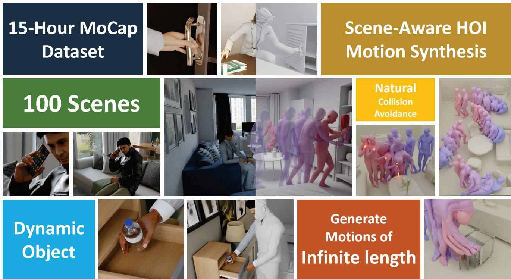
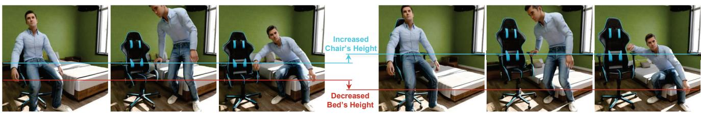
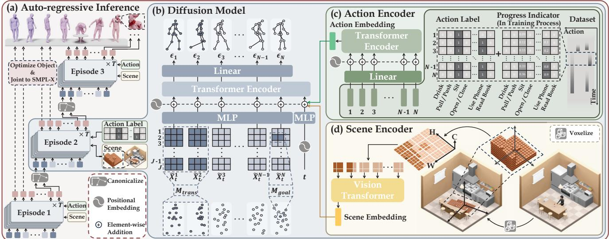
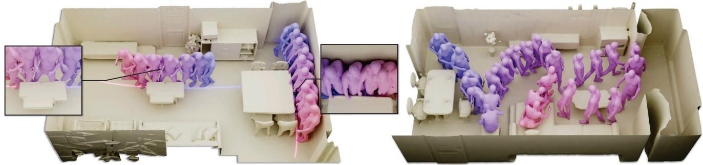
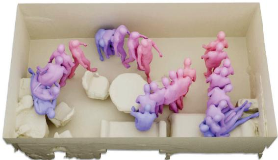
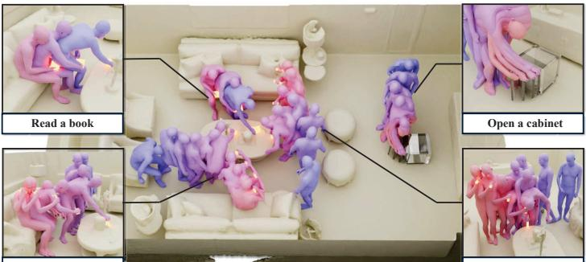

  
Figure 1. Overview of TRuMANS dataset and our Human-Scene Interaction (HSI) framework. We introduce the most extensive motioncaptured HSI dataset, featuring diverse HSIs precisely captured in 100 scene configurations. Benefiting from TRUMANS, we propose a novel method for real-time generation of HSIs with arbitrary length, surpassing all baselines and exhibiting superb zero-shot generalizability.

# Scaling Up Dynamic Human-Scene Interaction Modeling

Nan Jiang1,2 \*, Zhiyuan Zhang1,2 \*, Hongjie Li1, Xiaoxuan Ma3, Zan Wang4, Yixin Chen2, Tengyu Liu2, Yixin Zhu¹, Siyuan Huang2

1Institute for AI, Peking University 2National Key Lab of General AI, BIGAI 3School of Computer Science, CFCS, Peking University 4Beijing Institute of Technology\*Equal contributors yixin.zhu@pku.edu. cn, syhuang@bigai.ai https://jnnan.github.io/trumans/

## Abstract

Confronting the challenges of data scarcity and advanced motion synthesis in HSI modeling, we introduce the TRUMANS (Tracking Human Actions in Scenes) dataset alongside a novel HSI motion synthesis method. TRUMANS stands as the most comprehensive motion-captured HSI dataset currently available, encompassing over 15 hours of human interactions across 100 indoor scenes. It intricately captures whole-body human motions and part-level object dynamics, focusing on the realism of contact. This dataset is further scaled up by transforming physical environments into exact virtual models and applying extensive augmentations to appearance and motion for both humans and objects while maintaining interaction fidelity. Utilizing TRUMANS, we de-

vise a diffusion-based autoregressive model that efficiently generates Human-Scene Interaction (HSI) sequences of any length, taking into account both scene context and intended actions. In experiments, our approach shows remarkable zero-shot generalizability on a range of 3D scene datasets (e.g., PROX, Replica, ScanNet, ScanNet++), producing motions that closely mimic original motion-captured sequences, as confirmed by quantitative experiments and human studies.

## 1. Introduction

The intricate interplay between humans and their environment is a focal point in Human-Scene Interaction (HSI) [12], spanning diverse facets from object-level interaction [2, 25] to scene-level planning and interaction [1, 15, 16, 18]. While significant strides have been made, the field is notably hindered by a scarcity of high-quality datasets. Early datasets like PiGraphs [39] and PROX [16] initiated the exploration but are constrained by scalability and data quality. MoCap datasets [14, 30] prioritize high-quality human motion capture using sophisticated equipment like VICON. However, they often lack in capturing diverse and immersive HSIs. Scalable datasets recorded via RGBD videos offer broader utility but are impeded by lower quality in human pose and object tracking. The advent of synthetic datasets [1, 3, 4, 55] provides cost efficiency and adaptability but fails to encapsulate the full spectrum of realistic HSIs, particularly in capturing dynamic 3D contacts and object tracking.

To address these challenges, this work first introduces the TRUMANS (Tracking Human Actions in Scenes) dataset. TRUMANS emerges as the most extensive motion-captured HSI dataset, encompassing over 15 hours of diverse human interactions across 100 indoor scenes. It captures whole-body human motions and part-level object dynamics with an emphasis on the realism of contact. This dataset is further enhanced by digitally replicating physical environments into accurate virtual models. Extensive augmentations in appearance and motion are applied to both humans and objects, ensuring high fidelity in interaction.

Next, we devise a computational model tackling the above challenges by taking both scene and action as conditions. Specifically, our model employs an autoregressive conditional diffusion with scene and action embeddings as conditional input, capable of generating motions of arbitrary length. To integrate scene context, we develop an efficient local scene perceiver by querying the global scene occupancy on a localized basis, which demonstrates robust proficiency in 3D-aware collision avoidance while navigating cluttered scenes. To incorporate frame-wise action labels as conditions, we integrate temporal features into action segments, empowering the model to accept instructions anytime while adhering to the given action labels. This dual integration of scene and action conditions enhances the controllability of our method, providing a nuanced interface for synthesizing plausible long-term motions in 3D scenes.

We conducted a comprehensive cross-evaluation of both the TRUMANS dataset and our motion synthesis method. Comparing TRUMANS with existing ones, we demonstrate that TRUMANS markedly improves the performance of current state-of-the-art approaches. Moreover, our method, evaluated both qualitatively and quantitatively, exceeds existing motion synthesis methods in terms of quality and zero-shot generalizability on unseen 3D scenes, closely approximating the quality of original motion-captured data. Beyond motion synthesis, TRUMANS has been benchmarked for human pose and contact estimation tasks, demonstrating its versatility and establishing it as a valuable asset for a broad range of future research endeavors.

Summarized in Fig. 1, our work significantly advances HSI modeling. Our contributions are threefold: (i) The introduction of TRUMANS, an extensive MoCap HSI dataset capturing a wide array of human behaviors across 100 indoor scenes, noted for its diversity, quality, and scalability. (ii) The development of a diffusion-based autoregressive method for the real-time generation of HSIs, adaptable to any length and conditioned on 3D scenes and action labels. (iii) Through extensive experimentation, we demonstrate the robustness of TRUMANS and our proposed methods, capable of generating motions that rival MoCap quality, outperforming existing baselines, and exhibiting exceptional zero-shot generalizability in novel environments.

## 2. Related Work

HSI Datasets Capturing human motions in 3D scenes is pivotal, with an emphasis on the quality and scale of human interactions. Early work focused on capturing coarse 3D human motions using 2D keypoints [33] or RGBD videos [39]. To improve quality and granularity, datasets like PROX [16] use scene scans as constraints to estimate SMPL-X parameters [36] from RGBD videos. However, these image-based motion capture methods often result in noisy 3D poses.

Recent efforts have incorporated more sophisticated systems like IMU or optical MoCap (e.g., VICON) [14, 15, 17, 22, 30, 61], providing higher quality capture but limited in scalability. These are typically constrained to static scenes [15, 17, 55] or single objects [2, 22, 61], not fully representing complex real-world HSIs such as navigating cluttered spaces or managing concurrent actions.

Synthetic datasets [1, 4, 55] have attempted to fill this gap. Notable examples like BEDLAM [3] and CIRCLE [1] have been acknowledged for their cost efficiency and adaptability. These datasets integrate human motion data into synthetic scenes but fail to fully capture the range of realistic 3D HSIs, particularly in terms of dynamic object poses within their simulated environments.

Addressing these shortcomings, our work achieves a unique balance of quality and scalability. We replicate synthetic 3D environments in an optical motion capture setting, facilitating both accurate capture of humans and objects in complex HSIs and providing photorealistic renderings. This approach not only enhances the fidelity of the captured interactions but also extends the range of scenarios and environments that can be realistically simulated.

HSI Generation HSI generation involves single-frame human body [27, 60, 62] and temporal motion sequences [1, 17, 21, 26, 32, 35, 52–54, 57], utilizing models like conditional Variational Auto-Encoder (cVAE) [43] and diffusion models [19, 42, 44]. Recent advancements focus on generating arbitrary-length human motions through autoregressive methods [4, 7, 17, 31, 47, 59] and anchor frame generation [37, 52]. Additionally, enhancing generation controllability has involved semantic guidance, such as action labels [63] and language descriptions [55, 56].

Table 1. Comparison of TRuMANS with existing HSI datasets. TRUMANS differs by providing a diverse collection of HSIs, encompassing over 15 hours of interaction across 100 indoor scenes, along with photorealistic RGBD renderings in both multi-view and ego-view.
<table><tr><td>Datasets</td><td></td><td>Hours MoCap</td><td>Human Representation</td><td>Dynamic Object</td><td>No. of Scenes</td><td>Contact Annotations</td><td>RGBD</td><td>Segmentation</td><td>Multi- view</td><td>Ego- view</td></tr><tr><td>GTA_IM [4]</td><td>9.3</td><td></td><td>skeleton</td><td></td><td>10</td><td></td><td>√</td><td></td><td>√</td><td></td></tr><tr><td>PiGraphs [39]</td><td>2.0</td><td></td><td>skeleton</td><td></td><td>30</td><td></td><td>√</td><td></td><td></td><td></td></tr><tr><td>PROX [16]</td><td>0.9</td><td></td><td>SMPL-X</td><td></td><td>12</td><td>√</td><td>√</td><td>√</td><td></td><td></td></tr><tr><td>GRAB [46]</td><td>3.8</td><td>√</td><td>SMPL-X</td><td>√</td><td>-</td><td>√</td><td></td><td></td><td></td><td></td></tr><tr><td>SAMP [17]</td><td>1.7</td><td>√</td><td>SMPL-X</td><td></td><td>1</td><td></td><td></td><td></td><td>√</td><td></td></tr><tr><td>RICH [20]</td><td>0.8</td><td></td><td>SMPL-X</td><td></td><td>5</td><td>√</td><td>√</td><td></td><td>√</td><td></td></tr><tr><td>BEHAVE [2]</td><td>4.2</td><td></td><td>SMPL</td><td>√</td><td>一</td><td>√</td><td>√</td><td>√</td><td>√</td><td></td></tr><tr><td>CHAIRS [22]</td><td>17.3</td><td>√</td><td>SMPL-X</td><td>√</td><td>一</td><td>√</td><td>√</td><td></td><td>√</td><td></td></tr><tr><td>COUCH [61]</td><td>3.0</td><td>√</td><td>SMPL</td><td>√</td><td>一</td><td>√</td><td>√</td><td>√</td><td>√</td><td></td></tr><tr><td>iReplica [15]</td><td>0.8</td><td>√</td><td>SMPL</td><td>√</td><td>7</td><td>√</td><td>√</td><td></td><td>√</td><td>√</td></tr><tr><td>CIRCLE [1]</td><td>10.0</td><td>√</td><td>SMPL-X</td><td></td><td>9</td><td></td><td></td><td></td><td></td><td>√</td></tr><tr><td>TRUMANS</td><td>15.0</td><td>√</td><td>SMPL-X</td><td>√</td><td>100</td><td>√</td><td>√</td><td>√</td><td>√</td><td>√</td></tr></table>

In comparison, our work contributes a conditional generative model with an autoregressive mechanism to generate arbitrary-length motions, combining diffusion model capabilities with improved controllability in HSI generation.

## 3. TRUMANS Dataset

This section introduces TRUMANS, the most comprehensive MoCap dataset dedicated to 3D HSIs thus far. TRUMANS offers not only accurate 3D ground truths but also photorealistic renderings accompanied by various 2D ground truths, suitable for various perceptual tasks in HSI. This section details the dataset's statistics, data capture process, postprocessing method, and our augmentation pipeline.

## 3.1. Dataset Statistics

TRUMANS encompasses 15 hours of high-quality motioncaptured data, featuring complex HSIs within 3D scenes, where humans interact with clustered environments and dynamic objects. Captured at a rate of 30 Hz using the state-ofthe-art VICON MoCap system, the dataset comprises a total of 1.6 million frames. The HSI interactions in TRUMANS include 20 different types of common objects, ensuring a minimum of 5 distinct instances per type. The object categories encompass a range from static items like sofas and beds to dynamic objects such as bottles, and even articulated items including laptops and cabinets. TRUMANS incorporates performances from 7 participants (4 male and 3 female), who enacted various actions across 100 indoor scenes. These scenes span a variety of settings, such as dining rooms, living rooms, bedrooms, and kitchens, among others. For a comprehensive comparison of the TRUMANS dataset with existing HSI datasets, please refer to Tab. 1.

## 3.2. Scene-aware Motion Capture

Aiming to capture realistic and diverse Human-Scene Interaction (HSI) within 3D scenes, our approach emphasizes both data quality and diversity. We initiate this process by replicating 3D scenes and objects sourced from the 3D-FRONT [10] dataset and BlenderKit [6] within the physical environment housing our MoCap devices. To ensure the naturalness of human interactions during motion capture, we meticulously create real-world placeholders that correspond to the affordances of the objects in the synthetic environment. All movable objects are tagged with markers compatible with the VICON system, enabling precise tracking of their poses. Actors undergo training to familiarize themselves with interacting with these placeholders. During the capturing sessions, actors are prompted to perform actions randomly selected from a pre-defined pool, ensuring a variety of interactions.

Post-capture, the human poses are converted into the SMPL-X format [36], employing a vertex-to-vertex optimization technique. This method is instrumental in calculating vertex-to-vertex distances between the human meshes and object meshes, facilitating accurate per-vertex contact annotations. We utilize Blender [5] to render multi-view photorealistic RGBD videos, segmentation masks, and egocentric videos. To further diversify the renderings, we incorporate over 200 digital human models from Character Creator 4 [38], ensuring that objects strategically placed in scene backgrounds enhance the scene's realism without impeding human movement. For a detailed exposition of our capture and processing pipeline, refer to Appendix B.4.

## 3.3. MoCap Data Augmentation

Our data augmentation pipeline is designed to adapt human motions to changes in 3D scene objects, ensuring physical plausibility and accuracy in HSI. This process is vital in complex scenarios with concurrent or successive interactions;

  
(a) Original motion sequence  
(b) Augmented motion sequence  
Figure 2. Data augmentation for motion generation. This example highlights how human motion is adjusted to accommodate variations in object sizes. Specifically, the chair's height is increased, and the bed's height is decreased, each by 15cm. Our augmentation method proficiently modifies human motion to maintain consistent interactions despite these changes in object dimensions.

see Fig. 2. The pipeline consists of three main steps for integrating altered human motions into diverse 3D settings.

Calculate Target Joint We identify contact points between human joints and object meshes, and locate corresponding points on transformed or replaced objects. This step crucially adjusts the target joint's position to maintain the original interaction's contact relationship, ensuring realistic human-object interactions despite changes in object dimensions or positions.

Refine Trajectory To smooth out abrupt trajectory changes from the first step or Inverse Kinematic (IK) computations, we apply temporal smoothing to joint offsets, iteratively adjusting weights in adjacent frames. This refinement is critical for maintaining seamless motion, particularly in scenarios with multiple object interactions. Further details and theoretical background are discussed in Appendix B.5.

Recompute Motion with IK In the final step, we recompute human motion using the smoothed trajectories with an enhanced CCD-based [24] IK solver. This solver applies clipping and regularizations to bone movements, ensuring natural motion fluidity. Bones further from the root joint have increased rotational limits, reducing jitteriness and enhancing motion realism. For a complete description of these methods, refer to Appendix B.5.

## 4. Method

Utilizing the comprehensive TRUMANS dataset, we develop an autoregressive motion diffusion model. This model generates HSIs that are not only physically plausible in 3D scenes but also highly controllable through frame-wise action labels, capable of producing sequences of arbitrary length in real-time.

## 4.1. Problem Formulation and Notations

Given a 3D scene S, a goal location G, and action labels A, our objective is to synthesize a human motion sequence $\{ \mathcal { H } _ { i } \} _ { i = 1 } ^ { L }$ of arbitrary length L. When interacting with dynamic objects P, we also estimate the corresponding object pose sequence $\{ \mathcal { O } _ { i } \} _ { i = 1 } ^ { L }$

Human Human motion is represented as a sequence of parameterized human meshes {H} using the SMPL-X model [36]. The motion is initially generated as body joints locations $\{ X ^ { i } \} _ { i = 1 } ^ { L }$ , where $X ^ { i } \in \bar { \mathbb { R } ^ { J \times 3 } }$ represents $J = 2 4$ selected joints. These are fitted into the SMPL-X pose parameters θ, global orientation φ, hand poses h, and root translation r, resulting in the posed human mesh $\mathcal { H } \in \mathbb { R } ^ { 1 0 4 7 5 \times 3 }$

Conditions We formalize three types of conditions in our motion synthesis: 3D scene, goal location, and action labels. The 3D scene is represented by a voxel grid $S \in \{ 0 , 1 \} ^ { N _ { x } \times N _ { y } \times N _ { z } }$ , with 1 indicating reachable locations. Goal locations are 2D positions $\mathcal { G } \in \mathbb { R } ^ { 2 }$ for navigation, or 3D $\mathbb { R } ^ { 3 }$ for joint-specific control. Action labels are multi-hot vectors A ∈ $\{ 0 , 1 \} ^ { L \times N _ { A } }$ , indicating distinct actions.

Object When dynamic objects are involved, the object is represented by its point cloud P in canonical coordinates and its global rotation R and translation T. The dynamic object sequence $\{ O _ { i } \} _ { i = 1 } ^ { L }$ is then represented by sequences of rotations and translations $\{ R _ { i } , T _ { i } \} _ { i = 1 } ^ { L }$

## 4.2. Autoregressive Motion Diffusion

Our model architecture is illustrated in Fig. 3. Our goal is to generate human motions that are not only physically plausible in 3D scenes but also highly controllable by framewise action labels, achieving arbitrary length in real time. We employ an autoregressive diffusion strategy where a long motion sequence is progressively generated by episodes, each defined as a motion segment of $\boldsymbol { L _ { e p i } }$ frames. Based on the approach by Shafir et al. [40], successive episodes are generated by extending from the final k frames of the prior episode. For each new episode, the first k frames are set based on the previous episode's last k frames, with the noise on these transition frames zeroed out using a mask $\mathbf { M } _ { t r a n s }$ Our model aims to inpaint the remainder of each episode by filling in the unmasked frames.

To ensure precise control over character navigation and detailed interactions in each episode, we segment the overall goal G into discrete subgoals, represented as $\{ \mathcal { G } _ { i } \} _ { i = 1 } ^ { N _ { e p i } }$ where $N _ { e p i }$ denotes the number of episodes. For navigation, each subgoal $\mathcal { G } _ { i } \in \mathbb { R } ^ { 2 }$ dictates the desired xy-coordinates of the character's pelvis at an episode's conclusion. Mirroring the masking approach used in $\mathbf { M } _ { t r a n s } ,$ we align the pelvis's xy-coordinate in the episode's final frame to the respective subgoal, simultaneously masking the corresponding diffusion noise. As the z-coordinate is unspecified, the model is trained to infer the appropriate pelvis height based on the scene setup, such as making the character sit when the subgoal indicates a chair's location. This principle also governs fine-grained interactions, like grasping or pushing, where the subgoal $\mathcal { G } _ { i } \in \mathbb { R } ^ { 3 }$ is set to the precise 3D location, aligning the relevant hand joint to $\mathcal { G } _ { i }$ and masking joint noise accordingly. This specific masking on the subgoals is denoted as $\mathbf { M } _ { g o a l }$

  
Figure 3. Model architecture. (a) Our model employs an autoregressive diffusion sampling approach to generate arbitrary long-sequence motions. (b) Within each episode, we synthesize motion using DDPM integrated with a transformer architecture, taking the human joint locations as input. (c)(d) Action and scene conditions are encoded and forwarded to the first token, guiding the motion synthesis process.

We devise a conditional diffusion model for generating motions within each episode. This process involves sampling from a Markov noising process $\{ X _ { t } \} _ { t = 0 } ^ { T }$ . Starting with the original human joint data $X _ { 0 }$ drawn from the data distribution, Gaussian noise is added to the components of $X _ { 0 }$ not masked by $\mathbf { M } = \mathbf { M } _ { t r a n s } \cup \mathbf { M } _ { g o a l }$ . The unmasked components, represented as $( 1 - \mathbf { M } ) \odot X _ { t }$ or $\tilde { X } _ { t }$ (where $\odot$ is the Hadamard product), undergo a forward noising process

$$
q ( \tilde { X } _ { t } | \tilde { X } _ { t - 1 } ) = \mathcal { N } ( \tilde { X } _ { t } ; \sqrt { \alpha _ { t } } \tilde { X } _ { t - 1 } , ( 1 - \alpha _ { t } ) I ) ,\tag{1}
$$

with $\alpha _ { t } \in ( 0 , 1 )$ denoting hyper-parameters related to the variance schedule.

Motion data generation within our model employs a reversed diffusion process to gradually denoise $\tilde { X } _ { T }$ . Consistent with established diffusion model training methodologies, noise $\epsilon _ { t }$ is applied to obtain ${ \tilde { X } } _ { t } ,$ and a neural network $\epsilon _ { \theta } ( \tilde { X } _ { t } , t , { S } , \mathcal { A } )$ is constructed to approximate this noise. The learning objective for $\epsilon _ { \theta }$ follows a simple objective [19]

$$
\mathcal { L } = E _ { \tilde { X } _ { 0 } \sim q ( \tilde { X } _ { 0 } \vert \mathcal { C } ) , t \sim \left[ 1 , T \right] } \left. \epsilon - \epsilon _ { \theta } ( \tilde { X } _ { t } , t , \mathcal { S } , \mathcal { A } ) \right. _ { 2 } ^ { 2 } .\tag{2}
$$

We adopt the Transformer model architecture [48], wherein the first token encodes information about the diffusion step, scene, and action, and subsequent tokens represent the noisy joint locations for each frame in the current episode. Throughout the sampling process, the model predicts the noise applied to each joint element. Once this sampling phase concludes, the joint locations are translated into SMPL-X parameters via a lightweight MLP. This translation is further refined through an optimization process, ensuring accurate alignment with the human joint data.

Upon generating the human motion sequence $\{ \mathcal { H } _ { i } \} _ { i = 0 } ^ { L } ,$ we optimize the trajectory of the interacting object $\{ \mathcal { O } _ { i } \} _ { i = 0 } ^ { L }$ to ensure natural Human-Object Interactions (HOIs). To enhance the realism of the interaction, we further fine-tune the object's pose in each frame to minimize the variance in distance between the object and the interacting hand [11].

## 4.3. Local Scene Perceiver

As illustrated in Fig. 3(d), the local scene perceiver is essential for embedding the local scene context, serving as a condition for motion generation. This component analyzes the scene using a local occupancy grid centered around the subgoal location for the current episode. Starting with the global occupancy grid S of the scene, where each cell's boolean value indicates reachability (1 for reachable, 0 otherwise), we focus on the i-th episode's subgoal $\mathcal { G } _ { i } = ( x , y , z )$ or (x, y). A local occupancy grid is constructed around $( x , y )$ , extending vertically from 0 to 1.8m. The grid's orientation aligns with the yaw of the agent's pelvis at the episode's start, and cell values are derived by querying the global occupancy grid.

The voxel grid is encoded using a Vision Transformer (ViT) [9]. We prepare the tokens by dividing the local occupancy grid into patches along the xy-plane, considering the z-axis as feature channels. These patches are then fed into the ViT model. The resulting scene embedding from this process is utilized as the condition for the diffusion model.

Discretizing the scene into a grid format is a necessary trade-off to boost training efficiency and practicality in our HSI method. Although directly generating the local occupancy grid from the scene mesh in real-time is technically feasible, it substantially prolongs training time. For instance, employing the checksign function from Kaolin results in a training process that is approximately 300 times slower, rendering it impractical. Despite this simplification, our empirical results demonstrate that the quality of motion generation is not significantly impacted by this approximation.

## 4.4. Frame-wise Action Embedding

Our method distinguishes itself from prior approaches by incorporating frame-wise action labels into the long-term motion synthesis process, rather than generating a complete motion sequence from a singular action description. In our framework, a particular action can span multiple episodes, necessitating the model's capability to comprehend the evolution and progression of an action over time.

To enhance our model's understanding of action progression, we incorporate a progress indicator $\mathcal { A } _ { i n d } \in \mathbb { R } ^ { \tilde { L } _ { e p i } \times N _ { A } }$ into the frame-wise action labels, as depicted in Fig. 3(c). This indicator is realized by appending a real number n ∈ [0, 1] to the original action labels, representing the action's advancement from start to finish. As a result, action labels take on values in 0  [1, 2] post-addition. For instance, during a drinking action from frame i to j, we modify the (0, 1) label by adding a value that linearly progresses from 0 to 1 across this interval. Thus, at the onset of drinking (frame i), the label is augmented to 1, gradually increasing to 2 by frame j, the action's conclusion. This nuanced labeling enables our model to seamlessly handle actions that span multiple episodes, significantly enhancing the realism and fluidity of the synthesized motion sequences.

The final action embedding is obtained by processing the progress-augmented action label $\mathcal { A } \in \mathbb { R } ^ { L _ { e p i } \times \bar { N } _ { A } }$ through a Transformer encoder. Each frame's action label $\mathcal { A } _ { i } \in \bar { \mathbb { R } } ^ { N _ { A } }$ is treated as an individual token in the Transformer's input. The feature output from the last token is then passed through an MLP to generate the final action embedding.

## 5. Experiments

This section presents our evaluation of both TRUMANS and our proposed motion synthesis method, focusing on actionconditioned HSI generation. Additionally, we demonstrate how TRUMANS contributes to advancements in state-of-theart motion synthesis methods.

## 5.1. Experiment Settings

Our experimental evaluation of HSI generation quality is conducted under two distinct settings: static and dynamic. The static setting assesses synthesized motions in environments without dynamic interactable objects, concentrating on locomotion and interactions with static objects. Conversely, the dynamic setting evaluates motion synthesis involving interactions with dynamic objects. In both scenarios, we compare the performance of methods trained on TRUMANS with those trained on existing datasets [46, 62], offering a thorough insight into both the model's efficacy and the dataset's impact.

## 5.2. Baselines and Ablations

Baselines-static setting We compare TRUMANS with PROX [62], a dataset featuring human activities in indoor scenes. To ensure a fair comparison, we retain only the locomotion and scene interaction of static objects in TRUMANS, such as sitting and lying down. Baseline methods for this setting include cVAE [52], SceneDiff [21], and GMD [23].

Baselines-dynamic setting We compare TRUMANS with GRAB [46], known for capturing full-body grasping actions with human and object pose sequences. Here, the focus is on motions of interaction with dynamic objects, like drinking water and making phone calls, present in both datasets. We compare our method against IMoS [11] and GOAL [47], reproduced using their original implementations.

Ablations In our ablative studies, we examine the impact of disabling the action progress indicator $\mathcal { A } _ { i n d }$ in our model. Additionally, to assess the significance of our data augmentation technique, we perform experiments using a nonaugmented version of TRUMANS. For reference, our standard experiments employ the augmented TRUMANS, where each object is transformed into two different variations.

Our evaluation encompasses 10 unseen indoor scenes sourced from PROX [16], Replica [45], Scannet [8], and Scannet++ [58]. These scenes are adapted to the requirements of different methods, with modifications including conversion to point cloud format, voxelization, or maintaining their original mesh format. To evaluate the diversity of the synthesized motions, each method is tasked with generating five unique variations for each trajectory.

Furthermore, we conduct a qualitative comparison of our method with other recent approaches, such as SAMP [17], DIMOS [64], LAMA [25], and Wang et al. [54], based on the feasibility of reproducing these methods. Detailed findings from this comparison are discussed in Appendix A.4.

## 5.3. Evaluation Metrics

In the static setting, we employ Contact and Penetration metrics, as recommended by Zhao et al. [64], to evaluate foot slide and object penetration issues in synthesized motions.

  
(c) Avoid colliding with objects in the scene  
(d) Long term motion with multiple milestones  
Figure 4. Visualization of motion generation. Leveraging local scene context and action instructions as conditions, our method demonstrates its proficiency in (a) initiating motion given the surrounding environment, (b) dynamically interacting with objects, (c) avoiding collisions during motion progression, and (d) robustly synthesizing long-term motion. The depicted scenes are selected from PROX, Replica, and FRONT3D-test datasets, none of which were included in the training phase. For qualitative results, please refer to the Supplementary Video.

  
(a) Start from anywhere in any pose

  
Pick up the phone from the table and make a phone call  
Pick up the bottle from the table and drink

(b) Interact dynamically with the objects.

These metrics measure the degree to which the synthesized motions conform to the specified scene. For the dynamic setting, we utilize FID and Diversity metrics, commonly used in language and action-guided motion generation tasks [11, 48]. These metrics measure the quality and diversity of HOI motion generation involving various small objects.

Additionally, we introduce a novel MoCap-differentiating human study for evaluation. Participants are presented with five sequences, one of which is motion-captured, and are asked to identify the MoCap sequence. The likelihood of correctly identifying the MoCap sequence serves as an indicator of the synthesized motion's realism. We quantify this aspect through the Success Rate of Discrimination (SucRate-Dis), reflecting the percentage of participants who accurately identify the MoCap sequence.

## 5.4. Results and Analysis

Fig. 4 showcases our method's qualitative strengths. It adeptly manages complex scene configurations, including initiating context-aware motion, avoiding collisions during movement, and generating extended motions, especially in HOI scenarios involving dynamic object interaction.

In the static setting (Tab. 2), our method, trained on TRUMANS, surpasses baselines across most metrics. Notably, disabling data augmentation leads to increased penetration, suggesting the efficacy of augmented data in producing physically plausible motions. Compared to models trained on PROX, ours shows significant improvements, highlighting TRUMANS as a high-quality resource for HSI research.

Table 2. Evaluation of locomotion and scene-level interaction. We compare performances on TRUMANS and PROX [16].
<table><tr><td>Method</td><td>Cont.↑</td><td>Penemean</td><td>Penemax</td><td>Dis. suc.↓</td></tr><tr><td>Wang et al. [52] SceneDiff [21] GMD [23] Ours</td><td>0.969 0.912 0.931 0.992</td><td>1.935 1.691 2.867 1.820</td><td>14.33 17.48 21.30 11.74</td><td>0.581 0.645 0.871 0.258</td></tr><tr><td>Ours w/o aug. Wang et al. [52] SceneDiff [21] GMD [23] Ours</td><td>0.991 0.688 0.712 0.702 0.723</td><td>2.010 4.935 3.267 4.867 4.820</td><td>15.52 34.10 27.48 38.30 31.74</td><td>0.903 0.935 0.968 0.903</td></tr></table>

Tab. 3 illustrates results in the dynamic setting, where our approach excels in 3D HOI generation. High penetration rates with GRAB-trained methods indicate its limitations in scene-adherent HOI motions, while TRUMANS captures more detailed interactions. The absence of the progress indicator $\mathcal { A } _ { i n d }$ leads to method failure, as evidenced by the ablation study.

Table 3. Evaluation of object-level interaction. We compare performances on TRUMANS and GRAB [46]. The definition of "Real" follows the one defined in Tevet et al. [48]
<table><tr><td>Method</td><td>FID↓</td><td>Diversity→</td><td> $\mathrm { P e n e } _ { s c e n e } \downarrow$ </td><td>Dis. suc.↓</td></tr><tr><td>Real-TRUMANS GOAL [47] IMoS [11] Ours</td><td>0.512 0.711</td><td>2.734 2.493 2.667</td><td>34.10 37.48</td><td>0.801 0.774</td></tr><tr><td>Ours -  $\mathcal { A } _ { i n d }$ </td><td>0.313 2.104</td><td>2.693 1.318</td><td>11.74 10.62</td><td>0.226 1.000</td></tr><tr><td>Real-GRAB [46]</td><td></td><td>2.155</td><td></td><td></td></tr><tr><td>GOAL [47]</td><td>0.429</td><td>2.180</td><td>44.09</td><td>0.801</td></tr><tr><td>IMoS [11]</td><td>0.410</td><td>2.114</td><td></td><td></td></tr><tr><td>Ours</td><td>0.362</td><td>2.150</td><td>41.50 34.41</td><td>0.774 0.516</td></tr></table>

Human studies further affirm the quality of our method. Only about a quarter of participants could distinguish our synthesized motions from real MoCap data, nearly aligning with the 1/5 SucRateDis of random guessing. This suggests that our synthesized motions are nearly indistinguishable from high-quality MoCap data. Comparative evaluations with recent methods [17, 25, 54, 64] show our model's superiority, outperforming the second-best model by over 30% in support rate. For more detailed results, please refer to the Supplementary Video.

Real-time Control Our method can sample an episode of motion (1.6 seconds at 10 FPS) in 0.7 seconds on an A800 GPU. This efficiency enables uninterrupted long-term motion generation with a consistent control signal. For new control signals, to minimize the 0.7-second delay, we implement an incremental sampling strategy: initially, 2 frames are sampled immediately, followed by sampling 4 frames during their execution, increasing exponentially until 16 frames are sampled. This approach ensures a balance between real-time control and smooth motion continuity. Please refer to our Supplementary Video for a visual demonstration.

## 5.5. Additional Image-based Tasks

TRUMANS, with its photo-realistic renderings and per-vertex 3D contact annotations, is also suited for various imagebased tasks. We focus on its application in 3D human mesh estimation and contact estimation.

3D Human Mesh Estimation For reconstructing 3D human body meshes from input images, we utilize the state-ofthe-art method [29] as a baseline. We evaluate if including TRUMANS in training enhances performance on the 3DPW dataset [50]. Following Ma et al. [29], we report MPJPE, PA-MPJPE, and MPVE for the estimated poses and meshes.

3D Contact Estimation This task involves predicting pervertex 3D contact on the SMPL mesh [28] from an input image. We compare TRUMANS against RICH [20] and DA-MON [49], both featuring vertex-level 3D contact labels with RGB images. Utilizing BSTRO [20] for RICH and DECO [49] for DAMON, we measure precision, recall, F1 score, and geodesic error following the literature [20, 49].

Results and Analysis Quantitative results in Tab. 4 reveal that integrating TRUMANS with 3DPW significantly improves human mesh estimation. Contact estimation outcomes, presented in Tab. 5, show enhanced performance with TRUMANS, particularly in reducing geodesic error. These results suggest that combining synthetic data from TRUMANS with real-world data substantially benefits image-based tasks. For detailed experimental insights, see Appendix A.5.

Table 4. Performance of Ma et al. [29] trained on 3DPW [50] combined with TRUMANS in different ratios.
<table><tr><td>Training Data</td><td>MPVE↓</td><td>MPJPE↓</td><td>PA-MPJPE↓</td></tr><tr><td>3DPW [50]</td><td>101.3</td><td>88.2</td><td>54.4</td></tr><tr><td>3DPW+T (2:1)</td><td>88.8</td><td>77.2</td><td>46.4</td></tr><tr><td>3DPW+T (1:1)</td><td>78.5</td><td>78.5</td><td>46.4</td></tr></table>

Table 5. Performance of BSTRO [20] and DECO [49] trained on RICH [20] and DAMON [49] combined with TRUMANS, respectively.
<table><tr><td>Training Data</td><td>Prec↑</td><td>Rec↑</td><td>F1↑</td><td>geo err↓</td></tr><tr><td>RICH [20] R+T (2:1) R+T (1:1)</td><td>0.6823 0.7087 0.7137</td><td>0.7427 0.7370 0.7286</td><td>0.6823 0.6927 0.6923</td><td>10.27 9.593 9.459</td></tr><tr><td>DAMON [49] D+T (2:1) D+T (1:1)</td><td>0.6388 0.6472</td><td>0.5232 0.5237 0.4806</td><td>0.5115 0.5148 0.4972</td><td>25.06 21.54 18.87</td></tr></table>

## 6. Conclusion

We introduce TRUMANS, a large-scale mocap dataset, alongside a novel motion synthesis method, addressing scalability, data quality, and advanced motion synthesis challenges in HSI modeling. As the most comprehensive dataset in its category, TRUMANS encompasses diverse human interactions with dynamic and articulated objects within 100 indoor scenes. Our diffusion-based autoregressive motion synthesis method, leveraging TRUMANS, is capable of real-time generation of HSI sequences of arbitrary length. Experimental results indicate that the motions generated by our method closely mirror the quality of the original MoCap data.

Acknowledgment The authors would like to thank NVIDIA for their generous support of GPUs and hardware. This work is supported in part by the National Science and Technology Major Project (2022ZD0114900) and the Beijing Nova Program.

## References

[1] Joao Pedro Araújo, Jiaman Li, Karthik Vetrivel, Rishi Agarwal, Jiajun Wu, Deepak Gopinath, Alexander William Clegg, and Karen Liu. Circle: Capture in rich contextual environments. In Conference on Computer Vision and Pattern Recognition (CVPR), 2023. 1, 2, 3

[2] Bharat Lal Bhatnagar, Xianghui Xie, Ilya A Petrov, Cristian Sminchisescu, Christian Theobalt, and Gerard Pons-Moll. Behave: Dataset and method for tracking human object interactions. In Conference on Computer Vision and Pattern Recognition (CVPR), 2022. 1, 2, 3, A2

[3] Michael J Black, Priyanka Patel, Joachim Tesch, and Jinlong Yang. Bedlam: A synthetic dataset of bodies exhibiting detailed lifelike animated motion. In Conference on Computer Vision and Pattern Recognition (CVPR), 2023. 2

[4] Zhe Cao, Hang Gao, Karttikeya Mangalam, Qi-Zhi Cai, Minh Vo, and Jitendra Malik. Long-term human motion prediction with scene context. In European Conference on Computer Vision (ECCV), 2020. 2, 3

[5] Blender Online Community. Blender - a 3d modelling and rendering package, 2018. 3

[6] Blender Online Community. Blenderkit. https : //www . blenderkit.com/,2023.3,A3

[7] Enric Corona, Albert Pumarola, Guillem Alenyà, and Francesc Moreno-Noguer. Context-aware human motion prediction. In Conference on Computer Vision and Pattern Recognition (CVPR), 2020. 2

[8] Angela Dai, Angel X Chang, Manolis Savva, Maciej Halber, Thomas Funkhouser, and Matthias Nießner. Scannet: Richlyannotated 3d reconstructions of indoor scenes. In Conference on Computer Vision and Pattern Recognition (CVPR), 2017. 6

[9] Alexey Dosovitskiy, Lucas Beyer, Alexander Kolesnikov, Dirk Weissenborn, Xiaohua Zhai, Thomas Unterthiner, Mostafa Dehghani, Matthias Minderer, Georg Heigold, Sylvain Gelly, Jakob Uszkoreit, and Neil Houlsby. An image is worth 16x16 words: Transformers for image recognition at scale. In International Conference on Learning Representations (ICLR), 2021. 5

[10] Huan Fu, Bowen Cai, Lin Gao, Ling-Xiao Zhang, Jiaming Wang, Cao Li, Qixun Zeng, Chengyue Sun, Rongfei Jia, Binqiang Zhao, et al. 3d-front: 3d furnished rooms with layouts and semantics. In International Conference on Computer Vision (ICCV), 2021. 3, A3

[11] Anindita Ghosh, Rishabh Dabral, Vladislav Golyanik, Christian Theobalt, and Philipp Slusallek. Imos: Intent-driven full-body motion synthesis for human-object interactions. In Computer Graphics Forum, 2023. 5, 6, 7, 8

[12] James J Gibson. The perception of the visual world. Houghton Mifflin, 1950. 1

[13] Chuan Guo, Shihao Zou, Xinxin Zuo, Sen Wang, Wei Ji Xingyu Li, and Li Cheng. Generating diverse and natural 3d human motions from text. In Conference on Computer Vision and Pattern Recognition (CVPR), 2022. A1

[14] Vladimir Guzov, Aymen Mir, Torsten Sattler, and Gerard Pons-Moll. Human poseitioning system (hps): 3d human pose estimation and self-localization in large scenes from

body-mounted sensors. In Conference on Computer Vision and Pattern Recognition (CVPR), 2021. 2

[15] Vladimir Guzov, Julian Chibane, Riccardo Marin, Yannan He, Yunus Saracoglu, Torsten Sattler, and Gerard Pons-Moll. Interaction replica: Tracking human-object interaction and scene changes from human motion. In International Conference on 3D Vision (3DV), 2023. 1, 2, 3, A2

[16] Mohamed Hassan, Vasileios Choutas, Dimitrios Tzionas, and Michael J Black. Resolving 3d human pose ambiguities with 3d scene constraints. In International Conference on Computer Vision (ICCV), 2019. 1, 2, 3, 6, 7

[17] Mohamed Hassan, Duygu Ceylan, Ruben Villegas, Jun Saito, Jimei Yang, Yi Zhou, and Michael Black. Stochastic sceneaware motion prediction. In International Conference on Computer Vision (ICCV), 2021. 2, 3, 6, 8, A1, A2

[18] Mohamed Hassan, Partha Ghosh, Joachim Tesch, Dimitrios Tzionas, and Michael J Black. Populating 3d scenes by learning human-scene interaction. In Conference on Computer Vision and Pattern Recognition (CVPR), 2021. 1

[19] Jonathan Ho, Ajay Jain, and Pieter Abbeel. Denoising diffusion probabilistic models. In Advances in Neural Information Processing Systems (NeurIPS), 2020. 2, 5

[20] Chun-Hao P Huang, Hongwei Yi, Markus Höschle, Matvey Safroshkin, Tsvetelina Alexiadis, Senya Polikovsky, Daniel Scharstein, and Michael J Black. Capturing and inferring dense full-body human-scene contact. In Conference on Computer Vision and Pattern Recognition (CVPR), 2022. 3, 8, A2

[21] Siyuan Huang, Zan Wang, Puhao Li, Baoxiong Jia, Tengyu Liu, Yixin Zhu, Wei Liang, and Song-Chun Zhu. Diffusionbased generation, optimization, and planning in 3d scenes. In Conference on Computer Vision and Pattern Recognition (CVPR), 2023. 2, 6, 7, A1

[22] Nan Jiang, Tengyu Liu, Zhexuan Cao, Jieming Cui, Zhiyuan Zhang, Yixin Chen, He Wang, Yixin Zhu, and Siyuan Huang. Full-body articulated human-object interaction. In International Conference on Computer Vision (ICCV), 2023. 2, 3

[23] Korrawe Karunratanakul, Konpat Preechakul, Supasorn Suwajanakorn, and Siyu Tang. Guided motion diffusion for controllable human motion synthesis. In Conference on Computer Vision and Pattern Recognition (CVPR), 2023. 6, 7, A1

[24] Ben Kenwright. Inverse kinematics-cyclic coordinate descent (ccd). Journal of Graphics Tools, 2012. 4

[25] Jiye Lee and Hanbyul Joo. Locomotion-action-manipulation: Synthesizing human-scene interactions in complex 3d environments. In International Conference on Computer Vision (ICCV), 2023. 1, 6, 8, A1

[26] Jiaman Li, Jiajun Wu, and C Karen Liu. Object motion guided human motion synthesis. arXiv preprint arXiv:2309.16237, 2023.2

[27] Xueting Li, Sifei Liu, Kihwan Kim, Xiaolong Wang, Ming-Hsuan Yang, and Jan Kautz. Putting humans in a scene: Learning affordance in 3d indoor environments. In Conference on Computer Vision and Pattern Recognition (CVPR), 2019.2

[28] Matthew Loper, Naureen Mahmood, Javier Romero, Gerard Pons-Moll, and Michael J. Black. SMPL: A skinned multi-

person linear model. ACM Transactions on Graphics (TOG), 2015.8

[29] Xiaoxuan Ma, Jiajun Su, Chunyu Wang, Wentao Zhu, and Yizhou Wang. 3d human mesh estimation from virtual markers. In Conference on Computer Vision and Pattern Recognition (CVPR), 2023. 8

[30] Christian Mandery, Ömer Terlemez, Martin Do, Nikolaus Vahrenkamp, and Tamim Asfour. The kit whole-body human motion database. In International Conference on Robotics and Automation (ICRA), 2015. 2

[31] Wei Mao, Miaomiao Liu, Richard Hartley, and Mathieu Salzmann. Contact-aware human motion forecasting. In Advances in Neural Information Processing Systems (NeurIPS), 2022 2

[32] Aymen Mir, Xavier Puig, Angjoo Kanazawa, and Gerard Pons-Moll. Generating continual human motion in diverse 3d scenes. In International Conference on 3D Vision (3DV) 2023.2

[33] Aron Monszpart, Paul Guerrero, Duygu Ceylan, Ersin Yumer, and Niloy J Mitra. imapper: interaction-guided scene mapping from monocular videos. ACM Transactions on Graphics (TOG), 2019. 2

[34] Gyeongsik Moon and Kyoung Mu Lee. I21-meshnet: Imageto-lixel prediction network for accurate 3d human pose and mesh estimation from a single rgb image. In European Conference on Computer Vision (ECCV), 2020. A2

[35] Liang Pan, Jingbo Wang, Buzhen Huang, Junyu Zhang, Haofan Wang, Xu Tang, and Yangang Wang. Synthesizing physically plausible human motions in 3d scenes. In International Conference on 3D Vision (3DV), 2023. 2

[36] Georgios Pavlakos, Vasileios Choutas, Nima Ghorbani, Timo Bolkart, Ahmed AA Osman, Dimitrios Tzionas, and Michael J Black. Expressive body capture: 3d hands, face, and body from a single image. In Conference on Computer Vision and Pattern Recognition (CVPR), 2019. 2, 3, 4, A4

[37] Huaijin Pi, Sida Peng, Minghui Yang, Xiaowei Zhou, and Hujun Bao. Hierarchical generation of human-object interactions with diffusion probabilistic models. In International Conference on Computer Vision (ICCV), 2023. 3

[38] Reallusion. Character creator 4. https : / / www . reallusion.com/character-creator/,2023. 3, A3

[39] Manolis Savva, Angel X Chang, Pat Hanrahan, Matthew Fisher, and Matthias Nießner. Pigraphs: learning interaction snapshots from observations. ACM Transactions on Graphics (TOG), 2016. 2, 3

[40] Yonatan Shafir, Guy Tevet, Roy Kapon, and Amit H Bermano. Human motion diffusion as a generative prior. arXiv preprint arXiv:2303.01418, 2023. 4

[41] Vicon Software. Shogun. https://www.vicon.com/ software/shogun/,2023.A3

[42] Jascha Sohl-Dickstein, Eric Weiss, Niru Maheswaranathan, and Surya Ganguli. Deep unsupervised learning using nonequilibrium thermodynamics. In International Conference on Machine Learning (ICML), 2015. 2

[43] Kihyuk Sohn, Honglak Lee, and Xinchen Yan. Learning structured output representation using deep conditional gener-

ative models. In Advances in Neural Information Processing Systems (NeurIPS), 2015. 2

[44] Yang Song and Stefano Ermon. Generative modeling by estimating gradients of the data distribution. In Advances in Neural Information Processing Systems (NeurIPS), 2019. 2

[45] Julian Straub, Thomas Whelan, Lingni Ma, Yufan Chen, Erik Wijmans, Simon Green, Jakob J Engel, Raul Mur-Artal, Carl Ren, Shobhit Verma, et al. The replica dataset: A digital replica of indoor spaces. arXiv preprint arXiv:1906.05797, 2019.6

[46] Omid Taheri, Nima Ghorbani, Michael J Black, and Dimitrios Tzionas. Grab: A dataset of whole-body human grasping of objects. In European Conference on Computer Vision (ECCV), 2020.3,6,8

[47] Omid Taheri, Vasileios Choutas, Michael J. Black, and Dimitrios Tzionas. GOAL: Generating 4D whole-body motion for hand-object grasping. In Conference on Computer Vision and Pattern Recognition (CVPR), 2022. 2, 6, 8, A1

[48] Guy Tevet, Sigal Raab, Brian Gordon, Yoni Shafir, Daniel Cohen-or, and Amit Haim Bermano. Human motion diffusion model. In International Conference on Learning Representations (ICLR), 2022. 5, 7, 8

[49] Shashank Tripathi, Agniv Chatterjee, Jean-Claude Passy, Hongwei Yi, Dimitrios Tzionas, and Michael J Black. Deco: Dense estimation of 3d human-scene contact in the wild. In International Conference on Computer Vision (ICCV), 2023. 8, A2

[50] Timo Von Marcard, Roberto Henschel, Michael J Black, Bodo Rosenhahn, and Gerard Pons-Moll. Recovering accurate 3d human pose in the wild using imus and a moving camera. In European Conference on Computer Vision (ECCV), 2018. 8, A2

[51] Dongkai Wang and Shiliang Zhang. 3d human mesh recovery with sequentially global rotation estimation. In International Conference on Computer Vision (ICCV), 2023. A2

[52] Jiashun Wang, Huazhe Xu, Jingwei Xu, Sifei Liu, and Xiaolong Wang. Synthesizing long-term 3d human motion and interaction in 3d scenes. In Conference on Computer Vision and Pattern Recognition (CVPR), 2021. 2, 3, 6, 7, A1

[53] Jingbo Wang, Sijie Yan, Bo Dai, and Dahua Lin. Scene-aware generative network for human motion synthesis. In Conference on Computer Vision and Pattern Recognition (CVPR), 2021.

[54] Jingbo Wang, Yu Rong, Jingyuan Liu, Sijie Yan, Dahua Lin, and Bo Dai. Towards diverse and natural scene-aware 3d human motion synthesis. In Conference on Computer Vision and Pattern Recognition (CVPR), 2022. 2, 6, 8, A1

[55] Zan Wang, Yixin Chen, Tengyu Liu, Yixin Zhu, Wei Liang, and Siyuan Huang. Humanise: Language-conditioned human motion generation in 3d scenes. In Advances in Neural Information Processing Systems (NeurIPS), 2022. 2, 3

[56] Zeqi Xiao, Tai Wang, Jingbo Wang, Jinkun Cao, Wenwei Zhang, Bo Dai, Dahua Lin, and Jiangmiao Pang. Unified human-scene interaction via prompted chain-of-contacts. arXiv preprint arXiv:2309.07918, 2023. 3

[57] Sirui Xu, Zhengyuan Li, Yu-Xiong Wang, and Liang-Yan Gui. InterDiff: Generating 3d human-object interactions with

physics-informed diffusion. In International Conference on Computer Vision (ICCV), 2023. 2

[58] Chandan Yeshwanth, Yueh-Cheng Liu, Matthias Nießner, and Angela Dai. Scannet++: A high-fidelity dataset of 3d indoor scenes. In International Conference on Computer Vision (ICCV), 2023. 6

[59] Jianrong Zhang, Yangsong Zhang, Xiaodong Cun, Shaoli Huang, Yong Zhang, Hongwei Zhao, Hongtao Lu, and Xi Shen. T2m-gpt: Generating human motion from textual descriptions with discrete representations. In Conference on Computer Vision and Pattern Recognition (CVPR), 2023. 2

[60] Siwei Zhang, Yan Zhang, Qianli Ma, Michael J Black, and Siyu Tang. Generating person-scene interactions in 3d scenes. In International Conference on 3D Vision (3DV), 2020. 2

[61] Xiaohan Zhang, Bharat Lal Bhatnagar, Sebastian Starke, Vladimir Guzov, and Gerard Pons-Moll. Couch: Towards controllable human-chair interactions. In European Conference on Computer Vision (ECCV), 2022. 2, 3

[62] Yan Zhang, Mohamed Hassan, Heiko Neumann, Michael J Black, and Siyu Tang. Generating 3d people in scenes without people. In Conference on Computer Vision and Pattern Recognition (CVPR), 2020. 2, 6

[63] Kaifeng Zhao, Shaofei Wang, Yan Zhang, Thabo Beeler, and Siyu Tang. Compositional human-scene interaction synthesis with semantic control. In European Conference on Computer Vision (ECCV), 2022. 3

[64] Kaifeng Zhao, Yan Zhang, Shaofei Wang, Thabo Beeler, and Siyu Tang. Synthesizing diverse human motions in 3d indoor scenes. In International Conference on Computer Vision (ICCV), 2023. 6, 8, A1

[65] Yi Zhou, Connelly Barnes, Jingwan Lu, Jimei Yang, and Hao Li. On the continuity of rotation representations in neural networks. In Conference on Computer Vision and Pattern Recognition (CVPR), 2019. A1